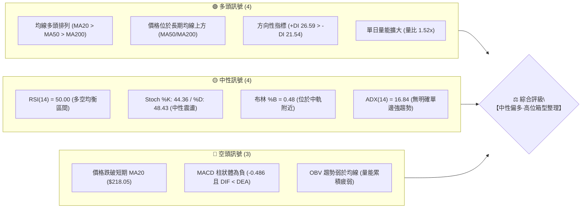
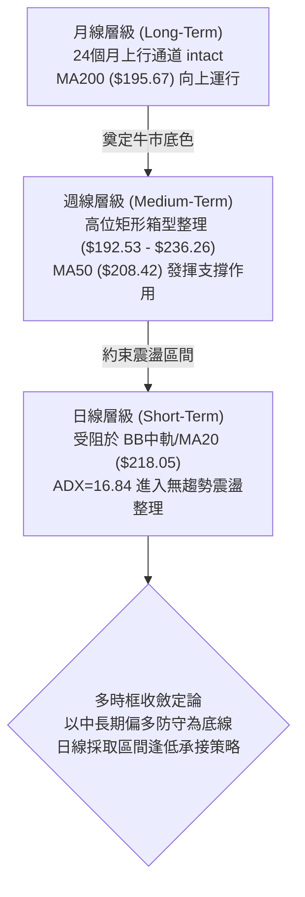
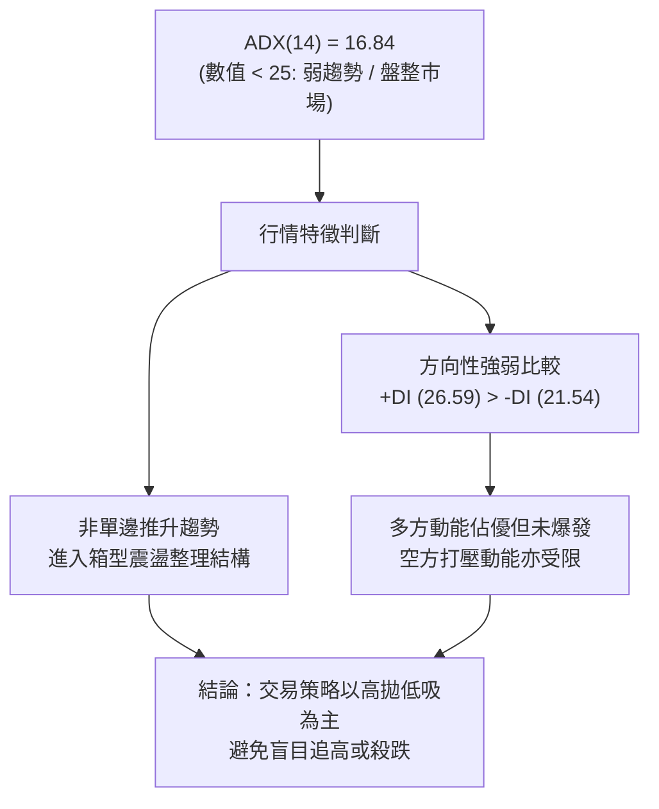
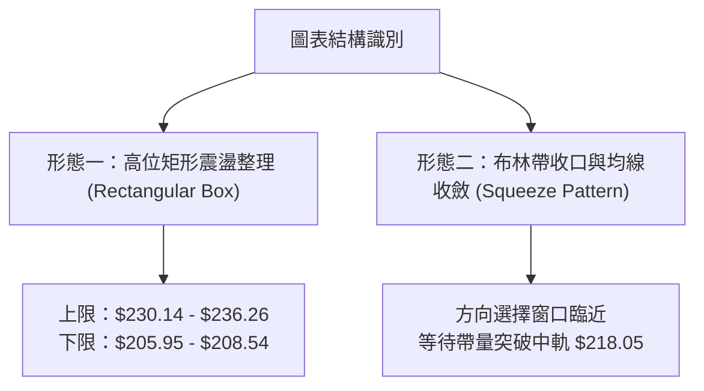
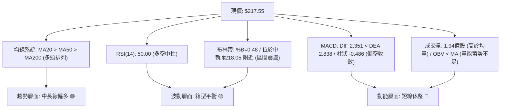
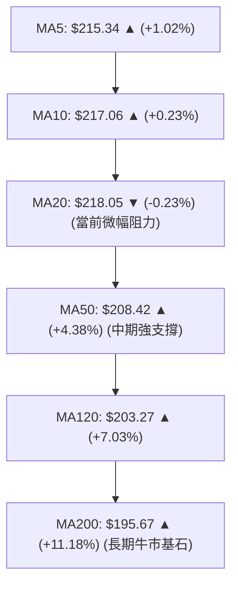
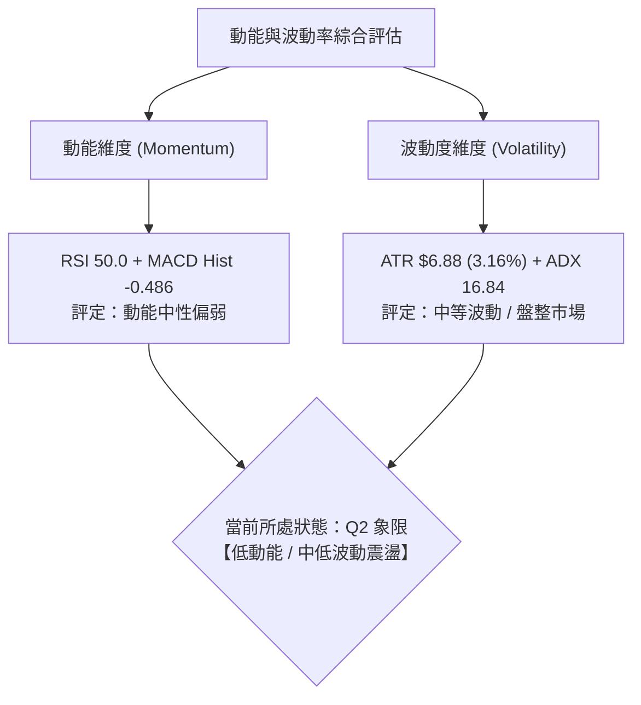
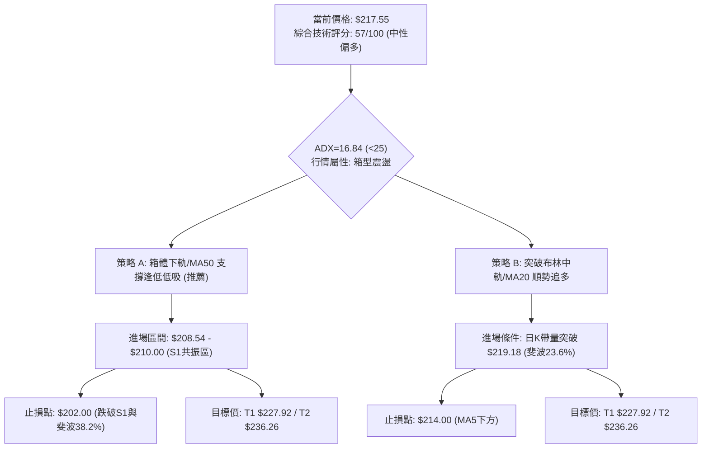
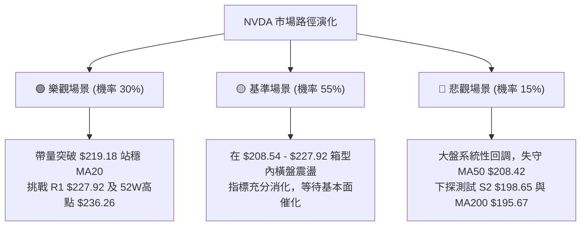

# NVDA 技術分析報告

> **報告日期**：2026-08-31 ｜ **語言**：繁體中文 ｜ **數據來源**：Yahoo Finance ｜ **當前價格**：$217.55

---

## 目錄

| 章節 | 內容 |
|------|------|
| [1. 技術面概覽](#1-技術面概覽) | 訊號儀表板、核心指標、評分卡 |
| [2. 趨勢分析](#2-趨勢分析) | 多時框趨勢、長中短期走勢、ADX解讀 |
| [3. 圖表形態分析](#3-圖表形態分析) | 形態識別、K線組合、形態目標價 |
| [4. 支撐與阻力](#4-支撐與阻力) | 關鍵價位、斐波那契回調結構 |
| [5. 技術指標深度解讀](#5-技術指標深度解讀) | 均線系統、RSI、MACD、布林通道、成交量與OBV |
| [6. 動能與波動率](#6-動能與波動率) | 動能四象限、ATR波動率、Beta值分析 |
| [7. 多時框架總結](#7-多時框架總結) | 時框矩陣評分、多時框收斂定論 |
| [8. 交易策略建議](#8-交易策略建議) | 決策路由、價格階梯、主策略詳情、風控點 |
| [9. 風險提示與監控](#9-風險提示與監控) | 關鍵監控Checklist、情境路徑、倉位管理 |
| [📋 報告總結](#-報告總結) | 全景技術面總結速查 |

---

## 1. 技術面概覽

### 🎯 技術訊號儀表板



---

### 📊 核心指標速覽表

| 指標類別 | 指標名稱 | 當前數值 | 訊號 | 技術解讀 |
|:---|:---|:---|:---:|:---|
| **價格** | 當前價格 | $217.55 | 🟡 | 位於52週區間 74.2% 位置，處於高位蓄勢狀態 |
| **短期均線** | MA20 (布林中軌) | $218.05 | 🔴 | 現價位於 MA20 下方 $0.50 (-0.23%)，短線面臨中軌反壓 |
| **中期均線** | MA50 | $208.42 | 🟢 | 現價高於 MA50 +4.38%，中期多頭防線穩固 |
| **長期均線** | MA200 | $195.67 | 🟢 | 現價高於 MA200 +11.18%，長線牛市格局未變 |
| **動能震盪** | RSI(14) | 50.00 | 🟡 | 剛好落於多空平衡軸，無超買或超賣極端現象 |
| **趨勢動能** | MACD (12,26,9) | 2.351 / 2.838 | 🔴 | DIF < DEA，MACD柱狀體 -0.486，短線動能處於收斂修正 |
| **隨機指標** | Stoch %K / %D | 44.36 / 48.43 | 🟡 | 雙線於中軸區間交纏，屬於典型區間震盪型態 |
| **趨勢強度** | ADX(14) | 16.84 | 🟡 | ADX < 25 表明處於盤整市，+DI(26.59) > -DI(21.54) 多方略佔優 |
| **通道指標** | Bollinger Bands | $205.95 ~ $230.14 | 🟡 | %B 為 0.48，價格於中軌 ($218.05) 附近尋求方向 |
| **波動度** | ATR(14) | $6.88 (3.16%) | 🟡 | 日均波動近 $6.9，波幅適中，適合設定區間風控 |
| **能量指標** | OBV | OBV < MA | 🔴 | 累積量能低於均量線，警惕高位量價背離風險 |

---

### 🏆 技術評分卡

```
╔══════════════════════════════════════════════════════════════╗
║             技術評分卡 — NVDA (2026-08-31)                   ║
╠══════════════════════════════════════════════════════════════╣
║ 趨勢強度 (ADX/DI)   ██████░░░░░░░░░░░░░░  42/100  🟡 中性弱勢 ║
║ 動能指標 (MACD/RSI) ████████░░░░░░░░░░░░  48/100  🟡 動能收斂 ║
║ 支撐穩定度 (S1-S3)  ████████████████░░░░  80/100  🟢 支撐堅固 ║
║ 成交量配合 (VOL/OBV)██████████░░░░░░░░░░  52/100  🟡 量能普通 ║
║ 形態完整度 (結構)   ████████████░░░░░░░░  62/100  🟢 區間蓄勢 ║
║ 均線排列 (MA系統)   ██████████████░░░░░░  70/100  🟢 多頭排列 ║
╠══════════════════════════════════════════════════════════════╣
║ 綜合技術評分        ███████████░░░░░░░░░  57/100  ⚖️ 中性偏多 ║
╚══════════════════════════════════════════════════════════════╝
```

---

## 2. 趨勢分析

### 🌐 多時框趨勢分析



---

### 📈 長期趨勢 — 12個月走勢圖（Unicode）

```
NVDA 月線走勢圖（過去12個月：2025-09 至 2026-08）
價格軸 ($)
$240 ┤                                                    
$230 ┤                                                    
$220 ┤                                                ● $217.55 (現價)
$210 ┤                                            ● $210.89
$200 ┤        ● $202.23                       ● $199.34   ● $200.09   ● $200.75
$190 ┤    ● $186.34       ● $186.27   ● $190.90
$180 ┤                ● $176.77               ● $176.97   ● $174.20
$170 ┤● $173.95(低點)
$160 ┤
     └────┬───────┬───────┬───────┬───────┬───────┬───────┬───────┬───────┬───────┬───────┬───────┬
        25-08   25-09   25-10   25-11   25-12   26-01   26-02   26-03   26-04   26-05   26-06   26-07   26-08
```

#### 📊 走勢特徵分析表格

| 階段區間 | 起止價格 | 漲跌幅 | 走勢特徵與技術含義 |
|:---|:---|:---:|:---|
| **2025.08 - 2025.10** | $173.95 → $202.23 | +16.26% | 突破 $200 整數心理關口，創下當時波段新高，多頭推升強勁 |
| **2025.11 - 2026.03** | $202.23 → $174.20 | -13.86% | 經歷長達5個月的健康回踩確認，於 $174-$176 形成堅實底部結構 |
| **2026.04 - 2026.05** | $174.20 → $210.89 | +21.06% | 突破前高並創出 $210.89 高點，完成波段主升段 |
| **2026.06 - 2026.08** | $200.09 → $217.55 | +8.73% | 於 $200 關卡上方展開高位平台整理，最新月線收在 $217.55 延續上行 |

---

### 📊 中期趨勢（週線分析）

中期走勢顯示，自 2026 年 5 月觸及 52 週高點 $236.26 後，股價進入高位震盪箱型。

```
NVDA 近期週線壓力支撐示意圖
══════════════════════════════════════════════════════════════════
 52W 高點/強阻力  $236.26  ───────────────────────────────────────
 近期反彈高點     $225.16  ═══════════════════════ (8月中旬高點)
 斐波 23.6% / MA20 $219.18 / $218.05 ────▲ 現價 $217.55
 斐波 38.2% / MA50 $208.60 / $208.42 ────▼ (S1 強支撐防線)
 50.0% 回調/整數關 $200.06  ───────────────────────────────────────
══════════════════════════════════════════════════════════════════
```

近20週數據顯示，RSI 由 4 月中旬的 92.8 極度超買持續降溫至目前的 50.0，MACD 柱狀體收斂至 -0.486，表明中期過熱的技術指標已得到充分消化與修復。

---

### ⚡ 趨勢強度評估（ADX 解讀）



| ADX 區間 | 趨勢分類 | 當前狀態 | 操作對策 |
|:---|:---|:---:|:---|
| **0 - 20** | **極弱趨勢 / 區間盤整** | **✓ (16.84)** | **以布林通道與斐波那契支撐阻力進行區間低買高賣** |
| **20 - 25** | 趨勢萌芽 / 方向選擇 | - | 關注突破方向，準備順勢進場 |
| **25 - 40** | 強趨勢形成 | - | 採用均線跟蹤與順勢突破策略 |
| **40 - 100** | 極強趨勢 / 警惕過熱 | - | 尋求順勢加碼但嚴格收緊移動止盈 |

---

## 3. 圖表形態分析

### 🔍 形態識別系統



#### 📋 形態識別與信心度評估表

| 形態名稱 | 信心度 | 判斷依據（引用數據） | 完成度 | 目標價（附計算式） |
|:---|:---:|:---|:---:|:---|
| **高位矩形箱型整理** | **75%** | 上軌阻力在 R1 ($227.92) 與 52W 高點 $236.26；下軌獲 MA50 ($208.42) 與 S1 ($208.54) 支撐。 | 85% | 向上突破目標價 = 頸線 R3 ($236.26) + 箱體高度 ($236.26 - $208.54 = $27.72) = **$263.98** |
| **布林帶收口整理** | **70%** | BB 上軌 $230.14 與下軌 $205.95 寬度收窄，%B 為 0.48 貼近中軌 $218.05。 | 90% | 上軌目標價 **$230.14**；下軌回測目標價 **$205.95** |
| **頭肩底 / 雙底形態** | **35%** | 近期低點雖有 $192.53 (6月底) 與 $200.75 (8月初)，但低點不對稱，結構離散。 | 30% | *訊號不足，僅做指標型區間解讀，不預設立場* |

---

### 🕯️ 重要K線形態分析

| 月份 | 收盤價 | 實體與影線特徵 | 技術解讀 | 訊號方向 |
|:---|:---:|:---|:---|:---:|
| **2026-05** | $210.89 | 長陽實體，盤中創下 52W 高點 $236.26 後帶長上影 | 多頭衝高受阻於 $236 關卡，出現獲利回吐賣壓 | 🟡 滯漲反轉 |
| **2026-06** | $200.09 | 回調陰線，低點探至 $192.53 後拉回 | 測試 $195-$200 (MA200/斐波50%) 強支撐區，確認支撐有效 | 🟢 回踩企穩 |
| **2026-07** | $200.75 | 窄幅十字星，收盤緊貼 $200 | 賣壓耗盡，市場於 $200 關卡達成多空暫時平衡 | 🟡 整理蓄勢 |
| **2026-08** | $217.55 | 大陽線收復失地，重返 $217 上方 | 多方重新掌控節奏，消化前期套牢盤，向箱頂發起挑戰 | 🟢 短線走強 |

---

### 📉 ASCII 走勢形態示意圖

```
NVDA 近期價格震盪箱型形態示意圖
$236.26 ┬────────────────────────────────────────── 52W 高點 (箱頂阻力 R3)
        │                   ▲ 2026-05 (衝高 $236.26)
$227.92 ┤                  / \        ▲ 2026-08-16 ($225.16)
        │                 /   \      / \
$218.05 ┼────────────────/─────\────/───\───● 現價 $217.55 (MA20 / 中軌反壓)
        │               /       \  /     \
$208.54 ┼──────────────/─────────\/───────\────── S1 支撐 / MA50 ($208.42)
        │             /          2026-06   \
$198.65 ┴────────────/           ($192.53)  \──── S2 強支撐 / 斐波 50% ($200.06)
                   2026-04
```

---

### 🎯 形態目標價計算

依據標準矩形箱型整理（Rectangular Consolidation）破位測量原則：
1. **箱體上限（Resistance Baseline）**：52W 高點 $236.26
2. **箱體下限（Support Baseline）**：S1 波段支撐 $208.54
3. **形態垂直高度（Pattern Height）**：$236.26 - $208.54 = $27.72
4. **多頭向上突破目標價**：
   $$\text{Target}_{\text{Bull}} = \$236.26 + \$27.72 = \$263.98$$
5. **空頭向下破位目標價**：
   $$\text{Target}_{\text{Bear}} = \$208.54 - \$27.72 = \$180.82 \quad \text{（極接近分析師最低目標價 \$180.00）}$$

---

## 4. 支撐與阻力

### 🗺️ 關鍵價位分布圖（Unicode）

```
╔══════════════════════════════════════════════════════════════════╗
║                    NVDA 關鍵價位結構分布圖                       ║
╠══════════════════════════════════════════════════════════════════╣
║ $236.26 ║██████████████████████████████║ 52W高點 / 強阻力 R3     ║
║ $232.01 ║████████████████████          ║ 波段阻力 R2             ║
║ $227.92 ║████████████████████████      ║ 近期波段高點阻力 R1     ║
║ $219.18 ║▒▒▒▒▒▒▒▒▒▒▒▒▒▒▒▒▒▒▒▒▒▒▒▒▒▒▒▒▒▒║ 斐波那契 23.6% 回調位   ║
║ $218.05 ║──────────────────────────────║ MA20 / 布林中軌反壓線   ║
║ $217.55 ╠══════════════════════════════╣ ◄ 當前收盤價 ($217.55)  ║
║ $208.54 ║▓▓▓▓▓▓▓▓▓▓▓▓▓▓▓▓▓▓▓▓▓▓▓▓▓▓▓▓▓▓║ 關鍵支撐 S1 (MA50重合)  ║
║ $200.06 ║▒▒▒▒▒▒▒▒▒▒▒▒▒▒▒▒▒▒▒▒▒▒▒▒▒▒▒▒▒▒║ 斐波那契 50.0% / 整數關 ║
║ $198.65 ║████████████████████████      ║ 強支撐 S2 (波段低點聚類)║
║ $194.51 ║██████████████████████████████║ 終極防線 S3 (MA200重合) ║
╚══════════════════════════════════════════════════════════════════╝
```

---

### 🚧 阻力位分析表

| 阻力級別 | 精確價位 | 距現價空間 | 形成原因與技術聚集 | 突破難度 | 重要性 |
|:---|:---:|:---:|:---|:---:|:---:|
| **R1** | **$227.92** | +4.77% | 近一年波段次高點聚類區，接近布林通道上軌 ($230.14) | 中等 | 🟡 短線壓力 |
| **R2** | **$232.01** | +6.65% | 2026年5月中旬長上影線密集套牢區 | 偏高 | 🔴 中期強壓 |
| **R3** | **$236.26** | +8.60% | 52週歷史最高點，斐波那契 0.0% 起點，強大多頭天花板 | 極高 | 🔴 戰略天花板 |

---

### 🛡️ 支撐位分析表

| 支撐級別 | 精確價位 | 距現價空間 | 形成原因與技術聚集 | 守住機率 | 重要性 |
|:---|:---:|:---:|:---|:---:|:---:|
| **S1** | **$208.54** | -4.14% | 近一年波段低點聚類，與 MA50 ($208.42) 及斐波 38.2% ($208.60) 三重共振 | **80%** | 🟢 核心生命線 |
| **S2** | **$198.65** | -8.69% | 2026年6-7月築底低點，與斐波 50.0% ($200.06) 及 $200 整數關卡共振 | **85%** | 🟢 結構防禦線 |
| **S3** | **$194.51** | -10.59% | 長期波段底部低點聚類，緊鄰 MA200 ($195.67) 與 MA240 ($194.13) | **95%** | 🟢 牛熊分水嶺 |

---

### 📐 斐波那契回調位分析（52週區間 $163.85 → $236.26）

```
100.0% (52W Low)  $163.85 ──────────────────────────────────────
 78.6% 回調位     $179.35 ──────────────────────────────────────
 61.8% 黃金分割   $191.51 ──────── (接近 MA200 $195.67 與 S3 $194.51)
 50.0% 中軸回調   $200.06 ──────── (與 S2 $198.65 重合，多空平衡點)
 38.2% 回調位     $208.60 ──────── (與 S1 $208.54 及 MA50 $208.42 完美共振)
 23.6% 回調位     $219.18 ────▲─── (現價 $217.55 位於 23.6% 與 38.2% 之間)
  0.0% (52W High) $236.26 ──────────────────────────────────────
```

**解讀**：
當前現價 $217.55 處於 **23.6% 回調位 ($219.18)** 與 **38.2% 回調位 ($208.60)** 之間的強勢回撤區。
- 股價回調並未跌破 38.2% ($208.60)，顯示整體回撤屬於**強勢調整（Shallow Retracement）**。
- 若股價能帶量站穩 23.6% ($219.18)，將直接打開向上挑戰 0.0% ($236.26) 的通道。

---

## 5. 技術指標深度解讀

### 🎛️ 指標訊號總覽



---

### 📈 移動平均線排列分析



**均線系統評估**：
- **排列狀態**：MA20 ($218.05) > MA50 ($208.42) > MA200 ($195.67)，構成標準的**大週期多頭排列**。
- **微觀特徵**：現價 $217.55 剛好被夾在短期均線 MA10 ($217.06) 與 MA20 ($218.05) 之間，短期乖離率極低（與 MA20 乖離 -0.23%），顯示短線均線正在進行黏合收斂。

---

### 📉 RSI(14) 分析

```
RSI(14) 數值儀表板:
0 ────────── 30 ────────────────── 50 ────────────────── 70 ────────── 100
[  超賣區   ] [     弱勢區間      ] ▲ [     強勢區間      ] [   超買區   ]
                                RSI = 50.00
進度條: ██████████░░░░░░░░░░ 50.00%
```

- **超買超賣評估**：數值精確落在 50.00，脫離了 2026年4月的極端超買區 (RSI 92.8)，處於健康的多空中性平衡區。
- **背離分析（Divergence）**：
  - 現價自 8 月中旬高點 $225.16 回落至 $217.55，RSI 同步自 75.4 回落至 50.00。
  - **結論：當前 RSI 與價格走勢完全同步，未出現頂背離或底背離訊號**。

---

### 📊 MACD(12,26,9) 訊號解讀

```
MACD 數值狀態：
DIF 快線:  2.351
DEA 慢線:  2.838
MACD 柱:  -0.486 (負值區間運行)
```


- **訊號解析**：快線位於慢線下方，且雙線皆在零軸上方運行，代表「牛市中的次級回檔波」。柱狀體數值為 -0.486，表明短線仍由空方動能微幅主導，需等待柱狀體收窄並金叉向上。

---

### 📦 布林通道分析

```
NVDA 布林通道結構 (帶寬 = $24.19)
$230.14 ┬────────────────────────────────────────── BB 上軌 (阻力區)
        │
$218.05 ┼─────────────────● 現價 $217.55 (BB %B = 0.48) BB 中軌 / MA20
        │
$205.95 ┴────────────────────────────────────────── BB 下軌 (支撐區)
```

- **通道帶寬與位置**：BB 上軌 $230.14，下軌 $205.95，中軌 $218.05。
- **%B 指標解讀**：目前 `%B = 0.48`，價格緊貼中軌。根據布林通道法則，當帶寬收窄且價格處於中軌附近時，預示著價格即將面臨突破方向選擇；若站穩中軌則目標看至上軌 $230.14，若跌破則向下軌 $205.95 尋求支撐。

---

### 💹 成交量分析（量價配合度）

```
成交量數據對比：
最新單日量:  194,586,600 股  ████████████████████ (量比 1.52x)
20日均量:    127,870,045 股  █████████████░░░░░░░
50日均量:    134,455,662 股  ██████████████░░░░░░
OBV 狀態:    OBV < MA (能量線低於均線) 🔴
```

- **量比分析**：最新單日成交量放大至 1.94 億股，達到 20 日均量的 1.52 倍，顯示在 $217 價位附近多空換手積極。
- **OBV 能量潮解讀**：OBV 仍處於其移動平均線下方，顯示過去數週的資金累積效應尚未完全釋放，屬於「放量震盪換手、籌碼沉澱」階段。

---

## 6. 動能與波動率

### ⚡ 動能評估分析



| 象限分類 | 動能強度 | 波動率水準 | 當前狀態 | 交易策略啟示 |
|:---|:---:|:---:|:---:|:---|
| **Q1 (主升機會)** | 強 (RSI>60) | 低/中 (ADX>25) | - | 順勢加碼，趨勢突破 |
| **Q2 (震盪蓄勢)** | **中/弱 (RSI≈50)** | **中/低 (ADX=16.84)** | **✓ 當前狀態** | **箱型操作，逢低吸納，耐心等待突破** |
| **Q3 (極端博弈)** | 強 (超買/超賣) | 高 (ATR>5%) | - | 嚴控停損，快進快出 |
| **Q4 (破位下行)** | 弱 (RSI<40) | 高 (帶量下殺) | - | 空倉觀望，嚴禁抄底 |

---

### 📊 ATR 波動率分析

- **ATR(14) 數值**：**$6.88**（佔當前股價之 **3.16%**）。
- **日內安全交易區間**：
  - 當日預期波動上限 = $\$217.55 + \$6.88 = \mathbf{\$224.43}$
  - 當日預期波動下限 = $\$217.55 - \$6.88 = \mathbf{\$210.67}$
- **止損距離設定建議**：
  - **短線交易（1.0 × ATR）**：保護止損距離為 $\$6.88$
  - **波段交易（1.5 × ATR）**：保護止損距離為 $\$10.32$
  - **趨勢交易（2.0 × ATR）**：保護止損距離為 $\$13.76$

---

### 📐 Beta 與市場相關性

```
Beta (貝塔係數): 2.215  ██████████████████████ (高彈性高波動)
```
- **市場敏感度**：NVDA 的 Beta 高達 **2.215**，表明其對標普500與那斯達克100指數具有超過 2.2 倍的波動彈性。大盤若上漲 1%，NVDA 理論預期波動約為 +2.21%；大盤若回調，其回撤幅度亦會被放大。因此在操作上必須配合指數環境控制總倉位。

---

## 7. 多時框架總結

### 📋 時框架評分表

| 時框架 | 趨勢方向 | 動能指標 | 均線排列 | 圖表形態 | 綜合評分 | 操作建議 |
|:---|:---:|:---:|:---:|:---:|:---:|:---|
| **月線 (長期)** | 🟢 多頭上行 | 🟢 RSI > 50 | 🟢 完美多頭 | 24個月上行通道 | **85/100** | 長線堅定持股，不輕易被洗出場 |
| **週線 (中期)** | 🟢 區間震盪偏多 | 🟡 RSI 50 中性 | 🟢 位於 MA50 上方 | 高位箱型整理 ($200-$236) | **65/100** | 箱型下軌與 MA50 附近分批低吸 |
| **日線 (短期)** | 🟡 中性盤整 | 🔴 MACD柱為負 | 🟡 承壓於 MA20 | 布林中軌微幅承壓 | **48/100** | 暫不追高，等待站穩 MA20 後介入 |

---

### 🔲 綜合訊號矩陣

```
╔══════════════════════════════════════════════════════════════════╗
║                   多時框共振與訊號矩陣                           ║
╠══════════════════════════════════════════════════════════════════╣
║ 時框層級 ║ 均線趨勢 ║ 動能方向 ║ 形態格局 ║ 綜合判定 ║ 權重比重 ║
╠══════════════════════════════════════════════════════════════════╣
║ 長期(月) ║  多頭 🟢 ║  看多 🟢 ║  通道 🟢 ║  強烈偏多 ║   40%    ║
║ 中期(週) ║  偏多 🟢 ║  中性 🟡 ║  箱型 🟢 ║  震盪偏多 ║   35%    ║
║ 短期(日) ║  黏合 🟡 ║  收斂 🔴 ║  盤整 🟡 ║  中性震盪 ║   25%    ║
╠══════════════════════════════════════════════════════════════════╣
║ 加權多時框綜合得分: 57.0 / 100 ──────────────► 【中性偏多蓄勢】 ║
╚══════════════════════════════════════════════════════════════════╝
```

---

### ⚖️ 多時框收斂結論

> **依據多時框收斂規則（Rule 14）**：
> 1. 當前 ADX(14) 數值為 **16.84 (< 25)**，明確定義當前市場為**【盤整行情】**而非單邊趨勢行情。
> 2. 依規則，在盤整行情中，交易邊界以**日線布林通道 ($205.95 ~ $230.14)** 與波段支撐阻力為核心基準，同時尊重長期 MA50/MA200 的多頭大背景。
> 3. **唯一方向性結論**：**【中性偏多·區間高拋低吸】**。日線級別短線震盪不破壞中長期牛市結構，主策略採取在重要支撐位分批低吸，並在阻力區分批兌現利潤。

---

## 8. 交易策略建議

### 🗺️ 策略決策流程圖



---

### 🧭 策略路由

**當前主策略方向 = 【中性偏多·箱型區間操作】（依評分卡 57/100 判定）**

由於綜合評分處於 40–60 區間（57分），且 ADX < 25，市場處於高位箱型整理。策略重心為**以布林通道與斐波那契回調位為基準進行區間操作**，嚴禁在阻力位追漲。

---

### 🎯 價格情境階梯（Price Scenarios）

| 觸發條件 | 下一目標 | 後續延伸 | 情境含義與操作指引 |
|:---|:---:|:---:|:---|
| **帶量突破 R1 ($227.92)** | R2 ($232.01) | R3 ($236.26) | 短線強勢上攻，打開挑戰 52W 歷史高點空間 |
| **突破斐波 23.6% ($219.18)** | R1 ($227.92) | R2 ($232.01) | 短線確認站穩 MA20，震盪區間上移 |
| **現價區間震盪 ($214 - $220)** | $218.05 (中軌) | $208.54 (S1) | 典型箱型內部整理，維持區間網格操作 |
| **跌破 S1 ($208.54 / MA50)** | S2 ($198.65) | S3 ($194.51) | 中期技術破位，需觸發減倉並退守 $200 關卡 |

---

### 📊 情境機率分佈

```
情境機率分佈可視化：
區間震盪蓄勢 (55%) : ██████████████████████░░░░░░░░░░
突破上行 (30%)     : ████████████░░░░░░░░░░░░░░░░░░
回落深探支撐 (15%) : ██████░░░░░░░░░░░░░░░░░░░░░░░░
```

| 情境劇本 | 機率 | 主要技術依據 |
|:---|:---:|:---|
| **情境一：高位區間震盪蓄勢** | **55%** | ADX(14) 僅 16.84 確立無趨勢行情，布林帶收口，RSI 為 50.00 處於中性格局。 |
| **情境二：放量突破上行挑戰前高** | **30%** | 均線系統維持完整多頭排列，+DI > -DI，最新單日成交量放大 1.52x。 |
| **情境三：回落深探 S2/MA200 支撐** | **15%** | MACD 柱狀體為負 (-0.486)，OBV 累積動能不足，若大盤回調可能連帶回踩。 |

---

### 🟢 主策略詳情

| 策略要素 | 策略 A（逢低承接型 — 優先推薦） | 策略 B（右側突破型） |
|:---|:---|:---|
| **適用場景** | 價格回踩 S1 / MA50 支撐時低吸 | 價格帶量突破斐波 23.6% 阻力時追進 |
| **進場條件** | 回踩 $208.54 - $210.00 區間企穩收陽 | 日K收盤價放量突破 $219.18 (斐波23.6%) |
| **進場價格** | **$209.00** | **$219.50** |
| **止損價格** | **$202.00**（跌破 S1 與 38.2% 防線） | **$214.00**（跌破 MA5 與進場實體陽線下緣） |
| **目標價 T1** | **$227.92** (R1 阻力位) | **$227.92** (R1 阻力位) |
| **目標價 T2** | **$236.26** (R3 歷史高點) | **$236.26** (R3 歷史高點) |
| **風險空間** | $\$209.00 - \$202.00 = \mathbf{\$7.00}$ (3.35%) | $\$219.50 - \$214.00 = \mathbf{\$5.50}$ (2.51%) |
| **報酬空間(T1)** | $\$227.92 - \$209.00 = \mathbf{\$18.92}$ (9.05%) | $\$227.92 - \$219.50 = \mathbf{\$8.42}$ (3.84%) |
| **風險報酬比 (T1)** | **1 : 2.70** 🟢 優異 | **1 : 1.53** 🟡 尚可 |
| **風險報酬比 (T2)** | **1 : 3.89** 🟢 極佳 | **1 : 3.05** 🟢 良好 |
| **勝率估計** | **65%** | **55%** |
| **建議倉位** | **總資金之 15% - 20%** | **總資金之 10% - 15%** |

---

### 🔴 反向風險觸發點（對沖與風控提示）

以下關鍵價位若被有效跌破，將推翻多頭震盪偏多結構，需啟動避險對沖機制：
1. **警示觸發點**：日K收盤價跌破 **S1 ($208.54)** 及 **MA50 ($208.42)**。
   - **處置**：多頭部位減倉 50%，停止任何左側抄底操作。
2. **多翻空破位點**：跌破 **S2 ($198.65)** 及 **斐波 50.0% ($200.06)** 整數關卡。
   - **處置**：多頭部位全部清倉，可考慮利用反向 ETF 或賣出看漲期權（Covered Call）進行資產對沖，下看 S3 ($194.51) 與 MA200 ($195.67)。

---

### ⭐ 整體訊號強度評星

```
╔══════════════════════════════════════════════════════════════════╗
║ 做多訊號強度：★★★☆☆  (3.5/5星 — 均線排列支撐，但短線動能待修復)║
║ 做空訊號強度：★★☆☆☆  (2.0/5星 — 僅屬次級回調，中長線下行空間受限)║
║ 整體可信度：  ★★★★☆  (4.0/5星 — 支撐阻力結構分明，量價數據完備) ║
╚══════════════════════════════════════════════════════════════════╝
```

---

## 9. 風險提示與監控

### ✅ 關鍵監控指標 Checklist

```
╔══════════════════════════════════════════════════════════════════╗
║                   每日交易前技術監控清單 (Checklist)             ║
╠══════════════════════════════════════════════════════════════════╣
║ [ ] 價格是否重新收復 MA20 / BB中軌 ($218.05)？                  ║
║ [ ] MACD 柱狀體 (-0.486) 是否開始縮腳或由負轉正？                ║
║ [ ] RSI(14) 能否維持在 50 水平線上方並向上發散？                 ║
║ [ ] 日成交量能否持續保持在 20日均量 (1.28億股) 之上？           ║
║ [ ] S1 關鍵防線 ($208.54) 與 MA50 ($208.42) 是否完好無損？       ║
║ [ ] ADX 數值是否升破 20，釋放新一輪單邊行情啟動訊號？            ║
╚══════════════════════════════════════════════════════════════════╝
```

---

### ⚠️ 風險場景分析



---

### 🛡️ 風險管理重要提醒

1. **高 Beta 波動管理**：NVDA 的 Beta 高達 **2.215**，在半導體板塊中屬於高彈性標的。投資者應嚴格控制個股佔投資組合的總比重（建議不超過 20%），避免在單一資產上承擔過度的波動風險。
2. **ATR 動態風控**：以 ATR(14) = **$6.88** 作為動態風控參考基準。持倉的每日浮動盈虧若在 1 倍 ATR（約 $6.9）以內，屬於正常市場雜訊，無需過度恐慌進行頻繁交易。
3. **拒絕追漲殺跌**：在 ADX = **16.84** 的震盪行情特徵下，凡是接近布林上軌 ($230.14) 或 R1 ($227.92) 時應嚴格分批止盈；凡是回踩 S1 ($208.54) 或布林下軌 ($205.95) 且未破位時，方為優質的進場點。

---

## 📋 報告總結

```
╔════════════════════════════════════════════════════════════════════════╗
║                   NVDA 技術分析報告總結                                ║
╠════════════════════════════════════════════════════════════════════════╣
║ 報告日期：2026-08-31                     當前價格：$217.55             ║
║ 綜合技術評分：57 / 100                    分析評級：⚖️ 中性偏多·區間操作 ║
╠════════════════════════════════════════════════════════════════════════╣
║ 核心關鍵結論：                                                         ║
║ ├─ 長期趨勢：🟢 堅定看多 (月線通道良好，MA200 $195.67 支撐向上)        ║
║ ├─ 中期趨勢：🟢 箱型偏多 (維持於 $200-$236 箱型整理，MA50 支撐有效)   ║
║ ├─ 短期趨勢：🟡 震盪整理 (微幅承壓於 MA20 $218.05，ADX=16.84 處盤整)   ║
║ ├─ 關鍵支撐：S1: $208.54  ｜  S2: $198.65  ｜  S3: $194.51            ║
║ ├─ 關鍵阻力：R1: $227.92  ｜  R2: $232.01  ｜  R3: $236.26 (52W高點)  ║
║ └─ 華爾街共識目標：均價 $323.42 (58位分析師 Strong Buy)               ║
╠════════════════════════════════════════════════════════════════════════╣
║ 最優交易策略組合：                                                     ║
║ 1. 🥇 最佳機會（逢低承接）：在 S1 $208.54 - $210.00 區間佈局，          ║
║       止損設於 $202.00，第一目標 $227.92，風報比達 1:2.70。             ║
║ 2. 🥈 次選機會（右側突破）：待放量突破斐波 23.6% ($219.18) 順勢跟進，  ║
║       止損設於 $214.00，目標上看 $236.26。                             ║
║ 3. 🥉 保守選擇（網格定投）：在 $200 - $218 區間分批掛單建立中長線倉位。║
╚════════════════════════════════════════════════════════════════════════╝
```

---

> ⚠️ **免責聲明**：本報告為基於量化技術指標與多時框圖表之客觀分析，所有數據及估算均嚴格基於所提供的歷史價格與 OHLCV 資料。本報告**僅供研究與學術參考**，**不構成任何形式的要約、招攬或投資買賣建議**。金融市場存在波動風險，投資人應獨立評估風險並自負盈虧。

---

*報告生成時間：2026-08-31 ｜ 數據來源：Yahoo Finance ｜ 分析框架：多時框圖表與量化技術指標體系*