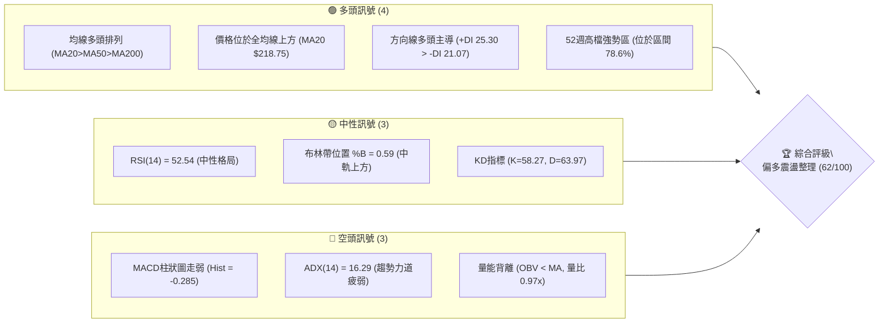
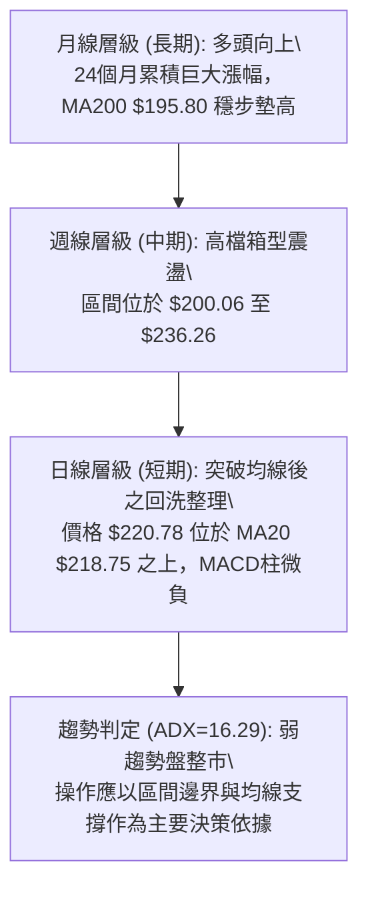
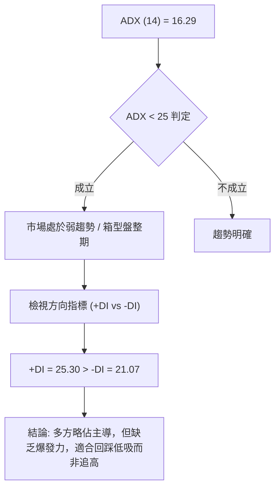
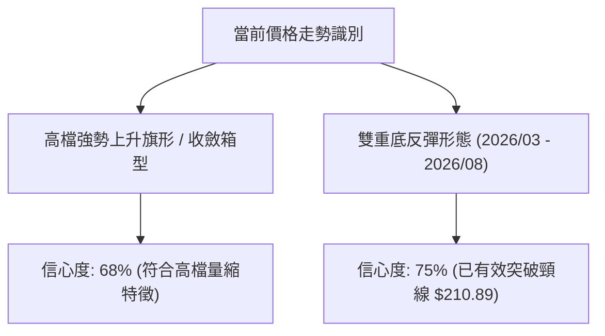
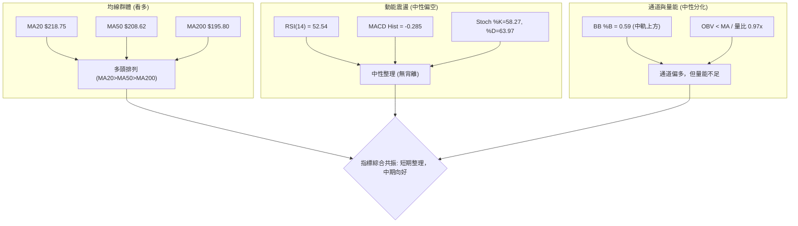
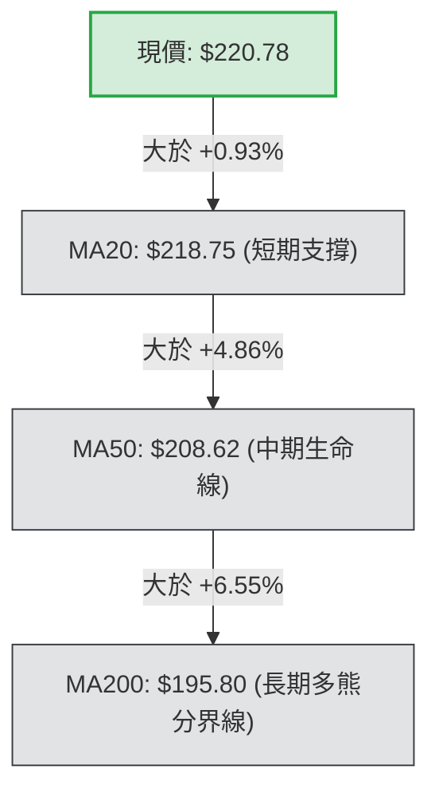
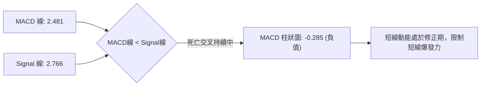
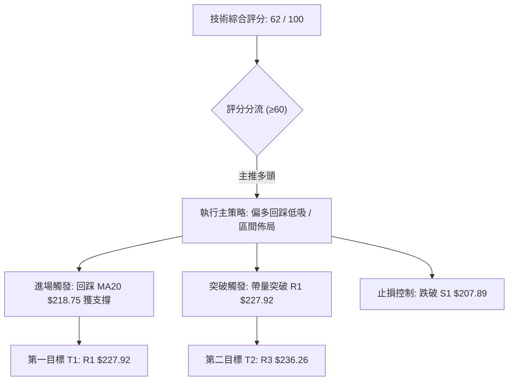
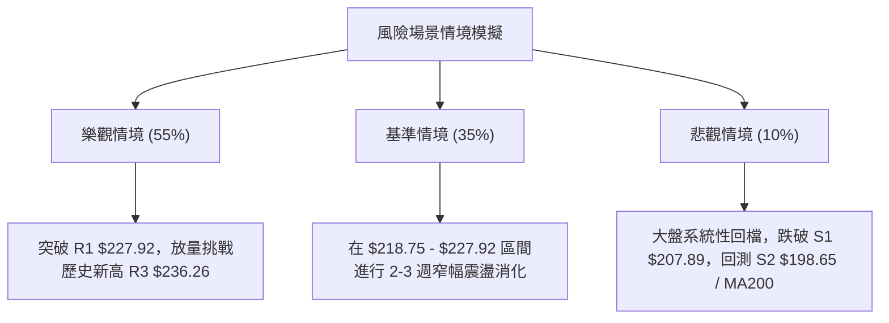

# NVDA 技術分析報告

> **報告日期**：2026-09-01 ｜ **語言**：繁體中文 ｜ **數據來源**：Yahoo Finance ｜ **當前價格**：$220.78

---

## 目錄

| 章節 | 內容 |
|------|------|
| [1. 技術面概覽](#1-技術面概覽) | 訊號儀表板、核心指標、評分卡 |
| [2. 趨勢分析](#2-趨勢分析) | 多時框趨勢、長中短期走勢、ADX 評估 |
| [3. 圖表形態分析](#3-圖表形態分析) | 形態識別、信心度評估、K線組合 |
| [4. 支撐與阻力](#4-支撐與阻力) | 關鍵價位、斐波那契回調結構 |
| [5. 技術指標深度解讀](#5-技術指標深度解讀) | MA/RSI/MACD/布林/量價關係 |
| [6. 動能與波動率](#6-動能與波動率) | 動能四象限、ATR、Beta 與市場連動 |
| [7. 多時框架總結](#7-多時框架總結) | 時框架矩陣與多時框收斂定調 |
| [8. 交易策略建議](#8-交易策略建議) | 策略路由、情境階梯、進出場與風報比 |
| [9. 風險提示與監控](#9-風險提示與監控) | 監控清單、極端場景、風險管理 |

---

## 1. 技術面概覽

### 🎯 技術訊號儀表板



### 📊 核心指標速覽表

| 指標類別 | 指標名稱 | 當前數值 | 訊號 | 解讀 |
|----------|----------|----------|------|------|
| **價格** | 當前收盤價 | $220.78 | 🟢 | 位於52週高檔區間 78.6%，多方結構完整 |
| **均線** | MA20 (月線) | $218.75 | 🟢 | 價格在MA20上方 (+0.93%)，短線支撐有效 |
| **均線** | MA50 (季線) | $208.62 | 🟢 | 價格在MA50上方 (+5.83%)，中期多頭基底穩固 |
| **均線** | MA200 (年線) | $195.80 | 🟢 | 價格在MA200上方 (+12.76%)，長期多頭趨勢不變 |
| **動能** | RSI(14) | 52.54 | 🟡 | 位於 50 多空分界點上方，無超買超賣與背離 |
| **動能** | MACD (12,26,9) | 2.481 / 2.766 | 🔴 | MACD線跌破訊號線，柱狀圖負值 (-0.285) 顯示短線修正 |
| **趨勢** | ADX(14) | 16.29 | 🟡 | 數值小於 25，市場處於非趨勢的「箱型盤整」階段 |
| **通道** | 布林通道 %B | 0.59 | 🟢 | 位於中軌 ($218.75) 與上軌 ($229.63) 之間，維持強勢區 |
| **量能** | 20日均量比 | 0.97x | 🔴 | 成交量 1.243億股，低於20日均量，OBV < MA 顯示追價量能不足 |
| **波動** | ATR(14) | $6.81 | 🟡 | 每日平均波動幅度為 3.08%，波動度處於中等水平 |

### 🏆 技術評分卡

```
╔══════════════════════════════════════════════════════════════╗
║             技術評分卡 — NVDA (2026-09-01)                  ║
╠══════════════════════════════════════════════════════════════╣
║ 趨勢強度 (Trend)     ████████░░░░░░░░░░░░  40/100  🟡 (ADX弱)║
║ 動能指標 (Momentum)  ██████████░░░░░░░░░░  50/100  🟡 (中性) ║
║ 支撐穩定度 (Support) ████████████████░░░░  80/100  🟢 (均線密集)
║ 成交量配合 (Volume)  ████████░░░░░░░░░░░░  40/100  🔴 (縮量) ║
║ 形態完整度 (Pattern) ██████████████░░░░░░  70/100  🟢 (箱型強勢)
║ 均線排列 (MA System) ██████████████████░░  90/100  🟢 (完美多頭)
╠══════════════════════════════════════════════════════════════╣
║ 綜合技術評分         ████████████░░░░░░░░  62/100  🟢 偏多震盪║
╚══════════════════════════════════════════════════════════════╝
```

---

## 2. 趨勢分析

### 🌐 多時框趨勢分析



### 📈 長期趨勢 — 12個月走勢圖（Unicode）

NVDA 過去 12 個月（2025-09 至 2026-08）展現了由高速推進轉入高檔平台整理的完整循環：

```
NVDA 月線走勢圖（過去12個月：2025-09 至 2026-08）
價格 ($)
$240 ┤                                                    
$230 ┤                                                ● $220.78 (2026-08)
$220 ┤                                  ● $210.89     │
$210 ┤            ● $202.23 (高點1)     │         ●───┘ $200.75 (2026-07)
$200 ┤            │               ● $199.34       │
$190 ┤  ● $186.34 │   ● $186.27   │     │         ● $200.09 (2026-06)
$180 ┤  │         │   │   ● $190.90     │
$170 ┤  │         ●───┘   │   │         │
$160 ┤  │    $176.77      ●───● $174.20 (低點2, 2026-03)
     └─────────────────────────────────────────────────────────────
        09   10   11  12  01  02   03   04   05   06   07   08   (月份)
```

**12 個月走勢特徵分析表格**：

| 階段 | 時間區間 | 價格區間 | 漲跌幅 | 結構特徵與技術含義 |
|------|----------|----------|--------|--------------------|
| **主升攻擊波** | 2025/09 - 2025/10 | $186.34 → $202.23 | +8.53% | 突破 $200 整數關卡，建立首個波段歷史高點 |
| **獲利回吐回撤** | 2025/11 - 2026/03 | $202.23 → $174.20 | -13.86% | 震盪探底回踩 52 週低點區上方（$174.20 構築雙重支撐） |
| **二度推升浪** | 2026/04 - 2026/05 | $174.20 → $210.89 | +21.06% | 量能放大推升，突破前高 $202.23，創 $210.89 階段新高 |
| **高檔強勢整理** | 2026/06 - 2026/08 | $200.09 → $220.78 | +10.34% | 守穩 $200 大關後發動突破，月線收出歷史新高收盤價 |

### 📊 中期趨勢（週線分析）

從近 20 週收盤數據觀察，股價自 2026 年 6 月底的低點 $192.53 啟動新一輪上升推動浪，連續攀升至 8 月中旬高點 $225.16，隨後出現兩週的健康量縮回檔（$214.72 → $217.55），最新一週收在 $220.78，站穩短期均線。

```
週線級別價格壓力與支撐示意圖：
$236.26 ═════════════════════════════════ 52週歷史極值阻力 (R3)
$227.92 --------------------------------- 波段聚類高點阻力 (R1)
$220.78 ◄································ [當前收盤價位]
$218.75 --------------------------------- 日線 MA20 / 週線短期支撐
$208.60 ═════════════════════════════════ 斐波那契 38.2% / MA50 強支撐
```

### ⚡ 趨勢強度評估（ADX 解讀）



**ADX 強度對照與狀態評估**：

| ADX 數值區間 | 當前數值 | 行情特徵 | 交易指引 | 權重配比 |
|--------------|----------|----------|----------|----------|
| **0 – 20** | **16.29 (當前)** | **弱趨勢 / 盤整市場** | **指標超買超賣、通道邊界有效，避免追突破** | **主要參考** |
| 20 – 25 | - | 趨勢萌芽 / 方向不確定 | 觀察均線收斂與突破信號 | 輔助參考 |
| 25 – 40 | - | 明確單邊強趨勢 | 順勢持有，移動停利 | 暫不適用 |
| 40 以上 | - | 極強極端單邊趨勢 | 提防趨勢衰竭與頂背離 | 暫不適用 |

---

## 3. 圖表形態分析

### 🔍 形態識別系統



**形態信心度與目標價評估表**：

| 識別形態 | 信心度 | 判斷依據（引用數據） | 完成度 | 目標價（附嚴謹計算式） |
|----------|--------|----------------------|--------|------------------------|
| **中期雙重底 (W底)** | **75%** | 2026/03 低點 $174.20 與 52W 低點 $163.85 構成雙底支撐；2026/08 突破 5 月頸線高點 $210.89 | 85% | 頸線 $210.89 + (頸線 $210.89 - 低點 $174.20 = $36.69) = **$247.58**（中長期推算） |
| **高檔收斂箱型** | **68%** | 價格在 $207.89 (S1) 至 $227.92 (R1) 區間震盪，振幅收窄，成交量自 9.31 億降至 1.24 億 | 70% | 突破箱頂 R1 $227.92 後，量度幅度 = $227.92 + ($227.92 - $207.89 = $20.03) = **$247.95** |
| **頭肩頂/底** | **20%** | 數據中未偵測到標準頭肩結構 | 0% | 訊號不足，僅做指標型解讀，不預設立場 |

### 🕯️ 重要K線形態分析

| 期間/月份 | 收盤價 | K線形態特徵 | 技術解讀 | 多空訊號 |
|-----------|--------|-------------|----------|----------|
| **2026-05** | $210.89 | 長陽帶量突破 | 突破 2025/10 高點 $202.23，確認中期扭轉為多頭 | 🟢 強烈看多 |
| **2026-06** | $200.09 | 帶長下影陰線 | 回測 $200 大關獲得強力支撐，清洗浮額 | 🟡 震盪洗盤 |
| **2026-07** | $200.75 | 窄幅十字星十字線 | 波動度驟降，多空進入平衡，築底完成 | 🟡 變盤蓄勢 |
| **2026-08** | $220.78 | 實體大陽線 | 放量上攻收復失地，月線收於全期最高 | 🟢 多頭重啟 |
| **最新日線** | $220.78 | 小陽線站上 MA20 | 守住月線支撐 $218.75，回檔獲得確認 | 🟢 短線偏多 |

### 📉 ASCII 走勢形態示意圖

```
NVDA 中期雙底與突破形態示意圖
═════════════════════════════════════════════════════════════════════
價位($)
$236.26 ┤                                                    [52W High]
        │                                             ▲ 突破延伸目標
$227.92 ┤                                    ╭─ R1 ───┴───
$220.78 ┤                                    │     ● 現價 $220.78
$210.89 ┤                  [頸線峰值] ───────┼─────────── (已突破)
        │                   ╭───●───╮        │
$200.00 ┤                   │       │        │   ╭─── [回測不破]
        │       ●           │       │        │   │
$174.20 ┤───────┴───────────╯       ╰────────┴───╯ 
        │    [第一底: 2025/03]           [第二底: 2026/03]
═════════════════════════════════════════════════════════════════════
```

### 🎯 形態目標價計算

根據經典技術形態量度規則，中長期第一道延伸推算目標位於 **$247.58**（由雙底高度 $36.69 疊加於頸線 $210.89 導出）。但在短線實際操作上，價格必須先克服數據庫已確立的三道密集波段阻力（R1 $227.92、R2 $232.01、R3 $236.26）。

---

## 4. 支撐與阻力

### 🗺️ 關鍵價位分布圖（Unicode）

```
╔══════════════════════════════════════════════════════════════════╗
║                   NVDA 關鍵價位階梯分佈圖                         ║
╠══════════════════════════════════════════════════════════════════╣
║ $236.26 ║████████████████████████║ 強烈阻力 R3 / 52週歷史高點     ║
║ $232.01 ║██████████████████      ║ 波段密集阻力 R2 (+5.09%)     ║
║ $227.92 ║██████████████████████  ║ 近期波段高點 R1 (+3.23%)     ║
║ $220.78 ╠════════════════════════╣ ◄ 當前收盤價格 ($220.78)     ║
║ $219.18 ║▓▓▓▓▓▓▓▓▓▓▓▓▓▓▓▓▓▓▓▓▓▓  ║ 斐波那契 23.6% 回調關鍵位    ║
║ $218.75 ║▓▓▓▓▓▓▓▓▓▓▓▓▓▓▓▓▓▓▓▓    ║ 布林中軌 / MA20 短期支撐     ║
║ $208.60 ║████████████████████████║ 斐波那契 38.2% / MA50 支撐   ║
║ $207.89 ║████████████████████████║ 關鍵波段低點支撐 S1 (-5.84%)  ║
║ $198.65 ║████████████████        ║ 結構性強支撐 S2 (-10.02%)    ║
║ $194.51 ║████████████████████    ║ 終極防守支撐 S3 (-11.90%)    ║
╚══════════════════════════════════════════════════════════════════╝
```

### 🚧 阻力位分析表

所有阻力價位均由 OHLCV 歷史波段高點聚類精確計算：

| 阻力級別 | 價位 | 距現價幅幅 | 形成原因與籌碼特徵 | 突破難度 | 重要性評級 |
|----------|------|------------|--------------------|----------|------------|
| **R1** | **$227.92** | +3.23% | 8月中旬高點 ($225.16) 聚類密集套牢帶 | 中等 🟡 | ★★★☆☆ (短線突破口) |
| **R2** | **$232.01** | +5.09% | 歷史前高次級密集高點平台 | 偏高 🔴 | ★★★★☆ (次級強阻力) |
| **R3** | **$236.26** | +7.01% | 52週歷史最高點，解套盤與獲利盤共振 | 極高 🔴 | ★★★★★ (歷史天花板) |

### 🛡️ 支撐位分析表

所有支撐價位均由 OHLCV 歷史波段低點聚類精確計算：

| 支撐級別 | 價位 | 距現價幅幅 | 形成原因與籌碼特徵 | 守住機率 | 重要性評級 |
|----------|------|------------|--------------------|----------|------------|
| **S1** | **$207.89** | -5.84% | 與布林下軌 ($207.88)、MA50 ($208.62) 共振 | 80% 🟢 | ★★★★★ (多方生命線) |
| **S2** | **$198.65** | -10.02% | 7月整理平台低點與 $200 整數防線 | 88% 🟢 | ★★★★☆ (強烈支撐) |
| **S3** | **$194.51** | -11.90% | 接近 MA200 ($195.80) 與 Fib 61.8% ($191.51) | 95% 🟢 | ★★★★★ (牛熊分水嶺) |

### 📐 斐波那契回調位分析

依據 52 週波動區間（最低點 **$163.85** 至 最高點 **$236.26**，垂直空間 **$72.41**）計算精準回調位：

```
斐波那契回調階梯（52W 區間：$163.85 → $236.26）：
0.0%  (52W High)  : $236.26  ────────────────────── [頂部阻力 R3]
23.6% 回調位      : $219.18  ────▲─────────────── [現價 $220.78 緊鄰上方]
38.2% 回調位      : $208.60  ────┼───────────────── [與 MA50 $208.62 高度重合]
50.0% 回調位      : $200.06  ────┼───────────────── [強弱多空中軸]
61.8% 黃金分割位  : $191.51  ────┼───────────────── [強支撐防線]
78.6% 回調位      : $179.35  ────┼───────────────── [深幅回檔區]
100.0% (52W Low)  : $163.85  ────┴───────────────── [底部基石]
```

**斐波那契結構深度解讀**：
當前現價 **$220.78** 精準運行於 **0.0% ($236.26)** 與 **23.6% ($219.18)** 回調位之間，且剛好微幅站上 23.6% 回調位（+$1.60）。在技術理論中，強勢牛市拉回若能守住 23.6% 回調位，代表市場屬於「極淺層強勢整理」，後市向上挑戰並突破 0.0% ($236.26) 高點的機率顯著大於深幅拉回。

---

## 5. 技術指標深度解讀

### 🎛️ 指標訊號總覽



### 📈 移動平均線排列分析



**均線全景數據評估**：

| 均線名稱 | 當前價格 | 偏離現價幅度 | 趨勢方向 | 形態特徵與排列含義 |
|----------|----------|--------------|----------|--------------------|
| **MA 5** | $217.80 | +1.37% | ▲ 向上 | 短線超短週期回勾向上，形成短多支撐 |
| **MA 10** | $216.64 | +1.91% | ▲ 向上 | 支撐短期價格重心 |
| **MA 20** | $218.75 | +0.93% | ▲ 向上 | 短期均線向上發散，提供第一線防守 |
| **MA 60** | $208.31 | +5.99% | ▲ 向上 | 與 MA50 ($208.62) 形成中期支撐帶 |
| **MA 120** | $203.57 | +8.46% | ▲ 向上 | 半年線持續揚升，中期趨勢向上 |
| **MA 200** | $195.80 | +12.76% | ▲ 向上 | 長期牛市底線，奠定中長線多頭基調 |

### 📉 RSI(14) 分析

```
RSI(14) 數值刻度：
0 ──────────── 30 ────────────────── 50 ────── 52.54 ──────── 70 ──────────── 100
超賣區                   空方佔優        │    ▲中性偏多區   超買區
                                         └─── 現價位置
進度條: ██████████░░░░░░░░░░ 52.54% (中性平衡)
```

- **超買超賣判定**：數值 52.54 處於 30-70 的正常健康常態分佈區間，遠離超買區（>70），無任何流動性衰竭或過熱隱憂。
- **背離分析**：
  - 週線 RSI 曾於 2026-08-16 創出 75.4 高點，隨後收斂至當前 52.54。
  - 對比價格走勢，股價近期並未在 RSI 走弱之際盲目創出歷史新高，價格與 RSI 同步回落修整，**明確判定：當前 RSI 不存在頂背離，亦無底背離**，屬於標準的「指標降溫」過程。

### 📊 MACD(12/26/9) 訊號解讀



- **數值關係**：MACD 線 (2.481) 目前低於訊號線 (2.766)，柱狀圖（Histogram）為 **-0.285**，呈現紅色弱勢狀態。
- **指標共振**：雖然 MACD 主線仍處於零軸上方（2.481 > 0，屬於多頭領域的修正），但柱狀圖處於負值區間，確認當前不具備單邊暴漲條件，短線操作應提防回踩均線。

### 📦 布林通道分析

```
布林通道結構示意圖（日線級別）：
$229.63 ════════════════════════════════════════════════════ 布林上軌 (阻力)
        │
        │
$220.78 ──────────────────────────● ◄ 現價 (BB %B = 0.59)
        │
$218.75 ---------------------------------------------------- 布林中軌 (MA20支撐)
        │
        │
$207.88 ════════════════════════════════════════════════════ 布林下軌 (強支撐)
```

- **寬度與位置**：上軌 **$229.63**，中軌 **$218.75**，下軌 **$207.88**。
- **%B 指標解讀**：目前 %B 為 **0.59**（大於 0.5），代表價格穩居中軌上方，通道結構呈現溫和開口，中軌 $218.75 為短線多空第一道防線。

### 💹 成交量分析（量價配合度）

- **最新成交量**：124,326,400 股
- **20日均量**：127,692,510 股（量比 **0.97x**，量能微幅萎縮）
- **50日均量**：132,127,346 股
- **OBV 能量潮解讀**：當前技術數據顯示 **OBV < MA**，代表在近期的反彈過程中，量能未出現爆發性堆疊，資金追價力道偏向審慎。這與 ADX (16.29) 所呈現的「盤整非單邊行情」特徵高度吻合。

---

## 6. 動能與波動率

### ⚡ 動能評估四象限

| 象限分區 | 動能維度 | 波動維度 | 當前判定 | 特徵與應對方針 |
|----------|----------|----------|----------|----------------|
| **第一象限 (Q1)** | 強動能 | 低波動 | — | 最佳單邊主升段（暫非此狀態） |
| **第二象限 (Q2)** | **弱/中動能** | **低/中波動** | **✓ (當前狀態)** | **ADX=16.29 + ATR=3.08%，市場處於蓄勢震盪，應採取逢低分批佈局** |
| **第三象限 (Q3)** | 強動能 | 高波動 | — | 高風險追擊段（提防反轉） |
| **第四象限 (Q4)** | 弱動能 | 高波動 | — | 無序劇烈震盪（應嚴格空倉） |

### 📊 ATR 波動率分析

- **ATR(14) 絕對值**：**$6.81**
- **波動率百分比**：**3.08%**（$6.81 / $220.78）
- **風控與止損設定依據**：
  - **短線交易（1.0 × ATR）**：安全緩衝距離為 **$6.81**，對應短線動態止損位設於 $220.78 - $6.81 = **$213.97**（位於 MA20 與 MA50 之間）。
  - **波段交易（1.5 × ATR）**：安全緩衝距離為 **$10.22**，對應波段止損點設於 $220.78 - $10.22 = **$210.56**（剛好保護頸線與 MA50 防線）。

### 📐 Beta 與市場相關性

- **Beta 係數**：**2.215**
- **特徵解讀**：NVDA 的 Beta 達到 2.215，意味著其波動幅度為標普 500 指數的 2.2 倍以上。當大盤微幅回檔時，個股容易出現放大洗盤；因此在操作上絕不可在阻力位（如 R1 $227.92）過度追高，必須依賴回調至支撐位時進場以控制回撤風險。

---

## 7. 多時框架總結

### 📋 時框架評分表

| 時框架 | 趨勢方向 | 動能狀態 | 均線排列 | 圖表形態 | 綜合評分 | 戰略建議 |
|--------|----------|----------|----------|----------|----------|----------|
| **長期 (月線)** | 🟢 強烈多頭 | 🟢 充沛 | 🟢 完美多頭 (MA200 $195.80 揚升) | 雙底突破推升 | **85 / 100** | 戰略性長線持有 |
| **中期 (週線)** | 🟢 偏多震盪 | 🟡 中性平穩 | 🟢 多頭排列 | 高檔收斂箱型 | **70 / 100** | 逢拉回支撐做多 |
| **短期 (日線)** | 🟡 震盪整理 | 🔴 柱狀負值 | 🟢 守穩 MA20 ($218.75) | 布林通道中軌整理 | **55 / 100** | 區間高拋低吸 |

### 🔲 綜合訊號矩陣

```
訊號維度矩陣分析：
┌──────────────┬──────────────┬──────────────┬──────────────┐
│   維度類別   │   短期 (日)  │   中期 (週)  │   長期 (月)  │
├──────────────┼──────────────┼──────────────┼──────────────┤
│ 均線系統     │  🟢 守穩MA20 │  🟢 多頭發散 │  🟢 完美多頭 │
│ 動能指標     │  🔴 MACD微負 │  🟡 RSI=52.5 │  🟢 月線飽滿 │
│ 量能結構     │  🔴 量比0.97 │  🟡 週量持平 │  🟢 歷史放量 │
│ 支撐強度     │  🟢 $218.75  │  🟢 $208.60  │  🟢 $195.80  │
└──────────────┴──────────────┴──────────────┴──────────────┘
```

### ⚖️ 多時框收斂結論

> **依多時框收斂規則（規則 14）定調**：
> 1. **行情性質判定**：當前 ADX(14) 數值為 **16.29（< 25）**，明確定義市場處於「**盤整蓄勢行情**」，並非單邊暴衝行情。
> 2. **衝突收斂權重**：在此環境下，中長期趨勢（週線/月線均線多頭）確立了整體向上的大方向，但短期日線動能（MACD柱 -0.285、量比 0.97x）限制了即刻暴漲的機率。
> 3. **唯一方向性結論**：**偏多震盪整理（中長偏多、短線逢低吸納）**。操作上嚴禁追高，應以布林中下軌與 MA20/MA50 支撐區間作為主要進場依據。

---

## 8. 交易策略建議

### 🗺️ 策略決策流程圖



### 🧭 策略路由（依評分卡分流）

**當前主策略方向 = 【主推多頭策略（偏多回踩低吸）】（依技術評分卡 62/100 定調）**

由於綜合評分達 62 分（≥ 60 分偏多門檻），且均線系統展現 MA20 > MA50 > MA200 完美多頭格局，本報告鎖定**偏多操作**為主軸，空方操作僅列為極端破位時的風險對沖提示。

### 🎯 價格情境階梯（Price Scenarios）

所有價位精確引用第 4 章數據庫聚類數值：

| 觸發條件 | 當前關鍵位 | 下一目標 | 後續延伸 | 情境含義與技術解讀 |
|----------|------------|----------|----------|--------------------|
| **向上突破** | 突破 R1 **$227.92** | R2 **$232.01** | R3 **$236.26** | 突破整理箱頂，短線發動主升攻擊挑戰 52W 高點 |
| **區間震盪** | 站穩 Fib 23.6% **$219.18** | R1 **$227.92** | S1 **$207.89** | 於 $218.75 - $227.92 窄幅拉鋸，消化均線浮額 |
| **向下跌破** | 跌破 S1 **$207.89** | S2 **$198.65** | S3 **$194.51** | 失守 MA50 與布林下軌，中期結構轉弱進入深幅回調 |

### 📊 情境機率分佈

| 情境劇本 | 預估機率 | 主要技術依據（引用指標狀態） |
|----------|----------|------------------------------|
| **情境 A：強勢震盪後向上突破** | **55%** | 均線完美多頭排列、價格站穩 MA20 ($218.75)、+DI (25.30) > -DI (21.07) |
| **情境 B：區間箱型橫盤整理** | **35%** | ADX(14) 僅 16.29、成交量縮至 0.97x 均量、MACD 柱狀圖微負 (-0.285) |
| **情境 C：跌破支撐深幅拉回** | **10%** | 下方 S1 ($207.89) 與 MA50 ($208.62) 具備極強籌碼支撐，機率偏低 |

### 🟢 主策略詳情

本報告提供兩套多頭執行子策略：**策略 A（現價/回踩穩健型）** 與 **策略 B（突破追擊型）**。

| 策略要素 | 策略 A（穩健型：回踩 MA20 佈局） | 策略 B（進取型：突破 R1 追擊） |
|----------|----------------------------------|--------------------------------|
| **進場條件** | 現價或回測 MA20 / Fib 23.6% 獲得支撐 | 盤中帶量突破近期波段高點 R1 |
| **進場價格** | **$219.18**（Fib 23.6% 支撐位） | **$228.50**（確認突破 R1 $227.92） |
| **目標價 T1** | **$227.92** (R1 阻力位，獲利空間 +3.99%) | **$236.26** (R3 / 52W 高點，獲利空間 +3.40%) |
| **目標價 T2** | **$236.26** (R3 阻力位，獲利空間 +7.79%) | **$247.58** (雙底量度目標，獲利空間 +8.35%) |
| **止損價格** | **$213.97** (現價 - 1.0×ATR，跌幅 -2.38%) | **$223.50** (回落至 R1 下方 -1.0×ATR 止損) |
| **風險報酬比** | **1 : 3.27** (以 T2 計算：$17.08 / $5.21) | **1 : 3.82** (以 T2 計算：$19.08 / $5.00) |
| **勝率預估** | **65%** | **55%** |
| **建議倉位** | **15% - 20%** 基礎倉位 | **10%** 加碼倉位 |

### 🔴 反向風險觸發點（對沖提示）

- **多單全面撤退線**：若日線收盤價跌破 **S1 $207.89**（跌破 MA50 與布林下軌），多頭防線瓦解，應即刻止損離場。
- **空頭避險開啟點**：若價格跌破 $207.89 且 MACD 負柱持續放大，可建立少量反向對沖部位，下看目標 **S2 $198.65** 與 **S3 $194.51**。

### ⭐ 整體訊號強度評星

```
╔══════════════════════════════════════════════════════════════╗
║                   整體訊號強度評星儀表板                     ║
╠══════════════════════════════════════════════════════════════╣
║ 做多訊號強度：★★★★☆  (4/5星 - 均線結構完美，動能待放量)     ║
║ 做空訊號強度：★☆☆☆☆  (1/5星 - 逆勢做空風險極高)             ║
║ 整體可信度：  ★★★★☆  (4/5星 - 指標數據無矛盾，邏輯收斂)     ║
╚══════════════════════════════════════════════════════════════╝
```

---

## 9. 風險提示與監控

### ✅ 關鍵監控指標 Checklist

```
╔══════════════════════════════════════════════════════════════╗
║                NVDA 交易即時監控 Checklist                   ║
╠══════════════════════════════════════════════════════════════╣
║ [ ] 價格是否持續收於 MA20 ($218.75) 與 Fib 23.6% ($219.18) 上方
║ [ ] MACD 柱狀圖是否由負轉正 (當前 -0.285 需見收斂翻紅)      ║
║ [ ] 日成交量能否突破 20日均量 (1.277 億股) 展現攻擊量能      ║
║ [ ] ADX 數值是否由 16.29 向上穿越 25 點啟動單邊趨勢         ║
║ [ ] RSI(14) 能否突破 60 並維持於 50 景氣線之上              ║
║ [ ] 嚴防跌破 S1 關鍵防禦位 $207.89 (多頭最後底線)            ║
╚══════════════════════════════════════════════════════════════╝
```

### ⚠️ 風險場景分析



### 🛡️ 風險管理重要提醒

1. **Beta 波動控管**：個股 Beta 達 **2.215**，波動劇烈，單筆交易虧損金額嚴格限制在總帳戶資產的 **1.0% - 1.5%** 以內。
2. **量能不足風險**：當前量比 0.97x 且 OBV < MA，嚴禁在價格接近阻力位 R1 ($227.92) 時市價追高，謹防假突破後的短線誘多洗盤。
3. **分批建倉原則**：建議採取「金字塔建倉法」，於 $219.18 建立 50% 預定部位，待放量確認突破 $227.92 後再行加碼其餘 50%。

---

## 📋 報告總結

```
╔══════════════════════════════════════════════════════════════╗
║                   NVDA 技術分析報告總結                      ║
╠══════════════════════════════════════════════════════════════╣
║ 報告日期：2026-09-01                                         ║
║ 當前價格：$220.78                                            ║
║ 綜合評級：⚖️ 偏多震盪整理 (技術評分: 62/100)                  ║
╠══════════════════════════════════════════════════════════════╣
║ 關鍵趨勢結論：                                               ║
║ ├─ 長期趨勢：🟢 強烈多頭 (MA200 $195.80 穩步揚升，結構穩固)  ║
║ ├─ 中期趨勢：🟢 偏多蓄勢 (雙底突破後高檔強勢整理，守穩箱底)  ║
║ ├─ 短期趨勢：🟡 震盪整理 (ADX=16.29 處盤整市，MACD微幅修正)  ║
║ ├─ 關鍵支撐：S1: $207.89 ｜ S2: $198.65 ｜ S3: $194.51       ║
║ ├─ 關鍵阻力：R1: $227.92 ｜ R2: $232.01 ｜ R3: $236.26       ║
║ └─ 分析師共識目標價：$323.42 (58位分析師評級為 Strong Buy)   ║
╠══════════════════════════════════════════════════════════════╣
║ 最優策略組合：                                               ║
║ 1. 🥇 最佳機會：於 Fib 23.6% ($219.18) / MA20 回踩分批佈局   ║
║    目標 T1: $227.92 / T2: $236.26，止損 $213.97 (風報比 1:3.3)║
║ 2. 🥈 次選機會：帶量突破 R1 ($227.92) 後順勢追擊，目標 $247.58║
║ 3. 🥉 保守選擇：等待股價回測 S1 ($207.89) 出現止跌K線再行進場║
╚══════════════════════════════════════════════════════════════╝
```

---

> ⚠️ **免責聲明**：本報告為量化與技術指標驅動之分析研究，所有數值均嚴格基於歷史 OHLCV 與各項指標模型運算。本報告**僅供研究與學術參考**，**不構成任何形式的投資買賣建議**。金融市場瞬息萬變，投資人應獨立思考並嚴格執行資金控管與停損紀律。

---

*報告生成時間：2026-09-01 ｜ 數據來源：Yahoo Finance ｜ 分析框架：多時框技術量化體系*