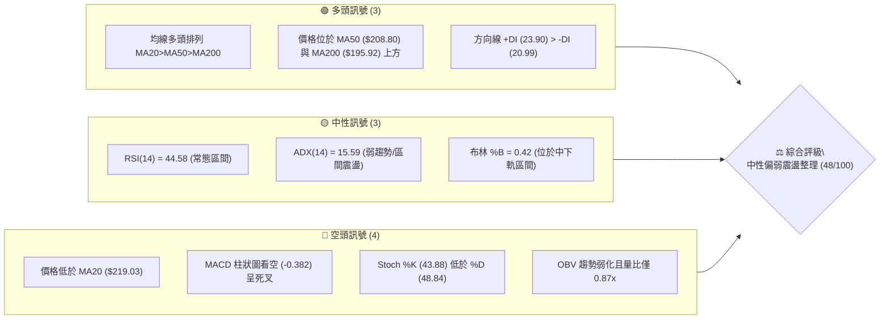
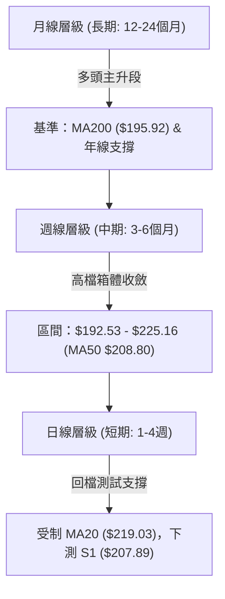
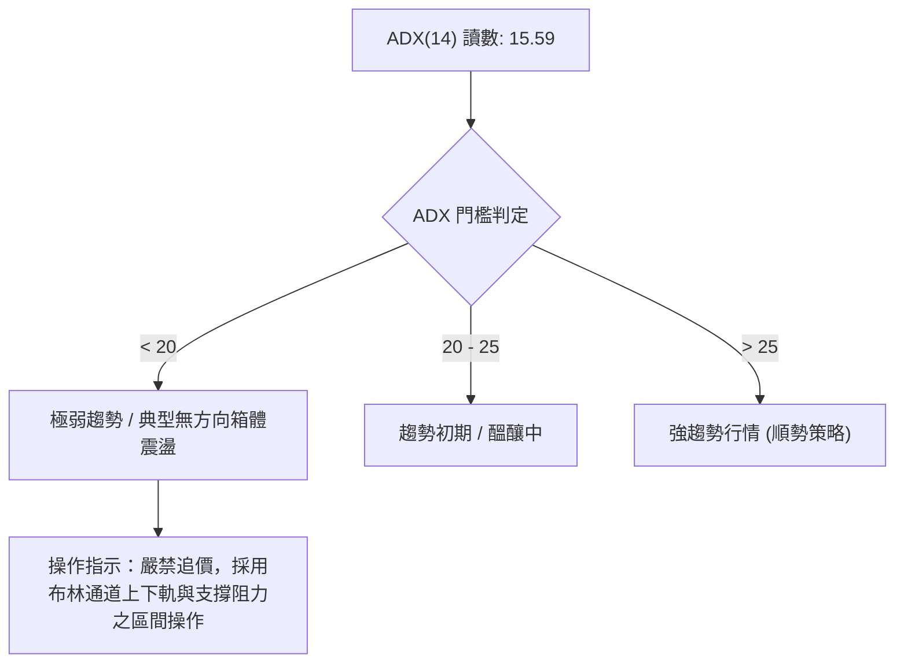
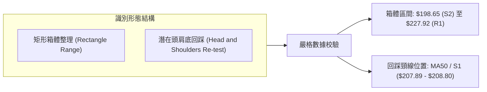
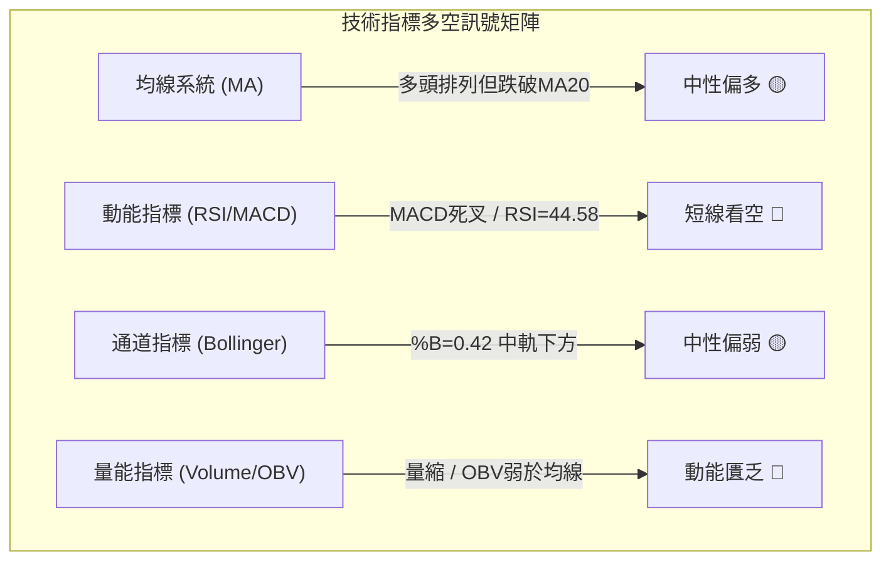
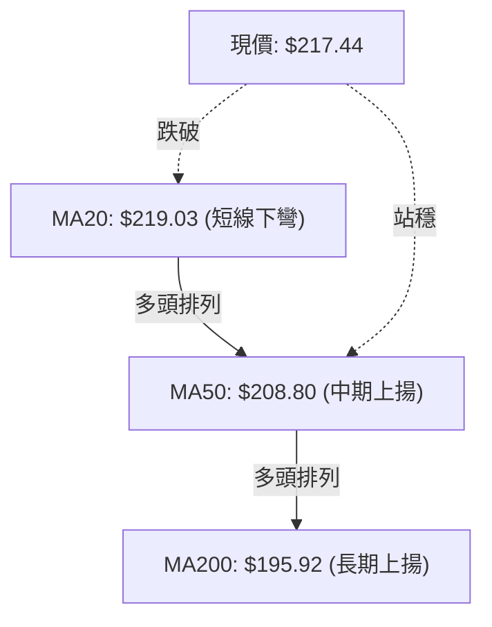
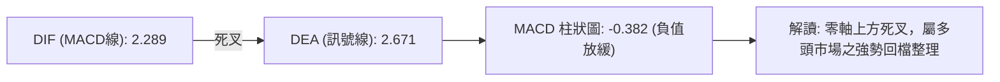
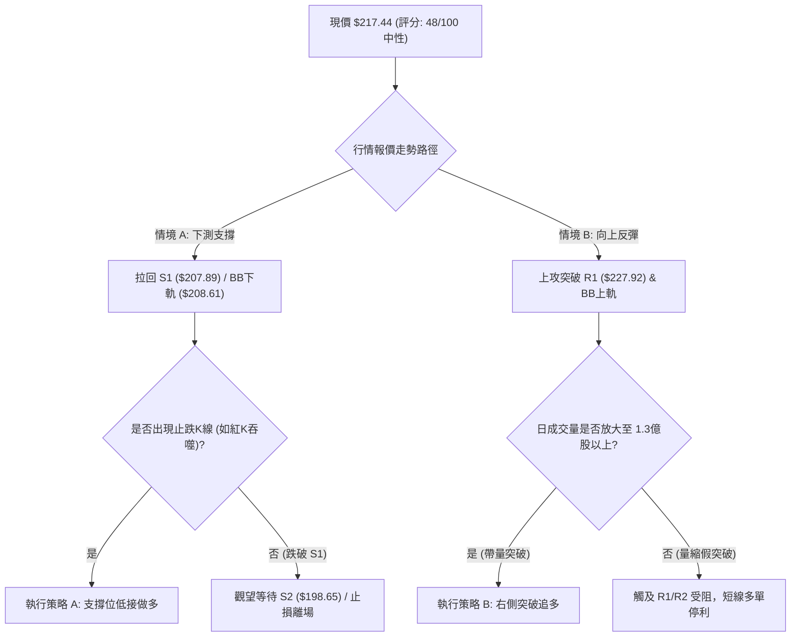
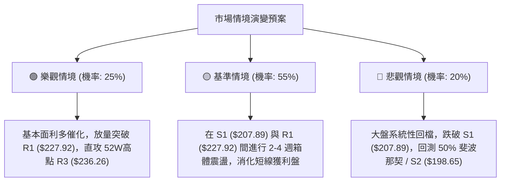

# NVDA 技術分析報告

> **報告日期**：2026-09-02 ｜ **語言**：繁體中文 ｜ **數據來源**：Yahoo Finance ｜ **當前價格**：$217.44

---

## 目錄

| 章節 | 內容 |
|------|------|
| [1. 技術面概覽](#1-技術面概覽) | 訊號儀表板、核心指標、評分卡 |
| [2. 趨勢分析](#2-趨勢分析) | 多時框趨勢、長中短期走勢 |
| [3. 圖表形態分析](#3-圖表形態分析) | 形態識別、K線組合、目標價 |
| [4. 支撐與阻力](#4-支撐與阻力) | 關鍵價位、斐波那契回調 |
| [5. 技術指標深度解讀](#5-技術指標深度解讀) | MA/RSI/MACD/布林/成交量 |
| [6. 動能與波動率](#6-動能與波動率) | 動能評估、ATR、Beta |
| [7. 多時框架總結](#7-多時框架總結) | 時框架評分矩陣 |
| [8. 交易策略建議](#8-交易策略建議) | 多空策略、風險報酬比 |
| [9. 風險提示與監控](#9-風險提示與監控) | 監控指標、風險場景 |

---

## 1. 技術面概覽

### 🎯 技術訊號儀表板



### 📊 核心指標速覽表

| 指標類別 | 指標名稱 | 當前數值 | 訊號 | 解讀 |
|:---|:---|:---|:---:|:---|
| **價格** | 當前收盤價 | $217.44 | 🟡 | 位於52週區間74.0%分位，處於波段回檔整理中 |
| **均線** | MA20 (月線) | $219.03 | 🔴 | 價格位於 MA20 下方（-0.73%），短線承壓 |
| **均線** | MA50 (季線) | $208.80 | 🟢 | 價格位於 MA50 上方（+4.14%），中期多頭結構完好 |
| **均線** | MA200 (年線) | $195.92 | 🟢 | 價格遠高於 MA200（+10.98%），長期牛市基底穩固 |
| **動能** | RSI(14) | 44.58 | 🟡 | 處於 30–70 中性區間，無超買超賣，短線動能偏弱 |
| **動能** | MACD (12,26,9) | 2.289 / 2.671 | 🔴 | MACD 線低於訊號線，柱狀圖 -0.382，呈現空頭修正 |
| **動能** | KD (%K / %D) | 43.88 / 48.84 | 🔴 | %K 低於 %D 呈現死亡交叉，短期動能尚未見底 |
| **趨勢強度**| ADX(14) | 15.59 | 🟡 | ADX < 25 表明趨勢動能衰退，市場進入箱體盤整格局 |
| **通道** | 布林通道 (%B) | 0.42 ($208.61–$229.45) | 🟡 | 價格回落至布林中軌下，朝下軌 $208.61 尋求支撐 |
| **成交量** | 20日量比 / OBV | 0.87x / 弱於均線 | 🔴 | 量能萎縮且 OBV 低於均線，資金推升意願不足 |
| **波動** | ATR(14) | $6.67 (3.07%) | 🟡 | 日均波動幅度約 3.07%，震盪幅度處於正常健康水準 |

### 🏆 技術評分卡

```
╔══════════════════════════════════════════════════════════════╗
║              技術評分卡 — NVDA (2026-09-02)                  ║
╠══════════════════════════════════════════════════════════════╣
║ 趨勢強度 (Trend)     ██████░░░░░░░░░░░░░░  30/100  🔴 弱趨勢 ║
║ 動能指標 (Momentum)  ████████░░░░░░░░░░░░  40/100  🔴 偏空修正║
║ 支撐穩定度 (Support) ██████████████░░░░░░  70/100  🟢 S1強固 ║
║ 成交量配合 (Volume)  ████████░░░░░░░░░░░░  40/100  🔴 量能背離║
║ 形態完整度 (Pattern) ████████████░░░░░░░░  60/100  🟡 箱體整理║
║ 均線排列 (MA System) ████████████░░░░░░░░  60/100  🟡 長多短空║
╠══════════════════════════════════════════════════════════════╣
║ 綜合技術評分         █████████░░░░░░░░░░░  48/100  🟡 中性震盪║
╚══════════════════════════════════════════════════════════════╝
```

---

## 2. 趨勢分析

### 🌐 多時框趨勢分析



### 📈 長期趨勢 — 12個月走勢圖（Unicode）

```
NVDA 月線走勢圖（過去 12 個月：2025-09 至 2026-09）
價格 ($)
$230 ┤                                        ●(08月 $220.78)
$220 ┤                                  ●(05月 $210.89)   ●(現在 $217.44)
$210 ┤            ●(10月 $202.23)         ●(06/07月 $200)
$200 ┤                                  ●(04月 $199.34)
$190 ┤      ●(09月 $186.34) ●(01月 $190.90)
$180 ┤            ●(11/12月 $186) ●(02/03月 $174.20)
     └──────┬─────┬─────┬─────┬─────┬─────┬─────┬─────┬─────┬─────┬─────┬─────
          25-09 25-10 25-11 25-12 26-01 26-02 26-03 26-04 26-05 26-06 26-07 26-08
```

#### 走勢特徵分析表格

| 階段時間 | 起訖價格 | 區間漲跌幅 | 趨勢性質 | 走勢特徵解讀 |
|:---|:---:|:---:|:---:|:---|
| **2025-09 ~ 2025-10** | $186.34 → $202.23 | +8.53% | 突破加速 | 突破 $200 整數大關，創下當時歷史波段新高 |
| **2025-11 ~ 2026-03** | $202.23 → $174.20 | -13.86% | 中期回檔 | 回測波段支撐，於 $174.20 構築雙底支撐平台 |
| **2026-04 ~ 2026-05** | $174.20 → $210.89 | +21.06% | 強勁反彈 | 帶量突破前高，最高觸及 $210.89 完成 V 型反轉 |
| **2026-06 ~ 2026-07** | $210.89 → $200.75 | -4.81% | 平台整理 | 於 $192.53~$210.96 寬幅震盪消化浮額 |
| **2026-08 ~ 2026-09** | $200.75 → $217.44 | +8.31% | 創高拉回 | 8月最高衝至 $225.16（52W高點 $236.26 附近），目前收報 $217.44 回踩整理 |

### 📊 中期趨勢（週線分析）

中期走勢呈現「高檔震盪三角形收斂」格局。近20週數據顯示，價格多次回測 $192.53~$198.22 均能獲買盤支撐，高點則受壓於 $225.16 與 52週高點 $236.26。

```
中期週線結構示意圖：
阻力區 ── R3: $236.26 ═══════════════════════ (52W 高點)
           R1: $227.92 ─────────────────────── (近半年週線收盤高點區)
現  價 ── $217.44      ──────▲────── (回踩 MA20 $219.03)
支撐區 ── S1: $207.89 ═══════════════════════ (布林下軌 $208.61 / MA50 $208.80)
           S2: $198.65 ─────────────────────── (斐波那契 50.0% / 前波週線低點)
```

### ⚡ 趨勢強度評估（ADX 解讀）



#### ADX 與方向線狀態對照

| 參數指標 | 數值 | 狀態評估 | 實戰意涵 |
|:---|:---:|:---:|:---|
| **ADX(14)** | 15.59 | 弱趨勢（< 25） | 行情缺乏單邊推動力，呈現均線糾結與震盪盤整 |
| **+DI (14)** | 23.90 | 多頭力道領先 | 買盤仍具備微弱優勢，但尚未轉化為單邊攻勢 |
| **-DI (14)** | 20.99 | 空頭力道偏低 | 賣壓並未失控，無系統性崩跌風險 |
| **多空差值 (+DI - -DI)**| +2.91 | 多方微幅佔優 | 淨多頭優勢極小，任何短線震盪均可能造成交叉反轉 |

---

## 3. 圖表形態分析

### 🔍 形態識別系統



#### 圖表形態信心度與目標價評估

| 形態名稱 | 信心度 | 判斷依據（引用數據） | 完成度 | 目標價（附嚴格計算式） |
|:---|:---:|:---|:---:|:---|
| **箱體震盪整理** | 80% | 價格在 S1/S2 ($198.65–$207.89) 與 R1 ($227.92) 之間已運行超過12週，ADX=15.59 確認無趨勢 | 85% | 向上突破 R1 時：$227.92 + ($227.92 - $207.89) = **$247.95**（數據未列，以 R3 $236.26 為首要目標） |
| **中期雙重底 (W底)** | 65% | 2026年3月低點 $174.20 與2025年4月低點 $108.77 形成宏觀底部抬高結構，頸線為 $202.23 | 100% (已突破) | 頸線 $202.23 + ($202.23 - $174.20) = **$230.26**（現已達標並於 R2 $232.01 受阻） |
| **短期上升旗形回檔** | 45% | 8月急拉至 $225.16 後連續兩週小幅拉回（量縮），但信心度 < 50% 訊號不足 | 40% | 依規則 15：**訊號不足，僅做指標型解讀（布林通道回踩中軌）** |

### 🕯️ 重要K線形態分析

| 週期/月份 | 收盤價 | K線形態 | 解讀 | 多空訊號 |
|:---|:---:|:---|:---|:---:|
| **2026-08 (月線)** | $220.78 | 帶長上影大陽線 | 創 $225.16 波段高點後遇阻回吐，高檔存在解套與獲利盤 | 🟡 震盪偏多 |
| **2026-08-16 (週線)** | $225.16 | 高檔十字星/長紅力竭 | RSI 高達 75.4，觸及超買警戒線後引發技術性賣壓 | 🔴 短期見頂 |
| **2026-08-23 (週線)** | $214.72 | 中黑下挫破月線 | 跌破 MA5/MA20，MACD 柱轉負 (-0.405)，確認短期拉回 | 🔴 短線修正 |
| **2026-08-30 (週線)** | $217.55 | 帶下影縮量十字小紅 | 於 $214 附近獲得支撐，但成交量未能有效放大 | 🟡 止跌盤整 |
| **2026-09-06 (即時)** | $217.44 | 窄幅整理小陰線 | 緊貼斐波那契 23.6% ($219.18)，多空雙方觀望情緒濃郁 | 🟡 觀望等待 |

### 📉 ASCII 走勢形態示意圖

```
NVDA 箱體震盪與形態演變示意圖
$236.26 ┼───────────────────────────────● 52W 高點 (R3)
         │                           ╱   ╲
$227.92 ┼───────● 箱體頂部 (R1) ─────╱─────● (8月中旬高點 $225.16)
         │      ╱ ╲                 ╱       ╲
$217.44 ┼─────╱───╲───────●────────╱─────────● 現價 ($217.44) 測試布林中軌
         │    ╱     ╲     ╱ ╲     ╱
$207.89 ┼───●───────●───●───●───● 箱體底部支撐帶 (S1 / MA50 / BB下軌)
         │  ╱ (6-7月低點 $192.53-$194.83)
$198.65 ┼─● 強支撐 (S2 / 斐波那契 50.0%)
         └─────────────────────────────────────────────────────► 時間
```

---

## 4. 支撐與阻力

### 🗺️ 關鍵價位分布圖（Unicode）

```
NVDA 價位結構分布圖
═════════════════════════════════════════════════════════════════
$236.26 ║██████████████████████████████████████║ 強阻力 R3 / 52W 高點
$232.01 ║████████████████████████████░░░░░░░░░░║ 波段阻力 R2
$227.92 ║████████████████████████████████░░░░░░║ 關鍵阻力 R1 (布林上軌附近)
$219.18 ║┈┈┈┈┈┈┈┈┈┈┈┈┈┈┈┈┈┈┈┈┈┈┈┈┈┈┈┈┈┈┈┈┈┈┈┈┈┈║ 斐波那契 23.6% / MA20
$217.44 ╠══════════════════════════════════════╣ ◄ 現價 ($217.44)
$208.60 ║▓▓▓▓▓▓▓▓▓▓▓▓▓▓▓▓▓▓▓▓▓▓▓▓▓▓▓▓▓▓▓▓▓▓▓▓▓▓║ 斐波那契 38.2% / BB下軌 ($208.61)
$207.89 ║██████████████████████████████████████║ 核心支撐 S1 / MA50 ($208.80)
$198.65 ║████████████████████████████████░░░░░░║ 強支撐 S2 / 斐波那契 50.0% ($200.06)
$194.51 ║██████████████████████████████████████║ 終極防線 S3 / MA200 ($195.92)
═════════════════════════════════════════════════════════════════
```

### 🚧 阻力位分析表

| 阻力級別 | 價位 | 距現價幅幅 | 形成原因（依 OHLCV 聚類） | 突破難度 | 重要性 |
|:---|:---:|:---:|:---|:---:|:---:|
| **R1** | **$227.92** | +4.82% | 近一年波段高點聚類；與布林通道上軌 $229.45 重合 | 中等 | 🟢 短線突破分水嶺 |
| **R2** | **$232.01** | +6.70% | 歷史密集套牢成交籌碼峰值；突破需日成交量大於 1.5 億股 | 偏高 | 🟡 中期多頭目標 |
| **R3** | **$236.26** | +8.66% | 52週歷史最高點；強大心理關卡與獲利了結賣壓區 | 極高 | 🔴 歷史天花板 |

### 🛡️ 支撐位分析表

| 支撐級別 | 價位 | 距現價幅幅 | 形成原因（依 OHLCV 聚類） | 守住機率 | 重要性 |
|:---|:---:|:---:|:---|:---:|:---:|
| **S1** | **$207.89** | -4.39% | 近一年波段低點聚類；MA50 ($208.80) 與布林下軌 ($208.61) 共振 | 80% | 🟢 短線核心防守位 |
| **S2** | **$198.65** | -8.64% | 前波箱體震盪中樞；整數大關 $200 與 50% 斐波那契回調位 ($200.06) | 90% | 🟡 中期強支撐 |
| **S3** | **$194.51** | -10.54% | 年線 MA200 ($195.92) 與 MA240 ($194.52) 雙重長期均線支撐區 | 95% | 🔴 長期牛熊分界線 |

### 📐 斐波那契回調位分析

依據 52週區間最低點 **$163.85** 至最高點 **$236.26** 之計算結果：

```
斐波那契回調層級分布：
0.0%  (52W High) ── $236.26
23.6% ──────────── $219.18 ◄─── (現價 $217.44 緊鄰此位下方 -0.79%)
38.2% ──────────── $208.60 ◄─── (與 S1 $207.89 / MA50 $208.80 高度重合)
50.0% ──────────── $200.06 ◄─── (與 S2 $198.65 重合)
61.8% ──────────── $191.51 ◄─── (黃金分割強支撐)
78.6% ──────────── $179.35
100.0%(52W Low)  ── $163.85
```

**解讀**：現價 $217.44 剛好跌破斐波那契 **23.6% ($219.18)**，落入 **23.6% ($219.18) 至 38.2% ($208.60)** 的緩衝箱體。這表明強勢單邊行情已暫告一段落，目前正向下尋求 **38.2% ($208.60)** 的黃金支撐。只要守穩 $208.60–$207.89 區域，整個多頭上升架構依然完好。

---

## 5. 技術指標深度解讀

### 🎛️ 指標訊號總覽



### 📈 移動平均線排列分析



| 均線名稱 | 當前數值 | 價格相對位置 | 趨勢方向 | 短期實戰意義 |
|:---|:---:|:---:|:---:|:---|
| **MA 5** | $218.68 | 價格下方 (-0.57%) | 下彎 🔴 | 極短線反彈第一道壓力 |
| **MA 10**| $216.41 | 價格上方 (+0.48%) | 走平 🟡 | 短線下檔微弱支撐 |
| **MA 20**| $219.03 | 價格下方 (-0.73%) | 下彎 🔴 | 短線多空分水嶺，未收復前不可做多追價 |
| **MA 50**| $208.80 | 價格上方 (+4.14%) | 陡峭上揚 🟢 | 中期多頭防線，拉回至此具備強大買盤買點 |
| **MA 60**| $208.52 | 價格上方 (+4.28%) | 上揚 🟢 | 季線共振支撐帶 ($208.52 - $208.80) |
| **MA120**| $203.83 | 價格上方 (+6.68%) | 穩定上揚 🟢 | 半年線防護網 |
| **MA200**| $195.92 | 價格上方 (+10.98%)| 長期上揚 🟢 | 牛熊分界線，多頭長期趨勢確立無虞 |

### 📉 RSI(14) 分析

- **RSI(14) 數值**：**44.58**
- **強度進度條**：`█████████░░░░░░░░░░░` 44.58% (處於 40–50 弱勢整理區間)
- **背離分析結論**：經檢驗近20週走勢，8月高點 $225.16 對應 RSI 為 75.4，隨後價格回落至 $217.44 對應 RSI 降至 44.58；**RSI 走勢與價格走勢同步回檔，無頂背離亦無底背離現象**，指標真實反映短線動能降溫。

### 📊 MACD(12/26/9) 訊號解讀



- **MACD 柱狀圖分析**：柱狀圖自高點持續萎縮並翻負至 **-0.382**。值得注意的是，負柱狀體由上週的 -0.486 縮減至 -0.382，顯示**空頭殺跌力道正在減弱**，隨時可能於零軸上方出現二次金叉。

### 📦 布林通道分析

```
布林通道結構 (20, 2)：
$229.45 ┼─────────────────────────────── 上軌 (強阻力區)
         │
$219.03 ┼─────────────────────────────── 中軌 (MA20，反彈短壓)
         │   ● 現價: $217.44 (%B = 0.42)
$208.61 ┼─────────────────────────────── 下軌 (與 S1 $207.89 / MA50 形成共振支撐)
```

- **通道帶寬與位置**：帶寬維持在 $208.61 至 $229.45（寬度約 $20.84，9.5%）。目前 %B 為 0.42，處於中軌與下軌之間，空間上有朝下軌 **$208.61** 探底尋求支撐之慣性。

### 💹 成交量分析（量價配合度）

- **最新成交量**：109,484,400 股
- **20日均量**：126,439,445 股（**量比：0.87x**）
- **OBV 趨勢**：OBV 位於均線下方，顯示近期上漲時量能未顯著放大，而下跌時資金呈現觀望。整體呈現「價跌量縮」格局，符合健康回檔特徵，並非主力機構主力出貨。

---

## 6. 動能與波動率

### ⚡ 動能評估四象限

| 象限 | 動能強度 | 波動率狀態 | NVDA 當前位置 | 策略建議 |
|:---:|:---:|:---:|:---:|:---|
| **Q1 (高動能·低波動)** | 強 (RSI>60, ADX>25) | 低 (ATR% < 2.5%) | ❌ | 順勢加碼、穩定推升 |
| **Q2 (低動能·低波動)** | **弱 (RSI=44.6, ADX=15.6)**| **中低 (ATR% = 3.07%)** | **✓ 當前落點** | **區間高拋低吸、觀望等待突破** |
| **Q3 (高動能·高波動)** | 強 (+DI 突破) | 高 (ATR% > 4.5%) | ❌ | 追突破、嚴設大止損 |
| **Q4 (低動能·高波動)** | 弱 (MACD 崩解) | 高 (恐慌殺跌) | ❌ | 觀望、嚴禁抄底 |

### 📊 ATR 波動率分析

- **ATR(14) 絕對值**：**$6.67**
- **ATR 波動百分比**：**3.07%**（以現價 $217.44 計算）
- **風控止損距離建議**：
  - **保守型波段止損 (2.0 × ATR)**：$2.0 \times 6.67 = **$13.34**（支撐位參考 $217.44 - $13.34 = $204.10，涵蓋 S1）
  - **積極型短線止損 (1.0 × ATR)**：$1.0 \times 6.67 = **$6.67**（支撐位參考 $217.44 - $6.67 = $210.77）

### 📐 Beta 與市場相關性

- **Beta 係數**：**2.215**
- **市場特徵解讀**：NVDA 的 Beta 高達 2.215，表示其對美股大盤（標普500 / 納斯達克100）的波動極度敏感。當大盤反彈 1% 時，NVDA 理論上有 2.21% 的漲幅空間；反之大盤回檔時波動亦劇烈放大。目前法人持股高達 **71.5%**，高 Beta 特性意味著回檔整理期籌碼換手迅速。

---

## 7. 多時框架總結

### 📋 時框架評分表

| 時框架 | 趨勢方向 | 動能指標 | 均線排列 | 形態結構 | 綜合評分 | 操作建議 |
|:---|:---:|:---:|:---:|:---:|:---:|:---|
| **長期 (月線)** | 🟢 強烈看多 | 🟢 強勁維持 | 🟢 多頭排列 | 歷史高檔主升浪 | **85/100** | 核心長線持股續抱 |
| **中期 (週線)** | 🟡 箱體震盪 | 🟡 動能收斂 | 🟢 站穩MA50 | 高檔收斂矩形 | **60/100** | 逢低於支撐位布局 |
| **短期 (日線)** | 🔴 偏弱修正 | 🔴 MACD死叉 | 🔴 跌破MA20 | 回踩布林下軌 | **40/100** | 暫停追價，等待止跌訊號 |

### 🔲 綜合訊號矩陣

```
┌─────────────────────────────────────────────────────────────┐
│                 NVDA 多時框訊號收斂矩陣                     │
├──────────────┬──────────────┬──────────────┬────────────────┤
│   時框維度   │   趨勢狀態   │   多空主導   │    關鍵價位    │
├──────────────┼──────────────┼──────────────┼────────────────┤
│ 短期 (1-10日)│ 區間震盪偏弱 │ 空方微幅領先 │ MA20 ($219.03) │
│ 中期 (1-3月) │ 高檔箱體整理 │ 多空勢均力敵 │ S1 ($207.89)   │
│ 長期 (6月以上│ 單邊多頭牛市 │ 多方絕對主導 │ MA200($195.92) │
└──────────────┴──────────────┴──────────────┴────────────────┘
```

### ⚖️ 多時框收斂結論

> **依嚴格規則 14 執行收斂判定**：
> 1. **趨勢強度檢驗**：當前 ADX(14) 為 **15.59 (< 25)**，技術架構明確定義為**「盤整行情」**。
> 2. **主導時框規則**：在盤整行情中，中長期單邊趨勢暫時鈍化，交易邏輯**以日線與週線布林通道 ($208.61–$229.45) 形成的箱體區間為主導**。
> 3. **唯一收斂結論**：**【中性觀望，區間低吸高拋】**。
> 短線日線受制於 MA20 ($219.03) 呈現空頭壓制，但中期在 MA50 ($208.80) 與 S1 ($207.89) 擁有極強共振防守。因此，當前切忌在 $217.44 盲目追價，應耐心等待價格拉回 **S1 ($207.89)** 附近或向上強勢突破 **R1 ($227.92)** 後再順勢進場。

---

## 8. 交易策略建議

### 🗺️ 策略決策流程圖



### 🧭 策略路由

**當前主策略方向 = 【中性偏多，逢低區間操作】（依技術評分 48/100，處於 40–60 區間震盪分流）**
由於大週期維持牛市多頭排列，而短期處於 ADX=15.59 的無方向盤整，策略嚴禁中間價位追價，嚴格採取「**回踩關鍵支撐低吸（左側）**」與「**帶量突破關鍵阻力順勢（右側）**」雙軌方案。

---

### 🎯 價格情境階梯（Price Scenarios）

| 觸發條件 | 下一目標 | 後續延伸 | 情境技術含義（引用關鍵價位） |
|:---|:---:|:---:|:---|
| **向上突破 R1 $227.92** | **R2 $232.01** | **R3 $236.26** | 擺脫布林通道壓制，打開挑戰 52週歷史高點空間 |
| **站穩現價 $217.44 區間** | **MA20 $219.03**| **R1 $227.92** | 消化短期均線賣壓，維持在斐波那契 23.6% 附近震盪 |
| **跌破 S1 $207.89** | **S2 $198.65** | **S3 $194.51** | 失守 MA50 與斐波那契 38.2%，中期趨勢轉入深度回檔 |

---

### 📊 情境機率分佈

| 情境劇本 | 機率估計 | 主要技術依據 |
|:---|:---:|:---|
| **情境一：下測 S1 後反彈震盪** | **55%** | ADX=15.59 顯示趨勢動能弱，MA50 ($208.80) 與 S1 具備強大籌碼支撐，容易引發逢低買盤 |
| **情境二：強勢直接突破 R1** | **25%** | 當前量比僅 0.87x 且 MACD 處於死叉狀態，直接帶量上攻需要強大消息面催化 |
| **情境三：跌破 S1 深幅探底 S2** | **20%** | 長期均線 MA200 向上發散且多頭 +DI 仍高於 -DI，跌破關鍵支撐概率相對偏低 |

---

### 🟢 主策略詳情

依據「數據紀律」，以下價位全部精確引用數據中已計算之數值：

| 策略要素 | 策略 A（逢低承接型 — 左側首選） | 策略 B（動量突破型 — 右側確認） |
|:---|:---|:---|
| **進場條件** | 價格拉回 **S1 ($207.89)** 附近止跌且未收破 | 日K收盤價放量實體突破 **R1 ($227.92)** |
| **進場價格** | **$208.60** (斐波那契 38.2% / S1 支撐區) | **$228.50** (確認突破 R1 $227.92 後進場) |
| **目標價 T1** | **$227.92** (阻力位 R1，預期獲利 +9.26%) | **$236.26** (52W歷史高點 R3，預期獲利 +3.40%) |
| **目標價 T2** | **$236.26** (阻力位 R3，預期獲利 +13.26%) | **$247.95** (形態測幅目標，預期獲利 +8.51%) |
| **止損價格** | **$198.65** (支撐位 S2，跌破即止損，風險 -4.77%) | **$219.18** (斐波那契 23.6% / 跌回頸線止損，風險 -4.08%) |
| **風險報酬比** | **1 : 2.78** (計算至 T2) | **1 : 2.09** (計算至 T2) |
| **成功機率** | **65%** | **55%** |
| **建議倉位** | **15% - 20%** 總資金 | **10% - 15%** 總資金 |

---

### 🔴 反向風險觸發點（對沖提示）

若發生以下任一關鍵技術破位，代表主策略假設失效，應立即啟動風控：
1. **收盤價跌破 S1 ($207.89)**：若伴隨單日成交量放大超過 1.5 億股，宣告中期箱體支撐失守，應將短線多單全數止損。
2. **MACD 柱狀圖跌破 -1.50**：若空頭動能進一步惡化，價格恐直接貫穿 S1 直奔 **S2 ($198.65)**。

---

### ⭐ 整體訊號強度評星

```
╔══════════════════════════════════════════════════════════════╗
║ 做多訊號強度：★★★☆☆  (3.0/5 星) — 中長多頭穩固，短線等待回踩║
║ 做空訊號強度：★★☆☆☆  (2.0/5 星) — 下方支撐重重，做空盈虧比差║
║ 整體可信度：  ★★★★☆  (4.0/5 星) — 多時框價位與指標高度收斂║
╚══════════════════════════════════════════════════════════════╝
```

---

## 9. 風險提示與監控

### ✅ 關鍵監控指標 Checklist

```
╔══════════════════════════════════════════════════════════════╗
║              NVDA 交易即時風控監控清單 (Checklist)           ║
╠══════════════════════════════════════════════════════════════╣
║ [ ] 價格是否重新站回 MA20 ($219.03) 之上？                  ║
║ [ ] MACD 柱狀圖是否由負轉正 (-0.382 → >0) 形成黃金交叉？     ║
║ [ ] RSI(14) 是否在回測 40 附近獲得支撐並回升至 50 以上？     ║
║ [ ] 日成交量是否回升至 20日均量 (1.26億股) 以上？            ║
║ [ ] S1 關鍵支撐 ($207.89) 是否在收盤時保持完好未破？         ║
║ [ ] ADX(14) 是否由 15.59 向上抬頭突破 20，宣告新趨勢啟動？  ║
╚══════════════════════════════════════════════════════════════╝
```

### ⚠️ 風險場景分析



### 🛡️ 風險管理重要提醒

1. **高 Beta 波動控制**：NVDA 的 Beta 值達 **2.215**，波動劇烈。單筆交易之最大虧損金額嚴格限制在總投資組合淨值的 **1.0% - 1.5%** 以內。
2. **區間操作紀律**：當前 ADX 僅為 **15.59**，處於無趨勢震盪期，切忌在布林通道中軌上方 ($219.03 附近) 追高；買點只取支撐位附近之止跌結構。
3. **法人機構動向**：機構持股佔比高達 **71.5%**，若出現單日成交量突破 2 億股之巨量長黑跌破 MA50 ($208.80)，必須無條件執行停損避險。

---

## 📋 報告總結

```
╔════════════════════════════════════════════════════════════════════╗
║                   NVDA 技術分析報告總結                            ║
╠════════════════════════════════════════════════════════════════════╣
║ 報告日期：2026-09-02                                               ║
║ 當前價格：$217.44                                                  ║
║ 分析評級：⚖️ 中性震盪整理 (技術評分: 48/100)                        ║
║                                                                    ║
║ 關鍵結論：                                                         ║
║ ├─ 長期趨勢：🟢 強烈看多 (MA20>MA50>MA200 多頭排列，年線 $195.92)  ║
║ ├─ 中期趨勢：🟡 高檔箱體整理 (運行於 S1 $207.89 至 R1 $227.92 區間)║
║ ├─ 短期趨勢：🔴 弱勢修正 (跌破 MA20 $219.03，MACD 負柱狀圖 -0.382) ║
║ ├─ 核心支撐：S1 $207.89 (MA50 $208.80 / 斐波那契38.2% $208.60)     ║
║ ├─ 關鍵阻力：R1 $227.92 (布林上軌 $229.45 / 52W高點 R3 $236.26)    ║
║ └─ 分析師目標：平均 $323.42 (共 58 位分析師評級為 Strong Buy)      ║
║                                                                    ║
║ 最優策略組合：                                                     ║
║ 1. 🥇 最佳機會：回踩 S1/斐波38.2% 區間 ($207.89-$208.60) 分批低接  ║
║    (目標 T1: $227.92 / T2: $236.26；止損: $198.65；風報比 1:2.78)  ║
║ 2. 🥈 次選機會：放量突破 R1 ($227.92) 於 $228.50 順勢追多          ║
║    (目標: $236.26 / $247.95；止損: $219.18；風報比 1:2.09)        ║
║ 3. 🥉 保守選擇：空倉觀望，等待 ADX 回升至 20 以上且收復 MA20 確認   ║
╚════════════════════════════════════════════════════════════════════╝
```

---

> ⚠️ **免責聲明**：本報告為 AI 自動生成之技術分析，所有數據及估算均基於提供的歷史價格資訊。本報告**僅供研究與學術參考**，**不構成任何投資建議**。投資有風險，入市需謹慎。

---

*報告生成時間：2026-09-02 ｜ 數據來源：Yahoo Finance ｜ 分析框架：多時框技術分析*