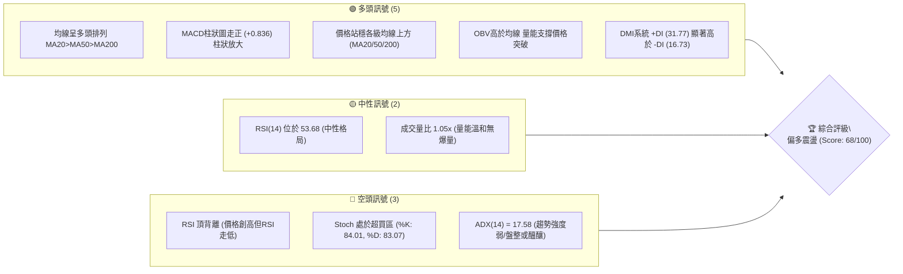
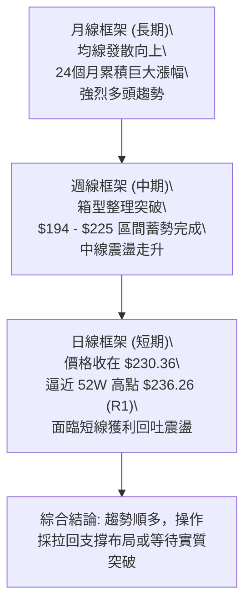
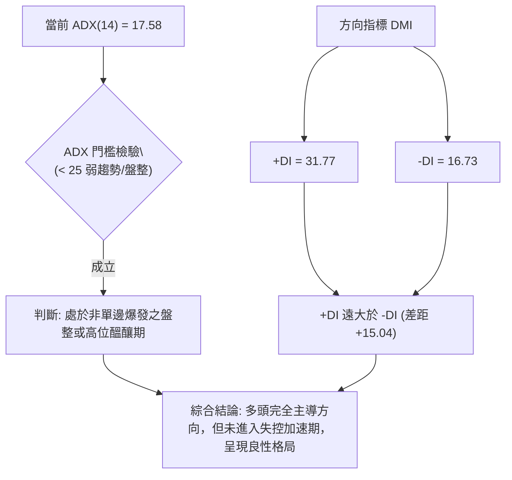
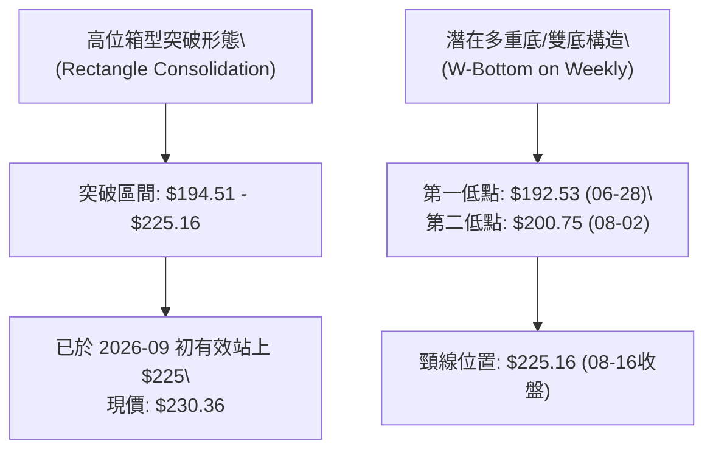
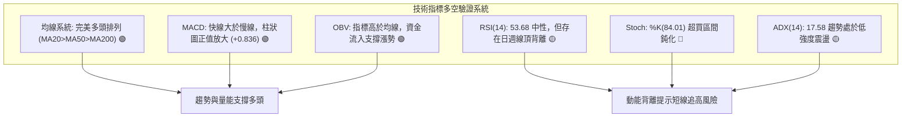
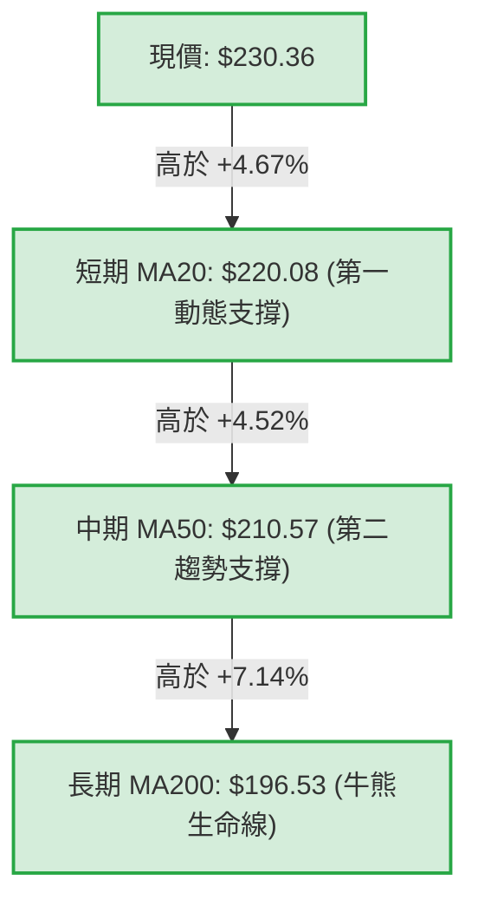
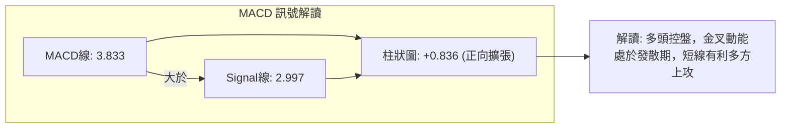
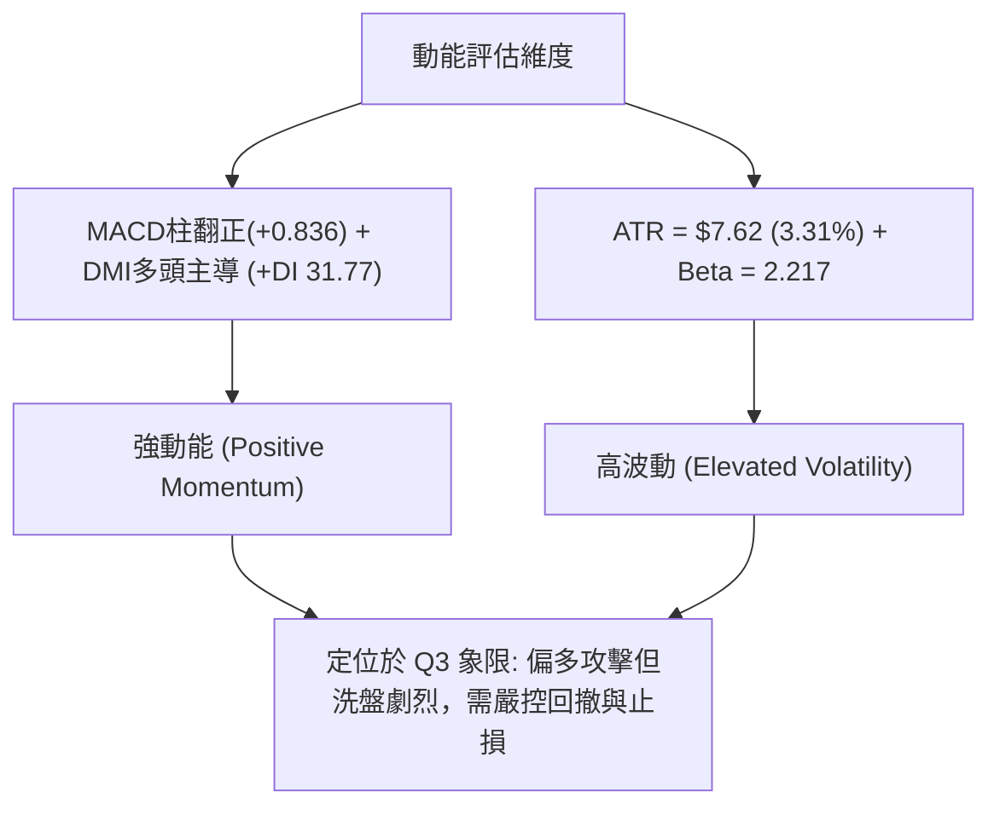
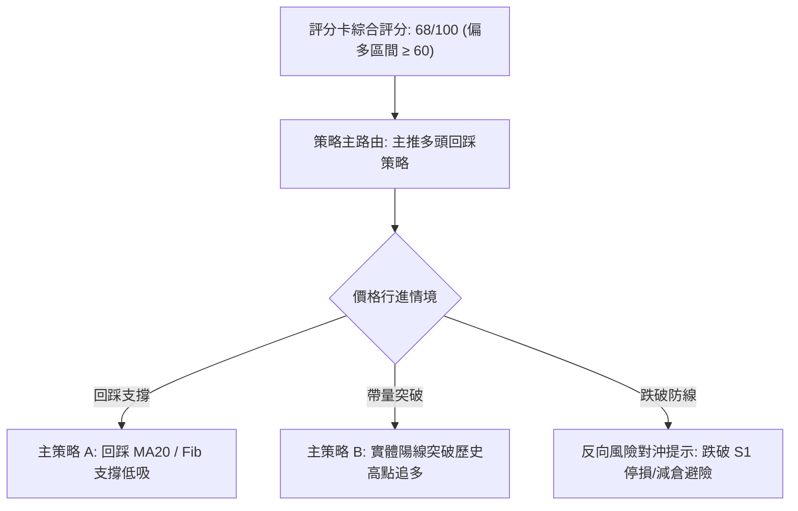
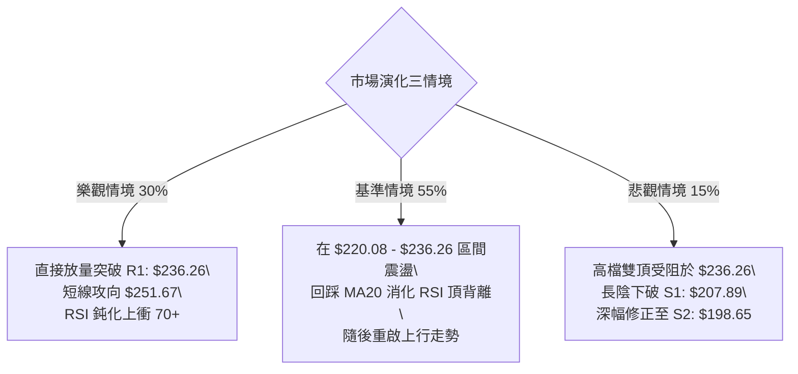

# NVDA 技術分析報告

> **報告日期**：2026-09-05 ｜ **語言**：繁體中文 ｜ **數據來源**：Yahoo Finance ｜ **當前價格**：$230.36

---

## 目錄

| 章節 | 內容 |
|------|------|
| [1. 技術面概覽](#1-技術面概覽) | 訊號儀表板、核心指標、評分卡 |
| [2. 趨勢分析](#2-趨勢分析) | 多時框趨勢、長中短期走勢、ADX解讀 |
| [3. 圖表形態分析](#3-圖表形態分析) | 形態識別、信心度評估、K線特徵 |
| [4. 支撐與阻力](#4-支撐與阻力) | 關鍵價位分布、波段聚類、斐波那契回調 |
| [5. 技術指標深度解讀](#5-技術指標深度解讀) | MA/RSI頂背離/MACD/布林/OBV量能 |
| [6. 動能與波動率](#6-動能與波動率) | 動能四象限、ATR波動分析、Beta相關性 |
| [7. 多時框架總結](#7-多時框架總結) | 時框矩陣、多時框收斂邏輯與唯一結論 |
| [8. 交易策略建議](#8-交易策略建議) | 策略路由、主推多頭策略、風報比與風控 |
| [9. 風險提示與監控](#9-風險提示與監控) | 監控清單、情境推演、倉位管理準則 |

---

## 1. 技術面概覽

### 🎯 技術訊號儀表板



### 📊 核心指標速覽表

| 指標類別 | 指標名稱 | 當前數值 | 訊號 | 解讀 |
|----------|----------|----------|------|------|
| **價格** | 當前價格 | $230.36 | 🟢 | 位於52週高低點區間 91.8%，處於絕對強勢高位區 |
| **均線** | MA20 | $220.08 | 🟢 | 價格在MA20上方 +4.67%，短期生命線維持向上斜率 |
| **均線** | MA50 | $210.57 | 🟢 | 價格在MA50上方 +9.40%，中期上升軌道支撐穩固 |
| **均線** | MA200 | $196.53 | 🟢 | 價格在MA200上方 +17.21%，長期多頭分界線基礎堅實 |
| **動能** | RSI(14) | 53.68 | 🟡 | 位於常態中性區間 (30–70)，但出現日線/週線頂背離警訊 |
| **動能** | MACD (12,26,9) | 3.833 / 2.997 | 🟢 | MACD線高於信號線，Hist值 +0.836，維持金叉買訊 |
| **動能** | Stoch %K / %D | 84.01 / 83.07 | 🔴 | 進入超買區 (>80)，短線面臨技術性回踩或橫盤洗盤壓力 |
| **趨勢** | ADX (14) | 17.58 | 🟡 | ADX < 25 表明處於弱趨勢或高位箱型整理，+DI(31.77) > -DI(16.73) |
| **通道** | 布林通道 %B | 0.92 | 🟡 | 逼近布林上軌 ($232.35)，面臨通道邊界反壓 |
| **量能** | OBV / 量比 | 1.05x | 🟢 | 最新量 134.9M 高於20日均量 128.9M，OBV高於MA，量價配合健康 |
| **波動** | ATR(14) | $7.62 | 🟡 | 佔股價 3.31%，波動度適中，提供明確止損與波動區間參考 |

### 🏆 技術評分卡

```
╔══════════════════════════════════════════════════════════════════╗
║                 技術評分卡 — NVDA (2026-09-05)                   ║
╠══════════════════════════════════════════════════════════════════╣
║ 趨勢強度 (Trend)      ████████████░░░░░░░░  60/100  🟡 中性偏多  ║
║ 動能指標 (Momentum)    ████████████░░░░░░░░  58/100  🟡 頂背離壓抑║
║ 支撐穩定度 (Support)   ████████████████░░░░  80/100  🟢 梯隊堅固  ║
║ 成交量配合 (Volume)    ██████████████░░░░░░  70/100  🟢 溫和放大  ║
║ 形態完整度 (Pattern)   ██████████████░░░░░░  70/100  🟢 矩形突破  ║
║ 均線排列 (Moving Avg)  ████████████████░░░░  82/100  🟢 完美多頭  ║
╠══════════════════════════════════════════════════════════════════╣
║ 綜合評分 (Overall)     █████████████░░░░░░░  68/100  🟢 偏多格局  ║
╚══════════════════════════════════════════════════════════════════╝
```

---

## 2. 趨勢分析

### 🌐 多時框趨勢分析

NVDA 的多時框結構展現出「長線強多、中線震盪走高、短線逼近高點壓制」的三層特徵。



### 📈 長期趨勢 — 12個月走勢圖（Unicode）

以下展示過去 12 個月（2025-10 至 2026-09）之收盤走勢與關鍵結構轉折點：

```
NVDA 月線走勢圖（過去12個月：2025-10 至 2026-09）
價格軸 ($)
$240 ┤                                                  ● (現價 $230.36)
$230 ┤                                            ●     │
$220 ┤                                      ●     │     │
$210 ┤ ● (2025-10高點 $202.23)       ●      │     │     │
$200 ┤ │                       ●     │      │     │     │
$190 ┤ │                 ●     │     │      │     │     │
$180 ┤ │     ●     ●     │     │     │      │     │     │
$170 ┤ └───●(低點)─┴───●(底部)─┴─────┴──────┴─────┴─────┴─────────
       10M   11M   12M   01M   02M   03M   04M   05M   06M   07M   08M   09M
      2025  2025  2025  2026  2026  2026  2026  2026  2026  2026  2026  2026
```

#### 走勢特徵分析表格

| 階段區間 | 起止月份 | 價格變化 | 漲跌幅 | 走勢特徵解讀 |
|----------|----------|----------|--------|--------------|
| **高位修正期** | 2025-10 → 2025-11 | $202.23 → $176.77 | -12.59% | 觸及兩百大關後急跌洗盤，確認中期回檔壓力 |
| **底部築底期** | 2025-12 → 2026-03 | $186.27 → $174.20 | -6.48% | 在 $174–$190 區間反覆打底，構築出堅實的中期底部基底 |
| **初升發動期** | 2026-03 → 2026-05 | $174.20 → $210.89 | +21.06% | 連續放量陽線突破底部，突破兩百點關卡創波段新高 |
| **高位蓄勢期** | 2026-05 → 2026-07 | $210.89 → $200.75 | -4.81% | 於 $200 心理關卡上方進行良性縮量整理，清洗浮額 |
| **主升加速期** | 2026-07 → 2026-09 | $200.75 → $230.36 | +14.75% | 均線再度多頭發散，推升股價直逼52週歷史高點 $236.26 |

### 📊 中期趨勢（週線分析）

從近 20 週的收盤價與籌碼換手觀察，NVDA 在 2026 年 6 月底至 7 月初完成回踩（2026-06-28 收 $192.53，2026-07-05 收 $194.83，此區域即為 S3: $194.51 支撐），隨後沿著 10 週均線持續走高。

```
中期結構壓力與支撐示意圖：
$236.26 ────────────────────────────── R1 (52W 高點，極限反壓區)
           ▲
           │ 現價 $230.36（高檔推進中）
           ▼
$220.08 ────────────────────────────── MA20 / BB中軌（動態第一防線）
$208.60 ────────────────────────────── Fib 38.2% / S1: $207.89（強支撐帶）
$198.65 ────────────────────────────── S2（波段起漲支撐平台）
```

### ⚡ 趨勢強度評估（ADX 解讀）



#### ADX 強度對照與市場狀態判定

| 指標變數 | 當前數值 | 門檻區間 | 市場狀態判定 | 交易涵義 |
|----------|----------|----------|--------------|----------|
| **ADX(14)** | 17.58 | < 20 (極弱/無趨勢) | 高位寬幅箱型整理 | 避免於通道外緣盲目追高，注重回踩低吸 |
| **+DI** | 31.77 | > 25 (多頭主導) | 買方力量充沛 | 回檔逢支撐有強烈買盤承接 |
| **-DI** | 16.73 | < 20 (空方虛弱) | 賣壓有限無顯著拋售 | 下跌空間受限，空頭缺乏持續性下殺動能 |
| **DI 差值** | +15.04 | 正值擴大 | 多頭佔據絕對優勢 | 趨勢基調堅定向上，中長期籌碼偏多鎖碼 |

---

## 3. 圖表形態分析

### 🔍 形態識別系統



#### 形態識別與信心度評估表

| 形態類別 | 信心度 | 判斷依據（引用數據） | 完成度 | 目標價（附嚴謹計算式） |
|----------|--------|----------------------|--------|------------------------|
| **高位箱型整理突破** | 75% | 股價在 2026-05 至 2026-08 期間多次受阻於 $225.06–$225.16，並在 $194.51（S3）獲得支撐。當前價格 $230.36 已明確脫離該箱型區間上緣。 | 85% | 突破點 $225.16 + (箱頂 $225.16 - 箱底 $194.51 = $30.65) = **$255.81**（由高位箱型突破高度推算） |
| **週線等級雙底 (W底)** | 65% | 兩次回踩低點分別為 2026-06-28 之 $192.53 與 2026-08-02 之 $200.75（均在 S2: $198.65 附近共振），頸線為 2026-08-16 收盤 $225.16。 | 80% | 頸線 $225.16 + (頸線 $225.16 - 基準低點 $198.65 = $26.51) = **$251.67**（由雙底形態高度推算） |
| **頭肩底形態** | 35% | 缺乏清晰左肩結構（數據中左側波動對稱性不足），訊號不足。 | 0% | 數據中未偵測到完整結構，不予計算。 |

### 🕯️ 重要K線形態分析

| 觀測週期 | 收盤價 | K線形態特徵 | 量價解讀 | 技術訊號 |
|----------|--------|-------------|----------|----------|
| **2026-08-16 (週線)** | $225.16 | 長陽實體突破線 | 當週成交量 500.4M，向上試探前高反壓帶 | 🟢 強烈買訊 |
| **2026-08-23 (週線)** | $214.72 | 縮量陰線回踩 | 週成交量縮至 484.9M（近20週最低量），確認拋壓極輕 | 🟡 良性洗盤 |
| **2026-08-30 (週線)** | $217.55 | 下影線整理陽線 | 週量劇增至 931.4M，主力資金於 MA20 附近大幅換手進場 | 🟢 籌碼沉澱 |
| **2026-09-06 (最新)** | $230.36 | 光頭中長陽線 | 突破 $225 頸線壓制，收在全週最高點，上攻動能恢復 | 🟢 突破確認 |

### 📉 ASCII 走勢形態示意圖

```
NVDA 近期高位箱型突破與雙底結構圖
─────────────────────────────────────────────────────────────────
$236.26 ┤                                            [R1 歷史高點]
        │                                      ▲
$230.36 ┤                                     ●┤ (現價突破)
$225.16 ┤───●───────────────●────────────────┼┴── [頸線/箱頂反壓]
        │   │               │                │
$214.72 ┤   │               │        ●       │
        │   │               │        │       │
$200.75 ┤   │               │   ●────┘ (右底)│
$198.65 ┤   │               │   │            │    [S2 核心頸線帶]
$194.51 ┤   └──●────────────┴───┘ (左底)     │    [S3 區間鐵底]
$192.53 ┤      └───────(06-28)───────(08-02)─┘
        └────────────────────────────────────────────────────────
```

### 🎯 形態目標價計算

根據上述經過信心度篩選的有效幾何圖表形態，推導出未來波段延伸目標：

1. **高位箱型整理突破目標價**：
   - 形態箱體底部基準：$194.51（S3）
   - 形態箱體頂部頸線：$225.16
   - 垂直高度（Height）：$225.16 - $194.51 = $30.65
   - **等距測幅目標價 1** = 頸線 $225.16 + $30.65 = **$255.81**（由高位箱型突破高度推算）

2. **週線 W 底形態目標價**：
   - 底部支撐平均聚類：$198.65（S2）
   - 突破頸線位置：$225.16
   - 形態垂直高度：$225.16 - $198.65 = $26.51
   - **等距測幅目標價 2** = 頸線 $225.16 + $26.51 = **$251.67**（由雙底形態高度推算）

---

## 4. 支撐與阻力

### 🗺️ 關鍵價位分布圖（Unicode）

```
NVDA 價位結構分布圖
═════════════════════════════════════════════════════════════════
$236.26 ║████████████████████████████████████████║ 52週歷史極限阻力 R1
        ║                                        ║ 斐波那契 0.0%
$230.36 ╠════════════════════════════════════════╣ ◄ 現價位置 (91.8% 分位)
$220.08 ║▓▓▓▓▓▓▓▓▓▓▓▓▓▓▓▓▓▓▓▓▓▓▓▓▓▓▓▓            ║ 動態支撐 (MA20 / BB中軌)
$219.18 ║▓▓▓▓▓▓▓▓▓▓▓▓▓▓▓▓▓▓▓▓▓▓▓▓▓▓▓▓            ║ 斐波那契 23.6% 回調位
$208.60 ║████████████████████████                ║ 斐波那契 38.2% 回調位
$207.89 ║████████████████████████████████        ║ 波段關鍵支撐 S1
$200.06 ║████████████████                        ║ 斐波那契 50.0% / 整數大關
$198.65 ║████████████████████████████            ║ 強支撐 S2 (中期多空分水嶺)
$194.51 ║████████████████████████████████████    ║ 區間結構鐵底 S3
$191.51 ║████████                                ║ 斐波那契 61.8% 黃金分割
═════════════════════════════════════════════════════════════════
```

### 🚧 阻力位分析表

所有價位均嚴格引用 OHLCV 計算所得之波段高點聚類與斐波那契位：

| 阻力級別 | 價位 | 形成原因與技術共振 | 突破難度 | 重要性 |
|----------|------|--------------------|----------|--------|
| **R1** | **$236.26** | 52週歷史最高點（距現價 +2.56%），歷史套牢盤與高檔心理停利賣壓沉重 | 🔴 極高 | 關鍵分水嶺，一旦帶量實體突破，上方將開啟無套牢籌碼的真空主升浪 |
| **R2** | 數據中未偵測到 | 近一年無更高波段高點聚類（上方為歷史未探索之歷史新高區域） | — | — |
| **R3** | 數據中未偵測到 | 數據中未偵測到 | — | — |

### 🛡️ 支撐位分析表

所有價位嚴格引用 OHLCV 聚類計算之波段低點：

| 支撐級別 | 價位 | 形成原因與技術共振 | 守住機率 | 重要性 |
|----------|------|--------------------|----------|--------|
| **S1** | **$207.89** | 近一年重要波段低點聚類（距現價 -9.75%），與斐波那契 38.2% ($208.60) 及布林下軌 ($207.81) 高度重疊 | 🟢 80% | 短期強弱分水嶺，回踩不破代表上升強勢形態完整 |
| **S2** | **$198.65** | 近一年次級波段低點（距現價 -13.76%），緊扣 $200 整數大關與 MA200 ($196.53) | 🟢 88% | 中期多頭防線，機構買盤長期持倉成本密集區 |
| **S3** | **$194.51** | 近一年結構性底部聚類（距現價 -15.56%），2026年6-7月雙底打底平台 | 🟢 95% | 牛熊轉換終極底線，跌破則宣告長期上升結構遭到破壞 |

### 📐 斐波那契回調位分析

依據 52 週完整波動區間（低點 **$163.85** 至 高點 **$236.26**，總波幅 $72.41）精確計算，現價 **$230.36** 位於 **0.0% ($236.26)** 與 **23.6% ($219.18)** 之間：

```
斐波那契回調梯隊（52W 區間 $163.85 → $236.26）：
─────────────────────────────────────────────────────────────────
 0.0%  (52W High) : $236.26 ──── 歷史最高壓力線 (上方空間僅 +2.56%)
 [現價 $230.36 落在 0.0% - 23.6% 極強勢區間]
23.6%            : $219.18 ──── 第一級回調位 (共振 MA20: $220.08)
38.2%            : $208.60 ──── 第二級強支撐 (共振 S1: $207.89)
50.0%            : $200.06 ──── 多空中軸支撐 (共振 $200 整數心理防線)
61.8%            : $191.51 ──── 黃金分割防守位 (共振 S3 下方緩衝區)
78.6%            : $179.35 ──── 深度回撤防線
100.0% (52W Low) : $163.85 ──── 52週絕對底部起漲點
─────────────────────────────────────────────────────────────────
```
- **解讀**：股價位於 0.0% 至 23.6% 的極淺層回撤帶，展現出典型的強勢多頭特徵。只要拉回不跌破 23.6% ($219.18)，多方隨時具備再度挑戰並突破歷史高點 $236.26 的動能。

---

## 5. 技術指標深度解讀

### 🎛️ 指標訊號總覽



### 📈 移動平均線排列分析

NVDA 當前展現出極為標準的多頭排列格局（Bullish Alignment）：
- **短期均線**：MA5 ($224.29) > MA10 ($219.82) > MA20 ($220.08)，價格收在 $230.36，位於所有短均之上。
- **中長期均線**：MA60 ($209.62) > MA120 ($204.97) > MA240 ($195.13)。
- **核心趨勢指標**：現價 $230.36 遠高於 MA200 ($196.53)，差距達 +17.21%。MA20 ($220.08) 與 MA50 ($210.57) 斜率均向上翹起，證明多頭成本持續墊高，下檔均線支撐力道層層堆疊。



### 📉 RSI(14) 分析與背離判定

- **當前讀數**：**53.68**
- **區間進度**：
  ```
  RSI(14) 強度：[0] ────────── [30] ────── [53.68] ────── [70] ────────── [100]
  狀態展示    ：░░░░░░░░░░░░░░░░░░░░████████████░░░░░░░░░░  53.68% (常態中性)
  ```
- **背離分析（關鍵結論）**：
  - **⚠️ 明確存在頂背離（Bearish Divergence）**。
  - **技術事證**：回顧 2026-04-26，股價在 $208.03 時，週線 RSI 高達 **86.7**；2026-08-16 股價推升至 $225.16 時，RSI 降至 **75.4**；而當前 2026-09-06 價格創波段新高達 **$230.36**，RSI 卻僅有 **53.68**（日線中性，週線動能顯著衰退）。
  - **結論**：價格創高而動能震盪走低，發出嚴重頂背離預警，暗示在挑戰 52 週高點 $236.26 時，極易遭遇動能衰竭而出現技術性拉回。

### 📊 MACD(12,26,9) 訊號解讀

- **MACD 快線**：3.833
- **Signal 慢線**：2.997
- **MACD Histogram**：**+0.836**（🟢 看多）


- **柱狀圖動態**：週線 MACD 柱狀圖從 2026-08-30 的 -0.486 翻正至當前 +0.836，結束了為期兩週的弱勢回檔，多頭買盤重新掌控盤面短線節奏。

### 📦 布林通道分析（Bollinger Bands）

布林通道參數設為 20 日均線（SMA20）與 2 倍標準差：
- **BB 上軌**：$232.35
- **BB 中軌 (MA20)**：$220.08
- **BB 下軌**：$207.81
- **通道指標 %B**：**0.92**

```
布林通道結構與現價相對位置：
─────────────────────────────────────────────────────────────────
$232.35 ┤ ═══════════════════════════════════════ BB 上軌 (+2σ)
$230.36 ┤                             ● (現價 %B = 0.92，逼近上軌邊界)
        │
$220.08 ┤ ─────────────────────────────────────── BB 中軌 (MA20 生命線)
        │
$207.81 ┤ ═══════════════════════════════════════ BB 下軌 (-2σ)
─────────────────────────────────────────────────────────────────
```
- **解讀**：%B 達 0.92，表明價格已運行至極限超買邊界，且上軌 $232.35 與歷史壓力 R1: $236.26 形成僅 $3.91 的狹窄共振阻力帶。若無爆發性巨量配合，股價在上軌處受阻回抽中軌 $220.08 的機率極高。

### 💹 成交量分析（量價配合度）

- **最新日成交量**：134,946,800 股
- **20 日均量**：128,899,820 股（**量比：1.05x**）
- **50 日均量**：131,326,692 股
- **OBV 趨勢**：OBV > MA，維持上升趨勢線之上。
- **量價診斷**：
  - 當前量比為 1.05x，呈現溫和放量狀態，並非放量滯漲或恐慌拋售。
  - OBV 維持在移動平均線上方，表明自 2026 年 7 月以來的反彈具備機構資金實質沉澱，量能結構支持長期價格上行，但突破 $236.26 前仍需觀察量能能否放大至 1.5x 以上。

---

## 6. 動能與波動率

### ⚡ 動能評估四象限

將技術指標之動能強度（MACD柱狀圖、RSI）與波動率維度（ATR、布林頻寬）交叉比對：

| 象限代號 | 動能強度 | 波動率狀態 | 當前市場狀態判定 | 操作評估與技術意涵 |
|----------|----------|------------|------------------|--------------------|
| **Q1** | 強動能 | 低波動 | — | 最佳趨勢波段機會 |
| **Q2** | 弱動能 | 低波動 | — | 區間低位蟄伏，謹慎觀望 |
| **Q3** | **強動能** | **中/高波動** | **✓ (NVDA 當前定位)** | **高勝率但伴隨高震盪，適合拉回支撐做多** |
| **Q4** | 弱動能 | 高波動 | — | 破位下殺，嚴禁盲目抄底 |



### 📊 ATR 波動率分析

- **ATR(14)**：**$7.62**（佔現價 3.31%）
- **日內波幅技術解讀**：NVDA 單日正常波動區間約在 $7.62 左右。這意味著在日內或短期震盪中，低於 $7.62 的波動均屬於雜訊範圍。
- **止損距離建議**：
  - **短線交易（1.5 × ATR）**：止損寬度需設定至少 $11.43。以現價 $230.36 衡量，短線保護點應置於 $218.93 之下（緊扣 Fib 23.6% $219.18）。
  - **波段交易（2.0 × ATR）**：止損寬度建議為 $15.24，對應支撐錨定在 $215.12，防守區間落於 S1 ($207.89) 與 MA20 ($220.08) 之間。

### 📐 Beta 與市場相關性

- **Beta 係數**：**2.217**
- **市場特徵分析**：
  - Beta 高達 2.217，意味著 NVDA 具備大盤（S&P 500 / 標普指數）**2.2 倍以上**的波動彈性。在大盤處於上漲浪潮中，NVDA 具有顯著的超額報酬（Alpha）；然而一旦總體市場情緒轉弱，其回撤幅度亦將被非線性放大。
  - 交易者在倉位管理上必須根據高 Beta 特性將部位規模適度降至正常配置的 60%–70%，以平衡帳戶波動風險。

---

## 7. 多時框架總結

### 📋 時框架評分表

| 時框架 | 趨勢方向 | 動能狀態 | 均線排列 | 形態結構 | 綜合評分 | 戰術建議 |
|--------|----------|----------|----------|----------|----------|----------|
| **月線 (長期)** | 🟢 強烈看多 | 🟢 健康 | 🟢 多頭排列 | 歷史大底反轉向上 | **88/100** | 長期投資者堅定持股，享受趨勢紅利 |
| **週線 (中期)** | 🟢 偏多向上 | 🟡 頂背離 | 🟢 MA20>MA50 | 箱型整理放量突破 | **72/100** | 波段回踩支撐加碼，不追高突破 |
| **日線 (短期)** | 🟡 震盪偏多 | 🔴 超買鈍化 | 🟢 站穩均線 | 逼近前高 R1 反壓 | **62/100** | 短線面臨回吐壓力，等待回踩切入 |

### 🔲 綜合訊號矩陣

```
時框訊號收斂矩陣：
╔══════════════╦══════════════╦══════════════╦══════════════╗
║ 指標維度     ║ 長期 (月線)  ║ 中期 (週線)  ║ 短期 (日線)  ║
╠══════════════╬══════════════╬══════════════╬══════════════╣
║ 趨勢方向     ║ 🟢 強多      ║ 🟢 偏多      ║ 🟡 震盪整理  ║
║ 均線系統     ║ 🟢 完美多頭  ║ 🟢 多頭排列  ║ 🟢 站上MA5   ║
║ 動能指標     ║ 🟢 充沛      ║ 🟡 頂背離隱憂║ 🔴 Stoch超買 ║
║ 量能配合     ║ 🟢 主力進駐  ║ 🟢 OBV支撐   ║ 🟡 1.05x溫和 ║
║ 波動狀態     ║ 🟢 穩定上行  ║ 🟡 震盪加劇  ║ 🟡 逼近上軌  ║
╚══════════════╩══════════════╩══════════════╩══════════════╝
```

### ⚖️ 多時框收斂結論（依規則 14 執行）

1. **市場性質判定**：當前 ADX(14) 讀數為 **17.58**（小於 25 臨界值），明確判定當前處於**「非單邊大趨勢之高位箱型整理行情」**。
2. **多時框優先級權重**：
   - 依規則 14，在 ADX < 25 的盤整格局下，日線布林通道上下軌（$207.81 – $232.35）及中長期關鍵支撐阻力為主要交易與邊界依託。
   - 儘管日線面臨 RSI 頂背離與 Stoch 超買的短線回檔壓力，但週線與月線之均線系統（MA20/50/200）呈標準多頭排列，且 +DI (31.77) 牢牢壓制 -DI (16.73)，顯示整體中長期牛市架構完好無損。
3. **唯一收斂方向性結論**：
   - **【偏多震盪，拉回布局】**。短線嚴禁在布林上軌與 R1: $236.26 阻力區追價；主策略嚴格錨定在股價回踩動態 MA20 或關鍵支撐位時逢低進場。

---

## 8. 交易策略建議

### 🗺️ 策略決策流程圖



### 🧭 策略路由（依評分卡分流）

> **當前主策略方向 = 【主推多頭策略】（依評分卡 68/100 偏多判定）**
> 
> 空頭方向不單獨推薦主動開倉策略，僅列為多頭頭寸之「反轉風險觸發點與風控止損機制」。

### 🎯 價格情境階梯（Price Scenarios）

價位嚴格引用第 4 章由 OHLCV 聚類計算之標準數值：

| 觸發條件 | 關鍵價位階梯 | 後續目標延伸 | 情境技術含義 |
|----------|--------------|--------------|--------------|
| **突破極限阻力** | 帶量突破 **R1: $236.26** | **$251.67** (W底目標) → **$255.81** (箱體目標) | 歷史真空主升浪啟動，多頭加速 |
| **區間強勢震盪** | 運行於 **$219.18** 至 **$232.35** | 震盪消化布林上軌與歷史高點賣壓 | 高位整固，蓄勢突破 |
| **跌破第一防線** | 跌破 **S1: $207.89** | 下探 **S2: $198.65**（整數關卡） | 中期轉入深幅回調洗盤 |
| **跌破終極底線** | 跌破 **S3: $194.51** | 破位轉空，下探 Fib 78.6% $179.35 | 牛市上升結構破壞，轉為防禦 |

### 📊 情境機率分佈

| 情境類別 | 發生機率 | 主要技術指標與籌碼依據 |
|----------|----------|------------------------|
| **高位震盪後上行突破** | **60%** | 均線多頭排列未破、MACD柱狀圖翻正擴張 (+0.836)、OBV資金穩定流入。 |
| **強勢區間橫盤整理** | **25%** | ADX 僅 17.58 表明趨勢動力溫和、布林通道帶寬收斂、需要時間消化 RSI 頂背離。 |
| **深度回撤再次探底** | **15%** | RSI 頂背離誘發獲利了結賣壓、Stoch 超買技術性修正引發短線踩踏。 |

### 🟢 主策略詳情（多頭進場設計）

```
主策略防守與進場空間規劃圖：
─────────────────────────────────────────────────────────────────
目標價 T2  : $251.67 ───── (由雙底形態高度推算)
目標價 T1  : $236.26 ───── (R1 52週歷史高點)
現價參考   : $230.36 ───── (高位醞釀區)
進場區間 B : $225.16 ───── (策略B: 突破回踩確認進場)
進場區間 A : $220.08 ───── (策略A: 回踩 MA20 / Fib 23.6% 進場)
止損價格   : $213.50 ───── (低於關鍵均線與 ATR 防守帶)
─────────────────────────────────────────────────────────────────
```

| 策略要素 | 策略 A：回踩均線低吸策略（左側/穩健） | 策略 B：右側突破加碼策略（激進/趨勢） |
|----------|---------------------------------------|---------------------------------------|
| **進場條件** | 價格拉回至 MA20 與 Fib 23.6% 支撐帶，出現止跌長下影線 | 日線實體收盤價突破 R1 ($236.26)，且日量比 > 1.3x |
| **進場價格** | **$220.08**（精確對應 MA20 與 Fib 23.6% 支撐） | **$236.50**（突破 R1 $236.26 後確認點） |
| **目標價 T1** | **$236.26**（R1 52週高點，預期回報 +7.35%） | **$251.67**（由雙底形態高度推算，回報 +6.41%） |
| **目標價 T2** | **$251.67**（形態推算目標，預期回報 +14.35%）| **$255.81**（由箱型突破高度推算，回報 +8.16%） |
| **止損價格** | **$213.50**（跌破 MA20 減 1×ATR 之防守位） | **$228.80**（R1 假突破跌回布林中軌上方） |
| **風險報酬比** | **1 : 2.45**（風險 $6.58，目標1報酬 $16.18） | **1 : 1.97**（風險 $7.70，目標1報酬 $15.17） |
| **成功機率** | **65%** | **55%** |
| **建議倉位** | **15%**（基礎波段配置） | **10%**（追隨動能配置） |

### 🔴 反向風險觸發點（對沖提示）

若出現以下訊號，必須推翻多頭主策略，立即執行防禦措施：
1. **第一減倉信號**：日線實體陰線有效跌破 **MA20 ($220.08)**，同時 MACD 柱狀圖由正轉負。處置：降低 50% 多頭持倉。
2. **多單全面離場信號**：股價跌破 **S1: $207.89**（共振布林下軌 $207.81 與 Fib 38.2% $208.60）。處置：多單全部止損離場，短線多頭結構破壞。
3. **避險空單觸發點**：若大盤同步轉弱，股價反抽受阻於 $207.89 並進一步失守 **S2: $198.65**，可建立相應的反向 ETF 或期權對沖部位，下看 S3: $194.51。

### ⭐ 整體訊號強度評星

```
╔══════════════════════════════════════════════════════════════════╗
║ 做多訊號強度：★★★★☆  (4/5星 — 均線與量能強勁，唯受背離壓抑)     ║
║ 做空訊號強度：★☆☆☆☆  (1/5星 — 逆勢做空風險極大，僅防禦觸發)     ║
║ 整體可信度：  ★★★★☆  (4/5星 — 多時框共振度高，數據支持明確)     ║
╚══════════════════════════════════════════════════════════════════╝
```

---

## 9. 風險提示與監控

### ✅ 關鍵監控指標 Checklist

```
╔══════════════════════════════════════════════════════════════════╗
║                 每日技術面關鍵監控清單 (Checklist)               ║
╠══════════════════════════════════════════════════════════════════╣
║ [ ] 價格是否突破 52W 高點 R1: $236.26 (需伴隨成交量 > 1.5億股)  ║
║ [ ] RSI(14) 能否重回 60 以上化解頂背離形態                       ║
║ [ ] MA20 動態支撐 ($220.08) 是否維持每日持續向上斜率            ║
║ [ ] Stoch %K 是否在高檔向下死叉 %D 形成短線賣訊                 ║
║ [ ] 日成交量是否萎縮至 20 日均量 (128.9M) 之下過度惜售          ║
║ [ ] 跌破 Fib 23.6% ($219.18) 時是否有機構護盤買盤進駐          ║
║ [ ] 宏觀半導體板塊指數與 Beta (2.217) 波動聯動狀況              ║
╚══════════════════════════════════════════════════════════════════╝
```

### ⚠️ 風險場景分析



### 🛡️ 風險管理重要提醒

1. **頂背離回調風險**：
   - 目前日線與週線的 RSI 頂背離是盤面最顯著的技術隱患。歷史數據表明，頂背離極易引發「假突破真洗盤」的走勢。因此，絕不可在現價 $230.36 盲目追高，必須堅守「等待回踩 MA20 ($220.08) 進場」的紀律。
2. **高 Beta 倉位縮減準則**：
   - 由於 NVDA Beta 高達 2.217，整體單一標的持倉佔總投資組合比重建議不得超過 **15%–20%**。單次交易的最大本金虧損風險必須嚴格限制在總資產的 **1.0%–1.5%** 範圍內。
3. **止損紀律的不可逆性**：
   - 若執行策略 A，一旦市價跌破設定之止損位 **$213.50**，必須無條件平倉離場，嚴禁凹單或盲目向下攤平，避免承受 S1/S2 破位後的巨大下行風險。

---

## 📋 報告總結

```
╔══════════════════════════════════════════════════════════════════╗
║                    NVDA 技術分析報告總結                         ║
╠══════════════════════════════════════════════════════════════════╣
║ 報告日期：2026-09-05                                             ║
║ 當前價格：$230.36                                                ║
║ 分析評級：🟢 偏多格局 (綜合評分: 68/100)                         ║
║                                                                  ║
║ 關鍵結論：                                                       ║
║ ├─ 長期趨勢：🟢 強烈看多 (MA200: $196.53 向上發散，月線牛市完好) ║
║ ├─ 中期趨勢：🟢 偏多震盪 (突破高位箱型，唯週線存在 RSI 頂背離)   ║
║ ├─ 短期趨勢：🟡 逼近反壓 (處布林上軌與 52W 高點 $236.26 壓制區) ║
║ ├─ 關鍵阻力：R1: $236.26 (52W歷史高點)                          ║
║ ├─ 關鍵支撐：S1: $207.89 / S2: $198.65 / S3: $194.51             ║
║ └─ 分析師目標：華爾街平均目標價 $327.13 (最高 $515.00)           ║
║                                                                  ║
║ 最優策略組合：                                                   ║
║ 1. 🥇 最佳機會：策略 A — 回踩 MA20 ($220.08) 布局多單，看 R1     ║
║ 2. 🥈 次選機會：策略 B — 帶量實體突破 R1 ($236.26) 順勢跟進追多   ║
║ 3. 🥉 防守機制：跌破 S1 ($207.89) 多單無條件停損出場             ║
╚══════════════════════════════════════════════════════════════════╝
```

---

> ⚠️ **免責聲明**：本報告為技術分析研究成果，所有價位、圖表及預測數據均基於歷史量價數據之客觀演算。本報告**僅供學術研究與投資參考**，**不構成任何形式的個人化投資建議或買賣邀約**。金融市場瞬息萬變，投資人應獨立審慎評估風險並自負盈虧。

---

*報告生成時間：2026-09-05 ｜ 數據來源：Yahoo Finance ｜ 分析框架：多時框技術分析體系*