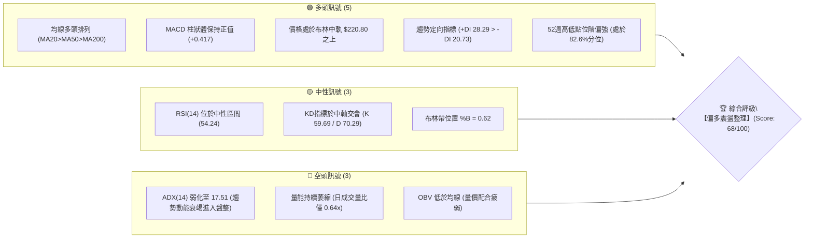
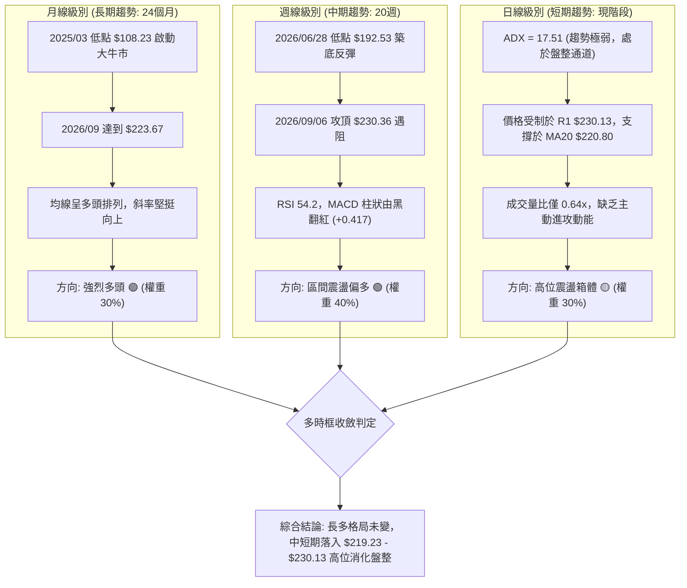
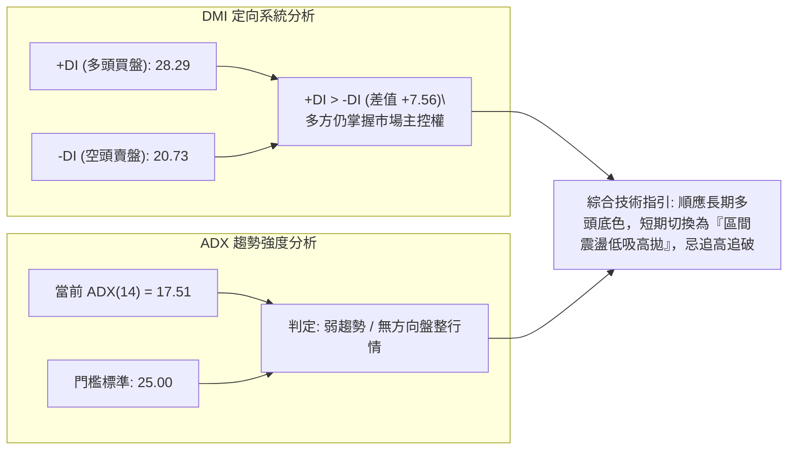
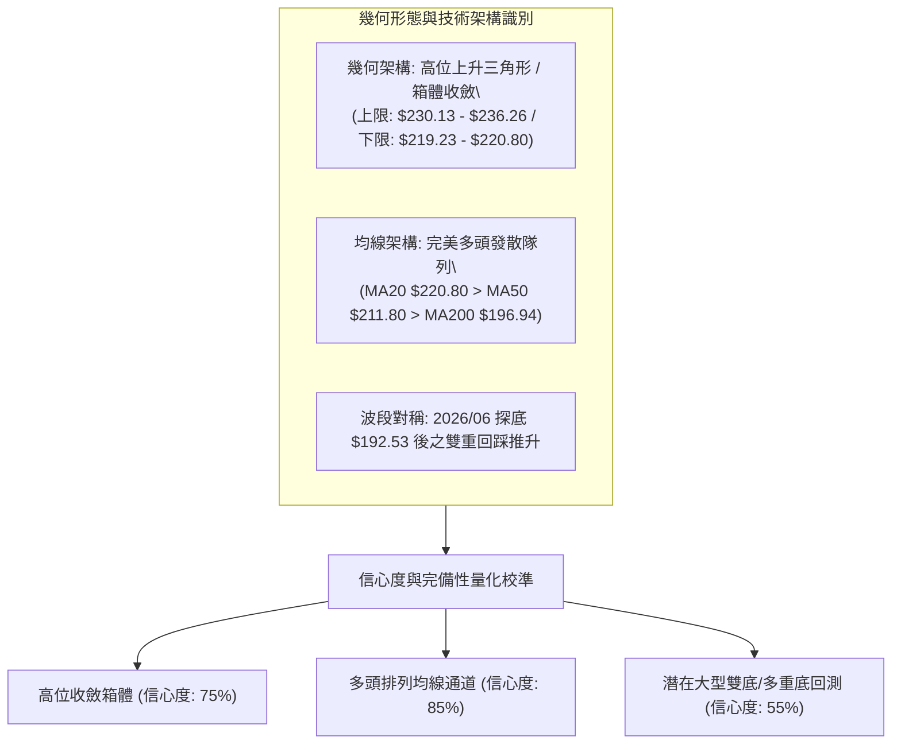
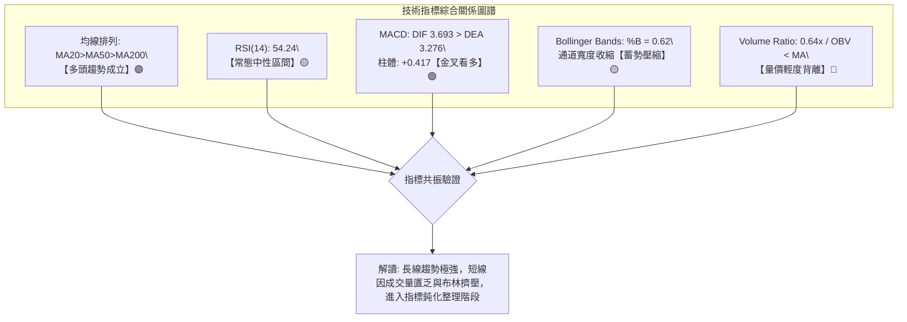
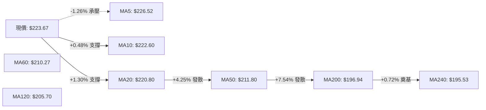
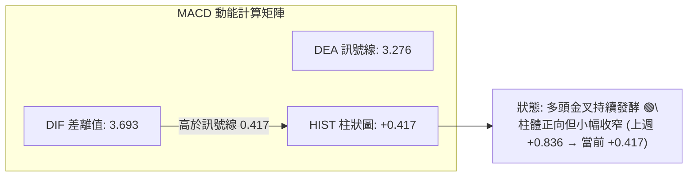
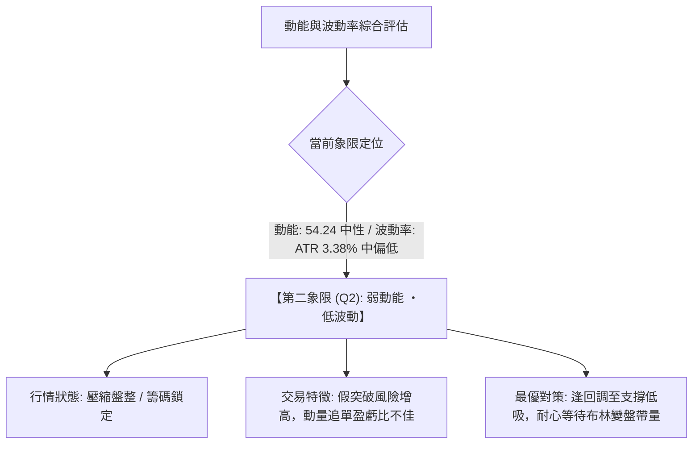
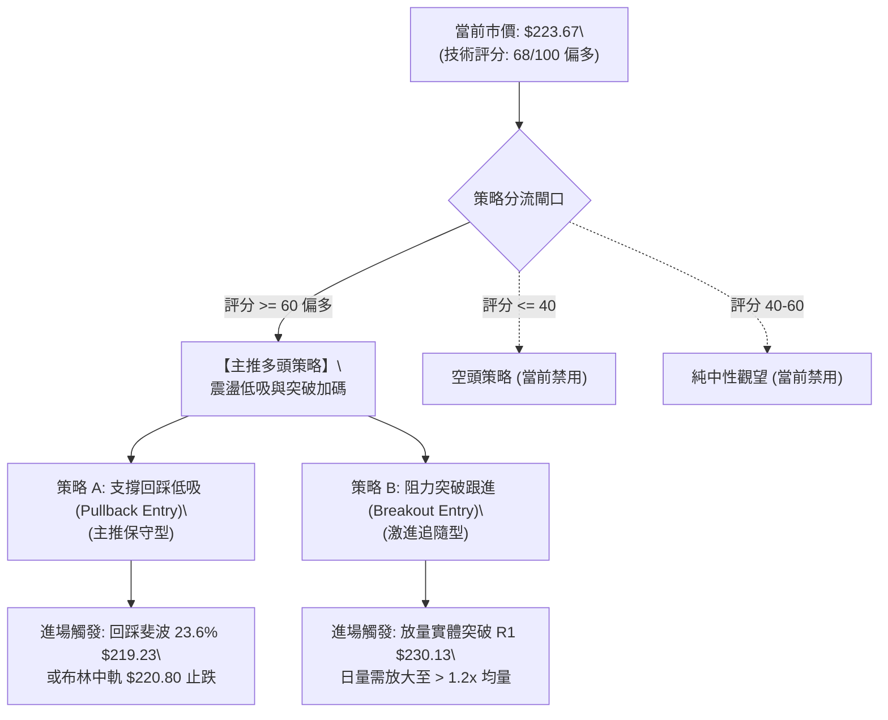
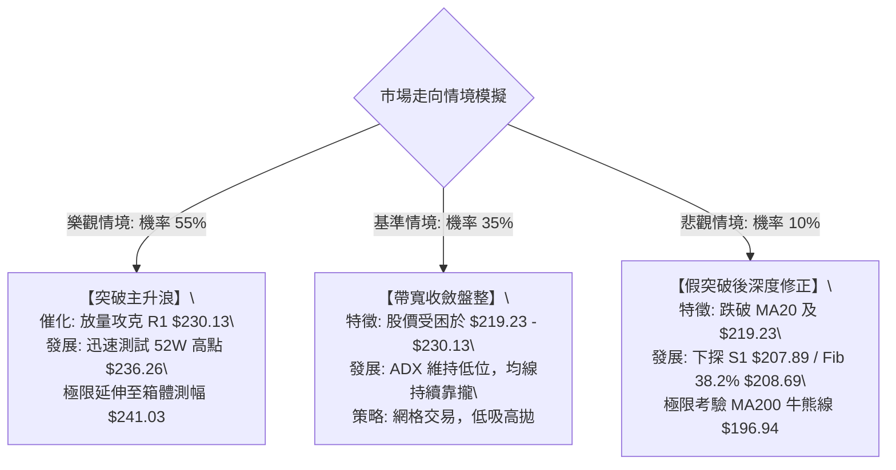

# NVDA 技術分析報告

> **報告日期**：2026-09-10 ｜ **語言**：繁體中文 ｜ **數據來源**：Yahoo Finance ｜ **當前價格**：$223.67

---

## 目錄

| 章節 | 內容 |
|------|------|
| [1. 技術面概覽](#1-技術面概覽) | 訊號儀表板、核心指標、評分卡 |
| [2. 趨勢分析](#2-趨勢分析) | 多時框趨勢、長中短期走勢、ADX解讀 |
| [3. 圖表形態分析](#3-圖表形態分析) | 形態識別、信心度評估、K線組合、目標價推算 |
| [4. 支撐與阻力](#4-支撐與阻力) | 關鍵價位分佈、阻力/支撐分析表、斐波那契回調 |
| [5. 技術指標深度解讀](#5-技術指標深度解讀) | MA排列、RSI、MACD、布林通道、量價OBV |
| [6. 動能與波動率](#6-動能與波動率) | 動能四象限、ATR波動分析、Beta風險特徵 |
| [7. 多時框架總結](#7-多時框架總結) | 時框架評分矩陣、收斂規則與唯一方向結論 |
| [8. 交易策略建議](#8-交易策略建議) | 策略路由、情境階梯與機率、多頭交易策略詳情 |
| [9. 風險提示與監控](#9-風險提示與監控) | 監控清單、情境模擬樹狀圖、倉位風控指引 |
| [📋 報告總結](#-報告總結) | 核心摘要儀表卡 |

---

## 1. 技術面概覽

### 🎯 技術訊號儀表板



### 📊 核心指標速覽表

| 指標類別 | 指標名稱 | 當前數值 | 訊號 | 解讀 |
|----------|----------|----------|------|------|
| **價格** | 當前收盤價 | $223.67 | 🟢 多頭 | 站穩中長期各均線，處於52週高位區（82.6%分位） |
| **均線** | MA20 | $220.80 | 🟢 看多 | 價格高於MA20達 +1.30%，構成短期動態支撐帶 |
| **均線** | MA50 | $211.80 | 🟢 看多 | 價格顯著高於中期生命線，中期結構穩固 |
| **均線** | MA200 | $196.94 | 🟢 看多 | 價格大幅高於長期牛熊線（+$26.73），長期牛市確立 |
| **動能** | RSI(14) | 54.24 | 🟡 中性 | 處於50–60中性常態區域，無超買或超賣極端現象 |
| **動能** | MACD (12,26,9) | DIF: 3.693 / DEA: 3.276 / 柱: +0.417 | 🟢 看多 | DIF>DEA呈多頭排列，柱狀體維持正值但動能趨緩 |
| **動能** | KD(Stoch 14,3,3) | %K: 59.69 / %D: 70.29 | 🟡 中性 | %K自超買區微幅回落交叉%D，短期動能小幅消化 |
| **趨勢** | ADX / DMI(14) | ADX: 17.51 (+DI: 28.29, -DI: 20.73) | 🟡 盤整 | ADX < 25 判定為弱趨勢盤整；+DI領先表示多頭控盤 |
| **通道** | Bollinger Bands | 上軌: $233.25 / 中軌: $220.80 / 下軌: $208.34 | 🟢 偏多 | 價格在通道上半部運行（%B: 0.62），帶寬收斂盤整 |
| **量能** | Volume / OBV | 日量: 82.74M (均量比 0.64x) / OBV < MA | 🔴 疲弱 | 量能顯著萎縮，量價存在輕度頂部背離跡象 |
| **波動** | ATR(14) | $7.56 (3.38% 股價波動率) | 🟡 中等 | 日間波動空間約 $7.56，提供合適的止損緩衝邊際 |

### 🏆 技術評分卡

```
╔══════════════════════════════════════════════════════════════╗
║                技術評分卡 — NVDA (2026-09-10)                 ║
╠══════════════════════════════════════════════════════════════╣
║ 均線排列 (Trend Alignment)  ██████████████████░░  90/100 🟢  ║
║ 動能指標 (Momentum Engines) ████████████░░░░░░░░  60/100 🟡  ║
║ 趨勢強度 (ADX Trend Power)  ████████░░░░░░░░░░░░  40/100 🔴  ║
║ 支撐穩定度 (Support Levels) ████████████████░░░░  80/100 🟢  ║
║ 圖表形態 (Pattern Quality)  ██████████████░░░░░░  70/100 🟡  ║
║ 成交量配合 (Volume Profile) ██████████░░░░░░░░░░  50/100 🟡  ║
╠══════════════════════════════════════════════════════════════╣
║ 綜合技術評分 (Composite)    █████████████░░░░░░░  68/100 🟢  ║
║ 綜合技術評級                【偏多區間震盪 / 蓄勢待發】       ║
╚══════════════════════════════════════════════════════════════╝
```

---

## 2. 趨勢分析

### 🌐 多時框趨勢分析



### 📈 長期趨勢 — 12個月走勢圖（Unicode）

以下為 NVDA 過去12個月（2025-10 至 2026-09）之歷史月線收盤走勢圖，標注歷史次高點與關鍵回測低點：

```
NVDA 月線走勢圖（過去12個月：2025-10 至 2026-09）
價格軸 ($)
$230 ┤                                                 ● $223.67 (現價)
$220 ┤                                             ● $220.78
$210 ┤                             ● $210.89
$200 ┤ ● $202.23 (階段高點)       ● $199.34   ● $200.09 ● $200.75
$190 ┤                 ● $190.90
$180 ┤     ● $176.77 ● $186.27 ● $176.97
$170 ┤                         ● $174.20 (中期低點)
     └─────────────────────────────────────────────────────────────
       10    11    12    01    02    03    04    05    06    07    08    09 (月份)
      2025                                2026
```

#### 走勢特徵分析表格

| 階段區間 | 起止價格 | 漲跌幅 | 走勢結構與技術特徵解讀 |
|----------|----------|--------|------------------------|
| **2025-10 至 2025-11** | $202.23 → $176.77 | -12.59% | **階段頂部獲利回吐**：首度衝破200大關後引發快速回洗，測試MA60支撐。 |
| **2025-12 至 2026-03** | $186.27 → $174.20 | -6.48% | **箱體底部構築期**：於 $174.20 尋得堅實中期底部（對應52週低位區間反彈中軸）。 |
| **2026-04 至 2026-05** | $199.34 → $210.89 | +5.79% | **主升浪突破**：放量突破200美元整數關卡，各天期均線發散上揚。 |
| **2026-06 至 2026-07** | $200.09 → $200.75 | +0.33% | **高位橫盤強勢蓄勢**：連續兩月收盤穩定鎖定於200美元之上，清洗短線浮籌。 |
| **2026-08 至 2026-09** | $220.78 → $223.67 | +1.31% | **攻堅延伸浪**：創出52週高點 $236.26 後於高檔震盪，月線呈現大級別多頭階梯。 |

### 📊 中期趨勢（週線分析）

從近20週收盤走勢觀察，NVDA 在 2026-06-28 創下近五個月波段低點 $192.53（非常接近斐波那契61.8%之 $191.65 與支撐 S3 $194.51）後展開強勁的「V形修復 + 階梯上揚」行情。8月中旬股價衝刺至 $225.16，隨後在9月初上探至 $230.36，最高逼近52週歷史高點 $236.26。

```
近期週線壓力與支撐示意圖：
$236.26 ────────────────────────────── 52W High / 絕對歷史強阻力 (R2)
$230.13 ────────────────────────────── 密集高點成交區 (R1) ◄ 突破關鍵點
$223.67 ══════════════════════════════ 【當前市價】
$220.80 ------------------------------ MA20 週日線匯合中軌
$219.23 ────────────────────────────── 斐波那契 23.6% 強支撐線
$207.89 ────────────────────────────── 波段起漲點聚類支撐 (S1) / 斐波 38.2% ($208.69)
```

週線動能顯示，MACD 柱狀圖在 2026-05-31 觸及谷底 -2.163 後持續向上修復，當前數值維持在正值區間（+0.417），RSI 回調至 54.2，表明中期上升軌跡依然健康，並未出現大級別頭部破敗訊號。

### ⚡ 趨勢強度評估（ADX 解讀）



#### ADX 趨勢強度對照解讀

| ADX 數值區間 | 當前數值 | 行情屬性定義 | 操作指導方針 |
|--------------|----------|--------------|--------------|
| 0 – 20 | **17.51 (當前值)** | **完全盤整 / 無單邊趨勢** | 趨勢跟隨策略失效，應採用布林通道上下軌與關鍵支撐阻力進行區間網格操作。 |
| 20 – 25 | - | 趨勢孕育 / 震盪過渡 | 觀望等待布林通道擠壓（Squeeze）後的方向性突破。 |
| 25 – 40 | - | 強勁單邊趨勢 | 啟動 MA 順勢均線跟蹤，回調即買點或反彈即空點。 |
| 40 – 60 | - | 極強趨勢浪潮 | 利潤奔跑，密切監控放量趕頂或超賣竭盡。 |

---

## 3. 圖表形態分析

### 🔍 形態識別系統



#### 形態識別與信心度評估表

| 形態類別 | 信心度 | 判斷依據（嚴格引用數據） | 完成度 | 目標價推算（附精確計算式） |
|----------|--------|--------------------------|--------|----------------------------|
| **高位整理箱體 (Rectangular Consolidation)** | **75%** | 頂部受阻於阻力 R1 $230.13 與高點 $236.26；底部獲得斐波那契23.6% ($219.23) 與 MA20 ($220.80) 重合承接。 | 80% | 箱體高度 = $230.13 - $219.23 = $10.90。<br>向上突破目標價 = $230.13 + $10.90 = **$241.03**（受限於 R2 $236.26）。 |
| **均線多頭發散通道 (Bullish MA Stack)** | **85%** | MA5 ($226.52)、MA20 ($220.80)、MA60 ($210.27)、MA120 ($205.70)、MA240 ($195.53) 形成自上而下階梯層疊。 | 95% | 依託 MA20 ($220.80) 推進，目標測幅朝前期歷史極值 **$236.26** 推進。 |
| **中期雙重回踩底 (Double Low Rebound)** | **55%** | 2026-06-28 之 $192.53 與波段低點聚類 S3 $194.51、S2 $198.65 構成對稱低點群，頸線位於 2026-05 之 $210.89。 | 100% (已完成) | 頸線 $210.89 + 形態高度 ($210.89 - $192.53 = $18.36) = **$229.25**（已於9月高點 $230.36 達成測幅目標）。 |

### 🕯️ 重要K線形態分析

| 週/月份週期 | 關鍵價位 | K線形態特徵 | 技術面解讀 | 訊號強度 |
|-------------|----------|-------------|------------|----------|
| **2026-08-09 週** | 收盤 $223.96 | 放量大陽線突破 | 突破前波 $210 箱體平台，週成交量 641.1M，MACD 柱由負翻正至 +2.497。 | 🟢 強烈看多 |
| **2026-08-16 週** | 收盤 $225.16 | 高位十字星孕線 | RSI 衝高至 75.4 極端超買區，成交量驟縮至 500.4M，呈現高位滯漲訊號。 | 🟡 警惕回調 |
| **2026-08-23 週** | 收盤 $214.72 | 陰線回踩確認 | 快速下殺消化超買，於斐波那契23.6% ($219.23) 下方尋得買盤支持。 | 🟡 洗盤消化 |
| **2026-09-06 週** | 收盤 $230.36 | 長上影倒錘頭陽線 | 上探阻力 R1 $230.13 及逼近歷史高位 $236.26 遭遇逢高解套賣壓，影線釋放阻力警訊。 | 🔴 衝高受阻 |
| **2026-09-13 (現時)**| 收盤 $223.67 | 縮量小實體陰十字 | 量能僅 205.7M（截至當前），價格回防 MA20 ($220.80) 與斐波 23.6% ($219.23) 緩衝帶。 | 🟡 震盪整理 |

### 📉 ASCII 走勢形態示意圖

```
NVDA 日線級別收斂箱體結構示意圖（2026年8月-9月）
價格 ($)
$236.26 ┼─────────────────────────────────────── 52W High (R2)
        │                   ▲ (09/06 影線頂部)
$230.13 ┼───────▲───────────┼─────────────────── 密集高點阻力帶 (R1)
        │      ╱ ╲         ╱ ╲
$225.00 ┼─────╱───╲───────╱───╲────────────────
        │    ╱     ╲     ╱     ● $223.67 (現價落點)
$220.80 ┼───╱───────●───╱────────────────────── MA20 中軌動態支撐
$219.23 ┼──●─────────╲─╱──────────────────────── 斐波那契 23.6% 回調線
        │              ▼ (08/23 洗盤低點)
$214.72 ┼───────────────────────────────────────
        └────────────────────────────────────────
         08/09       08/23       09/06      09/10
```

### 🎯 形態目標價計算

根據完成度最高的高位整理箱體形態計算：
1. **箱體頂部阻力線 (Neckline/Resistance)**：$230.13 (R1)。
2. **箱體底部支撐線 (Base/Support)**：斐波那契 23.6% 回調位 $219.23。
3. **箱體垂直高度 (Height $H$)**：$230.13 - $219.23 = \mathbf{\$10.90}$。
4. **向上突破最小測幅目標 (Target 1)**：$230.13 + \$10.90 = \mathbf{\$241.03}$。
   - *註：鑑於52週絕對最高點 $236.26 構成實質天花板阻力，突破 $230.13 後之第一防禦目標價鎖定為 **$236.26 (R2)**，延伸目標價方為形態測幅之 **$241.03**。*
5. **向下跌破箱底測幅目標 (Downside Target)**：$219.23 - \$10.90 = \mathbf{\$208.33}$（此數值與下方數據之布林下軌 **$208.34** 及斐波那契 38.2% 回調位 **$208.69** 高度重合，形成三重共振支撐區）。

---

## 4. 支撐與阻力

### 🗺️ 關鍵價位分布圖（Unicode）

```
NVDA 價位結構分佈圖與成交密集區識別
══════════════════════════════════════════════════════════════
$241.03 ║░░░░░░░░░░░░░░░░░░░░    ║ 箱體形態理論突破測幅位
$236.26 ║████████████████████████║ 52W High / 強阻力 R2 (+5.63%)
$233.25 ║▓▓▓▓▓▓▓▓▓▓▓▓▓▓▓▓        ║ 布林通道上軌壓力帶
$230.13 ║████████████████████    ║ 近一年波段高點聚類強阻力 R1 (+2.89%)
$223.67 ╠════════════════════════╣ ◄◄ 現價落點 ($223.67)
$220.80 ║▓▓▓▓▓▓▓▓▓▓▓▓▓▓▓▓▓▓▓▓    ║ 布林中軌 / MA20 動態防護線
$219.23 ║████████████████████████║ 斐波那契 23.6% 核心樞紐回調支撐
$211.80 ║████████████████        ║ 中期生命線 MA50 支撐
$208.69 ║████████████████████    ║ 斐波那契 38.2% 回調位
$208.34 ║▓▓▓▓▓▓▓▓▓▓▓▓▓▓▓▓        ║ 布林通道下軌極限支撐
$207.89 ║████████████████████████║ 近一年波段低點聚類核心支撐 S1 (-7.05%)
$198.65 ║████████████████████    ║ 近一年波段低點聚類支撐 S2 (-11.18%)
$196.94 ║████████████████████████║ 長期牛熊分水嶺 MA200
$194.51 ║████████████████        ║ 近一年波段低點聚類防線 S3 (-13.04%)
══════════════════════════════════════════════════════════════
```

### 🚧 阻力位分析表

所有價位均來自提供的歷史 OHLCV 與關鍵價位聚類計算：

| 阻力級別 | 價位 | 距現價空間 | 形成技術原因 | 突破難度 | 戰略重要性 |
|----------|------|------------|--------------|----------|------------|
| **強阻力 (R2)** | **$236.26** | +5.63% | 52週最高紀錄點、歷史籌碼極限套牢盤天花板。 | 極高 🔴 | ★★★★★ (多頭攻頂終極考驗) |
| **通道阻力 (BB-Up)**| **$233.25** | +4.28% | 20日布林帶上軌動態阻力位，波動極限邊界。 | 中高 🟡 | ★★★☆☆ (短線過熱減磅點) |
| **關鍵阻力 (R1)** | **$230.13** | +2.89% | 近一年波段高點聚類處、2026-09-06長上影線頂點。 | 中等 🟡 | ★★★★☆ (短線由盤整轉為單邊之頸線) |

### 🛡️ 支撐位分析表

所有價位均來自提供的歷史 OHLCV 與關鍵價位聚類計算：

| 支撐級別 | 價位 | 距現價空間 | 形成技術原因 | 守住機率 | 戰略重要性 |
|----------|------|------------|--------------|----------|------------|
| **即時支撐 (Fib 23.6%)**| **$219.23** | -1.99% | 52週大區間黃金分割第一防線，與MA20 ($220.80) 構成保護帶。 | 80% 🟢 | ★★★★☆ (多頭短期進攻陣地) |
| **核心支撐 (S1)** | **$207.89** | -7.05% | 近一年波段低點聚類強支撐，共振斐波38.2% ($208.69) 及布林下軌 ($208.34)。 | 90% 🟢 | ★★★★★ (中期多空格局防衛線) |
| **強支撐 (S2)** | **$198.65** | -11.18% | 近一年波段低點聚類點，緊鄰斐波50%回調位 ($200.17) 與200整數心理關卡。 | 95% 🟢 | ★★★★☆ (深幅回調強買盤區) |
| **極限底線 (S3)** | **$194.51** | -13.04% | 近一年波段低點聚類防線，與MA200 ($196.94) 形成長期多頭最後屏障。 | 98% 🟢 | ★★★★★ (長期牛市生命底線) |

### 📐 斐波那契回調位分析

依據 52 週波動區間（最低點 **$164.08** 至 最高點 **$236.26**，總振幅長達 **$72.18**）之黃金分割率解析：

```
斐波那契回調結構階梯（52W Low $164.08 → 52W High $236.26）：
0.0%  (52W High)  : $236.26  ══════════════════════════════════════
                             ▲ 空間: +$12.59 (+5.63%)
現價落點           : $223.67  ◄─── 位於 0.0% 與 23.6% 之間的超強強勢多頭區
                             ▼ 空間: -$4.44  (-1.99%)
23.6% 回調位       : $219.23  ────────────────────────────────────── [短期核心支撐]
38.2% 回調位       : $208.69  ────────────────────────────────────── [共振 S1 $207.89]
50.0% 回調位       : $200.17  ────────────────────────────────────── [多空均衡分水嶺]
61.8% 回調位       : $191.65  ────────────────────────────────────── [黃金分割防禦點]
78.6% 回調位       : $179.53  ────────────────────────────────────── [深度回撤極限]
100.0% (52W Low)  : $164.08  ══════════════════════════════════════
```

- **位置解讀**：當前股價 $223.67 嚴格運行在 **0.0% ($236.26)** 與 **23.6% ($219.23)** 的強勢回撤區間之內。在技術分析中，股價回撤不破 23.6% 黃金分割線，定義為「極強勢整理」。
- **支撐共振**：23.6% 回調位 $219.23 與目前上升中的 MA20 ($220.80) 距離不足 0.7%，形成了高可靠度的密集支撐網；若回調深度擴大，38.2% 位階 $208.69 與波段支撐 S1 $207.89、布林下軌 $208.34 三線合一，構成多方主力必守之堅固壁壘。

---

## 5. 技術指標深度解讀

### 🎛️ 指標訊號總覽



### 📈 移動平均線排列分析



- **短均線結構**：MA5 目前報 $226.52，現價暫時居於其下（-1.26%），表明短線微幅受阻；但價格持續守在 MA10 ($222.60) 及 MA20 ($220.80) 之上，短期均線並未翻空。
- **中長均線結構**：MA20 ($220.80) > MA50 ($211.80) > MA200 ($196.94)，呈現標準教科書級別的多頭排列（Bullish Alignment）。MA60、MA120、MA240 之多天期序列全部依序排列上揚，長期技術牛市結構堅不可摧。

### 📉 RSI(14) 分析

```
RSI(14) 數值刻度計：
0           30                 54.24      70          100
├───────────┼────────────────────●────────┼───────────┤
[  超賣區   ] [      中性偏多平衡區      ] [  超買區   ]
進度條: ██████████░░░░░░░░░░  54.24%
```

- **數值狀態**：RSI(14) 當前數值為 **54.24**，脫離了8月中旬超買區（8/16曾達 75.4），回調至 50–60 之間的健康整理區。
- **背離診斷**：
  - *頂背離檢驗*：NVDA 股價在 2026-09-06 觸及 $230.36 高點時，週線 RSI 為 53.7，低於 8/16 之 75.4。此現象主要源於短線斜率放緩，但日線價格並未出現連續兩波創歷史新高而 RSI 連續大幅走低之「典型多重頂背離」；判定為**無明顯惡性頂背離**，純屬指標過熱修復。
  - *底背離檢驗*：6月底股價探底 $192.53 時 RSI 形成 38.7，後續穩步抬升，底部不斷墊高。

### 📊 MACD(12,26,9) 訊號解讀



- **數值分析**：DIF快線（3.693）持續運行於DEA慢線（3.276）上方，雙線均深處零軸以上之強勢多頭領域。
- **柱狀圖動能**：MACD柱狀體為 **+0.417**，維持正值擴張狀態，多方持續掌控趨勢節奏。需注意近一週柱狀體自 +0.836 略微收縮至 +0.417，暗示上攻爆發力減緩，多空雙方正於高位進行籌碼換手。

### 📦 布林通道分析

```
布林通道 (Bollinger Bands 20, 2) 結構示意圖：
$233.25 ────────────────────────────── 上軌 Upper Band (動態壓力)
        │
        │
$223.67 ══════════════════════════════ 【現價位置】 (%B: 0.62)
        │
$220.80 ------------------------------ 中軌 Middle Band (MA20 核心支撐)
        │
        │
$208.34 ────────────────────────────── 下軌 Lower Band (極限支撐)
```

- **帶寬與位置**：通道上軌為 **$233.25**，中軌為 **$220.80**，下軌為 **$208.34**。目前價格處於中軌之上、偏向上軌側，指標 **%B = 0.62**。
- **形態特性**：布林帶帶寬目前顯著收斂（帶寬幅僅約 $24.91 或 11.2%），屬於標準的「帶寬擠壓（Bollinger Band Squeeze）」中後期特徵。根據波動性循環理論，帶寬緊縮後往往伴隨大級別的單邊突破行情。在現價高於中軌且均線多頭排列的前提下，向上擴軌突破之機率顯著大於向下破軌。

### 💹 成交量分析（量價配合度）

- **量比與均量對比**：最新日成交量為 **82,737,000 股**，相較於 20 日均量（128,349,245 股）之量比僅為 **0.64x**，縮量幅度達 35.5%。
- **OBV 能量潮判斷**：數據明確提示 **OBV < MA**。能量潮指標跌破其移動平均線，表明在此波自 $214.72 推升至 $230.36 的過程中，資金跟進追價意願謹慎，場內籌碼多為鎖倉觀望，缺乏機構級的大規模淨買盤推動。
- **量價診斷結論**：呈現標準的「價漲量縮 / 高位量價背離」態勢。量能不足以支撐股價立即突破 52 週高點 $236.26，印證了行情必須在 $219.23–$230.13 區間經歷進一步的縮量蓄勢。

---

## 6. 動能與波動率

### ⚡ 動能評估四象限



#### 動能與波動四象限狀態表

| 象限標籤 | 動能強度 (RSI/MACD) | 波動水平 (ATR/BB Width) | 當前判定 | 市場環境與策略評估 |
|----------|---------------------|--------------------------|----------|--------------------|
| **象限一 (Q1)** | 強動能 (RSI > 60) | 低波動 (ATR% < 3.0%) | 候補區 | 最完美單邊順風車，趨勢推升穩定。 |
| **象限二 (Q2)** | **中弱動能 (RSI 54.24)** | **低/中波動 (ATR% 3.38%)** | **✓ 當前狀態** | **高位籌碼蓄勢盤整，宜耐心觀望或區間網格操作。** |
| **象限三 (Q3)** | 強動能 (RSI > 65) | 高波動 (ATR% > 4.5%) | 遠離區 | 高風險高爆發浪潮，需緊設移動止損。 |
| **象限四 (Q4)** | 弱動能 (RSI < 45) | 高波動 (ATR% > 4.5%) | 排除區 | 劇烈震盪下行洗盤，禁止任何盲目抄底。 |

### 📊 ATR 波動率分析

- **ATR(14) 絕對數值**：當前 ATR(14) 為 **$7.56**，佔當前股價 $223.67 之比率為 **3.38%**。
- **日內安全邊界**：
  - *單日波動極限範圍*：當前價格 $223.67 $\pm$ 1.0 $\times$ ATR 即代表日內理論運行區間為 **$216.11 至 $231.23**。
  - *止損乘數設計依據*：
    - 短線波段止損（1.5 $\times$ ATR）：$1.5 \times \$7.56 = \mathbf{\$11.34}$ 空間。
    - 中線策略止損（2.0 $\times$ ATR）：$2.0 \times \$7.56 = \mathbf{\$15.12}$ 空間。
- **戰術啟示**：在目前 ADX 弱勢盤整環境下，若設置止損小於 1.0 ATR ($7.56)，極易被日常隨機雜訊掃出場，止損位必須錨定在結構性支撐位（如 $219.23 或 $207.89）外加至少 0.5 ATR 的安全緩衝。

### 📐 Beta 與市場相關性

- **高彈性 Beta 係數**：NVDA 的 Beta 值高達 **2.217**。這意味著其波動幅度約為 S&P 500 指數的 2.22 倍。當美股大盤指數波動 1% 時，NVDA 理論預期波動達到 2.22%。
- **機構持股與空頭擠壓潛能**：機構持股比例達 **71.5%**，主力鎖倉意願極高；而空頭比例（Short % Float）僅為 **1.2%**，Short Ratio 為 **2.35**。這顯示空方籌碼極其微弱，市場並無大規模做空意願，回調往往是缺乏主動買盤引起的縮量漂移，而非恐慌性主力拋售。

---

## 7. 多時框架總結

### 📋 時框架評分表

| 時框架週期 | 趨勢方向 | 動能指標 | 均線排列狀況 | 圖表形態特徵 | 綜合評分 | 操作指導建議 |
|------------|----------|----------|--------------|--------------|----------|--------------|
| **月線 (長期)** | 🟢 強烈多頭 | MACD 零上延伸，RSI 保持高位 | MA20>MA50>MA200 完美發散 | 24個月超級階梯多頭浪 | **85/100** | 核心長期部位堅定持股，不輕易交出底倉。 |
| **週線 (中期)** | 🟢 震盪走多 | MACD 柱翻紅 (+0.417)，RSI 54.2 | 穩居各期週均線上方 | $192.53 築底反彈後的高位蓄勢 | **75/100** | 回調至斐波那契關鍵支撐分批佈局做多。 |
| **日線 (短期)** | 🟡 橫向盤整 | KD 鈍化，ADX 弱化 (17.51) | 夾在 MA5 與 MA20 之間 | 布林收縮箱體 ($219.23–$230.13) | **55/100** | 拒絕高位追漲，鎖定區間下軌低吸操作。 |

### 🔲 綜合訊號矩陣

```
訊號維度矩陣檢驗 (Signal Confluence Matrix)
┌──────────────────┬──────────────┬──────────────┬──────────────┐
│ 分析維度         │ 短期 (1-5日) │ 中期 (1-4週) │ 長期 (1-6月) │
├──────────────────┼──────────────┼──────────────┼──────────────┤
│ 均線系統 (MAs)   │ 🟡 中性整理  │ 🟢 多頭掌控  │ 🟢 多頭掌控  │
│ 動能系統 (Osc.)  │ 🟡 橫向修正  │ 🟢 溫和看多  │ 🟢 強烈看多  │
│ 趨勢強度 (ADX)   │ 🔴 無趨勢    │ 🟡 弱趨勢    │ 🟢 強趨勢    │
│ 量價結構 (Volume)│ 🔴 縮量背離  │ 🟡 量能持平  │ 🟢 籌碼沉澱  │
│ 關鍵價位穩定度   │ 🟢 守住MA20  │ 🟢 守住23.6% │ 🟢 遠高牛熊線│
└──────────────────┴──────────────┴──────────────┴──────────────┘
```

### ⚖️ 多時框收斂結論

> **嚴格收斂依據（執行規則 14）**：
> 1. 當前日線 ADX(14) 數值為 **17.51 (< 25)**，嚴格判定當前市場處於**【盤整震盪行情】**。
> 2. 依據收斂規則：在盤整行情中，**以日線布林通道上下軌 ($208.34 – $233.25) 為主要波動交易區間**；同時因週線與月線之長期中樞 MA50 ($211.80) 及 MA200 ($196.94) 保持向上，中長期主導方向確立為**偏多格局**。
> 3. **唯一方向性結論**：**【中長多保護下的高位橫盤蓄勢（偏多震盪）】**。
> 4. 此結論與第 1 章技術評分卡（綜合評分 68 分，偏多）以及第 5 章指標共振完全一致。短期日線的縮量與阻力不會翻轉長期多頭，操作應以「尋找回踩低吸進場」為唯一核心指導方針。

---

## 8. 交易策略建議

### 🗺️ 策略決策流程圖



### 🧭 策略路由

**當前主策略方向 = 多頭交易策略（依據技術評分卡綜合得分 68 / 100，處於 ≥60 偏多區間）。**
本報告嚴格執行策略聚焦，拒絕兩頭模稜兩可下注；多頭策略為唯一核心執行方案，空頭操作僅作為「極端反轉風險觸發點（對沖監控）」呈現。

### 🎯 價格情境階梯（Price Scenarios）

價位嚴格引用數據計算所得之關鍵位階：

| 觸發條件 | 第一目標 (T1) | 第二目標 (T2) | 後續延伸 (T3) | 情境含義解讀 |
|----------|---------------|---------------|---------------|--------------|
| **強勢突破 R1 ($230.13)** | **$233.25** (BB上軌) | **$236.26** (52W高點) | **$241.03** (形態測幅) | 短線盤整結束，打開新一輪歷史攻堅主升浪。 |
| **站穩現價區間 ($219.23–$223.67)** | **$230.13** (箱體頂) | **$233.25** (通道上軌) | — | 維持健康的良性高位橫盤，以時間換取空間。 |
| **失守斐波支撐 ($219.23)** | **$211.80** (MA50) | **$208.69** (Fib 38.2%) | **$207.89** (波段S1) | 短線震盪擴大，進入日線級別深度洗盤回調。 |
| **有效跌破 S1 ($207.89)** | **$200.17** (Fib 50%) | **$198.65** (波段S2) | **$196.94** (MA200) | 中期上升結構遭遇破壞，轉入弱勢防守階段。 |

### 📊 情境機率分佈

```
情境機率分佈圓盤：
[ 繼續上行/蓄勢突破 ] : ██████████████████████  55%
[ 區間橫向寬幅震盪 ] : ██████████████        35%
[ 深度破位探底修正 ] : ████                  10%
```

| 情境劃分 | 機率估算 | 主要技術依據（嚴格引用數據指標） |
|----------|----------|----------------------------------|
| **情境一：高位蓄勢後向上突破** | **55%** | 均線系統呈標準多頭排列，MACD 柱狀體維持正值 (+0.417)，+DI (28.29) 顯著主導 -DI (20.73)，月線/週線多頭趨勢堅固。 |
| **情境二：箱體區間持續震盪** | **35%** | ADX(14) 僅 17.51 顯示無趨勢動能，量比低至 0.64x，布林帶上下軌收斂，阻力 R1 $230.13 處沉積實質籌碼賣壓。 |
| **情境三：回落再探中期支撐** | **10%** | OBV 低於均線形成量價背離，若失守斐波 23.6% ($219.23) 則引發程式化賣單回測 S1 $207.89。 |

### 🟢 主策略詳情（方向：多頭）

嚴格根據關鍵價位計算風險報酬比（Risk/Reward Ratio）：

| 策略要素 | 策略 A：回踩支撐低吸（首選方案） | 策略 B：突破阻力追擊（次選方案） |
|----------|---------------------------------|---------------------------------|
| **交易邏輯** | 依託 MA20 與斐波 23.6% 密集成交防線低吸 | 待放量突破箱體頂部確認單邊趨勢形成後跟進 |
| **進場條件** | 價格回測 $219.50 – $220.80 區間且K線收下影 | 日K線收盤價強勢站上 $230.13 且量比 > 1.2x |
| **進場價格** | **$220.50** (掛單買入) | **$230.50** (右側確認追買) |
| **目標價 T1** | **$230.13** (阻力 R1，獲利空間 +$9.63 / +4.37%) | **$236.26** (52W 高點，獲利空間 +$5.76 / +2.50%) |
| **目標價 T2** | **$236.26** (52W 高點，獲利空間 +$15.76 / +7.15%) | **$241.03** (箱體測幅，獲利空間 +$10.53 / +4.57%) |
| **止損價格** | **$216.00** (跌破 Fib 23.6% 外加 0.5 ATR 緩衝) | **$226.50** (跌回突破頸線與 MA5 下方) |
| **止損空間** | -$4.50 (-2.04%) | -$4.00 (-1.74%) |
| **風險報酬比**| **1 : 2.14** (以T1計算) / **1 : 3.50** (以T2計算) | **1 : 1.44** (以T1計算) / **1 : 2.63** (以T2計算) |
| **預估勝率** | **68%** | **55%** (受制於量能未放大之假突破風險) |
| **建議倉位** | **20% – 25%** (核心倉位) | **10% – 15%** (動量輕倉) |

### 🔴 反向風險觸發點（對沖提示）

若出現以下極端技術破位，立即推翻上述多頭主策略，全面啟動風控防禦：
1. **多頭破位確認點**：日K線收盤價跌破斐波那契 23.6% 回調位 **$219.23** 且次日無法收復。
2. **對沖與減倉觸發**：當價格摜破 **$216.00**，多頭部位應主動減倉至少 50%，並可在跌破支撐 S1 **$207.89** 時買入標的對沖保護（如看跌期權），向下防禦目標依序為 S2 **$198.65** 與 MA200 **$196.94**。

### ⭐ 整體訊號強度評星

```
╔══════════════════════════════════════════════════════════════╗
║ 做多訊號強度：★★★★☆  (4.0/5星 - 均線結構完美，僅受制量能)   ║
║ 做空訊號強度：★☆☆☆☆  (1.0/5星 - 空頭缺乏任何結構性優勢)   ║
║ 整體技術可信度：★★★★☆  (4.2/5星 - 價位聚類與斐波高度共振) ║
╚══════════════════════════════════════════════════════════════╝
```

---

## 9. 風險提示與監控

### ✅ 關鍵監控指標 Checklist

```
╔══════════════════════════════════════════════════════════════╗
║                   每日交易風控監控清單 (Checklist)           ║
╠══════════════════════════════════════════════════════════════╣
║ [ ] 價格是否跌破 MA20 ($220.80) 與 斐波 23.6% ($219.23) 核心防線 ║
║ [ ] 日成交量是否回升至 20日均量 (128.35M) 以上 (突破確認信號)║
║ [ ] ADX(14) 是否向上穿越 20 並進一步突破 25 (單邊趨勢重啟)   ║
║ [ ] RSI(14) 是否跌破 50 中軸防線轉入空方主導領域             ║
║ [ ] MACD 柱狀圖是否由正轉負 (警惕由 +0.417 轉為死亡交叉)     ║
║ [ ] 價格觸及布林上軌 $233.25 時是否出現長上影線量能衰竭     ║
╚══════════════════════════════════════════════════════════════╝
```

### ⚠️ 風險場景分析



### 🛡️ 風險管理重要提醒

1. **高 Beta 波動懲罰機制**：
   - 由於 NVDA 之 Beta 值為 **2.217**，大盤（如納斯達克100指數）若出現 1.5%–2% 的常規技術性回調，NVDA 短線震盪幅度可能達到 3.5%–5.0%（即跌幅達 $8.00–$11.00，相當於 1.0–1.5 倍 ATR）。交易者嚴禁在無止損保護下建立大額槓桿倉位。
2. **倉位管理剛性法則**：
   - 單筆交易的最大本金虧損風險必須嚴格限制在總資產的 **1.0% – 1.5%** 之內。
   - 若執行策略 A（止損空間 $4.50），對於一個 10 萬美元的標準帳戶，單筆最大允許損失為 1,000 美元，則最大持倉股數不得超過 $1,000 / \$4.50 \approx 222$ 股（約佔總資金 49.6% 之名義價值；在無槓桿帳戶中，建議初始進場配置 **20%–25%** 倉位）。
3. **流動性與縮量假突破陷阱**：
   - 當前量比僅 0.64x，缺乏充足換手。若盤中價格向上刺穿 R1 $230.13 但日終成交量低於 1 億股，極易形成如 2026-09-06 的倒錘頭假突破。非放量實體突破，切忌盤中追高。

---

## 📋 報告總結

```
╔══════════════════════════════════════════════════════════════╗
║                 NVDA 技術分析報告總結儀表板                  ║
╠══════════════════════════════════════════════════════════════╣
║ 報告日期：2026-09-10           當前價格：$223.67             ║
║ 綜合技術評分：68 / 100          綜合評級：🟢 偏多區間震盪蓄勢  ║
╠══════════════════════════════════════════════════════════════╣
║ 趨勢方向結構：                                               ║
║ ├─ 長期趨勢 (月線)：🟢 強烈多頭 (MA20>MA50>MA200 完美排列)   ║
║ ├─ 中期趨勢 (週線)：🟢 震盪走多 (MACD柱 +0.417，站穩上升通道) ║
║ └─ 短期趨勢 (日線)：🟡 橫盤蓄勢 (ADX 17.51，受制 R1 $230.13) ║
╠══════════════════════════════════════════════════════════════╣
║ 核心戰略點位：                                               ║
║ ├─ 終極阻力 (R2 / 52W High)：$236.26                         ║
║ ├─ 關鍵突破頸線 (R1)：       $230.13                         ║
║ ├─ 核心短期防禦 (Fib 23.6%)：$219.23                         ║
║ ├─ 中期強支撐群 (S1 / Fib 38.2%)：$207.89 - $208.69          ║
║ └─ 長期牛熊分水嶺 (MA200)：  $196.94                         ║
╠══════════════════════════════════════════════════════════════╣
║ 最優交易策略推薦：                                           ║
║ 1. 🥇 最佳機會 (策略 A)：回踩支撐低吸                        ║
║    進場: $220.50 ｜ 止損: $216.00 ｜ 目標: $230.13 / $236.26 ║
║    風報比: 1 : 3.50 (T2) ｜ 倉位建議: 20%-25%                ║
║ 2. 🥈 次選機會 (策略 B)：放量突破追擊                        ║
║    進場: 站穩 $230.50 ｜ 止損: $226.50 ｜ 目標: $236.26 / $241.03║
║    風報比: 1 : 2.63 (T2) ｜ 倉位建議: 10%-15%                ║
║ 3. 🥉 保守選擇：於布林通道下軌 $208.34 及 S1 $207.89 掛單等待 ║
╚══════════════════════════════════════════════════════════════╝
```

---

> ⚠️ **免責聲明**：本報告為技術分析研究成果，所有數據及推算均嚴格基於所提供之歷史價格與量化指標資訊。本報告**僅供學術研究與投資架構參考**，**絕不構成任何具體的買賣邀約或個人化投資建議**。美股波動劇烈且個股 Beta 值較高，市場有高度風險，投資決策請務必獨立思考並審慎評估風險承受能力。

---

*報告生成時間：2026-09-10 ｜ 數據來源：Yahoo Finance ｜ 分析框架：多時框技術分析體系*