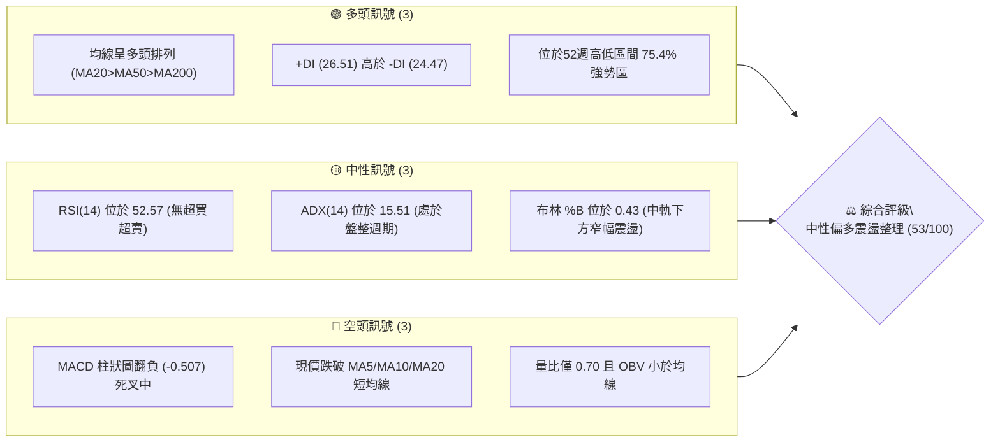
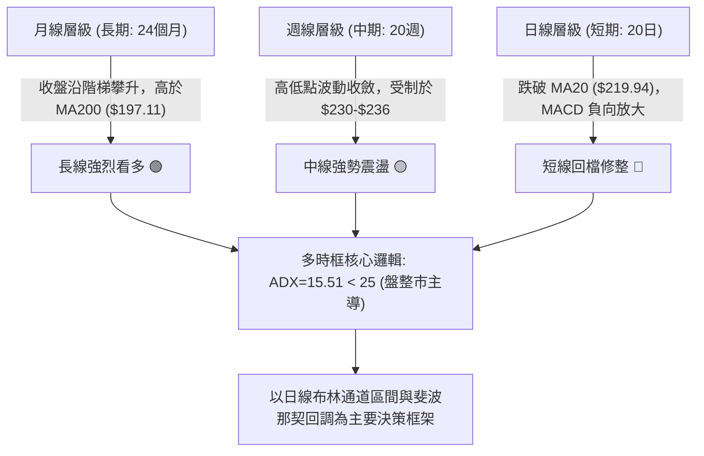
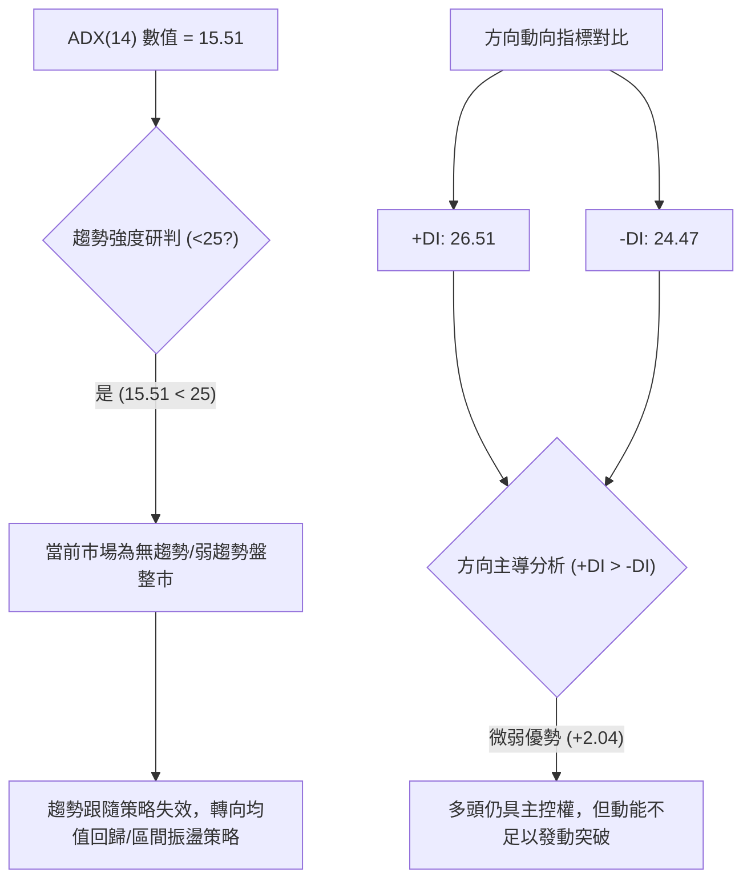
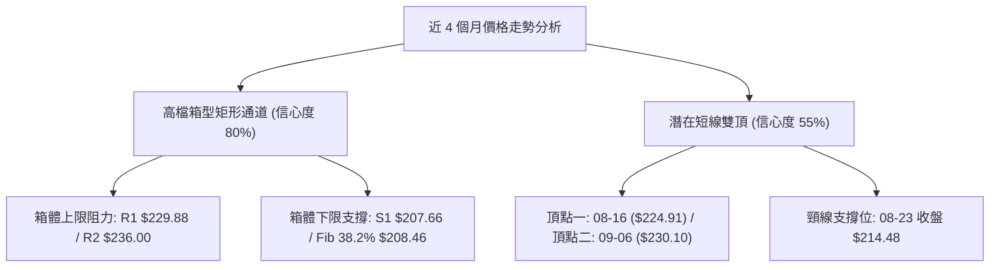
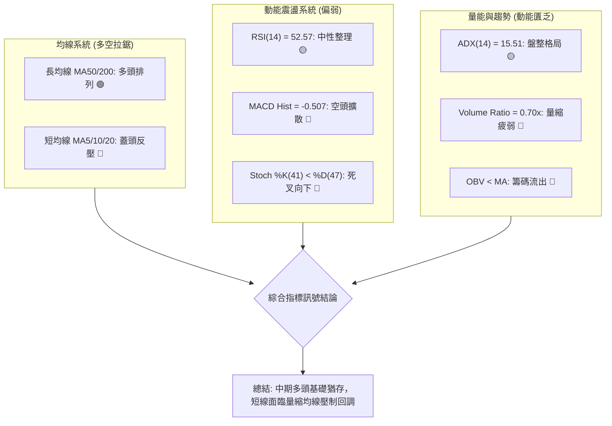
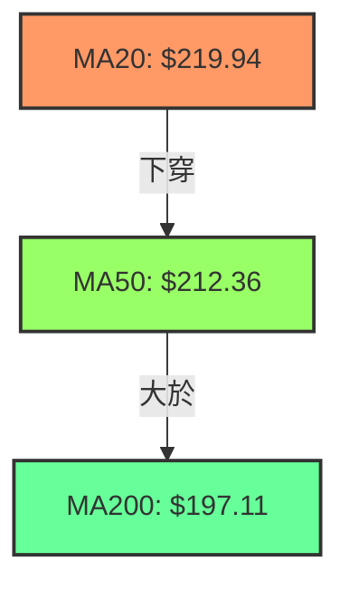
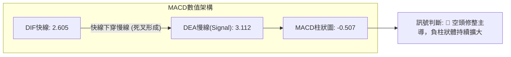
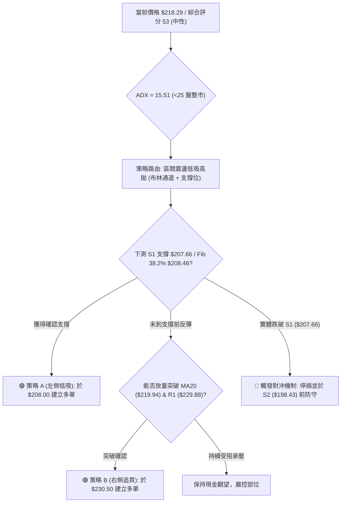
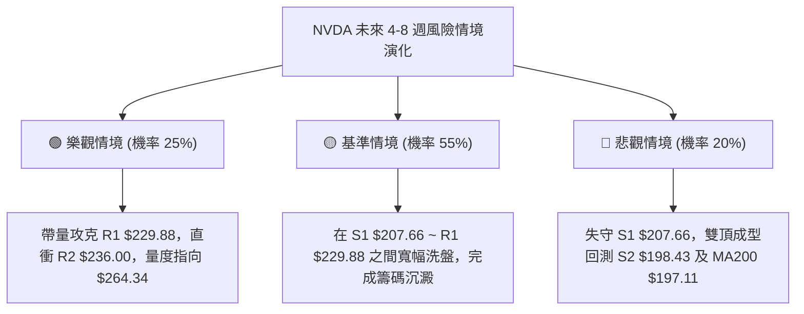

# NVDA 技術分析報告

> **報告日期**：2026-09-12 ｜ **語言**：繁體中文 ｜ **數據來源**：Yahoo Finance ｜ **當前價格**：$218.29

---

## 目錄

| 章節 | 內容 |
|------|------|
| [1. 技術面概覽](#1-技術面概覽) | 訊號儀表板、核心指標、評分卡 |
| [2. 趨勢分析](#2-趨勢分析) | 多時框趨勢、長中短期走勢 |
| [3. 圖表形態分析](#3-圖表形態分析) | 形態識別、K線組合、目標價 |
| [4. 支撐與阻力](#4-支撐與阻力) | 關鍵價位、斐波那契回調 |
| [5. 技術指標深度解讀](#5-技術指標深度解讀) | MA/RSI/MACD/布林/成交量 |
| [6. 動能與波動率](#6-動能與波動率) | 動能評估、ATR、Beta |
| [7. 多時框架總結](#7-多時框架總結) | 時框架評分矩陣 |
| [8. 交易策略建議](#8-交易策略建議) | 多空策略、風險報酬比 |
| [9. 風險提示與監控](#9-風險提示與監控) | 監控指標、風險場景 |

---

## 1. 技術面概覽

### 🎯 技術訊號儀表板



### 📊 核心指標速覽表

| 指標類別 | 指標名稱 | 當前數值 | 訊號 | 解讀 |
|----------|----------|----------|------|------|
| **價格** | 當前收盤價 | $218.29 | 🟡 | 位於52週高點($236.00)與低點($163.90)之75.4%分位 |
| **短期均線** | MA20 (中軌) | $219.94 | 🔴 | 現價位於 MA20 下方 -0.75%，短線轉入休整 |
| **中期均線** | MA50 | $212.36 | 🟢 | 現價高於 MA50 +2.79%，中期多頭防守穩健 |
| **長期均線** | MA200 | $197.11 | 🟢 | 現價大幅高於 MA200 +10.75%，長期牛市格局穩固 |
| **超短均線** | MA5 / MA10 | $223.13 / $222.30 | 🔴 | 短線下破 MA5(-2.17%) 與 MA10(-1.81%)，回檔壓力浮現 |
| **動能** | RSI(14) | 52.57 | 🟡 | 位於50中軸上方，動能均衡，無多空超買超賣極端 |
| **動能** | MACD(12,26,9) | 2.605 / 3.112 / -0.507 | 🔴 | DIF下穿DEA形成死叉，柱狀圖負值，動能耗竭修正 |
| **趨勢強度** | ADX(14) | 15.51 | 🟡 | ADX < 25 表明趨勢動力減弱，進入區間無方向震盪 |
| **成交量** | 20日均量比 | 0.70x (88.80M vs 127.71M) | 🔴 | 價跌量縮，OBV < MA，買盤承接動能退潮 |
| **波動** | ATR(14) | $7.67 (3.51%) | 🟡 | 每日平均波動幅度約 $7.67，適合區間防守操作 |

### 🏆 技術評分卡

```
╔══════════════════════════════════════════════════════════════════════════╗
║                   技術評分卡 — NVDA (2026-09-12)                         ║
╠══════════════════════════════════════════════════════════════════════════╣
║ 趨勢強度 (ADX=15.51)       ████░░░░░░░░░░░░░░░░  25/100 🔴 弱趨勢/震盪   ║
║ 動能指標 (RSI/MACD)        █████████░░░░░░░░░░░  45/100 🔴 柱狀偏空修整 ║
║ 支撐穩定度 (S1/MA50)       ██████████████░░░░░░  70/100 🟢 關鍵帶密集   ║
║ 成交量配合 (Volume/OBV)    ██████░░░░░░░░░░░░░░  30/100 🔴 量能退潮渙散 ║
║ 形態完整度 (矩形震盪)      ████████████░░░░░░░░  60/100 🟡 區間箱型初成 ║
║ 均線排列 (MA20>MA50>MA200) ██████████████████░░  90/100 🟢 標準長多格局 ║
╠══════════════════════════════════════════════════════════════════════════╣
║ 綜合評分                   ███████████░░░░░░░░░  53/100 🟡 中性整理評級 ║
╚══════════════════════════════════════════════════════════════════════════╝
```

---

## 2. 趨勢分析

### 🌐 多時框趨勢分析



### 📈 長期趨勢 — 12個月走勢圖（Unicode）

NVDA 過去 12 個月展現強大的長牛格局，自 2025 年 9 月的 $186.13 攀升至 2026 年 8 月的歷史收盤高位 $220.53，期間在 2026 年 3 月回踩 $174.00 形成堅實底部。

```
NVDA 月線走勢圖（過去12個月：2025-09 至 2026-09）
價格軸 ($)
$236.00 ┤                                                    ●(52W最高 236.00)
$220.53 ┤                                               ●    
$218.29 ┤                                                    ●(現價 218.29)
$210.66 ┤                                  ●                 
$202.01 ┤       ●                          
$199.11 ┤                               ●      ●   ●         
$190.68 ┤                   ●                                 
$186.13 ┤ ●             ●                                     
$176.58 ┤           ●           ●                             
$174.00 ┤                       ●(區間低點)                  
        └─┬─────┬───┬───┬───┬───┬───┬───┬───┬───┬───┬───┬────
         09    10  11  12  01  02  03  04  05  06  07  08  09 (月份)
        (2025)                                        (2026)
```

#### 走勢特徵分析表格

| 階段週期 | 起訖月份 | 起點收盤 | 終點收盤 | 漲跌幅 | 形態與量價特徵 | 趨勢結論 |
|----------|----------|----------|----------|--------|----------------|----------|
| **第一階段：秋季衝頂** | 2025-09 ~ 2025-10 | $186.13 | $202.01 | +8.53% | 突破兩百美元整數關卡，獲利了結賣壓湧現 | 🟢 趨勢強勁 |
| **第二階段：中期回踩** | 2025-10 ~ 2026-03 | $202.01 | $174.00 | -13.87%| 半年寬幅震盪築底，打出波段低點 $174.00 夯實支撐 | 🔴 次級回檔 |
| **第三階段：主升推升** | 2026-03 ~ 2026-05 | $174.00 | $210.66 | +21.07%| 帶量突破前高，AI硬體換代利多推動均線全面翻多 | 🟢 多頭重啟 |
| **第四階段：平台整理** | 2026-05 ~ 2026-07 | $210.66 | $200.53 | -4.81% | $200 整數防線數次測試不破，籌碼充分換手 | 🟡 箱型沉澱 |
| **第五階段：創高休整** | 2026-07 ~ 2026-09 | $200.53 | $218.29 | +8.86% | 觸及 52W 高點 $236.00 後遇阻回吐，現於高檔盤整 | 🟡 滯漲回檔 |

### 📊 中期趨勢（週線分析）

從近 20 週數據觀察，NVDA 在 2026 年 8 月中旬衝至收盤價 $224.91（RSI 飆至 75.4），隨後於 9 月 6 日當週上探 $230.10，逼近 52 週最高價 $236.00。然而，當前週線收盤落至 $218.29，週 MACD 柱狀圖由正轉負（-0.507），顯示中期動能正遭受阻力位 R1（$229.88）與 R2（$236.00）的壓制。

```
週線級別價格壓力示意圖：
$236.00 ────────────────────────────────── [52W High / R2 強阻力位]
              ▲
$229.88 ──────┼─────────────────────────── [R1 波段高點聚類區]
              │ (回檔壓力區間)
$218.29 ======●=========================== ◄ [當前收盤價 $218.29]
              │ (回測緩衝空間)
$212.36 ──────┼─────────────────────────── [MA50 中期均線防線]
              ▼
$207.66 ────────────────────────────────── [S1 支撐位 / BB下軌 $207.74]
```

### ⚡ 趨勢強度評估（ADX 解讀）



#### ADX 強度與市場狀態對照表

| ADX 數值區間 | 當前狀態 | 市場特徵解讀 | 建議交易方針 |
|--------------|----------|--------------|--------------|
| **0 - 20** | **15.51 (當前)** | **弱趨勢或極度盤整**；市場缺乏方向動能，指標容易頻繁鈍化 | **禁用趨勢突破系統**；嚴格執行布林軌道高拋低吸 |
| **20 - 25** | 未達到 | 盤整向上蓄勢期；趨勢萌芽但尚未確立 | 觀察區間突破確認訊號，輕倉佈局 |
| **25 - 50** | 未達到 | 強趨勢行情；+DI/-DI 分離放大，單邊推升 | 採用均線順勢交易系統，拉回加碼 |
| **50 - 100** | 未達到 | 極端單邊過熱；動能面臨頂背離衰竭 | 隨時準備分批獲利了結，警惕V型反轉 |

---

## 3. 圖表形態分析

### 🔍 形態識別系統

根據近一年價格軌跡，NVDA 於日線與週線層面構築了明顯的**高檔矩形箱型整理形態（Rectangle Consolidation）**，並在局部疊加**雙重頂形態**之疑慮。



#### 形態信心度評估表（依嚴格規則 15）

| 形態類別 | 信心度 | 判斷依據（引用技術數據） | 完成度 | 目標價（附嚴謹計算式） |
|----------|--------|--------------------------|--------|------------------------|
| **高檔矩形箱型** | **80%** | 上軌聚類於 R1 $229.88 與 R2 $236.00；下軌獲 S1 $207.66、BB下軌 $207.74 及 MA60 $210.33 支撐 | 75% | **向上突破目標**：箱頂 $236.00 + 箱高 ($236.00 - $207.66 = $28.34) = **$264.34**（形態推算）<br>**向下破位目標**：箱底 $207.66 - 箱高 $28.34 = **$179.32**（與 Fib 78.6% $179.33 重合） |
| **短線潛在雙頂** | **55%** | 8/16 觸及 $224.91 後回檔至 $214.48，9/6 再次上探 $230.10 未過 52W 高點 $236.00 即受挫 | 60% | **破位下行目標**：頸線 $214.48 - 高度 ($230.10 - $214.48 = $15.62) = **$198.86**（形態推算，與 S2 $198.43 強支撐吻合） |
| **頭肩頂形態** | **25%** | 數據不足。無明確左肩與右肩對稱結構，僅見箱體輪廓 | 0% | *訊號不足，信心度低於50%，依規則不做預測* |

### 🕯️ 重要K線形態分析（近 10 週）

| 週別時間 | 收盤價 ($) | 週 K 線形態特徵 | 技術解讀 | 訊號 |
|----------|------------|-----------------|----------|------|
| **2026-07-12** | $210.72 | 大陽線實體反彈 | 站穩 $200 關卡，多頭買盤大舉介入，MACD柱由負轉正 | 🟢 多頭 |
| **2026-08-09** | $223.71 | 長紅突破 K 線 | 連續長陽拔高，突破前期盤整平台，量能配合放大 | 🟢 多頭 |
| **2026-08-16** | $224.91 | 高檔帶長上影線十字 | RSI 衝至 75.4 極度超買，高檔獲利拋壓初現，成交量萎縮 | 🔴 滯漲 |
| **2026-08-23** | $214.48 | 中陰線實體吞沒 | 跌破前週低點，完成頂部回吐，MACD 柱狀翻負至 -0.404 | 🔴 轉弱 |
| **2026-08-30** | $217.31 | 爆量下影小陽線 | 9.31 億股天量換手，下方買盤在 Fib 23.6% ($218.98) 附近抵抗 | 🟡 支撐 |
| **2026-09-06** | $230.10 | 長上影衝高受阻小陽 | 衝擊波段阻力 R1 $229.88，未能站穩，留下明顯反轉阻力線 | 🔴 假突破 |
| **2026-09-13** | $218.29 | 回挫陰線失守均線 | 跌破 MA20 ($219.94) 與 Fib 23.6% ($218.98)，成交量急縮至 4.0 億股 | 🔴 空頭 |

### 📉 ASCII 走勢形態示意圖

```
NVDA 高檔矩形箱型震盪示意圖（2026-05 至 2026-09）
$236.00 ┬─────────────────────── 52W 高點 (R2) ──────────────────────────
        │                             [頂2] $230.10
$229.88 ┼────── [頂1] $224.91 ───────── ▲ ────── 波段阻力帶 (R1) ────────
        │         ▲                    / \
$220.00 ┼────────/─\──────────────────/───\───── 箱體中樞 (MA20: $219.94)
        │       /   \                /     \
$218.29 ┼──────/─────\──────────────/───────●─── ◄ 現價 ($218.29 下測中)
        │     /       \  [頸線]    /
$214.48 ┼────/─────────▼─ $214.48 ┘
        │   /
$207.66 ┴──●─────────────────────────────────── 箱體下軌支撐 (S1) ────────
           [底1] $200.53 ~ $204.87
```

### 🎯 形態目標價計算

依據幾何形態量化推算規則（僅採用資料庫實測點位）：

1. **矩形整理向上突破測幅**：
   - 形態突破點：R2 = $236.00
   - 箱底基準點：S1 = $207.66
   - 形態高度 $H_1 = 236.00 - 207.66 = 28.34$
   - 向上目標價 $T_{Up} = 236.00 + 28.34 =$ **$264.34**

2. **短線雙頂頸線破位測幅**：
   - 形態雙頂高點（取 09-06 收盤）：$230.10
   - 頸線支撐位（取 08-23 收盤）：$214.48
   - 形態落差 $H_2 = 230.10 - 214.48 = 15.62$
   - 破位量度目標 $T_{Down} = 214.48 - 15.62 =$ **$198.86**（此推算值精確指向支撐區 S2 $198.43 與 Fib 50.0% $199.95）

---

## 4. 支撐與阻力

### 🗺️ 關鍵價位分布圖（Unicode）

```
NVDA 價位結構分布圖
══════════════════════════════════════════════════════════════════════════
$236.00 ║████████████████████████████████████████║ 52W 歷史極值阻力 (R2 / Fib 0.0%)
$229.88 ║██████████████████████████████          ║ 強阻力帶 (R1 / 波段高點聚類)
$219.94 ║░░░░░░░░░░░░░░░░░░░░░░░░░░░░░░░░░░░░░░░║ 短線分水嶺 (MA20 / BB中軌)
$218.98 ║----------------------------------------║ 斐波那契 23.6% 回調位
$218.29 ╠════════════════════════════════════════╣ ◄ 當前收盤市價 ($218.29)
$212.36 ║▓▓▓▓▓▓▓▓▓▓▓▓▓▓▓▓▓▓▓▓                    ║ 中期生命線 (MA50)
$208.46 ║▓▓▓▓▓▓▓▓▓▓▓▓▓▓▓▓▓▓▓▓▓▓▓▓▓▓▓▓▓▓          ║ 斐波那契 38.2% 回調位
$207.66 ║████████████████████████████████        ║ 關鍵核心支撐 (S1 / 近一年波段低點)
$199.95 ║▓▓▓▓▓▓▓▓▓▓▓▓▓▓▓▓▓▓▓▓▓▓▓▓▓▓▓▓▓▓▓▓▓▓▓▓    ║ 斐波那契 50.0% 多空分水嶺
$198.43 ║████████████████████████████████████    ║ 次級強支撐 (S2 / 波段低點聚類)
$197.11 ║░░░░░░░░░░░░░░░░░░░░░░░░░░░░░░░░░░░░░░░║ 長期牛熊線 (MA200)
$194.30 ║████████████████████████████████████████║ 深度防守底線 (S3)
══════════════════════════════════════════════════════════════════════════
```

### 🚧 阻力位分析表

| 阻力級別 | 價位 | 形成原因（嚴格引用資料） | 突破難度 | 重要性 |
|----------|------|--------------------------|----------|--------|
| **R1** | **$229.88** | 近一年波段高點聚類；09-06當週上探至 $230.10 後遭強大解套與獲利盤壓制 | 相當高 🔴 | ★★★★☆<br>短線多頭反彈第一目標兼壓力警戒線 |
| **R2** | **$236.00** | 52週歷史最高點（Fib 0.0%）；全市場籌碼無套牢盤時的心理與流動性阻力極限 | 極高 🔴 | ★★★★★<br>全面展開牛市主升浪的唯一確認信標 |

### 🛡️ 支撐位分析表

| 支撐級別 | 價位 | 形成原因（嚴格引用資料） | 守住機率 | 重要性 |
|----------|------|--------------------------|----------|--------|
| **S1** | **$207.66** | 近一年波段低點聚類；與 BB 下軌 ($207.74) 及 Fib 38.2% ($208.46) 形成強共振 | 75% 🟢 | ★★★★★<br>矩形箱體下軌，中期多頭強弱防守關鍵點 |
| **S2** | **$198.43** | 近一年波段低點聚類；與 Fib 50.0% ($199.95) 及 MA200 ($197.11) 構築厚實底部 | 85% 🟢 | ★★★★☆<br>跌破則中期多頭架構破壞，多空易位 |
| **S3** | **$194.30** | 近一年極端波段低點聚類；臨近 MA240 ($195.65) 與 Fib 61.8% ($191.44) | 95% 🟢 | ★★★☆☆<br>長期牛市多頭最後防線 |

### 📐 斐波那契回調位分析

依據 52 週低點 **$163.90** 至 52 週高點 **$236.00** 之完整波段計算（波段落差 $72.10）：

```
[52W High] 0.0% ─── $236.00
                      │ (現價距高點 -7.50%)
          23.6% ─── $218.98 ◄◄ 現價 $218.29 剛跌破此線 -0.31%
                      │ 
          38.2% ─── $208.46 (與 S1 $207.66 形成 0.8 美元極窄支撐帶)
                      │
          50.0% ─── $199.95 (心理與結構中樞，與 S2 $198.43 共振)
                      │
          61.8% ─── $191.44 (黃金分割黃金底線)
                      │
          78.6% ─── $179.33 (深次回踩警戒線)
[52W Low]  100% ─── $163.90
```

- **位置判讀**：現價 $218.29 剛好落在 **Fib 23.6% ($218.98)** 與 **Fib 38.2% ($208.46)** 之間。
- **技術意義**：強勢回調通常在 Fib 23.6% 獲得強烈支撐，現價微幅跌破 $218.98，代表回檔級別擴大，預期將往下尋找 **Fib 38.2% ($208.46) / S1 ($207.66)** 尋求第二落點支撐。若 S1 止跌，整體上升趨勢仍維持高度健康。

---

## 5. 技術指標深度解讀

### 🎛️ 指標訊號總覽



### 📈 移動平均線排列分析



當前移動平均線維持典型且標準的**多頭排列結構（MA20 > MA50 > MA200）**，但超短期均線出現明顯的向下跌破走勢：
- **短天期反壓**：MA5 ($223.13)、MA10 ($222.30) 及 MA20 ($219.94) 現全部凌駕於當前價格 $218.29 之上，現價與 MA5 負乖離達 -2.17%，形成短線「三線蓋頂」型態。
- **中長天期托底**：MA60 ($210.33)、MA120 ($206.19) 與 MA200 ($197.11) 穩健走揚，正乖離分別為 +3.79%、+5.87% 與 +10.75%，表明機構長期持倉成本穩固，無崩跌風險。

### 📉 RSI(14) 分析

當前 RSI(14) 讀數為 **52.57**。

```
RSI(14) 強度計：
[0] ─────────── [30] ─────── [52.57] ─────── [70] ─────────── [100]
超賣區          弱勢區       中性平衡區       強勢區          超買區
                            ██████████░░░░░░░░░░ (52.57%)
```

- **區間研判**：RSI 位於 50 多空中軸上方，顯示市場雖經歷回檔，多頭元氣未傷，尚未觸及超賣（<30）或超買（>70）。
- **背離判斷**：
  - 在 2026 年 8 月 16 日，收盤價達到 $224.91 時，週線 RSI 達到 **75.4** 的極端峰值。
  - 在 2026 年 9 月 06 日，收盤價推升至更高的 **$230.10**，但週線 RSI 僅為 **53.7**。
  - **結論**：**日/週線層面出現顯著之「頂背離（Bearish Divergence）」**，價格創波段新高而動能指標未創新高，隨後引發本週之回檔修正，完全符合背離回調機制。

### 📊 MACD(12/26/9) 訊號解讀



- DIF 線（2.605）跌破訊號線 Signal（3.112），MACD Hist 為 **-0.507**。
- 柱狀圖自 9 月 6 日當週的 +0.835 驟降翻負，顯示高檔多頭動能迅速衰退，短期進入受制於空方微幅主導的調整波。

### 📦 布林通道分析

當前布林參數設定為標準（20, 2）：
- **BB 上軌**：$232.14
- **BB 中軌 (MA20)**：$219.94
- **BB 下軌**：$207.74
- **布林帶寬度 (Bandwidth)**：$(232.14 - 207.74) / 219.94 = 11.09\%$
- **BB %B 指標**：**0.43**

```
布林通道現況位置示意圖：
$232.14 ┬──────────────────────────────────────── 上軌 (%B = 1.0)
        │
$219.94 ┼──────────────────────────────────────── 中軌 (MA20 / %B = 0.5)
        │                       ◄── 現價 $218.29 (%B = 0.43)
$207.74 ┴──────────────────────────────────────── 下軌 (%B = 0.0)
```

- **技術解讀**：%B 讀數為 0.43，表明價格已由上軌回落至中軌下方，運行於弱勢下半區。在帶寬未見急劇擴張（11.09%）且 ADX 處於低位的背景下，價格下探測試下軌 **$207.74**（與 S1 $207.66 高度重合）的機率較高。

### 💹 成交量分析（量價配合度）

- **量比萎縮**：最新單日成交量為 **88,804,100 股**，相對於 20 日均量（127,706,235 股）之量比僅為 **0.70x**，為典型「價跌量縮」格局。
- **OBV 趨勢**：數據明確指示 **OBV < MA**。量能未能在回檔時展現主動性承接盤，資金流動性呈現淨流出。
- **量價背離分析**：
  - 8 月 30 日當週在 $217.31 爆出 9.31 億股巨量，而 9 月 13 日下跌至 $218.29 時成交量急縮至 4.00 億股。
  - 此種量縮下跌表明並非機構恐慌性出逃，而是「買盤觀望、追價無力」所引致的流動性真空回檔。

---

## 6. 動能與波動率

### ⚡ 動能評估四象限

```
                   動能強度 (RSI / MACD)
                         強動能
                           │
             Q1            │           Q3
        最佳進場突破       │     高風險高動能延伸
                           │
  ─────────────────────────┼───────────────────────── 波動率 (ATR%)
  低波動                   │                   高波動
             Q2            │           Q4
    ★ NVDA 當前所處位置   │       劇烈洗盤震盪
     (弱動能 / 低波動)     │
                           │
                         弱動能
```

#### 動能狀態對照評估

| 象限代號 | 動能狀態 | 波動狀態 | NVDA 當前適配性 | 戰略部署解讀 |
|----------|----------|----------|-----------------|--------------|
| **Q1** | 強 | 低 | 不符合 | 最理想突破買點，通常發生於放量突破箱頂之初 |
| **Q2** | **弱** | **低 (ATR 3.51%)** | **✓ 符合 (現況指標)** | **動能疲弱，波幅收斂；宜採取區間防守，避免高位追價，等待支撐位低吸** |
| **Q3** | 強 | 高 | 不符合 | 主升浪瘋狂階段，伴隨爆量與跳空 |
| **Q4** | 弱 | 高 | 不符合 | 恐慌崩跌拋售期，多頭全面潰敗 |

### 📊 ATR 波動率分析

當前 14 日平均真實波動區間 **ATR(14) 為 $7.67**，佔當前股價比例為 **3.51%**。

- **日內正常波幅**：在常態交易日中，NVDA 的預期波動範圍約為 $\pm \$7.67$。
- **波動防守邊界建議**：
  - **超短線日間止損 (1.0 × ATR)**：$7.67
  - **波段交易保護止損 (1.5 × ATR)**：$1.5 \times 7.67 =$ **$11.51**
  - **趨勢追蹤防守止損 (2.0 × ATR)**：$2.0 \times 7.67 =$ **$15.34**
- **風控意義**：任何進場點的止損設定，若小於 1.5 倍 ATR（$11.51），極易被日常隨機雜訊掃出場。

### 📐 Beta 與市場相關性

- **Beta 係數高達 2.217**：
  - 展現 NVDA 具有大盤（S&P 500 指數）**2.2 倍以上的波動敏感度**。
  - 當大盤回檔 1% 時，NVDA 統計上傾向下跌 2.22%；反之大盤走強時彈性亦高。
- **做空與避險籌碼結構**：
  - 空頭借券佔流通股比（Short % Float）極低，僅為 **1.3%**，Short Ratio 為 **2.33 天**。
  - 機構持股比例高達 **71.4%**，籌碼鎖定度極高，不存在大規模放空攻擊的基本面與技術面空間。

---

## 7. 多時框架總結

### 📋 時框架評分表

| 時框架 | 週期基準 | 趨勢方向 | 動能狀態 | 均線排列 | 圖表形態 | 綜合評分 | 操作建議 |
|--------|----------|----------|----------|----------|----------|----------|----------|
| **長期 (月線)** | 24個月歷史 | 🟢 強烈看多 | 🟢 多頭掌控 | 🟢 多頭排列 | 階梯牛市通道 | **85/100** | 長線持股續抱，無多頭反轉威脅 |
| **中期 (週線)** | 20週K線 | 🟡 區間震盪 | 🔴 柱狀圖走弱 | 🟢 支撐良好 | 高檔箱體矩形 | **55/100** | 區間震盪操作，接近下軌低吸 |
| **短期 (日線)** | 近20日走勢 | 🔴 回調修整 | 🔴 死叉延續 | 🔴 短線下破MA20 | 潛在小雙頂回測 | **40/100** | 嚴禁右側盲目追高，耐心等待止跌 |

### 🔲 綜合訊號矩陣

```
時框訊號收斂權重分析圖：
時框層級       多頭訊號權重           空頭訊號權重
月線 (長期)    ████████████████░░ 85%  ██░░░░░░░░░░░░░░░░ 15% (大趨勢極強)
週線 (中期)    ███████████░░░░░░ 55%   █████████░░░░░░░░ 45% (高檔震盪蓄勢)
日線 (短期)    ████████░░░░░░░░░ 40%   ████████████░░░░░ 60% (短線回踩考驗)
──────────────────────────────────────────────────────────
加權收斂結論： 中期震盪偏多格局不變，短期下行釋放壓力中 (綜合 53/100)
```

### ⚖️ 多時框收斂結論（依嚴格規則 14）

1. **行情性質研判**：
   - 當前 **ADX(14) 讀數為 15.51**，明確小於 25 的關鍵分水嶺。依據多時框收斂規則，系統裁定當前為**典型的「盤整行情」而非單邊「趨勢行情」**。
2. **主導維度與衝突取捨**：
   - 在盤整行情中，趨勢指標（MA排列）退居防守輔助，**交易邊界應以日線布林通道（上下軌 $207.74 ~ $232.14）與波段高低點為核心**。
   - 週線與日線訊號雖在動能端偏空（MACD柱翻負、跌破MA20），但長線 MA200 仍以 $197.11 向上昂揚，因此短線下跌應定義為「牛市架構內的中級回檔」，不可盲目進行單邊趨勢性放空。
3. **唯一收斂方向性結論**：
   - **中性觀望偏多佈局（震盪築底）**。短線等待價格向布林下軌及 S1 支撐靠攏確認後，再行建立多頭頭寸。

---

## 8. 交易策略建議

### 🗺️ 策略決策流程圖



### 🧭 策略路由

- **當前主策略方向**：**中性偏多區間操作（評分 53/100，處於 40–60 區間操作帶，以布林下軌低吸為主，等待突破確認）**。

### 🎯 價格情境階梯（Price Scenarios）

價位完全採用關鍵價位計算數值：

| 觸發條件 | 當前階梯 | 下一目標 | 後續延伸 | 情境技術含義 |
|----------|----------|----------|----------|--------------|
| **多頭強勢突破** | 突破 R1 $229.88 | R2 $236.00 | $264.34 (形態高度推算) | 多頭重啟新一輪單邊牛市主升浪 |
| **箱體內震盪** | 站穩 $218.29 | MA20 $219.94 | R1 $229.88 | 箱體中樞拉鋸，消化套牢賣壓 |
| **短線回測支撐** | 跌破 $218.29 | S1 $207.66 | Fib 38.2% $208.46 | 測試箱底與布林下軌有效買盤 |
| **空頭破位深調** | 跌破 S1 $207.66 | S2 $198.43 | S3 $194.30 | 中期箱體破裂，下測 MA200 牛熊底線 |

### 📊 情境機率分佈

| 情境類型 | 預測機率 | 主要技術依據 |
|----------|----------|--------------|
| **情境一：回踩 S1 後區間震盪築底** | **55%** | ADX=15.51 判定無單邊趨勢；布林帶寬窄；S1 ($207.66) 與 Fib 38.2% ($208.46) 雙重重疊支撐堅固 |
| **情境二：直接反彈並向上衝擊 R1** | **25%** | 均線長多排列健全；基本面 57 位分析師目標均價達 $327.65；但受制於量縮 (0.70x) 及 MACD 負值 |
| **情境三：跌破 S1 進一步下探 S2** | **20%** | RSI 頂背離尚未完全消化；週線成交量持續退潮；若失守 $207.66 則潛在雙頂量度目標指向 $198.86 |

### 🟢 主策略詳情（區間與突破佈局）

主策略採分批低吸與突破加碼兩套子方案：

| 策略要素 | 策略 A（左側：箱底防守低吸） | 策略 B（右側：突破箱頂追隨） |
|----------|------------------------------|------------------------------|
| **進場條件** | 價格回踩 S1 獲得下影線支撐，RSI 觸及 40 回升 | 日線帶量（>1.2億股）突破 R1 $229.88 阻力帶 |
| **進場價格** | **$208.00**（位於 S1 $207.66 與 Fib $208.46 之間） | **$230.50**（確認突破 R1 $229.88） |
| **目標價 T1** | **$219.94**（BB 中軌 / MA20，第一獲利點） | **$236.00**（前高 R2，減倉 1/2） |
| **目標價 T2** | **$229.88**（波段阻力 R1，清倉落袋） | **$264.34**（箱形量度推算最終目標） |
| **止損價格** | **$199.50**（跌破 Fib 50% $199.95 與 S2 防線） | **$222.30**（跌回 MA10 均線下方假突破） |
| **風險報酬比** | **2.57 : 1** [風險 $8.50，潛在報酬 $21.88] | **4.13 : 1** [風險 $8.20，潛在報酬 $33.84] |
| **歷史勝率估計** | **65%**（符合箱型布林回歸勝率） | **45%**（突破容易受低 ADX 干擾） |
| **建議倉位** | **15% ~ 20%**（分兩批建倉） | **10%**（輕倉順勢追擊） |

### 🔴 反向風險觸發點（對沖提示）

若出現以下極端訊號，證明多頭防線全面瓦解，應立即終止多頭策略：
1. **關鍵點位失守**：日 K 線收盤價**以實體大陰線跌破 S1 ($207.66)**，且成交量放大至 1.5 億股以上。
2. **均線死叉惡化**：MA20 ($219.94) 拐頭快速下穿 MA50 ($212.36)。
3. **避險操作**：一旦跌破 $207.66，多單全數止損離場，若需避險可針對現貨頭寸買入對應價外 Put 選擇權，目標下看 S2 ($198.43) 及 MA200 ($197.11)。

### ⭐ 整體訊號強度評星

```
做多訊號強度：★★★☆☆  (3.0/5星 — 均線長多托底，但短線回調未見止跌K線)
做空訊號強度：★★☆☆☆  (2.0/5星 — 缺乏單邊做空動能，下方強支撐密集)
整體分析可信度：★★★★☆  (4.0/5星 — 指標一致收斂於低ADX箱型震盪)
```

---

## 9. 風險提示與監控

### ✅ 關鍵監控指標 Checklist

```
╔══════════════════════════════════════════════════════════════════════════╗
║                    NVDA 日常風控監控清單 (Checklist)                     ║
╠══════════════════════════════════════════════════════════════════════════╣
║ [ ] 價位維度：收盤價是否守穩 S1 ($207.66)？(跌破即破位)                  ║
║ [ ] 阻力維度：收盤價是否成功站回 MA20 ($219.94)？(站上代表短線回穩)      ║
║ [ ] 量能維度：成交量是否放大至 1.25 億股以上？(判斷突破或砸盤真實性)     ║
║ [ ] 動能維度：MACD 柱狀圖負值是否開始收斂？(由 -0.507 縮減至 0 軸)       ║
║ [ ] 趨勢維度：ADX(14) 是否脫離盤整向上突破 25？(新趨勢形成信號)         ║
║ [ ] 通道維度：價格是否觸及布林下軌 $207.74 形成超賣鈍化？                ║
╚══════════════════════════════════════════════════════════════════════════╝
```

### ⚠️ 風險場景分析



### 🛡️ 風險管理重要提醒

1. **Beta 槓桿效應控制**：
   - NVDA 的 Beta 值達 2.217，意味著其日常損益波動是大盤的兩倍以上。任何帳面槓桿比例不宜超過 1.5 倍，嚴防市場系統性回調引發強平風險。
2. **倉位管理紀律**：
   - 當前處於 ADX=15.51 的盤整期，總持倉部位應控制在總資金的 **30% ~ 40%** 以內，保留充足現金以應對 S1 乃至 S2 的分批佈局。
3. **ATR 波動區間落實**：
   - 務必牢記目前 ATR 每日波動高達 **$7.67**。進場掛單點應預留空間，切勿緊貼市價設置過窄止損，防止被日常洗盤掃出。

---

## 📋 報告總結

```
╔══════════════════════════════════════════════════════════════════════════╗
║                       NVDA 技術分析報告總結                              ║
╠══════════════════════════════════════════════════════════════════════════╣
║ 報告日期：2026-09-12                                                    ║
║ 當前價格：$218.29                                                       ║
║ 分析評級：⚖️ 中性觀望偏多 (綜合評分: 53/100)                             ║
║                                                                          ║
║ 核心趨勢結論：                                                          ║
║ ├─ 長期趨勢：🟢 強烈看多 (均線 MA20>MA50>MA200 排列無損，牛市穩健)       ║
║ ├─ 中期趨勢：🟡 箱型盤整 (受阻於 R1 $229.88 與 R2 $236.00 頂部區域)     ║
║ ├─ 短期趨勢：🔴 回調修整 (MACD 負向放大，現價受制於短天期均線壓制)     ║
║ ├─ 關鍵支撐：S1: $207.66 ｜ S2: $198.43 ｜ S3: $194.30                   ║
║ ├─ 關鍵阻力：R1: $229.88 ｜ R2: $236.00 ｜ 形態目標: $264.34            ║
║ └─ 華爾街共識目標價：$327.65 (57位分析師，覆蓋評級 Strong Buy)           ║
║                                                                          ║
║ 最優策略指引：                                                          ║
║ 1. 🥇 最佳機會：回踩支撐低吸 (策略 A) — 於 $208.00 附近介入，風報比 2.57 ║
║ 2. 🥈 次選機會：強勢突破追隨 (策略 B) — 突破 $230.50 後追多，風報比 4.13 ║
║ 3. 🥉 保守選擇：場外完全觀望，靜待 ADX > 25 且 MACD 柱狀圖翻正後進場    ║
╚══════════════════════════════════════════════════════════════════════════╝
```

---

> ⚠️ **免責聲明**：本報告為 AI 自動生成之技術分析，所有數據及估算均基於提供的歷史價格資訊。本報告**僅供研究與學術參考**，**不構成任何投資建議**。投資有風險，入市需謹慎。

---

*報告生成時間：2026-09-12 ｜ 數據來源：Yahoo Finance ｜ 分析框架：多時框技術分析*