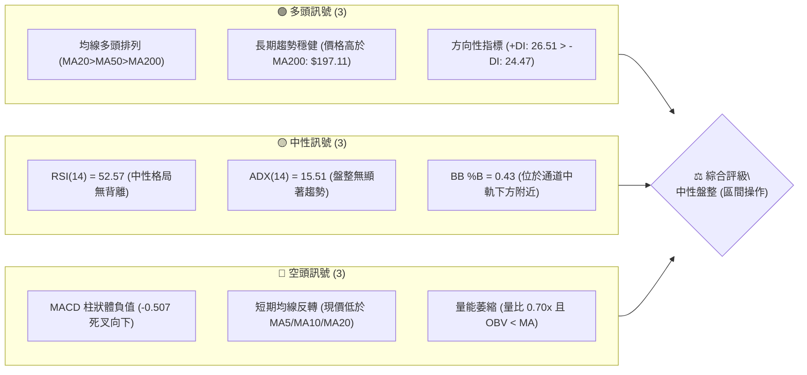
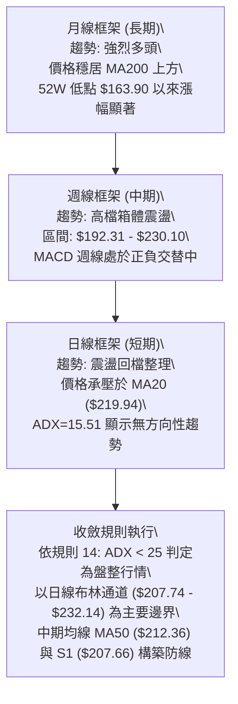
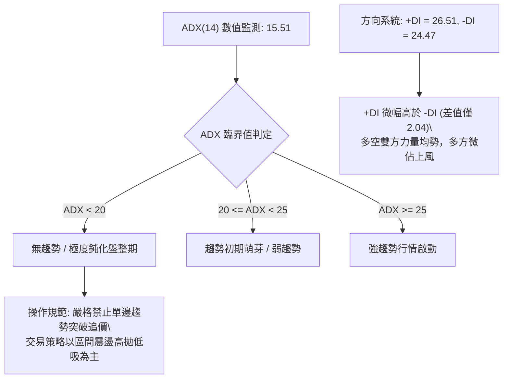
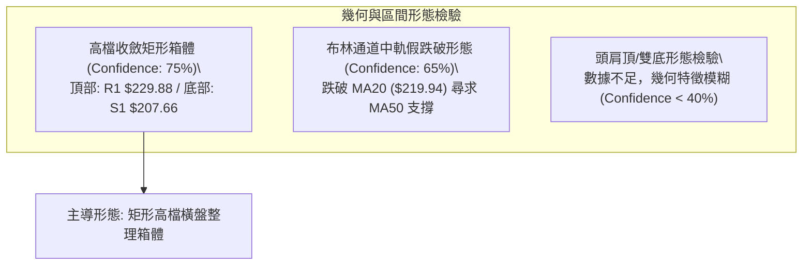
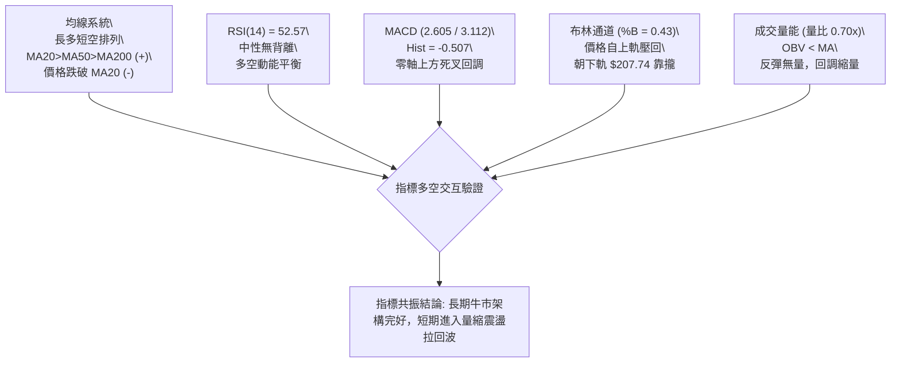
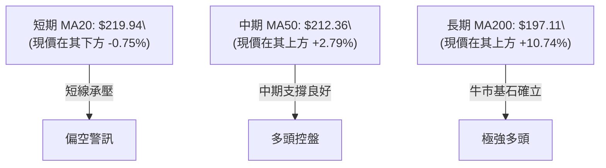
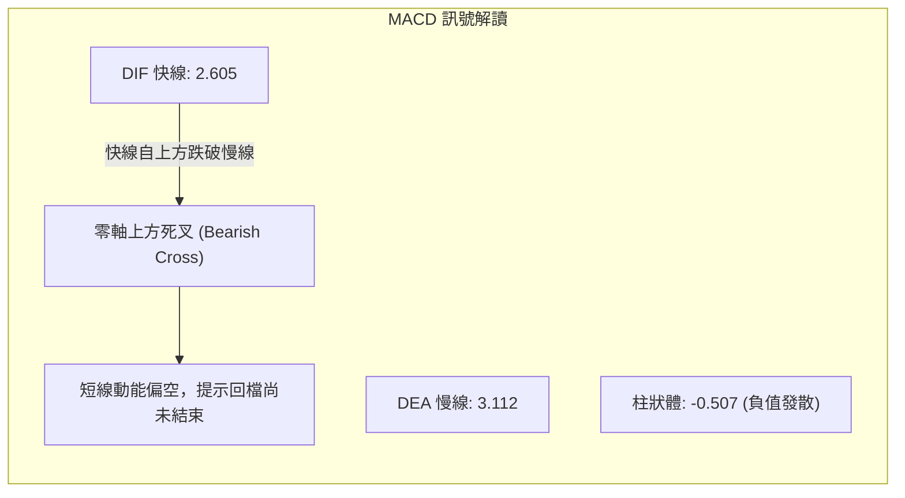
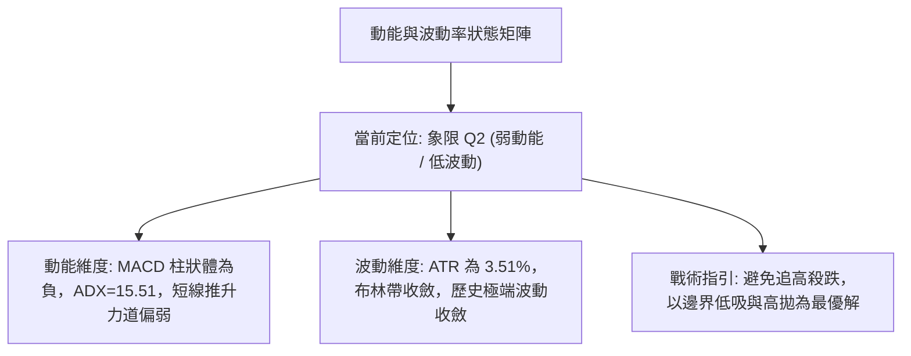
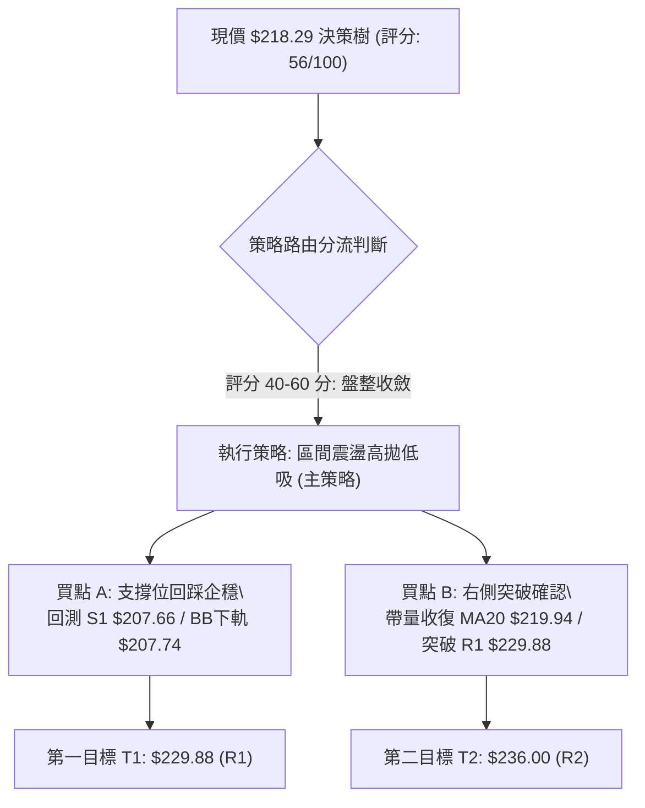
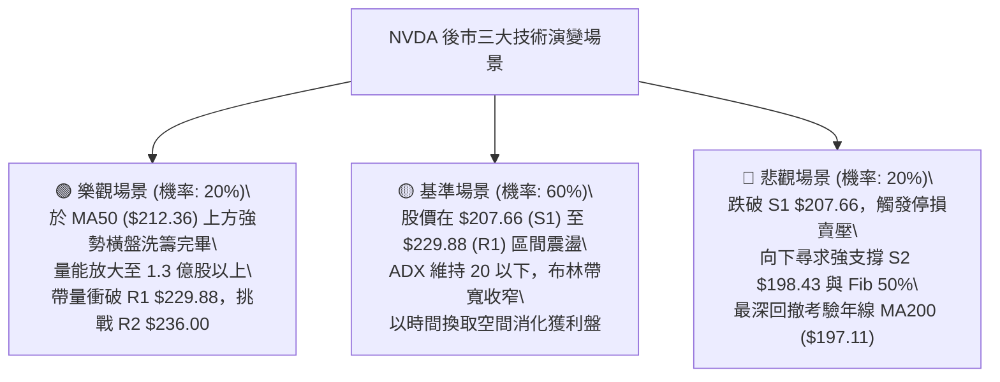

# NVDA 技術分析報告

> **報告日期**：2026-09-13 ｜ **語言**：繁體中文 ｜ **數據來源**：Yahoo Finance ｜ **當前價格**：$218.29

---

## 目錄

| 章節 | 內容 |
|------|------|
| [1. 技術面概覽](#1-技術面概覽) | 訊號儀表板、核心指標、評分卡 |
| [2. 趨勢分析](#2-趨勢分析) | 多時框趨勢、長中短期走勢、ADX 解讀 |
| [3. 圖表形態分析](#3-圖表形態分析) | 形態識別、K線組合、目標價計算 |
| [4. 支撐與阻力](#4-支撐與阻力) | 關鍵價位、斐波那契回調 |
| [5. 技術指標深度解讀](#5-技術指標深度解讀) | MA/RSI/MACD/布林/成交量/OBV |
| [6. 動能與波動率](#6-動能與波動率) | 動能象限、ATR 波動率、Beta |
| [7. 多時框架總結](#7-多時框架總結) | 時框架評分矩陣、多時框收斂結論 |
| [8. 交易策略建議](#8-交易策略建議) | 策略路由、情境階梯、主策略詳情 |
| [9. 風險提示與監控](#9-風險提示與監控) | 監控指標 Checklist、風險情境與風控 |
| [報告總結](#-報告總結) | 技術面核心結論與綜合評級 |

---

## 1. 技術面概覽

### 🎯 技術訊號儀表板



### 📊 核心指標速覽表

| 指標類別 | 指標名稱 | 當前數值 | 訊號 | 專業解讀 |
|:---|:---|:---|:---:|:---|
| **價格基準** | 當前收盤價 | $218.29 | 🟡 | 位於 52 週區間 ($163.90 - $236.00) 之 75.4% 分位 |
| **短期均線** | MA20 (布林中軌) | $219.94 | 🔴 | 現價位於 MA20 下方 (-0.75%)，短期承壓回檔 |
| **中期均線** | MA50 | $212.36 | 🟢 | 現價高於 MA50 (+2.79%)，中期波段多頭支撐猶存 |
| **長期均線** | MA200 | $197.11 | 🟢 | 現價大幅高於 MA200 (+10.74%)，長線牛市格局未破 |
| **超買超賣** | RSI(14) | 52.57 | 🟡 | 處於 50 軸線附近平衡區，無超買或超賣現象 |
| **趨勢動能** | MACD (12,26,9) | 2.605 / 3.112 | 🔴 | DIF < DEA，柱狀體為 -0.507，短線處於死叉回調波 |
| **擺動指標** | KD (Stoch %K/%D) | 41.02 / 47.33 | 🟡 | %K 低於 %D 位於中性偏弱區，尚未進入超賣區 |
| **趨勢強度** | ADX(14) | 15.51 | 🟡 | ADX < 25 表明市場進入無趨勢震盪整理期 |
| **波動幅度** | ATR(14) | $7.67 | 🟡 | 佔股價 3.51%，日均波動區間收窄，波動度中等 |
| **量能狀態** | 成交量 / 20日均量 | 88.80M / 127.71M | 🔴 | 量比僅 0.70x，量能衰退且 OBV 跌破均線 |

### 🏆 技術評分卡

```
╔══════════════════════════════════════════════════════════════╗
║              NVDA 技術面評分卡 (2026-09-13)                  ║
╠══════════════════════════════════════════════════════════════╣
║ 趨勢強度 (ADX/DI)   ███████░░░░░░░░░░░░░  35/100  🔴 弱趨勢  ║
║ 動能指標 (MACD/RSI) ██████████░░░░░░░░░░  50/100  🟡 中性偏空║
║ 支撐穩定度 (S1/Fib) ██████████████░░░░░░  70/100  🟢 支撐扎實║
║ 成交量配合 (OBV/VOL)████████░░░░░░░░░░░░  40/100  🔴 量價背離║
║ 形態完整度 (箱體)   ████████████░░░░░░░░  60/100  🟡 矩形整理║
║ 均線排列結構        ████████████████░░░░  80/100  🟢 多頭排列║
╠══════════════════════════════════════════════════════════════╣
║ 綜合評分            ███████████░░░░░░░░░  56/100  🟡 區間震盪║
╚══════════════════════════════════════════════════════════════╝
```

---

## 2. 趨勢分析

### 🌐 多時框趨勢分析



### 📈 長期趨勢 — 12個月走勢圖（Unicode）

以下為 NVDA 過去 12 個月（2025-10 至 2026-09）之月線收盤價歷史走勢圖：

```
NVDA 月線走勢圖（過去12個月：2025-10 至 2026-09）
價格軸 ($)
$225 ┤                                            ● $220.53
$220 ┤                                           ╱ ╲
$215 ┤                                          ╱   ● $218.29 (現價)
$210 ┤                                    ● $210.66
$205 ┤  ● $202.01                       ╱  ╲
$200 ┤ ╱        ╲                 ● $199.11  ● $199.87 ── ● $200.53
$195 ┤╱          ╲         ● $190.68
$190 ┤            ● $186.06 ╲
$185 ┤             ╲         ● $176.78
$180 ┤              ● $176.58 ╲
$175 ┤                         ● $174.00 (波段低點)
$170 ┤
     └─────────────────────────────────────────────────────────────
        25-10  25-11  25-12  26-01  26-02  26-03  26-04  26-05  26-06  26-07  26-08  26-09
```

#### 走勢特徵分析表格

| 階段區間 | 起止價格 | 漲跌幅 | 主要走勢特徵與市場驅動 |
|:---|:---|:---:|:---|
| **2025-10 至 2026-03** | $202.01 → $174.00 | -13.87% | 高檔獲利回吐，波段向下尋求年線與 52W 低點上方支撐 |
| **2026-03 至 2026-05** | $174.00 → $210.66 | +21.07% | 季底大反彈，多頭帶量突破前高壓力，重啟升勢 |
| **2026-05 至 2026-07** | $210.66 → $200.53 | -4.81% | 圍繞 $200.00 整數心理關卡進行橫盤洗盤整理 |
| **2026-07 至 2026-08** | $200.53 → $220.53 | +9.97% | 帶量上攻挑戰歷史新高區間，創下波段高點收盤價 |
| **2026-08 至 2026-09** | $220.53 → $218.29 | -1.02% | 於 52W 高點 $236.00 下方遇阻回吐，進入高檔整理 |

### 📊 中期趨勢（週線分析）

從近 20 週數據觀察，NVDA 呈現「震盪墊高但缺乏單邊突破」之特徵：
- 2026 年 6 月底至 7 月初回測波段低位 $192.31 - $194.61（精確對應支撐密集區 S3: $194.30）。
- 8 月中旬衝高至週收盤 $224.91，RSI 衝高至 75.4（短線超買），隨後引發獲利了結賣壓。
- 9 月初最高測試 $230.10，逼近阻力位 R1 ($229.88)，但未能有效站穩，隨後當週收盤回落至 $218.29，顯示上方空方防守堅決。

```
週線級別價格壓力與支撐階梯：
$236.00 ─── [52W 歷史最高阻力 R2]
            ▲ 上方阻力空間 +8.11%
$229.88 ─── [波段高點密集壓力 R1]
            ▲ 當前測試壓力位
$218.29 ═══ [當前收盤價格 / 斐波那契 23.6%: $218.98]
            ▼ 下方回測防線
$212.36 ─── [中期生命線 MA50]
$207.66 ─── [波段低點支撐 S1 / 布林下軌 $207.74]
$198.43 ─── [強支撐區 S2 / 斐波那契 50.0%: $199.95]
```

### ⚡ 趨勢強度評估（ADX 解讀）



#### ADX 指標強度對照分析表

| 指標變數 | 當前讀數 | 門檻區間標準 | 市場意義解析 |
|:---|:---:|:---:|:---|
| **ADX (14)** | **15.51** | < 25.0 (弱趨勢/盤整) | 市場目前處於震盪整理行情，不具備走出單邊單向暴衝之動能條件 |
| **+DI** | **26.51** | > 25.0 (多方有組織進攻) | 多頭仍保有邊際定價優勢，並未潰敗 |
| **-DI** | **24.47** | < 25.0 (空方尚未全面控盤)| 空方發動回調，但未形成全面性破位壓制 |
| **DI 差值 (+DI - -DI)**| **+2.04** | \|差值\| < 5.0 (糾結拉鋸) | 多空雙方於現價 $218.29 激烈拉鋸，方向性選擇尚待量能釋放 |

---

## 3. 圖表形態分析

### 🔍 形態識別系統



#### 形態識別與信心度評估表（嚴格遵循規則 15）

| 識別形態 | 信心度評級 | 判斷依據（引用數據與價位） | 當前完成度 | 形態量度目標價（附計算公式） |
|:---|:---:|:---|:---:|:---|
| **高檔收斂箱體 (Rectangle)** | **75%** | 價格多次受阻於 R1 ($229.88) 與 52W 高點 ($236.00)，並在 S1 ($207.66) 及 MA50 ($212.36) 獲得支撐 | 80% (正處於箱體中下部) | 箱體突破目標 = 頂部 $229.88 + (箱體高度 $229.88 - $207.66 = $22.22) = **$252.10**；跌破防守 = **$185.44** |
| **布林通道均值回歸** | **65%** | 當前收盤價 $218.29 低於中軌 MA20 ($219.94)，BB %B 為 0.43，朝下軌 $207.74 靠攏 | 60% (回調進行中) | 均值支撐目標價 = 下軌 **$207.74** 與 S1 **$207.66** 重合區 |
| **複雜幾何反轉形態 (頭肩/雙頂)** | **30%** | **數據不足以支撐幾何反轉形態**，波段高低點未形成典型對稱頸線，不作過度解讀 | 0% (未成形) | 訊號不足，依規則 15 僅作指標型解讀，不預設立場 |

### 🕯️ 重要 K 線形態分析

| 週/月份週期 | 收盤價 | K 線組合形態特徵 | 專業技術解讀 | 訊號評級 |
|:---|:---:|:---|:---|:---:|
| **2026-08-16 當週** | $224.91 | 長上影紡錘陽線 (High $236.00) | 衝擊 52 週歷史高點遭遇獲利盤強大拋壓，高檔買盤後繼乏力 | 🔴 空頭抵抗 |
| **2026-08-30 當週** | $217.31 | 放量下影陰線 (Vol 931.42M) | 巨量換手回測 $214.48，買盤於 MA50 上方進場承接 | 🟢 支撐確認 |
| **2026-09-06 當週** | $230.10 | 光頭中陽線 | 多頭反撲測試 R1 ($229.88)，形成短線反彈高點 | 🟢 短線轉強 |
| **2026-09-13 (最新)** | $218.29 | 回挫實體中陰線 (跌幅 -5.13%) | 吞沒前週陽線實體大半，MACD 柱狀體翻負 (-0.507)，確認箱體受阻 | 🔴 短線回調 |

### 📉 ASCII 走勢形態示意圖

```
NVDA 日線/週線箱體整理與關鍵測試點示意圖：
$236.00 ┬────────────────────────────────────────── 52W 最高阻力 R2
        │                 ╭──● (2026-08 衝高受阻 $236.00)
$229.88 ┼───────●─────────│──────────────────────── 箱體上軌阻力 R1 (2026-09-06: $230.10)
        │      ╱ ╲       ╱   ╲
$219.94 ┼─────╱───╲─────╱─────╲───●─────────────── 布林中軌 / MA20 (現價下穿)
        │    ╱     ╲   ╱       ╲ ╱
$218.29 ╬═══╪══════●═╪═════════●══════════════════ 現價 $218.29 (斐波那契 23.6%: $218.98)
        │  ╱        ╲╱          (當前位置)
$212.36 ┼─╱─────────────────────────────────────── 中期防線 MA50
        │ ╱
$207.66 ┴●───────────────────────────────────────── 箱體下軌支撐 S1 / 布林下軌 $207.74
```

### 🎯 形態目標價計算

依據高檔整理箱體（Rectangle Consolidation）之有效界限進行量度推算：
1. **箱體上限（頸線/壓力線）**：採用近一年波段高點密集區 **R1 = $229.88**。
2. **箱體下限（支撐線）**：採用近一年波段低點聚類支撐 **S1 = $207.66**。
3. **箱體垂直高度 ($H$)**：
   $$H = \text{R1} - \text{S1} = \$229.88 - \$207.66 = \$22.22$$
4. **多頭突破量度目標（Upside Target）**：
   $$\text{Target}_{\text{Bull}} = \text{R1} + H = \$229.88 + \$22.22 = \$252.10$$
5. **空頭破位量度目標（Downside Risk Target）**：
   $$\text{Target}_{\text{Bear}} = \text{S1} - H = \$207.66 - \$22.22 = \$185.44$$
   *(註：若向下破位，該理論目標將接近斐波那契 78.6% 回調位 $179.33 與前期低點)*

---

## 4. 支撐與阻力

### 🗺️ 關鍵價位分布圖（Unicode）

```
NVDA 價位結構分布圖 (由實際 OHLCV 與歷史波段計算)
═══════════════════════════════════════════════════════════════════
$236.00 ║████████████████████████████████████████║ 52W 最高點 / 強阻力 R2
$229.88 ║████████████████████████████            ║ 波段高點聚類阻力 R1
$223.13 ║▓▓▓▓▓▓▓▓▓▓▓▓                            ║ 短期均線壓制 MA5 / MA10 ($222.30)
$219.94 ║▓▓▓▓▓▓▓▓                                ║ 布林中軌 / MA20
$218.29 ╠════════════════════════════════════════╣ ◄ 現價 $218.29 (Fib 23.6%: $218.98)
$212.36 ║░░░░░░░░░░░░                            ║ 中期生命線 MA50
$207.66 ║████████████████████                    ║ 波段低點支撐 S1 / BB下軌 ($207.74)
$198.43 ║████████████████████████████            ║ 強支撐 S2 / Fib 50% ($199.95)
$194.30 ║████████████████████████████████        ║ 結構性底部 S3 / MA200 ($197.11)
═══════════════════════════════════════════════════════════════════
```

### 🚧 阻力位分析表

所有價位均嚴格引用系統計算之關鍵波段高點聚類數據：

| 阻力級別 | 精確價位 | 距現價幅標 | 形成原因與籌碼結構 | 突破難度 | 重要性權重 |
|:---|:---:|:---:|:---|:---:|:---:|
| **R1** | **$229.88** | +5.31% | 近一年波段高點聚類區，9月首週衝高回落反轉點，大量套牢籌碼峰 | 🔴 較高 | ★★★★☆ |
| **R2** | **$236.00** | +8.11% | 52 週歷史天花板極值，斐波那契 0.0% 回調位，歷史極度超買拋售區 | 🔴 極高 | ★★★★★ |
| **R3** | *(數據中未偵測到)* | — | 數據未記錄高於 $236.00 之聚類阻力，突破 R2 即進入無套牢籌碼真空區 | — | — |

### 🛡️ 支撐位分析表

所有價位均嚴格引用系統計算之關鍵波段低點聚類數據：

| 支撐級別 | 精確價位 | 距現價幅標 | 形成原因與籌碼結構 | 守住機率 | 重要性權重 |
|:---|:---:|:---:|:---|:---:|:---:|
| **S1** | **$207.66** | -4.87% | 近一年波段低點聚類，精確共振布林帶下軌 ($207.74) 與 Fib 38.2% ($208.46) | 🟢 75% | ★★★★☆ |
| **S2** | **$198.43** | -9.10% | 前期多頭起漲頸線，共振斐波那契 50.0% ($199.95) 及 $200 整數關卡 | 🟢 85% | ★★★★★ |
| **S3** | **$194.30** | -10.99% | 近一年強波段低點聚類，共振長期年線 MA200 ($197.11) 與 MA240 ($195.65) | 🟢 95% | ★★★★★ |

### 📐 斐波那契回調位分析

依據 52 週完整波動區間（低點 **$163.90** 至 高點 **$236.00**，總波動點數 $72.10）之回調位分布如下：

```
0.0%  (52W High)  $236.00  ──────────────────────────────────────────
23.6%             $218.98  ─── ◄ 現價 $218.29 緊貼於 23.6% 斐波那契位下方
38.2%             $208.46  ─── 共振支撐 S1 ($207.66) 與布林下軌 ($207.74)
50.0%             $199.95  ─── 共振支撐 S2 ($198.43) 與 $200 大關
61.8%             $191.44  ─── 黃金分割防守位 (低於 S3 $194.30)
78.6%             $179.33  ─── 深幅回調極限位
100.0%(52W Low)   $163.90  ──────────────────────────────────────────
```

- **位置解讀**：現價 **$218.29** 目前精確運行於 **23.6% ($218.98)** 與 **38.2% ($208.46)** 回調區間內。
- **技術意義**：多頭在經歷大幅上漲後，若能在 23.6% 至 38.2% 區間完成換手並止跌，屬於極強勢回檔（Shallow Retracement），意味著整體上升趨勢並未遭到破壞。若實體跌破 38.2% ($208.46)，則回調將深化至 50.0% ($199.95) 及 S2 ($198.43)。

---

## 5. 技術指標深度解讀

### 🎛️ 指標訊號總覽



### 📈 移動平均線排列分析



#### 完整均線數據分析矩陣

| 均線名稱 | 數值 | 現價偏離幅度 | 走勢特徵 (近20期) | 當前多空屬性 | 技術意涵解讀 |
|:---|:---:|:---:|:---:|:---:|:---|
| **MA5** | $223.13 | -2.17% | ▁▁▂▃▅▆▆▇▇▇▇██▇▇▆▆▅▅▅▆▆▆▇▇█████ | 🔴 短線下彎 | 超短期均線死叉，構成極短線壓制 |
| **MA10** | $222.30 | -1.81% | ▁▁▁▁▁▂▃▄▅▆▇████▇▇▇▆▆▆▆▆▆▇▇████ | 🔴 短線下彎 | 與 MA5 形成死叉蓋頭，反彈首道阻力 |
| **MA20** | $219.94 | -0.75% | ▁▁▁▁▂▂▂▃▃▃▄▄▅▅▅▅▅▆▆▇▇█████████ | 🟡 走平微彎 | 跌破布林中軌，短多防線失守 |
| **MA50** | $212.36 | +2.79% | (穩步向上推升中) | 🟢 堅定向上 | 中期重要生命線，多頭波段回測防守底線 |
| **MA60** | $210.33 | +3.79% | ▂▂▂▂▂▂▂▁▁▁▁▁▁▁▁▁▁▁▁▁▁▁▂▃▄▅▇███ | 🟢 向上發散 | 季線支撐，強化 $208-$210 支撐帶 |
| **MA120** | $206.19 | +5.87% | ▁▁▁▁▁▂▂▂▂▃▃▃▃▄▄▄▄▅▅▅▆▆▆▆▇▇▇███ | 🟢 向上發散 | 半年線，共振 S1 支撐下緣 |
| **MA200** | $197.11 | +10.74% | (長期向上推升中) | 🟢 強烈向上 | 長期牛熊分界線，多頭防守堡壘 |
| **MA240** | $195.65 | +11.57% | ▁▁▁▁▁▂▂▂▂▃▃▃▄▄▄▅▅▅▅▆▆▆▆▇▇▇████ | 🟢 強烈向上 | 年線支撐，共振 S3 ($194.30) |

- **多頭排列結論**：長期層面呈现清晰的多頭排列（MA20 > MA50 > MA200），確認長期牛市主升段並未反轉。短期現價下穿 MA5/10/20，為標準的強勢上升趨勢中的「高檔次級折返」。

### 📉 RSI(14) 分析

- **當前讀數**：**52.57**
- **動能強度進度條**：
  ```
  超賣區 (0-30)        平衡中性格局 (30-70)         超買區 (70-100)
  ├──────────────┼────────────────────────┼──────────────┤
  ░░░░░░░░░░░░░░ ███████████████░░░░░░░░░░░░ ░░░░░░░░░░░░░░  52.57%
  ```
- **超買超賣狀態**：指標處於 50 中軸上方中性區域，既無超買風險，亦無恐慌超賣現象。
- **背離判斷**：
  - 價格於 2026-08 衝擊 $236.00 時週 RSI 曾達 75.4；隨後 9 月初價格反彈至 $230.10，RSI 報 53.7。
  - 結論：日線/週線級別**無明顯底背離或頂背離**，RSI 走勢與價格走勢同步回落，呈現正常的高檔動能冷卻。

### 📊 MACD (12, 26, 9) 訊號解讀



- **數值狀態**：DIF (2.605) 跌破 DEA (3.112)，MACD 柱狀體為 **-0.507**。
- **技術意義**：由於 DIF 與 DEA 雙線仍運行於**零軸之上**（> 0），代表宏觀結構仍屬於「多頭市場內部的弱勢修正」，而非轉入空頭市場。柱狀體尚未出現收斂紅翻綠跡象，短線買盤宜保持耐心，等待柱狀體負值縮小。

### 📦 布林通道分析

```
布林通道結構示意圖 (帶寬收斂整理中)：
$232.14 ┬────────────────────────────────────────── 布林上軌 (Upper Band)
        │
$219.94 ┼────────────────────────────────────────── 布林中軌 (MA20)
        │
$218.29 ╬══════════════════════════════════════════ 現價 (BB %B = 0.43)
        │
$207.74 ┴────────────────────────────────────────── 布林下軌 (Lower Band) 共振 S1 ($207.66)
```

- **通道參數**：上軌 **$232.14**，中軌 **$219.94**，下軌 **$207.74**。
- **指標解讀**：
  - **%B 指標為 0.43**（低於 0.50），表明價格已跌入中軌與下軌之間的弱勢區間。
  - 當前價格與布林下軌 $207.74 距離約 4.83%，與支撐 S1 ($207.66) 高度吻合。
  - 通道開口呈現收縮走平態勢，佐證 ADX=15.51 所揭示之「波動率收縮、進入箱體震盪」的特徵。

### 💹 成交量分析（量價配合度與 OBV）

1. **量能萎縮現象**：
   - 最新交易日成交量僅 **88.80M**，相較 20 日均量 **127.71M**，量比僅 **0.70x**（量縮 30%）。
   - 回調過程中縮量，顯示市場並未出現機構恐慌性籌碼倒貨。
2. **OBV (能量潮指標) 分析**：
   - 當前 **OBV < MA(OBV)**，能量潮線跌破其均線系統。
   - 走勢解讀：量能未能有效確認 9 月初的向上反彈，呈現「價漲量縮、反彈動能衰竭」之量價背離。籌碼暫以觀望為主，追高意願薄弱，唯有等待 OBV 重新金叉向上突破其均線，方能確認買盤大舉回流。

---

## 6. 動能與波動率

### ⚡ 動能評估四象限



| 象限標籤 | 動能狀態 | 波動率狀態 | 當前符合度 | 戰術應對方案 |
|:---:|:---:|:---:|:---:|:---|
| **Q1** | 強動能 (趨勢向上) | 低/中波動率 | ✕ | 順勢右側加碼，波段重倉持有 |
| **Q2** | **弱動能 (動能衰竭)** | **低/中波動率 (整理)** | **✓ (符合現況)** | **高檔震盪整理，嚴守箱體邊界操作，等待方向確認** |
| **Q3** | 強動能 (趨勢向下) | 高波動率 (恐慌殺盤) | ✕ | 嚴格停損空倉，禁止搶反彈 |
| **Q4** | 弱動能 (無方向) | 高波動率 (劇烈洗盤) | ✕ | 容易雙巴，降低倉位並觀望 |

### 📊 ATR 波動率分析

- **當前 ATR(14)**：**$7.67**（佔當前股價之 **3.51%**）。
- **日內安全波動範圍**：每日理論常態波動區間為現價 $\pm 1 \times \text{ATR}$（即 $210.62 - $225.96）。
- **動態止損距離設定建議**：
  - **超短線交易（1.0 ATR）**：緩衝距離 **$7.67**，容忍單日內常態噪聲。
  - **波段交易防守（1.5 - 2.0 ATR）**：
    - $1.5 \times \text{ATR} = \$11.51$
    - $2.0 \times \text{ATR} = \$15.34$
  - **實戰止損設定**：若於現價 $218.29 建立部位，波段保護性止損位應設於現價扣減 1.5 ATR 之外（約 $206.78），該點位恰好完全覆蓋波段支撐 S1 ($207.66) 與布林下軌 ($207.74)，可有效避免被洗盤假跌破掃出場。

### 📐 Beta 與市場相關性

- **Beta 係數**：**2.217**（極高系統性風險彈性）。
- **市場意涵**：
  - NVDA 的波動幅度為標普 500 指數（S&P 500）的 **2.2 倍以上**。
  - 當大盤（SPY/QQQ）出現 1% 的回檔時，NVDA 技術上傾向出現 2.2% 左右的同向波動。
  - 71.4% 的機構高持股比例使得法人資金調倉對股價影響巨大。目前空頭部位極低（Short % Float 僅 1.3%，Short Ratio 2.33），顯示市場未出現結構性做空力量，但 Beta 偏高要求交易者嚴格控制單筆開倉槓桿與倉位比例。

---

## 7. 多時框架總結

### 📋 時框架評分表

| 時框架週期 | 趨勢方向判定 | 動能狀態 | 均線排列狀況 | 形態特徵 | 評分 (1-100) | 操作指引建議 |
|:---|:---:|:---:|:---:|:---|:---:|:---|
| **長期 (月線)** | 🟢 強烈多頭 | 🟢 充沛 | 多頭排列 (價格遠高於 MA200) | 大級別牛市推升波 | **88/100** | 長線多頭籌碼續抱，無需驚慌 |
| **中期 (週線)** | 🟡 高檔箱體 | 🟡 中性平衡 | MA50 支撐完好，MA20 橫向走平 | $207 - $230 大區間震盪 | **60/100** | 逢低佈局，接近 R1 壓力減碼 |
| **短期 (日線)** | 🔴 弱勢回調 | 🔴 MACD死叉 | 跌破 MA20，短期均線下彎 | 測試布林下軌與 Fib 23.6% | **45/100** | 停止追價，等待止跌訊號確認 |

### 🔲 綜合訊號矩陣

```
時框交叉驗證矩陣：
┌─────────────┬───────────────────┬───────────────────┬───────────────────┐
│ 分析維度    │ 短期 (日線)       │ 中期 (週線)       │ 長期 (月線)       │
├─────────────┼───────────────────┼───────────────────┼───────────────────┤
│ 價格 vs 均線│ 🔴 低於 MA20      │ 🟢 高於 MA50      │ 🟢 遠高於 MA200   │
│ 動能指標    │ 🔴 MACD 柱翻負    │ 🟡 RSI 52.6 平衡  │ 🟢 巨額盈餘支撐   │
│ 形態邊界    │ 🔴 跌破中軌       │ 🟡 區間箱體拉鋸   │ 🟢 歷史高檔運行   │
│ 量能結構    │ 🔴 量縮 OBV 疲弱  │ 🟡 換手充分       │ 🟢 機構籌碼鎖定   │
└─────────────┴───────────────────┴───────────────────┴───────────────────┘
```

### ⚖️ 多時框收斂結論（嚴格遵守規則 14）

根據系統規範之**多時框收斂規則**：
1. **行情性質判定**：當前 ADX(14) 讀數為 **15.51**（遠低於 25 趨勢門檻），因此**定性為標準的盤整行情（Consolidation Market）**。
2. **主導維度收斂**：在盤整行情中，單邊均線追突破策略失效，**以日線布林通道上下軌（$207.74 至 $232.14）及近一年波段聚類高低點（S1: $207.66 至 R1: $229.88）為核心交易區間**。
3. **多時框衝突取捨**：雖然長期月線維持強大多頭排列，但日線短週期 MACD 出現零軸上死叉且 OBV 疲弱，短線存在向下探測下軌支撐之客觀需求。
4. **唯一方向性結論**：**中性觀望偏區間下軌低吸（Neutral-Range Consolidation）**。第 8 章交易策略完全以此結論為核心，主推區間邊界操作策略，嚴禁追高。

---

## 8. 交易策略建議

### 🗺️ 策略決策流程圖



### 🧭 策略路由（依評分卡分流）

> **當前主策略方向 = 區間操作（依評分 56/100，處於 40–60 中性區間，以布林上下軌與波段支撐為主要邊界，等待突破確認）**

### 🎯 價格情境階梯（Price Scenarios）

所有價位精確引用本報告第 4 章「關鍵價位」之算定數值：

| 觸發條件 (Condition) | 下一目標 (Next Level) | 後續延伸 (Extension) | 技術情境含義解讀 |
|:---|:---|:---|:---|
| **向上突破阻力 R1 ($229.88)** | **R2 ($236.00)** | 理論量度目標 **$252.10** | 短線整理結束，多頭重啟並挑戰 52 週歷史高點 |
| **站穩現價區間 ($218.29)** | **MA20 ($219.94)** | **R1 ($229.88)** | 圍繞 23.6% 回調位橫盤拉鋸，進行中性時間換空間震盪 |
| **向下跌破支撐 S1 ($207.66)** | **S2 ($198.43)** | **S3 ($194.30)** | 中期轉弱，回撤測試年線 MA200 ($197.11) 與 50% 斐波位 |

### 📊 情境機率分佈

| 運行情境 | 機率預估 | 主要指標與技術面支撐依據 |
|:---|:---:|:---|
| **區間震盪整理 (Range-Bound)** | **55%** | **ADX=15.51 極度低迷**，布林通道水平收斂，均線長多短空相互牽制 |
| **下探支撐後反彈 (Dip & Rebound)** | **30%** | **MACD 柱狀體負值發散**，OBV < MA 量能疲弱，短線有回測 S1 ($207.66) 需求 |
| **直接強勢向上突破 (Direct Breakout)**| **15%** | 目前量比僅 0.70x，成交量嚴重不足，無量難以實質衝破 R1/R2 重壓區 |

### 🟢 主策略詳情（區間震盪交易系統）

依據嚴格要求，所有價位均直接取自關鍵支撐阻力及 ATR 算定點位：

| 策略要素 | 策略 A：左側支撐低吸策略（優先推薦） | 策略 B：右側突破確認跟進策略 |
|:---|:---|:---|
| **進場條件** | 價格回踩 S1 與布林下軌，K線出現長下影止跌 | 價格放量重返 MA20 上方，且日線突破 R1 壓力 |
| **進場價格** | **$207.66** (波段支撐 S1 處限價承接) | **$220.50** (站穩 MA20 $219.94 確認後追買) |
| **目標價 T1** | **$219.94** (布林中軌 / MA20) | **$229.88** (波段高點阻力 R1) |
| **目標價 T2** | **$229.88** (波段高點阻力 R1) | **$236.00** (52W 歷史高點 R2) |
| **止損價格** | **$199.95** (跌破 Fib 50% / S2 $198.43 止損) | **$212.36** (跌破中期生命線 MA50 嚴格止損) |
| **風險報酬比 (R:R)**| **1 : 2.88** (風險 $7.71 : 獲利目標 $22.22) | **1 : 1.90** (風險 $8.14 : 獲利目標 $15.50) |
| **成功機率** | **65%** (高勝率邊界反彈) | **50%** (需成交量顯著放大配合) |
| **建議倉位** | **15% - 20%** (分批建倉) | **10% - 15%** (動能追隨倉) |

### 🔴 反向風險觸發點（對沖與風控提示）

若出現以下訊號，將**推翻上述中性/區間偏多之預設**，應立即採取防禦或避險行動：
1. **重大破位點**：日線收盤價**實體跌破支撐 S1 ($207.66) 及斐波那契 38.2% ($208.46)**，且成交量暴增至 20 日均量 1.5 倍以上。
2. **動能轉向訊號**：ADX 突破 25 且 **-DI 上穿 +DI 形成空頭喇叭口**，MACD 雙線跌破零軸。
3. **風控應對措施**：一旦觸發 S1 實體破位，現貨多頭部位應即刻減碼 50% 以上，並於 **$198.43 (S2)** 重新評估支撐強度，或利用衍生品進行 Delta 對沖。

### ⭐ 整體訊號強度評星

```
╔══════════════════════════════════════════════════════════════╗
║ 做多訊號強度：  ★★★☆☆  (3.0/5星 - 長期架構佳，但短線拉回中)║
║ 做空訊號強度：  ★★☆☆☆  (2.0/5星 - 缺乏高位巨量破位結構)    ║
║ 整體訊號可信度：★★★★☆  (4.0/5星 - 指標共振指向低波動震盪)║
╚══════════════════════════════════════════════════════════════╝
```

---

## 9. 風險提示與監控

### ✅ 關鍵監控指標 Checklist

```
╔══════════════════════════════════════════════════════════════╗
║              NVDA 每日盤後關鍵技術監控 Checklist            ║
╠══════════════════════════════════════════════════════════════╣
║ [ ] 價格是否跌破布林中軌 MA20 ($219.94) 並持續受制？         ║
║ [ ] 回測波段支撐 S1 ($207.66) 是否伴隨縮量止跌 K 線？       ║
║ [ ] MACD 柱狀體負值是否由 -0.507 開始收斂轉向零軸？          ║
║ [ ] ADX(14) 是否由 15.51 向上發散突破 20-25 臨界線？         ║
║ [ ] 成交量是否能夠重回 20 日均量 (127.71M) 之上？            ║
║ [ ] OBV 能否向上突破其均線，消除量價背離隱憂？              ║
║ [ ] 52 週高點阻力 R2 ($236.00) 之天花板壓力是否引發空頭反撲？║
╚══════════════════════════════════════════════════════════════╝
```

### ⚠️ 風險場景分析



### 🛡️ 風險管理重要提醒

1. **高 Beta 波動懲罰機制**：
   - NVDA Beta 高達 **2.217**，極易放大市場恐慌情緒。在當前弱趨勢（ADX=15.51）環境下，不可在區間中軌盲目加槓桿。
2. **部位規模控管公式（基於 ATR）**：
   - 建議單筆交易所承擔的最大風險額度不超過總資金之 **1.5%**。
   - 單筆最大允許交易股數計算公式：
     $$\text{部位股數} = \frac{\text{帳戶總資金} \times 1.5\%}{\text{進場價} - \text{止損價}} = \frac{\text{總資金} \times 1.5\%}{\$207.66 - \$199.95} = \frac{\text{總資金} \times 1.5\%}{\$7.71}$$
3. **宏觀與基本面日程匹配**：
   - 儘管當前本益比（Forward P/E 14.02、PEG 0.59）及 57 位華爾街分析師平均目標價（$327.65）提供極佳的長期估值安全邊際，但技術面走勢嚴格遵循自身籌碼規律，切勿以基本面利多作為忽略技術止損的藉口。

---

## 📋 報告總結

```
╔══════════════════════════════════════════════════════════════╗
║                  NVDA 技術分析報告總結                       ║
╠══════════════════════════════════════════════════════════════╣
║ 報告日期：2026-09-13                                         ║
║ 當前價格：$218.29                                            ║
║ 技術評級：⚖️ 中性觀望 (區間箱體操作，評分: 56/100)          ║
╠══════════════════════════════════════════════════════════════╣
║ 關鍵結論：                                                   ║
║ ├─ 長期趨勢：🟢 強烈多頭 (MA200: $197.11 向上斜率陡峭)       ║
║ ├─ 中期趨勢：🟡 箱體震盪 (界限: S1 $207.66 - R1 $229.88)     ║
║ ├─ 短期趨勢：🔴 弱勢修正 (跌破 MA20，MACD 柱狀體 -0.507)     ║
║ ├─ 關鍵支撐：S1 $207.66 ｜ S2 $198.43 ｜ S3 $194.30          ║
║ ├─ 關鍵阻力：R1 $229.88 ｜ R2 $236.00 (52W 高點)             ║
║ └─ 分析師目標：平均 $327.65 (高 $515.00 / 低 $180.00)        ║
╠══════════════════════════════════════════════════════════════╣
║ 最優操作策略指引：                                           ║
║ 1. 🥇 首選機會：回踩波段支撐 S1 $207.66 / BB下軌低吸做反彈    ║
║ 2. 🥈 次選機會：突破站穩 MA20 ($219.94) 右側加碼挑戰 R1      ║
║ 3. 🥉 嚴格風控：實體跌破 $199.95 (Fib 50%) 必須執行保護止損 ║
╚══════════════════════════════════════════════════════════════╝
```

---

> ⚠️ **免責聲明**：本報告為技術分析研究成果，所有價位、圖表及推算模型均基於歷史 OHLCV 資訊。本報告**僅供學術研究與投資邏輯交流參考**，**絕不構成任何具體投資邀約或買賣建議**。金融市場瞬息萬變，投資人應獨立評估風險，自負盈虧。

---

*報告生成時間：2026-09-13 ｜ 數據來源：Yahoo Finance ｜ 分析框架：多時框技術分析模型*