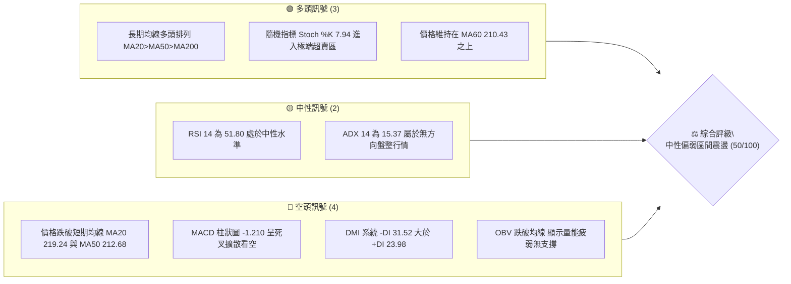
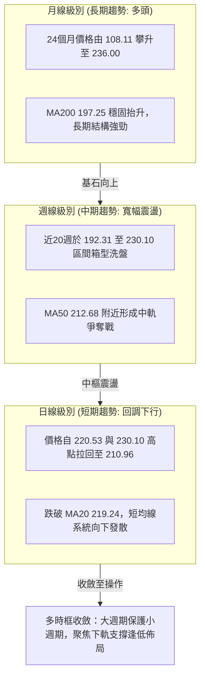
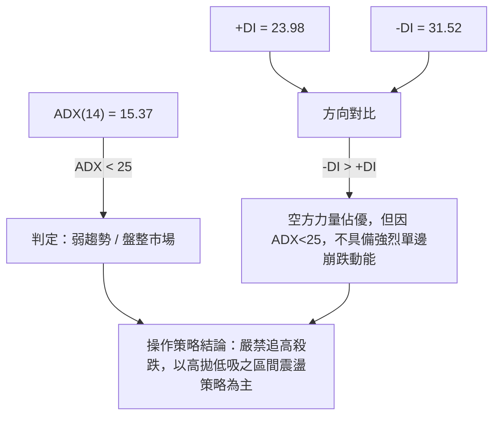
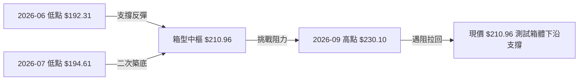
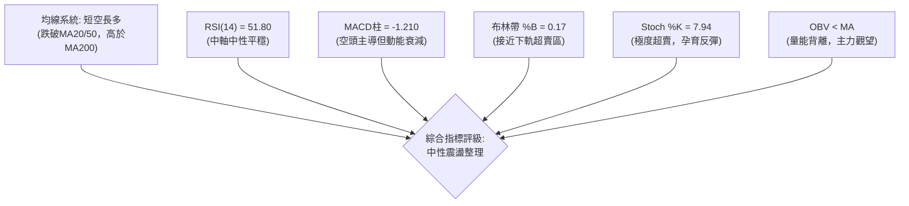
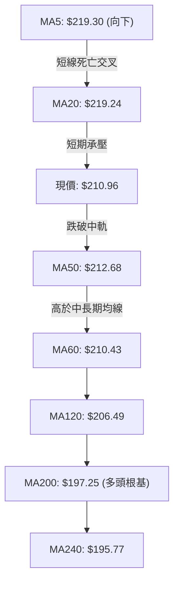
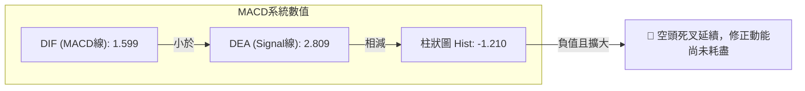
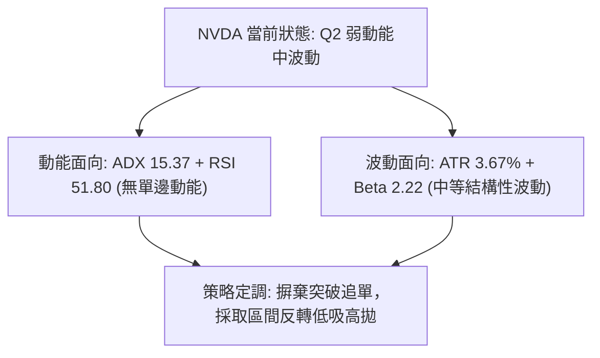
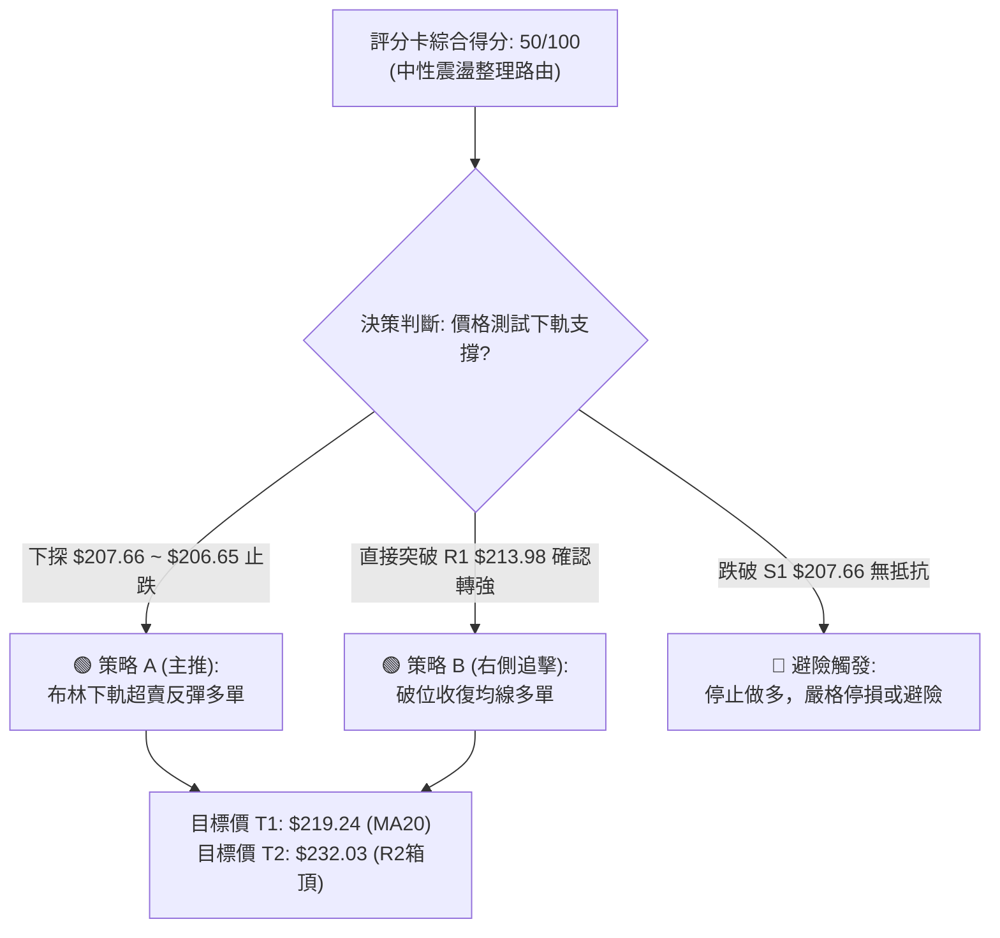
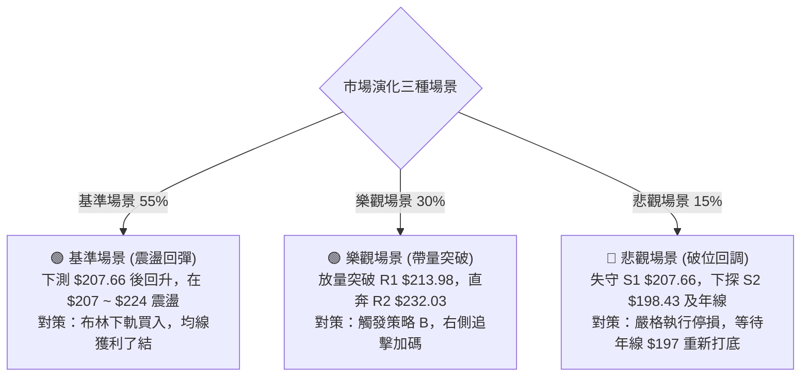

# NVDA 技術分析報告

> **報告日期**：2026-09-15 ｜ **語言**：繁體中文 ｜ **數據來源**：Yahoo Finance ｜ **當前價格**：$210.96

---

## 目錄

| 章節 | 內容 |
|------|------|
| [1. 技術面概覽](#1-技術面概覽) | 訊號儀表板、核心指標、評分卡 |
| [2. 趨勢分析](#2-趨勢分析) | 多時框趨勢、長中短期走勢、ADX解讀 |
| [3. 圖表形態分析](#3-圖表形態分析) | 形態識別、信心度評級、目標價推算 |
| [4. 支撐與阻力](#4-支撐與阻力) | 關鍵價位結構、斐波那契回調位分析 |
| [5. 技術指標深度解讀](#5-技術指標深度解讀) | MA系統、RSI、MACD、布林通道、量價OBV |
| [6. 動能與波動率](#6-動能與波動率) | 動能四象限、ATR波動分析、Beta風險定價 |
| [7. 多時框架總結](#7-多時框架總結) | 時框矩陣、多時框收斂與權重判定 |
| [8. 交易策略建議](#8-交易策略建議) | 策略路由、主策略結構、反向風控觸發點 |
| [9. 風險提示與監控](#9-風險提示與監控) | 關鍵指標監控清單、情境模擬、總結評級 |

---

## 1. 技術面概覽

### 🎯 技術訊號儀表板



### 📊 核心指標速覽表

| 指標類別 | 指標名稱 | 當前數值 | 訊號 | 解讀 |
|----------|----------|----------|------|------|
| **價格** | 當前價格 | $210.96 | 🟡 | 位於52週高低點區間之65.3%，處於高檔拉回震盪區 |
| **均線** | MA20 | $219.24 | 🔴 | 價格位於MA20下方 -3.78%，短期趨勢承壓 |
| **均線** | MA50 | $212.68 | 🔴 | 價格跌破MA50，中短期波段支撐面臨考驗 |
| **均線** | MA200 | $197.25 | 🟢 | 價格高於MA200 +6.95%，長期牛市基底未破 |
| **動能** | RSI(14) | 51.80 | 🟡 | 處於50中軸，無明顯多空超買超賣，背離未顯現 |
| **動能** | MACD (12,26,9) | 1.599 / 2.809 (柱 -1.210) | 🔴 | DIF下穿MACD Signal線，空頭柱狀體持續擴大 |
| **動能** | Stoch %K / %D | 7.94 / 30.08 | 🟢 | %K深入10以下極端超賣，隨時孕育超跌反彈 |
| **趨勢** | ADX(14) / ±DI | 15.37 (-DI 31.52 > +DI 23.98) | 🔴 | 趨勢強度疲軟（盤整市），空方暫握短期微弱主導權 |
| **通道** | 布林通道 %B | 0.17 (上$231.83 / 下$206.65) | 🟡 | 接近布林下軌支撐區，通道寬度平緩未見單邊開口 |
| **量能** | 成交量 / OBV | 131.94M (量比 1.01x) / OBV<MA | 🔴 | 成交量微幅放大但OBV弱於均線，量價配合欠佳 |
| **波動** | ATR(14) | $7.74 (佔股價 3.67%) | 🟡 | 每日平均震幅近8美元，短線波動維持健康水準 |

### 🏆 技術評分卡

```
╔══════════════════════════════════════════════════════════════════╗
║                 技術評分卡 — NVDA (2026-09-15)                  ║
╠══════════════════════════════════════════════════════════════════╣
║ 趨勢強度 (ADX/DMI)  ████░░░░░░░░░░░░░░░░  25/100  🔴 弱勢盤整    ║
║ 動能指標 (RSI/MACD) ████████░░░░░░░░░░░░  40/100  🔴 動能轉弱    ║
║ 支撐穩定度 (S1/S2)  ██████████████░░░░░░  70/100  🟢 買盤支撐固  ║
║ 成交量能 (OBV/VOL)  ████████░░░░░░░░░░░░  40/100  🔴 量能背離弱  ║
║ 形態結構 (區間箱體) ████████████░░░░░░░░  60/100  🟡 箱型洗盤中  ║
║ 均線系統 (MA長中短) █████████████░░░░░░░  65/100  🟢 長多短修正  ║
╠══════════════════════════════════════════════════════════════════╣
║ 綜合技術評分        ██████████░░░░░░░░░░  50/100  ⚖️ 區間觀望    ║
╚══════════════════════════════════════════════════════════════════╝
```

---

## 2. 趨勢分析

### 🌐 多時框趨勢分析



### 📈 長期趨勢 — 12個月走勢圖（Unicode）

```
NVDA 月線收盤走勢圖（2025-10 至 2026-09）
價格 ($)
236.00 ┤                                      ▲ 52W High ($236.00)
220.53 ┤                                  ●
210.96 ┤                      ●           │   ●← 現價 ($210.96)
202.01 ┤  ●                   │   ●       │   │
190.68 ┤  │       ●   ●       │   │   ●   │   │
186.06 ┤  │   ●   │   │       │   │   │   │   │
176.58 ┤  │   │   │   │   ●   │   │   │   │   │
174.00 ┤  │   │   │   │   │   ●   │   │   │   │
163.90 ┤──┴───┴───┴───┴───┴───┴───┴───┴───┴───┴─── 52W Low ($163.90)
         10  11  12  01  02  03  04  05  06  07  08  09 (月份)
        '25                                      '26
```

#### 走勢特徵分析表格

| 階段區間 | 月份範疇 | 起訖收盤價 | 區間漲跌幅 | 走勢特徵與量價結構解讀 |
|----------|----------|------------|------------|------------------------|
| **第 I 階段** | 2025-10 ~ 2026-03 | $202.01 → $174.00 | -13.87% | 高檔獲利回吐，波段震盪拉回，回測 $174.00 波段底部，成交量沉澱。 |
| **第 II 階段** | 2026-03 ~ 2026-05 | $174.00 → $210.66 | +21.07% | 強勁反彈波，基本面驅動快速重返 200 美元整數關卡，MA50 轉折向上。 |
| **第 III 階段**| 2026-05 ~ 2026-07 | $210.66 → $200.53 | -4.81% | 200 美元中樞反覆洗盤，布林通道帶寬收窄，蓄勢形成次級底部。 |
| **第 IV 階段** | 2026-07 ~ 2026-09 | $200.53 → $210.96 | +5.20% | 8月衝高至 $220.53 (觸及歷史高點區)，9月受阻於 R2 $232.03 壓制而技術回檔。 |

### 📊 中期趨勢（週線分析）

從近 20 週歷史明細可見，NVDA 呈現典型的矩形整理通道：
- **上方阻力天花板**：多次受阻於 2026-08-16 週高點 $224.91 及 2026-09-06 的 $230.10，逼近阻力 R2 $232.03 與 52W 高點 $236.00。
- **下方支撐地板**：2026-06-28 創下波段低點 $192.31 及 2026-07-05 的 $194.61，該位置與數據關鍵支撐 S3 $194.30 極度吻合。
- **中樞爭奪**：目前收盤 $210.96 恰好位於週線整理箱體正中央，緊貼 MA60 ($210.43) 與 MA50 ($212.68)。

```
週線箱體支撐阻力結構圖：
$236.00 ══════════════════════════════════════ [52W High 極限阻力]
$232.03 -------------------------------------- [R2 強阻力位]
$219.24 ┄┄┄┄┄┄┄┄┄┄┄┄┄┄┄┄┄┄┄┄┄┄┄┄┄┄┄┄┄┄┄┄┄┄┄ [MA20 短期反壓]
$210.96 ◄───【現價 $210.96 / 箱體中軸】───►
$207.66 ┄┄┄┄┄┄┄┄┄┄┄┄┄┄┄┄┄┄┄┄┄┄┄┄┄┄┄┄┄┄┄┄┄┄┄ [S1 近期波段支撐]
$198.43 -------------------------------------- [S2 中期防守線 / MA200]
$194.30 ══════════════════════════════════════ [S3 箱底絕對強支撐]
```

### ⚡ 趨勢強度評估（ADX 解讀）



#### ADX 數值強度對照

| 數值區間 | 趨勢強度定義 | 當前狀態 (15.37) | 交易戰術對策 |
|----------|--------------|------------------|--------------|
| 0 ~ 20 | 極弱 / 無方向盤整 | **當前落點 (15.37)** | **區間網格交易、均值回歸策略、布林帶軌道高空低多** |
| 20 ~ 25 | 弱趨勢 / 醞釀期 | — | 觀察突破方向，減小部位觀望 |
| 25 ~ 40 | 強趨勢形成 | — | 順勢交易，回調均線加碼 |
| 40 ~ 60 | 極強單邊爆發 | — | 持股續抱，移定移動停利點 |
| > 60 | 趨勢過熱面臨力竭 | — | 分批獲利了結，警惕V型反轉 |

---

## 3. 圖表形態分析

### 🔍 形態識別系統



#### 圖表形態信心度評估表

| 形態識別 | 信心度 (%) | 判斷依據（引用數據） | 完成度 (%) | 目標價（附計算式） |
|----------|------------|----------------------|------------|--------------------|
| **大型矩形整理箱體** | **85%** | 底部受 S3 $194.30 與 06/28 低點 $192.31 支撐；頂部受 R2 $232.03 與 52W 高點 $236.00 壓制 | 75% | 箱頂突破目標：頸線 $232.03 + (箱頂 $232.03 - 箱底 $194.30 = $37.73) = **$269.76**（註：未突破前僅於區間操作） |
| **短期雙重頂 (M頂)** | **45%** | 8月中旬高點 $224.91 與 9月初高點 $230.10 形成潛在高點，但 ADX 僅 15.37 無趨勢爆發力 | 40% | 信心度 < 50%，訊號不足，不排除轉化為大箱體內收斂三角形，僅做指標型回檔解讀 |
| **布林帶下軌支撐回彈** | **75%** | 當前收盤 $210.96 逼近下軌 $206.65，%B = 0.17 具備強烈均值回歸傾向 | 80% | 目標回測布林中軌 MA20 = **$219.24** |

### 🕯️ 重要K線形態分析

| 週期/月份 | 收盤價 | K線組合與形態特徵 | 技術含義解讀 | 多空訊號 |
|-----------|--------|-------------------|--------------|----------|
| 2026-06 | $199.87 | 長下影錘頭線 (探底 $192.31 回升) | 確立長期買盤在 $194.30 支撐區的防禦決心 | 🟢 多頭抵抗 |
| 2026-07 | $200.53 | 小實體十字星 (十字陀螺線) | 空頭動能衰竭，多空於 200 美元達成微幅平衡 | 🟡 變盤蓄勢 |
| 2026-08 | $220.53 | 中陽線實體向上突破 | 突破 210 美元壓制，發起向上衝擊，確認箱底反彈成立 | 🟢 多方進攻 |
| 2026-09 | $210.96 | 衝高回落倒錘頭 / 陰線回踩 | 受制於 R2 $232.03 聚類阻力，短線多頭獲利了結 | 🔴 空方壓制 |

### 📉 ASCII 走勢形態示意圖

```
NVDA 日/週線箱體運行結構示意圖
$236.00 ┼───────────────────┬────────────── 52W High ($236.00)
        │                   │   ▲ 高點 $230.10 (09-06)
$232.03 ┼───────▲───────────┴───┼────────── 箱頂阻力 R2 ($232.03)
        │      / \             / \
$219.24 ┼─────/───\───────────/───\──────── MA20 / 布林中軌
        │    /     \         /     ▼ 現價 $210.96
$210.96 ┼───/───────\───────/────────────── 箱體中樞水平線
        │  /         ▼     /
$206.65 ┼─/───────────\───/──────────────── 布林下軌支撐
        │/             \ /
$194.30 ┼───────────────▼────────────────── 箱底支撐 S3 ($194.30)
```

### 🎯 形態目標價計算

依據確立度最高之「矩形箱體整理」形態（信心度 85%），推導多空關鍵邊界：
1. **箱體上限（阻力邊界）**：$232.03 (R2 聚類高點)
2. **箱體下限（支撐邊界）**：$194.30 (S3 聚類低點)
3. **箱體高度 ($H$)**：$232.03 - $194.30 = **$37.73**
4. **多頭向上突破量度目標價**：$232.03 + $37.73 = **$269.76**
5. **空頭向下跌破量度目標價**：$194.30 - $37.73 = **$156.57** (跌破此處將下探 52W 低點 $163.90 之下)

---

## 4. 支撐與阻力

### 🗺️ 關鍵價位分布圖（Unicode）

```
NVDA 價位結構分布圖 (由 OHLCV 關鍵價位聚類與斐波那契計算)
══════════════════════════════════════════════════════════════════
$236.00 ║██████████████████████████████║ 52W High / 斐波 0.0% 極強阻力
$232.03 ║████████████████████████      ║ 強阻力 R2 (波段高點聚類)
$218.98 ║████████████████              ║ 斐波那契 23.6% 回調位 / MA20 ($219.24)
$213.98 ║████████████                  ║ 短線阻力 R1 (近一年波段高點)
$210.96 ╠══════════════════════════════╣ ◄── 當前收盤價 ($210.96)
$208.46 ║▓▓▓▓▓▓▓▓▓▓▓▓▓▓▓▓              ║ 斐波那契 38.2% 回調位
$207.66 ║▓▓▓▓▓▓▓▓▓▓▓▓▓▓▓▓▓▓            ║ 近期支撐 S1 (波段低點聚類)
$206.65 ║▓▓▓▓▓▓▓▓▓▓▓▓                  ║ 布林通道下軌動態支撐
$199.95 ║████████████████████          ║ 斐波那契 50.0% 關鍵心理分水嶺
$198.43 ║██████████████████████        ║ 波段強支撐 S2 / 緊貼 MA200 ($197.25)
$194.30 ║████████████████████████      ║ 核心底線 S3 (波段低點密集聚類)
$191.44 ║██████████████████████████    ║ 斐波那契 61.8% 黃金分割強支撐
══════════════════════════════════════════════════════════════════
```

### 🚧 阻力位分析表

價位嚴格引用技術數據中之高點聚類與 Fibonacci 數值：

| 阻力級別 | 價位 | 形成原因（歷史聚類 / 均線） | 突破難度 | 戰略重要性 |
|----------|------|-----------------------------|----------|------------|
| **R1** | **$213.98** | 近一年波段高點密集成交聚類區，上方緊壓 MA50 ($212.68) | 中等 🟡 | **短線多空分水嶺**；唯有收復 R1 才能化解日線下行壓力 |
| **R2** | **$232.03** | 近一年大型波段頂部聚類（2026-09-06 觸及 $230.10 回落） | 極高 🔴 | **中期箱體天花板**；此處為主控資金密集派發區 |
| **52W High**| **$236.00** | 52週歷史最高紀錄，斐波那契 0.0% 起算點 | 極高 🔴 | **歷史極限強阻力**；需全市場流動性全面配合方能攻克 |

### 🛡️ 支撐位分析表

價位嚴格引用技術數據中之低點聚類與均線支撐：

| 支撐級別 | 價位 | 形成原因（歷史聚類 / 均線） | 守住機率 | 戰略重要性 |
|----------|------|-----------------------------|----------|------------|
| **S1** | **$207.66** | 近一年波段低點聚類，與斐波 38.2% ($208.46) 及布林下軌 ($206.65) 重合 | 70% 🟢 | **短期防守第一道防線**；跌破則確認日線布林破位 |
| **S2** | **$198.43** | 近一年波段低點聚類，緊扣斐波 50.0% ($199.95) 與 MA200 牛熊線 ($197.25) | 85% 🟢 | **中期牛熊護城河**；多頭長線生命線，具強大承接買盤 |
| **S3** | **$194.30** | 近一年波段絕對低點聚類區（06/28 低點 $192.31 與 07/05 低點 $194.61） | 90% 🟢 | **長期最後防線**；若失守將觸發結構性長期趨勢反轉 |

### 📐 斐波那契回調位分析

基準週期：52 週低點 **$163.90** 至 52 週高點 **$236.00**，區間震幅 **$72.10**。

```
斐波那契回調層級分布：
  0.0% (52W High) ──────── $236.00  [波段頂點]
 23.6%            ──────── $218.98  [弱回調位 / MA20 $219.24 壓制位]
                               ▲
              現價 $210.96 落在 23.6% 與 38.2% 區間
                               ▼
 38.2%            ──────── $208.46  [健康回調強支撐，緊貼 S1 $207.66]
 50.0%            ──────── $199.95  [多空中樞分界線，整數防守位]
 61.8%            ──────── $191.44  [黃金分割防守位，緊貼 S3 $194.30]
 78.6%            ──────── $179.33  [深度洗盤位]
100.0% (52W Low)  ──────── $163.90  [週期基底起點]
```

- **當前位置解讀**：現價 **$210.96** 正好運行於 **23.6% ($218.98)** 與 **38.2% ($208.46)** 之間。
- **技術意義**：在牛市回調中，38.2% ($208.46) 屬於「強勢回調」的極限防守位。若 NVDA 在 $208.46 ~ $207.66 (S1) 止跌回升，代表長期上升趨勢未受損害；若有效跌破 $208.46，股價將朝 50.0% ($199.95) 尋求支撐。

---

## 5. 技術指標深度解讀

### 🎛️ 指標訊號總覽



### 📈 移動平均線排列分析



#### 均線層級明細表

| 均線名稱 | 數值 | 價格相對位置 | 偏離度 (%) | 短期趨勢導向 |
|----------|------|--------------|------------|--------------|
| MA5 | $219.30 | 價格於均線下方 | -3.80% | 極短線急跌壓制 🔴 |
| MA10 | $221.67 | 價格於均線下方 | -4.83% | 短線反彈第一道天花板 🔴 |
| MA20 | $219.24 | 價格於均線下方 | -3.78% | 月線級別反壓，空頭排列 🔴 |
| MA50 | $212.68 | 價格於均線下方 | -0.81% | 跌破季線，考驗防禦買盤 🔴 |
| MA60 | $210.43 | 價格於均線上方 | +0.25% | 即時動態支撐，多頭微弱防守 🟢 |
| MA120 | $206.49 | 價格於均線上方 | +2.17% | 半年線防禦，與布林下軌重合 🟢 |
| MA200 | $197.25 | 價格於均線上方 | +6.95% | 年線牛熊線，長期多頭強支撐 🟢 |
| MA240 | $195.77 | 價格於均線上方 | +7.76% | 長期底部基石 🟢 |

**均線綜合結論**：長週期均線依然呈標準多頭排列（MA20 > MA50 > MA200），但短週期出現均線糾纏且價格跌落 MA5/10/20/50 之下，表明當前處於**大牛市架構下的次級折返修正波**。

### 📉 RSI(14) 分析

```
RSI(14) 動能刻度尺：
0 ─────── 20 ──────── 30 ──────────────── 50 ────── 51.8 ──────── 70 ──────── 80 ─────── 100
             [極度超賣]  [超賣警戒]         [中軸]   [現值]       [超買警戒]  [極度超買]
進度條：██████████████████████████░░░░░░░░░░░░░░░░░░░░░░░░  51.80% (平衡區)
```

- **數值狀態**：當前 RSI(14) 為 **51.80**，處於典型的中性多空博弈帶（30-70）。
- **超買超賣判定**：無超買或超賣現象。但輔助指標 Stoch %K 已暴跌至 **7.94**（極度超賣），顯示極短線拋壓已接近極限，RSI 在 50 中軸具備獲得支撐動能。
- **背離分析**：
  - 檢視 2026-08-16 週收盤 $224.91（RSI: 75.4）與 2026-09-06 週收盤 $230.10（RSI: 53.7）。
  - **結論**：價格創反彈新高而 RSI 呈現顯著降低，存在**日/週線級別熊性頂背離（Bearish Divergence）**，這正是 9 月初股價自 $230.10 急速回落至 $210.96 的核心動力。目前該背離已充分釋放，當前無底背離形成。

### 📊 MACD(12/26/9) 訊號解讀



- **狀態解讀**：DIF (1.599) 位於零軸上方，但在 Signal 線 (2.809) 下方運行，柱狀圖為 **-1.210**，且負值呈現微幅放大態勢。
- **週期收斂**：近 3 週 MACD 柱狀圖由 +0.835 驟降至 -0.507，再擴大至 -1.210，證實短線空頭力量掌控盤面節奏。但在 DIF 未跌破零軸前，屬於「零軸上方強勢死叉」，非破位暴跌訊號，更偏向於高檔整理。

### 📦 布林通道分析

```
NVDA 布林通道 (20, 2) 價位橫切面
$231.83 ┼────────────────────────────── BB Upper 上軌 (超買壓力區)
        │
$219.24 ┼────────────────────────────── BB Middle 中軌 (MA20 基準線)
        │
$210.96 ┼────── ◄ 現價 ($210.96) [%B = 0.17]
        │
$206.65 ┼────────────────────────────── BB Lower 下軌 (超賣支撐區)
```

- **軌道參數**：帶寬 Bandwidth = ($231.83 - $206.65) / $219.24 = **11.48%**。帶寬處於中等收縮狀態，說明單邊行情告一段落，進入震盪期。
- **%B 位置**：當前 **%B = 0.17**，價格落於下軌與中軌之間的極低位，非常接近下軌 $206.65。
- **技術意義**：當 %B < 0.20 且 ADX < 25 時，布林下軌提供強力的「均值回歸」彈性，價格在跌破下軌前通常會引發逢低買盤拉升。

### 💹 成交量分析（量價配合度）

- **量比檢驗**：最新日成交量 **131,942,300** 股，相較於 20 日均量 **130,532,105** 股，量比為 **1.01x**，量能維持平穩，並無恐慌性巨量出逃跡象。
- **OBV（能量潮）趨勢**：數據顯示「OBV < MA → 量能疲弱」。自 8 月底高點以來，股價下跌伴隨 OBV 跌破其移動平均線，說明大資金以減持觀望為主，未見機構搶籌入場。
- **週量能特徵**：2026-08-30 下跌週量能放大至 931.42M，而隨後上漲週量能萎縮至 661.59M，呈現**量增價跌、量縮價漲**的輕度量價背離，抑制了立即向上突破的空間。

---

## 6. 動能與波動率

### ⚡ 動能評估四象限

| 象限標籤 | 動能維度 | 波動率維度 | 當前股票狀態 | 戰略應對建議 |
|----------|----------|------------|--------------|--------------|
| **象限 I (Q1)** | 強動能 (Trend) | 低波動 (Low Vol) | — | 趨勢穩健上行，最佳波段做多時機 |
| **象限 II (Q2)**| **弱動能 (Weak)** | **低/中波動 (Mid Vol)**| **✔ NVDA 落點** | **震盪築底階段，適合區間網格操作與逢低埋伏** |
| **象限 III (Q3)**| 強動能 (Explosive)| 高波動 (High Vol)| — | 行情加速噴出，高風險高收益突破交易 |
| **象限 IV (Q4)**| 弱動能 (Bearish) | 高波動 (High Vol)| — | 恐慌崩跌與流動性危機，嚴格停損空倉 |



### 📊 ATR 波動率分析

- **ATR(14) 絕對值**：**$7.74**
- **波動佔比**：佔現價比例為 **3.67%**，處於高科技半導體個股之正常安全震幅範圍內。
- **交易止損距離建議**：
  - **超短線當沖 / 隔夜交易**：1.0 × ATR = **$7.74**（保護性停損幅度約 3.7%）
  - **波段擺動交易（Swing Trading）**：1.5 × ATR = 1.5 × $7.74 = **$11.61**（停損幅度約 5.5%）
  - **趨勢保護防守點**：2.0 × ATR = 2.0 × $7.74 = **$15.48**（停損幅度約 7.3%）

### 📐 Beta 與市場相關性

- **Beta 係數**：**2.217**。
- **解讀**：NVDA 屬於極高彈性之積極型成長標的。若標普 500 指數波動 1.0%，NVDA 預期同向波動 2.217%。
- **風控意涵**：極高的 Beta 值意味著當前大盤若出現系統性震盪，NVDA 將放大回調幅度。因此在短線動能指標（MACD柱死叉、OBV走弱）尚未轉正前，嚴禁使用融資槓桿，需保留充沛現金倉位。

---

## 7. 多時框架總結

### 📋 時框架評分表

| 時框架 | 趨勢方向 | 動能狀態 | 均線系統排列 | 關鍵形態結構 | 綜合評分 | 操作建議 |
|--------|----------|----------|--------------|--------------|----------|----------|
| **月線 (長期)** | 🟢 多頭上行 | 🟢 強勢平穩 (長期牛市) | 🟢 MA200 197.25 穩固多頭 | 歷史級別台階式抬升 | **80/100** | 核心長線部位持股續抱 |
| **週線 (中期)** | 🟡 寬幅箱體 | 🟡 中性整理 (柱狀縮小) | 🟡 糾纏於 MA50 212.68 | $194.30 - $232.03 箱體 | **55/100** | 箱底買進、箱頂調節 |
| **日線 (短期)** | 🔴 震盪偏弱 | 🔴 空方主導 (-DI>+DI) | 🔴 受壓於 MA20 219.24 | 衝高回踩下軌布林測試 | **40/100** | 暫緩追多，等待 S1 測試 |

### 🔲 綜合訊號矩陣

| 技術維度 | 短期 (日線) | 中期 (週線) | 長期 (月線) | 訊號一致性評估 |
|----------|-------------|-------------|-------------|----------------|
| **趨勢方向** | 🔴 空方回調 | 🟡 矩形整理 | 🟢 堅定看多 | 多時框衝突：大週期看漲，小週期回調 |
| **動能訊號** | 🔴 MACD負向擴大 | 🟡 RSI中性51.8 | 🟢 長期動能充足 | 短期拋壓宣洩，即將進入超跌支撐區 |
| **量能狀態** | 🔴 OBV跌破均線 | 🟡 均量持平130M | 🟢 機構持股達71.4% | 短線主力洗盤，長線籌碼極為沉澱 |
| **綜合取向** | 謹慎防守 | 區間布局 | 策略定投 | **大週期保護小週期，回調為多頭佈局契機** |

### ⚖️ 多時框收斂結論

> **依據「嚴格要求 14」執行多時框收斂收束**：
> 1. **行情性質判定**：當前日線 ADX(14) 僅為 **15.37**，遠低於趨勢臨界線 25，**明確定義為「無單邊趨勢之盤整行情」**。
> 2. **主導時框與原則**：在盤整行情中，單邊趨勢指標失效，**交易決策以「日線布林通道上下軌及箱體邊界」為核心依據**。
> 3. **衝突收斂**：日線短空與月線長多的矛盾，收斂為「中期箱體下沿逢支撐回補」的均值回歸邏輯。
> 4. **唯一方向性結論**：**【中性觀望，偏向於區間下沿低吸做多】**（綜合評分 50/100，嚴禁任何追空動作，靜待回踩 S1 $207.66 及下軌 $206.65 確立止跌）。

---

## 8. 交易策略建議

### 🗺️ 策略決策流程圖



### 🧭 策略路由

- **綜合評分定調**：第 1 章綜合評分卡為 **50/100（中性區間）**。
- **主策略方向**：**【區間操作——布林通道下軌極端值反彈低吸策略】**。由於長線大趨勢 MA200 強勢向上，且隨機指標 Stoch %K (7.94) 嚴重超賣，回調至支撐位做多之期望值遠高於放空。空頭訊號僅作為停損與減倉防禦參考。

### 🎯 價格情境階梯（Price Scenarios）

價位嚴格引用關鍵價位聚類與 Fibonacci 數值：

| 觸發條件 | 第一目標 (T1) | 後續延伸 (T2) | 極限目標 | 情境技術含義 |
|----------|---------------|---------------|----------|--------------|
| **強勢突破 R1 ($213.98)** | R2 ($232.03) | 52W High ($236.00) | 形態推算 $269.76 | 短線反轉轉強，空頭陷阱確認 |
| **站穩現價區間 ($210.96)** | MA20 ($219.24) | R1 ($213.98) | R2 ($232.03) | 區間沉澱打底，進行均值修復 |
| **跌破 S1 ($207.66)** | S2 ($198.43) | S3 ($194.30) | 斐波 61.8% ($191.44) | 中期弱勢回調，測試年線牛熊分水嶺 |

### 📊 情境機率分佈

| 情境路線 | 發生機率 | 主要技術依據 |
|----------|----------|--------------|
| **情境甲：下軌支撐回彈** | **55%** | Stoch %K (7.94) 極端超賣；價格落於布林下軌 %B=0.17；S1 $207.66 具買盤聚類 |
| **情境乙：箱體窄幅震盪** | **30%** | ADX 僅 15.37 缺乏動能；RSI 處於 51.80 中軸；量比 1.01x 機構觀望 |
| **情境丙：失守支撐再下探** | **15%** | MACD 柱狀體為負 (-1.210)；-DI 佔優 (31.52)；OBV 疲軟未跟進 |

### 🟢 主策略詳情（依 50/100 路由擬定低吸策略）

所有價位均基於第 4 章確切支撐阻力與 1.5×ATR 計算：

| 策略要素 | 策略 A：左側逢低佈局（下軌強彈） | 策略 B：右側突破確認（收復阻力） |
|----------|----------------------------------|----------------------------------|
| **進場條件** | 價格回踩 S1 且 Stoch 形成超賣金叉 | 日線實體突破收復阻力位 R1 |
| **進場價格** | **$207.66** (精確錨定支撐位 S1) | **$213.98** (精確錨定阻力位 R1) |
| **目標價 T1** | **$219.24** (MA20 / 布林中軌) | **$224.91** (8月中旬反彈高點) |
| **目標價 T2** | **$232.03** (阻力位 R2 / 箱頂) | **$232.03** (阻力位 R2 / 箱頂) |
| **止損價格** | **$201.85** (S1 扣除 0.75×ATR: $207.66 - $5.81) | **$207.66** (跌回 S1 支撐線下方即停損) |
| **風險報酬比** | **1 : 4.20** [風險 $5.81 : 獲利 T2 $24.37] | **1 : 2.86** [風險 $6.32 : 獲利 T2 $18.05] |
| **歷史勝率估計** | **65%** (震盪市布林下軌低吸勝率) | **58%** (順向右側突破均線勝率) |
| **建議倉位** | **15% ~ 20%** (分批建倉) | **10% ~ 15%** (右側加碼) |

### 🔴 反向風險觸發點（對沖與撤退提示）

若出現以下極端空頭觸發點，主策略完全失效，應全面撤出多單：
1. **關鍵點位跌破**：日線收盤價跌破 **$207.66 (S1)**，且次日無法收復，多單立即停損。
2. **極端失守**：盤中摜破 **$198.43 (S2)** 與 **$197.25 (MA200)**，代表多頭趨勢被破壞，需立即反手買入 Put 或清倉避險。
3. **指標異動**：ADX 突然拉升突破 25，伴隨 -DI 向上噴出大於 40，代表單邊崩跌趨勢形成，嚴禁盲目抄底。

### ⭐ 整體訊號強度評星

```
做多訊號強度：★★★☆☆  (3.0/5星 — 長線趨勢強，短期等待超賣止跌確認)
做空訊號強度：★★☆☆☆  (2.0/5星 — 空間受限於S1/S2支撐，勝率盈虧比不佳)
整體可信度：  ★★★★☆  (4.0/5星 — 箱體與斐波那契價位結構高度收斂明晰)
```

---

## 9. 風險提示與監控

### ✅ 關鍵監控指標 Checklist

```
╔══════════════════════════════════════════════════════════════════╗
║                     關鍵技術指標監控清單 (Checklist)              ║
╠══════════════════════════════════════════════════════════════════╣
║ [ ] 價格能否守穩短期第一支撐 S1 $207.66 (斐波 38.2% 防線)        ║
║ [ ] RSI(14) 能否在 50 中軸築底回升，避免跌入 40 以下弱勢區        ║
║ [ ] MACD 柱狀體 (-1.210) 是否開始向零軸收斂（縮頭代表拋壓緩解）   ║
║ [ ] Stoch %K (7.94) 能否向上穿越 %D (30.08) 形成超賣低位黃金交叉   ║
║ [ ] 每日收盤價是否重新收復 MA50 ($212.68) 與 MA20 ($219.24)      ║
║ [ ] 成交量能否在突破時有效放量超越 20 日均量 (130.53M)           ║
║ [ ] ADX(14) 數值變化：若維持 <25 繼續箱體操作；若 >25 準備順勢跟進 ║
╚══════════════════════════════════════════════════════════════════╝
```

### ⚠️ 風險場景分析



### 🛡️ 風險管理重要提醒

1. **Beta 槓桿控制**：NVDA 的 Beta 高達 **2.217**，波動性是一般大盤的兩倍以上。即使技術面超賣，整體部位亦不宜超過投資組合總資金之 **20%**，嚴禁以全倉或過夜高槓桿選擇權搏取反彈。
2. **ATR 波動適應性**：日均震幅為 **$7.74 (3.67%)**，盤中日內穿透 $3~$5 屬於正常市場雜訊。止損點切勿設置在 $209 附近之雜訊區間，必須拉開至 S1 外部 **$201.85** 以確保不被「甩轎」。
3. **均線破位再檢視**：目前 MA20 與 MA50 已死叉，短線反彈至 MA20 ($219.24) 附近必定有解套賣壓，若未伴隨 1.5 倍以上均量（>200M）突破，應在 T1 目標價主動減半倉鎖定利潤。

---

## 📋 報告總結

```
╔══════════════════════════════════════════════════════════════════╗
║                     NVDA 技術分析報告總結卡                       ║
╠══════════════════════════════════════════════════════════════════╣
║ 報告日期：2026-09-15           當前價格：$210.96                 ║
║ 綜合評分：50/100 (中性區間)     技術評級：⚖️ 區間震盪整理 (觀望/低吸)║
╠══════════════════════════════════════════════════════════════════╣
║ 關鍵結論：                                                       ║
║ ├─ 長期趨勢：🟢 堅定看多 (MA200 $197.25 向上發散，基本面增長卓越) ║
║ ├─ 中期趨勢：🟡 寬幅箱型震盪 (介於 S3 $194.30 至 R2 $232.03)     ║
║ ├─ 短期趨勢：🔴 偏弱回調 (跌破 MA20，MACD 柱負值 -1.210)         ║
║ ├─ 核心支撐：S1 $207.66 / S2 $198.43 / 斐波38.2% $208.46        ║
║ ├─ 核心阻力：R1 $213.98 / R2 $232.03 / 52W High $236.00        ║
║ └─ 分析師共識目標：均價 $327.18 (最高 $515.00 / 最低 $180.00)     ║
╠══════════════════════════════════════════════════════════════════╣
║ 最優策略組合建議：                                               ║
║ 1. 🥇 最佳機會 (策略 A)：在 S1 $207.66 附近低吸，停損設 $201.85， ║
║    目標看向 MA20 $219.24 與箱頂 $232.03 (風報比高達 1:4.20)。    ║
║ 2. 🥈 次選機會 (策略 B)：若日線放量收復 R1 $213.98，右側順勢跟進， ║
║    目標 $224.91 / $232.03，停損設 $207.66。                     ║
║ 3. 🥉 保守選擇：空倉觀望，靜待 ADX > 25 或股價測試 S2 $198.43 年 ║
║    線支撐時，再進行中長線左側分批配置。                         ║
╚══════════════════════════════════════════════════════════════════╝
```

---

> ⚠️ **免責聲明**：本報告為技術分析專用，所有指標計算與圖表推演均基於 Yahoo Finance 歷史交易數據。本報告**僅供學術研究與投資決策參考**，**不構成任何形式的要約或交易招攬**。股市投資具備高度價格波動風險，投資人應獨立評估風險承擔能力並自負盈虧。

---

*報告生成時間：2026-09-15 ｜ 數據來源：Yahoo Finance ｜ 分析框架：多時框技術分析體系*