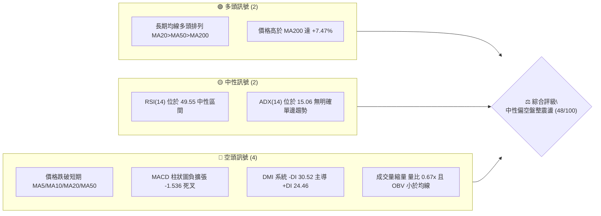
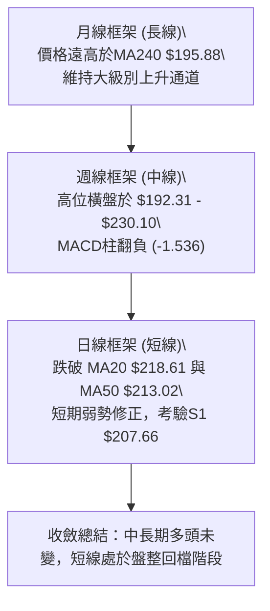
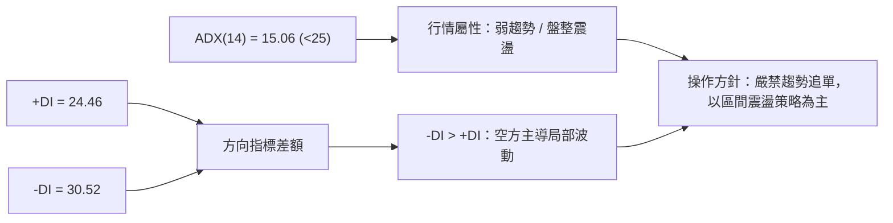
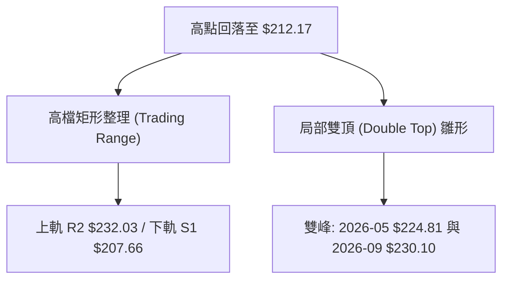
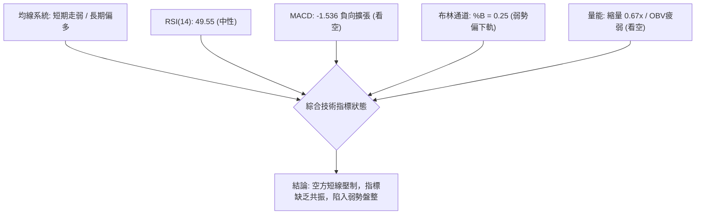
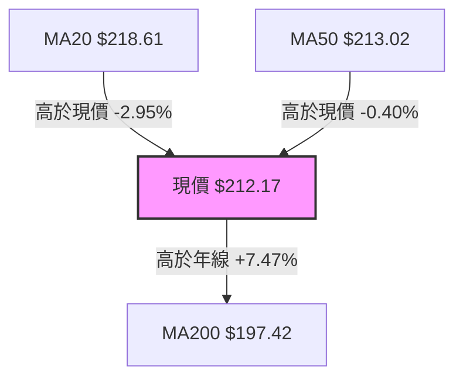
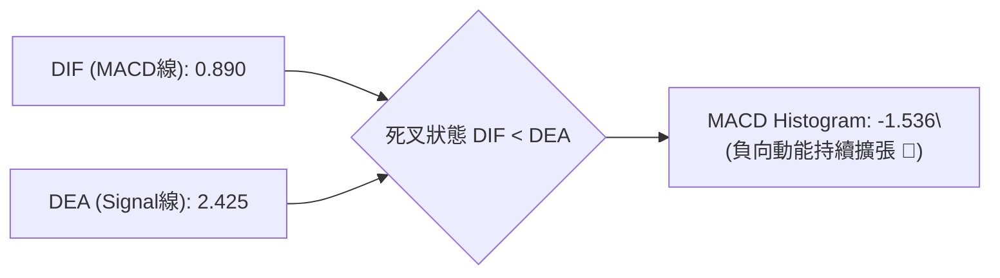
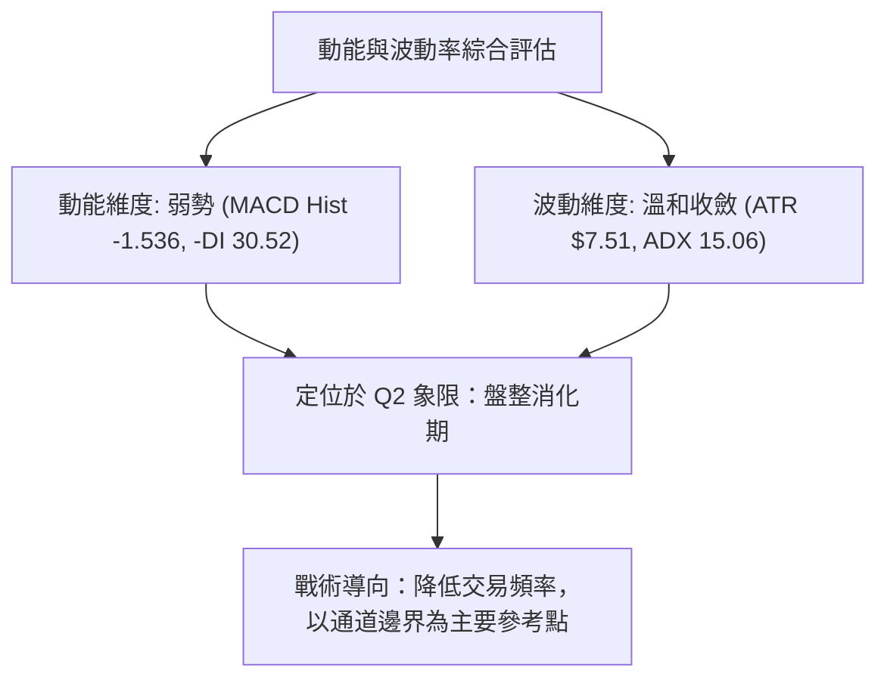
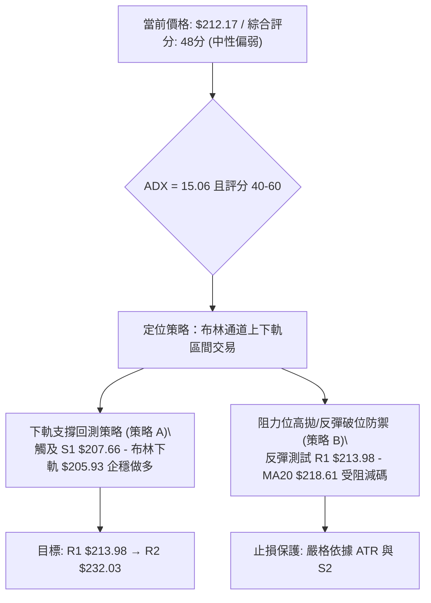
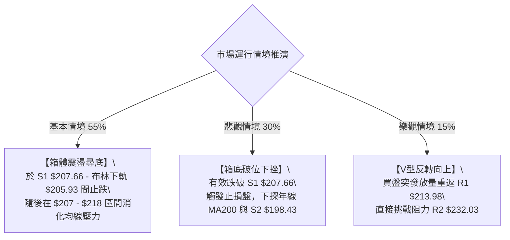

# NVDA 技術分析報告

> **報告日期**：2026-09-16 ｜ **語言**：繁體中文 ｜ **數據來源**：Yahoo Finance ｜ **當前價格**：$212.17

---

## 目錄

| 章節 | 內容 |
|------|------|
| [1. 技術面概覽](#1-技術面概覽) | 訊號儀表板、核心指標、評分卡 |
| [2. 趨勢分析](#2-趨勢分析) | 多時框趨勢、長中短期走勢 |
| [3. 圖表形態分析](#3-圖表形態分析) | 形態識別、K線組合、目標價 |
| [4. 支撐與阻力](#4-支撐與阻力) | 關鍵價位、斐波那契回調 |
| [5. 技術指標深度解讀](#5-技術指標深度解讀) | MA/RSI/MACD/布林/成交量 |
| [6. 動能與波動率](#6-動能與波動率) | 動能評估、ATR、Beta |
| [7. 多時框架總結](#7-多時框架總結) | 時框架評分矩陣 |
| [8. 交易策略建議](#8-交易策略建議) | 多空策略、風險報酬比 |
| [9. 風險提示與監控](#9-風險提示與監控) | 監控指標、風險場景 |

---

## 1. 技術面概覽

### 🎯 技術訊號儀表板



### 📊 核心指標速覽表

| 指標類別 | 指標名稱 | 當前數值 | 訊號 | 解讀 |
|----------|----------|----------|------|------|
| **價格** | 當前價格 | $212.17 | 🟡 | 位於52週區間 67.0% 位置，自近期高點 $230.10 回檔修正中 |
| **均線** | MA20 | $218.61 | 🔴 | 價格低於 20 日均線 -2.95%，短期動能轉弱承壓 |
| **均線** | MA50 | $213.02 | 🔴 | 價格略破 50 日均線 -0.40%，跌入中期生命線下方 |
| **均線** | MA200 | $197.42 | 🟢 | 價格高於年線 +7.47%，長期多頭基底與牛熊分水嶺未破 |
| **動能** | RSI(14) | 49.55 | 🟡 | 處於 30–70 中性平衡區，無超買或底背離跡象 |
| **動能** | MACD | 0.890 / 2.425 | 🔴 | 雙線維持死叉，柱狀圖負值達 -1.536，空方短線控盤 |
| **波動** | ATR(14) | $7.51 | 🟡 | 波動率佔股價 3.54%，波動幅度適中但呈收斂態勢 |

### 🏆 技術評分卡

```
╔══════════════════════════════════════════════════════════════════╗
║                技術評分卡 — NVDA (2026-09-16)                    ║
╠══════════════════════════════════════════════════════════════════╣
║ 趨勢強度      ██████░░░░░░░░░░░░░░  32/100  🔴 空頭佔優(弱趨勢)   ║
║ 動能指標      ████████░░░░░░░░░░░░  40/100  🔴 MACD死叉柱負擴張   ║
║ 支撐穩定度    ████████████░░░░░░░░  60/100  🟡 考驗S1 $207.66     ║
║ 成交量配合    ██████░░░░░░░░░░░░░░  30/100  🔴 縮量陰跌/OBV疲弱   ║
║ 形態完整度    ████████████░░░░░░░░  62/100  🟡 箱型整理格局       ║
║ 均線排列      ██████████████░░░░░░  68/100  🟢 總體多頭但短線死叉 ║
╠══════════════════════════════════════════════════════════════════╣
║ 綜合評分      █████████░░░░░░░░░░░  48/100  ⚖️ 區間震盪偏弱觀望   ║
╚══════════════════════════════════════════════════════════════════╝
```

---

## 2. 趨勢分析

### 🌐 多時框趨勢分析



### 📈 長期趨勢 — 12個月走勢圖（Unicode）

```
NVDA 月線收盤走勢圖（2025-10 至 2026-09）
價格軸 ($)
$225 ┤                                                  ● (2026-08 $220.53)
$215 ┤                                                        ● 現在 ($212.17)
$205 ┤  ● (2025-10 $202.01)                     ● (2026-05 $210.66)
$195 ┤                             ● (2026-04 $199.11)  ● (2026-07 $200.53)
$185 ┤        ● (2025-12 $186.06)
$175 ┤  ● (11 $176.58)  ● (01 $190.68) ● (03 $174.00 低點)
     └─────────────────────────────────────────────────────────────
        10   11   12   01   02   03   04   05   06   07   08   09
       2025                       2026
```

**12個月走勢特徵分析表格**：

| 階段 | 時間區間 | 起始點 / 終點 | 漲跌幅 | 結構特徵與走勢分析 |
|------|----------|---------------|--------|--------------------|
| 階段一 | 2025-10 ~ 2025-11 | $202.01 → $176.58 | -12.59% | 突破新高後的高檔獲利了結回檔 |
| 階段二 | 2025-11 ~ 2026-01 | $176.58 → $190.68 | +7.99%  | 買盤回流，於 $180 附近建立中繼平台 |
| 階段三 | 2026-01 ~ 2026-03 | $190.68 → $174.00 | -8.75%  | 次級回撤，觸及波段低點聚類區 |
| 階段四 | 2026-03 ~ 2026-05 | $174.00 → $210.66 | +21.07% | 強勢V型反彈，重返 $200 整數大關並創收盤新高 |
| 階段五 | 2026-05 ~ 2026-07 | $210.66 → $200.53 | -4.81%  | 震盪洗盤，在 $192–$214 間建立寬幅箱型整理 |
| 階段六 | 2026-07 ~ 2026-08 | $200.53 → $220.53 | +9.97%  | 突破箱頂衝高，觸及 52週高點 $236.00 區域 |
| 階段七 | 2026-08 ~ 2026-09 | $220.53 → $212.17 | -3.79%  | 高檔承壓量縮拉回，回測 50日線與斐波那契回調位 |

### 📊 中期趨勢（週線分析）

近20週數據顯示，NVDA 處於寬幅箱體震盪結構：
- 上檔壓力區：2026-09-06 觸及 $230.10，逼近 52W 高點 $236.00 與歷史阻力聚類 R2 $232.03。
- 下檔支撐區：2026-06-28 探底 $192.31，與波段低點支撐聚類 S3 $194.30 高度重疊。
- 當前週線收盤 $212.17，MACD 柱由正轉負至 -1.536，週成交量連續三週自 9.31 億股萎縮至 2.20 億股，顯示高位缺乏承接買盤，正進行無量滑落的中期均線測試。

### ⚡ 趨勢強度評估（ADX 解讀）



**ADX 趨勢強度對照解讀**：
- **ADX 數值 15.06**：遠低於 25 的趨勢門檻值，表明市場目前**無顯著單邊趨勢**，任何均線死叉或空頭進攻均易演變為假突破或震盪侵蝕。
- **+DI (24.46) vs -DI (30.52)**：負趨向指標高於正趨向指標，顯示近 14 日內空方壓制力道略大於多方，空頭主導局部震盪，但因 ADX 缺乏動能，下跌亦缺乏連續性單邊加速條件。

---

## 3. 圖表形態分析

### 🔍 形態識別系統



**圖表形態信心度與目標價評估表**（嚴格遵循規則 13 & 15）：

| 形態 | 信心度 | 判斷依據（引用數據） | 完成度 | 目標價（附精確計算式） |
|------|--------|----------------------|--------|------------------------|
| 高檔箱型整理 | 75% | 價格在波段高點聚類 R2 $232.03 與近期低點聚類 S1 $207.66 區間來回震盪超過 16 週 | 85% | 由箱體高度推算：區間低點 $207.66 突破則測 S2 $198.43；向上突破 R2 $232.03 則測 52W 高點 $236.00 |
| 潛在雙頂雛形 | 55% | 2026-05-17 高點 $224.81 與 2026-09-06 高點 $230.10 形成相隔約 16 週之雙頂結構，目前頸線為 2026-06-28 低點 $192.31 | 40% (尚未跌破頸線) | 依形態高度推算：頸線 $192.31 - (高點 $230.10 - 頸線 $192.31 = 37.79) = $154.52（因信心度僅 55% 且未破頸線，僅列為風險監控參考） |
| 旗形 / 三角形 | <30% | 數據中未偵測到標準三角形或旗形收斂軌道 | 0% | 訊號不足，僅做指標型解讀 |

### 🕯️ 重要K線形態分析

| 日期 / 月份 | 收盤價 | K線形態 | 解讀 | 訊號 |
|-------------|--------|---------|------|------|
| 2026-07-26  | $206.61 | 縮量小陽線 | 築底回升，守穩 S1 $207.66 下方假跌破位 | 🟢 支撐確立 |
| 2026-08-16  | $224.91 | 長陽放量衝高 | 突破前期高點，RSI 升至 75.4 極度超買 | 🟡 動能過熱 |
| 2026-09-06  | $230.10 | 高檔長上影十字/避雷針 | 衝擊 52W 高點 $236.00 未果，留長上影線遇阻 | 🔴 見頂回落 |
| 2026-09-13  | $218.29 | 中黑實體陰線 | 跌破 MA20 $218.61，短線多頭防線失守 | 🔴 轉弱確認 |
| 2026-09-20  | $212.17 | 連續陰線下探 | 跌破 MA50 $213.02，直逼下軌與斐波那契回調位 | 🔴 空方主導 |

### 📉 ASCII 走勢形態示意圖

```
NVDA 近期高檔雙峰與箱型走勢示意圖
      峰一 ($224.81)            峰二 ($230.10)
         ╭───╮                     ╭───╮
─────────╯   ╰───────────┐         │   ╰─────────── 阻力區 R2: $232.03
                         │         │
                         ╰────┬────╯
                              │                ◄ 現價 $212.17 (回測MA50)
                              │
     ─────────────────────────┼─────────────────── 支撐位 S1: $207.66
                              │ (回調低點 $192.31)
     ─────────────────────────┴─────────────────── 雙頂頸線 / S3: $194.30
```

### 🎯 形態目標價計算

當前走勢以「矩形整理」完成度最高（75% 信心度）：
1. 箱頂阻力區（R2）：$232.03
2. 箱底支撐區（S1）：$207.66
3. 箱體波動幅度：$232.03 - $207.66 = $24.37
4. 若向下跌破 S1 $207.66，第一理論量測目標位 = 箱底 $207.66 - (0.382 × $24.37 = $9.31) = $198.35，與波段低點支撐聚類 **S2 $198.43** 及斐波那契 50.0% 回調位 **$199.95** 完全重合共振。

---

## 4. 支撐與阻力

### 🗺️ 關鍵價位分布圖（Unicode）

```
NVDA 價位結構分布圖
═══════════════════════════════════════════════════════════════════
$236.00 ║██████████████████████████████║ 52週歷史高點 / 斐波那契 0.0%
$232.03 ║████████████████████████      ║ 強阻力 R2 (近一年波段高點聚類)
$218.98 ║████████████████              ║ 斐波那契 23.6% 回調位 / 鄰近 MA20 $218.61
$213.98 ║████████████████████          ║ 關鍵阻力 R1 (波段高點聚類 / 鄰近 MA50 $213.02)
$212.17 ╠══════════════════════════════╣ ◄ 現價 ($212.17)
$208.46 ║▓▓▓▓▓▓▓▓▓▓▓▓▓▓▓▓              ║ 斐波那契 38.2% 回調位
$207.66 ║▓▓▓▓▓▓▓▓▓▓▓▓▓▓▓▓▓▓▓▓          ║ 近期關鍵支撐 S1 (波段低點聚類 / 臨近下軌)
$199.95 ║██████████████████████        ║ 斐波那契 50.0% 回調分水嶺
$198.43 ║████████████████████████      ║ 強支撐 S2 (波段低點聚類 / 年線 MA200 $197.42)
$194.30 ║██████████████████████████    ║ 終極強支撐 S3 (波段低點聚類)
═══════════════════════════════════════════════════════════════════
```

### 🚧 阻力位分析表

（精確引用數據中「關鍵價位」區塊）

| 阻力級別 | 價位 | 形成原因 | 突破難度 | 重要性 |
|----------|------|----------|----------|--------|
| **R1** | $213.98 | 近一年波段高點聚類，與 MA50 ($213.02) 重疊，短線反彈首道重壓 | 中等 | ★★★☆☆ |
| **R2** | $232.03 | 近一年重要波段高點聚類，接近 2026-09-06 高點 $230.10 及 52W 高點 $236.00 | 極高 | ★★★★★ |

### 🛡️ 支撐位分析表

（精確引用數據中「關鍵價位」區塊）

| 支撐級別 | 價位 | 形成原因 | 守住機率 | 重要性 |
|----------|------|----------|----------|--------|
| **S1** | $207.66 | 近一年波段低點聚類，且與斐波那契 38.2% ($208.46) 及布林下軌 ($205.93) 構成支撐帶 | 65% | ★★★★☆ |
| **S2** | $198.43 | 近一年波段低點聚類，與 MA200 ($197.42) 及斐波那契 50.0% ($199.95) 形成三重共振 | 85% | ★★★★★ |
| **S3** | $194.30 | 近一年波段低點聚類，前期大底頸線區間，長線牛熊分水嶺 | 95% | ★★★★★ |

### 📐 斐波那契回調位分析

依據 52 週極值區間（低點 $163.90 至 高點 $236.00，總波動區間 $72.10）計算之回調位分布如下：
- **0.0% (52W High)**: $236.00
- **23.6%**: $218.98
- **38.2%**: $208.46
- **50.0%**: $199.95
- **61.8%**: $191.44
- **78.6%**: $179.33
- **100.0% (52W Low)**: $163.90

**現價落點解讀**：
當前價格 **$212.17** 精確落在 **23.6% ($218.98)** 與 **38.2% ($208.46)** 之間。
- 向上看，$218.98 與短期均線 MA20 ($218.61) 構成共振反壓區，多頭收復難度較高。
- 向下看，$208.46 緊鄰關鍵波段支撐 S1 ($207.66)，此處為多頭防守首道防線。跌破 $208.46 意味著健康回調擴大為深度回調，將引發向 50.0% ($199.95) 與 S2 ($198.43) 的回測。

---

## 5. 技術指標深度解讀

### 🎛️ 指標訊號總覽



### 📈 移動平均線排列分析



**移動平均線詳細解讀**：
- **短中期均線形成死叉承壓**：
  - MA5 ($216.64)、MA10 ($220.83)、MA20 ($218.61)、MA50 ($213.02) 目前皆位於現價上方。
  - 短期均線組（MA5, MA10, MA20）斜率全面向下轉折，MA5 距離現價 -2.06%，MA10 距離 -3.92%，表明近兩週買入籌碼全數處於浮虧套牢狀態。
- **長天期均線提供堅實多頭支撐**：
  - MA60 ($210.46) 緊貼現價下方 (+0.81%)，提供第一道動態支撐。
  - MA120 ($206.80) 與波段支撐 S1 ($207.66) 形成多頭防禦帶。
  - MA200 ($197.42) 與 MA240 ($195.88) 斜率穩定向上，現價乖離年線 +7.47%，大級別維持多頭排列（MA20>MA50>MA200），尚未遭受系統性破壞。

### 📉 RSI(14) 分析

```
RSI(14) 當前狀態: 49.55 [中性區間]
0 ────────── 30 (超賣) ──────── 49.55 (現值) ──────── 70 (超買) ────────── 100
░░░░░░░░░░░░░░░░░░░░░░░░░░░░░░░█████████████░░░░░░░░░░░░░░░░░░░░░░░░░░░░░░░░
```

- **超買超賣判定**：數值 49.55 精確處於 50 多空分界線下方，表明多空雙方處於平衡膠著狀態，既無短期過熱（>70），亦未達超跌恐慌（<30）。
- **背離判斷**：
  - 在 2026-08-16 週線高點 $224.91 時，RSI 達到 75.4；而在 2026-09-06 創下更高收盤價 $230.10 時，RSI 反降至 53.7。**週線級別存在顯著頂背離**，這也是隨後兩週股價迅速自 $230.10 回跌至 $212.17 的主要動力。
  - 日線層級目前 RSI 呈直線下行，尚未偵測到底背離跡象，顯示下行修正動能尚未耗盡。

### 📊 MACD(12/26/9) 訊號解讀



- **數值關係**：MACD 線 (0.890) 低於訊號線 (2.425)，差離值擴大。
- **動能評估**：MACD 柱狀圖為 -1.536。在過去 20 週歷史中，這是自 2026-06-14 (-2.331) 以來最弱的動能讀數。負值連續放大，說明空方動能佔據主導地位，在柱狀圖出現縮腳（負值收斂）之前，不可輕易預測底部。

### 📦 布林通道分析

```
NVDA 日線布林通道示意圖（帶寬 = 11.6%）
$231.30 ──────────────────────────────────────── 上軌 (阻力位，緊鄰 R2 $232.03)
             │
             │
$218.61 ─────┼────────────────────────────────── 中軌 (MA20 阻力)
             │
             │     ◄ 現價 $212.17 (%B = 0.25)
$205.93 ─────┴────────────────────────────────── 下軌 (支撐位，緊鄰 S1 $207.66)
```

- **通道位置與 %B 解讀**：%B 為 **0.25**，代表現價位於中軌與下軌之間的下四分之一分位，顯示價格處於弱勢通道。
- **軌道形態**：布林帶寬目前為 ($231.30 - $205.93) / $218.61 = 11.6%，處於常態收斂狀態，未見張口單邊擴張。若價格進一步下探下軌 $205.93，常態下將引發技術性乖離修復與均值回歸。

### 💹 成交量分析（量價配合度）

- **最新成交量**：87,726,200 股
- **20日均量**：130,250,725 股（量比僅 **0.67x**）
- **50日均量**：125,913,020 股
- **量價分析**：當前成交量顯著萎縮（不足均量的 7 成），下跌縮量呈現「陰跌」走勢，說明市場主動性殺跌盤有限，但追價意願極度低迷。
- **OBV 趨勢**：數據顯示 OBV < MA，能量潮指標向下穿破均線，呈現「量先於價行」的弱勢特徵，主力資金處於觀望防禦狀態，量能未能對多頭反彈提供確認。

---

## 6. 動能與波動率

### ⚡ 動能評估四象限

| 象限 | 動能強度 | 波動率水平 | 當前狀態 | 評估與策略指引 |
|------|----------|------------|----------|----------------|
| **Q1 (最佳機會)** | 強 (RSI>60, MACD金叉) | 低 (ATR<3.0%) | ─ | 趨勢平穩向上推進，最佳順勢加碼區 |
| **Q2 (謹慎觀望)** | **弱 (RSI<50, MACD死叉)** | **低 (ATR 3.54%, ADX 15.06)** | **✓ (NVDA現處)** | **弱動能低波動，處於縮量橫盤盤整，適合區間高拋低吸或觀望** |
| **Q3 (高風險高回報)**| 強 (突破爆量) | 高 (ATR>5.0%) | ─ | 單邊噴發行情，需嚴設移動停利 |
| **Q4 (避免進場)** | 弱 (主跌浪) | 高 (恐慌殺跌) | ─ | 高波動破位下跌，嚴禁逆勢抄底 |



### 📊 ATR 波動率分析

- **ATR(14) 絕對值**：**$7.51**
- **ATR 相對百分比**：**3.54%** of Price ($212.17)
- **短線止損距離建議**：
  - 保守型交易（1.5 × ATR）：$7.51 × 1.5 = **$11.27**
  - 激進型交易（1.0 × ATR）：$7.51 × 1.0 = **$7.51**
- **波動意義**：日均震幅約 $7.51，意味著日內波動可直接涵蓋由現價至 R1 ($213.98) 或 S1 ($207.66) 的距離。交易者必須預留至少 $7.50 以上的緩衝空間，以避免被日內隨機噪聲掃出場。

### 📐 Beta 與市場相關性

- **Beta 係數**：**2.217**
- **市場特徵分析**：
  - NVDA 具有極高的高彈性屬性，其波動幅度為 S&P 500 大盤的 2.2 倍以上。
  - 當大盤走平或微跌時，NVDA 容易出現倍數級別的擴大調整；若大盤企穩回升，其回彈爆發力亦居權值股之冠。當前 Beta 處於高位，配置上應嚴格控制槓桿比例。

---

## 7. 多時框架總結

### 📋 時框架評分表

| 時框架 | 趨勢方向 | 動能狀態 | 均線排列 | 形態結構 | 綜合評分 | 戰術建議 |
|--------|----------|----------|----------|----------|----------|----------|
| **月線 (長期)** | 🟢 多頭 | 🟡 趨緩 | 🟢 多頭 (遠高於MA240) | 大級別上升通道 | 78/100 | 長期持有，回檔布局 |
| **週線 (中期)** | 🟡 震盪 | 🔴 死叉 (-1.536) | 🟢 多頭 (MA20>MA50) | 寬幅矩形箱體 | 52/100 | 區間操作，嚴控部位 |
| **日線 (短期)** | 🔴 偏空 | 🔴 弱勢 (RSI 49.55) | 🔴 跌破MA20/MA50 | 弱勢下探支撐 | 35/100 | 嚴禁追多，等待落底 |

### 🔲 綜合訊號矩陣

| 維度 | 短期 (日線) | 中期 (週線) | 長期 (月線) | 多時框收斂特徵 |
|------|-------------|-------------|-------------|----------------|
| **趨勢方向** | 空方主導下探 | 區間震盪整理 | 多頭結構完整 | 長多中性短空，典型多頭次級折返走勢 |
| **動能狀態** | 負向擴張 (-1.536) | 頂背離修正中 | 動能維持健康 | 短期超跌隨時引發修復，但尚未見底 |
| **均線排列** | 短均線呈空頭排列 | MA20>MA50 | 完美多頭排列 | 均線系統處於高位纏繞收斂狀態 |
| **關鍵支撐** | S1: $207.66 | S2: $198.43 | S3: $194.30 | 各層級支撐明確，形成階梯式防禦 |

### ⚖️ 多時框收斂結論

依據多時框收斂規則（規則 14）：
1. **行情屬性判定**：當前 ADX(14) = **15.06 (<25)**，明確定義當前市場處於**盤整震盪行情**而非單邊趨勢行情。
2. **主導時框與取捨**：依規則，盤整行情應**以日線布林通道上下軌及週線箱體為主要交易區間**。日線均線死叉（MA20/MA50）與 MACD 翻負代表短線弱勢回調，但由於月線多頭排列完整且 ADX 處於低位，空方無力發動單邊毀滅性崩跌。
3. **唯一方向性結論**：**中性觀望，區間震盪偏弱**。短期價格將朝箱底及布林下軌尋求支撐，操作重心在於「支撐位守穩反彈」，而非順勢追空或盲目追多。此結論與第 8 章主策略完全收斂一致。

---

## 8. 交易策略建議

### 🗺️ 策略決策流程圖



### 🧭 策略路由（依評分卡分流）

> **當前主策略方向 = 中性區間震盪策略（依綜合評分 48/100，定位於 40–60 區間觀望與邊界交易）**

因綜合評分落在 40–60 分之中性區間，且 ADX(14) 僅 15.06，市場定性為區間盤整。嚴禁兩頭追單，主推**下軌低吸（策略 A）**與**中軌承壓高拋（策略 B）**的區間操作。

### 🎯 價格情境階梯（Price Scenarios）

（價位完全精確引用第 4 章與關鍵價位數據）

| 觸發條件 | 下一目標 | 後續延伸 | 情境含義與技術演變 |
|----------|----------|----------|--------------------|
| **突破 R1 $213.98** | R2 $232.03 | 52W高點 $236.00 | 收復 MA50 與 MA20，短線止跌轉強，多頭重新挑戰箱頂 |
| **站穩現價 $212.17 區間** | R1 $213.98 | S1 $207.66 | 於 $208–$218 間窄幅震盪，消化短線均線下行壓力 |
| **跌破 S1 $207.66** | S2 $198.43 | S3 $194.30 | 跌破斐波那契 38.2% 與布林下軌，中期走弱，回測年線支撐 |

### 📊 情境機率分佈

| 情境 | 機率 | 主要依據（引用指標與量價） |
|------|------|----------------------------|
| **區間下探企穩反彈** | **55%** | ADX 僅 15.06 無單邊動能；股價已接近布林下軌 $205.93 與 S1 $207.66，縮量 0.67x 難以支撐深跌 |
| **延續弱勢陰跌破位** | **30%** | MACD 柱狀圖 -1.536 持續擴張；-DI 30.52 主導；短均線 MA5/10/20 形成反壓壓制 |
| **直接強勢向上突破** | **15%** | 成交量極度萎縮，OBV 小於均線，高檔套牢賣壓在 R1 $213.98 與 MA20 $218.61 未見消化 |

### 🟢 主策略詳情

（精確引用數據中之支撐/阻力數值）

| 策略要素 | 策略 A（下軌支撐回測低吸 — 主推） | 策略 B（反彈受阻高拋區間操作） |
|----------|----------------------------------|--------------------------------|
| **策略類型** | 區間下軌逢低買入 | 區間中上軌逢高調節/防守 |
| **進場條件** | 價格回落至 S1 附近出現止跌K線，RSI 超賣回勾 | 價格反彈至 R1 與 MA20 區間滯漲，MACD 未能翻正 |
| **進場價格** | **$207.66** (波段支撐 S1) | **$213.98** (波段阻力 R1) |
| **目標價 T1** | **$213.98** (第一阻力 R1) | **$207.66** (第一支撐 S1) |
| **目標價 T2** | **$232.03** (強阻力 R2) | **$198.43** (強支撐 S2) |
| **止損價格** | **$203.90** (S1 $207.66 - 0.5×ATR $3.76) | **$218.61** (MA20 中軌壓力位) |
| **風險報酬比**| **1 : 6.46** (盈 $24.37 / 虧 $3.76) | **1 : 3.36** (盈 $15.55 / 虧 $4.63) |
| **成功機率** | **55%** | **50%** |
| **建議倉位** | **15% - 20%** (盤整市輕倉) | **10% - 15%** (對沖或短空) |

### 🔴 反向風險觸發點（對沖提示）

若發生下列情境，代表主策略假設失效，必須立即啟動風控：
1. **多單全面撤退訊號**：日線收盤價**實體跌破 S1 $207.66** 且伴隨放量（量比 > 1.5x）。此時宣告高檔整理箱體破位，股價將朝 S2 $198.43 滑落，多單應無條件停損出場或買入反向 PUT 對沖。
2. **空單/觀望解除訊號**：日線帶量**實體突破 MA20 $218.61 及斐波那契 23.6% ($218.98)**，MACD 柱狀圖翻正。此時空方波段結束，應全面回補防守型空單，轉為順勢追多。

### ⭐ 整體訊號強度評星

```
╔══════════════════════════════════════════════════════════════╗
║ 做多訊號強度：★★☆☆☆  (2/5星 — 短期均線壓制，等待下軌企穩) ║
║ 做空訊號強度：★★☆☆☆  (2/5星 — ADX極低，破位做空勝率低)    ║
║ 整體可信度：  ★★★☆☆  (3/5星 — 區間震盪特徵高度明確)       ║
╚══════════════════════════════════════════════════════════════╝
```

---

## 9. 風險提示與監控

### ✅ 關鍵監控指標 Checklist

```
╔══════════════════════════════════════════════════════════════════╗
║                每日交易關鍵監控指標清單 (Checklist)             ║
╠══════════════════════════════════════════════════════════════════╣
║ [ ] 價位檢驗：收盤價是否跌破第一支撐 S1 $207.66                 ║
║ [ ] 均線檢驗：現價能否帶量重返 MA50 $213.02 與 MA20 $218.61   ║
║ [ ] 動能檢驗：MACD 柱狀圖負值 (-1.536) 是否出現拐點收斂        ║
║ [ ] 震盪檢驗：Stoch %K (12.67) / %D (20.54) 是否自超賣區金叉     ║
║ [ ] 量能檢驗：成交量是否放大突破 20日均量 (1.30億股)            ║
║ [ ] 趨勢檢驗：ADX(14) 是否脫離 15.06 低位開始向上抬升 (>20)     ║
╚══════════════════════════════════════════════════════════════════╝
```

### ⚠️ 風險場景分析



### 🛡️ 風險管理重要提醒

1. **高 Beta 波動控制**：NVDA Beta 達 **2.217**，波動極為劇烈。在 ADX 僅 15.06 的無趨勢盤整期，嚴禁使用融資或過高部位交易，建議整體股票部位控制在總資金的 20% 以內。
2. **假突破與假跌破風險**：低 ADX 環境下，指標鈍化與形態失真極為常見。若跌破 $207.66 但當日成交量低於 1 億股，需警惕為空頭陷阱（假跌破）；反之若未放量突破 $213.98，亦不可盲目追價。
3. **止損嚴格執行**：以 ATR $7.51 為動態風控基準，單筆交易最大虧損嚴格限制在總資產的 1.5% 以內，跌破止損位必須機械化執行。

---

## 📋 報告總結

```
NVDA 技術分析報告總結
════════════════════════════════════════════════════════
報告日期：2026-09-16
當前價格：$212.17
分析評級：⚖️ 中性觀望 / 區間弱勢震盪 (評分: 48/100)

關鍵結論：
├─ 長期趨勢：🟢 偏多（MA200 $197.42 穩定向上，長線結構健康）
├─ 中期趨勢：🟡 震盪（處於 $207.66 - $232.03 寬幅箱體）
├─ 短期趨勢：🔴 偏空（跌破 MA20 與 MA50，MACD 負向擴張）
├─ 關鍵支撐：S1: $207.66 ｜ S2: $198.43 ｜ S3: $194.30
├─ 關鍵阻力：R1: $213.98 ｜ R2: $232.03
└─ 華爾街目標：平均 $328.66（低: $180.00 / 高: $515.00）

最優策略組合：
1. 🥇 最佳機會：等待回撤 S1 $207.66（臨近布林下軌 $205.93）止跌低吸，
              博弈區間均值回歸反彈，盈虧比高達 1:6.46。
2. 🥈 次選機會：若反彈至 R1 $213.98 至 MA20 $218.61 受阻，進行短線逢高調節，
              目標回看 S1 $207.66。
3. 🥉 保守選擇：空倉觀望，靜待 ADX 升破 25 且 MACD 翻正確立單邊方向後再行介入。
════════════════════════════════════════════════════════
```

---

> ⚠️ **免責聲明**：本報告為 AI 自動生成之技術分析，所有數據及估算均基於提供的歷史價格資訊。本報告**僅供研究與學術參考**，**不構成任何投資建議**。投資有風險，入市需謹慎。

---

*報告生成時間：2026-09-16 ｜ 數據來源：Yahoo Finance ｜ 分析框架：多時框技術分析*