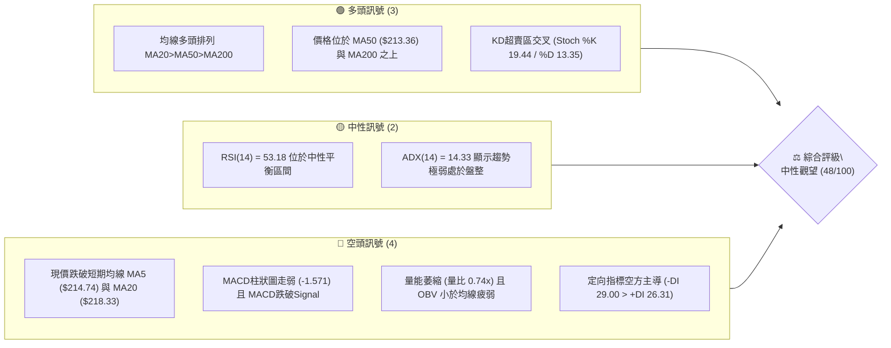
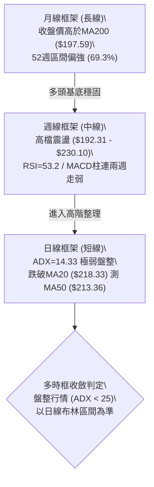
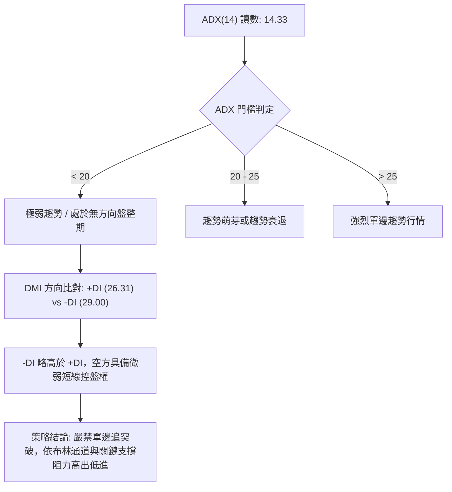
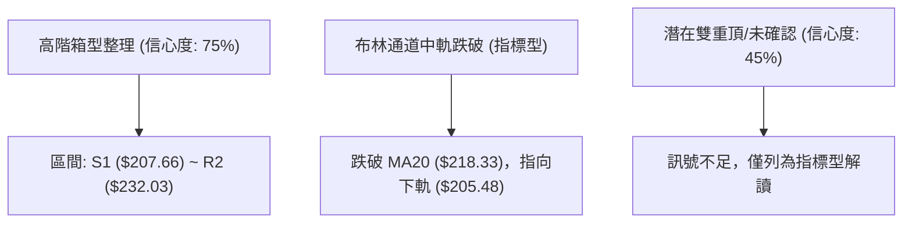
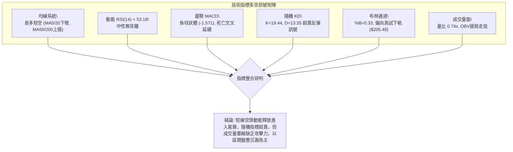
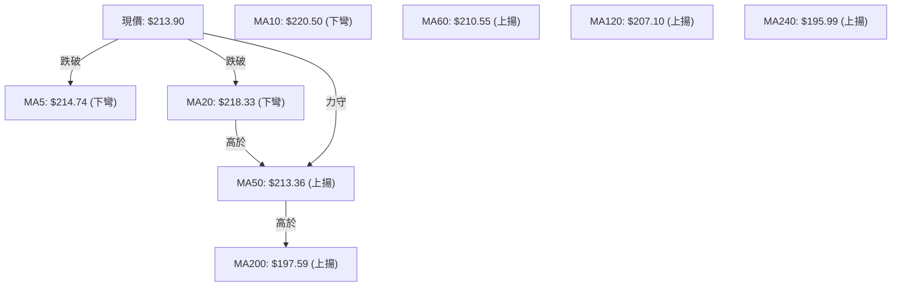
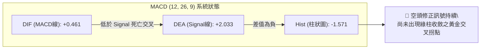
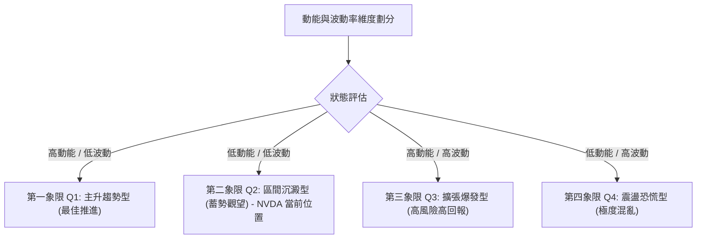
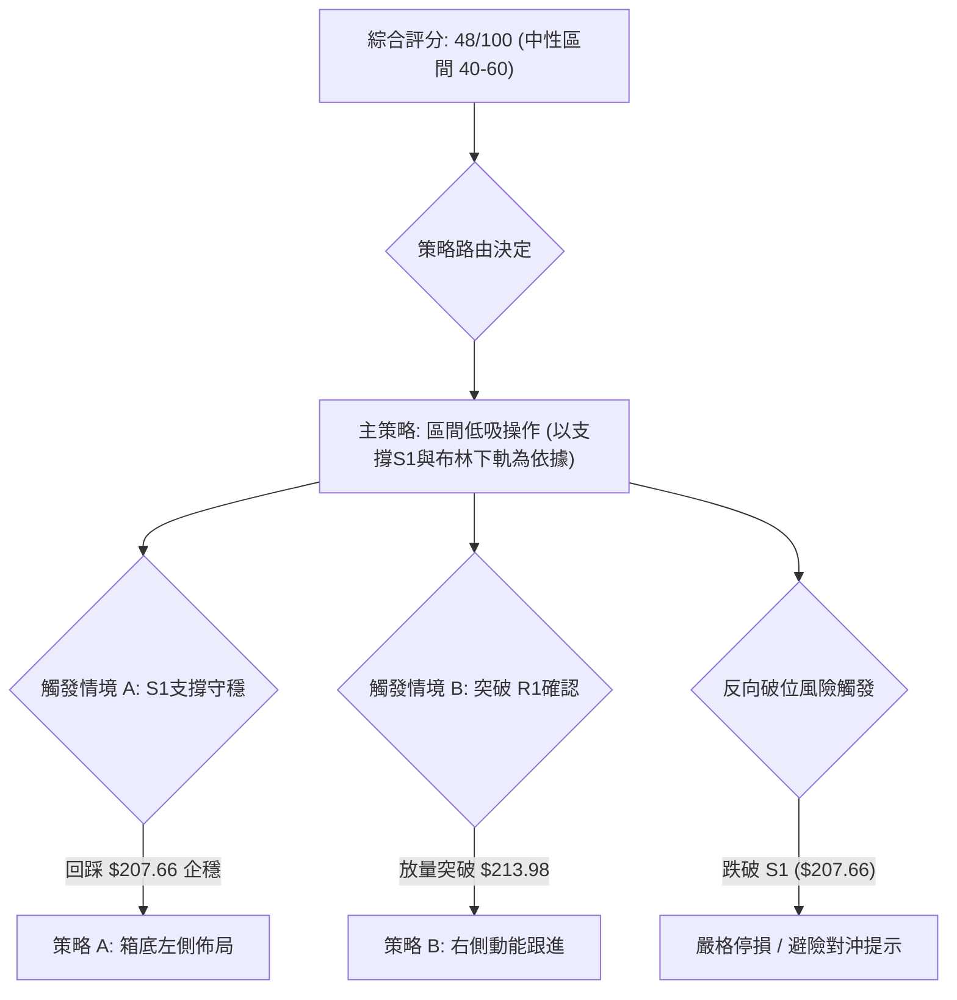
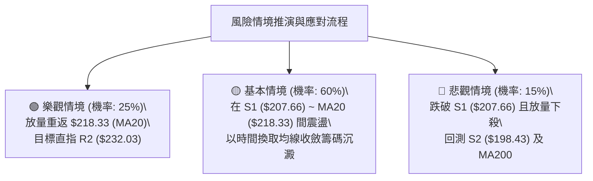

# NVDA 技術分析報告

> **報告日期**：2026-09-17 ｜ **語言**：繁體中文 ｜ **數據來源**：Yahoo Finance ｜ **當前價格**：$213.90

---

## 目錄

| 章節 | 內容 |
|------|------|
| [1. 技術面概覽](#1-技術面概覽) | 訊號儀表板、核心指標、評分卡 |
| [2. 趨勢分析](#2-趨勢分析) | 多時框趨勢、長中短期走勢 |
| [3. 圖表形態分析](#3-圖表形態分析) | 形態識別、K線組合、目標價 |
| [4. 支撐與阻力](#4-支撐與阻力) | 關鍵價位、斐波那契回調 |
| [5. 技術指標深度解讀](#5-技術指標深度解讀) | MA/RSI/MACD/布林/成交量 |
| [6. 動能與波動率](#6-動能與波動率) | 動能評估、ATR、Beta |
| [7. 多時框架總結](#7-多時框架總結) | 時框架評分矩陣 |
| [8. 交易策略建議](#8-交易策略建議) | 多空策略、風險報酬比 |
| [9. 風險提示與監控](#9-風險提示與監控) | 監控指標、風險場景 |

---

## 1. 技術面概覽

### 🎯 技術訊號儀表板



### 📊 核心指標速覽表

| 指標類別 | 指標名稱 | 當前數值 | 訊號 | 解讀 |
|----------|----------|----------|------|------|
| **價格** | 當前價格 | $213.90 | 🟡 | 位於52週區間的 69.3%，自前期高點回檔進入休整 |
| **均線** | MA20 | $218.33 | 🔴 | 價格低於 MA20 (-2.03%)，短線承壓於月線下方 |
| **均線** | MA50 | $213.36 | 🟢 | 價格緊貼 MA50 (+0.25%)，中期趨勢生命線正在測試支撐 |
| **均線** | MA200 | $197.59 | 🟢 | 價格高於 MA200 (+8.25%)，長期結構多頭基底完好 |
| **動能** | RSI(14) | 53.18 | 🟡 | 處於 30–70 中性走廊，多空動能無極端超買超賣 |
| **動能** | MACD | Hist -1.571 | 🔴 | MACD (0.461) < Signal (2.033)，柱狀圖持續負值，修正中 |
| **動能** | Stoch %K/%D | 19.44 / 13.35 | 🟢 | 隨機指標進入超賣區，具備短線技術性反彈契機 |
| **趨勢** | ADX(14) | 14.33 | 🟡 | ADX < 25 表明無顯著趨勢，行情轉入區間寬幅震盪 |
| **通道** | Bollinger %B | 0.33 | 🟡 | 位於通道下半部，尚未觸及下軌 ($205.48)，仍有震盪空間 |
| **成交量** | 20日量比 | 0.74x | 🔴 | 成交量 9,608 萬股 vs 20日均量 1.299 億股，量能萎縮 OBV<MA |
| **波動** | ATR(14) | $7.52 | 🟡 | 每日平均波動幅度約 3.52%，波動度處於中等水平 |

### 🏆 技術評分卡

```
╔══════════════════════════════════════════════════════════════╗
║                技術評分卡 — NVDA (2026-09-17)                ║
╠══════════════════════════════════════════════════════════════╣
║ 趨勢強度 (ADX=14.33)   ████░░░░░░░░░░░░░░░░  25/100  🔴 弱盤整║
║ 動能指標 (RSI/MACD/KD) ██████████░░░░░░░░░░  50/100  🟡 中性  ║
║ 支撐穩定度 (S1/MA50)   ████████████░░░░░░░░  60/100  🟢 偏多  ║
║ 成交量配合 (量比 0.74) ██████░░░░░░░░░░░░░░  30/100  🔴 疲弱  ║
║ 形態完整度 (箱體整理)  ██████████░░░░░░░░░░  50/100  🟡 中性  ║
║ 均線排列 (多頭排列)    ██████████████░░░░░░  70/100  🟢 多頭  ║
╠══════════════════════════════════════════════════════════════╣
║ 綜合評分               █████████░░░░░░░░░░░  48/100  🟡 中性  ║
║ 評級結論               區間震盪 / 觀察 MA50 支撐防守力道      ║
╚══════════════════════════════════════════════════════════════╝
```

---

## 2. 趨勢分析

### 🌐 多時框趨勢分析



### 📈 長期趨勢 — 12個月走勢圖（Unicode）

以下為 NVDA 過去 12 個月（2025-10 至 2026-09）之月線收盤走勢與關鍵轉折分析：

```
NVDA 月線走勢圖（過去12個月收盤價）
價格軸 ($)
$225 ┤                                                 ● (08月 220.53)
$220 ┤                                                ╱ ╲
$215 ┤                                               ╱   ● (現價 213.90)
$210 ┤                               ● (05月 210.66)╱     
$205 ┤                                ╲            ╱      
$200 ┤ ● (10月 202.01)                 ●──────●───● (04/06/07月 ~200)
$195 ┤  ╲                             ╱ (04月 199.11)
$190 ┤   ╲              ● (01月 190.68)
$185 ┤    ● (12月 186.06)╲
$180 ┤     ╲            ╱
$175 ┤      ●──────────● (11月 176.58 / 02月 176.78 / 03月 174.00)
     └──────────────────────────────────────────────────────────────
       10  11  12  01  02  03  04  05  06  07  08  09 (月份)
      2025                  2026
```

#### 走勢特徵分析表格

| 時間階段 | 區間起訖 | 區間漲跌 | 走勢特徵與結構意涵 |
|----------|----------|----------|--------------------|
| **高檔回測期** | 2025-10 ($202.01) → 2025-11 ($176.58) | -12.59% | 自前期突破波段高點拉回，迅速下探找尋季線支撐。 |
| **底部築底期** | 2025-11 ($176.58) → 2026-03 ($174.00) | -1.46% | 在 $174.00–$190.68 間構築長達 5 個月的底部箱體。 |
| **主升攻擊波** | 2026-03 ($174.00) → 2026-05 ($210.66) | +21.07% | 量能放大推升價格突破 $200 整數大關，形成強烈多頭趨勢。 |
| **高階箱型整理** | 2026-05 ($210.66) → 2026-07 ($200.53) | -4.81% | 圍繞 $200 中軸進行消化換手，最低測至 $192.31（週線）。 |
| **次級推升波** | 2026-07 ($200.53) → 2026-08 ($220.53) | +9.97% | 帶量突破前高 $210.66，月收盤創下歷史最高紀錄。 |
| **當前高檔休整** | 2026-08 ($220.53) → 2026-09 ($213.90) | -3.01% | 挑戰 52 週高點 $236.00 受阻回落，回踩 MA50 尋求確認。 |

### 📊 中期趨勢（週線分析）

從近 20 週收盤走勢可見，價格於 2026-06-28 創下中期回調低點 $192.31 後展開推升，於 2026-09-06 觸及高點 $230.10，隨後連兩週回檔至 $218.29 與 $213.90。週線 MACD 柱狀圖由正值轉為負值（2026-09-20 週為 -1.571），週 RSI 降至 53.2。顯示中期處於上升通道內的高檔旗形整理，目前正在測試 $213.36（日 MA50）及 $207.66（S1 波段支撐）。

```
中期週線價格支撐壓力示意圖：
[強壓力區]   $232.03 (R2 近一年高點聚類) / $236.00 (52W High)
    ▲
    │         ┌─ 2026-09-06 高收盤價 $230.10
    │        ╱
    │       ● $213.90 ◄─── 當前現價（回踩中軸）
    │      ╱ ╲
    ▼     ╱   ▼
[強支撐區]   $207.66 (S1 支撐) ─── $198.43 (S2 支撐) / $192.31 (週波段低點)
```

### ⚡ 趨勢強度評估（ADX 解讀）



| 指標變數 | 當前讀數 | 狀態級別 | 技術意涵解讀 |
|----------|----------|----------|--------------|
| **ADX(14)** | 14.33 | 弱盤整（<20） | 動能不足以支撐突破型交易，均線與動能指標頻繁發出雜訊。 |
| **+DI** | 26.31 | 中等多方 | 多頭攻擊力道自 8 月下旬的高點顯著消退。 |
| **-DI** | 29.00 | 略佔優勢 | 賣盤略大於買盤，但未形成極端恐慌拋售。 |
| **趨勢分類** | 盤整行情 | 依規則14收斂 | 交易主邏輯以日線布林通道 ($205.48–$231.19) 為震盪箱體。 |

---

## 3. 圖表形態分析

### 🔍 形態識別系統

依據嚴格規則 15，所有形態均須提供數據依據、完成度與信心度；若數據不足以支持幾何形態，僅作指標型解讀。



#### 圖表形態評估表

| 形態類別 | 信心度 | 判斷依據（引用數據） | 完成度 | 目標價（附計算式） |
|----------|--------|----------------------|--------|--------------------|
| **高階箱型整理** | **75%** | 自 2026-05 以來月收盤多數卡在 $200–$220 區間；近一年波段高點聚類於 R2 ($232.03)，波段支撐聚類於 S1 ($207.66)。 | 85% | 區間震盪目標：箱頂 $232.03；箱底 $207.66。若向上突破 R2，依箱型高度推算目標：$232.03 + ($232.03 - $207.66) = **$256.40**。 |
| **均線回踩收斂** | **70%** | 現價回踩 MA50 ($213.36)，上方受阻於 MA20 ($218.33)，MA5/10/20 同步下彎，長短期均線進行乖離收斂。 | 80% | 指標型解讀：目標指向回測支撐 S1 ($207.66) 或布林下軌 ($205.48) 後尋求企穩。 |
| **雙重頂形態** | **45%** | 2026-08 收盤 $220.53 與 2026-09-06 週收盤 $230.10 形成高點聚類，但頸線尚未跌破。 | 40% | **訊號不足，僅做指標型解讀**（未跌破頸線 S1 $207.66，不可預設立場判定成頂）。 |

### 🕯️ 重要K線形態分析

| 月份 | 收盤價 | K線形態 | 解讀 | 訊號 |
|------|--------|---------|------|------|
| **2026-05** | $210.66 | 長陽突破實體 | 帶量突破長達 5 個月的築底箱體，確立中長期牛市主升。 | 🟢 強多 |
| **2026-06** | $199.87 | 回踩下影陰線 | 月線回測 $200 整數支撐關卡，低點見 $192.31，獲逢低承接買盤。 | 🟡 中性 |
| **2026-07** | $200.53 | 紡錘線十字星 | 買賣雙方在 $200 水平激烈拉鋸，波動收縮，蓄勢再起。 | 🟡 變盤 |
| **2026-08** | $220.53 | 大陽線放量反彈 | 多頭再次發力，突破前高阻力，月收盤創歷史新高。 | 🟢 強多 |
| **2026-09** | $213.90 | 上影小陰回檔 | 盤中衝高至 52W 高點 $236.00 受阻回吐，進入獲利了結回跌。 | 🔴 短空 |

### 📉 ASCII 走勢形態示意圖

```
NVDA 近期日線形態結構（高位箱體與布林軌道）
價格 ($)
$236.00 ┬───────────────────────────────● 52W High (0.0% Fib)
$232.03 ┼─────────────────────────────── 強阻力 R2 (箱體頂部)
        │                 ╭────╮
$220.50 ┼─────────────────╯    ╰─────── 短期阻力 MA10 / 08月收盤
$218.33 ┼─────────────────────────────── 布林中軌 MA20 (短線反壓)
        │                   ╭──╮
$213.90 ┼───────────────────●  ╰──────── 現價 (測試 MA50 $213.36 / 阻力 R1 $213.98)
        │
$207.66 ┼─────────────────────────────── 波段支撐 S1 (38.2% Fib: $208.46)
$205.48 ┼─────────────────────────────── 布林下軌 (BB Lower Band)
        │
$198.43 ┴─────────────────────────────── 強支撐 S2 (50.0% Fib: $199.95 / MA200: $197.59)
```

### 🎯 形態目標價計算

根據上述置信度最高（75%）之「高階箱型整理形態」，詳細參數與推算式如下：
1. **箱體頂部（頸線/阻力）**：R2 = $232.03
2. **箱體底部（支撐）**：S1 = $207.66
3. **形態垂直高度**：$H = 232.03 - 207.66 = \$24.37$
4. **向下破位測量目標（悲觀情境）**：
   $$\text{Target}_{\text{Down}} = S1 - H = 207.66 - 24.37 = \$183.29$$
   *(該位階逼近分析師最低目標價 $180.00 與 78.6% Fib $179.33)*
5. **向上突破測量目標（樂觀情境）**：
   $$\text{Target}_{\text{Up}} = R2 + H = 232.03 + 24.37 = \$256.40$$
   *(若站穩 R2，中長線動能將指向 $256.40 之等幅延伸空間)*

---

## 4. 支撐與阻力

### 🗺️ 關鍵價位分布圖（Unicode）

```
NVDA 價位結構分布圖 (依據 OHLCV 波段聚類與斐波那契計算)
═════════════════════════════════════════════════════════════════
$236.00 ║██████████████████████████████║ 52週歷史高點 (Fib 0.0%)
$232.03 ║████████████████████████      ║ 強阻力 R2 (近一年高點聚類)
$218.98 ║▓▓▓▓▓▓▓▓▓▓▓▓▓▓▓▓              ║ Fib 23.6% 回調位 / BB中軌 $218.33
$213.98 ║██████████████████████████████║ 即時阻力 R1 (當前波段高點 +0.04%)
$213.90 ╠══════════════════════════════╣ ◄── 當前收盤價 (MA50 $213.36 守護)
$208.46 ║▓▓▓▓▓▓▓▓▓▓▓▓▓▓▓▓▓▓            ║ Fib 38.2% 回調位
$207.66 ║████████████████████          ║ 關鍵支撐 S1 (波段低點聚類 -2.92%)
$205.48 ║▓▓▓▓▓▓▓▓▓▓▓▓                  ║ 布林通道下軌
$199.95 ║██████████████████████████████║ Fib 50.0% / 整數大關
$198.43 ║██████████████████████████    ║ 關鍵強支撐 S2 (波段低點聚類 -7.23%)
$197.59 ║██████████████████████████████║ 長期牛熊分水嶺 MA200
$194.30 ║████████████████              ║ 深度防守支撐 S3 (-9.17%)
═════════════════════════════════════════════════════════════════
```

### 🚧 阻力位分析表

所有價位均嚴格取自數據給定之關鍵價位聚類：

| 阻力級別 | 價位 | 形成原因 | 突破難度 | 重要性 |
|----------|------|----------|----------|--------|
| **R1** | **$213.98** | 近一年波段高點聚類微型高點（距離現價僅 +0.04%）。與 5 日線 ($214.74) 形成短線第一道重疊反壓。 | 🟡 中等 | 短線多頭重返攻勢之第一道門檻，日內需放量站上。 |
| **R2** | **$232.03** | 近一年波段高點聚類強阻力（+8.47%），對應 2026-09-06 週收盤高點 $230.10 與前期天花板。 | 🔴 極高 | 中期箱頂強阻力區，未伴隨 1.5 倍以上均量難以實質突破。 |
| **R3** | **$236.00** | 數據給定之 52 週最高價（52W High，Fib 0.0%），歷史籌碼套牢頂部。 | 🔴 極高 | 長期天花板，一旦突破將開啟無套牢籌碼的真空主升浪。 |

### 🛡️ 支撐位分析表

所有價位均嚴格取自數據給定之關鍵價位聚類：

| 支撐級別 | 價位 | 形成原因 | 守住機率 | 重要性 |
|----------|------|----------|----------|--------|
| **S1** | **$207.66** | 近一年波段低點聚類（-2.92%），下方緊鄰 Fib 38.2% ($208.46) 與布林下軌 ($205.48)。 | 🟢 70% | 短線多頭防禦核心。若失守，短線回檔將擴大為中期箱型震盪。 |
| **S2** | **$198.43** | 近一年波段低點聚類（-7.23%），重合 Fib 50.0% ($199.95) 與 MA200 ($197.59)。 | 🟢 85% | 中長期多頭防線與牛熊分水嶺，機構法人強烈護盤區間。 |
| **S3** | **$194.30** | 近一年波段低點聚類深度防守位（-9.17%），貼近 2026-06 週低點 $192.31。 | 🟢 95% | 極端回檔最終防線，失守意味 24 個月上升趨勢結構遭到破壞。 |

### 📐 斐波那契回調位分析

依據 52 週價格區間（最低 $163.90 至 最高 $236.00，垂直振幅 $72.10）計算之回調位：

| 斐波那契層級 | 精確價位 | 相對現價位置 | 技術意義與籌碼解讀 |
|--------------|----------|--------------|--------------------|
| **0.0% (52W High)** | **$236.00** | +10.33% | 歷史頂部阻力，波段多頭終極目標。 |
| **23.6%** | **$218.98** | +2.37% | 強勢拉回極限位。現價落在其下方，且與 MA20 ($218.33) 共振為強反壓。 |
| **38.2%** | **$208.46** | -2.54% | **健康回調位**。與波段支撐 S1 ($207.66) 形成密集支撐帶。 |
| **50.0%** | **$199.95** | -5.59% | 多空平衡中軸、$200 整數心理關卡，重合波段支撐 S2 ($198.43)。 |
| **61.8%** | **$191.44** | -10.50% | 黃金分割強防守位，緊鄰 2026-06-28 週收盤 $192.31。 |
| **78.6%** | **$179.33** | -16.16% | 深幅修正支撐，對應 2025 年底築底平台及分析師最低目標 $180.00。 |
| **100.0% (52W Low)** | **$163.90** | -23.38% | 52 週最低點，長期週期性底部。 |

> **當前價位斐波那契定位**：
> 現價 **$213.90** 穩穩坐落在 **23.6% ($218.98)** 與 **38.2% ($208.46)** 之間。技術意義在於：價格雖跌破了 23.6% 的極強勢格局，但仍遠在 38.2% 的強勢回檔線之上。只要多方能力保 S1 ($207.66) / 38.2% ($208.46) 不失，當前的下挫僅屬高檔良性消化，長多格局並未轉向。

---

## 5. 技術指標深度解讀

### 🎛️ 指標訊號總覽



### 📈 移動平均線排列分析



#### 均線各天期詳細狀態表

| 週期 | 數值 | 現價差距 (%) | 走勢方向 | 均線歷史軌跡解讀 |
|------|------|--------------|----------|------------------|
| **MA 5** | $214.74 | -0.39% | ▼ 下降 | 超短期弱勢，短線壓制現價 |
| **MA 10** | $220.50 | -2.99% | ▼ 下降 | 近兩週快速拉回，斜率陡峭下彎 |
| **MA 20** | $218.33 | -2.03% | ▼ 下降 | 月線下彎，短線走勢轉入防守反彈結構 |
| **MA 50** | $213.36 | +0.25% | ▲ 上升 | 中期生命線，現價貼近，提供關鍵技術支撐 |
| **MA 60** | $210.55 | +1.59% | ▲ 上升 | 季線穩健推升，支撐位階上移 |
| **MA 120** | $207.10 | +3.28% | ▲ 上升 | 半年線持續揚升，鞏固 S1 ($207.66) 支撐力道 |
| **MA 200** | $197.59 | +8.25% | ▲ 上升 | 年線長期牛熊線，多頭長期趨勢強固 |
| **MA 240** | $195.99 | +9.14% | ▲ 上升 | 長週期均線多頭排列穩健向上 |

**均線結構綜合判定**：整體均線大架構仍為 `MA20 > MA50 > MA200` 典型多頭排列；然而現價已跌破短期 MA5、MA10 與 MA20，屬於「大週期多頭中的次級拉回」。MA50 位於 $213.36，與現價 $213.90 僅差 $0.54，為明日日內多空交鋒核心。

### 📉 RSI(14) 分析

*   **當前讀數**：**53.18**
*   **讀數進度條**：`[0] ───────────────██████████░░░░░░░░░ [100]` （53.18% 位於精確平衡區）
*   **超買/超賣研判**：數值介於 30 至 70 之中性走廊，未見鈍化或極端情緒。
*   **背離分析（Divergence）**：
    *   *頂背離檢驗*：NVDA 在 2026-08 衝高至 $220.53 與 9 月初觸及 $230.10 時，週 RSI 分別為 75.4 與 53.7。雖然週線 RSI 高點走低，但因近期日線級別波動屬於橫向區間，日線 RSI 在 53 附近震盪，**官方數據快照明確標示：「RSI背離：無明顯背離」**。
    *   *底背離檢驗*：目前無破底走勢，無底背離結構。
    *   *背離結論*：市場未出現標準指標背離反轉型態，當前動能下降僅反應正常獲利回吐。

### 📊 MACD(12/26/9) 訊號解讀



*   **MACD 線**：0.461
*   **Signal 線**：2.033
*   **柱狀圖 (Histogram)**：-1.571 （🔴 空方主導）
*   **指標整合判讀**：DIF 雖然維持在零軸之上（0.461 > 0，意味中長期仍在多頭領域），但柱狀圖連續走擴至 -1.571，且 DIF 顯著低於 DEA。這表明短線回跌動能仍在延續，技術上至少需要等待負柱狀體開始縮短（收斂至 -0.50 以內），才具備右側發動反彈的訊號。

### 📦 布林通道分析

```
布林通道結構示意圖 (寬度 = $25.71)
───────────────────────────────────────────── $231.19  BB 上軌 (Upper Band)
                     ╭────╮
                    ╱      ╲
───────────────────●────────╲──────────────── $218.33  BB 中軌 (MA20 / 阻力)
                             ╲
                              ● 現價 $213.90 (%B = 0.33)
───────────────────────────────────────────── $205.48  BB 下軌 (Lower Band)
```

*   **上軌數值**：$231.19
*   **中軌數值 (MA20)**：$218.33
*   **下軌數值**：$205.48
*   **通道帶寬 (Bandwidth)**：$(231.19 - 205.48) / 218.33 = 11.77\%$ （帶寬偏向常態收斂，無單邊喇叭開口）
*   **%B 指標**：0.33 （價格位於下半通道，離中軌距離大於離下軌距離）
*   **技術含義**：現價跌破中軌後，通道下軌 $205.48 構成天然動態支撐，與波段支撐 S1 ($207.66) 形成雙重下檔緩衝區。

### 💹 成交量分析（量價配合度）

*   **最新成交量**：96,079,300 股
*   **20日平均成交量**：129,914,955 股
*   **成交量比 (Volume Ratio)**：**0.74x** （顯著萎縮 -26.0%）
*   **OBV 能量潮走勢**：數據明確指出 `OBV < MA → 量能疲弱`。
*   **量價背離分析**：在價格高檔拉回至 $213.90 的過程中，成交量持續低於 20 日與 50 日均量。雖然「量縮下跌」意味著市場並未湧現機構恐慌性籌碼拋售，但「OBV < MA」亦揭示買盤承接意願相對保守，多方未投入足夠增量資金推升行情。在量能低於 1.25 億股基準前，難以發動突破性攻勢。

---

## 6. 動能與波動率

### ⚡ 動能評估四象限



| 象限 | 動能維度 (ADX / MACD) | 波動維度 (ATR / Beta) | NVDA 匹配狀態 | 策略指導方針 |
|------|------------------------|------------------------|---------------|--------------|
| **Q1** | 強動能 (ADX > 25) | 低波動 (ATR% < 2.5%) | ─ | 順勢抱波段，加碼持倉 |
| **Q2** | **弱動能 (ADX = 14.33)** | **中低波動 (ATR% = 3.52%)** | **✓ (當前所處狀態)** | **以守代攻，嚴禁追價，區間高拋低吸** |
| **Q3** | 強動能 (ADX > 25) | 高波動 (ATR% > 5.0%) | ─ | 突破進場，嚴格追蹤移動止損 |
| **Q4** | 弱動能 (ADX < 20) | 高波動 (ATR% > 5.0%) | ─ | 噪音巨大，全面空倉離場 |

### 📊 ATR 波動率分析

*   **ATR(14) 絕對數值**：**$7.52**
*   **ATR 相對價格比**：$7.52 / 213.90 = \mathbf{3.52\%}$
*   **風控技術含義**：當前 NVDA 單日平均正常振幅約為 $7.52。任何交易策略的保護性止損若小於 $7.52，極易被正常的日內噪音掃出場。
*   **波動率倍數止損建議**：
    *   *緊湊止損 (1.0 × ATR)*：距離進場點 $\$7.52$（適用日內極短線）
    *   *標準波段止損 (1.5 × ATR)*：距離進場點 $\$11.28$（適用日線波段交易）
    *   *寬鬆防守止損 (2.0 × ATR)*：距離進場點 $\$15.04$（適用中長線底倉配置）

### 📐 Beta 與市場相關性

*   **Beta 係數**：**2.217**
*   **市場敏感度解讀**：NVDA 的 Beta 高達 2.22，屬於典型「高彈性攻擊型資產」。當標普 500 或那斯達克指數波動 1.0% 時，NVDA 理論上將同向放大波動約 2.22%。
*   **當前環境影響**：在當前大盤指數休整期，高 Beta 意味著向下回調幅度容易被放大；然而一旦市場情緒回暖，該特性將賦予其反彈階段極高的爆發力。操作上需嚴格控制名目部位槓桿比率。

---

## 7. 多時框架總結

### 📋 時框架評分表

| 時框架 | 趨勢方向 | 動能狀態 | 均線排列狀況 | 形態特徵 | 綜合評分 | 操作建議 |
|--------|----------|----------|--------------|----------|----------|----------|
| **長線 (月線)** | 🟢 多頭 | 🟡 中性走平 | 多頭排列 (收盤>MA200) | 高檔強勢整理 | **75 / 100** | 長期底倉堅定續抱 |
| **中線 (週線)** | 🟡 震盪 | 🔴 MACD柱轉負 | MA20 上方震盪 | 高階箱體整理 | **50 / 100** | 待拉回測試 S1 逢低承接 |
| **短線 (日線)** | 🔴 偏空 | 🟡 KD超賣/RSI中性 | 跌破 MA5/MA20 | 回測 MA50 支撐 | **40 / 100** | 暫停追多，等待企穩訊號 |

### 🔲 綜合訊號矩陣

```
綜合訊號一致性評估矩陣：
┌──────────────┬──────────────────┬──────────────────┬──────────────────┐
│  時框 / 維度 │     趨勢方向     │     動能狀態     │    籌碼與量能    │
├──────────────┼──────────────────┼──────────────────┼──────────────────┤
│ 長線 (月線)  │ 🟢 確立多頭      │ 🟢 穩定健康      │ 🟢 機構持股71.4% │
│ 中線 (週線)  │ 🟡 高檔箱型      │ 🔴 動能放緩      │ 🟡 量能進入換手  │
│ 短線 (日線)  │ 🔴 短波下行      │ 🟡 超賣醞釀反彈  │ 🔴 量縮 (量比0.74)│
└──────────────┴──────────────────┴──────────────────┴──────────────────┘
```

### ⚖️ 多時框收斂結論

依據【嚴格要求 14】之多時框收斂規則嚴格執行：
1. **行情屬性判定**：當前 ADX(14) 數值為 **14.33**（遠低於 25 臨界值），明確判定當前盤面屬於 **「盤整震盪行情」**。
2. **時框優先權指引**：在盤整行情中，中長期單邊趨勢被鈍化，市場交易主邏輯以 **日線布林通道上下軌 ($205.48 – $231.19)** 及關鍵支撐阻力為核心交易走廊。
3. **唯一收斂結論**：**中性觀望，區間操作（綜合評分：48/100）**。
   日線的短線下修並未破壞週月線的多頭架構，但因成交量萎縮且 MACD 柱狀體尚未翻正，多空在 MA50 ($213.36) 處於勢均力敵的拉鋸狀態。因此，第 8 章策略將完全以「區間高拋低吸與關鍵支撐防守」為唯一導向，不進行單邊強烈追價。

---

## 8. 交易策略建議

### 🗺️ 策略決策流程圖



### 🧭 策略路由（依評分卡分流）

*   **當前綜合評分**：**48 / 100** （落入 40–60 中性區間）
*   **當前主策略方向**：**區間操作（Range Trading），以布林下軌與支撐位 S1 為基底，等待企穩或突破確認**。

### 🎯 價格情境階梯（Price Scenarios）

所有價位均嚴格引用第 4 章數據：

| 觸發條件 | 下一目標 | 後續延伸 | 情境技術含義 |
|----------|----------|----------|--------------|
| **強勢突破 R1 ($213.98)** | **R2 ($232.03)** | **R3 ($236.00)** | 短線重回月線之上，多頭發動挑戰箱頂與歷史高點。 |
| **守穩 MA50 ($213.36)** | **BB中軌 ($218.33)** | **Fib 23.6% ($218.98)** | 消化短線浮額，在 $213.00–$219.00 維持窄幅震盪修復。 |
| **跌破 S1 ($207.66)** | **S2 ($198.43)** | **S3 ($194.30)** | 箱底失守，回調深化至半年線與年線尋求中長線支撐。 |

### 📊 情境機率分佈

| 情境劃分 | 發生機率 | 主要技術依據與指標佐證 |
|----------|----------|------------------------|
| **情境一：區間下緣企穩反彈** | **55%** | Stoch KD 處於超賣區 (%K 19.44 / %D 13.35)；價格緊貼 MA50 ($213.36)；S1 ($207.66) 與 Fib 38.2% ($208.46) 支撐密集。 |
| **情境二：維持窄幅橫向震盪** | **30%** | ADX(14) = 14.33 趨勢動能匱乏；量比 0.74x 交投清淡；多空雙方在 $213–$218 均線交織處反覆拉鋸。 |
| **情境三：下破支撐深幅回調** | **15%** | MACD 負柱狀圖 (-1.571) 走擴；-DI (29.00) 略佔優勢；若跌破 S1 恐引發技術性停損單出籠。 |

### 🟢 主策略詳情（區間操作架構）

所有進出場、停損及目標價位均嚴格引用數據庫既有數值：

| 策略要素 | 策略 A（箱底支撐低吸 — 左側佈局） | 策略 B（突破阻力確認 — 右側動能） |
|----------|------------------------------------|------------------------------------|
| **進場條件** | 價格回測 S1 支撐或布林下軌企穩不破 | 價格帶量突破 R1 阻力位並確認站穩 |
| **進場價格** | **$207.66**（S1 支撐位掛單） | **$214.50**（突破 R1 $213.98 後順勢切入） |
| **目標價 T1** | **$218.33**（BB 中軌 / MA20 位置） | **$220.50**（MA10 / 前波小高點） |
| **目標價 T2** | **$232.03**（R2 強阻力位 / 箱體頂部） | **$232.03**（R2 強阻力位） |
| **止損價格** | **$198.43**（S2 強支撐位下方） | **$207.66**（S1 關鍵支撐位） |
| **風險空間** | $\$207.66 - \$198.43 = \$9.23$ (1.23 ATR) | $\$214.50 - \$207.66 = \$6.84$ (0.91 ATR) |
| **報酬空間 (T2)**| $\$232.03 - \$207.66 = \$24.37$ | $\$232.03 - \$214.50 = \$17.53$ |
| **風險報酬比** | **1 : 2.64** | **1 : 2.56** |
| **成功機率估算** | **60%** | **55%** |
| **建議倉位管理** | **15% 總資金** | **10% 總資金** |

### 🔴 反向風險觸發點（對沖提示）

*   **風控警訊價位**：**$207.66 (S1)**
*   **觸發條件與處置**：
    若收盤價實質跌破 S1 ($207.66)，宣告高階箱型整理底部被貫穿，技術面將向下考驗 S2 ($198.43) 及 Fib 50.0% ($199.95)。持有多頭部位者應即刻啟動避險機制，調降多頭部位 50% 以上，或買入反向部位鎖定浮動利潤。

### ⭐ 整體訊號強度評星

```
╔══════════════════════════════════════════════════════════════╗
║ 做多訊號強度：  ★★☆☆☆  (2.5/5 星) — 均線長多但短線缺乏量能   ║
║ 做空訊號強度：  ★★☆☆☆  (2.0/5 星) — 短線下修但面臨密集強支撐 ║
║ 趨勢持續可信度：★★☆☆☆  (2.0/5 星) — ADX=14.33 處於極度盤整  ║
║ 綜合交易評級：  ★★★☆☆  (3.0/5 星) — 嚴格執行區間策略可獲利 ║
╚══════════════════════════════════════════════════════════════╝
```

---

## 9. 風險提示與監控

### ✅ 關鍵監控指標 Checklist

```
╔══════════════════════════════════════════════════════════════╗
║                     關鍵技術監控指標清單                     ║
╠══════════════════════════════════════════════════════════════╣
║ [ ] 價位維度：日內收盤價是否能守穩 MA50 ($213.36)           ║
║ [ ] 價位維度：向上是否實質收復阻力 R1 ($213.98) 與 MA20      ║
║ [ ] 價位維度：防守底線 S1 ($207.66) 是否遭遇放量跌破        ║
║ [ ] 動能維度：MACD 負柱狀圖 (-1.571) 是否開始縮短收斂        ║
║ [ ] 動能維度：Stoch KD 是否在超賣區順利形成金叉並脫離 20 以下 ║
║ [ ] 量能維度：日成交量是否回升突破 20日均量 (1.299 億股)    ║
║ [ ] 趨勢維度：ADX(14) 是否由 14.33 向上翹起突破 20 形成方向  ║
╚══════════════════════════════════════════════════════════════╝
```

### ⚠️ 風險場景分析



### 🛡️ 風險管理重要提醒

1. **ATR 波動防禦**：當前 ATR 高達 $7.52，在設置止損時切勿使用過小點位（如 $2–$3），否則極易被日內隨機波動觸發洗盤。所有策略停損至少須給予 1.0–1.2 倍 ATR 之緩衝空間。
2. **高 Beta 槓桿控制**：NVDA 之 Beta 值為 2.217，整體波動幅度為標普大盤的兩倍以上。在無強趨勢（ADX<25）之震盪市況中，總倉位水平建議壓制在 25% 以內，杜絕使用保證金槓桿交易。
3. **假突破與假跌破防範**：在 ADX 低於 20 的低流動性盤整期，阻力位（如 R1 $213.98）極易出現「假突破即回落」，而支撐位亦常伴隨「盤中刺破收盤收回」。進場交易者應以「日線收盤價」確認作為信號觸發依據，切忌盤中盲目追單。

---

## 📋 報告總結

```
╔══════════════════════════════════════════════════════════════╗
║                   NVDA 技術分析報告總結                      ║
╠══════════════════════════════════════════════════════════════╣
║ 報告日期：2026-09-17                                         ║
║ 當前價格：$213.90                                             ║
║ 分析評級：⚖️ 中性觀望 / 區間箱體交易 (綜合評分: 48/100)      ║
╠══════════════════════════════════════════════════════════════╣
║ 關鍵結論：                                                   ║
║ ├─ 長期趨勢：🟢 多頭排列 (MA20>MA50>MA200, 價格遠高於MA200) ║
║ ├─ 中期趨勢：🟡 高階箱體整理 ($207.66 - $232.03 區間沉澱)    ║
║ ├─ 短期趨勢：🔴 偏弱修正 (跌破MA20, 正在測試 MA50 $213.36)   ║
║ ├─ 關鍵支撐：S1 $207.66 / S2 $198.43                         ║
║ ├─ 關鍵阻力：R1 $213.98 / R2 $232.03                         ║
║ └─ 分析師目標：均價 $328.66 (最低 $180.00 / 最高 $515.00)     ║
╠══════════════════════════════════════════════════════════════╣
║ 最優策略組合：                                               ║
║ 1. 🥇 最佳機會：回調至 S1 $207.66 逢低掛單 (風報比 1:2.64)   ║
║ 2. 🥈 次選機會：突破 R1 $213.98 後右側追隨 (風報比 1:2.56)   ║
║ 3. 🥉 保守選擇：場外完全觀望，等待日線 MACD 翻紅且量能放大   ║
╚══════════════════════════════════════════════════════════════╝
```

---

> ⚠️ **免責聲明**：本報告為技術分析研究，所有數據及推算均嚴格基於所提供之歷史價格與量化指標資訊。本報告**僅供學術研究與參考**，**不構成任何形式的投資要約或買賣建議**。金融市場投資伴隨高度風險，投資人應依個人財務狀況與風險承受能力獨立判斷並自負盈虧。

---

*報告生成時間：2026-09-17 ｜ 數據來源：Yahoo Finance ｜ 分析框架：多時框技術分析體系*