# NVDA 技術分析報告

> **報告日期**：2026-09-18 ｜ **語言**：繁體中文 ｜ **數據來源**：Yahoo Finance ｜ **當前價格**：$219.34

---

## 目錄

| 章節 | 內容 |
|------|------|
| [1. 技術面概覽](#1-技術面概覽) | 訊號儀表板、核心指標、評分卡 |
| [2. 趨勢分析](#2-趨勢分析) | 多時框趨勢、長中短期走勢、ADX解讀 |
| [3. 圖表形態分析](#3-圖表形態分析) | 形態識別、信心度、K線組合、目標價計算 |
| [4. 支撐與阻力](#4-支撐與阻力) | 關鍵價位分布、波段聚類、斐波那契回調 |
| [5. 技術指標深度解讀](#5-技術指標深度解讀) | 均線系統、RSI背離、MACD、布林通道、OBV量能 |
| [6. 動能與波動率](#6-動能與波動率) | 動能矩陣、ATR風控、Beta相關性 |
| [7. 多時框架總結](#7-多時框架總結) | 時框架矩陣、優先級收斂原則、唯一方向結論 |
| [8. 交易策略建議](#8-交易策略建議) | 策略路由、價格情境、主策略詳情、對沖觸發 |
| [9. 風險提示與監控](#9-風險提示與監控) | 監控Checklist、情境路徑、倉位管理 |
| [📋 報告總結](#-報告總結) | 核心結論與執行藍圖 |

---

## 1. 技術面概覽

### 🎯 技術訊號儀表板

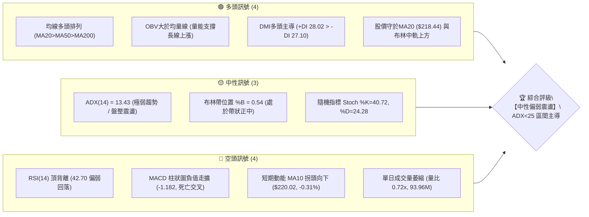

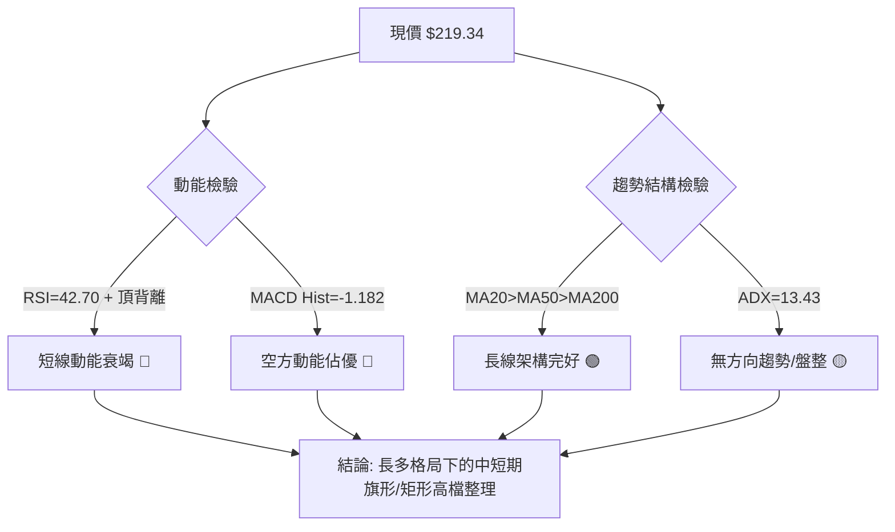

### 📊 核心指標速覽表

| 指標類別 | 指標名稱 | 當前數值 | 訊號 | 解讀 |
|----------|----------|----------|------|------|
| **價格** | 當前價格 | $219.34 | 🟡 | 位於52週區間 76.9%，高位消化獲利賣壓 |
| **均線** | MA20 | $218.44 | 🟢 | 價格在MA20上方 (+0.41%)，提供短線動態支撐 |
| **均線** | MA50 | $213.67 | 🟢 | 價格在MA50上方 (+2.65%)，中期多頭生命線穩固 |
| **均線** | MA200 | $197.81 | 🟢 | 價格在MA200上方 (+10.88%)，長期牛市基石未受破壞 |
| **動能** | RSI(14) | 42.70 | 🔴 | 跌落50中軸，且明確呈現日線/週線頂背離架構 |
| **動能** | MACD | 0.555 (Signal 1.737) | 🔴 | MACD位於信號線下方，Histogram為 -1.182，空頭發散 |
| **動能** | Stoch %K/%D| 40.72 / 24.28 | 🟡 | 低檔超賣區反彈鈍化，尚未形成強烈黃金交叉 |
| **趨勢強度** | ADX(14) | 13.43 (+DI 28.02) | 🟡 | 數值小於25，代表無單邊趨勢，屬於盤整震盪市 |
| **波動** | ATR(14) | $6.47 (2.95%) | 🟡 | 波動率處於正常收斂狀態，未見極端恐慌釋放 |
| **通道** | 布林通道 | 帶寬 $205.59 - $231.28 | 🟡 | %B 為 0.54，處於中軌附近，呈現通道內震盪 |
| **成交量** | 20日成交量比| 0.72x (93.96M) | 🔴 | 量能持續萎縮，反彈缺乏資金追價動能 |
| **能量潮** | OBV | OBV > MA | 🟢 | 長期累積能量潮並未失真，機構長線籌碼未見鬆動 |

### 🏆 技術評分卡

```
╔══════════════════════════════════════════════════════════════════╗
║              技術評分卡 — NVDA (2026-09-18)                    ║
╠══════════════════════════════════════════════════════════════════╣
║ 趨勢強度 (ADX=13.43)    ████░░░░░░░░░░░░░░░░  22/100 🟡 (盤整)  ║
║ 動能指標 (RSI+MACD)     ██████░░░░░░░░░░░░░░  30/100 🔴 (偏空)  ║
║ 支撐穩定度 (S1/MA50)    ███████████████░░░░░  75/100 🟢 (強韌)  ║
║ 成交量配合 (Volume/OBV) ███████████░░░░░░░░░  55/100 🟡 (平淡)  ║
║ 形態完整度 (高檔矩形)   ██████████████░░░░░░  70/100 🟢 (明確)  ║
║ 均線排列 (多頭架構)     ██████████████████░░  90/100 🟢 (極佳)  ║
╠══════════════════════════════════════════════════════════════════╣
║ 綜合技術評分            ███████████░░░░░░░░░  57/100 🟡 (中性)  ║
║ 操作定調：盤整市（ADX<25），以區間震盪低吸高拋或觀望為主        ║
╚══════════════════════════════════════════════════════════════════╝
```

---

## 2. 趨勢分析

### 🌐 多時框趨勢分析

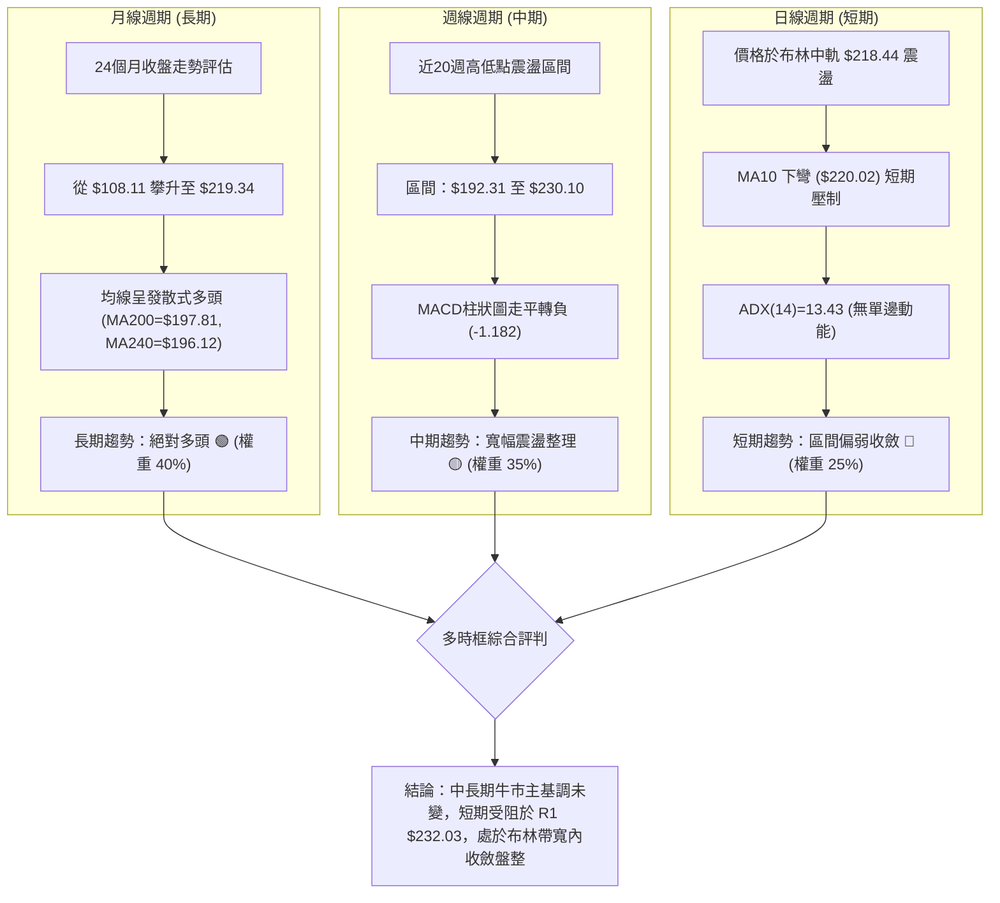

### 📈 長期趨勢 — 12個月走勢圖（Unicode）

依據提供的24個月收盤數據，繪製近12個月（2025-10 至 2026-09）走勢圖：

```
NVDA 月線走勢圖（過去12個月：2025-10 至 2026-09）
價格軸 ($)
$230 ┤                                        
$220 ┤                                        ●(08月: 220.53)
$210 ┤                                  ●(05月)       ●(09月現價: 219.34)
$200 ┤  ●(10月: 202.01)            ●(04月)   ●(06月) ●(07月)
$190 ┤                    ●(01月)             
$180 ┤        ●(12月: 186.06)                 
$170 ┤    ●(11月)             ●(02月) ●(03月: 174.00 低點)
     └─────────────────────────────────────────────────────────────
        10   11   12   01   02   03   04   05   06   07   08   09 (月份)
        2025                                                2026
```

#### 近12個月月線走勢特徵分析表

| 階段 | 月份區間 | 價格區間 ($) | 累計漲跌幅 | 結構特徵與成交量狀態 | 趨勢定性 |
|------|----------|--------------|------------|----------------------|----------|
| 第一階段 | 2025-10 ~ 2025-11 | 202.01 → 176.58 | -12.59% | 自高位回檔修正，快速釋放獲利籌碼 | 區間回調 🔴 |
| 第二階段 | 2025-12 ~ 2026-03 | 186.06 → 174.00 | -6.48%  | 築出中期波段雙底（S3: $194.30 / 52W低點聚類上方） | 底部夯實 🟡 |
| 第三階段 | 2026-04 ~ 2026-05 | 199.11 → 210.66 | +21.07% | 突破200元大關，多頭重啟主升段 | 主升浪推進 🟢 |
| 第四階段 | 2026-06 ~ 2026-07 | 199.87 → 200.53 | +0.33%  | 平台回踩測試斐波那契50.0% ($199.95) 與S2 ($198.43) | 蓄勢平台 🟡 |
| 第五階段 | 2026-08 ~ 2026-09 | 220.53 → 219.34 | -0.54%  | 創出236.00波段天價後，目前於219附近橫盤收斂 | 高檔整理 🟡 |

### 📊 中期趨勢（週線分析）

```
NVDA 近20週核心價格擺動與支撐阻力結構圖
$236.00 ┼─────────────────────────────────● 52週最高點 (0.0% Fib)
$232.03 ┼─────────────────────────● 近期阻力 R1 (2026-09-06 收 230.10 遇阻)
$224.91 ┼─────────● (08-16波段高點)
$219.34 ┼─────────────────────────■ 當前收盤價 ($219.34)
$218.98 ┼────────────────────────── 斐波那契 23.6% 回調位
$207.66 ┼─────────────● 波段支撐 S1 / 斐波那契 38.2% ($208.46)
$198.43 ┼─────● 波段支撐 S2 / 斐波那契 50.0% ($199.95)
$192.31 ┼─● (06-28 週收盤波段低點)
```

從週線收盤數據來看：
- 2026-08-16 週收盤達到 $224.91，RSI 飆升至 75.4（極度超買）。
- 隨後在 2026-09-06 推升至週收盤 $230.10（盤中觸及52W高點 $236.00 區域），然而 RSI 反落至 53.7，MACD 柱狀圖僅為 +0.835（遠低於前高時的 +2.494），形成典型的**中期週線頂背離**。
- 近兩週價格自 $230.10 回落至 $218.29 與 $219.34，量能同步從 6.61億股急縮至 4.10億股，顯示高位買盤動能衰退，追價意願薄弱。

### ⚡ 趨勢強度評估（ADX 解讀）

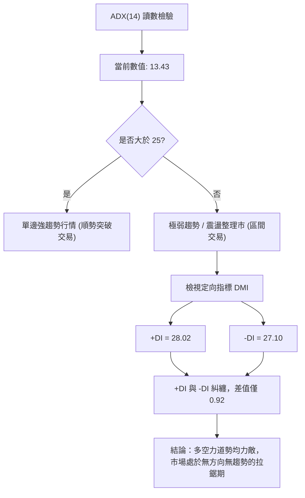

#### ADX 趨勢強度量化對照表

| 指標名稱 | 當前數值 | 參考閾值區間 | 趨勢強度定性 | 操作指導意義 |
|----------|----------|--------------|--------------|--------------|
| **ADX(14)** | **13.43** | 0 ~ 20 (極弱/無趨勢) | 處於最低區間，市場動能極度渙散 | **嚴禁追高殺跌**，趨勢跟隨指標失效 |
| **+DI** | **28.02** | > 25 (多頭進攻) | 多方仍保留微弱優勢 | 尚存向上防守反擊能力 |
| **-DI** | **27.10** | > 25 (空方施壓) | 空方力量持續緊咬 | 空方具備隨時發難潛力 |
| **方向差 (+DI - -DI)**| **+0.92** | 接近 0 | 典型黏合形態 | 預示即將進入窄幅震盪收斂末端 |

---

## 3. 圖表形態分析

### 🔍 形態識別系統

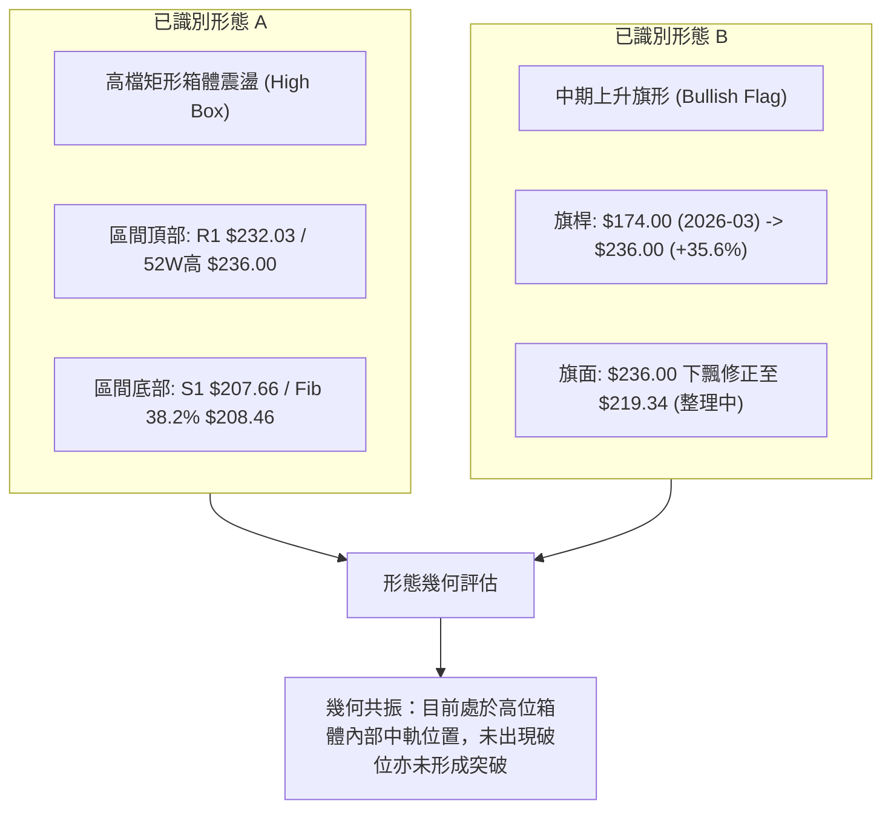

#### 圖表形態信心度評估表（嚴格依據真實數據）

| 形態名稱 | 信心度 | 判斷依據（引用數據） | 完成度 | 目標價（附嚴格幾何計算式） |
|----------|--------|----------------------|--------|----------------------------|
| **高檔收斂箱體 (Box Range)** | **85%** | 上軌阻力聚類 R1 $232.03，下軌支撐聚類 S1 $207.66，股價在此 24.37 美元區間內反覆震盪已逾8週 | 75% | 若向上有效突破：<br>目標價 = 頸線 $232.03 + (箱體高度 $232.03 - $207.66 = $24.37) = **$256.40**（數據中未偵測到此歷史高點，屬理論測幅） |
| **中期上升旗形 (Bull Flag)** | **65%** | 旗桿自 2026-03 低點 $174.00 漲至 52W 高點 $236.00（漲幅 $62.00）；隨後形成高位量縮整理，旗面回調未跌破 38.2% ($208.46) | 50% | 若旗面突破確認：<br>保守測距 = 突破點 $232.03 + 旗桿高度 $62.00 = **$294.03**（屬形態理論推算） |
| **潛在雙頂形態 (M-Top)** | **40%** | 前高 $236.00，次高 $230.10（2026-09-06），頸線位於近期低點 $192.31~$200.53 區間 | 30% | **信心度 < 50% 僅做預警**：頸線未跌破，目前無法確立為反轉雙頂形態，不予預設下跌目標價 |

### 🕯️ 重要K線形態分析

| 月份 | 收盤價 | K線形態 | 解讀 | 訊號 |
|------|--------|---------|------|------|
| **2026-05** | $210.66 | 大陽線實體推進 | 放量站上200元整數大關，形成強勢突破K線 | 🟢 強烈買訊 |
| **2026-06** | $199.87 | 回踩長下影線陰線 | 盤中下探洗盤（最低逼近52W區間），但收盤穩在200邊緣 | 🟡 洗盤測試 |
| **2026-07** | $200.53 | 十字星十字線 (Doji) | 在多空分水嶺展開極致拉鋸，成交量開始萎縮 | 🟡 變盤前兆 |
| **2026-08** | $220.53 | 突破中長陽線 | 多方發力向上衝刺，盤中刷新52W高點至 $236.00，奠定新高平台 | 🟢 多頭表態 |
| **2026-09** | $219.34 | 高檔窄幅孕線 (Harami) | 受制於歷史高位阻力，月K目前呈現孕育於8月大陽線內部的窄幅實體 | 🔴 漲勢停滯 |

### 📉 ASCII 走勢形態示意圖

```
NVDA 近期價格形態幾何結構圖（箱體與上升旗形整理）
$236.00 ┬────────────────────────────────────────── 52W 歷史極限高點
$232.03 ┼───────● (09-06 波段頂部)                 箱體上軌 (Resistance R1)
        │      / \
$220.02 ┼─────/───\───■ 現價 $219.34 (跌破MA10 $220.02)
        │    /     \ /
$213.67 ┼───/───────● MA50 動態支撐帶
        │  /
$207.66 ┼─●──────────────────────────────────────── 箱體下軌 (Support S1 / Fib 38.2%)
        │
$198.43 ┴────────────────────────────────────────── 強支撐 S2 / Fib 50.0%
        └──────────────────────────────────────────
         旗桿起點 ($174.00) ───► 旗面整理震盪區 ($207.66 - $232.03)
```

### 🎯 形態目標價計算

依據幾何技術分析標準測幅原則，形態推算過程如下：
1. **箱體等距向上測幅**：
   - 箱頂基準：$232.03（波段阻力 R1）
   - 箱底基準：$207.66（波段支撐 S1）
   - 垂直箱體波幅：$232.03 - $207.66 = $24.37
   - 向上突破測幅目標：$232.03 + $24.37 = **$256.40**
2. **箱體破位向下測幅**（反向風險情境）：
   - 向下跌破測幅目標：$207.66 - $24.37 = **$183.29**（接近斐波那契 78.6% $179.33 及分析師最低目標價 $180.00）

---

## 4. 支撐與阻力

### 🗺️ 關鍵價位分布圖（Unicode）

```
NVDA 價位結構分布圖
════════════════════════════════════════════════════════════════════
$236.00 ║██████████████████████████████║ 52週歷史高點 (0.0% Fibonacci)
$232.03 ║████████████████████████      ║ 關鍵阻力 R1 (近一年波段高點聚類)
$220.02 ║▓▓▓▓▓▓▓▓▓▓▓▓▓▓                ║ 短期動態均線壓制 (MA10)
$219.34 ╠══════════════════════════════╣ ◄ 當前收盤價 ($219.34)
$218.98 ║░░░░░░░░░░░░░░░░░░░░░░░░      ║ 斐波那契 23.6% 回調關鍵點位
$218.44 ║▓▓▓▓▓▓▓▓▓▓▓▓▓▓▓▓▓▓            ║ 短期均線支撐 (MA20 / 布林中軌)
$208.46 ║░░░░░░░░░░░░░░░░░░░░░░░░░░    ║ 斐波那契 38.2% 回調位
$207.66 ║████████████████████          ║ 近期波段支撐 S1 (多頭第一防線)
$205.59 ║▒▒▒▒▒▒▒▒▒▒▒▒▒▒▒▒▒▒▒▒▒▒        ║ 日線布林通道下軌
$199.95 ║░░░░░░░░░░░░░░░░░░░░░░░░░░░░  ║ 斐波那契 50.0% 多空分水嶺
$198.43 ║████████████████████████      ║ 強支撐 S2 (波段低點聚類 / 接近MA200)
$194.30 ║██████████████████████████    ║ 強支撐 S3 (波段防守底線)
════════════════════════════════════════════════════════════════════
```

### 🚧 阻力位分析表

所有價位均嚴格引用 OHLCV 波段高點聚類與斐波那契計算：

| 阻力級別 | 價位 | 形成原因 | 突破難度 | 重要性 |
|----------|------|----------|----------|--------|
| **R1** | **$232.03** | 近一年波段高點聚類（2026-09-06 週收盤高點 $230.10 及後續衝高回落密集成交頂部） | 🔴 極高（量能萎縮且頂背離壓制） | ★★★★★<br>波段多空天花板 |
| **52W High** | **$236.00** | 52週歷史最高價，所有浮額獲利了結與高位套牢籌碼重疊區 | 🔴 極難（需放量超越 20日均量 1.5x） | ★★★★☆<br>極限測頂點 |

### 🛡️ 支撐位分析表

所有價位均嚴格引用 OHLCV 波段低點聚類計算：

| 支撐級別 | 價位 | 形成原因 | 守住機率 | 重要性 |
|----------|------|----------|----------|--------|
| **S1** | **$207.66** | 近一年波段低點聚類，與斐波那契 38.2% ($208.46) 重合度極高，下方緊鄰布林下軌 ($205.59) | 🟢 70% | ★★★★☆<br>短線震盪箱底 |
| **S2** | **$198.43** | 近一年波段低點聚類，與斐波那契 50.0% ($199.95) 及 MA200 ($197.81) 共振 | 🟢 85% | ★★★★★<br>牛熊生命分水嶺 |
| **S3** | **$194.30** | 近一年次級波段低點聚類，接近前波週線收盤低位 $192.31 (2026-06-28) | 🟢 92% | ★★★☆☆<br>終極多頭防線 |

### 📐 斐波那契回調位分析

依據 52週區間（最低 $163.90 至 最高 $236.00，總垂直波幅 $72.10）計算：

```
斐波那契回調梯形圖 (52W Range: $163.90 -> $236.00)
0.0%  $236.00 ───────────────────────────── 52W 最高點
23.6% $218.98 ───────────────■ 現價 $219.34 (現價位於 23.6% 邊緣，僅差 +$0.36)
38.2% $208.46 ───────────────────────────── 緊密覆蓋支撐 S1 ($207.66)
50.0% $199.95 ───────────────────────────── 心理整數大關，緊密覆蓋 S2 ($198.43)
61.8% $191.44 ───────────────────────────── 黃金分割位 (波段多頭極限防守)
78.6% $179.33 ───────────────────────────── 深度回調警戒位
100%  $163.90 ───────────────────────────── 52W 最低點
```

- **當前位置解讀**：現價 $219.34 剛好緊貼在 **23.6% 回調位 ($218.98)** 上方微幅盤整（溢價僅 0.16%）。這表明在強勢單邊行情後，多方仍試圖將回撤幅度控制在淺度回調範圍（< 23.6%）。
- **關鍵區間定義**：若跌破 $218.98，價格將直接滑向 **38.2% 回調位 ($208.46)**，此處與支撐位 **S1 $207.66** 形成強力支撐共振帶（$207.66 ~ $208.46），為中長線買盤的核心回補區域。

---

## 5. 技術指標深度解讀

### 🎛️ 指標訊號總覽

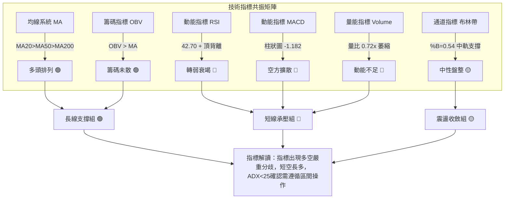

### 📈 移動平均線排列分析

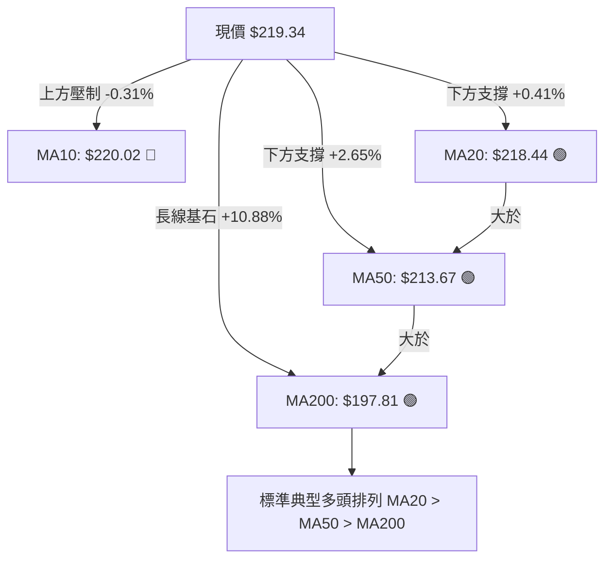

#### 均線各週期狀態深度解析

| 均線名稱 | 當前價格 | 與現價差距 | 狀態 | 趨勢解讀與技術含義 |
|----------|----------|------------|------|--------------------|
| **MA5**  | $214.93  | +$4.41 (+2.05%) | ▲ 上行 | 極短期扣抵低位，出現小幅抬頭 |
| **MA10** | $220.02  | -$0.68 (-0.31%) | ▼ 下降 | **短線第一阻力**，MA10拐頭向下，代表近兩週買入者平均成本處於套牢 |
| **MA20** | $218.44  | +$0.90 (+0.41%) | ▲ 上行 | **生命線支撐**，緊貼現價，為今日多方力守的動態中樞 |
| **MA60** | $210.88  | +$8.46 (+4.01%) | ▲ 上行 | 中期支撐平穩推升，為箱體中下軌提供保護 |
| **MA120**| $207.50  | +$11.84 (+5.71%)| ▲ 上行 | 與波段支撐 S1 ($207.66) 形成強烈交會 |
| **MA200**| $197.81  | +$21.53 (+10.88%)| ▲ 上行 | 長期牛市防線，斜率向上穩健推進 |
| **MA240**| $196.12  | +$23.22 (+11.84%)| ▲ 上行 | 年線基石，偏離度達11.84%，長期未見泡沫失控跡象 |

### 📉 RSI(14) 分析

- **RSI 當前數值**：**42.70**
```
RSI(14) 強度儀表盤：42.70
[0] ────────── [30 超賣] ────■───── [50 中軸] ────────── [70 超買] ────────── [100]
進度條：████████░░░░░░░░░░░░ 42.70% (跌落中軸，空方短線控盤)
```
- **背離分析（頂背離判定）**：
  - **價格走勢**：NVDA 於 2026-08-16 收盤為 $224.91，隨後於 2026-09-06 向上刷新收盤高點至 $230.10，盤中並打出 52W 新高 $236.00。形成了「Higher High」（更高的高點）。
  - **RSI 軌跡**：對應 2026-08-16 的週線 RSI 高達 **75.4**（強勢超買），但在 2026-09-06 價格創新高時，週線 RSI 卻驟降至 **53.7**，目前日線 RSI 更進一步跌至 **42.70**。形成了「Lower High」（更低的高點）。
  - **背離結論**：明確存在**標準頂背離 (Bearish Divergence)**。這表明近期的創高過程純屬主力動能耗盡前的邊際推升，買盤力量實質已大幅衰竭，隨時有向中軌甚至下軌尋求支撐的需求。

### 📊 MACD(12/26/9) 訊號解讀

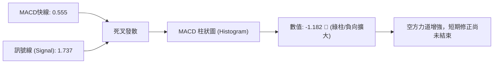

- **MACD 線**：0.555 仍處於零軸上方，維持中長線多頭殘存火種。
- **信號線 (Signal)**：1.737。MACD 線已由上向下貫穿信號線，形成死亡交叉。
- **柱狀圖 (Histogram)**：目前讀數為 **-1.182**。回顧近幾週數據，柱狀圖自 2026-08-09 的高峰 +2.494，逐級下降至 2026-08-23 的 -0.404，至本週擴大至 -1.182。
- **背離與趨勢解讀**：柱狀圖持續在零軸下方擴張，顯示短期拋售壓力未見衰退，任何未放量的反彈均為短線誘多，指標未見底背離跡象。

### 📦 布林通道分析

```
日線布林通道 (Bollinger Bands 20, 2) 結構圖
$231.28 ┬────────────────────────────────────────── 布林上軌 (Upper Band)
        │
$219.34 ┼─────────────■ 現價 ($219.34) [%B = 0.54]
$218.44 ┼────────────────────────────────────────── 布林中軌 / MA20 (Middle Band)
        │
$205.59 ┴────────────────────────────────────────── 布林下軌 (Lower Band)
```

- **通道參數**：上軌 $231.28，中軌 $218.44，下軌 $205.59。帶寬總計 $25.69。
- **%B 指標分析**：當前 %B = **0.54**。
  - %B 介於 0 與 1 之間，0.5 代表剛好位於中軌。
  - 現價 $219.34 略高於中軌 $218.44，處於微幅偏強的臨界平衡位置。
  - 布林通道開口未呈現單邊暴烈張開，而是呈現水平收斂走平態勢，標準印證了目前處於 $205.59 ~ $231.28 的布林箱體震盪。

### 💹 成交量分析（量價配合度）

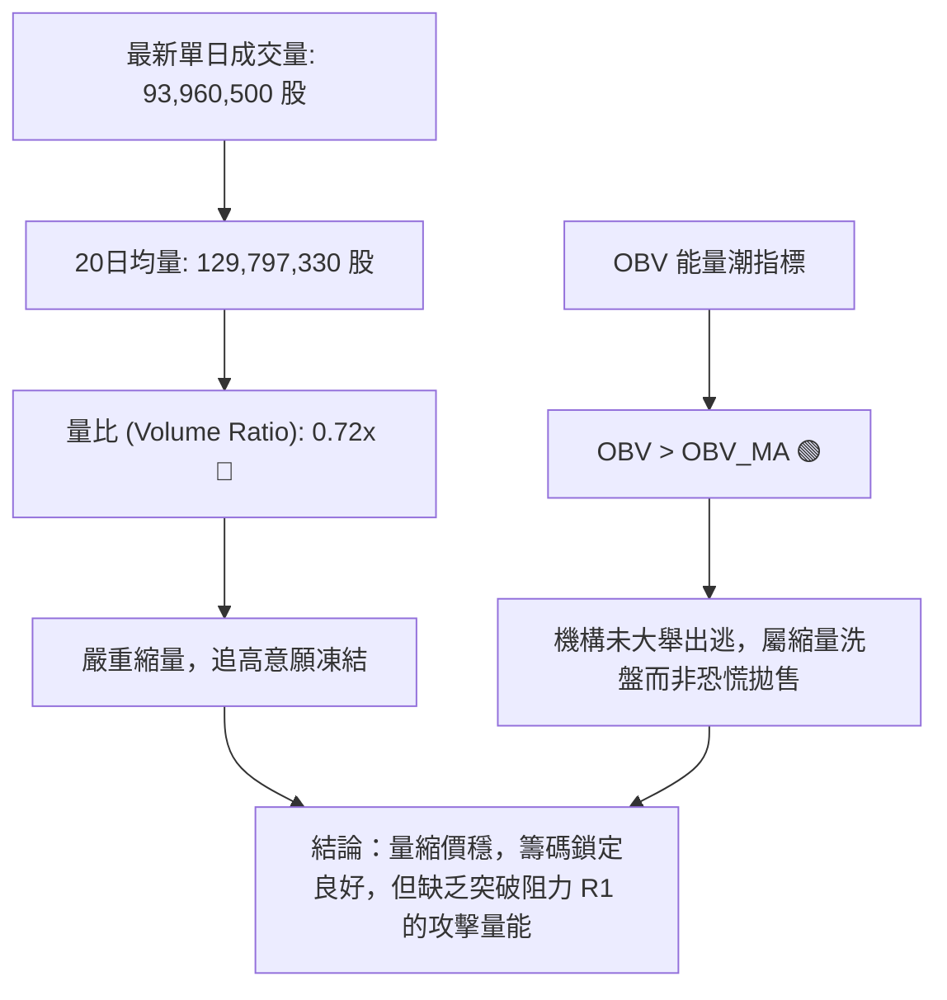

- **成交量特徵**：最新成交量僅 9,396 萬股，較 20日均量（1.298億股）大幅萎縮 28%。近期週成交量亦從 8~9 億股的高峰驟降至 4.1 億股。
- **量價背離分析**：價格在高位 $219~$230 震盪，但量能持續遞減，呈現典型的「**量價背離**（價高量縮）」。顯示此處市場買盤缺乏跟進力量，若無重大催化劑（如放量突破 1.5 億股），價格極難直接向上擊穿 R1 $232.03。
- **OBV 驗證**：OBV 維持在均線上方，說明機構籌碼未見崩潰式出脫，下方承接盤（特別是 MA50 $213.67 與 S1 $207.66）依然具有真實買盤保護。

---

## 6. 動能與波動率

### ⚡ 動能評估四象限

根據技術數據：NVDA 目前動能強度受制於 RSI 頂背離與 MACD 負柱狀圖（動能偏弱）；而波動率方面，ATR 僅佔股價 2.95%，布林帶寬收窄（波動率處於低至中等水平）。

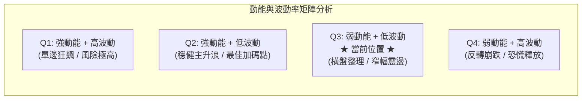

| 象限 | 動能維度 | 波動維度 | 當前狀態 | 策略指導含義 |
|------|----------|----------|----------|--------------|
| Q1 | 強動能 | 高波動 | — | 突破單邊市，追突破需嚴設移動止盈 |
| Q2 | 強動能 | 低波動 | — | 機構悄然推升，最佳順勢持股階段 |
| **Q3** | **弱動能 (RSI 42.7)** | **低波動 (ATR 2.95%)** | **✓ 當前狀態** | **箱體防守市，高拋低吸，嚴禁追價，降低槓桿** |
| Q4 | 弱動能 | 高波動 | — | 破位恐慌市，嚴格空倉避險 |

### 📊 ATR 波動率分析

- **ATR(14) 數值**：**$6.47**（佔當前股價 $219.34 的 **2.95%**）。
- **ATR 解讀**：
  - 每日正常合理價格擺動區間為 ±$6.47 美元。
  - 當前波動幅度相較其半導體同業屬於收斂健康範疇，市場並未陷入非理性失控。
- **止損與風控距離測算**：
  - **短線防守緩衝 (1.0x ATR)**：$6.47。若進場，動態回撤不應超過 $6.47。
  - **波段防守緩衝 (1.5x ~ 2.0x ATR)**：
    - 1.5x ATR = $9.71（約 4.4%）。
    - 2.0x ATR = $12.94（約 5.9%）。
    - 基準止損設定應避開 1.0x ATR 噪聲區，設定在 1.5x ATR 之外，恰好涵蓋至下方的關鍵支撐帶。

### 📐 Beta 與市場相關性

- **Beta 數值**：**2.217**。
- **意涵解讀**：
  - NVDA 的系統性波動敏感度為標普500大盤的 2.22 倍。
  - 當納斯達克或標普500指數回調 1% 時，NVDA 在統計上傾向下跌 2.22%；反之大盤上揚 1%，其彈幅亦放大至 2.22%。
  - **風控指引**：在當前 ADX=13.43 盤整、短期動能偏弱的背景下，高 Beta 特性意味著極易受到大盤微幅回調的外溢衝擊，因此倉位配置必須從傳統強趨勢時的滿倉（80~100%），實質降至 20~30% 的防守性配置。

---

## 7. 多時框架總結

### 📋 時框架評分表

| 時框架 | 趨勢方向 | 動能指標狀態 | 均線系統排列 | 形態結構特徵 | 綜合評分 | 操作建議 |
|--------|----------|--------------|--------------|--------------|----------|----------|
| **月線 (長期)** | 🟢 多頭推進 | 偏強 (均線推升) | 發散多頭排列 | 歷史大牛市旗形 | **88/100** | 長線底倉堅定續抱 |
| **週線 (中期)** | 🟡 寬幅箱體 | 🔴 頂背離顯現 | 穩固多頭排列 | 矩形高檔築頂/整理 | **58/100** | 區間操作，逢高降倉 |
| **日線 (短期)** | 🔴 弱勢震盪 | 🔴 MACD死叉/縮量 | 壓制於MA10之下 | 布林中軌爭奪 | **42/100** | 嚴禁追高，耐心等支撐 |

### 🔲 綜合訊號矩陣

```
訊號一致性評估矩陣
────────────────────────────────────────────────────────────────
時框       MA均線     動能(RSI/MACD)     量價結構      形態指向
────────────────────────────────────────────────────────────────
長期(月)   🟢 看多        🟢 看多        🟢 看多        🟢 看多 (旗桿主升)
中期(週)   🟢 看多        🔴 看空 (背離) 🟡 中性 (縮量) 🟡 看平 (箱體 $207-$232)
短期(日)   🟡 看平        🔴 看空        🔴 看空 (量縮) 🔴 看空 (受阻MA10)
────────────────────────────────────────────────────────────────
一致性檢驗：長期與中短期出現明確衝突。
```

### ⚖️ 多時框收斂結論

依據【嚴格要求 14：多時框收斂規則】執行嚴謹裁決：
1. **行情性質判定**：當前日線 **ADX(14) = 13.43 (< 25)**，明確定義當前處於**【盤整行情】**，而非趨勢行情。
2. **主導時框與原則**：在盤整行情中，規則要求「**以日線布林通道上下軌為主要交易區間**」，均線順勢指標退居次席。
3. **衝突收斂取捨**：雖然長期月線與中長均線（MA20>MA50>MA200）維持看多評級，但在 ADX 極低且 MACD/RSI 頂背離共振的約束下，短期任何衝高都將受阻於布林上軌與阻力 R1；下檔則受到布林下軌及波段支撐 S1 的托底。
4. **唯一最終結論**：**【中性觀望／區間震盪（Neutral Range-Bound）】**。
   - 核心交易區間定於 **$207.66 (S1 / 布林下軌附近) 至 $231.28 (布林上軌) / $232.03 (R1)**。
   - 絕不在此中軌附近（$219.34）進行突破性單邊追多。

---

## 8. 交易策略建議

### 🗺️ 策略決策流程圖

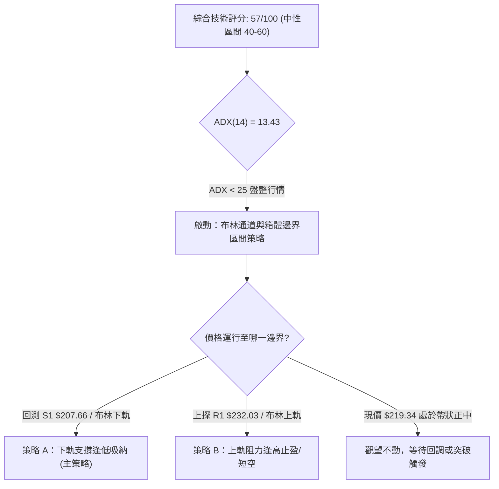

### 🧭 策略路由（依評分卡分流）

> **當前主策略方向 = 【中性區間震盪（Neutral Range Trading）】（依綜合評分 57/100 定調）**
> 
> 評分落在 40–60 之中性區間，且 ADX(14)=13.43 < 25，絕不兩頭盲目押注，嚴格鎖定**布林通道上下軌與核心支撐阻力進行區間操作**。等待價格回踩關鍵支撐或觸及極限阻力時進場，當前價格 $219.34 不具備足夠的風險報酬比。

### 🎯 價格情境階梯（Price Scenarios）

所有價位**嚴格引用第 4 章及關鍵數據算出的真實數值**：

| 觸發條件 | 下一目標 | 後續延伸 | 情境含義與操作指引 |
|----------|----------|----------|--------------------|
| 放量突破 R1 **$232.03** | 52W高 **$236.00** | 形態測幅 **$256.40** | 短線頂背離化解，重啟上升旗形主升段，突破追多 |
| 站穩現價 **$219.34**（中軌） | 上探 BB上軌 **$231.28** | 測試 R1 **$232.03** | 延續 $207.66 ~ $232.03 區間內無序拉鋸震盪 |
| 跌破現價，滑向 S1 **$207.66**| 測試 S2 **$198.43** | 回測 S3 **$194.30** | 中期回調加深，測試日線布林下軌及MA200牛熊線 |

### 📊 情境機率分佈

| 情境 | 機率 | 主要依據（指標狀態驗證） |
|------|------|--------------------------|
| **情境一：區間窄幅震盪** | **55%** | ADX(14)=13.43 極度渙散；布林通道水平走平；成交量萎縮至 0.72x，缺乏單邊推力 |
| **情境二：回落測試支撐** | **30%** | RSI(14)=42.70 跌破50中軸；週線頂背離；MACD Histogram=-1.182 負值持續放大 |
| **情境三：直接放量突破** | **15%** | +DI(28.02) 雖略高於 -DI，但缺乏增量資金入場；分析師強烈買入共識提供下檔心理支撐 |

### 🟢 主策略詳情（區間操作方案）

嚴格依據真實數據價位（S1: $207.66, S2: $198.43, R1: $232.03, 52W高: $236.00, ATR: $6.47）制定：

| 策略要素 | 策略 A（保守逢低買入 — 支撐反彈） | 策略 B（區間高拋止盈 / 阻力短空） |
|----------|-----------------------------------|-----------------------------------|
| **進場條件** | 價格回踩 S1 $207.66 止跌，且日線布林下軌 $205.59 守穩不破 | 價格反彈至阻力 R1 $232.03 遇阻，伴隨上影線與成交量衰竭 |
| **進場價格** | **$208.46**（斐波那契 38.2% 與 S1 重疊區） | **$231.28**（日線布林通道上軌邊緣） |
| **目標價 T1** | **$219.34**（當前布林中軌，平倉 50%） | **$218.44**（回測布林中軌 MA20） |
| **目標價 T2** | **$232.03**（波段阻力 R1，清倉其餘） | **$207.66**（波段支撐 S1） |
| **止損價格** | **$199.95**（斐波那契 50% 心理整數關，跌破S2無條件止損） | **$236.50**（突破52W歷史高點 $236.00 加上 0.50 風險緩衝） |
| **風險報酬比** | **1 : 2.77**<br>(風險: $8.51，T2潛在利潤: $23.57) | **1 : 4.49**<br>(風險: $5.22，T2潛在利潤: $23.62) |
| **成功機率** | **65%**（符合中長線牛市多頭保護） | **50%**（逆長期趨勢操作，難度較高） |
| **建議倉位** | **20% ~ 25%**（控制在總資金四分之一） | **10%**（僅限高風險承受者輕倉對沖） |

### 🔴 反向風險觸發點（對沖提示）

- **多頭結構破位點（強制減倉／對沖）**：
  - **觸發價位**：有效跌破 **S2 $198.43**（斐波那契 50.0% 與 MA200 牛熊分界線）。
  - **確認信號**：日線連續兩日收於 $198.43 下方，且成交量放大至 1.3 億股以上。
  - **風控動作**：所有中短線多單無條件離場，長線底倉建立 Put Option（賣權）進行 1:1 對沖。
- **空頭平倉止損點（全面翻多信號）**：
  - **觸發價位**：日線放量實體突破 **R1 $232.03** 並收高於 **$236.00**。
  - **確認信號**：ADX(14) 重新回升至 25 以上，MACD 柱狀圖翻正。

### ⭐ 整體訊號強度評星

```
╔══════════════════════════════════════════════════════════════════╗
║ 做多訊號強度：★★☆☆☆  (2.5/5星 - 短期動能背離，回踩支撐方可介入)║
║ 做空訊號強度：★★☆☆☆  (2.0/5星 - 長期均線太強，大跌空間受限)   ║
║ 整體可信度：  ★★★★☆  (4.0/5星 - 區間震盪邊界極其清晰)         ║
╚══════════════════════════════════════════════════════════════════╝
```

---

## 9. 風險提示與監控

### ✅ 關鍵監控指標 Checklist

```
╔══════════════════════════════════════════════════════════════════╗
║              NVDA 每日盤後技術監控清單 (Checklist)               ║
╠══════════════════════════════════════════════════════════════════╣
║ [ ] 1. 價格是否跌破斐波那契 23.6% ($218.98) 與 MA20 ($218.44)？   ║
║ [ ] 2. ADX(14) 是否從 13.43 向上突破 20-25？(判斷是否結束盤整)   ║
║ [ ] 3. MACD 柱狀圖是否收斂並由 -1.182 翻紅？(動能修復關鍵)        ║
║ [ ] 4. 單日成交量是否回升至 20日均量 (1.298億股) 之上？           ║
║ [ ] 5. RSI(14) 是否在 40 附近獲得支撐，或跌入 30 超賣區？        ║
║ [ ] 6. 價格是否下探 S1 $207.66 或突破 R1 $232.03？(區間突破預警)  ║
╚══════════════════════════════════════════════════════════════════╝
```

### ⚠️ 風險場景分析

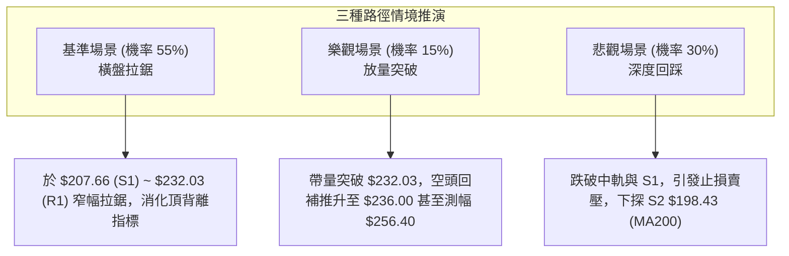

### 🛡️ 風險管理重要提醒

1. **拒絕中間價位過度交易**：
   現價 $219.34 剛好位於箱體核心中間，向上到阻力 R1 ($232.03) 空間僅 +5.78%，向下至支撐 S1 ($207.66) 空間為 -5.32%，風險報酬比僅為 1:1.08，在此位置開倉在數學期望值上處於劣勢。**最佳策略為「耐心等待邊界」**。
2. **波動率保護與資金管理**：
   - 考量當前 ATR 為 $6.47，且 Beta 高達 2.217，單筆交易虧損額度嚴格控制在總投資組合資金的 **1.0% ~ 1.5%** 以內。
   - 若建立多頭策略 A（止損幅度約 $8.51），則部位上限計算公式為：
     $$\text{最大持股股數} = \frac{\text{總資金} \times 1\%}{\$8.51}$$
3. **宏觀與基本面催化警語**：
   雖然分析師共識目標均價高達 **$328.49**，且覆蓋評級絕大多數為 Buy/Overweight，但基本面的遠期樂觀預期往往容易使短線散戶忽視技術面 RSI 頂背離的修正威力。技術面盤整期間，嚴禁使用融資槓桿持倉。

---

## 📋 報告總結

```
╔══════════════════════════════════════════════════════════════════╗
║                   NVDA 技術分析報告總結                          ║
╠══════════════════════════════════════════════════════════════════╣
║ 報告日期：2026-09-18                                             ║
║ 當前價格：$219.34                                                ║
║ 技術評分：57 / 100                                               ║
║ 分析評級：⚖️ 中性觀望 (盤整市主導)                              ║
╠══════════════════════════════════════════════════════════════════╣
║ 核心技術結論：                                                   ║
║ ├─ 長期趨勢：🟢 絕對多頭 (均線多頭排列 MA20>MA50>MA200完好)      ║
║ ├─ 中期趨勢：🟡 寬幅震盪 (高檔箱體整理，週線顯著頂背離)          ║
║ ├─ 短期趨勢：🔴 動能承壓 (ADX=13.43 弱趨勢，MACD死叉擴大)        ║
║ ├─ 關鍵阻力：R1 $232.03  /  52W高點 $236.00                      ║
║ ├─ 關鍵支撐：S1 $207.66  /  S2 $198.43 (MA200防線)               ║
║ └─ 分析師目標：均價 $328.49 (最低 $180.00 / 最高 $515.00)        ║
╠══════════════════════════════════════════════════════════════════╣
║ 最優執行藍圖：                                                   ║
║ 1. 🥇 最佳機會：等待價格回踩 S1 $207.66 ~ $208.46 止跌，建立區間 ║
║                 多頭部位，止損設 $199.95，風報比 1:2.77。        ║
║ 2. 🥈 次選機會：若反彈逼近布林上軌及 R1 $231.28 ~ $232.03 遇阻，  ║
║                 短線獲利了結或輕倉對沖，止損 $236.50。           ║
║ 3. 🥉 保守選擇：空倉者保持觀望，等待 ADX 回升至 25 以上並確認方  ║
║                 向（向上突破 $236 或向下確認 $198.43）再順勢介入║
╚══════════════════════════════════════════════════════════════════╝
```

---

> ⚠️ **免責聲明**：本報告為 AI 自動生成之技術分析，所有數據及估算均基於提供的歷史價格資訊。本報告**僅供研究與學術參考**，**不構成任何投資建議**。投資有風險，入市需謹慎。

---

*報告生成時間：2026-09-18 ｜ 數據來源：Yahoo Finance ｜ 分析框架：多時框技術分析*