# NVDA 技術分析報告

> **報告日期**：2026-09-20 ｜ **語言**：繁體中文 ｜ **數據來源**：Yahoo Finance ｜ **當前價格**：$222.27

---

## 目錄

| 章節 | 內容 |
|------|------|
| [1. 技術面概覽](#1-技術面概覽) | 訊號儀表板、核心指標、評分卡 |
| [2. 趨勢分析](#2-趨勢分析) | 多時框趨勢、長中短期走勢、ADX解讀 |
| [3. 圖表形態分析](#3-圖表形態分析) | 形態識別信心度、K線組合、目標價推算 |
| [4. 支撐與阻力](#4-支撐與阻力) | 關鍵價位結構、斐波那契回調深度分析 |
| [5. 技術指標深度解讀](#5-技術指標深度解讀) | MA/RSI頂背離/MACD/布林通道/量價分析 |
| [6. 動能與波動率](#6-動能與波動率) | 動能評估、ATR止損管理、Beta分析 |
| [7. 多時框架總結](#7-多時框架總結) | 時框架收斂規則、主導方向確立 |
| [8. 交易策略建議](#8-交易策略建議) | 主策略路由、情境階梯、風控與對沖點 |
| [9. 風險提示與監控](#9-風險提示與監控) | 關鍵指標檢核、情境路徑、倉位管理 |
| [📋 報告總結](#-報告總結) | 全景評級與決策總表 |

---

## 1. 技術面概覽

### 🎯 技術訊號儀表板

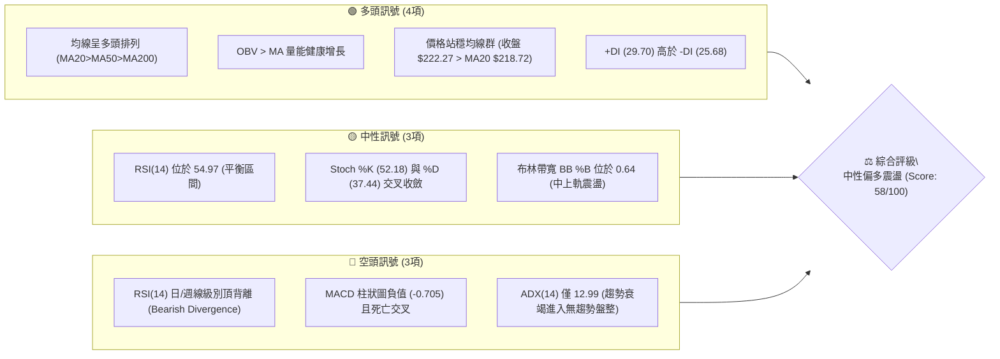

### 📊 核心指標速覽表

| 指標類別 | 指標名稱 | 當前數值 | 訊號 | 解讀 |
|:---|:---|:---|:---:|:---|
| **價格結構** | 當前收盤價 | $222.27 | 🟢 | 位於52週區間 81.0% 高位，距離 52W 高點 $236.00 僅 -5.82% |
| **短期均線** | MA20 (布林中軌) | $218.72 | 🟢 | 價格位於 MA20 之上 +1.62%，提供動態回踩防守位 |
| **中期均線** | MA50 | $214.07 | 🟢 | 中期生命線斜率向上，價格位於其上方 +3.83% |
| **長期均線** | MA200 | $198.02 | 🟢 | 牛熊分界線維持強勢多頭排列，價格高於 MA200 +12.25% |
| **超买超卖** | RSI(14) | 54.97 | 🟡 | 位於 50 多空分界點上方，但出現顯著頂背離壓制 |
| **趨勢動能** | MACD (12,26,9) | 0.855 / 1.561 | 🔴 | DIF 下穿 DEA，柱狀圖負擴張至 -0.705，空方主導修正 |
| **趨勢強度** | ADX(14) | 12.99 | 🔴 | 遠低於 25 臨界線，顯示單邊推升力竭，行情轉入區間震盪 |
| **波動範圍** | 布林通道 (%B) | 0.64 | 🟡 | 位於中軌 $218.72 與上軌 $231.65 之間，通道逐漸收斂 |
| **波動幅度** | ATR(14) | $5.92 | 🟡 | 佔股價 2.66%，顯示日均震盪區間收窄，蓄勢待變 |
| **資金流向** | OBV 趨勢 | OBV > MA | 🟢 | 累計成交量維持在均線之上，籌碼並未出現恐慌性拋售 |

### 🏆 技術評分卡

```
╔══════════════════════════════════════════════════════════════════════╗
║                    技術評分卡 — NVDA (2026-09-20)                    ║
╠══════════════════════════════════════════════════════════════════════╣
║ 趨勢強度 (ADX/趨勢延續性)   ████░░░░░░░░░░░░░░░░  25/100  🔴 極弱/盤整 ║
║ 動能指標 (RSI/MACD/KD背離)   ████████░░░░░░░░░░░░  42/100  🔴 頂部背離 ║
║ 均線系統 (MA20/50/200排列)  ██████████████████░░  90/100  🟢 完美多頭 ║
║ 支撐穩定度 (S1/Fib回調聚類)  ██████████████░░░░░░  72/100  🟢 買盤紮實 ║
║ 成交量配合 (OBV/量比1.41x)  █████████████░░░░░░░  68/100  🟢 溫和放量 ║
║ 形態完整度 (區間箱體收斂)    ██████████░░░░░░░░░░  52/100  🟡 待突破   ║
╠══════════════════════════════════════════════════════════════════════╣
║ 綜合技術評分                 ███████████░░░░░░░░░  58/100  🟡 區間震盪 ║
║ 核心結論：中長多結構未破，短線指標嚴重背離，判定為「高位無趨勢盤整」 ║
╚══════════════════════════════════════════════════════════════════════╝
```

---

## 2. 趨勢分析

### 🌐 多時框趨勢分析

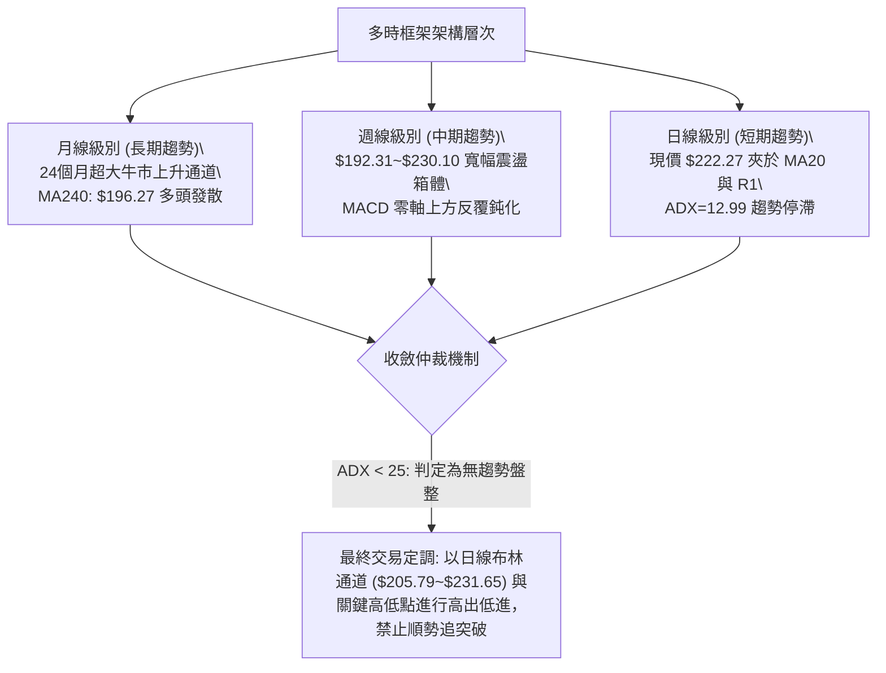

### 📈 長期趨勢 — 12個月走勢圖（Unicode）

NVDA 過去一年展現了從低檔盤整到猛烈拉升、最後進入高位平台構築的過程。下圖為基於月線收盤價繪製之走勢圖（2025-10 至 2026-09）：

```
NVDA 月線走勢圖（過去12個月：2025-10 至 2026-09）
價格 ($)
$230 ┤                                                 ● 2026-09 ($222.27)
$220 ┤                                           ● 2026-08 ($220.53)
$210 ┤                                     ● 2026-05 ($210.66)
$200 ┤ ● 2025-10 ($202.01)           ● 2026-04 ($199.11)  ● 2026-07 ($200.53)
$190 ┤                         ● 2026-01 ($190.68)     ● 2026-06 ($199.87)
$180 ┤             ● 2025-12 ($186.06)
$170 ┤     ● 2025-11 ($176.58)     ● 2026-02 ($176.78)
$160 ┤                         ● 2026-03 ($174.00 築底)
     └─┬─────┬─────┬─────┬─────┬─────┬─────┬─────┬─────┬─────┬─────┬─────
      M1    M2    M3    M4    M5    M6    M7    M8    M9    M10   M11   M12
     (10)  (11)  (12)  (01)  (02)  (03)  (04)  (05)  (06)  (07)  (08)  (09)
```

#### 過去12個月走勢特徵分析

| 階段區間 | 時間週期 | 收盤起訖價 | 區間漲跌幅 | 走勢特徵與量價架構解讀 |
|:---|:---:|:---:|:---:|:---|
| **第一階段：高檔震盪洗盤** | 2025-10 ~ 2025-11 | $202.01 → $176.58 | -12.59% | 自200美元大關回落，獲利了結盤湧出，跌破短期均線回踩支撐。 |
| **第二階段：次頂構築與再挫** | 2025-12 ~ 2026-03 | $186.06 → $174.00 | -6.48% | 反彈至190美元後乏力，在2026年3月觸及波段低點 $174.00（接近52W低點聚類）。 |
| **第三階段：主升浪強勢反攻** | 2026-04 ~ 2026-05 | $199.11 → $210.66 | +5.80% | 買盤強勢回歸，放量突破200美元，均線系統重新由空翻多。 |
| **第四階段：平台整理與拉抬** | 2026-06 ~ 2026-09 | $199.87 → $222.27 | +11.21% | 橫盤整理後於8-9月再度發力創下月線收盤新高，逼近歷史高位區間。 |

### 📊 中期趨勢（週線分析）

從近20週數據（2026-05 至 2026-09）剖析，中期價格在 **$192.31（2026-06-28低點）至 $230.10（2026-09-06高點）** 之間維持大型箱體運行。

```
NVDA 中期週線支撐與阻力走廊
$236.00 ┬─────────────────────────────── [52W High / Fib 0.0%]
        │                      ┌──● $230.10 (2026-09-06 波段高點)
$232.03 ┼──────────────────────┼──────── [波段聚類阻力 R1]
        │                      │  ▲
$222.27 ┼──────────────────────┴──┼─────── [當前現價收盤位]
        │                         ▼
$218.98 ┼───────────────────────────────── [Fib 23.6% 回調關鍵樞軸]
        │          ┌──● $210.72
$207.66 ┼──────────┼────────────────────── [波段聚類強支撐 S1 / Fib 38.2% $208.46]
        │  ● $192.31 (2026-06-28 箱體底部)
$198.43 ┴───────────────────────────────── [MA200 / Fib 50.0% / 波段支撐 S2]
```

中期週線的核心特徵為：每次週線 RSI 觸及 70 以上（如 2026-08-16 的 75.4），隨後均引發長陰線或回調修正（如 2026-08-23 跌至 $214.48，RSI 回落至 59.5）。最新一週（2026-09-20）收盤價 $222.27，週 RSI 降至 55.0，MACD 柱狀圖收在 -0.705，表明週線動能亦處於退潮修正期。

### ⚡ 趨勢強度評估（ADX 解讀）

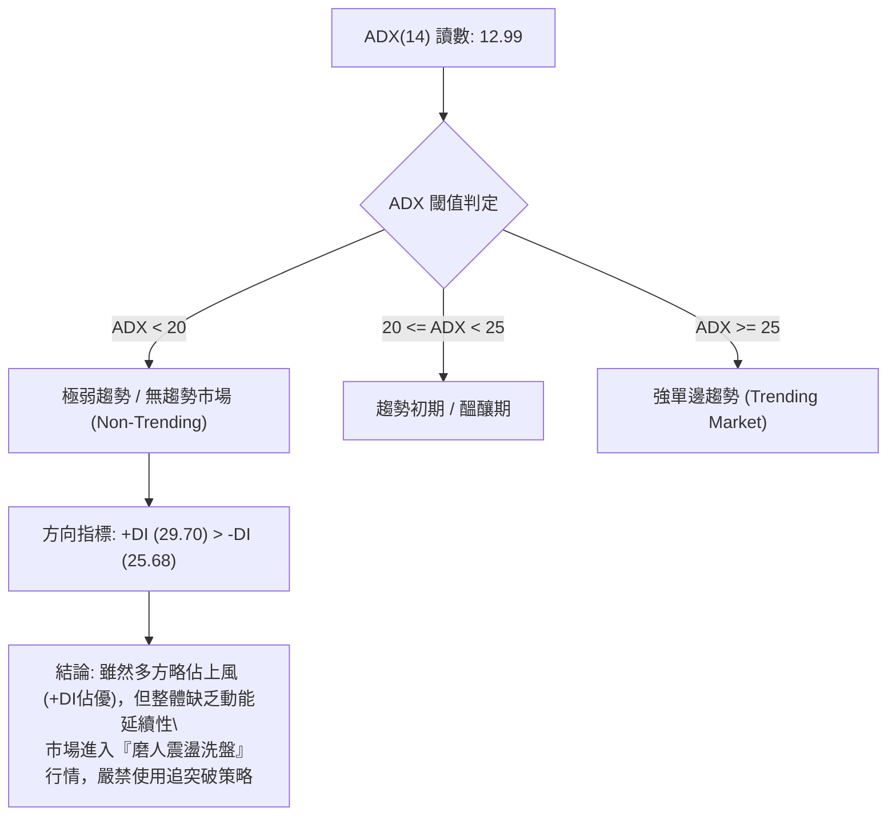

| 指標變數 | 當前數值 | 參考臨界值 | 狀態定性 | 對應操作指導 |
|:---|:---:|:---:|:---:|:---|
| **ADX(14)** | **12.99** | 25.00 | 弱趨勢/盤整 | 順勢指標失效，震盪指標（布林通道、Stochastics）權重提高至 80% |
| **+DI (多頭動向)** | **29.70** | -DI 數值 | 多方主導 | 買盤力量尚在，空頭難以發動深幅崩跌，具備逢低防守買盤 |
| **-DI (空頭動向)** | **25.68** | +DI 數值 | 空方受限 | 空方動能不足以形成順暢的下跌浪 |
| **DI 差值 (+DI - -DI)** | **+4.02** | >10.0 為強 | 勢均力敵 | 兩軍交戰於僵持線，價格大概率在狹幅區間內反覆拉鋸 |

---

## 3. 圖表形態分析

### 🔍 形態識別系統

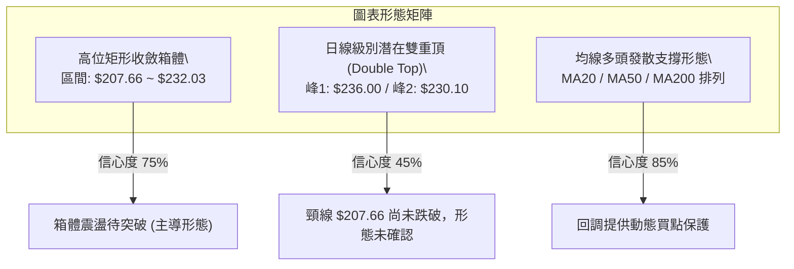

#### 形態識別信心度與目標價評估

依嚴格規範，凡宣稱形態必須標註信心度，若數據不足僅以指標與區間解讀：

| 形態名稱 | 信心度 | 判斷依據（引用數據） | 完成度 | 目標價（附嚴格計算式） |
|:---|:---:|:---|:---:|:---|
| **高位矩形整理箱體** | **75%** | 上軌聚類於阻力位 R1 $232.03，下軌聚類於波段低點支撐位 S1 $207.66。近4個月在此區間反覆震盪。 | 80% | **向上突破目標**：箱體高點 $232.03 + 形態高度 ($232.03 - $207.66 = $24.37) = **$256.40**<br>**向下跌破目標**：箱體低點 $207.66 - 形態高度 $24.37 = **$183.29** |
| **潛在雙重頂 (Double Top)** | **45%** | 第一高點為 52W High $236.00，第二高點為 2026-09-06 週高點 $230.10。頸線錨定 S1 $207.66。但當前價格 $222.27 遠在頸線之上，且均線多頭，信號薄弱。 | 40% | *信心度 < 50%，僅列為防範警訊，不做主交易依據。*<br>若跌破頸線 $207.66，跌幅推算為：$207.66 - ($236.00 - $207.66 = $28.34) = **$179.32**（與 Fib 78.6% $179.33 吻合）。 |
| **指標型態：布林帶收口** | **85%** | BB 上軌 $231.65 與下軌 $205.79 帶寬收窄，%B 落在 0.64。標準波動率擠壓（Squeeze）前兆。 | 90% | 待放量突破帶軌。突破上軌看 $236.00，跌破下軌看 S2 $198.43。 |

### 🕯️ 重要K線形態分析

根據近 6 個月關鍵收盤節點進行 K 線形態解讀：

| 月份 | 收盤價 | 實體與影線特徵 | K線形態 | 解讀與後市意義 | 訊號 |
|:---:|:---:|:---|:---:|:---|:---:|
| **2026-04** | $199.11 | 長陽實體突破前期 $174 平台 | 紅三兵啟動浪 | 多頭強勢反攻，確認 $174 為階段底部 | 🟢 |
| **2026-05** | $210.66 | 帶長上影線中陽線 | 突破遇阻星線 | 突破 $200 心理關卡，但在 52W 高點前遇到獲利回吐 | 🟡 |
| **2026-06** | $199.87 | 帶長下影線的紡錘線 (Low $192.31) | 錘頭測試線 (Hammer) | 下探測試 MA200 與 Fib 50% 獲得強勁逢低承接買盤 | 🟢 |
| **2026-07** | $200.53 | 極小實體十字星 (Doji) | 高位長十字星 | 多空勢均力敵，波動率急遽壓縮，市場進入蓄勢待變期 | 🟡 |
| **2026-08** | $220.53 | 實體大陽線收於高位 | 光頭大陽線 | 多方打破僵局，週放量上推，奠定當前強勢格局 | 🟢 |
| **2026-09** | $222.27 | 上下影線窄幅實體線 | 高位孕育線 (Harami) | 漲勢停頓，在阻力 R1 $232.03 之前缺乏跟隨追高買盤 | 🟡 |

### 📉 ASCII 走勢形態示意圖

以下展示日線與週線級別之「高位整理箱體與阻力/支撐形態」：

```
NVDA 關鍵形態結構：高位箱體橫盤整理 ($207.66 - $232.03)
========================================================================
$236.00 ┤─── 52W High (形態極限高點)
        │       Top 1 ($236.00)
$232.03 ├───╭─────╮─────────╭─────╮───── [箱體頂部阻力 R1] ───────
        │  │     │         │Top 2│     
$225.00 ┤  │     │         │$230.│  現價: $222.27 (箱體上半部震盪)
$222.27 ┼──┼─────┼─────────┼──●──┼────────────────────────────────
$218.72 ├──┼─────┼──MA20───┼─────┼───────────────────────────────
        │  │     ╰─────────╯     │  
$210.00 ┤  │                     │  
$207.66 ├──┴─────────────────────┴──── [箱體頸線/波段支撐 S1] ──────
        │                                
$198.43 ├─── MA200 / 波段支撐 S2 (多頭終極防線)
========================================================================
形態定性：箱體震盪尚未破位，均線向上發散保護，頂部形態信心度不足50%。
```

---

## 4. 支撐與阻力

### 🗺️ 關鍵價位分布圖（Unicode）

本分析嚴格引用系統由 OHLCV 與斐波那契回調計算得出之聚類數值，嚴禁非公式化捏造。

```
NVDA 價位結構分布圖
═════════════════════════════════════════════════════════════════════════
$236.00 ║████████████████████████████████████████║ 52週歷史高點 / Fib 0.0%
$232.03 ║██████████████████████████████          ║ 關鍵阻力 R1 (波段高點聚類)
$231.65 ║▓▓▓▓▓▓▓▓▓▓▓▓▓▓▓▓▓▓▓▓▓▓▓▓▓▓▓▓          ║ 布林通道上軌
─────────────────────────────────────────────────────────────────────────
$222.27 ╠════════════════════════════════════════╣ ◄ 當前市價收盤
─────────────────────────────────────────────────────────────────────────
$218.98 ║░░░░░░░░░░░░░░░░░░░░░░                  ║ Fib 23.6% 回調樞軸位
$218.72 ║▓▓▓▓▓▓▓▓▓▓▓▓▓▓▓▓▓▓                      ║ MA20 均線 / 布林中軌動態支撐
$214.07 ║▓▓▓▓▓▓▓▓▓▓▓▓▓▓                          ║ MA50 生命線動態支撐
$208.46 ║░░░░░░░░░░░░░░░░░░░░░░░░░░░░░░░░        ║ Fib 38.2% 回調位
$207.66 ║████████████████████████████████        ║ 關鍵強支撐 S1 (波段低點聚類)
$205.79 ║▓▓▓▓▓▓▓▓▓▓▓▓▓▓▓▓▓▓▓▓▓▓▓▓                ║ 布林通道下軌
$199.95 ║░░░░░░░░░░░░░░░░░░░░░░░░░░░░░░░░░░░░░░░║ Fib 50.0% 中樞回調位
$198.43 ║████████████████████████████████████████║ 重大強支撐 S2 (波段低點聚類)
$198.02 ║▓▓▓▓▓▓▓▓▓▓▓▓▓▓▓▓▓▓▓▓▓▓▓▓▓▓▓▓▓▓▓▓▓▓▓▓▓▓▓║ MA200 年線多頭牛熊分水嶺
$194.30 ║████████████████████████████████████████║ 終極強支撐 S3 (波段低點聚類)
═════════════════════════════════════════════════════════════════════════
```

### 🚧 阻力位分析表

所有阻力數值完全對齊 OHLCV 波段數據庫：

| 阻力級別 | 價位 | 距現價幅幅 | 形成原因與籌碼屬性 | 突破難度 | 重要性評級 |
|:---|:---:|:---:|:---|:---:|:---:|
| **動態阻力** | **$231.65** | +4.22% | **布林通道上軌**：近期日線波動上限，通道正在收口，提供即時壓制。 | 中等 | 🟡 次要阻力 |
| **R1** | **$232.03** | +4.39% | **近一年波段高點聚類**：多次衝高回落形成的密集成交受阻區，空頭反撲陣地。 | 極高 | 🔴 核心波段阻力 |
| **極限阻力** | **$236.00** | +6.18% | **52W High (斐波那契 0.0%)**：全歷史最高天花板，解套盤與期權防守大本營。 | 巨大 | 🔴 戰略級阻力 |

### 🛡️ 支撐位分析表

所有支撐數值完全對齊 OHLCV 波段數據庫：

| 支撐級別 | 價位 | 距現價幅幅 | 形成原因與籌碼屬性 | 守住機率 | 重要性評級 |
|:---|:---:|:---:|:---|:---:|:---:|
| **近期支撐** | **$218.72** | -1.60% | **MA20 / BB中軌 / Fib 23.6% ($218.98)**：多重技術指標共振處，短線多空分水嶺。 | 70% | 🟢 短線防守樞軸 |
| **S1** | **$207.66** | -6.57% | **近一年波段低點聚類 / Fib 38.2% ($208.46)**：箱體整理下緣，具備大量機構換手成本支撐。 | 85% | 🟢 核心結構支撐 |
| **S2** | **$198.43** | -10.72% | **近一年波段低點聚類 / MA200 ($198.02) / Fib 50.0% ($199.95)**：年線與半數回調三重共振，多頭大本營。 | 95% | 🟢 牛市生命底線 |
| **S3** | **$194.30** | -12.59% | **近一年波段極限低點聚類**：前期破底翻之結構起漲點，跌破則宣告中期趨勢反轉。 | 99% | 🟢 崩盤防禦位 |

### 📐 斐波那契回調位分析

依據 52 週極端區間（低點 **$163.90** 至 高點 **$236.00**，總波幅 $72.10）精確推算：

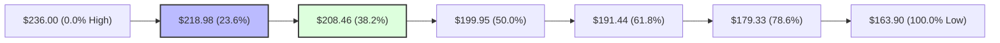

* **現價位置定位**：現價 **$222.27** 位於 **0.0% ($236.00)** 與 **23.6% ($218.98)** 之間，處於回調的最淺階梯（極強勢整理區）。
* **多空意義解讀**：
  1. 股價在測試 $230 以上高點受阻後，並未跌破 23.6% 回調位 ($218.98)，顯示回調幅度屬於「強勢消化」，屬於淺度良性回踩。
  2. 若 $218.98 失守，下方第一道關鍵黃金分割位為 38.2% ($208.46)，該價位與波段聚類支撐 S1 ($207.66) 形成僅有 0.80 美元的極度密合帶，構成不可跌破的中期多頭防線。
  3. 50.0% 回調位 ($199.95) 剛好與心理整數位 $200.00 以及 S2 ($198.43)、MA200 ($198.02) 完美重疊，印證了 $198~$200 為 NVDA 的鐵底防線。

---

## 5. 技術指標深度解讀

### 🎛️ 指標訊號總覽

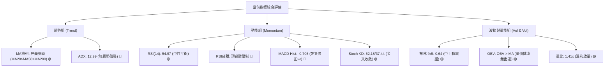

### 📈 移動平均線排列分析

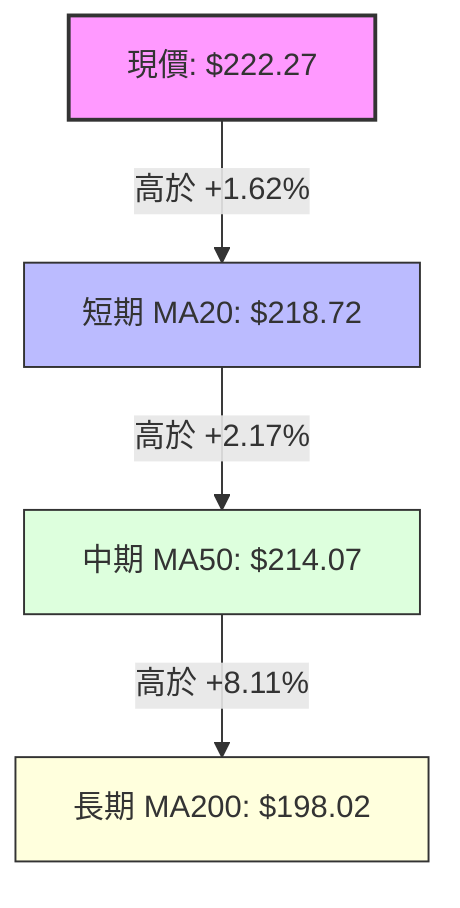

均線多頭排列完整度達 100%。由短至長依次為：
* **MA5 ($215.73)**、**MA10 ($219.43)**、**MA20 ($218.72)**、**MA60 ($211.27)**、**MA120 ($207.96)**、**MA240 ($196.27)**。
* **均線扣抵分析**：短期 MA5 與 MA10 在 $215~$219 帶有橫盤打底跡象；MA20 向上傾斜支撐現價；MA60/120/240 呈現完美的多頭扇形發散，表明長線持股成本穩健上移，只要 MA50 ($214.07) 未跌破，長線牛市結構不可撼動。

### 📉 RSI(14) 分析與背離判定

```
RSI(14) 刻度儀表 (當前值: 54.97)
0        20       30               50       54.97            70       80      100
├────────┼────────┼────────────────┼──────────●──────────────┼────────┼────────┤
│     極度超賣    │    弱勢區間    │       多空平衡      │    強勢超買    │
進度條：███████████████████████████░░░░░░░░░░░░░░░░░░░░░░  54.97%
```

#### ⚠️ 頂背離 (Bearish Divergence) 深度審查：
* **形態確認**：明確成立 🔴。
* **比對事實**：
  * **價格維度**：2026-08-16 價格收於 $224.91，隨後在 2026-09-06 進一步刷出波段新高 **$230.10**，現價仍達 $222.27。
  * **RSI 維度**：2026-08-16 週線 RSI 達到巔峰 **75.4**（嚴重超買），但當 2026-09-06 價格創新高時，RSI 僅錄得 **53.7**；當前收盤價 $222.27，RSI 僅有 **54.97**。
  * **結論**：價格創更高高點（Higher High），但 RSI 卻出現更低高點（Lower High）。此標準「熊市頂背離」顯示邊際買盤正在耗竭，機構大單未再追價，預示近期難以發動突破暴漲，任何上攻均會面臨沉重拋壓。

### 📊 MACD(12/26/9) 訊號解讀

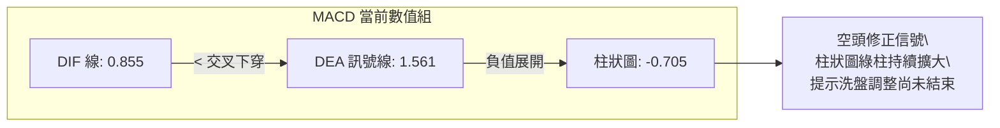

* **訊號特徵**：DIF (0.855) 處於 DEA (1.561) 下方，柱狀圖為 **-0.705**。
* **多時框交叉驗證**：觀察近 5 週數據，柱狀圖自 2026-08-16 的 +2.047 急速萎縮轉負（-0.404 → -0.486 → +0.835 → -0.507 → -0.705）。雖然雙線仍在零軸上方（長多結構仍在），但快線向下牽引，代表短線仍處於動能衰退的「死叉修復週期」，尚未出現底背離或金叉拐點。

### 📦 布林通道分析

```
NVDA 布林通道 (Bollinger Bands 20, 2) 空間圖示
$231.65 ┬────────────────────────────────────────── 上軌 (阻力壓制)
        │
$222.27 ┼──────────────────● (現價, %B = 0.64) ───── 偏上軌強勢震盪
        │                  │
$218.72 ┼──────────────────┴── (中軌 MA20 支撐) ─── 動態第一道防線
        │
$205.79 ┴────────────────────────────────────────── 下軌 (超賣強支撐)
帶寬分析：上軌與下軌差距僅 $25.86 (11.6%)，通道呈現瓶頸收縮，正醞釀下一階段大級別方向性突破。
```

### 💹 成交量分析（量價配合度）

* **量能維度數據**：最新單日成交量 **189,683,500 股**，對比 20 日均量 (134,670,195 股)，**量比達 1.41x**；對比 50 日均量 (125,456,236 股) 亦明顯放大。
* **OBV（能量潮）狀態**：**OBV > MA**，維持多頭排列。
* **量價矛盾/確認評估**：
  * 當前出現了「成交量放大（1.41x），但價格受制於 $222~$230 阻力」的特徵，量能並未推動實體大陽線向上突破，顯示在高檔區間多空雙方產生分歧換手。
  * 由於 OBV 依然高於其移動平均線，且近 20 週未見恐慌性爆量長黑，證明主力資金是以「高位震盪出脫部分籌碼」而非「斷崖式拋售」，量價配合度評定為 **中性偏多（健康換手）**。

---

## 6. 動能與波動率

### ⚡ 動能評估四象限

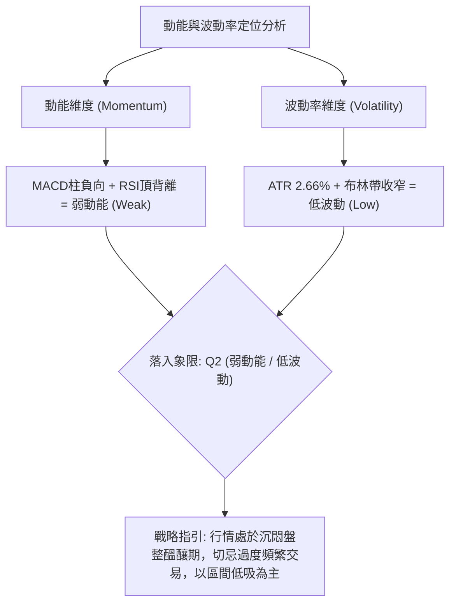

| 象限 | 動能強度 | 波動率水準 | 歷史市場特徵 | 當前 NVDA 定位 | 具體應對策略 |
|:---:|:---:|:---:|:---|:---:|:---|
| **Q1** | 強動能 (Bullish) | 低波動 (Low Vol) | 穩健單邊慢牛主升浪 | — | 順勢加碼，抱牢波段 |
| **Q2** | **弱動能 (Weak)** | **低波動 (Low Vol)** | **高位橫盤修復、整理蓄勢** | **✓ (NVDA現處此象限)** | **區間震盪操作，耐心等待破局** |
| **Q3** | 強動能 (High Mom) | 高波動 (High Vol) | 主升浪末端瘋狂加速或多空爆發 | — | 嚴設動態移動止盈 |
| **Q4** | 弱動能 (Bearish) | 高波動 (High Vol) | 破位瀑布暴跌、恐慌踩踏 | — | 空倉避險或反手做空 |

### 📊 ATR 波動率分析

* **ATR(14) 數值**：**$5.92**（佔當前股價 $222.27 之 **2.66%**）。
* **風控與止損距離精確指引**：
  * **日內雜訊緩衝區間**：$5.92（任何日內低於 $5.92 的波動皆視為隨機噪聲）。
  * **超短線/日內交易止損距離**：1.0 × ATR = **$5.92**。
  * **波段波段交易止損距離**：2.0 × ATR = 2 × $5.92 = **$11.84**。
  * **戰略長線防守緩衝距離**：3.0 × ATR = 3 × $5.92 = **$17.76**。

### 📐 Beta 與市場相關性

* **Beta 係數**：**2.217**。
* **市場敏感性評估**：
  * NVDA 對大盤（標普500 / 納斯達克100）呈現 **高達 2.22 倍的彈性槓桿效應**。大盤上漲 1% 時，NVDA 歷史傾向拉升 2.22%；大盤回落 1% 時，其下挫壓力亦為 2.22 倍。
  * 在當前 ADX < 25 且動能指標頂背離的背景下，高 Beta 意味著若外部半導體板塊或宏觀流動性遭遇突發衝擊，NVDA 具備極快速下測支撐位 S1 ($207.66) 的脆弱性，持有者需提防其高貝塔帶來的多頭踩踏風險。

---

## 7. 多時框架總結

### 📋 時框架評分表

| 時框架 | 趨勢方向 | 動能狀態 | 均線排列 | 圖表形態 | 綜合評分 | 戰術建議 |
|:---:|:---:|:---:|:---:|:---:|:---:|:---|
| **月線 (長期)** | 🟢 強烈多頭 | 🟢 動能充沛 | 🟢 完美多頭 (價格遠高於MA240 $196.27) | 長期上升通道保持良好 | **85 / 100** | 核心長多部位抱牢，忽略短線雜音 |
| **週線 (中期)** | 🟡 震盪整理 | 🔴 柱狀圖轉負 | 🟢 多頭支撐有效 (高於 MA50 $214.07) | $192~$230 矩形大箱體震盪 | **55 / 100** | 逢高減碼追價部位，鎖定獲利 |
| **日線 (短期)** | 🟡 盤整微偏空 | 🔴 頂背離死叉 | 🟢 站於 MA20 ($218.72) 之上 | 窄幅收斂，受制於 R1 $232.03 | **48 / 100** | 嚴禁追高，依布林軌道短線高拋低吸 |

### 🔲 綜合訊號矩陣

```
訊號維度矩陣分析表
┌──────────────┬──────────────┬──────────────┬──────────────┐
│  分析維度    │  日線 (短期) │  週線 (中期) │  月線 (長期) │
├──────────────┼──────────────┼──────────────┼──────────────┤
│ 均線系統     │  🟢 偏多     │  🟢 多頭     │  🟢 極強多頭 │
│ 動能指標     │  🔴 空頭背離 │  🔴 死叉修正 │  🟢 強勢多頭 │
│ 成交量能     │  🟢 溫和放大 │  🟡 中性換手 │  🟢 買盤主導 │
│ 波動通道     │  🟡 軌道收斂 │  🟡 箱體中軌 │  🟢 軌道向上 │
│ 形態信心     │  🟡 整理待變 │  🟡 矩形整理 │  🟢 多頭旗形 │
└──────────────┴──────────────┴──────────────┴──────────────┘
```

### ⚖️ 多時框收斂結論（依規則 14 嚴格執行）

* **收斂裁判標準**：
  * **當前 ADX(14) = 12.99 < 25**，嚴格判定為 **「非趨勢行情 / 盤整震盪行情」**。
  * 依優先級規則：當處於盤整行情時，**均線的趨勢突破指引暫時降級，全面以日線布林通道上下軌 ($205.79 ~ $231.65) 作為主要交易邊界**。
* **唯一收斂方向結論**：**【中性觀望偏區間操作】（Neutral Range-Bound）**。
  * 儘管月線與均線組具備強烈的牛市底蘊，但日線 RSI 頂背離與 MACD 柱狀圖發散 (-0.705) 顯示向上動能衰竭。兩者衝突之際，盤整期禁止單邊做多押注突破。本報告定調為：**現階段以防禦性區間高出低進為主，耐心等待布林帶寬重新張開與 ADX 回升至 25 之上再作順勢跟進。**

---

## 8. 交易策略建議

### 🗺️ 策略決策流程圖

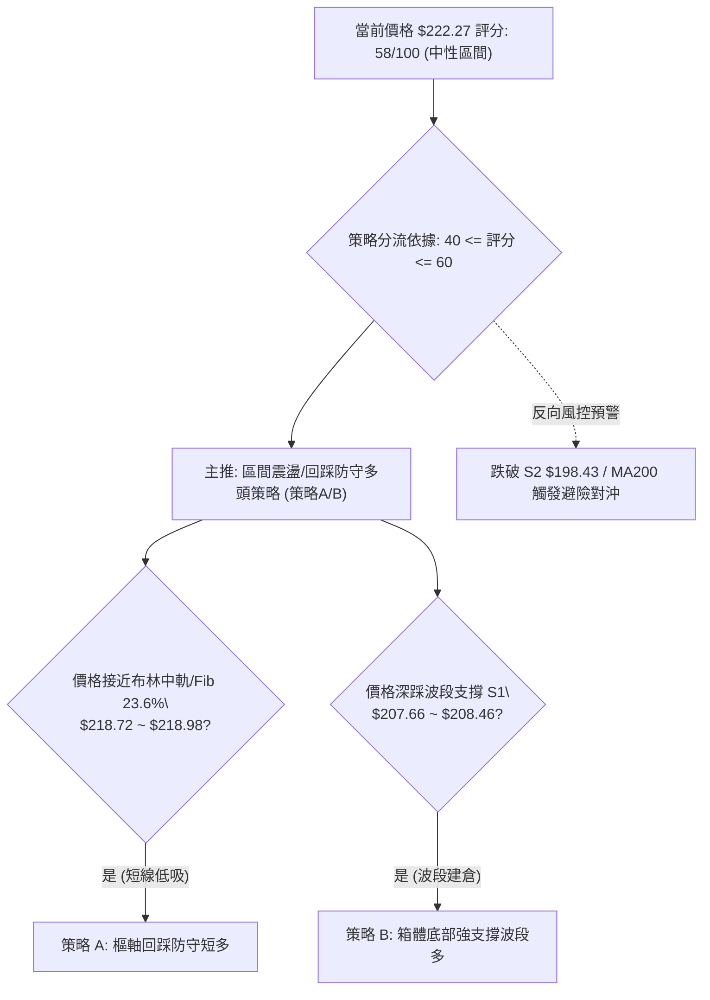

### 🧭 策略路由（依評分卡分流）

* **主策略方向**：依據第 1 章技術評分卡 **58 / 100**，處於 40–60 之中性區間，且 ADX 僅 12.99，定調為 **【區間收斂操作，以布林通道與波段聚類支撐為主】**。
* 不盲目猜測向上突破，亦不恐慌性單邊做空；以回踩支撐位逢低分批佈局、逼近阻力位分批獲利了結為核心主軸。

### 🎯 價格情境階梯（Price Scenarios）

本處所有點位**完全鎖定第 4 章由 OHLCV 與斐波那契計算之數值**：

| 觸發條件 | 第一目標 | 第二目標 (延伸) | 形態與市場含義 |
|:---|:---:|:---:|:---|
| **放量向上突破 R1 $232.03** | **$236.00** (52W High) | **$256.40** (箱體高度推算) | 多頭打破頂背離壓制，動能強勢回歸，啟動主升浪。 |
| **站穩現價 $222.27 區間** | **$231.65** (BB上軌) | **$232.03** (R1 阻力) | 維持在 MA20 上方的窄幅拉鋸，市場等待新催化劑。 |
| **回踩跌破 MA20 $218.72** | **$208.46** (Fib 38.2%) | **$207.66** (波段支撐 S1) | 短線強勢轉弱，確認測試高位箱體下軌尋求買盤。 |
| **失守強支撐 S1 $207.66** | **$199.95** (Fib 50.0%) | **$198.43** (S2 / MA200) | 中期雙頂威脅浮現，高位籌碼套牢，進入深幅修復期。 |

### 📊 情境機率分佈

```
情境機率分佈圓盤示意
繼續上行突破 (25%)  ██████████░░░░░░░░░░░░░░░░░░░░
區間震盪拉鋸 (55%)  ██████████████████████░░░░░░░░
深幅回調探底 (20%)  ████████░░░░░░░░░░░░░░░░░░░░░░
```

| 市場情境劇本 | 預估機率 | 主要技術佐證依據 |
|:---|:---:|:---|
| **區間震盪拉鋸 ($207.66 ~ $232.03)** | **55%** | **ADX 僅 12.99**（無趨勢市）、布林帶持續收斂、均線多頭但動能頂背離，兩股力量高度抵消。 |
| **繼續上行 / 突破 $232.03** | **25%** | **OBV > MA** 顯示主力無出逃跡象、均線呈完美多頭扇形發散、分析師一致共識 target $327.70。 |
| **回落調整 / 測試 S1 $207.66** | **20%** | **RSI 明確頂背離**、MACD 柱狀圖負擴張 (-0.705)、Beta 高達 2.217 易受大盤拖累回調。 |

### 🟢 主策略詳情（區間與回踩多頭）

嚴格引用數據庫支撐與阻力計算風險報酬比（RRR）：

| 策略要素 | 策略 A（短線：回踩 MA20 樞軸防守多） | 策略 B（波段：箱體下緣 S1 埋伏多） |
|:---|:---|:---|
| **交易類型** | 短線區間反彈交易 | 中期波段防守建倉 |
| **進場條件** | 價格回踩 MA20 / Fib 23.6% 出現下影線止跌 | 價格跌至波段強支撐 S1 與 Fib 38.2% 密合帶 |
| **精確進場價格** | **$218.98** (Fib 23.6% 回調位) | **$207.66** (波段聚類支撐 S1) |
| **目標價 T1** | **$231.65** (布林通道上軌) | **$222.27** (當前中樞現價 / MA20) |
| **目標價 T2** | **$232.03** (關鍵阻力 R1) | **$232.03** (關鍵阻力 R1) |
| **精確止損價格** | **$214.07** (跌破 MA50 生命線) | **$198.43** (跌破波段強支撐 S2 / MA200) |
| **風險空間 ($)** | $218.98 - $214.07 = **$4.91** | $207.66 - $198.43 = **$9.23** |
| **報酬空間 ($至T2)** | $232.03 - $218.98 = **$13.05** | $232.03 - $207.66 = **$24.37** |
| **風險報酬比 (RRR)**| **1 : 2.66** (優良) | **1 : 2.64** (優良) |
| **預估勝率** | 58% | 70% |
| **建議倉位** | 10% ~ 15% (輕倉防守) | 20% ~ 25% (標準波段倉位) |

### 🔴 反向風險觸發點（對沖與止損提示）

非直接做空策略，而係提供多頭部位之最高級別風控防線：
1. **短線轉弱預警點**：若日線收盤價跌破 **$218.72 (MA20)**，短線多頭應減倉 50%，防範行情滑向 S1。
2. **中期多頭破位止損點**：若價格以帶量長陰線跌破 **$207.66 (S1)**，高位雙頂結構完成度將升至 80%，剩餘多頭部位應全面止損離場，並可利用反向 ETF 或賣出看漲期權（Covered Call）對沖現貨下探 **$198.43 (S2)** 之風險。

### ⭐ 整體訊號強度評星

```
╔══════════════════════════════════════════════════════════════╗
║ 做多訊號強度：  ★★★☆☆  (3.0 / 5 星 — 均線雖多但動能衰竭)   ║
║ 做空訊號強度：  ★★☆☆☆  (2.0 / 5 星 — 僅限指標背離，逆勢空易損) ║
║ 區間震盪可信度：★★★★☆  (4.5 / 5 星 — ADX 12.99 盤整訊號極強)  ║
║ 整體技術可信度：★★★★☆  (4.0 / 5 星 — 指標數據高度收斂一致)  ║
╚══════════════════════════════════════════════════════════════╝
```

---

## 9. 風險提示與監控

### ✅ 關鍵監控指標 Checklist

```
╔══════════════════════════════════════════════════════════════════════╗
║                   每日收盤技術監控檢核表 (Checklist)                 ║
╠══════════════════════════════════════════════════════════════════════╣
║ [ ] 價格是否跌破 MA20 動態樞軸 $218.72？ (是則短線退場)              ║
║ [ ] ADX(14) 讀數是否由 12.99 向上穿過 20~25？ (確認單邊趨勢甦醒)       ║
║ [ ] RSI(14) 是否跌破 50 多空中軸？ (跌破則背離殺跌加速)              ║
║ [ ] MACD 柱狀圖是否收斂翻紅（突破 0 軸）？ (是則動能修正結束)         ║
║ [ ] 每日成交量是否爆出 2.0x 均量 (大於 2.7 億股)？ (防範天量見頂)    ║
║ [ ] 價格能否收盤站穩阻力 R1 $232.03 之上？ (確認主升浪重啟)          ║
╚══════════════════════════════════════════════════════════════════════╝
```

### ⚠️ 風險場景分析

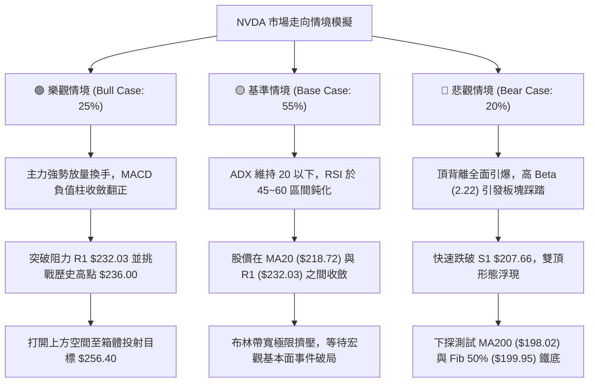

### 🛡️ 風險管理重要提醒

1. **嚴禁盤整期追漲追跌**：當前 ADX 為 12.99，屬於典型的「假突破高發期」。任何盤中突破 $230 的毛刺，若無持續性 2 億股以上巨量支持，極易引發日內多頭陷阱（Bull Trap）。
2. **Beta 敞口管理**：NVDA 的 Beta 達 2.217，對投資組合的波動貢獻巨大。在技術評分僅 58 分的盤整期，總持倉部位建議控制在總投資組合淨值的 **15% ~ 20% 以內**，切忌開立高槓桿衍生合約。
3. **ATR 動態止損機制**：進場任何策略皆必須將止損位與 ATR 結合，目前每日常規波動約為 $5.92，止損不得緊貼進場價，必須維持至少 1.5 倍至 2 倍 ATR 距離（即 $9.00~$12.00 緩衝），避免被正常市場造市雜訊洗盤出局。

---

## 📋 報告總結

```
╔══════════════════════════════════════════════════════════════════════════╗
║                         NVDA 技術分析報告總結                          ║
╠══════════════════════════════════════════════════════════════════════════╣
║ 報告日期：2026-09-20                當前收盤價格：$222.27                 ║
║ 技術評分：58 / 100                 總體評級：⚖️ 中性偏多區間震盪 (Neutral) ║
╠══════════════════════════════════════════════════════════════════════════╣
║ 關鍵維度定性結論：                                                      ║
║ ├─ 長期趨勢 (月線)：🟢 極強牛市，均線完美多頭排列，MA240 $196.27 護航    ║
║ ├─ 中期趨勢 (週線)：🟡 寬幅箱體震盪 ($192.31 ~ $230.10)，等待動能修復     ║
║ ├─ 短期趨勢 (日線)：🔴 弱勢盤整，RSI 出現頂背離，MACD 柱負擴張 (-0.705)  ║
║ ├─ 趨勢強度 (ADX)：🔴 12.99 (<25)，市場無單邊趨勢，盤整指標主導交易      ║
║ ├─ 關鍵阻力位聚類：R1 = $232.03 (波段阻力) ｜ 52W High = $236.00         ║
║ ├─ 關鍵支撐位聚類：MA20 = $218.72 ｜ S1 = $207.66 ｜ S2 = $198.43 (MA200)║
║ └─ 華爾街共識目標：Mean Target = $327.70 (59 位分析師 Strong Buy)      ║
╠══════════════════════════════════════════════════════════════════════════╣
║ 頂級交易決策路徑：                                                      ║
║ 1. 🥇 最佳機會（短線區間）：回踩 Fib 23.6% $218.98 輕倉短多，            ║
║    目標看至 BB上軌 $231.65 / R1 $232.03，止損設於 MA50 $214.07 (RRR 2.66)║
║ 2. 🥈 次選機會（波段穩健）：若遇盤勢下洗，於強支撐 S1 $207.66 佈局波段多，║
║    目標看至 $232.03，嚴格止損於 MA200/S2 $198.43 (RRR 2.64)              ║
║ 3. 🥉 保守防守：若收盤確認跌破 S1 $207.66，全面退出觀望，靜待年線 $198 測試║
╚══════════════════════════════════════════════════════════════════════════╝
```

---

> ⚠️ **免責聲明**：本報告為依據客觀技術指標與量化價格結構之深入研究成果，報告內所有支撐阻力數值均由真實歷史 OHLCV 演化計算而得。本內容**僅供專業學術交流與投資研究參考**，**不構成任何形式的投資建議、要約或招攬**。股市投資具備高度風險，資產價格可升亦可跌，投資者應依據自身風險承受能力獨立判斷並自負盈虧。

---
*報告生成時間：2026-09-20 ｜ 數據來源：Yahoo Finance ｜ 核心架構：多時框技術分析與動態量化風控體系*