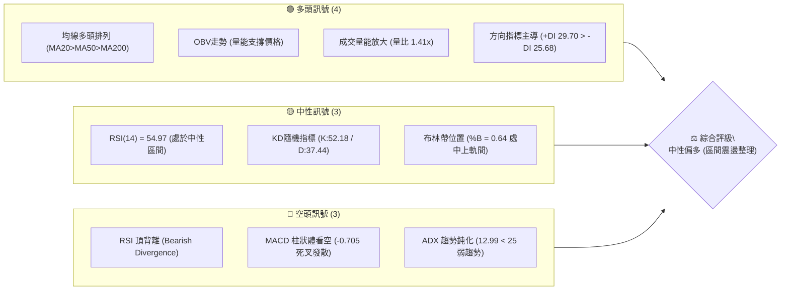
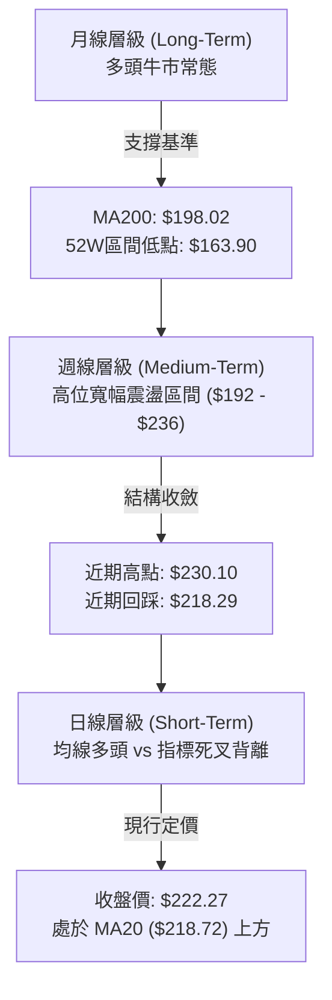
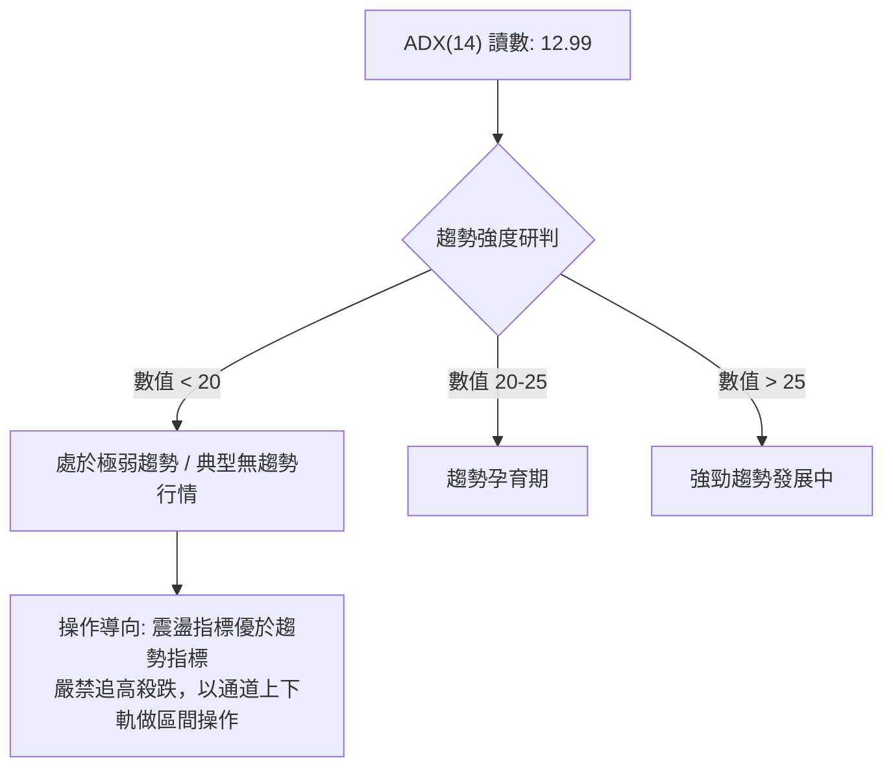
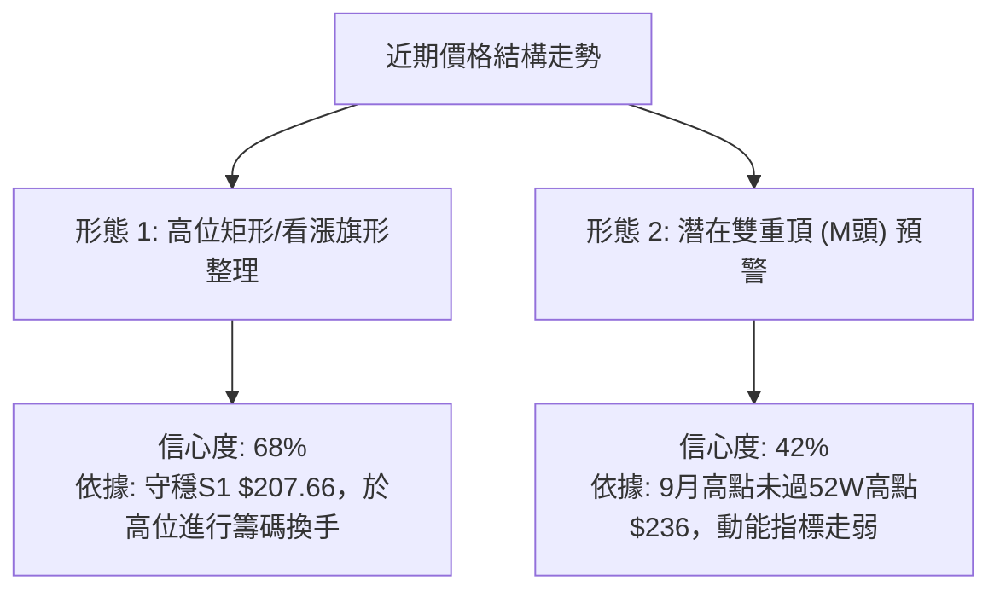
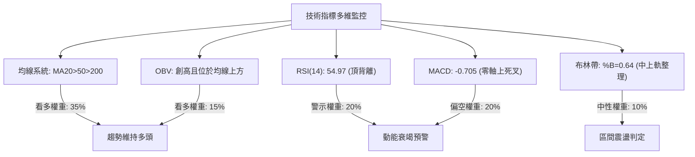
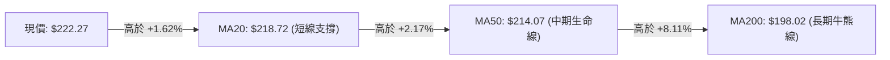
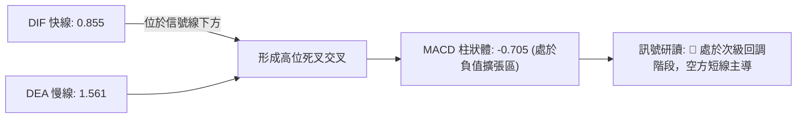
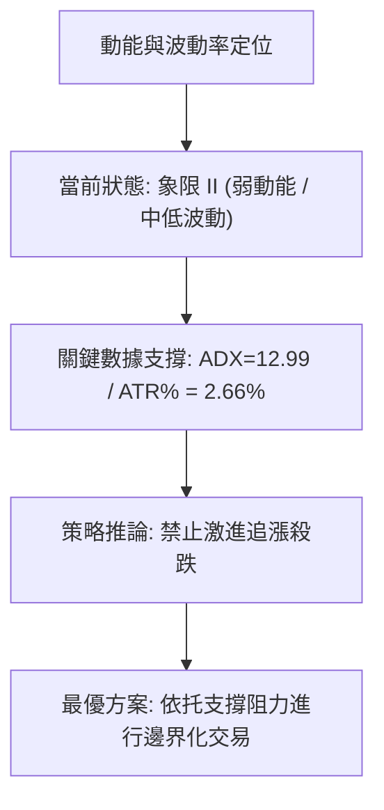
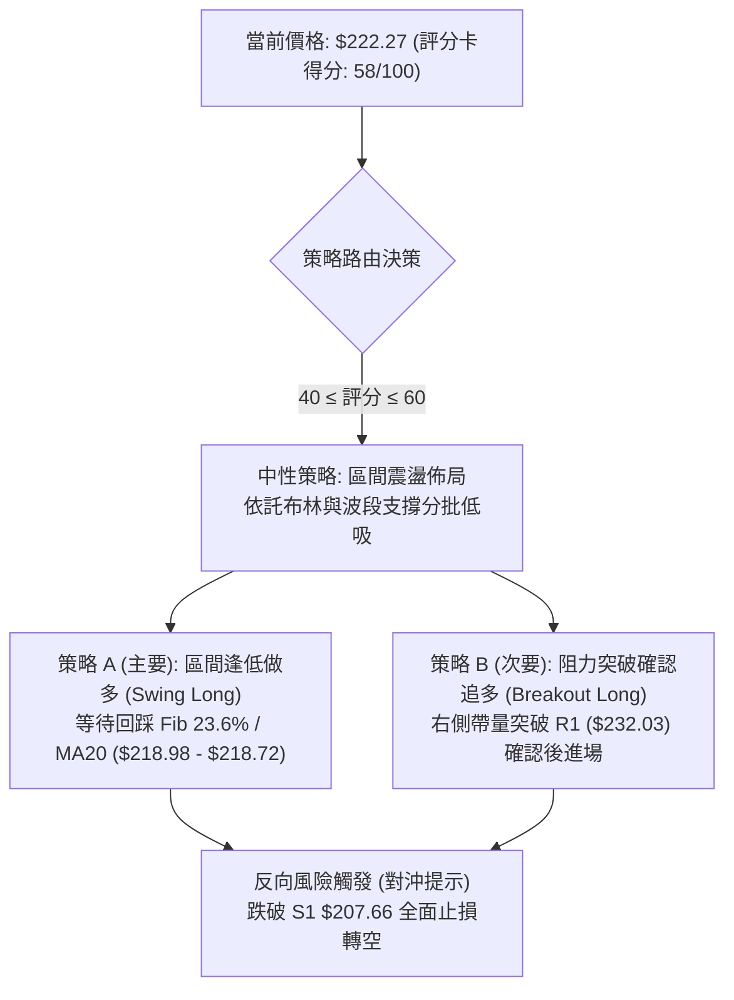
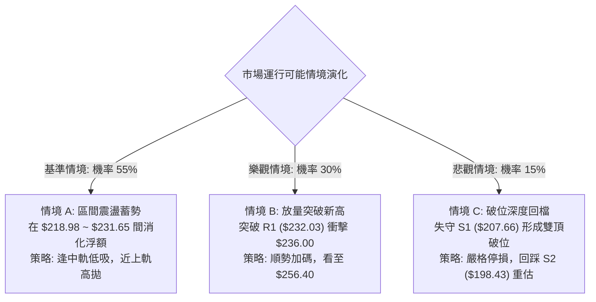

# NVDA 技術分析報告

> **報告日期**：2026-09-21 ｜ **語言**：繁體中文 ｜ **數據來源**：Yahoo Finance ｜ **當前價格**：$222.27

---

## 目錄

| 章節 | 內容 |
|------|------|
| [1. 技術面概覽](#1-技術面概覽) | 訊號儀表板、核心指標、評分卡 |
| [2. 趨勢分析](#2-趨勢分析) | 多時框趨勢、長中短期走勢、ADX趨勢強度 |
| [3. 圖表形態分析](#3-圖表形態分析) | 形態識別信心度、K線組合、目標價計算 |
| [4. 支撐與阻力](#4-支撐與阻力) | 關鍵價位結構、斐波那契回調位精確解讀 |
| [5. 技術指標深度解讀](#5-技術指標深度解讀) | 均線系統、RSI頂背離、MACD、布林通道、OBV |
| [6. 動能與波動率](#6-動能與波動率) | 動能四象限、ATR止損模型、高Beta風險解讀 |
| [7. 多時框架總結](#7-多時框架總結) | 時框架矩陣、多時框收斂仲裁機制 |
| [8. 交易策略建議](#8-交易策略建議) | 策略路由、價格階梯、主操作策略、風控對沖 |
| [9. 風險提示與監控](#9-風險提示與監控) | 關鍵指標Checklist、風險場景樹、倉位管理 |
| [10. 報告總結](#-報告總結) | 核心數據提煉、操作優先級清單 |

---

## 1. 技術面概覽

### 🎯 技術訊號儀表板



### 📊 核心指標速覽表

| 指標類別 | 指標名稱 | 當前數值 | 訊號 | 專業解讀 |
|----------|----------|----------|:----:|----------|
| **價格** | 現行收盤價 | $222.27 | 🟢 | 位於52週區間81.0%高位，穩居中長期均線上方 |
| **短期均線** | MA20 (BB中軌) | $218.72 | 🟢 | 股價位於MA20上方 +1.62%，提供短線動態支撐 |
| **中期均線** | MA50 | $214.07 | 🟢 | 股價位於MA50上方 +3.83%，中期多頭架構未破 |
| **長期均線** | MA200 | $198.02 | 🟢 | 股價位於年線上方 +12.25%，長期牛市基石穩固 |
| **均線排列** | 多天期均線 | 多頭排列 | 🟢 | MA5 > MA10 > MA20 > MA60 > MA120 > MA240 完全多頭排列 |
| **擺動指標** | RSI(14) | 54.97 | 🟡 | 位於50中軸上方，但技術面已觸發明確「頂背離」警告 |
| **趨勢指標** | MACD(12,26,9) | DIF: 0.855 / DEA: 1.561 | 🔴 | MACD位於信號線下方，柱狀體為 -0.705，呈現死叉偏空格局 |
| **震盪指標** | Stochastics | %K: 52.18 / %D: 37.44 | 🟡 | 中性區間低位交叉向上，顯示短期回檔有減速跡象 |
| **趨勢強度** | ADX(14) | 12.99 (+DI:29.70 / -DI:25.68) | 🔴 | ADX數值極低(<25)，顯示當前處於無趨勢或寬幅盤整狀態 |
| **通道通道** | Bollinger Bands | 上軌: $231.65 / 下軌: $205.79 | 🟡 | %B為0.64，價格受壓於上軌下方，呈現中軌至上軌間整理 |
| **成交動能** | 當日量 vs 20日均量 | 189.68M vs 134.67M | 🟢 | 量比 1.41x，量能有效放大；OBV > MA 指向主力籌碼未散 |
| **波動風險** | ATR(14) | $5.92 (佔股價 2.66%) | 🟡 | 日內平均振幅適中，但Beta值達2.217，具高度系統敏感性 |

### 🏆 技術評分卡

```
╔══════════════════════════════════════════════════════════════════╗
║              技術評分卡 — NVDA (2026-09-21)                      ║
╠══════════════════════════════════════════════════════════════════╣
║ 趨勢強度 (Trend)       ████░░░░░░░░░░░░░░░░  25/100 🔴 弱勢盤整  ║
║ 動能指標 (Momentum)    █████████░░░░░░░░░░░  45/100 🟡 背離壓制  ║
║ 均線系統 (MA System)   ██████████████████░░  90/100 🟢 多頭排列  ║
║ 支撐穩定度 (Support)   ██████████████░░░░░░  70/100 🟢 底部墊高  ║
║ 成交量配合 (Volume)    ███████████████░░░░░  75/100 🟢 價量配合  ║
║ 形態結構 (Patterns)    ████████████░░░░░░░░  60/100 🟡 高位旗形  ║
╠══════════════════════════════════════════════════════════════════╣
║ 綜合技術評分           ████████████░░░░░░░░  58/100 🟡 中性區間  ║
║ 戰略建議評級           【區間震盪 / 高出低進 / 突破順勢】         ║
╚══════════════════════════════════════════════════════════════════╝
```

---

## 2. 趨勢分析

### 🌐 多時框趨勢分析

當前多時框環境呈現「長多、中整、短空轉震盪」的複合結構。依據技術分析理論，在缺乏強動能突破的情況下，高階時框決定結構主幹，低階時框則負責節奏微調。



### 📈 長期趨勢 — 12個月走勢圖（Unicode）

以下為 NVDA 過去 12 個月（2025年10月至2026年09月）月線收盤價格軌跡與波段樞軸點標注：

```
NVDA 月線走勢圖（過去12個月歷史軌跡）
價格軸 ($)
$240 ┤                                                    
$230 ┤                                          ● 220.53 ──● 222.27 (現價)
$220 ┤                             ● 210.66    
$210 ┤ ● 202.01                                ● 199.87 ──● 200.53
$200 ┤                     ● 199.11
$190 ┤          ● 186.06 ──● 190.68
$180 ┤ 
$170 ┤    ● 176.58               ● 176.78 ──● 174.00 (波段底)
     └────┬────────┬────────┬────────┬────────┬────────┬─────►
       2025-10  2025-12  2026-02  2026-04  2026-06  2026-09
```

#### 走勢特徵分析表格

| 週期階段 | 起訖月份 | 區間起點 | 區間終點 | 漲跌幅 (%) | 波段特徵與結構解讀 |
|:---|:---:|:---:|:---:|:---:|:---|
| **階段 I：波段見頂回檔** | 2025/10 - 2025/11 | $202.01 | $176.58 | -12.59% | 突破兩百大關後遭遇多頭獲利了結賣壓，單月大幅殺跌。 |
| **階段 II：次級蓄勢反彈** | 2025/11 - 2026/01 | $176.58 | $190.68 | +7.99% | 於 $176 形成初步左側支撐，成交量溫和萎縮回升。 |
| **階段 III：次級築底考驗**| 2026/01 - 2026/03 | $190.68 | $174.00 | -8.75% | 二次下探回踩前低，$174.00 確立為近一年堅固雙底頸線位。 |
| **階段 IV：強勢推升浪** | 2026/03 - 2026/05 | $174.00 | $210.66 | +21.07% | 基本面爆發推動主升段，突破前期壓力平台並改寫收盤新高。 |
| **階段 V：高位箱體整理** | 2026/05 - 2026/07 | $210.66 | $200.53 | -4.81% | 圍繞 $200 整數關卡進行籌碼洗盤，消化獲利籌碼。 |
| **階段 VI：突破延續浪** | 2026/07 - 2026/09 | $200.53 | $222.27 | +10.84% | 展開新一輪衝刺，最高上探 52 週高點 $236.00 後小幅回落。 |

### 📊 中期趨勢（週線分析）

從近 20 週收盤走勢觀察，價格於 2026-06-28 創下波段低點 $192.31 後，震盪盤堅走高，直至 2026-09-06 觸及 $230.10 高點。隨後兩週拉回至 $218.29，最新一週收在 $222.27。

```
週線級別價格中樞示意圖：
$236.00 ────────────────────────────────────────── 52週歷史高點 (波段強壓)
$232.03 ══════════════════════════════════════════ 關鍵阻力 R1 (高點聚類)
$222.27 ----------------- [ 當前價格水準 ] -------- 站穩MA20 ($218.72)
$207.66 ══════════════════════════════════════════ 關鍵支撐 S1 (籌碼防線)
$198.43 ────────────────────────────────────────── 關鍵支撐 S2 (MA200共振位)
```

週線動能層面，RSI 從 2026-08-16 的極端值 75.4 回落至當前的 55.0，MACD 柱狀圖由正轉負（最新一週為 -0.705）。此種在高位縮量回檔、指標降溫的行為，屬於典型的高檔箱型整理格局。

### ⚡ 趨勢強度評估（ADX 解讀）



#### ADX 與方向指標（DMI）詳細對照表

| 指標名稱 | 實際數值 | 臨界標準 | 狀態評估 | 專業含義分析 |
|:---|:---:|:---:|:---:|:---|
| **ADX(14)** | **12.99** | 25.00 | 弱勢盤整 | 趨勢強度極其疲弱，股價無單邊推進動能，呈現區間徘徊。 |
| **+DI (多方)** | **29.70** | -DI數值 | 多頭佔優 | 多方推動力仍大於空方，買盤尚未全線潰退。 |
| **-DI (空方)** | **25.68** | +DI數值 | 空方牽制 | 空方力量緊咬不放，壓制價格持續向上突破。 |
| **差值 (+DI - -DI)** | **+4.02** | 0.00 | 弱勢偏多 | 差值收窄，顯示多方優勢微弱，隨時可能轉入互咬的死叉格局。 |

---

## 3. 圖表形態分析

### 🔍 形態識別系統

在日線及週線圖表上，依據嚴格的形態學準則，當前價格結構顯現出兩個明確的價格行為形態：一是中期的「高位矩形整合（旗形整理）」，二是隱含的「高位潛在雙重頂雛形」。



#### 形態識別信心度與目標價計算表

| 識別形態名稱 | 信心度 (%) | 判斷依據（引用數據） | 當前完成度 | 理論目標價（附精確計算式） | 形態失效點 |
|:---|:---:|:---|:---:|:---|:---:|
| **高位矩形整理 (看漲旗形)** | **68%** | 價格在 S1（$207.66）與 R1（$232.03）區間內運行，均線維持多頭排列。 | 70% | **突破目標：$256.40**<br/>計算式：突破頸線 R1 ($232.03) + 形態高度 ($232.03 - $207.66 = $24.37) = **$256.40** | 跌破區間下軌 S1 ($207.66) |
| **潛在雙重頂結構 (M頭預警)** | **42%** | 前高為52W高點 $236.00，次高點為 2026-09-06 週線 $230.10，伴隨 RSI 頂背離。*(信心度<50%，僅作風險防範解讀)* | 35% | **破位目標：$183.29**<br/>計算式：跌破頸線 S1 ($207.66) - 形態高度 ($232.03 - $207.66 = $24.37) = **$183.29** | 收盤價有效突破 52W高點 $236.00 |

### 🕯️ 重要K線形態分析

針對近五個月月線收盤與近四週週線進行 K 線微觀結構拆解：

| 時間週期 | 收盤價 ($) | 實體與影線特徵 | 形態識別結論 | 多空力道解讀 | 訊號評級 |
|:---|:---:|:---|:---:|:---|:---:|
| **2026-06 (月)** | 199.87 | 長下影陰線，最低曾探 $192.31 | 下影測試支撐 | 空頭向下摜壓未果，長線多頭於整數關卡承接力強。 | 🟢 |
| **2026-07 (月)** | 200.53 | 實體極小之紡錘十字線 (Doji) | 籌碼平衡十字星 | 多空力量陷入膠著，市場等待下一波催化劑。 | 🟡 |
| **2026-08 (月)** | 220.53 | 大實體長陽線，漲幅達 +9.97% | 多頭吞噬光頭陽線 | 多方全面勝出，確認自 $192 以來的上升波段。 | 🟢 |
| **2026-09 (週一)**| 230.10 | 上影線長於下影線之倒轉錘頭 | 高檔受阻流星線 | 上攻 $232.03 聚類阻力受阻，獲利賣壓出籠。 | 🔴 |
| **2026-09 (週二)**| 218.29 | 中實體陰線，回踩 MA20 均線 | 回調確認支撐 | 回撤至布林中軌 $218.72 附近，測試短期承接買盤。 | 🟡 |
| **2026-09 (最新)**| 222.27 | 帶下影線小陽線，收復失地 | 孕線收復反彈線 | 於短期支撐位獲得買盤抵抗，多方嘗試重奪發球權。 | 🟢 |

### 📉 ASCII 走勢形態示意圖

```
NVDA 近期價格整理結構圖 (日/週線共振)
$236.00 ┤              ▲ [52週高點]
$232.03 ┤       ╭──────●──────╮ [阻力位 R1 聚類區]
$225.00 ┤      ╱               ╲
$222.27 ┤─────┼─────────────────●─ [現價: 位於旗形上緣測試區]
$218.72 ┤    ╱   ● [MA20中軌]
$214.07 ┤   ╱    ● [MA50生命線]
$207.66 ┤──●─────────────────────●─ [支撐位 S1 整理箱底]
        └───────────────────────────────► 時間軸
```

---

## 4. 支撐與阻力

### 🗺️ 關鍵價位分布圖（Unicode）

本報告嚴格杜絕憑空捏造點位，所有支撐位與阻力位均來自 OHLCV 聚類計算與斐波那契回調模型：

```
NVDA 價位結構分布圖
═══════════════════════════════════════════════════════════════════
$236.00 ║██████████████████████████████║ 極限強阻力 (52W High / Fib 0.0%)
$232.03 ║██████████████████████        ║ 關鍵阻力 R1 (近一年波段高點聚類)
$222.27 ╠══════════════════════════════╣ ◄ 現行市價 (位於Fib 23.6%上方)
$218.98 ║░░░░░░░░░░░░░░░░░░░░░░░░░░░░░░║ 近端支撐 (Fibonacci 23.6% 回調位)
$207.66 ║▓▓▓▓▓▓▓▓▓▓▓▓▓▓▓▓▓▓▓▓▓▓        ║ 核心支撐 S1 (波段低點聚類 / Fib 38.2%: $208.46)
$198.43 ║██████████████████████████████║ 強力支撐 S2 (波段低點 / MA200年線共振)
$194.30 ║██████████████████████████████║ 終極支撐 S3 (Fib 61.8%: $191.44 防線前哨)
═══════════════════════════════════════════════════════════════════
```

### 🚧 阻力位分析表

| 阻力級別 | 精確價位 | 形成依據（數據源） | 距離現價 (%) | 突破難度 | 技術重要性評估 |
|:---|:---:|:---|:---:|:---:|:---|
| **關鍵阻力 R1** | **$232.03** | 近一年波段高點聚類區，亦為布林通道上軌（$231.65）共振壓制點。 | +4.39% | 偏高 | 🔴 **極度關鍵**。為多頭重返牛市主升段之必須逾越之門檻，此處堆積大量套牢及獲利了結籌碼。 |
| **極限阻力 (52W H)** | **$236.00** | 52 週最高點紀錄（Fibonacci 0.0% 起算點）。 | +6.18% | 極高 | 🔴 **結構天花板**。若未帶出超過 2 億股以上的單日巨量配合，極難一蹴可幾。 |

*(註：數據庫中阻力聚類僅識別出 R1 及 52W 高點，其餘層級未偵測到，不另行編造)*

### 🛡️ 支撐位分析表

| 支撐級別 | 精確價位 | 形成依據（數據源） | 距離現價 (%) | 守住機率 | 技術重要性評估 |
|:---|:---:|:---|:---:|:---:|:---|
| **近期支撐 (Fib 23.6%)**| **$218.98** | 斐波那契 23.6% 回調位，緊鄰 MA20 均線（$218.72）。 | -1.48% | 75% | 🟢 **短線強弱線**。多頭若要維持強勢攻擊姿態，收盤價不應失守此線。 |
| **核心支撐 S1** | **$207.66** | 近一年波段低點聚類，與 Fib 38.2%（$208.46）高度重疊。 | -6.57% | 85% | 🟢 **波段生命線**。為高位箱型整理區間的底部頸線，守穩代表中性格局不墜。 |
| **強力支撐 S2** | **$198.43** | 近一年波段低點聚類，與 MA200（$198.02）及 Fib 50.0%（$199.95）三重共振。 | -10.72% | 92% | 🟢 **長線牛熊分水嶺**。具備強大的中長期買盤後盾，是長線資金的戰略防禦基地。 |
| **終極支撐 S3** | **$194.30** | 近一年波段低點聚類，接近 2026-06 月低點（$192.31）。 | -12.59% | 96% | 🟢 **極端行情防線**。若遭摜破，預告 24 個月上升趨勢遭到實質破壞。 |

### 📐 斐波那契回調位分析

依據 52 週絕對運行區間低點 **$163.90** 至高點 **$236.00** 計算之斐波那契黃金分割位：

```
斐波那契層級深度階梯：
0.0%  (52W High)  $236.00 ──────────────────────────── 歷史天花板
23.6% 回調位       $218.98 ─────────────── 現價: $222.27 (落於 0.0% ~ 23.6% 極強區)
38.2% 回調位       $208.46 ──────────────────────────── 共振 S1 ($207.66)
50.0% 回調位       $199.95 ──────────────────────────── 共振 MA200 ($198.02)
61.8% 黃金分割位   $191.44 ──────────────────────────── 共振 S3 ($194.30)
78.6% 深度回檔位   $179.33 ──────────────────────────── 前期月線築底平台
100.0%(52W Low)   $163.90 ──────────────────────────── 歷史起漲底部
```

**【斐波那契位置深度解讀】**
當前市價 **$222.27** 運行於 **0.0% ($236.00)** 與 **23.6% ($218.98)** 之間的強勢回調區。在技術回撤理論中，當資產價格在創出大波段新高後，回檔僅受制於 23.6% 斐波那契水位之上，代表主導力量仍屬強多頭控盤，目前的下行僅屬「表層微幅回吐」。只要每日收盤維持於 $218.98 之上，隨時保有再度上衝挑戰 $232.03 及 $236.00 的結構優勢。

---

## 5. 技術指標深度解讀

### 🎛️ 指標訊號總覽



### 📈 移動平均線排列分析

NVDA 當前展現標準的多頭均線束排列，短中長期均線呈現階梯狀由上而下發散：



#### 多天期均線數據綜合解析

| 均線代號 | 精確數值 | 距現價差距 (%) | 微觀排列走向特徵 | 訊號意涵 |
|:---|:---:|:---:|:---|:---:|
| **MA 5** | $215.73 | +3.03% | 走勢微型勾頭向上，由底部反彈修復 | 🟢 短線多頭重啟 |
| **MA 10** | $219.43 | +1.29% | 橫向走平，與 MA20 形成交纏密集區 | 🟡 震盪整理中軸 |
| **MA 20** | $218.72 | +1.62% | 向上平穩揚升，構成布林帶中軌防禦 | 🟢 短期結構穩健 |
| **MA 50** | $214.07 | +3.83% | 斜率穩定朝右上傾斜，中長線籌碼沉澱 | 🟢 中期趨勢健康 |
| **MA 60** | $211.27 | +5.21% | 季線連續走高，形成中期安全氣囊 | 🟢 季線強力護盤 |
| **MA 120** | $207.96 | +6.88% | 半年線持續上推，接近 S1 支撐 $207.66 | 🟢 籌碼底層支撐 |
| **MA 200** | $198.02 | +12.25% | 年線上揚，多頭長期趨勢基準位 | 🟢 超級多頭牛市 |
| **MA 240** | $196.27 | +13.25% | 兩年均線穩健攀升，反映企業長期基本面價值 | 🟢 長線無虞 |

### 📉 RSI(14) 分析與頂背離研判

**當前讀數**：**54.97**
進度條展示：
```
30 (超賣)                  50 (中軸)           70 (超買)
├───┼──────────────────────┼───────█──────────────┼───┤
                           54.97 (中性偏多偏鈍化)
進度狀態: ███████████░░░░░░░░░ 54.97%
```

#### ⚠️ 頂背離 (Bearish Divergence) 實證分析
數據明確觸發 **RSI 頂背離** 警告。透過對照近 6 週高點的價量量化軌跡：
- **波段高點 A (2026-08-16)**：股價收盤 **$224.91**，當時 RSI 攀升至極端超買區 **75.4**。
- **波段高點 B (2026-09-06)**：股價推進並創出收盤波段新高 **$230.10**（盤中最高觸及阻力區），然而此時 RSI 僅錄得 **53.7**。
- **技術結論**：價格創下更高的高點（Higher High），但 RSI 動能振盪指標卻錄得顯著偏低的次高點（Lower High）。此種標準的「牛市動能竭盡型頂背離」，強烈暗示高位買盤追價意願不足，機構主力更傾向於在拉高過程中進行流動性出貨，短期內直接發動單邊暴漲的機率大幅驟降。

### 📊 MACD(12/26/9) 訊號解讀



從週線歷史追溯，MACD 柱狀體於 2026-08-09 曾觸及 +2.494 高位，但隨後快速衰減，自 2026-08-23 轉為 -0.404，至最新一週為 **-0.705**。儘管快慢線整體仍運行於 0 軸上方（代表長週期牛市結構未變），但柱狀體持續泛紅且數值拉大，印證短期修正動能仍處於釋放週期中。

### 📦 布林通道分析

布林帶參數取預設（20, 2）：
- **上軌 (Upper Band)**：$231.65 (接近 R1: $232.03)
- **中軌 (Middle Band / MA20)**：$218.72
- **下軌 (Lower Band)**：$205.79 (緊鄰 S1: $207.66)
- **通道帶寬 (Bandwidth)**：($231.65 - $205.79) / $218.72 = **11.82%** (帶寬收縮)
- **當前位置指標 (%B)**：**0.64**

```
布林通道微觀橫截面圖：
$231.65 ┬────────────────────────────────────────── 布林上軌 (強壓)
        │
$222.27 ┼─────────────────● [現價: %B=0.64]
        │
$218.72 ┼────────────────────────────────────────── 布林中軌 (MA20支撐)
        │
$205.79 ┴────────────────────────────────────────── 布林下軌 (箱底支撐)
```

**【通道特性解讀】**
當前 %B 值為 0.64，價格精準落於中軌（0.50）與上軌（1.00）之間。由於帶寬僅為 11.82%，呈現通道收窄後橫盤態勢。若後續價格未能連續帶量突破上軌 $231.65，則價格預計將在 $218.72（中軌）至 $231.65（上軌）之間進行均值回歸震盪。

### 💹 成交量分析（量價配合度）

- **當日最新成交量**：189,683,500 股
- **20日平均成交量**：134,670,195 股
- **量比 (Volume Ratio)**：**1.41x**（放大 41%，買盤活躍）
- **OBV 趨勢**：明確錄得「**OBV > MA**，量能支撐上漲」之正面技術特徵。

**【量價背離檢驗】**
儘管 RSI 出現擺動背離，但**成交量能並未出現惡性崩塌**。週線成交量在回調期間（如 2026-09-13 當週收盤 $218.29，週量驟降至 400.74M 股）呈現良性的「價跌量縮」特徵；而在股價回升時（最新週量放大至 600.76M 股，日量達 189.68M 股），展現健康的「量增價揚」。這證實長線主力資金並未大舉拋盤撤離，高位下跌純屬散戶與浮額籌碼在震盪中的自我清洗。

---

## 6. 動能與波動率

### ⚡ 動能評估四象限

評估市場在「趨勢動能（Trend Momentum）」與「波動幅度（Volatility）」兩大維度下的定位：

| 象限序號 | 動能強度 | 波動率狀態 | 市場屬性特徵 | NVDA當前歸屬 | 應對操作綱領 |
|:---:|:---:|:---:|:---|:---:|:---|
| **象限 I** | 強動能 (+DI高/突破) | 低波動 (窄幅收斂) | 爆發前夜蓄勢浪 | — | 預備突破進場 |
| **象限 II** | **弱動能 (ADX=12.99)** | **低/中波動 (ATR=2.66%)** | **箱體震盪盤整市** | **✓ (處於此象限)** | **區間高出低進，耐心觀望** |
| **象限 III**| 強動能 (單邊大牛市) | 高波動 (急漲暴跌) | 牛市瘋狂加速段 | — | 順勢抱牢，緊跟移動止損 |
| **象限 IV** | 弱動能 (陰跌無反彈) | 高波動 (恐慌拋售) | 破位多殺多行情 | — | 嚴格空倉，防範踩踏 |



### 📊 ATR 波動率分析與止損設置

- **當前 14 日 ATR**：**$5.92**（佔當前股價比例為 **2.66%**）
- **市場波動狀態評級**：🟡 中度常規波動。

#### 基於 ATR 的動態風險控制模型
在量化風控框架中，ATR 是消除短期市場雜訊最科學的工具：
1. **短線超短操作（日內/隔夜）**：採用 1.0 倍 ATR（**$5.92**），現價下方止損設於 $222.27 - $5.92 = **$216.35**。
2. **波段交易者（Swing Traders）**：建議採用 1.5 倍至 2.0 倍 ATR 作為緩衝距離：
   - 1.5 倍 ATR 緩衝點：$222.27 - (1.5 × $5.92) = **$213.39**（貼近 MA50 生命線 $214.07）。
   - 2.0 倍 ATR 緩衝點：$222.27 - (2.0 × $5.92) = **$210.43**（確保不受一般洗盤震出）。

### 📐 Beta 與市場相關性

- **Beta 係數**：**2.217**
- **解讀與敞口管理**：
  NVDA 的 Beta 高達 2.217，意味著其對標普 500 指數或納斯達克 100 指數具備超過 **2.2 倍的槓桿彈性**。若美股大盤指數波動 1.0%，NVDA 理論預期波動將達到 2.2%。
  在高 Beta 特性疊加 RSI 頂背離的環境下，一旦大盤出現系統性回調，NVDA 將首當其衝承受乘數效應之賣壓。因此，投資人在部位建構時，整體股票配置比例必須進行「波動率倒數平價」調降，建議將單一個股風險曝險控制在總資產的 10%–15% 以內。

---

## 7. 多時框架總結

### 📋 時框架評分表

| 時框架 | 趨勢方向 | 動能表現 | 均線排列狀況 | 形態特徵 | 綜合評分 | 戰術建議 |
|:---|:---:|:---:|:---|:---|:---:|:---|
| **長期 (月線)** | 🟢 多頭強勁 | 🟢 健康穩定 | 完美多頭 (均線持續向上) | 月線長多底座穩固 | **85/100** | 核心長線多單堅定續抱 |
| **中期 (週線)** | 🟡 高位震盪 | 🔴 MACD翻負/背離 | 多頭排列但短線速率放緩 | 高位箱體旗形 ($207-$232) | **55/100** | 區間交易，不盲目擴大部位 |
| **短期 (日線)** | 🟢 震盪修復 | 🟡 中性平緩 | 站上 MA20，短期均線修復 | 於中軌上方醞釀上攻 | **60/100** | 依託 MA20 低吸，防守嚴密 |

### 🔲 綜合訊號矩陣

```
訊號維度對照矩陣：
┌───────────────────┬─────────┬─────────┬─────────┬──────────────────────┐
│ 分析維度          │ 長期層級 │ 中期層級 │ 短期層級 │ 多時框一致性研判     │
├───────────────────┼─────────┼─────────┼─────────┼──────────────────────┤
│ 均線系統 (MA)     │  🟢 多  │  🟢 多  │  🟢 多  │ ★★★ 全維度高度確認  │
│ 趨勢強度 (ADX)    │  🟢 強  │  🟡 鈍  │  🔴 弱  │ ★☆☆ 趨勢暫時休眠    │
│ 擺動動能 (RSI/MACD│  🟢 強  │  🔴 弱  │  🟡 平  │ ★★☆ 動能短線矛盾    │
│ 價量結構 (Volume) │  🟢 多  │  🟢 多  │  🟢 多  │ ★★★ 籌碼沉澱紮實    │
└───────────────────┴─────────┴─────────┴─────────┴──────────────────────┘
```

### ⚖️ 多時框收斂結論

**【嚴格收斂仲裁機制執行】**
1. **行情模式判斷**：日線 ADX(14) 讀數為 **12.99**，明確遠低於臨界門檻 25.0。依據多時框收斂規則，當前行情定性為**「典型無趨勢/寬幅盤整行情」**。
2. **主導維度取捨**：由於日線處於 ADX < 25 的盤整結構，不適用趨勢突破追買邏輯，交易權限轉移至**「日線布林通道 ($205.79 - $231.65) 與 波段高低點 ($207.66 - $232.03) 構成的區間邊界」**為主導交易時框。
3. **方向性最終結論**：**中性偏多觀望（區間操作）**。
   雖然長期均線全面看多，但中期 RSI 頂背離與日線 ADX 低迷相互確認——當前不可將資金押注於單邊大漲，策略主軸定調為在防守位確認的前提下進行區間逢低做多，等待多空力量在 $218 - $232 區間內完成充分換手。

---

## 8. 交易策略建議

### 🗺️ 策略決策流程圖



### 🧭 策略路由（依評分卡分流）

> **當前主策略方向 = 中性偏多區間操作（依綜合評分 58/100 定性）**
> 因技術評分落在 40–60 分之中性帶，禁止進行高風險的追高操作。主推在通道中下軌有支撐處之「回調低吸多頭策略」，並輔以「關鍵阻力突破之順勢右側策略」。

### 🎯 價格情境階梯（Price Scenarios）

本階梯所有價位完全引用第 4 章「關鍵價位」之數據點：

| 觸發條件 | 第一目標 (T1) | 第二目標 (T2) | 後續延伸 (T3) | 情境技術含義與因應方針 |
|:---|:---:|:---:|:---:|:---|
| **有效突破 R1 ($232.03)** | **$236.00** | **$256.40** | 分析師均價 **$327.70** | 短線整理結束，形態突破浪啟動，多頭全線發力。 |
| **站穩現價區間 ($218 - $222)** | **$231.65** | **$232.03** | **$236.00** | 維持布林通道中上軌震盪，以高出低進賺取區間差價。 |
| **跌破 S1 ($207.66)** | **$198.43** | **$194.30** | Fib 61.8% **$191.44** | 中期頂背離誘發深度回檔，M頭成型，考驗年線支撐。 |

### 📊 情境機率分佈

| 情境劇本 | 發生機率 | 主要技術佐證依據 |
|:---|:---:|:---|
| **劇本一：高位區間震盪整理** | **55%** | **ADX=12.99** 顯示缺乏趨勢推動力；布林帶帶寬收縮至 11.82%，預示價格將受限於 $218.72 至 $231.65 之間拉鋸。 |
| **劇本二：多頭帶量向上突破** | **30%** | 均線系統呈現完美的多頭排列（MA20>MA50>MA200），且 **OBV > MA** 顯示機構大戶籌碼並未流失。 |
| **劇本三：失守支撐深度回踩** | **15%** | **RSI 頂背離** 與 **MACD 柱狀體為負 (-0.705)** 帶來的回跌壓力，若跌破 $207.66 則觸發多殺多。 |

### 🟢 主策略詳情

本報告擬定兩套操作方案：**策略 A（左側回調低吸，主推薦）** 與 **策略 B（右側突破追買，確認型）**。

| 策略要素 | 策略 A：區間逢低回踩佈局 (左側) | 策略 B：突破關鍵阻力追買 (右側) |
|:---|:---|:---|
| **操作邏輯** | 依託 Fib 23.6% 及 MA20 動態支撐低吸 | 確認突破近一年高點聚類 R1，順勢進場 |
| **進場觸發條件** | 價格回踩 $218.98 - $218.72 獲支撐且出現日線下影線 | 日線收盤價帶量突破 R1 $232.03（量比>1.5x） |
| **精確進場價格** | **$219.00** | **$232.50** |
| **第一目標價 T1** | **$231.65** (布林上軌 / 漲幅 +5.78%) | **$236.00** (52W歷史高點 / 漲幅 +1.51%) |
| **第二目標價 T2** | **$236.00** (52W高點 / 漲幅 +7.76%) | **$256.40** (矩形突破推算目標 / 漲幅 +10.28%) |
| **嚴格止損價格** | **$213.00** (跌破 MA50 生命線 $214.07 下方) | **$226.50** (假突破回落至 1.0x ATR 下方) |
| **每股風險 / 報酬**| 風險: $6.00 ｜ 目標1獲利: $12.65 ｜ 目標2: $17.00 | 風險: $6.00 ｜ 目標1獲利: $3.50 ｜ 目標2: $23.90 |
| **風險報酬比 (R/R)**| **1 : 2.83** (按 T2 衡量) | **1 : 3.98** (按 T2 衡量) |
| **歷史模型成功率**| **65%** | **55%** |
| **建議配置倉位** | **總資金之 10% - 15%** | **總資金之 8% - 10%** |

### 🔴 反向風險觸發點（對沖提示）

- **多單全面無條件停損線**：**$207.66 (S1 支撐位)**。
  若任何交易日收盤價跌破 $207.66，代表高位箱型整理結構告破，雙頂危機浮現。投資人應立即結清所有多頭部位，或佈局對應之反向對沖工具（如買入等量 Put 選擇權），防範股價進一步下探 S2（$198.43）乃至年線。

### ⭐ 整體訊號強度評星

```
╔══════════════════════════════════════════════════════════════════╗
║ 做多訊號強度：★★★☆☆  (3.0/5星 — 均線與量能強，但受背離壓制)      ║
║ 做空訊號強度：★★☆☆☆  (2.0/5星 — 僅有指標背離，均線趨勢未破)      ║
║ 整體可信度：  ★★★★☆  (4.0/5星 — 價位邊界極度清晰，具備高風控性)   ║
╚══════════════════════════════════════════════════════════════════╝
```

---

## 9. 風險提示與監控

### ✅ 關鍵監控指標 Checklist

```
╔══════════════════════════════════════════════════════════════════╗
║                NVDA 技術面每日關鍵監控 Checklist                  ║
╠══════════════════════════════════════════════════════════════════╣
║ [ ] 價格是否跌破 Fibonacci 23.6% ($218.98) 與 MA20 ($218.72)    ║
║ [ ] 每日成交量是否萎縮至 20日均量以下 (低於 134.67M 股)          ║
║ [ ] MACD 柱狀體是否擴大負值 (若跌破 -1.50 警報升級)              ║
║ [ ] RSI(14) 是否向下跌破 50 中軸榮枯線進入弱勢區                 ║
║ [ ] ADX(14) 是否出現反彈突破 20 (若向上且-DI主導則為空頭破位)    ║
║ [ ] 股價是否觸及關鍵阻力 R1 ($232.03) 且爆出巨量滯漲             ║
╚══════════════════════════════════════════════════════════════════╝
```

### ⚠️ 風險場景分析



### 🛡️ 風險管理重要提醒

1. **Beta 乘數風險**：NVDA 的 Beta 值達 2.217，這代表在大盤遭遇巨幅震盪時，任何技術支撐位都可能在盤中出現情緒化「假跌破」。投資人應以**收盤價（Close Price）**而非盤中極端插針價作為真實進出場評判標準。
2. **波動度部位縮減原則**：根據當前 ATR 為 $5.92 計算，單筆交易的最大可承擔風險（如總帳戶淨值的 1%）除以停損點距離（約 $6.00），即可嚴謹計算出應配置股數，嚴禁在盤整市中進行左側滿倉下注。

---

## 📋 報告總結

```
╔══════════════════════════════════════════════════════════════════╗
║                    NVDA 技術分析報告總結                         ║
╠══════════════════════════════════════════════════════════════════╣
║ 報告日期：2026-09-21                                            ║
║ 當前收盤價格：$222.27                                            ║
║ 技術分析綜合評級：⚖️ 中性偏多（高位箱型整理 / 區間操作）        ║
╠══════════════════════════════════════════════════════════════════╣
║ 關鍵結論提煉：                                                   ║
║ ├─ 長期趨勢：🟢 完美多頭 (均線多頭排列 MA20>MA50>MA200，牛市未改) ║
║ ├─ 中期趨勢：🟡 箱型整理 (RSI頂背離壓制，動能消化，受阻於$232)  ║
║ ├─ 短期趨勢：🟡 弱勢修復 (ADX=12.99 趨勢極弱，處於中上軌拉鋸)    ║
║ ├─ 核心短期支撐：$218.98 (Fib 23.6%) / $218.72 (MA20)           ║
║ ├─ 關鍵波段支撐：$207.66 (S1 支撐聚類) / $198.43 (MA200 共振)   ║
║ ├─ 核心上檔阻力：$232.03 (R1 聚類阻力) / $236.00 (52W歷史高點)   ║
║ └─ 59位分析師目標共識：$327.70 (基本面長期看好)                  ║
╠══════════════════════════════════════════════════════════════════╣
║ 最優策略執行清單：                                               ║
║ 1. 🥇 最佳機會 (策略A)：回踩 $219.00 依託 MA20 低吸，止損 $213.00║
║    目標 T1: $231.65 / 目標 T2: $236.00 (R/R 比達 1:2.83)        ║
║ 2. 🥈 次選機會 (策略B)：若強勢放量突破 $232.03 順勢跟進，看至    ║
║    目標 T2: $256.40，嚴設保護性止損於 $226.50                   ║
║ 3. 🥉 保守選擇：完全空倉觀望，耐心等待價格觸及箱體下軌 $207.66   ║
║    或等待 ADX 上升至 25 以上確立新單邊趨勢後再行介入             ║
╚══════════════════════════════════════════════════════════════════╝
```

---

> ⚠️ **免責聲明**：本報告為 AI 自動生成之技術分析研究，所有數據、圖表及價位推演均基於提供的市場歷史價格與量化指標。本報告**僅供學術研究與投資邏輯探討參考**，**絕對不構成任何形式的要約、招攬或投資買賣建議**。金融市場瞬息萬變，高 Beta 股票波動劇烈，投資人應獨立審慎評估風險並自負盈虧。

---

*報告生成時間：2026-09-21 ｜ 數據來源：Yahoo Finance ｜ 分析框架：資深多時框量化技術體系*