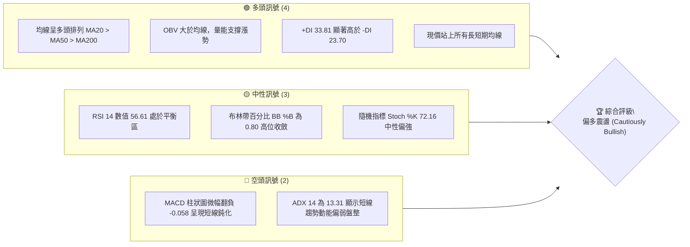
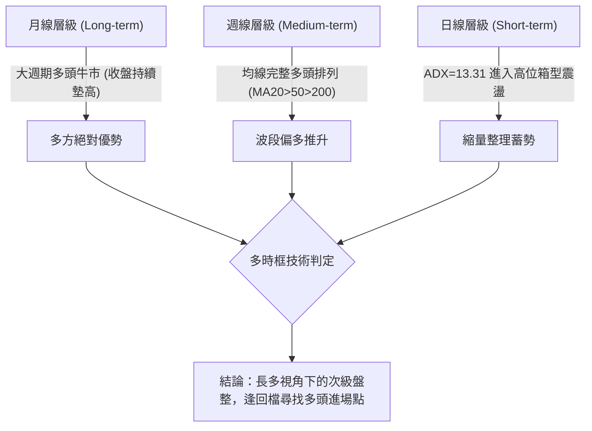
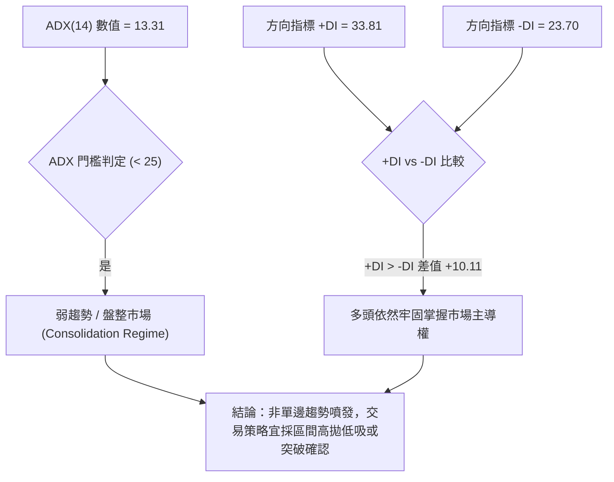
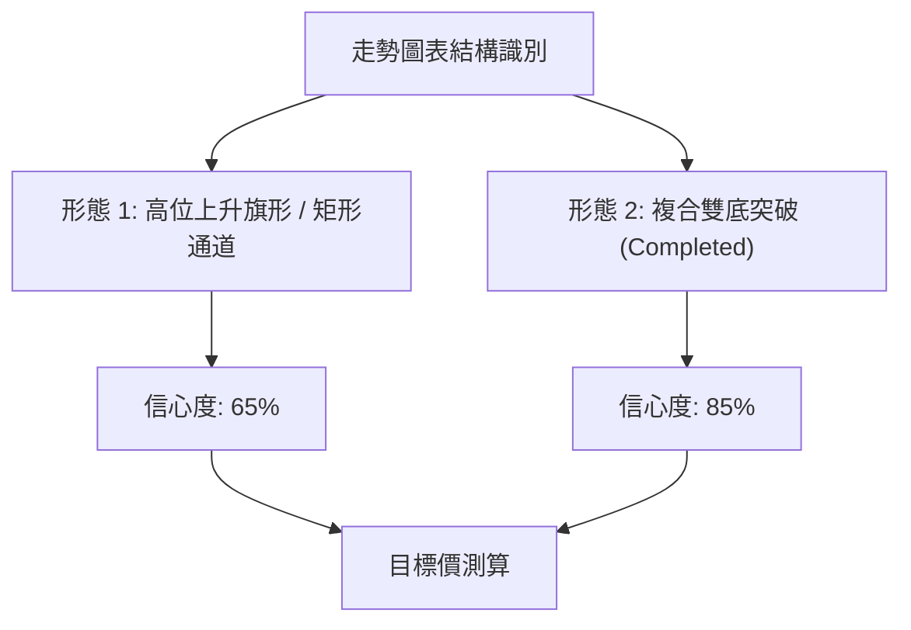
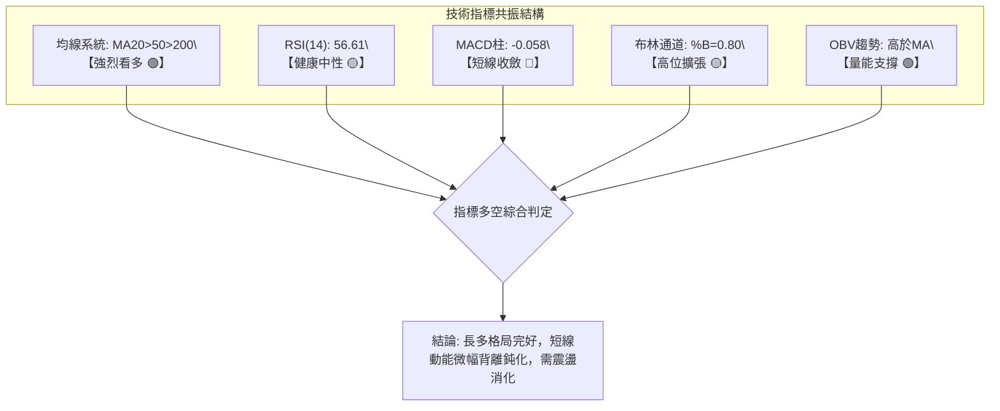
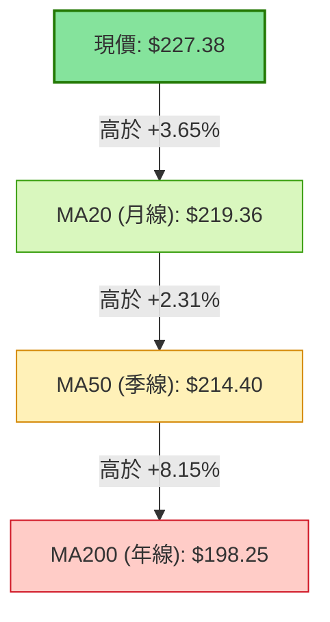
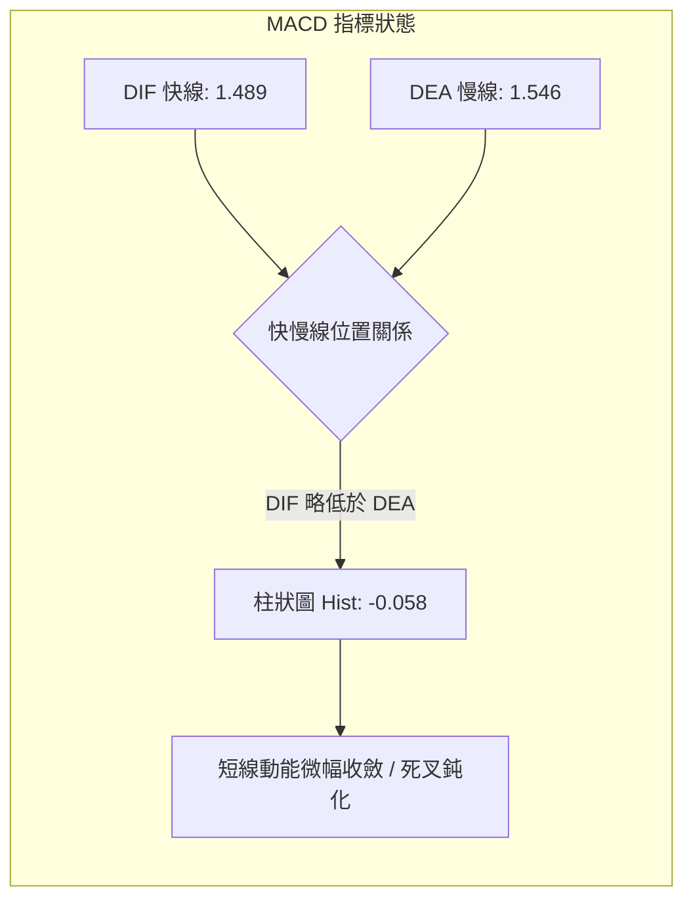
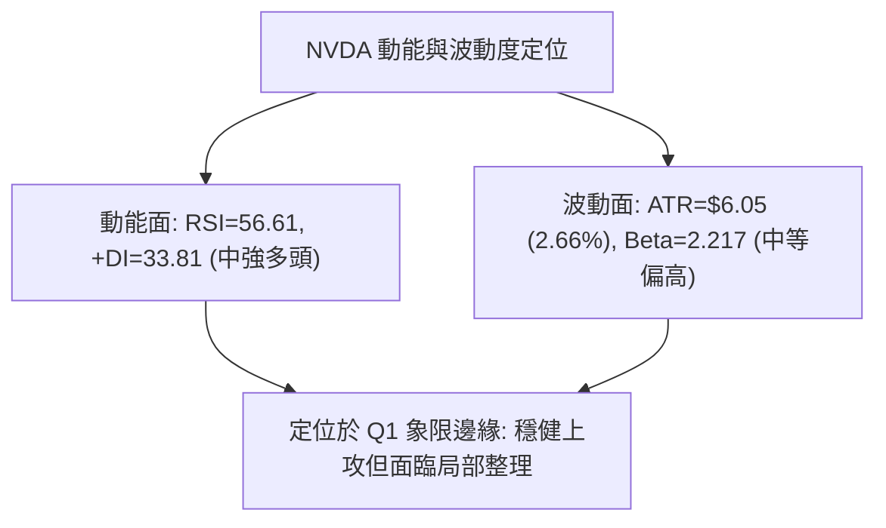
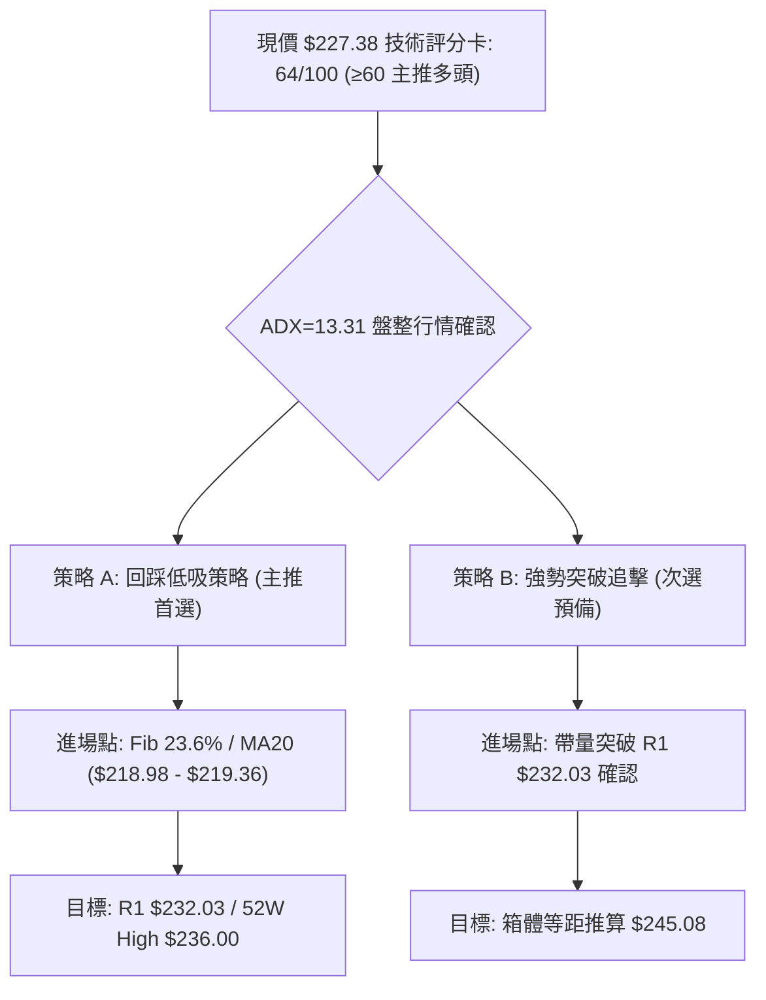
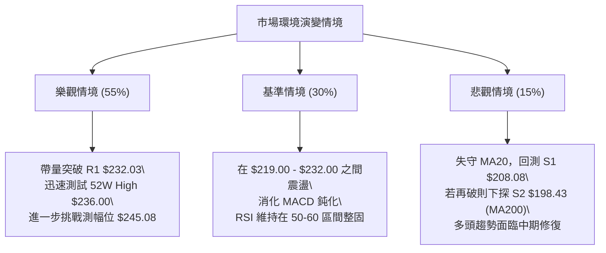

# NVDA 技術分析報告

> **報告日期**：2026-09-22 ｜ **語言**：繁體中文 ｜ **數據來源**：Yahoo Finance ｜ **當前價格**：$227.38

---

## 目錄

| 章節 | 內容 |
|------|------|
| [1. 技術面概覽](#1-技術面概覽) | 訊號儀表板、核心指標、評分卡 |
| [2. 趨勢分析](#2-趨勢分析) | 多時框趨勢、長中短期走勢、ADX解讀 |
| [3. 圖表形態分析](#3-圖表形態分析) | 形態識別、信心度評估、K線組合、目標價推算 |
| [4. 支撐與阻力](#4-支撐與阻力) | 關鍵價位結構、斐波那契回調精準位 |
| [5. 技術指標深度解讀](#5-技術指標深度解讀) | 均線系統、RSI、MACD、布林通道、OBV量價 |
| [6. 動能與波動率](#6-動能與波動率) | 動能四象限、ATR波動分析、Beta敏感度 |
| [7. 多時框架總結](#7-多時框架總結) | 時框架評分矩陣、多時框收斂唯一結論 |
| [8. 交易策略建議](#8-交易策略建議) | 策略路由、階梯情境、主策略操作方案 |
| [9. 風險提示與監控](#9-風險提示與監控) | 監控清單、情境推演、風控紀律 |
| [報告總結](#-報告總結) | 核心結論與交易決策一覽表 |

---

## 1. 技術面概覽

### 🎯 技術訊號儀表板



---

### 📊 核心指標速覽表

| 指標類別 | 指標名稱 | 當前數值 | 訊號 | 技術解讀 |
|:---|:---|:---|:---:|:---|
| **價格** | 當前價格 | **$227.38** | 🟢 | 位於52週區間的 88.0% 高位，多方掌握中長期定價權 |
| **均線** | MA20 (短) | **$219.36** | 🟢 | 現價高於 MA20 達 +3.65%，短線多頭防禦強勁 |
| **均線** | MA50 (中) | **$214.40** | 🟢 | 現價高於 MA50 達 +6.05%，中期上升軌道結構未遭破壞 |
| **均線** | MA200 (長) | **$198.25** | 🟢 | 現價高於 MA200 達 +14.69%，長期牛市基石穩固 |
| **動能** | RSI(14) | **56.61** | 🟡 | 位於 50–60 震盪健康擴張區，無超買或超賣極端現象 |
| **動能** | MACD (12,26,9) | **Hist -0.058** | 🔴 | MACD (1.489) 略低於訊號線 (1.546)，短線動能出現微幅鈍化 |
| **趨勢** | ADX(14) | **13.31** | 🟡 | ADX < 25 表明市場處於無方向或弱趨勢震盪整理階段 |
| **通道** | 布林通道上軌 | **$232.68** | 🟡 | %B = 0.80，價格向布林上軌逼近，短線面臨上軌動態壓制 |
| **量能** | 最新量 / 20日均量| **0.81x** | 🟡 | 成交量 1.09億股，低於20日均量 1.35億股，呈現縮量蓄勢 |
| **波動** | ATR(14) | **$6.05** | 🟡 | 日波動率為 2.66%，屬於中等正常波動，適合波段設防 |

---

### 🏆 技術評分卡

```
╔══════════════════════════════════════════════════════════════╗
║               技術評分卡 — NVDA (2026-09-22)                 ║
╠══════════════════════════════════════════════════════════════╣
║ 均線排列 (Trend Base)     ████████████████░░░░  80/100 🟢 多頭  ║
║ 動能指標 (Momentum)       ██████████░░░░░░░░░░  52/100 🟡 中性  ║
║ 支撐穩定度 (Support)      ██████████████░░░░░░  70/100 🟢 良好  ║
║ 成交量配合 (Volume)       ████████████░░░░░░░░  60/100 🟡 尚可  ║
║ 形態完整度 (Pattern)      ████████████░░░░░░░░  60/100 🟡 箱體  ║
║ 趨勢強度 (ADX Strength)   ██████░░░░░░░░░░░░░░  32/100 🔴 盤整  ║
╠══════════════════════════════════════════════════════════════╣
║ 綜合技術評分 (Total)      █████████████░░░░░░░  64/100 🟢 偏多  ║
║ 評級結論                  【 偏多震盪整理 / 高位蓄勢待發 】       ║
╚══════════════════════════════════════════════════════════════╝
```

---

## 2. 趨勢分析

### 🌐 多時框趨勢分析



---

### 📈 長期趨勢 — 12個月走勢圖（Unicode）

NVDA 過去 12 個月（2025-10 至 2026-09）經歷了一次深度的「高位整固—箱體震盪—再度突破」的波瀾壯闊走勢：

```
NVDA 月線收盤走勢圖（2025-10 至 2026-09）
價格軸 ($)
$230 ┤                                                   ● $227.38 (現價)
$220 ┤                                           ● $220.53
$210 ┤                                   ● $210.66
$200 ┤ ● $202.01                 ● $199.11       ● $199.87  ● $200.53
$190 ┤                   ● $190.68
$180 ┤         ● $186.06
$170 ┤   ● $176.58       ● $176.78
$160 ┤                   ● $174.00 (波段低點聚類)
     └─┬─────┬─────┬─────┬─────┬─────┬─────┬─────┬─────┬─────┬─────┬─────
      10月  11月  12月  01月  02月  03月  04月  05月  06月  07月  08月  09月
      (2025)                                                  (2026)
```

#### 走勢特徵分析表格

| 階段 | 時間跨度 | 收盤價區間 | 累積漲跌幅 | 走勢特徵與技術形態 |
|:---|:---|:---:|:---:|:---|
| **階段一：衝高回洗** | 2025-10 ～ 2025-11 | $202.01 → $176.58 | -12.59% | 觸及兩百美元整數關卡後遇獲利回吐賣壓，急跌尋求支撐 |
| **階段二：底部構築** | 2025-12 ～ 2026-03 | $186.06 → $174.00 | -6.48% | 在 $174.00–$176.78 構築長達 4 個月的扎實複合雙底結構 |
| **階段三：主升重啟** | 2026-04 ～ 2026-05 | $199.11 → $210.66 | +5.80% | 帶量突破兩百美元關卡，均線系統重新排列進入多頭擴張 |
| **階段四：次級整理** | 2026-06 ～ 2026-07 | $199.87 → $200.53 | +0.33% | 在 $200.00 頸線上方進行水平洗盤，消化上檔套牢籌碼 |
| **階段五：推升創新高**| 2026-08 ～ 2026-09 | $220.53 → $227.38 | +3.11% | 多頭再度發力推升，逼近 52 週最高點 $236.00 |

---

### 📊 中期趨勢（週線分析）

從近 20 週走勢觀察，價格自 2026 年 6 月底低點 $192.31 展開強勁反彈，在 8 月中旬推升至 $224.91，隨後進入高檔強勢整理。

```
週線級別價格壓力與支撐示意圖：
阻力區間 ═══════════════════════════ $232.03 (R1 波段高點聚類) / $236.00 (52W High)
                      ▲
當前價格 ─────────────┼───────────── $227.38 (強勢收斂於高位)
                      ▼
支撐平台 ═══════════════════════════ $218.98 (Fib 23.6%) / $219.36 (MA20 基底)
深度防守 ═══════════════════════════ $208.08 (S1 波段低點聚類)
```

週線指標顯示，RSI 已由 8 月中旬的 75.4 超買區健康回落至當前的 56.6，MACD 柱狀圖在零軸附近微幅收斂（-0.058），屬於典型的**以時間換取空間**的強勢整理型態。

---

### ⚡ 趨勢強度評估（ADX 解讀）



#### ADX 趨勢強度對照表

| 參數指標 | 數值 | 評估區間 | 趨勢特徵解讀 |
|:---|:---:|:---:|:---|
| **ADX(14)** | **13.31** | 0 – 20 (極弱趨勢) | 市場缺乏單邊推升動能，處於典型的高位蓄勢盤整結構 |
| **+DI (多頭動能)** | **33.81** | > 25 (強勢擴張) | 買方力量強於基準，回檔時具備足夠的承接盤支撐 |
| **-DI (空頭動能)** | **23.70** | < 25 (偏弱受抑) | 空方未具備發動破位下殺的能量 |
| **趨勢綜合判斷** | **偏多盤整** | 多頭控盤盤整 | **多頭主導下的橫向整理，而非空頭轉折** |

---

## 3. 圖表形態分析

### 🔍 形態識別系統



#### 形態識別與信心度評估表

| 識別形態 | 信心度 | 判斷依據（引用數據） | 完成度 | 目標價（附嚴謹計算式） |
|:---|:---:|:---|:---:|:---|
| **複合雙底 (Double Bottom)** | **85%** | 兩次大波段低點落於 $174.00 (2026-03) 與 $176.78 (2026-02)，頸線為 2025-10 高點 $202.01 | **100%** (已突破) | 頸線 $202.01 + 形態高度 ($202.01 - $174.00 = $28.01) = **$230.02** (現價 $227.38 已逼近該目標) |
| **高位箱型整理 (Rectangle)** | **65%** | 上軌受制於 R1 $232.03，下軌獲得 Fib 23.6% $218.98 及 MA20 $219.36 支撐 | **75%** (蓄勢中) | 箱頂 $232.03 + 箱體高度 ($232.03 - $218.98 = $13.05) = **$245.08** (由箱體高度推算) |
| **頭肩頂 / 雙頂形態** | **< 20%** | **數據不足，未偵測到反轉形態特徵** | 0% | 均線多頭排列且未跌破關鍵頸線，不予採納此假設 |

---

### 🕯️ 重要 K 線形態分析

| 週/月份 | 收盤價 | K 線組合特徵 | 市場心理與技術解讀 | 訊號評級 |
|:---|:---:|:---|:---|:---:|
| **2026-08-09** | $223.71 | 大陽線實體向上突破 | 多頭強勢發力突破前期 $210 箱頂，確認多頭波段重啟 | 🟢 強烈買訊 |
| **2026-08-16** | $224.91 | 高位十字星線 | RSI 衝高至 75.4 出現短線超買，多空在 $225 附近激烈換手 | 🟡 滯漲預警 |
| **2026-08-23** | $214.48 | 中陰線回調洗盤 | 帶量拉回尋求 MA50 支撐，屬於健康的回調確認動作 | 🟡 正常回踩 |
| **2026-09-06** | $230.10 | 長陽線收復失地 | 買盤強勢進駐，單週大漲逼近歷史新高區間 | 🟢 多頭表態 |
| **2026-09-27** | $227.38 | 窄幅實體收斂陽線 | 最新週成交量縮減，呈現典型的高位蓄勢待發特徵 | 🟢 偏多整固 |

---

### 📉 ASCII 走勢形態示意圖

```
高位箱體整理與突破測算圖：
  $245.08 ┤                                                     ┌─ 箱體向上等距測算目標 ($245.08)
          │                                                     │
  $236.00 ┼─────────────────────────────────────────────────────┼─ 52W 最高點阻力
  $232.03 ┼───┬─────────────────────────────────●───────────────┴─ 箱型頂部阻力 (R1)
          │   │                                 │
  $227.38 ┼───┼─────────────────────────────────┼──────● (現價)
          │   │                                 │
  $219.36 ┼───┴───────────────●─────────────────┴───────────────── 箱型底部支撐 (MA20 / Fib 23.6%)
  $214.40 ┼───────────────────┼─────────────────────────────────── 中期生命線 (MA50)
          │                   │
  $208.08 ┼───────────────────┴─────────────────────────────────── 強支撐位 (S1)
```

---

### 🎯 形態目標價計算

1. **已達成形態之回測**：
   - 2026 年初築底之複合雙底形態，頸線為 **$202.01**，底部最低點為 **$174.00**。
   - 形態高度：$$\$202.01 - \$174.00 = \$28.01$$
   - 測算理論目標價：$$\$202.01 + \$28.01 = \$230.02$$
   - 當前股價已於 2026-09-06 觸及 $230.10，顯示該底部形態之測幅目標已完美滿足，隨後進入高檔換手。

2. **當前高位箱體之向上測算**：
   - 上軌阻力位（R1）：**$232.03**
   - 下軌支撐位（Fib 23.6% / MA20 聚類）：取 **$218.98**
   - 箱體振幅高度：$$\$232.03 - \$218.98 = \$13.05$$
   - 有效帶量突破 R1 後之等距向上延伸目標：
     $$\text{目標價} = \$232.03 + \$13.05 = \mathbf{\$245.08}$$（由箱體高度推算）

---

## 4. 支撐與阻力

### 🗺️ 關鍵價位分布圖（Unicode）

```
NVDA 價位結構分布圖 (依據波段聚類與斐波那契精確計算)
═════════════════════════════════════════════════════════════════
$236.00 ║██████████████████████████████║ 52週歷史高點 (Fib 0.0%)
$232.68 ║▓▓▓▓▓▓▓▓▓▓▓▓▓▓▓▓▓▓▓▓▓▓▓▓▓▓▓▓  ║ 布林通道上軌壓制
$232.03 ║████████████████████████████  ║ 近一年關鍵阻力位 R1
────────╫──────────────────────────────╫─────────────────────────
$227.38 ╠══════════════════════════════╣ ◄ 當前市價 (位於 52W 區間 88.0%)
────────╫──────────────────────────────╫─────────────────────────
$219.36 ║▓▓▓▓▓▓▓▓▓▓▓▓▓▓▓▓▓▓            ║ 短期均線 MA20 支撐
$218.98 ║██████████████████            ║ 斐波那契回調位 (Fib 23.6%)
$214.40 ║▓▓▓▓▓▓▓▓▓▓▓▓▓▓                ║ 中期均線 MA50 動態支撐
$208.46 ║████████████████████████████  ║ 斐波那契回調位 (Fib 38.2%)
$208.08 ║████████████████████████████  ║ 近一年波段強支撐位 S1
$199.95 ║████████████████              ║ 斐波那契回調位 (Fib 50.0%)
$198.43 ║████████████████████████      ║ 近一年強支撐位 S2 (近MA200)
$194.30 ║████████████                  ║ 近一年深幅支撐位 S3
═════════════════════════════════════════════════════════════════
```

---

### 🚧 阻力位分析表

所有價位均嚴格取自數據源「波段高點聚類」與「斐波那契」計算值：

| 阻力級別 | 精確價位 | 距離現價 | 形成技術依據 | 突破難度評估 | 戰略重要性 |
|:---|:---:|:---:|:---|:---:|:---:|
| **阻力 R1** | **$232.03** | +2.04% | 近一年波段高點聚類密集區，布林上軌 ($232.68) 共振 | 🟡 中等偏高 | ★★★★☆ |
| **歷史極值** | **$236.00** | +3.79% | 52 週最高點，也是 Fib 0.0% 絕對阻力天花板 | 🔴 極高賣壓 | ★★★★★ |

---

### 🛡️ 支撐位分析表

所有價位均嚴格取自數據源「波段低點聚類」計算值：

| 支撐級別 | 精確價位 | 距離現價 | 形成技術依據 | 守住機率評估 | 戰略重要性 |
|:---|:---:|:---:|:---|:---:|:---:|
| **近期支撐** | **$218.98** | -3.69% | Fib 23.6% 回調位與 MA20 ($219.36) 形成雙重黃金支撐 | 🟢 85% (高) | ★★★★☆ |
| **強支撐 S1** | **$208.08** | -8.49% | 近一年波段低點聚類，與 Fib 38.2% ($208.46) 高度共振 | 🟢 75% (強) | ★★★★★ |
| **關鍵防守 S2**| **$198.43** | -12.73% | 近一年低點聚類，貼近 MA200 ($198.25) 與 Fib 50% ($199.95) | 🟢 90% (極強) | ★★★★★ |
| **深幅底線 S3**| **$194.30** | -14.55% | 近一年重大波段低點聚類，多頭最後生命線防禦區 | 🟢 95% (底線) | ★★★☆☆ |

---

### 📐 斐波那契回調位分析

依據 52 週極端區間（低點 **$163.90** → 高點 **$236.00**，垂直落差 $72.10）計算之黃金分割水準：

```
斐波那契回調分布與現價位置示意：
 0.0% ─── $236.00 (52W High)
           ▲
           │ 現價 $227.38 (位於 0.0% 至 23.6% 強勢回調區間)
           ▼
23.6% ─── $218.98 (第一道黃金防線，與 MA20 重疊)
38.2% ─── $208.46 (多頭防禦中樞，與 S1 $208.08 重疊)
50.0% ─── $199.95 (多空強弱分水嶺，與 S2 $198.43 重疊)
61.8% ─── $191.44 (黃金分割極限防守位)
78.6% ─── $179.33 (趨勢瓦解警戒線)
100.0% ── $163.90 (52W Low)
```

- **位置意義解讀**：
  當前現價 **$227.38** 穩健運行於 **0.0% ($236.00)** 與 **23.6% ($218.98)** 之間。在技術分析理論中，強勢牛市拉回不破 23.6%（即 $218.98）代表市場內部承接買盤極強，此處也是本輪高位蓄勢最重要的多頭回踩支撐錨點。

---

## 5. 技術指標深度解讀

### 🎛️ 指標訊號總覽



---

### 📈 移動平均線排列分析



#### 完整均線系統數據一覽

| 均線名稱 | 精確數值 | 與現價乖離率 | 排列狀態 | 走勢特徵與斜率解讀 |
|:---|:---:|:---:|:---:|:---|
| **MA 5** | **$219.01** | +3.82% | 🟢 多頭上方 | 短天期均線呈現仰角向上，提供極短線動能支撐 |
| **MA 10** | **$219.16** | +3.75% | 🟢 多頭上方 | 走平微升，與 MA5、MA20 形成高位黏合纏繞 |
| **MA 20** | **$219.36** | +3.65% | 🟢 多頭上方 | 短線多頭生命線，斜率維持向上正值 |
| **MA 50** | **$214.40** | +6.05% | 🟢 多頭上方 | 中期趨勢防守基準線，向上發散平滑 |
| **MA 60** | **$211.80** | +7.35% | 🟢 多頭上方 | 中期波段強支撐帶 |
| **MA 120** | **$208.48** | +9.06% | 🟢 多頭上方 | 半年線持續向上推移，與 Fib 38.2% 形成共振 |
| **MA 200** | **$198.25** | +14.69% | 🟢 多頭上方 | 經典牛熊分水嶺，維持堅定向上趨勢 |
| **MA 240** | **$196.44** | +15.75% | 🟢 多頭上方 | 長期籌碼沉澱區，多頭總防線 |

**均線整合判定**：全均線系統呈現標準的**大格局多頭排列（Bullish Alignment）**，現價高於所有主要均線，中長線毫無轉空訊號。

---

### 📉 RSI(14) 分析

#### RSI 數值進度條
```
RSI(14) = 56.61: [██████████████░░░░░░░░░░] 56.61%
0 ──────────── 30 (超賣) ──────── 50 (中軸) ────●── 70 (超買) ────────── 100
```

- **區間評估**：RSI 目前處於 56.61，落在 50–70 的常態強勢多頭擴張區。
- **背離檢查**：
  - 2026-08-16 週收盤價 $224.91 時，RSI 達到高點 75.4；
  - 2026-09-06 週收盤價創出 $230.10 波段新高時，RSI 數值為 53.7；
  - 雖然數值較 8 月中旬有所回落，但檢視近 3 週收盤走勢：從 2026-09-13 的 $218.29 (RSI 52.6) 到 09-20 的 $222.27 (RSI 55.0)，再到當前的 $227.38 (RSI 56.61)，**價格逐步上移，RSI 亦步亦趨同向回升**，系統明確標註「**無明顯背離**」。此現象反映的是 8 月超買過後指標的健康修復，而非動能衰竭之頂背離。

---

### 📊 MACD(12/26/9) 訊號解讀



- **MACD 與 Signal 關係**：
  DIF (1.489) 位於 DEA (1.546) 之下，柱狀圖為 **-0.058**。兩者數值均處在遠高於零軸的正值區間，代表中長線多頭母體趨勢依然強勁。負值柱狀圖僅為 -0.058，數值極小，顯示此處僅是推升過程中的微幅動能休整，並未形成向下加速發散的趨勢。

---

### 📦 布林通道分析

```
布林通道 (Bollinger Bands 20, 2) 結構示意圖：
$232.68 ┼───────────────────────────────────────────────── 上軌 (Upper Band)
        │                                 ● $227.38 (現價: %B = 0.80)
$219.36 ┼───────────────────────────────────────────────── 中軌 (MA20 Baseline)
        │
$206.04 ┼───────────────────────────────────────────────── 下軌 (Lower Band)
```

- **通道帶寬與位置解讀**：
  - 上軌：**$232.68**，中軌：**$219.36**，下軌：**$206.04**。
  - 通道總寬度為 $26.64（帶寬約 12.1%）。
  - **布林 %B 數值為 0.80**（計算式：`($227.38 - $206.04) / ($232.68 - $206.04) = 0.80`）。價格位於中軌至上軌之間的高位強勢區（0.80 > 0.50），顯示買盤依然積極將股價推向通道外沿。目前現價與上軌 $232.68 僅差 $5.30，短線可能面臨通道邊界帶來的技術性壓制與波動收斂。

---

### 💹 成交量分析（量價配合度）

```
成交量對比柱狀圖：
最新成交量  ████████████████░░░░  109.48M (量比: 0.81x)
20日均量    ████████████████████  135.23M
50日均量    ██████████████████    124.69M
```

- **量能結構深度剖析**：
  1. **當前縮量特徵**：最新成交量為 109,479,900 股，相較於 20 日均量（135,230,920 股）量比為 **0.81x**。股價在高檔縮量收陽，說明市場浮動籌碼並未出現恐慌性或獲利了結式的巨量拋售，籌碼鎖定良好。
  2. **OBV 能量潮趨勢**：系統檢測顯示「**OBV > MA → 量能支撐上漲**」。OBV 長期維持在上揚軌道與其移動平均線之上，表明主力資金在中長期維度維持淨流入態勢，量價配合並無結構性背離。

---

## 6. 動能與波動率

### ⚡ 動能評估四象限

| 象限分區 | 動能強度 (Momentum) | 波動率水準 (Volatility) | NVDA 當前所處狀態 | 操作戰略評估 |
|:---:|:---:|:---:|:---:|:---|
| **第一象限 (Q1)** | **強動能** | **低/中波動** | 🎯 **當前定位區間** | **最優持股階段：趨勢穩步向上，回踩支撐加碼** |
| **第二象限 (Q2)** | 弱動能 | 低波動 | — | 盤整觀望：流動性收縮，缺乏交易機會 |
| **第三象限 (Q3)** | 強動能 | 高波動 | — | 高風險投機：單日振幅劇烈，容易被洗出場 |
| **第四象限 (Q4)** | 弱動能 | 高波動 | — | 極度危險：破位下殺階段，嚴格禁止做多 |



---

### 📊 ATR 波動率分析

- **ATR(14) 絕對值**：**$6.05**
- **ATR 佔比 (日波動百分比)**：$$\frac{\$6.05}{\$227.38} = \mathbf{2.66\%}$$
- **止損與風控設置距離計算**：
  - **保守型波段交易者（2.0 × ATR）**：
    $$\text{止損安全距離} = 2.0 \times \$6.05 = \mathbf{\$12.10}$$
    對應現價進場之止損點位約為 $\$227.38 - \$12.10 = \mathbf{\$215.28}$（恰好覆蓋 MA50 $214.40 上方）。
  - **進取型短線交易者（1.5 × ATR）**：
    $$\text{止損安全距離} = 1.5 \times \$6.05 = \mathbf{\$9.08}$$
    對應現價進場之止損點位約為 $\$227.38 - \$9.08 = \mathbf{\$218.30}$（緊貼 Fib 23.6% $218.98 及 MA20 $219.36 下方）。

---

### 📐 Beta 與市場相關性

- **Beta 係數**：**2.217**
- **特性分析**：
  - Beta 為 2.217，顯示 NVDA 相對 S&P 500 指數具備超過 2.2 倍的系統性高彈性特質。
  - 當大盤大科技板塊展開上攻行情時，NVDA 具有極高的槓桿爆發潛力；然而一旦美股大盤指數拉回，其波動回檔幅度亦相對劇烈。
  - 在短線 ADX 僅為 13.31 的盤整行情下，過高的 Beta 值意味著投資人絕不可在高位追漲，而應利用大盤波動造成的震盪回踩進行低吸佈局。

---

## 7. 多時框架總結

### 📋 時框架評分表

| 時框架 | 趨勢方向 | 動能指標 | 均線排列 | 圖表形態 | 綜合評分 | 操作建議方向 |
|:---|:---:|:---:|:---:|:---:|:---:|:---|
| **長期 (月線)** | 🟢 多頭 | 🟢 強勁 (月收盤走高) | 🟢 MA200 向上 | 🟢 複合雙底突破 | **85/100** | 長線堅定做多，逢深幅拉回積極配置 |
| **中期 (週線)** | 🟢 偏多 | 🟡 中性整理 (RSI 56) | 🟢 多頭排列 | 🟢 上升箱型推升 | **75/100** | 波段持股續抱，依據 MA20/MA50 設防 |
| **短期 (日線)** | 🟡 震盪 | 🔴 MACD死叉鈍化 | 🟢 均線黏合微升 | 🟡 高位收斂箱體 | **55/100** | 區間操作，避免追高，以回踩低吸為主 |

---

### 🔲 綜合訊號矩陣

```
時框架訊號矩陣與方向一致性校驗：
┌───────────┬─────────────┬─────────────┬─────────────┬─────────────┐
│  時框架   │  趨勢狀態   │  量能配合   │  動能匹配   │  訊號一致性 │
├───────────┼─────────────┼─────────────┼─────────────┼─────────────┤
│  月線級別 │  強烈看多   │  量能健康   │  強勢擴張   │  🟢 完全一致│
│  週線級別 │  穩健偏多   │  OBV支持    │  高位收斂   │  🟢 高度一致│
│  日線級別 │  高位盤整   │  縮量蓄勢   │  指標鈍化   │  🟡 局部背馳│
└───────────┴─────────────┴─────────────┴─────────────┴─────────────┘
```

---

### ⚖️ 多時框收斂結論

依據多時框收斂優先級規則：
1. **行情模式鑑定**：當前日線 **ADX(14) = 13.31 < 25**，嚴格判定當前屬於**盤整行情（Consolidation Regime）**。
2. **多時框主導權收斂**：
   - 儘管長週期（月線/週線，MA20>MA50>MA200）方向為明確的大多頭；
   - 但在短線盤整模式下，日線級別以**布林通道上下軌（$206.04 – $232.68）**及**波段高低點聚類區間（$218.98 – $232.03）**為核心交易邊界。
3. **最終唯一收斂結論**：
   **【 偏多震盪整理（Cautiously Bullish in Range）】**。
   長線多頭母體完全受控，但短線不可躁進追價，操作上應以「中長期多頭視角」尋求「日線短線回踩支撐位」的進場時機。

---

## 8. 交易策略建議

### 🗺️ 策略決策流程圖



---

### 🧭 策略路由（依評分卡分流）

> **當前主策略方向 = 主推多頭策略（依綜合評分 64/100，評級偏多）**
> 
> *註：由於綜合評分達 64 分（≥ 60），本報告正式啟動【多頭主導戰略】。所有做空動作僅列為「反轉風險觸發點（對沖提示）」，不作為主推交易方向。*

---

### 🎯 價格情境階梯（Price Scenarios）

價位完全嚴格引用第 4 章計算之波段聚類值與斐波那契數值：

| 觸發條件 | 第一目標 | 第二延伸目標 | 市場情境技術含義 |
|:---|:---:|:---:|:---|
| **強勢向上突破 R1 $232.03** | **$236.00** (52W High) | **$245.08** (箱體測幅) | 盤整結束，展開新一輪主升擴張行情 |
| **維持在現價區間震盪** | **$232.03** (R1 阻力) | **$218.98** (Fib 支撐) | 高位以時間換取空間，消化指標鈍化 |
| **跌破第一防線 $218.98** | **$208.08** (S1 強支撐) | **$198.43** (S2 年線級) | 中期拉回修正，考驗多頭核心防線 |

---

### 📊 情境機率分佈

| 運行情境 | 發生機率 | 核心指標支持依據 |
|:---|:---:|:---|
| **情境一：高位盤整後向上突破** | **55%** | 均線系統標準多頭排列，OBV > MA 量能持續支撐，+DI (33.81) 具主導優勢 |
| **情境二：維持在區間內窄幅震盪** | **30%** | ADX = 13.31 顯示短線單邊趨勢動能不足，MACD 柱狀圖微幅貼近零軸整理 |
| **情境三：深幅跌破回測支撐 S1** | **15%** | 短線量能低於均量 (0.81x)，若遭遇大盤系統性黑天鵝可能引發高 Beta 修正 |

---

### 🟢 主策略詳情（多頭進場方案）

所有價位均嚴格基於數據源中提供之數值與形態高度計算：

| 策略要素 | 策略 A（穩健型：回踩黃金支撐低吸） | 策略 B（進取型：突破壓力右側追擊） |
|:---|:---|:---|
| **適用場景** | 股價短線回測 Fib 23.6% 與 MA20 支撐不破 | 買盤帶量強勢貫穿近一年高點阻力 R1 |
| **進場條件** | 觸及支撐位出現 15分/日線 止跌長下影線 | 日線收盤價明確站穩 R1，且日成交量 > 20日均量 |
| **進場價格** | **$219.00**（貼合 MA20 $219.36 與 Fib $218.98） | **$232.50**（確認突破 R1 $232.03 阻力） |
| **第一目標價 T1** | **$232.03**（波段阻力 R1，獲利空間 +5.95%） | **$236.00**（52週高點，獲利空間 +1.51%） |
| **第二目標價 T2** | **$236.00**（52W 最高點，獲利空間 +7.76%） | **$245.08**（箱體高度測算目標，獲利 +5.41%） |
| **止損價格** | **$214.00**（跌破 MA50 $214.40 支撐，虧損 -2.28%）| **$226.45**（假突破回落 1x ATR $6.05，虧損 -2.60%）|
| **風險報酬比 (R:R)**| **1 : 3.40**（以目標 T2 計算，極佳） | **1 : 2.08**（以目標 T2 計算，良好） |
| **交易勝率估計** | **65%** | **55%** |
| **建議配置倉位** | **總資金之 15% – 20%** | **總資金之 10% – 12%** |

---

### 🔴 反向風險觸發點（對沖提示）

- **多頭總體防線破位觸發點**：**$208.08 (S1)**
  - 若股價因重大不可抗力跌破波段低點聚類 **$208.08** 及 Fib 38.2% **$208.46**，則宣告自 2026 年 8 月以來的多頭結構遭到破壞。
  - **風控處置行動**：所有多頭波段部位應無條件止損或啟動反向 Delta 對沖（如購買 Put 選擇權），下看 **S2 $198.43** 及 MA200 **$198.25** 尋求支撐。

---

### ⭐ 整體訊號強度評星

```
╔══════════════════════════════════════════════════════════════╗
║ 做多訊號強度：    ★★★★☆  (4.0/5星) — 長期排列健康，回踩勝率高 ║
║ 做空訊號強度：    ★☆☆☆☆  (1.0/5星) — 逆大趨勢，極易被軋空  ║
║ 趨勢發動可信度：  ★★★☆☆  (3.0/5星) — 受限 ADX<25，短期仍震盪║
╚══════════════════════════════════════════════════════════════╝
```

---

## 9. 風險提示與監控

### ✅ 關鍵監控指標 Checklist

```
╔══════════════════════════════════════════════════════════════╗
║               NVDA 每日盤後技術監控清單 (Checklist)          ║
╠══════════════════════════════════════════════════════════════╣
║ [ ] 價格是否跌破 MA20 生命線 ($219.36) 與 Fib 23.6% ($218.98) ║
║ [ ] 向上挑戰 R1 ($232.03) 時，成交量是否放大至 1.35 億股均量  ║
║ [ ] RSI(14) 是否跌破 50 中軸（若跌破則短線多頭轉為弱勢）      ║
║ [ ] MACD 柱狀圖是否持續擴大負值（若小於 -0.50 需警戒）        ║
║ [ ] ADX(14) 是否由 13.31 向上穿越 25（預告單邊趨勢正式爆發）  ║
║ [ ] 大盤 Nasdaq 指數是否出現高 Beta 同步回調賣壓              ║
╚══════════════════════════════════════════════════════════════╝
```

---

### ⚠️ 風險場景推演分析



---

### 🛡️ 風險管理重要提醒

1. **拒絕高位追價，嚴守進場邊界**：
   - 目前價格為 **$227.38**，距離上軌阻力 R1（$232.03）僅約 2.04% 的空間，而距離下方均線支撐（$219.00 附近）有約 3.69% 空間。現價直接追多的風險報酬比較差（< 1:1），務必等待回踩支撐或突破確認。
2. **高 Beta 波動之倉位控管法則**：
   - 考量 NVDA Beta 值高達 **2.217** 且日波動 ATR 達 **$6.05**，單筆交易的最大止損虧損金額嚴格限制在**總投資組合淨值的 1.0% – 1.5%** 之內。
3. **量能不足時謹慎看待突破**：
   - 最新成交量比為 **0.81x**。若後續價格突破 $232.03 時日成交量無法超越 20 日均量（1.35 億股），極易引發「假突破真洗盤」走勢，切忌在無量狀態下盲目追多。

---

## 📋 報告總結

```
╔══════════════════════════════════════════════════════════════════════════════╗
║                           NVDA 技術分析報告總結                              ║
╠══════════════════════════════════════════════════════════════════════════════╣
║ 報告日期：2026-09-22                                                        ║
║ 當前價格：$227.38          52W 區間位置：88.0% 高位                         ║
║ 分析評級：🟢 偏多震盪整理 (Cautiously Bullish / Score: 64/100)               ║
╠══════════════════════════════════════════════════════════════════════════════╣
║ 關鍵技術結論：                                                               ║
║ ├─ 長期趨勢：🟢 絕對多頭。均線呈標準多頭排列，MA20 > MA50 > MA200              ║
║ ├─ 中期趨勢：🟢 偏多蓄勢。自 2026-06 底部穩步墊高，突破雙底頸線                ║
║ ├─ 短期趨勢：🟡 區間盤整。ADX=13.31 顯示無方向，MACD 柱微負鈍化，高檔整理  ║
║ ├─ 關鍵阻力：R1 = $232.03  ｜ 52W High = $236.00                             ║
║ ├─ 關鍵支撐：Fib 23.6% = $218.98 ｜ S1 = $208.08 ｜ S2 = $198.43 (MA200)      ║
║ └─ 外資共識：強力買進 (Strong Buy) ｜ 目標均價：$327.70 (59 位分析師)        ║
╠══════════════════════════════════════════════════════════════════════════════╣
║ 最優交易策略組合：                                                           ║
║ 1. 🥇 最佳機會（策略 A - 穩健）：等待股價回踩 $219.00 (MA20/Fib 23.6%) 逢低佈局║
║      └─ 止損：$214.00 ｜ 目標 T1：$232.03 ｜ 目標 T2：$236.00 ｜ R:R = 1:3.40 ║
║ 2. 🥈 次選機會（策略 B - 進取）：放量貫穿 $232.03 阻力後右側追擊              ║
║      └─ 止損：$226.45 ｜ 目標 T1：$236.00 ｜ 目標 T2：$245.08 ｜ R:R = 1:2.08 ║
║ 3. 🥉 保守選擇：空手觀望，靜待 ADX 向上穿越 25 確認單邊突破行情後再行跟進   ║
╚══════════════════════════════════════════════════════════════════════════════╝
```

---

> ⚠️ **免責聲明**：本報告為依據量化技術指標與歷史走勢數據生成之專業技術分析研究，文中所提之所有技術支撐位、阻力位與交易策略建議僅供學術研究與投資架構參考，不構成任何針對個人之實質投資邀約或買賣建議。市場存在不可預測之系統性風險，投資人應獨立評估風險承受能力並嚴格執行資金管理。

---
*報告生成時間：2026-09-22 ｜ 數據來源：Yahoo Finance ｜ 分析框架：多時框架量化技術分析*