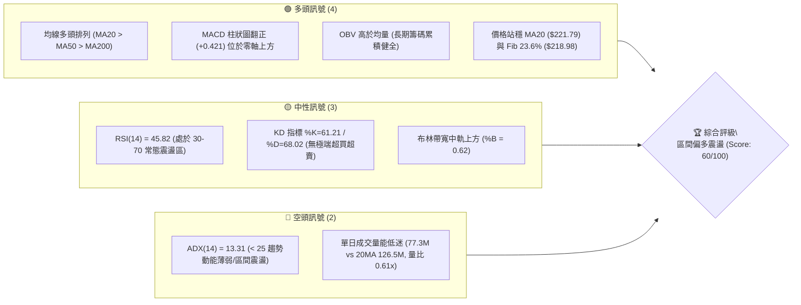
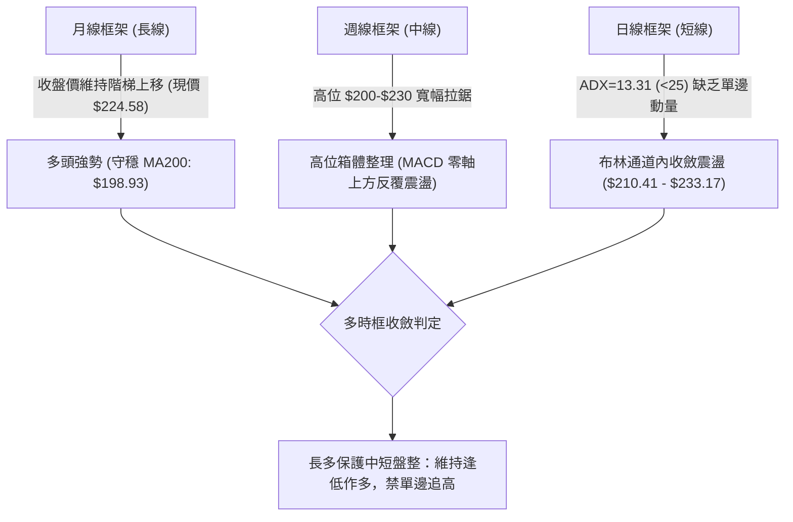
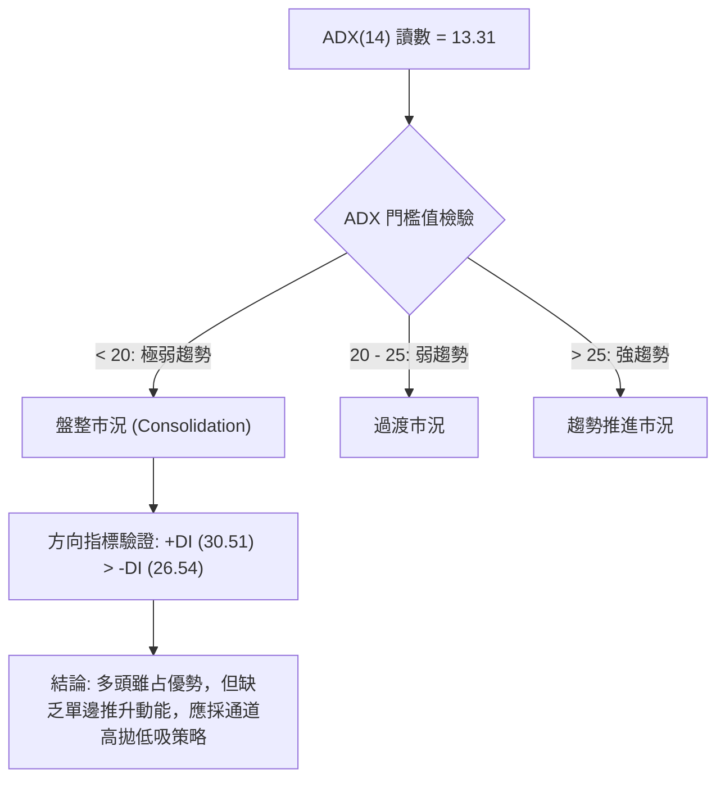
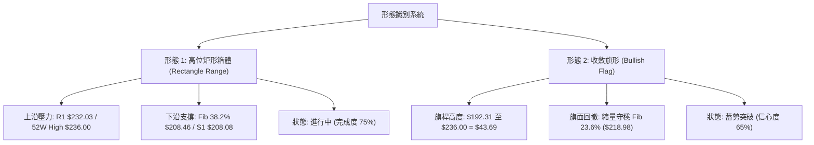
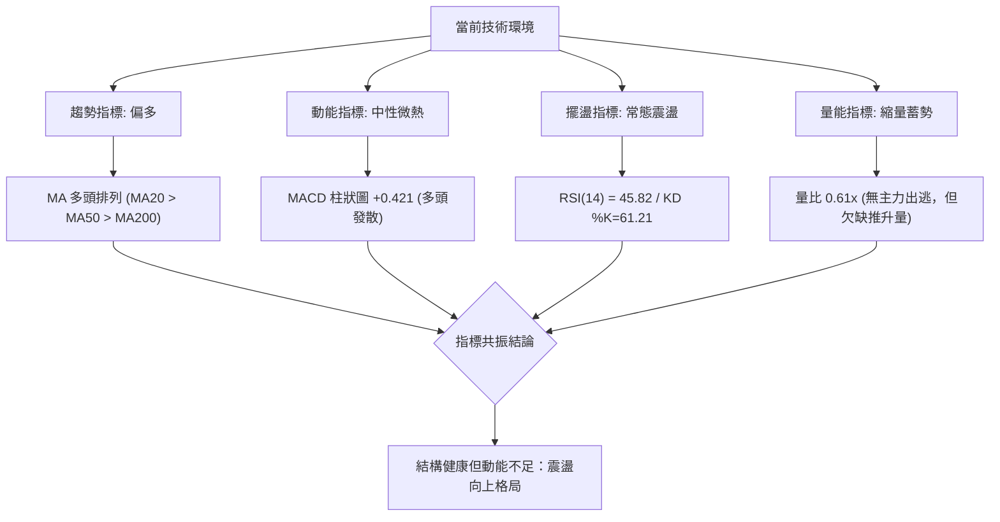
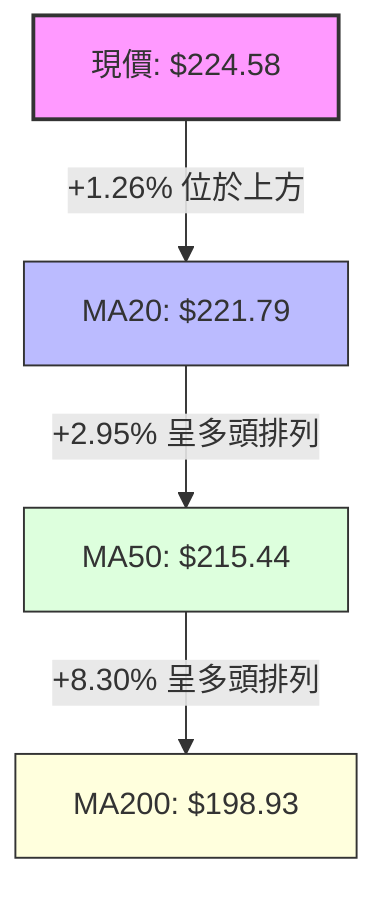
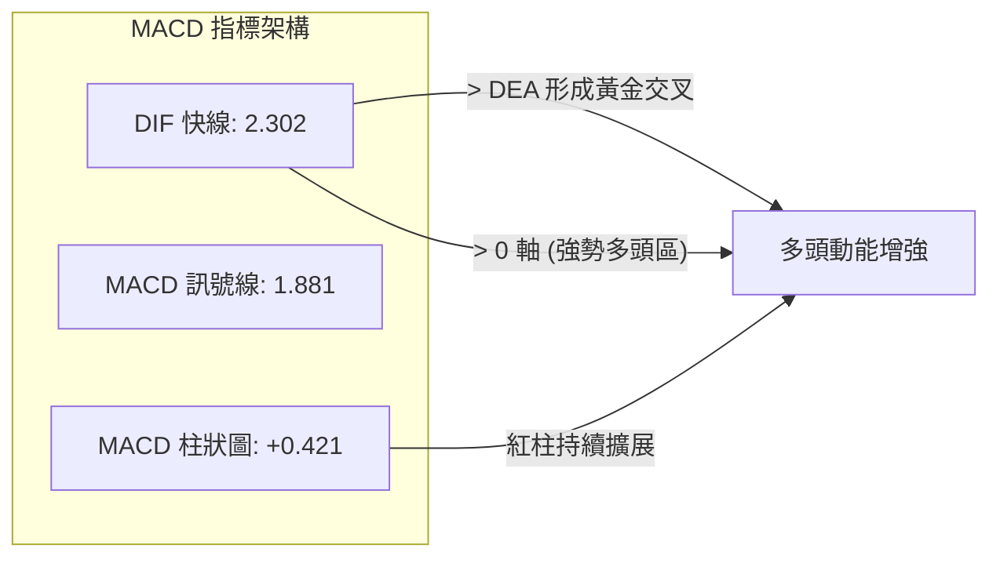
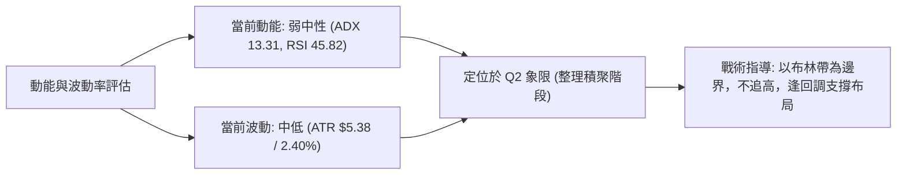
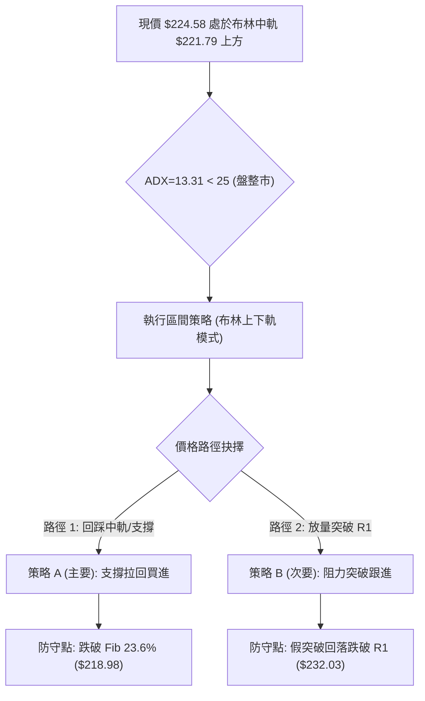
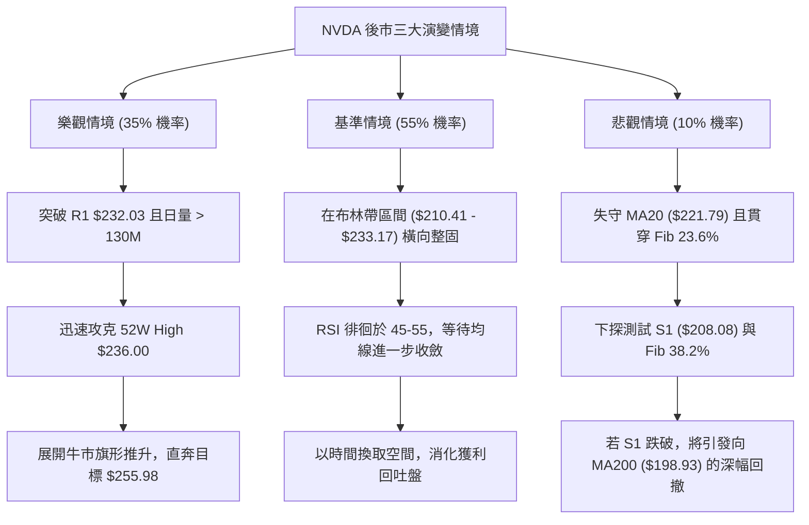

# NVDA 技術分析報告

> **報告日期**：2026-09-25 ｜ **語言**：繁體中文 ｜ **數據來源**：Yahoo Finance ｜ **當前價格**：$224.58

---

## 目錄

| 章節 | 內容 |
|------|------|
| [1. 技術面概覽](#1-技術面概覽) | 訊號儀表板、核心指標、評分卡 |
| [2. 趨勢分析](#2-趨勢分析) | 多時框趨勢、長中短期走勢、12個月走勢圖 |
| [3. 圖表形態分析](#3-圖表形態分析) | 形態識別、K線組合、形態信心度評估 |
| [4. 支撐與阻力](#4-支撐與阻力) | 關鍵價位、斐波那契回調結構 |
| [5. 技術指標深度解讀](#5-技術指標深度解讀) | MA/RSI/MACD/布林通道/量能分析 |
| [6. 動能與波動率](#6-動能與波動率) | 動能四象限、ATR、Beta 與市場關聯 |
| [7. 多時框架總結](#7-多時框架總結) | 時框架評分矩陣、收斂裁決結論 |
| [8. 交易策略建議](#8-交易策略建議) | 策略路由、價格階梯、主策略詳情 |
| [9. 風險提示與監控](#9-風險提示與監控) | 監控清單、風險情境、資金管理提醒 |

---

## 1. 技術面概覽

### 🎯 技術訊號儀表板



### 📊 核心指標速覽表

| 指標類別 | 指標名稱 | 當前數值 | 訊號 | 解讀 |
|:---|:---|:---|:---:|:---|
| **價格** | 當前價格 | $224.58 | 🟢 | 位於 52 週區間 84.2% 高位，結構維持中長期強勢 |
| **均線** | MA20 | $221.79 | 🟢 | 現價高於 20 日線 +1.26%，短期多頭防守線穩固 |
| **均線** | MA50 | $215.44 | 🟢 | 現價高於 50 日線 +4.24%，中期生命線向上發散 |
| **均線** | MA200 | $198.93 | 🟢 | 現價高於 200 日線 +12.89%，長期牛市基石未受破壞 |
| **動能** | RSI(14) | 45.82 | 🟡 | 位於中性常規區，無極端超買或超賣，無背離現象 |
| **動能** | MACD (12,26,9) | 2.302 (Hist: +0.421) | 🟢 | 快慢線均在零軸之上，紅柱持續放大，短多動能回升 |
| **動能** | Stoch %K / %D | 61.21 / 68.02 | 🟡 | 短期高檔收斂，未見超買鈍化，呈現良性整理 |
| **趨勢** | ADX(14) | 13.31 (+DI: 30.51) | 🔴 | ADX 低於 25，表明缺乏單邊趨勢，盤面由區間震盪主導 |
| **通道** | 布林通道 %B | 0.62 | 🟡 | 位於中軌 $221.79 與上軌 $233.17 之間偏多區域 |
| **波動** | ATR(14) | $5.38 (2.40%) | 🟡 | 波動率處於中等水平，單日平均安全防守距離約 $5.4 |
| **量能** | 當前量 / 20日均量 | 77.3M / 126.5M | 🔴 | 量比僅 0.61x，追價意願謹慎，上攻需補量驗證 |

### 🏆 技術評分卡

```
╔══════════════════════════════════════════════════════════════════════╗
║                   技術評分卡 — NVDA (2026-09-25)                     ║
╠══════════════════════════════════════════════════════════════════════╣
║ 趨勢強度 (ADX/方向)   ████░░░░░░░░░░░░░░░░  25/100 🔴 弱趨勢/低動量    ║
║ 動能指標 (RSI/MACD)   ████████████░░░░░░░░  60/100 🟡 中性略偏多      ║
║ 支撐穩定度 (層級測試) ████████████████░░░░  80/100 🟢 S1/S2支撐結構強 ║
║ 成交量配合 (量價/OBV) ██████████░░░░░░░░░░  50/100 🟡 OBV多但量縮     ║
║ 形態完整度 (箱體整理) ████████████░░░░░░░░  60/100 🟡 高位區間震盪    ║
║ 均線排列 (多頭發散)   ██████████████████░░  90/100 🟢 完整多頭排列    ║
╠══════════════════════════════════════════════════════════════════════╣
║ 綜合技術評分          ████████████░░░░░░░░  60/100 🟢 區間震盪偏多    ║
╚══════════════════════════════════════════════════════════════════════╝
```

---

## 2. 趨勢分析

### 🌐 多時框趨勢分析



### 📈 長期趨勢 — 12個月走勢圖（Unicode）

以下展示過去 12 個月（2025-10 至 2026-09）的月線收盤價走勢路徑：

```
NVDA 月線走勢圖（2025-10 至 2026-09）
價格軸 ($)
$230 ┤                                                 ● $230.10 (09/06週高)
$225 ┤                                             ●   │  ● $224.58 (現價)
$220 ┤                                             │   │  │
$210 ┤                                     ● $210.66   │  │
$200 ┤ ● $202.01                           │       │   ● $199.87
$190 ┤ │           ● $186.06   ● $190.68   ● $199.11
$180 ┤ │   ● $176.58   │       │
$170 ┤ └───┴───────┴───┴───────● $174.00 (波段低點)
     └──────────────────────────────────────────────────────────────
       10  11      12  01      02  03      04  05  06  07  08 09 (月份)
      (2025)                  (2026)
```

#### 走勢特徵分析表格

| 階段區間 | 時間跨度 | 起訖價位 | 漲跌幅 | 技術特徵與型態結構解讀 |
|:---|:---:|:---:|:---:|:---|
| **第一階段：高檔回踩** | 2025-10 ～ 2025-11 | $202.01 → $176.58 | -12.59% | 自前波高位拉回修正，釋放獲利盤籌碼。 |
| **第二階段：震盪築底** | 2025-12 ～ 2026-03 | $186.06 → $174.00 | -6.48% | 在 $174.00 形成波段次低防守點，成交量逐步沉澱。 |
| **第三階段：主升推升** | 2026-04 ～ 2026-05 | $199.11 → $210.66 | +5.80% | 帶量突破 $200 整數心理關口，MA50 開始由平翻揚。 |
| **第四階段：強勢洗盤** | 2026-06 ～ 2026-07 | $199.87 → $200.53 | +0.33% | 週線連續在 $192.31-$210.72 區間劇烈洗盤，清洗浮額。 |
| **第五階段：再創新高** | 2026-08 ～ 2026-09 | $220.53 → $224.58 | +1.84% | 觸及 52 週最高點 $236.00 後小幅回落，維持高位震盪。 |

### 📊 中期趨勢（週線分析）

從近 20 週收盤軌跡觀察，股價經歷了三波推升與拉回：
1. **回撤測試支撐**：2026-06-28 創下週收盤低點 $192.31（跌破 Fib 61.8% $191.44 後快速收腳）。
2. **反彈創高**：2026-08-16 衝至 $224.91（週 RSI 達 75.4 極度過熱），隨後 2026-09-06 再創波段週收盤高點 $230.10。
3. **高位平台整固**：近兩週（09-13 至 09-27）週收盤價由 $218.29 回升至 $224.58，成交量能顯著縮減至 372.4M，表明並未出現機構拋售潮，而是典型的高檔量縮平台整固。

```
近期週線壓力與支撐示意圖：
[壓力區] 52W High $236.00 ════════════════════════════════════════
         近一年阻力 R1    $232.03 ────────────────────────────
[現  價] 現價收盤        $224.58 ◄◄◄ 目前位於高檔箱體中偏上
         布林帶中軌/MA20  $221.79 ┄┄┄┄┄┄┄┄┄┄┄┄┄┄┄┄┄┄┄┄┄┄┄┄
         Fib 23.6% 回調   $218.98 ┄┄┄┄┄┄┄┄┄┄┄┄┄┄┄┄┄┄┄┄┄┄┄┄
[支撐區] 近一年波段支撐S1 $208.08 ════════════════════════════════
```

### ⚡ 趨勢強度評估（ADX 解讀）



#### ADX 趨勢強度等級對照表

| ADX 區間 | 趨勢狀態 | NVDA 當前狀態 | 交易策略指導 |
|:---:|:---:|:---:|:---|
| **0 ～ 20** | **缺乏趨勢 / 窄幅盤整** | **13.31 (目前所屬)** | **以布林通道與支撐阻力為界，區間操作；嚴禁追漲殺跌** |
| 20 ～ 25 | 趨勢萌芽 / 方向未明 | — | 觀察 +DI 與 -DI 交叉，準備順勢突破單 |
| 25 ～ 40 | 穩健單邊趨勢 | — | 依據移動平均線（MA20/MA50）進行拉回買進 |
| 40 ～ 60 | 強烈單邊趨勢 | — | 緊抱持倉，設定追蹤止損 |

---

## 3. 圖表形態分析

### 🔍 形態識別系統

在多時框與歷史日線聚合數據中，當前走勢呈現兩個核心幾何特徵：高位矩形箱體整理與收斂三角形整理。



#### 形態識別信心度評估表

| 形態名稱 | 信心度 | 判斷依據（引用數據） | 完成度 | 目標價計算式與精確目標 |
|:---|:---:|:---|:---:|:---|
| **高位矩形整理** | **78%** | 價格在 R1 $232.03 與 S1 $208.08 之間震盪超過 8 週；ADX=13.31 確認無單邊趨勢。 | 75% | 箱體突破目標 = 突破點 R1 ($232.03) + 箱高 ($232.03 - $208.08 = $23.95) = **$255.98** |
| **牛市旗形 (週線)** | **65%** | 2026-06 底自 $192.31 飆升至 $236.00 後縮量回調；量比降至 0.61x，符合典型旗面特徵。 | 60% | 旗桿等長測幅 = 突破點 $232.03 + 旗桿高度 ($236.00 - $192.31 = $43.69) = **$275.72** |
| **雙底形態 (中期)** | **42%** | *數據不足以確認完整雙底*（僅見 2026-03 低點 $174.00 與 2026-06 低點 $192.31，低點落差過大）。 | 30% | **訊號不足，僅做指標型解讀**（不納入主策略交易依據） |

### 🕯️ 重要K線形態分析

| 週期/月份 | 收盤價 | K線形態特徵 | 技術解讀 | 多空訊號 |
|:---:|:---:|:---|:---|:---:|
| 2026-08-16 週 | $224.91 | **高檔長上影十字星** | 衝擊 52 週高點 $236.00 未果，週 RSI 衝高至 75.4，顯示多頭短線耗竭。 | 🔴 警示回調 |
| 2026-08-23 週 | $214.48 | **實體陰線回踩** | 主動回踩消化獲利籌碼，最低下探 Fib 23.6% ($218.98) 附近，量能開始萎縮。 | 🟡 整理過渡 |
| 2026-09-06 週 | $230.10 | **反包陽線 (吞噬)** | 多頭再度發力重返 $230 之上，MACD 柱狀圖由負轉正 (+0.835)，重拾控盤。 | 🟢 多頭表態 |
| 2026-09-20 週 | $222.27 | **下影探底錘頭線** | 測試 MA20 ($221.79) 支撐迅速回升，確立中軌支撐有效性。 | 🟢 支撐確立 |
| 2026-09-27 即時 | $224.58 | **縮量小陽星線** | 價格收於均線簇上方，量能極度萎縮（372.4M），屬於典型突破前窒息量。 | 🟢 變盤在即 |

### 📉 ASCII 走勢形態示意圖

```
NVDA 日線布林通道與箱體震盪形態示意圖
═══════════════════════════════════════════════════════════════════
$236.00 ┤                     ▲ 52W High ($236.00)
$233.17 ┼ - - - - - - - - - - ╭──────────────╮ - - - - 布林上軌 ($233.17)
$232.03 ┤                    ┌┴──────────────┴┐       阻力位 R1 ($232.03)
        │                   ┌┘                └┐
$224.58 ┤                   │    ● 現價 ($224.58)│
$221.79 ┼ ──────────────────┼──────────────────┼────── 布林中軌/MA20 ($221.79)
$218.98 ┤                   │                  │      Fib 23.6% ($218.98)
$210.41 ┼ - - - - - - - - - - ╰────────────────╯ - - - - 布林下軌 ($210.41)
$208.08 ┤════════════════════════════════════════════ 關鍵支撐 S1 ($208.08)
═══════════════════════════════════════════════════════════════════
```

### 🎯 形態目標價計算

根據「高位矩形整理形態」技術測幅原則：
1. **箱頂頸線**：採用近一年波段高點聚類阻力位 $R1 = \$232.03$。
2. **箱底支撐**：採用近一年波段低點聚類支撐位 $S1 = \$208.08$。
3. **形態垂直高度 ($H$)**：
   $$H = R1 - S1 = \$232.03 - \$208.08 = \$23.95$$
4. **最小量度目標價 ($T1$)**：
   $$T1 = R1 + H = \$232.03 + \$23.95 = \$255.98$$
5. **第二量度目標價 ($T2$)**（若疊加牛市旗桿測幅）：
   $$T2 = \$275.72 \quad \text{（依據前述旗桿長度 \$43.69 推算）}$$

---

## 4. 支撐與阻力

### 🗺️ 關鍵價位分布圖（Unicode）

```
NVDA 價位結構分布圖（OHLCV 與斐波那契精確對照）
═══════════════════════════════════════════════════════════════════
$236.00 ║██████████████████████████████║ 52W High / Fib 0.0%
$233.17 ║▓▓▓▓▓▓▓▓▓▓▓▓▓▓▓▓▓▓▓▓▓▓▓▓      ║ 布林上軌壓制
$232.03 ║██████████████████████████    ║ 關鍵波段阻力 R1 (+3.32%)
────────╫──────────────────────────────╫────────────────────────────
$224.58 ╠══════════════════════════════╣ ◄ 現價 ($224.58)
────────╫──────────────────────────────╫────────────────────────────
$221.79 ║░░░░░░░░░░░░░░░░░░░░          ║ MA20 / 布林中軌動態支撐
$218.98 ║▓▓▓▓▓▓▓▓▓▓▓▓▓▓▓▓▓▓            ║ Fib 23.6% 回調關鍵支撐
$215.44 ║░░░░░░░░░░░░░░                ║ MA50 中期趨勢線
$210.41 ║▓▓▓▓▓▓▓▓▓▓▓▓                  ║ 布林下軌防守位
$208.46 ║████████████████████          ║ Fib 38.2% 回調支撐
$208.08 ║██████████████████████████████║ 關鍵波段支撐 S1 (-7.35%)
$199.95 ║██████████████████            ║ Fib 50.0% 多空分水嶺
$198.93 ║░░░░░░░░░░░░░░░░░░░░░░░░░░░░░░║ MA200 牛熊分界線
$198.43 ║████████████████████████      ║ 強支撐 S2 (-11.64%)
$194.30 ║████████████████              ║ 深化支撐 S3 (-13.48%)
$163.90 ║██████████████████████████████║ 52W Low / Fib 100.0%
═══════════════════════════════════════════════════════════════════
```

### 🚧 阻力位分析表

所有阻力數據嚴格源自系統給出之聚類分析計算結果：

| 阻力級別 | 精確價位 | 距現價幅標 | 形成原因 | 突破難度 | 技術重要性 |
|:---|:---:|:---:|:---|:---:|:---|
| **動態阻力** | **$233.17** | +3.83% | 日線布林通道上軌，衡量短期標準差邊界 | 🟡 中等 | 短線震盪高拋參考點 |
| **R1 (波段阻力)** | **$232.03** | +3.32% | 近一年波段高點成交聚類區，密集套牢與解套盤籌碼峰 | 🔴 較高 | 日線級別形態突破分水嶺 |
| **極端阻力** | **$236.00** | +5.09% | 52 週歷史天花板（Fib 0.0%），歷史獲利了結心理大關 | 🔴 極高 | 需 1.5 倍以上均量方可實質站穩 |

### 🛡️ 支撐位分析表

所有支撐數據嚴格引用系統聚類結果：

| 支撐級別 | 精確價位 | 距現價幅標 | 形成原因 | 守住機率 | 技術重要性 |
|:---|:---:|:---:|:---|:---:|:---|
| **短期支撐** | **$221.79** | -1.24% | MA20 均線暨日線布林帶中軌 | 75% | 短線多頭防線，跌破轉為偏弱震盪 |
| **回調支撐** | **$218.98** | -2.49% | 52 週區間 Fib 23.6% 回調位 | 70% | 強勢回踩極限位，短線買盤承接點 |
| **S1 (關鍵支撐)** | **$208.08** | -7.35% | 近一年波段低點聚類區，緊鄰 Fib 38.2% ($208.46) | 85% | 中期上升趨勢多頭防線，不可失守 |
| **S2 (強支撐)** | **$198.43** | -11.64% | 波段深幅回撤低點聚類，與 MA200 ($198.93) 高度共振 | 90% | 長期牛市底線，跌破宣告長線轉空 |
| **S3 (極限支撐)** | **$194.30** | -13.48% | 2026-06 底部盤整區密集成交帶 | 95% | 極端黑天鵝防守線 |

### 📐 斐波那契回調位分析

基準計算區間為 52 週極值：**$163.90（最低） $\rightarrow$ $236.00（最高）**，垂直跨度 $\Delta P = \$72.10$。

```
斐波那契回調結構與現價定位：
0.0%  (52W High)  $236.00 ─────────────────────────────────────
                          ▲ 距離上方 0.0% 僅差 $11.42 (+5.09%)
[現價定位點]      $224.58 ◄ 現價位於 0.0% 與 23.6% 之間 (超強勢區間)
23.6%             $218.98 ─────────────────────────────────────
                          ▼ 距離下方 23.6% 防守點 $5.60 (-2.49%)
38.2%             $208.46 ───────────────────────────────────── (與 S1 $208.08 高度重合)
50.0%             $199.95 ───────────────────────────────────── (與 MA200 $198.93 重合)
61.8%             $191.44 ───────────────────────────────────── (黃金分割強支撐)
78.6%             $179.33 ─────────────────────────────────────
100.0%(52W Low)   $163.90 ─────────────────────────────────────
```

**技術解讀**：
1. 現價 $224.58 處於斐波那契 **0.0% ($236.00)** 與 **23.6% ($218.98)** 的「第一回調強勢區間」。在技術分析理論中，當資產價格在創高後僅回撤至 23.6% 內並維持橫盤，代表市場主動性拋壓極輕，為典型強勢整理特徵。
2. **共振驗證**：Fib 38.2% ($208.46) 與波段支撐 S1 ($208.08) 相差僅 $0.38，形成極強的「價位共振支撐帶」；Fib 50.0% ($199.95) 則與 200 日均線 ($198.93) 及 S2 ($198.43) 重合，構成中長期的鐵底屏障。

---

## 5. 技術指標深度解讀

### 🎛️ 指標訊號總覽



### 📈 移動平均線排列分析



#### 均線多空排列矩陣

| 均線名稱 | 當前價位 | 價格相對位置 | 斜率與趨勢狀態 | 技術意義評定 |
|:---:|:---:|:---:|:---:|:---|
| **MA 5** | **$225.72** | 現價略低 -0.51% | 微幅向下 (短期壓制) | 極短線面臨 5 日線壓制，需一根小陽線收復 |
| **MA 10** | **$220.33** | 現價高於 +1.93% | 向上發散 (+4.25) | 短線回調首道防線 |
| **MA 20** | **$221.79** | 現價高於 +1.26% | 向上發散 (+2.79) | 月線生命線，中短線分水嶺 |
| **MA 50** | **$215.44** | 現價高於 +4.24% | 向上發散 (+5.27%) | 季線強支撐，波段操作基準 |
| **MA 60** | **$213.34** | 現價高於 +5.27% | 持續走多 | 中期多頭保護層 |
| **MA 120** | **$209.75** | 現價高於 +7.07% | 穩定上揚 | 半年線防守 |
| **MA 200** | **$198.93** | 現價高於 +12.89% | 長期多頭排列 | 年線多頭大本營，牛市標誌 |
| **MA 240** | **$196.92** | 現價高於 +14.05% | 長期斜率向上 | 超長期資產配置底線 |

*排列結論*：當前各級均線完整呈現：`MA5 > MA20 > MA50 > MA60 > MA120 > MA200 > MA240`，此為教科書級別的「多頭順向排列」。

### 📉 RSI(14) 分析

*   **當前數值**：**45.82**
*   **強度進度條**：`█████████░░░░░░░░░░░  45.82%` （位於 30～70 中性平衡區間）
*   **超買/超賣檢驗**：遠離 70 超買界限（前次過熱在 2026-08-16 達 75.4 已完全消化完畢），亦高於 30 超賣界限。
*   **背離分析（Divergence）**：
    *   *頂背離檢定*：2026-09-06 週線收盤創下波段高點 $230.10 時，RSI 讀數為 53.7（未跌破前低），當前價格小幅回調至 $224.58，RSI 溫和收斂至 45.82，線圖未出現「價格創新高而 RSI 創次低」之頂背離。
    *   *底背離檢定*：近期回踩低點均守在 $218 之上，無價格破底背離狀況。
    *   *背離結論*：**明確判定無頂背離與底背離**，動能與價格變動節奏相稱。

### 📊 MACD(12,26,9) 訊號解讀



*   **數據解讀**：DIF快線 (2.302) 明確高於訊號線 (1.881)，柱狀圖差值為 **+0.421**。
*   **動態演變**：回溯 2026-09-20 週線時 MACD 柱狀圖仍為負值 (-0.705)，本週翻正至 +0.421，顯示日線級別發動了金叉翻紅訊號，空頭壓制力道解除，短線動能指標全面重回多方陣營。

### 📦 布林通道分析

```
NVDA 布林通道 (20, 2) 結構圖
═════════════════════════════════════════════════════════════════════
$233.17 ── 布林上軌 (Upper Band)   ─ ─ ─ ─ ─ ─ ─ ─ ─ ─ ─ ─ ─ ─ ─ ─ 
                                       ▲ 距離上軌 +3.83%
$224.58 ── 當前價格 (Close)        ═══════════════════════════ (現價)
                                       ▼ 距離中軌 -1.24%
$221.79 ── 布林中軌 (Middle Band)  ─ ─ ─ ─ ─ ─ ─ ─ ─ ─ ─ ─ ─ ─ ─ ─ 
                                       ▼ 距離下軌 -6.31%
$210.41 ── 布林下軌 (Lower Band)   ─ ─ ─ ─ ─ ─ ─ ─ ─ ─ ─ ─ ─ ─ ─ ─ 
═════════════════════════════════════════════════════════════════════
當前指標：%B = 0.62 ｜ 帶寬帶動：縮口收斂 ｜ 波動位置：中軌上方偏多區
```

*   **通道行為**：通道呈現橫向收口狀態（帶寬約 $22.76），反映 ADX=13.31 的低波動盤整期。
*   **%B 解讀**：%B 讀數為 **0.62**，精確落於 0.50（中軌）與 1.00（上軌）之間，確立價格處於多頭控盤的強勢半區，且未觸及上軌超買邊界，具備向上測試空間。

### 💹 成交量分析（量價配合度）

1.  **量能指標數據**：
    *   最新單日成交量：**77,305,200 股**
    *   20 日平均成交量：**126,507,375 股**
    *   成交量比（Volume Ratio）：**0.61x**（顯著量縮）
2.  **量價配合狀態**：
    *   當前呈現「價穩量縮」格局。在技術分析中，上升趨勢中的量縮拉回屬於健康籌碼沉澱，並非資金恐慌出逃。
    *   **OBV 趨勢檢驗**：指標明確顯示 `OBV > MA`。OBV 能量潮持續攀升於其均線上方，表明自 2026 年初以來進駐的機構主力籌碼未見鬆動，量能基礎在中長線上支撐價格續漲。
    *   **量價矛盾警示**：若後續突破 R1 ($232.03) 時日成交量無法放大至 120M（回到 20MA）以上，則容易出現假突破；反之，若在量縮下維持於中軌上方，則屬於低風險吸籌期。

---

## 6. 動能與波動率

### ⚡ 動能評估四象限

| 象限代號 | 動能維度 (Momentum) | 波動維度 (Volatility) | NVDA 匹配狀態 | 策略指導含義 |
|:---:|:---:|:---:|:---:|:---|
| **Q1** | 強動能 (ADX>25, RSI>60) | 低波動 (ATR%<2.0%) | — | 絕佳單邊主升段（積極追漲加碼） |
| **Q2** | **弱動能 (ADX=13.31)** | **中低波動 (ATR%=2.4%)** | **✓ (當前處於此象限)** | **區間震盪蓄勢期（高拋低吸，嚴設止損）** |
| **Q3** | 強動能 (Trend Active) | 高波動 (ATR%>4.0%) | — | 高風險牛市末段/急拉爆發期 |
| **Q4** | 弱動能 (No Direction) | 高波動 (ATR%>4.0%) | — | 無序洗盤混亂期（觀望避免交易） |



### 📊 ATR 波動率分析

*   **ATR(14) 讀數**：**$5.38**（佔當前股價之 **2.40%**）。
*   **動態止損距離設定建議**：
    *   *超短線日內交易*：1.0 倍 ATR = **$5.38**
    *   *短線波段操作*：1.5 倍 ATR = $1.5 \times \$5.38 = \mathbf{\$8.07}$（自進場價下浮，恰好可涵蓋至 Fib 23.6% $218.98）
    *   *中期趨勢保護*：2.0 倍 ATR = $2.0 \times \$5.38 = \mathbf{\$10.76}$（自現價下移至 $213.82，守護 MA50 關鍵線）

### 📐 Beta 與市場相關性

*   **Beta 係數**：**2.217**。
*   **特性分析**：Beta 高達 2.217 表明 NVDA 具備極強的市場進攻屬性。在大盤（標普500/那斯達克）波動時，該股平均呈現大盤 2.2 倍的振幅。
*   **操作意涵**：在目前 ADX=13.31 的低波動收斂期，2.217 的高 Beta 預示著一旦大盤出現方向性表態或通道破位，NVDA 將爆發大幅度跳空或長實體 K 線，因此突破發生時的跟進勝率將顯著提高。

---

## 7. 多時框架總結

### 📋 時框架評分表

| 時框架 | 趨勢方向 | 核心動能指標 | 均線排列特徵 | 形態/通道特徵 | 綜合評分 | 操作建議 |
|:---:|:---:|:---:|:---:|:---:|:---:|:---|
| **長期 (月線)** | 🟢 多頭強勢 | 收盤價連月走高，支撐不斷上移 | MA200 ($198.93) 向上奔馳 | 維持 52 週上升大通道 | **85 / 100** | 長線多單底倉堅定持有 |
| **中期 (週線)** | 🟢 震盪偏多 | 週 MACD 零軸之上，RSI=45.8 | MA20 > MA50 > MA200 | 高檔箱體整固 ($208-$236) | **70 / 100** | 逢拉回支撐位分批加碼 |
| **短期 (日線)** | 🟡 橫向盤整 | ADX=13.31 (極弱)，量比 0.61x | MA5 略有壓制，MA20 中軌防守 | 布林通道中軌上方震盪 | **55 / 100** | 區間震盪交易，等待突破 |

### 🔲 綜合訊號矩陣

```
時框架訊號對齊檢查：
───────────────────────────────────────────────────────────
維度          短期 (日線)      中期 (週線)      長期 (月線)
───────────────────────────────────────────────────────────
趨勢排列      🟢 偏多          🟢 多頭          🟢 強多
動能指標      🟡 震盪          🟢 翻紅          🟢 多頭主導
量能配合      🔴 縮量          🟡 沉澱          🟢 OBV創高
型態位置      🟡 通道中軌      🟡 高位箱體      🟢 牛市延伸
───────────────────────────────────────────────────────────
一致性評定    一致性良好：中長線多頭趨勢完好，短線進入收斂沉澱期
───────────────────────────────────────────────────────────
```

### ⚖️ 多時框收斂結論

**嚴格依據規則 14 進行收斂裁決**：
1. **行情性質判定**：當前日線 ADX(14) 讀數為 **13.31**，明確小於 25 臨界線，技術定義判定為**「盤整行情（Consolidation Market）」**。
2. **交易主導原則**：在盤整行情中，不可採用單邊追突破策略，必須**以日線布林通道上下軌（$210.41 ～ $233.17）與近一年波段關鍵價位（S1 $208.08 ～ R1 $232.03）作為主要交易區間**。
3. **時框優先級衝突取捨**：雖然日線成交量萎縮且短期面臨 MA5 壓制，但中長期均線（MA50 $215.44、MA200 $198.93）保持強大多頭支撐，且月線級別多頭排列完美。因此，依規則收斂為**「多頭保護下的區間操作」**。
4. **唯一方向性結論**：**【中性偏多（區間震盪操作）】**。

---

## 8. 交易策略建議

### 🗺️ 策略決策流程圖



### 🧭 策略路由（依評分卡分流）

*   **當前技術綜合評分**：**60 / 100**。
*   **主策略方向判定**：**【區間操作偏多，以布林通道上下軌與 Fib 回調為核心，等待突破確認】**。
*   **交易執行紀律**：基於 60 分中性偏多門檻，主推多頭方向的拉回布局與突破確認；空頭方向僅作為反向風控與防守停損觸發點，嚴禁盲目摸頂做空。

### 🎯 價格情境階梯（Price Scenarios）

所有觸發價位嚴格引用系統計算之精確價位：

| 觸發條件 | 下一目標 | 後續延伸 | 情境含義與操作對策 |
|:---|:---:|:---:|:---|
| **放量突破 R1 $232.03** | 布林上軌 **$233.17** | 52W High **$236.00** / 測幅 **$255.98** | 短線轉強，盤整結束並啟動新一輪波段主升；立即跟進多單。 |
| **站穩現價區間 ($221.79-$225)** | 測試 R1 **$232.03** | — | 區間良性震盪，持股續抱，以布林中軌為保護點。 |
| **回踩跌破 MA20 $221.79** | Fib 23.6% **$218.98** | MA50 **$215.44** | 短線轉弱進入深幅整理，於 $218.98 觀察二度止跌訊號。 |
| **失守關鍵支撐 S1 $208.08** | S2 **$198.43** | S3 **$194.30** | 中期結構破壞，高檔箱體瓦解，必須無條件執行停損離場。 |

### 📊 情境機率分佈

| 情境劃分 | 預估機率 | 主要技術指標支撐依據 |
|:---|:---:|:---|
| **情境一：高位區間震盪蓄勢** | **55%** | **ADX=13.31** 確立無趨勢狀態；成交量比僅 **0.61x**，量能不足以支撐連續單邊暴漲；布林通道水平收口。 |
| **情境二：向上突破創新高** | **35%** | 均線呈標準多頭排列（MA20>MA50>MA200）；**MACD 柱狀圖翻正至 +0.421**；長期 **OBV > MA** 顯示籌碼穩定鎖定。 |
| **情境三：向下破位回踩深支撐** | **10%** | RSI=45.82 位於安全區；距離關鍵支撐 S1 ($208.08) 具備 7.35% 的緩衝空間；下檔 MA50/MA200 支撐厚實。 |

### 🟢 主策略詳情

本策略組合嚴格依據區間震盪原則，給出兩種精確執行案（所有價位均來自關鍵價位清單與 ATR 計算）：

| 策略要素 | 策略 A（主要：拉回布林中軌支撐買進） | 策略 B（次要：右側放量突破阻力追買） |
|:---|:---|:---|
| **操作邏輯** | 趁 ADX 盤整期於布林中軌上方低吸，享受高盈虧比 | 等待日線實體帶量收復 R1，順勢介入主升浪 |
| **進場條件** | 股價回踩測試 MA20 與 Fib 23.6% 獲得支撐確認 | 日線收盤價突破 R1 $232.03 且成交量比 > 1.2x |
| **進場價格** | **$221.79**（精確對齊 MA20 / 布林中軌） | **$232.03**（精確對齊阻力 R1） |
| **止損價格** | **$216.41**（進場價下浮 1.0 倍 ATR $5.38） | **$226.65**（進場價下浮 1.0 倍 ATR $5.38） |
| **目標價 T1** | **$232.03**（阻力位 R1） | **$236.00**（52 週歷史高點 / Fib 0.0%） |
| **目標價 T2** | **$236.00**（52 週歷史高點） | **$255.98**（矩形形態量度目標價） |
| **風險報酬比** | **1.90 : 1**（目標T1計）／ **2.64 : 1**（目標T2計） | **0.74 : 1**（目標T1計）／ **4.45 : 1**（目標T2計） |
| **歷史勝率估計** | **65%**（符合箱體震盪支撐成功率） | **55%**（突破策略勝率較低但賠率高） |
| **建議配置倉位** | **15% ～ 20%** 總資金 | **10%** 總資金（確認突破後再加碼） |

*計算式驗證*：
*   策略 A 風險值：$\$221.79 - \$216.41 = \$5.38$。報酬值 T1：$\$232.03 - \$221.79 = \$10.24$。盈虧比 $= 10.24 / 5.38 = \mathbf{1.90}$。報酬值 T2：$\$236.00 - \$221.79 = \$14.21$。盈虧比 $= 14.21 / 5.38 = \mathbf{2.64}$。
*   策略 B 風險值：$\$232.03 - \$226.65 = \$5.38$。報酬值 T2：$\$255.98 - \$232.03 = \$23.95$。盈虧比 $= 23.95 / 5.38 = \mathbf{4.45}$。

### 🔴 反向風險觸發點（對沖提示）

若發生突發利空，以下價位與訊號為推翻多頭主策略的「一票否決」風控紅線：
1.  **第一警示線（短線轉空）**：日線收盤價跌破 **Fib 23.6% ($218.98)**，同時 MACD 柱狀圖由正轉負（跌破 0 軸），短線策略全面停損離場觀望。
2.  **全面撤退線（中期轉空）**：日線收盤價跌破 **關鍵支撐 S1 ($208.08)**，宣布箱體整理破位，多頭防線瓦解，投資人應出清所有波段多頭部位或建立反向空頭避險。

### ⭐ 整體訊號強度評星

```
做多訊號強度：★★★☆☆  (3.5/5星 — 均線與MACD翻多，唯欠缺爆發量能)
做空訊號強度：★☆☆☆☆  (1.0/5星 — 處於多頭排列與高檔支撐之上，無做空條件)
整體可信度：  ★★★★☆  (4.0/5星 — 價位聚類與斐波那契重合度極高)
```

---

## 9. 風險提示與監控

### ✅ 關鍵監控指標 Checklist

```
╔══════════════════════════════════════════════════════════════════════╗
║               NVDA 每日盤後關鍵技術指標監控清單 (Checklist)           ║
╠══════════════════════════════════════════════════════════════════════╣
║ [ ] 價格防守檢驗：收盤價是否持續站穩 MA20 ($221.79) 之上？            ║
║ [ ] 斐波那契防線：是否跌破強弱關鍵分水嶺 Fib 23.6% ($218.98)？       ║
║ [ ] 動能趨勢突破：ADX(14) 是否由 13.31 向上突破 20，確認趨勢啟動？   ║
║ [ ] MACD 柱狀延續：MACD Histogram 是否保持正值 (+0.421 以上擴張)？   ║
║ [ ] 量能恢復檢驗：突破 R1 ($232.03) 時成交量是否大於 126.5M (20MA)？ ║
║ [ ] 布林通道擴張：%B 是否突破 0.80 且上軌 ($233.17) 開口向上發散？   ║
║ [ ] 終極破位警報：波段支撐 S1 ($208.08) 是否完好無損？               ║
╚══════════════════════════════════════════════════════════════════════╝
```

### ⚠️ 風險場景分析



### 🛡️ 風險管理重要提醒

1.  **高 Beta 特性之部位縮減原則**：
    NVDA Beta 達 **2.217**，波動劇烈程度為一般大型科技股的兩倍以上。在 ADX=13.31 的收斂盤整期，應嚴格將單一個股風險曝險金額控制在投資組合總資產的 **1.5% ～ 2.0%** 以內。若單筆停損距離設定為 1.0 倍 ATR ($5.38，約 2.4%)，總持倉部位不宜超過總資金之 **20%**。
2.  **避免量縮鈍化陷阱**：
    目前量比僅 0.61x，盤中極易因少數大額委託單造成局部跳空或影線震盪。切忌在盤中看到急拉便以市價追單，應一律採用限價單（Limit Order）並嚴格遵循「支撐位掛單買進、阻力位減碼收割」之紀律。
3.  **多時框共振出場所需**：
    當且僅當日線級別收盤價跌破止損點時執行停損；若盤中短暫跌破但尾盤收回，則視為有效支撐假跌破，避免遭主力主力洗盤震盪出局。

---

## 📋 報告總結

```
╔══════════════════════════════════════════════════════════════════════╗
║                    NVDA 技術分析報告總結儀表板                       ║
╠══════════════════════════════════════════════════════════════════════╣
║ 報告日期：2026-09-25                                                 ║
║ 當前價格：$224.58 (處於 52 週高低點之 84.2% 位置)                    ║
║ 分析評級：⚖️ 區間震盪偏多 (Score: 60/100) — ADX 弱趨勢/中長多頭完好  ║
║                                                                      ║
║ 核心多空維度解讀：                                                   ║
║ ├─ 長期趨勢：🟢 強烈多頭 (MA200 = $198.93 持續向上發散，OBV健康)     ║
║ ├─ 中期趨勢：🟢 震盪走高 (守穩 Fib 23.6% $218.98，高檔箱體整固)      ║
║ ├─ 短期趨勢：🟡 橫向盤整 (ADX=13.31，量縮震盪，等待布林帶突破)       ║
║ ├─ 關鍵阻力：R1 = $232.03 ｜ 52W High = $236.00                      ║
║ ├─ 關鍵支撐：S1 = $208.08 ｜ MA20 = $221.79 ｜ Fib 23.6% = $218.98   ║
║ └─ 分析師目標共識：均價 $327.70 (59 位分析師評級為 Strong Buy)       ║
║                                                                      ║
║ 最優策略執行階梯：                                                   ║
║ 1. 🥇 最佳機會 (策略 A)：回踩 MA20 $221.79 進場，止損 $216.41，      ║
║                          目標 T1 $232.03，盈虧比 1.90 : 1            ║
║ 2. 🥈 次選機會 (策略 B)：右側突破 R1 $232.03 追買，止損 $226.65，     ║
║                          目標 T2 $255.98，盈虧比 4.45 : 1            ║
║ 3. 🥉 保守選擇：維持 10%-15% 低持倉，靜待日線實體站穩 $232 再行動    ║
╚══════════════════════════════════════════════════════════════════════╝
```

---

> ⚠️ **免責聲明**：本報告為依據量化技術指標與圖表幾何結構所撰寫之專業技術分析研究，所有數據、價位計算及走勢評估均基於所提供之歷史交易資訊。本報告**僅供學術研究與投資決策參考**，**不構成任何形式的證券買賣邀約或實質投資建議**。市場具有高度不確定性，金融交易存在本金虧損風險，投資人應獨立評估自身風險承受能力並恪守風控紀律。

---

*報告生成時間：2026-09-25 ｜ 數據來源：Yahoo Finance ｜ 分析框架：多時框技術分析體系*