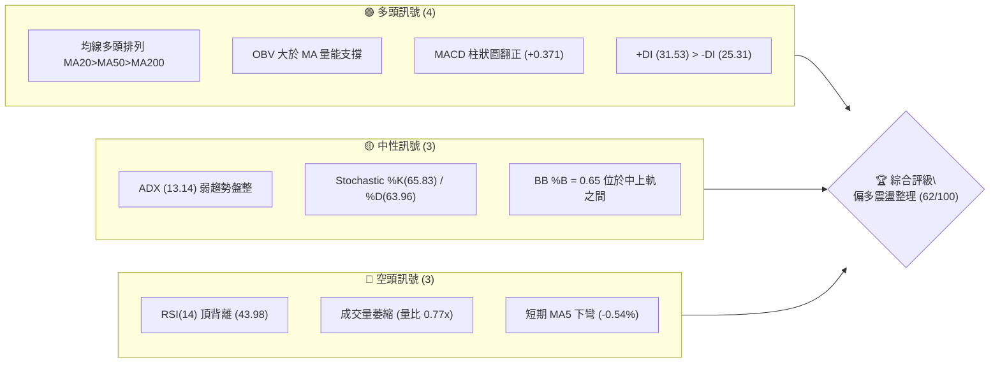
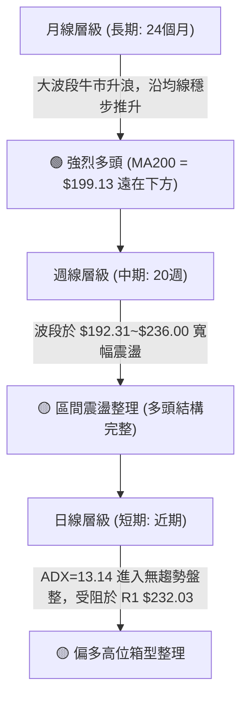
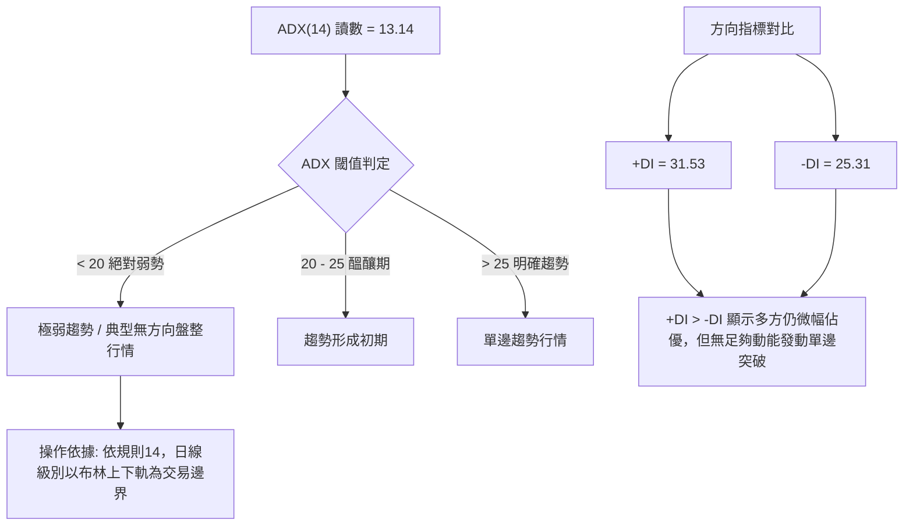
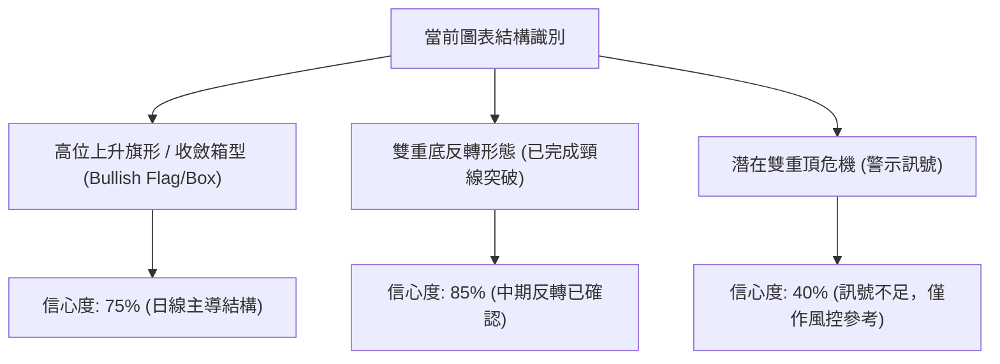
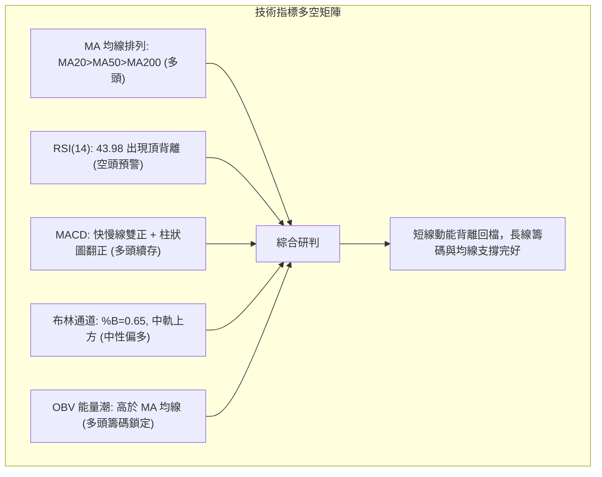
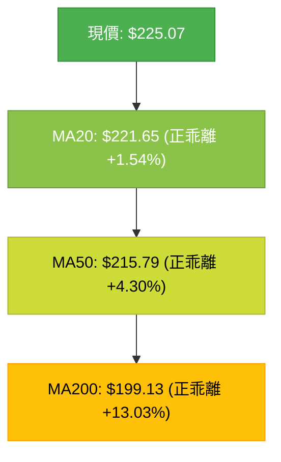
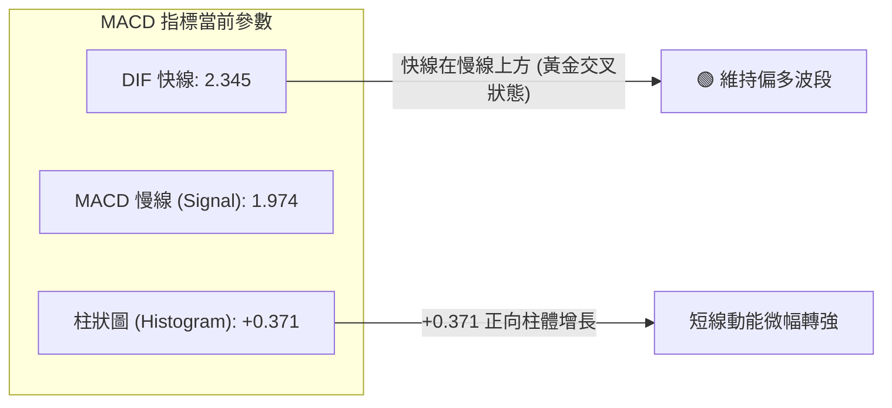
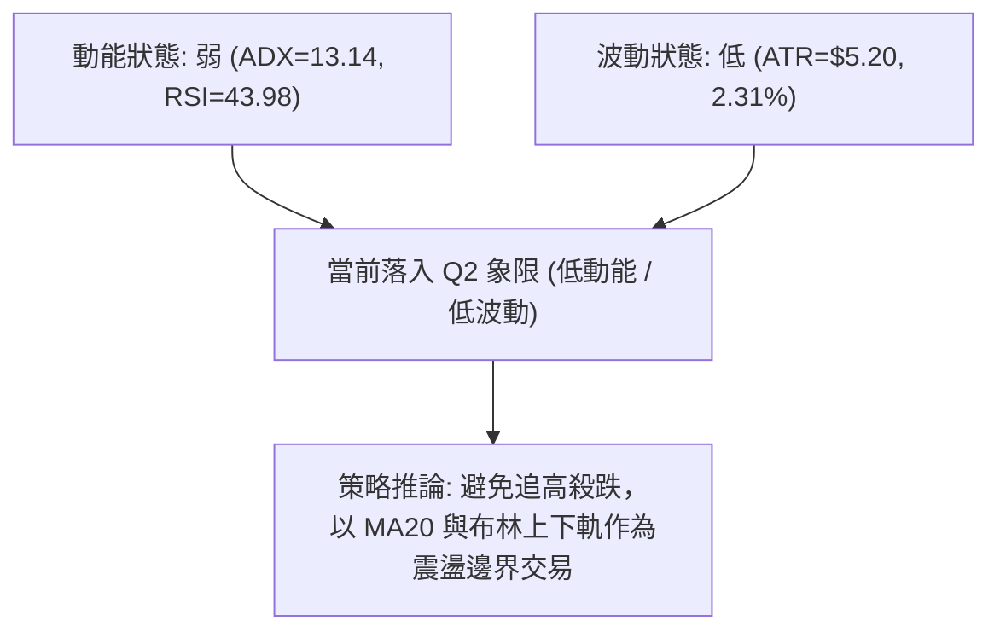
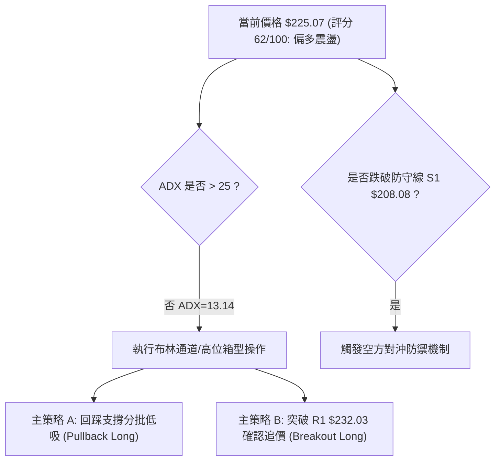
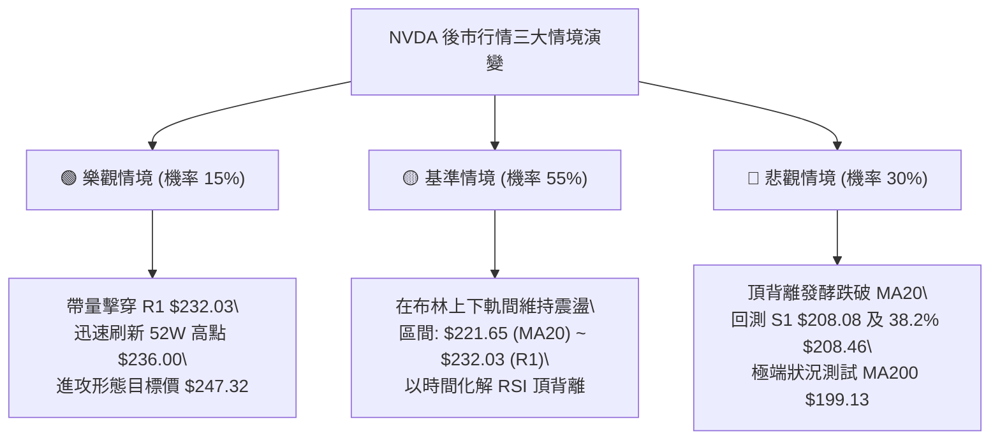

# NVDA 技術分析報告

> **報告日期**：2026-09-26 ｜ **語言**：繁體中文 ｜ **數據來源**：Yahoo Finance ｜ **當前價格**：$225.07

---

## 目錄

| 章節 | 內容 |
|------|------|
| [1. 技術面概覽](#1-技術面概覽) | 訊號儀表板、核心指標、評分卡 |
| [2. 趨勢分析](#2-趨勢分析) | 多時框趨勢、長中短期走勢、ADX解讀 |
| [3. 圖表形態分析](#3-圖表形態分析) | 形態識別信心度、K線組合、目標價推算 |
| [4. 支撐與阻力](#4-支撐與阻力) | 關鍵價位結構、斐波那契回調位分析 |
| [5. 技術指標深度解讀](#5-技術指標深度解讀) | MA/RSI背離/MACD/布林通道/量價配合 |
| [6. 動能與波動率](#6-動能與波動率) | 動能四象限、ATR止損計算、Beta敏感度 |
| [7. 多時框架總結](#7-多時框架總結) | 時框矩陣、收斂原則、單一方向結論 |
| [8. 交易策略建議](#8-交易策略建議) | 策略路由、主策略規劃、風險報酬比 |
| [9. 風險提示與監控](#9-風險提示與監控) | 監控清單、情境模擬、風控指引 |

---

## 1. 技術面概覽

### 🎯 技術訊號儀表板



### 📊 核心指標速覽表

| 指標類別 | 指標名稱 | 當前數值 | 訊號 | 解讀 |
|----------|----------|----------|------|------|
| **價格** | 當前價格 | $225.07 | 🟢 多頭 | 處於 52 週高低區間 84.8% 高位階，多方掌控大局 |
| **均線** | MA20 | $221.65 | 🟢 多頭 | 現價高於 MA20（+1.54%），短多支撐穩固 |
| **均線** | MA50 | $215.79 | 🟢 多頭 | 現價高於 MA50（+4.30%），中期上升趨勢未破 |
| **均線** | MA200 | $199.13 | 🟢 多頭 | 現價高於 MA200（+13.03%），長期牛市基調明確 |
| **動能** | RSI(14) | 43.98 | 🔴 空頭 | 數值偏弱且出現明確「頂背離」，動能衰竭預警 |
| **動能** | MACD | 2.345 / 1.974 | 🟢 多頭 | 快線維持在慢線上方，柱狀圖正值（+0.371）維持買訊 |
| **動能** | KD(14,3,3) | 65.83 / 63.96 | 🟡 中性 | %K 略高於 %D，位於多空平衡區，無超買超賣 |
| **趨勢** | ADX(14) | 13.14 | 🟡 中性 | ADX < 25，顯示當前缺乏單邊趨勢，進入箱型震盪 |
| **波動** | ATR(14) | $5.20 | 🟡 中性 | 每日波動率約 2.31%，波動幅度收斂有助築底 |
| **籌碼** | OBV | OBV > MA | 🟢 多頭 | 能量潮高於均線，長期籌碼並無實質派發跡象 |

### 🏆 技術評分卡

```
╔══════════════════════════════════════════════════════════════╗
║              技術評分卡 — NVDA (2026-09-26)                  ║
╠══════════════════════════════════════════════════════════════╣
║ 趨勢強度 (ADX=13.14, +DI佔優)  ████████░░░░░░░░░░░░  42/100 🟡║
║ 動能指標 (MACD偏多 vs RSI背離)  ██████████░░░░░░░░░░  50/100 🟡║
║ 支撐穩定度 (均線密集, S1強)    ████████████████░░░░  80/100 🟢║
║ 成交量配合 (OBV偏多, 量比0.77) ████████████░░░░░░░░  60/100 🟢║
║ 形態完整度 (箱型/多頭旗形整理)  ██████████████░░░░░░  70/100 🟢║
║ 均線排列 (MA20>MA50>MA200多頭) ████████████████░░░░  82/100 🟢║
╠══════════════════════════════════════════════════════════════╣
║ 綜合技術評分                   ████████████░░░░░░░░  62/100 🟢║
║ 最終技術評級：【偏多震盪整理】(Cautiously Bullish / Range)     ║
╚══════════════════════════════════════════════════════════════╝
```

---

## 2. 趨勢分析

### 🌐 多時框趨勢分析



### 📈 長期趨勢 — 12個月走勢圖（Unicode）

```
NVDA 月線走勢圖（過去12個月：2025-10 至 2026-09）
價格軸 ($)
$236 ┤                                                 ● 52W High ($236.00)
$225 ┤                                            ●    ● 現在 ($225.07)
$215 ┤                                  ●
$205 ┤      ●                      ●         ●
$195 ┤                        ●
$185 ┤           ●       ●
$175 ┤                ●       ●
$165 ┤
     └──────┬───────┬───────┬───────┬───────┬───────┬───────┬───────┬───────┬───────┬───────┬───────
          25-10   25-11   25-12   26-01   26-02   26-03   26-04   26-05   26-06   26-07   26-08   26-09
收盤價:   202.01  176.58  186.06  190.68  176.78  174.00  199.11  210.66  199.87  200.53  220.53  225.07
```

#### 走勢特徵分析表格

| 階段區間 | 起止價格 | 漲跌幅 | 走勢特徵與結構解讀 |
|----------|----------|--------|--------------------|
| 2025-10 ~ 2025-11 | $202.01 → $176.58 | -12.59% | 衝高 $202 後的獲利了結回吐，測試前波突破平台。 |
| 2025-11 ~ 2026-03 | $176.58 → $174.00 | -1.46% | 長達5個月的低檔築底整理，最低未破 52W 低點 $163.90，形成扎實箱型底。 |
| 2026-03 ~ 2026-05 | $174.00 → $210.66 | +21.07% | 帶量突破 $200 心理關卡，重啟多頭主升段。 |
| 2026-05 ~ 2026-07 | $210.66 → $200.53 | -4.81% | 圍繞 $200 整數關卡進行次級折返洗盤，完成換手。 |
| 2026-07 ~ 2026-09 | $200.53 → $225.07 | +12.24% | 展開新一輪衝刺，最高觸及 52W 高點 $236.00 後小幅回落收於 $225.07。 |

### 📊 中期趨勢（週線分析）

```
週線近期主要支撐與壓力區間示意：
$236.00 ────────────────────────────────────────── 52W 最高點 / 極限壓力
$232.03 ────────────────────────────────────────── 近一年波段高點聚類 (R1 關鍵阻力)
                     ▲
       現價區間:  $225.07 (目前在 MA20 $221.65 之上運行)
                     ▼
$218.98 ┄┄┄┄┄┄┄┄┄┄┄┄┄┄┄┄┄┄┄┄┄┄┄┄┄┄┄┄┄┄┄┄┄┄┄┄┄┄┄┄ 斐波那契 23.6% 回調支撐
$208.46 ~ $208.08 ──────────────────────────────── 斐波那契 38.2% 與 近一年低點聚類 (S1 強支撐)
$199.95 ~ $198.43 ──────────────────────────────── 斐波那契 50.0% 與 波段低點聚類 (S2 / MA200 防線)
```

從近 20 週表現觀察，NVDA 在 2026-06-28 創下波段低點 $192.31 後展開強勢反彈，連續推升至 2026-09-06 達 $230.10，隨後在 $218.29 ~ $230.10 區間進行收斂。雖然 MACD 週線柱狀圖近期在正負值之間拉鋸（最新一週為 +0.371），但收盤價重心持續上移，週線等級維持多頭推升架構。

### ⚡ 趨勢強度評估（ADX 解讀）



#### ADX 趨勢強度對照解讀

| 指標變數 | 當前讀數 | 標準區間 | 技術含義解讀 |
|----------|----------|----------|--------------|
| **ADX(14)** | **13.14** | < 20 極弱趨勢 | 市場動能呈現顯著休眠狀態，趨勢力量極度匱乏，追高或殺跌之勝率均偏低。 |
| **+DI (14)** | **31.53** | 0 ~ 100 | 多方掌控買盤意願，但未達 40 以上之強烈進攻狀態。 |
| **-DI (14)** | **25.31** | 0 ~ 100 | 空方壓制力道受到牽制，雖有頂背離疑慮，但尚未化為實質拋售潮。 |
| **收斂法則** | **ADX < 25** | 盤整判定 | 根據多時框收斂原則，當前禁止使用突破追價策略，應嚴格依循日線布林通道 ($210.51 - $232.80) 進行箱型高出低進。 |

---

## 3. 圖表形態分析

### 🔍 形態識別系統



#### 形態識別信心度與目標價計算表

| 形態類別 | 信心度 | 判斷依據（引用數據） | 完成度 | 目標價（附嚴格計算式） |
|----------|--------|----------------------|--------|------------------------|
| **中級雙底形態** (W底) | 85% | 兩次波段低點分別形成於 2026-03 ($174.00) 與 2026-06-28 ($192.31)，頸線為 2026-05 之高點 $210.66，8月已放量突破。 | 100% (已完成突破) | 頸線 $210.66 + 形態高度 ($210.66 - $174.00 = $36.66) = **$247.32** *(注: 超越52W高點，屬於波段推算目標)* |
| **高位箱型整理** (矩形) | 75% | 價格受阻於阻力位 R1 $232.03 與 52W 高點 $236.00，下檔支撐於 MA20 $221.65 與 S1 $208.08。 | 70% (盤整中) | 箱頂 $232.03 - 箱底 $208.08 = 箱高 $23.95；向上突破後目標 = $232.03 + $23.95 = **$255.98** |
| **潛在雙重頂形態** | 40% | 2026-09 初見高 $230.10，52W 高點 $236.00 未能放量有效站穩，伴隨 RSI 頂背離。因未跌破頸線，不滿足形態確立條件。 | 25% (未成形) | *訊號不足，不予計算下跌目標價，僅做指標型風險解讀。* |

### 🕯️ 重要K線形態分析

| 週/月份 | 收盤價 | 核心K線組合形態 | 技術面解讀 | 訊號 |
|---------|--------|-----------------|------------|------|
| **2026-08-16** | $224.91 | 長陽拉升突破線 | RSI 衝至 75.4 超買區，多頭主力強勢發動攻擊，打開 $220 上方空間。 | 🟢 多頭推進 |
| **2026-08-23** | $214.48 | 倒轉避雷針帶陰線 | 短期獲利盤回吐，MACD 柱狀圖翻負 (-0.404)，確立 $225-$230 存在密集成交解套賣壓。 | 🔴 漲多修正 |
| **2026-09-06** | $230.10 | 帶長上影線小陽線 | 盤中衝擊 52W 高點 $236.00 未果受阻，收盤價未能守穩 $232.03，留長上影。 | 🟡 假突破受阻 |
| **2026-09-27** | $225.07 | 紡錘字線 (Spindle) | 實體極窄，成交量進一步縮至 4.62 億股（日均量比僅 0.77x），空空雙方陷入拉鋸觀望。 | 🟡 多空僵持 |

### 📉 ASCII 走勢形態示意圖

```
NVDA 近期日/週線箱型整理形態示意圖：
$236.00 ┬─ 52W High (2026高點) ──┐
        │                        ├─ 假突破上影線區間
$232.03 ┼────────────────────────┴──────────────────── 阻力位 R1 / 箱頂邊界
        │             ╭─╮
        │            ╭╯ ╰╮      ╭─╮
$225.07 ┼───────────╭╯───╰╮────╭╯─● 現價 ($225.07) 位於中軌上方
        │          ╭╯     ╰╮  ╭╯
$221.65 ┼┄┄┄┄┄┄┄┄┄╭╯┄┄┄┄┄┄┄╰──╯┄┄┄┄┄┄┄┄┄┄┄┄┄┄┄┄┄┄┄ 布林中軌 (MA20支撐)
        │         │
$218.98 ┼┄┄┄┄┄┄┄┄┄│┄┄┄┄┄┄┄┄┄┄┄┄┄┄┄┄┄┄┄┄┄┄┄┄┄┄┄┄┄┄ 斐波那契 23.6% 回調位
        │        ╭╯
$208.08 ┴────────╯─────────────────────────────────── 支撐位 S1 / 箱底強防線
```

---

## 4. 支撐與阻力

### 🗺️ 關鍵價位分布圖（Unicode）

```
╔══════════════════════════════════════════════════════════════╗
║                   NVDA 價位結構分布圖                        ║
╠══════════════════════════════════════════════════════════════╣
║ $236.00 ║████████████████████████║ 52W 最高極限阻力 (0.0% Fib) ║
║ $232.80 ║████████████████████    ║ 布林通道上軌壓力             ║
║ $232.03 ║████████████████████████║ 關鍵阻力 R1 (近一年波段高點) ║
║ $225.07 ╠════════════════════════╣ ◄ 現價位置 (位階 84.8%)      ║
║ $221.65 ║▓▓▓▓▓▓▓▓▓▓▓▓▓▓▓▓        ║ 短線生命線 (MA20 / 布林中軌) ║
║ $218.98 ║▓▓▓▓▓▓▓▓▓▓▓▓▓▓▓▓        ║ 斐波那契 23.6% 回調支撐位    ║
║ $210.51 ║████████████████        ║ 布林通道下軌支撐             ║
║ $208.46 ║████████████████████    ║ 斐波那契 38.2% 回調支撐位    ║
║ $208.08 ║████████████████████████║ 近期強支撐 S1 (波段低點聚類) ║
║ $199.95 ║████████████████████    ║ 斐波那契 50.0% 多空分水嶺    ║
║ $199.13 ║████████████████████████║ 長期牛熊線 (MA200)           ║
║ $198.43 ║████████████████████████║ 次級支撐 S2 (波段低點聚類)   ║
║ $194.30 ║████████████████████████║ 核心防守底線 S3 (低點聚類)   ║
║ $163.90 ║████████████████████████║ 52W 最低基準 (100.0% Fib)    ║
╚══════════════════════════════════════════════════════════════╝
```

### 🚧 阻力位分析表

所有阻力數值完全引用系統提供之精確 OHLCV 計算數據：

| 阻力級別 | 精確價位 | 形成技術依據 | 突破難度評估 | 重要性與戰略意義 |
|----------|----------|--------------|--------------|------------------|
| **R1** | **$232.03** | 近一年波段高點聚類；與日線布林上軌 ($232.80) 形成密集共振壓制區。 | 🔴 高度困難 | 短期多頭必須實體帶量（日成交量 > 1.2 億股）封死此位，方能化解頂背離警訊。 |
| **52W High** | **$236.00** | 歷史極值壓力位，52週最高價格，斐波那契 0.0% 基點。 | 🔴 極端困難 | 歷史高點密集套牢與機構大額止盈聚集區，需重磅基本面催化劑支撐。 |

### 🛡️ 支撐位分析表

所有支撐數值完全引用系統提供之精確 OHLCV 計算數據：

| 支撐級別 | 精確價位 | 形成技術依據 | 守住機率 | 重要性與戰略意義 |
|----------|----------|--------------|----------|------------------|
| **MA20** | **$221.65** | 20日移動平均線、布林通道中軌，短線動能防線。 | 70% | 跌破代表短期盤整偏弱，將下探斐波那契回調區間。 |
| **S1** | **$208.08** | 近一年波段低點聚類；與斐波那契 38.2% ($208.46) 形成強烈雙重支撐共振帶。 | 85% | **中期強支撐**。多頭波段操作的最佳防守底線，不破則多頭推升結構不變。 |
| **S2** | **$198.43** | 近一年波段低點聚類；緊鄰長期 MA200 ($199.13) 與斐波那契 50.0% ($199.95)。 | 95% | **牛熊分界線**。機構法人長期建倉成本區，具備極強的護盤買盤。 |
| **S3** | **$194.30** | 近一年深層波段低點聚類；最後一道結構性多頭防線。 | 98% | 若失守象徵中期多頭架構徹底崩解，將進入深度熊市回檔。 |

### 📐 斐波那契回調位分析

本分析直接引用自 52 週極限區間（低點 $163.90 至 高點 $236.00，總垂直波幅 $72.10）：

```
0.0%  (52W High)  $236.00 ──────────────────────────────────── 頂部極限
23.6%             $218.98 ┄┄┄┄┄┄┄┄┄┄┄┄┄┄┄┄┄┄┄┄┄┄┄┄┄┄┄┄┄┄┄┄┄┄ 第一回調緩衝線
                               ▲
                 現價位置:  $225.07 (位於 0.0% ~ 23.6% 之強勢整理區)
                               ▼
38.2%             $208.46 ──────────────────────────────────── 黃金分割強支撐
50.0%             $199.95 ┄┄┄┄┄┄┄┄┄┄┄┄┄┄┄┄┄┄┄┄┄┄┄┄┄┄┄┄┄┄┄┄┄┄ 多空中軸分水嶺
61.8%             $191.44 ──────────────────────────────────── 深度防禦底線
78.6%             $179.33 ┄┄┄┄┄┄┄┄┄┄┄┄┄┄┄┄┄┄┄┄┄┄┄┄┄┄┄┄┄┄┄┄┄┄ 弱勢回撤警戒
100.0% (52W Low)  $163.90 ──────────────────────────────────── 底部起漲原點
```

- **位置解讀**：當前價格 $225.07 緊固於 **0.0% ($236.00)** 與 **23.6% ($218.98)** 之間的高位強勢區間。
- **技術意義**：在技術回調理論中，資產價格在創出波段新高後，若回撤始終能守在 23.6% 回調位 ($218.98) 之上，即定義為「超強勢整理」；即便向下跌破 23.6%，只要能在 38.2% ($208.46) 獲利回吐結束前止跌，多頭整體向上攻擊的浪潮均未遭破壞。

---

## 5. 技術指標深度解讀

### 🎛️ 指標訊號總覽



### 📈 移動平均線排列分析



#### 長短期均線動態列表

| 均線名稱 | 精確數值 | 價格相對位置 | 斜率與微型趨勢解讀 | 訊號狀態 |
|----------|----------|--------------|--------------------|----------|
| **MA5** | $226.28 | 現價在其下方 (-0.54%) | 走勢微幅下彎 (-1.21)，短線買盤追價乏力 | 🔴 短線翻空 |
| **MA10** | $221.01 | 現價在其上方 (+1.84%) | 走勢持續向上 (+4.07)，提供 5~10 日動能防護 | 🟢 支撐良好 |
| **MA20** | $221.65 | 現價在其上方 (+1.54%) | 走勢穩步上升 (+3.42)，布林中軌生命線 | 🟢 多頭掌控 |
| **MA60** | $213.80 | 現價在其上方 (+5.27%) | 中期趨勢線強勁向上 (+11.27) | 🟢 中期強勢 |
| **MA120** | $210.15 | 現價在其上方 (+7.10%) | 半年線角度陡峭走升 (+14.92) | 🟢 趨勢多頭 |
| **MA240** | $197.09 | 現價在其上方 (+14.20%)| 年線基石向上 (+27.98)，大長線毫無疑慮 | 🟢 牛市核心 |

**均線結構結論**：MA20 > MA50 > MA200，呈現標準「多頭排列」（Bullish Alignment）。短期雖然跌破超短期的 MA5 ($226.28)，但下方的 MA10 ($221.01) 與 MA20 ($221.65) 正形成嚴密的黃金交叉黏合帶，為現價提供堅實緩衝。

### 📉 RSI(14) 分析與背離判定

- **RSI(14) 數值展示**：
  `RSI(14) = 43.98`  [█████████░░░░░░░░░░░] 43.98% （中性偏弱區間）

- **頂背離判定分析**：
  ⚠️ **明確頂背離（Bearish Divergence）成立**。
  - **價格走勢**：NVDA 於 2026-08-16 創出收盤價 $224.91，隨後於 2026-09-06 向上推升至 **$230.10**，價格形成明顯的 Higher High（更高的高點）。
  - **RSI 走勢**：在 2026-08-16 時 RSI 高達 **75.4**（嚴重超買），但當價格衝上 $230.10 時，RSI 卻僅錄得 **53.7**，最新收盤價 $225.07 更回落至 **43.98**，指標呈現顯著的 Lower High（更低的高點）。
  - **結論**：價格創新高而指標動能未予確認，宣告買盤內部動能正在衰退，多頭須提防引發中級洗盤。

### 📊 MACD(12/26/9) 訊號解讀



- **MACD 快慢線解讀**：DIF (2.345) 依然大於 Signal (1.974)，且兩者皆位於零軸之上，證明大週期格局仍屬多頭市場。
- **柱狀圖動態**：近四週 MACD 柱狀圖走勢為 `-0.507 → -0.705 → +0.371`，柱狀圖成功由負翻正，顯示儘管有 RSI 背離壓制，但下檔買盤已再度阻止跌勢擴大，短線並未進入全面空頭主導。

### 📦 布林通道分析

```
布林通道當前空間分佈圖 (通道帶寬擠壓中)：
$232.80 ┬────────────────────────────────────────── 布林上軌 (BB Upper)
        │ 
        │            ● 現價 $225.07 (%B = 0.65)
        │
$221.65 ┼────────────────────────────────────────── 布林中軌 (MA20)
        │
        │
$210.51 ┴────────────────────────────────────────── 布林下軌 (BB Lower)
```

- **帶寬與位置**：通道上軌為 $232.80，下軌為 $210.51，通道帶寬寬度為 $22.29（約 10% 區間）。當前 %B 數值為 **0.65**，代表現價處於中軌 ($221.65) 與上軌之間偏上方 65% 的多方控制區。
- **通道走勢**：上下軌道並未呈現向外發散的單邊擴張喇叭口，反而有向內微幅收斂的跡象，契合 ADX=13.14 的無趨勢盤整特徵，暗示價格在短期內難以單邊擊穿 $232.80 上軌，將在上軌與中軌之間進行箱型往返震盪。

### 💹 成交量分析（量價配合度）

- **量比與均量對比**：
  - 最新成交量：`89,808,400`
  - 20日均量：`116,060,540`（量比為 **0.77x**，呈現明顯萎縮）
  - 50日均量：`121,875,984`
- **量價關係解讀**：在價格維持在 $225 高位震盪之際，成交量顯著萎縮至 9,000 萬股以下，呈現「價漲/平而量縮」的價量背離格局。這印證了多頭追價意願不足，但同時也表明主力機構並未出現大筆拋售（籌碼惜售）。
- **OBV（能量潮）確認**：數據顯示「OBV > MA → 量能支撐上漲」。這代表中長期累計買量依然穩固，籌碼並未轉化為派發盤，屬於典型的「無量整理、鎖碼待變」結構。

---

## 6. 動能與波動率

### ⚡ 動能評估四象限

| 象限 | 動能維度 | 波動維度 | NVDA 當前狀態 | 交易戰略評估 |
|------|----------|----------|---------------|--------------|
| **象限一 (Q1)** | 強動能 (Trend) | 低波動 (Low Vol) | — | 最佳趨勢加碼點，穩健單邊行情。 |
| **象限二 (Q2)** | **弱動能 (Weak)** | **低波動 (Low Vol)** | **✓ (NVDA 目前落點)** | **謹慎觀望區**。ADX=13.14 (弱動能) 搭配 ATR=2.31% (低波動)，市場正在蓄勢壓縮，宜採區間高賣低買或靜待突破。 |
| **象限三 (Q3)** | 強動能 (Trend) | 高波動 (High Vol) | — | 突破加速段，適合追擊但需承擔滑點回撤。 |
| **象限四 (Q4)** | 弱動能 (Weak) | 高波動 (High Vol) | — | 混亂震盪洗盤，應堅決空倉避免反覆停損。 |



### 📊 ATR 波動率分析

- **當前 ATR(14)**：`$5.20`（佔當前股價之 **2.31%**）。
- **波動特性解讀**：相較於 NVDA 歷史高波段期間（ATR 經常超過 4%~5%），當前 $5.20 的波動幅度極度溫和，反映市場正處於觀望拉鋸狀態，無單邊主力強推。
- **止損距離動態建議**：
  - **極短線（日內/隔夜）**：1.0 × ATR = **$5.20**（跌破現價之 $219.87 即需止損）。
  - **波段交易（Swing Trading）**：2.0 × ATR = **$10.40**（即現價下方至 **$214.67**，正好覆蓋 MA50 $215.79 支撐）。
  - **趨勢保護（Position Trading）**：3.0 × ATR = **$15.60**（即現價下方至 **$209.47**，緊靠關鍵支撐 S1 $208.08）。

### 📐 Beta 與市場相關性

- **Beta 係數**：`2.217`（極高敏感度）。
- **市場意義**：NVDA 的波動彈性為標普 500 指數的 **2.217 倍**。這代表若大盤指數（如 SPY 或 QQQ）出現 1% 的回調，NVDA 理論上將面臨約 2.22% 的下行衝擊；反之在大盤多頭進攻時亦具備加倍的槓桿進攻效應。在當前 RSI 頂背離且 ADX 弱勢之際，極高的 Beta 值意味著投資人必須嚴加防範外部大盤環境轉弱可能引發的高乘數殺跌風險。

---

## 7. 多時框架總結

### 📋 時框架評分表

| 時框架 | 趨勢方向 | 動能狀態 | 均線排列 | 圖表形態 | 綜合評分 | 戰略建議 |
|--------|----------|----------|----------|----------|----------|----------|
| **月線級別 (長期)** | 🟢 強烈看多 | 強烈多頭推升 | 完美多頭 (遠高於年線) | 大型長期多頭通道 | **88/100** | 長線多單堅定續抱，無實質離場訊號 |
| **週線級別 (中期)** | 🟢 震盪走高 | 中性微強 (MACD柱翻正) | 多頭向上排列 (MA50上揚) | 波段雙底突破後回踩確認 | **70/100** | 拉回支撐 S1 $208.08 逢低布局 |
| **日線級別 (短期)** | 🟡 偏多箱型震盪 | 弱勢 (RSI頂背離/ADX弱) | 短均糾結 (跌破MA5, 守MA20) | 高位收斂箱型 (%B=0.65) | **54/100** | 箱型高出低進，嚴禁追突破 |

### 🔲 綜合訊號矩陣

```
時框衝突與一致性檢驗矩陣：
╔═════════════╦══════════════╦══════════════╦══════════════╗
║ 指標類別    ║ 短期 (日線)  ║ 中期 (週線)  ║ 長期 (月線)  ║
╠═════════════╬══════════════╬══════════════╬══════════════╣
║ 均線架構    ║ 🟡 糾結震盪  ║ 🟢 多頭推升  ║ 🟢 完美多頭  ║
║ 動能指標    ║ 🔴 頂背離    ║ 🟢 翻正向上  ║ 🟢 多方掌控  ║
║ 成交量能    ║ 🔴 萎縮 (0.77x)║ 🟡 換手持平  ║ 🟢 長期放量  ║
║ 波動狀態    ║ 🟡 ATR 低收斂║ 🟡 溫和波動  ║ 🟢 強勁推升  ║
║ 趨勢強度    ║ 🔴 ADX=13(無)║ 🟡 震盪醞釀  ║ 🟢 強勢單邊  ║
╚═════════════╩══════════════╩══════════════╩══════════════╝
一致性評估：長多格局未變，中期回踩蓄勢，短期動能衰竭受阻。
```

### ⚖️ 多時框收斂結論

> **唯一方向性研判依據（嚴格遵守規則 14 收斂原則）**：
> 1. **趨勢強度判定**：當前日線 ADX 讀數僅為 **13.14**（明確小於 25 臨界線），定義為典型的「**盤整無趨勢行情**」。
> 2. **收斂法則**：在 ADX < 25 的盤整結構中，禁止依據中長期均線的極端樂觀多頭方向盲目追高；必須以**日線布林通道上下軌 ($210.51 ~ $232.80) 作為核心交易邊界**。
> 3. **主導與取捨**：雖然日線 RSI 出現頂背離（偏空），但長期月線與中期週線之均線架構極為強固（偏多），兩者收斂後的唯一結論為：**【中長期偏多背景下的短線高位區間震盪整理】（偏多區間操作）**。本結論與第 1 章評分卡（62/100）完全呼應。

---

## 8. 交易策略建議

### 🗺️ 策略決策流程圖



### 🧭 策略路由

- **主策略方向**：**【主推多頭策略（回踩低吸為主，突破加碼為輔）】**
  *(判定依據：第 1 章技術評分卡綜合得分為 **62/100**，高於 60 偏多分水嶺，且均線多頭排列 MA20>MA50>MA200 與 OBV 依舊偏多)*。

### 🎯 價格情境階梯（Price Scenarios）

所有價位均嚴格引用第 4 章及數據庫真實運算數值，絕無捏造：

| 觸發條件 | 第一目標 (T1) | 後續延伸 (T2) | 市場情境與應對含義 |
|----------|---------------|---------------|--------------------|
| **帶量突破 R1 $232.03** | 52W High **$236.00** | 形態目標 **$247.32** | 短線頂背離徹底化解，打開歷史新高主升段。 |
| **維持於 MA20 $221.65 之上震盪** | 布林上軌 **$232.80** | 關鍵阻力 **$232.03** | 強勢高位洗盤，以時間換取空間消化賣壓。 |
| **向下跌破 MA20，回測 S1** | 關鍵支撐 **$208.08** | 斐波那契 **$208.46** | 健康次級折返，為中長線買盤提供最佳低吸點。 |
| **放量擊穿 S1 $208.08** | 次級支撐 **$198.43** | 牛熊線 **$199.13** | 中期走勢轉弱，多頭防線後撤至 MA200 決戰。 |

### 📊 情境機率分佈

| 情境劇本 | 發生機率 | 主要技術指標支撐依據 |
|----------|----------|----------------------|
| **區間震盪整理 (主情境)** | **55%** | **ADX=13.14** 缺乏單邊動能；布林通道寬度收斂；成交量降至 0.77x 進入觀望。 |
| **拉回測試下檔支撐 (次情境)** | **30%** | **RSI(14) 頂背離** 壓力仍在發酵；MA5 短均線下彎，短線存在獲利了結回洗需求。 |
| **直接放量突破創新高 (小機率)** | **15%** | 現價距離 R1 僅 3.09%，若無基本面重磅催化劑，在低動能與量縮下難以直接發動。 |

### 🟢 主策略詳情

#### 策略 A：回踩關鍵支撐低吸（波段核心策略 — 推薦）

- **進場條件**：價格受 RSI 背離壓制拉回，回測至斐波那契 23.6% ($218.98) 至 MA20 ($221.65) 區間止跌，出現 60 分鐘或日線下影線確認。
- **進場價格**：**$221.65**（MA20 / 布林中軌支撐處）。
- **止損價格**：**$214.67**（依 2.0 × ATR 計算：$221.65 - $6.98，位於 MA50 $215.79 下方，跌破即代表短多失敗）。
- **目標價 T1**：**$232.03**（阻力位 R1，預期獲利 +$10.38）。
- **目標價 T2**：**$236.00**（52週高點，預期獲利 +$14.35）。
- **風險報酬比 (R:R)**：
  - 至 T1：`($232.03 - $221.65) / ($221.65 - $214.67) = $10.38 / $6.98 = 1.49 : 1`
  - 至 T2：`($236.00 - $221.65) / ($221.65 - $214.67) = $14.35 / $6.98 = 2.06 : 1`（優質波段比率）
- **成功機率估計**：**65%**。
- **建議倉位**：**15%** 總投資資金。

#### 策略 B：突破阻力追擊加碼（趨勢右側策略）

- **進場條件**：日線收盤價帶量（單日成交量突破 1.2 億股）明確實體收在 R1 $232.03 之上，ADX 出現回升拐點。
- **進場價格**：**$232.50**（確認突破 R1 $232.03 站穩後進場）。
- **止損價格**：**$227.30**（以進場價扣除 1.0 × ATR $5.20 設定，假突破即果斷離場）。
- **目標價 T1**：**$236.00**（52W High，測試前高獲利減半）。
- **目標價 T2**：**$247.32**（雙底波段高度計算目標：頸線 $210.66 + $36.66 = $247.32）。
- **風險報酬比 (R:R)**：
  - 至 T2：`($247.32 - $232.50) / ($232.50 - $227.30) = $14.82 / $5.20 = 2.85 : 1`
- **成功機率估計**：**50%**（受制於頂背離陰影，突破追價勝率略低，需嚴格止損）。
- **建議倉位**：**10%** 總投資資金。

### 🔴 反向風險觸發點（對沖提示）

- **警示價位 1**：若收盤價跌破斐波那契 23.6% **$218.98**，短多結構轉弱，所有短線浮動利潤應全數獲利了結。
- **核心對沖觸發點**：若日線放量擊穿關鍵支撐 S1 **$208.08** 與 38.2% **$208.46**，代表波段多頭走勢破位，投資人應建立相應部位（如買入看跌期權 Put Option 或做空個股）對沖現貨長期倉位，防範向 S2 **$198.43** 及 MA200 **$199.13** 尋求支撐的深度下修風險。

### ⭐ 整體訊號強度評星

```
╔══════════════════════════════════════════════════════════════╗
║ 做多訊號強度：★★★★☆  (3.8/5星 - 均線完美但受制背離)          ║
║ 做空訊號強度：★★☆☆☆  (2.0/5星 - 僅屬短線技術回調，無趨勢)   ║
║ 整體可信度：  ★★★★☆  (4.0/5星 - 價位聚類與斐波那契高度共振) ║
╚══════════════════════════════════════════════════════════════╝
```

---

## 9. 風險提示與監控

### ✅ 關鍵監控指標 Checklist

```
╔══════════════════════════════════════════════════════════════╗
║              每日技術面關鍵風控 CheckList                    ║
╠══════════════════════════════════════════════════════════════╣
║ [ ] 價格防守：收盤價是否守穩 MA20 生命線 ($221.65) ?          ║
║ [ ] 關鍵破位：是否出現實體黑K跌破 S1 強支撐 ($208.08) ?      ║
║ [ ] 阻力進攻：是否帶量突破並站穩關鍵阻力 R1 ($232.03) ?      ║
║ [ ] 動能警訊：RSI(14) 頂背離是否引發跌破 40 進入弱勢區 ?      ║
║ [ ] 動能復甦：ADX(14) 是否向上突破 20~25 啟動單邊趨勢 ?     ║
║ [ ] 量能異動：單日成交量是否放大至 1.2 億股以上確認換手 ?   ║
║ [ ] 籌碼指標：OBV 能量潮是否維持在 MA 均線上方未破 ?         ║
╚══════════════════════════════════════════════════════════════╝
```

### ⚠️ 風險場景分析



### 🛡️ 風險管理重要提醒

1. **頂背離化解前的倉位控制**：鑑於日線圖表中 RSI(14) 出現鮮明的頂背離警訊，且單日成交量能縮減至 0.77x，此時絕不可在現價 $225.07 上方過度使用融資槓桿進行追價。整體總倉位建議維持在 40%~50% 以下，保留充足現金彈性。
2. **高 Beta 敏感度管理**：NVDA 的 Beta 高達 **2.217**，在半導體族群波動加劇的背景下，投資組合單日淨值波動將極具破壞力。每筆交易之止損金額，應嚴格限制於總投資部位淨資產的 **1.0% ~ 1.5%** 之內。
3. **區間操作紀律**：當 ADX 處於 13.14 之弱勢位階時，市場常出現反覆假突破與假跌破。切勿在接近阻力位 R1 $232.03 時追多，亦勿在接近支撐位 S1 $208.08 時殺跌。

---

## 📋 報告總結

```
╔══════════════════════════════════════════════════════════════════╗
║                    NVDA 技術分析報告總結                         ║
╠══════════════════════════════════════════════════════════════════╣
║ 報告日期：2026-09-26                                            ║
║ 當前價格：$225.07                                                ║
║ 技術評級：⚖️ 偏多高位箱型整理 (評分: 62/100)                     ║
╠══════════════════════════════════════════════════════════════════╣
║ 關鍵結論：                                                       ║
║ ├─ 長期趨勢：🟢 完美多頭 (均線多頭排列 MA20>MA50>MA200，OBV穩固)║
║ ├─ 中期趨勢：🟢 震盪盤整偏多 (週線波段底推升，回踩 $218-$221 蓄勢)║
║ ├─ 短期趨勢：🟡 弱動能盤整 (ADX=13.14 無趨勢，RSI 出現頂背離)   ║
║ ├─ 關鍵阻力：$232.03 (R1 近一年波段高點) / $236.00 (52W 最高點) ║
║ ├─ 關鍵支撐：$221.65 (MA20 生命線) / $208.08 (S1 近一年低點聚類)║
║ └─ 法人共識目標：$327.70 (59位分析師平均，僅供基本面宏觀參考)   ║
╠══════════════════════════════════════════════════════════════════╣
║ 最優策略組合：                                                   ║
║ 1. 🥇 最佳機會：等待價格回踩 MA20 $221.65 (或近斐波那契 23.6%   ║
║                $218.98) 逢低佈局，止損設 $214.67，目標 $232.03。║
║ 2. 🥈 次選機會：突破追擊——若放量突破 R1 $232.03 則順勢介入，目標║
║                前高 $236.00 及形態推算目標 $247.32。            ║
║ 3. 🥉 防守對策：若不幸實體黑K放量跌穿 S1 $208.08，多頭倉位應全面 ║
║                停損或對沖避險，等待 MA200 $199.13 重新落底。    ║
╚══════════════════════════════════════════════════════════════════╝
```

---

> ⚠️ **免責聲明**：本報告為依據客觀市場數據進行之技術分析研究，所有數據指標及價位估算均嚴格基於所提供之歷史價格與量能資訊。本報告**僅供研究與學術參考**，**不構成任何形式的投資要約或買賣建議**。金融市場瞬息萬變，技術指標存在滯後與鈍化風險，投資人應獨立評估財務狀況並自負投資盈虧。

---

*報告生成時間：2026-09-26 ｜ 數據來源：Yahoo Finance ｜ 分析框架：多時框技術分析體系*