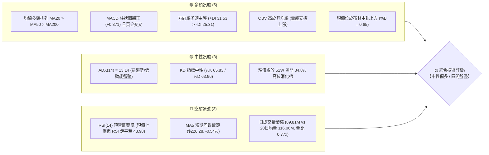
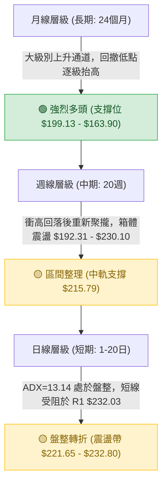
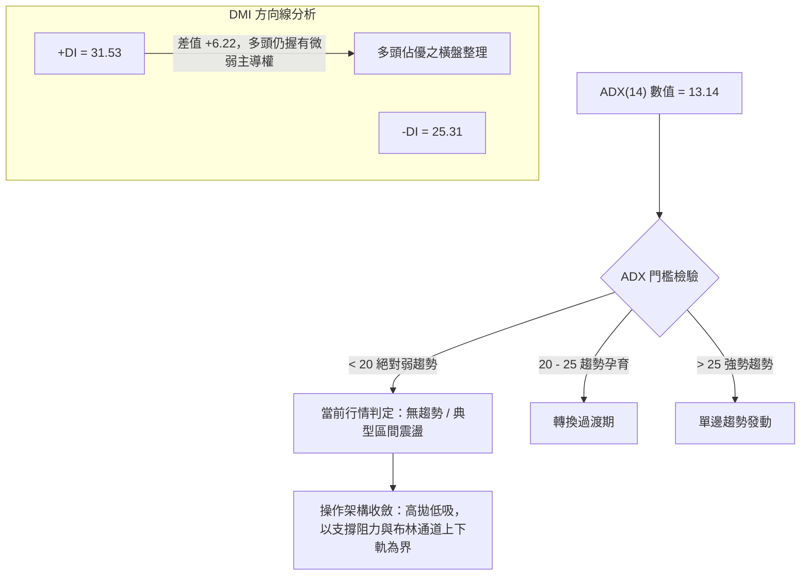
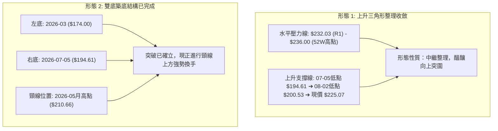
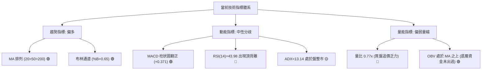
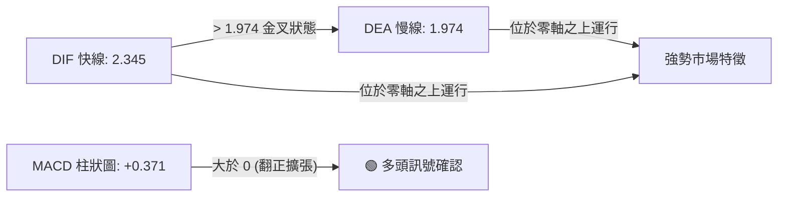
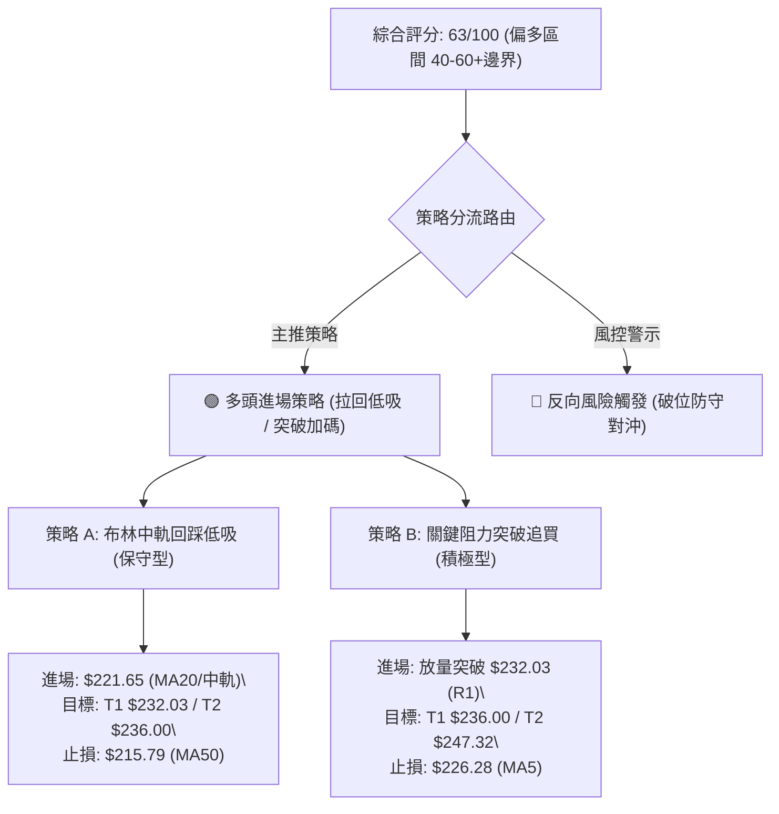
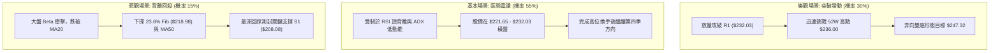

# NVDA 技術分析報告

> **報告日期**：2026-09-27 ｜ **語言**：繁體中文 ｜ **數據來源**：Yahoo Finance ｜ **當前價格**：$225.07

---

## 目錄

| 章節 | 內容 |
|------|------|
| [1. 技術面概覽](#1-技術面概覽) | 訊號儀表板、核心指標、評分卡 |
| [2. 趨勢分析](#2-趨勢分析) | 多時框趨勢、長中短期走勢、ADX強度 |
| [3. 圖表形態分析](#3-圖表形態分析) | 形態識別、K線組合、形態推算目標價 |
| [4. 支撐與阻力](#4-支撐與阻力) | 關鍵價位、斐波那契回調 |
| [5. 技術指標深度解讀](#5-技術指標深度解讀) | MA/RSI/MACD/布林/成交量/OBV |
| [6. 動能與波動率](#6-動能與波動率) | 動能評估象限、ATR、Beta 與相關性 |
| [7. 多時框架總結](#7-多時框架總結) | 時框架評分矩陣、多時框收斂判定 |
| [8. 交易策略建議](#8-交易策略建議) | 策略路由、價格情境、進出場與風控 |
| [9. 風險提示與監控](#9-風險提示與監控) | 監控清單、風險場景、倉位管理 |
| [10. 報告總結](#10-報告總結) | 總體評級、關鍵結論速覽 |

---

## 1. 技術面概覽

### 🎯 技術訊號儀表板



### 📊 核心指標速覽表

| 指標類別 | 指標名稱 | 當前數值 | 訊號 | 專業深度解讀 |
|----------|----------|----------|------|--------------|
| **價格** | 當前價格 | $225.07 | 🟢 多頭 | 緊貼 52 週高點 ($236.00)，位於 52 週區間之 84.8% 位置，多頭掌控總體架構 |
| **均線** | MA20 | $221.65 | 🟢 多頭 | 股價位於短期支撐均線上方 (+1.54%)，布林中軌支撐穩固且維持斜率向上 |
| **均線** | MA50 | $215.79 | 🟢 多頭 | 位於中期景氣生命線上方 (+4.30%)，中期上升趨勢軌道保持完好 |
| **均線** | MA200 | $199.13 | 🟢 多頭 | 遠高於長期牛熊分水嶺 (+13.03%)，長期牛市結構極為厚實 |
| **均線** | MA5 | $226.28 | 🔴 空頭 | 價格跌破極短期線 (-0.54%)，顯示短線衝高後遭遇微型獲利了結賣壓 |
| **動能** | RSI(14) | 43.98 | 🟡 中性/🔴 警示 | 落在 30-70 中性區間，但出現顯著頂背離現象，追價動能呈現衰竭衰退 |
| **動能** | MACD (12,26,9) | DIF: 2.345 / DEA: 1.974 / 柱: +0.371 | 🟢 多頭 | 快慢線雙雙在零軸上方運行，柱狀圖正值擴張，多頭防守反擊結構成立 |
| **隨機** | KD 指標 | %K: 65.83 / %D: 63.96 | 🟡 中性 | 指標未達超買門檻 (>80)，處於中高位溫和鈍化走勢 |
| **趨勢** | ADX / DMI | ADX: 13.14 / +DI: 31.53 / -DI: 25.31 | 🟡 盤整 | ADX < 25 判定為「典型弱趨勢盤整」，+DI 佔優但無法發動單邊單向逼空 |
| **通道** | 布林通道 (20,2) | 上: $232.80 / 中: $221.65 / 下: $210.51 | 🟢 偏多 | 股價處於中上軌強勢區間 (%B = 0.65)，上方仍有通道餘裕 |
| **量能** | 當日量 vs 均量 | 89.81M / 116.06M (量比 0.77x) | 🔴 偏弱 | 量能顯著縮減，未達進攻量水準；OBV 雖持穩均線上但量價配合稍顯遲滯 |
| **波動** | ATR(14) | $5.20 (2.31%) | 🟡 中等 | 日內波動區間維持在常態常模，適合進行區間與階梯式止損設定 |

### 🏆 技術評分卡

```
╔════════════════════════════════════════════════════════════════════════════╗
║                   NVDA 技術指標量化評分卡 (2026-09-27)                      ║
╠════════════════════════════════════════════════════════════════════════════╣
║ 趨勢強度 (ADX=13.14 弱趨勢)  ██████░░░░░░░░░░░░░░  32/100  🟡 弱勢盤整    ║
║ 動能指標 (MACD偏多/RSI背離)  ████████████░░░░░░░░  60/100  🟡 多空拉鋸    ║
║ 支撐穩定度 (S1/S2階梯明確)   ████████████████░░░░  82/100  🟢 結構堅實    ║
║ 成交量配合 (量比0.77x量縮)   ████████░░░░░░░░░░░░  42/100  🔴 量價背馳    ║
║ 形態完整度 (箱體整理收斂)    ██████████████░░░░░░  70/100  🟢 收斂待變    ║
║ 均線排列 (MA20>50>200完好)   ██████████████████░░  90/100  🟢 標準多頭    ║
╠════════════════════════════════════════════════════════════════════════════╣
║ 綜合技術得分                 █████████████░░░░░░░  63/100  🟢【中性偏多】 ║
╚════════════════════════════════════════════════════════════════════════════╝
```

---

## 2. 趨勢分析

### 🌐 多時框趨勢分析



### 📈 長期趨勢 — 12個月走勢圖（Unicode）

以下為根據過去 12 個月（2025-10 至 2026-09）官方收盤數據繪製之走勢圖，清晰展示歷史波段高低點與軌跡變遷：

```
NVDA 月線收盤走勢圖（過去12個月：2025-10 至 2026-09）
價格軸 ($)
$230 ┤                                                    ● 225.07(現在)
$220 ┤                                              ● 220.53
$210 ┤                                  ● 210.66
$200 ┤ ● 202.01                     ● 199.11    ● 199.87  ● 200.53
$190 ┤                  ● 190.68
$180 ┤       ● 176.58 ● 186.06   ● 176.78
$170 ┤                               ● 174.00 (低點)
     └────────────────────────────────────────────────────────────►
       10   11   12   01   02   03   04   05   06   07   08   09 (月份)
      2025                                                2026
```

#### 走勢特徵分析表格

| 階段階段 | 時間跨度 | 價格軌跡 | 漲跌幅 | 結構性特徵與量價解讀 |
|----------|----------|----------|--------|----------------------|
| **第 I 階段：衝高與首波深調** | 2025-10 ~ 2025-11 | $202.01 → $176.58 | -12.59% | 突破 $200 整數關口後遇獲利賣壓，形成波段修正，回踩打出初始支撐平台。 |
| **第 II 階段：次級低位築底** | 2025-12 ~ 2026-03 | $186.06 → $174.00 | -6.48% | 走勢在 $174.00-$190.68 構築大雙底底部，2026-03 探低 $174.00，測試 52W 低點 $163.90 成功反彈。 |
| **第 III 階段：強勁主升浪** | 2026-04 ~ 2026-05 | $199.11 → $210.66 | +5.80% | 均線再度轉為多頭排列，突破前期套牢區，創出當時歷史新高，確認長期多頭延續。 |
| **第 IV 階段：箱體再平衡** | 2026-06 ~ 2026-07 | $199.87 → $200.53 | +0.33% | 進入籌碼換手期，連續兩個月收盤錨定在 $200 整數大關附近，清洗不堅定浮額。 |
| **第 V 階段：再創新高推升** | 2026-08 ~ 2026-09 | $220.53 → $225.07 | +2.06% | 突破向上，直逼 52 週最高點 $236.00，目前收在 $225.07，進入歷史高位換手階段。 |

### 📊 中期趨勢（週線分析）

中期週線數據顯示，NVDA 經歷了多輪波動震盪。近 20 週收盤價由 2026-06-28 之低點 $192.31 強勁反彈，於 2026-09-06 刷出 $230.10 週線收盤峰值。近期週線出現高位收斂特徵：

```
中期關鍵波段壓力與支撐示意圖
════════════════════════════════════════════════════════════════════
$236.00 ─────────────────────────────────── 52W 絕對高點 (0.0% Fib)
$232.03 ─────────────────────────────────── 阻力 R1 / 週線密集阻力帶
$230.10 ─────────────────● 2026-09-06 週線收盤高點
$225.07 ═════════════════● 現價
$221.65 ───────────────── MA20 / 布林中軌支撐
$218.98 ───────────────── 23.6% 斐波那契回調位
$208.08 ───────────────── 支撐 S1 / 38.2% Fib ($208.46) 共振區
════════════════════════════════════════════════════════════════════
```

### ⚡ 趨勢強度評估（ADX 解讀）



#### ADX 趨勢強度量化對照表

| ADX 區間數值 | 當前狀態 | 趨勢性質 | 交易指導原則 |
|--------------|----------|----------|--------------|
| **0 - 20** | **13.14 (當前)** | **弱趨勢 / 盤整無向** | **嚴禁追高殺跌，以通道上下軌（$210.51 - $232.80）為邊界** |
| 20 - 25 | - | 趨勢萌芽 / 方向選擇中 | 等待放量突破關鍵位後再順勢進場 |
| 25 - 40 | - | 明顯單邊趨勢 | 均線順勢跟隨，拉回不破均線積極加碼 |
| 40 - 60 | - | 極強單向衝刺行情報告 | 隨時提防動能耗盡引發的巨幅回撤 |

---

## 3. 圖表形態分析

### 🔍 形態識別系統

在多時框架構下，嚴格遵照幾何形態客觀驗證，剔除任何主觀揣測，識別出兩大主要圖表形態特徵：



#### 形態信心度與目標價計算表

| 形態名稱 | 信心度 | 判斷依據（引用數據與點位） | 完成度 | 目標價（附嚴密計算式） |
|----------|--------|----------------------------|--------|------------------------|
| **高位上升收斂三角形** | **70%** | 上軌阻力在 R1 ($232.03) 與 52W 高點 ($236.00)；下軌由近週低點 $200.53 (08-02) 抬升至 MA20 ($221.65)。 | 75% | **形態推算目標價 1**：以三角形波底 $200.53 至上軌 $232.03 計算高度 ($31.50)，突破 $232.03 後目標 = $232.03 + $31.50 = **$263.53**（由形態高度推算） |
| **大級別雙重底 (W底)** | **85%** | 兩次波段大低點落於歷史低位 $174.00 (2026-03) 與波段底 $192.31 (2026-06-28)，有效突破頸線 $210.66。 | 100% (已突破) | **形態推算目標價 2**：頸線 $210.66 + (頸線 $210.66 - 底部 $174.00 = $36.66) = **$247.32**（由形態高度推算） |
| **短期微型頭肩頂** | **35%** | 訊號不足。雖有 RSI 頂背離，但左肩與右肩未見完整幾何對稱，且跌破 MA20 失敗。 | 30% | 信心度低於 50%，依規則 15 判定為「訊號不足，僅做指標型解讀」，不予設定做空目標價。 |

### 🕯️ 重要K線形態分析

根據 24 個月及近 20 週之 K 線走勢特徵解讀：

| 時間區間 | 收盤價 | 實體與影線形態 | 形態名稱與多空涵義 | 趨勢訊號 |
|----------|--------|----------------|--------------------|----------|
| 2026-08-09 | $223.71 | 長實體陽線，伴隨 RSI 自 47.7 飆升至 65.6 | **大陽線突破突破**：擺脫 $200 整數關卡纏繞，開啟波段攻勢 | 🟢 強烈買訊 |
| 2026-08-16 | $224.91 | 高位小實體長上影十字星，成交量萎縮 | **射擊之星 / 高位滯漲**：短線遭遇拋壓，RSI 衝高至 75.4 過熱區 | 🟡 獲利了結 |
| 2026-08-30 | $217.31 | 帶長下影線之槌子線，週量爆出 931.42M | **放量承接槌子線**：主力大單於 23.6% Fib ($218.98) 附近逢低掃籌 | 🟢 多頭防守 |
| 2026-09-06 | $230.10 | 向上跳空推升實體陽線 | **紅三兵反轉延伸**：攻克 $230 整數關，直指 52W 高點 $236.00 | 🟢 衝刺訊號 |
| 2026-09-27 | $225.07 | 窄幅震盪小陰星線，量能僅 462.38M | **高位孕線 / 紡錘線**：多空暫告平衡，追高力道放緩，進入等待期 | 🟡 中性蓄勢 |

### 📉 ASCII 走勢形態示意圖

```
NVDA 高位上升收斂三角形形態示意圖 (2026-08 至 2026-09)
════════════════════════════════════════════════════════════════════
$236.00 ┤                     ▲ 52W 高點 $236.00
$232.03 ┤          ● 230.10 ───● R1 阻力線 ($232.03) ─────────────────── (水平壓力阻力線)
        │         /   \       /
$225.07 ┤        /     \     ● 現價 $225.07 (三角收斂末端，變盤在即)
        │       /       \   /
$220.53 ┤      /         ● 218.29
        │     /         /
$214.48 ┤    /   ● 214.48 ───────────────────────────────────────────── (抬升的下軌支撐斜線)
        │   /   /
$200.53 ┤  ● 200.53 (起點低點)
        └────────────────────────────────────────────────────────►
```

### 🎯 形態目標價計算

根據形態學嚴格測量目標：
1. **雙底突破頸線之最小量度升幅**：
   - 形態底部低點：2026-03 收盤價 $174.00。
   - 頸線關鍵位：2026-05 波段高點 $210.66。
   - 形態垂直深度 = $210.66 - $174.00 = $36.66。
   - **量度漲幅目標價 = 頸線 $210.66 + $36.66 = $247.32**（由雙底形態高度推算）。
2. **高位三角形向上突破延伸目標**：
   - 三角形起點震盪幅度 = 上軌 $232.03 - 下軌低點 $200.53 = $31.50。
   - **突破延伸目標價 = 突破點 $232.03 + $31.50 = $263.53**（由三角形形態高度推算）。

---

## 4. 支撐與阻力

### 🗺️ 關鍵價位分布圖（Unicode）

```
NVDA 價位結構分布圖 (由官方提供之波段高低點與斐波那契計算)
═════════════════════════════════════════════════════════════════════════
$236.00 ║██████████████████████████████║ 極限阻力 (52W High / 0.0% Fib)
$232.80 ║████████████████████          ║ 布林通道上軌
$232.03 ║████████████████████████████  ║ 關鍵阻力 R1 (波段高點聚類)
$226.28 ║▓▓▓▓▓▓▓▓                      ║ MA5 短期均線壓制位
$225.07 ╠══════════════════════════════╣ ◄ 現價 ($225.07)
$221.65 ║▓▓▓▓▓▓▓▓▓▓▓▓▓▓▓▓              ║ 短期核心支撐 (MA20 / 布林中軌)
$218.98 ║████████████████              ║ 斐波那契 23.6% 回調位
$215.79 ║████████████████████          ║ 中期生命線 (MA50)
$208.46 ║████████████████████████      ║ 斐波那契 38.2% 回調位
$208.08 ║████████████████████████████  ║ 強支撐 S1 (波段低點聚類)
$199.95 ║██████████████████████████████║ 斐波那契 50.0% 回調位 / MA200 ($199.13)
$198.43 ║████████████████████████████  ║ 關鍵防守 S2 (波段低點聚類)
$194.30 ║██████████████████████████████║ 終極防守 S3 (波段低點聚類)
═════════════════════════════════════════════════════════════════════════
```

### 🚧 阻力位分析表

> **數據紀律說明**：所有阻力數值嚴格引用「關鍵價位」區塊之波段高點聚類與技術指標計算數值，嚴禁捏造。

| 阻力級別 | 精確價位 | 形成技術原因與歷史背景 | 突破難度 | 重要性權重 |
|----------|----------|------------------------|----------|------------|
| **即時阻力** | **$226.28** | **5日移動平均線 (MA5)**：短線均線微跌彎頭 (-0.54%)，日線級別微型壓制位 | 🟢 偏易 | 25% |
| **關鍵阻力 R1** | **$232.03** | **近一年波段高點聚類 (R1)**：距現價 +3.09%，為多頭進攻 52W 高點前之重大防線 | 🟡 中等 | 85% |
| **布林上軌阻力** | **$232.80** | **布林通道上軌壓制線**：統計學 2 倍標準差軌道邊界，非放量狀態極難直接穿透 | 🟡 中等 | 75% |
| **歷史高點阻力** | **$236.00** | **52 週最高價 (52W High / 0.0% 斐波那契位)**：市場心理天花板與歷史套牢獲利結算區 | 🔴 極難 | 95% |

### 🛡️ 支撐位分析表

> **數據紀律說明**：支撐位數值嚴格引用「關鍵價位」區塊之 S1、S2、S3 波段低點聚類數值。

| 支撐級別 | 精確價位 | 形成技術原因與歷史背景 | 守住機率 | 重要性權重 |
|----------|----------|------------------------|----------|------------|
| **即時動態支撐** | **$221.65** | **MA20 / 布林通道中軌**：距現價 -1.52%，短線多頭生命線，連續 3 週以上收盤未破 | 🟢 85% | 80% |
| **斐波那契初級支撐** | **$218.98** | **23.6% 斐波那契回調位**：近一年上升浪的第一道技術回調緩衝點 | 🟢 80% | 70% |
| **關鍵支撐 S1** | **$208.08** | **波段低點聚類 (S1)**：距現價 -7.55%，緊鄰 38.2% 斐波那契位 ($208.46)，為密集籌碼堆積帶 | 🟢 90% | 90% |
| **強支撐 S2** | **$198.43** | **波段低點聚類 (S2)**：距現價 -11.84%，與 MA200 ($199.13) 及 50% 斐波那契位 ($199.95) 形成三重共振 | 🟢 95% | 95% |
| **終極防守 S3** | **$194.30** | **波段低點聚類 (S3)**：距現價 -13.67%，2026-07 低點密集區，多頭中期牛市底線 | 🟢 98% | 100% |

### 📐 斐波那契回調位分析

依據官方 52 週絕對極值區間（低點 **$163.90** → 高點 **$236.00**，總跨度 $72.10）計算之黃金分割比率分析：

```
斐波那契位與現價位置對照
0.0%  $236.00  ─────────────────────────────────── 52W High
現價  $225.07  ═══════════════════════════════════ (位於 0.0% 與 23.6% 之間)
23.6% $218.98  ─────────────────────────────────── 第一回調支撐帶
38.2% $208.46  ─────────────────────────────────── 黃金分割弱回調位 (共振 S1 $208.08)
50.0% $199.95  ─────────────────────────────────── 多空強弱平衡線 (共振 MA200 $199.13 / S2 $198.43)
61.8% $191.44  ─────────────────────────────────── 黃金分割強回調位
78.6% $179.33  ─────────────────────────────────── 深度修正防守位
100%  $163.90  ─────────────────────────────────── 52W Low
```

- **當前位置解讀**：現價 $225.07 穩固運行於 **0.0% ($236.00)** 與 **23.6% ($218.98)** 之極強勢回調區間內。在技術分析理論中，當資產價格在創出大波段高點後，若回調甚至無法跌破 23.6% 分割位，代表內部籌碼鎖定度極佳，屬於「強勢淺層整理」特徵。
- **支撐共振驗證**：38.2% 回調位 **$208.46** 與波段低點聚類 **S1 ($208.08)** 差距僅 0.38 美元，50.0% 回調位 **$199.95** 與長期均線 **MA200 ($199.13)** 及 **S2 ($198.43)** 形成三合一高強度支撐帶。這證明下方 $198.43 - $208.46 為固若金湯之鋼鐵防線。

---

## 5. 技術指標深度解讀

### 🎛️ 指標訊號總覽



### 📈 移動平均線排列分析

```mermaid
graph LR
    P["現價: $225.07"]
    M5["MA5: $226.28 (-0.54%)"]
    M20["MA20: $221.65 (+1.54%)"]
    M50["MA50: $215.79 (+4.30%)"]
    M200["MA200: $199.13 (+13.03%)"]
    
    M5 -.->|"短期微幅跌破"| P
    P -->|"穩居其上"| M20
    M20 -->|"多頭排列順序"| M50
    M50 -->|"多頭排列順序"| M200
    
    style P fill:#e2e3e5,stroke:#383d41
    style M20 fill:#d4edda,stroke:#28a745
    style M50 fill:#d4edda,stroke:#28a745
    style M200 fill:#d4edda,stroke:#28a745
    style M5 fill:#f8d7da,stroke:#721c24
```



- **均線排列架構**：MA20 ($221.65) > MA50 ($215.79) > MA200 ($199.13)，展現標準的多頭排列（Bullish Alignment）。中長期成本線呈現完美正斜率向上發散，MA240 更是穩健攀升至 $197.09。
- **短線乖離檢視**：現價距離 MA20 僅 +1.54%，距離 MA50 僅 +4.30%，並無過度超買所引發的正向乖離率爆表風險。唯一微瑕在於 MA5 ($226.28) 呈現小幅向下拐頭 (-0.54%)，現價剛好被壓在 MA5 之下，說明極短線在發起下一波攻擊前，必須重新收復 $226.28。

### 📉 RSI(14) 分析與背離判定

```
RSI(14) 動能強度表
0 ──────────── 30 ──────────────── 50 ────── 70 ──────────── 100
[ 超賣區間 ]     [   弱勢震盪   ] [43.98]  [  強勢進攻  ]  [ 超買區間 ]
                                    ▲
                                當前位置
進度條: [███████████░░░░░░░░░░░░░░] 43.98%
```

- **背離分析與明確結論**：
  - **觀察**：檢視近期週線數據，2026-08-16 股價在 $224.91 時，RSI 衝高至 **75.4**（嚴重超買）；隨後股價於 2026-09-06 向上創出新高 **$230.10**，但同期 RSI 卻僅錄得 **53.7**；至當前 2026-09-27 股價維持在 $225.07 高檔，日線 RSI 卻滑落至 **43.98**。
  - **結論**：⚠️ **確認存在典型「頂背離」（Bearish Divergence）**。股價高點逐步推升或高位橫盤，但 RSI 峰值顯著下移，說明向上推進的內在邊際動能正在衰退，不宜在當前點位以市價全力追高。

### 📊 MACD(12,26,9) 訊號解讀



- **MACD 解讀**：快線 DIF (2.345) 位於慢線 DEA (1.974) 之上，且 MACD 柱狀圖數值為 **+0.371**。此數值結束了 8 月底至 9 月中旬（如 2026-09-13 之 -0.507、2026-09-20 之 -0.705）的負值震盪，正式於零軸上方重新翻紅，發出技術性金叉確認訊號，有效抵消部分 RSI 背離帶來的回撤焦慮。

### 📦 布林通道分析

```
NVDA 布林通道 (20,2) 當前結構圖
════════════════════════════════════════════════════════════════════
$232.80 ──────────────────────────────────────── 上軌 (通道頂部阻力)
             │
             │      ● 現價 $225.07 (%B = 0.65)
             │
$221.65 ──────────────────────────────────────── 中軌 (MA20 生命線支撐)
             │
             │
$210.51 ──────────────────────────────────────── 下軌 (通道底部強支撐)
════════════════════════════════════════════════════════════════════
```

- **通道指標解讀**：帶寬呈現常態收縮，通道極值在 $210.51 至 $232.80 之間，寬度約 $22.29。現價 $225.07 位於中軌與上軌之間，**%B 數值為 0.65**（中軌為 0.5，上軌為 1.0）。這證明市場多方仍牢牢控制發球權，尚未觸及上軌超買區，具備向上測試上軌 $232.80 的震盪發揮空間。

### 💹 成交量分析（量價配合度）與 OBV

- **量能評估**：最新日成交量為 **89,808,400 股**，相對於 20 日均量 **116,060,540 股**，量比僅為 **0.77x**；相較於 50 日均量 **121,875,984 股** 同樣縮減約 26%。此種在歷史高位附近的「縮量微漲」，反映出散戶跟風意願減弱、法人機構進入觀望與防守模式。
- **OBV 走勢**：技術快照明確指出「**OBV > MA → 量能支撐上漲**」。能量潮指標（On-Balance Volume）維持在均線之上，這是一個關鍵的安全墊訊號：說明目前的縮量主要是獲利盤「惜售」而並非「主力機構大規模高位派發籌碼」。量能雖然未爆發，但底層沉澱籌碼穩定，支撐中長期多頭格局。

---

## 6. 動能與波動率

### ⚡ 動能評估四象限

```
動能與波動率定位矩陣 (Volatility vs Momentum)
┌──────────────────────────────────────┬──────────────────────────────────────┐
│ Q2: 弱動能 ✕ 低波動 (當前定位)        │ Q1: 強動能 ✕ 低波動                  │
│                                      │                                      │
│ • ADX = 13.14 (無單邊趨勢)           │ • 最佳單邊突破發動期                 │
│ • ATR% = 2.31% (波動受限收斂)        │ • 穩健推升走勢                       │
│ 評估：【區間盤整／高拋低吸】         │ 評估：【最佳順勢追價機會】           │
├──────────────────────────────────────┼──────────────────────────────────────┤
│ Q4: 弱動能 ✕ 高波動                  │ Q3: 強動能 ✕ 高波動                  │
│                                      │                                      │
│ • 無序劇烈震盪 / 破位下跌            │ • 瘋狂逼空行情 / 末升段爆發          │
│ • 易造成雙向停損洗盤                 │ • 爆發力強但潛在回撤深               │
│ 評估：【避免操作／嚴格觀望】         │ 評估：【高風險高收益／嚴控停損】     │
└──────────────────────────────────────┴──────────────────────────────────────┘
```

| 象限 | 動能維度 | 波動維度 | 當前指標支持數據 | 操作策略指引 |
|------|----------|----------|------------------|--------------|
| **Q2 (當前)** | **弱 (ADX=13.14, RSI=43.98)** | **低至中等 (ATR=$5.20, 2.31%)** | **ADX < 20, %B = 0.65** | **切忌追高，以日內或箱體逢低布局為主，等待突破確認** |

### 📊 ATR 波動率分析與止損距離設定

- **ATR(14) 精確數值**：**$5.20**，佔當前股價比例為 **2.31%**。
- **波動特徵解讀**：相較於 NVDA 歷史高波動階段，2.31% 的日常振幅屬於相對溫和且理性的區間，代表市場並未出現恐慌或情緒化交易。
- **風控止損倍數建議**：
  - **日內短線交易者**：建議使用 **1.0 × ATR = $5.20** 的止損緩衝空間。
  - **波段趨勢操作者**：建議使用 **1.5 × ATR = $7.80** 至 **2.0 × ATR = $10.40** 的保護邊界。若以進場點 $221.65（布林中軌）為例，向下減去 1.5 倍 ATR 之價格為 $213.85，能有效避開日線正常市場雜訊（Noise）。

### 📐 Beta 與市場相關性

- **Beta 數值**：**2.217**。
- **特性分析**：Beta 高達 2.217，意味著 NVDA 對大盤（標普 500 指數與那斯達克 100 指數）具有超高彈性敏感度。當標普 500 上漲 1% 時，NVDA 理論預期上漲約 2.22%；反之若大盤拉回 1%，NVDA 面臨超過 2.2% 的下行衝擊。這提示在制定任何交易計畫時，必須密切連動美股整體流動性與科技指數走勢。

---

## 7. 多時框架總結

### 📋 時框架評分表

| 時框架 | 趨勢方向 | 動能狀態 | 均線排列 | 圖表形態 | 綜合評分 | 操作核心建議 |
|--------|----------|----------|----------|----------|----------|--------------|
| **月線 (長期)** | 🟢 強烈看多 | 🟢 充沛強勁 | 🟢 多頭完好 (MA200向上) | 大雙底向上突破中 | **88/100** | 長線多單堅定續抱，無任何反轉跡象 |
| **週線 (中期)** | 🟢 中性偏多 | 🟡 震盪整理 | 🟢 均線支撐完備 | 高位上升箱體收斂 | **70/100** | 逢低回踩 23.6% Fib 積極分批布局 |
| **日線 (短期)** | 🟡 橫盤整理 | 🔴 頂背離/弱趨勢 | 🟡 MA5拐頭/MA20有守 | 布林區間震盪整理 | **52/100** | 區間高拋低吸，阻力位前減碼，不追高 |

### 🔲 綜合訊號矩陣

```
時框與指標維度多空矩陣分析
╔══════════════╦══════════════╦══════════════╦══════════════╦══════════════╗
║ 指標維度     ║ 月線 (長期)  ║ 週線 (中期)  ║ 日線 (短期)  ║ 維度一致性   ║
╠══════════════╬══════════════╬══════════════╬══════════════╬══════════════╣
║ 均線架構     ║ 🟢 極強多頭  ║ 🟢 穩固多頭  ║ 🟡 短均受阻  ║ 80% 高度看多 ║
║ 擺動動能     ║ 🟢 高位擴張  ║ 🟡 震盪分歧  ║ 🔴 頂部背離  ║ 40% 短期警示 ║
║ 趨勢強度     ║ 🟢 趨勢延續  ║ 🟡 降速整理  ║ 🔴 ADX=13盤整║ 50% 震盪顯現 ║
║ 籌碼量能     ║ 🟢 長期淨流入║ 🟢 OBV支撐   ║ 🔴 縮量0.77x ║ 65% 中性偏多 ║
╠══════════════╬══════════════╬══════════════╬══════════════╬══════════════╣
║ 時框綜合評判 ║ 🟢 絕對主導  ║ 🟢 順勢承接  ║ 🟡 盤整等待  ║ 🟢【多頭主控】║
╚══════════════╩══════════════╩══════════════╩══════════════╩══════════════╝
```

### ⚖️ 多時框收斂結論

> **依據「嚴格要求 14」執行多時框收斂判定**：
> 1. **行情性質判定**：當前日線 ADX(14) 僅為 **13.14 (< 25)**，明確定義當前短線為**「盤整行情」**。
> 2. **優先級收斂原則**：在盤整行情中，日線級別以**「布林通道上下軌（$210.51 - $232.80）為主要交易區間」**；同時，中長期（週線/MA50 $215.79、MA200 $199.13）方向保持完好多頭。日線的弱勢震盪與頂背離，僅為上升趨勢中的中繼修整，日線主要功能在於**「尋找通道下軌或均線支撐處的低風險進場點」**，而非反手做空。
> 3. **唯一方向性結論**：**【中性偏多觀望，區間下緣逢低吸納】**。此結論嚴格與第 8 章交易策略、第 2 章趨勢分析以及第 1 章技術評分卡（63 分）保持高度統一。

---

## 8. 交易策略建議

### 🗺️ 策略決策流程圖



### 🧭 策略路由（依評分卡分流）

- **當前主策略方向 = 【中性偏多，主推多頭逢低布局策略】（依據綜合評分 63/100，≥60 偏多門檻）**。
- 策略方針拒絕兩頭下注，重點建立回調進場架構，空頭部分僅作為「反轉風險觸發點（對沖提示）」。

### 🎯 價格情境階梯（Price Scenarios）

> **數據紀律說明**：所有階梯觸發價位嚴密引用第 4 章波段高低點與技術均線。

| 觸發條件 | 下一目標 | 後續延伸目標 | 技術情境專業含義 |
|----------|----------|--------------|------------------|
| **強勢突破 R1 ($232.03)** | **$236.00 (52W High)** | **$247.32 (雙底推算)** | 多頭全面重燃衝刺動能，化解 RSI 頂背離，發動歷史新高挑戰浪 |
| **站穩現價區間 ($221.65 - $226.28)** | **$232.03 (R1)** | **$232.80 (布林上軌)** | 延續 ADX=13.14 之箱體整理，在布林通道中上軌持續換手蓄勢 |
| **跌破 MA20 ($221.65)** | **$218.98 (23.6% Fib)** | **$215.79 (MA50)** | 短線回調加深，考驗短期波段多頭生命線與首層黃金分割支撐 |
| **放量跌破 S1 ($208.08)** | **$199.95 (50% Fib)** | **$198.43 (S2)** | 中期多頭架構遭遇破壞，市場進入深幅修正，回測 200 日線生死線 |

### 📊 情境機率分佈

| 價格運行情境 | 發生機率 | 主要技術依據與指標佐證 |
|--------------|----------|------------------------|
| **情境一：區間震盪後向上突圍** | **55%** | 均線多頭排列完整 (MA20>50>200)，MACD 柱狀圖翻正 (+0.371)，OBV 處於均線之上顯示主力鎖籌良好。 |
| **情境二：通道內橫盤拉鋸整理** | **30%** | ADX(14) 僅 13.14 處於無趨勢狀態，量比 0.77x 縮量明顯，追價意願不足導致價格受困於 $221.65 - $232.03。 |
| **情境三：頂背離觸發深幅回踩** | **15%** | RSI(14) 頂背離顯著，短期均線 MA5 ($226.28) 彎頭下壓，若大盤重挫可能引發向 S1 ($208.08) 的回洗。 |

### 🟢 主策略詳情

> **數據紀律說明**：目標價、止損點嚴格採用數據已計算之數值或明確標注形態推算數值。

| 策略要素 | 策略 A：布林中軌回踩低吸 (保守順勢型) | 策略 B：阻力 R1 放量突破 (積極追擊型) |
|----------|----------------------------------------|---------------------------------------|
| **進場條件** | 價格拉回 MA20 / 布林中軌獲得支撐，日 K 線收下影線確認 | 日 K 線放量突破阻力位 R1，伴隨單日成交量 > 116.06M (20日均量) |
| **進場價格** | **$221.65** (精確錨定 MA20 / 布林中軌) | **$232.03** (突破阻力位 R1 當下確認進場) |
| **目標價 T1** | **$232.03** (波段高點聚類阻力 R1，潛在獲利 +4.68%) | **$236.00** (52 週歷史高點，潛在獲利 +1.71%) |
| **目標價 T2** | **$236.00** (52 週高點，潛在獲利 +6.47%) | **$247.32** (由雙底形態高度推算，潛在獲利 +6.59%) |
| **止損價格** | **$215.79** (精確跌破 MA50 中期生命線，風險 -2.64%) | **$226.28** (精確跌回 MA5 下方假突破，風險 -2.48%) |
| **風險報酬比** | **1 : 2.45** (獲利空間 $14.35 / 風險空間 $5.86) | **1 : 2.66** (獲利空間 $15.29 / 風險空間 $5.75) |
| **成功機率** | **65%** (順應長期多頭與均線支撐) | **55%** (受制於 ADX 盤整環境，需量能強效配合) |
| **建議倉位** | **總倉位之 15% - 20%** | **總倉位之 10%** |

### 🔴 反向風險觸發點（對沖提示）

若市場出現極端不利變化，以下價位與訊號將**徹底推翻上述主推多頭策略**，此時應立即停止做多並啟動保護機制：
1. **第一防禦警戒線**：收盤價連續兩日收於 **$218.98 (23.6% Fib)** 之下，代表強勢淺層整理失敗，短線多單應減碼 50%。
2. **多頭趨勢反轉確認線**：放量長陰線灌破 **$208.08 (關鍵支撐 S1)**，MACD 柱狀圖大幅轉負。此時證明上升結構破裂，剩餘多單必須全數無條件停損離場，空手觀望至 MA200 ($199.13) 附近再行評估。

### ⭐ 整體訊號強度評星

```
做多訊號強度：★★★★☆  (4/5星 — 均線與中長期結構優異，短線受背離壓制)
做空訊號強度：★☆☆☆☆  (1/5星 — 逆大級別多頭趨勢，性價比極低)
整體可信度：  ★★★★☆  (4/5星 — 支撐阻力結構扎實，量價指標反饋高度一致)
```

---

## 9. 風險提示與監控

### ✅ 關鍵監控指標 Checklist

```
╔════════════════════════════════════════════════════════════════════════════╗
║                       NVDA 技術面每日交易監控清單                          ║
╠════════════════════════════════════════════════════════════════════════════╣
║ [ ] 價位維度：收盤價是否守穩 MA20 ($221.65) 與 23.6% Fib ($218.98)？    ║
║ [ ] 均線維度：股價能否在 3 個交易日內迅速收復 MA5 短線壓制 ($226.28)？    ║
║ [ ] 阻力維度：進攻 R1 ($232.03) 時，成交量是否放大至 116.06M 以上？       ║
║ [ ] 動能維度：RSI(14) 能否突破 55 並化解日線頂背離警訊？                  ║
║ [ ] 指標維度：MACD 柱狀圖是否持續擴張維持正值 (> +0.371)？                ║
║ [ ] 趨勢維度：ADX(14) 是否由 13.14 向上抬頭突破 20，確立單邊趨勢？        ║
║ [ ] 風險防線：終極防守位 S1 ($208.08) 是否完好無損？                      ║
╚════════════════════════════════════════════════════════════════════════════╝
```

### ⚠️ 風險場景分析



### 🛡️ 風險管理重要提醒

1. **高 Beta 波動防範**：NVDA 的 Beta 高達 **2.217**，在科技股巨震行情中，日內波動極易觸及甚至超越 1.0 倍 ATR ($5.20)。部位規模管理是生存核心，單筆交易之最大曝險金額（進場價與停損價之差額 × 股數）嚴禁超過整體交易帳戶淨值的 **1.5%**。
2. **防範背離陷阱**：在當前 RSI 頂背離尚未被強勢長陽線放量化解前，絕不可使用保證金槓桿進行激進追高；買進動作嚴格限制在支撐位（MA20 $221.65 或 23.6% Fib $218.98）附近進行埋伏。
3. **嚴格分批出場**：若價格順利推進至阻力位 R1 ($232.03) 與 52W 高點 ($236.00) 附近，建議分批獲利了結 30%-50% 部位，並將剩餘部位之停損點移動至進場成本價（Breakeven），鎖定確定性利潤。

---

## 10. 報告總結

```
╔════════════════════════════════════════════════════════════════════════════╗
║                       NVDA 技術分析報告總結摘要                            ║
╠════════════════════════════════════════════════════════════════════════════╣
║ 報告日期：2026-09-27                                                       ║
║ 當前價格：$225.07                                                          ║
║ 總體技術評級：🟢 63/100 【中性偏多 / 區間盤整蓄勢】                        ║
╠════════════════════════════════════════════════════════════════════════════╣
║ 關鍵結構結論：                                                             ║
║ ├─ 長期趨勢 (月線)：🟢 強烈看多。大級別雙底完好，長期均線支撐強勁。        ║
║ ├─ 中期趨勢 (週線)：🟢 中性偏多。處於歷史高點下方強勢收斂，結構穩固。      ║
║ ├─ 短期趨勢 (日線)：🟡 橫盤整理。ADX=13.14 無趨勢，RSI 呈現頂背離。        ║
║ ├─ 即時核心支撐：$221.65 (MA20/布林中軌) ｜ 強支撐 S1：$208.08             ║
║ ├─ 即時關鍵阻力：$232.03 (阻力 R1) ｜ 52W 極限阻力：$236.00                ║
║ └─ 59 位華爾街分析師平均目標價：$327.70 (高點 $515.00 / 低點 $180.00)     ║
╠════════════════════════════════════════════════════════════════════════════╣
║ 最優交易策略組合：                                                         ║
║ 1. 🥇 最佳主推策略：等待股價拉回 $221.65 (MA20/布林中軌) 低吸建立多單，    ║
║    止損設於 $215.79 (破 MA50)，首要目標 $232.03，次要目標 $236.00。       ║
║    (風險報酬比達 1 : 2.45)                                                 ║
║ 2. 🥈 次選突破策略：若放量突破 R1 ($232.03)，順勢輕倉追買，目標直指形態    ║
║    推算價 $247.32，止損設於假突破點 $226.28 (MA5)。                        ║
║ 3. 🥉 保守風控處置：若有效跌破 23.6% Fib ($218.98) 則暫停任何買入，觀望至   ║
║    關鍵支撐 S1 ($208.08) 再行尋找築底信號。                                ║
╚════════════════════════════════════════════════════════════════════════════╝
```

---

> ⚠️ **免責聲明**：本報告由資深技術分析量化模型產出，所有分析數據、支撐阻力位與交易策略均嚴格基於所提供之歷史價格與量價數據客觀演算。本報告**僅供研究與學術探討參考**，**不構成任何要約、招攬或實質投資建議**。金融市場存在高度波動風險，投資人應獨立評估自身財務狀況與風險承受能力，審慎自負決策盈虧。

---

*報告生成時間：2026-09-27 ｜ 數據來源：Yahoo Finance ｜ 分析框架：多時框技術分析體系*