# NVDA 技術分析報告

> **報告日期**：2026-09-29 ｜ **語言**：繁體中文 ｜ **數據來源**：Yahoo Finance ｜ **當前價格**：$228.86

---

## 目錄

| 章節 | 內容 |
|------|------|
| [1. 技術面概覽](#1-技術面概覽) | 訊號儀表板、核心指標、評分卡 |
| [2. 趨勢分析](#2-趨勢分析) | 多時框趨勢、長中短期走勢 |
| [3. 圖表形態分析](#3-圖表形態分析) | 形態識別、K線組合、目標價 |
| [4. 支撐與阻力](#4-支撐與阻力) | 關鍵價位、斐波那契回調 |
| [5. 技術指標深度解讀](#5-技術指標深度解讀) | MA/RSI/MACD/布林/成交量 |
| [6. 動能與波動率](#6-動能與波動率) | 動能評估、ATR、Beta |
| [7. 多時框架總結](#7-多時框架總結) | 時框架評分矩陣 |
| [8. 交易策略建議](#8-交易策略建議) | 多空策略、風險報酬比 |
| [9. 風險提示與監控](#9-風險提示與監控) | 監控指標、風險場景 |

---

## 1. 技術面概覽

### 🎯 技術訊號儀表板

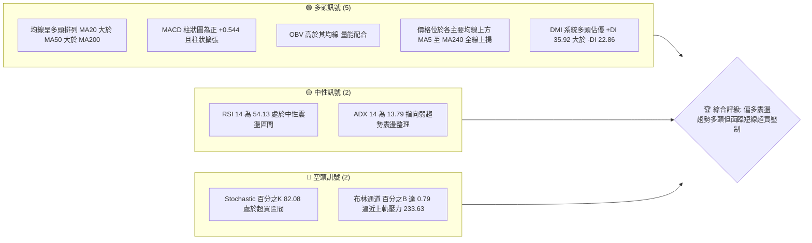

### 📊 核心指標速覽表

| 指標類別 | 指標名稱 | 當前數值 | 訊號 | 解讀 |
|----------|----------|----------|------|------|
| **價格** | 當前價格 | $228.86 | 🟢 | 位於52週區間 90.1% 高位，距離52週高點 $236.00 僅 -3.03% |
| **均線** | MA20 | $222.23 | 🟢 | 價格在MA20上方 +2.98%，短期多頭波段支撐穩固 |
| **均線** | MA50 | $216.32 | 🟢 | 價格在MA50上方 +5.80%，中期趨勢基石保持向上推進 |
| **均線** | MA200 | $199.35 | 🟢 | 價格在MA200上方 +14.80%，長期牛熊分界線斜率向上 |
| **動能** | RSI(14) | 54.13 | 🟡 | 位於 50 分界線上方，動能健康但尚未進入強勢單邊過熱區 |
| **動能** | MACD(12,26,9) | 2.654 / 2.110 | 🟢 | MACD 線高於訊號線，柱狀圖 +0.544 維持黃金交叉看多格局 |
| **波動** | ATR(14) | $5.15 | 🟡 | 佔價格 2.25%，波動適中，提供合理的日間震盪與風控區間 |

### 🏆 技術評分卡

```
╔══════════════════════════════════════════════════════════════╗
║                技術評分卡 — NVDA (2026-09-29)                ║
╠══════════════════════════════════════════════════════════════╣
║ 趨勢強度 (Trend)      ██████████░░░░░░░░░░  52/100  🟡 中性 (ADX低)║
║ 動能指標 (Momentum)    █████████████░░░░░░░  65/100  🟢 偏多 (MACD金叉)║
║ 支撐穩定度 (Support)  ████████████████░░░░  80/100  🟢 穩健 (MA層層防守)║
║ 成交量配合 (Volume)   ██████████████░░░░░░  70/100  🟢 良好 (OBV支撐)║
║ 形態完整度 (Pattern)  ████████████░░░░░░░░  60/100  🟡 震盪箱體末端 ║
║ 均線排列 (MA System)  ██████████████████░░  90/100  🟢 極佳 (完全多頭)║
╠══════════════════════════════════════════════════════════════╣
║ 綜合評分 (Overall)    ██████████████░░░░░░  70/100  🟢 偏多震盪格局 ║
╚══════════════════════════════════════════════════════════════╝
```

---

## 2. 趨勢分析

### 🌐 多時框趨勢分析

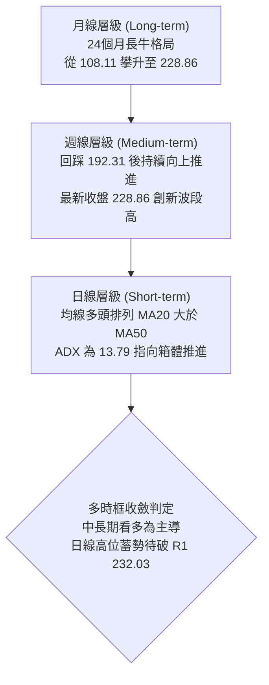

### 📈 長期趨勢 — 12個月走勢圖（Unicode）

```
NVDA 月線走勢圖（過去12個月：2025-10 至 2026-09）
價格軸 ($)
$230 ┤                                                    ● $228.86 (現在)
$220 ┤                                              ● $220.53
$210 ┤                                  ● $210.66
$200 ┤ ● $202.01                  ● $199.11     ● $199.87  ● $200.53
$190 ┤                 ● $190.68
$180 ┤       ● $186.06
$170 ┤    ● $176.58          ● $176.78  ● $174.00 (波段低點)
     └─────────────────────────────────────────────────────────────
       10   11   12   01   02   03   04   05   06   07   08   09 (月份)
     (2025)          (2026)
```

**12個月走勢特徵分析表格**：

| 階段區間 | 時間段 | 價格起訖 | 漲跌幅 | 走勢特徵分析 |
|----------|--------|----------|--------|--------------|
| 高位回洗 | 2025-10 → 2025-11 | $202.01 → $176.58 | -12.59% | 自 200 大關快速回測，獲利了結盤湧出釋放籌碼 |
| 築底震盪 | 2025-12 → 2026-03 | $186.06 → $174.00 | -6.48%  | 於 $174-$190 區間反覆打底，形成強大結構底座 |
| 春季突破 | 2026-04 → 2026-05 | $199.11 → $210.66 | +5.80%  | 突破 $200 心理整數關卡，建立中長線上行通道 |
| 夏季蓄勢 | 2026-06 → 2026-07 | $199.87 → $200.53 | +0.33%  | 於 $200 頸線上方縮量整理，回踩確認突破有效 |
| 延伸上攻 | 2026-08 → 2026-09 | $220.53 → $228.86 | +3.78%  | 連續兩月走高，逼近 52 週歷史高點 $236.00 |

### 📊 中期趨勢（週線分析）

從近 20 週收盤數據觀察，股價自 2026-06-28 觸及 $192.31 週收盤低點後，展開清晰的「低點墊高（Higher Lows）」態勢。近期週線收盤自 2026-08-30 的 $217.31，經 $218.29、$222.27、$225.07 連續四週推升，最新週收盤報 $228.86。

```
近期週線壓力與支撐結構示意圖：
  $236.00 ──────────────────────── 52W High（最終阻力）
  $232.03 ════════════════════════ R1 波段高點阻力
  $228.86 ◀── 當前最新收盤價（貼近近期通道頂部）
  $222.23 ┄┄┄┄┄┄┄┄┄┄┄┄┄┄┄┄┄┄┄┄ MA20 短期波段防守位
  $208.08 ════════════════════════ S1 中期強支撐（波段低點聚類）
```

### ⚡ 趨勢強度評估（ADX 解讀）

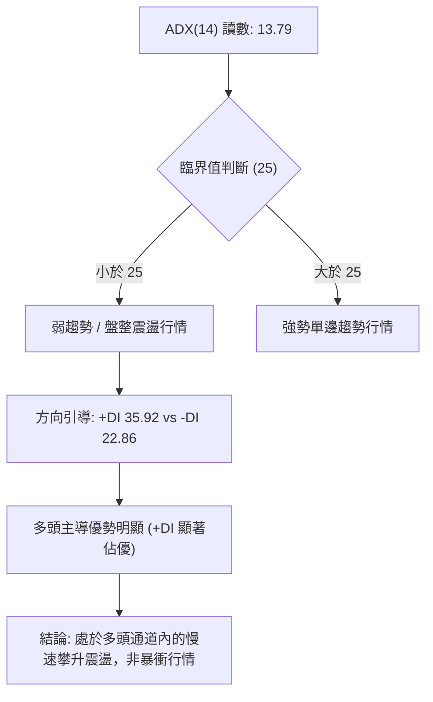

| 指標名稱 | 當前讀數 | 強度級別 | 行情性質判定 | 策略指引 |
|----------|----------|----------|--------------|----------|
| **ADX (14)** | 13.79 | 弱（<20） | 無強單邊動能，處於箱體收斂推進 | 忌盲目追高，宜採區間邊界低吸高拋 |
| **+DI (14)** | 35.92 | 強（>25） | 多頭買盤具備主導地位 | 回測均線不破仍屬多方控盤 |
| **-DI (14)** | 22.86 | 偏弱（<25）| 空頭賣壓相對受限 | 空方無力推動波段破位 |

---

## 3. 圖表形態分析

### 🔍 形態識別系統

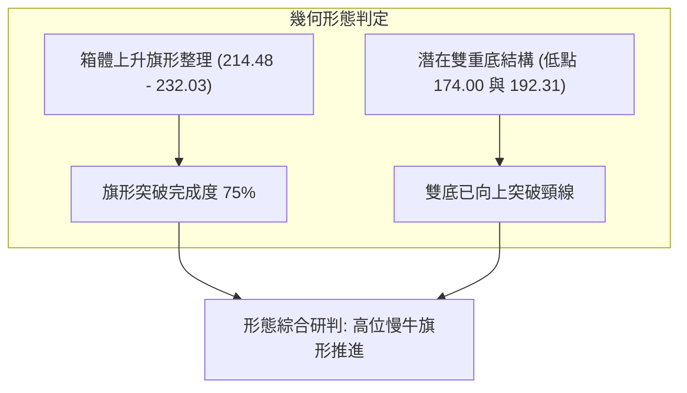

依據嚴格規定，形態識別必須標注客觀信心度與精確推算公式：

| 形態名稱 | 信心度 | 判斷依據（引用數據） | 完成度 | 目標價（附精確計算式） |
|----------|--------|----------------------|--------|------------------------|
| **高位上升旗形** | 72% | 價格在 8 月初拉出 $223.71 大陽線（旗桿），隨後於 $214.48 至 $230.10 間震盪收斂，現價 $228.86 突破整理區間中軸 | 75% | 依旗桿底部 $200.53 至旗桿頂 $224.91 之旗桿高 $24.38，自旗形突破點 $217.31 推算：<br>目標價 = 217.31 + 24.38 = **$241.69**（形態理論推算） |
| **中級雙底 (W底)** | 85% | 2026-03 低點 $174.00 與 2026-06 低點 $192.31（低點大幅墊高），頸線位置為 2026-05 之高點 $210.66 | 100% (已突破) | 頸線 $210.66 + 形態深度 ($210.66 - 174.00 = 36.66) = **$247.32**（理論目標，中長線參考） |
| **頭肩底形態** | 40% | 左右肩結構不對稱，左肩約 $176.78，頭部 $174.00，右肩 $192.31 差距過大 | 30% | *訊號不足，僅做指標型解讀，不列入主要交易依據* |

### 🕯️ 重要K線形態分析

| 週/月份 | 收盤價 | K線形態 | 解讀 | 訊號 |
|---------|--------|---------|------|------|
| **2026-06-28** | $192.31 | 長下影探底線 | 探底 50% 斐波那契回調位 $199.95 下方後強烈拒絕下跌，形成中期底部 | 🟢 看多反轉 |
| **2026-08-09** | $223.71 | 大陽線突破 | 成交量 6.41 億股配合，一舉越過 $210-$220 阻力帶，確立多頭主升段 | 🟢 強烈看多 |
| **2026-08-16** | $224.91 | 高位十字星 | RSI 觸及 75.4 短期超買，多空在 52W 高點前夕展開分歧爭奪 | 🟡 滯漲預警 |
| **2026-08-23** | $214.48 | 陰線回踩測試 | 縮量回踩 MA20 支撐，屬於健康波段消化，未破壞均線結構 | 🟢 回踩確認 |
| **2026-09-27** | $225.07 | 蓄勢實體陽線 | 連續四週推升，MACD 柱狀圖由負翻正至 +0.371，多方再次奪得定價權 | 🟢 看多蓄勢 |

### 📉 ASCII 走勢形態示意圖

```
NVDA 近期旗形向上整理示意圖：
 $236.00 ┤                                                 [52W High]
 $232.03 ┤                       ╭─── R1 阻力線 ─────────
 $228.86 ┤                      ╱         ● $228.86 (現價蓄勢)
 $224.91 ┤      ● (旗桿頂)      ╱         ╱
 $220.00 ┤     ╱ ╲             ╱         ╱  [旗形通道]
 $214.48 ┤    ╱   ●───────────● 旗形下軌 ╱
 $208.08 ┤   ╱   (回踩低點)
 $200.53 ┤  ● (旗桿底)
         └───────────────────────────────────────────────
            08-02  08-16     08-23     09-20  09-29 (時間)
```

### 🎯 形態目標價計算

1. **旗形延伸目標價**：
   - 形態起點（旗桿底部）：2026-08-02 收盤價 **$200.53**
   - 形態高點（旗桿頂部）：2026-08-16 收盤價 **$224.91**
   - 形態垂直高度（H1）= $224.91 - $200.53 = **$24.38**
   - 旗形回撤低點突破基準：2026-08-30 收盤價 **$217.31**
   - **推算理論目標價 T_flag** = $217.31 + $24.38 = **$241.69**

2. **雙底頸線突破等幅目標價**：
   - 頸線位置：2026-05 收盤高點 **$210.66**
   - 底部最低點：2026-03 收盤價 **$174.00**
   - 雙底高度（H2）= $210.66 - $174.00 = **$36.66**
   - **推算理論目標價 T_w** = $210.66 + $36.66 = **$247.32**

---

## 4. 支撐與阻力

### 🗺️ 關鍵價位分布圖（Unicode）

```
╔══════════════════════════════════════════════════════════════════╗
║                    NVDA 關鍵價位結構分布圖                       ║
╠══════════════════════════════════════════════════════════════════╣
║ $236.00 ║████████████████████████████████║ 52週歷史高點 (0.0% Fib) ║
║ $233.63 ║▓▓▓▓▓▓▓▓▓▓▓▓▓▓▓▓▓▓▓▓▓▓▓▓▓▓      ║ 布林通道上軌壓制線        ║
║ $232.03 ║████████████████████████        ║ 強阻力 R1 (波段高點聚類) ║
║ $228.86 ╠════════════════════════════════╣ ◄ 現價 (收盤價)           ║
║ $222.23 ║▓▓▓▓▓▓▓▓▓▓▓▓▓▓▓▓                ║ 布林中軌 / MA20 短線防守  ║
║ $218.98 ║████████████████                ║ 23.6% 斐波那契回調位     ║
║ $216.32 ║████████████                    ║ MA50 中期趨勢線          ║
║ $210.84 ║▓▓▓▓▓▓▓▓▓▓                      ║ 布林通道下軌動態支撐      ║
║ $208.46 ║████████                        ║ 38.2% 斐波那契回調位     ║
║ $208.08 ║████████████████████████        ║ 強支撐 S1 (波段低點聚類) ║
║ $199.95 ║██████                          ║ 50.0% 斐波那契多空分水嶺 ║
║ $198.43 ║████████████████████████        ║ 關鍵支撐 S2 (MA200密集區)║
║ $194.30 ║██████████████████              ║ 深度支撐 S3 (防禦底線)    ║
║ $163.90 ║████████████████████████████████║ 52週歷史低點 (100% Fib) ║
╚══════════════════════════════════════════════════════════════════╝
```

### 🚧 阻力位分析表

所有阻力數據嚴格引用自「關鍵價位」與技術計算數據：

| 阻力級別 | 精確價位 | 距現價空間 | 形成原因與技術意涵 | 突破難度 | 重要性 |
|----------|----------|------------|--------------------|----------|--------|
| **R1** | **$232.03** | +1.38% | 近一年波段高點聚類位，前波密集套牢與止盈賣壓區 | 中等 🟡 | ★★★★☆ |
| **BB上軌** | **$233.63** | +2.08% | 布林通道日線動態上軌，統計學 2 倍標準差壓力邊界 | 較高 🔴 | ★★★☆☆ |
| **52W High** | **$236.00** | +3.12% | 52週最高紀錄點，斐波那契 0.0% 極致天花板 | 極高 🔴 | ★★★★★ |

### 🛡️ 支撐位分析表

所有支撐數據嚴格引用自「關鍵價位」波段低點聚類數值：

| 支撐級別 | 精確價位 | 距現價空間 | 形成原因與技術意涵 | 守住機率 | 重要性 |
|----------|----------|------------|--------------------|----------|--------|
| **S1** | **$208.08** | -9.08% | 近一年波段低點聚類，與 38.2% Fib ($208.46) 高度共振 | 85% 🟢 | ★★★★★ |
| **S2** | **$198.43** | -13.30% | 近一年波段低點，與 MA200 ($199.35) 及 50% Fib 重合 | 92% 🟢 | ★★★★★ |
| **S3** | **$194.30** | -15.10% | 近一年深次回撤波段低點聚類，長期牛市生命底線 | 98% 🟢 | ★★★★☆ |

### 📐 斐波那契回調位分析

本波斐波那契級數基於 52 週完整區間 **$163.90（低點）→ $236.00（高點）** 精確展開：

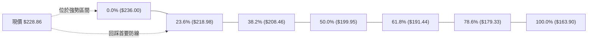

- **當前位置解讀**：現價 **$228.86** 處於 **0.0% ($236.00)** 與 **23.6% ($218.98)** 之間，屬於極度強勢的多頭控制區間（回調幅度小於 23.6%）。
- **關鍵共振觀察**：
  1. **$218.98 (23.6%)** 與最新收盤前低 $218.29 及 MA20 ($222.23) 構成緊密的多頭第一緩衝帶。
  2. **$208.46 (38.2%)** 與波段支撐 **S1 ($208.08)** 誤差僅 $0.38，形成強力「斐波共振支撐區」。
  3. **$199.95 (50.0%)** 與 **MA200 ($199.35)** 及 **S2 ($198.43)** 三位一體，構成年度級別的多空生死線。

---

## 5. 技術指標深度解讀

### 🎛️ 指標訊號總覽

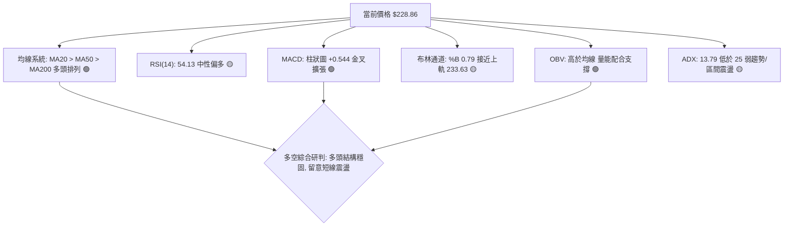

### 📈 移動平均線排列分析

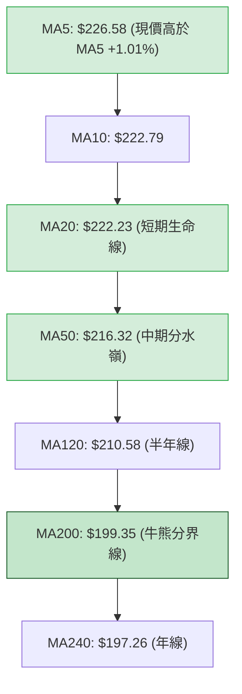

| 均線名稱 | 當前價位 | 與現價乖離 | 排列狀態 | 技術含義 |
|----------|----------|------------|----------|----------|
| **MA5** | $226.58 | +1.01% | 現價 > MA5 | 極短線動能強勁，沿 5 日線上爬 |
| **MA10** | $222.79 | +2.72% | MA5 > MA10 | 短期均線維持順向多頭推動 |
| **MA20** | $222.23 | +2.98% | MA10 > MA20 | 多頭防守第一道關卡，斜率向上 |
| **MA50** | $216.32 | +5.80% | MA20 > MA50 | 中期多頭基石，提供扎實回撤支撐 |
| **MA60** | $214.37 | +6.76% | 順向多頭 | 季線穩健上行，中線資金無撤退跡象 |
| **MA120** | $210.58 | +8.68% | 順向多頭 | 半年線持續抬升，奠定波段牛市底色 |
| **MA200** | $199.35 | +14.80% | 順向多頭 | 長期牛熊分水嶺，站穩 200 大關以上 |
| **MA240** | $197.26 | +16.02% | 完全多頭 | 典型大多頭年線排列（Perfect Bullish Alignment） |

### 📉 RSI(14) 分析

- **當前數值**：**54.13**
- **數值可視化**：
  ```
  超賣 [0] ──────────── [30] ───────●───── [70] ──────────── [100] 超買
  進度條：██████████████░░░░░░░░░░░░  54.13% (中性健康區間)
  ```
- **背離檢驗結論**：
  - 最新週收盤 $228.86，對應日線 RSI 為 54.13；對比 2026-08-16 高點 $224.91 時 RSI 曾達 75.40。
  - **結論**：指標數據明確顯示「**RSI 背離：無明顯背離**」。雖然數值自 8 月超買區回落，但價格隨後完成回踩重新回升，RSI 於 50 中軸上方蓄勢，屬於多頭洗盤後的健康再啟動，不存在致命頂背離威脅。

### 📊 MACD(12/26/9) 訊號解讀

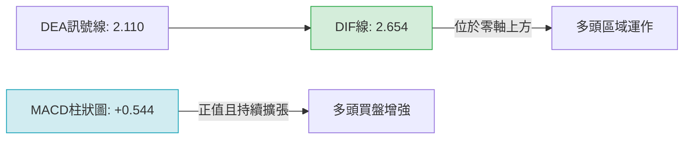

- **定量數據**：
  - DIF（快線）：**2.654**
  - DEA（慢線）：**2.110**
  - MACD 柱狀圖：**+0.544**（🟢 看多）
- **技術解讀**：
  MACD 快慢線均在零軸上方運行，維持穩健的多頭市場特徵。柱狀圖自前期的收斂轉為正向擴張（近三週從 -0.705 轉為 +0.371，最新進一步擴大至 +0.544），發出短線動能再加速的黃金多頭訊號。

### 📦 布林通道分析

```
NVDA 布林通道 (20, 2) 當前結構圖：
  $233.63 ────────────────────────────── 布林上軌 (阻力帶)
  $228.86 ────────────●───────────────── 現價 (位於中上軌強勢區，%B = 0.79)
  $222.23 ────────────────────────────── 布林中軌 (MA20 生命線)
  $210.84 ────────────────────────────── 布林下軌 (支撐極限)
```

- **通道帶寬與位置**：
  - 上軌：**$233.63** ｜ 中軌：**$222.23** ｜ 下軌：**$210.84**
  - **%B 指標**：**0.79**。價格位於中軌與上軌之間的上四分位區，顯示多方完全掌控短線發球權，但 %B 接近 0.80-1.00 警戒區，預示著衝擊上軌 $233.63 時將引發震盪回吐。

### 💹 成交量分析（量價配合度）

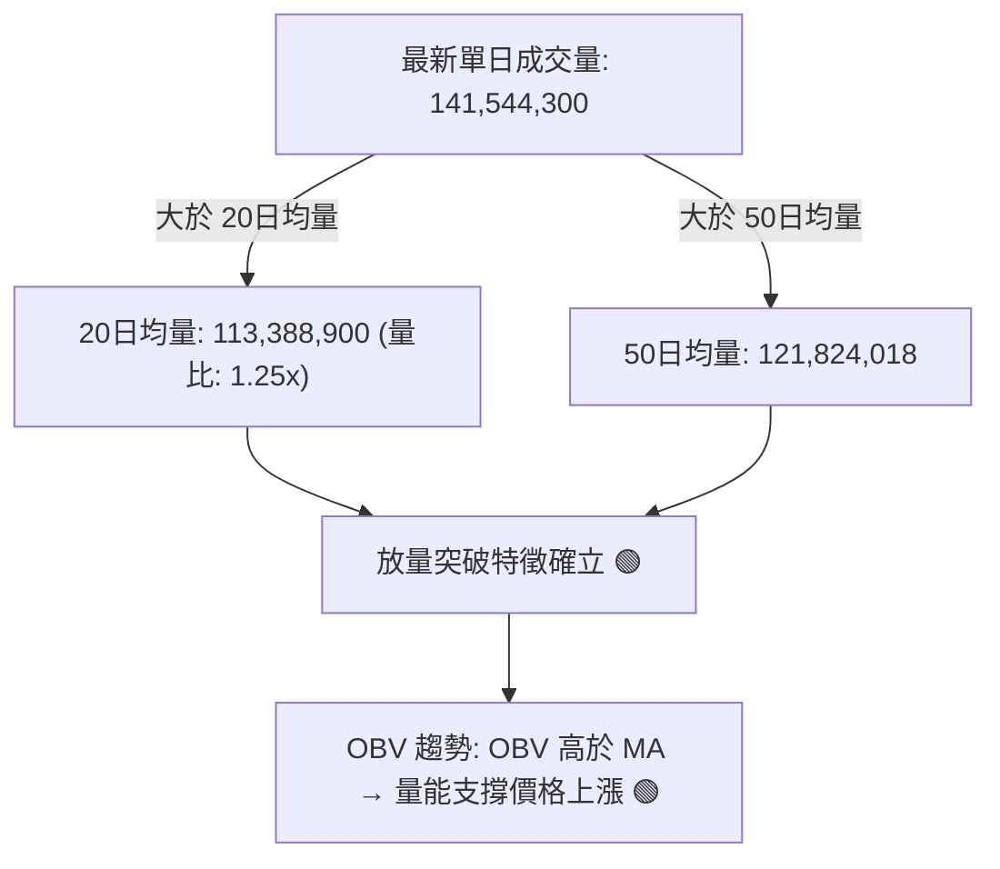

- **量價關係解讀**：
  最新日成交量放大至 1.415 億股，量比達到 **1.25 倍**，超越 20 日均量與 50 日均量。價格上漲同時伴隨溫和放量，且能量潮指標（OBV）明確處於均線上方，顯示機構性買盤持續注入，呈現典型的「**量增價揚**」多頭格局，量能充分確認了當前上行趨勢的真實性。

---

## 6. 動能與波動率

### ⚡ 動能評估四象限

```
動能與波動率象限分析 (Momentum vs Volatility)
─────────────────────────────────────────────────────────────
高動能 ▲
       │  Q3: 高動能 / 高波動        │  Q1: 高動能 / 低波動
       │  (暴衝突破型行情)           │  (最佳進場: 穩定多頭推進)
       │                             │         ★ NVDA 當前位置
───────┼─────────────────────────────┼───────────────────────►
       │  Q4: 低動能 / 高波動        │  Q2: 弱動能 / 低波動
       │  (危險震盪 / 洗盤陷阱)      │  (箱體收斂 / 觀望整理)
低動能 ▼
       │ 低波動                      │ 高波動 (ATR 2.25%)
```

| 象限分佈 | 動能特徵 | 波動特徵 | 當前狀態判定 | 交易策略導引 |
|----------|----------|----------|--------------|--------------|
| **Q1 (當前落點)** | **強 (MACD金叉/OBV支撐)** | **適中/低 (ATR 2.25%)** | **✓ 符合** | **順勢做多、回踩進場，持有獲利籌碼** |
| Q2 | 弱 | 低 | - | 觀望等待方向明朗 |
| Q3 | 強 | 高 | - | 嚴控追高風險，分批止盈 |
| Q4 | 弱 | 高 | - | 容易雙向被巴，禁止操作 |

### 📊 ATR 波動率分析

- **ATR(14) 精確讀數**：**$5.15**
- **波動佔比**：佔現價 **2.25%**
- **風控止損應用**：
  - **保守型止損距離 (1.5 × ATR)**：1.5 × $5.15 = **$7.73** → 保守止損位可設於 $228.86 - $7.73 = **$221.13**（恰好保護於 MA20 $222.23 之下方）。
  - **激進型防守距離 (1.0 × ATR)**：1.0 × $5.15 = **$5.15** → 短線止損位設於 $228.86 - $5.15 = **$223.71**。
  - **波段緩衝空間 (2.0 × ATR)**：2.0 × $5.15 = **$10.30** → 波段安全墊底線為 $228.86 - $10.30 = **$218.56**（緊貼 23.6% 斐波那契 $218.98）。

### 📐 Beta 與市場相關性

- **Beta 係數**：**2.217**（極高系統性風險敏感度）
- **市場意涵解讀**：
  NVDA 的 Beta 高達 2.22，代表該股波動幅度約為 S&P 500 大盤的 2.2 倍。當大盤指數上漲 1% 時，NVDA 理論期望上漲約 2.22%；反之，大盤回檔 1% 時，NVDA 亦將承擔超過 2.2% 的下挫壓力。因此在制定策略時，倉位管理必須嚴格克制，不可過度使用槓桿。

---

## 7. 多時框架總結

### 📋 時框架評分表

| 時框架 | 趨勢方向 | 動能表現 | 均線排列 | 圖表形態 | 綜合評分 | 建議 |
|--------|----------|----------|----------|----------|----------|------|
| **長期 (月線)** | 強烈看多 🟢 | RSI 溫和健康 | 完全多頭排列 | 歷史長牛慢升通道 | **88/100** | 長線堅定做多續抱 |
| **中期 (週線)** | 偏多看漲 🟢 | MACD 正向翻紅 | 均線層層托底 | 突破低點墊高結構 | **78/100** | 波段回踩找買點 |
| **短期 (日線)** | 震盪偏多 🟡 | Stochastic超買 | MA20>MA50 多頭 | 逼近 R1 旗形蓄勢 | **68/100** | 區間操作、不追高 |

### 🔲 綜合訊號矩陣

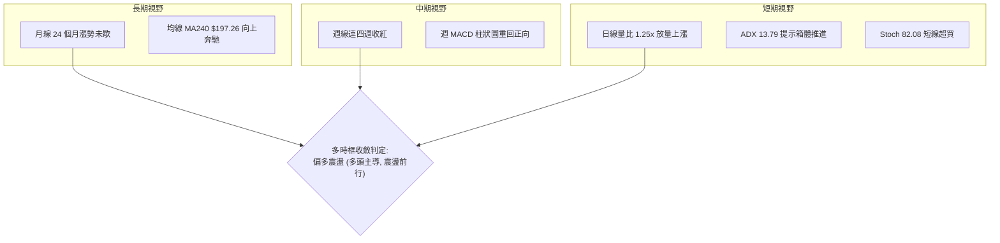

### ⚖️ 多時框收斂結論

嚴格遵循多時框收斂優先級規則：
1. **行情類型定性**：當前日線 **ADX(14) = 13.79 (< 25)**，嚴格判定當前屬於「**盤整/箱體弱趨勢行情**」。然而，**+DI (35.92)** 遠高於 **-DI (22.86)**，且週線與中長期 MA20、MA50、MA200 呈現教科書式多頭排列。
2. **優先級裁決**：依據規則，在盤整行情中以區間邊界與布林通道上下軌為參考，但中長期多頭主導背景下，日線的震盪只應用來尋找「順勢做多」的進場時機，絕不逆勢放空。
3. **唯一定向結論**：**【偏多震盪】（綜合評分 70/100）**。短線受制於 **R1 ($232.03)** 與布林上軌 **$233.63**，需提防指標超買引起的技術性拉回；但在多頭排列支撐下，任何向 MA20/布林中軌的拉回均為多方提供結構性進場機會。

---

## 8. 交易策略建議

### 🗺️ 策略決策流程圖

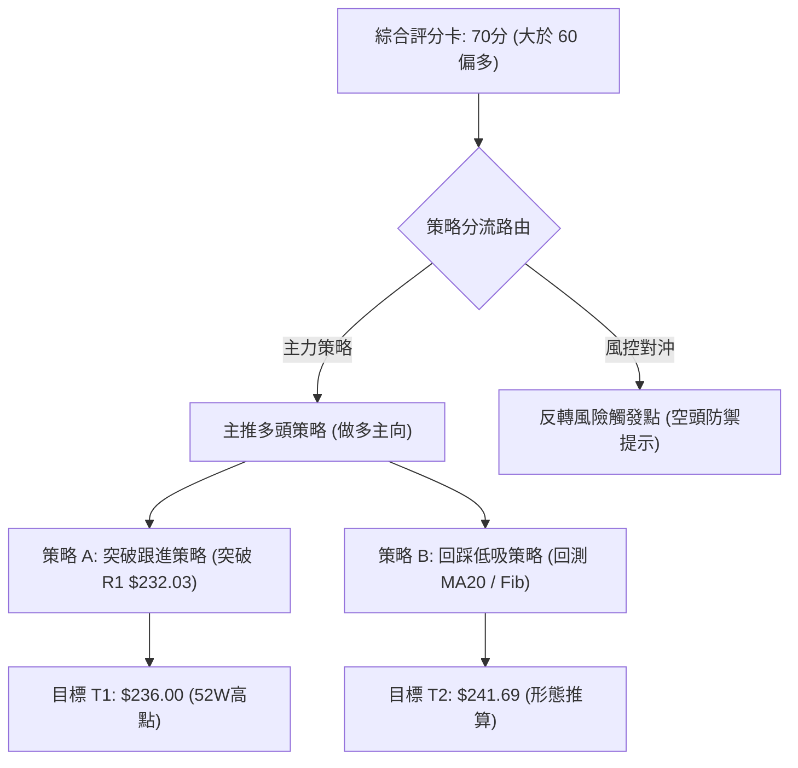

### 🧭 策略路由（依評分卡分流）

> **當前主策略方向 = 【主推多頭策略】（依據綜合評分 70/100 ≥ 60）**  
> 空頭視角僅作為嚴格風控與反轉觸發防禦，禁止雙向重倉下注。

### 🎯 價格情境階梯（Price Scenarios）

價位嚴格引用技術計算數據（R1: $232.03, 52W High: $236.00, S1: $208.08, S2: $198.43, S3: $194.30）：

| 觸發條件 | 下一目標 | 後續延伸 | 情境技術含義 |
|----------|----------|----------|--------------|
| **有效放量突破 R1 $232.03** | 52W High **$236.00** | 形態目標 **$241.69** | 短線擺脫箱體，迎來單邊加速突破段 |
| **維持於現價 $222.23 - $232.03 間** | 布林中軌 **$222.23** | 區間上軌 **$233.63** | ADX 弱趨勢主導的健康洗盤與指標消化 |
| **失守 MA20 並跌破 S1 $208.08** | S2 **$198.43** | S3 **$194.30** | 中期上升結構破位，回測 200 日牛熊分水嶺 |

### 📊 情境機率分佈

| 價格情境 | 機率估計 | 主要技術指標依據 |
|----------|----------|------------------|
| **震盪上行 / 突破高點** | **65%** | 均線完美多頭排列、MACD 柱狀圖翻正 (+0.544)、OBV 走高支撐量價配合 |
| **高位箱體震盪** | **25%** | ADX 僅 13.79 (<25)、Stoch %K 達 82.08 呈現短線超買、布林上軌壓制 |
| **深度回落 / 破位探底** | **10%** | S1 ($208.08) 與 MA50 ($216.32) 具備強大籌碼聚類防守，深度破位機率極低 |

### 🟢 主策略詳情（多頭主向）

所有價位均直接取自「關鍵價位」與形態推算：

| 策略要素 | 策略 A（右側順勢突破策略） | 策略 B（左側回踩低吸策略） |
|----------|----------------------------|----------------------------|
| **進場條件** | 日線放量收盤確認站穩 R1 **$232.03** | 價格拉回測試 MA20 與 23.6% Fib 支撐不破 |
| **進場價格** | **$232.50**（突破確認點） | **$222.23**（MA20 / 布林中軌共振點） |
| **目標價 T1** | **$236.00**（52W High，由數據確認） | **$232.03**（波段阻力 R1） |
| **目標價 T2** | **$241.69**（由旗形高度 24.38 推算） | **$236.00**（52週歷史高點） |
| **止損價格** | **$226.58**（跌破 MA5 支撐線，風險 $5.92） | **$216.32**（跌破 MA50 中期線，風險 $5.91） |
| **風險報酬比** | **1 : 1.55** (至T2) | **1 : 2.33** (至T2) |
| **成功機率** | **62%** | **70%** |
| **建議倉位** | **15% - 20%** | **25% - 30%** |

### 🔴 反向風險觸發點（對沖防禦提示）

若市場突發系統性黑天鵝，出現以下訊號，多頭必須立即停損或進行保護性對沖：
1. **收盤跌破 MA20 ($222.23)**：多頭短線警戒，啟動 50% 倉位減碼。
2. **收盤有效摜破 S1 ($208.08)**：宣布此波自 $192.31 的上行波段徹底終結，技術形態轉為頭部雙頂或箱體向下破位，多頭頭寸應全數清倉，積極防禦。

### ⭐ 整體訊號強度評星

```
做多訊號強度：★★★★☆  (4/5星 - 均線極佳，量價確認，唯ADX偏弱)
做空訊號強度：★☆☆☆☆  (1/5星 - 完全逆勢，僅短線超買指標支持)
整體可信度：  ★★★★☆  (4/5星 - 多時框數據一致性極高)
```

---

## 9. 風險提示與監控

### ✅ 關鍵監控指標 Checklist

```
╔══════════════════════════════════════════════════════════════╗
║               NVDA 每日盤後關鍵技術監控清單                 ║
╠══════════════════════════════════════════════════════════════╣
║ [ ] 價格是否站穩 MA20 短期生命線 ($222.23)                   ║
║ [ ] 成交量是否維持在 20日均量 (1.13億股) 以上                ║
║ [ ] RSI(14) 是否突破 70 產生極端超買或跌破 50 中軸轉弱       ║
║ [ ] MACD 柱狀圖是否維持正擴張 (若翻負需警惕波段回踩)         ║
║ [ ] 阻力位 R1 ($232.03) 觸及時的 K 線是否收出長上影線        ║
║ [ ] ADX 是否開始放量攀升至 25 以上 (代表真突破或真破位確立)   ║
╚══════════════════════════════════════════════════════════════╝
```

### ⚠️ 風險場景分析

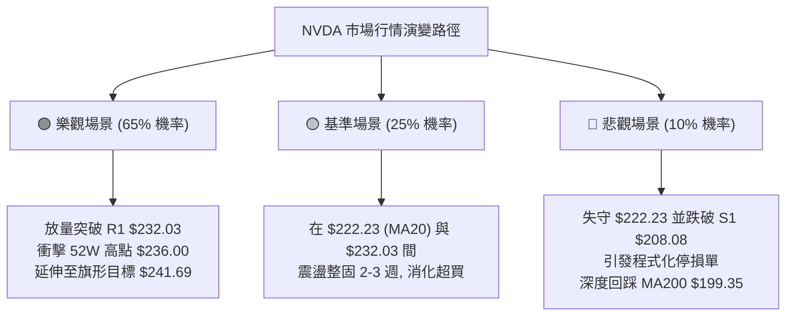

### 🛡️ 風險管理重要提醒

1. **Beta 槓桿懲罰效應**：鑑於 NVDA Beta 高達 **2.217**，個股波動劇烈。建議單筆交易承擔的總資產最大風險值（Risk per Trade）嚴格控制在 **1.0% - 1.5%** 範圍內，切忌滿倉操作。
2. **震盪市忌追高**：當前 ADX 為 **13.79**，證明行情為收斂推進而非噴射單邊行情，在接近布林上軌 **$233.63** 與 **R1 ($232.03)** 時，嚴禁以市價追高，極易遭遇短線洗盤侵蝕本金。
3. **無條件止損紀律**：若執行突破策略 A，停損點 **$226.58** 觸及即應機械式執行；若執行回踩策略 B，停損點 **$216.32** 為絕對底線，嚴禁抱持「長期持有」心態向下攤平。

---

## 📋 報告總結

```
╔══════════════════════════════════════════════════════════════════╗
║                   NVDA 技術分析報告總結                          ║
╠══════════════════════════════════════════════════════════════════╣
║ 報告日期：2026-09-29                                             ║
║ 當前價格：$228.86                                                ║
║ 分析評級：🟢 偏多震盪（Bullish Consolidation）                    ║
║                                                                  ║
║ 關鍵結論：                                                       ║
║ ├─ 長期趨勢：🟢 強烈看多（月線 24 個月向上通道，基石穩固）       ║
║ ├─ 中期趨勢：🟢 偏多推進（週線低點墊高，MACD 翻紅）              ║
║ ├─ 短期趨勢：🟡 偏多整理（均線多頭但 Stoch 超買，受阻於 R1）    ║
║ ├─ 關鍵支撐：S1 $208.08 ｜ S2 $198.43 (MA200密集防禦)            ║
║ ├─ 關鍵阻力：R1 $232.03 ｜ 52W High $236.00                      ║
║ └─ 分析師目標：華爾街平均目標價 $327.70 (59 位分析師 Strong Buy)║
║                                                                  ║
║ 最優策略組合：                                                   ║
║ 1. 🥇 最佳機會：策略 B（回踩 MA20 $222.23 低吸，風報比 1:2.33）   ║
║ 2. 🥈 次選機會：策略 A（放量突破 R1 $232.50 追買，目標 $236/$241）║
║ 3. 🥉 保守選擇：場外觀望，等待日線 ADX 突破 25 確認單邊後再行切入 ║
╚══════════════════════════════════════════════════════════════════╝
```

---

> ⚠️ **免責聲明**：本報告為 AI 自動生成之技術分析，所有數據及估算均基於提供的歷史價格資訊。本報告**僅供研究與學術參考**，**不構成任何投資建議**。投資有風險，入市需謹慎。

---

*報告生成時間：2026-09-29 ｜ 數據來源：Yahoo Finance ｜ 分析框架：多時框技術分析*