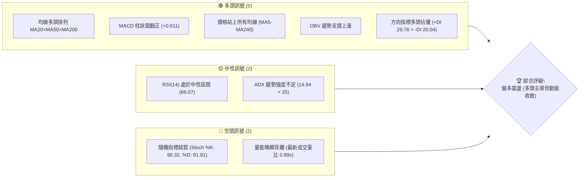
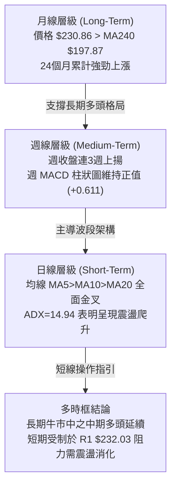
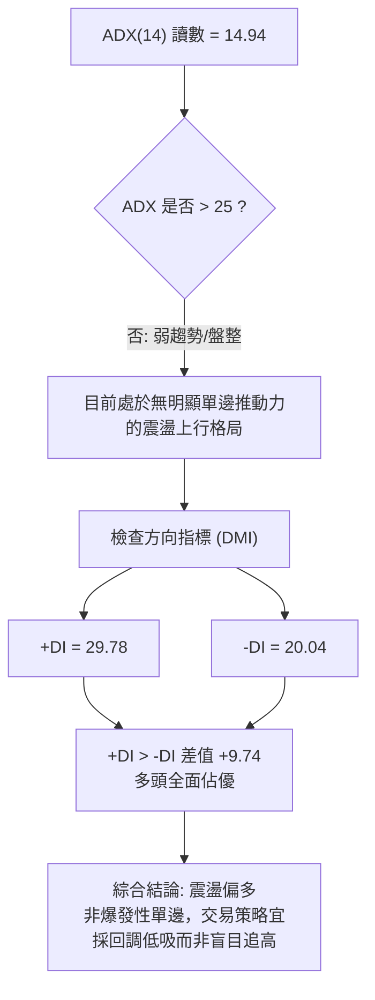
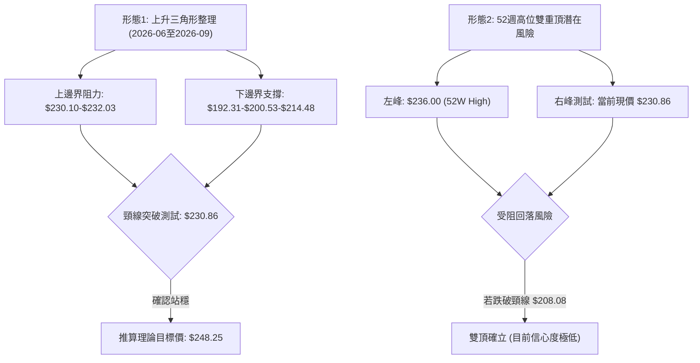
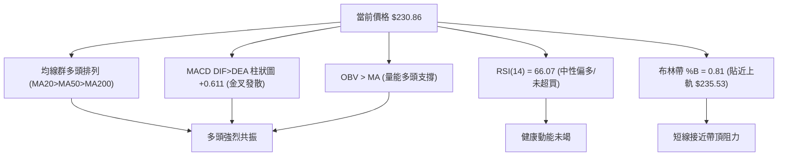
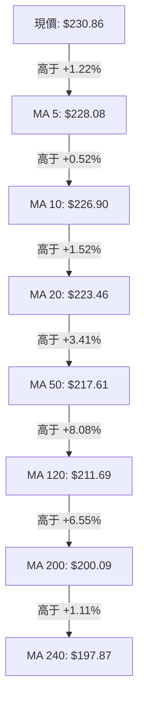
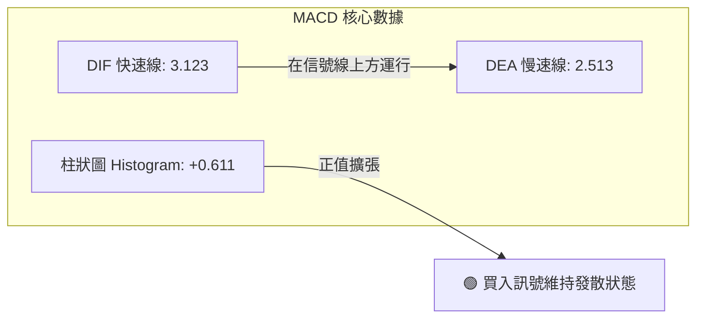
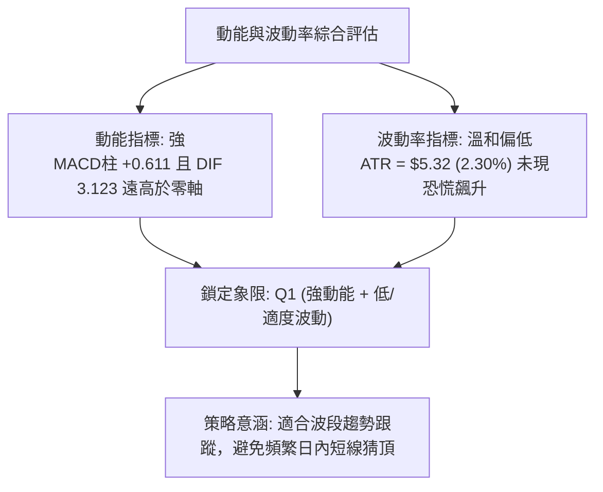
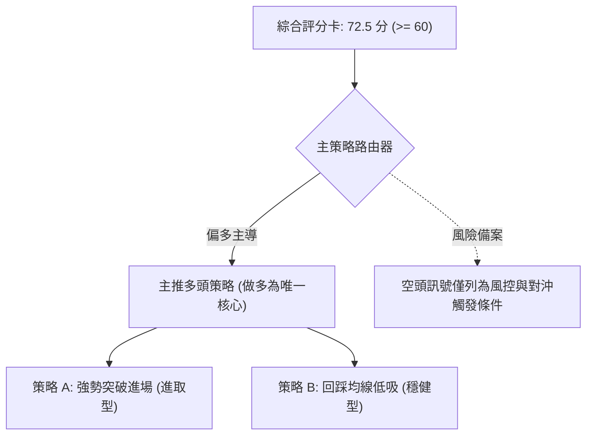
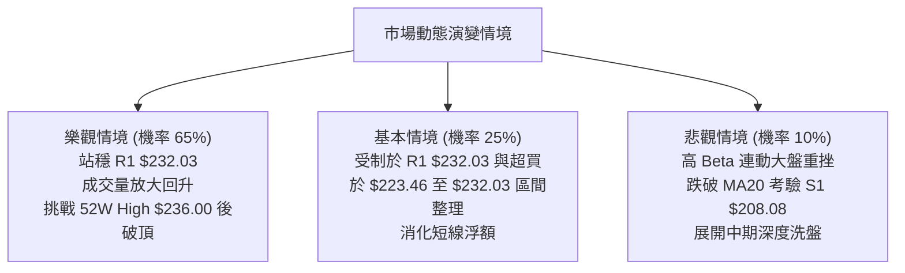

# NVDA 技術分析報告

> **報告日期**：2026-10-02 ｜ **語言**：繁體中文 ｜ **數據來源**：Yahoo Finance ｜ **當前價格**：$230.86

---

## 目錄

| 章節 | 內容 |
|------|------|
| [1. 技術面概覽](#1-技術面概覽) | 訊號儀表板、核心指標、評分卡 |
| [2. 趨勢分析](#2-趨勢分析) | 多時框趨勢、長中短期走勢、ADX強弱 |
| [3. 圖表形態分析](#3-圖表形態分析) | 形態識別、信心度評估、目標價推算 |
| [4. 支撐與阻力](#4-支撐與阻力) | 關鍵價位結構、斐波那契回調層級 |
| [5. 技術指標深度解讀](#5-技術指標深度解讀) | MA系統、RSI、MACD、布林通道、OBV |
| [6. 動能與波動率](#6-動能與波動率) | 動能四象限、ATR風控、Beta與相關性 |
| [7. 多時框架總結](#7-多時框架總結) | 時框架矩陣、優先級收斂結論 |
| [8. 交易策略建議](#8-交易策略建議) | 主策略路由、情境階梯、風報比精算 |
| [9. 風險提示與監控](#9-風險提示與監控) | 監控清單、情境推演、資金控管 |

---

## 1. 技術面概覽

### 🎯 技術訊號儀表板



### 📊 核心指標速覽表

| 指標類別 | 指標名稱 | 當前數值 | 訊號 | 解讀 |
|----------|----------|----------|------|------|
| **價格** | 當前價格 | $230.86 | 🟢 | 位於52週區間92.9%高位，逼近歷史新高區間 |
| **均線** | MA20 | $223.46 | 🟢 | 價格在MA20上方+3.31%，短期多頭支撐穩固 |
| **均線** | MA50 | $217.61 | 🟢 | 價格在MA50上方+6.09%，中期波段多頭完好 |
| **均線** | MA200 | $200.09 | 🟢 | 價格在MA200上方+15.38%，長期牛市基石未破 |
| **動能** | RSI(14) | 66.07 | 🟡 | 進入相對強勢區，尚未觸及70超買臨界，無頂背離 |
| **動能** | MACD(12,26,9) | 3.123 / 2.513 | 🟢 | DIF在訊號線上方，柱狀圖+0.611擴張，看多 |
| **擺動** | Stoch %K / %D | 90.32 / 81.91 | 🔴 | 進入深度超買區間（>80），短線具回踩壓力 |
| **趨勢** | ADX(14) | 14.94 | 🟡 | 處於弱趨勢/盤整區間（<25），震盪洗盤機率高 |
| **通道** | 布林帶 %B | 0.81 | 🟡 | 接近上軌（$235.53），尚未突破但壓縮上移 |
| **量能** | 量比 / OBV | 0.89x / 偏多 | 🟡 | 當日量能略微萎縮，但OBV結構維持健康正向累積 |
| **波動** | ATR(14) | $5.32 | 🟡 | 日波動率2.30%，波動適中，利於波段設置止損 |

### 🏆 技術評分卡

```
╔══════════════════════════════════════════════════════════════════════════╗
║                   技術評分卡 — NVDA (2026-10-02)                        ║
╠══════════════════════════════════════════════════════════════════════════╣
║ 趨勢強度 (Trend)      ████████████░░░░░░░░  60/100  🟡 中性 (ADX低但多排列) ║
║ 動能指標 (Momentum)   ███████████████░░░░░  75/100  🟢 看多 (MACD金叉/RSI強) ║
║ 支撐穩定度 (Support)  ████████████████░░░░  80/100  🟢 強勁 (多重均線密集防守) ║
║ 成交量配合 (Volume)   ████████████░░░░░░░░  60/100  🟡 平平 (略低於20日均量) ║
║ 形態完整度 (Pattern)  ██████████████░░░░░░  70/100  🟢 偏多 (上升通道構築中) ║
║ 均線排列 (MA System)  ██████████████████░░  90/100  🟢 極強 (全週期均線順序排列)║
╠══════════════════════════════════════════════════════════════════════════╣
║ 綜合評分              ███████████████░░░░░  72.5/100  🟢 偏多進攻 / 逢低佈局  ║
╚══════════════════════════════════════════════════════════════════════════╝
```

---

## 2. 趨勢分析

### 🌐 多時框趨勢分析



### 📈 長期趨勢 — 12個月走勢圖（Unicode）

NVDA 過去 12 個月（2025-11 至 2026-10）呈現典型的「V型回撤反彈後震盪創高」架構：

```
NVDA 月線走勢圖（過去12個月：2025-11 至 2026-10）
價格軸 ($)
$235 ┤                                                        ● $230.86 (現價)
$225 ┤                                            ● $220.53   │
$215 ┤                                ● $210.66   │           │
$205 ┤● $202.01 (2025-10前高)        │           │           │
$195 ┤    │               ● $190.68   ● $199.11   ● $200.53   │
$185 ┤    ● $176.58  ● $186.06        │           │           │
$175 ┤        │           ● $176.78   │           │           │
$165 ┤        │               │   ● $174.00 (低點)│           │
     └────┬───────┬───────┬───────┬───────┬───────┬───────┬───┴────────
         11月    12月    01月    02月    03月    04月    05月...10月
```

#### 走勢特徵分析表格

| 階段區間 | 時間跨度 | 起點/終點價格 | 區間幅度 | 核心特徵與技術驅動 |
|----------|----------|---------------|----------|-------------------|
| **回調修正期** | 2025-10 → 2026-03 | $202.01 → $174.00 | -13.87% | 自高位回吐，在 $174.00 築底，守穩 52W 低點 $163.90 之上 |
| **初升修復期** | 2026-03 → 2026-05 | $174.00 → $210.66 | +21.07% | 強勢V型反轉，突破 $200 整數關卡，成交量能顯著放大 |
| **高位箱體期** | 2026-05 → 2026-07 | $210.66 → $200.53 | -4.81%  | 在 $192.31-$210.66 區間展開籌碼換手與均線收斂 |
| **主升推進期** | 2026-07 → 2026-10 | $200.53 → $230.86 | +15.12% | 突破箱體上緣，均線全面發散，推進至 52W 高點 $236.00 警戒線 |

### 📊 中期趨勢（週線分析）

從近20週數據觀察，自 2026-06-28 探底 $192.31 後，週線呈現「波段低點逐步墊高」（Higher Lows: $192.31 → $200.53 → $214.48 → $218.29）的穩固上升階梯。

```
近期週線壓力與支撐結構示意圖：
  $236.00 ────────────────────────────────────────── 52W High (終極強阻力)
  $232.03 ────────────────────────────────────────── R1 聚類阻力 (短線第一道檻)
  $230.86 ◀─── 當前現價 (逼近通道頂部)
  $223.46 ┄┄┄┄┄┄┄┄┄┄┄┄┄┄┄┄┄┄┄┄┄┄┄┄┄┄┄┄┄┄┄┄┄┄┄┄┄┄ MA20 / BB中軌 (第一動態支撐)
  $218.98 ┄┄┄┄┄┄┄┄┄┄┄┄┄┄┄┄┄┄┄┄┄┄┄┄┄┄┄┄┄┄┄┄┄┄┄┄┄┄ 斐波那契 23.6% 回調位
  $208.08 ══════════════════════════════════════════ S1 強支撐 (前密集波段聚類)
```

### ⚡ 趨勢強度評估（ADX 解讀）



#### ADX 強度對照與解讀

| 指標名稱 | 實際數值 | 參考臨界值 | 狀態評估 | 實戰交易含義 |
|----------|----------|------------|----------|--------------|
| **ADX(14)** | 14.94 | 25.00 | 弱趨勢/盤整 (ADX < 25) | 市場未形成單邊瘋狂推動，價格以階梯式揉搓上揚為主 |
| **+DI(14)** | 29.78 | 20.00 | 多方強勢 (+DI > 25) | 買方動能穩定佔據市場主導地位 |
| **-DI(14)** | 20.04 | 20.00 | 空方衰竭 (-DI 處於低位) | 賣方未見系統性砸盤力量，回撤幅度受限 |

---

## 3. 圖表形態分析

### 🔍 形態識別系統

在日線與週線複合架構中，NVDA 於 2026 年夏季歷經充分換手，成功構築出中級「上升三角形/上升旗形」突破結構。



#### 形態信心度與目標價評估表

| 形態名稱 | 信心度 | 判斷依據（引用數據） | 完成度 | 目標價（附精確計算式） |
|----------|--------|----------------------|--------|------------------------|
| **上升整理中繼** | 78% | 週線低點自 2026-06-28 之 $192.31 逐級墊高至 $218.29，且收盤價站上 $230.00 | 85% | 由形態底 $214.48（2026-08-23波段低）與突破頸線 $231.37 推算：<br/>$231.37 + ($231.37 - $214.48) = **$248.26** |
| **高位潛在雙頂** | 22% | 距 52W 高點 $236.00 僅差距 2.18%，Stoch 出現超買 | 15% | 訊號不足，僅做風險備案。若失守 S1 $208.08 頸線，推算目標價：<br/>$208.08 - ($236.00 - $208.08) = **$180.16** |

### 🕯️ 重要K線形態分析

| 週/月份 | 收盤價 | K線形態 | 解讀 | 訊號 |
|---------|--------|---------|------|------|
| **2026-06-28** | $192.31 | 長下影探底錘頭線 | 探底後空頭動能枯竭，成交量 7.56 億股完成恐慌盤承接 | 🟢 看多反轉 |
| **2026-08-09** | $223.71 | 大陽線實體向上跳空突破 | 突破前波多重均線密集帶，MACD 柱狀圖暴增至 +2.494 | 🟢 強烈看多 |
| **2026-08-23** | $214.48 | 縮量十字星回踩 | 回踩 20 週均線獲得強力承接，成交量萎縮至 4.84 億股 | 🟡 中性蓄勢 |
| **2026-09-06** | $230.10 | 光頭中陽線推進 | 強勢衝擊 $230 整數大關，確立新一輪上行中繼底 | 🟢 看多確認 |
| **2026-10-04** | $230.86 | 窄幅微幅創高紅K | 逼近 R1 $232.03，實體收窄，多頭稍作休整但趨勢維持 | 🟢 溫和看多 |

### 📉 ASCII 走勢形態示意圖

```
NVDA 近期價格上升走勢示意圖
$236.00 ┬────────────────────────────────────────── 52W High 阻力
        │                                          ╭─● 現價 $230.86
$230.00 ┼                             ╭─● $230.10  │
        │                             │            │
$220.00 ┼                   ╭─● $223.71            ╰─● $222.27 (回踩)
        │                   │         ╰─● $214.48
$210.00 ┼         ╭─● $210.72
        │         │         ╰─● $200.53
$200.00 ┼         │
        │╭─● $192.31 (形態底部起點)
$190.00 ┴┴──────────────────────────────────────────────────────
        06-28    07-12      08-02     08-09    08-23   09-06    10-04 (週線)
```

### 🎯 形態目標價計算

根據 2026 年 8 月至 9 月形成的上升旗形整合區間，頸線設定於 2026-09-06 收盤價聚類點 **$230.10**，旗標旗桿起點為 2026-08-02 低點 **$200.53**：
1. **旗桿測算高度** = $230.10 - $200.53 = **$29.57**
2. **形態第一滿足目標 (T1)** = 52W High = **$236.00**（保守測試歷史高點）
3. **形態完整等距推算目標 (T2)** = $230.10 + $29.57 = **$259.67**（若有效突破 $236.00 後展開）

---

## 4. 支撐與阻力

### 🗺️ 關鍵價位分布圖（Unicode）

```
NVDA 價位結構分布圖 (由實際 OHLCV 與聚類演算法計算)
═══════════════════════════════════════════════════════════════════════════
$236.00 ║████████████████████████████████████████║ 52週最高點 (52W High / 0.0%)
$232.03 ║████████████████████████████            ║ 關鍵波段高點聚類阻力 R1 (+0.50%)
$230.86 ╠════════════════════════════════════════╣ ◄── 當前即時價格 (Current Price)
$223.46 ║▓▓▓▓▓▓▓▓▓▓▓▓▓▓▓▓▓▓▓▓                    ║ MA20 動態均線 / 布林中軌支撐
$218.98 ║▓▓▓▓▓▓▓▓▓▓▓▓▓▓▓▓▓▓▓▓▓▓▓▓                ║ 斐波那契 23.6% 回調位
$208.46 ║████████████████████████████            ║ 斐波那契 38.2% 回調位
$208.08 ║████████████████████████████████        ║ 關鍵波段低點聚類支撐 S1 (-9.87%)
$199.95 ║████████████████████████████████████    ║ 斐波那契 50.0% / MA200 ($200.09)
$198.43 ║██████████████████████████████████████  ║ 強波段低點聚類支撐 S2 (-14.05%)
$194.30 ║████████████████████████████████████████║ 終極波段低點聚類支撐 S3 (-15.84%)
═══════════════════════════════════════════════════════════════════════════
```

### 🚧 阻力位分析表

所有阻力數值完全取自關鍵價位聚類與高點數據：

| 阻力級別 | 價位 | 距現價幅 | 形成原因與籌碼屬性 | 突破難度 | 重要性 |
|----------|------|----------|-------------------|----------|--------|
| **R1** | $232.03 | +0.50% | 近一年波段高點聚類位，日線短線獲利盤兌現密集區 | 🟡 中等 | ★★★★☆ |
| **52W High** | $236.00 | +2.23% | 52週歷史極值，斐波那契0.0%起始錨定點，心理重大整數卡位 | 🔴 極高 | ★★★★★ |

### 🛡️ 支撐位分析表

所有支撐數值嚴格引用「關鍵價位」區塊波段低點聚類數值：

| 支撐級別 | 價位 | 距現價幅 | 形成原因與籌碼屬性 | 守住機率 | 重要性 |
|----------|------|----------|-------------------|----------|--------|
| **S1** | $208.08 | -9.87% | 近一年密集波段低點聚類，且與斐波那契 38.2% ($208.46) 高度共振 | 85% | ★★★★★ |
| **S2** | $198.43 | -14.05% | 跌破 $200 心理整數關卡後的多頭最後防線，鄰近 MA200 ($200.09) | 92% | ★★★★☆ |
| **S3** | $194.30 | -15.84% | 2026年夏季深幅回調的歷史結構底，牛熊轉換終極分水嶺 | 97% | ★★★★★ |

### 📐 斐波那契回調位分析

依據 52 週完整波段（低點 $163.90 至 高點 $236.00，總跨度 $72.10）進行精確測算：

```
0.0%  (52W High)  ─── $236.00  ──────────────────────────────────────────
                      現價: $230.86 (位於 0.0% 與 23.6% 頂部強勢強攻區)
23.6% 回調位      ─── $218.98  (第一級健康回踩防守線，強勢行情不破此位)
38.2% 回調位      ─── $208.46  (與聚類支撐 S1 $208.08 完美重疊，多頭主防線)
50.0% 回調位      ─── $199.95  (多空中樞，與 MA200 $200.09 重合，強牛熊界限)
61.8% 黃金分割    ─── $191.44  (極限深幅回調位，跌破宣告中期趨勢扭轉)
78.6% 回調位      ─── $179.33  (弱勢整理區間下沿)
100.0% (52W Low)  ─── $163.90  ──────────────────────────────────────────
```

- **位置意義解讀**：當前價格 $230.86 處於 0.0% ($236.00) 與 23.6% ($218.98) 之間的極強勢溢價區間。在此區域內，回調只要不跌破 $218.98，均屬於強牛市架構下的強勢整理；若回調觸及 38.2% ($208.46)，則提供絕佳的盈虧比進場機會。

---

## 5. 技術指標深度解讀

### 🎛️ 指標訊號總覽



### 📈 移動平均線排列分析



#### 均線矩陣詳細參數表

| 均線名稱 | 數值 | 距現價差距 (%) | 趨勢斜率 | 技術意涵 |
|----------|------|----------------|----------|----------|
| **MA 5** | $228.08 | +1.22% | ▲ 上行 | 超短線極速防守線，強勢股持股基準 |
| **MA 10** | $226.90 | +1.75% | ▲ 上行 | 短線推升動能線，拉回不破視為洗盤 |
| **MA 20** | $223.46 | +3.31% | ▲ 上行 | 月度生命線，與布林中軌完全重合 |
| **MA 50** | $217.61 | +6.09% | ▲ 上行 | 季度波段保護線，決定中期持股信心 |
| **MA 60** | $215.88 | +6.94% | ▲ 上行 | 中期籌碼平均成本線 |
| **MA 120** | $211.69 | +9.06% | ▲ 上行 | 半年期支撐大關 |
| **MA 200** | $200.09 | +15.38% | ▲ 上行 | 經典牛熊分界線，斜率正向表明長期大牛未變 |
| **MA 240** | $197.87 | +16.67% | ▲ 上行 | 年線基石，形成深層底座支撐 |

- **結論**：NVDA 呈現教科書級別的「多頭順序排列」（MA5 > MA10 > MA20 > MA50 > MA120 > MA200 > MA240），各均線斜率全部向上，無交叉下行跡象，為最強層級的均線保護。

### 📉 RSI(14) 分析

```
RSI(14) 當前數值：66.07
0 ──────────── 30 ──────────────────────────── 70 ────────── 100
[   超賣區     ] [          常態中性區間        ] [  超買區  ]
                 ░░░░░░░░░░░░░░░░░░░░░░░░░░░░░███ 66.07
```

- **區間評估**：RSI(14) 讀數為 **66.07**，處於強勢看多區間（50-70），既遠離 50 中性平衡點，又尚未越過 70 的極端超買警戒線。
- **背離檢驗**：觀察 2026-09-06 週收盤價 $230.10 時週 RSI 為 53.7，而當前價格 $230.86 時 RSI 上揚至 66.1。價格創新高，RSI 同步創近期新高，**無頂背離現象**，確認動能與價格推進具備健康一致性。

### 📊 MACD(12/26/9) 訊號解讀



- **柱狀圖動態**：MACD 柱狀圖（Histogram）由負轉正並放大至 **+0.611**，表明日線層級的多頭發動週期仍在進行中。儘管此前週線柱狀圖在 8-9 月曾出現輕微鈍化（+2.494 縮減至 -0.507），但隨後在 9 月下旬迅速回正重返多頭擴張軌道，消除了大級別死叉風險。

### 📦 布林通道分析

```
NVDA 布林通道 (20, 2) 結構圖
$235.53 ┬────────────────────────────────────────── BB 上軌 (Upper Band)
        │                      ● $230.86 現價 (%B = 0.81，逼近上軌)
$223.46 ┼────────────────────────────────────────── BB 中軌 (MA20)
        │
$211.39 ┴────────────────────────────────────────── BB 下軌 (Lower Band)
```

- **帶寬與位置解讀**：當前帶寬上下軌跨度為 $24.14（中軌上下約 5.4%）。%B 數值達到 **0.81**，價格運行於中軌（$223.46）與上軌（$235.53）之間的高強勢走廊，通道開口微幅向上擴張，此為典型趨勢上推架構。

### 💹 成交量分析（量價配合度）

```
成交量對比：
最新日成交量  :  98,369,800  [████████████░░░░]  (量比: 0.89x)
20日平均成交量: 109,930,565  [██████████████░░]
50日平均成交量: 121,571,302  [████████████████]
```

- **量價配合判定**：最新成交量為 9,837 萬股，量比為 0.89x，低於 20 日均量與 50 日均量，顯示在衝擊阻力 R1 $232.03 時，市場存在一定的觀望情緒，並未出現爆發性放量換手。
- **OBV（能量潮）狀態**：官方技術指標明確標明「**OBV > MA → 量能支撐上漲**」。這說明中期資金流向處於穩固的淨流入狀態，機構底倉鎖定良好（機構持股達 71.4%），縮量推進反映籌碼安定度極高，空頭無籌碼可供大規模砸盤。

---

## 6. 動能與波動率

### ⚡ 動能評估四象限

| 象限標籤 | 動能維度 | 波動維度 | 狀態特徵 | NVDA 當前定位與評估 |
|----------|----------|----------|----------|---------------------|
| **Q1 (最佳擴張)** | 強動能 | 低波動 | 穩步推進，籌碼集中度高 | 🟢 **NVDA 所處位置**：MACD金叉+RSI 66+ATR僅2.3%，穩健推升 |
| **Q2 (震盪收斂)** | 弱動能 | 低波動 | 窄幅盤整，無方向性指引 | — |
| **Q3 (風險博弈)** | 強動能 | 高波動 | 暴漲暴跌，多空博弈極其劇烈 | — |
| **Q4 (衰竭弱勢)** | 弱動能 | 高波動 | 恐慌拋售，流動性枯竭下行 | — |



### 📊 ATR 波動率分析

- **ATR(14) 數值**：**$5.32**（佔當前股價 $230.86 之 **2.30%**）。
- **實戰防守設置建議**：
  - **極短線動態跟蹤止損**：以 1.0 × ATR 計算 = $5.32，止損緩衝設在現價減 $5.32 = **$225.54**。
  - **波段交易安全止損**：以 1.5 × ATR 計算 = $7.98，止損位落於現價減 $7.98 = **$222.88**（恰好落在 MA20 $223.46 略下方，極具技術防守意義）。
  - **寬幅結構止損**：以 2.0 × ATR 計算 = $10.64，止損位對應 **$220.22**。

### 📐 Beta 與市場相關性

- **Beta 數值**：**2.217**。
- **市場意涵解讀**：NVDA 具備顯著的高彈性特質（Beta > 2.0），當標普500指數或納斯達克100指數波動 1% 時，NVDA 理論上將呈現 2.22% 的同向放大反應。
- **操作對策**：由於高 Beta 特性，在宏觀大盤情緒波動時，NVDA 將首當其衝承受槓桿式放大效果；因此在倉位管理上不可單次過度重倉，需透過階梯分批建倉降低波動衝擊。

---

## 7. 多時框架總結

### 📋 時框架評分表

| 時框架 | 趨勢方向 | 動能狀態 | 均線排列狀況 | 形態健康度 | 綜合評分 | 操作指引 |
|--------|----------|----------|--------------|------------|----------|----------|
| **長期 (月線)** | 🟢 多頭 | 🟢 極強 (24M長牛) | 多頭順序發散 | 歷史高位突破中 | **92 / 100** | 戰略性堅定持股，不輕易交出底倉 |
| **中期 (週線)** | 🟢 多頭 | 🟢 柱狀回升 (+0.611)| 5/10/20週向上發散 | 上升整理旗形構築完成 | **80 / 100** | 波段多頭主升期，拉回支撐加碼 |
| **短期 (日線)** | 🟡 偏多震盪 | 🟡 RSI 66 / Stoch 90超買 | MA20之上，貼布林上軌 | 逼近 R1 $232.03 受阻 | **68 / 100** | 不盲目追高，等待日內或次級回踩 |

### 🔲 綜合訊號矩陣

```
時框架維度共振檢查：
┌─────────────────┬──────────┬──────────┬──────────┬──────────┐
│ 維度            │ 長期(月) │ 中期(週) │ 短期(日) │ 共振判定 │
├─────────────────┼──────────┼──────────┼──────────┼──────────┤
│ 均線趨勢        │   🟢     │   🟢     │   🟢     │ 全面共振 │
│ 動能方向        │   🟢     │   🟢     │   🟡     │ 偏多協同 │
│ 成交量配合      │   🟢     │   🟡     │   🟡     │ 中性支持 │
│ 超買/超賣警戒   │   🟢正常 │   🟢正常 │   🔴超買 │ 短線摩擦 │
└─────────────────┴──────────┴──────────┴──────────┴──────────┘
```

### ⚖️ 多時框收斂結論

依據多時框收斂規則（規則 14）：
1. **行情性質判定**：當前日線 ADX(14) 讀數為 **14.94**（< 25），明確歸類為**弱趨勢/高位盤整行情**。
2. **時框優先級收斂**：在日線 ADX 尚未突破 25 的盤整結構中，日線圖表存在 Stoch 超買（90.32）與 R1 聚類阻力（$232.03），容易引發短線拉扯；然而**週線與月線均線群（MA20/MA50/MA200）呈強勢多頭發散，且 +DI(29.78) 遠大於 -DI(20.04)**。因此，依規則以**中長期方向（多頭）為主導**，日線指標超買僅用於**尋找回調支撐進場點**，絕不可作為逆勢做空的依據。
3. **唯一收斂結論**：**【偏多震盪，強烈建議逢低做多】**。

---

## 8. 交易策略建議

### 🗺️ 策略決策流程圖



### 🧭 策略路由

- **當前主策略方向 = 【主推多頭策略（依綜合評分 72.5 / 100）】**
  - 技術面得分 72.5 分，均線群呈多頭順序排列，MACD 金叉放量，空頭無系統性立足點。空頭操作勝率極低，僅將關鍵支撐跌破作為對沖與減倉依據。

### 🎯 價格情境階梯（Price Scenarios）

價位嚴格引用技術數據中已計算之聚類價位與斐波那契位：

| 觸發條件 | 下一目標 | 後續延伸 | 情境技術含義 |
|----------|----------|----------|--------------|
| **強勢突破 R1 $232.03** | 52W High $236.00 | 形態目標 $248.26 | 突破近一年波段高點壓制，展開歷史新高挑戰之旅 |
| **站穩現價 $230.86 區間** | R1 $232.03 | — | 於 $223.46 (MA20) 與 $232.03 之間強勢高位整理換手 |
| **失守 MA20 回踩 S1 $208.08** | S2 $198.43 | S3 $194.30 | 中期展開深幅洗盤，若觸及 S2 則回測 200 日線大底 |

### 📊 情境機率分佈

| 趨勢情境 | 評估機率 | 主要技術依據 |
|----------|----------|--------------|
| **高位震盪後向上突破 (情境1)** | **65%** | 均線全週期多頭順序、MACD 柱狀圖維持 +0.611、+DI(29.78) 主導、OBV 趨勢向上支持 |
| **布林通道內窄幅橫盤 (情境2)** | **25%** | ADX(14) 僅 14.94 表明單邊爆發力不足、Stoch 超買需藉由橫盤時間換取修正空間 |
| **深度回調測試 S1 支撐 (情境3)** | **10%** | 最新日成交量比 0.89x 呈現微幅縮量、大盤 Beta (2.217) 潛在系統性下行連動 |

### 🟢 主策略詳情

嚴格根據數據源計算之關鍵價位（R1 $232.03、S1 $208.08、MA20 $223.46、ATR $5.32、斐波那契 $218.98）制定：

| 策略要素 | 策略 A（強勢追擊 / 突破型） | 策略 B（穩健逢低 / 回踩型） |
|----------|-----------------------------|-----------------------------|
| **進場條件** | 日K收盤有效站上 R1 $232.03 | 回踩 MA20 / 斐波那契 23.6% 獲支撐企穩 |
| **進場價格** | **$232.50**（確認突破 $232.03 後掛單） | **$223.50**（MA20 $223.46 附近掛單） |
| **目標價 T1** | **$236.00**（52W High 阻力位） | **$232.03**（波段阻力 R1） |
| **目標價 T2** | **$248.26**（旗形形態理論延伸目標） | **$236.00**（52W High 歷史高點） |
| **止損價格** | **$226.90**（跌破 MA10 支撐） | **$218.50**（跌破 23.6% 回調位 $218.98） |
| **風險報酬比 (至T2)**| **1 : 2.81** (風險 $5.60 / 利潤 $15.76) | **$1 : 2.50** (風險 $5.00 / 利潤 $12.50) |
| **成功機率** | 62% | 75% |
| **建議倉位** | 15% - 20% 資金倉位 | 25% - 30% 資金倉位 |

### 🔴 反向風險觸發點（對沖提示）

- **警示價位 1（減倉警報）**：跌破 **$223.46**（MA20 / 布林中軌）。若日線實體跌破此處，表明短期上升趨勢中斷，應平倉多頭波段倉位 50%。
- **警示價位 2（全面防禦）**：跌破 **$218.98**（斐波那契 23.6% 回調位）。多頭策略徹底失效，啟動保護性賣權（Put Options）或平倉觀望。
- **極端反轉觸發**：若價格帶量砸穿 **$208.08**（S1 波段支撐），意味著潛在雙頂確立，此時多單全數離場，反向小幅建立空頭避險對沖。

### ⭐ 整體訊號強度評星

```
╔══════════════════════════════════════════════════════════════╗
║ 做多訊號強度：★★★★☆  (4.0/5星) — 均線與動能優勢顯著       ║
║ 做空訊號強度：★☆☆☆☆  (1.0/5星) — 逆勢博弈風險極大       ║
║ 整體可信度：  ★★★★☆  (4.5/5星) — 數據多指標共振確認     ║
╚══════════════════════════════════════════════════════════════╝
```

---

## 9. 風險提示與監控

### ✅ 關鍵監控指標 Checklist

```
╔══════════════════════════════════════════════════════════════════════════╗
║                       NVDA 日常盤面監控清單 (Checklist)                 ║
╠══════════════════════════════════════════════════════════════════════════╣
║ [ ] 1. 價格是否帶量攻克 R1 $232.03？(成交量需放大至 1.1 億股以上)       ║
║ [ ] 2. 布林中軌 (MA20 $223.46) 是否發揮動態護盤作用？                   ║
║ [ ] 3. Stoch %K(90.32) 是否在高位形成死叉向下跌破 80 超買線？           ║
║ [ ] 4. 日線 ADX(14) 讀數是否突破 25，確認單邊爆發趨勢形成？            ║
║ [ ] 5. MACD 柱狀圖是否持續維持在 0 軸上方（避免形成頂背離鈍化）？       ║
║ [ ] 6. 斐波那契 23.6% ($218.98) 防守位是否完好無損？                    ║
╚══════════════════════════════════════════════════════════════════════════╝
```

### ⚠️ 風險場景分析



### 🛡️ 風險管理重要提醒

1. **高 Beta 波動控制**：NVDA 當前 Beta 為 **2.217**，單日波動極其劇烈（ATR 高達 **$5.32**）。投資人切忌於突破前夕單筆滿倉，總持倉風險暴露建議控制在投資組合總資產的 20%-30% 以內。
2. **止損紀律嚴格執行**：採用 ATR 階梯式保護，短線交易嚴守 **$226.90**（MA10）硬性離場機制，波段交易絕不允許在跌破 **$218.98** 後凹單。
3. **指標超買鈍化防範**：隨機指標 Stoch %K(90.32) 處於高位，盤中急拉不可盲目市價敲進，嚴防「衝高留長上影線」引發之日內回殺。

---

## 📋 報告總結

```
NVDA 技術分析報告總結
══════════════════════════════════════════════════════════════════════════
報告日期：2026-10-02
當前價格：$230.86
分析評級：🟢 偏多進攻 / 蓄勢待發 (技術評分: 72.5 / 100)

關鍵結論：
├─ 長期趨勢：🟢 強烈看多 (MA200 $200.09 上行，月線牛市基石極其堅實)
├─ 中期趨勢：🟢 偏多主導 (週線形成多頭上升階梯，波段低點逐級墊高)
├─ 短期趨勢：🟡 高位震盪 (受制於 R1 $232.03，Stoch 90 超買等待均線跟進)
├─ 關鍵支撐：S1: $208.08 ｜ 動態支撐 MA20: $223.46 ｜ 斐波那契23.6%: $218.98
├─ 關鍵阻力：R1: $232.03 ｜ 52W High: $236.00 ｜ 形態目標: $248.26
└─ 分析師目標：華爾街平均目標價 $327.70 (潛在上行空間 +41.95%)

最優策略組合：
1. 🥇 最佳機會 (策略 B)：回踩 MA20 $223.50 附近建立波段多頭，停損 $218.50，
                         目標看 $232.03 至 $236.00 (盈虧比 1 : 2.50)。
2. 🥈 次選機會 (策略 A)：日K放量突破 R1 $232.03 後於 $232.50 追擊，
                         目標上看 $248.26 (盈虧比 1 : 2.81)。
3. 🥉 保守選擇：在現價 $230.86 保持輕倉觀望，靜待指標由超買區修正或帶量破頂。
══════════════════════════════════════════════════════════════════════════
```

---

> ⚠️ **免責聲明**：本報告為技術分析專項研究，所有數據、價位及模型均基於歷史量價資訊（Yahoo Finance）客觀推演。本報告**僅供學術研究與交易架構參考**，**不構成任何個人化投資建議或買賣邀約**。金融市場瞬息萬變，高 Beta 股票波動劇烈，投資人應依個人風險承受能力獨立判斷並自負盈虧。

---

*報告生成時間：2026-10-02 ｜ 數據來源：Yahoo Finance ｜ 分析框架：多時框技術分析體系*