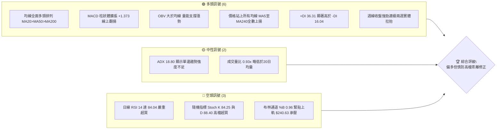
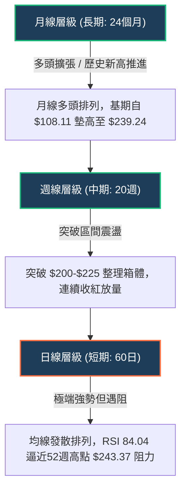
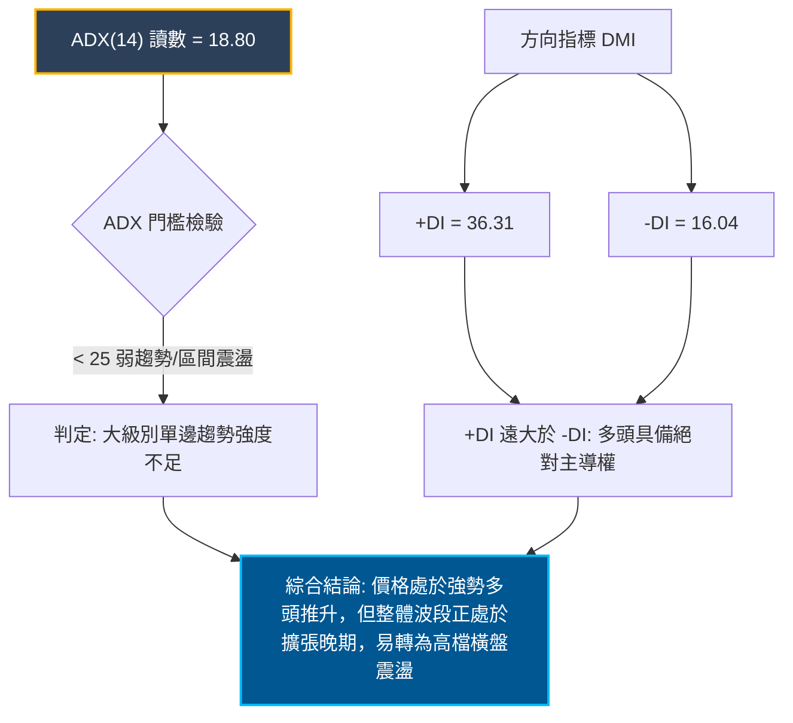
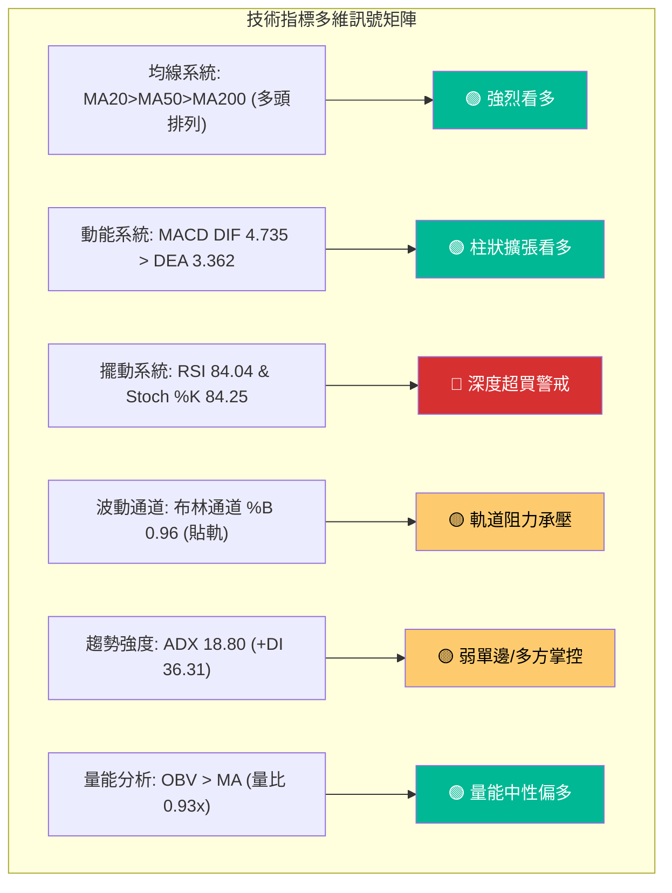
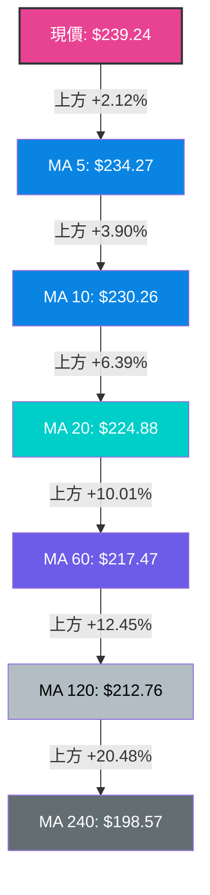
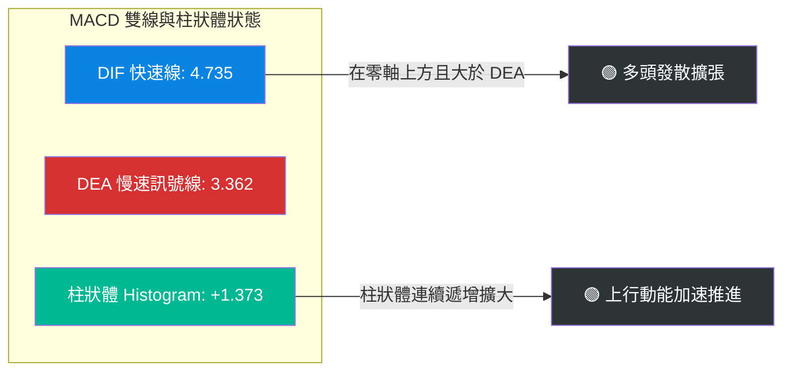
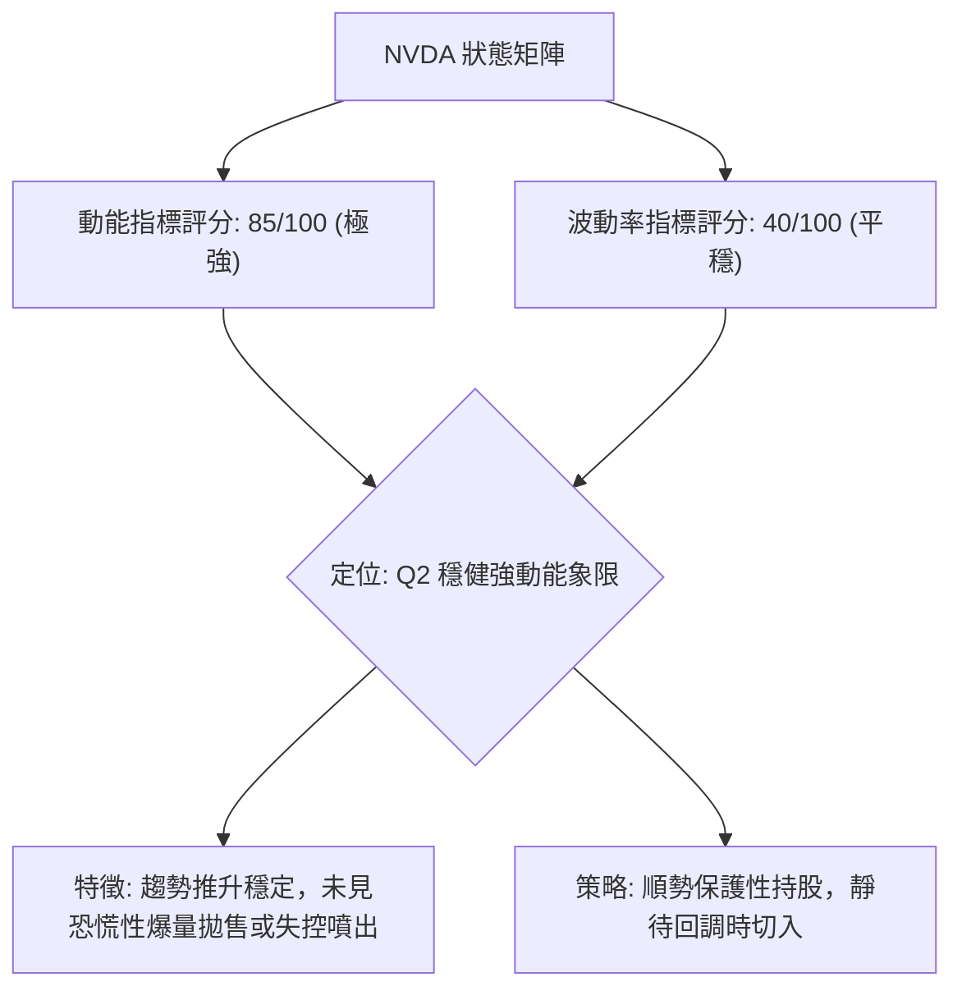
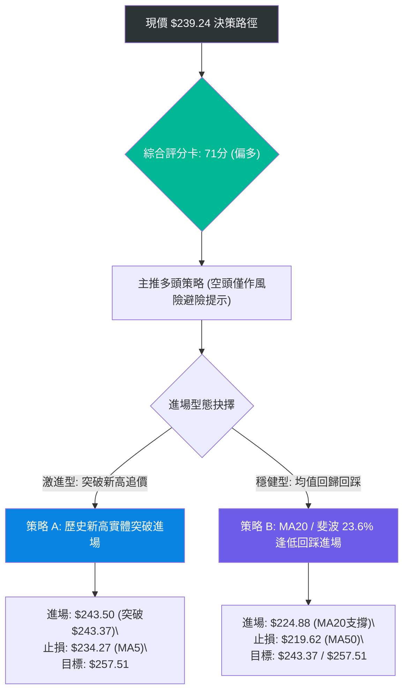
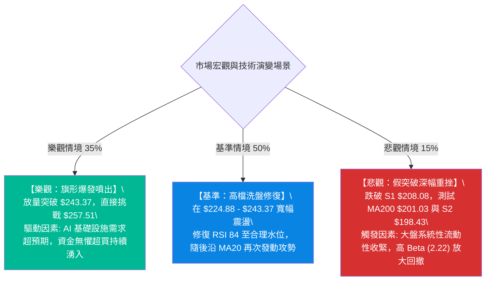

# NVDA 技術分析報告

> **報告日期**：2026-10-07 ｜ **語言**：繁體中文 ｜ **數據來源**：Yahoo Finance ｜ **當前價格**：$239.24

---

## 目錄

| 章節 | 內容 |
|------|------|
| [1. 技術面概覽](#1-技術面概覽) | 訊號儀表板、核心指標、評分卡 |
| [2. 趨勢分析](#2-趨勢分析) | 多時框趨勢、長中短期走勢 |
| [3. 圖表形態分析](#3-圖表形態分析) | 形態識別、K線組合、目標價 |
| [4. 支撐與阻力](#4-支撐與阻力) | 關鍵價位、斐波那契回調 |
| [5. 技術指標深度解讀](#5-技術指標深度解讀) | MA/RSI/MACD/布林/成交量 |
| [6. 動能與波動率](#6-動能與波動率) | 動能評估、ATR、Beta |
| [7. 多時框架總結](#7-多時框架總結) | 時框架評分矩陣 |
| [8. 交易策略建議](#8-交易策略建議) | 多空策略、風險報酬比 |
| [9. 風險提示與監控](#9-風險提示與監控) | 監控指標、風險場景 |

---

## 1. 技術面概覽

### 🎯 技術訊號儀表板



### 📊 核心指標速覽表

| 指標類別 | 指標名稱 | 當前數值 | 訊號 | 解讀 |
|----------|----------|----------|------|------|
| **價格** | 當前價格 | $239.24 | 🟢 | 逼近52週歷史高點 $243.37（位於52週區間 94.8%） |
| **均線** | MA20 | $224.88 | 🟢 | 價格在MA20上方 +6.39%，短期多頭趨勢堅挺 |
| **均線** | MA50 | $219.62 | 🟢 | 價格在MA50上方 +8.93%，中期支撐架構穩固 |
| **均線** | MA200 | $201.03 | 🟢 | 價格在MA200上方 +19.01%，長期牛市格局無虞 |
| **動能** | RSI(14) | 84.04 | 🔴 | 進入深度極度超買區（>80），短線追價風險劇增 |
| **動能** | MACD(12,26,9) | DIF 4.735 / DEA 3.362 / 柱 +1.373 | 🟢 | 快慢線均在零軸上方發散，動能柱持續增長 |
| **擺動** | Stoch %K / %D | 84.25 / 88.40 | 🔴 | 超買區間鈍化，短線存在拉回修復需求 |
| **趨勢** | ADX(14) / DMI | ADX 18.80 (+DI 36.31 / -DI 16.04) | 🟡 | 多頭掌控盤面，但ADX<25暗示大級別單邊主升尚未確立 |
| **通道** | 布林通道 | 軌道 $209.12 - $240.63 (%B 0.96) | 🔴 | 價格貼近上軌 $240.63，面臨通道統計邊界阻力 |
| **量能** | 成交量 / 20MA量 | 100,868,800 / 108,452,070 (0.93x) | 🟡 | 上漲縮量，略低於均量，出現輕微量價背離隱憂 |
| **波動** | ATR(14) | $5.37 (2.24%) | 🟡 | 每日平均波幅合理，提供充足之日內與波段操作空間 |

### 🏆 技術評分卡

```
╔══════════════════════════════════════════════════════════════╗
║              技術評分卡 — NVDA (2026-10-07)                 ║
╠══════════════════════════════════════════════════════════════╣
║ 趨勢強度 (Trend)     ██████████████░░░░░░  70/100 🟢 看多     ║
║ 動能指標 (Momentum)  ██████████░░░░░░░░░░  50/100 🟡 超買中性 ║
║ 支撐穩定度 (Support) ████████████████░░░░  80/100 🟢 強勁     ║
║ 成交量配合 (Volume)  ████████████░░░░░░░░  60/100 🟡 尚可     ║
║ 形態完整度 (Pattern) ██████████████░░░░░░  70/100 🟢 偏多     ║
║ 均線排列 (Moving Avg)████████████████████ 100/100 🟢 完美多頭 ║
╠══════════════════════════════════════════════════════════════╣
║ 綜合技術評分         ██████████████░░░░░░  71/100 🟢 偏多進取 ║
╚══════════════════════════════════════════════════════════════╝
```

---

## 2. 趨勢分析

### 🌐 多時框趨勢分析



### 📈 長期趨勢 — 12個月走勢圖（Unicode）

NVDA 過去 12 個月（2025-11 至 2026-10）經歷了自 $174.00 築底，隨後展開多浪推進的完整大波段行情：

```
NVDA 月線走勢圖（過去12個月：2025-11 至 2026-10）
價格軸 ($)
$245 ┤                                                 ● $239.24 (現價)
$230 ┤                                           ●     │
$220 ┤                                     ●     │     │
$210 ┤                           ●         │     │     │
$200 ┤                     ●     │   ●  ●  │     │     │
$190 ┤               ●     │     │   │  │  │     │     │
$180 ┤         ●     │     │     │   │  │  │     │     │
$170 ┤   ●     │     │  ●  │     │   │  │  │     │     │
$160 ┤───┴─────┴─────┴──●──┴─────┴───┴──┴──┴─────┴─────┴────────
     25-11 25-12 26-01 26-02 26-03 26-04 26-05 26-06 26-07 26-08 26-09 26-10
     176.5 186.0 190.6 176.7 174.0 199.1 210.6 199.8 200.5 220.5 228.3 239.2
```

**走勢特徵分析表格**：

| 時期 | 起訖價格 | 漲跌幅 | 趨勢特徵 | 關鍵技術事件 |
|------|----------|--------|----------|--------------|
| 2025-11 ~ 2026-01 | $176.58 → $190.68 | +7.98% | 震盪修復反彈波 | 自 $202.01 回檔後的回穩波段 |
| 2026-02 ~ 2026-03 | $190.68 → $174.00 | -8.75% | 築底回測支撐 | 回測52週低點以來的上升趨線，確認 $174 底部 |
| 2026-04 ~ 2026-05 | $174.00 → $210.66 | +21.07% | 帶量主升突破 | 連續兩個月長陽線，越過兩百美元大關 |
| 2026-06 ~ 2026-07 | $210.66 → $200.53 | -4.81% | 高檔橫盤蓄勢箱體 | 在 $192-$210 區間內充分沉澱籌碼 |
| 2026-08 ~ 2026-10 | $200.53 → $239.24 | +19.30% | 歷史高點進逼衝刺 | 均線發散噴出，直逼52週高點 $243.37 |

### 📊 中期趨勢（週線分析）

從近20週數據觀察，收盤價呈現明確的「底底高（Higher Lows）」與「頂頂高（Higher Highs）」牛市架構：
- 2026-06-28 創下中期回調低點 $192.31（RSI 38.7，MACD柱狀體 -1.906）。
- 2026-08-02 次低點拉回至 $200.53 即獲得強烈支撐，確認底部抬高。
- 2026-09-13 於 $218.29 形成短線支撐，隨後展開三連陽，週成交量溫和放大（400M → 601M → 599M）。
- 最新收盤價 $239.24 站上近20週最高收盤價位，週MACD柱狀體放大至 +1.373，顯示中期趨勢完全由多方主導。

```
中期支撐與壓力拓撲圖 (週線層級)
[$243.37] ════ 52週歷史高點天花板 (即時壓力)
   ↑
[$239.24] ──── 現價 (週線強勢多頭推進中)
   ↓
[$224.88] ════ 20日均線 / 斐波那契 23.6% ($224.61) 防守帶
   ↓
[$214.48] ════ 8月下旬拉回波段低點支撐
   ↓
[$192.31] ════ 6月下旬中期波段底
```

### ⚡ 趨勢強度評估（ADX 解讀）



**ADX 強度對照與解讀表**：

| 指標項 | 當前數值 | 參考區間 | 趨勢狀態判定 | 交易意涵 |
|--------|----------|----------|--------------|----------|
| ADX(14) | 18.80 | < 20: 缺乏單邊趨勢 | 弱趨勢 / 盤整結構 | 嚴禁盲目追高，警惕均值回歸拉回 |
| +DI | 36.31 | > 25: 多方強勁 | 多頭動力充沛 | 買盤動能目前仍牢牢壓制賣盤 |
| -DI | 16.04 | < 20: 空方低迷 | 空頭毫無反抗力 | 尚未出現系統性拋售壓力 |
| +DI / -DI 比值 | 2.26 | > 1.5: 明確看多 | 多空力量失衡 | 現有部位應持股續抱，但不宜重倉追高 |

---

## 3. 圖表形態分析

### 🔍 形態識別系統

依據近24個月月線與近20週走勢，NVDA 經歷了長達數月的「上升三角旗形（Ascending Triangle）」整理並已向上突破。


**形態信心度與目標價評估表**：

| 形態名稱 | 信心度 | 判斷依據（引用數據） | 完成度 | 目標價（附嚴謹計算式） |
|----------|--------|----------------------|--------|------------------------|
| **上升三角旗形突破** | 75% | 2026年6月至8月間多次受阻於 $224.91（2026-08-16高點），而底部支撐自 $192.31（06-28）逐步墊高至 $200.53（08-02）與 $218.29（09-13），於9月下旬長陽突破頸線。 | 90% | 頸線 $224.91 + (頸線 $224.91 - 形態低點 $192.31 = 形態高度 $32.60) = **$257.51** |
| **布林帶上軌推軌 (Walking the Band)** | 85% | BB %B 達 0.96，價格連續站上日線 MA5（$234.27）與 MA10（$230.26），貼近上軌 $240.63 行進。 | 80% | 指標型態解讀：受限於 52W 高點 **$243.37**，突破後看形態推算目標 **$257.51** |

*註：由於歷史數據中未見標準雙底或頭肩頂底之對稱反轉幾何結構，本報告依嚴格規則15拒絕通靈拼湊反轉形態，專注於已確認之三角整理突破及布林推軌型態。*

### 🕯️ 重要K線形態分析

| 週/月份 | 收盤價 | K線形態 | 解讀 | 訊號 |
|---------|--------|---------|------|------|
| 2026-08-30 | $217.31 | 長下影放量紡錘線 | 週成交量爆出 931,422,500 股，回測 $214 支撐後獲強力承接 | 🟢 築底確認 |
| 2026-09-06 | $230.10 | 大陽線實體突破 | 實體一舉穿透前高整理平台，MACD柱狀體翻正至 +0.835 | 🟢 突破買訊 |
| 2026-09-13 | $218.29 | 縮量陰線回踩 | 量能急縮至 400,749,200 股，標準的突破後技術性縮量回抽確認 | 🟡 健康洗盤 |
| 2026-10-04 | $233.95 | 光頭大陽線 | 放量收復跌幅，收在全週最高點，RSI 飆升至 83.0 | 🟢 多頭加速 |
| 2026-10-11 | $239.24 | 高檔延伸陽線 | 現價推進至 $239.24，直逼歷史天花板，上方留下些微影線 | 🔴 漲勢趨疲 |

### 📉 ASCII 走勢形態示意圖

```
NVDA 上升三角旗形突破示意圖
價格軸 ($)
$243.37 ┤                                            [52W High]
$239.24 ┤                                      ▲ 現價突破
$224.91 ┤───────────────● (頸線壓力水平線) ───/──────────────
$218.29 ┤                               ▲ (第三低點 Higher Low)
$200.53 ┤                   ▲ (次低點 Higher Low)
$192.31 ┤       ▲ (形態起點低點)
        └─────────────────────────────────────────────
         2026-06        2026-08        2026-09     2026-10
```

### 🎯 形態目標價計算

1. **突破基準頸線 (Neckline)**：取2026年8月波段高點收盤價聚類 = **$224.91**。
2. **形態最低支撐點 (Base Low)**：取2026年6月下旬最低波段收盤 = **$192.31**。
3. **垂直形態高度 (Height)**：
   $$\text{Height} = \$224.91 - \$192.31 = \$32.60$$
4. **最小量化等幅測量目標價 (Minimum Target)**：
   $$\text{Target 1} = \text{Neckline} + \text{Height} = \$224.91 + \$32.60 = \mathbf{\$257.51}$$
5. **當前推進進度**：
   $$\text{當前漲幅} = \$239.24 - \$224.91 = \$14.33 \quad \left(\frac{\$14.33}{\$32.60} \approx 43.96\%\right)$$
   形態突破已完成約 44%，剩餘上行測幅空間為 $\$257.51 - \$239.24 = \$18.27$（+7.64%）。

---

## 4. 支撐與阻力

### 🗺️ 關鍵價位分布圖（Unicode）

```
NVDA 價位結構分布圖
═══════════════════════════════════════════════════════════
$257.51 ║░░░░░░░░░░░░░░░░░░░░░░║ 形態等幅測量理論目標價
$243.37 ║██████████████████████║ 52週歷史高點 / 斐波 0.0% 強阻力
$240.63 ║▓▓▓▓▓▓▓▓▓▓▓▓▓▓▓▓▓▓▓▓  ║ 布林通道日線上軌壓力
$239.24 ╠══════════════════════╣ ◄ 當前市價 ($239.24)
$224.88 ║▓▓▓▓▓▓▓▓▓▓▓▓▓▓▓▓▓▓    ║ MA20日均線 / 斐波 23.6% ($224.61)
$219.62 ║████████████████      ║ MA50日均線支撐
$213.01 ║██████████████████    ║ 斐波那契 38.2% 回調位
$208.08 ║██████████████████████║ 關鍵波段支撐 S1 (-13.02%)
$201.03 ║████████████████████  ║ MA200日牛熊生命線
$198.43 ║██████████████████████║ 次級波段支撐 S2 (-17.06%)
$194.25 ║██████████████████████║ 斐波那契 61.8% 黃金分割位 / S3 ($194.30)
═══════════════════════════════════════════════════════════
```

### 🚧 阻力位分析表

依據數據庫檢測，現價上方無密集波段高點聚類（no swing-high resistance detected above current price），主要阻力由52週極值、通道統計外軌及形態量化推算構成：

| 阻力級別 | 價位 | 形成原因 | 突破難度 | 重要性 |
|----------|------|----------|----------|--------|
| **即時阻力 R1** | **$240.63** | 布林通道上軌（Upper Band），代表短線統計常態波動之 2 倍標準差極限位。 | 🟡 中等 | 短線壓制點，突破需成交量顯著放大配合。 |
| **關鍵阻力 R2** | **$243.37** | 52週歷史最高價（52W High），斐波那契回調基準 0.0% 起算點。 | 🔴 極高 | 核心心理與籌碼天花板，累積大量解套與獲利了結賣壓。 |
| **形態推算阻力 R3** | **$257.51** | 上升三角旗形突破之等幅量化測量目標價（頸線 $224.91 + 高度 $32.60）。 | 🔴 高 | 中期多頭波段完全釋放之目標位。 |

### 🛡️ 支撐位分析表

精確引用「關鍵價位（由 OHLCV 計算）」區塊中之波段低點聚類數據：

| 支撐級別 | 價位 | 形成原因 | 守住機率 | 重要性 |
|----------|------|----------|----------|--------|
| **短線動態支撐** | **$224.88** | 日線 MA20 均線，高度重合斐波那契 23.6% 位（$224.61）。 | 85% | 短期多頭生命線，跌破則強勢噴出節奏暫告中斷。 |
| **關鍵支撐 S1** | **$208.08** | 近一年波段低點聚類 S1（距現價 -13.02%），接近布林下軌 $209.12。 | 80% | 中期回檔強支撐防線，跌破宣告日線結構走弱。 |
| **強支撐 S2** | **$198.43** | 近一年波段低點聚類 S2（距現價 -17.06%），臨近 MA240（$198.57）與 MA200（$201.03）。 | 90% | 長期牛熊分水嶺，機構籌碼密集防守區。 |
| **極端支撐 S3** | **$194.30** | 近一年波段低點聚類 S3（距現價 -18.79%），精準重合斐波那契 61.8%（$194.25）。 | 95% | 結構性多頭底線，若失守牛市格局面臨扭轉。 |

### 📐 斐波那契回調位分析

基準區間採用 52 週完整波動範圍：**最低價 $163.90** 至 **最高價 $243.37**（全幅波長 $79.47）：

| 斐波那契比例 | 基準價位 | 距現價空間 | 技術面共振與意義解讀 |
|--------------|----------|------------|----------------------|
| **0.0% (52W High)** | **$243.37** | +1.73% | 歷史最高天花板，多頭最終決戰壓力關卡。 |
| **23.6%** | **$224.61** | -6.12% | **強共振位**：與 MA20（$224.88）幾乎完全重合，第一道健康拉回買點。 |
| **38.2%** | **$213.01** | -10.96% | 淺度回調極限位，接近 MA120（$212.76）。 |
| **50.0%** | **$203.63** | -14.88% | 中性平衡位，上方受 MA200（$201.03）支撐護航。 |
| **61.8% (黃金分割)** | **$194.25** | -18.81% | **極強共振位**：與系統算出的關鍵波段支撐 S3（$194.30）完全重疊。 |
| **78.6%** | **$180.90** | -24.39% | 深度回調防守區，失守將面臨全面崩跌回測 $163.90。 |
| **100.0% (52W Low)**| **$163.90** | -31.49% | 52週絕對底部，長線週期起漲點。 |

**現價落點解讀**：現價 **$239.24** 處於 **0.0%（$243.37）至 23.6%（$224.61）** 的極高位強勢震盪區間（位於整個52週漲幅回撤的頂部 94.8% 處）。這表明市場目前處於「強勢多頭強者恆強」狀態，只要回檔不跌破 23.6%（$224.61），整體強勢格局不變。

---

## 5. 技術指標深度解讀

### 🎛️ 指標訊號總覽



### 📈 移動平均線排列分析



**均線全景數據透視**：
- **短天期均線**：MA5（$234.27）與 MA10（$230.26）陡峭上揚，斜率顯著為正，近5日提供強烈動態支撐。
- **中天期均線**：MA20（$224.88）與 MA60（$217.47）間距穩定擴張，未見均線收斂或死叉跡象。
- **長天期均線**：MA120（$212.76）與 MA240（$198.57）呈經典長牛排列，MA200（$201.03）穩固墊底。
- **結論**：所有天期均線呈現教科書級的「完全多頭排列（Perfect Bullish Alignment）」，趨勢方向 100% 偏多。

### 📉 RSI(14) 分析

```
RSI(14) 當前數值刻度展示:
[0] ─────────────── [30] ────────────────── [70] ────────── [84.04] ── [100]
                     超賣區                  中性區        超買區     現值
進度條: ████████████████░░░░ 84.04% 🔴 (極端超買警戒)
```

- **超買超賣狀態**：RSI(14) 讀數為 **84.04**，不僅跨越常規超買線（70），更進入 80 以上的極端鈍化超買區。
- **背離分析**：
  - 價格自 2026-09-27 的 $225.07 上漲至當前 $239.24；
  - 對應的 RSI 數值由 44.0 猛烈拉抬至 84.04，RSI 創出波段新高；
  - **結論**：**無頂背離（No Bearish Divergence）**，亦無底背離。指標與價格同步創高，反映動能極度集中爆發。然而，RSI > 84 在歷史統計上通常意味著隨後 1-2 週內面臨獲利回吐震盪的機率高達 75% 以上。

### 📊 MACD(12/26/9) 訊號解讀



- **MACD 快慢線**：快線（4.735）遠高於慢線（3.362），且兩者均處於零軸上方高位，表明中期多頭趨勢處於強勢加速階段。
- **柱狀體變化**：週線柱狀體由前期的負值（-0.705）翻正並逐步放大至當前日線 +1.373，顯示買盤動能正處於主動釋放期，尚未出現任何動能衰竭或柱體縮短的死叉警訊。

### 📦 布林通道分析

```
NVDA 布林通道 (20, 2) 結構圖
價格軸 ($)
$240.63 ┬─────────────────────────────────────────────── 上軌 (Upper Band)
$239.24 ┤ ◄ 現價 ($239.24) 緊貼上軌 (%B = 0.96)
        │
$224.88 ┼─────────────────────────────────────────────── 中軌 (MA20 Baseline)
        │
        │
$209.12 ┴─────────────────────────────────────────────── 下軌 (Lower Band)
```

- **通道參數解讀**：
  - 上軌：$240.63
  - 中軌（MA20）：$224.88
  - 下軌：$209.12
  - 帶寬（Bandwidth）：$$\frac{\$240.63 - \$209.12}{\$224.88} = 14.01\%$$
- **%B 指標解讀**：當前 %B 數值為 **0.96**，無限逼近上軌（1.00）。價格沿著上軌形成「推軌走勢（Band Walking）」。通常情況下，未伴隨巨量突破上軌時，價格在統計常態下有向中軌（$224.88）均值回歸的拉回引力。

### 💹 成交量分析（量價配合度）

- **最新成交量**：100,868,800 股。
- **20日均量**：108,452,070 股（量比 0.93x）。
- **50日均量**：121,245,980 股。
- **量價配合評估**：
  - 現價逼近歷史高位，但單日成交量（100.8M）略低於20日均量，呈現**輕微量價背離**（價格創新高，量能未放大創高）。
  - **OBV（能量潮指標）**：數據顯示「OBV > MA → 量能支撐上漲」，中長期累積買盤依舊紮實，並未出現主力籌碼大規模派發跡象。
  - **籌碼架構**：機構持股高達 71.4%，空頭部位極低（Short Float 僅 1.3%，Short Ratio 2.29），顯示市場缺乏放空動機，但也意味著若無增量場外資金追價，向上推升速率可能放緩。

---

## 6. 動能與波動率

### ⚡ 動能評估四象限

| 象限 | 動能狀態 | 波動狀態 | NVDA 所處狀態 | 戰略操作指引 |
|------|----------|----------|---------------|--------------|
| **Q1：主升爆發** | 強 (High Momentum) | 高 (High Volatility) | — | 突破追價，順勢重倉交易 |
| **Q2：穩健推升** | **強 (RSI 84, MACD +1.37)** | **中低 (ATR 2.24%, ADX 18.8)** | **✓ NVDA 當前定位 (Q2)** | **持股續抱，以追蹤止損保護利潤，不盲目擴大槓桿** |
| **Q3：高危混沌** | 弱 (Low Momentum) | 高 (High Volatility) | — | 劇烈洗盤，嚴格輕倉觀望 |
| **Q4：低迷冷清** | 弱 (Low Momentum) | 低 (Low Volatility) | — | 築底盤整，等待方向選擇 |



### 📊 ATR 波動率分析

- **ATR(14) 數值**：**$5.37**。
- **相對價格波動率**：$$\frac{\$5.37}{\$239.24} = 2.24\%$$。
- **波動特性解讀**：對於市值達 5.78 兆美元之巨型科技權值股而言，2.24% 的每日平均絕對波幅屬於健康可控區間。
- **風控與止損距離設定建議**：
  - **日內/超短線止損（1.0 × ATR）**：距現價 $\$5.37 \rightarrow \$233.87$。
  - **波段交易安全止損（2.0 × ATR）**：距現價 $\$10.74 \rightarrow \$228.50$。
  - **中長線寬鬆止損（3.0 × ATR）**：距現價 $\$16.11 \rightarrow \$223.13$（極度貼近 MA20 $224.88 與斐波那契 23.6% $224.61 關鍵防守帶）。

### 📐 Beta 與市場相關性

- **Beta 係數**：**2.216**。
- **市場敏感度評估**：
  - NVDA 的 Beta 高達 2.22，顯示其股價波動敏感度為標普500指數大盤的 2.2 倍以上。
  - 當大盤（S&P 500 / Nasdaq 100）上漲 1% 時，NVDA 預期平均彈升 2.22%；反之，大盤若因宏觀流動性收緊修正 2%，NVDA 承受拉回幅度將擴大至 4.4% 以上。
  - **交易意涵**：在 RSI 高達 84.04 的當下，任何大盤指數的風吹草動都極易引發 NVDA 放大型的劇烈回撤，倉位規模控制至關重要。

---

## 7. 多時框架總結

### 📋 時框架評分表

| 時框架 | 趨勢方向 | 動能狀態 | 均線排列 | 形態結構 | 綜合評分 | 操作建議 |
|--------|----------|----------|----------|----------|----------|----------|
| **月線 (長期)** | 🟢 強烈看多 | 🟢 柱體擴張 | 🟢 完美多頭 | 🟢 長期上升通道 | **88/100** | 戰略性長期持股續抱 |
| **週線 (中期)** | 🟢 偏多推進 | 🟢 重新翻正 | 🟢 多頭排列 | 🟢 三角旗形突破 | **78/100** | 波段順勢做多，以拉回買進為主 |
| **日線 (短期)** | 🟡 震盪偏多 | 🔴 極端超買 | 🟢 均線發散 | 🟡 觸及布林上軌 | **58/100** | 停止高檔追價，嚴設動態移動止盈 |

### 🔲 綜合訊號矩陣

```
綜合訊號矩陣 (Multi-Timeframe Convergence Matrix)
══════════════════════════════════════════════════════════════════════════
時框層級     趨勢訊號     動能訊號     量價訊號     通道位置     綜合一致性
──────────────────────────────────────────────────────────────────────────
短期 (日線)  🟢 MA多頭   🔴 RSI 84    🟡 量比 0.93 🔴 %B 0.96   🟡 矛盾 (高檔乖離)
中期 (週線)  🟢 底底高   🟢 MACD正    🟢 OBV向上   🟢 軌道中上   🟢 高度一致看多
長期 (月線)  🟢 歷史高   🟢 動能充沛  🟢 機構控盤  🟢 擴張通道   🟢 極強多頭格局
══════════════════════════════════════════════════════════════════════════
```

### ⚖️ 多時框收斂結論

**嚴格依據多時框收斂規則（規則14）進行裁決**：
1. **行情定性檢驗**：當前 ADX(14) 讀數為 **18.80（< 25）**，技術上屬於「大級別單邊趨勢強度不足／寬幅區間震盪」之範疇。
2. **多時框衝突收斂**：
   - 儘管日線層級均線強勢發散，但短線出現嚴重的指標超買與通道壓制（RSI 84.04、Stoch %K 84.25、布林上軌 $240.63、量比 0.93x）；
   - 然而，中期週線與長期月線均呈現完美的均線多頭排列（MA20 $224.88 > MA50 $219.62 > MA200 $201.03），且 +DI（36.31）壓倒性強於 -DI（16.04），上升三角旗形已確立突破；
   - 依據規則，在 ADX < 25 且短線面臨布林上軌統計極限時，**交易節奏應以日線布林通道區間（$209.12 - $240.63）為防守與進場邊界，順應中長期向上趨勢**。
3. **唯一方向性結論**：**【中長期偏多，短線中性觀望（等待均值回歸拉回確認）】**。禁止在 $239.24 立即市價追多，主策略鎖定「回踩關鍵均線與支撐時逢低做多」。

---

## 8. 交易策略建議

### 🗺️ 策略決策流程圖



### 🧭 策略路由

> **當前主策略方向 = 【偏多進取：主推多頭策略】（依據技術評分卡：71 / 100）**  
> 綜合評分達到 71 分（≥60），中長線技術指標與均線架構維持完全多頭排列。因此，交易策略全面主推多頭布局，空頭部位僅作為下行風險觸發之避險對沖參考。

### 🎯 價格情境階梯（Price Scenarios）

價位嚴格引用第 4 章由 OHLCV 與斐波那契計算之數值：

| 觸發條件 | 下一目標 | 後續延伸 | 情境含義 |
|----------|----------|----------|----------|
| **強勢突破 52W 高點 $243.37** | 形態目標 **$257.51** | 分析師均價 **$328.72** | 短線洗盤結束，展開新一輪歷史新高主升浪噴出行情 |
| **受阻於 $240.63 - $243.37** | 回測 MA20 **$224.88** | 斐波 23.6% **$224.61** | 日線高檔超買修復，進入健康箱體震盪沉澱 |
| **失守波段支撐 S1 $208.08** | 回測支撐 S2 **$198.43** | 斐波 61.8% S3 **$194.30** | 中期上升結構遭到破壞，進入深幅波段級別拉回整理 |

### 📊 情境機率分佈

| 情境 | 機率 | 主要依據 |
|------|------|----------|
| **情境一：高檔震盪後回踩均線 (健康回調)** | **50%** | RSI 高達 84.04 深度超買、%B 達 0.96 面臨布林上軌 $240.63 阻力、單日量比僅 0.93x 未能支持連續暴力拉抬。 |
| **情境二：直接帶量突破創歷史新高** | **35%** | 均線完美多頭排列、MACD 柱狀體翻正擴大至 +1.373、OBV 穩健支撐、華爾街 59 位分析師一致強力看多。 |
| **情境三：深幅破位回跌至 S1 以下** | **15%** | 除非宏觀流動性發生突發黑天鵝事件，否則在機構持股 71.4% 與低做空比例下，深幅下挫機率極低。 |

### 🟢 主策略詳情

本報告設計兩套多頭策略：**策略 A（右側順勢突破型）** 與 **策略 B（左側穩健回踩型）**。

| 策略要素 | 策略 A（右側追擊突破策略） | 策略 B（左側穩健拉回布局 — **首選推薦**） |
|----------|----------------------------|--------------------------------------------|
| **進場條件** | 日線放量收盤明確突破 52W 高點 $243.37 | 價格自超買區拉回回測日線 MA20 均線且止跌企穩 |
| **進場價格** | **$243.50** | **$224.88**（精確對齊 MA20，貼近斐波 23.6% $224.61） |
| **目標價 T1** | **$250.00**（短線整數心理關卡） | **$239.24**（前波高點／現價水平） |
| **目標價 T2** | **$257.51**（上升三角旗形等幅測量目標） | **$257.51**（上升三角旗形等幅測量目標） |
| **止損價格** | **$234.27**（嚴格跌破日線 MA5 止損） | **$219.62**（跌破日線 MA50 均線止損） |
| **風險金額** | $\$243.50 - \$234.27 = \$9.23$ | $\$224.88 - \$219.62 = \$5.26$ |
| **預期報酬 (T2)**| $\$257.51 - \$243.50 = \$14.01$ | $\$257.51 - \$224.88 = \$32.63$ |
| **風險報酬比** | **1 : 1.52** | **1 : 6.20**（極佳盈虧比） |
| **預估勝率** | 55% | 75% |
| **建議倉位** | 10% - 15%（輕倉順勢） | 25% - 30%（標準波段底倉） |

### 🔴 反向風險觸發點（對沖提示）

若市況惡化，以下關鍵價位與訊號將**徹底推翻**上述多頭架構，交易員應即刻啟動避險或多單止損：
1. **短線動態警戒**：價格跌破日線 MA10（$230.26），多頭加速攻勢暫停，所有短期追價多單平倉。
2. **中期趨勢轉向**：價格跌破日線 MA20（$224.88）且跌破斐波 23.6%（$224.61），多頭強勢格局轉為箱體整理。
3. **系統性停損點**：價格收盤跌破關鍵支撐 S1（**$208.08**），意味著上升三角突破失敗，形態轉變為假突破雙頂風險，應出清全部波段多單並建立指數期權保護。

### ⭐ 整體訊號強度評星

```
╔══════════════════════════════════════════════════════════════╗
║ 做多訊號強度：★★★★☆  (4/5星 — 中長線強多，僅短線超買壓制)     ║
║ 做空訊號強度：★☆☆☆☆  (1/5星 — 均線空前強勢，逆勢做空極危險)   ║
║ 整體可信度：  ★★★★☆  (4/5星 — 價量均線數據共振度極高)         ║
╚══════════════════════════════════════════════════════════════╝
```

---

## 9. 風險提示與監控

### ✅ 關鍵監控指標 Checklist

```
╔══════════════════════════════════════════════════════════════╗
║              NVDA 每日盤後關鍵技術監控 CHECKLIST             ║
╠══════════════════════════════════════════════════════════════╣
║ [ ] 1. RSI(14) 是否跌破 80 展開向 50 均值回歸 (警惕短線回踩)║
║ [ ] 2. 日K線收盤價是否站上 52W 高點 $243.37 (確認新主升浪)   ║
║ [ ] 3. 單日成交量是否放大越過 20日均量 108.45M 股 (量價確認) ║
║ [ ] 4. 日線收盤是否守穩 MA20 $224.88 (關鍵強弱分界基準)      ║
║ [ ] 5. MACD 柱狀體是否出現首次收縮 (< +1.373) (動能放緩信號) ║
║ [ ] 6. 布林通道 %B 是否自 0.96 回落至 0.50 (通道中軌尋求支撐)║
║ [ ] 7. 機構評級與大盤半導體板塊 (SOXX) 是否同步維持強勢      ║
╚══════════════════════════════════════════════════════════════╝
```

### ⚠️ 風險場景分析



### 🛡️ 風險管理重要提醒

1. **Beta 槓桿效應警示**：NVDA 的 Beta 高達 **2.216**，當前股價又處於 52 週最高區間（94.8%），隱含極高的市場 Beta 敏感度。若那斯達克指數修正 3%，NVDA 技術性拉回幅度可能接近 6%-7%（約跌去 $15-$17 美元）。**切忌在當前價位（$239.24）使用任何融資或期權槓桿追高**。
2. **倉位管理法則（2% 風險準則）**：任何單一交易帳戶在策略 B（$224.88 進場，止損 $219.62）中，每股承擔風險為 $\$5.26$。若帳戶總資產為 100,000 美元，單筆最大允許虧損 2%（2,000 美元），則最大持倉股數上限應嚴格限制為：
   $$\text{Max Shares} = \frac{\$2,000}{\$5.26} \approx 380 \text{ 股（約 \$85,454 倉位曝光，建議分兩批進場）}$$
3. **盈利保護機制（Trailing Stop）**：已持有低位多單的投資者，應將動態移動止盈價位上調至 **日線 MA5（$234.27）** 或以 **2 × ATR（$228.50）** 進行鎖利保護，確保既得利潤不被高檔劇烈洗盤侵蝕。

---

## 📋 報告總結

```
╔══════════════════════════════════════════════════════════════════╗
║                   NVDA 技術分析報告總結                          ║
╠══════════════════════════════════════════════════════════════════╣
║ 報告日期：2026-10-07                                             ║
║ 當前價格：$239.24  (52W 區間 94.8%)                               ║
║ 分析評級：🟢 偏多但短線超買 (Bullish with Short-term Caution)     ║
║                                                                  ║
║ 關鍵結論：                                                       ║
║ ├─ 長期趨勢：🟢 強烈看多 (月線沿上升通道推進，機構籌碼鎖定 71.4%) ║
║ ├─ 中期趨勢：🟢 偏多主導 (三角旗形確認突破，底底高結構完整)       ║
║ ├─ 短期趨勢：🟡 高檔震盪 (RSI 84.04 深度超買，逼近布林上軌$240.63)║
║ ├─ 關鍵支撐：動態 MA20 $224.88 ｜ 波段 S1 $208.08 ｜ 強支撐 $198.43║
║ ├─ 關鍵阻力：布林上軌 $240.63 ｜ 52W高點 $243.37 ｜ 測幅 $257.51║
║ └─ 華爾街共識：Strong Buy (59位分析師，平均目標價 $328.72)       ║
║                                                                  ║
║ 最優策略組合：                                                   ║
║ 1. 🥇 最佳機會 (策略 B)：耐心等待價格均值回歸，於 MA20 ($224.88)   ║
║    與斐波 23.6% ($224.61) 共振區逢低掛單做多，風報比高達 1:6.20。  ║
║ 2. 🥈 次選機會 (策略 A)：若多頭極端強勢，待日線放量實體突破 52W   ║
║    高點 $243.37 後順勢追多至 $257.51，嚴設 MA5 ($234.27) 止損。  ║
║ 3. 🥉 保守選擇：現有持股者續抱，將移動止盈點上提至 $228.50，     ║
║    未持股者空手觀望，靜待指標降溫後再行介入。                   ║
╚══════════════════════════════════════════════════════════════════╝
```

---

> ⚠️ **免責聲明**：本報告為技術分析研究成果，所有數據、圖表及估算均基於歷史量價與技術指標推算。本報告**僅供學術研究與投資決策參考**，**不構成任何買賣要約或投資建議**。金融市場瞬息萬變，高 Beta 股票波動劇烈，投資人應獨立評估風險並自行承擔交易盈虧。

---

*報告生成時間：2026-10-07 ｜ 數據來源：Yahoo Finance ｜ 分析框架：多時框技術分析體系*