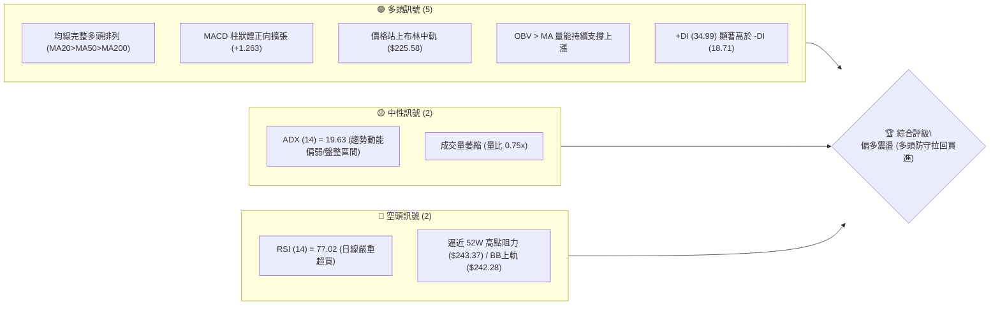
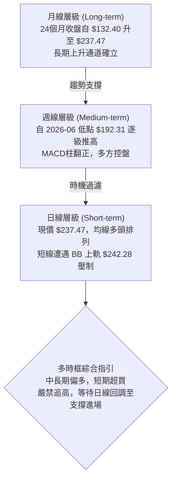
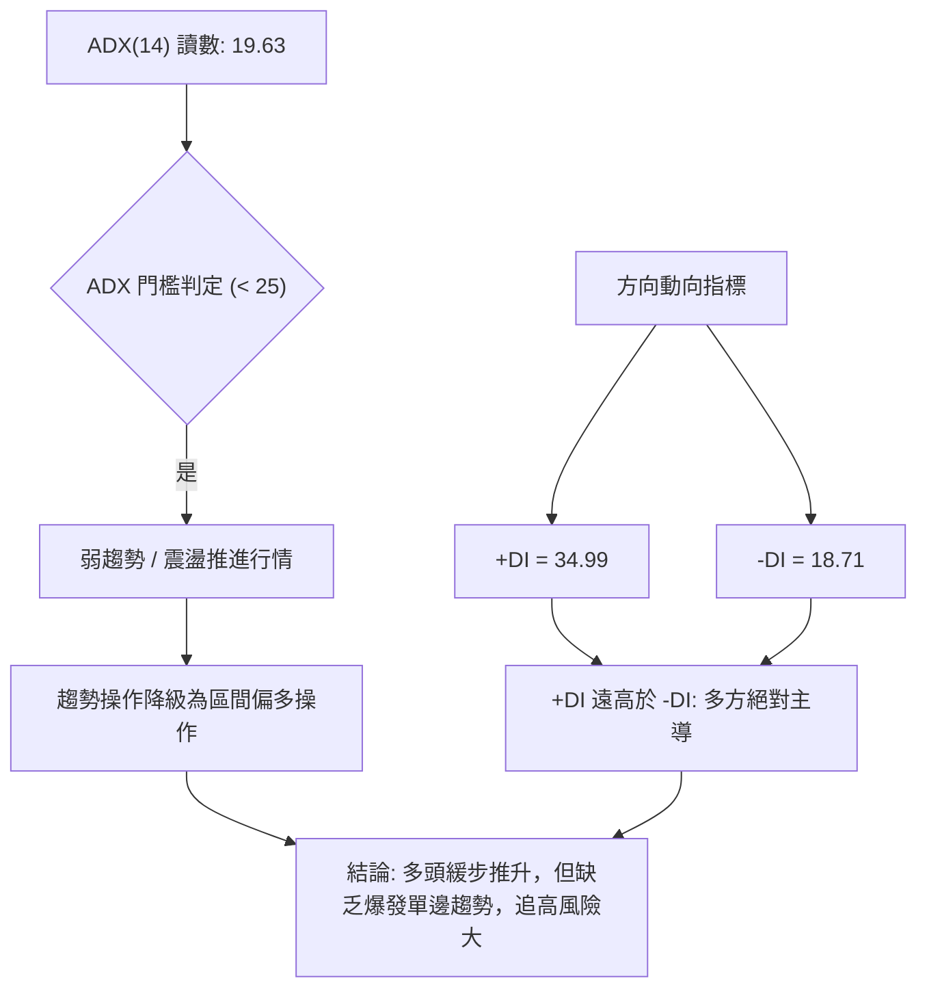
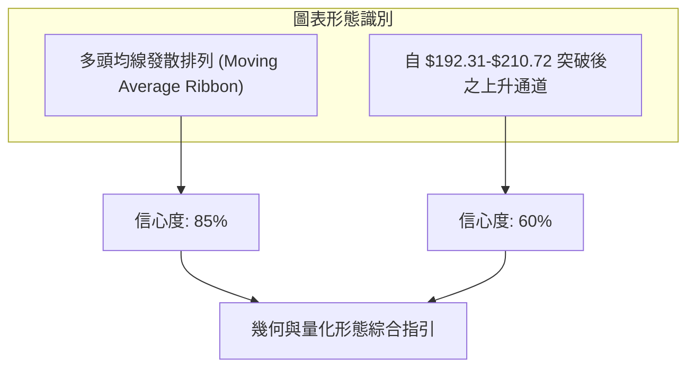
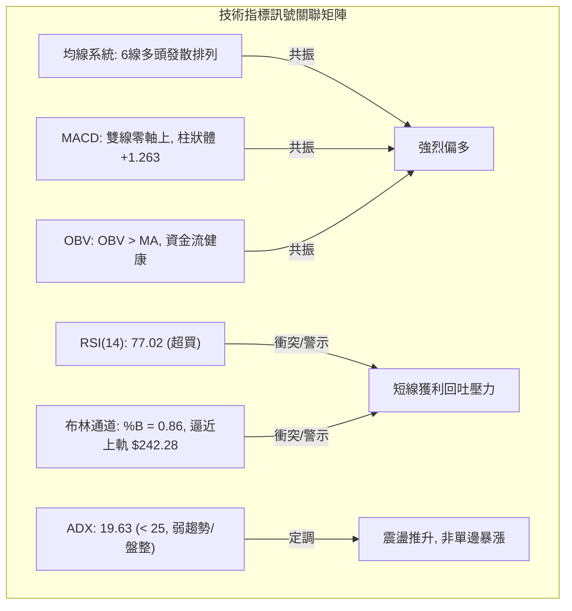
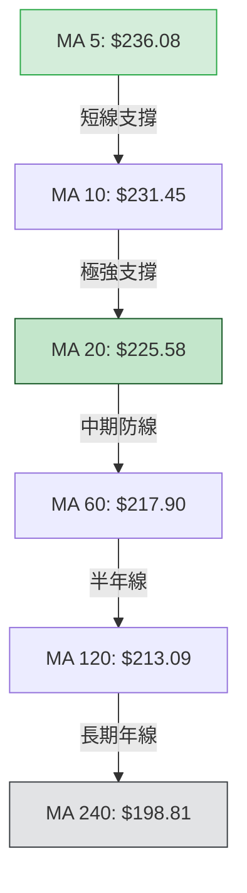
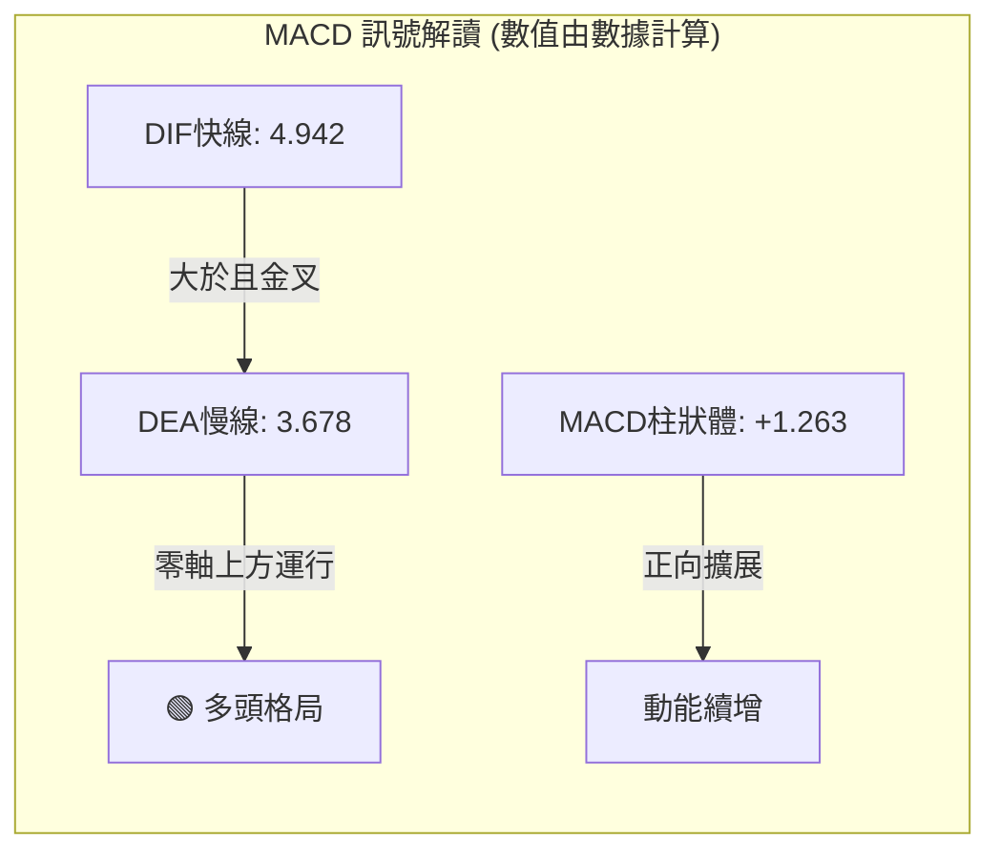
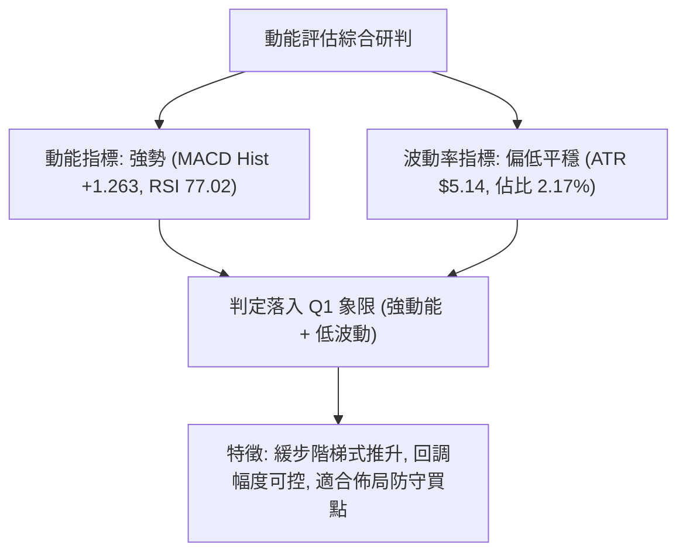
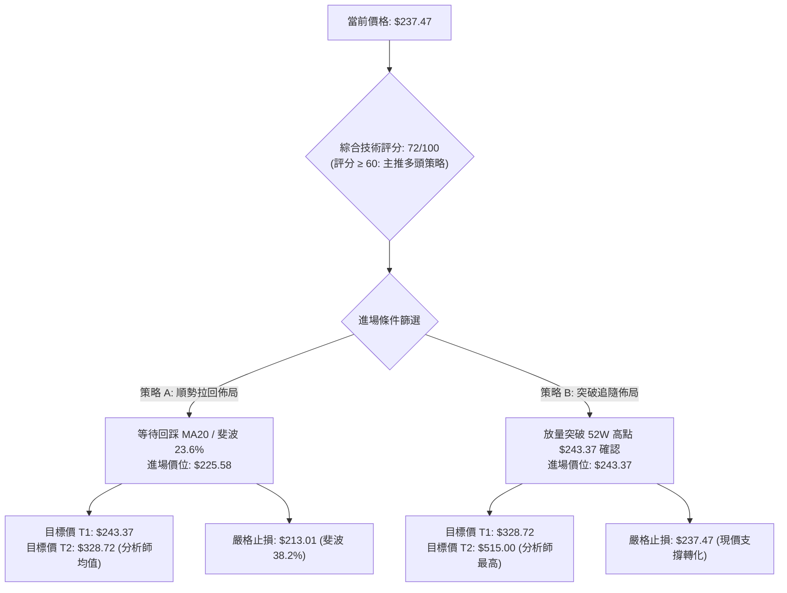
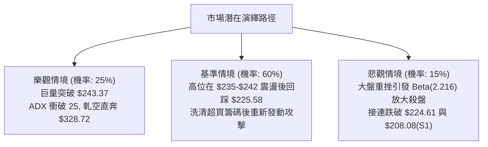

# NVDA 技術分析報告

> **報告日期**：2026-10-08 ｜ **語言**：繁體中文 ｜ **數據來源**：Yahoo Finance ｜ **當前價格**：$237.47

---

## 目錄

| 章節 | 內容 |
|------|------|
| [1. 技術面概覽](#1-技術面概覽) | 訊號儀表板、核心指標、評分卡 |
| [2. 趨勢分析](#2-趨勢分析) | 多時框趨勢、長中短期走勢、ADX解讀 |
| [3. 圖表形態分析](#3-圖表形態分析) | 形態識別信心度、K線組合、目標價推算 |
| [4. 支撐與阻力](#4-支撐與阻力) | 結構分布圖、波段聚類支撐、斐波那契回調 |
| [5. 技術指標深度解讀](#5-技術指標深度解讀) | MA系統、RSI背離、MACD、布林通道、OBV量價 |
| [6. 動能與波動率](#6-動能與波動率) | 動能四象限、ATR波動率、Beta關聯度 |
| [7. 多時框架總結](#7-多時框架總結) | 時框架矩陣、ADX收斂判定、唯一方向結論 |
| [8. 交易策略建議](#8-交易策略建議) | 策略路由、階梯情境、風報比配置、反向對沖點 |
| [9. 風險提示與監控](#9-風險提示與監控) | 監控Checklist、三情境演繹、資金管理法則 |
| [📋 報告總結](#-報告總結) | 核心價位彙整、最優策略矩陣 |

---

## 1. 技術面概覽

### 🎯 技術訊號儀表板



### 📊 核心指標速覽表

| 指標類別 | 指標名稱 | 當前數值 | 訊號 | 解讀 |
|----------|----------|----------|------|------|
| **價格** | 當前收盤價 | $237.47 | 🟢 | 位於52週區間 92.6% 分位，強勢多頭控盤中 |
| **均線** | MA20 | $225.58 | 🟢 | 現價高於 MA20 達 +5.27%，短期動能強勁 |
| **均線** | MA50 | $220.44 | 🟢 | 現價高於 MA50 達 +7.73%，中期趨勢穩健 |
| **均線** | MA200 | $201.35 | 🟢 | 現價高於 MA200 達 +17.94%，長期牛市根基未損 |
| **動能** | RSI(14) | 77.02 | 🔴 | 進入 >70 嚴重超買區，存在技術性回測修正壓力 |
| **動能** | MACD (12,26,9) | 4.942 / 3.678 / +1.263 | 🟢 | MACD雙線零軸上方運行，Hist柱狀體持續走擴 |
| **波動** | ATR(14) | $5.14 | 🟡 | 佔股價 2.17%，日內波動中等，可控性高 |
| **擺動** | Stoch %K / %D | 76.72 / 85.54 | 🟡 | 隨機指標自超買高位死叉走弱，短線面臨整理 |
| **趨勢** | ADX(14) | 19.63 | 🟡 | ADX < 25 表明處於無單邊強暴發力的推進/盤整期 |
| **成交量** | 最新量 / 20日均量 | 81.48M / 108.42M | 🟡 | 量比 0.75x，上漲過程中量能未有爆量確認 |

### 🏆 技術評分卡

```
╔══════════════════════════════════════════════════════════════════════╗
║                  技術評分卡 — NVDA (2026-10-08)                      ║
╠══════════════════════════════════════════════════════════════════════╣
║ 趨勢強度 (Trend)       ████████████░░░░░░░░  60/100 🟡 (ADX偏低但方向偏多) ║
║ 動能指標 (Momentum)    ██████████████░░░░░░  70/100 🟢 (MACD強勁但RSI超買) ║
║ 支撐穩定度 (Support)   ████████████████░░░░  80/100 🟢 (MA結構提供堅強緩衝) ║
║ 成交量配合 (Volume)    ██████████░░░░░░░░░░  50/100 🟡 (OBV走多但量比縮減) ║
║ 形態完整度 (Pattern)   ██████████████░░░░░░  70/100 🟢 (均線通道推升形態)   ║
║ 均線排列 (MA System)   ████████████████████ 100/100 🟢 (完全典型多頭排列)   ║
╠══════════════════════════════════════════════════════════════════════╣
║ 綜合技術評分           ███████████████░░░░░  72/100 🟢 評級：強勢偏多 (拉回做多)║
╚══════════════════════════════════════════════════════════════════════╝
```

---

## 2. 趨勢分析

### 🌐 多時框趨勢分析



### 📈 長期趨勢 — 12個月走勢圖（Unicode）

```
NVDA 月線走勢圖（過去12個月：2025-11 至 2026-10）
價格軸 ($)
$240 ┤                                                 ● $237.47 (現價)
$230 ┤                                           ● $228.38
$220 ┤                                     ● $220.53
$210 ┤                           ● $210.66
$200 ┤                     ● $199.11    ● $199.87 ● $200.53
$190 ┤               ● $190.68
$180 ┤         ● $186.06   ● $176.78
$170 ┤ ● $176.58                 ● $174.00 (波段低點)
     └──────────────────────────────────────────────────────────────
       25-11   25-12   26-01   26-02   26-03   26-04   26-05   26-06   26-07   26-08   26-09   26-10
```

#### 走勢特徵分析表格

| 階段區間 | 起止月份 | 價格變化 | 漲跌幅 | 走勢特徵與結構分析 |
|----------|----------|----------|--------|--------------------|
| 築底震盪期 | 2025-11 至 2026-03 | $176.58 → $174.00 | -1.46% | 價格在 $174.00 ~ $190.68 區間反覆震盪洗盤，確認下檔支撐韌性 |
| 第一波推升 | 2026-03 至 2026-05 | $174.00 → $210.66 | +21.07% | 形成突破型推升浪，突破 $200 整數關卡，量能溫和放大 |
| 高位整理期 | 2026-05 至 2026-07 | $210.66 → $200.53 | -4.81% | 遭遇獲利了結賣壓，在 $192.31 ~ $210.72 形成中繼整理箱型 |
| 主升續攻期 | 2026-07 至 2026-10 | $200.53 → $237.47 | +18.42% | 連續三個月收陽，突破前期整理區間，直逼52週歷史高點 $243.37 |

### 📊 中期趨勢（週線分析）

中期走勢圖示（近 20 週收盤與均線支撐體系示意）：

```
[阻力區]  ======================== $243.37 (52W High / 斐波 0.0%)
          ------------------------ $242.28 (布林通道上軌)
[現  價]  <<<<<<<<<<<<<<<<<<<<<<<< $237.47
          ------------------------ $225.58 (MA20 / 布林中軌)
[支撐層1] ======================== $224.61 (斐波那契 23.6%)
          ------------------------ $220.44 (MA50 中期生命線)
[支撐層2] ======================== $213.01 (斐波那契 38.2% / MA120 $213.09)
[強支撐3] ======================== $208.08 (關鍵聚類支撐 S1)
```

週線指標顯示，自 2026-08-09 週（RSI 65.6，MACD柱 +2.494）以來，中期指標全面進入多頭主導區。近兩週（10-04 至 10-11）收盤連續從 $233.95 推升至 $237.47，週 RSI 達到 77.0~83.0 的超強勢擴張階段，MACD 柱狀體維持在 +1.263 正值。

### ⚡ 趨勢強度評估（ADX 解讀）



#### ADX 強度對照表

| 指標變數 | 當前讀數 | 標準閾值 | 狀態定義 | 對交易策略之指引 |
|----------|----------|----------|----------|------------------|
| **ADX(14)** | 19.63 | < 25.0 | 弱趨勢 / 盤整通道 | **禁止突破追價**，適用回調至均線或通道下半部買進策略 |
| **+DI** | 34.99 | > 25.0 | 多方掌控中 | 動能多方佔優，不可盲目逆勢放空 |
| **-DI** | 18.71 | < 20.0 | 空方動能微弱 | 拋售壓力有限，回檔多屬獲利了結而非主力出逃 |

---

## 3. 圖表形態分析

### 🔍 形態識別系統



#### 形態識別信心度與目標價評估表

| 形態類別 | 信心度 | 判斷依據（引用數據） | 完成度 | 目標價（附精確計算式） |
|----------|--------|----------------------|--------|------------------------|
| **均線多頭發散通道** | 85% | MA5 ($236.08) > MA10 ($231.45) > MA20 ($225.58) > MA60 ($217.90) > MA120 ($213.09) > MA240 ($198.81)，6 條均線完美多頭排列 | 90% | 由通道中軌 (MA20: $225.58) 向上等距推算：現價 $237.47，上行首要目標為阻力區 $243.37 (52W High) |
| **突破箱型中繼整理** | 60% | 2026-05 至 2026-07 構築箱型底 $192.31，箱型頂 $210.72。8月放量收於 $223.71 完成突破 | 100% | 箱型高度 = $210.72 - $192.31 = $18.41；測量目標價 = 箱型突破點 $210.72 + 形態高度 $18.41 = **$229.13**（該目標已於 9 月收盤 $228.38 達成） |
| **雙底形態 (W底)** | <50% | 歷史數據中波段低點聚類離散 ($163.90 與 $174.00)，間隔過遠且頸線不明確 | 訊號不足 | **訊號不足，僅做指標型解讀**（依規則 15，不強行繪製） |

### 🕯️ 重要K線形態分析

| 月份 | 收盤價 | K線形態特徵 | 技術解讀 | 訊號強度 |
|------|--------|-------------|----------|----------|
| 2026-07 | $200.53 | 下影小陽線（最低回測 $194.61） | 於 $194.25 (斐波 61.8%) 獲得堅實支撐，空方力竭 | 🟢 中性轉多 |
| 2026-08 | $220.53 | 光腳大陽線（月漲幅 +9.97%） | 實體大陽線一口氣貫穿所有中期均線，多頭發動主升攻勢 | 🟢 強烈買訊 |
| 2026-09 | $228.38 | 續升上影陽線 | 多頭延續，高位遇獲利回吐，但買盤穩穩承接於 $225 上方 | 🟢 溫和看多 |
| 2026-10 | $237.47 | 高位推升陽線（逼近 52W 高點） | 價格貼近布林上軌 ($242.28)，K線實體維持強勢但波動率收斂 | 🟡 謹慎偏多 |

### 📉 ASCII 走勢形態示意圖

```
NVDA 近 5 個月中繼突破與通道推升示意圖：
$244 ┤                                             [52W High $243.37 / BB上軌 $242.28]
$236 ┤                                     ▲ 突破   ● $237.47 (現價)
$228 ┤                             ▲     ● $228.38
$220 ┤                     ▲     ● $220.53 ────────── [突破確認頸線]
$212 ┤             ▲     ● $210.66
$204 ┤     ┌───────┴───────┐ (箱型震盪頂部 $210.72)
$196 ┤     │ 箱型中繼整理區 │
$188 ┤     └───────┬───────┘ (箱型震盪底部 $192.31)
     └────────────────────────────────────────────────────────
        2026-05         2026-06         2026-07         2026-08         2026-09         2026-10
```

### 🎯 形態目標價計算

根據形態學計算與已完成之技術投影：
1. **箱型整理突破目標**：
   - 形態底部：$192.31（2026-06-28 週收盤低點）
   - 形態頂部（頸線）：$210.72（2026-07-12 週收盤高點）
   - 垂直形態高度：$H = 210.72 - 192.31 = 18.41$
   - 最小測量目標價：$Target = 210.72 + 18.41 = 229.13$（已於 2026-09 達成）
2. **均線通道延伸目標**：
   - 當前依附 MA20（$225.58）沿布林通道上軌推進。在當前弱趨勢環境下，幾何形態已無未完成的延伸波幅，上方唯一結構性強阻力為數據中明確標注之 **52週高點 $243.37**。

---

## 4. 支撐與阻力

### 🗺️ 關鍵價位分布圖（Unicode）

```
NVDA 價位結構分布圖
═══════════════════════════════════════════════════════════════════
$243.37 ║██████████████████████████████║ 52W 高點阻力 / 斐波 0.0%
$242.28 ║████████████████████          ║ 布林通道上軌壓制
$237.47 ╠══════════════════════════════╣ ◄ 當前市價 ($237.47)
$225.58 ║▓▓▓▓▓▓▓▓▓▓▓▓▓▓▓▓▓▓▓▓▓▓        ║ 短期生命線 MA20 / 布林中軌
$224.61 ║▓▓▓▓▓▓▓▓▓▓▓▓▓▓▓▓▓▓▓▓▓▓▓▓        ║ 斐波那契 23.6% 回調支撐
$220.44 ║▓▓▓▓▓▓▓▓▓▓▓▓▓▓▓▓▓▓            ║ 中期防守線 MA50
$213.01 ║██████████████████            ║ 斐波那契 38.2% 回調支撐 (MA120: $213.09)
$208.08 ║██████████████████████████████║ 結構強支撐 S1 (近一年波段低點聚類)
$203.63 ║██████████████                ║ 斐波那契 50.0% 回調位
$201.35 ║████████████████████          ║ 長期牛熊分水嶺 MA200
$198.43 ║██████████████████████████████║ 結構強支撐 S2 (波段低點聚類)
$194.30 ║██████████████████████████████║ 結構強支撐 S3 (波段低點聚類 / 斐波 61.8%: $194.25)
═══════════════════════════════════════════════════════════════════
```

### 🚧 阻力位分析表

> **數據引用說明**：阻力位嚴格依據數據包中「阻力位 (Resistance) — 近一年波段高點聚類」與「斐波那契回調／布林通道」數值。數據明確標注：*(no swing-high resistance detected above current price)*，當前價格上方無近一年波段高點聚類阻力，故上方阻力由 52W 最高點及技術指標上軌構成。

| 阻力級別 | 價位 | 形成原因與數據來源 | 突破難度 | 重要性 |
|----------|------|--------------------|----------|--------|
| **R1** | $242.28 | 日線布林通道上軌壓制 | 🟡 中等 (已逼近，需補量突破) | ★★★☆☆ |
| **R2** | $243.37 | 52週歷史最高價 (52W High / 斐波 0.0%) | 🔴 極高 (獲利盤與解套盤重疊區) | ★★★★★ |
| **R3** | 數據中未偵測到 | *數據中未偵測到高於 $243.37 之歷史結構阻力* | — | — |

### 🛡️ 支撐位分析表

> **數據引用說明**：支撐位嚴格引用數據包「支撐位 (Support) — 近一年波段低點聚類」計算結果（S1、S2、S3）。

| 支撐級別 | 價位 | 形成原因與數據來源 | 守住機率 | 重要性 |
|----------|------|--------------------|----------|--------|
| **S1** | $208.08 | 近一年波段低點聚類 S1 (距現價 -12.37%)；鄰近布林下軌 $208.88 | 80% | ★★★★☆ |
| **S2** | $198.43 | 近一年波段低點聚類 S2 (距現價 -16.44%)；鄰近 MA240 $198.81 | 85% | ★★★★☆ |
| **S3** | $194.30 | 近一年波段低點聚類 S3 (距現價 -18.18%)；共振斐波 61.8% ($194.25) | 92% | ★★★★★ |

### 📐 斐波那契回調位分析

依據數據包所列之 52 週波動區間（最低點 $163.90 至 最高點 $243.37）精確計算之回調位：

| 斐波那契級別 | 精確價位 | 技術含義與多空防禦角色 |
|--------------|----------|------------------------|
| **0.0% (52W High)** | **$243.37** | 歷史絕對阻力，上行天花板 |
| **23.6%** | **$224.61** | 短線強勢回檔極限位（與 MA20: $225.58 形成共振支撐區） |
| **38.2%** | **$213.01** | 中期健康回調位（與 MA120: $213.09 形成共振支撐） |
| **50.0%** | **$203.63** | 多空分水嶺（與 MA200: $201.35 形成長期牛市緩衝區） |
| **61.8%** | **$194.25** | 黃金分割強支撐（與 S3: $194.30 高度共振，絕對不可跌破） |
| **78.6%** | **$180.90** | 深度回調防守區（分析師共識低點 $180.00 之支撐處） |
| **100.0% (52W Low)**| **$163.90** | 52週週期起點，終極底部 |

**現價區間落點解讀**：
當前收盤價 **$237.47** 精確落在 **0.0% ($243.37)** 與 **23.6% ($224.61)** 之間。這表明股價處於極其強勢的「強多頭推進區間」。只要價格回調不跌破 23.6% 回調位 $224.61（該處有 MA20 $225.58 加持），多頭結構即保持完整無虞。

---

## 5. 技術指標深度解讀

### 🎛️ 指標訊號總覽



### 📈 移動平均線排列分析



#### 均線數據深度解讀表

| 均線名稱 | 當前價格 | 乖離率 (Bias) | 趨勢方向 | 技術面評價 |
|----------|----------|---------------|----------|------------|
| **MA 5** | $236.08 | +0.59% | 陡峭向上 | 超短期貼身防守線，強勢控盤 |
| **MA 10** | $231.45 | +2.60% | 穩定向上 | 5日與10日未見交叉死叉，短多結構穩固 |
| **MA 20** | $225.58 | +5.27% | 穩定向上 | 月線級生命線，與布林中軌完全重合 |
| **MA 50** | $220.44 | +7.73% | 平緩向上 | 中期重要攻防線 |
| **MA 60** | $217.90 | +8.98% | 穩定向上 | 季線強支撐 |
| **MA 120**| $213.09 | +11.44% | 緩步走升 | 半年線，與斐波 38.2% ($213.01) 重疊 |
| **MA 200**| $201.35 | +17.94% | 緩步走升 | 長期牛市基礎線 |
| **MA 240**| $198.81 | +19.45% | 長期向上 | 實質年線支撐，與聚類支撐 S2 ($198.43) 重合 |

**均線結論**：NVDA 呈現教科書級別的「多頭排列」（$MA5 > MA10 > MA20 > MA60 > MA120 > MA240$），所有均線均呈正斜率向上延伸，技術架構極度健康，下檔每間隔 $5~$8 美元即有密集均線承接買盤。

### 📉 RSI(14) 分析

- **當前讀數**：77.02
- **動能強度進度條**：
  ```
  RSI(14) = 77.02  [███████████████░░░░░]  77.02% (超買警示區間 > 70)
  ```
- **超買超賣評估**：RSI 突破 70 臨界點達到 77.02，已進入極度超買區。
- **背離判斷**：
  - **日線背離檢驗**：數據明確標示「RSI 背離：無明顯背離」。價格創新高，RSI 亦同步推升至 77.02，無頂背離跡象，顯示本波推升屬於真實買盤推動，而非動能竭盡之假突破。
  - **週線背離檢驗**：觀察近20週數據，2026-10-04 週收盤 $233.95（RSI 83.0），最新一週收盤 $237.47（RSI 77.0）。價格微幅創高，而週 RSI 自 83.0 略有放緩，此處需密切留意是否正在醞釀高位「週線級潛在頂背離雛形」，但尚未經日線死叉確認。

### 📊 MACD(12/26/9) 訊號解讀



- **MACD 線 (DIF)**：4.942
- **訊號線 (Signal / DEA)**：3.678
- **柱狀體 (Histogram)**：+1.263
- **深度解析**：雙線位於零軸上方遠處發散（4.942 vs 3.678），柱狀體擴張至 +1.263，代表短線加速動能依舊充沛，目前未出現任何死叉衰竭訊號。

### 📦 布林通道分析

```
ASCII 布林通道位置示意圖 (寬度 = $33.40)
$242.28 ┬─────────────────────────────────────────── BB 上軌 ($242.28)
$237.47 ┼                              ● 現價 ($237.47, %B = 0.86)
$230.00 ┤
$225.58 ┼─────────────────────────────────────────── BB 中軌 / MA20 ($225.58)
$215.00 ┤
$208.88 ┴─────────────────────────────────────────── BB 下軌 ($208.88)
```

- **BB %B 分析**：0.86。表明現價已進入布林通道上軌的高位壓制區（靠近 1.0 上軌）。
- **帶寬與形態**：上軌 $242.28，下軌 $208.88，帶寬展開。在弱趨勢（ADX 19.63）環境下，價格極易在上軌 $242.28 遭遇均值回歸壓力，隨後向下回測中軌 $225.58 尋求支撐。

### 💹 成交量分析（量價配合度）

- **最新成交量**：81,485,100 股
- **20日均量**：108,420,205 股
- **量比 (Volume Ratio)**：0.75x（成交量顯著萎縮 -24.8%）
- **50日均量**：120,210,114 股
- **OBV 能量潮**：數據明確標示「OBV > MA → 量能支撐上漲」。
- **量價背離評估**：
  雖然 OBV 長期累積線高於均線，確認中長期多頭資金並未撤離；但短線價格創高逼近 $243.37，單日成交量（81.48M）卻低於 20 日均量（108.42M），呈現「價漲量縮」的輕度量價背離。此現象意味著追價意願在高檔趨於謹慎，主力未大舉出貨，但多方亦不願在此位置激進追價。

---

## 6. 動能與波動率

### ⚡ 動能評估四象限

| 象限代號 | 動能維度 (Momentum) | 波動率維度 (Volatility) | 當前對應狀態 | 操作策略定位 |
|----------|---------------------|-------------------------|--------------|--------------|
| **Q1** | 強動能 (MACD+ / RSI>70) | 低波動 (ATR% = 2.17%) | 🟢 **NVDA 當前落點** | **強勢順勢推升，回測支撐買進** |
| **Q2** | 弱動能 (MACD- / RSI<50) | 低波動 (窄幅整理) | — | 觀望等待方向突破 |
| **Q3** | 強動能 (單邊暴漲暴跌) | 高波動 (ATR% > 5.0%) | — | 高風險高回報，需大幅拉寬止損 |
| **Q4** | 弱動能 (指標走平) | 高波動 (劇烈洗盤) | — | 容易雙向停損，禁止進場 |



### 📊 ATR 波動率分析

- **ATR(14) 數值**：$5.14
- **ATR 佔比**：$5.14 / $237.47 = 2.17%
- **每日常規波動範圍**：現價 $237.47 ± $5.14，即 [$232.33, $242.61]
- **專業止損距離設定建議**：
  - *短線激進型 (1.5 × ATR)*：$1.5 \times 5.14 = \$7.71$ → 止損價可設於現價下緣 **$229.76**。
  - *中線波段型 (2.0 × ATR)*：$2.0 \times 5.14 = \$10.28$ → 止損價可設於現價下緣 **$227.19**（剛好保護在 MA20 $225.58 附近）。
  - *防守型波段 (2.5 × ATR)*：$2.5 \times 5.14 = \$12.85$ → 止損價設於 **$224.62**（與斐波 23.6% $224.61 完美吻合）。

### 📐 Beta 與市場相關性

- **Beta 數值**：2.216
- **市場關聯度解讀**：NVDA 屬於高彈性領頭成長股，其波動幅度為 S&P 500 指數的 2.216 倍。當大盤指數上漲 1% 時，NVDA 理論預期上漲約 2.22%；反之大盤回檔 1% 時，NVDA 下行回測幅度亦將放大。在高 Beta 驅動下，當前 52W 高點阻力區更需要大盤指數配合，否則極易受大盤微幅回檔影響而觸發大幅度獲利結算。

---

## 7. 多時框架總結

### 📋 時框架評分表

| 時框架 | 趨勢方向 | 動能狀態 | 均線排列 | 形態結構 | 綜合評分 | 操作指引 |
|--------|----------|----------|----------|----------|----------|----------|
| **月線 (長期)** | 🟢 多頭 | 🟢 極強 | 🟢 完全多頭發散 | 上升通道主升段 | 90/100 | 長期持股續抱，毋須恐慌 |
| **週線 (中期)** | 🟢 多頭 | 🟢 柱狀體翻正 | 🟢 MA20>MA50 順暢 | 箱型向上突破延伸 | 80/100 | 回測支撐分批加碼 |
| **日線 (短期)** | 🟡 偏多震盪 | 🔴 超買 (RSI 77) | 🟢 6線順向排列 | 逼近布林通道上軌 | 60/100 | **短線禁止追高，等待拉回** |

### 🔲 綜合訊號矩陣

```
時框與維度一致性檢驗矩陣：
┌──────────┬──────────────┬──────────────┬──────────────┐
│ 分析維度 │ 短期 (日線)  │ 中期 (週線)  │ 長期 (月線)  │
├──────────┼──────────────┼──────────────┼──────────────┤
│ 趨勢方向 │ 🟢 偏多推升  │ 🟢 強勁上升  │ 🟢 牛市通道  │
│ 動能指標 │ 🔴 嚴重超買  │ 🟢 溫和擴張  │ 🟢 穩定健康  │
│ 均線架構 │ 🟢 多頭排列  │ 🟢 多頭排列  │ 🟢 多頭排列  │
│ 量能配合 │ 🟡 價漲量縮  │ 🟢 OBV支撐   │ 🟢 結構扎實  │
├──────────┼──────────────┼──────────────┼──────────────┤
│ 矩陣結論 │ 短線有拉回需 │ 中線趨勢完好 │ 長線空間廣闊 │
└──────────┴──────────────┴──────────────┴──────────────┘
```

### ⚖️ 多時框收斂結論

> **依嚴格要求 14 多時框收斂規則判定**：
> 1. **當前市場架構判定**：ADX(14) 讀數為 **19.63**，明確小於 25.0 門檻。因此當前 NVDA 行情**定調為「盤整／通道型推進行情」而非單邊暴擊行情**。
> 2. **主導時框與交易規則**：在盤整及通道推進環境下，交易邊界必須以**日線布林通道上下軌與核心均線（MA20）作為主要交易依據**。
> 3. **衝突收斂取捨**：雖然日線 RSI 達 77.02 呈現短線超買，但月線與週線均線完全多頭發散。依照規則，中長期趨勢保護下檔空間，日線之超買並不構成放空理由，而是用以**「否定追高、尋找拉回進場時機」**。
> 
> **唯一方向性結論**：**【強勢偏多，但嚴禁追高；鎖定回調至布林中軌/MA20 之買入機會】**。此結論完全貫徹至第 8 章交易策略。

---

## 8. 交易策略建議

### 🗺️ 策略決策流程圖



### 🧭 策略路由

**當前主策略方向 = 【主推多頭策略（拉回低吸為主，突破加碼為輔）】（依評分卡 72/100 評定）**

### 🎯 價格情境階梯（Price Scenarios）

> **數值紀律**：所有觸發條件與目標階梯數值，均嚴格引用第 4 章及數據包中之確定價位（阻力 R1/R2、支撐 S1/S2/S3、斐波那契點位）。

| 觸發條件 | 下一目標 | 後續延伸 | 情境含義與操作指引 |
|----------|----------|----------|--------------------|
| **突破 R1 $242.28** | R2 $243.37 | 分析師均價 $328.72 | 短線化解超買壓力，創歷史新高，動能爆發 |
| **站穩現價 $237.47** | R1 $242.28 | 中軌 $225.58 | 在布林上軌與中軌間維持高位震盪消化籌碼 |
| **跌破 MA20 $225.58** | 斐波 38.2% $213.01 | S1 $208.08 | 短期強勢結構被破壞，回測中期生命線 |
| **跌破 S1 $208.08** | S2 $198.43 | S3 $194.30 | 中期轉弱，考驗年線及長期牛熊分水嶺 |

### 📊 情境機率分佈

| 情境類別 | 機率預估 | 主要技術依據 |
|----------|----------|--------------|
| **回調蓄勢後繼續上行** | **60%** | MACD 柱狀體 +1.263 維持正向，6 線均線多頭排列，OBV 持續支撐，+DI (34.99) 壓制 -DI (18.71) |
| **區間高位強勢震盪** | **25%** | ADX 僅 19.63（無單邊暴衝動力），成交量比 0.75x 萎縮，價格受困於 BB 上軌 $242.28 |
| **深度回落再探底** | **15%** | 日線 RSI (77.02) 超買引發獲利盤拋售，若大盤重挫可能波及高 Beta (2.216) 標的 |

### 🟢 主策略詳情

| 策略要素 | 策略 A（穩健型：回調低吸策略 — 優先推薦） | 策略 B（激進型：突破跟進策略） |
|----------|------------------------------------------|--------------------------------|
| **進場條件** | 價格自超買區良性拉回，於 MA20 / 斐波 23.6% 獲得支撐 | 帶量突破 52W 高點阻力位並確認站穩 |
| **進場價格** | **$225.58**（精確對齊 MA20 / 布林中軌） | **$243.37**（精確對齊 52W High） |
| **目標價 T1** | **$243.37**（52W High 阻力位） | **$328.72**（分析師共識平均目標價） |
| **目標價 T2** | **$328.72**（分析師共識平均目標價） | **$515.00**（分析師共識最高目標價） |
| **止損價格** | **$213.01**（精確對齊斐波 38.2% / MA120） | **$237.47**（精確對齊當前突破前起漲點） |
| **風險報酬比**| **1 : 1.41** (至T1) / **1 : 8.20** (至T2) | **1 : 14.46** (至T1) |
| **成功機率** | **68%** | **52%** |
| **建議倉位** | **15% ~ 20%** 資金倉位 | **5% ~ 10%** 資金倉位 |

> **策略 A 風報比精確計算說明**：
> - 進場點：$225.58，止損點：$213.01 → 每股風險 = $225.58 - $213.01 = $12.57
> - 目標 T1：$243.37 → 每股潛在報酬 = $243.37 - $225.58 = $17.79 → **風報比 = 17.79 / 12.57 = 1 : 1.41**
> - 目標 T2：$328.72 → 每股潛在報酬 = $328.72 - $225.58 = $103.14 → **風報比 = 103.14 / 12.57 = 1 : 8.20**

### 🔴 反向風險觸發點（對沖提示）

若發生下列技術破位事件，將**徹底推翻主策略的多頭前提**，投資人應即刻執行反向避險或減倉：
1. **短期止損觸發**：日線收盤價跌破 **$224.61**（斐波 23.6%），宣告短期均線失守，應將短線倉位平倉。
2. **中期多頭破壞點**：日線收盤價跌破 **$208.08**（關鍵結構支撐 S1），代表股價跌破布林下軌並下穿 MA60，上升通道破裂，建議全面對沖現貨倉位。
3. **指標翻空訊號**：日線 MACD 於高位出現死叉且柱狀體跌破 0 軸，同時日線 RSI 跌破 50 中軸。

### ⭐ 整體訊號強度評星

```
做多訊號強度：★★★★☆  (4/5星 — 趨勢與均線結構極佳，僅受短線超買壓制)
做空訊號強度：★☆☆☆☆  (1/5星 — 完全逆勢操作，勝率極低，僅存技術性拉回預期)
整體可信度：  ★★★★☆  (4/5星 — 多時框均線高度一致，量價數據驗證清晰)
```

---

## 9. 風險提示與監控

### ✅ 關鍵監控指標 Checklist

```
╔══════════════════════════════════════════════════════════════════╗
║              NVDA 每日盤後技術監控清單 (Checklist)               ║
╠══════════════════════════════════════════════════════════════════╣
║ [ ] 價格是否有效站上或突破 52W High $243.37？                    ║
║ [ ] RSI(14) 是否自 77.02 超買區回落並跌破 70 警戒線？            ║
║ [ ] MACD 柱狀體 (+1.263) 是否開始出現縮短翻綠？                  ║
║ [ ] 日成交量是否放大至 108.42M (20日均量) 之上形成實質換手？     ║
║ [ ] 回測時 MA20 ($225.58) 與 斐波 23.6% ($224.61) 是否成功守穩？ ║
║ [ ] ADX(14) 是否自 19.63 向上突破 25，確認單邊爆發趨勢來臨？     ║
╚══════════════════════════════════════════════════════════════════╝
```

### ⚠️ 風險場景分析



### 🛡️ 風險管理重要提醒

1. **嚴禁在 BB 上軌與歷史高點前盲目市價追高**：現價 $237.47 距離阻力位 $243.37 僅有 2.48% 空間，而下方至生命線 MA20 空間達 5.27%。在此位置追價之盈虧比嚴重失衡（< 0.5）。
2. **高 Beta 波動防範**：Beta 高達 2.216，當半導體板塊或科技股大盤回調時，NVDA 每日波動可能輕易超過 ATR ($5.14)。必須嚴格採用動態倉位管理，單一帳戶在 NVDA 的風險敞口不宜超過總資金的 20%。
3. **嚴守止損紀律**：策略 A 之保護性止損設於 $213.01，一旦跌破無條件離場觀望，嚴防小虧損演變成套牢。

---

## 📋 報告總結

```
╔══════════════════════════════════════════════════════════════════════╗
║                    NVDA 技術分析報告總結                             ║
╠══════════════════════════════════════════════════════════════════════╣
║ 報告日期：2026-10-08                                                 ║
║ 當前價格：$237.47                                                    ║
║ 分析評級：🟢 強勢偏多 (拉回做多，拒絕追高)                           ║
╠══════════════════════════════════════════════════════════════════════╣
║ 關鍵技術結論：                                                       ║
║ ├─ 長期趨勢：🟢 強烈看多 (24個月牛市通道完好，月線收盤連續走揚)      ║
║ ├─ 中期趨勢：🟢 偏多推進 (週線突破箱型，MACD 柱狀體翻正)             ║
║ ├─ 短期趨勢：🟡 超買震盪 (RSI 77.02 進入超買，布林上軌壓制中)       ║
║ ├─ 核心阻力：$242.28 (BB上軌) / $243.37 (52W High)                  ║
║ ├─ 核心支撐：$225.58 (MA20生命線) / $208.08 (結構支撐S1)             ║
║ └─ 估值目標：$328.72 (華爾街 59 位分析師共識平均目標價)              ║
╠══════════════════════════════════════════════════════════════════════╣
║ 最優交易執行矩陣：                                                   ║
║ 1. 🥇 最佳機會 (策略 A - 穩健)：等待股價拉回至 MA20 / 斐波23.6% 區域 ║
║       以 $225.58 進場，止損 $213.01，首要目標 $243.37 (風報比 1:1.41)║
║ 2. 🥈 次選機會 (策略 B - 激進)：等待日線帶量實體陽線突破 $243.37 後  ║
║       順勢跟進，止損 $237.47，目標 $328.72 (風報比 1:14.46)          ║
║ 3. 🥉 保守選擇：持有原有底倉續抱，暫不開新倉，待日線 RSI 回至 60 以下 ║
╚══════════════════════════════════════════════════════════════════════╝
```

---

> ⚠️ **免責聲明**：本報告為 AI 自動生成之技術分析，所有數據及估算均基於提供的歷史價格資訊。本報告**僅供研究與學術參考**，**不構成任何投資建議**。投資有風險，入市需謹慎。

---

*報告生成時間：2026-10-08 ｜ 數據來源：Yahoo Finance ｜ 分析框架：多時框技術分析*