<details>
<summary>📊 靜態圖表 (點擊展開)</summary>
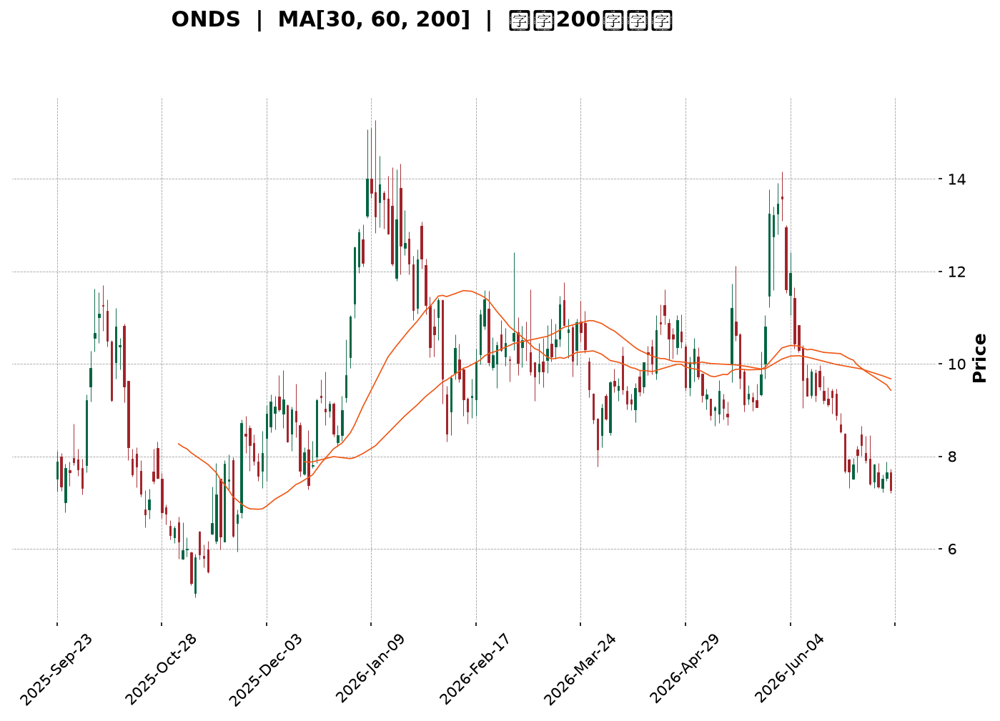
</details>

<html>
<head><meta charset="utf-8" /></head>
<body>
    <div style="height:500px; width:100%;">                        <script>window.PlotlyConfig = {MathJaxConfig: 'local'};</script>
        <script charset="utf-8" src="https://cdn.plot.ly/plotly-3.7.0.min.js" integrity="sha256-jvTGqxNp8AGWEcvNLVuKr+8j5dGe9Yw51LQkmDH+IYA=" crossorigin="anonymous"></script>                <div id="candlestick-chart" class="plotly-graph-div" style="height:100%; width:100%;"></div>            <script>                window.PLOTLYENV=window.PLOTLYENV || {};                                if (document.getElementById("candlestick-chart")) {                    Plotly.newPlot(                        "candlestick-chart",                        [{"close":{"dtype":"f8","bdata":"AAAAwB6FH0AAAABgZmYdQAAAAAAAAB9AAAAAANejHkAAAABA4XofQAAAAKBH4R5AAAAAoHA9HUAAAAAghWsiQAAAAIDr0SNAAAAAgOtRJUAAAACAFC4mQAAAAMAehSZAAAAAQOH6JEAAAADgo3AiQAAAAGC4niVAAAAAgOvRJEAAAADAHgUjQAAAAGBmZiBAAAAA4KNwHkAAAADgehQfQAAAAGCPwhxAAAAAgML1GkAAAACgcD0cQAAAAEAK1x1AAAAAYLgeHkAAAADA9SgbQAAAAAAAABtAAAAAwPUoGUAAAABgj8IZQAAAAKCZmRhAAAAAQArXF0AAAAAAAAAYQAAAAAAAABVAAAAAoHA9F0AAAADAHoUXQAAAAEAzMxdAAAAAgD0KFkAAAACgcD0aQAAAAOBRuBxAAAAAwB4FGUAAAAAAKVwfQAAAAAAAAB5AAAAA4HoUGUAAAADgo\u002fAaQAAAAOCjcCFAAAAAoEfhIEAAAABA4XogQAAAAKCZmR9AAAAAgOtRHkAAAAAA1yMgQAAAAEAK1yFAAAAAoEdhIkAAAAAA1yMiQAAAAIA9CiJAAAAAgMJ1IkAAAABgZqYgQAAAAIA9CiJAAAAAAACAIUAAAABgj8IeQAAAAIAULiBAAAAAQOF6HUAAAABAMzMfQAAAAOCjcCJAAAAAgD2KIkAAAAAgheshQAAAAGCPQiJAAAAAgML1IEAAAAAghesgQAAAAEDh+iFAAAAAwB6FI0AAAACAPQomQAAAACBcDylAAAAAgBSuKUAAAAAAKVwoQAAAAMAeBSxAAAAAoEdhK0AAAACgR2EqQAAAACCuxytAAAAAYLgeK0AAAAAA16MpQAAAAIDrUShAAAAAYI9CKkAAAACgmRkpQAAAAKBwPSlAAAAAQApXKEAAAACA61EmQAAAAMAehShAAAAAgD2KKEAAAACAPYomQAAAAOBRuCRAAAAAIK5HJUAAAABgj8ImQAAAAAApXCNAAAAAgML1IEAAAACgR2EjQAAAAIAUriRAAAAAAClcI0AAAACAwnUiQAAAAOCj8CFAAAAAYLieIkAAAACgmRkkQAAAAADXIyZAAAAAIK7HJkAAAAAgXA8kQAAAAKBHYSRAAAAAwMzMJEAAAACgmZkkQAAAAGBm5iRAAAAAwPUoJEAAAABAClclQAAAAIA9CiRAAAAAwB4FJUAAAABA4fokQAAAAMD1qCNAAAAA4KNwI0AAAADAHgUkQAAAAMD1qCNAAAAAwPWoJEAAAACA61EkQAAAACBcDyVAAAAAIFyPJkAAAADA9aglQAAAAAAAgCVAAAAAYLgeJEAAAADAzMwlQAAAAAApXCVAAAAAYLieJEAAAACgR+EiQAAAAKCZmSFAAAAAwMxMIEAAAADgehQiQAAAAGC4niFAAAAAQDMzI0AAAACAPQojQAAAACBcDyNAAAAAYGbmIkAAAAAgrkciQAAAAGCPQiJAAAAA4KPwIkAAAADAzMwiQAAAACBcDyRAAAAAYGZmJEAAAAAAAAAkQAAAAIDCdSVAAAAAoHC9JUAAAABguB4mQAAAAOB6FCVAAAAAoJkZJUAAAABgZuYlQAAAAIDC9SRAAAAAQOH6IkAAAADgehQkQAAAAADXoyRAAAAAgMJ1I0AAAADA9agiQAAAAIAUriJAAAAAIK7HIUAAAABguB4iQAAAAEAK1yJAAAAA4HoUIkAAAADgUbghQAAAACCFayZAAAAAoHA9JUAAAABgZmYjQAAAAAAAQCJAAAAA4FG4IkAAAAAAKVwiQAAAAGC4HiJAAAAAgD2KI0AAAACgmZklQAAAAAAAgCpAAAAA4KNwKkAAAAAghesqQAAAAMD1KCtAAAAA4FE4J0AAAADgo\u002fAnQAAAAAAp3CRAAAAAoJmZJEAAAADAzEwjQAAAAGC4niJAAAAAwPWoI0AAAADA9agiQAAAAMAeBSNAAAAAIIVrIkAAAACgcD0iQAAAAIA9iiJAAAAAIK7HIUAAAAAgXA8hQAAAAOBRuB5AAAAAQDOzHkAAAACA61EfQAAAAIA9CiBAAAAAQOF6IEAAAACAFK4fQAAAAADXox1AAAAAIK5HH0AAAABgZmYdQAAAAOB6FB5AAAAAoJmZHkAAAACAPQodQA=="},"high":{"dtype":"f8","bdata":"AAAAoHA9IEAAAAAA1yMgQAAAAAApXB9AAAAAIFyPH0AAAAAghWshQAAAAEAKVyBAAAAAwMzMH0AAAACAFK4iQAAAACBcjyRAAAAAYI9CJ0AAAABAChcnQAAAAGBmZidAAAAAIK7HJkAAAADAHgUlQAAAAIAUbiZAAAAAYLgeJUAAAACgcL0lQAAAAGCPQiNAAAAAgOtRIEAAAACgR2EgQAAAAADXox9AAAAAgD0KHUAAAABAMzMdQAAAAEAKVyBAAAAAoEehIEAAAAAgXI8eQAAAAMDMzBtAAAAAgMJ1GkAAAAAAAAAaQAAAAGCPwhpAAAAAIK5HGkAAAAAAAAAZQAAAAOBRuBdAAAAA4HqUF0AAAAAgXI8ZQAAAAKBHYRhAAAAAwPWoGEAAAAAAKVwdQAAAAOCjcB9AAAAAIFwPHkAAAACAFK4fQAAAAIDrESBAAAAAoEfhH0AAAABgZmYbQAAAAKCZmSFAAAAAYI\u002fCIUAAAAAAKVwhQAAAAMAg8CBAAAAAANcjIEAAAACgmRkhQAAAAIDCNSJAAAAAgBSuIkAAAACgmZkiQAAAAAAAgCNAAAAA4FG4I0AAAABA4ToiQAAAAMD1KCJAAAAAYGYmI0AAAABA4XohQAAAAADXYyBAAAAAYLgeIUAAAABgka0gQAAAAEDheiJAAAAAgOtRI0AAAACAFK4jQAAAAGBmZiJAAAAAQApXIkAAAABAClchQAAAAKCZmSJAAAAAIFwPJUAAAABguB4mQAAAAOB6FClAAAAAACncKUAAAACAPQoqQAAAAADXIy5AAAAAQDMzLkAAAAAgXI8uQAAAAAAAAC1AAAAAAACAK0AAAAAA1yMsQAAAAAAAgCxAAAAAYGZmLEAAAADA9agsQAAAAMD1qCpAAAAAQOG6KUAAAAAghasoQAAAAOCj8ChAAAAAwPUoKkAAAAAgXI8oQAAAAGBm5iZAAAAAYGZmJkAAAABACtcmQAAAAIA9yiZAAAAAIFwPI0AAAADAHoUjQAAAACCuRyVAAAAAoEfhJEAAAABACtcjQAAAAKDGiyJAAAAAAClcI0AAAAAA16MkQAAAAEAKVyZAAAAAgBQuJ0AAAADA9SgnQAAAAADXIyVAAAAAgML1JEAAAACgR+ElQAAAACBcjyVAAAAAAClcJEAAAABACtcoQAAAAAAAACZAAAAAANejJUAAAABACtclQAAAAOBROCdAAAAAIFwPJEAAAABgZuYkQAAAAGC4HiVAAAAAgBSuJUAAAACAwvUlQAAAAKBwvSVAAAAA4KPwJkAAAADAHoUnQAAAAIDC9SVAAAAAwPWoJUAAAADgo\u002fAlQAAAAKBwvSZAAAAAIK5HJkAAAAAgrkckQAAAAKBwvSJAAAAAANejIUAAAAAgrkciQAAAAEAzsyJAAAAAYI9CI0AAAADAzMwjQAAAAKBHYSNAAAAAoHC9JEAAAACAPQojQAAAAOBRuCJAAAAAIIUrI0AAAADgUbgjQAAAACBcDyRAAAAAIK7HJEAAAAAgXA8lQAAAAGC4HiZAAAAA4HqUJkAAAADgUTgnQAAAAOCj8CVAAAAAgD2KJUAAAABguB4mQAAAAADXIyZAAAAAACncJEAAAACA61EkQAAAAGC4HiVAAAAAQOG6JEAAAADgepQjQAAAACCF6yJAAAAAAACAIkAAAACAFC4iQAAAAMDMTCNAAAAAQDOzIkAAAAAAKVwiQAAAAIDCdSdAAAAAoHA9KEAAAABAClclQAAAAGCPwiNAAAAA4HoUI0AAAABgj8IiQAAAAKBHISNAAAAAwB6FJEAAAABguB4mQAAAACBcjytAAAAAgOvRKkAAAACA69ErQAAAAIDrUSxAAAAAAAAAKkAAAABACtcoQAAAAIDrUSdAAAAAgBSuJUAAAACA69EkQAAAAIDC9SNAAAAAoEPLI0AAAABAicEjQAAAAOCj8CNAAAAAQOF6I0AAAAAAAAAjQAAAACCF6yJAAAAAIIXrIkAAAAAAKdwhQAAAAAAAACFAAAAAYI\u002fCH0AAAAAAKdwfQAAAAOCjcCBAAAAAwMxMIUAAAACgR+EgQAAAAGBm5iBAAAAAAClcH0AAAAAghWsfQAAAAOCjcB5AAAAAwB6FH0AAAAAgheseQA=="},"hovertemplate":"\u003cb\u003e%{x|%Y-%m-%d}\u003c\u002fb\u003e\u003cbr\u003e\u958b: $%{open:.2f}\u003cbr\u003e\u9ad8: $%{high:.2f}\u003cbr\u003e\u4f4e: $%{low:.2f}\u003cbr\u003e\u6536: $%{close:.2f}\u003cextra\u003e\u003c\u002fextra\u003e","low":{"dtype":"f8","bdata":"AAAAIIXrHEAAAAAAAAAdQAAAAMD1KBtAAAAA4KNwHUAAAABAMzMfQAAAACCuRx5AAAAA4FG4HEAAAAAA16MeQAAAAKBHYSJAAAAAgD2KJEAAAABgZuYkQAAAAGAObSVAAAAAAADAJEAAAACgR2EiQAAAACCyXSNAAAAAYI\u002fCI0AAAACA61EiQAAAAIAUrh9AAAAA4FE4HkAAAACA61EdQAAAAAAAgBxAAAAAACncGUAAAACgmZkaQAAAAGC4nh1AAAAA4HoUHkAAAAAA16MaQAAAAOB6FBpAAAAAgOvRGEAAAABA4XoYQAAAAGC4HhdAAAAA4HoUF0AAAACA61EXQAAAAAAp3BRAAAAAwMzME0AAAADgehQXQAAAAGBmZhZAAAAAIIXrFUAAAACgcD0ZQAAAAGBmZhhAAAAAIIXrF0AAAACgmZkYQAAAAIA9Ch1AAAAAAAAAGUAAAADgUbgXQAAAAIAUrhpAAAAAANcjIEAAAACgcL0eQAAAAEAzMx9AAAAAoEfhHUAAAAAgrkcdQAAAAEAK1x1AAAAAgD0KIUAAAADA9SghQAAAAOCj8CFAAAAA4FE4IUAAAAAAKZwgQAAAAKBwPSBAAAAAgOvRIEAAAACgcD0eQAAAAAApXB5AAAAAYLgeHUAAAACAwvUeQAAAAOCjcB9AAAAAIFxPIkAAAABAClchQAAAAEAzsyFAAAAAACncIEAAAAAghWsgQAAAAMD1qCBAAAAAQApXIkAAAACA69EjQAAAAEDh+iVAAAAAIIXrJ0AAAADgUTgoQAAAAMDMTCpAAAAAgBQuK0AAAADA9agpQAAAACCF6ylAAAAAQArXKUAAAACgmZkpQAAAAKBwPShAAAAAoJmZJ0AAAAAAKdwnQAAAAEAzsyhAAAAAoEfhJ0AAAABgZuYlQAAAAIAULiZAAAAAYLgeKEAAAAAA1yMmQAAAACCuRyRAAAAAwMxMJEAAAADAHgUlQAAAAGCPQiJAAAAAANejIEAAAABgZuYgQAAAAEAKVyNAAAAAQDMzI0AAAABgj8IhQAAAAGBmZiFAAAAAANejIUAAAACgcL0hQAAAAEDh+iNAAAAAQOF6JUAAAABgZuYjQAAAAOBRuCNAAAAAgML1IkAAAACAPYokQAAAAGBm5iNAAAAAoHA9I0AAAACgmZkkQAAAAMAehSNAAAAAACncI0AAAABguB4kQAAAAMAehSNAAAAAYGZmIkAAAABgZiYjQAAAAAAAACNAAAAAoJmZI0AAAACgmRkkQAAAAOBROCRAAAAAoHC9JEAAAAAA16MlQAAAAKBwPSRAAAAAgMJ1I0AAAACAFO4jQAAAAEAz8yRAAAAAgMJ1JEAAAACAPYoiQAAAAMD1aCFAAAAAYLgeH0AAAABgZmYgQAAAACBcjyFAAAAAIIXrIEAAAABgj8IiQAAAAOBNYiJAAAAAgBSuIkAAAADAHgUiQAAAAEDh+iFAAAAAgMJ1IUAAAACgmZkiQAAAAKBwvSJAAAAAwB6FI0AAAACAPYojQAAAAIDrUSNAAAAAIK5HJUAAAABAM7MlQAAAAEAzMyRAAAAAQOE6JEAAAAAghWskQAAAACCFqyRAAAAAgOvRIkAAAABguJ4iQAAAAKBwPSNAAAAAQApXI0AAAACA61EiQAAAAIA9CiJAAAAAIFyPIUAAAADAzEwhQAAAAOCjcCFAAAAAoJmZIUAAAABAClchQAAAAEAzMyNAAAAAAAAAJUAAAAAghesiQAAAAOCj8CFAAAAAoHA9IkAAAACAwvUhQAAAAGC4HiJAAAAAILKdIkAAAAAAKVwjQAAAAOCjcCZAAAAAQDMzJ0AAAACgmZkpQAAAAIAULipAAAAAIFwPJ0AAAABguB4mQAAAAMD1qCRAAAAAAACAJEAAAADgehQiQAAAAKCZmSJAAAAAwB6FIkAAAAAAKVwiQAAAAKCZ2SJAAAAAIK5HIkAAAADA9SgiQAAAAEAK1yFAAAAAIFyPIUAAAAAAAAAhQAAAACBcjx5AAAAAoHA9HUAAAAAAAAAeQAAAAKCZmR5AAAAAwB4FIEAAAABgZmYfQAAAAEDheh1AAAAAoHA9HUAAAAAgrkcdQAAAAKBH4RxAAAAAoEfhHUAAAABACtccQA=="},"name":"\u50f9\u683c","open":{"dtype":"f8","bdata":"AAAAIFwPHkAAAACAwvUfQAAAAMAeBRxAAAAAIK7HHkAAAABACtcfQAAAAOBRuB9AAAAAAAAAH0AAAABAMzMfQAAAAMAeBSNAAAAAYLgeJUAAAAAAAAAmQAAAACCuhyZAAAAAIK5HJkAAAACAwvUkQAAAACBcDyRAAAAAYI\u002fCJEAAAABgZqYlQAAAAGCPQiNAAAAAwMzMH0AAAABguB4gQAAAAOBRuB5AAAAAYGZmG0AAAABgZmYbQAAAAIAUrh5AAAAAYLheIEAAAADgehQeQAAAAOB6lBtAAAAAgML1GUAAAAAAAAAZQAAAAMDMTBpAAAAAYLgeF0AAAAAghesXQAAAAIAUrhdAAAAAwPUoFEAAAABA4XoZQAAAAGBmZhdAAAAA4KPwF0AAAAAgrkcZQAAAAMD1qBhAAAAAgD0KHkAAAABguJ4YQAAAAAAp3B1AAAAAgBSuH0AAAACgcD0aQAAAAADXIxtAAAAAgML1IEAAAADgUTghQAAAACBcjyBAAAAAwB6FH0AAAADgUbgeQAAAACCuxyBAAAAAwB5FIUAAAAAAKdwhQAAAAEAKlyJAAAAAQArXIUAAAADgUTgiQAAAAEDh+iBAAAAAgML1IUAAAAAAKVwhQAAAAEDheh5AAAAAIK5HIEAAAADA9SgfQAAAAIDC9R9AAAAAoJmZIkAAAAAgXA8iQAAAAIDC9SFAAAAA4CRGIkAAAACgmZkgQAAAACCF6yBAAAAAIFyPIkAAAADAHkUkQAAAAKCZmSZAAAAAQDMzKEAAAABgZmYpQAAAAMD1aCpAAAAAAAAALEAAAAAghWsrQAAAAAAAACtAAAAAoEdhK0AAAAAA1yMrQAAAAOB61CpAAAAAgMK1J0AAAACgmZkrQAAAAMAeBSlAAAAAIIVrKUAAAADAzEwoQAAAACCFayZAAAAAgML1KUAAAAAgrkcoQAAAAAAAgCZAAAAAYLieJUAAAADAHgUmQAAAAGCPwiZAAAAAgBSuIkAAAACAFO4hQAAAAAApnCNAAAAAgBQuJEAAAADAHsUjQAAAAKBwfSJAAAAAgD2KIkAAAADgUXgiQAAAACCFayRAAAAAANejJUAAAACgR2EmQAAAAAAp3CNAAAAAwB4FJEAAAABgj0IlQAAAAMDMTCRAAAAAgBQuJEAAAAAAAAAlQAAAAKBHYSVAAAAA4FG4JEAAAABA4fokQAAAAAAAgCRAAAAAIFwPJEAAAACAFK4jQAAAAKCZGSRAAAAAIIUrJEAAAAAAKdwkQAAAAKBwvSRAAAAAoJkZJUAAAAAAAMAmQAAAAGC4XiVAAAAA4HqUJUAAAADgepQkQAAAAIDr0SVAAAAAYI\u002fCJUAAAACgmRkkQAAAAEAzsyJAAAAAYLieIUAAAABgZuYgQAAAAKCZmSJAAAAAIK4HIUAAAABgj0IjQAAAAAAp3CJAAAAAQApXJEAAAADgetQiQAAAAIDCdSJAAAAAwB4FIkAAAADgo3AjQAAAAMAeBSNAAAAAAACAJEAAAABgj8IkQAAAAKCZmSNAAAAAwMzMJUAAAACAPYomQAAAAGCPwiVAAAAAYI9CJUAAAADAS7ckQAAAAADXYyVAAAAAYI\u002fCJEAAAAAAAAAjQAAAAAAAACRAAAAAwMxMJEAAAAAgXI8jQAAAAAAAgCJAAAAAAACAIkAAAAAAAAAiQAAAAEAK1yFAAAAA4FF4IkAAAABACtchQAAAAEDh+iNAAAAAgOvRJUAAAABgj0IlQAAAAGBmpiNAAAAAAACAIkAAAAAgXI8iQAAAACCFayJAAAAAIIWrIkAAAAAAAAAkQAAAAEAz8yZAAAAAAACAKUAAAACgcH0qQAAAAKBwPStAAAAAIIXrKUAAAACAwvUmQAAAAEAK1yZAAAAAwPWoJUAAAAAghaskQAAAAKBHYSNAAAAAYGamIkAAAABACpcjQAAAAEAzsyNAAAAAgOvRIkAAAACgcH0iQAAAAIDr0SJAAAAAgMK1IkAAAABguF4hQAAAAIDC9SBAAAAAoHC9H0AAAAAgXA8eQAAAACCuRyBAAAAA4KPwIEAAAAAA1yMgQAAAAGCPwh9AAAAAwMzMHUAAAACgmZkeQAAAAKBwPR1AAAAAYLgeHkAAAAAA16MeQA=="},"x":["2025-09-23T00:00:00-04:00","2025-09-24T00:00:00-04:00","2025-09-25T00:00:00-04:00","2025-09-26T00:00:00-04:00","2025-09-29T00:00:00-04:00","2025-09-30T00:00:00-04:00","2025-10-01T00:00:00-04:00","2025-10-02T00:00:00-04:00","2025-10-03T00:00:00-04:00","2025-10-06T00:00:00-04:00","2025-10-07T00:00:00-04:00","2025-10-08T00:00:00-04:00","2025-10-09T00:00:00-04:00","2025-10-10T00:00:00-04:00","2025-10-13T00:00:00-04:00","2025-10-14T00:00:00-04:00","2025-10-15T00:00:00-04:00","2025-10-16T00:00:00-04:00","2025-10-17T00:00:00-04:00","2025-10-20T00:00:00-04:00","2025-10-21T00:00:00-04:00","2025-10-22T00:00:00-04:00","2025-10-23T00:00:00-04:00","2025-10-24T00:00:00-04:00","2025-10-27T00:00:00-04:00","2025-10-28T00:00:00-04:00","2025-10-29T00:00:00-04:00","2025-10-30T00:00:00-04:00","2025-10-31T00:00:00-04:00","2025-11-03T00:00:00-05:00","2025-11-04T00:00:00-05:00","2025-11-05T00:00:00-05:00","2025-11-06T00:00:00-05:00","2025-11-07T00:00:00-05:00","2025-11-10T00:00:00-05:00","2025-11-11T00:00:00-05:00","2025-11-12T00:00:00-05:00","2025-11-13T00:00:00-05:00","2025-11-14T00:00:00-05:00","2025-11-17T00:00:00-05:00","2025-11-18T00:00:00-05:00","2025-11-19T00:00:00-05:00","2025-11-20T00:00:00-05:00","2025-11-21T00:00:00-05:00","2025-11-24T00:00:00-05:00","2025-11-25T00:00:00-05:00","2025-11-26T00:00:00-05:00","2025-11-28T00:00:00-05:00","2025-12-01T00:00:00-05:00","2025-12-02T00:00:00-05:00","2025-12-03T00:00:00-05:00","2025-12-04T00:00:00-05:00","2025-12-05T00:00:00-05:00","2025-12-08T00:00:00-05:00","2025-12-09T00:00:00-05:00","2025-12-10T00:00:00-05:00","2025-12-11T00:00:00-05:00","2025-12-12T00:00:00-05:00","2025-12-15T00:00:00-05:00","2025-12-16T00:00:00-05:00","2025-12-17T00:00:00-05:00","2025-12-18T00:00:00-05:00","2025-12-19T00:00:00-05:00","2025-12-22T00:00:00-05:00","2025-12-23T00:00:00-05:00","2025-12-24T00:00:00-05:00","2025-12-26T00:00:00-05:00","2025-12-29T00:00:00-05:00","2025-12-30T00:00:00-05:00","2025-12-31T00:00:00-05:00","2026-01-02T00:00:00-05:00","2026-01-05T00:00:00-05:00","2026-01-06T00:00:00-05:00","2026-01-07T00:00:00-05:00","2026-01-08T00:00:00-05:00","2026-01-09T00:00:00-05:00","2026-01-12T00:00:00-05:00","2026-01-13T00:00:00-05:00","2026-01-14T00:00:00-05:00","2026-01-15T00:00:00-05:00","2026-01-16T00:00:00-05:00","2026-01-20T00:00:00-05:00","2026-01-21T00:00:00-05:00","2026-01-22T00:00:00-05:00","2026-01-23T00:00:00-05:00","2026-01-26T00:00:00-05:00","2026-01-27T00:00:00-05:00","2026-01-28T00:00:00-05:00","2026-01-29T00:00:00-05:00","2026-01-30T00:00:00-05:00","2026-02-02T00:00:00-05:00","2026-02-03T00:00:00-05:00","2026-02-04T00:00:00-05:00","2026-02-05T00:00:00-05:00","2026-02-06T00:00:00-05:00","2026-02-09T00:00:00-05:00","2026-02-10T00:00:00-05:00","2026-02-11T00:00:00-05:00","2026-02-12T00:00:00-05:00","2026-02-13T00:00:00-05:00","2026-02-17T00:00:00-05:00","2026-02-18T00:00:00-05:00","2026-02-19T00:00:00-05:00","2026-02-20T00:00:00-05:00","2026-02-23T00:00:00-05:00","2026-02-24T00:00:00-05:00","2026-02-25T00:00:00-05:00","2026-02-26T00:00:00-05:00","2026-02-27T00:00:00-05:00","2026-03-02T00:00:00-05:00","2026-03-03T00:00:00-05:00","2026-03-04T00:00:00-05:00","2026-03-05T00:00:00-05:00","2026-03-06T00:00:00-05:00","2026-03-09T00:00:00-04:00","2026-03-10T00:00:00-04:00","2026-03-11T00:00:00-04:00","2026-03-12T00:00:00-04:00","2026-03-13T00:00:00-04:00","2026-03-16T00:00:00-04:00","2026-03-17T00:00:00-04:00","2026-03-18T00:00:00-04:00","2026-03-19T00:00:00-04:00","2026-03-20T00:00:00-04:00","2026-03-23T00:00:00-04:00","2026-03-24T00:00:00-04:00","2026-03-25T00:00:00-04:00","2026-03-26T00:00:00-04:00","2026-03-27T00:00:00-04:00","2026-03-30T00:00:00-04:00","2026-03-31T00:00:00-04:00","2026-04-01T00:00:00-04:00","2026-04-02T00:00:00-04:00","2026-04-06T00:00:00-04:00","2026-04-07T00:00:00-04:00","2026-04-08T00:00:00-04:00","2026-04-09T00:00:00-04:00","2026-04-10T00:00:00-04:00","2026-04-13T00:00:00-04:00","2026-04-14T00:00:00-04:00","2026-04-15T00:00:00-04:00","2026-04-16T00:00:00-04:00","2026-04-17T00:00:00-04:00","2026-04-20T00:00:00-04:00","2026-04-21T00:00:00-04:00","2026-04-22T00:00:00-04:00","2026-04-23T00:00:00-04:00","2026-04-24T00:00:00-04:00","2026-04-27T00:00:00-04:00","2026-04-28T00:00:00-04:00","2026-04-29T00:00:00-04:00","2026-04-30T00:00:00-04:00","2026-05-01T00:00:00-04:00","2026-05-04T00:00:00-04:00","2026-05-05T00:00:00-04:00","2026-05-06T00:00:00-04:00","2026-05-07T00:00:00-04:00","2026-05-08T00:00:00-04:00","2026-05-11T00:00:00-04:00","2026-05-12T00:00:00-04:00","2026-05-13T00:00:00-04:00","2026-05-14T00:00:00-04:00","2026-05-15T00:00:00-04:00","2026-05-18T00:00:00-04:00","2026-05-19T00:00:00-04:00","2026-05-20T00:00:00-04:00","2026-05-21T00:00:00-04:00","2026-05-22T00:00:00-04:00","2026-05-26T00:00:00-04:00","2026-05-27T00:00:00-04:00","2026-05-28T00:00:00-04:00","2026-05-29T00:00:00-04:00","2026-06-01T00:00:00-04:00","2026-06-02T00:00:00-04:00","2026-06-03T00:00:00-04:00","2026-06-04T00:00:00-04:00","2026-06-05T00:00:00-04:00","2026-06-08T00:00:00-04:00","2026-06-09T00:00:00-04:00","2026-06-10T00:00:00-04:00","2026-06-11T00:00:00-04:00","2026-06-12T00:00:00-04:00","2026-06-15T00:00:00-04:00","2026-06-16T00:00:00-04:00","2026-06-17T00:00:00-04:00","2026-06-18T00:00:00-04:00","2026-06-22T00:00:00-04:00","2026-06-23T00:00:00-04:00","2026-06-24T00:00:00-04:00","2026-06-25T00:00:00-04:00","2026-06-26T00:00:00-04:00","2026-06-29T00:00:00-04:00","2026-06-30T00:00:00-04:00","2026-07-01T00:00:00-04:00","2026-07-02T00:00:00-04:00","2026-07-06T00:00:00-04:00","2026-07-07T00:00:00-04:00","2026-07-08T00:00:00-04:00","2026-07-09T00:00:00-04:00","2026-07-10T00:00:00-04:00"],"type":"candlestick"},{"hovertemplate":"MA30: $%{y:.2f}\u003cextra\u003e\u003c\u002fextra\u003e","line":{"color":"#2196F3","dash":"dash","width":2},"mode":"lines","name":"MA30","x":["2025-09-23T00:00:00-04:00","2025-09-24T00:00:00-04:00","2025-09-25T00:00:00-04:00","2025-09-26T00:00:00-04:00","2025-09-29T00:00:00-04:00","2025-09-30T00:00:00-04:00","2025-10-01T00:00:00-04:00","2025-10-02T00:00:00-04:00","2025-10-03T00:00:00-04:00","2025-10-06T00:00:00-04:00","2025-10-07T00:00:00-04:00","2025-10-08T00:00:00-04:00","2025-10-09T00:00:00-04:00","2025-10-10T00:00:00-04:00","2025-10-13T00:00:00-04:00","2025-10-14T00:00:00-04:00","2025-10-15T00:00:00-04:00","2025-10-16T00:00:00-04:00","2025-10-17T00:00:00-04:00","2025-10-20T00:00:00-04:00","2025-10-21T00:00:00-04:00","2025-10-22T00:00:00-04:00","2025-10-23T00:00:00-04:00","2025-10-24T00:00:00-04:00","2025-10-27T00:00:00-04:00","2025-10-28T00:00:00-04:00","2025-10-29T00:00:00-04:00","2025-10-30T00:00:00-04:00","2025-10-31T00:00:00-04:00","2025-11-03T00:00:00-05:00","2025-11-04T00:00:00-05:00","2025-11-05T00:00:00-05:00","2025-11-06T00:00:00-05:00","2025-11-07T00:00:00-05:00","2025-11-10T00:00:00-05:00","2025-11-11T00:00:00-05:00","2025-11-12T00:00:00-05:00","2025-11-13T00:00:00-05:00","2025-11-14T00:00:00-05:00","2025-11-17T00:00:00-05:00","2025-11-18T00:00:00-05:00","2025-11-19T00:00:00-05:00","2025-11-20T00:00:00-05:00","2025-11-21T00:00:00-05:00","2025-11-24T00:00:00-05:00","2025-11-25T00:00:00-05:00","2025-11-26T00:00:00-05:00","2025-11-28T00:00:00-05:00","2025-12-01T00:00:00-05:00","2025-12-02T00:00:00-05:00","2025-12-03T00:00:00-05:00","2025-12-04T00:00:00-05:00","2025-12-05T00:00:00-05:00","2025-12-08T00:00:00-05:00","2025-12-09T00:00:00-05:00","2025-12-10T00:00:00-05:00","2025-12-11T00:00:00-05:00","2025-12-12T00:00:00-05:00","2025-12-15T00:00:00-05:00","2025-12-16T00:00:00-05:00","2025-12-17T00:00:00-05:00","2025-12-18T00:00:00-05:00","2025-12-19T00:00:00-05:00","2025-12-22T00:00:00-05:00","2025-12-23T00:00:00-05:00","2025-12-24T00:00:00-05:00","2025-12-26T00:00:00-05:00","2025-12-29T00:00:00-05:00","2025-12-30T00:00:00-05:00","2025-12-31T00:00:00-05:00","2026-01-02T00:00:00-05:00","2026-01-05T00:00:00-05:00","2026-01-06T00:00:00-05:00","2026-01-07T00:00:00-05:00","2026-01-08T00:00:00-05:00","2026-01-09T00:00:00-05:00","2026-01-12T00:00:00-05:00","2026-01-13T00:00:00-05:00","2026-01-14T00:00:00-05:00","2026-01-15T00:00:00-05:00","2026-01-16T00:00:00-05:00","2026-01-20T00:00:00-05:00","2026-01-21T00:00:00-05:00","2026-01-22T00:00:00-05:00","2026-01-23T00:00:00-05:00","2026-01-26T00:00:00-05:00","2026-01-27T00:00:00-05:00","2026-01-28T00:00:00-05:00","2026-01-29T00:00:00-05:00","2026-01-30T00:00:00-05:00","2026-02-02T00:00:00-05:00","2026-02-03T00:00:00-05:00","2026-02-04T00:00:00-05:00","2026-02-05T00:00:00-05:00","2026-02-06T00:00:00-05:00","2026-02-09T00:00:00-05:00","2026-02-10T00:00:00-05:00","2026-02-11T00:00:00-05:00","2026-02-12T00:00:00-05:00","2026-02-13T00:00:00-05:00","2026-02-17T00:00:00-05:00","2026-02-18T00:00:00-05:00","2026-02-19T00:00:00-05:00","2026-02-20T00:00:00-05:00","2026-02-23T00:00:00-05:00","2026-02-24T00:00:00-05:00","2026-02-25T00:00:00-05:00","2026-02-26T00:00:00-05:00","2026-02-27T00:00:00-05:00","2026-03-02T00:00:00-05:00","2026-03-03T00:00:00-05:00","2026-03-04T00:00:00-05:00","2026-03-05T00:00:00-05:00","2026-03-06T00:00:00-05:00","2026-03-09T00:00:00-04:00","2026-03-10T00:00:00-04:00","2026-03-11T00:00:00-04:00","2026-03-12T00:00:00-04:00","2026-03-13T00:00:00-04:00","2026-03-16T00:00:00-04:00","2026-03-17T00:00:00-04:00","2026-03-18T00:00:00-04:00","2026-03-19T00:00:00-04:00","2026-03-20T00:00:00-04:00","2026-03-23T00:00:00-04:00","2026-03-24T00:00:00-04:00","2026-03-25T00:00:00-04:00","2026-03-26T00:00:00-04:00","2026-03-27T00:00:00-04:00","2026-03-30T00:00:00-04:00","2026-03-31T00:00:00-04:00","2026-04-01T00:00:00-04:00","2026-04-02T00:00:00-04:00","2026-04-06T00:00:00-04:00","2026-04-07T00:00:00-04:00","2026-04-08T00:00:00-04:00","2026-04-09T00:00:00-04:00","2026-04-10T00:00:00-04:00","2026-04-13T00:00:00-04:00","2026-04-14T00:00:00-04:00","2026-04-15T00:00:00-04:00","2026-04-16T00:00:00-04:00","2026-04-17T00:00:00-04:00","2026-04-20T00:00:00-04:00","2026-04-21T00:00:00-04:00","2026-04-22T00:00:00-04:00","2026-04-23T00:00:00-04:00","2026-04-24T00:00:00-04:00","2026-04-27T00:00:00-04:00","2026-04-28T00:00:00-04:00","2026-04-29T00:00:00-04:00","2026-04-30T00:00:00-04:00","2026-05-01T00:00:00-04:00","2026-05-04T00:00:00-04:00","2026-05-05T00:00:00-04:00","2026-05-06T00:00:00-04:00","2026-05-07T00:00:00-04:00","2026-05-08T00:00:00-04:00","2026-05-11T00:00:00-04:00","2026-05-12T00:00:00-04:00","2026-05-13T00:00:00-04:00","2026-05-14T00:00:00-04:00","2026-05-15T00:00:00-04:00","2026-05-18T00:00:00-04:00","2026-05-19T00:00:00-04:00","2026-05-20T00:00:00-04:00","2026-05-21T00:00:00-04:00","2026-05-22T00:00:00-04:00","2026-05-26T00:00:00-04:00","2026-05-27T00:00:00-04:00","2026-05-28T00:00:00-04:00","2026-05-29T00:00:00-04:00","2026-06-01T00:00:00-04:00","2026-06-02T00:00:00-04:00","2026-06-03T00:00:00-04:00","2026-06-04T00:00:00-04:00","2026-06-05T00:00:00-04:00","2026-06-08T00:00:00-04:00","2026-06-09T00:00:00-04:00","2026-06-10T00:00:00-04:00","2026-06-11T00:00:00-04:00","2026-06-12T00:00:00-04:00","2026-06-15T00:00:00-04:00","2026-06-16T00:00:00-04:00","2026-06-17T00:00:00-04:00","2026-06-18T00:00:00-04:00","2026-06-22T00:00:00-04:00","2026-06-23T00:00:00-04:00","2026-06-24T00:00:00-04:00","2026-06-25T00:00:00-04:00","2026-06-26T00:00:00-04:00","2026-06-29T00:00:00-04:00","2026-06-30T00:00:00-04:00","2026-07-01T00:00:00-04:00","2026-07-02T00:00:00-04:00","2026-07-06T00:00:00-04:00","2026-07-07T00:00:00-04:00","2026-07-08T00:00:00-04:00","2026-07-09T00:00:00-04:00","2026-07-10T00:00:00-04:00"],"y":{"dtype":"f8","bdata":"AAAAAAAA+H8AAAAAAAD4fwAAAAAAAPh\u002fAAAAAAAA+H8AAAAAAAD4fwAAAAAAAPh\u002fAAAAAAAA+H8AAAAAAAD4fwAAAAAAAPh\u002fAAAAAAAA+H8AAAAAAAD4fwAAAAAAAPh\u002fAAAAAAAA+H8AAAAAAAD4fwAAAAAAAPh\u002fAAAAAAAA+H8AAAAAAAD4fwAAAAAAAPh\u002fAAAAAAAA+H8AAAAAAAD4fwAAAAAAAPh\u002fAAAAAAAA+H8AAAAAAAD4fwAAAAAAAPh\u002fAAAAAAAA+H8AAAAAAAD4fwAAAAAAAPh\u002fAAAAAAAA+H8AAAAAAAD4fwAAAMARiiBAREREJE1pIEDv7u7mQlIgQERERDyYJyBAZmZmdgUIIECrqqoKHswfQERERNSUih9AERERMSRNH0AzMzMjsPIeQImIiAiBlR5A7+7ujiX\u002fHUAAAACgNpAdQN7d3T3fDx1AIiIiUtR\u002fHEDv7u4OAiscQLy7u1ur4xtAvLu7O22gG0DNzMzME3UbQM3MzFzWahtAd3d3N9BpG0B3d3enDXQbQAAAAKAarxtAzczMDLsCHEAiIiKyVkccQAAAADCWfBxAIiIiAp22HECrqqoKAuscQLy7u5t9OB1Aq6qqanWMHUBVVVUVILcdQAAAABBY+R1ARERE1HgpHkCJiIh46WYeQM3MzNxr7h5A7+7uzoVkH0AiIiJCp80fQO\u002fu7p6oHyBA7+7uvlhSIEARERH5xXIgQLy7u\u002fupkSBAAAAAkHvNIEAiIiIywQMhQJqZmZmZWSFAZmZmXrrJIUAAAADwpyYiQM3MzEzwgCJAZmZm5onaIkB3d3fHBC8jQFVVVX0\u002flSNAq6qqgk77I0C8u7uTX0wkQCIiIlqrgyRAIiIieunGJEDNzMzUTQIlQAAAAHi+PyVA7+7uhutxJUDNzMzUTaIlQDMzM5uZ2SVAERERuawVJkC8u7v7xVImQDMzM8ODeSZAzczMnFKxJkDv7u7ea+4mQERERKRF9iZAMzMzE8roJkDe3d19P\u002fUmQAAAABDmCSdAIiIi8mAeJ0AAAAAghSsnQO\u002fu7r4tKydAq6qqqn8jJ0C8u7ur8RInQFVVVdUG+iZAAAAAsEfhJkARERExlrwmQKuqqlpkeyZAAAAAID5DJkBmZmaG6xEmQO\u002fu7u411yVARERElNGbJUBmZmYWIHclQJqZmUmaUiVAVVVVVeMlJUDe3d0NuwIlQLy7u1sd0yRAVVVVJU2pJECJiIi4rJUkQDMzM+MzbCRAVVVV5RdLJECrqqo6JjgkQImIiPgMOyRAvLu7K\u002flFJEDv7u4uljwkQFVVVRXZTiRAZmZmNtBpJECJiIjIdn4kQEREREREhCRAd3d3xwSPJECJiIhImpIkQKuqqoqzjyRAvLu7a+d7JECamZmpqmokQDMzM5MYRCRAIiIi8oslJECamZm51xwkQERERCSUESRAd3d3h10BJECamZlpke0jQO\u002fu7j4K1yNA3t3dHaHMI0BmZmZm9LYjQGZmZhYgtyNAzczMrNWxI0BVVVXVeKkjQN7d3f3UuCNAq6qqanXMI0AAAADwYN4jQJqZmfl+6iNAvLu7K0DuI0C8u7u7u\u002fsjQHd3d0fh+iNAZmZmplTcI0BmZmYW2c4jQDMzM2OCxyNAd3d3l+DBI0CJiIgoFacjQLy7u5s2kCNAiYiIiPp3I0CrqqpKfnEjQM3MzBwTfCNAVVVVlUOLI0BmZmYmMYgjQImIiOgmsSNAq6qqWo\u002fCI0CJiIjIocUjQAAAAFC4viNAiYiIGC+9I0C8u7vb3b0jQGZmZgasvCNA7+7uvsrBI0ARERFxr9kjQGZmZtajECRAvLu7ay5EJEBERERkO38kQLy7uzvfryRAd3d3V4C8JEARERExCMwkQImIiJgnyiRAREREVOPFJECrqqqKs68kQM3MzLy7myRAiYiIOImhJEDv7u4ua5UkQN7d3T2YhyRAREREVLh+JEAzMzPTInskQN7d3f3weSRA3t3d\u002ffB5JEAiIiJi5XAkQM3MzDQzUyRAZmZmbuc7JEAzMzNLUyokQBEREfnh8yNAAAAAmEPLI0AAAACo4qwjQM3MzLSdjyNAiYiIWFV1I0C8u7vzGVYjQGZmZpbROyNAIiIiKqMXI0AzMzOrONsiQA=="},"type":"scatter"},{"hovertemplate":"MA60: $%{y:.2f}\u003cextra\u003e\u003c\u002fextra\u003e","line":{"color":"#9C27B0","dash":"dash","width":2},"mode":"lines","name":"MA60","x":["2025-09-23T00:00:00-04:00","2025-09-24T00:00:00-04:00","2025-09-25T00:00:00-04:00","2025-09-26T00:00:00-04:00","2025-09-29T00:00:00-04:00","2025-09-30T00:00:00-04:00","2025-10-01T00:00:00-04:00","2025-10-02T00:00:00-04:00","2025-10-03T00:00:00-04:00","2025-10-06T00:00:00-04:00","2025-10-07T00:00:00-04:00","2025-10-08T00:00:00-04:00","2025-10-09T00:00:00-04:00","2025-10-10T00:00:00-04:00","2025-10-13T00:00:00-04:00","2025-10-14T00:00:00-04:00","2025-10-15T00:00:00-04:00","2025-10-16T00:00:00-04:00","2025-10-17T00:00:00-04:00","2025-10-20T00:00:00-04:00","2025-10-21T00:00:00-04:00","2025-10-22T00:00:00-04:00","2025-10-23T00:00:00-04:00","2025-10-24T00:00:00-04:00","2025-10-27T00:00:00-04:00","2025-10-28T00:00:00-04:00","2025-10-29T00:00:00-04:00","2025-10-30T00:00:00-04:00","2025-10-31T00:00:00-04:00","2025-11-03T00:00:00-05:00","2025-11-04T00:00:00-05:00","2025-11-05T00:00:00-05:00","2025-11-06T00:00:00-05:00","2025-11-07T00:00:00-05:00","2025-11-10T00:00:00-05:00","2025-11-11T00:00:00-05:00","2025-11-12T00:00:00-05:00","2025-11-13T00:00:00-05:00","2025-11-14T00:00:00-05:00","2025-11-17T00:00:00-05:00","2025-11-18T00:00:00-05:00","2025-11-19T00:00:00-05:00","2025-11-20T00:00:00-05:00","2025-11-21T00:00:00-05:00","2025-11-24T00:00:00-05:00","2025-11-25T00:00:00-05:00","2025-11-26T00:00:00-05:00","2025-11-28T00:00:00-05:00","2025-12-01T00:00:00-05:00","2025-12-02T00:00:00-05:00","2025-12-03T00:00:00-05:00","2025-12-04T00:00:00-05:00","2025-12-05T00:00:00-05:00","2025-12-08T00:00:00-05:00","2025-12-09T00:00:00-05:00","2025-12-10T00:00:00-05:00","2025-12-11T00:00:00-05:00","2025-12-12T00:00:00-05:00","2025-12-15T00:00:00-05:00","2025-12-16T00:00:00-05:00","2025-12-17T00:00:00-05:00","2025-12-18T00:00:00-05:00","2025-12-19T00:00:00-05:00","2025-12-22T00:00:00-05:00","2025-12-23T00:00:00-05:00","2025-12-24T00:00:00-05:00","2025-12-26T00:00:00-05:00","2025-12-29T00:00:00-05:00","2025-12-30T00:00:00-05:00","2025-12-31T00:00:00-05:00","2026-01-02T00:00:00-05:00","2026-01-05T00:00:00-05:00","2026-01-06T00:00:00-05:00","2026-01-07T00:00:00-05:00","2026-01-08T00:00:00-05:00","2026-01-09T00:00:00-05:00","2026-01-12T00:00:00-05:00","2026-01-13T00:00:00-05:00","2026-01-14T00:00:00-05:00","2026-01-15T00:00:00-05:00","2026-01-16T00:00:00-05:00","2026-01-20T00:00:00-05:00","2026-01-21T00:00:00-05:00","2026-01-22T00:00:00-05:00","2026-01-23T00:00:00-05:00","2026-01-26T00:00:00-05:00","2026-01-27T00:00:00-05:00","2026-01-28T00:00:00-05:00","2026-01-29T00:00:00-05:00","2026-01-30T00:00:00-05:00","2026-02-02T00:00:00-05:00","2026-02-03T00:00:00-05:00","2026-02-04T00:00:00-05:00","2026-02-05T00:00:00-05:00","2026-02-06T00:00:00-05:00","2026-02-09T00:00:00-05:00","2026-02-10T00:00:00-05:00","2026-02-11T00:00:00-05:00","2026-02-12T00:00:00-05:00","2026-02-13T00:00:00-05:00","2026-02-17T00:00:00-05:00","2026-02-18T00:00:00-05:00","2026-02-19T00:00:00-05:00","2026-02-20T00:00:00-05:00","2026-02-23T00:00:00-05:00","2026-02-24T00:00:00-05:00","2026-02-25T00:00:00-05:00","2026-02-26T00:00:00-05:00","2026-02-27T00:00:00-05:00","2026-03-02T00:00:00-05:00","2026-03-03T00:00:00-05:00","2026-03-04T00:00:00-05:00","2026-03-05T00:00:00-05:00","2026-03-06T00:00:00-05:00","2026-03-09T00:00:00-04:00","2026-03-10T00:00:00-04:00","2026-03-11T00:00:00-04:00","2026-03-12T00:00:00-04:00","2026-03-13T00:00:00-04:00","2026-03-16T00:00:00-04:00","2026-03-17T00:00:00-04:00","2026-03-18T00:00:00-04:00","2026-03-19T00:00:00-04:00","2026-03-20T00:00:00-04:00","2026-03-23T00:00:00-04:00","2026-03-24T00:00:00-04:00","2026-03-25T00:00:00-04:00","2026-03-26T00:00:00-04:00","2026-03-27T00:00:00-04:00","2026-03-30T00:00:00-04:00","2026-03-31T00:00:00-04:00","2026-04-01T00:00:00-04:00","2026-04-02T00:00:00-04:00","2026-04-06T00:00:00-04:00","2026-04-07T00:00:00-04:00","2026-04-08T00:00:00-04:00","2026-04-09T00:00:00-04:00","2026-04-10T00:00:00-04:00","2026-04-13T00:00:00-04:00","2026-04-14T00:00:00-04:00","2026-04-15T00:00:00-04:00","2026-04-16T00:00:00-04:00","2026-04-17T00:00:00-04:00","2026-04-20T00:00:00-04:00","2026-04-21T00:00:00-04:00","2026-04-22T00:00:00-04:00","2026-04-23T00:00:00-04:00","2026-04-24T00:00:00-04:00","2026-04-27T00:00:00-04:00","2026-04-28T00:00:00-04:00","2026-04-29T00:00:00-04:00","2026-04-30T00:00:00-04:00","2026-05-01T00:00:00-04:00","2026-05-04T00:00:00-04:00","2026-05-05T00:00:00-04:00","2026-05-06T00:00:00-04:00","2026-05-07T00:00:00-04:00","2026-05-08T00:00:00-04:00","2026-05-11T00:00:00-04:00","2026-05-12T00:00:00-04:00","2026-05-13T00:00:00-04:00","2026-05-14T00:00:00-04:00","2026-05-15T00:00:00-04:00","2026-05-18T00:00:00-04:00","2026-05-19T00:00:00-04:00","2026-05-20T00:00:00-04:00","2026-05-21T00:00:00-04:00","2026-05-22T00:00:00-04:00","2026-05-26T00:00:00-04:00","2026-05-27T00:00:00-04:00","2026-05-28T00:00:00-04:00","2026-05-29T00:00:00-04:00","2026-06-01T00:00:00-04:00","2026-06-02T00:00:00-04:00","2026-06-03T00:00:00-04:00","2026-06-04T00:00:00-04:00","2026-06-05T00:00:00-04:00","2026-06-08T00:00:00-04:00","2026-06-09T00:00:00-04:00","2026-06-10T00:00:00-04:00","2026-06-11T00:00:00-04:00","2026-06-12T00:00:00-04:00","2026-06-15T00:00:00-04:00","2026-06-16T00:00:00-04:00","2026-06-17T00:00:00-04:00","2026-06-18T00:00:00-04:00","2026-06-22T00:00:00-04:00","2026-06-23T00:00:00-04:00","2026-06-24T00:00:00-04:00","2026-06-25T00:00:00-04:00","2026-06-26T00:00:00-04:00","2026-06-29T00:00:00-04:00","2026-06-30T00:00:00-04:00","2026-07-01T00:00:00-04:00","2026-07-02T00:00:00-04:00","2026-07-06T00:00:00-04:00","2026-07-07T00:00:00-04:00","2026-07-08T00:00:00-04:00","2026-07-09T00:00:00-04:00","2026-07-10T00:00:00-04:00"],"y":{"dtype":"f8","bdata":"AAAAAAAA+H8AAAAAAAD4fwAAAAAAAPh\u002fAAAAAAAA+H8AAAAAAAD4fwAAAAAAAPh\u002fAAAAAAAA+H8AAAAAAAD4fwAAAAAAAPh\u002fAAAAAAAA+H8AAAAAAAD4fwAAAAAAAPh\u002fAAAAAAAA+H8AAAAAAAD4fwAAAAAAAPh\u002fAAAAAAAA+H8AAAAAAAD4fwAAAAAAAPh\u002fAAAAAAAA+H8AAAAAAAD4fwAAAAAAAPh\u002fAAAAAAAA+H8AAAAAAAD4fwAAAAAAAPh\u002fAAAAAAAA+H8AAAAAAAD4fwAAAAAAAPh\u002fAAAAAAAA+H8AAAAAAAD4fwAAAAAAAPh\u002fAAAAAAAA+H8AAAAAAAD4fwAAAAAAAPh\u002fAAAAAAAA+H8AAAAAAAD4fwAAAAAAAPh\u002fAAAAAAAA+H8AAAAAAAD4fwAAAAAAAPh\u002fAAAAAAAA+H8AAAAAAAD4fwAAAAAAAPh\u002fAAAAAAAA+H8AAAAAAAD4fwAAAAAAAPh\u002fAAAAAAAA+H8AAAAAAAD4fwAAAAAAAPh\u002fAAAAAAAA+H8AAAAAAAD4fwAAAAAAAPh\u002fAAAAAAAA+H8AAAAAAAD4fwAAAAAAAPh\u002fAAAAAAAA+H8AAAAAAAD4fwAAAAAAAPh\u002fAAAAAAAA+H8AAAAAAAD4fwAAAMi9hh9AZmZmjgl+H0AzMzOjt4UfQKuqqirOnh9A3t3dXUi6H0BmZmam4swfQBEREQnz5B9Ad3d31+r4H0CrqqoKHuwfQAAAAIBq3B9Ad3d3Vw7NH0AiIiKC3MsfQImIiDiJ4R9AvLu7Q9IEIEC8u7t7FB4gQFVVVf1iOSBAIiIiQmBVIEDv7u5Wx3QgQN7d3VVVpSBAMzMzTxvYIEC8u7szMwMhQBEREVWcLSFAREREgCNkIUDv7u6W\u002fJIhQAAAAMgEvyFAAAAABJ3mIUARERFt5wsiQImIiDTsOiJAMzMzt\u002fNtIkAzMzMDK5ciQJqZmeUXuyJAd3d3gwfjIkCamZlN8BAjQFVVVcm9NiNAVVVVfYZNI0B3d3ePCW4jQHd3d1fHlCNAiYiI2Fy4I0CJiIiMJc8jQFVVVd1r3iNAVVVVnX34I0Dv7u5uWQskQHd3dzfQKSRAMzMzB4FVJECJiIgQn3EkQLy7u1MqfiRAMzMzA+SOJEDv7u4meKAkQCIiIrY6tiRAd3d3C5DLJEARERHVv+EkQN7d3dEi6yRAvLu7Z2b2JEBVVVVxhAIlQN7d3eltCSVAIiIiVpwNJUCrqqpG\u002fRslQDMzM7\u002fmIiVAMzMzT2IwJUAzMzMbdkUlQN7d3V1IWiVARERE5KV7JUDv7u4GgZUlQM3MzFyPoiVAzczMJE2pJUAzMzMj27klQCIiIioVxyVAzczM3LLWJUBERES0D98lQM3MzKRw3SVAMzMzi7PPJUCrqqoqzr4lQERERLQPnyVAERER0WmDJUBVVVX1tmwlQHd3dz98RiVAvLu7000iJUAAAAB4vv8kQO\u002fu7hYg1yRAERERWTm0JEBmZmY+CpckQAAAADDdhCRAERERgdxrJECamZnxGVYkQM3MzCz5RSRAAAAASOE6JEBERETUBjokQGZmZm5ZKyRAiYiICKwcJEAzMzP78BkkQAAAACD3GiRAERER6SYRJECrqqqitwUkQERERLwtCyRA7+7uZtgVJECJiIj4xRIkQAAAAHA9CiRAAAAAqH8DJECamZlJDAIkQLy7u1PjBSRAiYiIgJUDJEAAAADobfkjQN7d3b2f+iNAZmZmpg30I0ARERHBPPEjQCIiIjom6CNAAAAAUEbfI0Crqqqit9UjQKuqqiLbySNAZmZm7jXHI0C8u7vrUcgjQGZmZvbh4yNAREREDAL7I0DNzMwcWhQkQM3MzBxaNCRAERER4XpEJECJiIiQNFUkQBEREUlTWiRAAAAAwBFaJEAzMzOjt1UkQCIiIoJOSyRAd3d37+4+JECrqqoiIjIkQImIiFCNJyRA3t3ddUwgJEDe3d39GxEkQM3MzMwTBSRAMzMzw\u002fX4I0BmZmbWMfEjQM3MzCij5yNA3t3dgZXjI0DNzMw4QtkjQM3MzHCE0iNAVVVVeenGI0BEREQ4QrkjQGZmZgIrpyNAiYiIOEKZI0C8u7vn+4kjQGZmZs4+fCNAiYiI9LZsI0AiIiIOdFojQA=="},"type":"scatter"},{"hovertemplate":"MA200: $%{y:.2f}\u003cextra\u003e\u003c\u002fextra\u003e","line":{"color":"#FF6F00","dash":"solid","width":2},"mode":"lines","name":"MA200","x":["2025-09-23T00:00:00-04:00","2025-09-24T00:00:00-04:00","2025-09-25T00:00:00-04:00","2025-09-26T00:00:00-04:00","2025-09-29T00:00:00-04:00","2025-09-30T00:00:00-04:00","2025-10-01T00:00:00-04:00","2025-10-02T00:00:00-04:00","2025-10-03T00:00:00-04:00","2025-10-06T00:00:00-04:00","2025-10-07T00:00:00-04:00","2025-10-08T00:00:00-04:00","2025-10-09T00:00:00-04:00","2025-10-10T00:00:00-04:00","2025-10-13T00:00:00-04:00","2025-10-14T00:00:00-04:00","2025-10-15T00:00:00-04:00","2025-10-16T00:00:00-04:00","2025-10-17T00:00:00-04:00","2025-10-20T00:00:00-04:00","2025-10-21T00:00:00-04:00","2025-10-22T00:00:00-04:00","2025-10-23T00:00:00-04:00","2025-10-24T00:00:00-04:00","2025-10-27T00:00:00-04:00","2025-10-28T00:00:00-04:00","2025-10-29T00:00:00-04:00","2025-10-30T00:00:00-04:00","2025-10-31T00:00:00-04:00","2025-11-03T00:00:00-05:00","2025-11-04T00:00:00-05:00","2025-11-05T00:00:00-05:00","2025-11-06T00:00:00-05:00","2025-11-07T00:00:00-05:00","2025-11-10T00:00:00-05:00","2025-11-11T00:00:00-05:00","2025-11-12T00:00:00-05:00","2025-11-13T00:00:00-05:00","2025-11-14T00:00:00-05:00","2025-11-17T00:00:00-05:00","2025-11-18T00:00:00-05:00","2025-11-19T00:00:00-05:00","2025-11-20T00:00:00-05:00","2025-11-21T00:00:00-05:00","2025-11-24T00:00:00-05:00","2025-11-25T00:00:00-05:00","2025-11-26T00:00:00-05:00","2025-11-28T00:00:00-05:00","2025-12-01T00:00:00-05:00","2025-12-02T00:00:00-05:00","2025-12-03T00:00:00-05:00","2025-12-04T00:00:00-05:00","2025-12-05T00:00:00-05:00","2025-12-08T00:00:00-05:00","2025-12-09T00:00:00-05:00","2025-12-10T00:00:00-05:00","2025-12-11T00:00:00-05:00","2025-12-12T00:00:00-05:00","2025-12-15T00:00:00-05:00","2025-12-16T00:00:00-05:00","2025-12-17T00:00:00-05:00","2025-12-18T00:00:00-05:00","2025-12-19T00:00:00-05:00","2025-12-22T00:00:00-05:00","2025-12-23T00:00:00-05:00","2025-12-24T00:00:00-05:00","2025-12-26T00:00:00-05:00","2025-12-29T00:00:00-05:00","2025-12-30T00:00:00-05:00","2025-12-31T00:00:00-05:00","2026-01-02T00:00:00-05:00","2026-01-05T00:00:00-05:00","2026-01-06T00:00:00-05:00","2026-01-07T00:00:00-05:00","2026-01-08T00:00:00-05:00","2026-01-09T00:00:00-05:00","2026-01-12T00:00:00-05:00","2026-01-13T00:00:00-05:00","2026-01-14T00:00:00-05:00","2026-01-15T00:00:00-05:00","2026-01-16T00:00:00-05:00","2026-01-20T00:00:00-05:00","2026-01-21T00:00:00-05:00","2026-01-22T00:00:00-05:00","2026-01-23T00:00:00-05:00","2026-01-26T00:00:00-05:00","2026-01-27T00:00:00-05:00","2026-01-28T00:00:00-05:00","2026-01-29T00:00:00-05:00","2026-01-30T00:00:00-05:00","2026-02-02T00:00:00-05:00","2026-02-03T00:00:00-05:00","2026-02-04T00:00:00-05:00","2026-02-05T00:00:00-05:00","2026-02-06T00:00:00-05:00","2026-02-09T00:00:00-05:00","2026-02-10T00:00:00-05:00","2026-02-11T00:00:00-05:00","2026-02-12T00:00:00-05:00","2026-02-13T00:00:00-05:00","2026-02-17T00:00:00-05:00","2026-02-18T00:00:00-05:00","2026-02-19T00:00:00-05:00","2026-02-20T00:00:00-05:00","2026-02-23T00:00:00-05:00","2026-02-24T00:00:00-05:00","2026-02-25T00:00:00-05:00","2026-02-26T00:00:00-05:00","2026-02-27T00:00:00-05:00","2026-03-02T00:00:00-05:00","2026-03-03T00:00:00-05:00","2026-03-04T00:00:00-05:00","2026-03-05T00:00:00-05:00","2026-03-06T00:00:00-05:00","2026-03-09T00:00:00-04:00","2026-03-10T00:00:00-04:00","2026-03-11T00:00:00-04:00","2026-03-12T00:00:00-04:00","2026-03-13T00:00:00-04:00","2026-03-16T00:00:00-04:00","2026-03-17T00:00:00-04:00","2026-03-18T00:00:00-04:00","2026-03-19T00:00:00-04:00","2026-03-20T00:00:00-04:00","2026-03-23T00:00:00-04:00","2026-03-24T00:00:00-04:00","2026-03-25T00:00:00-04:00","2026-03-26T00:00:00-04:00","2026-03-27T00:00:00-04:00","2026-03-30T00:00:00-04:00","2026-03-31T00:00:00-04:00","2026-04-01T00:00:00-04:00","2026-04-02T00:00:00-04:00","2026-04-06T00:00:00-04:00","2026-04-07T00:00:00-04:00","2026-04-08T00:00:00-04:00","2026-04-09T00:00:00-04:00","2026-04-10T00:00:00-04:00","2026-04-13T00:00:00-04:00","2026-04-14T00:00:00-04:00","2026-04-15T00:00:00-04:00","2026-04-16T00:00:00-04:00","2026-04-17T00:00:00-04:00","2026-04-20T00:00:00-04:00","2026-04-21T00:00:00-04:00","2026-04-22T00:00:00-04:00","2026-04-23T00:00:00-04:00","2026-04-24T00:00:00-04:00","2026-04-27T00:00:00-04:00","2026-04-28T00:00:00-04:00","2026-04-29T00:00:00-04:00","2026-04-30T00:00:00-04:00","2026-05-01T00:00:00-04:00","2026-05-04T00:00:00-04:00","2026-05-05T00:00:00-04:00","2026-05-06T00:00:00-04:00","2026-05-07T00:00:00-04:00","2026-05-08T00:00:00-04:00","2026-05-11T00:00:00-04:00","2026-05-12T00:00:00-04:00","2026-05-13T00:00:00-04:00","2026-05-14T00:00:00-04:00","2026-05-15T00:00:00-04:00","2026-05-18T00:00:00-04:00","2026-05-19T00:00:00-04:00","2026-05-20T00:00:00-04:00","2026-05-21T00:00:00-04:00","2026-05-22T00:00:00-04:00","2026-05-26T00:00:00-04:00","2026-05-27T00:00:00-04:00","2026-05-28T00:00:00-04:00","2026-05-29T00:00:00-04:00","2026-06-01T00:00:00-04:00","2026-06-02T00:00:00-04:00","2026-06-03T00:00:00-04:00","2026-06-04T00:00:00-04:00","2026-06-05T00:00:00-04:00","2026-06-08T00:00:00-04:00","2026-06-09T00:00:00-04:00","2026-06-10T00:00:00-04:00","2026-06-11T00:00:00-04:00","2026-06-12T00:00:00-04:00","2026-06-15T00:00:00-04:00","2026-06-16T00:00:00-04:00","2026-06-17T00:00:00-04:00","2026-06-18T00:00:00-04:00","2026-06-22T00:00:00-04:00","2026-06-23T00:00:00-04:00","2026-06-24T00:00:00-04:00","2026-06-25T00:00:00-04:00","2026-06-26T00:00:00-04:00","2026-06-29T00:00:00-04:00","2026-06-30T00:00:00-04:00","2026-07-01T00:00:00-04:00","2026-07-02T00:00:00-04:00","2026-07-06T00:00:00-04:00","2026-07-07T00:00:00-04:00","2026-07-08T00:00:00-04:00","2026-07-09T00:00:00-04:00","2026-07-10T00:00:00-04:00"],"y":{"dtype":"f8","bdata":"AAAAAAAA+H8AAAAAAAD4fwAAAAAAAPh\u002fAAAAAAAA+H8AAAAAAAD4fwAAAAAAAPh\u002fAAAAAAAA+H8AAAAAAAD4fwAAAAAAAPh\u002fAAAAAAAA+H8AAAAAAAD4fwAAAAAAAPh\u002fAAAAAAAA+H8AAAAAAAD4fwAAAAAAAPh\u002fAAAAAAAA+H8AAAAAAAD4fwAAAAAAAPh\u002fAAAAAAAA+H8AAAAAAAD4fwAAAAAAAPh\u002fAAAAAAAA+H8AAAAAAAD4fwAAAAAAAPh\u002fAAAAAAAA+H8AAAAAAAD4fwAAAAAAAPh\u002fAAAAAAAA+H8AAAAAAAD4fwAAAAAAAPh\u002fAAAAAAAA+H8AAAAAAAD4fwAAAAAAAPh\u002fAAAAAAAA+H8AAAAAAAD4fwAAAAAAAPh\u002fAAAAAAAA+H8AAAAAAAD4fwAAAAAAAPh\u002fAAAAAAAA+H8AAAAAAAD4fwAAAAAAAPh\u002fAAAAAAAA+H8AAAAAAAD4fwAAAAAAAPh\u002fAAAAAAAA+H8AAAAAAAD4fwAAAAAAAPh\u002fAAAAAAAA+H8AAAAAAAD4fwAAAAAAAPh\u002fAAAAAAAA+H8AAAAAAAD4fwAAAAAAAPh\u002fAAAAAAAA+H8AAAAAAAD4fwAAAAAAAPh\u002fAAAAAAAA+H8AAAAAAAD4fwAAAAAAAPh\u002fAAAAAAAA+H8AAAAAAAD4fwAAAAAAAPh\u002fAAAAAAAA+H8AAAAAAAD4fwAAAAAAAPh\u002fAAAAAAAA+H8AAAAAAAD4fwAAAAAAAPh\u002fAAAAAAAA+H8AAAAAAAD4fwAAAAAAAPh\u002fAAAAAAAA+H8AAAAAAAD4fwAAAAAAAPh\u002fAAAAAAAA+H8AAAAAAAD4fwAAAAAAAPh\u002fAAAAAAAA+H8AAAAAAAD4fwAAAAAAAPh\u002fAAAAAAAA+H8AAAAAAAD4fwAAAAAAAPh\u002fAAAAAAAA+H8AAAAAAAD4fwAAAAAAAPh\u002fAAAAAAAA+H8AAAAAAAD4fwAAAAAAAPh\u002fAAAAAAAA+H8AAAAAAAD4fwAAAAAAAPh\u002fAAAAAAAA+H8AAAAAAAD4fwAAAAAAAPh\u002fAAAAAAAA+H8AAAAAAAD4fwAAAAAAAPh\u002fAAAAAAAA+H8AAAAAAAD4fwAAAAAAAPh\u002fAAAAAAAA+H8AAAAAAAD4fwAAAAAAAPh\u002fAAAAAAAA+H8AAAAAAAD4fwAAAAAAAPh\u002fAAAAAAAA+H8AAAAAAAD4fwAAAAAAAPh\u002fAAAAAAAA+H8AAAAAAAD4fwAAAAAAAPh\u002fAAAAAAAA+H8AAAAAAAD4fwAAAAAAAPh\u002fAAAAAAAA+H8AAAAAAAD4fwAAAAAAAPh\u002fAAAAAAAA+H8AAAAAAAD4fwAAAAAAAPh\u002fAAAAAAAA+H8AAAAAAAD4fwAAAAAAAPh\u002fAAAAAAAA+H8AAAAAAAD4fwAAAAAAAPh\u002fAAAAAAAA+H8AAAAAAAD4fwAAAAAAAPh\u002fAAAAAAAA+H8AAAAAAAD4fwAAAAAAAPh\u002fAAAAAAAA+H8AAAAAAAD4fwAAAAAAAPh\u002fAAAAAAAA+H8AAAAAAAD4fwAAAAAAAPh\u002fAAAAAAAA+H8AAAAAAAD4fwAAAAAAAPh\u002fAAAAAAAA+H8AAAAAAAD4fwAAAAAAAPh\u002fAAAAAAAA+H8AAAAAAAD4fwAAAAAAAPh\u002fAAAAAAAA+H8AAAAAAAD4fwAAAAAAAPh\u002fAAAAAAAA+H8AAAAAAAD4fwAAAAAAAPh\u002fAAAAAAAA+H8AAAAAAAD4fwAAAAAAAPh\u002fAAAAAAAA+H8AAAAAAAD4fwAAAAAAAPh\u002fAAAAAAAA+H8AAAAAAAD4fwAAAAAAAPh\u002fAAAAAAAA+H8AAAAAAAD4fwAAAAAAAPh\u002fAAAAAAAA+H8AAAAAAAD4fwAAAAAAAPh\u002fAAAAAAAA+H8AAAAAAAD4fwAAAAAAAPh\u002fAAAAAAAA+H8AAAAAAAD4fwAAAAAAAPh\u002fAAAAAAAA+H8AAAAAAAD4fwAAAAAAAPh\u002fAAAAAAAA+H8AAAAAAAD4fwAAAAAAAPh\u002fAAAAAAAA+H8AAAAAAAD4fwAAAAAAAPh\u002fAAAAAAAA+H8AAAAAAAD4fwAAAAAAAPh\u002fAAAAAAAA+H8AAAAAAAD4fwAAAAAAAPh\u002fAAAAAAAA+H8AAAAAAAD4fwAAAAAAAPh\u002fAAAAAAAA+H8AAAAAAAD4fwAAAAAAAPh\u002fAAAAAAAA+H+4HoXjNuIiQA=="},"type":"scatter"}],                        {"template":{"data":{"barpolar":[{"marker":{"line":{"color":"rgb(17,17,17)","width":0.5},"pattern":{"fillmode":"overlay","size":10,"solidity":0.2}},"type":"barpolar"}],"bar":[{"error_x":{"color":"#f2f5fa"},"error_y":{"color":"#f2f5fa"},"marker":{"line":{"color":"rgb(17,17,17)","width":0.5},"pattern":{"fillmode":"overlay","size":10,"solidity":0.2}},"type":"bar"}],"carpet":[{"aaxis":{"endlinecolor":"#A2B1C6","gridcolor":"#506784","linecolor":"#506784","minorgridcolor":"#506784","startlinecolor":"#A2B1C6"},"baxis":{"endlinecolor":"#A2B1C6","gridcolor":"#506784","linecolor":"#506784","minorgridcolor":"#506784","startlinecolor":"#A2B1C6"},"type":"carpet"}],"choropleth":[{"colorbar":{"outlinewidth":0,"ticks":""},"type":"choropleth"}],"contourcarpet":[{"colorbar":{"outlinewidth":0,"ticks":""},"type":"contourcarpet"}],"contour":[{"colorbar":{"outlinewidth":0,"ticks":""},"colorscale":[[0.0,"#0d0887"],[0.1111111111111111,"#46039f"],[0.2222222222222222,"#7201a8"],[0.3333333333333333,"#9c179e"],[0.4444444444444444,"#bd3786"],[0.5555555555555556,"#d8576b"],[0.6666666666666666,"#ed7953"],[0.7777777777777778,"#fb9f3a"],[0.8888888888888888,"#fdca26"],[1.0,"#f0f921"]],"type":"contour"}],"heatmap":[{"colorbar":{"outlinewidth":0,"ticks":""},"colorscale":[[0.0,"#0d0887"],[0.1111111111111111,"#46039f"],[0.2222222222222222,"#7201a8"],[0.3333333333333333,"#9c179e"],[0.4444444444444444,"#bd3786"],[0.5555555555555556,"#d8576b"],[0.6666666666666666,"#ed7953"],[0.7777777777777778,"#fb9f3a"],[0.8888888888888888,"#fdca26"],[1.0,"#f0f921"]],"type":"heatmap"}],"histogram2dcontour":[{"colorbar":{"outlinewidth":0,"ticks":""},"colorscale":[[0.0,"#0d0887"],[0.1111111111111111,"#46039f"],[0.2222222222222222,"#7201a8"],[0.3333333333333333,"#9c179e"],[0.4444444444444444,"#bd3786"],[0.5555555555555556,"#d8576b"],[0.6666666666666666,"#ed7953"],[0.7777777777777778,"#fb9f3a"],[0.8888888888888888,"#fdca26"],[1.0,"#f0f921"]],"type":"histogram2dcontour"}],"histogram2d":[{"colorbar":{"outlinewidth":0,"ticks":""},"colorscale":[[0.0,"#0d0887"],[0.1111111111111111,"#46039f"],[0.2222222222222222,"#7201a8"],[0.3333333333333333,"#9c179e"],[0.4444444444444444,"#bd3786"],[0.5555555555555556,"#d8576b"],[0.6666666666666666,"#ed7953"],[0.7777777777777778,"#fb9f3a"],[0.8888888888888888,"#fdca26"],[1.0,"#f0f921"]],"type":"histogram2d"}],"histogram":[{"marker":{"pattern":{"fillmode":"overlay","size":10,"solidity":0.2}},"type":"histogram"}],"mesh3d":[{"colorbar":{"outlinewidth":0,"ticks":""},"type":"mesh3d"}],"parcoords":[{"line":{"colorbar":{"outlinewidth":0,"ticks":""}},"type":"parcoords"}],"pie":[{"automargin":true,"type":"pie"}],"scatter3d":[{"line":{"colorbar":{"outlinewidth":0,"ticks":""}},"marker":{"colorbar":{"outlinewidth":0,"ticks":""}},"type":"scatter3d"}],"scattercarpet":[{"marker":{"colorbar":{"outlinewidth":0,"ticks":""}},"type":"scattercarpet"}],"scattergeo":[{"marker":{"colorbar":{"outlinewidth":0,"ticks":""}},"type":"scattergeo"}],"scattergl":[{"marker":{"line":{"color":"#283442"}},"type":"scattergl"}],"scattermapbox":[{"marker":{"colorbar":{"outlinewidth":0,"ticks":""}},"type":"scattermapbox"}],"scattermap":[{"marker":{"colorbar":{"outlinewidth":0,"ticks":""}},"type":"scattermap"}],"scatterpolargl":[{"marker":{"colorbar":{"outlinewidth":0,"ticks":""}},"type":"scatterpolargl"}],"scatterpolar":[{"marker":{"colorbar":{"outlinewidth":0,"ticks":""}},"type":"scatterpolar"}],"scatter":[{"marker":{"line":{"color":"#283442"}},"type":"scatter"}],"scatterternary":[{"marker":{"colorbar":{"outlinewidth":0,"ticks":""}},"type":"scatterternary"}],"surface":[{"colorbar":{"outlinewidth":0,"ticks":""},"colorscale":[[0.0,"#0d0887"],[0.1111111111111111,"#46039f"],[0.2222222222222222,"#7201a8"],[0.3333333333333333,"#9c179e"],[0.4444444444444444,"#bd3786"],[0.5555555555555556,"#d8576b"],[0.6666666666666666,"#ed7953"],[0.7777777777777778,"#fb9f3a"],[0.8888888888888888,"#fdca26"],[1.0,"#f0f921"]],"type":"surface"}],"table":[{"cells":{"fill":{"color":"#506784"},"line":{"color":"rgb(17,17,17)"}},"header":{"fill":{"color":"#2a3f5f"},"line":{"color":"rgb(17,17,17)"}},"type":"table"}]},"layout":{"annotationdefaults":{"arrowcolor":"#f2f5fa","arrowhead":0,"arrowwidth":1},"autotypenumbers":"strict","coloraxis":{"colorbar":{"outlinewidth":0,"ticks":""}},"colorscale":{"diverging":[[0,"#8e0152"],[0.1,"#c51b7d"],[0.2,"#de77ae"],[0.3,"#f1b6da"],[0.4,"#fde0ef"],[0.5,"#f7f7f7"],[0.6,"#e6f5d0"],[0.7,"#b8e186"],[0.8,"#7fbc41"],[0.9,"#4d9221"],[1,"#276419"]],"sequential":[[0.0,"#0d0887"],[0.1111111111111111,"#46039f"],[0.2222222222222222,"#7201a8"],[0.3333333333333333,"#9c179e"],[0.4444444444444444,"#bd3786"],[0.5555555555555556,"#d8576b"],[0.6666666666666666,"#ed7953"],[0.7777777777777778,"#fb9f3a"],[0.8888888888888888,"#fdca26"],[1.0,"#f0f921"]],"sequentialminus":[[0.0,"#0d0887"],[0.1111111111111111,"#46039f"],[0.2222222222222222,"#7201a8"],[0.3333333333333333,"#9c179e"],[0.4444444444444444,"#bd3786"],[0.5555555555555556,"#d8576b"],[0.6666666666666666,"#ed7953"],[0.7777777777777778,"#fb9f3a"],[0.8888888888888888,"#fdca26"],[1.0,"#f0f921"]]},"colorway":["#636efa","#EF553B","#00cc96","#ab63fa","#FFA15A","#19d3f3","#FF6692","#B6E880","#FF97FF","#FECB52"],"font":{"color":"#f2f5fa"},"geo":{"bgcolor":"rgb(17,17,17)","lakecolor":"rgb(17,17,17)","landcolor":"rgb(17,17,17)","showlakes":true,"showland":true,"subunitcolor":"#506784"},"hoverlabel":{"align":"left"},"hovermode":"closest","mapbox":{"style":"dark"},"paper_bgcolor":"rgb(17,17,17)","plot_bgcolor":"rgb(17,17,17)","polar":{"angularaxis":{"gridcolor":"#506784","linecolor":"#506784","ticks":""},"bgcolor":"rgb(17,17,17)","radialaxis":{"gridcolor":"#506784","linecolor":"#506784","ticks":""}},"scene":{"xaxis":{"backgroundcolor":"rgb(17,17,17)","gridcolor":"#506784","gridwidth":2,"linecolor":"#506784","showbackground":true,"ticks":"","zerolinecolor":"#C8D4E3"},"yaxis":{"backgroundcolor":"rgb(17,17,17)","gridcolor":"#506784","gridwidth":2,"linecolor":"#506784","showbackground":true,"ticks":"","zerolinecolor":"#C8D4E3"},"zaxis":{"backgroundcolor":"rgb(17,17,17)","gridcolor":"#506784","gridwidth":2,"linecolor":"#506784","showbackground":true,"ticks":"","zerolinecolor":"#C8D4E3"}},"shapedefaults":{"line":{"color":"#f2f5fa"}},"sliderdefaults":{"bgcolor":"#C8D4E3","bordercolor":"rgb(17,17,17)","borderwidth":1,"tickwidth":0},"ternary":{"aaxis":{"gridcolor":"#506784","linecolor":"#506784","ticks":""},"baxis":{"gridcolor":"#506784","linecolor":"#506784","ticks":""},"bgcolor":"rgb(17,17,17)","caxis":{"gridcolor":"#506784","linecolor":"#506784","ticks":""}},"title":{"x":0.05},"updatemenudefaults":{"bgcolor":"#506784","borderwidth":0},"xaxis":{"automargin":true,"gridcolor":"#283442","linecolor":"#506784","ticks":"","title":{"standoff":15},"zerolinecolor":"#283442","zerolinewidth":2},"yaxis":{"automargin":true,"gridcolor":"#283442","linecolor":"#506784","ticks":"","title":{"standoff":15},"zerolinecolor":"#283442","zerolinewidth":2}}},"xaxis":{"rangeslider":{"visible":false},"title":{"text":"\u65e5\u671f"}},"font":{"size":11},"title":{"text":"ONDS  |  MA(30\u002f60\u002f200)  |  \u6700\u8fd1200\u4ea4\u6613\u65e5"},"yaxis":{"title":{"text":"\u80a1\u50f9 (USD)"}},"hovermode":"x unified","height":500},                        {"responsive": true}                    )                };            </script>        </div>
</body>
</html>

# ONDS 技術分析報告

> **報告日期**：2026-07-11 ｜ **語言**：繁體中文 ｜ **數據來源**：Yahoo Finance ｜ **當前價格**：$7.26

---

## 目錄

| 章節 | 內容 |
|------|------|
| [1. 技術面概覽](#1-技術面概覽) | 訊號儀表板、核心指標、評分卡 |
| [2. 趨勢分析](#2-趨勢分析) | 多時框趨勢、長中短期走勢 |
| [3. 圖表形態分析](#3-圖表形態分析) | 形態識別、K線組合、目標價 |
| [4. 支撐與阻力](#4-支撐與阻力) | 關鍵價位、斐波那契回調 |
| [5. 技術指標深度解讀](#5-技術指標深度解讀) | MA/RSI/MACD/布林/成交量 |
| [6. 動能與波動率](#6-動能與波動率) | 動能評估、ATR、Beta |
| [7. 多時框架總結](#7-多時框架總結) | 時框架評分矩陣 |
| [8. 交易策略建議](#8-交易策略建議) | 多空策略、風險報酬比 |
| [9. 風險提示與監控](#9-風險提示與監控) | 監控指標、風險場景 |

---

## 1. 技術面概覽

### 🎯 技術訊號儀表板

ONDS 目前處於短期下跌趨勢中的超賣狀態，多空訊號交織。動能指標顯示強烈反彈需求，但趨勢指標和均線排列仍偏空。

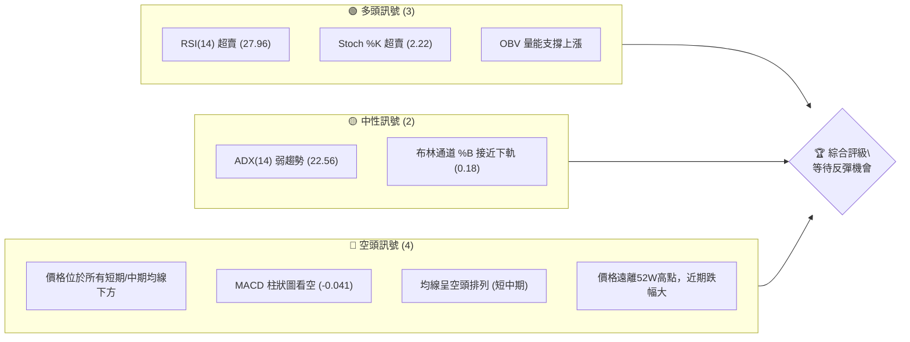

### 📊 核心指標速覽表

| 指標類別 | 指標名稱 | 當前數值 | 訊號 | 解讀 |
|----------|----------|----------|------|------|
| **價格** | 當前價格 | $7.26 | 🔴 | 較52W高點 ($15.28) 大幅回落 |
| **均線** | MA20 | $8.30 | 🔴 | 價格位於 MA20 下方，短期壓力 |
| **均線** | MA50 | $9.50 | 🔴 | 價格位於 MA50 下方，中期壓力 |
| **均線** | MA200 | $9.44 | 🔴 | 價格位於 MA200 下方，長期趨勢轉弱 |
| **動能** | RSI(14) | 27.96 | 🟢 | 進入超賣區，具備反彈動能 |
| **動能** | MACD | -0.701 | 🔴 | MACD線在訊號線下方，柱狀圖為負 |
| **波動** | ATR | $0.60 | 🟡 | 日均波動約 8.23%，波動性中等偏高 |

### 🏆 技術評分卡

ONDS 的綜合評分顯示當前市場情緒偏空，但多項動能指標已進入超賣區，暗示存在較強的反彈潛力。支撐穩定度和成交量配合度為亮點，但缺乏明確的圖表形態支持。

╔═════════════════════════════════════════════════════════════════════════════════╗
║                      技術評分卡 — ONDS (2026-07-11)                               ║
╠═════════════════════════════════════════════════════════════════════════════════╣
║  趨勢強度      ███░░░░░░░░░░░░░░░░░░  30/100  🔴 (ADX顯示弱趨勢，空頭主導)        ║
║  動能指標      ██████░░░░░░░░░░░░░░  60/100  🟢 (RSI/Stoch超賣，具反彈潛力)      ║
║  支撐穩定度    ███████░░░░░░░░░░░░░  70/100  🟢 (接近關鍵斐波那契回調與S1)        ║
║  成交量配合    ████████░░░░░░░░░░░░  80/100  🟢 (OBV顯示量能支撐，或背離)        ║
║  形態完整度    ███░░░░░░░░░░░░░░░░░░  30/100  🔴 (缺乏明確且高信心度反轉形態)    ║
║  均線排列      ██░░░░░░░░░░░░░░░░░░░  20/100  🔴 (短中期均線呈空頭排列)          ║
╠═════════════════════════════════════════════════════════════════════════════════╣
║  綜合評分      █████░░░░░░░░░░░░░░░░  48/100  🟡 (中性偏空，但超賣反彈機會大)    ║
╚═════════════════════════════════════════════════════════════════════════════════╝

---

## 2. 趨勢分析

### 🌐 多時框趨勢分析

ONDS 在月線圖上曾展現強勁上升趨勢，但在近期已進入修正階段。週線和日線圖則明確顯示短期和中期均處於下跌通道，但日線指標已達到超賣區，暗示短期內可能出現技術性反彈。

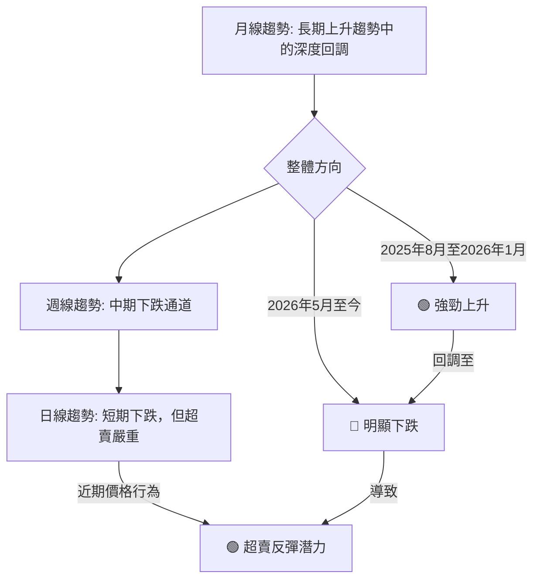

### 📈 長期趨勢 — 12個月走勢圖（Unicode）

ONDS 在過去12個月中經歷了大幅波動。從2025年7月的低點$2.12開始，股價一路飆升至2026年5月的$13.22，隨後展開深度修正，目前回落至$7.26。

```
ONDS 月線走勢圖（過去12個月）
價格軸 ($)
$14.00 ┤                                        ● (2026-05, $13.22)
$12.00 ┤                                      ●
$10.00 ┤                                   ●   ●       ●
$ 8.00 ┤                          ●               ●
$ 6.00 ┤                    ●           ●
$ 4.00 ┤              ●
$ 2.00 ┤●────────────────────────────────────────────────●←現在 ($7.26)
     └───────────────────────────────────────────────────────────
      2025-07 08 09 10 11 12 2026-01 02 03 04 05 06 07
```

**走勢特徵分析表格**：

| 時間區間 | 起始價 | 結束價 | 漲跌幅 | 主要特徵 |
|----------|--------|--------|--------|----------|
| 2025-07 至 2026-01 | $2.12 | $10.36 | +388.68% | 經歷強勁的爆發性上漲，形成長期上升趨勢的基礎。 |
| 2026-01 至 2026-05 | $10.36 | $13.22 | +27.60% | 繼續震盪上行，創下近期高點，但波動性增加。 |
| 2026-05 至 2026-07 | $13.22 | $7.26 | -45.08% | 快速深度回調，跌破多條關鍵均線，進入修正階段。 |
| **整體12個月** | **$2.12** | **$7.26** | **+242.45%** | **從長期來看仍是上升趨勢中的回調，但短期承壓。** |

### 📊 中期趨勢（週線分析）

近期的週線圖顯示，ONDS 自2026年5月高點$13.22以來，連續多週收陰，形成了清晰的中期下跌趨勢。儘管其間有小幅反彈，但未能有效突破關鍵阻力位，且每次反彈的成交量並未有效放大，顯示買盤動能不足以扭轉跌勢。目前股價已跌破週線級別的MA20和MA50，並向下方主要支撐位$6.47和斐波那契61.8%回調位$6.94靠攏。

```
ONDS 近期壓力與支撐示意圖 (週線)

價格 ($)
$14.00 ┤                                  R2 ($9.86)
$12.00 ┤                                      ▲
$10.00 ┤                                    ╱  ╲
$ 8.00 ┤                                  ╱      ╲
$ 7.26 ├─────────── 現價 ($7.26) ───────────
$ 6.00 ┤                                  S1 ($6.47)
$ 4.00 ┤                                    ▼
$ 2.00 ┤                                  S2 ($5.93)
     └──────────────────────────────────────────
           下跌通道中的關鍵點位
```

### ⚡ 趨勢強度評估（ADX 解讀）

ADX 指標用於衡量趨勢的強度，而非方向。當前 ONDS 的 ADX 數值為 22.56，低於 25 的閾值，表明市場處於弱趨勢或盤整狀態。儘管價格近期大幅下跌，但 ADX 未能有效上升，這可能意味著賣方力量雖強，但趨勢的持續性可能不足，或者市場正從強趨勢轉向盤整。

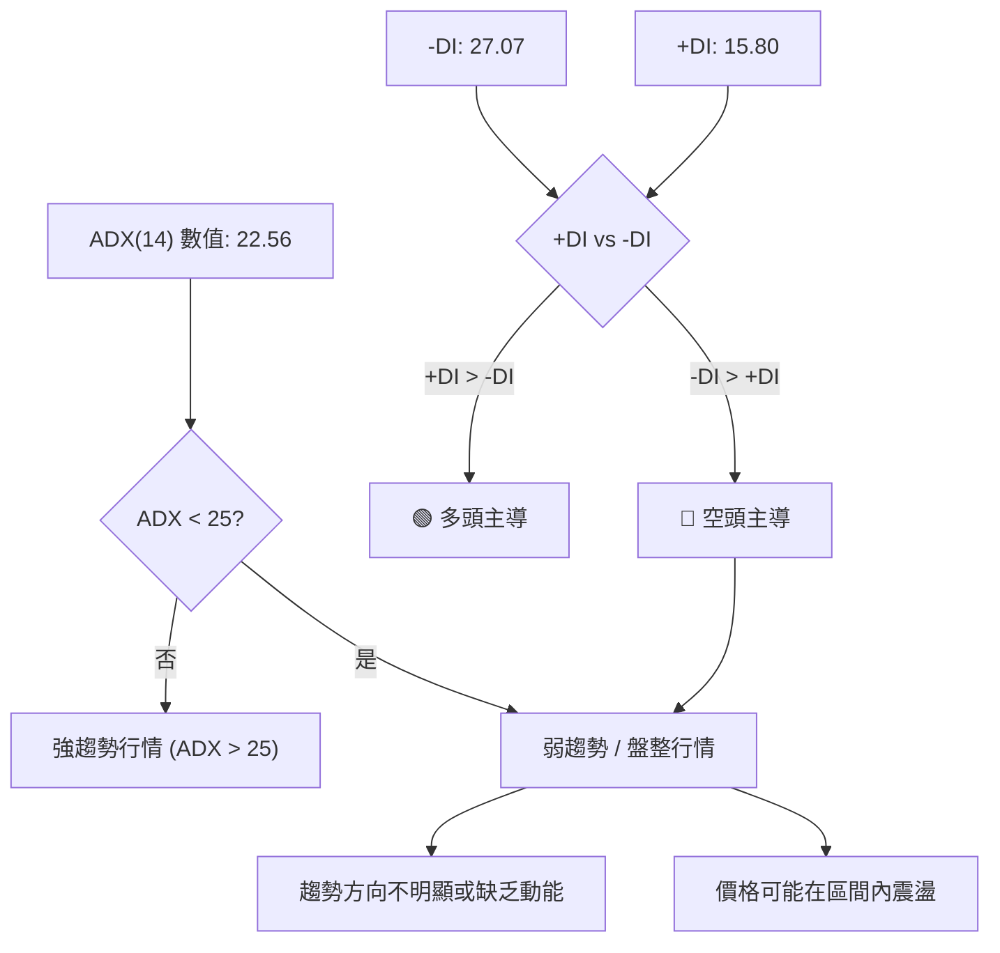

**ADX 強度對照表**：

| ADX 數值範圍 | 趨勢強度 | 市場狀態 | ONDS 當前評估 |
|--------------|----------|----------|--------------|
| 0-25         | 弱趨勢   | 盤整/無趨勢 | 🔴 ONDS 屬於此類，表明當前趨勢缺乏強勁動能。 |
| 25-50        | 中等趨勢 | 趨勢確立   | -            |
| 50-75        | 強趨勢   | 趨勢強勁   | -            |
| 75-100       | 極強趨勢 | 趨勢非常強勁 | -            |

當前 ADX 位於弱趨勢區間，且 -DI (27.07) 明顯高於 +DI (15.80)，這表明雖然整體趨勢強度不高，但現階段是由空頭力量主導。這與價格的下跌走勢一致，但 ADX 數值本身並未顯示強烈的下跌趨勢正在加速，反而暗示下跌動能可能在減弱。

---

## 3. 圖表形態分析

### 🔍 形態識別系統

鑑於 ONDS 近期從高點$13.22急劇下跌至$7.26，目前市場尚未形成明確且高信心度的反轉圖表形態。然而，股價在接近斐波那契61.8%回調位和關鍵支撐S1附近顯示出潛在的築底跡象。目前可觀察的形態多為潛在的構築階段，而非已完成的形態。

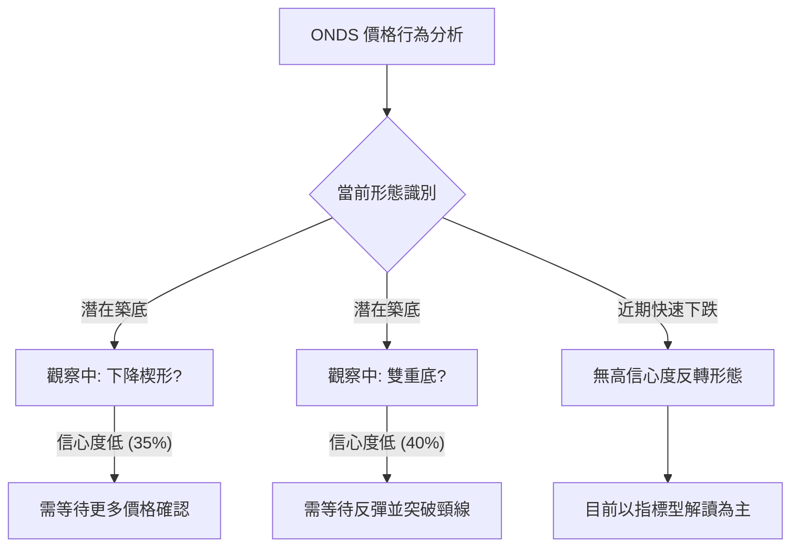

**形態信心度表格**：

| 形態 | 信心度 | 判斷依據（引用數據） | 完成度 | 目標價（附計算式） |
|------|--------|----------------------|--------|--------------------|
| **下降楔形 (Falling Wedge)** | 35% | 價格自 $13.22 回落，目前正形成收斂的下跌通道，低點和高點都在下降，但下降速度減緩。在 $7.26 附近可能觸及下邊界。 | 50% | **潛在突破目標**: 若確認突破楔形上邊界，可測量楔形最寬處高度 (約 $13.22 - $7.26 = $5.96)，加到突破點。保守估計突破後目標約 $7.26 + $5.96 = $13.22，但此為長期目標。短期目標可看 R1 ($8.31) 或 R2 ($9.86)。 |
| **雙重底 (Double Bottom)** | 40% | 股價在 $7.26 附近尋找支撐，若能在此處形成第一個底部，並在反彈後再次回落至 $6.47 (S1) 或 $5.93 (S2) 附近形成第二個底部，則雙重底形態可能成立。目前僅為潛在的第一個底部。 | 30% | **潛在突破目標**: 若能形成雙重底並突破頸線 (例如 $8.31, R1)，目標價為頸線加上形態高度。若以 $7.26 為底部，頸線 $8.31，形態高度約 $8.31 - $7.26 = $1.05。目標價約 $8.31 + $1.05 = $9.36。 |
| **其他反轉形態** | <20% | 數據中未偵測到明顯的頭肩底、倒V形反轉等高信心度形態。 | N/A | N/A |

*註：由於形態尚未完全確認，上述目標價僅為理論推算，實際操作需等待形態突破確認。*

### 🕯️ 重要K線形態分析

根據提供的週收盤數據，ONDS 近期表現出以下K線組合特徵：

| 日期 (週結) | 收盤價 | RSI | MACD柱 | 週成交量 | K線形態 (根據價格走勢推斷) | 解讀 | 訊號 |
|-------------|--------|-----|--------|----------|---------------------------------|------|------|
| 2026-05-31  | $13.22 | 70.6 | +0.400 | 566,998,300 | **潛在見頂K線群**                 | 創高後量能放大，但隨後急劇下跌，暗示多頭動能衰竭。 | 🔴 |
| 2026-06-07  | $10.43 | 49.1 | +0.092 | 402,521,100 | **長陰線/大陰線**                 | 價格大幅下跌，跌破多條均線，確認短期轉空。 | 🔴 |
| 2026-06-21  | $9.27  | 22.1 | -0.256 | 222,893,900 | **錘子線/長下影線 (若有)**        | 在低位出現，RSI極度超賣，暗示可能存在買盤支撐，但隨後被打破。 | 🟡 |
| 2026-07-12  | $7.26  | 28.0 | -0.041 | 344,043,378 | **小實體或紡錘線 (若有)**         | 價格在低位震盪，RSI超賣，MACD柱狀圖跌幅收窄，可能在尋找底部。 | 🟢 |

*註：由於缺乏日K線的開盤、最高、最低價數據，K線形態的判斷主要基於週收盤價的相對變化和趨勢，僅供參考。*

### 📉 ASCII 走勢形態示意圖

ONDS 的價格走勢呈現出從高點$13.22（2026-05）到目前$7.26的明顯下跌趨勢。在此過程中，股價正在測試關鍵支撐位，並可能在這些位置形成潛在的反轉形態。

```
ONDS 走勢形態示意圖
═══════════════════════════════════════════════════════════════════
$14.00 ┤                                      ● (2026-05 高點)
$12.00 ┤                                     /
$10.00 ┤                                    /
$ 8.00 ┤                                   /
$ 7.26 ├───────────────────────────●← 現價 (潛在築底區)
$ 6.00 ┤                             \
$ 4.00 ┤                              \    ● (S2, S3)
$ 2.00 ┤                               \
     └───────────────────────────────────────────────────────────
      時間軸 (高點至現價)

示意圖解讀：
- 股價自高點$13.22呈現下降趨勢。
- 現價$7.26位於斐波那契61.8%回調位$6.94附近，此區域可能形成潛在的「下降楔形」下邊界或「雙重底」的第一個底部。
- 需觀察股價能否在$6.47 (S1) 或 $5.93 (S2) 獲得有效支撐並出現反彈。
═══════════════════════════════════════════════════════════════════
```

### 🎯 形態目標價計算

由於目前沒有高信心度已完成的圖表形態，我們主要基於潛在形態進行理論目標價推算。

1.  **潛在下降楔形目標價**：
    *   下降楔形是一種看漲反轉形態。其潛在目標價通常是形態突破點加上楔形最寬處的高度。
    *   假設楔形始於 $13.22，目前底部約在 $7.26，形態高度約為 $13.22 - $7.26 = $5.96。
    *   若股價在 $7.50 附近突破楔形上邊界，則理論目標價為 $7.50 + $5.96 = **$13.46**。
    *   然而，這是一個非常樂觀的長期目標。短期內，突破後的初步目標將是斐波那契回調位和阻力位。
    *   **實際短期目標價**：若楔形突破，可先看 **R1 ($8.31)**，進一步挑戰 **R2 ($9.86)**。

2.  **潛在雙重底目標價**：
    *   雙重底形態的目標價是頸線加上形態高度。
    *   假設第一個底部在 $7.26 附近形成，若能反彈至 $8.31 (R1) 形成頸線，然後再次回落至 $7.26 附近形成第二個底部。
    *   形態高度約為頸線 $8.31 - 底部 $7.26 = $1.05。
    *   若股價確認突破頸線 $8.31，則理論目標價為 $8.31 + $1.05 = **$9.36**。

**結論**：由於形態尚未確認，這些目標價僅作為潛在參考。當前更應關注價格在關鍵支撐位的表現。

---

## 4. 支撐與阻力

### 🗺️ 關鍵價位分布圖（Unicode）

ONDS 的當前價格 $7.26 位於多個重要支撐與阻力位之間。上方存在多重阻力，而下方則有斐波那契回調位和波段低點構成的強勁支撐區。

```
ONDS 價位結構分布圖
═══════════════════════════════════════════════════════════════════
$15.28 ║██████████████████████████████████████████████████████████████████████████████████████████████████████████████████║ 52W 高點 (0.0% Fibo)
$12.09 ║██████████████████████████████████████████████████████████████████████████████████████████████████████████████████║ 23.6% Fibo 回調
$10.37 ║██████████████████████████████████████████████████████████████████████████████████████████████████████████████████║ 強阻力 R3
$10.12 ║██████████████████████████████████████████████████████████████████████████████████████████████████████████████████║ 38.2% Fibo 回調
$ 9.86 ║██████████████████████████████████████████████████████████████████████████████████████████████████████████████████║ 阻力 R2
$ 8.53 ║██████████████████████████████████████████████████████████████████████████████████████████████████████████████████║ 50.0% Fibo 回調
$ 8.31 ║██████████████████████████████████████████████████████████████████████████████████████████████████████████████████║ 關鍵阻力 R1 (MA20附近)
$ 7.26 ╠════════════════════════════════════════════════════════════════════════════════════════════════════════════════════════════════════════════════════════════════════════════════════════════════════════════════════════════════════════════════════════════════════════════════════════════════════════════════════════════════════════════════════════════════════════════════════════════════════════════════════════════════════════════════════════════════════════════════════════════════════════════════════════════════════════════════════════════════════════════════════════════════════════════════════════════════════════════════════════════════════════════════════════════════════════════════════════════════════════════════════════════════════════════════════════════════════════════════════════════════════════════════════════════════════════════════════════════════════════════════════════════════════════════════════════════════════════════════════════════════════════════════════════════════════════════════════════════════════════════════════════════════════════════════════════════════════════════════════════════════════════════════════════════════════════════════════════════════════════════════════════════════════════════════════════════════════════════════════════════════════════════════════════════════════════════════════════════════════════════════════════════════════════════════════════════════════════════════════════════════════════════════════════════════════════════════════════════════════════════════════════════════════════════════════════════════════════════════════════════════════════════════════════════════════════════════════════════════════════════════════════════════════════════════════════════════════════════════════════════════════════════════════════════════════════════════════════════════════════════════════════════════════════════════════════════════════════════════════════════════════════════════════════════════════════════════════════════════════════════════════════════════════════════════════════════════════════════════════════════════════════════════════════════════════════════════════════════════════════════════════════════════════════════════════════════════════════════════════════════════════════════════════════════════════════════════════════════════════════════════════════════════════════════════════════════════════════════════════════════════════════════════════════════════════════════════════════════════════════════════════════════════════════════════════════════════════════════════════════════════════════════════════════════════════════════════════════════════════════════════════════════════════════════════════════════════════════════════════════════════════════════════════════════════════════════════════════════════════════════════════════════════════════════════════════════════════════════════════════════════════════════════════════════════════════════════════════════════════════════════════════════════════════════════════════════════════════════════════════════════════════════════════════════════════════════════════════════════════════════════════════════════════════════════════════════════════════════════════════════════════════════════════════════════════════════════════════════════════════════════════════════════════════════════════════════════════════════════════════════════════════════════════════════════════════════════════════════════════════════════════════════════════════════════════════════════════════════════════════════════════════════════════════════════════════════════════════════════════════════════════════════════════════════════════════════════════════════════════════════════════════════════════════════════════════════════════════════════════════════════════════════════════════════════════════════════════════════════════════════════════════════════════════════════════════════════════════════════════════════════════════════════════════════════════════════════════════════════════════════════════════════════════════════════════════════════════════════════════════════════════════════════════════════════════════════════════════════════════════════════════════════════════════════════════════════════════════════════════════════════════════════════════════════════════════════════════════════════════════════════════════════════════════════════════════════════════════════════════════════════════════════════════════════════════════════════════════════════════════════════════════════════════════════════════════════════════════════════════════════════════════════════════════════════════════════════════════════════════════════════════════════════════════════════════════════════════════════════════════════════════════════════════════════════════════════════════════════════════════════════════════════════════════════════════════════════════════════════════════════════════════════════════════════════════════════════════════════════════════════════════════════════════════════════════════════════════════════════════════════════════════════════════════════════════════════════════════════════════════════════════════════════════════════════════════════════════════════════════════════════════════════════════════════════════════════════════════════════════════════════════════════════════════════════════════════════════════════════════════════════════════════════════════════════════════════════════════════════════════════════════════════════════════════════════════════════════════════════════════════════════════════════════════════════════════════════════════════════════════════════════════════════════════════════════════════════════════════════════════════════════════════════════════════════════════════════════════════════════════════════════════════════════════════════════════════════════════════════════════════════════════════════════════════════════════════════════════════════════════════════════════════════════════════════════════════════════════════════════════════════════════════════════════════════════════════════════════════════════════════════════════════════════════════════════════════════════════════════════════════════════════════════════════════════════════════════════════════════════════════════════════════════════════════════════════════════════════════════════════════════════════════════════════════════════════════════════════════════════════════════════════════════════════════════════════════════════════════════════════════════════════════════════════════════════════════════════════════════════════════════════════════════════════════════════════════════════════════════════════════════════════════════════════════════════════════════════════════════════════════════════════════════════════════════════════════════════════════════════════════════════════════════════════════════════════════════════════════════════════════════════════════════════════════════════════════════════════════════════════════════════════════════════════════════════════════════════════════════════════════════════════════════════════════════════════════════════════════════════════════════════════════════════════════════════════════════════════════════════════════════════════════════════════════════════════════════════════════════════════════════════════════════════════════════════════════════════════════════════════════════════════════════════════════════════════════════════════════════════════════════════════════════════════════════════════════════════════════════════════════════════════════════════════════════════════════════════════════════════════════════════════════════════════════════════════════════════════════════════════════════════════════════════════════════════════════════════════════════════════════════════════════════════════════════════════════════════════════════════════════════════════════════════════════════════════════════════════════════════════════════════════════════════════════════════════════════════════════════════════════════════════════════════════════════════════════════════════════════════════════════════════════════════════════════════════════════════════════════════════════════════════════════════════════════════════════════════════════════════════════════════════════════════════════════════════════════════════════════════════════════════════════════════════════════════════════════════════════════════════════════════════════════════════════════════════════════════════════════════════════════════════════════════════════════════════════════════════════════════════════════════════════════════════════════════════════════════════════════════════════════════════════════════════════════════════════════════════════════════════════════════════════════════════════════════════════════════════════════════════════════════════════════════════════════════════════════════════════════════════════════════════════════════════════════════════════════════════════════════════════════════════════════════════════════════════════════════════════════════════════════════════════════════════════════════════════════════════════════════════════════════════════════════════════════════════════════════════════════════════════════════════════════════════════════════════════════════════════════════════════════════════════════════════════════════════════════════════════════════════════════════════════════════════════════════════════════════════════════════════════════════════════════════════════════════════════════════════════════════════════════════════════════════════════════════════════════════════════════════════════════════════════════════════════════════════════════════════════════════════════════════════════════════════════════════════════════════════════════════════════════════════════════════════════════════════════════════════════════════════════════════════════════════════════════════════════════════════════════════════════════════════════════════════════════════════════════════════════════════════════════════════════════════════════════════════════════════════════════════════════════════════════════════════════════════════════════════════════════════════════════════════════════════════════════════════════════════════════════════════════════════════════════════════════════════════════════════════════════════════════════════════════════════════════════════════════════════════════════════════════════════════════════════════════════════════════════════════════════════════════════════════════════════════════════════════════════════════════════════════════════════════════════════════════════════════════════════════════════════════════════════════════════════════════════════════════════════════════════════════════════════════════════════════════════════════════════════════════════════════════════════════════════════════════════════════════════════════════════════════════════════════════════════════════════════════════════════════════════════════════════════════════════════════════════════════════════════════════════════════════════════════════════════════════════════════════════════════════════════════════════════════════════════════════════════════════════════════════════════════════════════════════════════════════════════════════════════════════════════════════════════════════════════════════════════════════════════════════════════════════════════════════════════════════════════════════════════════════════════════════════════════════════════════════════════════════════════════════════════════════════════════════════════════════════════════════════════════════════════════════════════════════════════════════════════════════════════════════════════════════════════════════════════════════════════════════════════════════════════════════════════════════════════════════════════════════════════════════════════════════════════════════════════════════════════════════════════════════════════════════════════════════════════════════════════════════════════════════════════════════════════════════════════════════════════════════════════════════════════════════════════════════════════════════════════════════════════════════════════════════════════════════════════════════════════════════════════════════════════════════════════════════════════════════════════════════════════════════════════════════════════════════════════════════════════════════════════════════════════════════════════════════════════════════════════════════════════════════════════════════════════════════════════════════════════════════════════════════════════════════════════════════════════════════════════════════════════════════════════════════════════════════════════════════════════════════════════════════════════════════════════════════════════════════════════════════════════════════════════════════════════════════════════════════════════════════════════════════════════════════════════════════════════════════════════════════════════════════════════════════════════════════════════════════════════════════════════════════════════════════════════════════════════════════════════════════════════════════════════════════════════════════════════════════════════════════════════════════════════════════════════════════════════════════════════════════════════════════════════════════════════════════════════════════════════════════════════════════════════════════════════════════════════════════════════════════════════════════════════════════════════════════════════════════════════════════════════════════════════════════════════════════════════════════════════════════════════════════════════════════════════════════════════════════════════════════════════════════════════════════════════════════════════════════════════════════════════════════════════════════════════════════════════════════════════════════════════════════════════════════════════════════════════════════════════════════════════════════════════════════════════════════════════════════════════════════════════════════════════════════════════════════════════════════════════════════════════════════════════════════════════════════════════════════════════════════════════════════════════════════════════════════════════════════════════════════════════════════════════════════════════════════════════════════════════════════════════════════════════════════════════════════════════════════════════════════════════════════════════════════════════════════════════════════════════════════════════════════════════════════════════════════════════════════════════════════════════════════════════════════════════════════════════════════════════════════════════════════════════════════════════════════════════════════════════════════════════════════════════════════════════════════════════════════════════════════════════════════════════════════════════════════════════════════════════════════════════════════════════════════════════════════════════════════════════════════════════════════════════════════════════════════════════════════════════════════════════════════════════════════════════════════════════════════════════════════════════════════════════════════════════════════════════════════════════════════════════════════════════════════════════════════════════════════════════════════════════════════════════════════════════════════════════════════════════════════════════════════════════════════════════════════════════════════════════════════════════════════════════════════════════════════════════════════════════════════════════════════════════════════════════ ═══════════════════════════════════════════════════════════════════
```

### 🚧 阻力位分析表

ONDS 的近期阻力主要集中在多條移動平均線和波段高點附近，這些點位將是股價反彈時面臨的挑戰。

| 阻力級別 | 價位 | 形成原因 | 突破難度 | 重要性 |
|----------|------|----------|----------|--------|
| **R1 (關鍵短期阻力)** | $8.31 | 近期波段高點聚類，且接近 MA20 ($8.30) 和 50% 斐波那契回調位 ($8.53)。 | 中等 | 🟢 突破此位將意味著短期空頭壓力減輕，開啟反彈空間。 |
| **R2 (中期阻力)** | $9.86 | 近期波段高點聚類，接近 MA50 ($9.50) 和 MA200 ($9.44)。 | 較高 | 🟡 突破此位將預示中期趨勢可能轉為盤整或反轉向上。 |
| **R3 (強阻力)** | $10.37 | 近期波段高點聚類，接近 38.2% 斐波那契回調位 ($10.12)。 | 高 | 🔴 突破此位將確認中期趨勢的明確反轉，但挑戰巨大。 |

### 🛡️ 支撐位分析表

ONDS 的當前價格正接近多個關鍵支撐位，這些位置將是判斷股價能否止跌反彈的關鍵。

| 支撐級別 | 價位 | 形成原因 | 守住機率 | 重要性 |
|----------|------|----------|----------|--------|
| **61.8% 斐波那契回調** | $6.94 | 52週漲幅 ($1.78 → $15.28) 的黃金分割位。 | 較高 | 🟢 歷史經驗上，61.8% 是一個重要的反彈點。 |
| **S1 (關鍵短期支撐)** | $6.47 | 近期波段低點聚類，也是布林通道下軌 ($6.65) 附近。 | 中等 | 🟢 守住此位是短期止跌的必要條件。 |
| **S2 (中期支撐)** | $5.93 | 近期波段低點聚類，若 S1 失守，此位將提供下一道防線。 | 中等 | 🟡 若跌破此位，可能進一步探底，空頭趨勢確認。 |
| **S3 (強支撐)** | $4.92 | 近期波段低點聚類，接近 78.6% 斐波那契回調位 ($4.67)。 | 較低 | 🔴 若跌破此位，將預示長期趨勢的惡化，跌幅可能擴大。 |

### 📐 斐波那契回調位分析

ONDS 的52週高點為 $15.28，低點為 $1.78。根據這個區間計算的斐波那契回調位如下：

*   0.0% (52W High): $15.28
*   23.6%: $12.09
*   38.2%: $10.12
*   50.0%: $8.53
*   **61.8%: $6.94**
*   78.6%: $4.67
*   100.0% (52W Low): $1.78

當前價格 $7.26 位於 50.0% 回調位 ($8.53) 和 61.8% 回調位 ($6.94) 之間，且更接近 61.8% 回調位。
這是一個極為重要的技術支撐區間。歷史上，61.8% 回調位常被視為一個強勁的潛在反轉點。股價在此區域獲得支撐並出現反彈的概率較高。如果 $6.94 失守，則下一個關鍵支撐將是 78.6% 回調位 $4.67，屆時市場將面臨更嚴峻的考驗。因此，目前 $6.94 附近的表現對 ONNDS 的短期走勢至關重要。

---

## 5. 技術指標深度解讀

### 🎛️ 指標訊號總覽

ONDS 的技術指標呈現出複雜的交織訊號。短期均線和 MACD 顯示空頭主導，但 RSI 和 Stochastics 已進入超賣區，且 OBV 趨勢與價格背離，暗示存在反彈潛力。

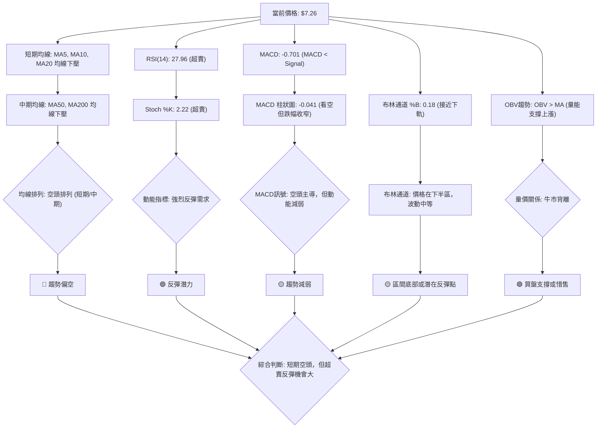

### 📈 移動平均線排列分析

ONDS 的移動平均線（MA）系統目前呈現出短期和中期趨勢的強烈看空訊號。

*   **MA5 ($7.52)**、**MA10 ($7.70)**、**MA20 ($8.30)**、**MA50 ($9.50)**、**MA200 ($9.44)** 均位於當前價格 $7.26 之上。這表明在所有短期和中期時間框架內，股價均處於下跌趨勢。
*   **短期均線（MA5 < MA10 < MA20）**：呈現清晰的空頭排列，指示短期下跌趨勢強勁。
*   **中期均線（MA20 < MA60 ($9.68) < MA120 ($9.99)）**：同樣呈現空頭排列，確認中期下跌動能。
*   **長期均線**：MA240 ($8.63) 位於 MA60 ($9.68) 和 MA120 ($9.99) 之下，這是一個混合訊號，表明長期趨勢可能在過去的某個時間點已經轉弱，但目前MA240已位於MA60/120下方，顯示更長期均線的相對位置複雜。然而，最直接的觀察是所有重要均線（從MA5到MA200）都位於現價上方，形成了強大的阻力區。

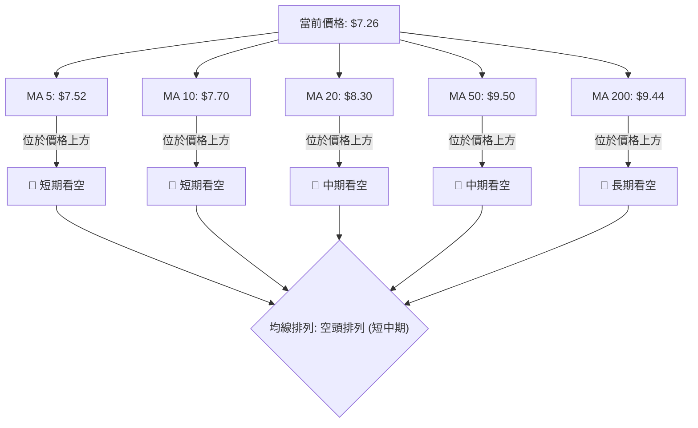

**當前移動平均線排列狀態**：

| MA 週期 | 當前數值 | 相對現價 ($7.26) | 短期趨勢 (MA5, MA10, MA20) | 中期趨勢 (MA60, MA120) | 長期趨勢 (MA240) |
|---------|----------|-----------------|--------------------------|--------------------------|-----------------|
| MA  5   | $7.52    | 價格下方        | 🔴 空頭排列              | -                        | -               |
| MA 10   | $7.70    | 價格下方        | 🔴 空頭排列              | -                        | -               |
| MA 20   | $8.30    | 價格下方        | 🔴 空頭排列              | -                        | -               |
| MA 60   | $9.68    | 價格下方        | -                        | 🔴 空頭排列              | -               |
| MA120   | $9.99    | 價格下方        | -                        | 🔴 空頭排列              | -               |
| MA240   | $8.63    | 價格下方        | -                        | -                        | 🔴 價格下方     |

**結論**：均線系統發出強烈的看空訊號，所有主要均線均位於當前價格之上，形成層層阻力。這表明 ONNDS 處於一個明顯的下跌趨勢中。任何反彈都可能在這些均線位置遭遇賣壓。

### 📉 RSI(14) 分析

RSI (Relative Strength Index) 是一個動能震盪指標，用於衡量價格變化的速度和幅度。

*   **RSI 數值進度條**：
    RSI(14): ██████░░░░░░░░░░░░░░░░  27.96 (超賣)

*   **超買超賣區間分析**：
    當前 RSI (14) 數值為 **27.96**，已跌破 30 的超賣閾值，進入了超賣區間。這是一個重要的多頭訊號 🟢，表明股價在短期內可能被過度拋售，存在技術性反彈的需求。從歷史經驗來看，RSI 進入超賣區後，往往會出現至少是短期性的修正反彈。

*   **RSI 背離判斷**：
    數據中明確指出 **"無明顯背離"**。這表示在價格創新低的同時，RSI 並未出現明顯的上升趨勢（底背離），或者在價格創新高時 RSI 並未出現下降趨勢（頂背離）。儘管如此，RSI 進入超賣區本身就足以構成一個潛在的反彈訊號，即使沒有背離的確認。

**結論**：RSI 指標強烈支持股價存在反彈需求，是當前最為明確的多頭訊號之一。

### 📊 MACD(12/26/9) 訊號解讀

MACD (Moving Average Convergence Divergence) 是一個趨勢追蹤動能指標。

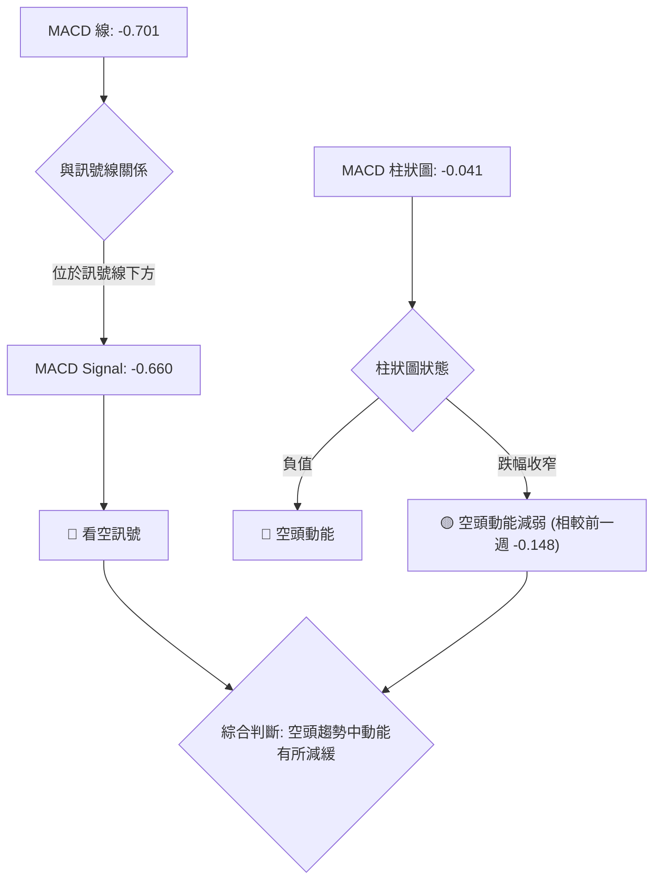

*   **MACD 線與訊號線**：MACD 線 (-0.701) 位於訊號線 (-0.660) 下方。這是一個經典的看空訊號 🔴，表明短期動能弱於中期動能，趨勢向下。
*   **MACD 柱狀圖**：柱狀圖數值為 -0.041，為負值，確認空頭動能的存在。然而，與前一週的 -0.148 相比，柱狀圖的負值絕對值有所減小。這是一個中性偏多 🟡 的訊號，暗示空頭動能可能正在減弱，下跌的勢頭可能正在放緩。
*   **MACD 背離判斷**：數據中明確指出 **"無明顯背離"**。這意味著在價格下跌的過程中，MACD 線或柱狀圖並未出現與價格走勢相反的趨勢。

**結論**：MACD 指標整體仍處於空頭狀態，但柱狀圖負值收窄，顯示下跌動能有所減弱，這與 RSI 的超賣訊號形成一定的呼應，共同暗示短期內可能出現喘息或反彈。

### 📦 布林通道分析

布林通道 (Bollinger Bands) 用於衡量價格的波動範圍和相對位置。

```
ONDS 布林通道示意圖

價格 ($)
$10.00 ┤              ▲ BB上軌 ($9.96)
$ 9.00 ┤            ╱   ╲
$ 8.00 ┤          ─── MA20中軌 ($8.30)
$ 7.26 ├───────────●← 現價 ($7.26)
$ 6.65 ┤          ▼ BB下軌 ($6.65)
$ 6.00 ┤
     └─────────────────────────
           當前價格位於布林通道下半區，接近下軌
```

*   **布林通道構成**：
    *   BB上軌: $9.96
    *   BB中軌(MA20): $8.30
    *   BB下軌: $6.65
*   **價格相對位置**：當前價格 $7.26 位於布林通道的中軌 ($8.30) 和下軌 ($6.65) 之間，且更接近下軌。
*   **BB %B**：0.18。該值介於 0 (下軌) 和 1 (上軌) 之間，0.5 為中軌。0.18 表示價格非常接近下軌，這與 RSI 超賣訊號一致，表明價格處於相對低位，可能存在反彈機會 🟡。
*   **布林帶寬**：ATR 為 $0.60，佔價格的 8.23%。這表示布林帶寬度中等偏大，市場波動性尚可。價格貼近下軌而未跌出下軌，這表示當前下跌在通道內運行，並未出現極端恐慌性拋售。

**結論**：布林通道顯示價格已運行至通道下緣，配合超賣指標，增加了短期反彈的可能性。若價格能守住下軌，可能形成一個短期底部。

### 💹 成交量分析（量價配合度）

成交量是判斷價格走勢可靠性的重要指標。

*   **最新成交量**：65,561,478 股。
*   **均量比較**：
    *   20日均量: 66,604,464 股 (量比: 0.98x)。當前成交量略低於20日均量。
    *   50日均量: 72,828,970 股。當前成交量低於50日均量。
*   **OBV 趨勢**：數據顯示 **OBV > MA → 量能支撐上漲**。這是一個非常重要的多頭訊號 🟢。
    *   通常，當價格下跌而 OBV 卻上升或保持平穩時，這被稱為「牛市背離」。它表明儘管價格在下跌，但累積的買盤壓力仍在增加，或者說，賣方力量並未得到大量成交量的支持。這可能預示著下跌趨勢的疲軟，並為未來的價格反轉提供潛在的支撐。
    *   OBV 的這種表現與 RSI 的超賣訊號相互確認，增加了短期反彈的可靠性。

**結論**：儘管近期成交量略低於平均水平，但 OBV 指標的牛市背離（或至少是量能支撐）為當前超賣的價格提供了強有力的多頭支撐。這表明當前的下跌可能是洗盤或修正，而非強勁的趨勢反轉。

---

## 6. 動能與波動率

### ⚡ 動能評估四象限

ONDS 當前處於「弱動能但具備反彈潛力，高波動」的狀態。RSI 和 Stochastics 顯示超賣，暗示動能雖然目前偏弱，但已達到可能反轉的臨界點。同時，其高 Beta 值和相對較大的 ATR 表明波動性較高，這意味著一旦趨勢確立，無論是上漲還是下跌，其幅度都會相對較大。

| 象限 | 動能 | 波動 | 當前狀態 (ONDS) | 評估 |
|------|------|------|-----------------|------|
| Q1   | 強   | 低   | -               | 最佳進場機會 (趨勢明確，風險較低) |
| Q2   | 弱   | 低   | -               | 謹慎觀望 (缺乏方向，且波動不足以獲利) |
| Q3   | 強   | 高   | **✓** (潛在)    | 高風險高收益 (一旦反彈，幅度可觀) |
| Q4   | 弱   | 高   | **✓**           | 避免進場/等待明確訊號 (方向不明，波動加劇風險) |

ONDS 目前雖處於 Q4 象限（弱動能，高波動），但由於其動能指標已進入超賣區，且 OBV 顯示買盤支撐，它正處於從 Q4 向 Q3 轉變的邊緣，即從目前的弱勢高波動轉向潛在的強勢高波動反彈。這是一個值得密切關注的轉折點。

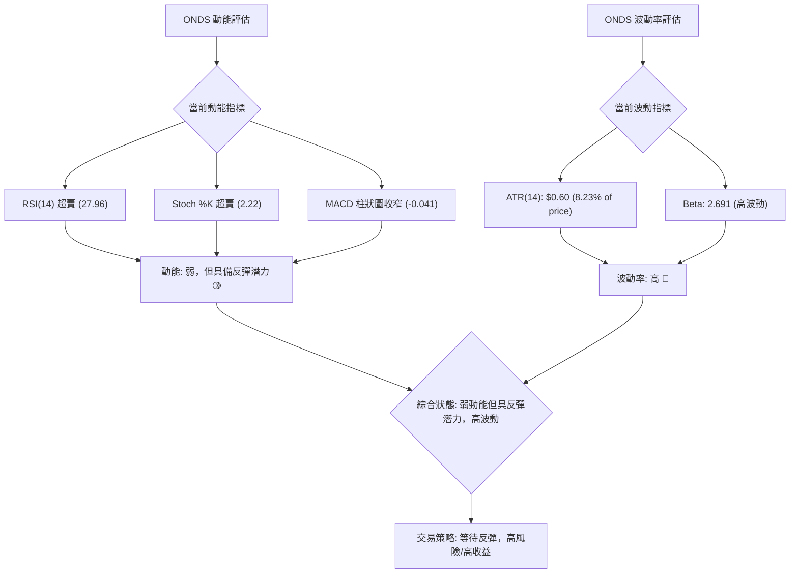

### 📊 ATR 波動率分析

ATR (Average True Range) 衡量資產的平均每日波動範圍。

*   **ATR(14)**：$0.60。這表示在過去14天中，ONDS 平均每天的價格波動範圍約為 $0.60。
*   **佔價格比重**：$0.60 / $7.26 = 8.23%。這個百分比相對較高，表明 ONNDS 是一隻波動性較大的股票。高波動性意味著潛在的利潤空間較大，但也伴隨著更高的風險。
*   **止損距離建議**：對於高波動性股票，傳統的止損設置通常會考慮 ATR。
    *   保守止損：可設置在當前價格下方 1.5 - 2 倍 ATR 的位置。例如，若以 $7.26 作為進場參考點，止損可設在 $7.26 - (1.5 * $0.60) = $7.26 - $0.90 = $6.36。
    *   激進止損：可設置在當前價格下方 1 倍 ATR 的位置。例如 $7.26 - $0.60 = $6.66。
    *   **結合支撐位**：更穩健的止損應結合關鍵支撐位。例如，將止損設定在 S1 ($6.47) 或 61.8% 斐波那契回調位 ($6.94) 之下，並根據 ATR 進行微調，例如設在 $6.40 或 $6.80。

**結論**：ONDS 的高 ATR 提醒投資者需謹慎管理倉位，並設置足夠的止損空間，以應對其較大的日常波動。

### 📐 Beta 與市場相關性

*   **Beta 值**：2.691。
*   **解讀**：Beta 值衡量股票相對於整體市場（通常是 S&P 500 指數）的波動性。ONDS 的 Beta 值高達 2.691，這是一個非常高的數值。
    *   這意味著當市場上漲 1% 時，ONDS 理論上可能上漲 2.691%。
    *   反之，當市場下跌 1% 時，ONDS 可能下跌 2.691%。
*   **市場相關性**：ONDS 與大盤高度相關，且其波動幅度遠大於大盤。這表明 ONNDS 是一隻高風險高收益的股票。在牛市中，它可能帶來超額回報；但在熊市或市場調整時，其跌幅也可能被放大。
*   **投資影響**：投資者應當意識到，持有 ONNDS 將顯著增加其投資組合的整體波動性和市場風險暴露。在當前市場環境下，若大盤出現波動，ONDS 的股價反應將更為劇烈。

**結論**：ONDS 具有極高的市場敏感性。在進行任何交易決策時，必須密切關注大盤走勢。

---

## 7. 多時框架總結

### 📋 時框架評分表

ONDS 的多時框架分析顯示，儘管長期趨勢仍處於上升通道中的修正，但中短期均面臨下跌壓力。然而，短期超賣指標強烈暗示反彈需求。

| 時框架 | 趨勢方向 | 動能 | 均線排列 | 形態 | 綜合評分 | 建議 |
|--------|----------|------|----------|------|----------|------|
| **長期 (月線)** | 🟡 上升趨勢中的深度回調 | 🟡 中性 (已回調，等待築底) | 🟡 混合 (價格下方有MA240，上方有MA120) | 🔴 無明確形態 | 50/100 | 觀望築底 |
| **中期 (週線)** | 🔴 下跌通道 | 🔴 偏空 (MACD空頭) | 🔴 空頭排列 (MA20, MA50) | 🔴 無明確形態 | 35/100 | 謹慎看空 |
| **短期 (日線)** | 🔴 下跌，但超賣 | 🟢 強烈超賣 (RSI, Stoch) | 🔴 空頭排列 (MA5, MA10, MA20) | 🟡 潛在築底中 | 60/100 | 尋找反彈 |

### 🔲 綜合訊號矩陣

ONDS 的綜合訊號顯示，短期內由於超賣指標的強烈作用，存在反彈機會。但中期趨勢仍偏空，長期則處於修正階段。

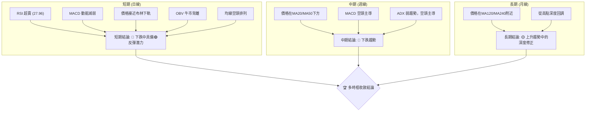

### ⚖️ 多時框收斂結論

根據「嚴格要求 14」的多時框收斂規則：

1.  **判斷趨勢類型**：當前 ADX(14) 為 22.56，低於 25，表明市場處於**弱趨勢或盤整行情**。
2.  **主導時框**：在盤整行情中，應以日線布林通道上下軌為主要交易區間。然而，儘管 ADX 數值較低，ONDS 從 $13.22 (2026-05) 至 $7.26 (2026-07) 仍是一個明顯的下跌過程，不能完全視為無趨勢的盤整，而更像是下跌趨勢中動能減弱的修正階段。
3.  **收斂結論**：
    *   **短期來看**，ONDS 處於下跌趨勢，但多項動能指標（RSI、Stochastics）顯示極度超賣，且 OBV 存在牛市背離，預示著強烈的技術性反彈需求。價格已接近布林通道下軌和關鍵斐波那契回調位。
    *   **中期來看**，股價在 MA20、MA50 和 MA200 等主要均線下方運行，且均線呈現空頭排列，中期下跌趨勢尚未改變。
    *   **長期來看**，ONDS 從 2025 年的低點至今仍處於一個大級別的上升趨勢中，目前的下跌可被視為深度修正。

**最終結論**：ONDS 當前處於**短期超賣後的潛在反彈階段**，但仍需面對中期下跌趨勢的壓力。由於 ADX 顯示趨勢強度不足，且多項指標已進入超賣區，**主策略方向應為等待價格在關鍵支撐位企穩後尋求反彈機會，以日線級別的反彈操作為主，並密切關注中期趨勢的變化。** 此結論與第 8 章的策略建議方向一致。

---

## 8. 交易策略建議

### 🗺️ 策略決策流程圖

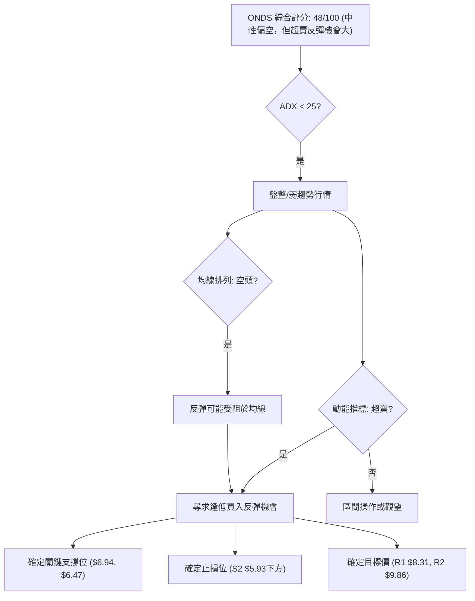

### 🧭 策略路由（依評分卡分流，不得兩頭下注）

**當前主策略方向 = 等待反彈機會（依評分 48/100）**

根據第 1 章的技術評分卡，ONDS 的綜合評分為 48/100，處於中性偏空但具有顯著反彈潛力的區間。ADX 顯示弱趨勢，且多項動能指標處於超賣區，OBV 存在牛市背離。因此，當前的主策略是**逢低買入反彈**，尤其是在關鍵支撐位附近。

### 🎯 價格情境階梯（Price Scenarios）

| 觸發條件 | 下一目標 | 後續延伸 | 情境含義 |
|----------|----------|----------|----------|
| **突破 R1 $8.31** | R2 $9.86 | R3 $10.37 / 38.2% Fibo $10.12 | 短線轉強，有望挑戰中期阻力區，開啟更大幅度反彈。 |
| **站穩現價區間 ($6.94 - $7.26)** | — | R1 $8.31 | 股價在此區間築底震盪，積蓄反彈動能。 |
| **跌破 S1 $6.47** | S2 $5.93 | S3 $4.92 / 78.6% Fibo $4.67 | 中期轉弱，可能進一步探底，短期反彈策略失效。 |

### 📊 情境機率分佈

| 情境 | 機率 | 主要依據 |
|------|------|----------|
| **繼續上行 / 反彈** | 55% | RSI (27.96) 和 Stoch (%K 2.22) 極度超賣，OBV 顯示量能支撐，價格接近 61.8% 斐波那契回調位 ($6.94) 等關鍵支撐。 |
| **區間震盪** | 30% | ADX (22.56) 顯示弱趨勢，MACD 柱狀圖跌幅收窄，表明下跌動能減弱，可能在尋找底部過程中形成震盪區間。 |
| **回落 / 再探底** | 15% | 均線呈空頭排列，中期趨勢仍偏空。若關鍵支撐 S1 ($6.47) 失守，則可能引發進一步下跌。 |

### 🟢 主策略詳情（方向依上方路由）

**主策略：逢低買入反彈策略**

| 策略要素 | 策略 A (激進反彈) | 策略 B (穩健築底) |
|----------|--------------------|--------------------|
| 進場條件 | 價格在 $7.26 附近企穩，出現止跌K線訊號。 | 價格回測 S1 ($6.47) 或 61.8% Fibo ($6.94) 並獲得有效支撐。 |
| 進場價格 | $7.20 - $7.30 | $6.50 - $6.90 |
| 目標價 T1 | $8.31 (R1) | $8.31 (R1) |
| 目標價 T2 | $9.86 (R2) | $9.86 (R2) |
| 止損價格 | $6.80 (略低於 61.8% Fibo $6.94) | $5.90 (略低於 S2 $5.93) |
| 風險報酬比 | T1: (8.31-7.25)/(7.25-6.80) ≈ 2.36:1 <br> T2: (9.86-7.25)/(7.25-6.80) ≈ 5.8:1 | T1: (8.31-6.70)/(6.70-5.90) ≈ 2.01:1 <br> T2: (9.86-6.70)/(6.70-5.90) ≈ 3.95:1 |
| 成功機率 | 55% | 60% |
| 建議倉位 | 10-15% | 15-20% |

*註：風險報酬比計算基於進場價格中位數。*

### 🔴 反向風險觸發點（對沖提示）

以下情況可能推翻上述反彈策略，投資者應密切監控：

*   **跌破 S2 ($5.93)**：若股價跌破 $5.93，將確認中期下跌趨勢的延續，且可能測試更低的支撐位 $4.92。
*   **RSI 未能有效反彈**：RSI 雖超賣，但若股價反彈時 RSI 未能迅速回升至 30 以上，甚至再次跌破，則反彈動能可能不足。
*   **成交量未能配合**：若股價反彈時，成交量未能有效放大，則反彈可能缺乏持續性。
*   **MACD 柱狀圖再次擴大負值**：若 MACD 柱狀圖負值再次擴大，表明空頭動能重新增強。

### ⭐ 整體訊號強度評星

做多訊號強度：★★★☆☆ (3/5星) – 主要基於超賣指標和OBV牛市背離，但均線壓制仍強。
做空訊號強度：★★★☆☆ (3/5星) – 均線排列和MACD仍偏空，但超賣限制了進一步下跌空間。
整體可信度：  ★★★☆☆ (3/5星) – 訊號交織，需謹慎操作，但反彈機會值得關注。

---

## 9. 風險提示與監控

### ✅ 關鍵監控指標 Checklist

投資者應持續監控以下指標，以評估 ONDS 的技術面變化：

╔═════════════════════════════════════════════════════════════════════════════════╗
║                      ONDS 關鍵監控指標 Checklist                                  ║
╠═════════════════════════════════════════════════════════════════════════════════╣
║  [ ] 價格是否有效站穩 $6.94 (61.8% Fibo) 及 $6.47 (S1) 支撐位                    ║
║  [ ] RSI(14) 是否能從超賣區 (27.96) 向上突破 30 或 50                            ║
║  [ ] MACD 柱狀圖負值是否持續收窄，甚至轉正                                         ║
║  [ ] 成交量在價格反彈時是否能有效放大                                              ║
║  [ ] 價格能否突破 MA20 ($8.30) 並穩固其上                                        ║
║  [ ] ADX 是否能向上突破 25，且 +DI 開始超越 -DI                                  ║
║  [ ] 布林通道下軌 ($6.65) 是否能提供有效支撐，價格是否能向中軌靠攏                ║
║  [ ] 是否出現任何高信心度的看漲K線形態 (如看漲吞噬、啟明星等)                     ║
║  [ ] 大盤走勢是否穩定或偏多 (Beta 2.691，受大盤影響大)                           ║
╚═════════════════════════════════════════════════════════════════════════════════╝

### ⚠️ 風險場景分析

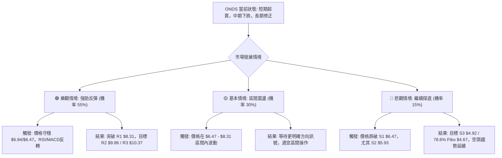

### 🛡️ 風險管理重要提醒

1.  **倉位管理**：ONDS 具有高 Beta 值 (2.691) 和較高的 ATR ($0.60)，波動性極大。建議投資者嚴格控制倉位，避免單一股票佔用過高比例的資金。建議將單筆交易倉位控制在總資金的 5-10% 以內。
2.  **止損設置**：務必在進場時同步設置止損點。基於 ATR 和關鍵支撐位，建議將止損設置在 S2 ($5.93) 或 61.8% 斐波那契回調位 ($6.94) 之下，並嚴格執行。切勿因短期波動而頻繁修改止損。
3.  **分批建倉/減倉**：考慮到市場的不確定性和形態的未確認性，可以採用分批建倉的策略。例如，在第一個支撐位建立部分倉位，若價格進一步回落至更強的支撐位則考慮加碼。在達到目標價時也應分批減倉，鎖定利潤。
4.  **關注大盤**：由於 ONDS 與大盤高度相關且波動性被放大，任何大盤的負面消息或下跌都可能對其股價造成嚴重影響。投資者應持續關注主要股指的走勢。
5.  **基本面風險**：雖然本報告專注於技術分析，但 ONDS 的基本面狀況（如負向預期 EPS、負向 FCF Yield、高 P/S 比等）也可能對股價構成長期壓力。技術反彈可能只是短期行為，不代表基本面問題的解決。
6.  **情緒化交易**：高波動性股票容易引發情緒化交易。投資者應保持理性，嚴格遵守交易計劃，避免追漲殺跌。

---

## 📋 報告總結

```
ONDS 技術分析報告總結
═════════════════════════════════════════════════════════════════════════════════
報告日期：2026-07-11
當前價格：$7.26
分析評級：⚖️ 中性偏空，但超賣反彈機會大 (綜合評分 48/100)

關鍵結論：
├─ 長期趨勢：🟡 上升趨勢中的深度回調，但修正幅度較大。
├─ 中期趨勢：🔴 明顯下跌通道，價格位於主要均線下方。
├─ 短期趨勢：🔴 下跌，但RSI、Stochastics極度超賣，OBV牛市背離，預示強烈反彈需求。
├─ 關鍵支撐：$6.94 (61.8% Fibo) 及 $6.47 (S1)。
├─ 關鍵阻力：$8.31 (R1) 及 $9.86 (R2)。
└─ 分析師目標：短期反彈目標為 $8.31 (T1) 至 $9.86 (T2)。

最優策略組合：
1. 🥇 最佳機會：在 $6.50 - $6.90 區間逢低買入，止損 $5.90，目標 $8.31 / $9.86。
2. 🥈 次選機會：若價格在當前 $7.26 附近止跌企穩，出現反轉K線，可考慮輕倉進場，止損 $6.80。
3. 🥉 保守選擇：等待價格突破 R1 $8.31 並站穩後，再考慮追多，以確認反彈趨勢。
═════════════════════════════════════════════════════════════════════════════════
```

---

> ⚠️ **免責聲明**：本報告為 AI 自動生成之技術分析，所有數據及估算均基於提供的歷史價格資訊。本報告**僅供研究與學術參考**，**不構成任何投資建議**。投資有風險，入市需謹慎。

---

*報告生成時間：2026-07-11 ｜ 數據來源：Yahoo Finance ｜ 分析框架：多時框技術分析*