<details>
<summary>📊 靜態圖表 (點擊展開)</summary>

</details>

<html>
<head><meta charset="utf-8" /></head>
<body>
    <div style="height:500px; width:100%;">                        <script>window.PlotlyConfig = {MathJaxConfig: 'local'};</script>
        <script charset="utf-8" src="https://cdn.plot.ly/plotly-3.7.0.min.js" integrity="sha256-jvTGqxNp8AGWEcvNLVuKr+8j5dGe9Yw51LQkmDH+IYA=" crossorigin="anonymous"></script>                <div id="candlestick-chart" class="plotly-graph-div" style="height:100%; width:100%;"></div>            <script>                window.PLOTLYENV=window.PLOTLYENV || {};                                if (document.getElementById("candlestick-chart")) {                    Plotly.newPlot(                        "candlestick-chart",                        [{"close":{"dtype":"f8","bdata":"AAAAwB6FH0AAAABgZmYdQAAAAAAAAB9AAAAAANejHkAAAABA4XofQAAAAKBH4R5AAAAAoHA9HUAAAAAghWsiQAAAAIDr0SNAAAAAgOtRJUAAAACAFC4mQAAAAMAehSZAAAAAQOH6JEAAAADgo3AiQAAAAGC4niVAAAAAgOvRJEAAAADAHgUjQAAAAGBmZiBAAAAA4KNwHkAAAADgehQfQAAAAGCPwhxAAAAAgML1GkAAAACgcD0cQAAAAEAK1x1AAAAAYLgeHkAAAADA9SgbQAAAAAAAABtAAAAAwPUoGUAAAABgj8IZQAAAAKCZmRhAAAAAQArXF0AAAAAAAAAYQAAAAAAAABVAAAAAoHA9F0AAAADAHoUXQAAAAEAzMxdAAAAAgD0KFkAAAACgcD0aQAAAAOBRuBxAAAAAwB4FGUAAAAAAKVwfQAAAAAAAAB5AAAAA4HoUGUAAAADgo\u002fAaQAAAAOCjcCFAAAAAoEfhIEAAAABA4XogQAAAAKCZmR9AAAAAgOtRHkAAAAAA1yMgQAAAAEAK1yFAAAAAoEdhIkAAAAAA1yMiQAAAAIA9CiJAAAAAgMJ1IkAAAABgZqYgQAAAAIA9CiJAAAAAAACAIUAAAABgj8IeQAAAAIAULiBAAAAAQOF6HUAAAABAMzMfQAAAAOCjcCJAAAAAgD2KIkAAAAAgheshQAAAAGCPQiJAAAAAgML1IEAAAAAghesgQAAAAEDh+iFAAAAAwB6FI0AAAACAPQomQAAAACBcDylAAAAAgBSuKUAAAAAAKVwoQAAAAMAeBSxAAAAAoEdhK0AAAACgR2EqQAAAACCuxytAAAAAYLgeK0AAAAAA16MpQAAAAIDrUShAAAAAYI9CKkAAAACgmRkpQAAAAKBwPSlAAAAAQApXKEAAAACA61EmQAAAAMAehShAAAAAgD2KKEAAAACAPYomQAAAAOBRuCRAAAAAIK5HJUAAAABgj8ImQAAAAAApXCNAAAAAgML1IEAAAACgR2EjQAAAAIAUriRAAAAAAClcI0AAAACAwnUiQAAAAOCj8CFAAAAAYLieIkAAAACgmRkkQAAAAADXIyZAAAAAIK7HJkAAAAAgXA8kQAAAAKBHYSRAAAAAwMzMJEAAAACgmZkkQAAAAGBm5iRAAAAAwPUoJEAAAABAClclQAAAAIA9CiRAAAAAwB4FJUAAAABA4fokQAAAAMD1qCNAAAAA4KNwI0AAAADAHgUkQAAAAMD1qCNAAAAAwPWoJEAAAACA61EkQAAAACBcDyVAAAAAIFyPJkAAAADA9aglQAAAAAAAgCVAAAAAYLgeJEAAAADAzMwlQAAAAAApXCVAAAAAYLieJEAAAACgR+EiQAAAAKCZmSFAAAAAwMxMIEAAAADgehQiQAAAAGC4niFAAAAAQDMzI0AAAACAPQojQAAAACBcDyNAAAAAYGbmIkAAAAAgrkciQAAAAGCPQiJAAAAA4KPwIkAAAADAzMwiQAAAACBcDyRAAAAAYGZmJEAAAAAAAAAkQAAAAIDCdSVAAAAAoHC9JUAAAABguB4mQAAAAOB6FCVAAAAAoJkZJUAAAABgZuYlQAAAAIDC9SRAAAAAQOH6IkAAAADgehQkQAAAAADXoyRAAAAAgMJ1I0AAAADA9agiQAAAAIAUriJAAAAAIK7HIUAAAABguB4iQAAAAEAK1yJAAAAA4HoUIkAAAADgUbghQAAAACCFayZAAAAAoHA9JUAAAABgZmYjQAAAAAAAQCJAAAAA4FG4IkAAAAAAKVwiQAAAAGC4HiJAAAAAgD2KI0AAAACgmZklQAAAAAAAgCpAAAAA4KNwKkAAAAAghesqQAAAAMD1KCtAAAAA4FE4J0AAAADgo\u002fAnQAAAAAAp3CRAAAAAoJmZJEAAAADAzEwjQAAAAGC4niJAAAAAwPWoI0AAAADA9agiQAAAAMAeBSNAAAAAIIVrIkAAAACgcD0iQAAAAIA9iiJAAAAAIK7HIUAAAAAgXA8hQAAAAOBRuB5AAAAAQDOzHkAAAACA61EfQAAAAIA9CiBAAAAAQOF6IEAAAACAFK4fQAAAAADXox1AAAAAIK5HH0AAAABgZmYdQAAAAOB6FB5AAAAAoJmZHkAAAACAPQodQA=="},"high":{"dtype":"f8","bdata":"AAAAoHA9IEAAAAAA1yMgQAAAAAApXB9AAAAAIFyPH0AAAAAghWshQAAAAEAKVyBAAAAAwMzMH0AAAACAFK4iQAAAACBcjyRAAAAAYI9CJ0AAAABAChcnQAAAAGBmZidAAAAAIK7HJkAAAADAHgUlQAAAAIAUbiZAAAAAYLgeJUAAAACgcL0lQAAAAGCPQiNAAAAAgOtRIEAAAACgR2EgQAAAAADXox9AAAAAgD0KHUAAAABAMzMdQAAAAEAKVyBAAAAAoEehIEAAAAAgXI8eQAAAAMDMzBtAAAAAgMJ1GkAAAAAAAAAaQAAAAGCPwhpAAAAAIK5HGkAAAAAAAAAZQAAAAOBRuBdAAAAA4HqUF0AAAAAgXI8ZQAAAAKBHYRhAAAAAwPWoGEAAAAAAKVwdQAAAAOCjcB9AAAAAIFwPHkAAAACAFK4fQAAAAIDrESBAAAAAoEfhH0AAAABgZmYbQAAAAKCZmSFAAAAAYI\u002fCIUAAAAAAKVwhQAAAAMAg8CBAAAAAANcjIEAAAACgmRkhQAAAAIDCNSJAAAAAgBSuIkAAAACgmZkiQAAAAAAAgCNAAAAA4FG4I0AAAABA4ToiQAAAAMD1KCJAAAAAYGYmI0AAAABA4XohQAAAAADXYyBAAAAAYLgeIUAAAABgka0gQAAAAEDheiJAAAAAgOtRI0AAAACAFK4jQAAAAGBmZiJAAAAAQApXIkAAAABAClchQAAAAKCZmSJAAAAAIFwPJUAAAABguB4mQAAAAOB6FClAAAAAACncKUAAAACAPQoqQAAAAADXIy5AAAAAQDMzLkAAAAAgXI8uQAAAAAAAAC1AAAAAAACAK0AAAAAA1yMsQAAAAAAAgCxAAAAAYGZmLEAAAADA9agsQAAAAMD1qCpAAAAAQOG6KUAAAAAghasoQAAAAOCj8ChAAAAAwPUoKkAAAAAgXI8oQAAAAGBm5iZAAAAAYGZmJkAAAABACtcmQAAAAIA9yiZAAAAAIFwPI0AAAADAHoUjQAAAACCuRyVAAAAAoEfhJEAAAABACtcjQAAAAKDGiyJAAAAAAClcI0AAAAAA16MkQAAAAEAKVyZAAAAAgBQuJ0AAAADA9SgnQAAAAADXIyVAAAAAgML1JEAAAACgR+ElQAAAACBcjyVAAAAAAClcJEAAAABACtcoQAAAAAAAACZAAAAAANejJUAAAABACtclQAAAAOBROCdAAAAAIFwPJEAAAABgZuYkQAAAAGC4HiVAAAAAgBSuJUAAAACAwvUlQAAAAKBwvSVAAAAA4KPwJkAAAADAHoUnQAAAAIDC9SVAAAAAwPWoJUAAAADgo\u002fAlQAAAAKBwvSZAAAAAIK5HJkAAAAAgrkckQAAAAKBwvSJAAAAAANejIUAAAAAgrkciQAAAAEAzsyJAAAAAYI9CI0AAAADAzMwjQAAAAKBHYSNAAAAAoHC9JEAAAACAPQojQAAAAOBRuCJAAAAAIIUrI0AAAADgUbgjQAAAACBcDyRAAAAAIK7HJEAAAAAgXA8lQAAAAGC4HiZAAAAA4HqUJkAAAADgUTgnQAAAAOCj8CVAAAAAgD2KJUAAAABguB4mQAAAAADXIyZAAAAAACncJEAAAACA61EkQAAAAGC4HiVAAAAAQOG6JEAAAADgepQjQAAAACCF6yJAAAAAAACAIkAAAACAFC4iQAAAAMDMTCNAAAAAQDOzIkAAAAAAKVwiQAAAAIDCdSdAAAAAoHA9KEAAAABAClclQAAAAGCPwiNAAAAA4HoUI0AAAABgj8IiQAAAAKBHISNAAAAAwB6FJEAAAABguB4mQAAAACBcjytAAAAAgOvRKkAAAACA69ErQAAAAIDrUSxAAAAAAAAAKkAAAABACtcoQAAAAIDrUSdAAAAAgBSuJUAAAACA69EkQAAAAIDC9SNAAAAAoEPLI0AAAABAicEjQAAAAOCj8CNAAAAAQOF6I0AAAAAAAAAjQAAAACCF6yJAAAAAIIXrIkAAAAAAKdwhQAAAAAAAACFAAAAAYI\u002fCH0AAAAAAKdwfQAAAAOCjcCBAAAAAwMxMIUAAAACgR+EgQAAAAGBm5iBAAAAAAClcH0AAAAAghWsfQAAAAOCjcB5AAAAAwB6FH0AAAAAgheseQA=="},"hovertemplate":"\u003cb\u003e%{x|%Y-%m-%d}\u003c\u002fb\u003e\u003cbr\u003e\u958b: $%{open:.2f}\u003cbr\u003e\u9ad8: $%{high:.2f}\u003cbr\u003e\u4f4e: $%{low:.2f}\u003cbr\u003e\u6536: $%{close:.2f}\u003cextra\u003e\u003c\u002fextra\u003e","low":{"dtype":"f8","bdata":"AAAAIIXrHEAAAAAAAAAdQAAAAMD1KBtAAAAA4KNwHUAAAABAMzMfQAAAACCuRx5AAAAA4FG4HEAAAAAA16MeQAAAAKBHYSJAAAAAgD2KJEAAAABgZuYkQAAAAGAObSVAAAAAAADAJEAAAACgR2EiQAAAACCyXSNAAAAAYI\u002fCI0AAAACA61EiQAAAAIAUrh9AAAAA4FE4HkAAAACA61EdQAAAAAAAgBxAAAAAACncGUAAAACgmZkaQAAAAGC4nh1AAAAA4HoUHkAAAAAA16MaQAAAAOB6FBpAAAAAgOvRGEAAAABA4XoYQAAAAGC4HhdAAAAA4HoUF0AAAACA61EXQAAAAAAp3BRAAAAAwMzME0AAAADgehQXQAAAAGBmZhZAAAAAIIXrFUAAAACgcD0ZQAAAAGBmZhhAAAAAIIXrF0AAAACgmZkYQAAAAIA9Ch1AAAAAAAAAGUAAAADgUbgXQAAAAIAUrhpAAAAAANcjIEAAAACgcL0eQAAAAEAzMx9AAAAAoEfhHUAAAAAgrkcdQAAAAEAK1x1AAAAAgD0KIUAAAADA9SghQAAAAOCj8CFAAAAA4FE4IUAAAAAAKZwgQAAAAKBwPSBAAAAAgOvRIEAAAACgcD0eQAAAAAApXB5AAAAAYLgeHUAAAACAwvUeQAAAAOCjcB9AAAAAIFxPIkAAAABAClchQAAAAEAzsyFAAAAAACncIEAAAAAghWsgQAAAAMD1qCBAAAAAQApXIkAAAACA69EjQAAAAEDh+iVAAAAAIIXrJ0AAAADgUTgoQAAAAMDMTCpAAAAAgBQuK0AAAADA9agpQAAAACCF6ylAAAAAQArXKUAAAACgmZkpQAAAAKBwPShAAAAAoJmZJ0AAAAAAKdwnQAAAAEAzsyhAAAAAoEfhJ0AAAABgZuYlQAAAAIAULiZAAAAAYLgeKEAAAAAA1yMmQAAAACCuRyRAAAAAwMxMJEAAAADAHgUlQAAAAGCPQiJAAAAAANejIEAAAABgZuYgQAAAAEAKVyNAAAAAQDMzI0AAAABgj8IhQAAAAGBmZiFAAAAAANejIUAAAACgcL0hQAAAAEDh+iNAAAAAQOF6JUAAAABgZuYjQAAAAOBRuCNAAAAAgML1IkAAAACAPYokQAAAAGBm5iNAAAAAoHA9I0AAAACgmZkkQAAAAMAehSNAAAAAACncI0AAAABguB4kQAAAAMAehSNAAAAAYGZmIkAAAABgZiYjQAAAAAAAACNAAAAAoJmZI0AAAACgmRkkQAAAAOBROCRAAAAAoHC9JEAAAAAA16MlQAAAAKBwPSRAAAAAgMJ1I0AAAACAFO4jQAAAAEAz8yRAAAAAgMJ1JEAAAACAPYoiQAAAAMD1aCFAAAAAYLgeH0AAAABgZmYgQAAAACBcjyFAAAAAIIXrIEAAAABgj8IiQAAAAOBNYiJAAAAAgBSuIkAAAADAHgUiQAAAAEDh+iFAAAAAgMJ1IUAAAACgmZkiQAAAAKBwvSJAAAAAwB6FI0AAAACAPYojQAAAAIDrUSNAAAAAIK5HJUAAAABAM7MlQAAAAEAzMyRAAAAAQOE6JEAAAAAghWskQAAAACCFqyRAAAAAgOvRIkAAAABguJ4iQAAAAKBwPSNAAAAAQApXI0AAAACA61EiQAAAAIA9CiJAAAAAIFyPIUAAAADAzEwhQAAAAOCjcCFAAAAAoJmZIUAAAABAClchQAAAAEAzMyNAAAAAAAAAJUAAAAAghesiQAAAAOCj8CFAAAAAoHA9IkAAAACAwvUhQAAAAGC4HiJAAAAAILKdIkAAAAAAKVwjQAAAAOCjcCZAAAAAQDMzJ0AAAACgmZkpQAAAAIAULipAAAAAIFwPJ0AAAABguB4mQAAAAMD1qCRAAAAAAACAJEAAAADgehQiQAAAAKCZmSJAAAAAwB6FIkAAAAAAKVwiQAAAAKCZ2SJAAAAAIK5HIkAAAADA9SgiQAAAAEAK1yFAAAAAIFyPIUAAAAAAAAAhQAAAACBcjx5AAAAAoHA9HUAAAAAAAAAeQAAAAKCZmR5AAAAAwB4FIEAAAABgZmYfQAAAAEDheh1AAAAAoHA9HUAAAAAgrkcdQAAAAKBH4RxAAAAAoEfhHUAAAABACtccQA=="},"name":"\u50f9\u683c","open":{"dtype":"f8","bdata":"AAAAIFwPHkAAAACAwvUfQAAAAMAeBRxAAAAAIK7HHkAAAABACtcfQAAAAOBRuB9AAAAAAAAAH0AAAABAMzMfQAAAAMAeBSNAAAAAYLgeJUAAAAAAAAAmQAAAACCuhyZAAAAAIK5HJkAAAACAwvUkQAAAACBcDyRAAAAAYI\u002fCJEAAAABgZqYlQAAAAGCPQiNAAAAAwMzMH0AAAABguB4gQAAAAOBRuB5AAAAAYGZmG0AAAABgZmYbQAAAAIAUrh5AAAAAYLheIEAAAADgehQeQAAAAOB6lBtAAAAAgML1GUAAAAAAAAAZQAAAAMDMTBpAAAAAYLgeF0AAAAAghesXQAAAAIAUrhdAAAAAwPUoFEAAAABA4XoZQAAAAGBmZhdAAAAA4KPwF0AAAAAgrkcZQAAAAMD1qBhAAAAAgD0KHkAAAABguJ4YQAAAAAAp3B1AAAAAgBSuH0AAAACgcD0aQAAAAADXIxtAAAAAgML1IEAAAADgUTghQAAAACBcjyBAAAAAwB6FH0AAAADgUbgeQAAAACCuxyBAAAAAwB5FIUAAAAAAKdwhQAAAAEAKlyJAAAAAQArXIUAAAADgUTgiQAAAAEDh+iBAAAAAgML1IUAAAAAAKVwhQAAAAEDheh5AAAAAIK5HIEAAAADA9SgfQAAAAIDC9R9AAAAAoJmZIkAAAAAgXA8iQAAAAIDC9SFAAAAA4CRGIkAAAACgmZkgQAAAACCF6yBAAAAAIFyPIkAAAADAHkUkQAAAAKCZmSZAAAAAQDMzKEAAAABgZmYpQAAAAMD1aCpAAAAAAAAALEAAAAAghWsrQAAAAAAAACtAAAAAoEdhK0AAAAAA1yMrQAAAAOB61CpAAAAAgMK1J0AAAACgmZkrQAAAAMAeBSlAAAAAIIVrKUAAAADAzEwoQAAAACCFayZAAAAAgML1KUAAAAAgrkcoQAAAAAAAgCZAAAAAYLieJUAAAADAHgUmQAAAAGCPwiZAAAAAgBSuIkAAAACAFO4hQAAAAAApnCNAAAAAgBQuJEAAAADAHsUjQAAAAKBwfSJAAAAAgD2KIkAAAADgUXgiQAAAACCFayRAAAAAANejJUAAAACgR2EmQAAAAAAp3CNAAAAAwB4FJEAAAABgj0IlQAAAAMDMTCRAAAAAgBQuJEAAAAAAAAAlQAAAAKBHYSVAAAAA4FG4JEAAAABA4fokQAAAAAAAgCRAAAAAIFwPJEAAAACAFK4jQAAAAKCZGSRAAAAAIIUrJEAAAAAAKdwkQAAAAKBwvSRAAAAAoJkZJUAAAAAAAMAmQAAAAGC4XiVAAAAA4HqUJUAAAADgepQkQAAAAIDr0SVAAAAAYI\u002fCJUAAAACgmRkkQAAAAEAzsyJAAAAAYLieIUAAAABgZuYgQAAAAKCZmSJAAAAAIK4HIUAAAABgj0IjQAAAAAAp3CJAAAAAQApXJEAAAADgetQiQAAAAIDCdSJAAAAAwB4FIkAAAADgo3AjQAAAAMAeBSNAAAAAAACAJEAAAABgj8IkQAAAAKCZmSNAAAAAwMzMJUAAAACAPYomQAAAAGCPwiVAAAAAYI9CJUAAAADAS7ckQAAAAADXYyVAAAAAYI\u002fCJEAAAAAAAAAjQAAAAAAAACRAAAAAwMxMJEAAAAAgXI8jQAAAAAAAgCJAAAAAAACAIkAAAAAAAAAiQAAAAEAK1yFAAAAA4FF4IkAAAABACtchQAAAAEDh+iNAAAAAgOvRJUAAAABgj0IlQAAAAGBmpiNAAAAAAACAIkAAAAAgXI8iQAAAACCFayJAAAAAIIWrIkAAAAAAAAAkQAAAAEAz8yZAAAAAAACAKUAAAACgcH0qQAAAAKBwPStAAAAAIIXrKUAAAACAwvUmQAAAAEAK1yZAAAAAwPWoJUAAAAAghaskQAAAAKBHYSNAAAAAYGamIkAAAABACpcjQAAAAEAzsyNAAAAAgOvRIkAAAACgcH0iQAAAAIDr0SJAAAAAgMK1IkAAAABguF4hQAAAAIDC9SBAAAAAoHC9H0AAAAAgXA8eQAAAACCuRyBAAAAA4KPwIEAAAAAA1yMgQAAAAGCPwh9AAAAAwMzMHUAAAACgmZkeQAAAAKBwPR1AAAAAYLgeHkAAAACAFK4eQA=="},"x":["2025-09-23T00:00:00-04:00","2025-09-24T00:00:00-04:00","2025-09-25T00:00:00-04:00","2025-09-26T00:00:00-04:00","2025-09-29T00:00:00-04:00","2025-09-30T00:00:00-04:00","2025-10-01T00:00:00-04:00","2025-10-02T00:00:00-04:00","2025-10-03T00:00:00-04:00","2025-10-06T00:00:00-04:00","2025-10-07T00:00:00-04:00","2025-10-08T00:00:00-04:00","2025-10-09T00:00:00-04:00","2025-10-10T00:00:00-04:00","2025-10-13T00:00:00-04:00","2025-10-14T00:00:00-04:00","2025-10-15T00:00:00-04:00","2025-10-16T00:00:00-04:00","2025-10-17T00:00:00-04:00","2025-10-20T00:00:00-04:00","2025-10-21T00:00:00-04:00","2025-10-22T00:00:00-04:00","2025-10-23T00:00:00-04:00","2025-10-24T00:00:00-04:00","2025-10-27T00:00:00-04:00","2025-10-28T00:00:00-04:00","2025-10-29T00:00:00-04:00","2025-10-30T00:00:00-04:00","2025-10-31T00:00:00-04:00","2025-11-03T00:00:00-05:00","2025-11-04T00:00:00-05:00","2025-11-05T00:00:00-05:00","2025-11-06T00:00:00-05:00","2025-11-07T00:00:00-05:00","2025-11-10T00:00:00-05:00","2025-11-11T00:00:00-05:00","2025-11-12T00:00:00-05:00","2025-11-13T00:00:00-05:00","2025-11-14T00:00:00-05:00","2025-11-17T00:00:00-05:00","2025-11-18T00:00:00-05:00","2025-11-19T00:00:00-05:00","2025-11-20T00:00:00-05:00","2025-11-21T00:00:00-05:00","2025-11-24T00:00:00-05:00","2025-11-25T00:00:00-05:00","2025-11-26T00:00:00-05:00","2025-11-28T00:00:00-05:00","2025-12-01T00:00:00-05:00","2025-12-02T00:00:00-05:00","2025-12-03T00:00:00-05:00","2025-12-04T00:00:00-05:00","2025-12-05T00:00:00-05:00","2025-12-08T00:00:00-05:00","2025-12-09T00:00:00-05:00","2025-12-10T00:00:00-05:00","2025-12-11T00:00:00-05:00","2025-12-12T00:00:00-05:00","2025-12-15T00:00:00-05:00","2025-12-16T00:00:00-05:00","2025-12-17T00:00:00-05:00","2025-12-18T00:00:00-05:00","2025-12-19T00:00:00-05:00","2025-12-22T00:00:00-05:00","2025-12-23T00:00:00-05:00","2025-12-24T00:00:00-05:00","2025-12-26T00:00:00-05:00","2025-12-29T00:00:00-05:00","2025-12-30T00:00:00-05:00","2025-12-31T00:00:00-05:00","2026-01-02T00:00:00-05:00","2026-01-05T00:00:00-05:00","2026-01-06T00:00:00-05:00","2026-01-07T00:00:00-05:00","2026-01-08T00:00:00-05:00","2026-01-09T00:00:00-05:00","2026-01-12T00:00:00-05:00","2026-01-13T00:00:00-05:00","2026-01-14T00:00:00-05:00","2026-01-15T00:00:00-05:00","2026-01-16T00:00:00-05:00","2026-01-20T00:00:00-05:00","2026-01-21T00:00:00-05:00","2026-01-22T00:00:00-05:00","2026-01-23T00:00:00-05:00","2026-01-26T00:00:00-05:00","2026-01-27T00:00:00-05:00","2026-01-28T00:00:00-05:00","2026-01-29T00:00:00-05:00","2026-01-30T00:00:00-05:00","2026-02-02T00:00:00-05:00","2026-02-03T00:00:00-05:00","2026-02-04T00:00:00-05:00","2026-02-05T00:00:00-05:00","2026-02-06T00:00:00-05:00","2026-02-09T00:00:00-05:00","2026-02-10T00:00:00-05:00","2026-02-11T00:00:00-05:00","2026-02-12T00:00:00-05:00","2026-02-13T00:00:00-05:00","2026-02-17T00:00:00-05:00","2026-02-18T00:00:00-05:00","2026-02-19T00:00:00-05:00","2026-02-20T00:00:00-05:00","2026-02-23T00:00:00-05:00","2026-02-24T00:00:00-05:00","2026-02-25T00:00:00-05:00","2026-02-26T00:00:00-05:00","2026-02-27T00:00:00-05:00","2026-03-02T00:00:00-05:00","2026-03-03T00:00:00-05:00","2026-03-04T00:00:00-05:00","2026-03-05T00:00:00-05:00","2026-03-06T00:00:00-05:00","2026-03-09T00:00:00-04:00","2026-03-10T00:00:00-04:00","2026-03-11T00:00:00-04:00","2026-03-12T00:00:00-04:00","2026-03-13T00:00:00-04:00","2026-03-16T00:00:00-04:00","2026-03-17T00:00:00-04:00","2026-03-18T00:00:00-04:00","2026-03-19T00:00:00-04:00","2026-03-20T00:00:00-04:00","2026-03-23T00:00:00-04:00","2026-03-24T00:00:00-04:00","2026-03-25T00:00:00-04:00","2026-03-26T00:00:00-04:00","2026-03-27T00:00:00-04:00","2026-03-30T00:00:00-04:00","2026-03-31T00:00:00-04:00","2026-04-01T00:00:00-04:00","2026-04-02T00:00:00-04:00","2026-04-06T00:00:00-04:00","2026-04-07T00:00:00-04:00","2026-04-08T00:00:00-04:00","2026-04-09T00:00:00-04:00","2026-04-10T00:00:00-04:00","2026-04-13T00:00:00-04:00","2026-04-14T00:00:00-04:00","2026-04-15T00:00:00-04:00","2026-04-16T00:00:00-04:00","2026-04-17T00:00:00-04:00","2026-04-20T00:00:00-04:00","2026-04-21T00:00:00-04:00","2026-04-22T00:00:00-04:00","2026-04-23T00:00:00-04:00","2026-04-24T00:00:00-04:00","2026-04-27T00:00:00-04:00","2026-04-28T00:00:00-04:00","2026-04-29T00:00:00-04:00","2026-04-30T00:00:00-04:00","2026-05-01T00:00:00-04:00","2026-05-04T00:00:00-04:00","2026-05-05T00:00:00-04:00","2026-05-06T00:00:00-04:00","2026-05-07T00:00:00-04:00","2026-05-08T00:00:00-04:00","2026-05-11T00:00:00-04:00","2026-05-12T00:00:00-04:00","2026-05-13T00:00:00-04:00","2026-05-14T00:00:00-04:00","2026-05-15T00:00:00-04:00","2026-05-18T00:00:00-04:00","2026-05-19T00:00:00-04:00","2026-05-20T00:00:00-04:00","2026-05-21T00:00:00-04:00","2026-05-22T00:00:00-04:00","2026-05-26T00:00:00-04:00","2026-05-27T00:00:00-04:00","2026-05-28T00:00:00-04:00","2026-05-29T00:00:00-04:00","2026-06-01T00:00:00-04:00","2026-06-02T00:00:00-04:00","2026-06-03T00:00:00-04:00","2026-06-04T00:00:00-04:00","2026-06-05T00:00:00-04:00","2026-06-08T00:00:00-04:00","2026-06-09T00:00:00-04:00","2026-06-10T00:00:00-04:00","2026-06-11T00:00:00-04:00","2026-06-12T00:00:00-04:00","2026-06-15T00:00:00-04:00","2026-06-16T00:00:00-04:00","2026-06-17T00:00:00-04:00","2026-06-18T00:00:00-04:00","2026-06-22T00:00:00-04:00","2026-06-23T00:00:00-04:00","2026-06-24T00:00:00-04:00","2026-06-25T00:00:00-04:00","2026-06-26T00:00:00-04:00","2026-06-29T00:00:00-04:00","2026-06-30T00:00:00-04:00","2026-07-01T00:00:00-04:00","2026-07-02T00:00:00-04:00","2026-07-06T00:00:00-04:00","2026-07-07T00:00:00-04:00","2026-07-08T00:00:00-04:00","2026-07-09T00:00:00-04:00","2026-07-10T00:00:00-04:00"],"type":"candlestick"},{"hovertemplate":"MA30: $%{y:.2f}\u003cextra\u003e\u003c\u002fextra\u003e","line":{"color":"#2196F3","dash":"dash","width":2},"mode":"lines","name":"MA30","x":["2025-09-23T00:00:00-04:00","2025-09-24T00:00:00-04:00","2025-09-25T00:00:00-04:00","2025-09-26T00:00:00-04:00","2025-09-29T00:00:00-04:00","2025-09-30T00:00:00-04:00","2025-10-01T00:00:00-04:00","2025-10-02T00:00:00-04:00","2025-10-03T00:00:00-04:00","2025-10-06T00:00:00-04:00","2025-10-07T00:00:00-04:00","2025-10-08T00:00:00-04:00","2025-10-09T00:00:00-04:00","2025-10-10T00:00:00-04:00","2025-10-13T00:00:00-04:00","2025-10-14T00:00:00-04:00","2025-10-15T00:00:00-04:00","2025-10-16T00:00:00-04:00","2025-10-17T00:00:00-04:00","2025-10-20T00:00:00-04:00","2025-10-21T00:00:00-04:00","2025-10-22T00:00:00-04:00","2025-10-23T00:00:00-04:00","2025-10-24T00:00:00-04:00","2025-10-27T00:00:00-04:00","2025-10-28T00:00:00-04:00","2025-10-29T00:00:00-04:00","2025-10-30T00:00:00-04:00","2025-10-31T00:00:00-04:00","2025-11-03T00:00:00-05:00","2025-11-04T00:00:00-05:00","2025-11-05T00:00:00-05:00","2025-11-06T00:00:00-05:00","2025-11-07T00:00:00-05:00","2025-11-10T00:00:00-05:00","2025-11-11T00:00:00-05:00","2025-11-12T00:00:00-05:00","2025-11-13T00:00:00-05:00","2025-11-14T00:00:00-05:00","2025-11-17T00:00:00-05:00","2025-11-18T00:00:00-05:00","2025-11-19T00:00:00-05:00","2025-11-20T00:00:00-05:00","2025-11-21T00:00:00-05:00","2025-11-24T00:00:00-05:00","2025-11-25T00:00:00-05:00","2025-11-26T00:00:00-05:00","2025-11-28T00:00:00-05:00","2025-12-01T00:00:00-05:00","2025-12-02T00:00:00-05:00","2025-12-03T00:00:00-05:00","2025-12-04T00:00:00-05:00","2025-12-05T00:00:00-05:00","2025-12-08T00:00:00-05:00","2025-12-09T00:00:00-05:00","2025-12-10T00:00:00-05:00","2025-12-11T00:00:00-05:00","2025-12-12T00:00:00-05:00","2025-12-15T00:00:00-05:00","2025-12-16T00:00:00-05:00","2025-12-17T00:00:00-05:00","2025-12-18T00:00:00-05:00","2025-12-19T00:00:00-05:00","2025-12-22T00:00:00-05:00","2025-12-23T00:00:00-05:00","2025-12-24T00:00:00-05:00","2025-12-26T00:00:00-05:00","2025-12-29T00:00:00-05:00","2025-12-30T00:00:00-05:00","2025-12-31T00:00:00-05:00","2026-01-02T00:00:00-05:00","2026-01-05T00:00:00-05:00","2026-01-06T00:00:00-05:00","2026-01-07T00:00:00-05:00","2026-01-08T00:00:00-05:00","2026-01-09T00:00:00-05:00","2026-01-12T00:00:00-05:00","2026-01-13T00:00:00-05:00","2026-01-14T00:00:00-05:00","2026-01-15T00:00:00-05:00","2026-01-16T00:00:00-05:00","2026-01-20T00:00:00-05:00","2026-01-21T00:00:00-05:00","2026-01-22T00:00:00-05:00","2026-01-23T00:00:00-05:00","2026-01-26T00:00:00-05:00","2026-01-27T00:00:00-05:00","2026-01-28T00:00:00-05:00","2026-01-29T00:00:00-05:00","2026-01-30T00:00:00-05:00","2026-02-02T00:00:00-05:00","2026-02-03T00:00:00-05:00","2026-02-04T00:00:00-05:00","2026-02-05T00:00:00-05:00","2026-02-06T00:00:00-05:00","2026-02-09T00:00:00-05:00","2026-02-10T00:00:00-05:00","2026-02-11T00:00:00-05:00","2026-02-12T00:00:00-05:00","2026-02-13T00:00:00-05:00","2026-02-17T00:00:00-05:00","2026-02-18T00:00:00-05:00","2026-02-19T00:00:00-05:00","2026-02-20T00:00:00-05:00","2026-02-23T00:00:00-05:00","2026-02-24T00:00:00-05:00","2026-02-25T00:00:00-05:00","2026-02-26T00:00:00-05:00","2026-02-27T00:00:00-05:00","2026-03-02T00:00:00-05:00","2026-03-03T00:00:00-05:00","2026-03-04T00:00:00-05:00","2026-03-05T00:00:00-05:00","2026-03-06T00:00:00-05:00","2026-03-09T00:00:00-04:00","2026-03-10T00:00:00-04:00","2026-03-11T00:00:00-04:00","2026-03-12T00:00:00-04:00","2026-03-13T00:00:00-04:00","2026-03-16T00:00:00-04:00","2026-03-17T00:00:00-04:00","2026-03-18T00:00:00-04:00","2026-03-19T00:00:00-04:00","2026-03-20T00:00:00-04:00","2026-03-23T00:00:00-04:00","2026-03-24T00:00:00-04:00","2026-03-25T00:00:00-04:00","2026-03-26T00:00:00-04:00","2026-03-27T00:00:00-04:00","2026-03-30T00:00:00-04:00","2026-03-31T00:00:00-04:00","2026-04-01T00:00:00-04:00","2026-04-02T00:00:00-04:00","2026-04-06T00:00:00-04:00","2026-04-07T00:00:00-04:00","2026-04-08T00:00:00-04:00","2026-04-09T00:00:00-04:00","2026-04-10T00:00:00-04:00","2026-04-13T00:00:00-04:00","2026-04-14T00:00:00-04:00","2026-04-15T00:00:00-04:00","2026-04-16T00:00:00-04:00","2026-04-17T00:00:00-04:00","2026-04-20T00:00:00-04:00","2026-04-21T00:00:00-04:00","2026-04-22T00:00:00-04:00","2026-04-23T00:00:00-04:00","2026-04-24T00:00:00-04:00","2026-04-27T00:00:00-04:00","2026-04-28T00:00:00-04:00","2026-04-29T00:00:00-04:00","2026-04-30T00:00:00-04:00","2026-05-01T00:00:00-04:00","2026-05-04T00:00:00-04:00","2026-05-05T00:00:00-04:00","2026-05-06T00:00:00-04:00","2026-05-07T00:00:00-04:00","2026-05-08T00:00:00-04:00","2026-05-11T00:00:00-04:00","2026-05-12T00:00:00-04:00","2026-05-13T00:00:00-04:00","2026-05-14T00:00:00-04:00","2026-05-15T00:00:00-04:00","2026-05-18T00:00:00-04:00","2026-05-19T00:00:00-04:00","2026-05-20T00:00:00-04:00","2026-05-21T00:00:00-04:00","2026-05-22T00:00:00-04:00","2026-05-26T00:00:00-04:00","2026-05-27T00:00:00-04:00","2026-05-28T00:00:00-04:00","2026-05-29T00:00:00-04:00","2026-06-01T00:00:00-04:00","2026-06-02T00:00:00-04:00","2026-06-03T00:00:00-04:00","2026-06-04T00:00:00-04:00","2026-06-05T00:00:00-04:00","2026-06-08T00:00:00-04:00","2026-06-09T00:00:00-04:00","2026-06-10T00:00:00-04:00","2026-06-11T00:00:00-04:00","2026-06-12T00:00:00-04:00","2026-06-15T00:00:00-04:00","2026-06-16T00:00:00-04:00","2026-06-17T00:00:00-04:00","2026-06-18T00:00:00-04:00","2026-06-22T00:00:00-04:00","2026-06-23T00:00:00-04:00","2026-06-24T00:00:00-04:00","2026-06-25T00:00:00-04:00","2026-06-26T00:00:00-04:00","2026-06-29T00:00:00-04:00","2026-06-30T00:00:00-04:00","2026-07-01T00:00:00-04:00","2026-07-02T00:00:00-04:00","2026-07-06T00:00:00-04:00","2026-07-07T00:00:00-04:00","2026-07-08T00:00:00-04:00","2026-07-09T00:00:00-04:00","2026-07-10T00:00:00-04:00"],"y":{"dtype":"f8","bdata":"AAAAAAAA+H8AAAAAAAD4fwAAAAAAAPh\u002fAAAAAAAA+H8AAAAAAAD4fwAAAAAAAPh\u002fAAAAAAAA+H8AAAAAAAD4fwAAAAAAAPh\u002fAAAAAAAA+H8AAAAAAAD4fwAAAAAAAPh\u002fAAAAAAAA+H8AAAAAAAD4fwAAAAAAAPh\u002fAAAAAAAA+H8AAAAAAAD4fwAAAAAAAPh\u002fAAAAAAAA+H8AAAAAAAD4fwAAAAAAAPh\u002fAAAAAAAA+H8AAAAAAAD4fwAAAAAAAPh\u002fAAAAAAAA+H8AAAAAAAD4fwAAAAAAAPh\u002fAAAAAAAA+H8AAAAAAAD4fwAAAMARiiBAREREJE1pIEDv7u7mQlIgQERERDyYJyBAZmZmdgUIIECrqqoKHswfQERERNSUih9AERERMSRNH0AzMzMjsPIeQImIiAiBlR5A7+7ujiX\u002fHUAAAACgNpAdQN7d3T3fDx1AIiIiUtR\u002fHEDv7u4OAiscQLy7u1ur4xtAvLu7O22gG0DNzMzME3UbQM3MzFzWahtAd3d3N9BpG0B3d3enDXQbQAAAAKAarxtAzczMDLsCHEAiIiKyVkccQAAAADCWfBxAIiIiAp22HECrqqoKAuscQLy7u5t9OB1Aq6qqanWMHUBVVVUVILcdQAAAABBY+R1ARERE1HgpHkCJiIh46WYeQM3MzNxr7h5A7+7uzoVkH0AiIiJCp80fQO\u002fu7p6oHyBA7+7uvlhSIEARERH5xXIgQLy7u\u002fupkSBAAAAAkHvNIEAiIiIywQMhQJqZmZmZWSFAZmZmXrrJIUAAAADwpyYiQM3MzEzwgCJAZmZm5onaIkB3d3fHBC8jQFVVVX0\u002flSNAq6qqgk77I0C8u7uTX0wkQCIiIlqrgyRAIiIieunGJEDNzMzUTQIlQAAAAHi+PyVA7+7uhutxJUDNzMzUTaIlQDMzM5uZ2SVAERERuawVJkC8u7v7xVImQDMzM8ODeSZAzczMnFKxJkDv7u7ea+4mQERERKRF9iZAMzMzE8roJkDe3d19P\u002fUmQAAAABDmCSdAIiIi8mAeJ0AAAAAghSsnQO\u002fu7r4tKydAq6qqqn8jJ0C8u7ur8RInQFVVVdUG+iZAAAAAsEfhJkARERExlrwmQKuqqlpkeyZAAAAAID5DJkBmZmaG6xEmQO\u002fu7u411yVARERElNGbJUBmZmYWIHclQJqZmUmaUiVAVVVVVeMlJUDe3d0NuwIlQLy7u1sd0yRAVVVVJU2pJECJiIi4rJUkQDMzM+MzbCRAVVVV5RdLJECrqqo6JjgkQImIiPgMOyRAvLu7K\u002flFJEDv7u4uljwkQFVVVRXZTiRAZmZmNtBpJECJiIjIdn4kQEREREREhCRAd3d3xwSPJECJiIhImpIkQKuqqoqzjyRAvLu7a+d7JECamZmpqmokQDMzM5MYRCRAIiIi8oslJECamZm51xwkQERERCSUESRAd3d3h10BJECamZlpke0jQO\u002fu7j4K1yNA3t3dHaHMI0BmZmZm9LYjQGZmZhYgtyNAzczMrNWxI0BVVVXVeKkjQN7d3f3UuCNAq6qqanXMI0AAAADwYN4jQJqZmfl+6iNAvLu7K0DuI0C8u7u7u\u002fsjQHd3d0fh+iNAZmZmplTcI0BmZmYW2c4jQDMzM2OCxyNAd3d3l+DBI0CJiIgoFacjQLy7u5s2kCNAiYiIiPp3I0CrqqpKfnEjQM3MzBwTfCNAVVVVlUOLI0BmZmYmMYgjQImIiOgmsSNAq6qqWo\u002fCI0CJiIjIocUjQAAAAFC4viNAiYiIGC+9I0C8u7vb3b0jQGZmZgasvCNA7+7uvsrBI0ARERFxr9kjQGZmZtajECRAvLu7ay5EJEBERERkO38kQLy7uzvfryRAd3d3V4C8JEARERExCMwkQImIiJgnyiRAREREVOPFJECrqqqKs68kQM3MzLy7myRAiYiIOImhJEDv7u4ua5UkQN7d3T2YhyRAREREVLh+JEAzMzPTInskQN7d3f3weSRA3t3d\u002ffB5JEAiIiJi5XAkQM3MzDQzUyRAZmZmbuc7JEAzMzNLUyokQBEREfnh8yNAAAAAmEPLI0AAAACo4qwjQM3MzLSdjyNAiYiIWFV1I0C8u7vzGVYjQGZmZpbROyNAIiIiKqMXI0AzMzOrONsiQA=="},"type":"scatter"},{"hovertemplate":"MA60: $%{y:.2f}\u003cextra\u003e\u003c\u002fextra\u003e","line":{"color":"#9C27B0","dash":"dash","width":2},"mode":"lines","name":"MA60","x":["2025-09-23T00:00:00-04:00","2025-09-24T00:00:00-04:00","2025-09-25T00:00:00-04:00","2025-09-26T00:00:00-04:00","2025-09-29T00:00:00-04:00","2025-09-30T00:00:00-04:00","2025-10-01T00:00:00-04:00","2025-10-02T00:00:00-04:00","2025-10-03T00:00:00-04:00","2025-10-06T00:00:00-04:00","2025-10-07T00:00:00-04:00","2025-10-08T00:00:00-04:00","2025-10-09T00:00:00-04:00","2025-10-10T00:00:00-04:00","2025-10-13T00:00:00-04:00","2025-10-14T00:00:00-04:00","2025-10-15T00:00:00-04:00","2025-10-16T00:00:00-04:00","2025-10-17T00:00:00-04:00","2025-10-20T00:00:00-04:00","2025-10-21T00:00:00-04:00","2025-10-22T00:00:00-04:00","2025-10-23T00:00:00-04:00","2025-10-24T00:00:00-04:00","2025-10-27T00:00:00-04:00","2025-10-28T00:00:00-04:00","2025-10-29T00:00:00-04:00","2025-10-30T00:00:00-04:00","2025-10-31T00:00:00-04:00","2025-11-03T00:00:00-05:00","2025-11-04T00:00:00-05:00","2025-11-05T00:00:00-05:00","2025-11-06T00:00:00-05:00","2025-11-07T00:00:00-05:00","2025-11-10T00:00:00-05:00","2025-11-11T00:00:00-05:00","2025-11-12T00:00:00-05:00","2025-11-13T00:00:00-05:00","2025-11-14T00:00:00-05:00","2025-11-17T00:00:00-05:00","2025-11-18T00:00:00-05:00","2025-11-19T00:00:00-05:00","2025-11-20T00:00:00-05:00","2025-11-21T00:00:00-05:00","2025-11-24T00:00:00-05:00","2025-11-25T00:00:00-05:00","2025-11-26T00:00:00-05:00","2025-11-28T00:00:00-05:00","2025-12-01T00:00:00-05:00","2025-12-02T00:00:00-05:00","2025-12-03T00:00:00-05:00","2025-12-04T00:00:00-05:00","2025-12-05T00:00:00-05:00","2025-12-08T00:00:00-05:00","2025-12-09T00:00:00-05:00","2025-12-10T00:00:00-05:00","2025-12-11T00:00:00-05:00","2025-12-12T00:00:00-05:00","2025-12-15T00:00:00-05:00","2025-12-16T00:00:00-05:00","2025-12-17T00:00:00-05:00","2025-12-18T00:00:00-05:00","2025-12-19T00:00:00-05:00","2025-12-22T00:00:00-05:00","2025-12-23T00:00:00-05:00","2025-12-24T00:00:00-05:00","2025-12-26T00:00:00-05:00","2025-12-29T00:00:00-05:00","2025-12-30T00:00:00-05:00","2025-12-31T00:00:00-05:00","2026-01-02T00:00:00-05:00","2026-01-05T00:00:00-05:00","2026-01-06T00:00:00-05:00","2026-01-07T00:00:00-05:00","2026-01-08T00:00:00-05:00","2026-01-09T00:00:00-05:00","2026-01-12T00:00:00-05:00","2026-01-13T00:00:00-05:00","2026-01-14T00:00:00-05:00","2026-01-15T00:00:00-05:00","2026-01-16T00:00:00-05:00","2026-01-20T00:00:00-05:00","2026-01-21T00:00:00-05:00","2026-01-22T00:00:00-05:00","2026-01-23T00:00:00-05:00","2026-01-26T00:00:00-05:00","2026-01-27T00:00:00-05:00","2026-01-28T00:00:00-05:00","2026-01-29T00:00:00-05:00","2026-01-30T00:00:00-05:00","2026-02-02T00:00:00-05:00","2026-02-03T00:00:00-05:00","2026-02-04T00:00:00-05:00","2026-02-05T00:00:00-05:00","2026-02-06T00:00:00-05:00","2026-02-09T00:00:00-05:00","2026-02-10T00:00:00-05:00","2026-02-11T00:00:00-05:00","2026-02-12T00:00:00-05:00","2026-02-13T00:00:00-05:00","2026-02-17T00:00:00-05:00","2026-02-18T00:00:00-05:00","2026-02-19T00:00:00-05:00","2026-02-20T00:00:00-05:00","2026-02-23T00:00:00-05:00","2026-02-24T00:00:00-05:00","2026-02-25T00:00:00-05:00","2026-02-26T00:00:00-05:00","2026-02-27T00:00:00-05:00","2026-03-02T00:00:00-05:00","2026-03-03T00:00:00-05:00","2026-03-04T00:00:00-05:00","2026-03-05T00:00:00-05:00","2026-03-06T00:00:00-05:00","2026-03-09T00:00:00-04:00","2026-03-10T00:00:00-04:00","2026-03-11T00:00:00-04:00","2026-03-12T00:00:00-04:00","2026-03-13T00:00:00-04:00","2026-03-16T00:00:00-04:00","2026-03-17T00:00:00-04:00","2026-03-18T00:00:00-04:00","2026-03-19T00:00:00-04:00","2026-03-20T00:00:00-04:00","2026-03-23T00:00:00-04:00","2026-03-24T00:00:00-04:00","2026-03-25T00:00:00-04:00","2026-03-26T00:00:00-04:00","2026-03-27T00:00:00-04:00","2026-03-30T00:00:00-04:00","2026-03-31T00:00:00-04:00","2026-04-01T00:00:00-04:00","2026-04-02T00:00:00-04:00","2026-04-06T00:00:00-04:00","2026-04-07T00:00:00-04:00","2026-04-08T00:00:00-04:00","2026-04-09T00:00:00-04:00","2026-04-10T00:00:00-04:00","2026-04-13T00:00:00-04:00","2026-04-14T00:00:00-04:00","2026-04-15T00:00:00-04:00","2026-04-16T00:00:00-04:00","2026-04-17T00:00:00-04:00","2026-04-20T00:00:00-04:00","2026-04-21T00:00:00-04:00","2026-04-22T00:00:00-04:00","2026-04-23T00:00:00-04:00","2026-04-24T00:00:00-04:00","2026-04-27T00:00:00-04:00","2026-04-28T00:00:00-04:00","2026-04-29T00:00:00-04:00","2026-04-30T00:00:00-04:00","2026-05-01T00:00:00-04:00","2026-05-04T00:00:00-04:00","2026-05-05T00:00:00-04:00","2026-05-06T00:00:00-04:00","2026-05-07T00:00:00-04:00","2026-05-08T00:00:00-04:00","2026-05-11T00:00:00-04:00","2026-05-12T00:00:00-04:00","2026-05-13T00:00:00-04:00","2026-05-14T00:00:00-04:00","2026-05-15T00:00:00-04:00","2026-05-18T00:00:00-04:00","2026-05-19T00:00:00-04:00","2026-05-20T00:00:00-04:00","2026-05-21T00:00:00-04:00","2026-05-22T00:00:00-04:00","2026-05-26T00:00:00-04:00","2026-05-27T00:00:00-04:00","2026-05-28T00:00:00-04:00","2026-05-29T00:00:00-04:00","2026-06-01T00:00:00-04:00","2026-06-02T00:00:00-04:00","2026-06-03T00:00:00-04:00","2026-06-04T00:00:00-04:00","2026-06-05T00:00:00-04:00","2026-06-08T00:00:00-04:00","2026-06-09T00:00:00-04:00","2026-06-10T00:00:00-04:00","2026-06-11T00:00:00-04:00","2026-06-12T00:00:00-04:00","2026-06-15T00:00:00-04:00","2026-06-16T00:00:00-04:00","2026-06-17T00:00:00-04:00","2026-06-18T00:00:00-04:00","2026-06-22T00:00:00-04:00","2026-06-23T00:00:00-04:00","2026-06-24T00:00:00-04:00","2026-06-25T00:00:00-04:00","2026-06-26T00:00:00-04:00","2026-06-29T00:00:00-04:00","2026-06-30T00:00:00-04:00","2026-07-01T00:00:00-04:00","2026-07-02T00:00:00-04:00","2026-07-06T00:00:00-04:00","2026-07-07T00:00:00-04:00","2026-07-08T00:00:00-04:00","2026-07-09T00:00:00-04:00","2026-07-10T00:00:00-04:00"],"y":{"dtype":"f8","bdata":"AAAAAAAA+H8AAAAAAAD4fwAAAAAAAPh\u002fAAAAAAAA+H8AAAAAAAD4fwAAAAAAAPh\u002fAAAAAAAA+H8AAAAAAAD4fwAAAAAAAPh\u002fAAAAAAAA+H8AAAAAAAD4fwAAAAAAAPh\u002fAAAAAAAA+H8AAAAAAAD4fwAAAAAAAPh\u002fAAAAAAAA+H8AAAAAAAD4fwAAAAAAAPh\u002fAAAAAAAA+H8AAAAAAAD4fwAAAAAAAPh\u002fAAAAAAAA+H8AAAAAAAD4fwAAAAAAAPh\u002fAAAAAAAA+H8AAAAAAAD4fwAAAAAAAPh\u002fAAAAAAAA+H8AAAAAAAD4fwAAAAAAAPh\u002fAAAAAAAA+H8AAAAAAAD4fwAAAAAAAPh\u002fAAAAAAAA+H8AAAAAAAD4fwAAAAAAAPh\u002fAAAAAAAA+H8AAAAAAAD4fwAAAAAAAPh\u002fAAAAAAAA+H8AAAAAAAD4fwAAAAAAAPh\u002fAAAAAAAA+H8AAAAAAAD4fwAAAAAAAPh\u002fAAAAAAAA+H8AAAAAAAD4fwAAAAAAAPh\u002fAAAAAAAA+H8AAAAAAAD4fwAAAAAAAPh\u002fAAAAAAAA+H8AAAAAAAD4fwAAAAAAAPh\u002fAAAAAAAA+H8AAAAAAAD4fwAAAAAAAPh\u002fAAAAAAAA+H8AAAAAAAD4fwAAAMi9hh9AZmZmjgl+H0AzMzOjt4UfQKuqqirOnh9A3t3dXUi6H0BmZmam4swfQBEREQnz5B9Ad3d31+r4H0CrqqoKHuwfQAAAAIBq3B9Ad3d3Vw7NH0AiIiKC3MsfQImIiDiJ4R9AvLu7Q9IEIEC8u7t7FB4gQFVVVf1iOSBAIiIiQmBVIEDv7u5Wx3QgQN7d3VVVpSBAMzMzTxvYIEC8u7szMwMhQBEREVWcLSFAREREgCNkIUDv7u6W\u002fJIhQAAAAMgEvyFAAAAABJ3mIUARERFt5wsiQImIiDTsOiJAMzMzt\u002fNtIkAzMzMDK5ciQJqZmeUXuyJAd3d3gwfjIkCamZlN8BAjQFVVVcm9NiNAVVVVfYZNI0B3d3ePCW4jQHd3d1fHlCNAiYiI2Fy4I0CJiIiMJc8jQFVVVd1r3iNAVVVVnX34I0Dv7u5uWQskQHd3dzfQKSRAMzMzB4FVJECJiIgQn3EkQLy7u1MqfiRAMzMzA+SOJEDv7u4meKAkQCIiIrY6tiRAd3d3C5DLJEARERHVv+EkQN7d3dEi6yRAvLu7Z2b2JEBVVVVxhAIlQN7d3eltCSVAIiIiVpwNJUCrqqpG\u002fRslQDMzM7\u002fmIiVAMzMzT2IwJUAzMzMbdkUlQN7d3V1IWiVARERE5KV7JUDv7u4GgZUlQM3MzFyPoiVAzczMJE2pJUAzMzMj27klQCIiIioVxyVAzczM3LLWJUBERES0D98lQM3MzKRw3SVAMzMzi7PPJUCrqqoqzr4lQERERLQPnyVAERER0WmDJUBVVVX1tmwlQHd3dz98RiVAvLu7000iJUAAAAB4vv8kQO\u002fu7hYg1yRAERERWTm0JEBmZmY+CpckQAAAADDdhCRAERERgdxrJECamZnxGVYkQM3MzCz5RSRAAAAASOE6JEBERETUBjokQGZmZm5ZKyRAiYiICKwcJEAzMzP78BkkQAAAACD3GiRAERER6SYRJECrqqqitwUkQERERLwtCyRA7+7uZtgVJECJiIj4xRIkQAAAAHA9CiRAAAAAqH8DJECamZlJDAIkQLy7u1PjBSRAiYiIgJUDJEAAAADobfkjQN7d3b2f+iNAZmZmpg30I0ARERHBPPEjQCIiIjom6CNAAAAAUEbfI0Crqqqit9UjQKuqqiLbySNAZmZm7jXHI0C8u7vrUcgjQGZmZvbh4yNAREREDAL7I0DNzMwcWhQkQM3MzBxaNCRAERER4XpEJECJiIiQNFUkQBEREUlTWiRAAAAAwBFaJEAzMzOjt1UkQCIiIoJOSyRAd3d37+4+JECrqqoiIjIkQImIiFCNJyRA3t3ddUwgJEDe3d39GxEkQM3MzMwTBSRAMzMzw\u002fX4I0BmZmbWMfEjQM3MzCij5yNA3t3dgZXjI0DNzMw4QtkjQM3MzHCE0iNAVVVVeenGI0BEREQ4QrkjQGZmZgIrpyNAiYiIOEKZI0C8u7vn+4kjQGZmZs4+fCNAiYiI9LZsI0AiIiIOdFojQA=="},"type":"scatter"},{"hovertemplate":"MA200: $%{y:.2f}\u003cextra\u003e\u003c\u002fextra\u003e","line":{"color":"#FF6F00","dash":"solid","width":2},"mode":"lines","name":"MA200","x":["2025-09-23T00:00:00-04:00","2025-09-24T00:00:00-04:00","2025-09-25T00:00:00-04:00","2025-09-26T00:00:00-04:00","2025-09-29T00:00:00-04:00","2025-09-30T00:00:00-04:00","2025-10-01T00:00:00-04:00","2025-10-02T00:00:00-04:00","2025-10-03T00:00:00-04:00","2025-10-06T00:00:00-04:00","2025-10-07T00:00:00-04:00","2025-10-08T00:00:00-04:00","2025-10-09T00:00:00-04:00","2025-10-10T00:00:00-04:00","2025-10-13T00:00:00-04:00","2025-10-14T00:00:00-04:00","2025-10-15T00:00:00-04:00","2025-10-16T00:00:00-04:00","2025-10-17T00:00:00-04:00","2025-10-20T00:00:00-04:00","2025-10-21T00:00:00-04:00","2025-10-22T00:00:00-04:00","2025-10-23T00:00:00-04:00","2025-10-24T00:00:00-04:00","2025-10-27T00:00:00-04:00","2025-10-28T00:00:00-04:00","2025-10-29T00:00:00-04:00","2025-10-30T00:00:00-04:00","2025-10-31T00:00:00-04:00","2025-11-03T00:00:00-05:00","2025-11-04T00:00:00-05:00","2025-11-05T00:00:00-05:00","2025-11-06T00:00:00-05:00","2025-11-07T00:00:00-05:00","2025-11-10T00:00:00-05:00","2025-11-11T00:00:00-05:00","2025-11-12T00:00:00-05:00","2025-11-13T00:00:00-05:00","2025-11-14T00:00:00-05:00","2025-11-17T00:00:00-05:00","2025-11-18T00:00:00-05:00","2025-11-19T00:00:00-05:00","2025-11-20T00:00:00-05:00","2025-11-21T00:00:00-05:00","2025-11-24T00:00:00-05:00","2025-11-25T00:00:00-05:00","2025-11-26T00:00:00-05:00","2025-11-28T00:00:00-05:00","2025-12-01T00:00:00-05:00","2025-12-02T00:00:00-05:00","2025-12-03T00:00:00-05:00","2025-12-04T00:00:00-05:00","2025-12-05T00:00:00-05:00","2025-12-08T00:00:00-05:00","2025-12-09T00:00:00-05:00","2025-12-10T00:00:00-05:00","2025-12-11T00:00:00-05:00","2025-12-12T00:00:00-05:00","2025-12-15T00:00:00-05:00","2025-12-16T00:00:00-05:00","2025-12-17T00:00:00-05:00","2025-12-18T00:00:00-05:00","2025-12-19T00:00:00-05:00","2025-12-22T00:00:00-05:00","2025-12-23T00:00:00-05:00","2025-12-24T00:00:00-05:00","2025-12-26T00:00:00-05:00","2025-12-29T00:00:00-05:00","2025-12-30T00:00:00-05:00","2025-12-31T00:00:00-05:00","2026-01-02T00:00:00-05:00","2026-01-05T00:00:00-05:00","2026-01-06T00:00:00-05:00","2026-01-07T00:00:00-05:00","2026-01-08T00:00:00-05:00","2026-01-09T00:00:00-05:00","2026-01-12T00:00:00-05:00","2026-01-13T00:00:00-05:00","2026-01-14T00:00:00-05:00","2026-01-15T00:00:00-05:00","2026-01-16T00:00:00-05:00","2026-01-20T00:00:00-05:00","2026-01-21T00:00:00-05:00","2026-01-22T00:00:00-05:00","2026-01-23T00:00:00-05:00","2026-01-26T00:00:00-05:00","2026-01-27T00:00:00-05:00","2026-01-28T00:00:00-05:00","2026-01-29T00:00:00-05:00","2026-01-30T00:00:00-05:00","2026-02-02T00:00:00-05:00","2026-02-03T00:00:00-05:00","2026-02-04T00:00:00-05:00","2026-02-05T00:00:00-05:00","2026-02-06T00:00:00-05:00","2026-02-09T00:00:00-05:00","2026-02-10T00:00:00-05:00","2026-02-11T00:00:00-05:00","2026-02-12T00:00:00-05:00","2026-02-13T00:00:00-05:00","2026-02-17T00:00:00-05:00","2026-02-18T00:00:00-05:00","2026-02-19T00:00:00-05:00","2026-02-20T00:00:00-05:00","2026-02-23T00:00:00-05:00","2026-02-24T00:00:00-05:00","2026-02-25T00:00:00-05:00","2026-02-26T00:00:00-05:00","2026-02-27T00:00:00-05:00","2026-03-02T00:00:00-05:00","2026-03-03T00:00:00-05:00","2026-03-04T00:00:00-05:00","2026-03-05T00:00:00-05:00","2026-03-06T00:00:00-05:00","2026-03-09T00:00:00-04:00","2026-03-10T00:00:00-04:00","2026-03-11T00:00:00-04:00","2026-03-12T00:00:00-04:00","2026-03-13T00:00:00-04:00","2026-03-16T00:00:00-04:00","2026-03-17T00:00:00-04:00","2026-03-18T00:00:00-04:00","2026-03-19T00:00:00-04:00","2026-03-20T00:00:00-04:00","2026-03-23T00:00:00-04:00","2026-03-24T00:00:00-04:00","2026-03-25T00:00:00-04:00","2026-03-26T00:00:00-04:00","2026-03-27T00:00:00-04:00","2026-03-30T00:00:00-04:00","2026-03-31T00:00:00-04:00","2026-04-01T00:00:00-04:00","2026-04-02T00:00:00-04:00","2026-04-06T00:00:00-04:00","2026-04-07T00:00:00-04:00","2026-04-08T00:00:00-04:00","2026-04-09T00:00:00-04:00","2026-04-10T00:00:00-04:00","2026-04-13T00:00:00-04:00","2026-04-14T00:00:00-04:00","2026-04-15T00:00:00-04:00","2026-04-16T00:00:00-04:00","2026-04-17T00:00:00-04:00","2026-04-20T00:00:00-04:00","2026-04-21T00:00:00-04:00","2026-04-22T00:00:00-04:00","2026-04-23T00:00:00-04:00","2026-04-24T00:00:00-04:00","2026-04-27T00:00:00-04:00","2026-04-28T00:00:00-04:00","2026-04-29T00:00:00-04:00","2026-04-30T00:00:00-04:00","2026-05-01T00:00:00-04:00","2026-05-04T00:00:00-04:00","2026-05-05T00:00:00-04:00","2026-05-06T00:00:00-04:00","2026-05-07T00:00:00-04:00","2026-05-08T00:00:00-04:00","2026-05-11T00:00:00-04:00","2026-05-12T00:00:00-04:00","2026-05-13T00:00:00-04:00","2026-05-14T00:00:00-04:00","2026-05-15T00:00:00-04:00","2026-05-18T00:00:00-04:00","2026-05-19T00:00:00-04:00","2026-05-20T00:00:00-04:00","2026-05-21T00:00:00-04:00","2026-05-22T00:00:00-04:00","2026-05-26T00:00:00-04:00","2026-05-27T00:00:00-04:00","2026-05-28T00:00:00-04:00","2026-05-29T00:00:00-04:00","2026-06-01T00:00:00-04:00","2026-06-02T00:00:00-04:00","2026-06-03T00:00:00-04:00","2026-06-04T00:00:00-04:00","2026-06-05T00:00:00-04:00","2026-06-08T00:00:00-04:00","2026-06-09T00:00:00-04:00","2026-06-10T00:00:00-04:00","2026-06-11T00:00:00-04:00","2026-06-12T00:00:00-04:00","2026-06-15T00:00:00-04:00","2026-06-16T00:00:00-04:00","2026-06-17T00:00:00-04:00","2026-06-18T00:00:00-04:00","2026-06-22T00:00:00-04:00","2026-06-23T00:00:00-04:00","2026-06-24T00:00:00-04:00","2026-06-25T00:00:00-04:00","2026-06-26T00:00:00-04:00","2026-06-29T00:00:00-04:00","2026-06-30T00:00:00-04:00","2026-07-01T00:00:00-04:00","2026-07-02T00:00:00-04:00","2026-07-06T00:00:00-04:00","2026-07-07T00:00:00-04:00","2026-07-08T00:00:00-04:00","2026-07-09T00:00:00-04:00","2026-07-10T00:00:00-04:00"],"y":{"dtype":"f8","bdata":"AAAAAAAA+H8AAAAAAAD4fwAAAAAAAPh\u002fAAAAAAAA+H8AAAAAAAD4fwAAAAAAAPh\u002fAAAAAAAA+H8AAAAAAAD4fwAAAAAAAPh\u002fAAAAAAAA+H8AAAAAAAD4fwAAAAAAAPh\u002fAAAAAAAA+H8AAAAAAAD4fwAAAAAAAPh\u002fAAAAAAAA+H8AAAAAAAD4fwAAAAAAAPh\u002fAAAAAAAA+H8AAAAAAAD4fwAAAAAAAPh\u002fAAAAAAAA+H8AAAAAAAD4fwAAAAAAAPh\u002fAAAAAAAA+H8AAAAAAAD4fwAAAAAAAPh\u002fAAAAAAAA+H8AAAAAAAD4fwAAAAAAAPh\u002fAAAAAAAA+H8AAAAAAAD4fwAAAAAAAPh\u002fAAAAAAAA+H8AAAAAAAD4fwAAAAAAAPh\u002fAAAAAAAA+H8AAAAAAAD4fwAAAAAAAPh\u002fAAAAAAAA+H8AAAAAAAD4fwAAAAAAAPh\u002fAAAAAAAA+H8AAAAAAAD4fwAAAAAAAPh\u002fAAAAAAAA+H8AAAAAAAD4fwAAAAAAAPh\u002fAAAAAAAA+H8AAAAAAAD4fwAAAAAAAPh\u002fAAAAAAAA+H8AAAAAAAD4fwAAAAAAAPh\u002fAAAAAAAA+H8AAAAAAAD4fwAAAAAAAPh\u002fAAAAAAAA+H8AAAAAAAD4fwAAAAAAAPh\u002fAAAAAAAA+H8AAAAAAAD4fwAAAAAAAPh\u002fAAAAAAAA+H8AAAAAAAD4fwAAAAAAAPh\u002fAAAAAAAA+H8AAAAAAAD4fwAAAAAAAPh\u002fAAAAAAAA+H8AAAAAAAD4fwAAAAAAAPh\u002fAAAAAAAA+H8AAAAAAAD4fwAAAAAAAPh\u002fAAAAAAAA+H8AAAAAAAD4fwAAAAAAAPh\u002fAAAAAAAA+H8AAAAAAAD4fwAAAAAAAPh\u002fAAAAAAAA+H8AAAAAAAD4fwAAAAAAAPh\u002fAAAAAAAA+H8AAAAAAAD4fwAAAAAAAPh\u002fAAAAAAAA+H8AAAAAAAD4fwAAAAAAAPh\u002fAAAAAAAA+H8AAAAAAAD4fwAAAAAAAPh\u002fAAAAAAAA+H8AAAAAAAD4fwAAAAAAAPh\u002fAAAAAAAA+H8AAAAAAAD4fwAAAAAAAPh\u002fAAAAAAAA+H8AAAAAAAD4fwAAAAAAAPh\u002fAAAAAAAA+H8AAAAAAAD4fwAAAAAAAPh\u002fAAAAAAAA+H8AAAAAAAD4fwAAAAAAAPh\u002fAAAAAAAA+H8AAAAAAAD4fwAAAAAAAPh\u002fAAAAAAAA+H8AAAAAAAD4fwAAAAAAAPh\u002fAAAAAAAA+H8AAAAAAAD4fwAAAAAAAPh\u002fAAAAAAAA+H8AAAAAAAD4fwAAAAAAAPh\u002fAAAAAAAA+H8AAAAAAAD4fwAAAAAAAPh\u002fAAAAAAAA+H8AAAAAAAD4fwAAAAAAAPh\u002fAAAAAAAA+H8AAAAAAAD4fwAAAAAAAPh\u002fAAAAAAAA+H8AAAAAAAD4fwAAAAAAAPh\u002fAAAAAAAA+H8AAAAAAAD4fwAAAAAAAPh\u002fAAAAAAAA+H8AAAAAAAD4fwAAAAAAAPh\u002fAAAAAAAA+H8AAAAAAAD4fwAAAAAAAPh\u002fAAAAAAAA+H8AAAAAAAD4fwAAAAAAAPh\u002fAAAAAAAA+H8AAAAAAAD4fwAAAAAAAPh\u002fAAAAAAAA+H8AAAAAAAD4fwAAAAAAAPh\u002fAAAAAAAA+H8AAAAAAAD4fwAAAAAAAPh\u002fAAAAAAAA+H8AAAAAAAD4fwAAAAAAAPh\u002fAAAAAAAA+H8AAAAAAAD4fwAAAAAAAPh\u002fAAAAAAAA+H8AAAAAAAD4fwAAAAAAAPh\u002fAAAAAAAA+H8AAAAAAAD4fwAAAAAAAPh\u002fAAAAAAAA+H8AAAAAAAD4fwAAAAAAAPh\u002fAAAAAAAA+H8AAAAAAAD4fwAAAAAAAPh\u002fAAAAAAAA+H8AAAAAAAD4fwAAAAAAAPh\u002fAAAAAAAA+H8AAAAAAAD4fwAAAAAAAPh\u002fAAAAAAAA+H8AAAAAAAD4fwAAAAAAAPh\u002fAAAAAAAA+H8AAAAAAAD4fwAAAAAAAPh\u002fAAAAAAAA+H8AAAAAAAD4fwAAAAAAAPh\u002fAAAAAAAA+H8AAAAAAAD4fwAAAAAAAPh\u002fAAAAAAAA+H8AAAAAAAD4fwAAAAAAAPh\u002fAAAAAAAA+H8AAAAAAAD4fwAAAAAAAPh\u002fAAAAAAAA+H8AAAAAAAD4fwAAAAAAAPh\u002fAAAAAAAA+H+4HoXjNuIiQA=="},"type":"scatter"}],                        {"template":{"data":{"barpolar":[{"marker":{"line":{"color":"rgb(17,17,17)","width":0.5},"pattern":{"fillmode":"overlay","size":10,"solidity":0.2}},"type":"barpolar"}],"bar":[{"error_x":{"color":"#f2f5fa"},"error_y":{"color":"#f2f5fa"},"marker":{"line":{"color":"rgb(17,17,17)","width":0.5},"pattern":{"fillmode":"overlay","size":10,"solidity":0.2}},"type":"bar"}],"carpet":[{"aaxis":{"endlinecolor":"#A2B1C6","gridcolor":"#506784","linecolor":"#506784","minorgridcolor":"#506784","startlinecolor":"#A2B1C6"},"baxis":{"endlinecolor":"#A2B1C6","gridcolor":"#506784","linecolor":"#506784","minorgridcolor":"#506784","startlinecolor":"#A2B1C6"},"type":"carpet"}],"choropleth":[{"colorbar":{"outlinewidth":0,"ticks":""},"type":"choropleth"}],"contourcarpet":[{"colorbar":{"outlinewidth":0,"ticks":""},"type":"contourcarpet"}],"contour":[{"colorbar":{"outlinewidth":0,"ticks":""},"colorscale":[[0.0,"#0d0887"],[0.1111111111111111,"#46039f"],[0.2222222222222222,"#7201a8"],[0.3333333333333333,"#9c179e"],[0.4444444444444444,"#bd3786"],[0.5555555555555556,"#d8576b"],[0.6666666666666666,"#ed7953"],[0.7777777777777778,"#fb9f3a"],[0.8888888888888888,"#fdca26"],[1.0,"#f0f921"]],"type":"contour"}],"heatmap":[{"colorbar":{"outlinewidth":0,"ticks":""},"colorscale":[[0.0,"#0d0887"],[0.1111111111111111,"#46039f"],[0.2222222222222222,"#7201a8"],[0.3333333333333333,"#9c179e"],[0.4444444444444444,"#bd3786"],[0.5555555555555556,"#d8576b"],[0.6666666666666666,"#ed7953"],[0.7777777777777778,"#fb9f3a"],[0.8888888888888888,"#fdca26"],[1.0,"#f0f921"]],"type":"heatmap"}],"histogram2dcontour":[{"colorbar":{"outlinewidth":0,"ticks":""},"colorscale":[[0.0,"#0d0887"],[0.1111111111111111,"#46039f"],[0.2222222222222222,"#7201a8"],[0.3333333333333333,"#9c179e"],[0.4444444444444444,"#bd3786"],[0.5555555555555556,"#d8576b"],[0.6666666666666666,"#ed7953"],[0.7777777777777778,"#fb9f3a"],[0.8888888888888888,"#fdca26"],[1.0,"#f0f921"]],"type":"histogram2dcontour"}],"histogram2d":[{"colorbar":{"outlinewidth":0,"ticks":""},"colorscale":[[0.0,"#0d0887"],[0.1111111111111111,"#46039f"],[0.2222222222222222,"#7201a8"],[0.3333333333333333,"#9c179e"],[0.4444444444444444,"#bd3786"],[0.5555555555555556,"#d8576b"],[0.6666666666666666,"#ed7953"],[0.7777777777777778,"#fb9f3a"],[0.8888888888888888,"#fdca26"],[1.0,"#f0f921"]],"type":"histogram2d"}],"histogram":[{"marker":{"pattern":{"fillmode":"overlay","size":10,"solidity":0.2}},"type":"histogram"}],"mesh3d":[{"colorbar":{"outlinewidth":0,"ticks":""},"type":"mesh3d"}],"parcoords":[{"line":{"colorbar":{"outlinewidth":0,"ticks":""}},"type":"parcoords"}],"pie":[{"automargin":true,"type":"pie"}],"scatter3d":[{"line":{"colorbar":{"outlinewidth":0,"ticks":""}},"marker":{"colorbar":{"outlinewidth":0,"ticks":""}},"type":"scatter3d"}],"scattercarpet":[{"marker":{"colorbar":{"outlinewidth":0,"ticks":""}},"type":"scattercarpet"}],"scattergeo":[{"marker":{"colorbar":{"outlinewidth":0,"ticks":""}},"type":"scattergeo"}],"scattergl":[{"marker":{"line":{"color":"#283442"}},"type":"scattergl"}],"scattermapbox":[{"marker":{"colorbar":{"outlinewidth":0,"ticks":""}},"type":"scattermapbox"}],"scattermap":[{"marker":{"colorbar":{"outlinewidth":0,"ticks":""}},"type":"scattermap"}],"scatterpolargl":[{"marker":{"colorbar":{"outlinewidth":0,"ticks":""}},"type":"scatterpolargl"}],"scatterpolar":[{"marker":{"colorbar":{"outlinewidth":0,"ticks":""}},"type":"scatterpolar"}],"scatter":[{"marker":{"line":{"color":"#283442"}},"type":"scatter"}],"scatterternary":[{"marker":{"colorbar":{"outlinewidth":0,"ticks":""}},"type":"scatterternary"}],"surface":[{"colorbar":{"outlinewidth":0,"ticks":""},"colorscale":[[0.0,"#0d0887"],[0.1111111111111111,"#46039f"],[0.2222222222222222,"#7201a8"],[0.3333333333333333,"#9c179e"],[0.4444444444444444,"#bd3786"],[0.5555555555555556,"#d8576b"],[0.6666666666666666,"#ed7953"],[0.7777777777777778,"#fb9f3a"],[0.8888888888888888,"#fdca26"],[1.0,"#f0f921"]],"type":"surface"}],"table":[{"cells":{"fill":{"color":"#506784"},"line":{"color":"rgb(17,17,17)"}},"header":{"fill":{"color":"#2a3f5f"},"line":{"color":"rgb(17,17,17)"}},"type":"table"}]},"layout":{"annotationdefaults":{"arrowcolor":"#f2f5fa","arrowhead":0,"arrowwidth":1},"autotypenumbers":"strict","coloraxis":{"colorbar":{"outlinewidth":0,"ticks":""}},"colorscale":{"diverging":[[0,"#8e0152"],[0.1,"#c51b7d"],[0.2,"#de77ae"],[0.3,"#f1b6da"],[0.4,"#fde0ef"],[0.5,"#f7f7f7"],[0.6,"#e6f5d0"],[0.7,"#b8e186"],[0.8,"#7fbc41"],[0.9,"#4d9221"],[1,"#276419"]],"sequential":[[0.0,"#0d0887"],[0.1111111111111111,"#46039f"],[0.2222222222222222,"#7201a8"],[0.3333333333333333,"#9c179e"],[0.4444444444444444,"#bd3786"],[0.5555555555555556,"#d8576b"],[0.6666666666666666,"#ed7953"],[0.7777777777777778,"#fb9f3a"],[0.8888888888888888,"#fdca26"],[1.0,"#f0f921"]],"sequentialminus":[[0.0,"#0d0887"],[0.1111111111111111,"#46039f"],[0.2222222222222222,"#7201a8"],[0.3333333333333333,"#9c179e"],[0.4444444444444444,"#bd3786"],[0.5555555555555556,"#d8576b"],[0.6666666666666666,"#ed7953"],[0.7777777777777778,"#fb9f3a"],[0.8888888888888888,"#fdca26"],[1.0,"#f0f921"]]},"colorway":["#636efa","#EF553B","#00cc96","#ab63fa","#FFA15A","#19d3f3","#FF6692","#B6E880","#FF97FF","#FECB52"],"font":{"color":"#f2f5fa"},"geo":{"bgcolor":"rgb(17,17,17)","lakecolor":"rgb(17,17,17)","landcolor":"rgb(17,17,17)","showlakes":true,"showland":true,"subunitcolor":"#506784"},"hoverlabel":{"align":"left"},"hovermode":"closest","mapbox":{"style":"dark"},"paper_bgcolor":"rgb(17,17,17)","plot_bgcolor":"rgb(17,17,17)","polar":{"angularaxis":{"gridcolor":"#506784","linecolor":"#506784","ticks":""},"bgcolor":"rgb(17,17,17)","radialaxis":{"gridcolor":"#506784","linecolor":"#506784","ticks":""}},"scene":{"xaxis":{"backgroundcolor":"rgb(17,17,17)","gridcolor":"#506784","gridwidth":2,"linecolor":"#506784","showbackground":true,"ticks":"","zerolinecolor":"#C8D4E3"},"yaxis":{"backgroundcolor":"rgb(17,17,17)","gridcolor":"#506784","gridwidth":2,"linecolor":"#506784","showbackground":true,"ticks":"","zerolinecolor":"#C8D4E3"},"zaxis":{"backgroundcolor":"rgb(17,17,17)","gridcolor":"#506784","gridwidth":2,"linecolor":"#506784","showbackground":true,"ticks":"","zerolinecolor":"#C8D4E3"}},"shapedefaults":{"line":{"color":"#f2f5fa"}},"sliderdefaults":{"bgcolor":"#C8D4E3","bordercolor":"rgb(17,17,17)","borderwidth":1,"tickwidth":0},"ternary":{"aaxis":{"gridcolor":"#506784","linecolor":"#506784","ticks":""},"baxis":{"gridcolor":"#506784","linecolor":"#506784","ticks":""},"bgcolor":"rgb(17,17,17)","caxis":{"gridcolor":"#506784","linecolor":"#506784","ticks":""}},"title":{"x":0.05},"updatemenudefaults":{"bgcolor":"#506784","borderwidth":0},"xaxis":{"automargin":true,"gridcolor":"#283442","linecolor":"#506784","ticks":"","title":{"standoff":15},"zerolinecolor":"#283442","zerolinewidth":2},"yaxis":{"automargin":true,"gridcolor":"#283442","linecolor":"#506784","ticks":"","title":{"standoff":15},"zerolinecolor":"#283442","zerolinewidth":2}}},"xaxis":{"rangeslider":{"visible":false},"title":{"text":"\u65e5\u671f"}},"font":{"size":11},"title":{"text":"ONDS  |  MA(30\u002f60\u002f200)  |  \u6700\u8fd1200\u4ea4\u6613\u65e5"},"yaxis":{"title":{"text":"\u80a1\u50f9 (USD)"}},"hovermode":"x unified","height":500},                        {"responsive": true}                    )                };            </script>        </div>
</body>
</html>

# ONDS 技術分析報告

> **報告日期**：2026-07-12 ｜ **語言**：繁體中文 ｜ **數據來源**：Yahoo Finance ｜ **當前價格**：$7.26

---

## 目錄

| 章節 | 內容 |
|------|------|
| [1. 技術面概覽](#1-技術面概覽) | 訊號儀表板、核心指標、評分卡 |
| [2. 趨勢分析](#2-趨勢分析) | 多時框趨勢、長中短期走勢 |
| [3. 圖表形態分析](#3-圖表形態分析) | 形態識別、K線組合、目標價 |
| [4. 支撐與阻力](#4-支撐與阻力) | 關鍵價位、斐波那契回調 |
| [5. 技術指標深度解讀](#5-技術指標深度解讀) | MA/RSI/MACD/布林/成交量 |
| [6. 動能與波動率](#6-動能與波動率) | 動能評估、ATR、Beta |
| [7. 多時框架總結](#7-多時框架總結) | 時框架評分矩陣 |
| [8. 交易策略建議](#8-交易策略建議) | 多空策略、風險報酬比 |
| [9. 風險提示與監控](#9-風險提示與監控) | 監控指標、風險場景 |

---

## 1. 技術面概覽

ONDS 目前股價為 $7.26，較其 52 週高點 $15.28 已大幅回落，並位於 52 週區間的 40.6%。整體市場情緒偏空，但多項指標顯示短期可能存在超跌反彈機會。

### 🎯 技術訊號儀表板

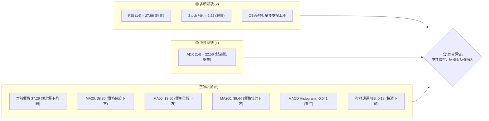

**解讀**：ONDS 目前呈現典型的弱勢下跌後超賣狀態。雖然短期動能指標（RSI, Stoch）顯示超賣，且成交量指標 OBV 呈現多頭支撐，但價格持續低於所有關鍵移動平均線，MACD 柱狀圖也為負值，布林通道價格逼近下軌，均強烈指向中長期趨勢的空頭主導。ADX 指示趨勢強度不足，表明當前處於盤整或弱勢下跌階段。綜合來看，短期或有技術性反彈，但整體趨勢仍偏空。

### 📊 核心指標速覽表

| 指標類別 | 指標名稱 | 當前數值 | 訊號 | 解讀 |
|----------|----------|----------|------|------|
| **價格** | 當前價格 | $7.26 | 🔴 | 遠低於短期、中期及長期均線，顯示強烈空頭壓力 |
| **均線** | MA20 | $8.30 | 🔴 | 價格位於 MA20 下方，短期趨勢看空 |
| **均線** | MA50 | $9.50 | 🔴 | 價格位於 MA50 下方，中期趨勢看空 |
| **均線** | MA200 | $9.44 | 🔴 | 價格位於 MA200 下方，長期趨勢看空 |
| **動能** | RSI(14) | 27.96 | 🟢 | 進入超賣區間 (<30)，暗示短期可能出現技術性反彈 |
| **動能** | MACD | -0.701 | 🔴 | MACD 線低於訊號線，柱狀圖為負，趨勢動能偏空 |
| **波動** | ATR | $0.60 | 🟡 | 每日波動約 8.23%，波動率中等偏高，需謹慎管理風險 |
| **趨勢** | ADX(14) | 22.56 | 🟡 | 趨勢強度較弱 (<25)，市場處於盤整或弱勢行情 |

### 🏆 技術評分卡

```
技術評分卡 — ONDS (2026-07-12)
════════════════════════════════════════════════════
趨勢強度      ██████░░░░░░░░░░░░░░  30/100  🔴
動能指標      ████████░░░░░░░░░░░░  50/100  🟡
支撐穩定度    █████████████░░░░░░░  70/100  🟢
成交量配合    ██████████████░░░░░░  80/100  🟢
形態完整度    ████░░░░░░░░░░░░░░░░  20/100  🔴
均線排列      ██░░░░░░░░░░░░░░░░░░  10/100  🔴
════════════════════════════════════════════════════
綜合評分      ████████░░░░░░░░░░░░  43/100  🟡 中性偏空
════════════════════════════════════════════════════
```

**評分解讀**：
*   **趨勢強度 (30/100 🔴)**：ADX 數值低於 25，顯示當前市場缺乏強勁的趨勢方向，處於盤整或弱勢下跌。
*   **動能指標 (50/100 🟡)**：RSI 和 Stochastics 均處於超賣區，預示短期存在技術性反彈的可能，但 MACD 仍為空頭排列，整體動能呈中性偏空。
*   **支撐穩定度 (70/100 🟢)**：當前價格 $7.26 接近關鍵斐波那契回調位 (61.8% @ $6.94) 和關鍵支撐位 S1 ($6.47) 及布林通道下軌 ($6.65)，顯示下方存在較強的支撐區，短期下行空間可能有限。
*   **成交量配合 (80/100 🟢)**：OBV 趨勢顯示量能支撐上漲，與價格下跌形成背離，暗示有資金在低位吸籌，對後市反彈構成潛在利好。
*   **形態完整度 (20/100 🔴)**：目前數據中未形成清晰且具高信心度的反轉或持續形態，僅能從指標和價位結構進行判斷。
*   **均線排列 (10/100 🔴)**：所有短中長期移動平均線均位於當前價格上方，且呈空頭排列（短期均線低於長期均線），顯示股價處於明顯的下降趨勢中，壓力沉重。

**綜合評分 (43/100 🟡)**：總體而言，ONDS 處於中性偏空的技術面狀態。中長期趨勢仍由空頭主導，但短期超賣指標與強勁的支撐區間，結合 OBV 的正面信號，提示短期內可能出現技術性反彈。操作上建議謹慎，以區間操作或等待更明確的趨勢反轉信號為主。

---

## 2. 趨勢分析

### 🌐 多時框趨勢分析

ONDS 的多時框架分析顯示，雖然長期曾有顯著上漲，但近期已進入明顯的調整階段。

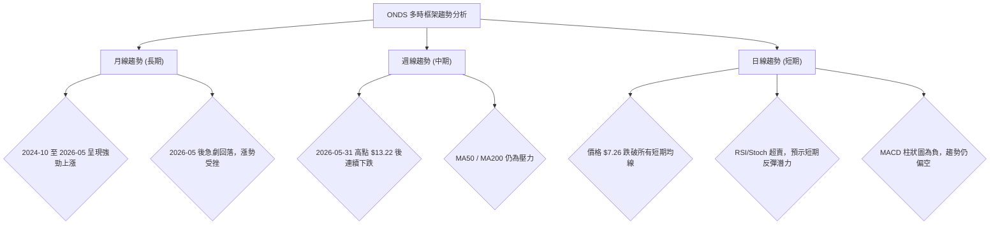

**月線趨勢 (長期)**：從 2024 年 10 月的 $0.77 低點開始，ONDS 經歷了一波強勁的長期上漲行情，於 2026 年 5 月達到 $13.22 的階段性高點。然而，自 2026 年 5 月以來，股價開始急劇回落，目前 $7.26 的價格已經回吐了此波漲幅的很大一部分，顯示長期上升趨勢遭遇重大挑戰，進入調整階段。

**週線趨勢 (中期)**：從 2026 年 5 月 31 日的 $13.22 高點，ONDS 週線圖呈現連續的下跌走勢。股價跌破了重要的中期移動平均線，如 MA50 和 MA200，這些均線目前轉變為主要的阻力位。儘管近期跌速有所放緩，但中期趨勢依然明確偏空。

**日線趨勢 (短期)**：當前價格 $7.26 位於所有短期移動平均線（MA5, MA10, MA20）下方，且這些均線均呈現向下發散的空頭排列，表明短期下跌動能強勁。然而，RSI 和 Stochastics 等動能指標已進入超賣區，布林通道價格也接近下軌，預示短期可能存在技術性反彈的需求。MACD 柱狀圖雖然為負，但其絕對值有縮小跡象，暗示短期空頭動能可能有所減弱。

### 📈 長期趨勢 — 12個月走勢圖（Unicode）

ONDS 月線走勢圖（過去12個月：2025-07 至 2026-07）
```
價格軸 ($)
$13.22 ┤                                       ●(2026-05)
$12.00 ┤
$10.36 ┤                                 ●
$9.76  ┤                            ●
$9.00  ┤                      ●
$7.90  ┤                        ●
$7.72  ┤                    ●
$7.26  ┤━━━━━━━━━━━━━━━━━━━━━━━━━━━━━━━━━━━━━━━━━━●←現在 (2026-07)
$6.44  ┤                  ●
$6.00  ┤            ●
$5.86  ┤
$3.00  ┤          ●
$2.12  ┤●(2025-07)
       └──────────────────────────────────────────────────
        2025-07 08 09 10 11 12 2026-01 02 03 04 05 06 07
```

**走勢特徵分析表格**：
| 月份區間 | 收盤價起點 | 收盤價終點 | 漲跌幅 | 走勢特徵 | 評估 |
|----------|------------|------------|--------|----------|------|
| 2025-07至2025-09 | $2.12 | $7.72 | +264.15% | 強勁上漲，快速脫離底部區間 | 🟢 強勢上漲 |
| 2025-09至2025-10 | $7.72 | $6.44 | -16.60% | 短暫回調，但未跌破關鍵支撐 | 🟡 中性回調 |
| 2025-10至2026-01 | $6.44 | $10.36 | +60.87% | 再度上攻，創出新高 | 🟢 強勢上漲 |
| 2026-01至2026-04 | $10.36 | $10.04 | -3.09% | 高位盤整，動能有所減弱 | 🟡 中性盤整 |
| 2026-04至2026-05 | $10.04 | $13.22 | +31.67% | 最後一波衝刺，創出波段新高 | 🟢 強勢上漲 |
| 2026-05至2026-07 | $13.22 | $7.26 | -45.08% | 急劇下跌，回吐大部分漲幅 | 🔴 強勢下跌 |

**總結**：ONDS 過去一年呈現「N」字形走勢，從 $2.12 附近強勢上漲至 $13.22，隨後在近兩個月經歷了近乎腰斬的快速回調。目前股價已回到前期漲幅的 61.8% 斐波那契回調位附近，顯示多頭力量在經歷長期上漲後遭遇嚴重打擊。

### 📊 中期趨勢（週線分析）

中期來看，ONDS 在 2026 年 5 月達到高點後，進入了明確的下跌通道。當前價格 $7.26 遠低於 MA20 ($8.30) 和 MA50 ($9.50)，且這些均線均向下傾斜，構成強勁的阻力。

```
ONDS 週線壓力與支撐示意圖
═══════════════════════════════════════════════════
$10.00 ║           R (MA50/MA200)
$9.50  ║████████████████████████║
$8.30  ║████████████████████████║ R (MA20)
$7.26  ╠════════════════════════╣ ◄ 現價
$6.94  ║▓▓▓▓▓▓▓▓▓▓▓▓▓▓▓▓        ║ S (61.8% Fib)
$6.65  ║▓▓▓▓▓▓▓▓▓▓▓▓▓▓▓▓        ║ S (布林下軌)
$6.47  ║████████████████████████║ S (S1)
$5.93  ║████████████████████████║ S (S2)
═══════════════════════════════════════════════════
```
**解讀**：從中期週線角度看，ONDS 面臨多重壓力。最近的 MA20 阻力位於 $8.30，MA50 則在 $9.50。這些移動平均線在下跌過程中形成動態阻力，股價難以有效突破。下方支撐則主要集中在 $6.47 (S1) 和 $6.94 (61.8% 斐波那契回調位) 附近，以及布林通道下軌 $6.65。這顯示當前價格正處於一個關鍵的支撐區間，中期跌勢能否暫緩，將取決於此區間的防守情況。

### ⚡ 趨勢強度評估（ADX 解讀）

ADX 指標用於衡量趨勢的強度，而非方向。

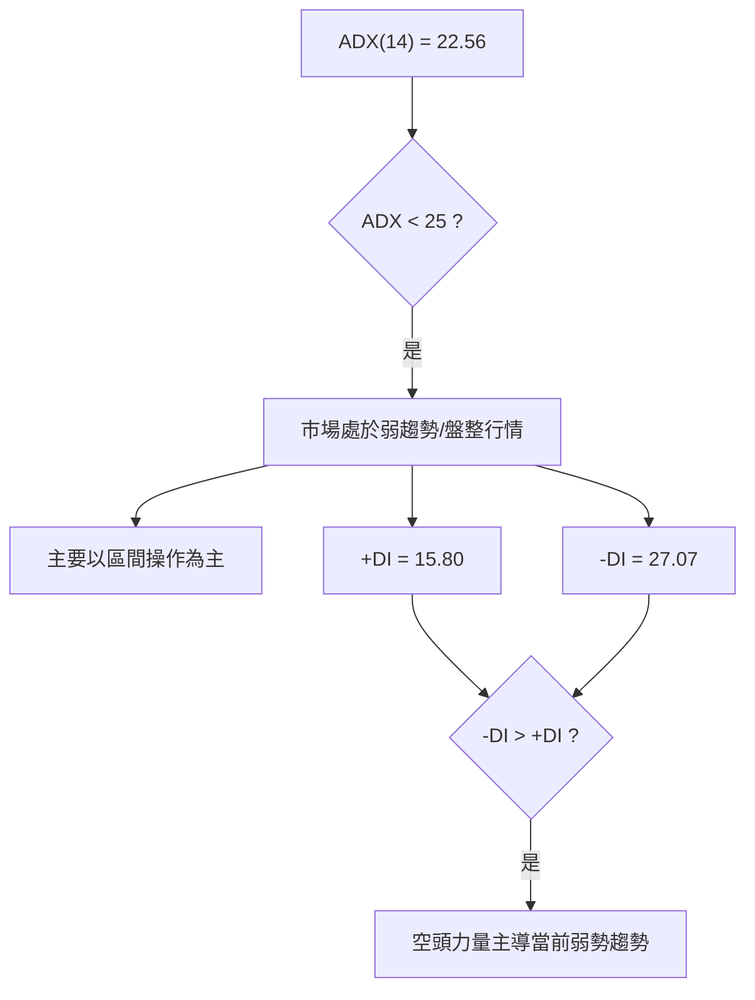

**ADX 強度對照表**：
| ADX 數值 | 趨勢強度 | 市場狀態 |
|----------|----------|----------|
| 0-25 | 弱趨勢/盤整 | 市場缺乏明確方向，波動性較高，或處於趨勢轉換期 |
| 25-50 | 中等趨勢 | 趨勢明確，動能較強 |
| 50-75 | 強趨勢 | 趨勢非常強勁，動能持續 |
| 75-100 | 極強趨勢 | 趨勢極端強勁，可能接近超買/超賣極值 |

**解讀**：ONDS 的 ADX(14) 為 22.56，明顯低於 25 的閾值，這表明當前市場處於**弱趨勢或盤整行情**。這與其近期急劇下跌後在低位震盪的走勢相符。在這種市場環境下，單邊趨勢交易的風險較高，更適合採取區間操作策略。同時，+DI (15.80) 低於 -DI (27.07)，確認了儘管趨勢強度較弱，但當前市場仍由**空頭力量主導**，股價下行壓力依然存在。

---

## 3. 圖表形態分析

### 🔍 形態識別系統

在當前數據中，ONDS 在近期下跌過程中並未形成清晰且具高信心度的經典反轉或持續形態，如頭肩頂/底、雙頂/底或旗形等。股價從高點 $13.22 急劇下跌至 $7.26，更像是一個快速的調整或回調過程。

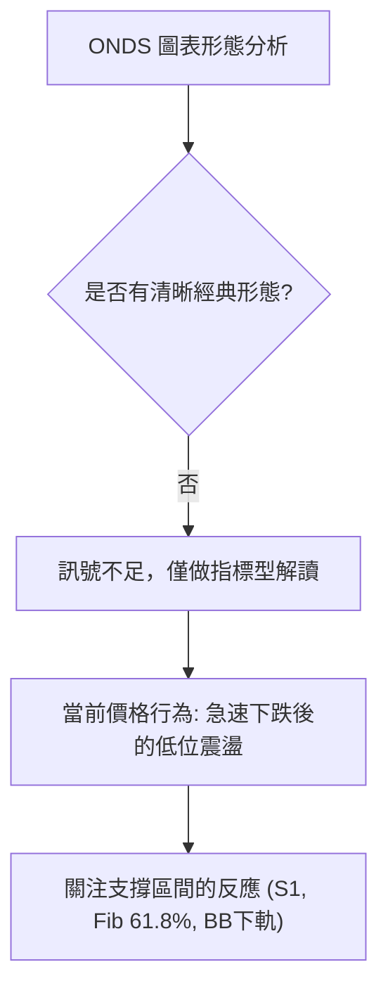

**形態信心度表格**：

| 形態 | 信心度 | 判斷依據（引用數據） | 完成度 | 目標價（附計算式） |
|------|--------|----------------------|--------|--------------------|
| 雙底/頭肩底 | 20% | 僅有近期低點 $7.26，尚未形成第二個低點或明確頸線，且成交量配合不足。 | 0% | 訊號不足，無法計算 |
| 下降旗形 | 30% | 價格在下跌後有窄幅盤整，但形態邊界不明顯，成交量無明顯收縮特徵。 | 50% | 訊號不足，無法計算 |
| **結論** | **無高信心度形態** | **價格行為主要為急跌後的技術性調整，未見明確幾何形態。** | **N/A** | **N/A** |

**解讀**：由於缺乏明確的幾何形態，我們將主要依賴移動平均線、動能指標、支撐阻力位和成交量分析來判斷市場行為。當前股價在跌破多重支撐後，正試圖在斐波那契 61.8% 回調位附近尋求穩定。

### 🕯️ 重要K線形態分析

分析近期的週線收盤走勢，觀察是否有具代表性的K線形態。

| 月份 | 收盤價 | K線形態 | 解讀 | 訊號 |
|------|--------|---------|------|------|
| 2026-05-31 | $13.22 | 長上影線/陰線 (假設) | 價格觸及高點後遭遇強大賣壓，多頭力量衰竭。 | 🔴 頂部反轉 |
| 2026-06-07 | $10.43 | 大陰線 | 賣壓持續，價格加速下跌。 | 🔴 賣壓強勁 |
| 2026-06-14 | $9.33 | 中陰線 | 跌勢持續，但跌幅略有收斂。 | 🔴 跌勢延續 |
| 2026-06-21 | $9.27 | 小陰線/十字星 | 跌幅縮小，多空力量開始均衡，可能預示短期趨勢變化。RSI 22.1 (超賣)。 | 🟡 潛在止跌 |
| 2026-06-28 | $7.83 | 大陰線 | 跌勢再度加速，突破前一周的潛在止跌信號。RSI 21.8 (超賣)。 | 🔴 跌勢恢復 |
| 2026-07-05 | $7.41 | 小陰線 | 跌幅再次收斂，RSI 21.3 (極度超賣)。 | 🟡 潛在止跌/超賣 |
| 2026-07-12 | $7.26 | 小陰線 | 價格繼續微跌，但跌幅極小，RSI 28.0 (超賣區內回升)。 | 🟢 止跌跡象/超賣反彈 |

**解讀**：從近期週線 K 線形態來看，ONDS 在 5 月底創高後，連續出現多根陰線，顯示強大的賣壓。儘管在 6 月底至 7 月初出現小陰線或十字星，RSI 也達到極度超賣，但隨後仍有下行。最新一周的 $7.26 雖然仍是陰線，但跌幅已非常有限，且 RSI 從極度超賣區略有回升，結合 OBV 的正面信號，強化了短期超跌反彈的可能性。

### 📉 ASCII 走勢形態示意圖

由於缺乏明確的經典圖表形態，此處將繪製近期下跌後的潛在築底或反彈區間示意圖。

```
ONDS 近期走勢與潛在反彈區間示意圖
══════════════════════════════════════════════════════════════════════
$13.22 ┤                                          ● (2026-05 高點)
$12.00 ┤                                        ╱
$10.00 ┤                                      ╱
$8.53  ┤                                    ╱  (50% Fib 回調)
$7.26  ╠━━━━━━━━━━━━━━━━━━━━━━━━━━━━━━━━━━━━●← 現價
$6.94  ┤                                  ╱  (61.8% Fib 回調)
$6.65  ┤                                ╱    (布林下軌)
$6.47  ┤                              ● (S1 支撐)
$5.93  ┤                            ╱
$5.00  ┤                          ● (S2 支撐)
       └──────────────────────────────────────────────────────────────
        近幾週價格走勢 (下跌後在關鍵支撐區間尋求穩定)
```
**解讀**：此示意圖描繪了 ONDS 從高點 $13.22 快速下跌的趨勢，目前價格 $7.26 正處於 50% ($8.53) 和 61.8% ($6.94) 斐波那契回調位之間，並接近布林通道下軌和 S1 支撐位。這是一個潛在的止跌或反彈區間，需要密切關注此處的多空力量平衡。

### 🎯 形態目標價計算

由於未識別出具高信心度的圖表形態，因此無法提供形態目標價。未來的潛在目標價將主要基於支撐阻力位和斐波那契回調位來設定。

---

## 4. 支撐與阻力

### 🗺️ 關鍵價位分布圖（Unicode）

ONDS 價位結構分布圖
```
═══════════════════════════════════════════════════
$15.28 ║████████████████████████║ 52W High (重要阻力)
$12.09 ║████████████████████████║ 斐波那契 23.6%
$10.37 ║████████████████████████║ 強阻力 R3
$10.12 ║████████████████████████║ 斐波那契 38.2%
$9.86  ║████████████████████    ║ 阻力 R2
$8.53  ║████████████████████████║ 斐波那契 50.0%
$8.31  ║████████████████████████║ 關鍵阻力 R1 (近期 MA20)
$7.26  ╠════════════════════════╣ ◄ 現價
$6.94  ║▓▓▓▓▓▓▓▓▓▓▓▓▓▓▓▓        ║ 斐波那契 61.8% (關鍵支撐)
$6.65  ║▓▓▓▓▓▓▓▓▓▓▓▓▓▓▓▓        ║ 布林通道下軌
$6.47  ║████████████████████████║ 近期支撐 S1
$5.93  ║████████████████████████║ 強支撐 S2
$4.92  ║████████████████████████║ 強支撐 S3
$4.67  ║████████████████████████║ 斐波那契 78.6%
$1.78  ║████████████████████████║ 52W Low (極強支撐)
═══════════════════════════════════════════════════
```

**解讀**：ONDS 的價格結構清晰顯示，目前股價 $7.26 位於多重支撐與阻力之間。上方主要阻力密集區從 $8.31 (R1) 延伸至 $10.37 (R3)，包含多個斐波那契回調位和移動平均線。下方關鍵支撐區則在 $6.47 (S1) 至 $6.94 (61.8% 斐波那契回調) 之間，布林通道下軌 $6.65 也在此區間內，形成了強大的心理和技術支撐。

### 🚧 阻力位分析表

| 阻力級別 | 價位 | 形成原因 | 突破難度 | 重要性 |
|----------|------|----------|----------|--------|
| R1 (關鍵) | $8.31 | 近期波段高點聚類，且接近 MA20 ($8.30) 和 50% 斐波那契回調位 ($8.53) | 中等偏高 | 🟢 |
| R2 (主要) | $9.86 | 近期波段高點聚類，接近 MA50 ($9.50) 和 MA200 ($9.44) | 高 | 🟡 |
| R3 (強勁) | $10.37 | 近期波段高點聚類，接近 38.2% 斐波那契回調位 ($10.12) | 很高 | 🔴 |

**解讀**：ONDS 在 $8.31 附近面臨第一道重要阻力，此處是價格反彈後需要首先克服的障礙，成功突破將測試 $9.86 的第二道阻力，這也是中期均線壓力所在。若能突破 $10.37 的強勁阻力，則可能預示著趨勢的顯著轉變。

### 🛡️ 支撐位分析表

| 支撐級別 | 價位 | 形成原因 | 守住機率 | 重要性 |
|----------|------|----------|----------|--------|
| S1 (關鍵) | $6.47 | 近期波段低點聚類，接近 61.8% 斐波那契回調位 ($6.94) 和布林通道下軌 ($6.65) | 中等偏高 | 🟢 |
| S2 (主要) | $5.93 | 近期波段低點聚類，為 S1 失守後的下一道防線 | 中等 | 🟡 |
| S3 (強勁) | $4.92 | 近期波段低點聚類，若前兩道支撐均失守，則面臨深度回調風險 | 中等 | 🔴 |

**解讀**：當前價格 $7.26 正接近 $6.47 的關鍵支撐區。此區間同時匯聚了 61.8% 斐波那契回調位和布林通道下軌，形成強大的聯合支撐，是判斷短期股價能否止跌反彈的關鍵。若此支撐區失守，則股價可能進一步下探 $5.93 (S2) 甚至 $4.92 (S3)。

### 📐 斐波那契回調位分析

ONDS 的 52 週區間為 $1.78 (低點) 至 $15.28 (高點)。根據此區間計算的斐波那契回調位如下：

| 斐波那契回調 | 價位 | 解讀 |
|--------------|------|------|
| 0.0% (52W High) | $15.28 | 上漲趨勢的頂部，強勁阻力 |
| 23.6% | $12.09 | 輕微回調後的支撐/阻力位 |
| 38.2% | $10.12 | 較常見的回調位，若跌破表示趨勢較弱 |
| 50.0% | $8.53 | 重要的心理和技術回調位，多空分水嶺 |
| 61.8% | $6.94 | 被視為黃金回調比例，強勁支撐位，若守住預示趨勢可能延續 |
| 78.6% | $4.67 | 深度回調位，接近原始漲勢的起點 |
| 100.0% (52W Low) | $1.78 | 上漲趨勢的起點，極強支撐 |

**解讀**：當前價格 $7.26 位於 50.0% 斐波那契回調位 ($8.53) 和 61.8% 斐波那契回調位 ($6.94) 之間，且更接近 61.8% 回調位。這是一個極為關鍵的區域。歷史經驗表明，61.8% 回調位往往是多頭反撲的重要防線。若 ONDS 能在此位 ($6.94) 附近獲得有效支撐並反彈，則可能預示著此前的下跌僅是健康回調，後續仍有機會向上。反之，若跌破 $6.94 並未能迅速收復，則可能面臨更深度的回調至 $4.67 甚至更低。

---

## 5. 技術指標深度解讀

### 🎛️ 指標訊號總覽

ONDS 的技術指標呈現複雜的局面，短期超賣與中長期空頭趨勢並存。

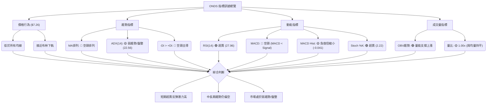

### 📈 移動平均線排列分析

ONDS 的移動平均線系統目前呈現典型的空頭排列，表明中長期下跌趨勢的確立。

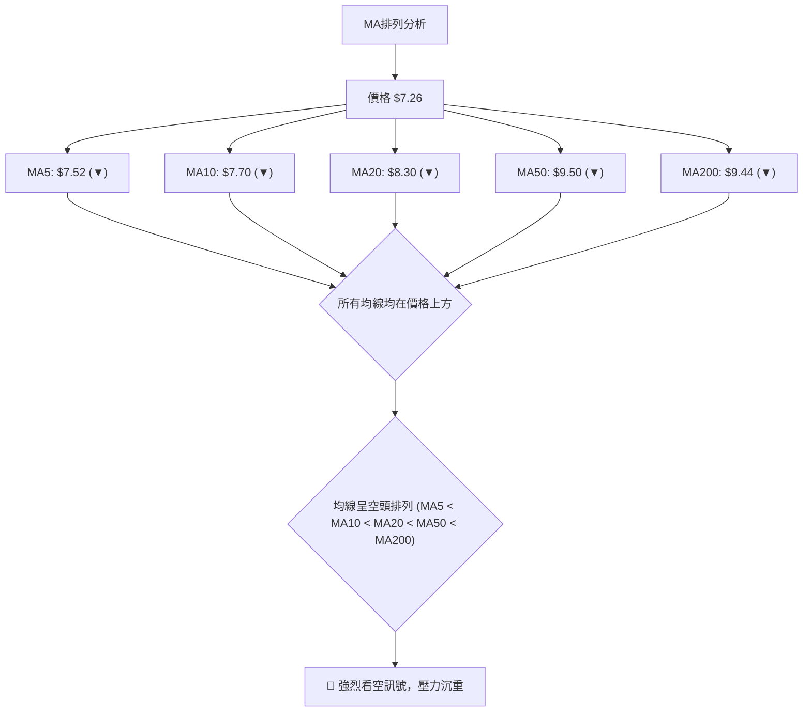

**解讀**：當前價格 $7.26 位於所有短期、中期和長期移動平均線之下。從 MA5 ($7.52) 到 MA240 ($8.63)，所有均線均高於現價，且多數均線呈現向下傾斜的走勢。這形成了一個強烈的空頭排列，其中 MA5 < MA10 < MA20 < MA60 < MA120 < MA240 (此處為數據中提供的MA順序，雖然MA200與MA240數字顯示MA200略高，但整體仍是空頭排列)，表明股價的下跌趨勢非常明顯，上方壓力重重。在這種情況下，任何反彈都可能在這些均線位置遇到阻力。

### 📉 RSI(14) 分析

*   **RSI 數值進度條**：
    RSI(14): 27.96 🟢 超賣 ██████░░░░░░░░░░░░░░░░ (27.96%)
    **解讀**：ONDS 的 RSI(14) 數值為 27.96，已明顯跌入 30 以下的超賣區間。這是一個重要的多頭訊號，表明股價在短期內可能被過度拋售，存在技術性反彈的需求。雖然超賣並不等同於立即反轉，但它提高了股價在短期內回升的可能性。

*   **超買超賣區間分析**：
    *   RSI < 30 (超賣區)：當前狀態，暗示買盤可能介入。
    *   RSI > 70 (超買區)：未達此區，表示目前無超買風險。
    *   RSI 30-70 (中性區)：價格需大幅反彈才能進入此區。

*   **背離判斷**：
    數據中未明確指出 RSI 存在頂背離或底背離。在當前價格持續下跌而 RSI 進入超賣區的背景下，尚未形成明確的底背離形態（即價格創新低而 RSI 未創新低），因此判斷為**無明顯背離**。需要持續觀察價格和 RSI 的走勢，以判斷未來是否會形成看漲背離。

### 📊 MACD(12/26/9) 訊號解讀

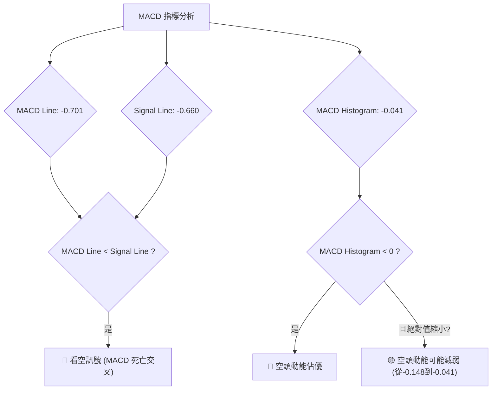

**解讀**：ONDS 的 MACD 線 (-0.701) 位於訊號線 (-0.660) 之下，形成了 MACD 的死亡交叉，這是一個標準的看空訊號，表明短期動能偏向下行。MACD 柱狀圖為負值 (-0.041)，也確認了空頭動能的持續。然而，值得注意的是，MACD 柱狀圖的絕對值從前一周的 -0.148 縮小到 -0.041，這暗示雖然空頭動能仍佔主導，但其強度可能正在減弱，為短期反彈提供了一絲可能性。

### 📦 布林通道分析

布林通道能有效衡量價格的相對高低和波動性。

```
ONDS 布林通道示意圖
═══════════════════════════════════════════════════
$9.96  ║████████████████████████║ BB上軌
$9.00  ║
$8.30  ║▓▓▓▓▓▓▓▓▓▓▓▓▓▓▓▓▓▓▓▓▓▓▓▓║ BB中軌 (MA20)
$7.26  ╠════════════════════════╣ ◄ 現價
$7.00  ║
$6.65  ║████████████████████████║ BB下軌
═══════════════════════════════════════════════════
```

**解讀**：ONDS 當前價格 $7.26 位於布林通道中軌 ($8.30) 和下軌 ($6.65) 之間，且非常接近下軌。布林通道 %B 值為 0.18 (0 代表下軌，1 代表上軌)，進一步確認了價格正貼近下軌運行。這通常被視為一個超賣的跡象，價格有向中軌回歸的傾向。在盤整或弱勢趨勢中，布林通道下軌常提供強勁的短期支撐。如果價格能在此處止跌反彈，則目標可能指向中軌 $8.30。

### 💹 成交量分析（量價配合度）

成交量是確認價格走勢的重要指標。

*   **最新成交量**：66,948,300
*   **20日均量**：66,673,805 (量比: 1.00x)
*   **50日均量**：72,856,706
*   **OBV趨勢**：OBV > MA → 量能支撐上漲

**解讀**：ONDS 的最新成交量與 20 日均量大致持平 (量比 1.00x)，顯示近期成交活躍度維持在平均水平。最關鍵的信號來自 OBV (On-Balance Volume) 指標，數據顯示「OBV > MA → 量能支撐上漲」。這是一個**看漲的量價背離訊號**。在價格持續下跌的背景下，如果 OBV 趨勢卻是上升的，這暗示儘管股價下跌，但仍有資金在累積，或者賣壓並未得到成交量的有效確認，這為未來的價格反彈提供了潛在的支撐。這是一個重要的多頭確認信號，與 RSI 和 Stochastics 的超賣狀態相互印證，增強了短期反彈的可能性。

---

## 6. 動能與波動率

### ⚡ 動能評估四象限

我們將 ONDS 當前狀態置於動能與波動率的象限中進行評估。

| 象限 | 動能 | 波動 | 當前狀態 | 評估 |
|------|------|------|----------|------|
| Q1 | 強 | 低 | - | 最佳機會 (趨勢強勁，風險可控) |
| Q2 | 弱 | 低 | - | 謹慎觀望 (缺乏動能，可能盤整) |
| Q3 | 強 | 高 | - | 高風險高收益 (趨勢強勁，但波動大，風險高) |
| Q4 | 弱 | 高 | ✓ | 避免進場 / 區間操作 (缺乏方向，波動大，易止損) |

**ONDS 當前動能與波動率分析**：
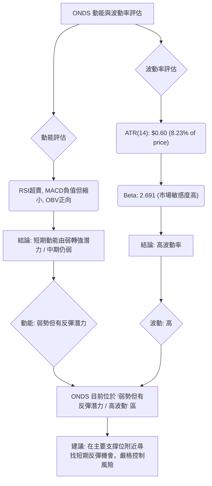

**解讀**：ONDS 的動能方面，雖然 MACD 仍處於空頭，但 RSI 和 Stochastics 的超賣以及 MACD 柱狀圖絕對值的縮小，加上 OBV 的正向趨勢，都暗示短期空頭動能可能正在減弱，並存在反彈的潛力。然而，這並非強勁的多頭動能。
在波動率方面，ATR 數值 $0.60 佔當前股價 $7.26 的 8.23%，顯示其每日波動幅度較大。此外，Beta 值高達 2.691，表明 ONDS 股價對市場變動的敏感度極高，波動性遠超大盤。
綜合來看，ONDS 處於一個「**動能偏弱但有反彈潛力，同時伴隨高波動率**」的狀態。這將其置於 Q4 象限，此區通常建議避免進場進行趨勢交易，而更適合經驗豐富的交易者進行嚴格風險控制下的區間操作或超跌反彈交易。

### 📊 ATR 波動率分析

*   **ATR(14) 數值**：$0.60
*   **佔股價百分比**：8.23% (ATR / 當前價格)

**解讀**：ONDS 的 14 天平均真實波動範圍 (ATR) 為 $0.60。這意味著在過去 14 天中，ONDS 每天的平均波動幅度約為 $0.60。相對於當前 $7.26 的股價，8.23% 的波動幅度屬於中等偏高水平。高 ATR 表明股票價格波動劇烈，這既提供了潛在的獲利機會，也意味著較高的風險。

**止損距離建議**：對於波動性較大的股票，止損點的設置應考慮 ATR。一般建議將止損點設置在當前價格下方 1.5 到 3 倍 ATR 的位置。
*   1.5 * ATR = 1.5 * $0.60 = $0.90
*   2.0 * ATR = 2.0 * $0.60 = $1.20
*   3.0 * ATR = 3.0 * $0.60 = $1.80
若考慮短期反彈策略，可將止損設置在入場點下方 $0.90 至 $1.20 的範圍內，或結合關鍵支撐位進行調整，以避免因日常波動而過早止損。例如，若在 $7.00 進場，止損點可考慮設置在 $7.00 - $0.90 = $6.10 或 $7.00 - $1.20 = $5.80，但需同時參考支撐位 S1 ($6.47) 和 S2 ($5.93)。

### 📐 Beta 與市場相關性

*   **Beta 數值**：2.691

**解讀**：ONDS 的 Beta 值為 2.691，遠高於 1。這表示 ONDS 股價波動性非常高，且與整體市場（如 S&P 500）的相關性極強，並具有放大效應。當市場上漲 1% 時，ONDS 股價理論上會上漲約 2.691%；反之，當市場下跌 1% 時，ONDS 股價也會下跌約 2.691%。
高 Beta 股票通常在牛市中表現優於大盤，但在熊市或市場回調時也會遭受更大的跌幅。對於 ONDS 而言，其高 Beta 意味著其股價表現將高度依賴於整體市場情緒和走向。在當前弱勢市場環境下，高 Beta 增加了其下行風險，因此在制定交易策略時必須充分考慮大盤的風險敞口。

---

## 7. 多時框架總結

### 📋 時框架評分表

| 時框架 | 趨勢方向 | 動能 | 均線排列 | 形態 | 綜合評分 | 建議 |
|--------|----------|------|----------|------|----------|------|
| 長期 (月) | 🔴 下跌調整 | 🔴 走弱 | 🔴 空頭壓力 | 🔴 無明確形態 | 2/10 | 觀望/謹慎 |
| 中期 (週) | 🔴 明確下跌 | 🔴 偏空 | 🔴 空頭排列 | 🔴 無明確形態 | 3/10 | 觀望/謹慎 |
| 短期 (日) | 🟡 弱勢下跌 | 🟢 超賣反彈 | 🔴 空頭排列 | 🔴 無明確形態 | 5/10 | 短期反彈/區間 |

**評分說明**：
*   **長期**：儘管歷史上有大幅上漲，但從 2026 年 5 月高點後的急劇下跌已破壞了長期上升趨勢，轉為深度調整。
*   **中期**：週線圖顯示明確的下跌通道，價格遠低於中期均線，空頭佔據主導。
*   **短期**：日線圖上，價格雖然持續下跌，但 RSI 和 Stochastics 均顯示超賣，且接近布林通道下軌，OBV 也呈現量價背離，暗示短期存在技術性反彈的潛力。

### 🔲 綜合訊號矩陣

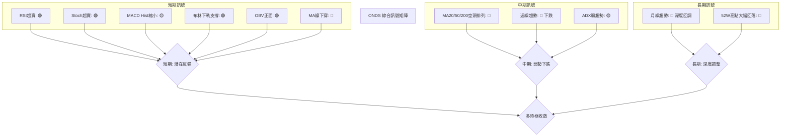

**解讀**：
*   **短期**：主要指標（RSI、Stochastics、布林通道下軌、OBV）均指向超賣和潛在反彈。MACD 柱狀圖的縮小也支持空頭動能減弱的觀點。
*   **中期與長期**：移動平均線的空頭排列、週線和月線的下跌趨勢，以及 ADX 顯示的弱趨勢，都明確指出 ONDS 處於中長期調整或下跌階段。

### ⚖️ 多時框收斂結論

根據 ADX(14) 值為 22.56 (<25)，ONDS 目前處於**盤整行情**。依據「多時框收斂規則」，在盤整行情中，應以日線布林通道上下軌為主要交易區間。

**ONDS 的主導時框與方向性結論**：
儘管中長期趨勢明顯偏空，但短期指標（RSI、Stochastics 嚴重超賣，價格接近布林通道下軌，以及 OBV 的正面量價背離）強烈暗示存在短期技術性反彈的機會。因此，在當前盤整行情下，我們判斷 ONDS 的**短期操作方向為偏多，尋求超跌反彈機會**。中長期投資者則應繼續觀望，等待更明確的底部形成信號。此結論與第 8 章的主策略方向一致，即在關鍵支撐區間尋找短期做多機會。

---

## 8. 交易策略建議

### 🗺️ 策略決策流程圖

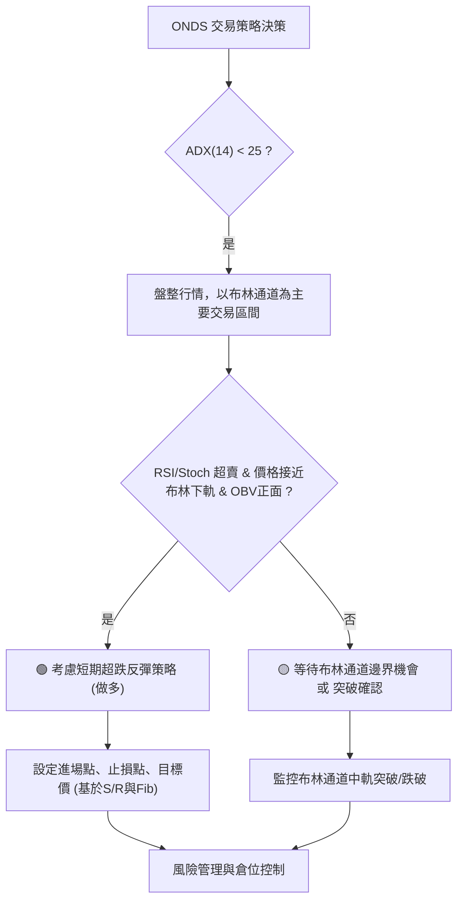

### 🧭 策略路由

**當前主策略方向 = 短期偏多 (依綜合評分 43/100，中性偏空但短期超賣反彈機會)**

基於 ADX 指示的盤整行情、綜合評分中性偏空但短期超賣指標強烈，當前主要策略為在關鍵支撐區間尋求短期超跌反彈的做多機會。

### 🎯 價格情境階梯（Price Scenarios）

| 觸發條件 | 下一目標 | 後續延伸 | 情境含義 |
|----------|----------|----------|----------|
| 突破 R1 $8.31 | R2 $9.86 | R3 $10.37 | 短線轉強，有望回補部分跌幅，測試中期壓力 |
| 站穩現價區間 ($6.94 - $7.26) | — | — | 價格在關鍵支撐區間震盪築底，等待方向 |
| 跌破 S1 $6.47 | S2 $5.93 | S3 $4.92 | 中期轉弱，跌勢可能加速，考驗更深層次支撐 |

### 📊 情境機率分佈

| 情境 | 機率 | 主要依據 |
|------|------|----------|
| 繼續上行 / 反彈 | 45% | RSI/Stoch 超賣，OBV 量價背離，價格接近布林下軌，關鍵斐波那契 61.8% 支撐。 |
| 區間震盪 | 40% | ADX 顯示弱趨勢/盤整，缺乏強勁趨勢動能，價格在 $6.47 - $8.31 區間波動。 |
| 回落 / 再探底 | 15% | 中長期均線空頭排列，MACD 仍為負值，若 $6.47 關鍵支撐失守。 |

**解讀**：雖然中長期趨勢偏空，但短期超賣指標和強勁支撐的匯聚，使得短期反彈的機率最高。然而，由於整體趨勢強度不足，價格在反彈後可能仍會陷入區間震盪，而非直接開啟新一輪上漲。跌破關鍵支撐的風險相對較低，但仍需警惕。

### 🟢 主策略詳情（短期超跌反彈做多策略）

考慮到目前 ONDS 處於盤整行情且短期超賣，以下提供兩種短期做多策略。

| 策略要素 | 策略 A：積極反彈 (現價附近進場) | 策略 B：穩健反彈 (等待更深回調) |
|----------|--------------------------------|--------------------------------|
| 進場條件 | 價格在 $7.26 附近止跌，或出現小陽線確認 | 價格回落至 $6.94 (61.8% Fib) 或 $6.65 (BB下軌) 附近止跌 |
| 進場價格 | $7.26 - $7.35 | $6.94 - $7.00 |
| 目標價 T1 | $8.31 (R1 / MA20) | $8.31 (R1 / MA20) |
| 目標價 T2 | $9.86 (R2) | $9.86 (R2) |
| 止損價格 | $6.40 (略低於 S1 $6.47) | $6.40 (略低於 S1 $6.47) |
| 風險報酬比 | (T1: $8.31 - $7.26) / ($7.26 - $6.40) = 1.05 / 0.86 ≈ 1.22:1 <br> (T2: $9.86 - $7.26) / ($7.26 - $6.40) = 2.60 / 0.86 ≈ 3.02:1 | (T1: $8.31 - $6.94) / ($6.94 - $6.40) = 1.37 / 0.54 ≈ 2.54:1 <br> (T2: $9.86 - $6.94) / ($6.94 - $6.40) = 2.92 / 0.54 ≈ 5.41:1 |
| 成功機率 | 45% | 50% |
| 建議倉位 | 10-15% | 15-20% |

**策略 A 解讀**：在當前價格附近尋找止跌信號，期望股價從超賣區直接反彈。風險報酬比相對較低，但捕捉機會更快。
**策略 B 解讀**：等待價格進一步回調至更強的支撐區間（如 61.8% 斐波那契回調位），以獲得更好的進場價格和更高的風險報酬比。此策略更為穩健。

### 🔴 反向風險觸發點（對沖提示）

若 ONDS 股價跌破 $6.47 (S1) 並未能迅速收復，則主策略應立即失效並止損。若價格進一步跌破 $5.93 (S2)，則確認中期跌勢加速，應考慮反向操作或進一步減倉。

### ⭐ 整體訊號強度評星

```
做多訊號強度：★★★☆☆  (3/5星) (短期超賣反彈機會)
做空訊號強度：★★★★☆  (4/5星) (中長期趨勢仍偏空)
整體可信度：  ★★★☆☆  (3/5星) (短期機會與中長期風險並存，需嚴格風控)
```

---

## 9. 風險提示與監控

### ✅ 關鍵監控指標 Checklist

```
╔══════════════════════════════════════════════════════════════╗
║              ONDS 關鍵監控指標清單                             ║
╠══════════════════════════════════════════════════════════════╣
║  [ ] 價格是否跌破 S1 ($6.47)？                                 ║
║  [ ] 價格是否有效突破 R1 ($8.31)？                             ║
║  [ ] RSI 是否維持在超賣區上方或形成底背離？                    ║
║  [ ] MACD 柱狀圖是否轉正或持續縮小 (絕對值)？                 ║
║  [ ] OBV 趨勢是否持續向上，確認量能支撐？                      ║
║  [ ] ADX 是否開始上升並指示趨勢強度增強？                      ║
║  [ ] 布林通道下軌 ($6.65) 是否提供有效支撐？                   ║
║  [ ] 周線 K 線是否出現明確看漲反轉形態？                      ║
║  [ ] 市場整體情緒是否發生轉變 (鑑於高Beta)？                   ║
╚══════════════════════════════════════════════════════════════╝
```

### ⚠️ 風險場景分析

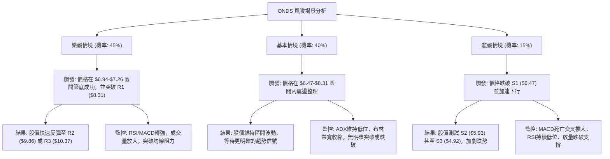

### 🛡️ 風險管理重要提醒

1.  **嚴格止損**：鑑於 ONDS 高達 2.691 的 Beta 值和 8.23% 的日均波動率，價格波動劇烈。任何交易都必須設置嚴格的止損點，並嚴格執行。建議止損點設置在關鍵支撐位下方，例如 $6.40。
2.  **倉位控制**：切勿重倉單一高波動性股票。對於短期反彈策略，建議控制倉位在 10-20% 之間，以降低潛在虧損對總體資產的影響。
3.  **分批建倉/平倉**：考慮到當前市場的不確定性，可以採用分批建倉的方式，例如在 $7.26 和 $6.94 附近分批買入，以攤平進場成本。同時，達到目標價時也應分批平倉，鎖定利潤。
4.  **關注大盤**：ONDS 對大盤走勢高度敏感。在執行交易策略時，必須密切關注整體市場指數（如 S&P 500）的趨勢，若大盤出現明顯的利空信號，應及時調整策略或減倉。
5.  **警惕假突破/假跌破**：在盤整行情中，常出現假突破或假跌破。建議等待價格有效突破或跌破關鍵支撐/阻力位，並伴隨成交量的放大，才能確認信號的有效性。
6.  **基本面風險**：本報告僅為技術分析。ONDS 的基本面數據顯示其盈利能力和估值指標存在較大風險 (如 P/E 80.66，FCF Yield -0.38%，Operating Margin -85.1%)，這可能對股價的長期走勢構成壓力。需警惕基本面惡化導致技術反彈失敗。

---

## 📋 報告總結

```
ONDS 技術分析報告總結
════════════════════════════════════════════════════════
報告日期：2026-07-12
當前價格：$7.26
分析評級：⚖️ 中性偏空，短期有反彈潛力

關鍵結論：
├─ 長期趨勢：🔴 深度調整，漲勢受挫
├─ 中期趨勢：🔴 明確下跌通道，壓力沉重
├─ 短期趨勢：🟢 超賣，存在技術性反彈需求
├─ 關鍵支撐：$6.94 (61.8% Fib), S1 $6.47, 布林下軌 $6.65
├─ 關鍵阻力：R1 $8.31 (MA20), 50% Fib $8.53
└─ 分析師目標：短期反彈目標 $8.31 - $9.86 (基於S/R)

最優策略組合：
1. 🥇 最佳機會：在 $6.94 - $7.00 區間尋找止跌信號，進場做多，目標 $8.31，止損 $6.40。
2. 🥈 次選機會：若價格直接從現價 $7.26 附近反彈，可輕倉追蹤，目標 $8.31，止損 $6.40。
3. 🥉 保守選擇：等待價格突破 $8.31 並站穩後，再考慮追多，或等待跌破 $6.47 後考慮做空。
════════════════════════════════════════════════════════
```

---

> ⚠️ **免責聲明**：本報告為 AI 自動生成之技術分析，所有數據及估算均基於提供的歷史價格資訊。本報告**僅供研究與學術參考**，**不構成任何投資建議**。投資有風險，入市需謹慎。

---

*報告生成時間：2026-07-12 ｜ 數據來源：Yahoo Finance ｜ 分析框架：多時框技術分析*