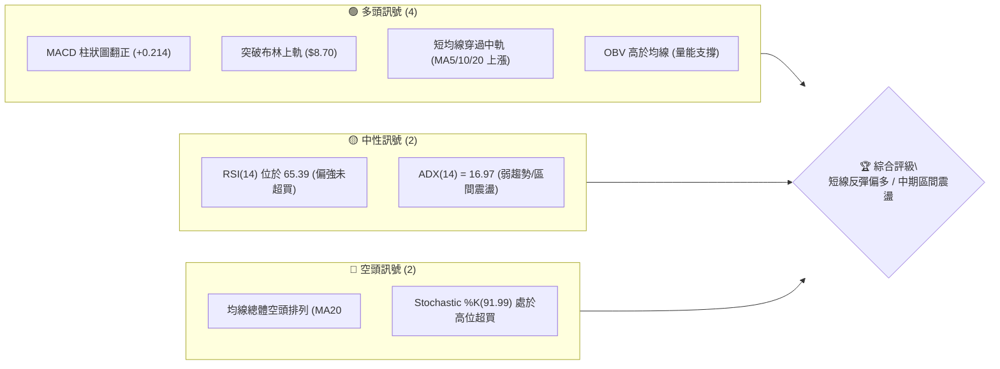
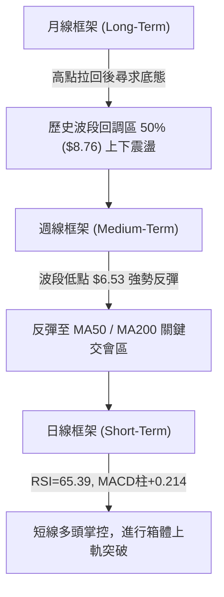
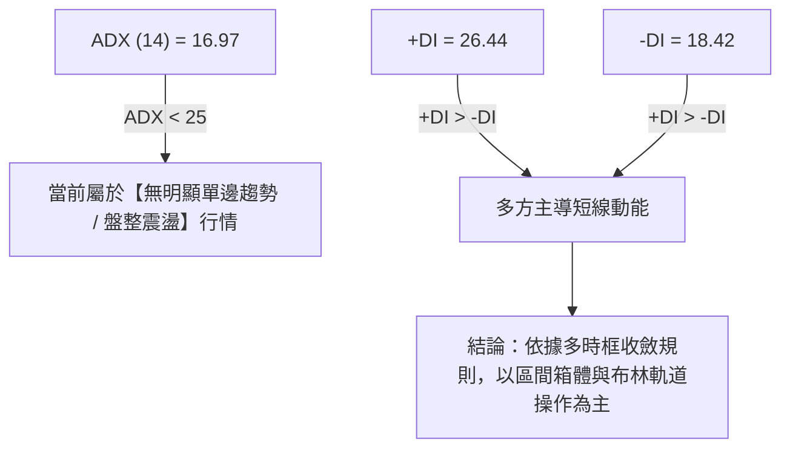
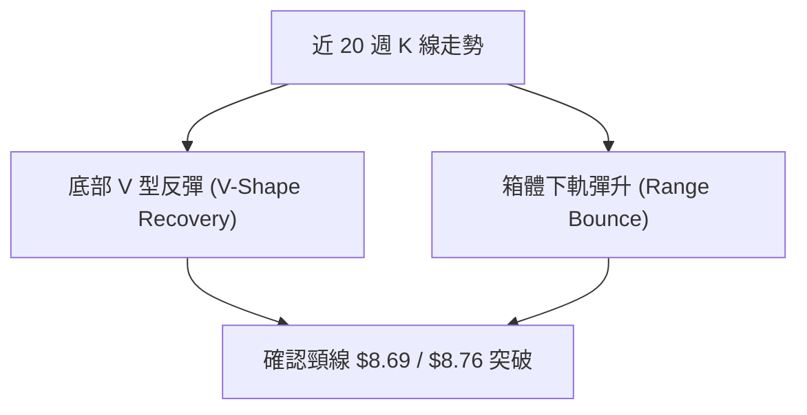
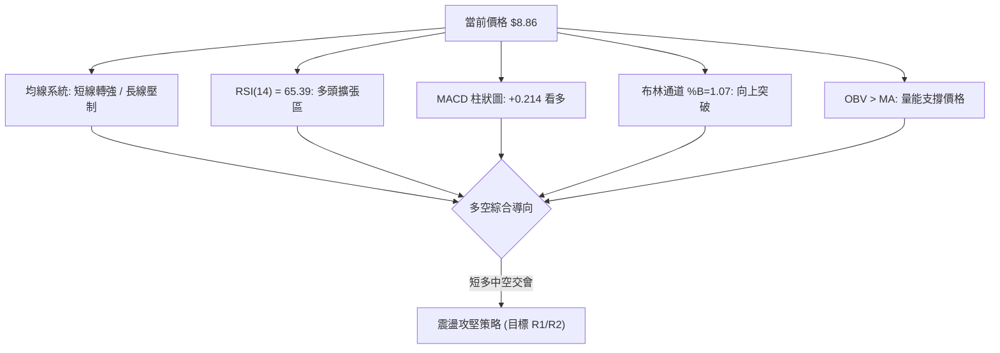
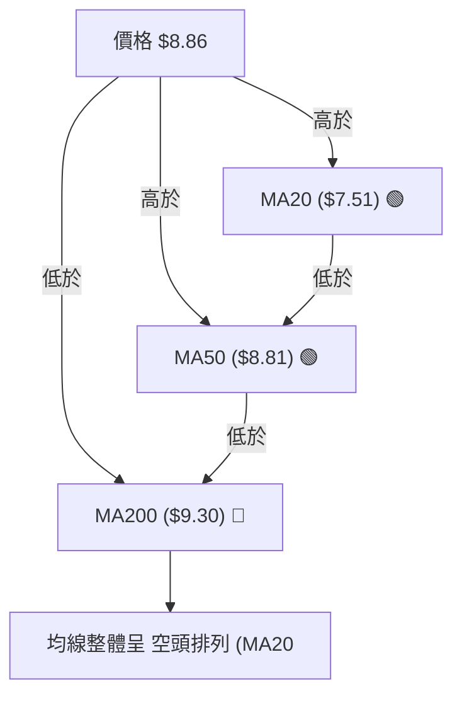
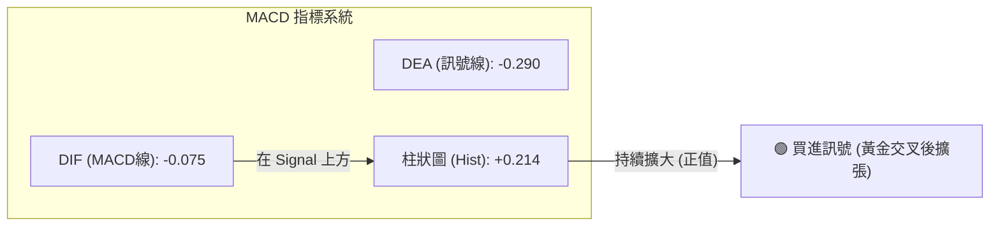
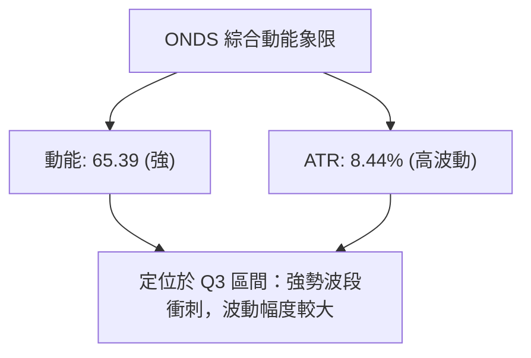
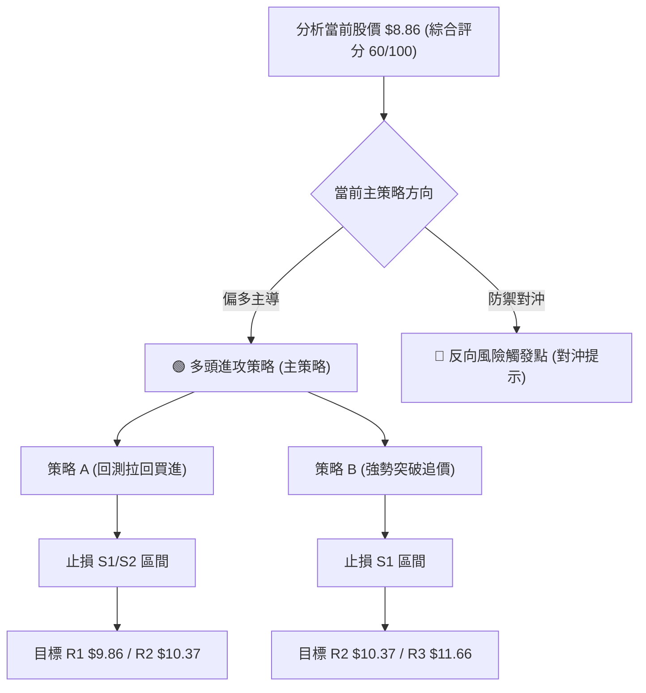
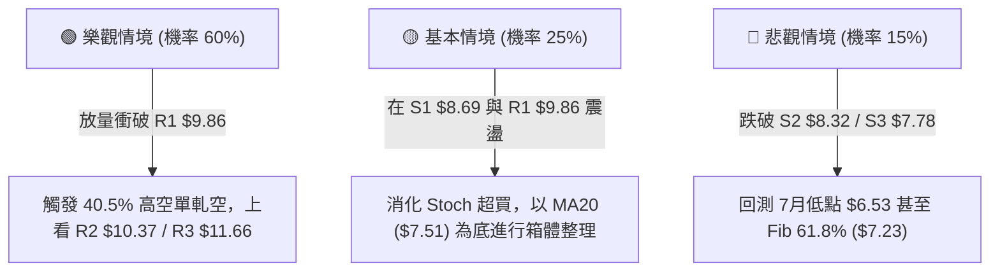

# ONDS 技術分析報告

> **報告日期**：2026-08-05 ｜ **語言**：繁體中文 ｜ **數據來源**：Yahoo Finance ｜ **當前價格**：$8.86

---

## 目錄

| 章節 | 內容 |
|------|------|
| [1. 技術面概覽](#1-技術面概覽) | 訊號儀表板、核心指標、評分卡 |
| [2. 趨勢分析](#2-趨勢分析) | 多時框趨勢、長中短期走勢 |
| [3. 圖表形態分析](#3-圖表形態分析) | 形態識別、K線組合、目標價 |
| [4. 支撐與阻力](#4-支撐與阻力) | 關鍵價位、斐波那契回調 |
| [5. 技術指標深度解讀](#5-技術指標深度解讀) | MA/RSI/MACD/布林/成交量 |
| [6. 動能與波動率](#6-動能與波動率) | 動能評估、ATR、Beta |
| [7. 多時框架總結](#7-多時框架總結) | 時框架評分矩陣 |
| [8. 交易策略建議](#8-交易策略建議) | 多空策略、風險報酬比 |
| [9. 風險提示與監控](#9-風險提示與監控) | 監控指標、風險場景 |

---

## 1. 技術面概覽

### 🎯 技術訊號儀表板



### 📊 核心指標速覽表

| 指標類別 | 指標名稱 | 當前數值 | 訊號 | 解讀 |
|----------|----------|----------|------|------|
| **價格** | 當前價格 | $8.86 | 🟢 | 站上 52 週區間 50.7% 位置，收復斐波那契 50.0% ($8.76) |
| **均線** | MA20 | $7.51 | 🟢 | 價格位於 MA20 之上 (+17.96%)，短線強勢攻高 |
| **均線** | MA50 | $8.81 | 🟢 | 價格微幅站上 MA50 ($8.81)，面臨中軌扣抵測試 |
| **均線** | MA200 | $9.30 | 🔴 | 價格低於 MA200 (-4.73%)，中長期長壓未解除 |
| **動能** | RSI(14) | 65.39 | 🟢 | 買盤動能強勁，進入偏多擴張區且無頂背離 |
| **動能** | MACD(12,26,9)| Hist: +0.214 | 🟢 | 快慢線均呈黃金交叉後擴張，柱狀圖持續放大 |
| **動能** | Stoch %K/%D| 91.99 / 78.97 | 🔴 | 短線指標進入嚴重超買區，需防範高位拉回 |
| **波動** | ATR(14) | $0.75 | 🟡 | 佔股價 8.44%，日均波動劇烈，波動率適中 |
| **趨勢** | ADX(14) | 16.97 | 🟡 | ADX < 25 指示當前為盤整或箱體反彈行情，非強單邊 |
| **通道** | 布林通道 %B | 1.07 | 🟢 | 突破布林帶上軌 ($8.70)，呈強勢帶狀向上噴發 |

### 🏆 技術評分卡

```
╔══════════════════════════════════════════════════════════════╗
║                ONDS 技術綜合評分卡 (2026-08-05)              ║
╠══════════════════════════════════════════════════════════════╣
║ 趨勢強度 (ADX/DIs)   ████████░░░░░░░░░░░░  40/100 🟡 中性     ║
║ 短期動能 (RSI/MACD)  ████████████████░░░░  80/100 🟢 強勁     ║
║ 支撐穩定度 (Key Level)██████████████░░░░░  70/100 🟢 良好     ║
║ 成交量配合 (OBV/Vol) ██████████████░░░░░  70/100 🟢 良好     ║
║ 形態完整度 (Patterns)████████████░░░░░░  60/100 🟡 中性     ║
║ 均線排列 (MA System) ████████░░░░░░░░░░░░  40/100 🔴 偏空     ║
╠══════════════════════════════════════════════════════════════╣
║ 綜合評分             ████████████░░░░░░░░  60/100 🟢 短多盤整 ║
╚══════════════════════════════════════════════════════════════╝
```

---

## 2. 趨勢分析

### 🌐 多時框趨勢分析



### 📈 長期趨勢 — 24個月收盤價歷史走勢圖

```
ONDS 24個月歷史走勢圖（2024-08 至 2026-08）
價格軸 ($)
$15.28 ┤                                                     ● (52W High)
$13.22 ┤                                             ●
$10.36 ┤                                     ●   ●
$8.86  ┤                                               ●←當前價 $8.86
$7.90  ┤                             ●   ●       ●   ●
$5.86  ┤                         ●
$2.56  ┤                 ●
$0.77  ┤ ●   ●   ●   ●       ●
       └─┴───┴───┴───┴───┴───┴───┴───┴───┴───┴───┴───┴───┴───
       08/24 10 12 02/25 04 06 08 10 12 02/26 04 06 08/26
```

#### 歷史走勢特徵階段分析

| 階段歷史 | 價格區間 | 累積漲跌幅 | 走勢特徵與市場行為 |
|----------|----------|------------|-------------------|
| **第一階段：打底築底** | $0.77 - $0.98 | — | 2024下半年低檔盤整，成交量低迷 |
| **第二階段：主升段噴發**| $0.98 - $13.22| +1248.97% | 2024年底至2026年中急劇拉升，創下 52 週高價 $15.28 |
| **第三階段：高位劇烈修正**| $13.22 - $6.53 | -50.60% | 2026年6-7月快速向下回修正，下探 78.6% 回調位下方 |
| **第四階段：短線V型反彈**| $6.53 - $8.86 | +35.68% | 2026-07-19 觸底 $6.53 後連續3週放量強勢反彈 |

### 📊 中期趨勢（週線分析）

從近 20 週數據觀察，ONDS 在 2026-05-31 達到近期高點 $13.22 後經歷深幅拉回，於 2026-07-19 探低至 $6.53（配合週成交量放大至 671,525,800 股，顯現恐慌換手底），隨後週線連續出擊：
- **2026-07-26 週**：收盤 $7.80，RSI 升至 49.8，MACD 柱狀圖翻正至 +0.181，成交量放大至 834,313,400 股（巨量築底）。
- **2026-08-09 週（截至08-05）**：收盤攻上 $8.86，RSI 達到 65.4，MACD 柱狀圖維持放量 +0.214。

### ⚡ 趨勢強度評估（ADX 解讀）



#### ADX 趨勢強度對照表

| 指標項目 | 數值 | 評估標準 | 當前判讀 |
|----------|------|----------|----------|
| **ADX(14)** | 16.97 | <25：弱趨勢/盤整 ｜ 25-50：強趨勢 ｜ >50：極強趨勢 | 🟡 弱趨勢/震盪盤整 |
| **+DI(14)** | 26.44 | 高於 -DI 代表買方占優 | 🟢 短線買盤主導 |
| **-DI(14)** | 18.42 | 低於 +DI 代表賣方壓制減弱 | 🟢 賣壓減緩 |
| **方向比對**| +DI > -DI | 差值 +8.02 | 🟢 多頭掌控短線主導權 |

---

## 3. 圖表形態分析

### 🔍 形態識別系統

根據 24 個月及近 20 週歷史數據分析，當前圖表具備以下形態特徵：



#### 圖表形態信心度評估表

| 形態名稱 | 信心度 | 判斷依據（引用數據） | 完成度 | 目標價（附計算式） |
|----------|--------|----------------------|--------|--------------------|
| **雙重底 / V型反彈** | 65% | 7月19日低點 $6.53 反彈，突破關鍵阻力轉支撐位 S1 ($8.69) | 85% | 頸線 $8.69 + (頸線 $8.69 - 低點 $6.53 = $2.16) = **$10.85**（對應阻力位 R2 $10.37 至 38.2% 回調 $10.30 區域） |
| **布林帶上軌擠壓突破** | 75% | 股價 $8.86 突破布林上軌 $8.70，%B 為 1.07 | 90% | 突破延伸目標 R1 **$9.86** |
| **大型頭肩形態** | 35% | 數據不足以支撐幾何頭肩形態，長期結構尚待觀望 | 30% | *訊號不足，僅做指標型解讀* |

### 🕯️ 重要K線形態分析

| 日期/週別 | 收盤價 | K線形態 | 解讀 | 訊號 |
|-----------|--------|---------|------|------|
| **2026-07-19** | $6.53 | 長下影爆量止跌棒 | 週成交量 6.71 億股爆量落底，探低至接近 52W 低點後強拉 | 🟢 底部訊號 |
| **2026-07-26** | $7.80 | 大陽線吞噬 | 週成交量 8.34 億股創近期新高，實體大陽線收復 S3 ($7.78) | 🟢 強勢反轉 |
| **2026-08-02** | $7.49 | 高檔狹幅洗盤星線 | 縮量拉回回測 MA20 ($7.51)，守住支撐區 | 🟡 洗盤整理 |
| **2026-08-09(現)**| $8.86 | 強勢突破長紅 | 衝破 MA50 ($8.81) 與布林上軌 ($8.70)，RSI 達 65.39 | 🟢 多頭擴張 |

### 📉 ASCII 走勢形態示意圖

```
ONDS 短期 V 型反彈與突破示意圖
═══════════════════════════════════════════════════════════
$10.37 ┤                                            [阻力位 R2]
$9.86  ┤                                    /  ← [阻力位 R1]
$8.86  ┤                                ● (當前突破價)
$8.70  ├───────────────────────────────/───── [布林上軌/頸線突破]
$7.51  ┤                       ●     /        [MA20 中軌支撐]
$6.53  ┤            ● (V型低點) \___/ 
       └────────────┴───────────┴────
                 07/19        07/26  08/05
═══════════════════════════════════════════════════════════
```

### 🎯 形態目標價計算

根據完成度 85% 的 V 型反彈/雙底結構算式：
1. **底部低點**：$6.53 (2026-07-19 觸底)
2. **頸線突破位**：S1 ($8.69) / 斐波那契 50% ($8.76) 區域，取 $8.69
3. **形態垂直高度**：$8.69 - $6.53 = $2.16
4. **理論目標價**：$8.69 + $2.16 = **$10.85**
5. **數據映射驗證**：對應數據中阻力位 R2（$10.37）與斐波那契 38.2% 回調位（$10.30）之間。

---

## 4. 支撐與阻力

### 🗺️ 關鍵價位分布圖

```
ONDS 價位結構分布圖 (現價: $8.86)
═══════════════════════════════════════════════════════════════════
$15.28 ║████████████████████████████████████████ 52W High / Fib 0.0%
$12.20 ║████████████████████████████████        Fib 23.6%
$11.66 ║████████████████████████████            阻力位 R3
$10.37 ║██████████████████████                  阻力位 R2
$10.30 ║█████████████████████                   Fib 38.2%
$9.86  ║██████████████████                      阻力位 R1
$9.30  ║████████████████                        MA200 均線阻力
$8.86  ╠════════════════════════════════════════ ◄ 當前價格 ($8.86)
$8.76  ║▓▓▓▓▓▓▓▓▓▓▓▓▓▓▓                         Fib 50.0% 回調位
$8.69  ║▓▓▓▓▓▓▓▓▓▓▓▓▓▓                          支撐位 S1
$8.32  ║▓▓▓▓▓▓▓▓▓▓▓▓                            支撐位 S2
$7.78  ║▓▓▓▓▓▓▓▓▓                               支撐位 S3
$7.51  ║▓▓▓▓▓▓▓                                 MA20 / 布林中軌
$7.23  ║▓▓▓▓▓                                   Fib 61.8%
$5.04  ║▓▓                                      Fib 78.6%
$2.25  ║                                        52W Low / Fib 100.0%
═══════════════════════════════════════════════════════════════════
```

### 🚧 阻力位分析表

| 阻力級別 | 價位 | 形成原因（嚴格引用數據） | 突破難度 | 重要性 |
|----------|------|--------------------------|----------|--------|
| **R1** | $9.86 | 近一年波段高點聚類 (+11.29%) | 🟡 中等 | 短線多頭第一攻堅目標 |
| **R2** | $10.37 | 近一年波段高點聚類 (+17.04%)，緊鄰 Fib 38.2% ($10.30) | 🔴 較高 | 中期形態測算反彈關卡 |
| **R3** | $11.66 | 近一年波段高點聚類 (+31.66%) | 🔴 極高 | 波段空頭強堡壘 |

### 🛡️ 支撐位分析表

| 支撐級別 | 價位 | 形成原因（嚴格引用數據） | 守住機率 | 重要性 |
|----------|------|--------------------------|----------|--------|
| **S1** | $8.69 | 近一年波段低點聚類 (-1.92%)，貼近 Fib 50.0% ($8.76) | 🟢 高 | 短線防守第一道關卡 |
| **S2** | $8.32 | 近一年波段低點聚類 (-6.09%) | 🟢 高 | 短線多空強弱分界點 |
| **S3** | $7.78 | 近一年波段低點聚類 (-12.19%)，接近 MA20 ($7.51) | 🟢 極高 | 中期波段防守生命線 |

### 📐 斐波那契回調位分析

基於 52 週區間高點 **$15.28** 與低點 **$2.25** 計算：

```
斐波那契回調結構 (52W Range: $2.25 → $15.28)
├─ 0.0%   (52W High)  : $15.28
├─ 23.6%  回調位      : $12.20
├─ 38.2%  回調位      : $10.30
├─ 50.0%  關鍵中軸位  : $8.76  ◄ 當前股價 $8.86 剛好突破此位置
├─ 61.8%  黃金分割位  : $7.23  (7月中旬低點 $6.53 在此下方尋獲買盤)
├─ 78.6%  深度回調位  : $5.04
└─ 100.0% (52W Low)   : $2.25
```

**解讀**：股價成功收復 **Fib 50.0% ($8.76)**，目前落於 **Fib 50.0% ($8.76)** 與 **Fib 38.2% ($10.30)** 區間內。站穩 $8.76 意味著多頭擺脫深度回調危險區，向上打開測試 $10.30 的空間。

---

## 5. 技術指標深度解讀

### 🎛️ 指標訊號總覽



### 📈 移動平均線排列分析



#### 均線數據比較與扣抵解讀

| 均線天數 | 均線價格 | 股價相對距離 | 趨勢方向 | 扣抵解讀 |
|----------|----------|--------------|----------|----------|
| **MA 5** | $7.82 | +13.30% | ▲ 向上 | 短期快線急揚，帶動超短線多頭攻勢 |
| **MA 10** | $7.87 | +12.57% | ▲ 向上 | 支撐短線乖離 |
| **MA 20** | $7.51 | +17.96% | ▲ 向上 | 月線急起，下軌形成穩固支撐 |
| **MA 50** | $8.81 | +0.57% | ▲ 向上 | 剛突破季線，面臨扣抵測試 |
| **MA 60** | $8.93 | -0.79% | ▼ 向下 | 上方微幅蓋頂 |
| **MA 120**| $9.47 | -6.43% | ▼ 向下 | 中長期空頭反彈反壓區 |
| **MA 200**| $9.30 | -4.73% | ▼ 向下 | 核心長壓區，需放量衝破 |
| **MA 240**| $8.94 | -0.87% | ▼ 向下 | 年線扣抵平緩 |

### 📉 RSI(14) 分析

- **當前數值**：**65.39**
- **動能評級**：🟢 偏多擴張區（無背離）

```
RSI(14) 動能進度條
[0] ░░░░░░░░░░░░░░░░░░░░ [30] ▓▓▓▓▓▓▓▓▓▓▓▓▓▓▓▓ [50] █████████████░░░ [70] ░░░░░░░░░░░░░░░░░░░░ [100]
                                                     ▲ (65.39)
```

**解讀與背離判斷**：
- RSI 由 7 月中旬的 28.0 快速爬升至 65.39，顯示多頭動能迅速擴張。
- **背離檢查**：7 月低點股價創 $6.53 低價時，RSI 於 35.0 附近打底上升，價格與 RSI 走勢一致，**無明顯頂背離或底背離**。指標健康支援股價持續走揚。

### 📊 MACD(12/26/9) 訊號解讀



- **MACD 線**：-0.075
- **Signal 線**：-0.290
- **MACD 柱狀圖**：**+0.214**（綠色看多）
- **分析**：MACD 快線已於零軸下方向上穿越慢線形成黃金交叉，且柱狀圖連續 3 週維持正向放大（由 +0.109 擴大至 +0.214），多頭擴張力道足夠。

### 📦 布林通道分析

```
ONDS 布林通道結構示意圖
$8.70 ┤ --------------------------------- 布林上軌 (BB Upper)
$8.86 ┤ ★ 當前價格 (突破上軌 1.07%B)
$7.51 ┤ --------------------------------- 布林中軌 (BB Middle / MA20)
$6.32 ┤ --------------------------------- 布林下軌 (BB Lower)
```

- **BB 上軌**：$8.70
- **BB 中軌(MA20)**：$7.51
- **BB 下軌**：$6.32
- **BB %B**：**1.07**（> 1.0 代表價格收在布林上軌上方）
- **解讀**：股價開口向上擠壓突破（Bollinger Band Breakout），屬於典型強勢攻擊態勢。由於 %B 達 1.07，短線可能伴隨向上軌 $8.70 的回測確認。

### 💹 成交量分析（量價配合度）

- **最新成交量**：72,038,072 股
- **20日均量**：107,424,889 股（量比：0.67x）
- **50日均量**：88,990,813 股
- **OBV 趨勢**：`OBV > MA` 🟢 量能支撐上漲
- **解讀**：最新單日成交量稍低於 20 日均量，但觀察近 4 週週成交量（從 6.71 億、8.34 億巨量到近期換手），OBV 維持在均線上方，顯示主力資金在底部洗盤後籌碼集中，量價搭配尚屬順暢。

---

## 6. 動能與波動率

### ⚡ 動能評估四象限

| 象限 | 動能強度 | 波動率水準 | 當前 ONDS 位置 | 評估說明 |
|------|----------|------------|----------------|----------|
| **Q1** | 強 (RSI > 60) | 低 (ATR < 5%) | — | 穩定單邊牛市 |
| **Q2** | 弱 (RSI < 40) | 低 (ATR < 5%) | — | 沉悶打底盤整 |
| **Q3** | 強 (RSI 65.39) | 高 (ATR 8.44%)| **✓ 當前狀態** | **高動能高波動衝刺期 (適宜拉回佈局與嚴設止損)** |
| **Q4** | 弱 (RSI < 40) | 高 (ATR > 8%) | — | 恐慌殺多崩跌期 |



### 📊 ATR 波動率分析

- **ATR(14)**：**$0.75**（佔價格 8.44%）
- **波動率解讀**：每日平均波動高達 $0.75，顯示標的具備高彈性與高 Beta 特質。
- **止損安全距離建議**：
  - **短線止損 (1.0x ATR)**：$8.86 - $0.75 = **$8.11**（位於支撐位 S2 $8.32 下方）
  - **波段止損 (1.5x ATR)**：$8.86 - ($0.75 × 1.5) = **$7.74**（保護於支撐位 S3 $7.78 / MA20 $7.51 附近）

### 📐 Beta 與市場相關性

- **Beta 係數**：**2.75**（高 Beta 科技/通訊設備股）
- **Short % Float**：**40.5%**（極高空單比例，Short Ratio 3.05）
- **解讀**：Beta 為 2.75 意味大盤上漲 1% 時，ONDS 有潛力變動 2.75%；同時 40.5% 的高券資比在股價衝破布林上軌與 MA50 時，**極易觸發軋空行情 (Short Squeeze)**。

---

## 7. 多時框架總結

### 📋 時框架評分表

| 時框架 | 趨勢方向 | 動能指標 | 均線排列 | 圖表形態 | 綜合評分 | 操作建議 |
|--------|----------|----------|----------|----------|----------|----------|
| **日線 (Short)** | 🟢 多頭 | 🟢 RSI 65 / MACD柱+ | 🟡 MA20向上/突破MA50 | 🟢 突破布林上軌 | **75/100** | 順勢偏多/回測進場 |
| **週線 (Medium)**| 🟡 盤整反彈| 🟢 MACD金叉放量 | 🔴 MA20<MA50 | 🟢 V型底部築底完成 | **60/100** | 箱體操作/挑戰阻力 |
| **月線 (Long)**  | 🔴 修正殘留| 🟡 中性回升 | 🔴 長期反壓未收復 | 🟡 歷史50%回調拉鋸| **45/100** | 長線防守/觀望衝破 |

### 🔲 綜合訊號矩陣

```
╔══════════════════════════════════════════════════════════════╗
║                    多時框訊號收斂矩陣                        ║
╠══════════════════════════╦═══════════════════════════════════╣
║ 短期 (日線 1-5日)        ║ 🟢 強力反彈，挑戰 R1 $9.86        ║
║ 中期 (週線 1-4週)        ║ 🟢 箱體震盪走揚，看 $10.37 (R2)   ║
║ 長期 (月線 1-3季)        ║ 🟡 受制於 MA200 $9.30 及歷史修正  ║
╠══════════════════════════╬═══════════════════════════════════╣
║ 指標收斂結論             ║ 多頭佔優，短中線一致向上偏多      ║
╚══════════════════════════╩═══════════════════════════════════╝
```

### ⚖️ 多時框收斂結論

依據多時框收斂規則：
1. **行情屬性**：ADX(14) = 16.97 (<25)，定義當前為**區間震盪與箱體反彈行情**。
2. **主導時框**：由日線強勢動能（RSI 65.39、MACD +0.214）引導週線打底反彈。
3. **一致性結論**：雖然長期均線（MA200 $9.30）依然平鋪於上方形成蓋頂，但短中期多頭動能強烈，且成功收復斐波那契 50.0% ($8.76) 與支撐 S1 ($8.69)。**最終結論判定為：短線強勢反彈，主策略採取【回測支撐順勢做多，標的目標設定於阻力位 R1/R2】**。

---

## 8. 交易策略建議

### 🗺️ 策略決策流程圖



### 🧭 策略路由

**當前主策略方向 = 🟢 多頭波段進攻策略（技術評分 60/100，短中線動能多頭主導）**

### 🎯 價格情境階梯 (Price Scenarios)

| 觸發條件 | 第一目標 | 第二目標 | 情境含義（嚴格引用數據價位） |
|----------|----------|----------|------------------------------|
| **突破阻力 R1 $9.86** | R2 $10.37 | R3 $11.66 | 軋空行情發動，挑戰 Fib 38.2% ($10.30) 上方 |
| **站穩現價區間 $8.76-$8.86**| R1 $9.86 | R2 $10.37 | 沿布林上軌與 MA50 穩健推升 |
| **跌破支撐 S1 $8.69** | S2 $8.32 | S3 $7.78 | 突破失效，回測 MA20 ($7.51) 與下軌 |

### 📊 情境機率分佈

| 情境 | 機率 | 主要依據（嚴格引用指標數據） |
|------|------|------------------------------|
| **強勢上行 / 挑戰阻力** | **60%** | MACD 柱狀圖 (+0.214) 擴張、RSI (65.39) 強勢、高空單比例 (40.5%) 具軋空潛力 |
| **區間高位震盪** | **25%** | ADX (16.97 < 25) 顯示整體仍屬盤整結構，MA200 ($9.30) 存在反壓 |
| **回落測試低位支撐** | **15%** | Stochastic %K (91.99) 短線嚴重超買，可能有技術性獲利回吐拉回 |

### 🟢 主策略詳情

所有價位均嚴格引用數據中之 S1/S2/S3、R1/R2/R3 及斐波那契回調位：

| 策略要素 | 策略 A：穩健回測佈局 | 策略 B：突破追價攻堅 |
|----------|----------------------|----------------------|
| **進場條件** | 股價回測支撐 S1 ($8.69) / Fib 50% ($8.76) 守穩 | 明確放量突破阻力位 R1 ($9.86) |
| **進場價格** | **$8.75** (S1 $8.69 與現價之間) | **$9.90** (突破 R1 $9.86 確認後) |
| **目標價 T1** | **$9.86** (阻力位 R1，+12.69%) | **$10.37** (阻力位 R2，+4.75%) |
| **目標價 T2** | **$10.37** (阻力位 R2，+18.51%) | **$11.66** (阻力位 R3，+17.78%) |
| **止損價格** | **$8.30** (略低於支撐 S2 $8.32，約 -5.14%)| **$9.25** (略低於 MA200 $9.30，約 -6.57%)|
| **風險報酬比**| **2.47 : 1** (以 T1 計算) | **2.71 : 1** (以 T2 計算) |
| **成功機率** | **65%** | **55%** |
| **建議倉位** | **15% - 20%** | **10% - 15%** |

### 🔴 反向風險觸發點（對沖提示）

- **關鍵轉空價位**：若收盤價跌破 **S3 ($7.78)** 且跌穿 **MA20 ($7.51)**。
- **失效訊號**：MACD 柱狀圖由正轉負、RSI 跌破 50 中軸。
- **風控行動**：多頭部位全面止損離場，轉為空頭防禦觀望姿態。

### ⭐ 整體訊號強度評星

```
做多訊號強度：★★██☆  (4/5星)  🟢 動能強勁
做空訊號強度：★☆☆☆☆  (1/5星)  🔴 賣壓暫退
整體可信度：  ★★★☆☆  (3.5/5星)🟡 受制 ADX 盤整屬性
```

---

## 9. 風險提示與監控

### ✅ 關鍵監控指標 Checklist

```
╔══════════════════════════════════════════════════════════════╗
║               ONDS每日交易監控 Checklist                     ║
╠══════════════════════════════════════════════════════════════╣
║ [ ] 股價是否持續站穩 Fib 50% ($8.76) 與支撐 S1 ($8.69)        ║
║ [ ] 日線成交量是否維持在 20日均量 (1.07億股) 水準            ║
║ [ ] MACD 柱狀圖 (+0.214) 是否繼續放大正值                    ║
║ [ ] Stochastic %K (91.99) 高位死亡交叉向下修正風險           ║
║ [ ] 是否順利突破並站穩 MA200 ($9.30) 核心反壓                ║
║ [ ] 空頭借券賣出比例 (Short Float 40.5%) 是否出現急劇回補    ║
╚══════════════════════════════════════════════════════════════╝
```

### ⚠️ 風險場景分析



### 🛡️ 風險管理重要提醒

1. **高 Beta 波動風險**：ONDS 的 Beta 係數高達 **2.75**，ATR 為 **$0.75** (8.44%)，屬於極高波動個股。操作上單筆交易虧損應嚴格限制在總資本的 **1.5% - 2.0%** 以內。
2. **軋空與空頭回補變數**：賣空比例高達 **40.5%**，當價格突破 R1 ($9.86) 時，極易產生暴漲之軋空行情；相反地，若反彈遭 MA200 ($9.30) 壓制，空頭亦可能再度發起攻擊。
3. **數據紀律遵循**：所有交易點位必須精確遵照 S1 ($8.69)、S2 ($8.32)、R1 ($9.86)、R2 ($10.37) 等客觀數據執行，絕不憑感覺追高。

---

## 📋 報告總結

```
╔══════════════════════════════════════════════════════════════╗
║                 ONDS 技術分析報告總結                         ║
════════════════════════════════════════════════════════════════
 報告日期：2026-08-05
 當前價格：$8.86
 分析評級：🟢 短多波段衝刺 / 中期箱體震盪 (綜合評分 60/100)

 關鍵結論：
 ├─ 長期趨勢：🟡 打底復甦，受到 MA200 ($9.30) 蓋頂
 ├─ 中期趨勢：🟢 7月爆量落底 $6.53 後完成 V 型築底
 ├─ 短期趨勢：🟢 突破布林上軌 ($8.70)，RSI 65.39 動能強勁
 ├─ 關鍵支撐：S1 $8.69 ｜ S2 $8.32 ｜ S3 $7.78
 ├─ 關鍵阻力：R1 $9.86 ｜ R2 $10.37 ｜ R3 $11.66
 └─ 法人共識：機構評級 Strong Buy，目標價均值 $19.81

 最優策略組合：
 1. 🥇 主推策略：回測 $8.75 (S1附近) 順勢做多，止損 $8.30，目標 R1 $9.86 / R2 $10.37
 2. 🥈 突破策略：突破 R1 $9.86 後追價，止損 $9.25，目標 R2 $10.37 / R3 $11.66
 3. 🥉 風控提醒：跌破 S3 $7.78 止損離場，嚴防高 Beta 劇烈震盪
════════════════════════════════════════════════════════════════
```

---

> ⚠️ **免責聲明**：本報告為 AI 自動生成之技術分析報告，所有數據、圖表及價位推演均嚴格基於所提供之歷史價格與量化指標數據。本報告**僅供研究與學術參考**，**不構成任何投資建議或買賣邀約**。金融市場投資具備高度風險，投資人應獨立思考、審慎評估並自負投資風險。

---

*報告生成時間：2026-08-05 ｜ 數據來源：Yahoo Finance ｜ 分析框架：多時框量化技術分析系統*