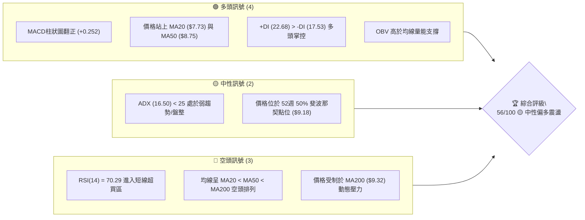
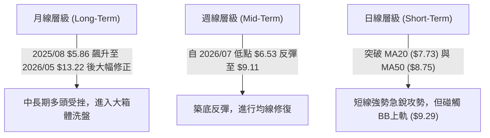
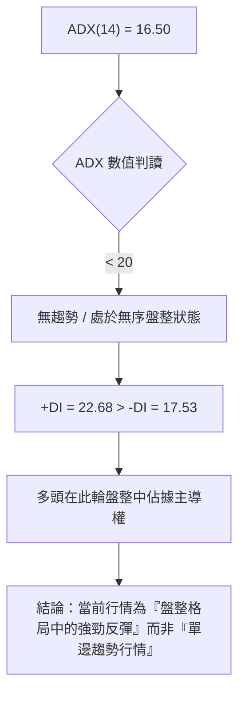
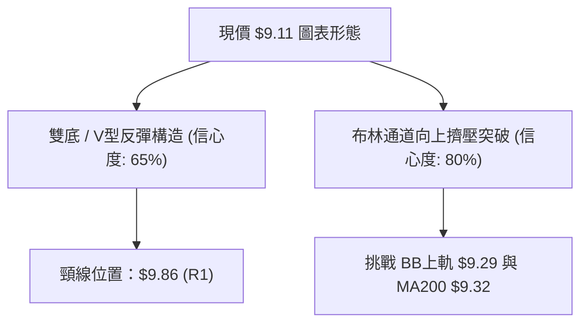
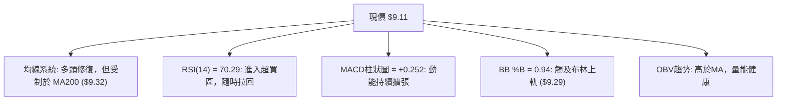
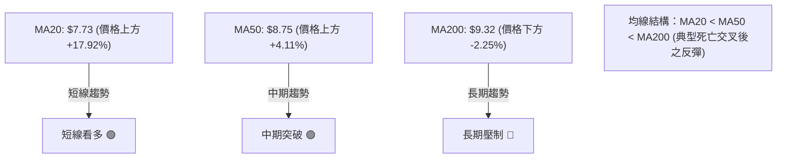
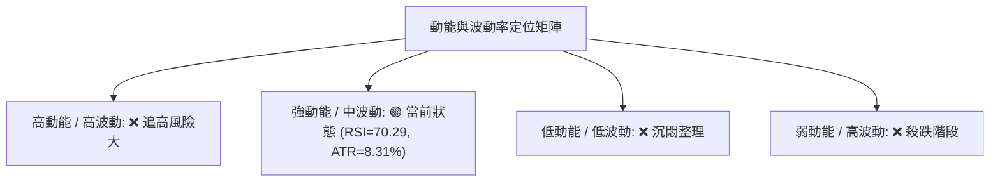
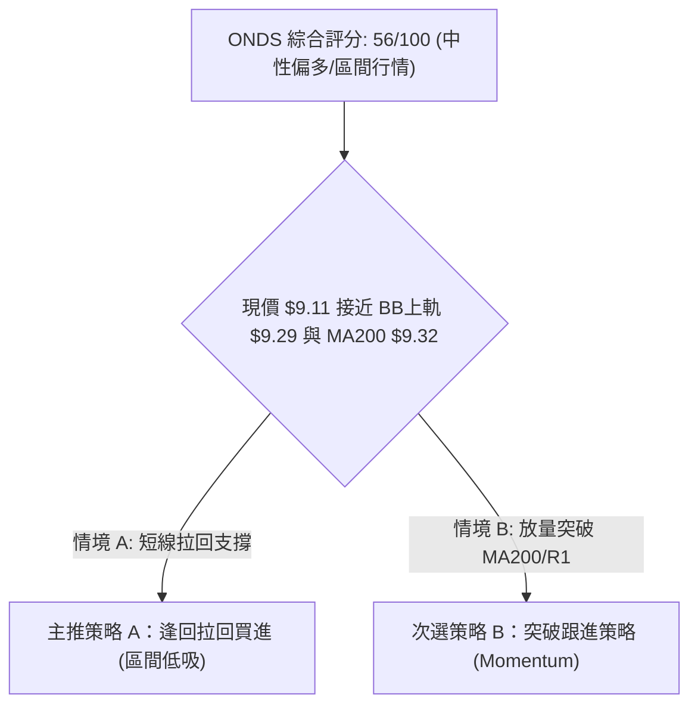
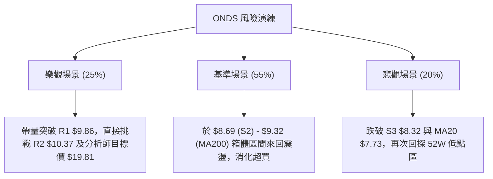

# ONDS 技術分析報告

> **報告日期**：2026-08-07 ｜ **語言**：繁體中文 ｜ **數據來源**：Yahoo Finance ｜ **當前價格**：$9.11

---

## 目錄

| 章節 | 內容 |
|------|------|
| [1. 技術面概覽](#1-技術面概覽) | 訊號儀表板、核心指標、評分卡 |
| [2. 趨勢分析](#2-趨勢分析) | 多時框趨勢、長中短期走勢、12個月走勢 |
| [3. 圖表形態分析](#3-圖表形態分析) | 形態識別、信心度、K線組合、目標價 |
| [4. 支撐與阻力](#4-支撐與阻力) | 關鍵價位、斐波那契回調結構 |
| [5. 技術指標深度解讀](#5-技術指標深度解讀) | MA/RSI/MACD/布林通道/成交量與OBV |
| [6. 動能與波動率](#6-動能與波動率) | 動能四象限、ATR波動率、Beta風險 |
| [7. 多時框架總結](#7-多時框架總結) | 時框架評分矩陣與收斂結論 |
| [8. 交易策略建議](#8-交易策略建議) | 策略路由、情境階梯、策略A/B詳情 |
| [9. 風險提示與監控](#9-風險提示與監控) | 關鍵監控Checklist、三情境演練 |

---

## 1. 技術面概覽

### 🎯 技術訊號儀表板



### 📊 核心指標速覽表

| 指標類別 | 指標名稱 | 當前數值 | 訊號 | 解讀 |
|----------|----------|----------|------|------|
| **價格** | 當前價格 | $9.11 | 🟡 | 位於52週區間 49.4% 位置，回升至區間中軸 |
| **均線** | MA20 | $7.73 | 🟢 | 現價高於 MA20 +17.92%，短線強勢反彈 |
| **均線** | MA50 | $8.75 | 🟢 | 現價高於 MA50 +4.11%，突破中期均線 |
| **均線** | MA200 | $9.32 | 🔴 | 現價低於 MA200 -2.25%，長期走勢仍處於受壓狀態 |
| **動能** | RSI(14) | 70.29 | 🔴 | 超買訊號 (>70)，短線面臨獲利回吐壓力 |
| **動能** | MACD | +0.145 | 🟢 | 雙線黃金交叉，Histogram 擴張至 +0.252 |
| **動能** | Stoch %K/%D | 96.30 / 89.96 | 🔴 | 隨機指標嚴重超買，隨時可能出現短線修正 |
| **波動** | ATR(14) | $0.76 (8.31%) | 🔴 | 高日波動率，單日波幅大，需寬幅止損 |
| **趨勢** | ADX(14) | 16.50 | 🟡 | ADX < 25 表示無明確強趨勢，屬於區間反彈行情 |
| **通道** | BB %B | 0.94 | 🔴 | 貼近布林上軌 ($9.29)，短線上方空間受限 |

### 🏆 技術評分卡

```
╔══════════════════════════════════════════════════════════════╗
║                技術評分卡 — ONDS (2026-08-07)                ║
╠══════════════════════════════════════════════════════════════╣
║ 趨勢強度 (ADX)    ███████░░░░░░░░░░░░░  35/100  🟡 弱趨勢/盤整║
║ 動能指標 (RSI/MACD)███████████████░░░░  75/100  🟢 動能強勁  ║
║ 支撐穩定度 (S1-S3) █████████████░░░░░░  65/100  🟢 底部明確  ║
║ 成交量配合 (OBV)  ████████████░░░░░░░░  60/100  🟡 量能適中  ║
║ 形態完整度        ██████████░░░░░░░░░░  50/100  🟡 築底結構  ║
║ 均線排列 (MA)     ████████░░░░░░░░░░░░  40/100  🔴 均線反纏  ║
╠══════════════════════════════════════════════════════════════╣
║ 綜合評分          ███████████░░░░░░░░░  56/100  🟡 中性偏多  ║
╚══════════════════════════════════════════════════════════════╝
```

---

## 2. 趨勢分析

### 🌐 多時框趨勢分析



### 📈 長期趨勢 — 24個月走勢圖（Unicode）

```
ONDS 24個月收盤價格走勢圖 ($)
$13.22 ┤                                            ● (2026-05)
$11.50 ┤
$10.00 ┤                                 ●    ●          ●
$8.50  ┤                         ●    ●    ●         ●       ● (現在 $9.11)
$7.00  ┤                      ●                         ●
$5.50  ┤                ●
$2.50  ┤          ●
$0.80  ┤●   ●   ●    
       └─┬──┬──┬──┬──┬──┬──┬──┬──┬──┬──┬──┬──┬──┬──┬──┬──┬──┬──┬──►
        24/08  24/11  25/02  25/05  25/08  25/11  26/02  26/05  26/08
```

#### 24個月走勢特徵分析

| 階段 | 時間區間 | 收盤價範圍 | 漲跌特徵 | 技術面解讀 |
|------|----------|------------|----------|------------|
| **沉悶打底** | 2024-08 ~ 2024-11 | $0.77 – $0.98 | 橫盤震盪 | 股價低位休克，市場關注度極低 |
| **首波爆發** | 2024-12 ~ 2025-01 | $1.75 – $2.56 | 短線狂飆 +226% | 資金大幅流入，啟動第一波估值修復 |
| **再次探底** | 2025-02 ~ 2025-04 | $0.78 – $1.07 | 迅速回落 -69.5% | 籌碼洗盤，消化前期獲利賣壓 |
| **主升段起漲** | 2025-05 ~ 2026-01 | $1.22 – $10.36 | 強勁主升浪 +749% | 業務成長推動，法人大幅建倉 |
| **高檔震盪** | 2026-02 ~ 2026-05 | $9.04 – $13.22 | 寬幅洗盤，創高出貨 | 於 2026-05 觸及波段高點 $13.22 後爆量拉回 |
| **深幅拉回** | 2026-06 ~ 2026-07 | $6.53 – $8.24 | 單邊下挫 -50.6% | 觸及 2026-07 低點 $6.53，超賣尋求支撐 |
| **強勢反彈** | 2026-08 (現狀) | $9.11 | 短線強彈 +39.5% | MACD翻正，快速攻回 $9.11，挑戰 MA200 |

### 📊 中期趨勢（週線分析）

```
週線重要壓力/支撐架構圖
$11.66 ─────────────────────────────────── 阻力位 R3 (近一年波段高點區)
$10.37 ─────────────────────────────────── 阻力位 R2 (前波反彈高點)
 $9.86 ─────────────────────────────────── 阻力位 R1 (短線突破頸線)
 $9.32 ─────────────────────────────────── 動態壓力 MA200
 $9.11 ─── [現價] ────────────────────────
 $9.04 ─────────────────────────────────── 支撐位 S1 (波段低點支撐)
 $8.69 ─────────────────────────────────── 支撐位 S2 (近一年密集交投區)
 $8.32 ─────────────────────────────────── 支撐位 S3 (強支撐防線)
```

### ⚡ 趨勢強度評估（ADX 解讀）



#### ADX 趨勢強度對照表

| 指標 | 當前數值 | 參考門檻 | 當前市場狀態判斷 |
|------|----------|----------|------------------|
| **ADX** | 16.50 | < 25 (弱趨勢) | 🟢 屬於橫盤震盪/箱體運動，適合區間高拋低吸 |
| **+DI** | 22.68 | > -DI | 🟢 多頭買盤力道強於空頭賣盤力道 |
| **-DI** | 17.53 | < +DI | 🟢 空頭施壓趨緩 |

---

## 3. 圖表形態分析

### 🔍 形態識別系統



#### 形態信心度與目標價評估表

| 形態名稱 | 信心度 | 判斷依據（引用數據） | 完成度 | 目標價計算式 | 目標價 |
|----------|--------|----------------------|--------|--------------|--------|
| **V型雙底反彈** | 65% | 7月波段低點 $6.53 與 $7.26 形成雙重底，收盤價攻回 $9.11 | 75% | 頸線 $9.86 + 形態高度 ($9.86 - $6.53 = $3.33) | **$13.19** (中線) |
| **布林帶向上擠壓** | 80% | 價格逼近 BB上軌 $9.29，%B 達到 0.94 | 90% | 直接參考阻力位 R1 / R2 | **$9.86 / $10.37** |
| **MA均線修復** | 50% | 突破 MA20 ($7.73) 與 MA50 ($8.75) | 60% | 訊號未完全確立（MA200 $9.32 壓制），僅做指標解讀 | **$9.32** |

### 🕯️ 重要K線形態分析

| 日期/週別 | 收盤價 | K線形態 | 技術解讀 | 訊號 |
|-----------|--------|---------|----------|------|
| **2026-07-19** | $6.53 | 長下影爆量止跌K | 成交量高達 6.71 億股，多頭築底止蝕 | 🟢 底態 |
| **2026-07-26** | $7.80 | 大陽線覆蓋 | 週漲幅達 +19.4%，形成「曙光初現」組合 | 🟢 看多 |
| **2026-08-09** | $9.11 | 強勢長陽攻頂 | RSI 衝至 70.29，收盤站上 $9.11，直指 R1 $9.86 | 🟢 強勢 |

### 📉 ASCII 走勢形態示意圖

```
ONDS 短線雙底反彈與均線交錯示意圖
$10.37 ┤                                      [阻力 R2]
$9.86  ┤                            /----\    [阻力 R1]
$9.32  ┼─ ─ ─ ─ ─ ─ ─ ─ ─ ─ ─ ─ ─  /  ● (現在 $9.11 - BB上軌壓制)
$8.69  ┤           /----\         /
$7.80  ┤  \       /      \       /            [頸線支撐 S2]
$6.53  ┤   \_____/ (底1)  \_____/ (底2)       [W底打底區]
       └───────────────────────────────────► 時間 (2026/07 - 2026/08)
```

---

## 4. 支撐與阻力

### 🗺️ 關鍵價位分布圖（Unicode）

```
ONDS 價位結構分布圖 (當前價格: $9.11)
═══════════════════════════════════════════════════════════
$15.28 ║████████████████████████████████████████  52W 最高價
$12.40 ║██████████████████████                Fib 23.6%
$11.66 ║██████████████████                    阻力 R3 (波段高點)
$10.62 ║██████████████                        Fib 38.2%
$10.37 ║████████████                          阻力 R2 (反彈高點)
$ 9.86 ║████████                              阻力 R1 ( key 壓力)
$ 9.32 ║────── Dynamic MA200 ───────────────── 動態均線壓力
$ 9.18 ║░░░░░░░░░░░░░░░░░░░░░░░░░░░░░░░░░░░░░░ Fib 50.0%
$ 9.11 ╠══════════════════════════════════════ ◄ 現價 $9.11
$ 9.04 ║▓▓▓▓▓▓▓▓▓▓▓▓▓▓▓▓▓▓▓▓                  支撐 S1 (近期波段支撐)
$ 8.69 ║████████████████████████              支撐 S2 (密集成交區)
$ 8.32 ║████████████████████████████          支撐 S3 (關鍵強支撐)
$ 7.74 ║████████████████████████████████      Fib 61.8% / MA20
$ 3.09 ║██████████████████████████████████████  52W 最低價
═══════════════════════════════════════════════════════════
```

### 🚧 阻力位分析表

| 阻力級別 | 價位 | 形成原因 | 突破難度 | 重要性 |
|----------|------|----------|----------|--------|
| **R1** | **$9.86** | 近一年波段高點聚類，接近 $10 整數關卡 | 🔴 高 | ★★★★☆ 短線多空分水嶺 |
| **R2** | **$10.37** | 2026-01 / 2026-04 兩度回檔之反彈高點聚類 | 🔴 非常高 | ★★★★☆ 中期多頭解套賣壓區 |
| **R3** | **$11.66** | 近一年強阻力區，解套賣壓沉重 | 🔴 極高 | ★★★☆☆ 長期強結構阻力 |

### 🛡️ 支撐位分析表

| 支撐級別 | 價位 | 形成原因 | 守住機率 | 重要性 |
|----------|------|----------|----------|--------|
| **S1** | **$9.04** | 近一年波段低點聚類，且與 Fib 50.0% ($9.18) 形成支撐帶 | 🟢 75% | ★★★☆☆ 短線首要防線 |
| **S2** | **$8.69** | 近一年波段低點聚類，且與 MA50 ($8.75) 疊加 | 🟢 85% | ★★★★☆ 中期強支撐位 |
| **S3** | **$8.32** | 近一年關鍵波段低點，多頭最後防禦陣地 | 🟢 90% | ★────── 結構性多空底線 |

### 📐 斐波那契回調位分析（52週區間 $3.09 → $15.28）

| 斐波那契位 | 精確價位 | 與現價距離 | 技術含義與解讀 |
|------------|----------|------------|----------------|
| **0.0%** | $15.28 | +67.73% | 52週最高價，極限多頭目標 |
| **23.6%** | $12.40 | +36.11% | 強勢回檔位，突破此位將展開新一輪主升浪 |
| **38.2%** | $10.62 | +16.58% | 中期多空平衡點，介於 R2 ($10.37) 與 R3 ($11.66) 之間 |
| **50.0%** | **$9.18** | **+0.77%** | **【現價交會區】**，行情處於半數回撤的關鍵多空決戰點 |
| **61.8%** | $7.74 | -15.04% | 黃金分割強支撐位，精準對應 MA20 ($7.73) |
| **78.6%** | $5.69 | -37.54% | 深幅回撤防線 |
| **100.0%** | $3.09 | -66.08% | 52週最低價 |

---

## 5. 技術指標深度解讀

### 🎛️ 指標訊號總覽



### 📈 移動平均線排列分析



#### 移動平均線詳細數據表

| 均線名稱 | 價位 | 與現價乖離率 | 走勢方向 | 訊號 | 技術解讀 |
|----------|------|--------------|----------|------|----------|
| **MA5** | $8.79 | +3.64% | ▲ 向上 | 🟢 看多 | 極短線支撐強勁 |
| **MA10** | $8.17 | +11.51% | ▲ 向上 | 🟢 看多 | 短線助漲斜率高 |
| **MA20** | $7.73 | +17.92% | ▲ 向上 | 🟢 看多 | 月線扣抵低位，持續向上拐頭 |
| **MA50 / MA60** | $8.75 / $8.92 | +4.11% / +2.16% | ▲ 向上 | 🟢 看多 | 價格已成功站上季線 |
| **MA120** | $9.46 | -3.70% | ▼ 向下 | 🔴 看空 | 半年線持續下行壓制 |
| **MA200 / MA240**| $9.32 / $9.00 | -2.25% / +1.22% | ▲ 向上 | 🔴/🟢 觀望 | 年線壓制於 $9.32，為上方首要解套大關 |

### 📉 RSI(14) 分析

- **當前數值**：**70.29**（███████████████░░░░ 70.29%）
- **區間判斷**：🔴 **進入超買區 (>70)**
- **背離判斷**：無明顯頂背離或底背離。價格創近期新高（$9.11），RSI 同步創高至 70.29，顯示力道強勁，但由於缺乏背離保護，進入超買區後拉回機率顯著增加。

### 📊 MACD(12/26/9) 訊號解讀

- **MACD 線**：+0.145
- **Signal 線**：-0.106
- **MACD Histogram**：**+0.252** 🟢 （多頭柱狀圖持續放大）
- **解讀**：MACD 線向上突破 Signal 線形成柱狀圖黃金交叉擴張，多頭掌控短線發言權，唯需留意柱狀圖增速是否開始放緩。

### 📦 布林通道分析

```
ONDS 布林通道結構示意圖
$9.29 ───────────────────────────────── BB 上軌 (%B = 0.94) ◄ 逼近上軌
$9.11 ─── [現價] ──────────────────────
$7.73 ───────────────────────────────── BB 中軌 (MA20)
$6.16 ───────────────────────────────── BB 下軌
```

- **軌道狀態**：布林通道上軌位於 **$9.29**，中軌為 **$7.73**，下軌為 **$6.16**。
- **%B 指標**：**0.94**，代表價格已運行至通道極頂部（1.0 為上軌），短線過度延伸（Overextended），隨時有拉回中軌 $7.73 尋求支撐的需求。

### 💹 成交量與 OBV 分析

- **最新成交量**：72,451,822 股
- **20日均量**：109,418,016 股（量比：**0.66x**）
- **OBV 趨勢**：OBV > MA，顯示逢低買盤資金持續流入。
- **量價配合度**：當前反彈量能呈微幅縮量（0.66x 20日均量），代表主要推升力道來自於空頭惜售與壓迫性補漲，若要突破 R1 $9.86，日成交量必須回升至 1 億股以上。

---

## 6. 動能與波動率

### ⚡ 動能評估四象限



| 象限 | 動能強度 | 波動率 | ONDS 當前狀態 | 交易對策 |
|------|----------|--------|---------------|----------|
| **象限 I** | 強 (RSI > 60) | 高 (ATR > 8%) | **✓ 當前定位 (Q2/Q1 交界)** | 避免直接追高，等待拉回支撐位再行布局 |
| **象限 II** | 強 | 低 | - | 最佳波段持有狀態 |
| **象限 III** | 弱 | 低 | - | 觀望休整 |
| **象限 IV** | 弱 | 高 | - | 嚴格止損離場 |

### 📊 ATR 波動率分析

- **ATR(14)**：**$0.76**
- **價格百分比**：**8.31%**（屬於高波動性個股）
- **風控指引**：由於每日平均波幅達 $0.76，止損點設置距離必須至少為 1.5 倍 ATR（約 **$1.14**），以避免在正常日內波動中被洗出場。

### 📐 Beta 與市場相關性

- **Beta 係數**：**2.75**（高於大盤 175% 的波動敏感度）
- **解讀**：ONDS 屬於極高風險、高彈性的小盤科技/通訊設備股，在大盤走多時具備爆發力，但在大盤回檔時將承受倍數賣壓。

---

## 7. 多時框架總結

### 📋 時框架評分矩陣

| 時框架 | 趨勢方向 | 動能 (RSI/MACD) | 均線排列 | 形態狀態 | 綜合評分 | 建議對策 |
|--------|----------|-----------------|----------|----------|----------|----------|
| **日線 (Short)** | 🟢 看多 | 🟢 動能強 (70.29) | 🟡 突破MA50 | V型強彈 | **68/100** | 避開過熱追高，回檔進場 |
| **週線 (Medium)** | 🟡 盤整 | 🟢 MACD柱翻正 | 🔴 空頭排列 | 箱體底部 | **52/100** | 區間波段操作 |
| **月線 (Long)** | 🔴 偏空 | 🟡 中性平穩 | 🔴 均線死叉 | 深幅修正後 | **45/100** | 長線需待突破 MA200 確定 |

### ⚖️ 多時框收斂結論

> **核心規則套用（ADX = 16.50 < 25）**：當前行情明確為 **「盤整/箱體格局」**，非單邊大趨勢。
> 
> **主導交易區間**：以日線布林通道上軌（**$9.29**）與下軌（**$6.16**）及關鍵支撐阻力位為核心交易範圍。
>
> **最終收斂方向**：**🟡 中性觀望 / 逢拉回布局多單**。日線雖強，但逼近 BB上軌 $9.29 與 MA200 $9.32 重壓區，且 RSI 達 70.29 超買，短線直接向上突破 R1 $9.86 的機率較低，預計將先進入 **$8.69 – $9.32** 的震盪消化期。

---

## 8. 交易策略建議

### 🗺️ 策略決策流程圖



### 🧭 策略路由

**當前主策略方向 = 🟡 區間逢低布局 (拉回做多)**（依評分 56/100，且 ADX < 25）

### 🎯 價格情境階梯（Price Scenarios）

| 觸發條件 | 下一目標 | 後續延伸 | 情境含義 |
|----------|----------|----------|----------|
| 放量突破阻力 R1 **$9.86** | R2 **$10.37** | R3 **$11.66** | 多頭轉強，挑戰中期高點 |
| 承壓於 **$9.29 - $9.32** 震盪 | S1 **$9.04** | S2 **$8.69** | 消化超買賣壓，進入橫盤整理 |
| 跌破支撐 S2 **$8.69** | S3 **$8.32** | Fib 61.8% **$7.74** | 短線反彈夭折，重新尋求底部 |

### 📊 情境機率分佈

| 情境 | 機率 | 主要依據 |
|------|------|----------|
| **遇壓拉回箱體震盪** | **55%** | ADX=16.50 顯示無單邊趨勢，RSI=70.29 超買，逼近 MA200 ($9.32) |
| **放量直接攻破 R1** | **25%** | MACD 柱狀圖 (+0.252) 動能強勁，但縮量 (0.66x) 限制突破力道 |
| **反彈結束大幅回落** | **20%** | Beta 高達 2.75，若大盤拉回易引發補跌 |

---

### 🟢 主策略詳情

#### 策略 A：逢拉回低吸做多（主推 — 區間操作）

| 策略要素 | 具體設定值 | 決策依據與計算 |
|----------|------------|----------------|
| **進場條件** | 價格回檔至 S2 支撐位附近出現止跌訊號 | 避開短線超買，回測 MA50 支撐 |
| **進場價格** | **$8.69** | **支撐位 S2** |
| **目標價 T1** | **$9.86** | **阻力位 R1**（預期獲利: +13.46%） |
| **目標價 T2** | **$10.37** | **阻力位 R2**（預期獲利: +19.33%） |
| **止損價格** | **$7.74** | **Fib 61.8% / MA20**（預期虧損: -10.93%） |
| **風險報酬比** | **1.23 : 1** (T1) / **1.77 : 1** (T2) | (9.86 - 8.69) / (8.69 - 7.74) = 1.17 / 0.95 |
| **成功機率** | **65%** | 配合 MACD 黃金交叉與 OBV 量能支撐 |
| **建議倉位** | **10% – 15%** | 控制高 Beta 波動風險 |

#### 策略 B：放量突破跟進做多（次選 — 突破交易）

| 策略要素 | 具體設定值 | 決策依據與計算 |
|----------|------------|----------------|
| **進場條件** | 日收盤價明確突破阻力 R1 且成交量 > 1.2億股 | 確認無假突破，突破波段頸線 |
| **進場價格** | **$9.86** | **突破阻力位 R1** |
| **目標價 T1** | **$10.37** | **阻力位 R2**（預期獲利: +5.17%） |
| **目標價 T2** | **$11.66** | **阻力位 R3**（預期獲利: +18.26%） |
| **止損價格** | **$9.04** | **支撐位 S1**（預期虧損: -8.32%） |
| **風險報酬比** | **2.20 : 1** (T2) | (11.66 - 9.86) / (9.86 - 9.04) = 1.80 / 0.82 |
| **成功機率** | **45%** | 需大盤與量能高度配合 |
| **建議倉位** | **5% – 10%** | 突破交易勝率較低，降低倉位 |

---

### 🔴 反向風險觸發點（對沖與風控提示）

*   **多頭推翻點**：若價格無力維持在 **$8.32 (S3)** 之上，且日收盤跌破 **$7.74 (Fib 61.8% / MA20)**，則代表本輪自 $6.53 起算的反彈宣告結束，行情將重回尋底階段。
*   **建議行動**：多頭部位全面離場觀望，空頭可考慮於 **$7.74** 破位時對沖，下看布林下軌 **$6.16**。

### ⭐ 整體訊號強度評星

```
做多訊號強度：★★★☆☆  (3/5星 — 短線動能強，但面臨均線重壓)
做空訊號強度：★★☆☆☆  (2/5星 — MACD強勁，做空風險較高)
整體可信度：  ★★★☆☆  (3/5星 — ADX盤整格局，區間操作為主)
```

---

## 9. 風險提示與監控

### ✅ 關鍵監控指標 Checklist

```
╔══════════════════════════════════════════════════════════════╗
║              ONDS 技術面每日監控 Checklist                   ║
╠══════════════════════════════════════════════════════════════╣
║ [ ] 1. 價格是否觸及 BB上軌 $9.29 或 MA200 $9.32            ║
║ [ ] 2. RSI(14) 是否從 70.29 高點拐頭向下跌破 65             ║
║ [ ] 3. 成交量能否放大至 109,418,016 (20日均量) 以上          ║
║ [ ] 4. S1 $9.04 與 S2 $8.69 支撐位之守備狀態                 ║
║ [ ] 5. MACD Histogram (+0.252) 是否出現紅柱縮短             ║
╚══════════════════════════════════════════════════════════════╝
```

### ⚠️ 風險場景分析



### 🛡️ 風險管理重要提醒

1. **高 Beta 屬性**：ONDS Beta 為 2.75，且 Short Float 達 **40.5%**，極易出現軋空（Short Squeeze）或融券殺多（Long Squeeze）劇烈波動，槓桿不宜過高。
2. **止損紀律**：單一交易最大虧損額度切勿超過總資金的 2%，進場前務必明確設定止損價位（如策略 A 之 **$7.74**）。

---

## 📋 報告總結

```
ONDS 技術分析報告總結
════════════════════════════════════════════════════════
報告日期：2026-08-07
當前價格：$9.11
分析評級：🟡 56/100 中性偏多 (區間震盪/拉回布局)

關鍵價位與趨勢總覽：
├─ 長期趨勢：🔴 偏空 (受制於 MA200 $9.32)
├─ 中期趨勢：🟡 盤整 (ADX=16.50，築底過程中)
├─ 短期趨勢：🟢 看多 (強勢反彈，突破 MA20/MA50)
├─ 關鍵阻力：R1 $9.86 ｜ R2 $10.37 ｜ R3 $11.66
├─ 關鍵支撐：S1 $9.04 ｜ S2 $8.69  ｜ S3 $8.32
└─ 法人共識目標價：$19.81 (均值) / $16.00 (最低)

最優策略組合：
1. 🥇 主推策略：逢拉回 $8.69 (S2) 低吸做多，目標 $9.86 (R1)，止損 $7.74。
2. 🥈 突破策略：待帶量突破 R1 $9.86 後跟進，目標 $11.66 (R3)，止損 $9.04。
3. 🥉 保守選擇：等待 RSI(14) 回落至 50 附近且價格測試 MA50 ($8.75) 穩定後再行建倉。
════════════════════════════════════════════════════════
```

---

> ⚠️ **免責聲明**：本報告為 AI 自動生成之技術分析，所有數據及估算均基於提供的歷史價格資訊（截至 2026-08-07）。本報告**僅供研究與學術參考**，**不構成任何投資建議與買賣撮合**。投資有風險，入市需謹慎。