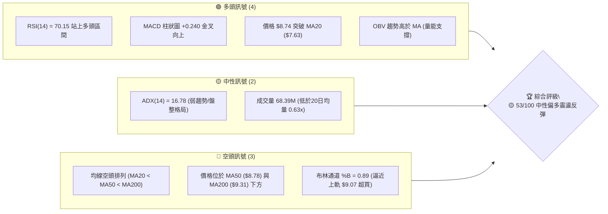
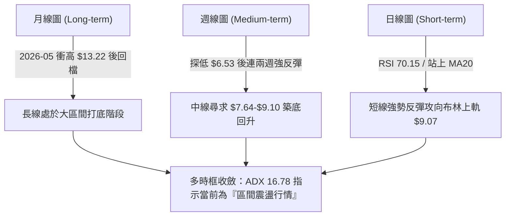
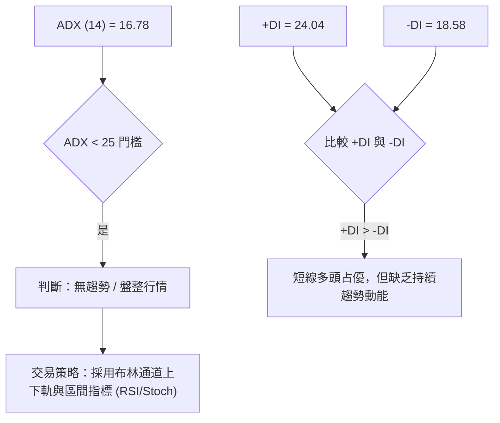
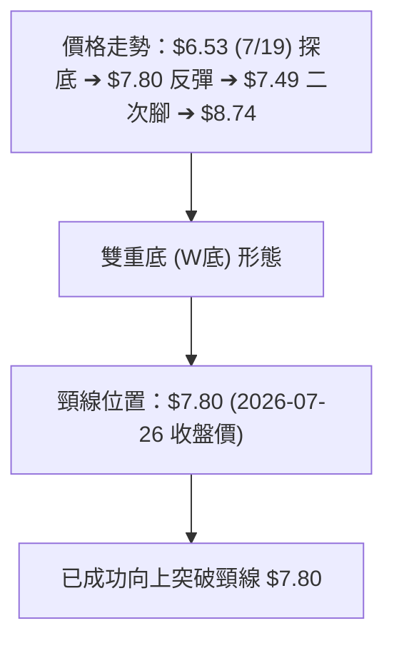
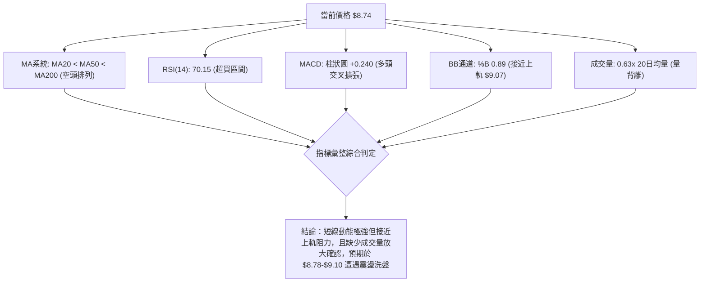
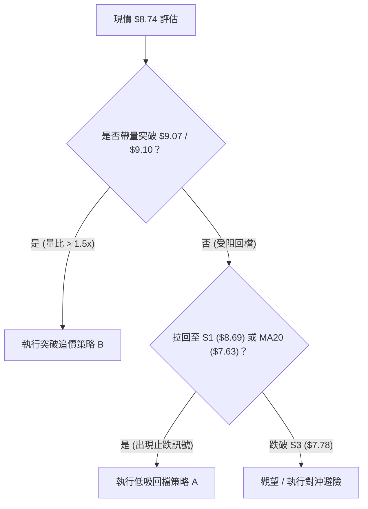
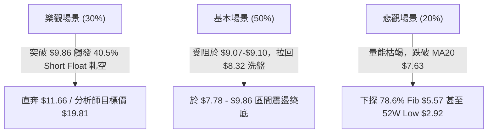

# ONDS 技術分析報告

> **報告日期**：2026-08-07 ｜ **語言**：繁體中文 ｜ **數據來源**：Yahoo Finance ｜ **當前價格**：$8.74

---

## 目錄

| 章節 | 內容 |
|------|------|
| [1. 技術面概覽](#1-技術面概覽) | 訊號儀表板、核心指標、評分卡 |
| [2. 趨勢分析](#2-趨勢分析) | 多時框趨勢、長中短期走勢、ADX解讀 |
| [3. 圖表形態分析](#3-圖表形態分析) | 形態識別、信心度評估、K線組合、目標價 |
| [4. 支撐與阻力](#4-支撐與阻力) | 關鍵價位結構、斐波那契回調位分析 |
| [5. 技術指標深度解讀](#5-技術指標深度解讀) | MA/RSI/MACD/布林通道/成交量量價配合 |
| [6. 動能與波動率](#6-動能與波動率) | 動能評估四象限、ATR波動度、Beta市場風險 |
| [7. 多時框架總結](#7-多時框架總結) | 時框架評分矩陣、多時框收斂結論 |
| [8. 交易策略建議](#8-交易策略建議) | 策略路由、情境劇本、多空進出場與風報比 |
| [9. 風險提示與監控](#9-風險提示與監控) | 關鍵監控Checklist、風險場景與對沖提示 |

---

## 1. 技術面概覽

### 🎯 技術訊號儀表板



### 📊 核心指標速覽表

| 指標類別 | 指標名稱 | 當前數值 | 訊號 | 解讀 |
|----------|----------|----------|------|------|
| **價格** | 當前收盤價 | $8.74 | 🟢 多頭 | 近期從低點 $6.53 強勢反彈，站上 MA20 |
| **均線** | MA20 | $7.63 | 🟢 多頭 | 價格位於 MA20 上方 (+14.51%)，短線支撐強 |
| **均線** | MA50 | $8.78 | 🔴 空頭 | 價格受制於 MA50 下方 (-0.46%)，面臨中軌阻力 |
| **均線** | MA200 | $9.31 | 🔴 空頭 | 長期均線走空，價格位於 MA200 下方 (-6.12%) |
| **動能** | RSI(14) | 70.15 | 🔴 超買 | 進入 70 以上超買區，需留意過熱回檔 |
| **動能** | MACD | +0.071 | 🟢 多頭 | MACD 線穿過訊號線 (-0.169)，柱狀圖擴張 |
| **趨勢** | ADX(14) | 16.78 | 🟡 盤整 | ADX < 25，顯示當前為無趨勢之區間震盪行情 |
| **波動** | ATR(14) | $0.75 | 🟡 中高 | 每日波動占股價 8.60%，具備典型高 Beta 特徵 |
| **通道** | 布林通道 | $6.20 - $9.07 | 🟡 上軌 | 現價 $8.74 接近上軌 $9.07，%B 為 0.89 |

### 🏆 技術評分卡

```
╔══════════════════════════════════════════════════════════════════╗
║                   技術評分卡 — ONDS (2026-08-07)                 ║
╠══════════════════════════════════════════════════════════════════╣
║ 趨勢強度 (ADX)     ███████░░░░░░░░░░░░░  35/100  🟡 盤整無明確趨勢║
║ 短期動能 (RSI/MACD) ████████████████░░░░  80/100  🟢 短線反彈動能強║
║ 支撐穩定度 (S1-S3)  █████████████░░░░░░░  65/100  🟢 低點 $6.53 築底║
║ 成交量配合度       ██████████░░░░░░░░░░  50/100  🟡 縮量反彈量能偏弱║
║ 形態完整度         ████████████░░░░░░░░  60/100  🟢 築底完成反彈中║
║ 均線結構 (MA)      ███████░░░░░░░░░░░░░  35/100  🔴 仍處空頭排列框架║
╠══════════════════════════════════════════════════════════════════╣
║ 綜合評分           ███████████░░░░░░░░░  53/100  🟡 中性偏多震盪  ║
╚══════════════════════════════════════════════════════════════════╝
```

---

## 2. 趨勢分析

### 🌐 多時框趨勢分析



### 📈 長期趨勢 — 24個月走勢圖（ASCII）

```
ONDS 24個月收盤走勢圖 ($)
$14.00 ┤                                      ● (2026-05 High $13.22)
$12.00 ┤
$10.00 ┤                               ●  ●  ●        ● (2026-04 $10.04)
$8.00  ┤                      ●  ●  ●              ●  ●←現價 $8.74
$6.00  ┤                ●  ●
$4.00  ┤
$2.00  ┤          ●  ●
$0.00  ┼───●──●──●───────────────────────────────────────────────
      24/08   24/12   25/05   25/08   25/12   26-03   26-08 (月份)
```

#### 走勢特徵分析表

| 階段 | 時間區間 | 收盤價變化 | 漲跌幅 | 主要走勢特徵 |
|------|----------|------------|--------|--------------|
| **沉悶打底** | 2024-08 ~ 2024-11 | $0.87 → $0.98 | +12.6% | 1 美元以下低檔打底，成交量稀少 |
| **第一波暴漲**| 2024-12 ~ 2025-01 | $0.98 → $2.56 | +161.2%| 資金湧入帶動估值重估，隨後拉回至 $0.78 |
| **主升段拉升**| 2025-04 ~ 2026-01 | $0.78 → $10.36| +1228.2%| 業務暴增（營收 YoY 1079.9%），股價大幅創高 |
| **高檔震盪** | 2026-02 ~ 2026-05 | $10.08 → $13.22| +31.15%| 創下 52 週高點 $15.28 後出現獲利調節賣壓 |
| **中期拉回** | 2026-05 ~ 2026-07 | $13.22 → $6.53 | -50.6% | 獲利了結與市場避險，於 7/19 摸底 $6.53 |
| **短線反彈** | 2026-07 ~ 2026-08 | $6.53 → $8.74 | +33.8% | 跌深反彈，站回 MA20，挑戰 MA50 與 50% 斐波位 |

### 📊 中期趨勢（週線分析）

從近 20 週數據觀察，ONDS 在 2026 年 7 月 19 日當週落底於收盤價 $6.53（爆出 6.71 億股巨量），隨後於 7 月 26 日當週出現 8.34 億股的驚人換手量並強彈至 $7.80。截至 2026-08-09 當週收在 $8.74，週 RSI 重回 70.2，MACD 柱狀圖轉正 (+0.240)。中期結構顯示 $6.53–$7.26 具備強烈籌碼支撐，唯面臨上方 $9.10（50% 斐波那契位）與 $9.86（阻力 R1）的重壓。

### ⚡ 趨勢強度評估（ADX 解讀）



#### ADX 趨勢強度指標對照

| 指標項 | 數據 | 門檻基準 | 趨勢狀態 | 交易含義 |
|--------|------|----------|----------|----------|
| **ADX** | **16.78** | < 25 | 弱趨勢 / 盤整行情 | 避免追高殺跌，以高拋低吸區間操作為主 |
| **+DI** | **24.04** | > 20 | 多頭力道佔優 | 短線買盤力道強於賣盤 |
| **-DI** | **18.58** | < 20 | 空頭力道衰退 | 賣壓暫時受抑，支撐區買盤積極 |

---

## 3. 圖表形態分析

### 🔍 形態識別系統



#### 圖表形態信心度評估表

| 形態名稱 | 信心度 | 判斷依據（引用數據） | 完成度 | 目標價（附計算式） |
|----------|--------|----------------------|--------|--------------------|
| **W底 (雙底)** | **65%** | 第一腳 $6.53 (7/19)，第二腳 $7.49 (8/02)，突破頸線 $7.80 | 100% | **$9.07**<br>（頸線 $7.80 + 形態高度 [$7.80-$6.53=$1.27] = $9.07） |
| **下降通道突破** | **60%** | 自 $13.22 下降軌道突破，站上 MA20 ($7.63) | 85% | **$9.86**<br>（挑戰波段高點阻力 R1） |
| **頭肩頂/底** | **30%** | 數據不足以支撐大級別頭肩幾何形態 | 0% | 訊號不足，僅做指標型解讀 |

*註：W底最小測幅目標價 $9.07 剛好精準重合布林通道上軌 ($9.07)。*

### 🕯️ 重要 K 線形態分析（近 5 週）

| 週別收盤日 | 收盤價 | 週K線形態 | 技術解讀 | 多空訊號 |
|------------|--------|-----------|----------|----------|
| 2026-07-12 | $7.26 | 止跌小陽線 | RSI 回落至 28.0 進入超賣，止跌訊號初現 | 🟡 中性 |
| 2026-07-19 | $6.53 | 長下影探底線 | 巨量 6.71 億股換手，奠定 52 週低點附近之強支撐 | 🟢 多頭打底 |
| 2026-07-26 | $7.80 | 大陽線突破 | 爆出 8.34 億股近兩月最大量，強勢吞噬前週陰線 | 🟢 強勢買訊 |
| 2026-08-02 | $7.49 | 回檔洗盤小陰 | 縮量拉回測試頸線 $7.80 附近支撐，守住低點 | 🟡 蓄勢整理 |
| 2026-08-09 | $8.74 | 中陽線突破 | 站上 $8.00 關卡與 MA20，MACD 柱狀圖放大至 +0.240 | 🟢 多頭續強 |

### 📉 ASCII 走勢形態示意圖

```
ONDS 近期 W 底築底突破示意圖
$9.86 ┤                                            [阻力 R1]
$9.07 ┤─────────────────────────────────────────── [W底測幅目標 / 布林上軌]
$8.74 ┤                                      ● (現價)
$7.80 ┤                        ● (頸線突破) ╱ 
$7.49 ┤                     ╱    ● (二腳)  ╱
$7.26 ┤            ●       ╱
$6.53 ┤───────────● (一腳)╱─────────────────────── [強支撐 S3 區域]
      └───────────┬────────────┬───────────┬──────
               2026-07-19   07-26       08-02    08-09
```

---

## 4. 支撐與阻力

### 🗺️ 關鍵價位分布圖（Unicode）

```
ONDS 關鍵價位結構分布圖
═════════════════════════════════════════════════════════════════════
$15.28 ║████████████████████████████████████████████║ 52週高點 (0.0% Fib)
$12.36 ║████████████████████████████                ║ 23.6% 斐波那契回調位
$11.66 ║████████████████████████                    ║ 強阻力 R3
$10.56 ║████████████████████                        ║ 38.2% 斐波那契回調位
$10.37 ║██████████████████                          ║ 阻力 R2
$9.86  ║██████████████                              ║ 關鍵阻力 R1
$9.10  ║██████████                                  ║ 50.0% 斐波那契 / BB上軌 $9.07
$8.74  ╠════════════════════════════════════════════╣ ◄ 當前價格 ($8.74)
$8.69  ║▓▓▓▓▓▓▓▓▓▓▓▓▓▓▓▓▓▓▓▓▓▓▓▓▓▓▓▓▓▓▓▓            ║ 近期支撐 S1 (MA50 $8.78 附近)
$8.32  ║████████████████████████████████            ║ 支撐 S2 (MA10 $8.04 上方)
$7.78  ║████████████████████████████████████████    ║ 關鍵強支撐 S3 (MA20 $7.63 附近)
$7.64  ║██████████████████████████████████████████  ║ 61.8% 斐波那契回調位
$5.57  ║████████████████████████████████████████████║ 78.6% 斐波那契回調位
$2.92  ║████████████████████████████████████████████║ 52週低點 (100.0% Fib)
═════════════════════════════════════════════════════════════════════
```

### 🚧 阻力位分析表

| 阻力級別 | 價位 | 形成原因 | 突破難度 | 重要性 |
|----------|------|----------|----------|--------|
| **R1** | **$9.86** | 近一年波段高點聚類 / 接近 MA120 ($9.46) 與 MA200 ($9.31) | 🔴 高 | **極高**。突破此區方能確認中長期轉多 |
| **R2** | **$10.37**| 近一年高點解套賣壓區 / 38.2% 斐波位 ($10.56) 下方 | 🟡 中高 | **中等**。2026年3-4月頻繁交會的密集交易區 |
| **R3** | **$11.66**| 波段高點聚類 / 邁向 23.6% 斐波位 ($12.36) 前哨站 | 🔴 高 | **次要**。屬多頭強勢噴發後之中期目標 |

### 🛡️ 支撐位分析表

| 支撐級別 | 價位 | 形成原因 | 守住機率 | 重要性 |
|----------|------|----------|----------|--------|
| **S1** | **$8.69** | 近一年波段低點聚類 / 貼近 MA50 ($8.78) | 🟢 65% | **短線關鍵**。現價 $8.74 緊貼 S1，需守住以維繫反彈 |
| **S2** | **$8.32** | 近一年波段低點聚類 / 高於 MA10 ($8.04) | 🟢 75% | **中等**。若拉回可提供第一道緩衝 |
| **S3** | **$7.78** | 近一年強支撐聚類 / 貼近 MA20 ($7.63) 與 61.8% 斐波位 ($7.64) | 🟢 85% | **核心防線**。W底頸線與 20日均線交會，多頭不可失守 |

### 📐 斐波那契回調位分析（以 52週區間 $2.92 → $15.28 計算）

```
100.0% ($2.92) ──────── 78.6% ($5.57) ──────── 61.8% ($7.64) ───[現價 $8.74]─── 50.0% ($9.10) ──────── 38.2% ($10.56)
```

- **目前價格位置**：當前價格 **$8.74** 落於 **61.8% ($7.64)** 與 **50.0% ($9.10)** 回調位之間。
- **技術意義解讀**：
  1. 股價先前落至 $6.53，已刺穿黃金分割 61.8% ($7.64) 支撐，但隨後強勢拉回並站穩 $7.64 之上，說明 61.8% 位階具備極強的長線買盤防守意願。
  2. 現價正向 50.0% 回調位 **$9.10** 推進，該位置與布林通道上軌 **$9.07** 高度重合，形成**雙重關鍵阻力關卡**。若能實體突破 $9.10，下一階段目標將直指 38.2% 回調位 **$10.56**。

---

## 5. 技術指標深度解讀

### 🎛️ 指標訊號總覽



### 📈 移動平均線排列分析

| 均線天期 | 當前價位 | 價格相對位置 | 變動幅度 | 趨勢解讀 |
|----------|----------|--------------|----------|----------|
| **MA 5** | $8.47 | 價格上方 | +3.24% | 🟢 短線極強，提供極短線扣抵支撐 |
| **MA 10** | $8.04 | 價格上方 | +8.72% | 🟢 陡峭向上，短線多頭防禦線 |
| **MA 20** | $7.63 | 價格上方 | +14.51% | 🟢 扣抵低價區，MA20 翻揚提供強支撐 |
| **MA 50** | $8.78 | 價格下方 | -0.46% | 🔴 走平微下，當前現價正進行解套測試 |
| **MA 60** | $8.92 | 價格下方 | -1.97% | 🔴 下行中，構成第一道均線壓制 |
| **MA 120**| $9.46 | 價格下方 | -7.65% | 🔴 中長期壓力帶 |
| **MA 200**| $9.31 | 價格下方 | -6.12% | 🔴 長期牛熊分界線 |

- **均線型態**：總體呈現 **MA20 ($7.63) < MA50 ($8.78) < MA200 ($9.31)** 之長線空頭排列，但短線 MA5、MA10、MA20 均已金叉向上，顯示**長線空頭框架下的強烈短線反彈行情**。

### 📉 RSI(14) 分析

- **當前數值**：**70.15** 🔴（進入超買區間 >70）
- **進度條**：`██████████████████████████████████████████████████████████████████████████░░░░░░░░░░░░░░░` (70.15%)
- **背離判斷**：無明顯頂背離或底背離。RSI 隨股價由 $6.53 處的超賣區 (21.3) 一路回升至 70.15，屬於標準的動能V型修復。由於 ADX 僅 16.78（盤整市），在盤整市中 RSI 進入 >70 超買區往往意味著**短線衝高接近區間頂部，拉回機率上升**。

### 📊 MACD(12,26,9) 訊號解讀

- **MACD 線**：`+0.071`
- **Signal 線**：`-0.169`
- **柱狀圖 (Histogram)**：`+0.240` 🟢（看多）
- **解讀**：MACD 線已由負轉正穿越 Signal 線，柱狀圖正值持續放大至 +0.240，顯示多頭控盤力道正處於近兩個月來的最強階段。

### 📦 布林通道分析

```
ONDS 布林通道軌道圖
$9.07 ┤─────────────────────────────────────────── BB 上軌 (阻力)
$8.74 ┤                                      ●     現價 (%B = 0.89)
$7.63 ┤─────────────────────────────────────────── BB 中軌 (MA20 支撐)
$6.20 ┤─────────────────────────────────────────── BB 下軌 (強支撐)
```

- **布林上軌**：$9.07
- **布林中軌 (MA20)**：$7.63
- **布林下軌**：$6.20
- **%B 指標**：`0.89`（接近上軌 1.0）
- **解讀**：股價正貼近布林通道上軌 $9.07 運作，通道寬度開始擴張。若無法放量大陽線突破 $9.07，技術面將回歸中軌 $7.63 尋求支撐。

### 💹 成交量分析（量價配合度）

- **最新成交量**：68,387,561 股
- **20 日均量**：109,110,953 股（**量比 0.63x** 🟡）
- **50 日均量**：89,715,433 股
- **OBV 趨勢**：OBV > MA，累積能量線高於均線，顯示築底期間有主力資金隱蔽吸籌。
- **量價背離提示**：股價從 $7.49 攻至 $8.74 時，最新成交量僅約 20 日均量的 63%，呈現「價漲量縮」的量價背離現象。多頭若要進一步攻破 $9.10 50% 斐波位與 R1 $9.86，補量至 1 億股以上為必要條件。

---

## 6. 動能與波動率

### ⚡ 動能評估四象限

```
           強動能 (High Momentum)
                 │
                 │     Q3: 高風險高收益
                 │     [ONDS 當前位置]
                 │     RSI 70.15 / MACD +0.240
                 │     Beta 2.75 / ATR 8.6%
 ────────────────┼─────────────────
                 │
  低波動 (Low Vol)│     高波動 (High Vol)
                 │
                 │
           弱動能 (Low Momentum)
```

| 象限 | 動能與波動特徵 | 股票當前歸屬 | 策略涵義 |
|------|----------------|--------------|----------|
| **Q1** | 強動能 / 低波動 | ❌ | 穩定趨勢型，適合重倉趨勢追蹤 |
| **Q2** | 弱動能 / 低波動 | ❌ | 盤整蓄勢型，適合區間網格交易 |
| **Q3** | **強動能 / 高波動** | **✓ (ONDS)** | **短線爆發力強，但甩轎風險大，須嚴格控制倉位與止損** |
| **Q4** | 弱動能 / 高波動 | ❌ | 探底破位型，應堅決避開 |

### 📊 ATR 波動率分析

- **ATR(14)**：**$0.75**（佔當前股價 8.74 的 **8.60%**）
- **交易應用**：
  - **日內波動區間**：預期每日正常價格波幅約在 $\pm \$0.75$ 之間。
  - **動態止損設定**：建議採用 1.5 倍 ATR 作為進場後的移動止損距離：
    $$\text{止損距離} = 1.5 \times \$0.75 = \$1.125$$

### 📐 Beta 與市場相關性

- **Beta 係數**：**2.75**（極高波動性）
- **Short % Float**：**40.5%**（融券賣空比例極高，空頭回補風險/軋空潛力極大）
- **解讀**：Beta 高達 2.75 意味著大盤（如 S&P500 或納斯達克）上漲 1% 時，ONDS 平均變動 2.75%。搭配 40.5% 的高 Short Float，一旦突破關鍵阻力 R1 ($9.86)，極易引發劇烈的**空頭擠壓（Short Squeeze）**行情。

---

## 7. 多時框架總結

### 📋 時框架評分表

| 時框架 | 趨勢方向 | 動能指標 | 均線排列 | 形態結構 | 綜合評分 | 建議 |
|--------|----------|----------|----------|----------|----------|------|
| **月線 (Long)** | 🟡 震盪 | 🟡 中性 (RSI ~55) | 🔴 空頭 | 52週高檔拉回打底 | **45/100** | 觀察 $7.64 支撐 |
| **週線 (Medium)**| 🟢 反彈 | 🟢 偏多 (RSI 70.2) | 🔴 空頭 | W底築底第2腳完成 | **55/100** | 逢低佈局，留意壓位 |
| **日線 (Short)** | 🟢 強勢 | 🔴 超買 (RSI 70.15) | 🟢 短金叉 | 突破頸線逼近上軌 | **60/100** | 勿追高，等待拉回 |

### 🔲 綜合訊號矩陣

```
           日線 (Short-term)
             多頭 (Bullish)
                  │
  週線 (Mid)      │    [時框共振區]
  多頭 (Bullish)  │    ONDS 短週線共振反彈，但月線仍受壓
 ─────────────────┼─────────────────
                  │
  月線 (Long)     │
  空頭/盤整       │    長線均線空頭 ($9.31) 限制大漲空間
```

### ⚖️ 多時框收斂結論

依據**多時框收斂規則 14**：
1. **行情性質**：ADX = 16.78 (< 25)，確定當前為**盤整/區間震盪行情**。
2. **主導維度**：以日線布林通道上下軌（**$6.20 - $9.07**）及 key Fib 位（**$7.64 - $9.10**）為主要交易區間。
3. **最終收斂方向**：**🟡 中性偏多震盪反彈**。短線動能強勁逼近布林上軌 $9.07 與 MA50 $8.78，但因 RSI 達 70.15 超買且量能未放大（量比 0.63x），**不宜於 $8.74 現價直接追高**。建議等待回檔至 S1 ($8.69) 或 S3 ($7.78/MA20 $7.63) 建立多頭部位，或等待帶量突破 R1 ($9.86) 再行順勢加碼。

---

## 8. 交易策略建議

### 🗺️ 策略決策流程圖



### 🧭 策略路由

> **當前主策略方向 = 🟢 回檔低吸為主 / 突破追價為輔（評分 53/100 中性偏多）**

### 🎯 價格情境階梯（Price Scenarios）

| 觸發條件 | 下一目標 | 後續延伸 | 情境含義 |
|----------|----------|----------|----------|
| **帶量突破 R1 $9.86** | R2 $10.37 | R3 $11.66 | 突破中長線均線反轉，空頭擠壓爆發 |
| **站穩現價區間 ($8.32-$9.07)** | — | — | 於 50% 與 61.8% 斐波位之間箱體震盪 |
| **跌破 S3 $7.78** | Fib 78.6% $5.57| 52W Low $2.92 | W底失敗，重回中長線空頭探底 |

### 📊 情境機率分佈

| 情境 | 機率 | 主要依據 |
|------|------|----------|
| **區間震盪 / 拉回蓄勢** | **50%** | ADX 16.78 顯示無大趨勢，RSI 70.15 超買，量能 0.63x 不足以立刻衝破壓位 |
| **直接突破 R1 上攻** | **30%** | MACD 柱狀圖 +0.240 強勁，高 Short Float (40.5%) 隨時具備軋空潛能 |
| **回落跌破 S3 探底** | **20%** | 均線仍呈空頭排列 (MA200 $9.31)，整體基本面營運利潤率為負 |

### 🟢 主策略詳情

```
主策略路由依據：技術評分 53/100，ADX 16.78 指示區間行情，採用「低吸」與「突破」雙套件。
```

| 策略要素 | 策略 A：回檔低吸多單 (首選) | 策略 B：帶量突破追多 (次選) |
|----------|----------------------------|----------------------------|
| **進場條件** | 股價拉回 S1 $8.69 至 MA20 $7.63 區域止跌 | 實體 K 線帶量突破 R1 $9.86（量比 > 1.5x） |
| **預設進場價**| **$8.32**（S2 與 MA10 交會處） | **$9.90**（突破 R1 $9.86 確認點） |
| **目標價 T1** | **$9.07**（布林上軌 / 50% Fib $9.10）| **$10.37**（阻力 R2 / 38.2% Fib $10.56）|
| **目標價 T2** | **$9.86**（阻力 R1） | **$11.66**（阻力 R3） |
| **止損價格** | **$7.60**（跌破 MA20 $7.63 與 S3 $7.78）| **$9.10**（跌回 50% 斐波位與 BB 上軌下方）|
| **風險報酬比**| **2.14 : 1** <br>（利潤 $9.86-$8.32=$1.54 / 風險 $8.32-$7.60=$0.72） | **2.20 : 1** <br>（利潤 $11.66-$9.90=$1.76 / 風險 $9.90-$9.10=$0.80） |
| **估計成功率**| **65%** | **45%** |
| **建議倉位** | **10% - 15%** | **5% - 8%**（動態加碼） |

### 🔴 反向風險觸發點（對沖提示）

- **觸發條件**：日線收盤價跌破 **$7.63** (MA20) 且 MACD 柱狀圖由正轉負。
- **對沖處置**：多單全部停損離場，短線可考慮利用反向避險工具或輕倉順勢作空至 S3 下方 $5.57。

### ⭐ 整體訊號強度評星

```
做多訊號強度：★★★☆☆  (3.5/5 星 - 動能強勁但受制於壓位)
做空訊號強度：★★☆☆☆  (2.0/5 星 - 短線多頭控盤，作空順應性差)
整體可信度：  ★★★☆☆  (3.5/5 星 - ADX 偏低，屬標準區間波段行情)
```

---

## 9. 風險提示與監控

### ✅ 關鍵監控指標 Checklist

```
╔══════════════════════════════════════════════════════════════════╗
║                   ONDS 技術面關鍵監控 CHECKLIST                 ║
╠══════════════════════════════════════════════════════════════════╣
║ [ ] 1. 價格是否站穩 MA50 ($8.78) 並衝破布林上軌 ($9.07)           ║
║ [ ] 2. 成交量能否由當前 68M 放大至 109M (20日均量 1.0x 以上)     ║
║ [ ] 3. RSI(14) 是否在 >70 區間發生頂背離或回落至 60 以下         ║
║ [ ] 4. MACD 柱狀圖 (+0.240) 是否持續擴張而非收縮                 ║
║ [ ] 5. 股價回檔時能否堅守 MA20 ($7.63) 與 S3 ($7.78) 關鍵防線     ║
║ [ ] 6. 短路空頭比例 (Short % Float 40.5%) 是否出現軋空回補潮     ║
╚══════════════════════════════════════════════════════════════════╝
```

### ⚠️ 風險場景分析



### 🛡️ 風險管理重要提醒

1. **高 Beta (2.75) 倉位控制**：ONDS 單日波幅大（ATR $0.75 / 8.6%），單一個股持倉比例建議控制在總投資組合的 **10% 以內**，避免單日大跳水造成資金重大回撤。
2. **軋空與流動性風險**：空頭佔比高達 40.5%，波動極度劇烈。追高策略（策略B）必須嚴格執行 $9.10 之硬停損，切勿將短線追高單套牢轉為長線持有。

---

## 📋 報告總結

```
╔══════════════════════════════════════════════════════════════════╗
║                   ONDS 技術分析報告總結                          ║
╠══════════════════════════════════════════════════════════════════╣
║ 報告日期：2026-08-07                                             ║
║ 當前價格：$8.74                                                  ║
║ 分析評級：🟡 53/100 中性偏多（區間震盪反彈）                     ║
║                                                                  ║
║ 關鍵技術價位：                                                   ║
║ ├─ 長期趨勢：🔴 空頭排列 (MA200 $9.31 下方)                      ║
║ ├─ 中期趨勢：🟢 W底築底完成，挑戰 50% 斐波位 ($9.10)             ║
║ ├─ 短期趨勢：🟢 動能強勁 (RSI 70.15 / MACD柱 +0.240)，逼近上軌   ║
║ ├─ 關鍵支撐：S1 $8.69 / S2 $8.32 / S3 $7.78 (MA20 $7.63)          ║
║ ├─ 關鍵阻力：R1 $9.86 / R2 $10.37 / R3 $11.66                    ║
║ └─ 法人共識目標價：$19.81 (Strong Buy)                           ║
║                                                                  ║
║ 最優策略組合：                                                   ║
║ 1. 🥇 首選策略：回檔至 S2 $8.32 附近低吸，止損 $7.60，目標 $9.86  ║
║ 2. 🥈 次選策略：帶量突破 R1 $9.86 後追多，止損 $9.10，目標 $10.37 ║
║ 3. 🥉 保守選擇：等待股價於 $8.78 (MA50) 震盪沉澱、量能放大後再進場║
╚══════════════════════════════════════════════════════════════════╝
```

---

> ⚠️ **免責聲明**：本報告為 AI 自動生成之技術分析，所有數據及估算均基於提供的歷史價格資訊。本報告**僅供研究與學術參考**，**不構成任何投資建議**。投資有風險，入市需謹慎。

---

*報告生成時間：2026-08-07 ｜ 數據來源：Yahoo Finance ｜ 分析框架：多時框技術分析*