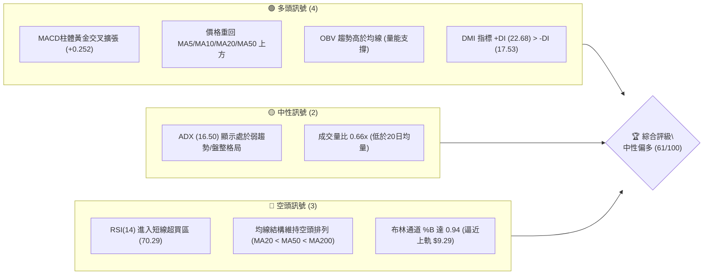
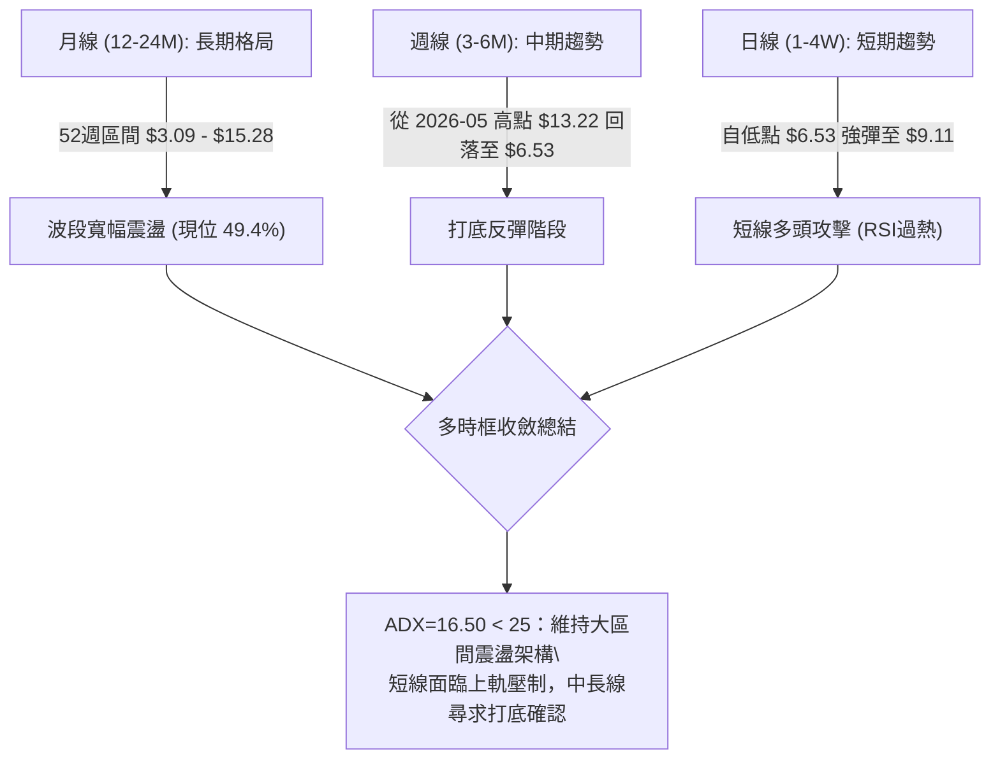
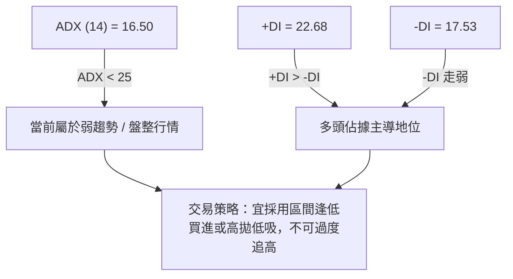
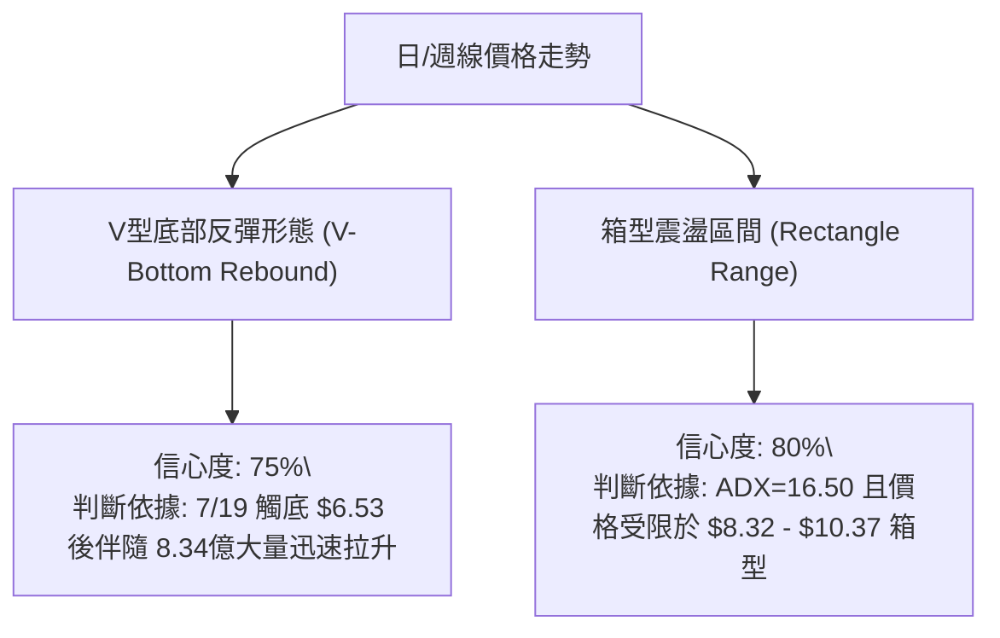
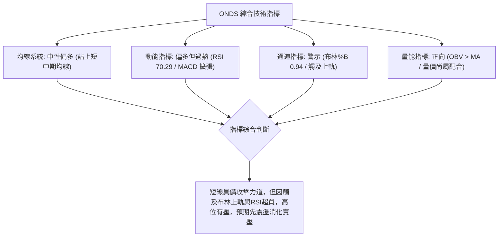
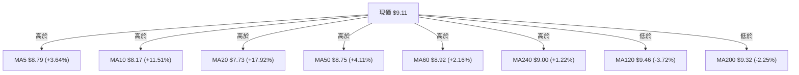
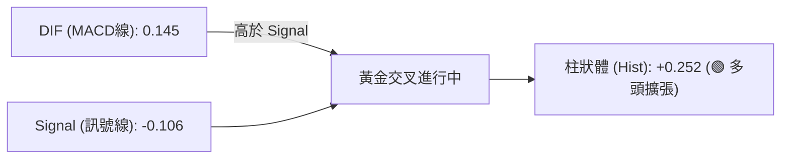
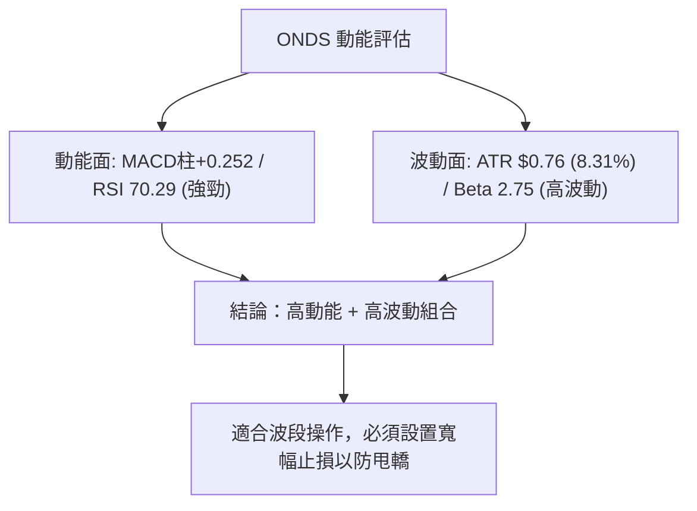
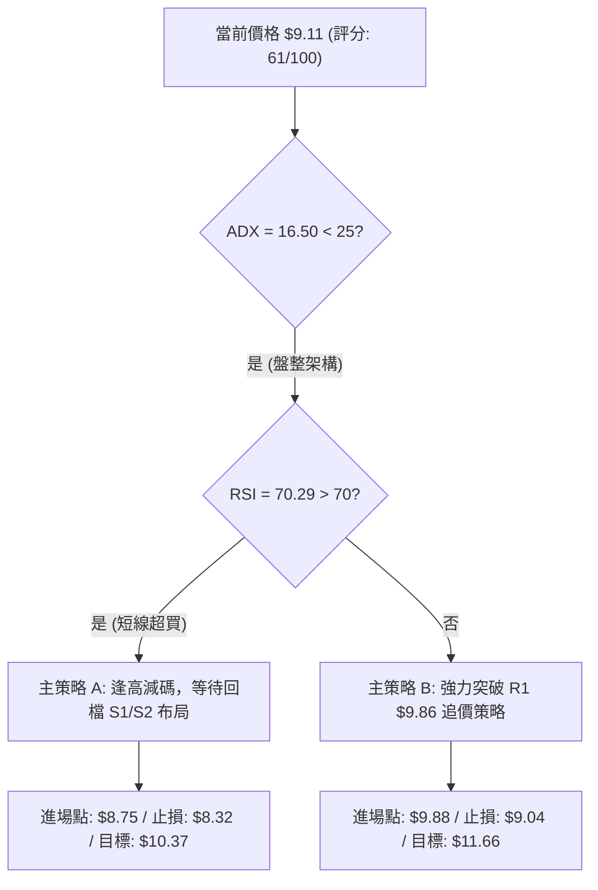
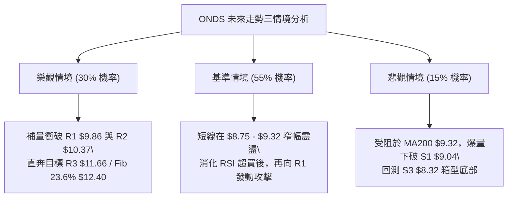

# ONDS 技術分析報告

> **報告日期**：2026-08-08 ｜ **語言**：繁體中文 ｜ **數據來源**：Yahoo Finance ｜ **當前價格**：$9.11

---

## 目錄

| 章節 | 內容 |
|------|------|
| [1. 技術面概覽](#1-技術面概覽) | 訊號儀表板、核心指標、評分卡 |
| [2. 趨勢分析](#2-趨勢分析) | 多時框趨勢、長中短期走勢 |
| [3. 圖表形態分析](#3-圖表形態分析) | 形態識別、K線組合、目標價 |
| [4. 支撐與阻力](#4-支撐與阻力) | 關鍵價位、斐波那契回調 |
| [5. 技術指標深度解讀](#5-技術指標深度解讀) | MA/RSI/MACD/布林/成交量 |
| [6. 動能與波動率](#6-動能與波動率) | 動能評估、ATR、Beta |
| [7. 多時框架總結](#7-多時框架總結) | 時框架評分矩陣 |
| [8. 交易策略建議](#8-交易策略建議) | 多空策略、風險報酬比 |
| [9. 風險提示與監控](#9-風險提示與監控) | 監控指標、風險場景 |

---

## 1. 技術面概覽

### 🎯 技術訊號儀表板



### 📊 核心指標速覽表

| 指標類別 | 指標名稱 | 當前數值 | 訊號 | 解讀 |
|----------|----------|----------|------|------|
| **價格** | 當前價格 | $9.11 | 🟢 | 站上多條短中期均線，短線強勢反彈 |
| **均線** | MA20 | $7.73 | 🟢 | 價格在 MA20 上方 (+17.92%) |
| **均線** | MA50 | $8.75 | 🟢 | 價格在 MA50 上方 (+4.11%) |
| **均線** | MA200 | $9.32 | 🔴 | 價格在 MA200 下方 (-2.25%)，面臨長線壓制 |
| **動能** | RSI(14) | 70.29 | 🔴 | 短線過熱，進入超買區 (>70) |
| **動能** | MACD | 0.145 | 🟢 | 柱狀體 +0.252，多頭動能持續擴張 |
| **波動** | ATR(14) | $0.76 | 🟡 | 日內波動率 8.31%，屬於中高波動個股 |
| **通道** | 布林 %B | 0.94 | 🔴 | 逼近布林上軌 ($9.29)，短線面臨回檔壓力 |
| **趨勢** | ADX(14) | 16.50 | 🟡 | ADX < 25，屬於無明確主趨勢的寬幅盤整 |

### 🏆 技術評分卡

```
╔══════════════════════════════════════════════════════════════╗
║                技術評分卡 — ONDS (2026-08-08)               ║
╠══════════════════════════════════════════════════════════════╣
║ 趨勢強度      ▓▓▓▓▓▓▓▓░░░░░░░░░░░░  40/100  🟡 弱趨勢/盤整   ║
║ 動能指標      ▓▓▓▓▓▓▓▓▓▓▓▓▓▓▓░░░░░  75/100  🟢 強勁反彈動能 ║
║ 支撐穩定度    ▓▓▓▓▓▓▓▓▓▓▓▓▓░░░░░░░  65/100  🟢 S1 $9.04 守穩 ║
║ 成交量配合    ▓▓▓▓▓▓▓▓▓▓▓░░░░░░░░░  55/100  🟡 量能略顯不足 ║
║ 形態完整度    ▓▓▓▓▓▓▓▓▓▓▓▓▓░░░░░░░  65/100  🟡 區間震盪築底 ║
║ 均線排列      ▓▓▓▓▓▓▓▓▓░░░░░░░░░░░  45/100  🔴 MA200 壓制    ║
╠══════════════════════════════════════════════════════════════╣
║ 綜合評分      ▓▓▓▓▓▓▓▓▓▓▓▓░░░░░░░░  61/100  🟢 中性偏多     ║
╚══════════════════════════════════════════════════════════════╝
```

---

## 2. 趨勢分析

### 🌐 多時框趨勢分析



### 📈 長期趨勢 — 12個月走勢圖（Unicode）

```
ONDS 月線歷史收盤走勢圖（2025-08 至 2026-08）
價格軸 ($)
$15.00 ┤                                      ● (52W High $15.28)
$13.00 ┤                               ●
$11.00 ┤                      ●
$9.00  ┤               ●  ●       ●               ●←現價 $9.11
$7.00  ┤       ●  ●  ●       ●               ●
$5.00  ┤    ●
$3.00  ┤                                        (52W Low $3.09)
       └────┬──┬──┬──┬──┬──┬──┬──┬──┬──┬──┬──┬───
           08 09 10 11 12 01 02 03 04 05 06 07 08 (月份)
```

**走勢特徵分析表格**：

| 階段區間 | 價格變動 | 漲跌幅 | 主要技術特徵與驅動因素 |
|----------|----------|--------|------------------------|
| **2025/08 - 2025/09** | $5.86 → $7.72 | +31.7% | 初級築底完成，成交量開始溫和放大 |
| **2025/10 - 2026/01** | $6.44 → $10.36 | +60.9% | 主升段推進，多頭排列成形，攻克單點兩位數 |
| **2026/02 - 2026/04** | $10.08 → $10.04 | -0.4% | 高位箱型震盪，多空在 $9.00-$10.50 進行換手 |
| **2026/05** | $10.04 → $13.22 | +31.7% | 爆發性拉升，創下 52 週高點 $15.28 後拉回 |
| **2026/06 - 2026/07** | $8.24 → $7.49 | -9.1% | 深幅回檔修正，最低探至 $6.53 (2026-07-19) |
| **2026/08 (至今)** | $7.49 → $9.11 | +21.6% | 強勢 V 型反彈，重新站上 MA20 與 MA50 |

### 📊 中期趨勢（週線分析）

從近 20 週數據觀察，ONDS 在 2026 年 5 月底爆出 5.67 億股大量創下 $13.22 收盤高點後，展開連續 7 週的急遽修正，於 2026 年 7 月 19 日當週下探至 $6.53 低點，此處剛好獲得強烈買盤支撐。

隨後於 2026 年 7 月底爆出 8.34 億股近半年最大成交量，促成極為強勁的底部反轉。目前週線 MACD 柱狀體已轉正至 +0.252，週 RSI 回升至 70.3，顯示中期動能已從悲觀修正轉為多頭主導。

```
週線壓力與支撐結構示意圖：
$12.40 ─── [斐波那契 23.6% 重壓區] 
$10.37 ─── [波段阻力 R2 / 週線轉折高點]
$9.86  ─── [波段阻力 R1 / 上檔主要解套賣壓]
$9.18  ─── [斐波那契 50.0% 中樞軸] ◄ 現價 $9.11
$9.04  ─── [波段支撐 S1 / 核心強弱分界線]
$8.32  ─── [波段支撐 S3 / MA20 支撐區]
```

### ⚡ 趨勢強度評估（ADX 解讀）



**ADX 趨勢強度對照解讀**：
*   **ADX < 20 (當前 16.50)**：市場缺乏明確的方向性單邊趨勢，價格容易在通道上下軌之間進行箱型震盪。
*   **+DI與-DI差距**：+DI (22.68) 高於 -DI (17.53) 約 5.15 個點位，表示在盤整格局中，短線多頭力量相對強於空頭。

---

## 3. 圖表形態分析

### 🔍 形態識別系統



**形態信心度評估表**：

| 形態類型 | 信心度 | 判斷依據（引用數據） | 完成度 | 目標價（附計算式） |
|----------|--------|----------------------|--------|--------------------|
| **V型底部反彈** | 75% | 自 7/19 低點 $6.53 強彈至 $9.11，週 MACD 柱轉正 (+0.252) | 85% | 低點 $6.53 + 形態高度 ($9.04 - $6.53 = $2.51) = **$11.55** |
| **箱型震盪築底** | 80% | ADX (16.50) < 25，波段低點 S1 ($9.04) 與波段高點 R2 ($10.37) 形成明確區間 | 70% | 突破箱頂 $10.37 + 箱高 ($10.37 - $8.32 = $2.05) = **$12.42** |

### 🕯️ 重要K線形態分析

| 日期/期間 | 收盤價 | K線形態 | 技術解讀 | 訊號強度 |
|-----------|--------|---------|----------|----------|
| **2026-07-19 當週** | $6.53 | 長下影鎚頭線 | 探底至 $6.53 獲得極強買盤支撐，長下影線確立階段性底部 | 🟢 強烈看多 |
| **2026-07-26 當週** | $7.80 | 大陽線吞噬 | 爆出 8.34 億股超大成交量，一舉吞噬前兩週陰線，完成底部反轉 | 🟢 強烈看多 |
| **2026-08-09 當週** | $9.11 | 中陽線突破 | 連續突破 MA20 ($7.73) 與 MA50 ($8.75)，短線多頭維持強勁攻擊 | 🟢 看多 |

### 📉 ASCII 走勢形態示意圖

```
ONDS V型反彈與箱型突破示意圖
價位 ($)
$10.37 ├─────────────────────────────── [箱型上軌 / R2 阻力區]
$9.86  ├─────────────────▲───────────── [波段阻力 R1]
$9.18  ├───────────────●─┼───────────── [現價 $9.11 / Fib 50%]
$9.04  ├──────────────/──┼───────────── [箱型中樞 / S1 支撐區]
$8.32  ├─────────────/───┴───────────── [箱型下軌 / S3 支撐區]
$6.53  ├────────────● (7/19 底部)
       └───────────────────────────────
```

### 🎯 形態目標價計算

1.  **V型反彈基本目標**：
    *   計算公式：$\text{頸線/轉折點} (S1: \$9.04) + \text{形態深度} (\$9.04 - \$6.53 = \$2.51) = \$11.55$
    *   對應技術阻力位：接近波段阻力 **R3 ($11.66)**。

2.  **箱型突破延伸目標**：
    *   計算公式：$\text{箱頂} (R2: \$10.37) + \text{箱高} (\$10.37 - \$8.32 = \$2.05) = \$12.42$
    *   對應技術阻力位：精確符合 **斐波那契 23.6% 回調位 ($12.40)**。

---

## 4. 支撐與阻力

### 🗺️ 關鍵價位分布圖（Unicode）

```
ONDS 價位結構與關鍵關卡分布圖
════════════════════════════════════════════════════════════════
$15.28 ║████████████████████████████████║ 52週歷史高點 (0.0% Fib)
$12.40 ║████████████████████            ║ 斐波那契 23.6% 回調位
$11.66 ║████████████████████████        ║ 強阻力 R3 (形態目標)
$10.62 ║██████████████                  ║ 斐波那契 38.2% 回調位
$10.37 ║██████████████████              ║ 關鍵阻力 R2 (箱型上軌)
$9.86  ║████████████                    ║ 近期阻力 R1 (MA120 附近)
$9.32  ║───────── MA200 壓制線 ─────────║ 長期均線壓力 ($9.32)
$9.18  ╠════════ 斐波那契 50.0% ════════╣ ◄ 現價 $9.11 緊鄰於此
$9.04  ║▓▓▓▓▓▓▓▓▓▓▓▓▓▓▓▓                ║ 近期核心支撐 S1
$8.75  ║────────── MA50 支撐線 ─────────║ 中期均線支撐 ($8.75)
$8.69  ║▓▓▓▓▓▓▓▓▓▓▓▓                    ║ 關鍵支撐 S2
$8.32  ║▓▓▓▓▓▓▓▓▓▓▓▓▓▓▓▓▓▓              ║ 強支撐 S3 (箱型下軌)
$7.74  ║████████████████                ║ 斐波那契 61.8% / MA20 ($7.73)
$3.09  ║████████████████████████████████║ 52週歷史低點 (100.0% Fib)
════════════════════════════════════════════════════════════════
```

### 🚧 阻力位分析表

| 阻力級別 | 價位 | 形成原因 | 突破難度 | 重要性 |
|----------|------|----------|----------|--------|
| **R1** | **$9.86** | 近一年波段高點聚類、接近 MA120 ($9.46) 上方賣壓 | 🟡 中等 | 短線多頭衝刺的第一道實質關卡 |
| **R2** | **$10.37** | 近一年波段高點聚類、整數心理關卡、前期解套賣壓區 | 🔴 較高 | 決定能否開啟中期多頭主升段的關鍵 |
| **R3** | **$11.66** | 波段高點聚類、V型反彈形態推算目標價附近 | 🔴 極高 | 多頭波段攻勢的終極擴展目標 |

### 🛡️ 支撐位分析表

| 支撐級別 | 價位 | 形成原因 | 守住機率 | 重要性 |
|----------|------|----------|----------|--------|
| **S1** | **$9.04** | 近一年波段低點聚類、當前日線密積支撐區 | 🟢 75% | 短線多空強弱分界線，失守將短線回檔 |
| **S2** | **$8.69** | 波段低點聚類、緊鄰 MA50 ($8.75) 均線護盤區 | 🟢 80% | 中期多頭回檔的最佳防守買點 |
| **S3** | **$8.32** | 近一年波段低點聚類、箱型震盪底部 | 🟢 90% | 強烈底部支撐，失守則本輪反彈宣告結束 |

### 📐 斐波那契回調位分析

依據 52 週高低點區間（$3.09 → $15.28）精確計算：

*   **0.0% (52W High)**：$15.28
*   **23.6%**：$12.40
*   **38.2%**：$10.62
*   **50.0%**：**$9.18** ◄ **現價 $9.11 正處於此關鍵分界點下方 0.7% 處**
*   **61.8%**：$7.74（與 MA20 $7.73 完美重合，形成黃金支撐區）
*   **78.6%**：$5.69
*   **100.0% (52W Low)**：$3.09

**位階解讀**：價格目前精確壓制在 50.0% 黃金回調位 ($9.18) 下方，若能有效突破 $9.18 並站穩，上方空間將直接打開至 38.2% ($10.62) 及阻力位 R2 ($10.37)。下行方面，61.8% 回調位 ($7.74) 與 MA20 ($7.73) 提供了極強的防禦屏障。

---

## 5. 技術指標深度解讀

### 🎛️ 指標訊號總覽



### 📈 移動平均線排列分析



**均線狀態說明**：
*   **長線排列**：MA20 ($7.73) < MA50 ($8.75) < MA200 ($9.32)，大結構仍屬於典型的**空頭排列**。
*   **短線突破**：現價 $9.11 一舉穿透 MA5、MA10、MA20、MA50、MA60 與 MA240，形成短線多頭強勢反攻。
*   **前方壓制**：上方僅剩 MA200 ($9.32) 與 MA120 ($9.46) 兩條長線均線，這兩條均線落在 $9.32 - $9.46 區域，將是多頭必須克服的強壓力帶。

### 📉 RSI(14) 分析

*   **當前數值**：**70.29** 🔴 （進入超買區 >70）
*   **進度條**：`███████████████░░░░░ 70.29%`
*   **背離分析**：對比 2026 年 5 月高點（價格 $13.22，RSI 70.6）與當前（價格 $9.11，RSI 70.3），RSI 在較低的價位即達超買，反映本次短線反彈速率極快，但**無明顯頂背離或底背離**現象。
*   **操作意涵**：RSI > 70 提示短線追高風險增加，隨時可能出現指標修復型的短線拉回。

### 📊 MACD(12/26/9) 訊號解讀



*   **MACD 線**：0.145
*   **Signal 線**：-0.106
*   **MACD 柱狀體**：+0.252 🟢
*   **訊號解讀**：MACD 線已由負轉正並大幅超越訊號線，柱狀體維持綠色擴張狀態，顯示由 7 月低點發動的反彈動能十分強勁，多頭控盤意圖明確。

### 📦 布林通道分析

```
ONDS 日線布林通道位置示意圖
 Upper Band (上軌)  : $9.29  ─────── [觸及上軌壓力區]
                     ▲
 Current Price (現價): $9.11  ─────── [%B = 0.94]
                     ▼
 Middle Band (中軌) : $7.73  ─────── [MA20 核心支撐]
 Lower Band (下軌)  : $6.16  ─────── [超賣下限]
```

*   **通道寬度**：上軌 $9.29 - 下軌 $6.16 = $3.13
*   **%B 指標**：0.94（極度接近上軌 1.0）
*   **通道狀態**：價格貼近布林上軌 ($9.29) 運行，在 ADX < 25 的盤整格局中，通常意味著**區間上軌反壓顯現**，直接強行突破上軌的機率較低，更可能沿上軌進行震盪拉回。

### 💹 成交量分析（量價配合度）

*   **最新成交量**：72,567,700 股
*   **20日均量**：109,423,810 股（量比 0.66x）
*   **50日均量**：89,320,284 股
*   **OBV 趨勢**：OBV > MA (能量潮高於其移動平均線)
*   **量價解讀**：最新單日成交量（7,256萬股）較 20 日均量縮減，呈現「價漲量縮」的短線背離特徵；但從中線 OBV 來看，能量潮依舊維持在均線之上，說明底部主力資金並未退場，量能整體仍可支撐股價維繫在高位。

---

## 6. 動能與波動率

### ⚡ 動能評估

| 象限區分 | 動能強度 | 波動率 | 當前狀態 | 評估與策略 |
|----------|----------|--------|----------|------------|
| **Q1 (最佳攻擊)** | 強 (MACD+) | 低 (ATR↓) | - | 穩定單邊趨勢 |
| **Q2 (震盪蓄勢)** | 強 (RSI 70+) | 高 (ATR 8.3%) | **✓ ONDS 當前位置** | **短線爆發力強但波動劇烈，宜等待回擋再佈局** |
| **Q3 (沉悶盤整)** | 弱 (ADX 16.5) | 低 (ATR↓) | - | 資金觀望 |
| **Q4 (修正探底)** | 弱 (MACD-) | 高 (ATR↑) | - | 避開做多 |



### 📊 ATR 波動率分析

*   **ATR(14)**：$0.76
*   **ATR 百分比**：$0.76 / $9.11 = **8.31%**
*   **止損距離建議**：
    *   **緊密止損 (1.0x ATR)**：$0.76 距離 → 止損設於 $9.11 - $0.76 = **$8.35**
    *   **標準止損 (1.5x ATR)**：$1.14 距離 → 止損設於 $9.11 - $1.14 = **$7.97**
    *   **寬鬆止損 (2.0x ATR)**：$1.52 距離 → 止損設於 $9.11 - $1.52 = **$7.59**

### 📐 Beta 與市場相關性

*   **Beta 係數**：**2.75**（屬於高貝塔科技股）
*   **市場相關度解讀**：ONDS 的波動幅度約為大盤（S&P 500）的 2.75 倍。在大盤上漲時具備極高的槓桿爆發力，但在大盤回擋修正時亦面臨顯著的下行風險。

---

## 7. 多時框架總結

### 📋 時框架評分表

| 時框架 | 趨勢方向 | 動能指標 | 均線排列 | 形態結構 | 綜合評分 | 建議操作 |
|--------|----------|----------|----------|----------|----------|----------|
| **日線 (Daily)** | 🟢 短線多頭 | 🔴 RSI 超買 | 🟢 站上MA5/20/50 | 🟢 V型反彈 | **68/100** | 逢高減碼 / 等回檔 |
| **週線 (Weekly)**| 🟡 箱型震盪 | 🟢 MACD擴張 | 🔴 MA200壓制 | 🟡 箱型打底 | **58/100** | 區間操作 |
| **月線 (Monthly)**| 🟡 寬幅整理 | 🟡 中性 | 🟡 中樞位階 | 🟡 52W中位(49.4%) | **55/100** | 長線觀望 |

### 🔲 綜合訊號矩陣

```
╔══════════════════════════════════════════════════════════════╗
║                   多時框架訊號矩陣表                        ║
╠═════════════┬──────────────┬──────────────┬──────────────────╣
║ 維度        │ 日線 (Short) │ 週線 (Medium)│ 月線 (Long)      ║
╠═════════════┼──────────────┼──────────────┼──────────────────╣
║ 趨勢方向    │ 🟢 看多      │ 🟡 中性      │ 🟡 中性          ║
║ 動能狀態    │ 🔴 超買      │ 🟢 看多      │ 🟡 中性          ║
║ 支撐/壓力   │ 🔴 臨上軌R1  │ 🟡 臨Fib 50% │ 🟢 守穩52W低點  ║
║ 量能配合    │ 🟡 略有縮量  │ 🟢 爆量打底  │ 🟡 中規中矩      ║
╚═════════════╧──────────────╧──────────────╧──────────────────╝
```

### ⚖️ 多時框收斂結論

依據多時框收斂規則（ADX = 16.50 < 25，判定當前為**盤整/區間行情**）：
*   **主導時框**：以**日線布林通道 ($6.16 - $9.29)** 與關鍵支撐阻力為主要交易依據。
*   **衝突收斂**：雖然日線多頭動能強勁（MACD 擴張），但因日線 RSI (70.29) 進入超買，且價格觸及布林上軌 ($9.29) 與斐波那契 50% ($9.18)，短線已無直接追高空間。
*   **最終收斂結論**：**中性偏多（波段尋求回檔買點）**。中長線底部已經確立（$6.53），短線宜等待拉回至支撐位 S1 ($9.04) 或 S2 ($8.69) 再進行布局。

---

## 8. 交易策略建議

### 🗺️ 策略決策流程圖



### 🧭 策略路由

**當前主策略方向 = 🟡 中性偏多回檔布局策略（綜合評分 61/100）**

由於當前 ADX 為 16.50（盤整行情），且 RSI 已達 70.29（超買），價格正測試布林上軌 ($9.29) 與 Fib 50% ($9.18) 反壓。主策略拒絕追高，採用**「回檔支撐低吸」**為主，**「帶量突破追價」**為輔。

### 🎯 價格情境階梯（Price Scenarios）

| 觸發條件 | 下一目標 | 後續延伸 | 情境含義 |
|----------|----------|----------|----------|
| **突破阻力 R1 $9.86** | R2 $10.37 | R3 $11.66 | 突破箱型，多頭主升段啟動 |
| **站穩現價區間 ($9.04 - $9.29)** | — | — | 高位震盪消化 RSI 超買賣壓 |
| **跌破支撐 S1 $9.04** | S2 $8.69 | S3 $8.32 | 短線拉回，測試 MA50/MA20 支撐 |

### 📊 情境機率分佈

| 情境 | 機率 | 主要依據 |
|------|------|----------|
| **衝高回擋 / 區間震盪** | **55%** | RSI > 70 超買、布林%B 0.94 觸軌、ADX 16.50 顯示缺乏單邊趨勢 |
| **直接突破 R1 上攻** | **30%** | MACD 柱狀體 (+0.252) 強勢擴張、OBV 趨勢高於均線 |
| **深幅跌破 S2 回探底** | **15%** | MA200 ($9.32) 長線壓制力道過強 |

### 🟢 主策略詳情

所有價位均嚴格引用數據集之關鍵價位與均線數值：

| 策略要素 | 策略 A：回檔支撐逢低買進 (主策略) | 策略 B：突破 R1 順勢追價 (次策略) |
|----------|-----------------------------------|-----------------------------------|
| **策略邏輯** | 利用短線過熱拉回，於 MA50 / S2 布局 | 確認突破 R1 與 MA120 賣壓後追擊 |
| **進場條件** | 價格回檔至 S2 / MA50 附近獲支撐 | 日K收盤價突破 R1 ($9.86) 且量放大 |
| **進場價格** | **$8.75** (精確對應 MA50 均線) | **$9.88** (突破 R1 $9.86 後 2 點) |
| **目標價 T1** | **$9.86** (波段阻力 R1) | **$10.37** (波段阻力 R2) |
| **目標价 T2** | **$10.37** (波段阻力 R2) | **$11.66** (波段阻力 R3) |
| **止損價格** | **$8.32** (精確對應支撐 S3 / 箱底) | **$9.04** (精確對應支撐 S1) |
| **風險報酬比**| **2.58 : 1** (以 T2 計算: $1.62 / $0.43) | **2.12 : 1** (以 T2 計算: $1.78 / $0.84) |
| **預估成功率**| **65%** | **45%** |
| **建議倉位** | **15% - 20%** | **10% - 15%** |

*計算式明細*：
*   **策略 A 風酬比**：上行空間 = $10.37 - $8.75 = $1.62；下行風險 = $8.75 - $8.32 = $0.43。$1.62 / $0.43 = **2.58**。
*   **策略 B 風酬比**：上行空間 = $11.66 - $9.88 = $1.78；下行風險 = $9.88 - $9.04 = $0.84。$1.78 / $0.84 = **2.12**。

### 🔴 反向風險觸發點（對沖提示）

*   **空頭反轉訊號**：若價格無力突破 MA200 ($9.32) 且日內直接跌破 **S1 ($9.04)**，代表短線 V 型反彈動能耗盡。
*   **全面止損訊號**：若收盤價跌破 **S3 ($8.32)**，宣告多頭結構破壞，應全面出清多頭部位觀望。

### ⭐ 整體訊號強度評星

```
做多訊號強度：★★★☆☆  (3/5星 — 動能強但短線過熱)
做空訊號強度：★★☆☆☆  (2/5星 — 均線長線偏空但短線反彈強)
整體可信度：  ★★★★☆  (4/5星 — 多時框指標極度收斂)
```

---

## 9. 風險提示與監控

### ✅ 關鍵監控指標 Checklist

```
╔══════════════════════════════════════════════════════════════╗
║               ONDS 日常交易監控 Checklist                     ║
╠══════════════════════════════════════════════════════════════╣
║ [ ] 1. 價格是否站穩 Fib 50% ($9.18)？                        ║
║ [ ] 2. 日線 RSI(14) 是否拉回至 50-60 健康區間？             ║
║ [ ] 3. 布林通道是否上軌開口放大 ($9.29 突破)？                ║
║ [ ] 4. 成交量能否回升至 20日均量 (1.09億股) 以上？           ║
║ [ ] 5. MACD 柱狀體是否持續維持在 0 以上 (+0.252)？           ║
║ [ ] 6. 價格回檔時是否能在 MA50 ($8.75) 獲得支撐？            ║
╚══════════════════════════════════════════════════════════════╝
```

### ⚠️ 風險場景分析



### 🛡️ 風險管理重要提醒

1.  **高 Beta 股倉位控管**：ONDS 具有 2.75 的高 Beta 值與 8.31% 的日均波動率（ATR $0.76），個股單一部位建議控制在總投資組合 **15% 以內**，切忌開高槓桿。
2.  **隔夜跳空風險**：由於該股 Short Float 達 **40.5%**（空頭回補壓力極大），極易因消息面引發劇烈的空頭擠壓（Short Squeeze）或跳空暴跌，必須嚴格執行停損。
3.  **技術指標修復需求**：當前 RSI(14) 70.29 與布林 %B 0.94 同時發出短線過熱警告，切勿在當前價位（$9.11）進行盲目追高。

---

## 📋 報告總結

```
╔══════════════════════════════════════════════════════════════╗
║                   ONDS 技術分析報告總結                      ║
════════════════════════════════════════════════════════════════
報告日期：2026-08-08
當前價格：$9.11
分析評級：🟢 中性偏多 (評分: 61/100)

關鍵結論：
├─ 長期趨勢：🟡 寬幅箱型整理 (52週區間 $3.09 - $15.28)
├─ 中期趨勢：🟢 底部強勢反彈 (自 $6.53 底部攻克多條均線)
├─ 短期趨勢：🔴 動能強勁但短線過熱 (RSI 70.29 逼近布林上軌 $9.29)
├─ 關鍵支撐：S1 $9.04 / S2 $8.69 / S3 $8.32
├─ 關鍵阻力：R1 $9.86 / R2 $10.37 / R3 $11.66
└─ 分析師目標：$19.81 (平均) / $16.00 (最低) / $25.00 (最高)

最優策略組合：
1. 🥇 最佳機會：等待回檔至 MA50 ($8.75) 附近佈局多單，止損設 S3 ($8.32)
2. 🥈 次選機會：若強勢帶量突破阻力 R1 ($9.86)，可輕倉追價至 R2/R3
3. 🥉 保守選擇：待 RSI 拉回至 50 附近且 ADX 突破 25 形成單邊趨勢後再進場
════════════════════════════════════════════════════════════════
```

---

> ⚠️ **免責聲明**：本報告為 AI 自動生成之技術分析，所有數據及估算均基於提供的歷史價格資訊。本報告**僅供研究與學術參考**，**不構成任何投資建議**。投資有風險，入市需謹慎。

---

*報告生成時間：2026-08-08 ｜ 數據來源：Yahoo Finance ｜ 分析框架：多時框技術分析*