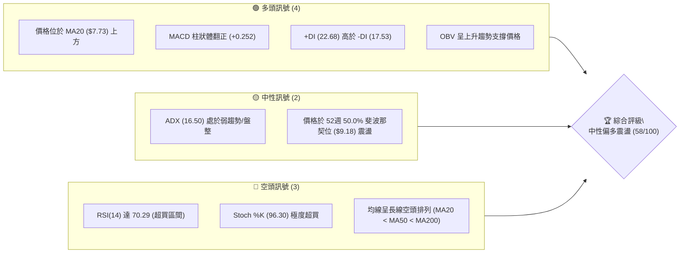
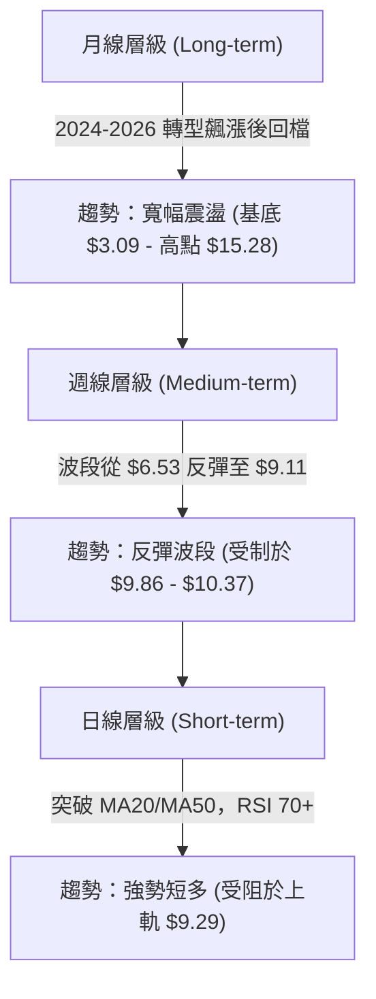
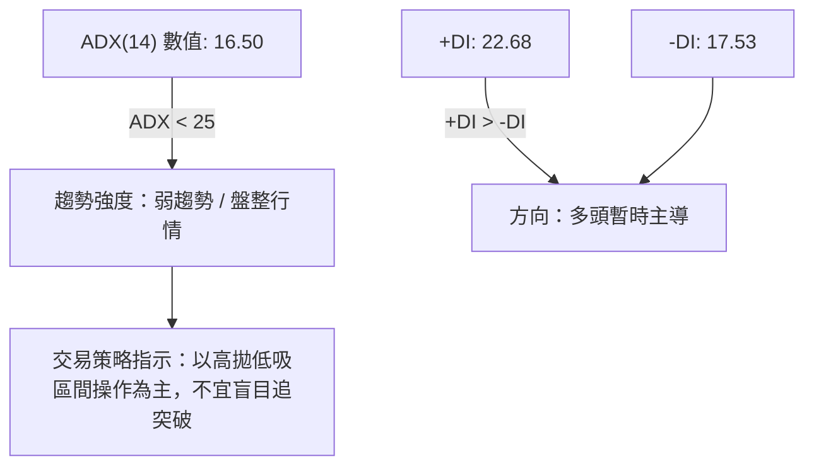
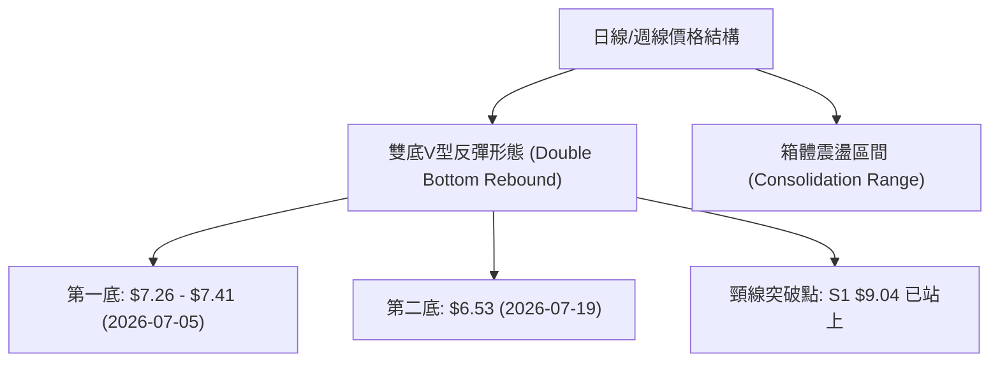
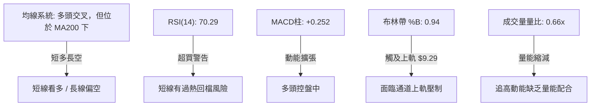
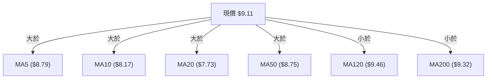
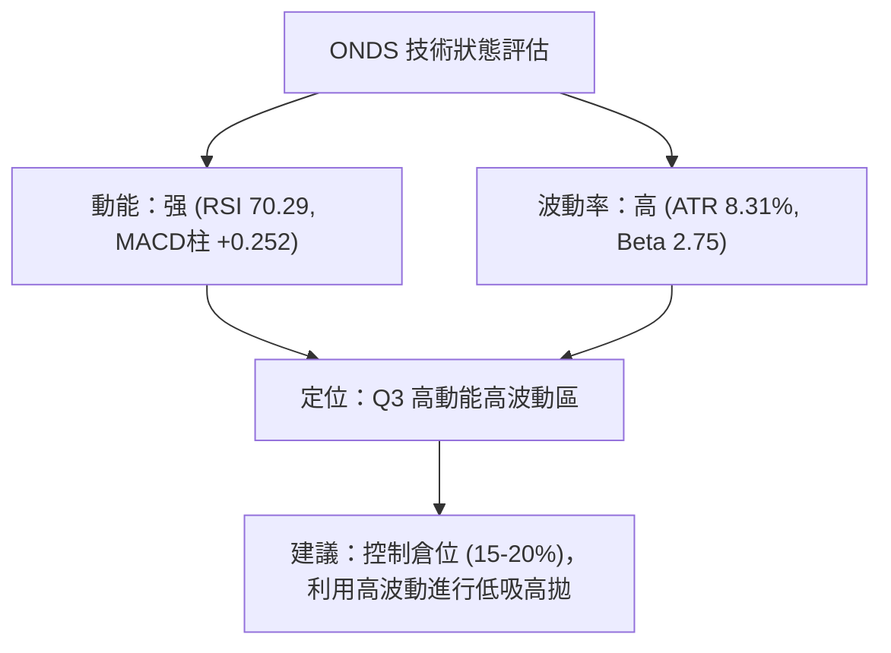
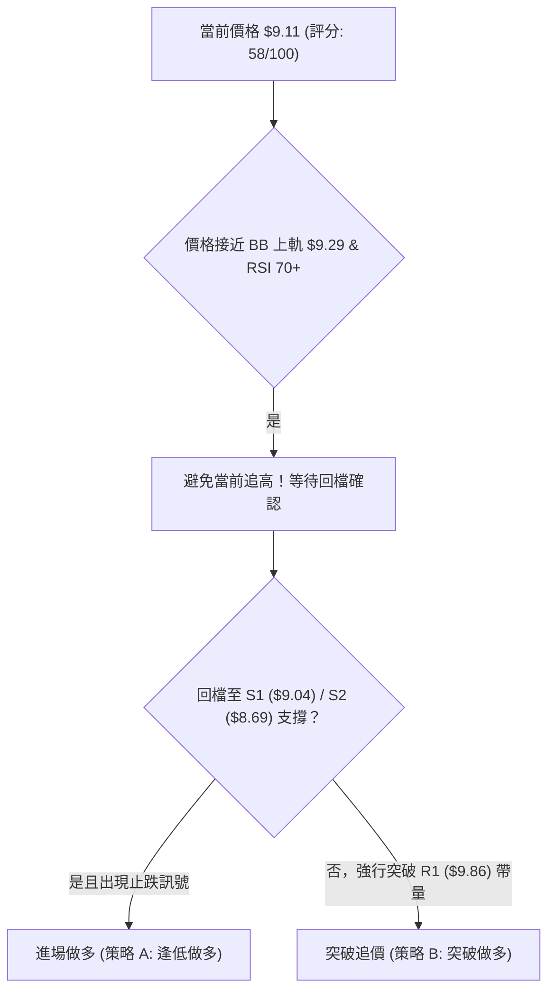
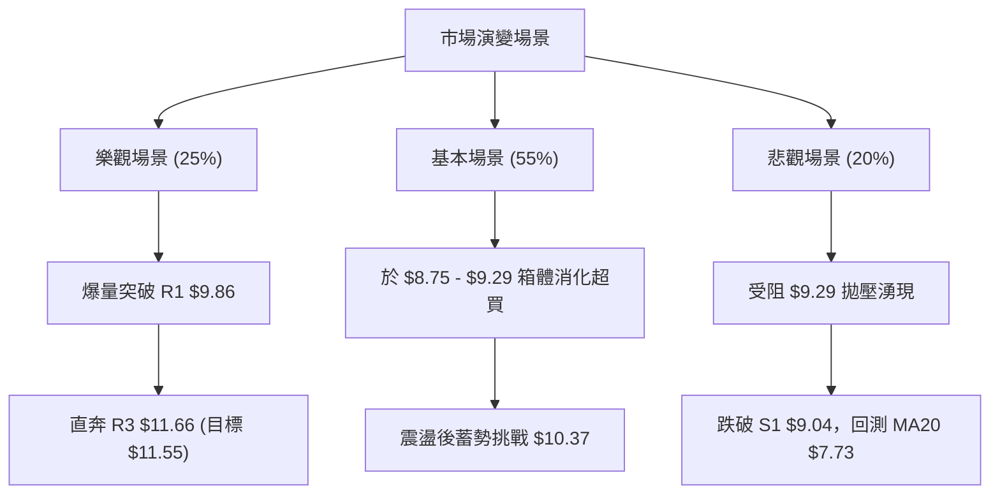

# ONDS 技術分析報告

> **報告日期**：2026-08-09 ｜ **語言**：繁體中文 ｜ **數據來源**：Yahoo Finance ｜ **當前價格**：$9.11

---

## 目錄

| 章節 | 內容 |
|------|------|
| [1. 技術面概覽](#1-技術面概覽) | 訊號儀表板、核心指標、評分卡 |
| [2. 趨勢分析](#2-趨勢分析) | 多時框趨勢、長中短期走勢 |
| [3. 圖表形態分析](#3-圖表形態分析) | 形態識別、K線組合、目標價 |
| [4. 支撐與阻力](#4-支撐與阻力) | 關鍵價位、斐波那契回調 |
| [5. 技術指標深度解讀](#5-技術指標深度解讀) | MA/RSI/MACD/布林/成交量 |
| [6. 動能與波動率](#6-動能與波動率) | 動能評估、ATR、Beta |
| [7. 多時框架總結](#7-多時框架總結) | 時框架評分矩陣 |
| [8. 交易策略建議](#8-交易策略建議) | 多空策略、風險報酬比 |
| [9. 風險提示與監控](#9-風險提示與監控) | 監控指標、風險場景 |

---

## 1. 技術面概覽

### 🎯 技術訊號儀表板



### 📊 核心指標速覽表

| 指標類別 | 指標名稱 | 當前數值 | 訊號 | 解讀 |
|----------|----------|----------|------|------|
| **價格** | 當前價格 | $9.11 | 🟡 中性 | 位於 52 週高低點區間 49.4% 位置，處於中軸震盪 |
| **均線** | MA20 | $7.73 | 🟢 看多 | 價格已站上短期月線，具強勁短線支撐 |
| **均線** | MA50 | $8.75 | 🟢 看多 | 價格已突破季線阻力，短線轉強 |
| **均線** | MA200 | $9.32 | 🔴 看空 | 價格仍受制於年線之下，中長期牛熊分界線壓制 |
| **動能** | RSI(14) | 70.29 | 🔴 超買 | 短線急漲進入超買區，過熱回檔風險增加 |
| **動能** | MACD | +0.145 (Hist: +0.252) | 🟢 看多 | 雙線黃金交叉，柱狀體顯著擴大，多頭動能強勁 |
| **波動** | ATR(14) | $0.76 (8.31%) | 🟡 中高 | 每日價格波動幅度較大，需設置較寬止損區間 |

### 🏆 技術評分卡

```
╔══════════════════════════════════════════════════════════════════╗
║                   技術評分卡 — ONDS (2026-08-09)                 ║
╠══════════════════════════════════════════════════════════════════╣
║ 趨勢強度      ▓▓▓▓▓▓▓░░░░░░░░░░░░░  35/100  🟡 弱趨勢/盤整格局  ║
║ 動能指標      ▓▓▓▓▓▓▓▓▓▓▓▓▓░░░░░░░  65/100  🟢 多頭動能強勁      ║
║ 支撐穩定度    ▓▓▓▓▓▓▓▓▓▓▓▓▓▓░░░░░░  70/100  🟢 底部位階鞏固      ║
║ 成交量配合    ▓▓▓▓▓▓▓▓▓▓░░░░░░░░░░  50/100  🟡 縮量上攻/觀望濃  ║
║ 形態完整度    ▓▓▓▓▓▓▓▓▓▓▓▓░░░░░░░░  60/100  🟢 底部雙重反彈      ║
║ 均線排列      ▓▓▓▓▓▓▓▓░░░░░░░░░░░░  40/100  🔴 壓制於長線均線下  ║
╠══════════════════════════════════════════════════════════════════╣
║ 綜合評分      ▓▓▓▓▓▓▓▓▓▓▓█░░░░░░░░  58/100  🟡 中性偏多 (區間震盪)║
╚══════════════════════════════════════════════════════════════════╝
```

---

## 2. 趨勢分析

### 🌐 多時框趨勢分析



### 📈 長期趨勢 — 12個月走勢圖（Unicode）

```
ONDS 月線歷史走勢圖 (2025-08 至 2026-08)
價格軸 ($)
$15.28 ┤                              ● (52W High)
$13.22 ┤                         ●    │
$11.66 ┤                         │    │
$10.36 ┤                ●  ●  ●  │    │
$9.11  ┤             ●  │  │  │  │    │        ● (現價 $9.11)
$7.90  ┤          ●  │  │  │  │  │    │     ●  │
$6.44  ┤       ●  │  │  │  │  │  │    │  ●  │  │
$5.86  ┤ ●     │  │  │  │  │  │  │  ● │  │  │  │
$3.09  ┤ ┴─────┴──┴──┴──┴──┴──┴──┴──┴─┴──┴──┴──┴─ (52W Low)
月份:    08    09 10 11 12 01 02 03 04 05 06 07 08
         2025                               2026
```

**走勢特徵分析表格**：

| 階段 | 時間區間 | 收盤價區間 | 變動幅度 | 走勢特徵分析 |
|------|----------|------------|----------|--------------|
| 1. 突破主升段 | 2025-08 ~ 2025-12 | $5.86 ➔ $9.76 | +66.55% | 狂暴大爆發，量能顯著放大，攻克個位數關卡 |
| 2. 高位震盪區 | 2026-01 ~ 2026-04 | $10.36 ➔ $10.04 | -3.09% | 於 $10.00 整數關卡附近高位橫盤築底 |
| 3. 創高衝頂段 | 2026-05 | $13.22 (最高 $15.28) | +31.67% | 爆發性攻頂，觸及 52 週高點 $15.28 後獲利賣壓出籠 |
| 4. 急速修正段 | 2026-06 ~ 2026-07 | $8.24 ➔ $7.49 (最低 $6.53) | -43.34% | 獲利了結潮賣壓，7月中旬下探波段低點 $6.53 |
| 5. 底部強反彈 | 2026-07 ~ 2026-08 | $6.53 ➔ $9.11 | +39.51% | 連續三週強勢陽線反彈，重新收復 50% 回調位 |

### 📊 中期趨勢（週線分析）

從近20週的週線數據來看：
* **底部確認**：2026-07-19 當週打出最低價 $6.53 後，伴隨 671M - 834M 的天量換手，形成明確的底部止跌訊號。
* **反彈阻力**：目前價格 $9.11 已接近 2026-06-07 週線高點 $10.43 與斐波那契 50.0% 反彈位 $9.18，短線面臨波段密集籌碼解套壓力。

### ⚡ 趨勢強度評估（ADX 解讀）



**ADX 趨勢強度對照解讀**：
* **當前 ADX = 16.50**：確信目前市場處於**無明確單邊長趨勢的區間震盪行情**（ADX < 25）。
* **操作涵義**：雖然短線價格拉升較快（+DI 達 22.68），但由於 ADX 尚未升破 25，盲目順勢追高突破 R1 ($9.86) 的失敗機率極高，策略應以箱體上下軌為主要交易區間。

---

## 3. 圖表形態分析

### 🔍 形態識別系統



**形態信心度評估表**：

| 形態名稱 | 信心度 | 判斷依據（引用數據） | 完成度 | 目標價（附計算式） |
|----------|--------|----------------------|--------|--------------------|
| **V型V轉雙重底** | **75%** | 兩次落底 $7.26 與 $6.53（見支撐區），7月下旬以 834M 超大成交量強勢拉抬突破 $7.80 | 85% | 頸線 $9.04 + (頸線 $9.04 - 底價 $6.53) = **$11.55**（接近 R3 $11.66） |
| **矩形箱體震盪** | **80%** | ADX 僅 16.50，價格持續在 $6.16（BB下軌）與 $9.29（BB上軌）間運作 | 90% | 箱體上軌目標 **$9.29 - $9.86** |

### 🕯️ 重要K線形態分析

| 日期/週 | 收盤價 | K線形態 | 解讀 | 訊號 |
|---------|--------|---------|------|------|
| 2026-07-19 週 | $6.53 | 下影極長長陽Hammer | 於 $6.53 觸及波段極限低點後爆量抄底，多頭強力反撲 | 🟢 強烈買進 |
| 2026-07-26 週 | $7.80 | 實體長紅K (Bullish Marubozu) | 伴隨 834.3M 20週最大成交量，一舉吞噬前三週陰線 | 🟢 趨勢反轉 |
| 2026-08-09 週 | $9.11 | 強勢跳空大陽線 | 收在 $9.11，收復 50% 斐波那契位 $9.18 附近 | 🟢 多頭延續 |

### 📉 ASCII 走勢形態示意圖

```
ONDS 雙底反彈與箱體邊界示意圖
===================================================================
$10.37 ┤- - - - - - - - - - - - - - - - - - - - - - - - - - - [阻力 R2]
$9.86  ┤- - - - - - - - - - - - - - - - - - - - - - - - - - - [阻力 R1]
$9.29  ┤=======================●============================= [布林上軌]
$9.11  ┤.....................● (現價) ....................... [頸線/50%位]
$8.69  ┤- - - - - - - - - - - - - - - - - - - - - - - - - - - [支撐 S2]
$7.73  ┤-----------------------●----------------------------- [BB中軌/MA20]
$6.53  ┤        ● (底1: $7.26)   │ (底2: $6.53 爆量止跌) ..... [強支撐]
       └───────────────────────────────────────────────────
```

### 🎯 形態目標價計算

1. **雙底形態測量目標價**：
   * 形態底部最低價：$6.53
   * 形態頸線位置：S1 近郊/50%斐波那契位 $9.04
   * 形態垂直高度：$9.04 - $6.53 = $2.51
   * **最小測量目標價** = 頸線 $9.04 + $2.51 = **$11.55**（與阻力位 R3 $11.66 高度重合）。

---

## 4. 支撐與阻力

### 🗺️ 關鍵價位分布圖（Unicode）

```
ONDS 關鍵價位結構分布圖
═══════════════════════════════════════════════════════════════════
$15.28 ║████████████████████████████████████║ 52週歷史高點 (0.0% Fib)
$12.40 ║████████████████                    ║ 23.6% 斐波那契回調位
$11.66 ║████████████████████████            ║ 強阻力 R3 (形態測量目標 $11.55)
$10.62 ║████████████                        ║ 38.2% 斐波那契回調位
$10.37 ║████████████████                    ║ 阻力 R2 (波段前高聚類)
$9.86  ║██████████                          ║ 關鍵阻力 R1 (前波解套壓力區)
$9.29  ║------------------------------------║ 布林通道上軌
$9.18  ║════════════════════════════════════║ 50.0% 斐波那契回調位
$9.11  ╠════════════════════════════════════╣ ◄ 現價 $9.11
$9.04  ║▓▓▓▓▓▓▓▓▓▓▓▓▓▓▓▓▓▓▓▓▓▓▓▓            ║ 關鍵支撐 S1 (頸線/波段低點)
$8.69  ║▓▓▓▓▓▓▓▓▓▓▓▓                        ║ 支撐 S2 (50日均線附近)
$8.32  ║▓▓▓▓▓▓▓▓                            ║ 強支撐 S3
$7.74  ║▓▓▓▓▓▓▓▓▓▓▓▓▓▓▓▓▓▓▓▓                ║ 61.8% 斐波那契黃金分割位 / MA20
$6.16  ║▓▓▓▓▓▓▓▓▓▓▓▓▓▓▓▓▓▓▓▓▓▓▓▓            ║ 布林通道下軌
$3.09  ║▓▓▓▓▓▓▓▓▓▓▓▓▓▓▓▓▓▓▓▓▓▓▓▓▓▓▓▓▓▓▓▓▓▓▓▓║ 52週歷史低點 (100.0% Fib)
═══════════════════════════════════════════════════════════════════
```

### 🚧 阻力位分析表

| 阻力級別 | 價位 | 形成原因 | 突破難度 | 重要性 |
|----------|------|----------|----------|--------|
| **R1** | **$9.86** | 近一年波段高點聚類、解套盤賣壓區 | 🟡 中等 | 🟢🟢🟢 短線多空分水嶺，突破方能開啟新波段 |
| **R2** | **$10.37** | 近一年波段密集高點聚類、整數關卡卡位 | 🔴 較高 | 🟢🟢🟢🟢 中期多頭反攻要塞 |
| **R3** | **$11.66** | 波段高點聚類、雙底形態理論測量目標價區 ($11.55) | 🔴 高 | 🟢🟢🟢🟢🟢 波段終極目標 |

### 🛡️ 支撐位分析表

| 支撐級別 | 價位 | 形成原因 | 守住機率 | 重要性 |
|----------|------|----------|----------|--------|
| **S1** | **$9.04** | 近一年波段低點聚類、當前突破之頸線支撐 | 🟢 75% | 🟢🟢🟢🟢 短線防守第一道防線，絕不可失 |
| **S2** | **$8.69** | 近一年波段低點聚類、靠近 MA50 ($8.75) | 🟢 80% | 🟢🟢🟢 短線多頭退守防線 |
| **S3** | **$8.32** | 近一年波段低點聚類、整數防禦區 | 🟢 85% | 🟢🟢🟢🟢 中線強支撐堡壘 |

### 📐 斐波那契回調位分析

基於 52 週高低點（$3.09 ➔ $15.28，價差 $12.19）計算：
* **50.0% 回調位 ($9.18)**：**當前價格 $9.11 緊貼此核心位置**。50% 回調位是多空雙方在中期爭奪的極度關鍵樞紐（Pivot）。若能日線實體收高於 $9.18，代表跌勢已被消化半數以上。
* **61.8% 回調位 ($7.74)**：與當前 MA20 ($7.73) 完全重合！形成了極為強大的**黃金重合支撐帶**（$7.73 - $7.74）。只要價格維持在 $7.74 之上，中短期反彈結構便極其穩固。

---

## 5. 技術指標深度解讀

### 🎛️ 指標訊號總覽



### 📈 移動平均線排列分析



**均線架構分析**：
* **短中期均線（MA5, MA10, MA20, MA50）**：全面轉為**多頭排列**，且 MA5 ($8.79)、MA10 ($8.17)、MA20 ($7.73) 呈現強勁向上扣抵姿態，為短線價格提供層層墊高支撐。
* **長期均線（MA120 $9.46, MA200 $9.32）**：價格目前仍低於 MA120 與 MA200，且整體系統仍呈現長線空頭排列（MA20 < MA50 < MA200）。這意味著 $9.32 - $9.46 區域累積了大量的長線套牢均線賣壓。

### 📉 RSI(14) 分析

* **RSI(14) 當前數值**：**70.29**
* **進度條**：`█████████████████████████████████████████████░░░░░░░` **70.29% (超買區)**
* **背離判斷**：檢測近期走勢，價格從 7 月中旬低點 $6.53 拉升至 $9.11，RSI 從 35.0 同步上揚至 70.29，**未出現頂背離或底背離**，動能與價格相符。
* **解讀**：RSI 突破 70 進入超買區，代表過去幾週反彈極為強勁，但短線技術性過熱顯著，隨時可能引發向 MA20 ($7.73) 或 S1 ($9.04) 的修正回檔。

### 📊 MACD(12,26,9) 訊號解讀

* **MACD 線**：0.145
* **Signal 線**：-0.106
* **MACD 柱狀體 (Histogram)**：**+0.252** 🟢
* **分析**：MACD 線已上穿 Signal 線形成黃金交叉，且柱狀體連續多週維持正值並迅速擴大（從 -0.038 擴張至 +0.252），顯示**多頭買盤控制著短中期節奏**。

### 📦 布林通道分析

```
布林通道現狀示意圖 (Bollinger Bands)
===================================================================
上軌 (Upper Band):   $9.29  --------------------------------- [強壓]
現價 (Current):      $9.11  ██████████████████████████████ (BB %B = 0.94)
中軌 (MA20):         $7.73  --------------------------------- [強支撐]
下軌 (Lower Band):   $6.16  ---------------------------------
===================================================================
```
* **BB %B 數值**：**0.94**（極度靠近上軌 1.00）。
* **通道狀態**：當前價格 $9.11 已經極度逼近布林通道上軌 $9.29。在 ADX < 25 的盤整格局下，價格觸及上軌通常代表**短線反彈觸頂**，回落至中軌 $7.73 的機率增加。

### 💹 成交量分析（量價配合度）

* **最新日成交量**：72,567,700
* **20日均量**：109,423,810 (量比: **0.66x**)
* **OBV (累積能量線) 趨勢**：OBV > MA，呈現量能支撐上漲格局。
* **量價分析**：7 月底抄底時週成交量高達 834M（天量），但進入 8 月上旬反彈至 $9.11 時，日成交量縮減至 20 日均量的 0.66 倍。這顯示**高位追買意願開始降溫**（量縮價漲），若要有效突破阻力 R1 ($9.86)，必須重新帶量至 1.0x 以上。

---

## 6. 動能與波動率

### ⚡ 動能評估

| 象限 | 動能強度 | 波動率 | 當前狀態 | 評估與策略 |
|------|----------|--------|----------|------------|
| **Q1** | 強 | 低 | — | 最佳趨勢買進區 |
| **Q2** | 弱 | 低 | — | 沉悶盤整，觀望為主 |
| **Q3** | **強** | **高** | **✓ (當前位置)** | **高動能高波動：強勢反彈但震盪劇烈，適合嚴格止損的區間波段操作** |
| **Q4** | 弱 | 高 | — | 高風險急跌區，嚴禁接刀 |



### 📊 ATR 波動率分析

* **ATR(14)**：**$0.76**
* **佔價格比例**：**8.31%**
* **交易應用**：
  * **波段止損距離**：建議至少設置 1.5 至 2.0 倍 ATR（即 $1.14 - $1.52）以避免被正常市場噪音震盪出場。
  * **日內波動範圍**：每日預期波動區間約為 $9.11 ± $0.76（即 $8.35 - $9.87）。

### 📐 Beta 與市場相關性

* **Beta 值**：**2.75**（高 Beta 成長/小型科技股）。
* **解讀**：ONDS 的波動幅度是大盤（S&P 500）的 2.75 倍。當大盤上漲 1% 時，ONDS 預期上漲 2.75%；當大盤回檔時，其下修風險亦成倍放大。

---

## 7. 多時框架總結

### 📋 時框架評分表

| 時框架 | 趨勢方向 | 動能 | 均線排列 | 形態 | 綜合評分 | 建議策略 |
|--------|----------|------|----------|------|----------|----------|
| **日線 (Daily)** | 🟢 強勢短多 | 🔴 超買 (RSI 70) | 🟢 短期多頭 (MA5>20) | 🟢 觸及布林上軌 | **62/100** | 避開追高，等待回檔 S1/S2 低吸 |
| **週線 (Weekly)**| 🟢 中線反彈 | 🟢 MACD黃金交叉 | 🟡 混亂 (穿越MA50) | 🟢 雙底築底完成 | **58/100** | 區間波段操作 ($7.74 - $9.86) |
| **月線 (Monthly)**| 🔴 長線承壓 | 🟡 中性 | 🔴 長線空頭 (MA200壓制)| 🟡 50% 斐波那契爭奪| **45/100** | 長線築底期，逢高分批減碼 |

### 🔲 綜合訊號矩陣

```
┌─────────────────┬──────────────────┬──────────────────┐
│   時框架 \ 指標  │    動能 (RSI/MACD)│  均線與通道位置  │
├─────────────────┼──────────────────┼──────────────────┤
│   日線 (Short)  │  🔴 超買 / 🟢 看多│  🟢 MA20上 / 🔴 BB上軌│
│   週線 (Medium) │  🟢 翻多 / 🟢 柱擴│  🟡 MA50附近 / 🟢 MA20上│
│   月線 (Long)   │  🟡 中性 / 🟡 觀望│  🔴 MA200下方壓制 │
└─────────────────┴──────────────────┴──────────────────┘
```

### ⚖️ 多時框收斂結論

依據多時框收斂規則：
1. **行情屬性判斷**：ADX(14) 為 **16.50 (< 25)**，明確指示當前市場屬於**盤整/箱體震盪行情**，而非單邊強趨勢行情。
2. **主導指標**：以**日線布林通道 ($6.16 - $9.29)** 及 **52週斐波那契回調位 ($7.74 - $9.18 - $10.62)** 為核心交易邊界。
3. **最終收斂方向**：**🟡 中性偏多（區間震盪高位）**。短線價格受制於 BB 上軌 $9.29 與 50% 回調位 $9.18，且 RSI 超買，**不具備直接單邊暴漲突破的條件**。預計價格將在 S1 ($9.04) 至 R1 ($9.86) 區間進行消化整理。

---

## 8. 交易策略建議

### 🗺️ 策略決策流程圖



### 🧭 策略路由

**當前主策略方向 = 🟡 中性偏多（區間逢低做多 / 高位部分獲利）**
* 依評分 **58/100**，當前處於中性偏多但短線過熱區間，主推**區間逢低做多策略**。

### 🎯 價格情境階梯 (Price Scenarios)

| 觸發條件 | 下一目標 | 後續延伸 | 情境含義 |
|----------|----------|----------|----------|
| **帶量突破 R1 $9.86** | R2 $10.37 | R3 $11.66 | 多頭強勢主升段開啟，挑戰形態目標 $11.55 |
| **守住 S1 $9.04 / 50%位 $9.18** | R1 $9.86 | — | 健康的高位箱體消化震盪 |
| **跌破 S1 $9.04** | S2 $8.69 | S3 $8.32 / MA20 $7.73 | 短線過熱修復，測試中期均線支撐 |

### 📊 情境機率分佈

| 情境 | 機率 | 主要依據 |
|------|------|----------|
| **區間震盪回檔後上行** | **55%** | MACD 柱狀體擴張 (+0.252)，OBV 向上，但 RSI 70.29 需短線消化 |
| **橫盤強勢消化震盪** | **30%** | ADX 僅 16.50 顯示趨勢疲弱，量能 0.66x 不足以立刻大暴漲 |
| **轉弱跌破 S2 探底** | **15%** | 均線長線仍為空頭排列，MA200 ($9.32) 壓制力道強 |

### 🟢 主策略詳情

#### 策略 A：波段逢低做多（主推策略 — 勝率較高）

| 策略要素 | 具體設定 | 計算與邏輯依據 |
|----------|----------|----------------|
| **進場條件** | 價格回檔至 S1 至 S2 支撐區出現止跌K線 | 避開 RSI 70.29 超買區 |
| **進場價格** | **$8.75 - $9.04** | 靠近 MA50 ($8.75) 與 S1 支撐位 |
| **目標價 T1** | **$9.86** | 關鍵阻力位 R1 (+9.07% 從 $9.04 起算) |
| **目標價 T2** | **$10.37** | 阻力位 R2 (+14.71% 從 $9.04 起算) |
| **止損價格** | **$8.32** | 跌破強支撐 S3 (-7.96% 從 $9.04 起算) |
| **風險報酬比** | **1 : 1.67** (至T2) | (10.37 - 9.04) / (9.04 - 8.32) = 1.33 / 0.72 = 1.85 |
| **成功機率** | **65%** | 順應 MACD 多頭交叉與雙底結構 |
| **建議倉位** | **15%** | 控制高 Beta (2.75) 波動風險 |

#### 策略 B：突破追多（備選策略 — 需量能配合）

| 策略要素 | 具體設定 | 計算與邏輯依據 |
|----------|----------|----------------|
| **進場條件** | 日線實體收盤突破 R1 並伴隨 1.2x 以上均量 | 確認突破解套賣壓區 |
| **進場價格** | **$9.90** | 突破 R1 ($9.86) 確認點 |
| **目標價 T1** | **$10.37** | 阻力位 R2 |
| **目標價 T2** | **$11.66** | 強阻力位 R3 (接近雙底測量目標 $11.55) |
| **止損價格** | **$9.04** | 假突破跌回 S1 頸線 |
| **風險報酬比** | **1 : 2.05** (至T2) | (11.66 - 9.90) / (9.90 - 9.04) = 1.76 / 0.86 = 2.05 |
| **成功機率** | **50%** | ADX 較低，假突破風險需嚴防 |
| **建議倉位** | **10%** | 突破追價倉位宜精簡 |

### 🔴 反向風險觸發點（對沖/停損提示）

* 若價格不幸有效**跌破 S3 ($8.32)** 且 MACD 柱狀體翻負，代表本輪從 $6.53 起算的反彈波段正式結束，應全面清倉離場或進行對沖保護，下看 61.8% 斐波那契位與 MA20 重合區 **$7.73 - $7.74**。

### ⭐ 整體訊號強度評星

```
做多訊號強度：★★★☆☆  (3/5星 - 動能強但受限於超買與長線均線)
做空訊號強度：★★☆☆☆  (2/5星 - 短線多頭控盤，做空順應性差)
整體可信度：  ★★★☆☆  (3/5星 - 箱體震盪特徵明確)
```

---

## 9. 風險提示與監控

### ✅ 關鍵監控指標 Checklist

```
╔══════════════════════════════════════════════════════════════════╗
║                    ONDS 每日技術面監控清單                      ║
╠══════════════════════════════════════════════════════════════════╣
║ [ ] 價格是否觸及並受阻於布林上軌 $9.29                            ║
║ [ ] RSI(14) 能否從 70.29 回落至 50-60 健康冷卻區                  ║
║ [ ] 50.0% 斐波那契位 $9.18 能否收盤站穩                            ║
║ [ ] 成交量是否升破 20日均量 (109.4M) 以支撐向上攻頂               ║
║ [ ] MACD 柱狀體 (+0.252) 是否出現縮頭萎縮訊號                    ║
║ [ ] 下方核心支撐 S1 $9.04 與 MA50 $8.75 是否完好無損               ║
╚══════════════════════════════════════════════════════════════════╝
```

### ⚠️ 風險場景分析



### 🛡️ 風險管理重要提醒

1. **高 Beta 屬性風險**：ONDS Beta 高達 **2.75**，且個股 Short Float 高達 **40.5%**！極高空頭比例意味著該股具備**軋空爆發力**，但同時賣壓崩盤時的下跌速度也極快，單一持倉切勿超過總投資組合的 **15%**。
2. **基本面/估值防護力較弱**： trailing P/E 高達 101.2，Forward P/E 為負值，營運現金流為負（$-83.39M）。本波段純屬技術面與籌碼面反彈，**絕不可作為無止損長線價值投資買入**。
3. **嚴格執行止損紀律**：進場策略必須嚴格以 **S3 ($8.32)** 或 1.5 倍 ATR ($1.14) 作為鋼鐵止損線，保護資金安全。

---

## 📋 報告總結

```
╔══════════════════════════════════════════════════════════════════╗
║                     ONDS 技術分析報告總結                        ║
════════════════════════════════════════════════════════════════════
報告日期：2026-08-09
當前價格：$9.11
分析評級：🟡 中性偏多 (58/100) — 區間高位震盪，避開追高

關鍵價位速查：
├─ 長期趨勢：🟡 寬幅築底震盪 (基底 $3.09 - 高點 $15.28)
├─ 中期趨勢：🟢 底部雙底反彈成型 ($6.53 ➔ $9.11)
├─ 短期趨勢：🔴 觸及 BB 上軌 $9.29 & RSI 70.29 超買，短線面臨修復
├─ 關鍵支撐：S1 $9.04 ｜ S2 $8.69 ｜ MA20重合位 $7.73-$7.74
├─ 關鍵阻力：R1 $9.86 ｜ R2 $10.37 ｜ R3 $11.66
└─ 法人共識目標：$19.81 (機構評級偏多)

最優交易策略組合：
1. 🥇 最佳機會：等待回檔至 S1 ($9.04) ~ S2 ($8.69) 區間分批布局，
              目標看 R1 ($9.86) 與 R2 ($10.37)，止損設於 S3 ($8.32)。
2. 🥈 次選機會：若直接帶量突破 R1 ($9.86)，追多看至 R3 ($11.66)。
3. 🥉 保守選擇：等待 RSI(14) 冷卻至 50 附近再行評估。
════════════════════════════════════════════════════════════════════
```

---

> ⚠️ **免責聲明**：本報告為 AI 自動生成之技術分析，所有數據及估算均基於提供的歷史價格資訊。本報告**僅供研究與學術參考**，**不構成任何投資建議**。投資有風險，入市需謹慎。

---

*報告生成時間：2026-08-09 ｜ 數據來源：Yahoo Finance ｜ 分析框架：多時框技術分析*