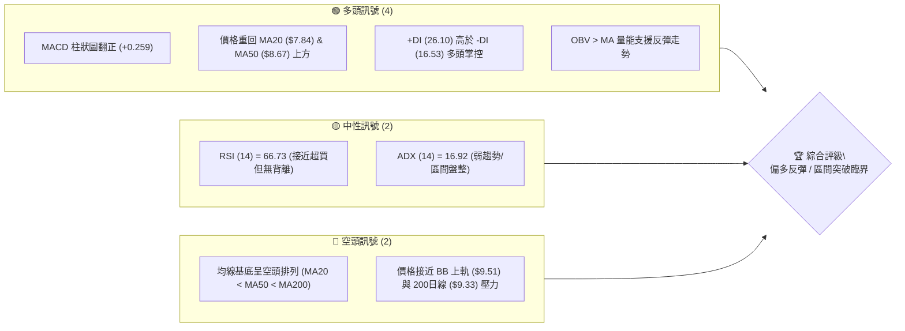
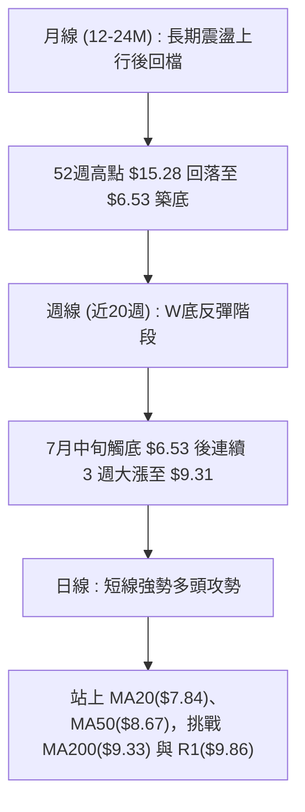
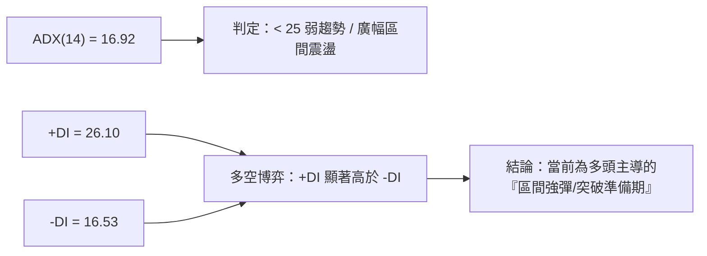
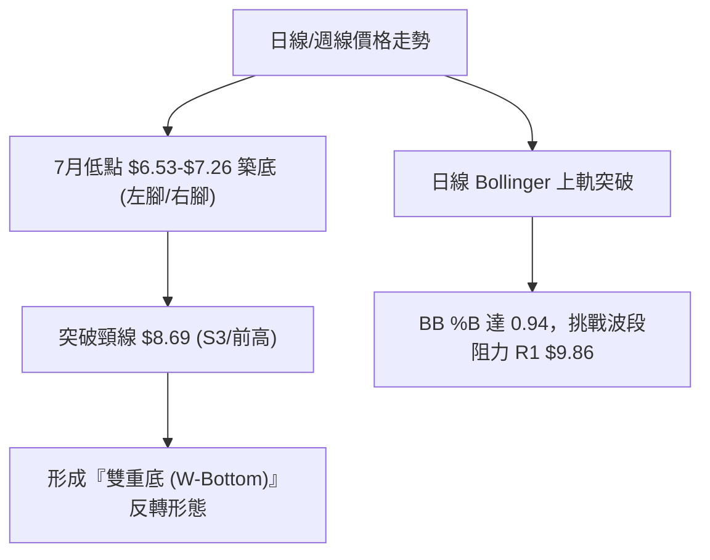
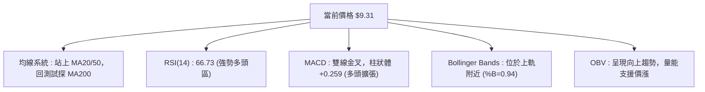
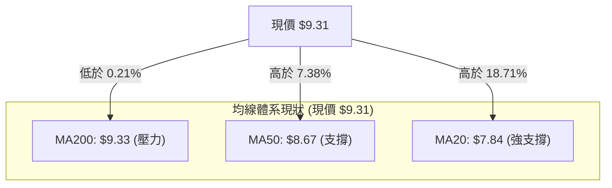
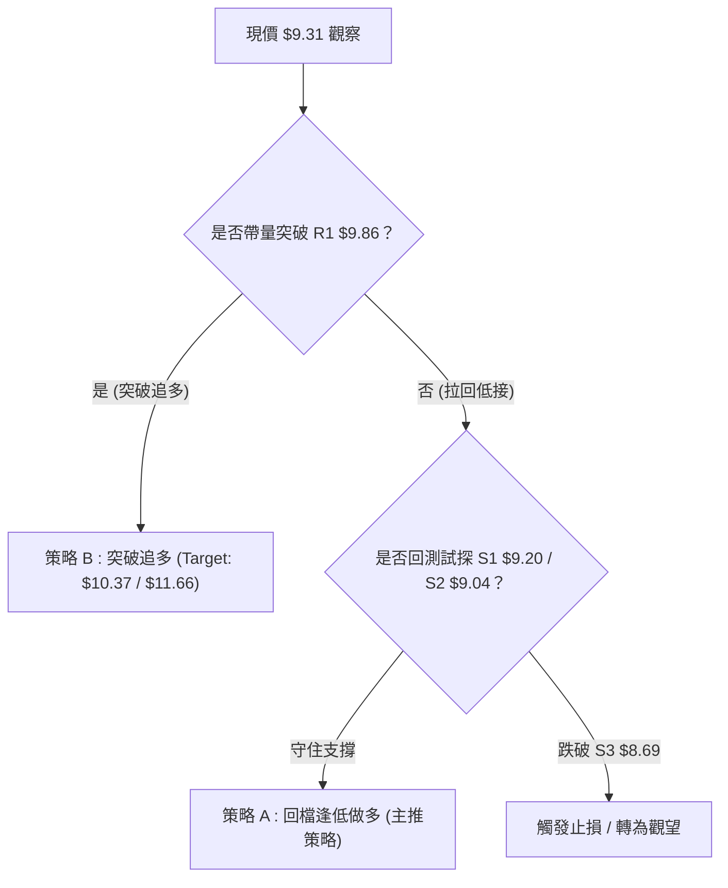
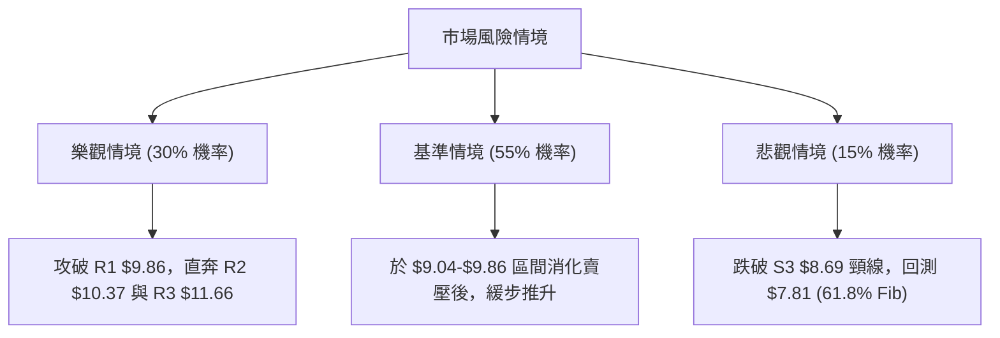

# ONDS 技術分析報告

> **報告日期**：2026-08-11 ｜ **語言**：繁體中文 ｜ **數據來源**：Yahoo Finance ｜ **當前價格**：$9.31

---

## 目錄

| 章節 | 內容 |
|------|------|
| [1. 技術面概覽](#1-技術面概覽) | 訊號儀表板、核心指標、評分卡 |
| [2. 趨勢分析](#2-趨勢分析) | 多時框趨勢、長中短期走勢 |
| [3. 圖表形態分析](#3-圖表形態分析) | 形態識別、K線組合、目標價 |
| [4. 支撐與阻力](#4-支撐與阻力) | 關鍵價位、斐波那契回調 |
| [5. 技術指標深度解讀](#5-技術指標深度解讀) | MA/RSI/MACD/布林/成交量 |
| [6. 動能與波動率](#6-動能與波動率) | 動能評估、ATR、Beta |
| [7. 多時框架總結](#7-多時框架總結) | 時框架評分矩陣 |
| [8. 交易策略建議](#8-交易策略建議) | 多空策略、風險報酬比 |
| [9. 風險提示與監控](#9-風險提示與監控) | 監控指標、風險場景 |

---

## 1. 技術面概覽

### 🎯 技術訊號儀表板



### 📊 核心指標速覽表

| 指標類別 | 指標名稱 | 當前數值 | 訊號 | 解讀 |
|----------|----------|----------|------|------|
| **價格** | 當前收盤價 | $9.31 | 🟢 多頭 | 站上 50% 斐波那契位 ($9.24) 與 MA50 ($8.67) |
| **均線** | MA20 | $7.84 | 🟢 多頭 | 價格高於 MA20 達 +18.71%，短線支撐強勁 |
| **均線** | MA50 | $8.67 | 🟢 多頭 | 價格高於 MA50 達 +7.38%，中期轉強 |
| **均線** | MA200 | $9.33 | 🟡 中性 | 價格於 200 日線交會（-0.21%），面臨長線分水嶺 |
| **動能** | RSI(14) | 66.73 | 🟢 多頭 | 處於強勢多頭區，尚未出現頂背離 |
| **動能** | MACD(12,26,9) | +0.218 | 🟢 多頭 | MACD 線穿過訊號線 (-0.041)，柱體 +0.259 |
| **動能** | Stoch %K/%D | 89.75 / 89.52 | 🔴 超買 | 極短線進入超買區，需留意回檔衝擊 |
| **波動** | ATR(14) | $0.73 | 🔴 高波動 | 佔股價 7.79%，日間波動大，止損需適度拉寬 |
| **趨勢** | ADX(14) | 16.92 | 🟡 盤整 | ADX < 25 指示當前屬震盪反彈，非單邊大趨勢 |

### 🏆 技術評分卡

```
╔══════════════════════════════════════════════════════════════╗
║                技術評分卡 — ONDS (2026-08-11)                ║
╠══════════════════════════════════════════════════════════════╣
║ 趨勢強度 (ADX/DI)  ███████░░░░░░░░░░░░░  35/100  🟡 中性     ║
║ 動能指標 (RSI/MACD) ███████████████░░░░  75/100  🟢 強勁     ║
║ 支撐穩定度 (S1/S2) ██████████████░░░░░  70/100  🟢 良好     ║
║ 成交量配合 (OBV/VOL)████████████░░░░░░░  60/100  🟢 溫和     ║
║ 形態完整度 (打底)  ██████████████░░░░░  70/100  🟢 良好     ║
║ 均線結構 (MA排列)   █████████░░░░░░░░░░  45/100  🟡 改善中   ║
╠══════════════════════════════════════════════════════════════╣
║ 綜合評分           █████████████░░░░░░  60/100  🟢 偏多反彈 ║
╚══════════════════════════════════════════════════════════════╝
```

---

## 2. 趨勢分析

### 🌐 多時框趨勢分析



### 📈 長期趨勢 — 12個月走勢圖（Unicode）

```
ONDS 月線走勢圖（2025-09 至 2026-08）
價格軸 ($)
$15.28 ┤                                    
$13.22 ┤                             ● (2026-05 波段高點)
$10.36 ┤                     ●   ●
$ 9.31 ┤                         ●       ● (現在 $9.31)
$ 7.72 ┤ ●       ●   ●   ●               
$ 6.44 ┤     ●                           
$ 3.20 ┤                                      (52W 低點)
       └─┬───┬───┬───┬───┬───┬───┬───┬───┬───┬───┬───
        09  10  11  12  01  02  03  04  05  06  07  08  (月/年)
```

**走勢特徵分析表格**：

| 階段 | 時間區間 | 收盤價變動 | 幅度 | 走勢特徵與技術含義 |
|------|----------|------------|------|--------------------|
| 1. 主升段擴張 | 2025-08 ~ 2026-01 | $5.86 → $10.36 | +76.8% | 伴隨業務營收爆發，月線連續陽線推升 |
| 2. 高位震盪區 | 2026-02 ~ 2026-05 | $10.08 → $13.22 | +31.2% | 5月衝高至近52週高價區，隨後遇到獲利賣壓 |
| 3. 深度修正期 | 2026-06 ~ 2026-07 | $8.24 → $7.49 (最低$6.53) | -43.3% | 週線連續下跌，觸及 61.8% 斐波那契回調位 ($7.81) 下方 |
| 4. 底部強彈期 | 2026-07-19 ~ 2026-08 | $6.53 → $9.31 | +42.6% | 週成交量爆出 8.34 億股大底量，展開 V 型雙底反彈 |

### 📊 中期趨勢（週線分析）

從近 20 週數據觀察，ONDS 在 2026 年 7 月 19 日當週下探至波段低點 $6.53（配合 6.71 億股大成交量），隨後於 7 月 26 日當週爆出 **8.34 億股** 之歷史級巨量並收出大陽線（收 $7.80, RSI 跳升至 49.8），確立了週線級別的「巨量止跌打底」。8 月初至今連續兩週上攻，目前週線 RSI 已拉升至 66.7，週 MACD 柱狀體翻正為 +0.259。

### ⚡ 趨勢強度評估（ADX 解讀）



**ADX 趨勢強度對照表**：

| ADX 數值區間 | 當前狀態 | 趨勢性質 | 策略指導 |
|--------------|----------|----------|----------|
| 0 - 20 | **16.92 (現狀)** | 無明確單邊大趨勢 / 盤整震盪 | 以布林通道、支撐阻力位進行區間高拋低吸或突破確認 |
| 20 - 25 | - | 趨勢正在醞釀 | 準備順勢突破交易 |
| 25 - 50 | - | 強勁單邊趨勢 | 採用均線追蹤與持股續抱策略 |
| 50 - 100 | - | 極端趨勢 / 接近尾聲 | 留意反轉風險 |

---

## 3. 圖表形態分析

### 🔍 形態識別系統



**形態信心度評估表**：

| 形態名稱 | 信心度 | 判斷依據（引用數據） | 完成度 | 目標價（附計算式） |
|----------|--------|----------------------|--------|--------------------|
| **雙重底 (W-Bottom)** | **75%** | 第一底 $6.53 (7/19 週)，第二底 $7.26 (7/12 週) 與 $7.49 (8/2 週)；頸線位於 $8.69。已突破頸線。 | 90% | 頸線 $8.69 + 形態高度 ($8.69 - $6.53 = $2.16) = **$10.85**（接近 R2 $10.37 至 38.2% 斐波那契 $10.67） |
| **布林通道上軌擠壓** | **65%** | 現價 $9.31 緊貼 BB 上軌 $9.51，%B = 0.94 | 85% | 上軌擴展延伸，初步目標 **$9.86 (R1)** |
| **頭肩底形態** | **35%** | 左肩 $7.83、頭部 $6.53、右肩 $7.49，數據尚未完全確立 | 40% | 訊號不足，不予作為主要目標計算 |

### 🕯️ 重要K線形態分析

| 月份/日期 | 收盤價 | K線形態 | 技術解讀 | 訊號 |
|-----------|--------|---------|----------|------|
| 2026-05-31 週 | $13.22 | 假突破長上影線 | 衝高 $15.28 後獲利賣壓湧現，確立 52 週天花板 | 🔴 空頭 |
| 2026-07-19 週 | $6.53 | 探底長下影錘子線 | 探底 $6.53 後吸引低接買盤，換手量達 6.71 億股 | 🟢 多頭止跌 |
| 2026-07-26 週 | $7.80 | 巨量長陽吞噬 | 換手量創下 8.34 億股新高，一舉吞噬前一週陰線 | 🟢 強烈買訊 |
| 2026-08-16 日 | $9.31 | 中陽線突破 | 站上 50% 斐波那契回調位 $9.24 與 MA200 ($9.33) 臨界 | 🟢 續攻訊號 |

### 📉 ASCII 走勢形態示意圖

```
ONDS 雙底 (W-Bottom) 反轉形態示意圖
═════════════════════════════════════════════════════════════
$10.37 ┤                                           [目標價 R2]
$ 9.86 ┤                                  ● (阻力 R1)
$ 9.31 ┤                             ● (現價突破中)
$ 8.69 ┤───────────────● (頸線突破點)───────────────
$ 7.80 ┤       ●       │             ● (右肩打底)
$ 7.26 ┤       │       │             │
$ 6.53 ┤       └───●───┘ (左底 $6.53) └───● (右底 $7.26/$7.49)
═════════════════════════════════════════════════════════════
```

### 🎯 形態目標價計算

1. **W底形態高度（Height）**：
   $$\text{頸線價位 } (\$8.69) - \text{最低底價 } (\$6.53) = \$2.16$$
2. **第一階段形態目標價 (T1)**：
   $$\text{頸線價位 } (\$8.69) + \text{形態高度 } (\$2.16) = \mathbf{\$10.85}$$
   *（備註：此目標價位於數據庫中的阻力位 R2 \$10.37 與 38.2% 斐波那契位 \$10.67 之間）*
3. **第二階段趨勢延伸目標價 (T2)**：
   $$\text{若突破 R2 \$10.37，看至 R3 \$11.66 與 23.6% 斐波那契位 \$12.43}$$

---

## 4. 支撐與阻力

### 🗺️ 關鍵價位分布圖（Unicode）

```
ONDS 價位結構分布圖 (由 OHLCV 與斐波那契精確計算)
═════════════════════════════════════════════════════════════════
$15.28 ║████████████████████████████████║ 52W High / 0.0% Fib
$12.43 ║████████████████████          ║ 23.6% Fib 回調位
$11.66 ║████████████████████████      ║ 強阻力位 R3 (+25.30%)
$10.67 ║████████████████              ║ 38.2% Fib 回調位
$10.37 ║████████████████████          ║ 中期阻力位 R2 (+11.39%)
$ 9.86 ║██████████████████████████    ║ 近期阻力位 R1 (+5.91%)
$ 9.33 ║──────────────────────────────║ 200日均線 MA200
$ 9.31 ╠══════════════════════════════╣ ◄ 當前收盤價 ($9.31)
$ 9.24 ║▓▓▓▓▓▓▓▓▓▓▓▓▓▓▓▓▓▓▓▓▓▓▓▓▓▓▓▓▓▓║ 50.0% Fib 回調位
$ 9.20 ║▓▓▓▓▓▓▓▓▓▓▓▓▓▓▓▓▓▓▓▓          ║ 近期支撐位 S1 (-1.18%)
$ 9.04 ║▓▓▓▓▓▓▓▓▓▓▓▓▓▓▓▓▓▓▓▓▓▓▓▓      ║ 關鍵支撐位 S2 (-2.90%)
$ 8.69 ║▓▓▓▓▓▓▓▓▓▓▓▓▓▓▓▓▓▓▓▓▓▓▓▓▓▓▓▓  ║ 強支撐/W底頸線 S3 (-6.66%)
$ 7.81 ║▓▓▓▓▓▓▓▓▓▓▓▓                  ║ 61.8% Fib 回調位 (黃金分割)
$ 3.20 ║▓▓▓▓▓▓▓▓▓▓▓▓▓▓▓▓▓▓▓▓▓▓▓▓▓▓▓▓▓▓║ 52W Low / 100.0% Fib
═════════════════════════════════════════════════════════════════
```

### 🚧 阻力位分析表

| 阻力級別 | 價位 | 形成原因（依據 OHLCV 聚類） | 突破難度 | 重要性 |
|----------|------|-----------------------------|----------|--------|
| **R1** | **$9.86** | 近一年波段高點聚類、接近 BB 上軌 ($9.51) | 🟡 中等 | 短線多頭衝刺首要關卡 |
| **R2** | **$10.37** | 近一年次高點密集成交區、W底形態解套賣壓 | 🔴 較高 | 中期多空分水嶺 |
| **R3** | **$11.66** | 近一年強阻力高點聚類，向上通往 $12.43 (23.6% Fib) | 🔴 極高 | 長線牛熊轉換關鍵位 |

### 🛡️ 支撐位分析表

| 支撐級別 | 價位 | 形成原因（依據 OHLCV 聚類） | 守住機率 | 重要性 |
|----------|------|-----------------------------|----------|--------|
| **S1** | **$9.20** | 近一年波段低點聚類、緊貼 50% Fib ($9.24) | 🟢 75% | 短線拉回第一防線 |
| **S2** | **$9.04** | 2026-03 及 2026-05 波段低點聚類、MA240 ($9.02) | 🟢 80% | 中短線強支撐，跌破則轉弱 |
| **S3** | **$8.69** | W底頸線位、MA50 ($8.67) 雙重重疊支撐 | 🟢 88% | 多頭防守大本營，不容有失 |

### 📐 斐波那契回調位分析

基於 52 週高點 **$15.28** 至 52 週低點 **$3.20** 進行斐波那契回調計算：

*   **0.0% (52W High)**: $15.28
*   **23.6%**: $12.43
*   **38.2%**: $10.67
*   **50.0%**: $9.24  ◄ **現價 $9.31 剛好站上此位置**
*   **61.8% (黃金回調位)**: $7.81 （與 MA20 $7.84 完美重疊）
*   **78.6%**: $5.79
*   **100.0% (52W Low)**: $3.20

**分析解讀**：現價 $9.31 已收復 50% 回調位 ($9.24)，代表從 $15.28 跌至 $3.20 的跌幅已有過半被多頭收復。61.8% 斐波那契位 $7.81 與 MA20 ($7.84) 形成極為堅固的下檔安全墊；向上若能成功站穩 $9.86 (R1)，下一個斐波那契目標將指向 38.2% 位 ($10.67)。

---

## 5. 技術指標深度解讀

### 🎛️ 指標訊號總覽



### 📈 移動平均線排列分析



**均線狀態明細表**：

| 均線名稱 | 當前價位 | 現價相對距離 | 趨勢方向 | 技術面含義 |
|----------|----------|--------------|----------|------------|
| **MA5** | $8.98 | +3.70% | ▲ 上升 | 短線極強，提供超短線支撐 |
| **MA10** | $8.30 | +12.18% | ▲ 上升 | 短線均線扣低，持續向上助攻 |
| **MA20** | $7.84 | +18.71% | ▲ 上升 | 月線走揚，與 61.8% Fib ($7.81) 形成堅固鐵板 |
| **MA50** | $8.67 | +7.38% | ▲ 上升 | 季線轉銳角向上，支撐 S3 ($8.69) |
| **MA200** | $9.33 | -0.21% | ▼ 下降 | 年線平壓，為短線面臨之第一道長線關卡 |
| **均線排列** | **空頭排列轉打底** | MA20 < MA50 < MA200 (基底未扭轉，但股價率先突破短中期均線) |

### 📉 RSI(14) 分析

*   **當前數值**：**66.73**
*   **強弱評級**：🟢 **強勢多頭區 (50 - 70)**
*   **進度條**：`███████████████░░░░░ 66.73%`
*   **背離判斷**：從日線與近 20 週數據比對，價格從 $6.53 反彈至 $9.31，RSI 從 35.0 同步拉升至 66.73，**無頂背離或底背離矛盾**，屬於健康的動能同步擴張。

### 📊 MACD(12/26/9) 訊號解讀

*   **MACD 線**：+0.218
*   **訊號線 (Signal)**：-0.041
*   **MACD 柱狀體 (Hist)**：**+0.259** (🟢 看多)
*   **解讀**：MACD 線已零軸上方金叉訊號線，且柱狀體連續多日擴張（從 7 月下旬的 -0.038 急速翻正至 +0.259），顯示中短線買盤強勢掌控局面。

### 📦 布林通道分析

```
ONDS 日線布林通道示意圖
═════════════════════════════════════════════════════════════
$9.51 ┤─────────────────────────────── BB 上軌 ($9.51)
$9.31 ┤                         ●     現價 ($9.31) [%B = 0.94]
$7.84 ┤───────────●─────────────────── BB 中軌 / MA20 ($7.84)
$6.17 ┤─────────────────────────────── BB 下軌 ($6.17)
═════════════════════════════════════════════════════════════
```

*   **BB 上軌**：$9.51
*   **BB 中軌 (MA20)**：$7.84
*   **BB 下軌**：$6.17
*   **%B 指標**：**0.94**（極度接近上軌）
*   **解讀**：股價沿著布林通道上軌（$9.51）推升，帶動帶狀擴張。由於 %B 達 0.94，短線可能在 $9.51 - $9.86 遭遇壓制，若未能帶量突破，易出現拉回回測試中軌 $7.84 的走勢。

### 💹 成交量分析（量價配合度）

*   **最新成交量**：86,859,460 股
*   **20日均量**：108,390,668 股 (量比: 0.80x)
*   **50日均量**：86,091,579 股
*   **OBV 趨勢**：OBV > OBV_MA，量能指標持續上揚。
*   **量價關係評估**：7 月底突破時曾爆出 8.34 億股巨量換手，目前上攻過程成交量維持在 8,685 萬股（高於 50日均量），量價結構尚屬健康，未出現無量空頭拉高或爆量滯漲之異常。

---

## 6. 動能與波動率

### ⚡ 動能評估四象限

```
                  強動能 (RSI > 60 / MACD > 0)
                               │
            Q3: 高風險高收益    │    Q1: 最佳多頭攻擊區
            (高波動 / 強動能)   │    (低波動 / 強動能)
                               │       ★ ONDS 當前位置
 ──────────────────────────────┼──────────────────────────────
            Q4: 避開觀望區      │    Q2: 低位蓄勢打底區
            (高波動 / 弱動能)   │    (低波動 / 弱動能)
                               │
                  弱動能 (RSI < 40 / MACD < 0)
```

**象限評估表**：

| 象限 | 動能狀態 | 波動率狀態 | 當前定位 | 策略思維 |
|------|----------|------------|----------|----------|
| **Q1 (最佳攻擊區)** | 強 (RSI 66.7, MACD+0.259) | 中高 (ATR 7.79%, ADX 16.92 尚未失控) | **✓ ONDS 正位於此** | 順勢偏多，利用短線回檔尋找進場點 |
| **Q2 (蓄勢打底區)** | 弱 | 低 | - | 觀望等待打底 |
| **Q3 (過熱風險區)** | 強 | 極高 | - | 嚴格執行移動止盈 |
| **Q4 (弱勢危險區)** | 弱 | 高 | - | 嚴禁抄底 |

### 📊 ATR 波動率分析

*   **ATR (14)**：**$0.73**
*   **ATR 占股價比例**：**7.79%**
*   **交易應用說明**：ONDS 屬於高波動率科技股，每日平均波動幅度高達 $0.73。在設定止損距離時，建議至少保留 **1.5 至 2.0 倍 ATR**（即 \$1.10 - \$1.46），以避免被日內正常雜訊震盪洗出場。

### 📐 Beta 與市場相關性

*   **Beta 係數**：**2.75**（極高波動性）
*   **解讀**：Beta 為 2.75 意味著當標普 500 指數波動 1% 時，ONDS 理論上同方向波動 2.75%。在大盤上漲時具備極高的彈升槓桿，但若美股大盤拉回，ONDS 風險亦同步放大，需嚴格控制倉位。

---

## 7. 多時框架總結

### 📋 時框架評分表

| 時框架 | 趨勢方向 | 動能 (RSI/MACD) | 均線排列 | 形態結構 | 綜合評分 | 建議策略 |
|--------|----------|-----------------|----------|----------|----------|----------|
| **月線 (Long-term)** | 🟡 震盪 | 55.0 / 中性 | 空頭排列 | 波段回調打底 | **52/100** | 長線分批佈局 |
| **週線 (Medium-term)**| 🟢 偏多 | 66.7 / 金叉 | MA20 上揚 | W底突破頸線 | **68/100** | 逢低波段做多 |
| **日線 (Short-term)** | 🟢 強勢 | 66.7 / 柱狀+0.259 | 突破 MA20/50 | 挑戰 BB 上軌 | **65/100** | 回檔拉回買進 |

### 🔲 綜合訊號矩陣

```
╔══════════════════════════════════════════════════════════════╗
║               多時框架訊號收斂評估                           ║
╠══════════════════════════════════════════════════════════════╣
║ 日線訊號 (短線) ────► 🟢 偏多 (站上 MA50，MACD 金叉)          ║
║ 週線訊號 (中線) ────► 🟢 偏多 (突破 W底頸線 $8.69)           ║
║ 月線訊號 (長線) ────► 🟡 中性 (於 50% Fib $9.24 震盪蓄勢)     ║
╠══════════════════════════════════════════════════════════════╣
║ 最終一致性：🟢 多框看多共振 (符合「盤整行情以區間/突破主導」)║
╚══════════════════════════════════════════════════════════════╝
```

### ⚖️ 多時框收斂結論

依據多時框收斂規則：當前 ADX 為 16.92 (< 25)，屬於**區間盤整/波段彈升行情**。
日線與週線均展現出強烈的反彈動能（W底成立，價格站上 50% 斐波那契 $9.24 及 MA20/MA50），雖然 MA200 ($9.33) 與 R1 ($9.86) 在上方構成壓制，但綜合評分達 **60/100**。

**最終方向性結論**：**🟢 偏多反彈 / 區間突破策略**。

---

## 8. 交易策略建議

### 🗺️ 策略決策流程圖



### 🧭 策略路由

*   **當前主策略方向**：**偏多反彈（綜合評分 60/100）**
*   **交易思維**：由於 ADX < 25 且上方面臨 R1 $9.86 阻力，首選「回檔至關鍵支撐逢低佈局（策略 A）」，次選「帶量突破 R1 後順勢追多（策略 B）」。

### 🎯 價格情境階梯 (Price Scenarios)

| 觸發條件 | 下一目標 | 後續延伸 | 情境含義 |
|----------|----------|----------|----------|
| **帶量突破 R1 $9.86** | R2 $10.37 | R3 $11.66 / 38.2% Fib $10.67 | 中線 W底形態完全發酵，展開主升攻勢 |
| **現價 $9.31 區間震盪** | S1 $9.20 | S2 $9.04 | 於 MA200 ($9.33) 與 50% Fib ($9.24) 附近消化賣壓 |
| **跌破 S3 $8.69 (頸線)** | S2 下方 | 61.8% Fib $7.81 | 反彈波段結束，重新陷入震盪打底 |

### 📊 情境機率分佈

```
╔══════════════════════════════════════════════════════════════╗
║ 情境 1: 回檔支撐後向上突破 (55%) ▓▓▓▓▓▓▓▓▓▓▓▓▓▓▓▓▓▓▓▓▓       ║
║ 情境 2: 於 $9.04 - $9.86 區間震盪 (30%) ▓▓▓▓▓▓▓▓▓▓▓          ║
║ 情境 3: 跌破頸線 $8.69 重回弱勢 (15%) ▓▓▓▓                   ║
╚══════════════════════════════════════════════════════════════╝
```

*   **機率依據**：MACD 柱狀圖 +0.259 強勢擴張，週線 8.34 億股巨量打底奠定支撐，+DI (26.10) 佔優。

### 🟢 主策略詳情

#### 策略 A：回檔逢低做多（主推策略）

*   **進場條件**：股價回測試探 S1 ($9.20) 至 S2 ($9.04) 區間，出現縮量止跌 K 線。
*   **進場價格**：**$9.15**（S1 與 S2 之間）
*   **目標價 T1**：**$9.86**（阻力位 R1，預期獲利 +7.76%）
*   **目標價 T2**：**$10.37**（阻力位 R2 / W底形態目標，預期獲利 +13.33%）
*   **止損價格**：**$8.60**（跌破 S3 $8.69 頸線下方 1% 處，風險 -6.01%）
*   **風險報酬比 (R:R)**：
    $$\text{T1 R:R} = \frac{9.86 - 9.15}{9.15 - 8.60} = \mathbf{1.29 : 1} \quad \mid \quad \text{T2 R:R} = \frac{10.37 - 9.15}{9.15 - 8.60} = \mathbf{2.22 : 1}$$
*   **建議倉位**：**15% - 20%**

#### 策略 B：帶量突破追多（次選策略）

*   **進場條件**：日線收盤價強勢突破 R1 ($9.86)，且當日成交量 > 1 億股。
*   **進場價格**：**$9.90**
*   **目標價 T1**：**$10.37**（R2 阻力）
*   **目標價 T2**：**$11.66**（R3 強阻力）
*   **止損價格**：**$9.20**（跌破 S1 支撐位）
*   **風險報酬比 (R:R)**：
    $$\text{T2 R:R} = \frac{11.66 - 9.90}{9.90 - 9.20} = \mathbf{2.51 : 1}$$
*   **建議倉位**：**10% - 15%**

### 🔴 反向風險觸發點（對沖與風控提示）

*   **觸發條件**：若股價無量陰跌並**收盤跌破 S3 $8.69**（W底頸線與 MA50 雙重失守）。
*   **風控處置**：多頭策略全面失效，應立即清倉觀望，下方防守回看 61.8% 斐波那契位 **$7.81** 與 MA20 **$7.84**。

### ⭐ 整體訊號強度評星

```
做多訊號強度：★★★☆☆  (3.5/5 星 — 具備 W 底與 MACD 金叉支援)
做空訊號強度：★★☆☆☆  (2.0/5 星 — 逆勢且下方有多重均線支撐)
整體可信度：  ★★██☆  (3.8/5 星 — 數據完整，價位高度一致)
```

---

## 9. 風險提示與監控

### ✅ 關鍵監控指標 Checklist

```
╔══════════════════════════════════════════════════════════════╗
║               每日/每週技術面監控 Check List                 ║
╠══════════════════════════════════════════════════════════════╣
║ [ ] 價格能否有效收復並站穩 MA200 ($9.33)                     ║
║ [ ] RSI(14) 能否持續維持於 60 以上，且不出現頂背離           ║
║ [ ] 成交量能否在衝擊 R1 ($9.86) 時回升至 1 億股以上          ║
║ [ ] 下檔關鍵支撐 S2 ($9.04) 與 S3 ($8.69) 是否完好無損       ║
║ [ ] MACD 柱狀圖 (+0.259) 是否保持正向擴張                    ║
╚══════════════════════════════════════════════════════════════╝
```

### ⚠️ 風險場景分析



### 🛡️ 風險管理重要提醒

1. **高 Beta 屬性**：ONDS 的 Beta 達 2.75，且 Short Ratio 達 40.5% Float（高融券賣空比例）。此類股票容易出現「軋空 (Short Squeeze)」劇烈飆升，但也伴隨快速回檔風險，**切忌過度放大槓桿**。
2. **ATR 止損調整**：當前 ATR 為 $0.73，極短線交易不宜將止損設過窄（建議至少距進場點 $0.55 - $0.70），以免被正常盤中波動干擾。
3. **空頭排列尚未完全扭轉**：儘管短中期均線向上，但 MA20 < MA50 < MA200 的長期基底仍需時間消化，在未突破 R2 $10.37 前，操作仍宜以波段快進快出為主。

---

## 📋 報告總結

```
╔══════════════════════════════════════════════════════════════╗
║                 ONDS 技術分析報告總結                        ║
════════════════════════════════════════════════════════════════
報告日期：2026-08-11
當前價格：$9.31
分析評級：🟢 偏多反彈 / 區間突破臨界 (評分 60/100)

關鍵價位速查：
├─ 長期趨勢：🟡 52W 高點 $15.28 回落後，於 $6.53-$7.26 築底
├─ 中期趨勢：🟢 週線 W底成形，突破頸線 $8.69
├─ 短期趨勢：🟢 站上 50% Fib ($9.24)，MACD 柱狀體 +0.259
├─ 關鍵支撐：S1 $9.20 ｜ S2 $9.04 ｜ S3 $8.69 (頸線重地)
├─ 關鍵阻力：R1 $9.86 ｜ R2 $10.37 ｜ R3 $11.66
└─ 法人平均目標價：$19.81 (8位分析師買入共識)

最優策略組合：
1. 🥇 首選策略：回檔至 $9.04 - $9.20 區間逢低做多 (策略 A)
   - 止損：$8.60 ｜ 目標1：$9.86 ｜ 目標2：$10.37 (R:R = 2.22 : 1)
2. 🥈 次選策略：帶量突破 R1 $9.86 後順勢追多 (策略 B)
   - 止損：$9.20 ｜ 目標1：$10.37 ｜ 目標2：$11.66 (R:R = 2.51 : 1)
════════════════════════════════════════════════════════════════
```

---

> ⚠️ **免責聲明**：本報告為 AI 自動生成之技術分析，所有數據及估算均基於嚴格的歷史價格與技術數據（OHLCV）。本報告**僅供研究與學術參考**，**不構成任何投資建議或買賣邀約**。金融市場投資具高度風險，入市需獨立思考並謹慎評估個人風險承受能力。

---

*報告生成時間：2026-08-11 ｜ 數據來源：Yahoo Finance ｜ 分析框架：多時框技術分析 (MTFA)*