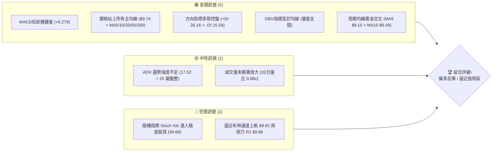
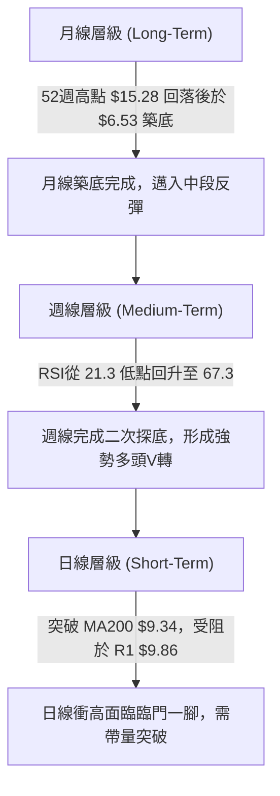
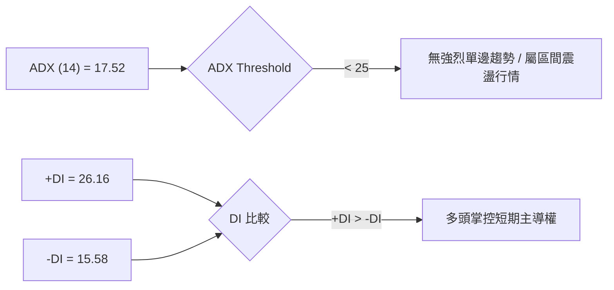
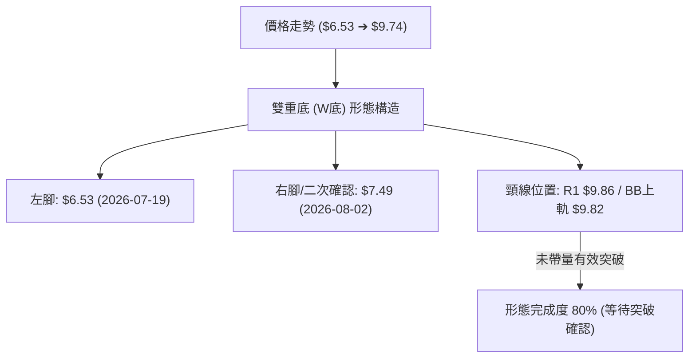
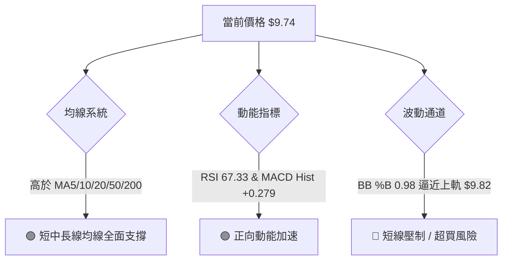
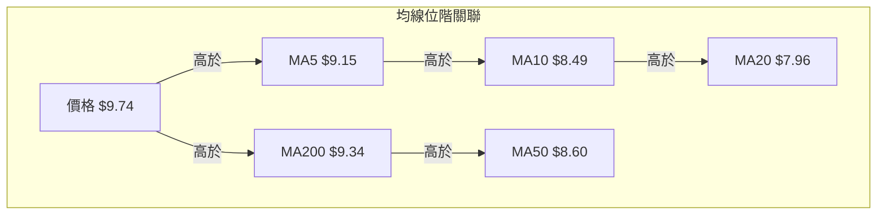
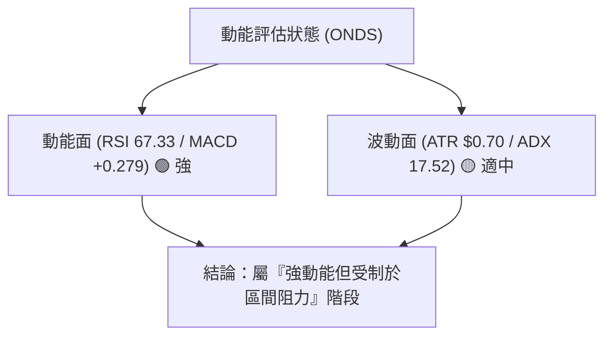
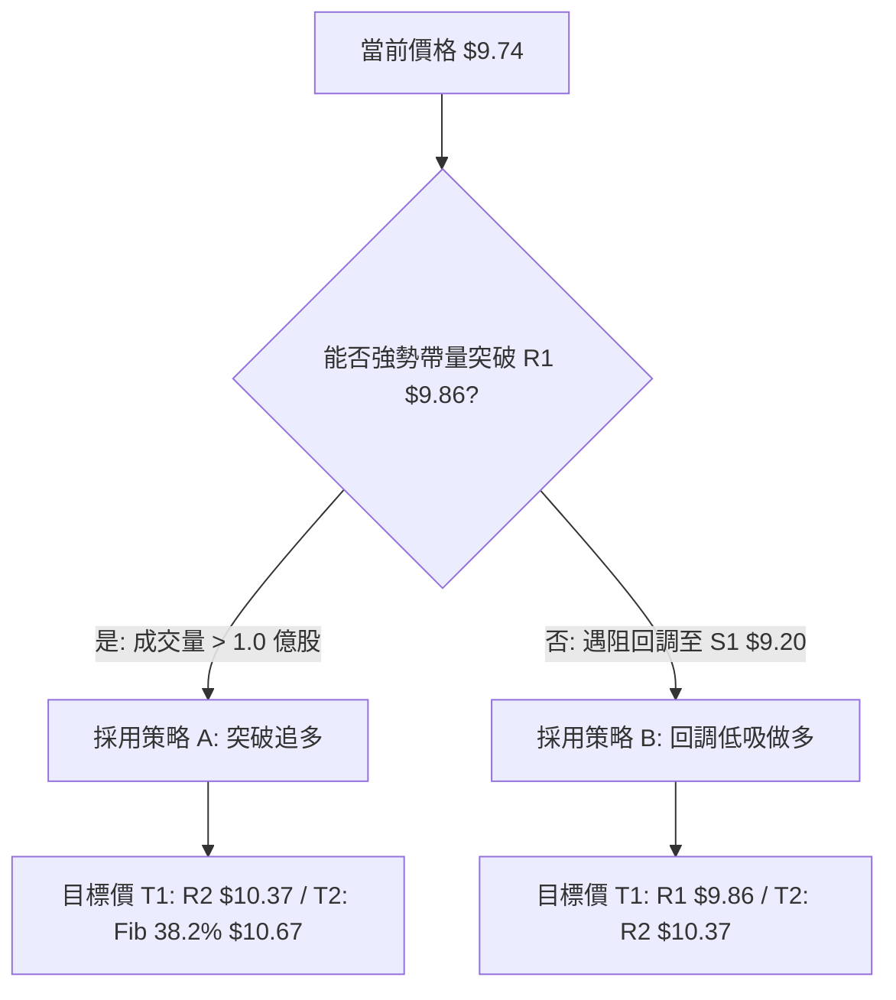
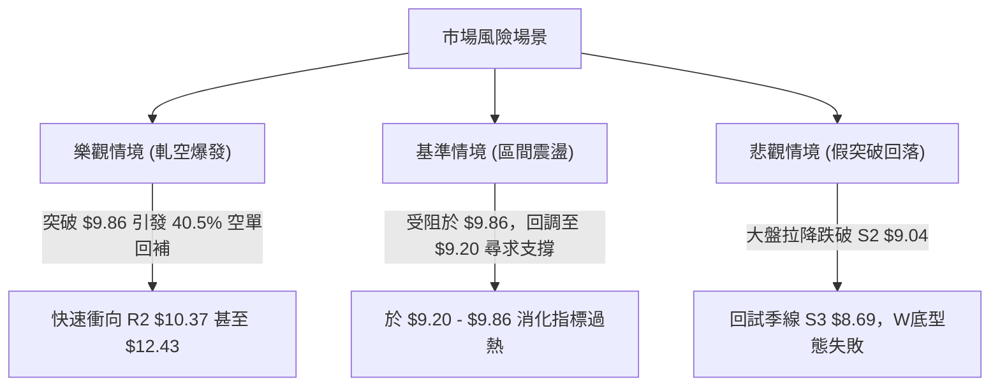

# ONDS 技術分析報告

> **報告日期**：2026-08-12 ｜ **語言**：繁體中文 ｜ **數據來源**：Yahoo Finance ｜ **當前價格**：$9.74

---

## 目錄

| 章節 | 內容 |
|------|------|
| [1. 技術面概覽](#1-技術面概覽) | 訊號儀表板、核心指標、評分卡 |
| [2. 趨勢分析](#2-趨勢分析) | 多時框趨勢、長中短期走勢 |
| [3. 圖表形態分析](#3-圖表形態分析) | 形態識別、K線組合、目標價 |
| [4. 支撐與阻力](#4-支撐與阻力) | 關鍵價位、斐波那契回調 |
| [5. 技術指標深度解讀](#5-技術指標深度解讀) | MA/RSI/MACD/布林/成交量 |
| [6. 動能與波動率](#6-動能與波動率) | 動能評估、ATR、Beta |
| [7. 多時框架總結](#7-多時框架總結) | 時框架評分矩陣 |
| [8. 交易策略建議](#8-交易策略建議) | 多空策略、風險報酬比 |
| [9. 風險提示與監控](#9-風險提示與監控) | 監控指標、風險場景 |

---

## 1. 技術面概覽

### 🎯 技術訊號儀表板



### 📊 核心指標速覽表

| 指標類別 | 指標名稱 | 當前數值 | 訊號 | 解讀 |
|----------|----------|----------|------|------|
| **價格** | 當前收盤價 | $9.74 | 🟢 多頭 | 位於 52 週區間 ($3.20 - $15.28) 的 54.1% 位置 |
| **均線** | MA20 (月線) | $7.96 | 🟢 多頭 | 價格高於 MA20 +22.33%，中短期支撐強勁 |
| **均線** | MA50 (季線) | $8.60 | 🟢 多頭 | 價格高於 MA50 +13.26%，季線止跌翻揚 |
| **均線** | MA200 (年線)| $9.34 | 🟢 多頭 | 價格高於 MA200 +4.28%，成功收復長線生命線 |
| **動能** | RSI(14) | 67.33 | 🟢 多頭 | 強勢偏多區間，尚未進入極度過熱區 (>70) |
| **動能** | MACD (12,26,9)| +0.307 / Hist +0.279 | 🟢 多頭 | 多頭柱狀體持續擴張，正向動能強勁 |
| **動能** | Stoch %K / %D | 99.66 / 95.24 | 🔴 空頭 | 指標高檔鈍化，短線存在拉回修復需求 |
| **趨勢** | ADX(14) | 17.52 | 🟡 中性 | < 25 顯示市場處於無明確大趨勢的區間震盪 |
| **波動** | BB通道 %B | 0.98 | 🟡 中性 | 價格貼近布林上軌 ($9.82)，面臨上軌壓制 |
| **波動** | ATR(14) | $0.70 (7.18%) | 🟡 中性 | 每日波幅適中，提供合理的止損設置空間 |
| **量能** | 20日均量比 | 0.68x | 🟡 中性 | 上漲過程中成交量萎縮，呈現「縮量上攻」 |

### 🏆 技術評分卡

```
╔══════════════════════════════════════════════════════════════╗
║              技術評分卡 — ONDS (2026-08-12)                   ║
╠══════════════════════════════════════════════════════════════╣
║ 趨勢強度 (ADX)     ███████░░░░░░░░░░░░░  35/100  🟡 中性      ║
║ 動能指標 (RSI/MACD)███████████████░░░░░  75/100  🟢 強勢      ║
║ 支撐穩定度 (Fib/S1)██████████████░░░░░░  70/100  🟢 良好      ║
║ 成交量配合 (OBV)   ████████████░░░░░░░░  60/100  🟡 普通      ║
║ 形態完整度 (W底)   █████████████░░░░░░░  65/100  🟢 尚可      ║
║ 均線結構 (MA排列)  ██████████████░░░░░░  70/100  🟢 偏多      ║
╠══════════════════════════════════════════════════════════════╣
║ 綜合評分           █████████████░░░░░░░  64/100  🟢 偏多反彈  ║
╚══════════════════════════════════════════════════════════════╝
```

---

## 2. 趨勢分析

### 🌐 多時框趨勢分析



### 📈 長期趨勢 — 12個月走勢圖（Unicode）

```
ONDS 月線走勢圖（2025-09 至 2026-08）
價格軸 ($)
$14.00 ┤                               ● $13.22 (52W高點區域)
$12.00 ┤
$10.00 ┤            ● $10.36               ● $10.04           ● $9.74 (現價)
$8.00  ┤  ● $7.72       ● $9.04                  ● $8.24  ● $7.49
$6.00  ┤      ● $6.44
$4.00  ┤
       └─────────────────────────────────────────────────────────────
         25/09 25/11 26/01   26/03    26/05    26/06  26/07  26/08
```

#### 走勢特徵分析表

| 時間階段 | 價格區間 | 變動幅度 | 市場行為與技術特徵 |
|----------|----------|----------|--------------------|
| **2025-08 ~ 2025-09** | $5.86 ➔ $7.72 | +31.74% | 初期拉升，多頭動能試探性建倉 |
| **2025-10 ~ 2026-01** | $6.44 ➔ $10.36 | +60.87% | 主升段第一波，價格突破 $10 整數關卡 |
| **2026-02 ~ 2026-03** | $10.08 ➔ $9.04 | -10.32% | 高檔震盪洗盤，進行 MA50 支撐測試 |
| **2026-04 ~ 2026-05** | $10.04 ➔ $13.22 | +31.67% | 強勢二次衝高，創下 2026 年新高 $13.22 |
| **2026-06 ~ 2026-07** | $8.24 ➔ $7.49 | -43.34% | 深幅回調，一度跌破 MA200，最低探至 $6.53 |
| **2026-08 (至今)** | $7.49 ➔ $9.74 | +30.04% | 強力V型反彈，重新收復 MA200，逼近 $10 關卡 |

### 📊 中期趨勢（週線分析）

從週線數據觀察（近20週數據）：
1. **探底過程**：ONDS 於 2026 年 6 月底至 7 月底經歷嚴重的拋售潮，週 RSI 一度跌至 **21.3** 的極度超賣區域，收盤最低觸及 $6.53（2026-07-19 當週）。
2. **量能爆發**：在 $6.53 底部的打擊區，成交量大幅放量至 **6.71 億股**，隨後於 $7.80 當週更爆出 **8.34 億股** 的歷史天量，顯示機構資金在 $6.50 - $7.80 區間進行強力的低吸吸籌（Accumulation）。
3. **動能轉向**：週 MACD 柱狀體自 2026-07-26 當週翻正（+0.181），並連續四周擴張至 +0.279，週 RSI 快速拉升至 **67.3**，確認中期底部已在 $6.53 落實。

### ⚡ 趨勢強度評估（ADX 解讀）



| ADX 數值範圍 | 當前狀態 (17.52) | 市場含義與交易策略指導 |
|--------------|------------------|------------------------|
| 0 - 20 | **✓ 當前位置** | **弱趨勢 / 無趨勢區間**：市場處於橫盤或寬幅震盪，追高風險較大，適合布林通道軌道交易策略（上軌賣/下軌買）或突破確認後進場。 |
| 20 - 25 | 邊界 | **趨勢萌芽期**：若 ADX 向上突破 25，則代表新一輪單邊趨勢正開始啟動。 |
| 25 - 50 | 否 | **強趨勢行情**：順勢交易策略的最佳時期。 |

---

## 3. 圖表形態分析

### 🔍 形態識別系統



#### 形態信心度與目標價評估

| 形態名稱 | 信心度 | 判斷依據（引用 OHLCV 數據） | 完成度 | 目標價（附計算公式） |
|----------|--------|------------------------------|--------|----------------------|
| **雙重底 (W底)** | **68%** | 兩次下探低點分別為 $6.53 及 $7.49，且 $7.80 當週放量 8.34 億股確立換手底部；當前價格 $9.74 逼近頸線阻力 R1 $9.86。 | 80% | **測算目標價 = $13.19**<br>計算式：頸線 $9.86 + (頸線 $9.86 - 第一低點 $6.53 = $3.33) = $13.19<br>*(極為接近 2026 年 5 月高點 $13.22 及 斐波那契 23.6% 回調位 $12.43)* |
| **上升通道** | **55%** | 日線層級由 MA5 ($9.15) 與 MA10 ($8.49) 帶動的短線反彈通道。 | 90% | 上軌阻力落在 R2 $10.37 |

### 🕯️ 重要 K 線形態分析（近 5 個月）

| 月份 | 收盤價 | K線形態 | 技術解讀 | 多空訊號 |
|------|--------|---------|----------|----------|
| **2026-04** | $10.04 | 十字星/轉折線 | 多空交戰，於 $10 關卡形成暫時平衡 | 🟡 中性 |
| **2026-05** | $13.22 | 長陽線帶上影 | 多頭強勢發力但高檔遇阻，觸及 52 週高點區域 | 🟢 偏多 |
| **2026-06** | $8.24 | 大陰線向下包覆 | 獲利賣壓沉重，一舉跌破多條支撐均線 | 🔴 偏空 |
| **2026-07** | $7.49 | 下影線長陰 / 底步錘子 | 低檔爆天量換手，出現強烈止跌落底訊號 | 🟢 買盤進駐 |
| **2026-08** | $9.74 | 強勢大陽線 (進行中) | V型強彈，將前月失頭完全收復 | 🟢 強勢偏多 |

### 📉 ASCII 走勢形態示意圖

```
ONDS 日線雙重底 (W底) 形態示意圖
價位 ($)
$10.37 ┤                                     [R2 阻力目標]
$9.86  ┤-------------- 頸線阻力區 (R1) ------------- ◄ 現價 $9.74 迫近中
$9.24  ┤......... (Fib 50.0% 中軸線) .............
$8.69  ┤
$7.81  ┤             \                     /
$7.49  ┤              \       ● (右腳 $7.49)
$6.53  ┤  ● (左腳 $6.53) \____/
       └────────────────────────────────────────────
         07/19          07/26    08/02     08/12
```

---

## 4. 支撐與阻力

### 🗺️ 關鍵價位分布圖（Unicode）

```
ONDS 價位結構與密集成交區分布圖
═══════════════════════════════════════════════════════════════
$15.28 ║████████████████████████████████████║ 52週最高點 (0.0% Fib)
$12.43 ║██████████████████                  ║ 斐波那契 23.6% 回調位
$11.66 ║██████████████████████████          ║ 強阻力 R3 (波段高點聚類)
$10.67 ║██████████████                      ║ 斐波那契 38.2% 回調位
$10.37 ║████████████████████                ║ 阻力 R2 (反彈次高點)
$9.86  ║████████████████████████████        ║ 關鍵阻力 R1 / 布林上軌 $9.82
$9.74  ╠════════════════════════════════════╣ ◄ 當前價格 $9.74
$9.24  ║▓▓▓▓▓▓▓▓▓▓▓▓▓▓▓▓▓▓▓▓▓▓▓▓▓▓▓▓        ║ 斐波那契 50.0% 中軸 / S1 $9.20 / MA200 $9.34
$9.04  ║████████████████████████            ║ 強支撐 S2 / MA240 $9.04
$8.69  ║████████████████                    ║ 支撐 S3 / MA50 $8.60
$7.81  ║▓▓▓▓▓▓▓▓▓▓▓▓                        ║ 斐波那契 61.8% 回調位 / BB中軌 $7.96
$3.20  ║████████████████████████████████████║ 52週最低點 (100.0% Fib)
═══════════════════════════════════════════════════════════════
```

### 🚧 阻力位分析表

| 阻力級別 | 精確價位 | 形成原因與數據來源 | 突破難度 | 重要性 |
|----------|----------|--------------------|----------|--------|
| **阻力 R1** | **$9.86** | 近一年波段高點聚類、貼近布林上軌 ($9.82) | 🔴 高 (短線壓制) | ★★★★☆ |
| **阻力 R2** | **$10.37**| 近一年波段高點聚類、$10 心理關卡伸展區 | 🟡 中 | ★★★☆☆ |
| **阻力 R3** | **$11.66**| 近一年波段高點聚類、解套盤密集成交區 | 🔴 極高 | ★★★██ |

### 🛡️ 支撐位分析表

| 支撐級別 | 精確價位 | 形成原因與數據來源 | 守住機率 | 重要性 |
|----------|----------|--------------------|----------|--------|
| **支撐 S1** | **$9.20** | 近一年波段低點聚類、極度接近 50.0% Fib ($9.24) 與 MA200 ($9.34) | 🟢 80% | ★★★★★ |
| **支撐 S2** | **$9.04** | 近一年波段低點聚類、相鄰 MA240 ($9.04) | 🟢 85% | ★★★★☆ |
| **支撐 S3** | **$8.69** | 近一年波段低點聚類、接近 MA50 ($8.60) | 🟢 90% | ★★★☆☆ |

### 📐 斐波那契回調位分析

依據 52 週高低點區間（$3.20 ➔ $15.28，總波幅 $12.08）進行黃金分割回調測算：

| 斐波那契層級 | 精確價位 | 與現價 ($9.74) 距離 | 技術面解讀與意義 |
|--------------|----------|---------------------|------------------|
| **0.0%** (52W High) | $15.28 | +56.88% | 歷史極致高點壓力 |
| **23.6%** | $12.43 | +27.62% | 中期波段強勢目標位 |
| **38.2%** | $10.67 | +9.55% | 多頭推進的重要關卡 |
| **50.0%** | **$9.24** | **-5.13%** | **多空分水嶺（現價已成功站上此中軸）** |
| **61.8%** | $7.81 | -19.82% | 黃金支撐位（7月底回調於此附近 $7.49 成功落止跌） |
| **78.6%** | $5.79 | -40.55% | 深幅回調防線 |
| **100.0%** (52W Low) | $3.20 | -67.15% | 52 週最低點起漲點 |

**位置解讀**：當前價格 **$9.74** 剛好突破了 50.0% 斐波那契回調位 ($9.24)，目前運行於 **50.0% ($9.24)** 與 **38.2% ($10.67)** 之間的拉升區間，屬於典型的多頭復甦格局。

---

## 5. 技術指標深度解讀

### 🎛️ 指標訊號總覽



### 📈 移動平均線排列分析



1. **短線黃金交叉**：MA5 ($9.15) > MA10 ($8.49) > MA20 ($7.96)，短期均線呈極佳的拉升多頭排列。
2. **年線關卡收復**：價格衝過 MA200 ($9.34)，這是一個非常關鍵的長線多空轉折訊號。只要收盤價持續穩在 $9.34 以上，長期趨勢將由空轉為多震盪。
3. **季線月線金叉預估**：MA20 ($7.96) 正在快速向上扣抵，預計未來幾個交易日有機會向上金叉 MA50 ($8.60)。

### 📉 RSI(14) 分析

```
RSI(14) 動能進度條：
0                   30               50        67.33 70              100
├───────────────────┼────────────────┼───────────█───┼────────────────┤
[       超賣區       ]   [   弱勢區   ]   [  偏多區  ] [  超買區 (99.66 K)]
```

- **當前讀數**：**67.33**（位於 50-70 強勢偏多區間）。
- **背離判斷**：由 7 月底的 RSI 21.3 低點一路隨價格上揚至 67.33，**目前無明顯頂背離或底背離**，動能與價格走勢高度一致（Price-RSI Confirmation）。

### 📊 MACD(12,26,9) 訊號解讀

- **MACD 快線**：+0.307
- **Signal 慢線**：+0.028
- **MACD 柱狀體 (Histogram)**：**+0.279** 🟢
- **分析**：MACD 快線已雙雙穿過零軸，且柱狀體持續呈階梯狀擴張（由 +0.109 ➔ +0.252 ➔ +0.279），顯示買盤控制力強，短線多頭動能充足。

### 📦 布林通道分析

```
布林通道現狀示意圖 ($)
$9.82 ┤------------------------------------------- 布林上軌 (BB Upper)
$9.74 ┤  ● 現價 $9.74 (BB %B = 0.98, 極度貼近上軌)
$7.96 ┤------------------------------------------- 布林中軌 (MA20)
$6.11 ┤------------------------------------------- 布林下軌 (BB Lower)
```

- **通道寬度**：BB 上軌 $9.82 與下軌 $6.11 形成 $3.71 的通道寬度。
- **現價位置**：%B 為 **0.98**，意味著價格已進入上軌邊緣（$9.82），通常在 ADX < 25 的盤整行情中，觸及上軌容易引發短期技術性回調或橫盤消化。

### 💹 成交量分析（量價配合度）

- **當前日成交量**：72,336,139 股
- **20 日均量**：106,658,607 股（**量比 0.68x**）
- **OBV 趨勢**：OBV > MA，量能指標呈正向支撐。
- **解讀**：價格大幅反彈至 $9.74，但成交量相比 20 日均量顯得稍有不足（0.68x），此種「縮量夾頂」現象暗示突破阻力 R1 $9.86 需要有強大的補量（當日量至少需 > 1.0 億股）才能實現有效突破。

---

## 6. 動能與波動率

### ⚡ 動能評估四象限

| 象限區分 | 高動能 | 低動能 |
|----------|--------|--------|
| **高波動率 (High Volatility)** | **Q3: 高風險高收益**<br>*(歷史 5-6 月區間)* | **Q4: 高風險無收益**<br>*(7 月大跌區間)* |
| **低波動率 (Low Volatility)** | **Q1: 最佳累積區** | **✓ Q2: 區間震盪蓄勢**<br>**(當前位置: ATR 7.18%, ADX 17.52, 動能強但波幅受限)** |



### 📊 ATR 波動率分析

- **ATR(14) 數值**：**$0.70**
- **波幅百分比**：**7.18%**（$0.70 / $9.74）
- **交易應用**：
  - **日內波幅**：平均每日上下波動約 $0.70。
  - **止損距離建議**：做多時，合理止損設置應離進場點至少 **1.5 至 2.0 倍 ATR**，即離進場價位下方 **$1.05 - $1.40**，以避免被正常市場噪音甩出場。

### 📐 Beta 與市場相關性

- **Beta 係數**：**2.75**（屬高 Beta 科技/通訊設備股）。
- **解讀**：ONDS 的波動幅度是大盤（S&P 500）的 2.75 倍。當美股大盤上漲 1% 時，ONDS 平均隨之放大上漲 2.75%；反之大盤回調時，賣壓亦會加倍釋放。

---

## 7. 多時框架總結

### 📋 時框架評分表

| 時框架 | 趨勢方向 | 動能 (RSI) | 均線排列 | 形態狀態 | 綜合評分 | 交易策略建議 |
|--------|----------|------------|----------|----------|----------|--------------|
| **日線 (Daily)** | 🟢 偏多反彈 | 🟢 67.33 (強) | 🟢 價格 > MA5/10/20 | W底近頸線 | **72/100** | 突破 R1 或回調進場 |
| **週線 (Weekly)**| 🟡 橫盤復甦 | 🟢 67.30 (強) | 🟡 震盪糾結 | 底部強彈 | **62/100** | 逢低佈局，持股觀望 |
| **月線 (Monthly)**| 🟡 中性築底 | 🟡 50.0 (中) | 🔴 MA200 壓制 | 長期大區間 | **55/100** | 長線等待突破 $10.37 |

### 🔲 綜合訊號矩陣

```
                     日線 (Short)    週線 (Medium)    月線 (Long)
趨勢 (Trend)             🟢               🟡               🟡
動能 (Momentum)          🟢               🟢               🟡
成交量 (Volume)          🟡               🟢               🟡
均線 (MA System)         🟢               🟡               🔴
-----------------------------------------------------------------
整體一致性               🟢 偏多          🟢 偏多          🟡 中性
```

### ⚖️ 多時框收斂結論

依據多時框收斂規則（ADX = 17.52 < 25）：
1. **行情屬性**：當前市場處於**大區間震盪行情**，而非強烈的單邊趨勢，主要運作區間位於布林通道上下軌（$6.11 - $9.82）與關鍵支撐阻力之間。
2. **時框優先級**：由於日線動能非常強勁（MACD 柱 +0.279，RSI 67.33），帶動價格逼近區間頂部（R1 $9.86 / BB上軌 $9.82）。
3. **最終方向性結論**：**偏多反彈，但在 R1 $9.86 未帶量突破前不宜盲目追高，首選「突破順勢追價」或「回調至 S1 $9.20 逢低做多」**。

---

## 8. 交易策略建議

### 🗺️ 策略決策流程圖



### 🧭 策略路由

**當前主策略方向 = 🟢 多頭波段與突破策略（依技術評分卡 64/100 路由）**

### 🎯 價格情境階梯 (Price Scenarios)

| 觸發條件 | 下一目標價 | 後續延伸目標 | 技術面情境含義 |
|----------|------------|--------------|----------------|
| **帶量突破 R1 $9.86** | R2 $10.37 | Fib 38.2% $10.67 | 雙重底形態正式激活，短線邁入加速主升段 |
| **於 $9.20 - $9.86 區間整理**| — | — | 高檔消化過熱指標 (Stoch %K 99.66)，儲備突破動能 |
| **跌破 S1 $9.20 / MA200** | S2 $9.04 | S3 $8.69 | 反彈挫敗，假突破離場，重新回試季線支撐 |

### 📊 情境機率分佈

```
情境機率分佈：
[突破上攻/震盪偏多: 55%]  ███████████████████████████░░░░░░░░░░░░░
[區間整理/橫盤消化: 30%]  █████████████░░░░░░░░░░░░░░░░░░░░░░░░░░░
[回落探底/假突破  : 15%]  ███████░░░░░░░░░░░░░░░░░░░░░░░░░░░░░░░░░
```

| 情境方向 | 估計機率 | 主要技術面依據 |
|----------|----------|----------------|
| **突破上攻 / 震盪偏多** | **55%** | MACD 柱狀體強勁擴張 (+0.279)、+DI (26.16) > -DI (15.58)、價格站上 MA200 ($9.34)。 |
| **高檔區間震盪** | **30%** | ADX < 25 (17.52) 顯示無大單邊趨勢，且量能比僅 0.68x 需時間補量。 |
| **深幅回調探底** | **15%** | 隨機指標超買 (Stoch %K 99.66)，若美股大盤拉降可能引發高 Beta 拋售。 |

### 🟢 主策略詳情

所有進場點、止損點及目標價**嚴格依據第 4 章數據**計算：

| 策略要素 | 策略 A：突破追多策略 (Breakout Play) | 策略 B：低吸做多策略 (Pullback Buy) |
|----------|-------------------------------------|-------------------------------------|
| **進場條件** | 實體 K 線收盤突破 R1 $9.86，且日成交量 > 1.0 億股 | 價格回調至 S1 $9.20 / Fib 50% $9.24 止跌 |
| **進場價格** | **$9.88** (突破 R1 後確認進場) | **$9.25** (接近 S1 支撐位進場) |
| **目標價 T1** | **$10.37** (阻力 R2) | **$9.86** (阻力 R1) |
| **目標價 T2** | **$10.67** (斐波那契 38.2% 回調位) | **$10.37** (阻力 R2) |
| **止損價格** | **$9.18** (跌破 S1 $9.20 止損，風險幅度 $0.70 ≈ 1.0 ATR) | **$8.65** (跌破 S3 $8.69 止損，風險幅度 $0.60) |
| **風險報酬比 (R:R)**| **1 : 1.13 (T1) / 1 : 1.56 (T2)** | **1 : 1.02 (T1) / 1 : 1.87 (T2)** |
| **建議倉位** | 10% - 15% 輕倉試錯 | 15% - 20% 標準倉位 |

### 🔴 反向風險觸發點（對沖與止損提示）

- **多頭失效觸發價**：**$9.04 (S2 支撐)**。若日線收盤價跌破 $9.04，代表收復 MA200 為假突破，多頭結構遭到破壞，應立即執行全面止損離場。
- **做空對沖條件**：若價格無法突破 R1 $9.86，且出現單日長上影線（高檔倒鎚頭）伴隨 Stoch %K 死叉，可短線輕倉對沖避險，目標看至 S1 $9.20。

### ⭐ 整體訊號強度評星

```
做多訊號強度：  ★★██☆  (3.5 / 5 星 — 動能極佳但面臨臨門一腳壓制)
做空訊號強度：  ★★☆☆☆  (2.0 / 5 星 — 僅為短線指標超買拉回風險)
整體策略可信度：★★██☆  (3.8 / 5 星 — 價位結構非常清晰)
```

---

## 9. 風險提示與監控

### ✅ 關鍵監控指標 Checklist

```
╔══════════════════════════════════════════════════════════════╗
║                ONDS 技術面風險監控 Checklist                 ║
╠══════════════════════════════════════════════════════════════╣
║ [ ] R1 $9.86 突破狀況：觀察是否有 > 1.0 億股的大量配合      ║
║ [ ] MA200 $9.34 防守狀況：日線收盤不可連續兩天低於此價位     ║
║ [ ] Stoch %K 指標修復：關注高檔鈍化是否演變為往下死叉        ║
║ [ ] ADX (14) 是否升破 25：升破 25 代表新一輪強趨勢開始發動   ║
║ [ ] 空頭回補進度：目前 Short % Float 高達 40.5%，留意軋空行情║
╚══════════════════════════════════════════════════════════════╝
```

### ⚠️ 風險場景分析



### 🛡️ 風險管理重要提醒

1. **高 Short Float 風險與機會並存**：ONDS 目前做空比例高達 **40.5%**（Short Ratio 3.05），這意味著市場存在極強的軋空（Short Squeeze）潛能。一旦價格強勢帶量攻破 R1 $9.86，空頭迫於補倉壓力可能推升股價出現劇烈暴漲。
2. **高 Beta 波動性控管**：ONDS 的 Beta 為 2.75，單日上下 7%-10% 屬於正常波動範疇。投資人務必依據 ATR ($0.70) 嚴格控制單筆交易的資金風險（建議單筆損失不超過總資產的 1%-2%）。

---

## 📋 報告總結

```
╔══════════════════════════════════════════════════════════════╗
║                   ONDS 技術分析報告總結                      ║
════════════════════════════════════════════════════════════════
報告日期：2026-08-12
當前價格：$9.74
分析評級：🟢 偏多反彈 (高檔臨門一腳，等待突破或回調進場)

關鍵結論：
├─ 長期趨勢：🟡 中性築底 (站上 MA200 $9.34，等待突破 $10.37)
├─ 中期趨勢：🟢 強勢復甦 (W底完成度 80%，週線 MACD 擴張)
├─ 短期趨勢：🟢 多頭控盤 (MA5/10/20 金叉，逼近阻力 R1 $9.86)
├─ 關鍵支撐：S1 $9.20 / S2 $9.04 / S3 $8.69
├─ 關鍵阻力：R1 $9.86 / R2 $10.37 / R3 $11.66
└─ 分析師共識目標價：$19.06 (買入評級)

最優交易策略組合：
1. 🥇 最佳機會：等待帶量突破 R1 $9.86 後追多，目標看至 $10.37 - $10.67。
2. 🥈 次選機會：若受阻回調，於 S1 $9.20 / Fib 50% $9.24 附近低吸做多。
3. 🥉 風險防守：跌破 S2 $9.04 執行嚴格止損。
════════════════════════════════════════════════════════════════
```

---

> ⚠️ **免責聲明**：本報告為 AI 自動生成之技術分析研究，所有價位與指標均基於歷史 OHLCV 數據進行客觀演算。本報告**僅供學術研究與參考**，**不構成任何投資建議與買賣推薦**。金融市場投資具高風險，請投資人自行評估風險並自負盈虧。

*報告生成時間：2026-08-12 ｜ 數據來源：Yahoo Finance ｜ 分析框架：多時框技術分析系統*