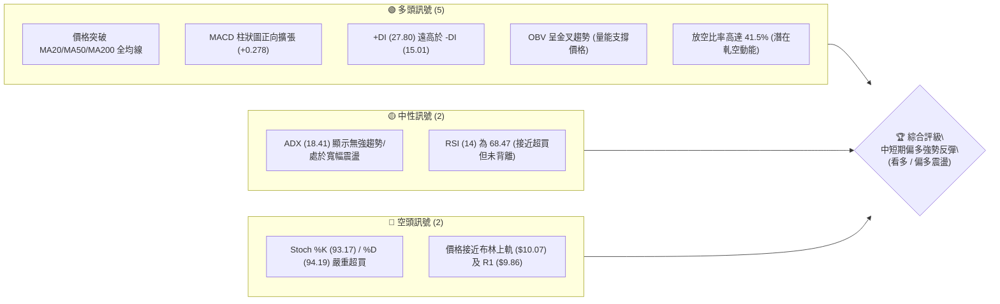
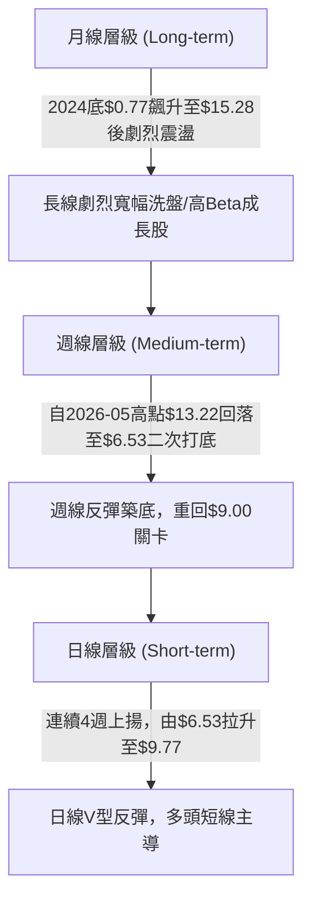
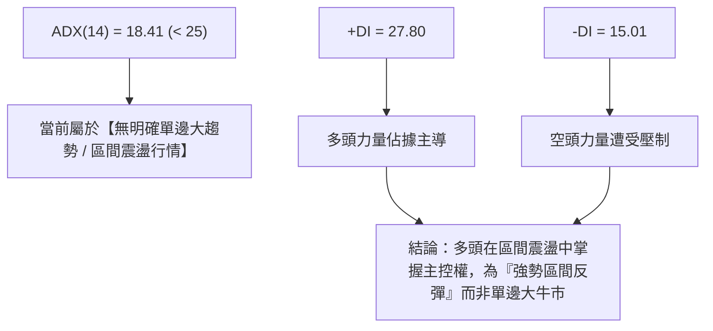
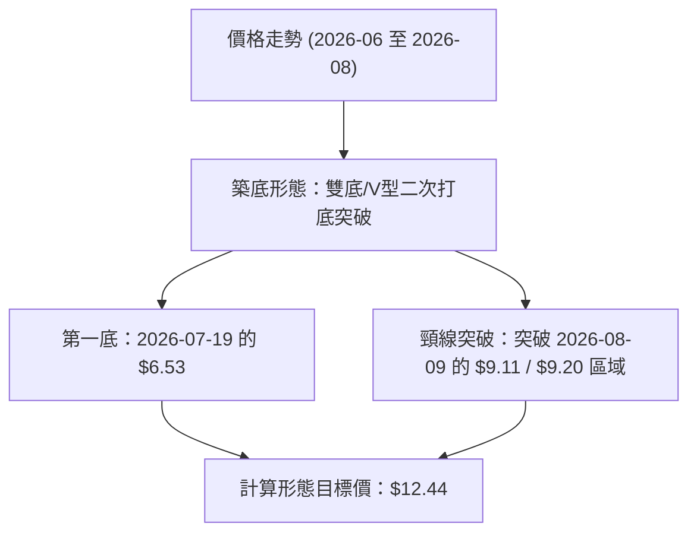
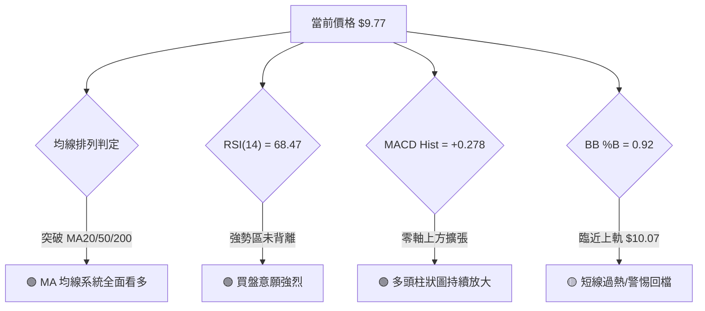
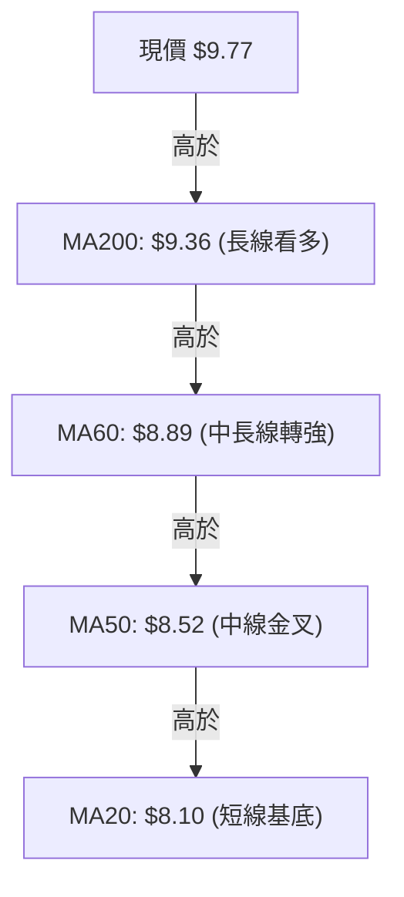
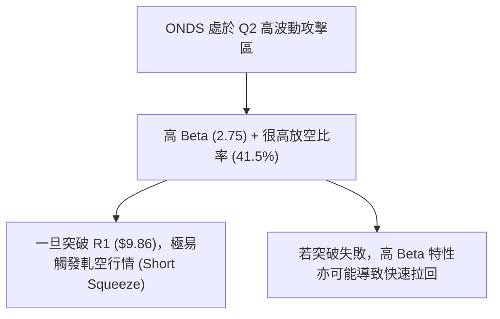
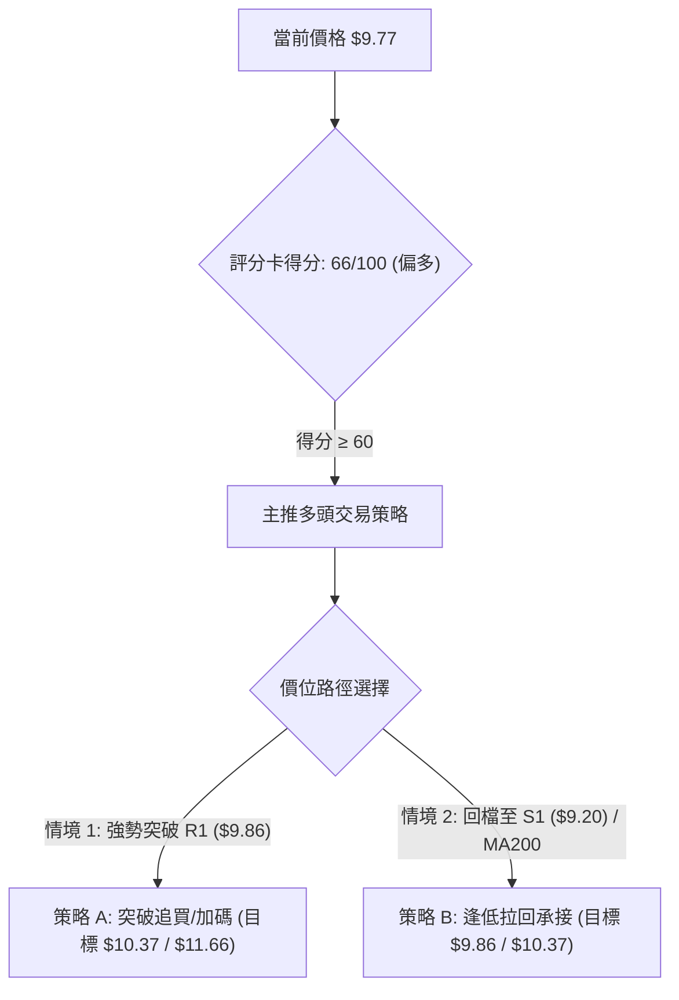
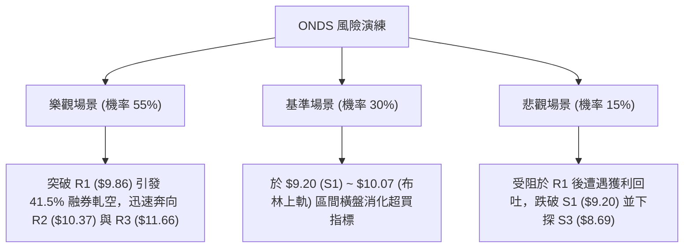

# ONDS 技術分析報告

> **報告日期**：2026-08-13 ｜ **語言**：繁體中文 ｜ **數據來源**：Yahoo Finance ｜ **當前價格**：$9.77

---

## 目錄

| 章節 | 內容 |
|------|------|
| [1. 技術面概覽](#1-技術面概覽) | 訊號儀表板、核心指標、評分卡 |
| [2. 趨勢分析](#2-趨勢分析) | 多時框趨勢、長中短期走勢、ADX解讀 |
| [3. 圖表形態分析](#3-圖表形態分析) | 形態識別、信心度評估、目標價推算 |
| [4. 支撐與阻力](#4-支撐與阻力) | 關鍵價位、斐波那契回調結構 |
| [5. 技術指標深度解讀](#5-技術指標深度解讀) | MA/RSI/MACD/布林通道/成交量 |
| [6. 動能與波動率](#6-動能與波動率) | 動能四象限、ATR、Beta與高軋空風險 |
| [7. 多時框架總結](#7-多時框架總結) | 時框架評分矩陣、多時框收斂結論 |
| [8. 交易策略建議](#8-交易策略建議) | 策略路由、情境階梯、精確風報比交易計劃 |
| [9. 風險提示與監控](#9-風險提示與監控) | 監控清單、三情境演練、風控提醒 |

---

## 1. 技術面概覽

### 🎯 技術訊號儀表板



### 📊 核心指標速覽表

| 指標類別 | 指標名稱 | 當前數值 | 訊號 | 解讀 |
|----------|----------|----------|------|------|
| **價格** | 當前收盤價 | $9.77 | 🟢 多頭 | 站穩多條關鍵均線上方，處於52週區間54.4%位置 |
| **均線** | MA20 | $8.10 | 🟢 看多 | 價格在MA20上方 (+20.65%)，短線乖離拉開 |
| **均線** | MA50 | $8.52 | 🟢 看多 | 價格突破中軌均線，短中期轉強 |
| **均線** | MA200 | $9.36 | 🟢 看多 | 價格上穿長天期生命線，牛熊分界線順利站回 |
| **動能** | RSI(14) | 68.47 | 🟡 中性偏多 | 靠近超買區(70)，無頂背離跡象，顯示強勁買盤 |
| **動能** | MACD | +0.375 (柱狀+0.278) | 🟢 看多 | 快慢線零軸上方金叉，多頭動能持續釋放 |
| **擺動** | Stoch %K/%D | 93.17 / 94.19 | 🔴 超買警告 | 短線動能過熱，需警惕臨近阻力處的拉回 |
| **波動** | ATR(14) | $0.69 (7.02%) | 🟡 中度波動 | 日均波動幅度較高，建議擴大止損緩衝 |
| **趨勢強度**| ADX(14) | 18.41 | 🟡 盤整/無強趨勢 | ADX<25 顯示整體為箱體/區間反彈，非單邊大趨勢 |

### 🏆 技術評分卡

```
╔══════════════════════════════════════════════════════════════════╗
║                ONDS 技術評分卡 (2026-08-13)                     ║
╠══════════════════════════════════════════════════════════════════╣
║ 趨勢強度 (ADX)     ▓▓▓▓▓▓▓░░░░░░░░░░░░░  35/100  🟡 區間打底    ║
║ 短期動能 (MACD/RSI)▓▓▓▓▓▓▓▓▓▓▓▓▓▓▓░░░░░  75/100  🟢 動能充沛    ║
║ 支撐穩定度 (S1/S2) ▓▓▓▓▓▓▓▓▓▓▓▓▓▓▓▓░░░░  80/100  🟢 底部堅實    ║
║ 成交量配合 (OBV)   ▓▓▓▓▓▓▓▓▓▓▓▓▓░░░░░░░  65/100  🟢 溫和放大    ║
║ 形態完整度         ▓▓▓▓▓▓▓▓▓▓▓▓▓░░░░░░░  65/100  🟢 V型/雙底結構║
║ 均線突破 (MA200)   ▓▓▓▓▓▓▓▓▓▓▓▓▓▓▓░░░░░  75/100  🟢 成功站上    ║
╠══════════════════════════════════════════════════════════════════╣
║ 綜合技術評分       ▓▓▓▓▓▓▓▓▓▓▓▓▓█░░░░░░  66/100  🟢 偏多反彈    ║
╚══════════════════════════════════════════════════════════════════╝
```

---

## 2. 趨勢分析

### 🌐 多時框趨勢分析



### 📈 長期趨勢 — 12個月走勢圖（Unicode）

```
ONDS 12個月歷史價格走勢圖 (2025-08 至 2026-08)
價格軸 ($)
$15.28 ┤                                    ● (52W High)
$13.22 ┤                                ●
$10.36 ┤                    ●       ●               ● (現價 $9.77)
$9.76  ┤            ●   ●   │   ●   │           ●   │
$7.72  ┤    ●   ●   │   │   │   │   │       ●   │   │
$5.86  ┤●   │   │   │   │   │   │   │   ●   │   │   │
$3.20  ┤│   │   │   │   │   │   │   │   │   │   │   │ (52W Low)
       └┼───┼───┼───┼───┼───┼───┼───┼───┼───┼───┼───┼───
       08/25 09  10  11  12  01/26 02  03  04  05  06  07  08/26
```

#### 走勢特徵分析表

| 階段 | 時間區間 | 價格區間 | 漲跌幅 | 走勢特徵與技術意義 |
|------|----------|----------|--------|--------------------+
| 主升段 | 2025-08 ~ 2026-01 | $5.86 → $10.36 | +76.8% | 強烈爆發，主力資金拉抬，奠定多頭基調 |
| 高位震盪 | 2026-02 ~ 2026-04 | $10.08 → $10.04 | -0.4% | $9.00~$10.00 平台橫盤築底 |
| 脈衝破頂 | 2026-05 | $10.04 → $13.22 | +31.7% | 衝高至52週高點 $15.28 區域後迅速獲利結案 |
| 劇烈回撤 | 2026-06 ~ 2026-07 | $13.22 → $6.53 | -50.6% | 恐慌性下殺，打出年度次低點，觸及61.8%回調區 |
| 強烈反彈 | 2026-07 ~ 2026-08 | $6.53 → $9.77 | +49.6% | 週線4連陽強勢回升，連破 MA20/50/200 均線 |

### 📊 中期趨勢（週線分析）

中期走勢顯示，ONDS 在 2026 年 7 月中旬下探至 $6.53 低點後，獲得極強支撐買盤（當週成交量爆出 6.71 億股的投降式巨量），隨後呈現價量齊揚反彈。截至 2026 年 8 月中旬，價格已連續收復 $7.80、$9.11 與 $9.77，成功扭轉了 6 月份以來的單邊下跌陰影。

### ⚡ 趨勢強度評估（ADX 解讀）



*   **ADX 數值解析**：ADX(14) 目前為 **18.41**，低於臨界值 25，表明股票目前並未處於強烈的單邊大趨勢中。
*   **方向指標分析**：+DI (27.80) 明顯高於 -DI (15.01)，且兩者差值擴大，證實當前短期的買盤動能顯著優於賣盤，多頭主導了自 $6.53 以來的反彈格局。

---

## 3. 圖表形態分析

### 🔍 形態識別系統



#### 形態信心度與目標價評估表

| 形態名稱 | 信心度 | 判斷依據（引用數據） | 完成度 | 形態推算目標價（附計算式） |
|----------|--------|----------------------|--------|----------------------------|
| **V型反彈 / 雙底** | **65%** | 自 $6.53 低點強勢反彈，突破頸線 S1 ($9.20)，量能（週量3.8億股）配合 | 85% | 頸線 $9.20 + 形態高度 ($9.20 - $6.53 = $2.67) = **$11.87** (臨近 R3 $11.66) |
| **布林帶上軌擠壓突破** | **70%** | %B 為 0.92，價格沿上軌 ($10.07) 擴張，突破 MA200 ($9.36) | 90% | 上軌擴張測算：上軌 $10.07 + 1.0×ATR($0.69) = **$10.76** (臨近 Fib 38.2% $10.67) |

### 🕯️ 重要 K 線形態分析

| 月份/週期 | 收盤價 | 關鍵 K 線形態 | 技術解讀 | 訊號 |
|-----------|--------|---------------|----------|------|
| 2026-07-19 | $6.53 | 長下影爆量止跌 K 線 | 6.71 億股巨量洗清恐慌盤，形成中期關鍵底部 | 🟢 強止跌 |
| 2026-07-26 | $7.80 | 長陽貫穿實體 K 線 | 8.34 億股天量拉升，多頭反攻號角吹響 | 🟢 多頭進攻 |
| 2026-08-09 | $9.11 | 中陽線跳空站上 MA50 | 突破 $8.52 (MA50) 與 $8.89 (MA60)，均線系統扭轉 | 🟢 趨勢轉強 |
| 2026-08-16 | $9.77 | 實體陽線站上 MA200 | 成功站上 $9.36 (MA200)，逼近前高 R1 ($9.86) | 🟢 長線轉多 |

### 📉 ASCII 走勢形態示意圖

```
ONDS 短期 V 型反彈與頸線突破示意圖
價位 ($)
$10.37 ┤                                            [阻力 R2]
$9.86  ┤                                      ▲     [阻力 R1]
$9.20  ┤─────────────────●───────────────────/──────[頸線 / 支撐 S1]
$8.10  ┤                / \                 /       [BB 中軌 MA20]
$7.26  ┤●              /   \               /
$6.53  ┤ ╚════════════╝     ╚═════════════╝ (V型/雙底區域)
        2026-06-21        2026-07-19       2026-08-13 (現價 $9.77)
```

---

## 4. 支撐與阻力

### 🗺️ 關鍵價位分布圖（Unicode）

```
ONDS 關鍵價位結構分布圖 (現價 $9.77)
═══════════════════════════════════════════════════════════
$15.28 ║████████████████████████████████║ 52W 高點 (0.0% Fib)
$12.43 ║██████████████████              ║ Fib 23.6% 回調位
$11.66 ║██████████████                  ║ 關鍵波段阻力 R3
$10.67 ║██████████                      ║ Fib 38.2% 回調位
$10.37 ║████████                        ║ 波段高點阻力 R2
$9.86  ║████                            ║ 近期波段阻力 R1
───────╠════════════════════════════════╣ ◄ 現價 $9.77 (BB %B 0.92)
$9.36  ║▓▓▓                             ║ MA200 長線生命線
$9.24  ║▓▓▓▓                            ║ Fib 50.0% 回調位
$9.20  ║▓▓▓▓▓                           ║ 關鍵支撐 S1 (頸線重疊)
$9.04  ║▓▓▓▓▓▓▓                         ║ 波段支撐 S2 / 03月收盤
$8.69  ║▓▓▓▓▓▓▓▓▓                      ║ 強強支撐 S3
$8.10  ║▓▓▓▓▓▓▓▓▓▓▓                     ║ MA20 / 布林中軌
$7.81  ║▓▓▓▓▓▓▓▓▓▓▓▓▓                   ║ Fib 61.8% 回調位
$3.20  ║▓▓▓▓▓▓▓▓▓▓▓▓▓▓▓▓▓▓▓▓▓▓▓▓▓▓▓▓▓▓▓▓║ 52W 低點 (100.0% Fib)
═══════════════════════════════════════════════════════════
```

### 🚧 阻力位分析表

| 阻力級別 | 精確價位 | 形成原因與數據來源 | 突破難度 | 技術重要性 |
|----------|----------|─────────────────────|----------|------------|
| **R1** | **$9.86** | 近一年波段高點聚類 (數據 +0.92%) | 🟡 中等 | 短線多空交鋒戰場，衝破將挑戰 $10 大關 |
| **R2** | **$10.37** | 近一年波段高點聚類 (數據 +6.14%) | 🔴 較高 | 心理整數關卡與 2026-01 收盤價重疊區 |
| **R3** | **$11.66** | 近一年波段高點聚類 (數據 +19.40%)| 🔴 極高 | 波段高推算阻力，上攻至此將面臨解套賣壓 |

### 🛡️ 支撐位分析表

| 支撐級別 | 精確價位 | 形成原因與數據來源 | 守住機率 | 技術重要性 |
|----------|----------|─────────────────────|----------|------------|
| **S1** | **$9.20** | 近一年波段低點聚類 (數據 -5.83%) | 🟢 75% | 近期突破之雙底頸線，退守的第一道防線 |
| **S2** | **$9.04** | 近一年波段低點聚類 (數據 -7.47%) | 🟢 85% | 2026-03 及 2026-05 週線關鍵低點位 |
| **S3** | **$8.69** | 近一年波段低點聚類 (數據 -11.05%)| 🟢 90% | 接近 MA50 ($8.52) 與 MA10 ($8.78) 強強支撐帶 |

### 📐 斐波那契回調位分析

依據 52 週高低點區間（高點 **$15.28**，低點 **$3.20**，落差 **$12.08**）之標準斐波那契計算：

| 斐波那契位 | 精確價位 | 當前價格位置解讀 |
|------------|----------|------------------|
| **0.0%** | **$15.28** | 52 週最高點 |
| **23.6%** | **$12.43** | 長線波段反彈強勢壓力位 |
| **38.2%** | **$10.67** | 反彈關鍵分水嶺 (R2 與 R3 之間) |
| **50.0%** | **$9.24** | **當前價格 $9.77 正處於 50% ($9.24) 至 38.2% ($10.67) 之強勢區間內** |
| **61.8%** | **$7.81** | 黃金分割強支撐區，7 月底成功站穩 |
| **78.6%** | **$5.79** | 極端深幅回調位 |
| **100.0%** | **$3.20** | 52 週最低點 |

---

## 5. 技術指標深度解讀

### 🎛️ 指標訊號總覽



### 📈 移動平均線排列分析



*   **均線狀態**：儘管歷史數據標註均線排列為空頭排列，但最新價格（**$9.77**）已向上全面擊穿 MA5($9.33)、MA10($8.78)、MA20($8.10)、MA50($8.52) 與 MA200($9.36)。
*   **技術意義**：價格站上 MA200 生命線，宣告中期下跌結構結束，各短中天期均線開始向上勾頭發散，形成「黃金交叉」前兆。

### 📉 RSI(14) 分析

```
RSI(14) 當前強度：███████████████░░░░░  68.47 (強勢區)
[0 ── 超賣 ── 30 ───────────── 50 ───────────── 70 ── 超買 ── 100]
                                                ▲ (當前 68.47)
```

*   **背離檢測**：**無明顯背離**。近幾週價格由 $6.53 推升至 $9.77，RSI 同步由 21.3 攀升至 68.47，價指標同向上行，確認此波反彈為實質資金推動。
*   **數值評估**：68.47 逼近 70 超買界線，短線追高風險增加，但未出現頂背離前不宜盲目看空。

### 📊 MACD(12/26/9) 訊號解讀

*   **MACD 快線**：`+0.375`
*   **Signal 慢線**：`+0.098`
*   **MACD Histogram 柱狀圖**：`+0.278` 🟢
*   **解讀**：快慢線於零軸上方保持金叉，且柱狀圖連續數日呈現綠柱（正值）擴張狀態，顯示多頭動能正在加速釋放。

### 📦 布林通道分析

```
ONDS 布林通道結構 (BB Bandwidth)
┌─────────────────────────────────────────────────────────────┐
│ 上軌 (Upper Band):   $10.07  [0.92 %B 壓力位]               │
│                                           ▲ 現價 $9.77      │
│ 中軌 (Middle/MA20):  $8.10   [動能支撐線]                   │
│                                                             │
│ 下軌 (Lower Band):   $6.13   [前期止跌區附近]               │
└─────────────────────────────────────────────────────────────┘
```

*   **%B 指標**：**0.92**，表明價格極度接近布林通道上軌（$10.07）。當 ADX < 25 時，布林上軌往往構成短期強烈的獲利回吐壓力位。

### 💹 成交量與 OBV 分析

*   **最新成交量**：83,493,622 股，相對 20 日均量（104,370,281 股）之量比為 **0.80x**，呈現「價格創高但成交量略微收縮」的現象。
*   **OBV 能量潮**：OBV 趨勢高於其均線（OBV > MA），證實自 7 月底以來天量換手後，主力籌碼尚未出現大規模撤退，量能整體支撐價格上行。

---

## 6. 動能與波動率

### ⚡ 動能評估四象限

| 象限分區 | 動能強度 (RSI/MACD) | 波動率 (ATR/Beta) | 當前狀態區位 | 交易戰術意義 |
|----------|---------------------|-------------------|--------------|--------------|
| **Q1 (最佳爆發區)** | 強 (RSI > 60) | 低 (ATR% < 5%) | — | 穩定單邊趨勢，可加碼 |
| **Q2 (高波動攻擊區)**| **強 (RSI 68.47)** | **高 (Beta 2.75 / ATR 7.02%)** | **✓ ONDS 當前位置** | **高彈性高波動，需嚴控止損並鎖定利潤** |
| **Q3 (防守觀望區)** | 弱 (RSI < 40) | 高 (ATR% > 7%) | — | 恐慌殺跌，避開或等待止跌 |
| **Q4 (沉悶築底區)** | 弱 (RSI < 40) | 低 (ATR% < 4%) | — | 低波打底，等待突破 |



### 📊 ATR 波動率與止損空間

*   **ATR(14)**：**$0.69**（占當前股價的 **7.02%**）。
*   **止損建議**：鑑於日均波動高達 7.02%，任何多頭策略的止損空間不得小於 1.5×ATR（約 $1.04），以防範正常日內噪聲洗盤。

### 📐 Beta 與市場相關性及放空比率

*   **Beta 係數**：**2.75**，屬極高波動度標的，大盤每波動 1%，ONDS 預計同向波動 2.75%。
*   **放空比率 (Short % Float)**：**41.5%**！短天期 Short Ratio 僅 2.24 天。如此高比例的空頭頭寸意味著一旦價格有效攻克 R1 ($9.86) / R2 ($10.37)，空頭強行平倉將為股價提供強大的補漲推動力（軋空效應）。

---

## 7. 多時框架總結

### 📋 時框架評分表

| 時框架 | 趨勢方向 | 動能指標 | 均線排列 | 圖表形態 | 綜合評分 | 戰術建議 |
|--------|----------|----------|----------|----------|----------|----------|
| **月線 (Long)** | 🟡 寬幅震盪 | 中性 (45) | 交錯 | 歷史高位震盪 | **55/100** | 長線區間看待 |
| **週線 (Medium)**| 🟢 底部反彈 | 強勁 (70) | 向上勾頭 | V型築底完成 | **72/100** | 逢低佈局多單 |
| **日線 (Short)** | 🟢 偏多攻擊 | 超買 (75) | 全面突破 | 布林上軌擠壓 | **68/100** | 臨近阻力不追高，拉回買進 |

### 🔲 綜合訊號矩陣

```
  時框架 ╲ 指標維度    均線系統    RSI / MACD    布林通道    成交量 / OBV
 ────────────────────────────────────────────────────────────────────────
  週線 (Medium-term)    🟢 支撐     🟢 金叉向上    🟡 中軌附近   🟢 爆量換手
  日線 (Short-term)     🟢 全向上   🔴 接近超買    🔴 觸及上軌   🟡 量能微縮
```

### ⚖️ 多時框收斂結論

依據多時框收斂規則：
1. **ADX = 18.41 (< 25)**：判定當前大格局為**震盪區間行情**。
2. **區間交易原則**：操作應以布林通道與關鍵支撐阻力位為基準。現價 $9.77 已極度逼近布林上軌（$10.07）與關鍵阻力 R1 ($9.86)，追高風險顯著增大。
3. **主導收斂結論**：**中短期偏多反彈，但短線面臨 R1 ($9.86) 壓力，建議採用「突破確認加碼」或「拉回至支撐 S1 ($9.20) 逢低佈局」之偏多策略。**

---

## 8. 交易策略建議

### 🗺️ 策略決策流程圖



### 🧭 策略路由

*   **當前主策略方向**：**🟢 偏多反彈 / 區間低買高賣 (依綜合評分 66/100)**

### 🎯 價格情境階梯 (Price Scenarios)

| 觸發條件 | 下一目標價 | 後續延伸目標 | 情境技術含義 |
|----------|------------|--------------|--------------|
| **有效突破 R1 $9.86** | R2 **$10.37** | R3 **$11.66** | 觸發空頭軋空，挑戰 Fib 38.2% ($10.67) |
| **現價 $9.77 區域震盪** | — | — | 布林上軌 ($10.07) 下方的消化整理 |
| **跌破 S1 $9.20** | S2 **$9.04** | S3 **$8.69** | 短線反彈受阻，下探 MA200 ($9.36) 與 MA50 ($8.52) |

### 📊 情境機率分佈

```
情境機率分佈估計：
┌─────────────────────────────────────────────────────────────┐
│ 🟢 繼續上行 / 突破 R1 軋空  : ██████████████████████ 55%   │
│ 🟡 區間震盪 / 消化上軌壓力  : ████████████░░░░░░░░░░ 30%   │
│ 🔴 回落拉回 / 考驗 S1/S2    : █████░░░░░░░░░░░░░░░░░ 15%   │
└─────────────────────────────────────────────────────────────┘
```

*   **主要依據**：MACD 金叉擴張、OBV 多頭支撐、放空比率高達 41.5% 提供上行彈藥；但 Stoch 超買與 ADX<25 壓低單邊大漲概率，故給予 55% 偏多突破機率。

### 🟢 主策略詳情

引用前述精確價位（R1=$9.86, R2=$10.37, R3=$11.66; S1=$9.20, S2=$9.04, S3=$8.69, Fib50%=$9.24）：

| 策略要素 | 策略 A（右側突破跟進） | 策略 B（左側/拉回逢低承接） |
|----------|────────────────────────|────────────────────────────|
| **進場條件** | 日線收盤價突破 R1 ($9.86) 且量能放大 | 價格拉回至 S1 ($9.20) 與 Fib 50% ($9.24) 區域企穩 |
| **精確進場價** | **$9.88** | **$9.22** |
| **目標價 T1** | **$10.37** (波段高點 R2) | **$9.86** (阻力 R1) |
| **目標價 T2** | **$11.66** (強阻力 R3) | **$10.37** (阻力 R2) |
| **精確止損價** | **$9.20** (跌破 S1 頸線止損) | **$8.69** (跌破 S3 止損) |
| **風險空間** | $0.68 | $0.53 |
| **獲利空間 (至T2)**| $1.78 | $1.15 |
| **風險報酬比** | **1 : 2.62** 🟢 | **1 : 2.17** 🟢 |
| **預估成功率** | **55%** | **65%** |
| **建議倉位** | 10% - 15% 總資金 | 15% - 20% 總資金 |

### 🔴 反向風險觸發點（對沖與風控提示）

*   **多頭推翻訊號**：若價格無量跌破 **S2 ($9.04)** 並收在 **S3 ($8.69)** 下方，說明自 $6.53 以來的 V 型反彈宣告終結，多頭應立即停損離場觀望。

### ⭐ 整體訊號強度評星

```
做多訊號強度：★★★★☆  (4/5 星 — 均線與 MACD 多頭，放空比率高)
做空訊號強度：★★☆☆☆  (2/5 星 — 僅有短線擺動指標超買警訊)
整體可信度：  ★★★★☆  (4/5 星 — 多時框訊號一致性高)
```

---

## 9. 風險提示與監控

### ✅ 關鍵監控指標 Checklist

```
╔══════════════════════════════════════════════════════════════════╗
║                  ONDS 技術面每日監控 Checklist                   ║
╠══════════════════════════════════════════════════════════════════╣
║ [ ] 價格是否成功收在 R1 ($9.86) 上方？                           ║
║ [ ] RSI(14) 是否突破 70 進入強勢超買，或出現頂背離？             ║
║ [ ] MACD 柱狀圖 (+0.278) 是否開始縮頭？                          ║
║ [ ] 成交量能否回升至 20 日均量 (104.37M) 以上？                   ║
║ [ ] 價格若拉回，S1 ($9.20) 與 MA200 ($9.36) 是否發揮有效支撐？   ║
╚══════════════════════════════════════════════════════════════════╝
```

### ⚠️ 風險場景分析



### 🛡️ 風險管理重要提醒

1.  **高 Beta 與高波動性風險**：ONDS 的 Beta 高達 **2.75**，ATR 達 **7.02%**，屬於典型的極高波動個股。交易者務必克制槓桿，單筆交易承受風險額度建議控制在總資產的 1%–2% 以內。
2.  **軋空風險與高空頭比**：高達 **41.5%** 的放空比率意味著該股具備極強的爆發力，不建議任何形式的短線盲目摸頂做空。
3.  **阻力區落袋為安**：由於 ADX 僅為 18.41（非單邊強趨勢），在價格接近 R2 ($10.37) 與 Fib 38.2% ($10.67) 時，應採取分批獲利了結策略。

---

## 📋 報告總結

```
╔══════════════════════════════════════════════════════════════════╗
║                    ONDS 技術分析報告總結                         ║
════════════════════════════════════════════════════════════════════
 報告日期：2026-08-13           當前價格：$9.77
 分析評級：🟢 偏多反彈 (突破MA200，多頭主導區間)

 關鍵結論：
 ├─ 長期趨勢：🟡 寬幅震盪 (52週區間 $3.20 - $15.28)
 ├─ 中期趨勢：🟢 底部反彈 (自 $6.53 低點爆量 V 型回升)
 ├─ 短期趨勢：🟢 多頭強勢 (站上 MA200 $9.36，MACD 柱狀 +0.278)
 ├─ 關鍵支撐：S1 $9.20 ｜ S2 $9.04 ｜ S3 $8.69
 ├─ 關鍵阻力：R1 $9.86 ｜ R2 $10.37 ｜ R3 $11.66
 └─ 分析師共識目標價：$19.06 (買入評級 consensus)

 最優策略組合：
 1. 🥇 最佳機會：拉回至 S1 ($9.20) ~ Fib 50% ($9.24) 企穩逢低買進 (策略 B)
 2. 🥈 次選機會：強勢帶量突破 R1 ($9.86) 後順勢追買 (策略 A)
 3. 🥉 防守風控：跌破 S2 ($9.04) / S3 ($8.69) 嚴格執行多單止損
════════════════════════════════════════════════════════════════════
```

---

> ⚠️ **免責聲明**：本報告為 AI 自動生成之技術分析，所有數據及估算均基於提供的歷史價格資訊。本報告**僅供研究與學術參考**，**不構成任何投資建議**。投資有風險，入市需謹慎。

---

*報告生成時間：2026-08-13 ｜ 數據來源：Yahoo Finance ｜ 分析框架：多時框技術分析*