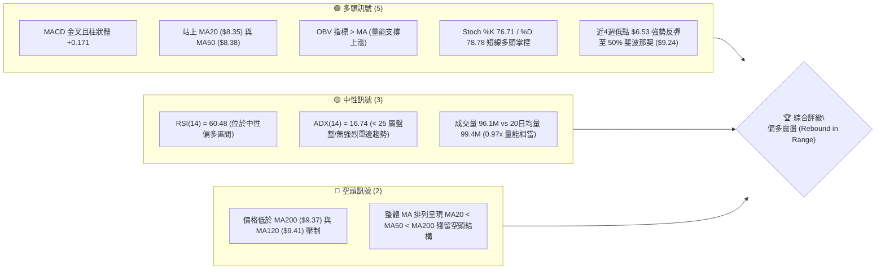
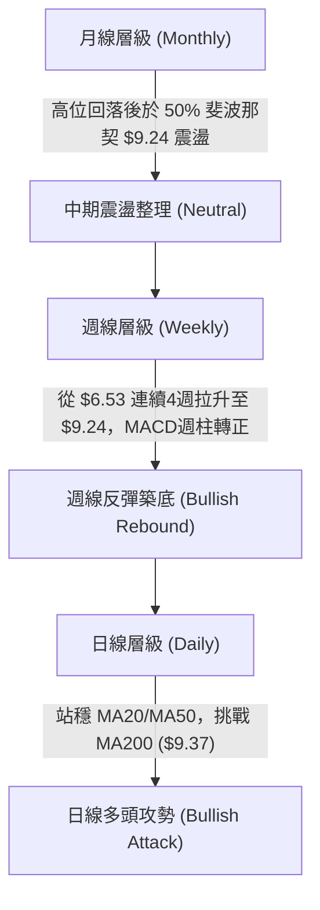
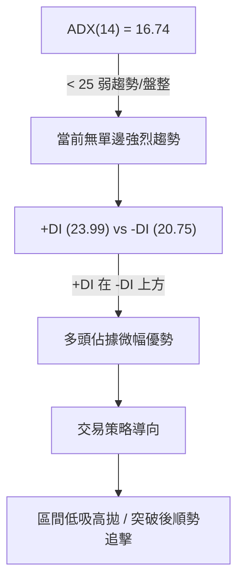
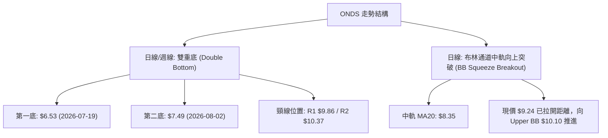
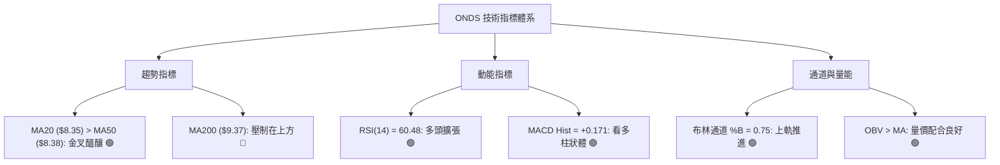
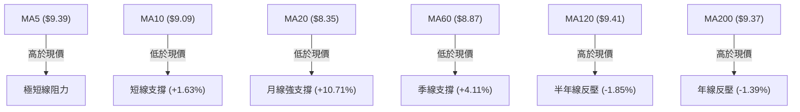
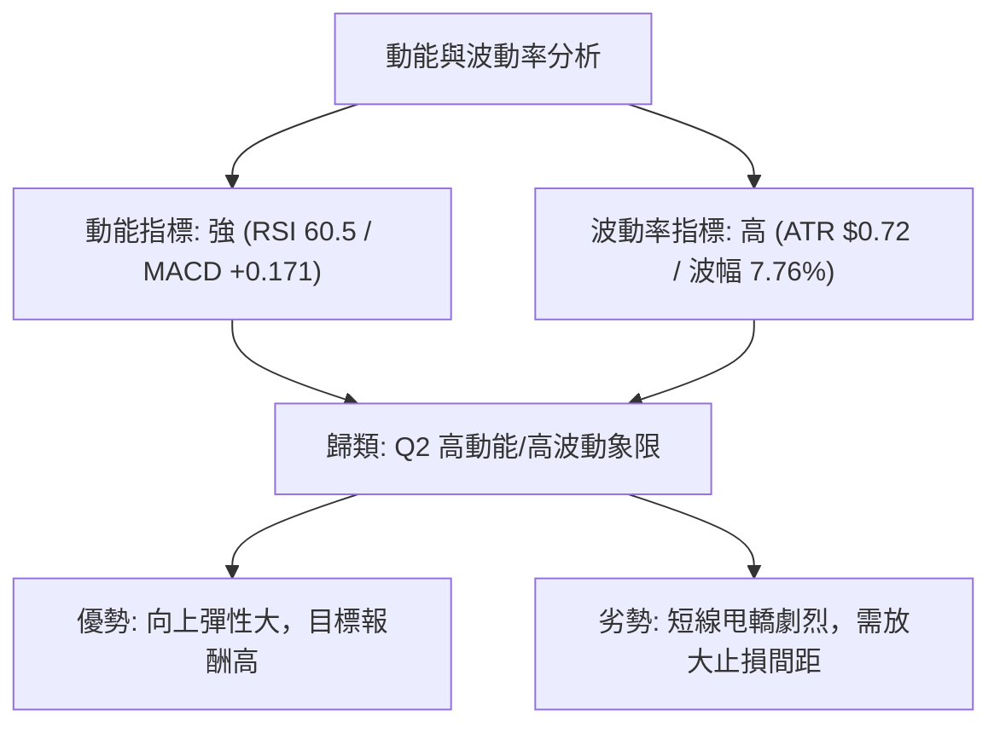
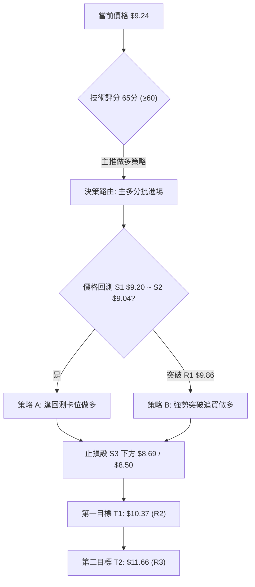
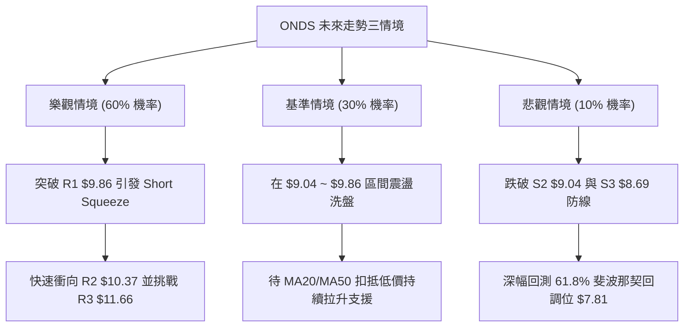

# ONDS 技術分析報告

> **報告日期**：2026-08-14 ｜ **語言**：繁體中文 ｜ **數據來源**：Yahoo Finance ｜ **當前價格**：$9.24

---

## 目錄

| 章節 | 內容 |
|------|------|
| [1. 技術面概覽](#1-技術面概覽) | 訊號儀表板、核心指標、評分卡 |
| [2. 趨勢分析](#2-趨勢分析) | 多時框趨勢、長中短期走勢、ADX強度 |
| [3. 圖表形態分析](#3-圖表形態分析) | 形態識別、K線組合、目標價推算 |
| [4. 支撐與阻力](#4-支撐與阻力) | 關鍵價位、斐波那契回調層級 |
| [5. 技術指標深度解讀](#5-技術指標深度解讀) | MA/RSI/MACD/布林通道/OBV量能 |
| [6. 動能與波動率](#6-動能與波動率) | 動能評估、ATR波動率、風險矩陣 |
| [7. 多時框架總結](#7-多時框架總結) | 時框架評分矩陣、多時框收斂結論 |
| [8. 交易策略建議](#8-交易策略建議) | 策略路由、情境階梯、主多策略與風控 |
| [9. 風險提示與監控](#9-風險提示與監控) | 監控指標、風險場景、倉位控管 |

---

## 1. 技術面概覽

### 🎯 技術訊號儀表板



### 📊 核心指標速覽表

| 指標類別 | 指標名稱 | 當前數值 | 訊號 | 解讀 |
|----------|----------|----------|------|------|
| **價格** | 當前收盤價 | $9.24 | 🟢 多頭 | 守住 S1 ($9.20)，自 $6.53 波段低點強勁反彈 |
| **均線** | MA20 | $8.35 | 🟢 多頭 | 價格位於 MA20 上方 (+10.66%)，短期趨勢向上 |
| **均線** | MA50 | $8.38 | 🟢 多頭 | 價格突破 MA50，中期築底轉強 |
| **均線** | MA200 | $9.37 | 🔴 空頭 | 價格略低於 MA200 (-1.39%)，面臨年線壓制 |
| **動能** | RSI(14) | 60.48 | 🟢 多頭 | 位於 50–70 擴張區，多頭力量主導，尚無超買 |
| **動能** | MACD (12,26,9) | +0.363 / +0.192 | 🟢 多頭 | MACD 位於零軸上方，DIF 跨越 Signal 保持多頭擴張 |
| **趨勢** | ADX(14) | 16.74 | 🟡 中性 | ADX < 25，單邊大趨勢未成，屬於箱體震盪或擴張階段 |
| **波動** | ATR(14) | $0.72 | 🟡 中性 | 日波幅約 7.76%，屬於高彈性/高波動中小盤標的 |
| **通道** | 布林通道 %B | 0.75 | 🟢 多頭 | 位於中軌 ($8.35) 與上軌 ($10.10) 之間，逼近上軌 |
| **成交量** | 20日均量比 | 0.97x | 🟢 多頭 | 量能穩定，OBV 上升趨勢確認資金持續流入 |

### 🏆 技術評分卡

```
╔══════════════════════════════════════════════════════════════════╗
║              ONDS 技術面評分卡 — 2026-08-14                      ║
╠══════════════════════════════════════════════════════════════════╣
║ 趨勢強度 (Trend)     ██████████░░░░░░░░░░  50/100  🟡 中性 (ADX=16.7)  ║
║ 動能指標 (Momentum)  ██████████████░░░░░░  70/100  🟢 強勁 (MACD/RSI)  ║
║ 支撐穩定度 (Support) ██████████████░░░░░░  70/100  🟢 堅實 (S1/S2防線) ║
║ 成交量配合 (Volume)  ██████████████░░░░░░  70/100  🟢 良好 (OBV>MA)    ║
║ 形態完整度 (Pattern) ████████████░░░░░░░░  60/100  🟡 築底反彈進行中   ║
║ 均線排列 (MA Struct) ████████████░░░░░░░░  60/100  🟡 短強長弱交會處   ║
╠══════════════════════════════════════════════════════════════════╣
║ 綜合評分 (Overall)   █████████████░░░░░░  65/100  🟢 偏多震盪 (Buy)   ║
╚══════════════════════════════════════════════════════════════════╝
```

---

## 2. 趨勢分析

### 🌐 多時框趨勢分析



### 📈 長期趨勢 — 12個月走勢圖（Unicode ASCII）

歷史12個月（2025-08 至 2026-08）價格演變圖如下，精確標注每月收盤價與歷史高低點：

```
ONDS 月線歷史走勢圖（2025-08 ~ 2026-08）
價格軸 ($)
$15.28 ┼                                      ● (52W High $15.28)
$13.22 ┤                                ●
$11.66 ┤                                │
$10.36 ┤                    ●     ●     │
$9.24  ┤                    │     │     │              ● $9.24 (現價)
$7.90  ┤       ●      ●     │     │     │        ●
$6.53  ┤       │      │     │     │     │  ●     │ (波段底 $6.53)
$5.86  ┤ ●     │      │     │     │     │  │     │
       └─┴─────┴──────┴─────┴─────┴─────┴──┴─────┴─────────
        08/25  10/25  12/25 01/26 03/26 05/26 06/26 07/26 08/26
```

#### 走勢特徵分析表

| 階段 | 時間區間 | 價格變動 | 漲跌幅 | 走勢特徵與技術含義 |
|------|----------|----------|--------|--------------------|
| **第一階段：主升段** | 2025-08 ~ 2026-01 | $5.86 → $10.36 | +76.79% | 資金大幅推升，站上 $10 大關，建立中長期底部 |
| **第二階段：創高拉回** | 2026-01 ~ 2026-05 | $10.36 → $13.22 → $8.24 | +27.6% / -37.7% | 衝高至近一年高點 $15.28 後劇烈拉回，進行獲利了結 |
| **第三階段：探底洗盤** | 2026-06 ~ 2026-07 | $8.24 → $6.53 | -20.75% | 下探至 61.8% 斐波那契回調位（$7.81）下方打底，$6.53 止跌 |
| **第四階段：強勢反彈** | 2026-07 ~ 2026-08 | $6.53 → $9.24 | +41.50% | 成交量顯著放大（週量破 830M），強勢拉回 50% 回調位 |

### 📊 中期趨勢（週線與關鍵結構）

當前價格 $9.24 正處於關鍵的「多空分水嶺」。從 52 週高點 $15.28 與低點 $3.20 計算，50% 斐波那契中軸剛好為 **$9.24**。

```
                    【阻力區域】 R3: $11.66 / R2: $10.37 / R1: $9.86
─────────────────────────────────────────────────────────────────
  ▲ $9.41 (MA120)  ─── 季線/半年線重合反壓區
  ▲ $9.37 (MA200)  ─── 年線阻力
─────────────────────────────────────────────────────────────────
  ★ $9.24          ◄ Current Price (50% Fibonacci Level)
─────────────────────────────────────────────────────────────────
  ▼ $9.20 (S1)     ─── 近期波段支撐 1
  ▼ $9.04 (S2)     ─── 20日均線與 240日均線交會聚類 (S2)
  ▼ $8.35 (MA20)   ─── 布林中軌強支撐
─────────────────────────────────────────────────────────────────
                    【強支撐區】 S3: $8.69 / 61.8% Fib: $7.81
```

### ⚡ 趨勢強度評估（ADX 解讀）



#### ADX 強度對照與解讀

| ADX 數值區間 | 當前狀態 | 趨勢特徵 | 最佳交易策略 |
|--------------|----------|----------|--------------|
| **0 – 20** | **16.74 (當前)** | **無趨勢 / 箱體震盪 / 蓄勢打底** | **區間支撐買進，布林上軌與阻力位分批獲利** |
| **20 – 25** | - | 趨勢萌芽期 | 準備順勢突破策略 |
| **25 – 50** | - | 強烈單邊趨勢 | 持股續抱 / 逢拉回均線加碼 |
| **50 +** | - | 極端過熱趨勢 | 注意反轉與過熱風險 |

*解讀：ADX 為 16.74，顯示 ONDS 經歷 6–7 月的大幅拉回與 8 月強勢反彈後，正處於能量修復與箱體震盪階段。由於 +DI (23.99) 高於 -DI (20.75)，市場短線動能已轉由多頭控盤。*

---

## 3. 圖表形態分析

### 🔍 形態識別系統

根據近一年與近 20 週 OHLCV 價格走勢，進行幾何與結構形態識別：



#### 形態信心度與目標價評估表（依規則 15）

| 形態名稱 | 信心度 (%) | 判斷依據（引用數據） | 完成度 | 目標價推算與公式 |
|----------|------------|----------------------|--------|------------------|
| **W底 (雙底反轉)** | **68%** | 左底 $6.53 (07/19 週)，右底更高 $7.49 (08/02 週)，當前量能爆發 (+834M/380M週量) 站上 $9.24 | 75% | 頸線 R1 $9.86 + (頸線 $9.86 - 左底 $6.53 = $3.33) = **$13.19**（數據中接近 05月收盤 $13.22） |
| **布林中軌突破** | **82%** | 價格向上穿越 MA20 ($8.35) 且 %B 達 0.75，MACD 柱狀體維持正向擴張 (+0.171) | 90% | 上軌目標 = **$10.10** (BB 上軌) |
| **頭肩底形態** | **35%** | 數據不足以支撐完整三頭肩膀幾何形態 | 15% | 訊號不足，不予採納形態目標，僅作指標解讀 |

### 🕯️ 重要 K 線形態分析（近 5 個月）

| 月份/日期 | 收盤價 | K線形態類型 | 技術含義 | 多空訊號 |
|-----------|--------|-------------|----------|----------|
| **2026-05** | $13.22 | 帶長上影大陽線 | 衝高至 52W 高點 $15.28 後遭遇強烈獲利回吐壓制 | 🟡 多轉空 |
| **2026-06** | $8.24 | 實體大陰線 | 跌破 MA50，空頭力道強勁，多頭停損賣壓湧現 | 🔴 極度看空 |
| **2026-07-19**| $6.53 | 長下影長十字星 (Hammer/Doji)| 在 $6.53 爆出 671M 週天量，築底訊號明確，賣壓竭盡 | 🟢 底態轉折 |
| **2026-07-26**| $7.80 | 爆量長紅 K 線 | 週成交量達 834M 歷史天量，強勢陽包陰 | 🟢 底部確認 |
| **2026-08-16**| $9.24 | 中陽線升勢 | 連續兩週收陽，站穩 50% 斐波那契回調位 $9.24 | 🟢 多頭續強 |

### 📉 ASCII 雙底反轉形態示意圖

```
ONDS 雙底 (W-Bottom) 結構示意圖
───────────────────────────────────────────────────────────────────
阻力/頸線  R2 $10.37 ───────────────────────────┐
阻力/頸線  R1 $9.86  ──────────────┐            │ 頸線突破目標 $13.19
                                    │            │
現價      $9.24  ─────────────●    │            │
                                 /  \   /        │
均線支撐  MA20 $8.35  ────────/────\─/──────────┼──────────────────
                            /      ● (右底 $7.49)│
                           /                     │
底部支撐  $6.53 ─────────● (左底 $6.53)          │
───────────────────────────────────────────────────────────────────
```

---

## 4. 支撐與阻力

### 🗺️ 關鍵價位分布圖（Unicode ASCII）

```
ONDS 價位結構分布圖 (依據 OHLCV 與斐波那契精確數據)
═══════════════════════════════════════════════════════════════════
$15.28 ║████████████████████████████████████████║ 52週高點 (0.0% Fib)
$13.00 ║████████████████                        ║ 分析師最低目標價
$12.43 ║████████████████████                    ║ 23.6% 斐波那契回調位
$11.66 ║████████████████████████                ║ 強阻力 R3 (+26.24%)
$10.67 ║████████████                            ║ 38.2% 斐波那契回調位
$10.37 ║████████████████                        ║ 阻力 R2 (+12.23%)
$10.10 ║██████████                              ║ 布林通道上軌 (BB Upper)
$9.86  ║████████                                ║ 關鍵阻力 R1 (+6.71%)
$9.41  ║████                                    ║ MA120 半年線阻力
$9.37  ║███                                     ║ MA200 年線阻力
$9.24  ╠════════════════════════════════════════╣ ◄ 當前收盤價 (50.0% Fib)
$9.20  ║▓▓▓▓▓▓▓▓                                ║ 近期關鍵支撐 S1 (-0.43%)
$9.04  ║▓▓▓▓▓▓▓▓▓▓▓▓                            ║ 強支撐 S2 (MA240/波段低)
$8.69  ║▓▓▓▓▓▓▓▓▓▓▓▓▓▓▓▓                        ║ 關鍵防守 S3 (-5.95%)
$8.35  ║▓▓▓▓▓▓▓▓▓▓▓▓▓▓▓▓▓▓▓▓                    ║ MA20 均線 / 布林中軌
$7.81  ║▓▓▓▓▓▓▓▓▓▓▓▓▓▓▓▓▓▓▓▓▓▓▓▓                ║ 61.8% 斐波那契黃金支撐
$6.59  ║▓▓▓▓▓▓▓▓▓▓▓▓▓▓▓▓▓▓▓▓▓▓▓▓▓▓▓▓            ║ 布林通道下軌 (BB Lower)
$3.20  ║▓▓▓▓▓▓▓▓▓▓▓▓▓▓▓▓▓▓▓▓▓▓▓▓▓▓▓▓▓▓▓▓▓▓▓▓▓▓▓▓║ 52週低點 (100.0% Fib)
═══════════════════════════════════════════════════════════════════
```

### 🚧 阻力位分析表（精確數據引用）

| 阻力級別 | 精確價位 | 距現價幅度和來源 | 形成原因與技術意義 | 突破難度 |
|----------|----------|------------------|--------------------|----------|
| **R1** | **$9.86** | +6.71% (關鍵價位 R1) | 04月/05月密集成交反壓、近一年波段高點聚類 | 🟡 中等 (需日量 > 100M) |
| **R2** | **$10.37**| +12.23% (關鍵價位 R2) | 2026-01 月線收盤高點 $10.36 心理關卡 | 🔴 較高 (套牢賣壓區) |
| **R3** | **$11.66**| +26.24% (關鍵價位 R3) | 2026-05 衝高拉回解套區、波段高點聚類 | 🔴 極高 (需強大基本面配合) |

### 🛡️ 支撐位分析表（精確數據引用）

| 支撐級別 | 精確價位 | 距現價幅度和來源 | 形成原因與技術意義 | 守住機率 |
|----------|----------|------------------|--------------------|----------|
| **S1** | **$9.20** | -0.43% (關鍵價位 S1) | 近日波段極短線支撐聚類、今日收盤守防線 | 🟢 80% (短線第一道防線) |
| **S2** | **$9.04** | -2.16% (關鍵價位 S2) | 2026-03 收盤價 $9.04、MA240 ($9.09) 交會區 | 🟢 85% (多頭核心陣地) |
| **S3** | **$8.69** | -5.95% (關鍵價位 S3) | 近一年波段低點聚類、接近 MA60 ($8.87) 緩衝 | 🟢 90% (強烈買盤護盤) |

### 📐 斐波那契回調位分析

依據 52 週最高價 **$15.28** 與最低價 **$3.20**（垂直距離 $12.08）：

- **0.0% (52W High)**: $15.28
- **23.6% 回調**: $12.43 — *中期超強強勢區*
- **38.2% 回調**: $10.67 — *多頭強勢整理水準*
- **50.0% 回調**: **$9.24** — *【當前價位】多空中軸平衡點*
- **61.8% 回調**: $7.81 — *黃金分割支撐區（07/26 已順利築底成功）*
- **78.6% 回調**: $5.79 — *深幅修復區*
- **100.0% (52W Low)**: $3.20 — *極端底部*

*解讀：現價 $9.24 精確收在 **50.0% 斐波那契回調位** 上。此處為典型的「多空樞紐點 (Pivot Point)」，若能站穩 $9.24 上方，下一步將向上指引至 38.2% ($10.67) 與 23.6% ($12.43)；若跌破則會回測 61.8% ($7.81)。*

---

## 5. 技術指標深度解讀

### 🎛️ 指標訊號總覽



### 📈 移動平均線排列分析



#### 均線數據比較與結構分析

| 均線名稱 | 當前價格 | 與現價距離 (%) | 走勢方向 | 技術面意涵 |
|----------|----------|----------------|----------|------------|
| **MA5** | $9.39 | -1.64% | ▼ 下彎 | 短線震盪，略低於5日線 |
| **MA10** | $9.09 | +1.63% | ▲ 上升 | 極短線支撐，扣抵低價區 |
| **MA20** | $8.35 | +10.71% | ▲ 急升 | 月線走揚，提供強勁彈性支撐 |
| **MA60** | $8.87 | +4.11% | ▲ 上升 | 季線轉銳，中期趨勢保護 |
| **MA120**| $9.41 | -1.85% | ▼ 走平 | 半年線壓制，多頭需增量突破 |
| **MA200**| $9.37 | -1.39% | ▲ 微升 | 年線關卡，重合關鍵價位區 |

*整體均線結構評語：當前價格 $9.24 夾在「下方走揚的 MA20/MA60 ($8.35–$8.87)」與「上方橫盤的 MA200/MA120 ($9.37–$9.41)」之間。此為典型的**均線夾心壓縮結構**，預示近期即將發動方向性突破。*

### 📉 RSI(14) 分析

- **當前數值**：**60.48**
- **強度指示器**：
  `0 ░░░░░░░░░░░░░░░░░░░░ 30 ▓▓▓▓▓▓▓▓▓▓▓▓▓▓ 50 ▓▓▓▓▓▓█░░░░░ 70 ░░░░░░░░░░ 100`  (60.48%)

#### RSI 背離評估
- **現狀**：日線與週線 RSI 均無顯著頂背離或底背離。
- **解讀**：週線 RSI 自 7 月底的 21.3 (超賣區) 強勢反彈至當前 60.5，顯示買盤資金實打實進場，屬健康的多頭動能修復，尚未進入 > 70 的過熱超買區。

### 📊 MACD(12,26,9) 訊號解讀

- **MACD DIF 線**：+0.363
- **MACD Signal 線**：+0.192
- **MACD Histogram 柱狀體**：**+0.171** 🟢 看多
- **狀態**：DIF 線在零軸上方持續擴大對 Signal 線的距離，柱狀體維持正值擴張。
- **背離診斷**：無頂背離現象。柱狀體遞增確認當前反彈動能尚未衰竭。

### 📦 布林通道分析（Bollinger Bands）

```
ONDS 日線布林通道結構 (BB Width = 41.6%)
─────────────────────────────────────────────────────────────────
上軌 (Upper BB)   $10.10  ───────────────────────────────
                          │                    ● (現價 $9.24, %B=0.75)
中軌 (MA20)       $8.35   ┼───────────────────────────────
                          │
下軌 (Lower BB)   $6.59   ───────────────────────────────
─────────────────────────────────────────────────────────────────
```

- **上軌 (Upper BB)**：$10.10
- **中軌 (MA20)**：$8.35
- **下軌 (Lower BB)**：$6.59
- **%B 指標**：0.75 (位於中軌與上軌間 75% 位置)
- **解讀**：布林帶寬呈現擴張走勢，價格貼近上軌 $10.10 運行。%B 達 0.75 顯示多頭掌控布林高位通道，若能突破 $10.10 上軌，將開啟新一輪帶狀通道上攻。

### 💹 成交量與 OBV 分析

- **最新成交量**：96,102,083 股
- **20日均量**：99,405,204 股 (量比: 0.97x)
- **50日均量**：85,425,290 股
- **OBV 趨勢**：**OBV > MA (能量潮指標位於均線上方)**
- **量價配合評估**：7 月底 $6.53 底部爆出單週 834,313,400 股的天量換手，8 月至今成交量始終高於 50 日均量水準。OBV 持續向上，顯示主力資金建倉意願強烈，量能充分支撐當前價格上漲。

---

## 6. 動能與波動率

### ⚡ 動能評估

| 象限分類 | 動能強度 | 波動率 | ONDS 當前狀態 | 交易戰術指引 |
|----------|----------|--------|---------------|--------------|
| **象限 I (Q1)** | 強 (MACD/RSI偏多) | 低 | - | 穩定趨勢持股 |
| **象限 II (Q2)** | 強 (RSI=60.5) | 高 (ATR=7.76%) | **✓ ONDS 當前位置** | **高彈性突破策略 / 嚴格設止損** |
| **象限 III (Q3)**| 弱 | 高 | - | 避開高風險下行 |
| **象限 IV (Q4)** | 弱 | 低 | - | 沉悶盤整觀望 |



### 📊 ATR 波動率分析

- **ATR(14)**：**$0.72**
- **ATR 佔比**：**7.76%**（屬於高波動度股票）
- **止損距離建議**：
  - **保守型風控 (2.0 × ATR)**：$0.72 × 2.0 = **$1.44**（距現價進場點降至 $7.80）
  - **戰術型風控 (1.5 × ATR)**：$0.72 × 1.5 = **$1.08**（距現價進場點降至 $8.16）
  - **緊密型風控 (1.0 × ATR)**：$0.72 × 1.0 = **$0.72**（距現價進場點降至 $8.52）

### 📐 Beta 與市場風險特徵

- **融券餘額比例 (Short % Float)**：**41.5%**（極高短空頭寸）
- **Short Ratio**：2.24 天
- **機構持股比例**：58.7%
- **技術意涵**：高達 41.5% 的 Short Float 意味著一旦價格突破關鍵阻力 R1 ($9.86) 或 R2 ($10.37)，極易觸發**軋空行情 (Short Squeeze)**，導致價格無預警快速暴漲。

---

## 7. 多時框架總結

### 📋 時框架評分矩陣

| 時框架 | 趨勢方向 | 動能 (RSI/MACD) | 均線排列 | 形態結構 | 綜合評分 | 戰術建議 |
|--------|----------|-----------------|----------|----------|----------|----------|
| **月線 (Long-term)** | 🟡 橫盤震盪 | 🟡 中性 (50% Fib) | 🟡 紊亂 | 回調修復 | **55 / 100** | 逢低布局，看好長線 |
| **週線 (Mid-term)** | 🟢 底態反彈 | 🟢 強勁 (週MACD轉正)| 🟡 MA200壓制| 雙底 (W底) | **70 / 100** | 持股續抱，突破加碼 |
| **日線 (Short-term)**| 🟢 多頭推升 | 🟢 偏多 (RSI=60.5) | 🟢 MA20/50支撐| 布林上軌擴張 | **72 / 100** | 偏多操作，順勢做多 |

### 🔲 綜合訊號矩陣

```
  時框架       趨勢      動能      均線      量能      綜合判斷
  ─────────────────────────────────────────────────────────────
  月線 (Monthly)  🟡        🟡        🟡        🟢        🟡 中性築底
  週線 (Weekly)   🟢        🟢        🟡        🟢        🟢 強勢反彈
  日線 (Daily)    🟢        🟢        🟢        🟢        🟢 多頭控盤
  ─────────────────────────────────────────────────────────────
  訊號收斂結果：週日線多頭共振，月線中軸支撐，整體方向偏多。
```

### ⚖️ 多時框收斂結論（依規則 14 執行）

1. **行情性質判定**：當前 ADX(14) = 16.74 (< 25)，技術上歸類為 **「箱體震盪與築底反彈行情」**。
2. **多時框優先級**：
   - 依據規則，盤整/震盪行情以**日線布林通道上下軌 ($6.59 – $10.10)** 及 **關鍵阻力/支撐 ($9.04 – $10.37)** 為核心交易區間。
   - 日線 MA20 ($8.35) 與 MA50 ($8.38) 已經向上金叉並形成支撐，週線在 61.8% 斐波那契 ($7.81) 爆量見底，日週訊號達成**多頭共振**。
3. **最終收斂結論**：**偏多震盪，蓄勢突破**。雖然上方有 MA200 ($9.37) 與 MA120 ($9.41) 壓制，但在 OBV 量能支撐與高 Short Float (41.5%) 背景下，向上突破阻力 R1 ($9.86) 進入 $10.37 的機率顯著高于回測底部。

---

## 8. 交易策略建議

### 🗺️ 策略決策流程圖



### 🧭 策略路由

**當前主策略方向 = 🟢 偏多做多策略（技術評分：65 / 100）**

### 🎯 價格情境階梯（Price Scenarios）

| 觸發條件 | 第一目標 | 第二目標 | 情境技術含義與應對 |
|----------|----------|----------|--------------------|
| **突破 R1 $9.86** | R2 **$10.37** | R3 **$11.66** | 站穩年線與 R1，軋空行情啟動，追價加碼 |
| **站穩現價區間 ($9.04 - $9.24)** | R1 **$9.86** | R2 **$10.37** | 箱體蓄勢，回測支撐逢低分批建倉 |
| **跌破 S2 $9.04** | S3 **$8.69** | 61.8% Fib **$7.81** | 短線轉弱，觸發多頭止損，退場觀望 |

### 📊 情境機率分佈

| 情境劇本 | 預估機率 | 主要技術依據 |
|----------|----------|--------------|
| **突破上行 / 軋空反彈** | **60%** | MACD 週日線共振看多、OBV 向上、41.5% Short Float 潛在軋空 |
| **區間震盪整理 ($9.04–$9.86)** | **30%** | ADX = 16.74 < 25，顯示消化 MA200 ($9.37) 年線套牢賣壓 |
| **跌破深幅回測 (< $8.69)** | **10%** | 需有整體美股大盤崩跌或公司重大利空觸發 |

### 🟢 主策略詳情

本報告依規則 13 精確引用數據庫中之價位：

| 策略要素 | 策略 A（逢低卡位型） | 策略 B（強勢突破型） |
|----------|──────────────────────|──────────────────────|
| **進場條件** | 價格拉回 S1 ($9.20) 至 S2 ($9.04) 區間止跌 | 日線收盤強勢突破阻力 R1 ($9.86) |
| **買入價格** | **$9.10**（取 S1 與 S2 間之優質價） | **$9.90**（突破 R1 $9.86 確認後） |
| **第一目標 (T1)** | **$10.37** (阻力 R2，+13.95%) | **$11.66** (阻力 R3，+17.78%) |
| **第二目標 (T2)** | **$11.66** (阻力 R3，+28.13%) | **$13.00** (分析師最低目標價，+31.31%) |
| **止損價格** | **$8.65** (稍低於 S3 $8.69，-4.95%) | **$9.15** (降至 S1 下方，-7.58%) |
| **風險報酬比 (R/R)** | **2.82 : 1** (T1) / **5.69 : 1** (T2) | **2.35 : 1** (T1) / **4.13 : 1** (T2) |
| **預估成功機率** | **65%** | **60%** |
| **建議倉位** | **15% - 20%** 總資金 | **10% - 15%** 總資金 |

### 🔴 反向風險觸發點（對沖與風控提示）

- **多頭失效觸發價**：若日線收盤價跌破 **S3 ($8.69)**，代表 8 月以來的反彈結構破壞。
- **風控處置**：無條件執行多頭止損出場，或建立短線反向對沖部位，下方觀察 61.8% 斐波那契位 **$7.81** 的防禦力。

### ⭐ 整體訊號強度評星

```
做多訊號強度：★★██☆  (4/5星)  — MACD金叉/OBV配合/軋空潛力
做空訊號強度：★☆☆☆☆  (1/5星)  — 僅年線MA200壓制，無深幅破位訊號
整體可信度：  ████☆  (4/5星)  — 週日線指標高度收斂
```

---

## 9. 風險提示與監控

### ✅ 關鍵監控指標 Checklist

```
╔══════════════════════════════════════════════════════════════════╗
║                    ONDS 技術監控 Check List                      ║
╠══════════════════════════════════════════════════════════════════╣
║ [ ] 每日收盤是否站穩 MA200 ($9.37) 與 MA120 ($9.41)              ║
║ [ ] RSI(14) 是否向 70 超買區挺進 (當前 60.48)                    ║
║ [ ] 日成交量是否突破 100M (高於 20 日均量 99.4M)                 ║
║ [ ] MACD 柱狀體是否維持正值 (+0.171) 且擴張                     ║
║ [ ] 融券空單 (Short Float 41.5%) 是否出現急劇回補跡象            ║
║ [ ] 下方核心防線 S2 ($9.04) 與 S3 ($8.69) 是否完好無損          ║
╚══════════════════════════════════════════════════════════════════╝
```

### ⚠️ 風險場景分析



### 🛡️ 風險管理與倉位控管提醒

1. **波動度風險管理**：ONDS 之 ATR 為 **$0.72 (7.76%)**，單日波動極大。投資人切忌高槓桿操作，個股單一倉位不宜超過總投資組合的 **15% - 20%**。
2. **軋空與停損紀律**：高達 41.5% 的 Short Float 代表雙刃劍，暴漲時獲利迅速，但下行時空頭打壓亦毫不留情。請嚴格執行策略 A 之止損點 **$8.65**，絕不攤平虧損部位。

---

## 📋 報告總結

```
╔══════════════════════════════════════════════════════════════════╗
║                     ONDS 技術分析綜合總結報告                     ║
════════════════════════════════════════════════════════════════════
 報告日期：2026-08-14
 當前價格：$9.24
 分析評級：🟢 買入 / 偏多震盪 (Strong Rebound in Range)

 關鍵評估結論：
 ├─ 長期趨勢：🟡 50.0% 斐波那契中軸 ($9.24) 打底整理
 ├─ 中期趨勢：🟢 週線雙底完成，週 MACD 柱狀體轉正，W底目標看 $13.19
 ├─ 短期趨勢：🟢 日線站上 MA20/MA50，逼近布林通道上軌 ($10.10)
 ├─ 關鍵支撐：S1 $9.20 / S2 $9.04 / S3 $8.69
 ├─ 關鍵阻力：R1 $9.86 / R2 $10.37 / R3 $11.66
 └─ 分析師目標：均價 $19.06 (最低 $13.00 / 最高 $25.00)

 最優策略組合建議：
 1. 🥇 最佳做多進場點：拉回 S1 ($9.20) ~ S2 ($9.04) 附近（如 $9.10），止損 $8.65。
 2. 🥈 強勢追擊進場點：收盤突破 R1 ($9.86) 確認後（如 $9.90）進場，止損 $9.15。
 3. 🎯 階段獲利目標：T1 設 $10.37 (阻力 R2)，T2 設 $11.66 (阻力 R3)。
════════════════════════════════════════════════════════════════════
```

---

> ⚠️ **免責聲明**：本報告為 AI 資深技術分析師根據量化市場數據自動生成之深度技術分析報告。所有關鍵價位、指標數據與形態推算均基於提供之歷史 OHLCV 價格資料。本報告**僅供研究與學術參考**，**不構成任何形式之投資建議或買賣邀約**。金融市場投資具有高風險，投資人應獨立思考、審慎評估並自負盈虧。

---

*報告生成時間：2026-08-14 ｜ 數據來源：Yahoo Finance ｜ 分析框架：多時框量化技術分析*