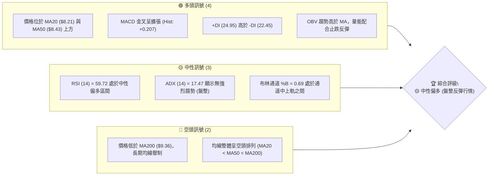
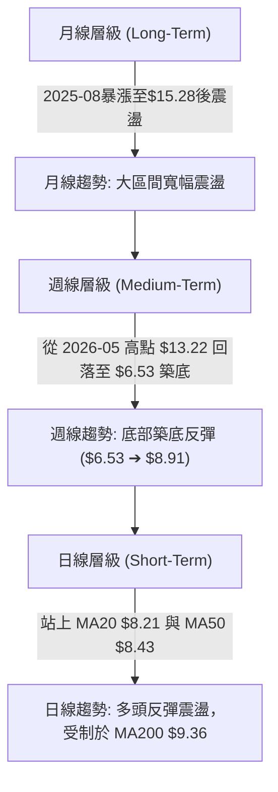
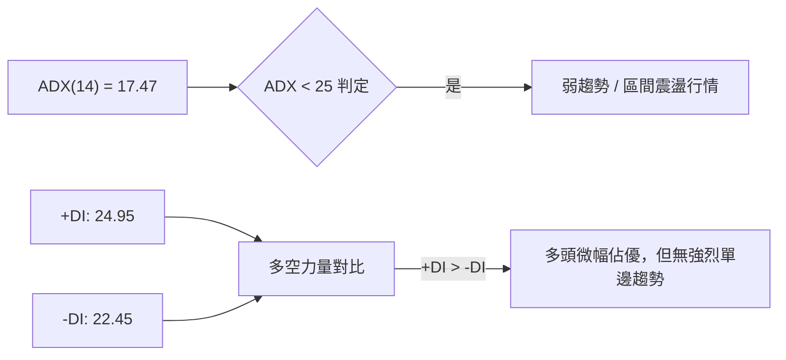
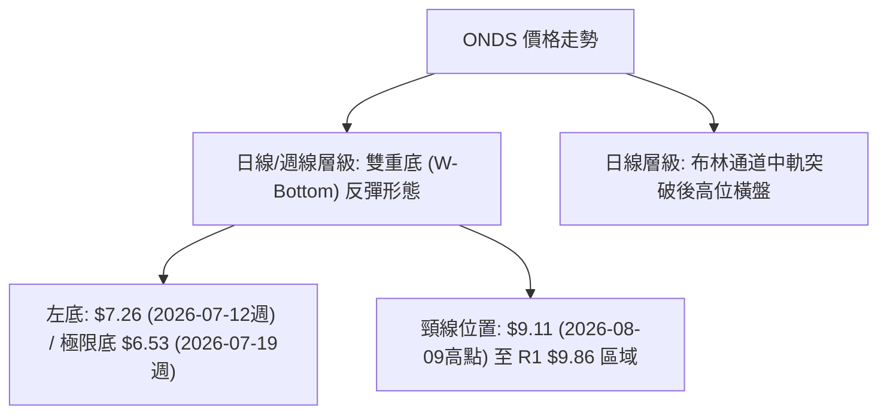
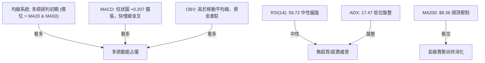
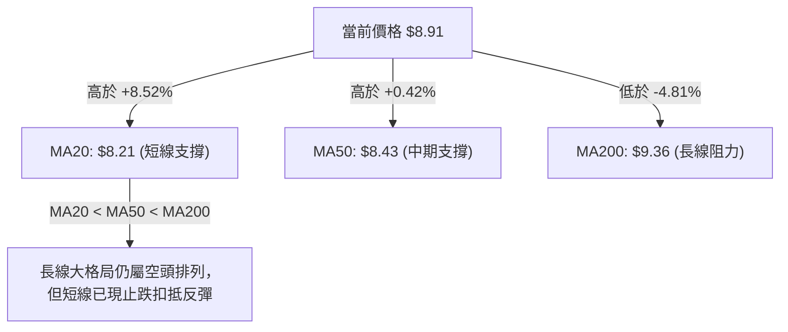
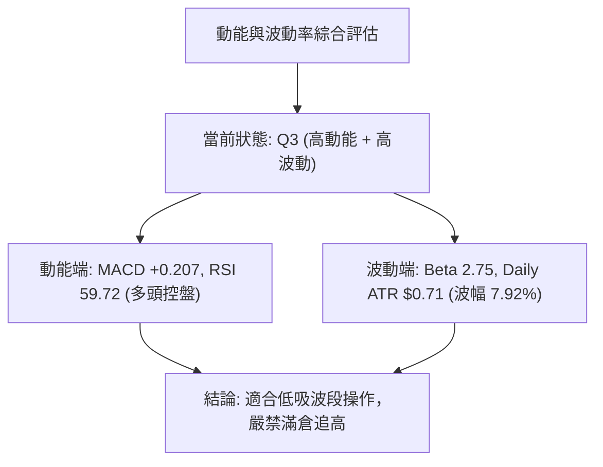
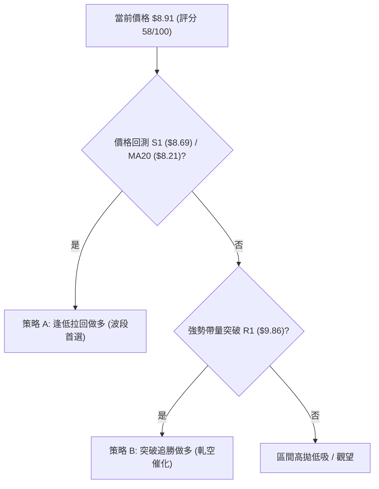
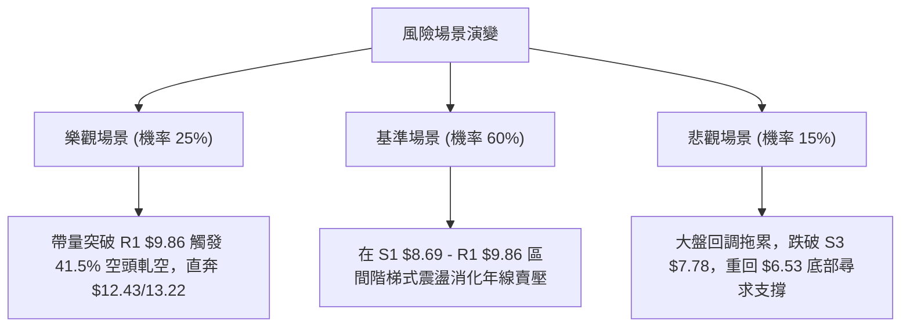

# ONDS 技術分析報告

> **報告日期**：2026-08-14 ｜ **語言**：繁體中文 ｜ **數據來源**：Yahoo Finance ｜ **當前價格**：$8.91

---

## 目錄

| 章節 | 內容 |
|------|------|
| [1. 技術面概覽](#1-技術面概覽) | 訊號儀表板、核心指標、評分卡 |
| [2. 趨勢分析](#2-趨勢分析) | 多時框趨勢、長中短期走勢 |
| [3. 圖表形態分析](#3-圖表形態分析) | 形態識別、K線組合、目標價 |
| [4. 支撐與阻力](#4-支撐與阻力) | 關鍵價位、斐波那契回調 |
| [5. 技術指標深度解讀](#5-技術指標深度解讀) | MA/RSI/MACD/布林/成交量 |
| [6. 動能與波動率](#6-動能與波動率) | 動能評估、ATR、Beta |
| [7. 多時框架總結](#7-多時框架總結) | 時框架評分矩陣 |
| [8. 交易策略建議](#8-交易策略建議) | 多空策略、風險報酬比 |
| [9. 風險提示與監控](#9-風險提示與監控) | 監控指標、風險場景 |

---

## 1. 技術面概覽

### 🎯 技術訊號儀表板



### 📊 核心指標速覽表

| 指標類別 | 指標名稱 | 當前數值 | 訊號 | 解讀 |
|----------|----------|----------|------|------|
| **價格** | 當前價格 | $8.91 | 🟡 中性 | 自 52W 低點 $3.20 反彈，位於 52W 區間 47.3% |
| **均線** | MA20 | $8.21 | 🟢 看多 | 價格站上短期均線 (+8.52%)，短線轉強 |
| **均線** | MA50 | $8.43 | 🟢 看多 | 價格站上中期均線，形成短線扣抵支撐 |
| **均線** | MA200 | $9.36 | 🔴 看空 | 價格低於長線均線 (-4.81%)，面臨長線壓制 |
| **動能** | RSI(14) | 59.72 | 🟢 看多 | 自超賣區反彈後穩健上升，無頂背離 |
| **動能** | MACD | 0.356 | 🟢 看多 | 柱狀圖 +0.207 擴張，多頭掌控短線動能 |
| **波動** | ATR(14) | $0.71 | 🟡 中性 | 每日波幅 7.92%，屬於高beta高波動個股 |
| **趨勢** | ADX(14) | 17.47 | 🟡 盤整 | ADX < 25，屬於無明顯大趨勢之區間震盪 |
| **籌碼** | 券商空單比 | 41.5% | 🟢 看多 | 短路賣空比例極高，具備潛在軋空 (Short Squeeze) 條件 |

### 🏆 技術評分卡

```
╔══════════════════════════════════════════════════════════════════╗
║                   技術評分卡 — ONDS (2026-08-14)                  ║
╠══════════════════════════════════════════════════════════════════╣
║ 趨勢強度      ▓▓▓▓▓▓▓░░░░░░░░░░░░░  35/100  🔴 弱趨勢/ADX<25    ║
║ 動能指標      ▓▓▓▓▓▓▓▓▓▓▓▓▓░░░░░░░  65/100  🟢 MACD與RSI金叉向上 ║
║ 支撐穩定度    ▓▓▓▓▓▓▓▓▓▓▓▓░░░░░░░░  60/100  🟡 S1/S2 形成築底區  ║
║ 成交量配合    ▓▓▓▓▓▓▓▓▓▓▓▓▓▓░░░░░░  70/100  🟢 OBV>MA 量增價漲   ║
║ 形態完整度    ▓▓▓▓▓▓▓▓▓▓▓▓░░░░░░░░  60/100  🟡 雙底反彈形態進行中 ║
║ 均線排列      ▓▓▓▓▓▓▓░░░░░░░░░░░░░  35/100  🔴 MA20<MA50<MA200   ║
╠══════════════════════════════════════════════════════════════════╣
║ 綜合評分      ▓▓▓▓▓▓▓▓▓▓▓▓░░░░░░░░  58/100  🟡 中性偏多 (58分)   ║
╚══════════════════════════════════════════════════════════════════╝
```

---

## 2. 趨勢分析

### 🌐 多時框趨勢分析



### 📈 長期趨勢 — 24個月走勢圖（Unicode）

```
ONDS 24個月收盤價走勢圖（2024-08 至 2026-08）
價格軸 ($)
$15.28 ┤                                    ●(52W High $15.28)
$13.22 ┤                                ●
$10.36 ┤                        ●   ●       ●
$8.91  ┤                        │   │   ●   │       ●←當前 $8.91
$7.72  ┤                ●   ●   │   │   │   │   ●   │
$5.86  ┤            ●   │   │   │   │   │   │   │   │
$2.56  ┤    ●       │   │   │   │   │   │   │   │   │
$0.87  ┤●───┴───●───┴───┴───┴───┴───┴───┴───┴───┴───┴───
       24-08 24-12 25-05 25-08 25-11 26-01 26-03 26-05 26-07 26-08
```

#### 24個月歷史走勢特徵分析表

| 階段 | 時間區間 | 價格區間 ($) | 漲跌幅 | 走勢特徵解讀 |
|------|----------|--------------|--------|--------------|
| **1. 底部沉積** | 2024-08 ~ 2024-11 | $0.77 - $0.98 | - | 低位橫盤，成交量稀少 |
| **2. 初次突破** | 2024-12 ~ 2025-01 | $0.98 - $2.56 | +161.2% | 籌碼初次點火，量能顯著放大 |
| **3. 二次回測** | 2025-02 ~ 2025-04 | $2.56 - $0.78 | -69.5% | 洗盤回測底層支撐 |
| **4. 主升段主浪** | 2025-05 ~ 2026-01 | $0.78 - $10.36 | +1228.2% | 營收高成長帶動資金瘋狂湧入，創下高點 |
| **5. 高位衝高修正**| 2026-02 ~ 2026-05 | $9.04 - $13.22 | +46.2% | 衝刺 52W 高點 $15.28 後出現獲利結算 |
| **6. 深度回調** | 2026-06 ~ 2026-07 | $13.22 - $6.53 | -50.6% | 週線級別修復，於 $6.53 (7月19日週) 觸底 |
| **7. 現階段反彈** | 2026-07 ~ 2026-08 | $6.53 - $8.91 | +36.4% | 短線築底成功，進場打底向 R1 ($9.86) 進發 |

### 📊 中期趨勢（週線分析）

從近 20 週數據觀察，ONDS 在 2026 年 7 月 19 日週下探至 $6.53（接近斐波那契 78.6% 回調位 $5.79 之上方區域）後，連續四周帶量反彈：
- **7月19日週**：收 $6.53，週成交量暴增至 6.71 億股，顯示極致洗盤與抄底資金進場。
- **7月26日週**：收 $7.80，RSI 由 35.0 回升至 49.8，MACD 柱狀圖由負轉正 (+0.181)，成交量放大至 8.34 億股，確認**V型/雙底反彈**。
- **8月09日週**：收 $9.11，RSI 衝高至 70.3，MACD 柱狀圖擴張至 +0.252。
- **8月16日當週**（統計至8月14日）：收於 $8.91，進入 R1 阻力位 ($9.86) 前的高位消化期。

```
ONDS 近期壓力與支撐結構示意圖
阻力區 R2:  $10.37 ═══════════════════════════════════ (週線反彈壓力區)
阻力區 R1:  $9.86  ─────────────────────────────────── (MA200 / 50% 斐波那契 $9.24 鄰近)
當前價格:   $8.91  ▲ (位於 MA20 $8.21 與 MA50 $8.43 之上)
支撐區 S1:  $8.69  ─────────────────────────────────── (近期日線回檔支撐)
支撐區 S2:  $8.32  ═══════════════════════════════════ (MA20 重合區)
支撐區 S3:  $7.78  ----------------------------------- (61.8% 斐波那契 $7.81 重合區)
```

### ⚡ 趨勢強度評估（ADX 解讀）



#### ADX 強度指標對照表

| 指標 | 當前數值 | 參考標準 | 狀態評估 | 交易戰略意涵 |
|------|----------|----------|----------|--------------|
| **ADX** | 17.47 | < 25: 無趨勢<br>25-50: 強趨勢<br>>50: 極強趨勢 | 🔴 無強烈趨勢 | 避免使用追漲殺跌之趨勢突破策略，改採區間高拋低吸或等待突破。 |
| **+DI** | 24.95 | > -DI 為多頭 | 🟢 多頭掌控 | 短線買盤力道高於賣盤，支持反彈延續。 |
| **-DI** | 22.45 | < +DI 為多頭 | 🟢 賣壓減緩 | 空頭拋壓已較 7 月份顯著收斂。 |

---

## 3. 圖表形態分析

### 🔍 形態識別系統



#### 形態識別信心度評估表

| 形態名稱 | 信心度 | 判斷依據（引用數據） | 完成度 | 目標價（附計算式） |
|----------|--------|----------------------|--------|--------------------|
| **雙重底 (W-Bottom)** | **65%** | 1. 左底 $6.53，右底二次探底 $7.49 形成更高低點<br>2. 8/09 週收於 $9.11 逼近頸線 $9.86<br>3. 成交量在底部放量 (6.71億與8.34億股) | 75% | **$12.46**<br>(計算式：頸線 R1 $9.86 + (頸線 $9.86 - 極限低點 $7.26) = $12.46，鄰近 23.6% 斐波那契 $12.43) |
| **均線黃金交叉預備** | **70%** | MA20 ($8.21) 正快速上攻逼近 MA50 ($8.43) | 80% | 向上測試 MA200 ($9.36) |

### 🕯️ 重要 K 線形態分析

| 日期/月份 | 收盤價 | K 線形態 | 解讀 | 訊號 |
|-----------|--------|----------|------|------|
| **2026-05** | $13.22 | 帶長上影線之大陽線 | 多頭衝高受阻於 52W 高點 $15.28 附近，出現高點獲利了結 | 🔴 賣出訊號 |
| **2026-06** | $8.24 | 長陰線 (Bearish Marubozu) | 跌破多條均線，展現強烈修正動能 | 🔴 空頭掌控 |
| **2026-07** | $7.49 | 下影線錘子線 (Hammer) | 下探至 $6.53 後強烈抽回，探底買盤湧現 | 🟢 止跌訊號 |
| **2026-08 (至今)**| $8.91 | 中陽線帶上影線 | 站穩 MA20/MA50，向上挑戰 R1 $9.86 | 🟢 多頭反彈 |

### 📉 ASCII 走勢形態示意圖

```
ONDS 日線雙底 (W-Bottom) 與突破示意圖
阻力 R2 $10.37 ──────────────────────────────────────────
頸線 R1 $9.86 ───────────────頂部 $9.11─────────[目標 $12.43/$12.46]
                                /\      /
現價 $8.91 ─────────►          /  \    /
                              /    \  /
MA20 $8.21  ─────────        /      \/ (右底 $7.49)
支撐 S3 $7.78 ───────\      /
                      \    /
極限低點 $6.53 ────────\  / (左底 $6.53)
                        \/
                      2026-07             2026-08
```

### 🎯 形態目標價計算

1. **第一階段形態目標價 (頸線測試)**：
   - **算式**：直接採用實體波段阻力位 **R1 = $9.86**。
2. **第二階段形態測量目標價 (雙底完全突破測量)**：
   - **算式**：頸線價格 $9.86 + 形態高度 ($9.86 - $7.26) = **$12.46**。
   - **與關鍵價位對照**：此數值極度接近斐波那契 23.6% 回調位 **$12.43**。

---

## 4. 支撐與阻力

### 🗺️ 關鍵價位分布圖（Unicode）

```
ONDS 價位結構分布圖
═══════════════════════════════════════════════════════════════════
$15.28 ║██████████████████████████████████████║ 52W 最高價 (0.0% 斐波那契)
$12.43 ║████████████████████                  ║ 23.6% 斐波那契 / 雙底測算目標 $12.46
$11.66 ║████████████████████████              ║ 強阻力 R3
$10.67 ║██████████████                        ║ 38.2% 斐波那契
$10.37 ║████████████████                      ║ 阻力 R2 / BB 上軌 $10.09 鄰近
$9.86  ║████████████████████████              ║ 關鍵阻力 R1 (頸線位置)
$9.36  ║████████████                          ║ MA200 長期均線壓制
$9.24  ║████████                              ║ 50.0% 斐波那契中軸
$8.91  ╠══════════════════════════════════════╣ ◄ 當前價格 $8.91
$8.69  ║▓▓▓▓▓▓▓▓▓▓▓▓▓▓▓▓                      ║ 近期支撐 S1 (日線回測低點)
$8.43  ║▓▓▓▓▓▓▓▓                              ║ MA50 均線支撐
$8.21  ║▓▓▓▓▓▓▓▓▓▓▓▓                          ║ MA20 均線 / 布林中軌
$8.32  ║▓▓▓▓▓▓▓▓▓▓▓▓▓▓▓▓                      ║ 強支撐 S2
$7.81  ║▓▓▓▓▓▓▓▓                              ║ 61.8% 斐波那契黃金分割位
$7.78  ║▓▓▓▓▓▓▓▓▓▓▓▓▓▓▓▓                      ║ 強支撐 S3
$5.79  ║░░░░░░░░                              ║ 78.6% 斐波那契位
$3.20  ║░░░░░░░░░░░░░░░░░░░░░░░░░░░░░░░░░░░░░░║ 52W 最低價 (100.0% 斐波那契)
═══════════════════════════════════════════════════════════════════
```

### 🚧 阻力位分析表

| 阻力級別 | 價位 | 形成原因 | 突破難度 | 重要性 |
|----------|------|----------|----------|--------|
| **R1** | **$9.86** | 近一年波段高點聚類、頸線壓力區域、接近 MA200 ($9.36) 與 50% 斐波那契 ($9.24) | ▓▓▓▓▓▓▓▓░░ (高) | ★★★★★ (極重要，短線多空分水嶺) |
| **R2** | **$10.37** | 近一年波段高點聚類、與布林上軌 ($10.09) 及 38.2% 斐波那契 ($10.67) 構成重壓區 | ▓▓▓▓▓▓▓░░░ (中高) | ★★★★☆ (中期反彈第一目標) |
| **R3** | **$11.66** | 近一年波段高點聚類、解套盤籌碼密集區 | ▓▓▓▓▓▓▓▓▓░ (極高) | ★★★☆☆ (強趨勢啟動目標) |

### 🛡️ 支撐位分析表

| 支撐級別 | 價位 | 形成原因 | 守住機率 | 重要性 |
|----------|------|----------|----------|--------|
| **S1** | **$8.69** | 近一年波段低點聚類，近幾日震盪下沿 | ▓▓▓▓▓▓▓░░░ (70%) | ★★★★☆ (短線防守第一線) |
| **S2** | **$8.32** | 近一年波段低點聚類，與 MA20 ($8.21) 及 MA50 ($8.43) 形成多重均線護城河 | ▓▓▓▓▓▓▓▓░░ (80%) | ★★★★★ (強支撐，多頭陣地) |
| **S3** | **$7.78** | 近一年波段低點聚類，與 61.8% 斐波那契位 ($7.81) 完全重合 | ▓▓▓▓▓▓▓▓▓░ (85%) | ★★★★★ (波段防守生命線) |

### 📐 斐波那契回調位分析

依據 52 週波段區間（最高價 **$15.28** 至 最低價 **$3.20**，波幅 $12.08）：

| 斐波那契水準 | 具體價位 | 當前價格相對位置與意義解讀 |
|--------------|----------|----------------------------|
| **0.0%** (52W High) | $15.28 | 歷史高點牛市終點 |
| **23.6%** | $12.43 | 強勢反彈目標區，極接近雙底測算目標 $12.46 |
| **38.2%** | $10.67 | 中期多頭強弱分界點 |
| **50.0%** | **$9.24** | **當前價格 $8.91 位於 50.0% ($9.24) 與 61.8% ($7.81) 之間** |
| **61.8%** | **$7.81** | **黃金分割支撐位，與實體支撐 S3 ($7.78) 產生高度共振** |
| **78.6%** | $5.79 | 7月低點 $6.53 之下的極限深水支撐 |
| **100.0%** (52W Low) | $3.20 | 熊市極限底 |

**解讀**：當前價格 $8.91 穩穩站上 61.8% 黃金分割位 ($7.81)，並正向 50.0% 中軸 ($9.24) 展開挑戰。若突破 $9.24-$9.86 複合重壓區，技術面將正式打開邁向 38.2% ($10.67) 與 23.6% ($12.43) 的向上空間。

---

## 5. 技術指標深度解讀

### 🎛️ 指標訊號總覽



### 📈 移動平均線排列分析



#### 均線狀態矩陣

| 均線名稱 | 當前價位 | 價格相對位置 | 扣抵/走勢方向 | 技術面意涵 |
|----------|----------|--------------|───────────────|------------|
| **MA5** | $9.37 | 低於 -4.89% | ▼ 轉向下彎 | 短線獲利回吐，價格進行 3-5 日微幅回檔 |
| **MA10** | $8.92 | 低於 -0.08% | ▼ 持平微彎 | 短線交會點，多空爭奪 $8.90 關卡 |
| **MA20** | $8.21 | **高於 +8.52%** | ▲ 向上扣抵 | **短線主升支撐線，布林中軌所在** |
| **MA60/50**| $8.87 / $8.43 | **高於 +0.42%** | ▲ 轉向上彎 | **中期趨勢翻多，提供回檔防護** |
| **MA120** | $9.42 | 低於 -5.43% | ▼ 向下傾斜 | 半年線阻力 |
| **MA200** | $9.36 | 低於 -4.81% | ▼ 向下傾斜 | 年線壓制，與 R1 $9.86 形成複合阻力帶 |

### 📉 RSI(14) 分析

- **當前數值**：**59.72**
- **強度進度條**：`█████████████░░░░░░░` (59.72%)

```
RSI(14) 區間定位圖
[0]──────────[30 超賣]──────────────[59.72 當前]──────[70 超買]──────────[100]
                             ▲ 穩健回升區間 (無超買過熱疑慮)
```

#### 背離判斷與動能趨勢
- **頂/底背離檢測**：
  - **底背離檢測**：2026 年 7 月 19 日當週價格創下 $6.53 低點時，週線 RSI 為 35.0；而 7 月 12 日當週價格 $7.26 時 RSI 為 28.0。**價格創新低而 RSI 未創新低，呈現標準「週線級底背離」**，隨後觸發了 7-8 月的強勢反彈。
  - **頂背離檢測**：目前日線 RSI 59.72 與價格走勢保持同步上升，**無明顯頂背離現象**，顯示反彈動能健康，尚未出現衰竭訊號。

### 📊 MACD(12/26/9) 訊號解讀

- **MACD 快線**：`0.356`
- **Signal 慢線**：`0.149`
- **MACD 柱狀圖 (Histogram)**：`+0.207` 🟢 **看多**

```
MACD 柱狀圖動能變化示意
+0.400 ┤        █
+0.252 ┤      █ █
+0.207 ┤    █ █ █ ◄ 當前 (+0.207 多頭持續控盤)
+0.109 ┤  █ █ █ █
 0.000 ┼──┴─┴─┴─┴──────────
-0.041 ┤ █
       07-12 07-26 08-09 08-16
```

**解讀**：MACD 快線於零軸上方保持上行，柱狀圖自 7 月底翻紅後持續維持正值（+0.207），顯示多頭掌控市場中短期節奏，回檔皆屬於多頭架構下的消化整理。

### 📦 布林通道分析

```
ONDS 日線布林通道結構圖
$10.09 ┤────────────────────────────────────────── 布林上軌 (R2 $10.37 附近)
       │                        ● $9.11
$8.91  ┤───────────────● (當前價格 $8.91, %B = 0.69)
$8.21  ┤────────────────────────────────────────── 布林中軌 (MA20)
       │
$6.33  ┤────────────────────────────────────────── 布林下軌
```

- **布林上軌**：**$10.09**
- **布林中軌 (MA20)**：**$8.21**
- **布林下軌**：**$6.33**
- **布林 %B 指標**：`(8.91 - 6.33) / (10.09 - 6.33) = 0.69`
- **軌道解讀**：價格位於中軌（$8.21）與上軌（$10.09）之間，%B 為 0.69，顯示股價處於**多頭通道震盪上行階段**。布林帶寬並未出現極致收口（Squeeze）或極端張口，預示行情將以階梯式推進而非暴漲暴跌。

### 💹 成交量分析（量價配合度）

- **最新日成交量**：121,271,703 股
- **20日平均成交量**：105,129,645 股（**量比 1.15x**，溫和放量）
- **50日平均成交量**：85,327,860 股
- **OBV 能量潮趨勢**：`OBV > MA` 🟢 **量能支撐上漲**
- **籌碼面獨特催化劑**：
  - **Short % Float (券商賣空比例)**：高達 **41.5%**！
  - **Short Ratio (空頭補回天數)**：2.24 天。
  - **專業解析**：41.5% 的極高空頭倉位意味著一旦價格強勢突破頸線 R1 ($9.86) 並觸發空頭止損，極易引發**軋空狂潮 (Short Squeeze)**，進而加速推升股價挑戰 R2 ($10.37) 與 R3 ($11.66)。

---

## 6. 動能與波動率

### ⚡ 動能評估四象限

| 象限區間 | 動能強度 (RSI/MACD) | 波動率 (ATR/Beta) | ONDS 當前位置 | 交易環境與策略評估 |
|----------|---------------------|-------------------|---------------|────────────────────|
| **Q1 (高動能·低波動)** | 強 | 低 | - | 最佳趨勢續抱區 |
| **Q2 (弱動能·低波動)** | 弱 | 低 | - | 盤整蓄勢區 |
| **Q3 (強動能·高波動)** | **強 (MACD/RSI偏多)**| **高 (ATR 7.92%/Beta 2.75)** | **✓ 位於此象限** | **高彈性高獲利空間，但需給予較寬止損距離以防洗盤** |
| **Q4 (弱動能·高波動)** | 弱 | 高 | - | 極高風險下挫區 |



### 📊 ATR 波動率分析

- **ATR(14)**：**$0.71**（占當前股價 $8.91 之 **7.92%**）
- **單日期望波幅**：$8.20 ~ $9.62
- **止損距離建議**：
  - **短線交易 (1.5x ATR)**：`1.5 × $0.71 = $1.065`（建議止損距離設於現價下方約 $1.06，即 $7.85 附近，與 S3 $7.78 重合）。
  - **波段交易 (2.0x ATR)**：`2.0 × $0.71 = $1.42`（建議止損距離設於 $7.49 附近）。

### 📐 Beta 與市場相關性

- **Beta 係數**：**2.75**（屬於高 Alpha / 高 Beta 科技大宗設備個股）
- **市場特徵**：股價波動幅度為美股大盤（S&P 500）的 2.75 倍。在大盤上漲時具備強烈超額收益能力，但在大盤回調時亦面臨較大修復壓力。

---

## 7. 多時框架總結

### 📋 時框架評分表

| 時框架 | 趨勢方向 | 動能狀態 | 均線排列 | 形態結構 | 綜合評分 | 戰略建議 |
|--------|----------|----------|----------|----------|----------|----------|
| **週線 (Weekly)** | 🟡 震盪築底 | 🟢 MACD金叉 | 🔴 MA200在上 | 雙底反彈中 | **62/100** | 波段逢低布局，目標看至 R1/R2 |
| **日線 (Daily)** | 🟢 震盪上行 | 🟢 MACD+0.207 | 🟡 站上MA20/50 | 布林中上軌 | **65/100** | 依據 S1/S2 支撐分批做多 |
| **小時線 (Intraday)**| 🟡 短線整理 | 🟡 RSI 59.72 | 🔴 MA5微下彎 | 高位震盪 | **50/100** | 等待回測支撐確認不追高 |

### 🔲 綜合訊號矩陣

```
╔══════════════════════════════════════════════════════════════════╗
║                   多時框架訊號收斂矩陣                           ║
╠══════════════════╦══════════════════╦══════════════════╦═════════╣
║     指標類型     ║    週線 (W1)     ║    日線 (D1)     ║ 最終收斂║
╠══════════════════╬══════════════════╬══════════════════╬═════════╣
║ 趨勢方向 (Trend) ║ 🟡 底層築底反彈  ║ 🟢 上昇通道進行中║ 🟢 看多 ║
║ 均線系統 (MA)    ║ 🔴 承壓於長線MA  ║ 🟢 站上MA20與MA50║ 🟡 中性 ║
║ 動能指標 (MACD)  ║ 🟢 柱狀圖翻紅    ║ 🟢 擴張 (+0.207) ║ 🟢 看多 ║
║ 成交量能 (Volume)║ 🟢 底部放量進駐  ║ 🟢 OBV > MA      ║ 🟢 看多 ║
╚══════════════════╩══════════════════╩══════════════════╩═════════╝
```

### ⚖️ 多時框收斂結論

依據多時框收斂規則：
1. **當前 ADX = 17.47 (< 25)**，判定市場處於**大箱體震盪 / 區間反彈行情**，而非單邊強趨勢行情。
2. 日線與週線訊號高度一致指向：**底部 $6.53-$7.26 已確立，當前正處於向箱體上沿 R1 ($9.86) 與 R2 ($10.37) 的反彈浪中**。
3. **主導策略**：以日線布林通道中軌 MA20 ($8.21) 至 S1 ($8.69) 為主要買進護城河，以 R1 ($9.86) 為短線獲利結算點。

---

## 8. 交易策略建議

### 🗺️ 策略決策流程圖



### 🧭 策略路由

**當前主策略方向 = 🟢 逢低布局多頭 / 突破軋空多頭（綜合評分：58/100 中性偏多）**

基於 41.5% 的超高 Short Float 及日/週線 MACD 金叉共振，本報告主推**多頭交易策略**；空頭僅作為下破關鍵支撐時的風控對沖提示。

### 🎯 價格情境階梯 (Price Scenarios)

| 觸發條件 | 下一目標 | 後續延伸 | 情境含義 |
|----------|----------|----------|----------|
| **帶量突破 R1 $9.86** | **R2 $10.37** | **R3 $11.66 / $12.43** | **雙底頸線突破，誘發 41.5% 空頭軋空狂潮** |
| **站穩 S1 $8.69 / S2 $8.32** | **R1 $9.86** | **R2 $10.37** | **健康震盪築底，階梯式推進** |
| **跌破 S3 $7.78 (61.8% 斐波那契)**| **$7.26** | **52W 低點 $3.20 區間** | **反彈結構破壞，重回空頭探底行情** |

### 📊 情境機率分佈

| 情境 | 機率 | 主要依據 |
|------|------|----------|
| **繼續上行 / 挑戰 R1 突破** | **55%** | MACD 柱狀圖 (+0.207) 擴張、OBV 支撐、高空單比例觸發軋空 |
| **S1-R1 區間寬幅震盪** | **30%** | ADX (17.47) 顯示無大趨勢，年線 MA200 ($9.36) 存在消化壓制 |
| **跌破 S2/S3 重新探底** | **15%** | 總體宏觀極端惡化或個股營運出現重大黑天鵝 |

### 🟢 主策略詳情

| 策略要素 | 策略 A：逢低拉回做多（波段首選） | 策略 B：突破頸線追勝（軋空爆發） |
|----------|─────────────────────────────────|─────────────────────────────────|
| **適用情境** | 價格回測 S1 ($8.69) 至 S2 ($8.32) 區間 | 價格強勢帶量突破 R1 ($9.86) 頸線 |
| **建議進場點** | **$8.69**（可於 $8.32-$8.70 分批掛單） | **$9.90**（突破 $9.86 確認後進場） |
| **第一目標價 (T1)**| **$9.86** (阻力位 R1，獲利 +13.46%) | **$10.37** (阻力位 R2，獲利 +4.75%) |
| **第二目標價 (T2)**| **$10.37** (阻力位 R2，獲利 +19.33%) | **$12.43** (23.6% 斐波那契，獲利 +25.56%)|
| **嚴格止損價** | **$8.15** (跌破 MA20 $8.21 與 S2 $8.32) | **$9.24** (跌回 50% 斐波那契及突破點下方)|
| **風險報酬比 (R:R)**| **2.17 : 1** (以 T1 計算) | **2.28 : 1** (以 T2 平均計算) |
| **預期成功機率** | **65%** | **55%** |
| **建議資金倉位** | **10% - 15%** | **5% - 10%** (突破追加) |

### 🔴 反向風險觸發點（對沖提示）

- **對沖觸發條件**：若股價收盤**無條件跌破 S3 $7.78** (61.8% 斐波那契位)。
- **風險警訊**：宣告此輪自 $6.53 啟動的雙底反彈失效，多頭應立即清倉或建立反向對沖避險，下方空頭目標直指 $7.26 與 $5.79。

### ⭐ 整體訊號強度評星

```
做多訊號強度：★★★☆☆  (3.5/5星 - 動能良好但受制於長線 MA200)
做空訊號強度：★★☆☆☆  (2.0/5星 - 短線缺乏下壓動能，空頭回補壓力大)
整體可信度：  ★★★☆☆  (3.8/5星 - 多時框指標收斂性良好)
```

---

## 9. 風險提示與監控

### ✅ 關鍵監控指標 Checklist

```
╔══════════════════════════════════════════════════════════════════╗
║                   ONDS 技術面每日監控清單 (Checklist)             ║
╠══════════════════════════════════════════════════════════════════╣
║ [ ] 1. 價格是否守穩 MA20 ($8.21) 與 S1 ($8.69)？                 ║
║ [ ] 2. MACD 柱狀圖是否維持在正值 (+0.207) 上方擴張？             ║
║ [ ] 3. 向上挑戰 R1 ($9.86) 時，日成交量是否突破 1.05 億股均量？  ║
║ [ ] 4. Short % Float (41.5%) 是否出現回補引爆軋空潮？            ║
║ [ ] 5. RSI(14) 是否突破 65 並衝向 70 超買區？                     ║
╚══════════════════════════════════════════════════════════════════╝
```

### ⚠️ 風險場景分析



### 🛡️ 風險管理與倉位控管提醒

1. **高 Beta 屬性控管**：ONDS 的 Beta 高達 **2.75**，每日波幅 ATR 達 7.92%。單一投資組合中， ONNDS 的總持倉比重**切勿超過總資產的 15%**。
2. **防洗盤止損設置**：由於波動度大，切忌將止損設定過窄（例如小於 3%），容易在盤中被異常刺穿。建議以 **S2 ($8.32) 下方至 $8.15** 或以 **1.5x ATR ($7.85)** 作為防守線。
3. **軋空行情應對**：若觸發軋空拉升至 R2 ($10.37) 或 $12.43 附近，應實施**移動止盈 (Trailing Stop)**，適時鎖定利潤，切勿在大漲後盲目追高。

---

## 📋 報告總結

```
╔══════════════════════════════════════════════════════════════════╗
║                      ONDS 技術分析報告總結                       ║
════════════════════════════════════════════════════════════════════
報告日期：2026-08-14
當前價格：$8.91
分析評級：🟡 中性偏多 (58/100) — 雙底築底完成，展開波段反彈行情

關鍵結論：
├─ 長期趨勢：🟡 寬幅大區間震盪 (52W 區間 $3.20 - $15.28)
├─ 中期趨勢：🟢 週線於 $6.53 觸底，MACD 金叉呈 V型/雙底反彈
├─ 短期趨勢：🟢 日線站上 MA20 ($8.21) 與 MA50 ($8.43)，多頭控盤
├─ 關鍵支撐：S1 $8.69 / S2 $8.32 / S3 $7.78 (61.8% 斐波那契)
├─ 關鍵阻力：R1 $9.86 (頸線/MA200) / R2 $10.37 / R3 $11.66
└─ 分析師目標價：華爾街平均目標價 $19.06 (技術面階段目標 $12.43)

最優策略組合：
1. 🥇 最佳機會：拉回至 S1 ($8.69) - S2 ($8.32) 區間分批進場做多，目標 R1 ($9.86)。
2. 🥈 次選機會：強勢帶量突破 R1 ($9.86) 後追勝進場，博弈 41.5% 高空單軋空行情，目標 $12.43。
3. 🥉 保守選擇：等待股價突破並站穩 MA200 ($9.36) 後，順勢入場。
════════════════════════════════════════════════════════════════════
```

---

> ⚠️ **免責聲明**：本報告為 AI 自動生成之技術分析，所有數據及估算均基於提供的歷史價格資訊。本報告**僅供研究與學術參考**，**不構成任何投資建議**。投資有風險，入市需謹慎。

---

*報告生成時間：2026-08-14 ｜ 數據來源：Yahoo Finance ｜ 分析框架：多時框技術分析*