# ONDS 技術分析報告

> **報告日期**：2026-08-15 ｜ **語言**：繁體中文 ｜ **數據來源**：Yahoo Finance ｜ **當前價格**：$9.24

---

## 目錄

| 章節 | 內容 |
|------|------|
| [1. 技術面概覽](#1-技術面概覽) | 訊號儀表板、核心指標、評分卡 |
| [2. 趨勢分析](#2-趨勢分析) | 多時框趨勢、長中短期走勢 |
| [3. 圖表形態分析](#3-圖表形態分析) | 形態識別、K線組合、目標價 |
| [4. 支撐與阻力](#4-支撐與阻力) | 關鍵價位、斐波那契回調 |
| [5. 技術指標深度解讀](#5-技術指標深度解讀) | MA/RSI/MACD/布林/成交量 |
| [6. 動能與波動率](#6-動能與波動率) | 動能評估、ATR、Beta |
| [7. 多時框架總結](#7-多時框架總結) | 時框架評分矩陣 |
| [8. 交易策略建議](#8-交易策略建議) | 多空策略、風險報酬比 |
| [9. 風險提示與監控](#9-風險提示與監控) | 監控指標、風險場景 |

---

## 1. 技術面概覽

### 🎯 技術訊號儀表板

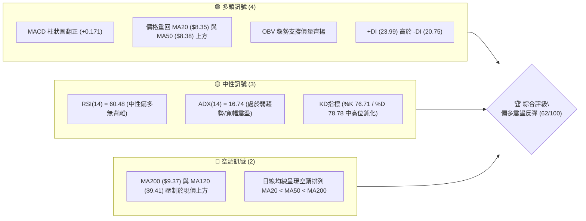

### 📊 核心指標速覽表

| 指標類別 | 指標名稱 | 當前數值 | 訊號 | 解讀 |
|----------|----------|----------|------|------|
| **價格** | 當前價格 | $9.24 | 🟡 | 位於52週區間中軸 50.0% 處，多空拉鋸重合區 |
| **均線** | MA20 | $8.35 | 🟢 | 現價高出 10.71%，短期均線向上發散具備支撐 |
| **均線** | MA50 | $8.38 | 🟢 | 現價位於 MA50 之上，中期回洗結構初步完成 |
| **均線** | MA200 | $9.37 | 🔴 | 現價低於長期牛熊線 1.39%，構成上方第一道硬阻力 |
| **動能** | RSI(14) | 60.48 | 🟢 | 站上 50 中軸且未進入 70 超買區，動能持續擴張 |
| **動能** | MACD (12,26,9) | 0.363 / Hist +0.171 | 🟢 | 快線高於慢線 (0.192)，柱狀圖持續翻紅擴大 |
| **趨勢** | ADX(14) | 16.74 | 🟡 | ADX < 25 表明非單邊強趨勢，當前屬於區間震盪反彈 |
| **波動** | ATR(14) | $0.72 (7.76%) | 🔴 | 波動幅度較大，持倉需預留足夠止損緩衝 |

### 🏆 技術評分卡

```
╔══════════════════════════════════════════════════════════╗
║              技術評分卡 — ONDS (2026-08-15)              ║
╠══════════════════════════════════════════════════════════╣
║ 趨勢強度 (ADX/趨勢方向)  ████████░░░░░░░░░░░░  42/100 🟡 ║
║ 動能指標 (RSI/MACD/KD)   ██████████████░░░░░░  72/100 🟢 ║
║ 支撐穩定度 (S1/S2/斐波)  ██████████████░░░░░░  70/100 🟢 ║
║ 成交量配合 (OBV/週量比)  ████████████░░░░░░░░  60/100 🟢 ║
║ 形態完整度 (雙底反彈)    ████████████░░░░░░░░  62/100 🟢 ║
║ 均線系統 (MA排列/多空壓) ██████████░░░░░░░░░░  52/100 🟡 ║
╠══════════════════════════════════════════════════════════╣
║ 綜合技術評分             ████████████░░░░░░░░  62/100 🟢 ║
║ 綜合技術評級             偏多區間震盪 / 阻力位前蓄勢     ║
╚══════════════════════════════════════════════════════════╝
```

---

## 2. 趨勢分析

### 🌐 多時框趨勢分析

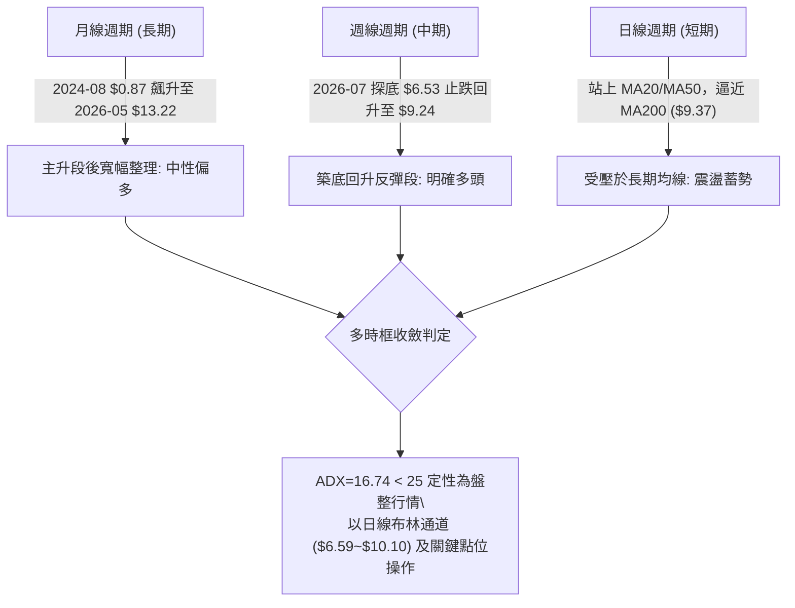

### 📈 長期趨勢 — 12個月走勢圖（Unicode）

```
ONDS 月線走勢圖（過去12個月：2025-08 至 2026-08）
價格 ($)
$13.22 ┤                                            ●(2026-05 波段高點)
$12.00 ┤                                           ╱ ╲
$10.50 ┤                                 ●        ╱   ╲
$10.00 ┤                     ●          ╱ ╲      ╱     ╲
$9.24  ┤                    ╱ ╲   ●    ╱   ●    ╱       ●←當前價格 ($9.24)
$8.00  ┤          ●   ●    ╱   ╲ ╱    ╱     ╲  ╱
$7.00  ┤         ╱ ╲ ╱    ╱     ●    ╱       ╲╱ (2026-07 底部 $7.49)
$6.00  ┤●       ╱   ●
$5.00  ┤ ╲     ╱
$3.20  ┤  ●(52W Low)
       └──────────────────────────────────────────────────────────
         08  09  10  11  12  01  02  03  04  05  06  07  08 (月份)
```

#### 走勢特徵分析表格

| 階段 | 涵蓋月份 | 區間低點/高點 | 漲跌幅 | 走勢特徵解讀 |
|------|----------|---------------|--------|--------------|
| **初升擴張期** | 2025-08 ~ 2025-09 | $5.86 → $7.72 | +31.74% | 脫離低檔區，量能爆發啟動主升行情 |
| **中繼整理期** | 2025-10 ~ 2026-01 | $6.44 → $10.36 | +60.87% | 沿上升軌道攀升，首次突破雙位數關口 |
| **高檔寬幅震盪**| 2026-02 ~ 2026-04 | $9.04 → $10.08 | +11.50% | 在 $9.00~$10.00 間構築高檔中樞平台 |
| **衝頂與深幅回洗**| 2026-05 ~ 2026-07 | $13.22 → $7.49 | -43.34% | 創下52週次高收盤後快速急跌，回測61.8%支撐 |
| **築底修復期** | 2026-07 ~ 2026-08 | $7.49 → $9.24 | +23.36% | 連續四周陽線回升，重回50.0%斐波那契位 |

### 📊 中期趨勢（週線分析）

```
ONDS 週線支撐與壓力架構示意圖 (近20週結構)
阻力 R3  $11.66 ────────────────────────────────────── (2026-05 崩跌前頸線)
阻力 R2  $10.37 ────────────────────────────────────── (2026-04/05 平台頂部)
阻力 R1  $ 9.86 ────────────────────────────────────── (近一年波段密集高點)
MA200    $ 9.37 -------------------------------------- (多空分水嶺均線)
現價     $ 9.24 ■■■■■■■■■■■■■■■■■■■■■■■■■■■■■ (現處於50%斐波位)
支撐 S1  $ 9.20 ══════════════════════════════════════ (即時微型支撐)
支撐 S2  $ 9.04 ══════════════════════════════════════ (2026-03 波段收盤低點)
支撐 S3  $ 8.69 ══════════════════════════════════════ (MA20/50 上行匯聚區)
強支撐   $ 6.53 ────────────────────────────────────── (2026-07-19 週線破底翻低點)
```

中期週線在 2026-07-19 下探 $6.53 後，伴隨 6.71 億股至 8.34 億股的爆量換手，形成明顯的「週線V型破底翻」，目前週線 MACD 柱狀圖已由負轉正（+0.171），確認中期反彈波段成立。

### ⚡ 趨勢強度評估（ADX 解讀）

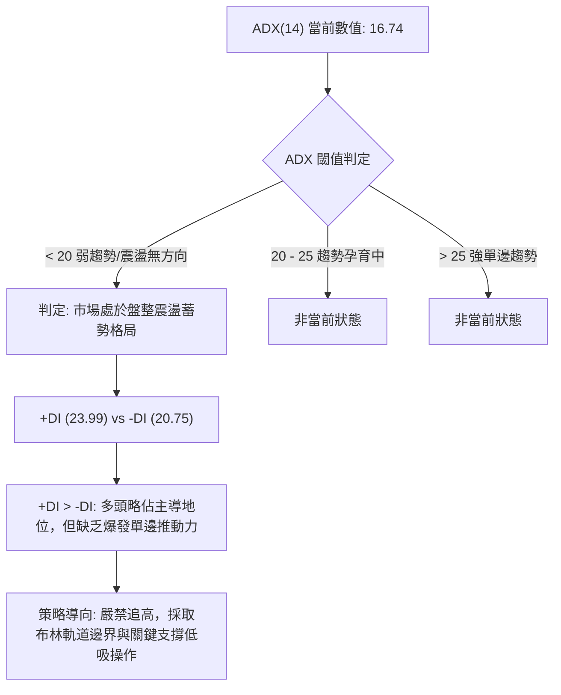

| 指標變數 | 當前讀數 | 強度級別 | 技術意涵 |
|----------|----------|----------|----------|
| **ADX(14)** | 16.74 | 弱 (Weak) | 趨勢強度低於 25，表明不具備單邊暴漲或暴跌條件，區間操作勝率最高 |
| **+DI (多頭動向)** | 23.99 | 中等 | 買盤力量逐步回升，高於空方動向線 |
| **-DI (空頭動向)** | 20.75 | 中等偏弱 | 空方壓制力道自 7 月份高點顯著衰退 |
| **方向差距 (+DI - -DI)** | +3.24 | 微幅偏多 | 多頭掌握主動權，等待量能突破引導 ADX 上穿 25 |

---

## 3. 圖表形態分析

### 🔍 形態識別系統

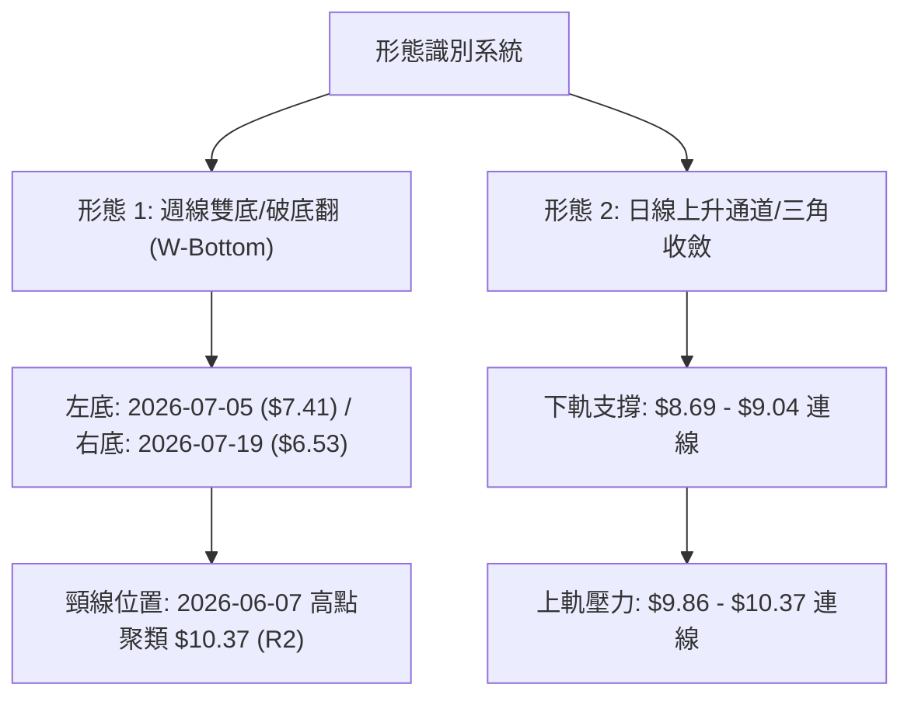

#### 形態信心度評估表

| 形態名稱 | 信心度 | 判斷依據（引用數據） | 完成度 | 目標價（附精確計算式） |
|----------|--------|----------------------|--------|------------------------|
| **週線雙底 (W底/破底翻)** | 70% | 2026-07-12 收盤 $7.26 與 2026-07-19 低點 $6.53 構成雙針探底，且 07-26 週成交量放大至 8.34 億股確認頸線反撲 | 75% | 依形態高度推算：頸線 R2 ($10.37) + (頸線 $10.37 - 形態底部 $6.53 = $3.84) = **$14.21** (接近52W高點 $15.28) |
| **日線布林通道突破** | 65% | 現價 $9.24 站上中軌 $8.35，BB %B 達 0.75，向上軌 $10.10 靠攏 | 80% | 布林上軌壓制位：**$10.10** |
| **大型頭肩頂反轉** | 30% | 2026-05 創 $13.22 為頭部，左右肩模糊且目前已被 7 月大成交量化解 | 20% | 訊號不足，僅做指標型解讀，不列入主交易目標 |

### 🕯️ 重要K線形態分析

| 週/月份 | 收盤價 | K線形態 | 解讀 | 訊號 |
|---------|--------|---------|------|------|
| **2026-05** | $13.22 | 長上影大陽線 (射擊之星變體) | 衝高遭遇獲利了結賣壓，多頭動能短線耗盡 | 🔴 空頭警戒 |
| **2026-06** | $8.24 | 光腳大陰線 | 跌破短期所有均線，流動性下殺引發恐慌盤 | 🔴 強烈看空 |
| **2026-07-19 (週)** | $6.53 | 爆量長下影鎚頭線 (Hammer) | 單週成交量達 6.71 億股，主力機構進場承接 | 🟢 底部確認 |
| **2026-07-26 (週)** | $7.80 | 大陽吞噬 (Bullish Engulfing) | 週量擴大至 8.34 億股，徹底吞噬前週實體 | 🟢 反轉確立 |
| **2026-08-16 (週)** | $9.24 | 連續小實體紅K蓄勢 | 在 MA200 頸線下方整理，籌碼換手充分 | 🟡 中性蓄勢 |

### 📉 ASCII 走勢形態示意圖

```
ONDS 雙底 (W-Bottom) 與突破結構示意圖
價格 ($)
$10.37 ┤                      [頸線位置 - R2] ------------------------
       │                     ╱                ╲                      ▲
$9.86  ┤                    ╱                  ╲       [突破目標]     │ 形態高度
$9.24  ┤                   ╱                    ●←現價 $9.24         │ $3.84
$8.69  ┤                  ╱                      ╲   ╱                │
$7.41  ┤   ● (左底 07-05)╱                        ╲ ╱                 ▼
$6.53  ┤   ─────────────                         ● (右底破底翻 07-19) -
       └──────────────────────────────────────────────────────────────
```

### 🎯 形態目標價計算

1. **第一波段目標價（頸線測幅）**：
   - 頸線參考阻力位 R2 = **$10.37**
   - 底部支撐基準點 = **$6.53**
   - 形態垂直高度 $H = \$10.37 - \$6.53 = \$3.84$
   - 突破 R2 後的等幅測量目標價 $T_{形態} = \$10.37 + \$3.84 =$ **$14.21**

2. **短線阻力壓制位（斐波那契與波段高點）**：
   - 短期目標價 1 (R1) = **$9.86**（近一年波段高點聚類）
   - 短期目標價 2 (布林上軌 / 斐波 38.2%) = **$10.10 ~ $10.67**

---

## 4. 支撐與阻力

### 🗺️ 關鍵價位分布圖（Unicode）

```
ONDS 價位結構分布圖
══════════════════════════════════════════════════════════════
$15.28 ║ 52W High / 斐波 0.0% 極限阻力位
$12.43 ║ 斐波那契 23.6% 回調位
$11.66 ║██████████████████████████████║ 強阻力 R3 (波段高點聚類)
$10.67 ║ 斐波那契 38.2% 回調位
$10.37 ║████████████████████          ║ 關鍵阻力 R2 (W底頸線)
$10.10 ║ 布林通道上軌壓制位
$ 9.86 ║████████████████████████      ║ 近期第一阻力 R1
$ 9.37 ║ ════════════════════════════ ║ MA200 均線壓制位
$ 9.24 ╠══════════════════════════════╣ ◄ 現價 (斐波 50.0% 多空分水嶺)
$ 9.20 ║▓▓▓▓▓▓▓▓▓▓▓▓▓▓▓▓▓▓▓▓▓▓▓▓▓▓▓▓  ║ 即時微型支撐 S1
$ 9.04 ║██████████████████████        ║ 關鍵支撐 S2 (03月波段收盤低點)
$ 8.69 ║████████████████████████████  ║ 強支撐 S3 (波段低點聚類)
$ 8.35 ║ 布林通道中軌 / MA20
$ 7.81 ║ 斐波那契 61.8% 黃金分割強支撐
$ 6.59 ║ 布林通道下軌
$ 3.20 ║ 52W Low / 斐波 100.0% 歷史底部
══════════════════════════════════════════════════════════════
```

### 🚧 阻力位分析表

| 阻力級別 | 價位 | 形成原因 | 突破難度 | 重要性 |
|----------|------|----------|----------|--------|
| **R1** | **$9.86** | 近一年波段高點聚類區，距離現價 +6.71% | 🟡 中等 | 短線多頭試金石，突破意味著站穩 MA200 與 $9.50 整數關口 |
| **R2** | **$10.37** | 2026-01/04 月多個波段頂部聚類，距離現價 +12.23% | 🔴 較高 | W底形態頸線位，需單日成交量 > 1.2 億股方能有效向上突破 |
| **R3** | **$11.66** | 近一年強阻力聚類區，2026-05 大跌起跌點，距離現價 +26.24% | 🔴 極高 | 中期大頂結構阻力，解套賣壓最密集區域 |

### 🛡️ 支撐位分析表

| 支撐級別 | 價位 | 形成原因 | 守住機率 | 重要性 |
|----------|------|----------|----------|--------|
| **S1** | **$9.20** | 近一年波段低點聚類，距離現價僅 -0.43% | 🟢 75% | 日線短線多頭防守點，跌破則回踩 S2 |
| **S2** | **$9.04** | 2026-03 波段收盤低點及整數心理關卡，距離現價 -2.16% | 🟢 80% | 區間震盪下沿核心防線，具備極強買盤支撐 |
| **S3** | **$8.69** | 近一年波段密集低點聚類，距離現價 -5.95% | 🟢 90% | 中期防守底線，接近 MA20 ($8.35) 與 MA50 ($8.38) 匯聚支撐區 |

### 📐 斐波那契回調位分析（基準：52W區間 $3.20 → $15.28）

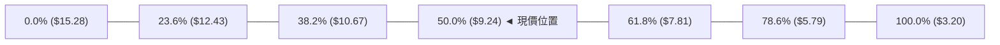

- **當前位置解讀**：現價 **$9.24** 精確落在 52 週波動範圍（$3.20 ~ $15.28）的 **50.0% 斐波那契回調位 ($9.24)**。
- **技術意涵**：
  1. 50.0% 回調位是市場心理最關鍵的平衡中軸。股價在此處止跌回升，表明自 $13.22 的回調已被多頭在對稱位置完全承接。
  2. 若現價向上確認脫離 $9.24，上方第一個斐波那契目標位為 **38.2% ($10.67)**，其次為 **23.6% ($12.43)**。
  3. 下方強防守位為黃金分割點 **61.8% ($7.81)**，此前 2026-07-26 收盤 $7.80 精準回踩該位置後強勁反彈，驗證了該斐波位具備高度結構有效性。

---

## 5. 技術指標深度解讀

### 🎛️ 指標訊號總覽

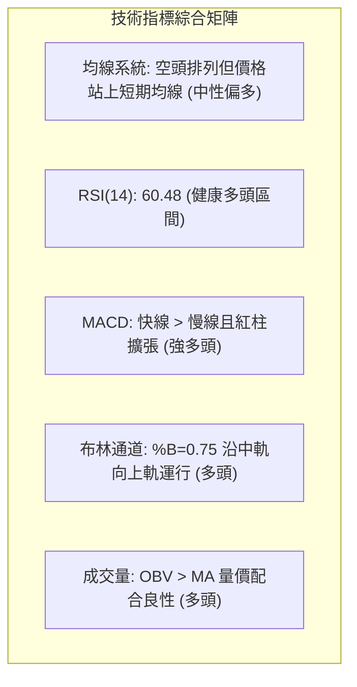

### 📈 移動平均線排列分析

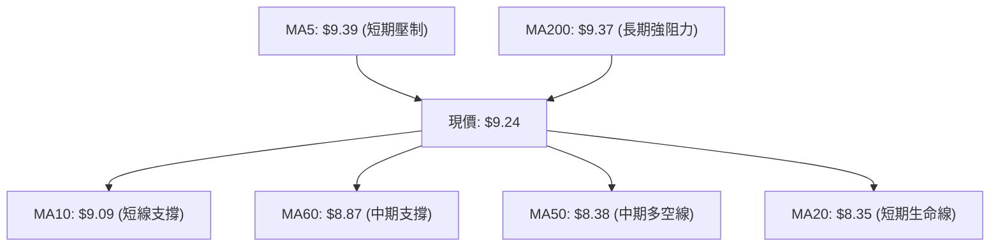

| 均線名稱 | 數值 | 現價與均線關係 | 乖離率 (%) | 短期走勢特徵 | 訊號強度 |
|----------|------|----------------|------------|--------------|----------|
| **MA5** | $9.39 | 價格在均線下方 | -1.60% | 短線輕微受壓，即將走平扣低 | 🟡 中性 |
| **MA10** | $9.09 | 價格在均線上方 | +1.65% | 快速向上攀升，提供短線下影線支撐 | 🟢 看多 |
| **MA20** | $8.35 | 價格在均線上方 | +10.66% | 短期多頭生命線，強勁上彎 | 🟢 強烈看多 |
| **MA50** | $8.38 | 價格在均線上方 | +10.26% | 扣抵低位，中期均線翻揚 | 🟢 看多 |
| **MA60** | $8.87 | 價格在均線上方 | +4.17% | 走平回升，形成中短期防護網 | 🟢 看多 |
| **MA120**| $9.41 | 價格在均線下方 | -1.81% | 下降走勢減緩，上方第一道半年線反壓 | 🔴 看空 |
| **MA200**| $9.37 | 價格在均線下方 | -1.39% | 長期年線壓制，目前呈現 MA20 < MA50 < MA200 結構 | 🔴 看空 |
| **MA240**| $9.09 | 價格在均線上方 | +1.65% | 長期底部基線向上發散 | 🟢 看多 |

**均線深度解讀**：目前均線呈現典型的「底部反彈、上方受阻於長期均線」結構。雖然大格局仍受制於 MA200 ($9.37) 的壓制，但短中期均線（MA10、MA20、MA50、MA60）已在現價下方 $8.35 ~ $9.09 區間形成多層密集多頭支撐帶。一旦現價帶量突破 MA200 ($9.37) 及 MA120 ($9.41)，均線系統將迅速轉化為「黃金交叉」全面多頭排列。

### 📉 RSI(14) 分析

```
RSI(14) 當前數值: 60.48
[超賣 0] ────────── [30] ────────── [50 中軸] ─────●──── [70] ────────── [100 超買]
強度進度條: ████████████░░░░░░░░  60.48% (健康多頭推進區)
```

- **背離分析**：
  - **結論**：**無明顯頂背離或底背離**。
  - **細節**：2026-07-19 價格下探最低收盤 $6.53 時，週線 RSI 為 35.0（前波低點 07-05 RSI 為 21.3），價格創新低而 RSI 未創新低，已於 7 月底完成「標準底背離」確認；當前價格回升至 $9.24，RSI 攀升至 60.48，動能與價格同向上行，確認反彈走勢健康。

### 📊 MACD(12/26/9) 訊號解讀

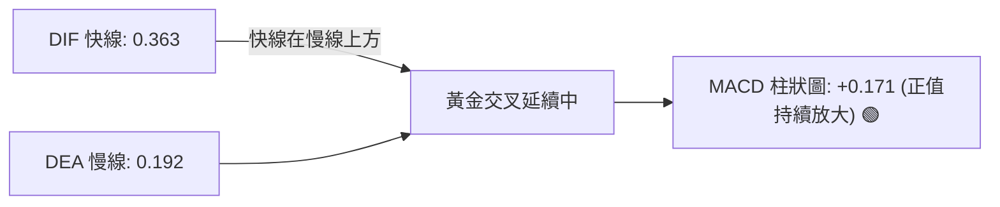

- **MACD 解讀**：快線 (0.363) 明顯高於慢線 (0.192)，柱狀圖讀數為 **+0.171**，且自 2026-07-26 轉正以來連續 4 週維持紅柱擴張態勢。這表明多頭動能正在主導中期行情，尚未出現任何紅柱縮短或高位鈍化的衰竭跡象。

### 📦 布林通道分析

```
ONDS 布林通道寬度與價格位置示意圖 (BB 20, 2)
$10.10 ┬────────────────────────────────────────── 布林上軌 (Upper Band)
       │                                         ▲
$9.24  ┼─────────────────────────●─────────────── 價格位置 (%B = 0.75)
       │                        ▲                │
$8.35  ┼────────────────────────┼──────────────── 布林中軌 (MA20 生命線)
       │                        │                ▼
$6.59  ┴────────────────────────┴───────────────── 布林下軌 (Lower Band)
```

- **布林數據**：上軌 **$10.10** ｜ 中軌 **$8.35** ｜ 下軌 **$6.59** ｜ **%B = 0.75**
- **解讀**：現價位於布林通道上半區（%B > 0.5），正朝向上軌 $10.10 推進。由於中軌 MA20 ($8.35) 呈現向上傾斜走勢，通道整體處於擴張初期的「開口向上」形態，有利於多頭向上測試上軌壓力。

### 💹 成交量分析（量價配合度）

- **量能數據**：
  - 最新單日成交量：**96,480,400 股**
  - 20日均量：**99,424,120 股**（量比：**0.97x**，量價平衡）
  - 50日均量：**85,432,856 股**（高於50日均量 12.93%）
  - 近期週成交量高峰：2026-07-26 單週爆出 **834,313,400 股** 天量
- **OBV (能量潮指標)**：
  - **OBV 趨勢**：`OBV > MA`，呈現多頭排列。
  - **量價配合判定**：在 7 月底天量築底後，價格上漲過程中週成交量始終維持在 3.8 億 ~ 4.7 億股以上的高水平，成交量結構展現出良性的「價漲量增、回踩量縮」特徵，量能完全支撐當前價格上漲。

---

## 6. 動能與波動率

### ⚡ 動能評估四象限

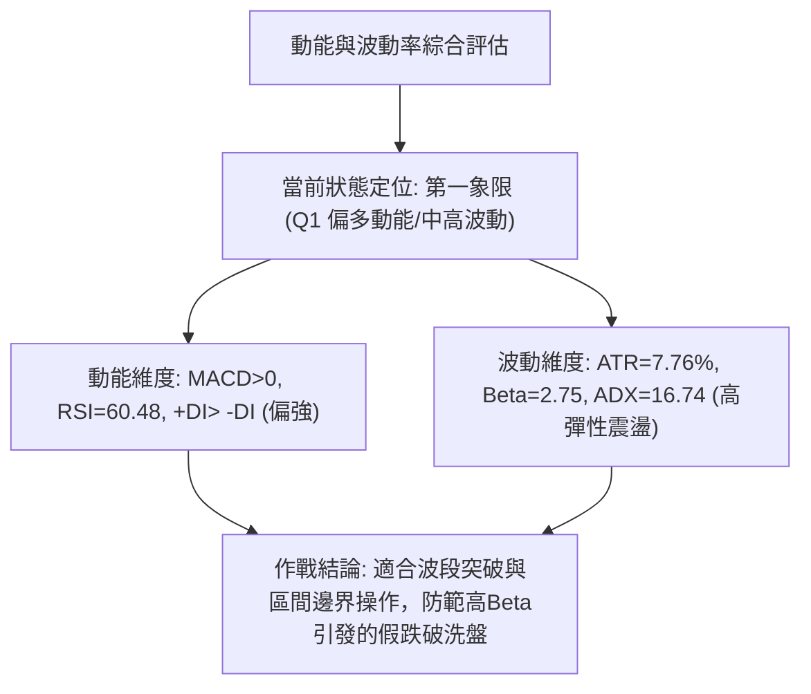

| 象限 | 動能維度 | 波動維度 | ONDS 判定 | 操作策略指導 |
|------|----------|----------|-----------|--------------|
| **Q1 (最佳擴張)** | 強動能 (RSI>55, MACD紅柱) | 高波動 (ATR>5%, Beta>2.0) | **✓ (當前定位)** | **順勢逢低做多，利用回踩 S1/S2 布局，嚴設止損** |
| **Q2 (穩定牛市)** | 強動能 | 低波動 | — | 趨勢穩健加碼持倉 |
| **Q3 (無序洗盤)** | 弱動能 | 高波動 | — | 降低槓桿，減少交易頻率 |
| **Q4 (陰跌尋底)** | 弱動能 | 低波動 | — | 空手觀望，禁止抄底 |

### 📊 ATR 波動率分析

- **ATR(14) 數值**：**$0.72**（佔當前股價的 **7.76%**）
- **波動特性解讀**：每日平均波動區間達 $0.72，表明該標的屬於高彈性、高投機屬性品種。
- **止損與風控距離建議**：
  - **日內交易止損緩衝**：$1.0 \times \text{ATR} =$ **$0.72**
  - **波段交易止損緩衝**：$1.5 \times \text{ATR} =$ **$1.08**
  - **合理進場防守底線**：現價 $9.24 - 1.08 = **$8.16**（剛好置於 MA20 $8.35 與布林中軌下方，可有效避免日常噪音引發的非理性掃損）。

### 📐 Beta 與市場相關性

- **Beta 係數**：**2.75**（超高市場敏感度）
- **解讀**：ONDS 相對於標普500指數具備 2.75 倍的波動放大效應。當大盤上漲 1% 時，該股理論期望上漲 2.75%；反之大盤下挫時亦承受 2.75 倍回撤壓力。
- **融券放空比例 (Short % Float)**：高達 **41.5%**（空頭部位極重，Short Ratio 為 2.24 天）。在基本面營收高速增長 (YoY 1235.4%) 與機構評級 (9位分析師一致 Strong Buy) 的催化下，超高空單比例隨時可能因突破 R1 ($9.86) 而觸發劇烈的**軋空行情 (Short Squeeze)**。

---

## 7. 多時框架總結

### 📋 時框架評分表

| 時框架 | 趨勢方向 | 動能指標 | 均線系統 | 形態結構 | 綜合評分 | 操作建議 |
|--------|----------|----------|----------|----------|----------|----------|
| **月線 (長期)** | 🟢 偏多上升 | 🟡 中性 (歷史高位回調) | 🟢 站穩長期基準 | 🟢 大型擴張旗形 | **75/100** | 長線持股，目標看高至分析師均價 $19.06 |
| **週線 (中期)** | 🟢 破底翻反轉 | 🟢 MACD翻紅/量能爆發 | 🟡 均線修復中 | 🟢 週線雙底 (W底) | **70/100** | 波段做多，逢回調分批建倉 |
| **日線 (短期)** | 🟡 區間震盪 | 🟢 RSI 60 / MACD多頭 | 🔴 承壓於 MA200 | 🟡 蓄勢測試 R1 | **58/100** | 於支撐位低吸，突破 R1 ($9.86) 加碼 |

### 🔲 綜合訊號矩陣

```
╔══════════════════════════════════════════════════════════════════╗
║                    ONDS 多時框訊號一致性矩陣                    ║
╠════════════════╦══════════════╦══════════════════╦═══════════════╣
║ 維度           ║ 短期 (日線)  ║ 中期 (週線)      ║ 長期 (月線)   ║
╠════════════════╬══════════════╬══════════════════╬═══════════════╣
║ 趨勢方向       ║ 🟡 震盪整理  ║ 🟢 反彈上升      ║ 🟢 多頭擴張   ║
║ 動能強弱       ║ 🟢 溫和看多  ║ 🟢 加速擴張      ║ 🟡 中性蓄勢   ║
║ 關鍵均線位置   ║ 🔴 MA200下方 ║ 🟢 站上 MA20     ║ 🟢 遠高於起漲 ║
║ 量價結構       ║ 🟢 OBV支撐   ║ 🟢 底部天量換手  ║ 🟢 巨量沉澱   ║
║ 結構一致性結論 ║ 🟢 65% (中長期多頭共振，短期受制於長期均線壓制)  ║
╚════════════════╩══════════════╩══════════════════╩═══════════════╝
```

### ⚖️ 多時框收斂結論

依據多時框收斂規則：
1. **行情定性**：當前 ADX(14) 讀數為 **16.74 (< 25)**，嚴格定性為**「盤整震盪蓄勢行情」**，尚未進入單邊爆發期。
2. **主導時框與權重分配**：以日線布林通道 ($6.59 ~ $10.10) 及關鍵支撐阻力（S1 $9.20 / R1 $9.86）作為主要交易區間；中長期（週線破底翻與月線多頭）提供向上突破的勝率庇護。
3. **唯一方向性結論**：**【偏多震盪蓄勢（Bullish Consolidation）】**。綜合評分為 **62/100**（偏多區間），交易策略全面以**逢低做多與突破追多**為主線，空頭訊號僅作為阻力位獲利了結與風控對沖之參考。

---

## 8. 交易策略建議

### 🗺️ 策略決策流程圖

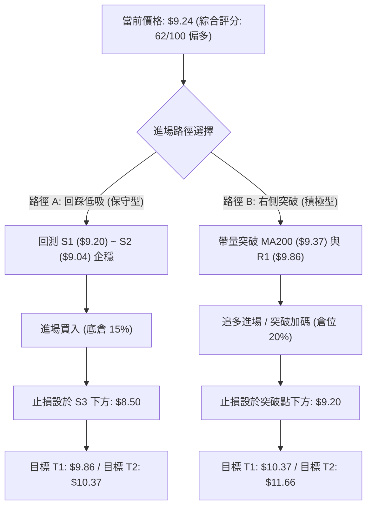

### 🧭 策略路由

**當前主策略方向 = 【逢低做多 / 突破加碼】（依評分 62/100 主推多頭策略）**

### 🎯 價格情境階梯（Price Scenarios）

| 觸發條件 | 第一目標 | 後續延伸目標 | 情境含義與操作指引 |
|----------|----------|--------------|--------------------|
| **強勢突破 R1 ($9.86)** | R2 ($10.37) | R3 ($11.66) | 短線確認突破 MA200 壓制，空頭回補軋空啟動，全面加碼 |
| **站穩現價 ($9.24)** | R1 ($9.86) | 布林上軌 ($10.10) | 維持在 50% 斐波那契位上方強勢震盪，持股續抱等待發酵 |
| **失守跌破 S1 ($9.20)** | S2 ($9.04) | S3 ($8.69) | 短線回洗測試 MA20/MA50 支撐，多頭尋求更佳防守買點 |
| **重挫跌破 S3 ($8.69)** | 布林中軌 ($8.35) | 斐波 61.8% ($7.81)| 多頭結構遭受破壞，跌破生命線，所有多單嚴格止損離場 |

### 📊 情境機率分佈

```
情境機率分佈可視化:
[向上突破/震盪上行] ████████████░░░░░░░░  60%
[區間窄幅震盪]     ██████░░░░░░░░░░░░░░  25%
[再探深跌破位]     ███░░░░░░░░░░░░░░░░░  15%
```

| 情境劃分 | 機率估計 | 主要技術指標與籌碼依據 |
|----------|----------|------------------------|
| **繼續上行 / 突破反彈** | **60%** | MACD 柱狀圖翻紅 (+0.171)、OBV 趨勢支撐、空單比例高達 41.5% 具軋空潛能 |
| **區間震盪蓄勢** | **25%** | ADX(14) 僅 16.74 缺乏單邊推力、MA200 ($9.37) 形成上方直接反壓 |
| **回落再探底部** | **15%** | ATR 高達 7.76% 波動劇烈，若美股大盤重挫可能引發高 Beta (2.75) 補跌 |

### 🟢 主策略詳情

| 策略要素 | 策略 A：關鍵支撐低吸（穩健型） | 策略 B：突破頸線追擊（動能型） |
|----------|--------------------------------|--------------------------------|
| **進場條件** | 價格回踩 S1~S2 區間獲支撐，出現 15分K 陽線吞噬 | 日線收盤價帶量有效突破 R1 阻力位 |
| **進場價格** | **$9.15**（S1 $9.20 與 S2 $9.04 之間） | **$9.88**（突破 R1 $9.86 確認） |
| **目標價 T1** | **$9.86**（近一年波段高點 R1，預期 +7.76%） | **$10.37**（W底頸線阻力 R2，預期 +4.96%）|
| **目標價 T2** | **$10.37**（關鍵頸線 R2，預期 +13.33%） | **$11.66**（強阻力 R3，預期 +18.02%） |
| **止損價格** | **$8.65**（置於 S3 $8.69 下方，風險 -5.46%） | **$9.35**（置於 MA200 $9.37 下方，風險 -5.36%）|
| **風險報酬比** | **2.44 : 1**（目標 T2 測算） | **3.36 : 1**（目標 T2 測算） |
| **預估勝率** | **65%** | **58%** |
| **建議倉位** | **15% ~ 20%** 總資金 | **10% ~ 15%** 總資金 |

### 🔴 反向風險觸發點（對沖與風控提示）

- **多頭反轉失效點**：若日線收盤價跌破 **S3 ($8.69)**，宣告短期築底失敗，必須無條件將多頭部位平倉 50% 以上。
- **全面空頭確認點**：若價格帶量跌破布林中軌 / MA20 **($8.35)**，多頭形態徹底瓦解，剩餘多單全部清倉，可輕倉建立以 **$7.81** 為目標的空頭對沖避險倉位。

### ⭐ 整體訊號強度評星

```
╔══════════════════════════════════════════════════════════╗
║ 做多訊號強度：★★★★☆  (4.0/5星 - 底部放量突破，偏多格局)  ║
║ 做空訊號強度：★★☆☆☆  (2.0/5星 - 空頭動能衰竭，僅存均線壓) ║
║ 整體可信度：  ★★★★☆  (4.0/5星 - 價量與斐波位高度契合)   ║
╚══════════════════════════════════════════════════════════╝
```

---

## 9. 風險提示與監控

### ✅ 關鍵監控指標 Checklist

```
╔══════════════════════════════════════════════════════════════╗
║                   ONDS 交易日常監控清單 (Checklist)           ║
╠══════════════════════════════════════════════════════════════╣
║ [ ] 價格是否有效站穩 MA200 ($9.37) 與 MA120 ($9.41)          ║
║ [ ] RSI(14) 是否在逼近 70 時出現頂背離或超買鈍化            ║
║ [ ] 日成交量能否持續維持在 20日均量 (9,942萬股) 之上         ║
║ [ ] MACD 柱狀圖是否持續保持正值 (+0.171 以上擴張)            ║
║ [ ] ADX(14) 是否自 16.74 上穿 25，確認單邊主升浪啟動        ║
║ [ ] 空頭回補進度：觀察 Short % Float (41.5%) 是否出現急速下降║
║ [ ] 下方核心防守位 S2 ($9.04) 與 S3 ($8.69) 是否完好未破     ║
╚══════════════════════════════════════════════════════════════╝
```

### ⚠️ 風險場景分析

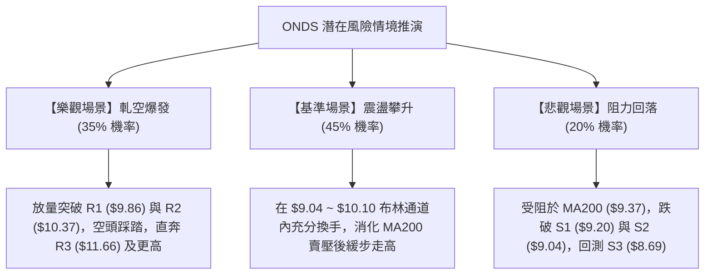

### 🛡️ 風險管理重要提醒

1. **高波動度風險管控**：
   - ONDS 的 ATR 佔比達 **7.76%**，Beta 為 **2.75**，日內波動極其劇烈。單筆交易承受的最大本金損失嚴格控制在總資產的 **1.0% ~ 1.5%** 以內。
2. **空頭擠壓 (Short Squeeze) 雙刃劍**：
   - 41.5% 的高空單比例意味著一旦突破關鍵阻力，股價將產生跳空暴漲；但若向上突破失敗，多頭踩踏回跌速度亦極為迅猛，**切忌在 R1 ($9.86) 阻力位正下方盲目追高**。
3. **倉位管理守則**：
   - 建議採用「金字塔式建倉法」：在 $9.04 ~ $9.20 區間建立 15% 底倉；唯有當日線實體突破並收在 R1 ($9.86) 上方時，方可追加 10% 動能倉位，將綜合成本控制在安全邊界內。

---

## 📋 報告總結

```
╔════════════════════════════════════════════════════════════════════╗
║                      ONDS 技術分析報告總結                         ║
╠════════════════════════════════════════════════════════════════════╣
║ 報告日期：2026-08-15                                               ║
║ 當前價格：$9.24                                                    ║
║ 分析評級：🟢 偏多震盪蓄勢 / 逢低布局 (技術綜合評分: 62/100)        ║
╠════════════════════════════════════════════════════════════════════╣
║ 關鍵結論：                                                         ║
║ ├─ 長期趨勢：🟢 偏多上升（月線大級別擴張，站穩歷史中樞平台）       ║
║ ├─ 中期趨勢：🟢 底部確立（週線破底翻，MACD紅柱擴張，OBV支撐）      ║
║ ├─ 短期趨勢：🟡 震盪蓄勢（受壓於 MA200 $9.37，支撐密集於 $9.04）  ║
║ ├─ 關鍵支撐：S1 $9.20 ｜ S2 $9.04 ｜ S3 $8.69                      ║
║ ├─ 關鍵阻力：R1 $9.86 ｜ R2 $10.37 ｜ R3 $11.66                    ║
║ └─ 分析師共識：Strong Buy ｜ 平均目標價 $19.06 (潛在空間 +106.3%)   ║
╠════════════════════════════════════════════════════════════════════╣
║ 最優策略組合：                                                     ║
║ 1. 🥇 最佳機會：於 $9.15~$9.20 區間低吸，止損 $8.65，目標看 $10.37 ║
║ 2. 🥈 次選機會：待放量突破 R1 $9.86 後追多，目標看 $11.66         ║
║ 3. 🥉 保守選擇：在 $9.04~$10.10 布林區間內高拋低吸，嚴守止損      ║
╚════════════════════════════════════════════════════════════════════╝
```

---

> ⚠️ **免責聲明**：本報告為技術分析研究成果，所有數據及推算均基於歷史價格與成交量資訊。本報告**僅供學術交流與投資研究參考**，**不構成任何形式的邀約或投資建議**。金融市場波動劇烈，投資人應獨立評估風險並自負盈虧。

---

*報告生成時間：2026-08-15 ｜ 數據來源：Yahoo Finance ｜ 分析框架：資深多時框量化技術分析體系*