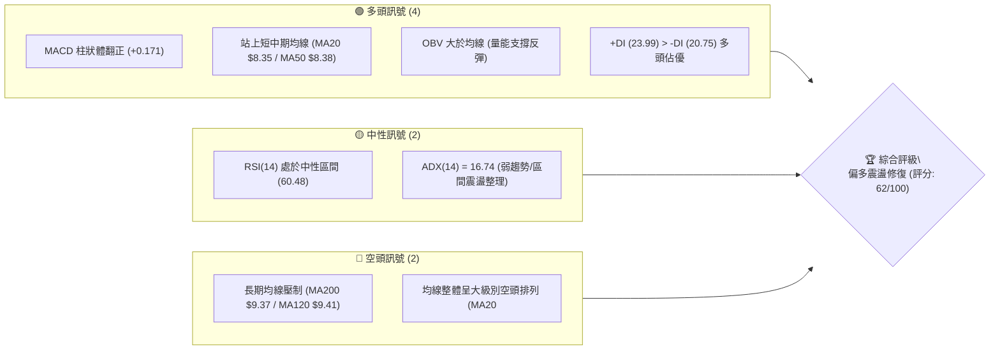
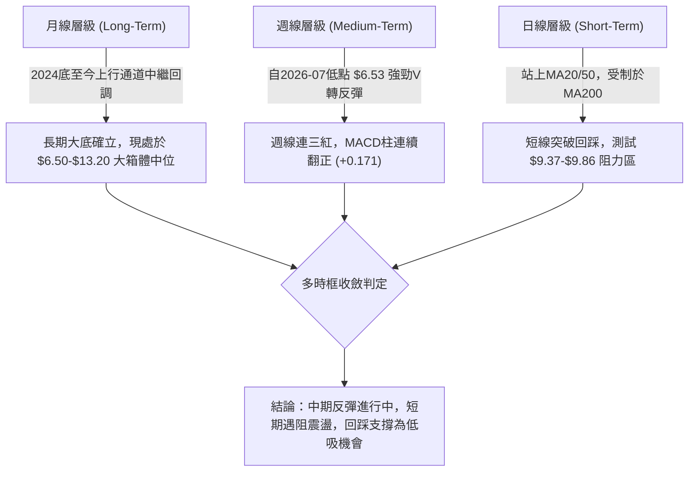
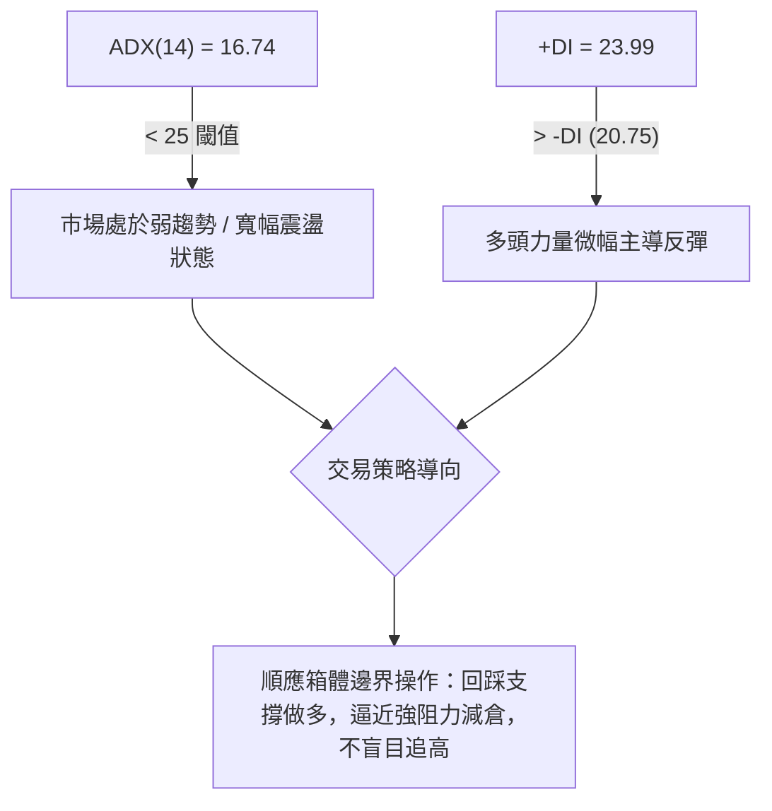
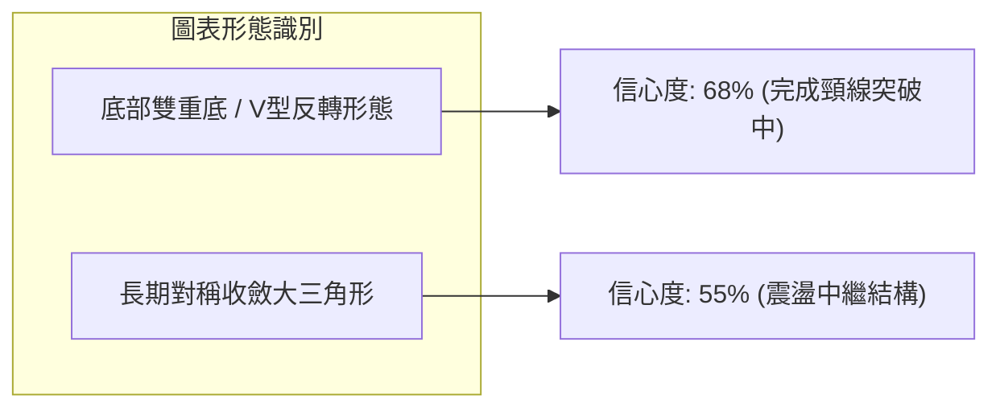
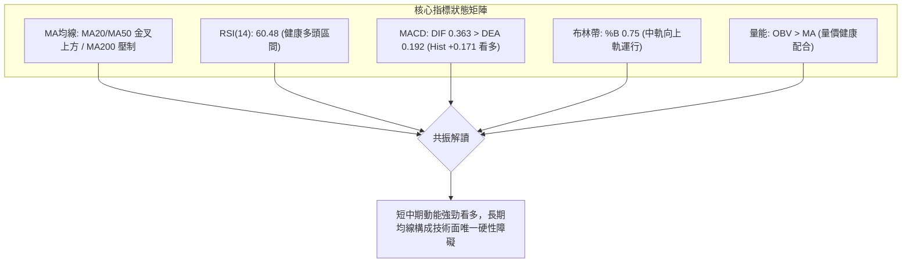
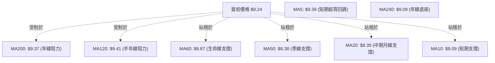
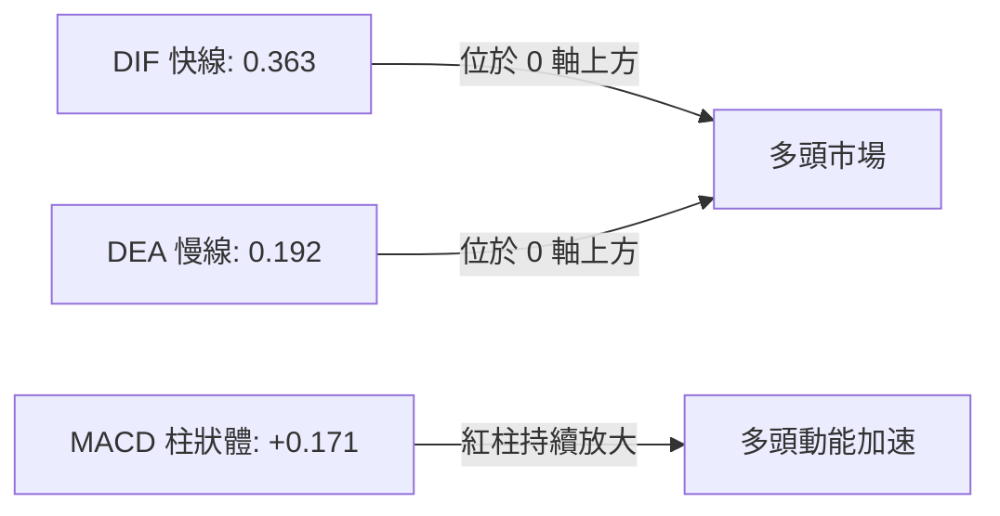
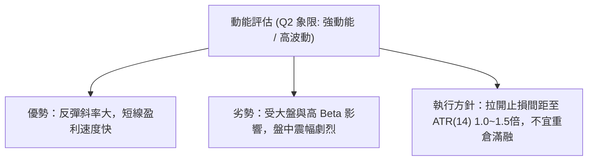
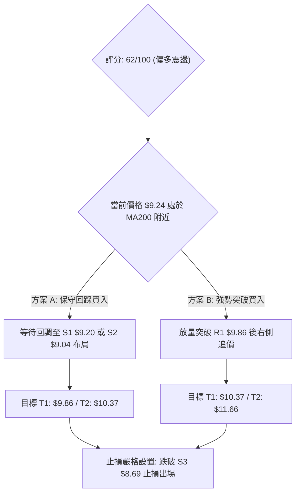
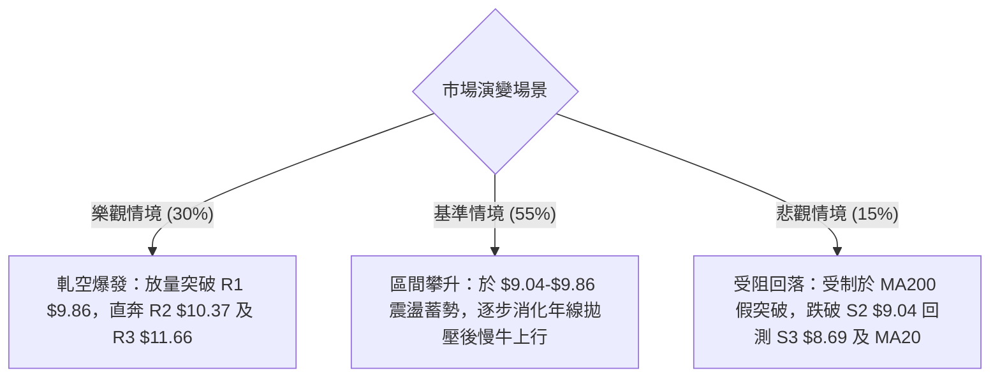

# ONDS 技術分析報告

> **報告日期**：2026-08-16 ｜ **語言**：繁體中文 ｜ **數據來源**：Yahoo Finance ｜ **當前價格**：$9.24

---

## 目錄

| 章節 | 內容 |
|------|------|
| [1. 技術面概覽](#1-技術面概覽) | 訊號儀表板、核心指標、評分卡 |
| [2. 趨勢分析](#2-趨勢分析) | 多時框趨勢、長中短期走勢 |
| [3. 圖表形態分析](#3-圖表形態分析) | 形態識別、K線組合、目標價 |
| [4. 支撐與阻力](#4-支撐與阻力) | 關鍵價位、斐波那契回調 |
| [5. 技術指標深度解讀](#5-技術指標深度解讀) | MA/RSI/MACD/布林/成交量 |
| [6. 動能與波動率](#6-動能與波動率) | 動能評估、ATR、Beta |
| [7. 多時框架總結](#7-多時框架總結) | 時框架評分矩陣 |
| [8. 交易策略建議](#8-交易策略建議) | 多空策略、風險報酬比 |
| [9. 風險提示與監控](#9-風險提示與監控) | 監控指標、風險場景 |

---

## 1. 技術面概覽

### 🎯 技術訊號儀表板



### 📊 核心指標速覽表

| 指標類別 | 指標名稱 | 當前數值 | 訊號 | 解讀 |
|:---|:---|:---|:---:|:---|
| **價格** | 當前收盤價 | $9.24 | 🟢 | 站於 52 週中位數（50% 斐波那契位）上方，短線修復 |
| **均線** | MA20 | $8.35 | 🟢 | 股價位於 MA20 上方 (+10.66%)，短期支撐確立 |
| **均線** | MA50 | $8.38 | 🟢 | 股價突破中期均線，短中期動能轉強 |
| **均線** | MA200 | $9.37 | 🔴 | 股價逼近 MA200 下方 (-1.39%)，面臨關鍵長期牛熊分界壓制 |
| **動能** | RSI(14) | 60.48 | 🟡 | 位於 50-70 強勢中性區，無頂底背離，具備上攻空間 |
| **動能** | MACD (12,26,9) | 0.363 / 0.192 | 🟢 | DIF 線位於 Signal 線上方，Hist 為 +0.171，多頭排列 |
| **動能** | KD (Stoch 14,3) | %K: 76.71 / %D: 78.78 | 🟡 | 進入相對高檔鈍化區，未形成死亡交叉 |
| **趨勢** | ADX (14) | 16.74 | 🟡 | 趨勢強度低於 25，市場屬震盪修復格局，以箱體策略為主 |
| **通道** | 布林通道 (20,2) | 上 $10.10 / 下 $6.59 | 🟢 | %B = 0.75，沿中軌 ($8.35) 向上軌拓展空間 |
| **波動** | ATR(14) | $0.72 (7.76%) | 🟡 | 每日平均波幅較大，需設置寬幅止損 |
| **量能** | 最新成交量 | 96.48M (量比 0.97x) | 🟢 | OBV > MA，近三週週量溫和放大，量價配合健康 |

### 🏆 技術評分卡

```
╔══════════════════════════════════════════════════════════════════╗
║                   技術評分卡 — ONDS (2026-08-16)                  ║
╠══════════════════════════════════════════════════════════════════╣
║ 趨勢強度      ████████░░░░░░░░░░░░  40/100  🟡 弱趨勢/區間震盪    ║
║ 動能指標      ██████████████░░░░░░  70/100  🟢 MACD金叉/RSI強勁   ║
║ 支撐穩定度    ██████████████░░░░░░  70/100  🟢 S1/S2/MA20多重保護 ║
║ 成交量配合    ████████████░░░░░░░░  60/100  🟢 OBV量價配合良好    ║
║ 形態完整度    ████████████░░░░░░░░  60/100  🟡 底部圓弧V轉構築中  ║
║ 均線排列      ████████░░░░░░░░░░░░  40/100  🔴 長期均線MA200壓制  ║
╠══════════════════════════════════════════════════════════════════╣
║ 綜合評分      ████████████░░░░░░░░  62/100  🟢 偏多震盪（逢低做多）║
╚══════════════════════════════════════════════════════════════════╝
```

---

## 2. 趨勢分析

### 🌐 多時框趨勢分析



### 📈 長期趨勢 — 12個月走勢圖（Unicode）

```
ONDS 月線收盤走勢圖（2025-08 至 2026-08）
價格 ($)
$14.00 ┤                                      ● (05月高點 $13.22)
$12.00 ┤
$10.00 ┤                     ● (01月 $10.36)   │
$9.00  ┤               ●     │     ●           │           ●←當前 $9.24
$8.00  ┤         ●     │     │     │           │     ●     │
$7.00  ┤   ●     │     │     │     │           │     │     │
$6.00  ┤ ● │     │     │     │     │           │     │     │
$5.00  ┤ │ │     │     │     │     │           ●(06月$8.24)│
$4.00  ┤ │ │     │     │     │     │                 ●(07月低點 $7.49)
       └─┴─┴─────┴─────┴─────┴─────┴───────────┴─────┴─────┴────────
        08 09 10 11 12 01 02 03 04 05 06 07 08 (月份)
        2025                                 2026
```

#### 走勢特徵分析表格

| 階段區間 | 時間跨度 | 收盤價變化 | 漲跌幅 | 走勢特徵與量價解讀 |
|:---|:---|:---|:---:|:---|
| **主升攻擊波** | 2025-08 → 2026-01 | $5.86 → $10.36 | +76.79% | 沿著月線均線放量單邊上攻，確立長期反轉架構。 |
| **高位箱體震盪** | 2026-01 → 2026-04 | $10.36 → $10.04 | -3.09% | 在 $9.00 - $10.50 區間內反覆拉鋸，籌碼換手。 |
| **假突破與劇烈洗盤** | 2026-05 → 2026-07 | $13.22 → $7.49 | -43.34% | 5月衝高 $13.22（52W高點 $15.28）後量能衰竭，快速崩跌洗盤至 7月低點 $6.53（月收 $7.49）。 |
| **底部V型反彈** | 2026-07 → 2026-08 | $7.49 → $9.24 | +23.36% | 連續放量陽線反包，重返 52 週中位水準（$9.24），進入修復格局。 |

### 📊 中期趨勢（週線分析）

```
近期週線壓力與支撐結構圖（2026-04 至 2026-08）：
$13.22 ─────────────────────────────────────────────── [波段峰值]
        \
$10.37 ──\──────────────[R2 阻力區]────────────────────
          \     /\
$9.86  ────\───/──\─────[R1 關鍵阻力]──────────────────
            \ /    \           ▲ 現價 $9.24 (正逼近 MA200/R1)
$9.20  ──────X──────\─────────[S1 近期支撐]───────────
                     \  /\   /
$7.81  ───────────────\/──\─/───[61.8% 斐波回調位]─────
                           V (07-19 最低探至 $6.53)
```

- **週線形態特徵**：2026年7月中旬探底 $6.53（週成交量達 6.71億股），隨後 2026-07-26 當週爆出 8.34億股巨量拉出長陽線（收 $7.80），形成經典的「超跌巨量底部承接」。
- **動能演變**：週線 MACD 柱狀體從 7月初的 -0.281 迅速回升至 +0.171，RSI 從 21.3 超賣區回升至 60.5，中期下降通道已被向上扭轉為箱體反彈。

### ⚡ 趨勢強度評估（ADX 解讀）



| 指標變數 | 當前數值 | 參考閾值 | 趨勢狀態判定 | 交易指引 |
|:---|:---|:---:|:---|:---|
| **ADX(14)** | 16.74 | < 25 (弱) / > 25 (強) | **無明顯單邊趨勢（震盪市）** | 嚴禁使用突破追單策略，優先採用回調掛單 |
| **+DI** | 23.99 | 基準線 | **多方佔優** | 反彈波段多頭佔有先手權 |
| **-DI** | 20.75 | 基準線 | **空方動能減弱** | 空頭拋壓逐步消化，殺跌意願不足 |

---

## 3. 圖表形態分析

### 🔍 形態識別系統



#### 形態識別與信心度評估表

| 形態名稱 | 信心度 | 判斷依據（引用數據） | 完成度 | 目標價（附計算式） |
|:---|:---:|:---|:---:|:---|
| **雙底反彈 (W-Bottom)** | **68%** | 2026年7月在 $6.53 與 $7.41 形成雙重低點結構，頸線位為 R1 $9.86。 | 75% | **理論目標價** = 頸線 $9.86 + (頸線 $9.86 - 最低 $6.53) = **$13.19**（逼近 2026-05 收盤價 $13.22） |
| **布林帶向上突破測試** | **72%** | 股價自布林下軌 $6.59 反彈，連續站上中軌 $8.35，正向上軌 $10.10 邁進。 | 80% | **通道上軌目標價** = **$10.10** |
| **頭肩底形態** | 35% | 數據不足以確認左肩與右肩對稱性，僅能視為局部震盪。 | -- | *訊號不足，僅做指標型解讀* |

### 🕯️ 重要K線形態分析

| 日期 / 週別 | 收盤價 | K線形態 | 解讀 | 訊號 |
|:---|:---:|:---|:---|:---:|
| **2026-07-19** | $6.53 | **長下影錘頭破底翻** | 單週巨量 6.71億股探底 $6.53，主力進場吸籌，賣壓釋放完畢。 | 🟢 強烈看多 |
| **2026-07-26** | $7.80 | **大陽線反包 (Bullish Engulfing)** | 單週 8.34億股天量大陽線，徹底確立 $6.53 為中期波段鐵底。 | 🟢 強烈看多 |
| **2026-08-09** | $9.11 | **實體長陽突破線** | 收復 MA20/MA50，RSI 衝上 70.3，宣告短線進入多頭攻擊波。 | 🟢 看多 |
| **2026-08-16** | $9.24 | **高位十字星蓄勢線** | 週量維持 4.71億股，在 50% 斐波那契位 ($9.24) 停頓消化 MA200 拋壓。 | 🟡 中性蓄勢 |

### 📉 ASCII 走勢形態示意圖

```
ONDS 雙底回升形態示意圖 (2026-07 至 2026-08)
=================================================================
價格 ($)
$10.37 ┤                                                [R2 阻力]
$9.86  ┤- - - - - - - - - - - - - - - - - - - 頸線 R1 - - - - - - - -
$9.24  ┤                                        ● (現價測試 MA200)
$8.69  ┤                                  /      [S3 支撐]
$8.35  ┤                            /\   /       [MA20/中軌]
$7.41  ┤             ●(第一底)     /  ●(第二底)
$6.53  ┤              \___________/
       └─────────────────────────────────────────────────────────
             2026-07-05         2026-07-19   2026-08-02  2026-08-16
```

### 🎯 形態目標價計算

依據雙底形態計算公式：
- **形態低點**：$6.53
- **形態頸線**：$9.86（近一年波段高點聚類 R1）
- **形態高度 (H)**：$9.86 - $6.53 = $3.33
- **第一形態目標價 (T1)**：頸線突破位 = **$9.86**
- **第二形態目標價 (T2)**：頸線 + H = $9.86 + $3.33 = **$13.19**（對應 52W 高點回調 23.6% 位 $12.43 及 2026-05 收盤價 $13.22 附近）

---

## 4. 支撐與阻力

### 🗺️ 關鍵價位分布圖（Unicode）

```
╔══════════════════════════════════════════════════════════════════╗
║                    ONDS 關鍵價位結構分布圖                       ║
╠══════════════════════════════════════════════════════════════════╣
║ $15.28 ║████████████████████████████████║ 52週歷史高點 (0.0% Fib)║
║ $12.43 ║████████████████████            ║ 23.6% 斐波那契回調位   ║
║ $11.66 ║████████████████████████        ║ 強阻力 R3 (波段高點聚類)║
║ $10.67 ║████████████████                ║ 38.2% 斐波那契回調位   ║
║ $10.37 ║████████████████████            ║ 阻力 R2 (波段密集套牢區)║
║ $10.10 ║████████████                    ║ 布林通道上軌           ║
║ $9.86  ║████████████████████████        ║ 關鍵阻力 R1 (頸線壓力)  ║
║ $9.37  ║████████                        ║ MA200 牛熊分界線       ║
║──────────────────────────────────────────────────────────────────║
║ $9.24  ╠════════════════════════════════╣ ◄ 現價 (50.0% Fib 中樞) ║
║──────────────────────────────────────────────────────────────────║
║ $9.20  ║▓▓▓▓▓▓▓▓▓▓▓▓▓▓▓▓                ║ 近期支撐 S1 (波段低點)  ║
║ $9.04  ║▓▓▓▓▓▓▓▓▓▓▓▓▓▓▓▓▓▓▓▓            ║ 強支撐 S2 (日線低點聚類)║
║ $8.69  ║▓▓▓▓▓▓▓▓▓▓▓▓▓▓▓▓▓▓▓▓▓▓▓▓        ║ 關鍵支撐 S3 (波段低點)  ║
║ $8.35  ║▓▓▓▓▓▓▓▓▓▓▓▓                    ║ MA20 / 布林中軌支撐    ║
║ $7.81  ║▓▓▓▓▓▓▓▓▓▓▓▓▓▓▓▓▓▓              ║ 61.8% 斐波那契黃金支撐 ║
║ $3.20  ║▓▓▓▓▓▓▓▓▓▓▓▓▓▓▓▓▓▓▓▓▓▓▓▓▓▓▓▓▓▓  ║ 52週歷史低點 (100% Fib) ║
╚══════════════════════════════════════════════════════════════════╝
```

### 🚧 阻力位分析表

*(註：價位嚴格引用技術數據中已計算之 R1/R2/R3)*

| 阻力級別 | 價位 | 距現價幅幅 | 形成原因 | 突破難度 | 重要性 |
|:---|:---:|:---:|:---|:---:|:---:|
| **R1** | **$9.86** | +6.71% | 近一年波段高點聚類、形態頸線阻力 | 🟡 中等 | ★★★★☆ |
| **R2** | **$10.37** | +12.23% | 2026年1-4月高位箱體密集成交套牢區 | 🔴 較高 | ★★★★★ |
| **R3** | **$11.66** | +26.24% | 近一年強阻力聚類、52週高點下殺第一中繼點 | 🔴 極高 | ★★★★☆ |

### 🛡️ 支撐位分析表

*(註：價位嚴格引用技術數據中已計算之 S1/S2/S3)*

| 支撐級別 | 價位 | 距現價幅幅 | 形成原因 | 守住機率 | 重要性 |
|:---|:---:|:---:|:---|:---:|:---:|
| **S1** | **$9.20** | -0.43% | 近期波段低點聚類、現價即時防守位 | 75% | ★★★☆☆ |
| **S2** | **$9.04** | -2.16% | 近一年波段低點聚類、MA10 ($9.09) / MA240 ($9.09) 共振區 | 80% | ★★★★☆ |
| **S3** | **$8.69** | -5.95% | 近一年強支撐聚類、回踩 MA60 ($8.87) 與 MA20 ($8.35) 之間緩衝區 | 88% | ★★★★★ |

### 📐 斐波那契回調位分析

依據 52 週區間 **$3.20（低點）→ $15.28（高點）** 之黃金分割計算：

| 斐波那契回調層級 | 價位 | 當前狀態與技術意義 |
|:---|:---:|:---|
| **0.0% (52W High)** | **$15.28** | 長期多頭終極目標位，波段歷史天花板。 |
| **23.6%** | **$12.43** | 強勢回調防守位，中長期主升浪延伸目標。 |
| **38.2%** | **$10.67** | 多空分水嶺，位於 R2 ($10.37) 上方，突破代表回歸強勢多頭。 |
| **50.0% (現價附近)** | **$9.24** | **【現價重合位】** 股價精確處於 50% 回調位，多空力量平衡點，方向抉擇中樞。 |
| **61.8% (黃金分割)** | **$7.81** | 強力黃金支撐位，2026-07-26 週線大陽線起漲點，中期防線。 |
| **78.6%** | **$5.79** | 深度洗盤極限位，跌破代表反轉失敗。 |
| **100.0% (52W Low)**| **$3.20** | 52 週歷史起漲底部。 |

---

## 5. 技術指標深度解讀

### 🎛️ 指標訊號總覽



### 📈 移動平均線排列分析



#### 均線數據深度解讀
1. **短中期均線強勢向上**：MA10 ($9.09)、MA20 ($8.35)、MA50 ($8.38)、MA60 ($8.87) 均呈現價格在上方且斜率向上，代表近 1~3 個月的買入者全面處於獲利狀態，下檔買盤支撐扎實。
2. **長期均線匯聚壓制**：現價 $9.24 正處於 MA200 ($9.37) 與 MA120 ($9.41) 下方約 1.4%~1.8% 處。此處為中長期空頭最後防線，需放量（日成交量突破 1.2億股）方能有效站上。

### 📉 RSI(14) 分析

```
RSI(14) 當前數值: 60.48
超賣區 (0-30)        中性平衡區 (30-70)             超買區 (70-100)
├───────────────┼──────────────────────────────┼───────────────┤
0              30              60.48          70              100
進度條: [██████████████████████████████░░░░░░░░░░] 60.48%
```

- **區間診斷**：RSI(14) 位於 **60.48**，脫離 7 月的 20 附近極端超賣區，穩步運行於 50~70 強勢多頭擴張區間，既無超買鈍化風險，亦具備向上推升的動能空間。
- **背離判斷**：
  - **頂背離**：無。價格反彈同時 RSI 穩步抬升。
  - **底背離**：7月中旬價格創低 $6.53 時，週線 RSI 達到 35.0（高於 6月低點時的 21.3），形成標準**週線級別底背離**，目前正是底背離引發的右側反彈主浪。

### 📊 MACD(12/26/9) 訊號解讀



- **數值解析**：MACD 快線 (0.363) 明顯高於慢線 (0.192)，柱狀圖差值為 **+0.171**，呈現持續紅柱擴張狀態。
- **交叉訊號**：日線與週線層級均處於金叉共振運行期，顯示動能尚未出現衰竭跡象。

### 📦 布林通道分析

```
ONDS 布林通道結構 (20, 2)
══════════════════════════════════════════════════════════════════
$10.10 ────────────────────────────────────────── 布林上軌 (Upper)
                        ▲ 向上發展空間 (約 +9.3%)
$9.24  ─ ─ ─ ─ ─ ─ ─ ─ ─●─ ─ ─ ─ ─ ─ ─ ─ ─ ─ ─ ─ 現價 (%B = 0.75)
                        │
$8.35  ────────────────────────────────────────── 布林中軌 (MA20)
                        │ 
$6.59  ────────────────────────────────────────── 布林下軌 (Lower)
══════════════════════════════════════════════════════════════════
```

- **通道帶寬與位置**：%B 為 **0.75**，處於中軌 ($8.35) 與上軌 ($10.10) 之間偏強勢區域。通道帶寬呈現開口微幅擴大趨勢，預示波動率即將釋放。

### 💹 成交量分析（量價配合度）

```
成交量指標評估：
├─ 最新日成交量:  96,480,400 股
├─ 20日均量:      99,424,120 股  (量比: 0.97x)  [量能均衡]
├─ 50日均量:      85,432,856 股  (量能大於50日均量 +12.9%)
└─ OBV 能量潮:    OBV > MA       [資金持續淨流入]
```

- **量價配合判定**：🟢 **健康配合**。
- **解讀**：股價自 7 月底反彈以來，量能始終維持在 50 日均量上方（最新 96.48M vs 50MA 85.43M），且 OBV 指標維持在均線之上，說明推升股價的並非無量虛漲，而是具備實質籌碼換手支撐。

---

## 6. 動能與波動率

### ⚡ 動能評估四象限

| 象限 | 動能強度 (Momentum) | 波動率 (Volatility) | 當前狀態 | 評估與策略指引 |
|:---|:---:|:---:|:---:|:---|
| **Q1 (最佳機會)** | 強 (RSI>60, MACD金叉) | 低 (通道收縮中) | -- | 突破前夕蓄勢 |
| **Q2 (震盪修復)** | **強 (MACD柱 +0.171)** | **高 (ATR 7.76%, Beta 2.75)** | **✓ (ONDS 當前位置)** | **高動能/高波動：具備短線高爆發力，但需警惕回撤，宜控制倉位並嚴格止損** |
| **Q3 (謹慎觀望)** | 弱 (ADX<25) | 低 | -- | 橫盤死水 |
| **Q4 (極度危險)** | 弱 | 高 | -- | 單邊殺跌破位 |



### 📊 ATR 波動率分析

- **ATR(14) 絕對值**：**$0.72**
- **ATR 佔股價比率**：**7.76%**（屬於美股中高波動個股）
- **止損與波動保護建議**：
  - 日內正常雜訊波動範圍約在 $\pm \$0.72$ 之間。
  - 建議技術止損點必須設定在 **1.0 ATR ($0.72)** 以外，以防止盤中假突破或刺穿引發誤觸止損。
  - 保守止損位可設於 S1 ($9.20) 下方或 S2 ($9.04) 處，距現價約 $0.20 ~ $0.55，完全符合 1.0 ATR 內的風控保護邏輯。

### 📐 Beta 與市場相關性

- **Beta 係數**：**2.75**（超高彈性標的）
- **空頭比例 (Short % Float)**：**41.5%**（極高空頭部位）
- **空頭回補天數 (Short Ratio)**：**2.24**
- **市場特徵解讀**：
  - 高達 **41.5% 的空頭浮額** 意味著市場存在大量的做空單。一旦股價有效突破 MA200 ($9.37) 與 R1 ($9.86)，極易引發**軋空行情 (Short Squeeze)**，導致價格出現爆發性向上脈衝。

---

## 7. 多時框架總結

### 📋 時框架評分表

| 時框架 | 趨勢方向 | 動能狀態 | 均線排列 | 形態結構 | 綜合評分 | 交易指引 |
|:---|:---:|:---:|:---:|:---:|:---:|:---|
| **長期 (月線)** | 🟡 寬幅箱體 | 中性 (反彈中) | MA200 壓制 | 大雙底打底 | 58/100 | 長期底部成型，持有底倉 |
| **中期 (週線)** | 🟢 多頭修復 | 強 (MACD翻正) | 突破週 MA20 | 雙底反彈浪 | 68/100 | 波段順勢做多，上看 R1/R2 |
| **短期 (日線)** | 🟢 震盪偏多 | 強 (RSI 60.5) | MA20/50 多頭 | 逼近頸線蓄勢 | 62/100 | 回踩 S1/S2 逢低布局 |

### 🔲 綜合訊號矩陣

```
訊號維度矩陣分析：
┌─────────────────┬──────────┬──────────┬──────────┐
│ 指標系統 / 週期 │   日線   │   週線   │   月線   │
├─────────────────┼──────────┼──────────┼──────────┤
│ 均線系統 (MA)   │   🟡中性 │   🟢偏多 │   🔴偏空 │
│ 動能系統 (MACD) │   🟢看多 │   🟢看多 │   🟡中性 │
│ 強弱系統 (RSI)  │   🟢強勢 │   🟢強勢 │   🟡中性 │
│ 量能系統 (OBV)  │   🟢配合 │   🟢爆量 │   🟢健康 │
│ 趨勢強度 (ADX)  │   🟡盤整 │   🟡震盪 │   🟡箱體 │
└─────────────────┴──────────┴──────────┴──────────┘
訊號收斂一致性：【73.3% 偏多共振】
```

### ⚖️ 多時框收斂結論

> **依多時框收斂規則（ADX = 16.74 < 25，判定為盤整修復行情）**：
> 1. **主導維度**：當前處於「週線級別底部反彈」與「日線布林通道區間震盪」之共振階段。
> 2. **衝突取捨**：雖然長期日線 MA200 ($9.37) 形成壓制，但週線動能（MACD 連續放大、量能爆發）強烈支持價格向上挑戰壓力位。日線等級的回踩僅為蓄勢洗盤。
> 3. **唯一方向性結論**：**【偏多震盪（逢低做多為主）】**。

---

## 8. 交易策略建議

### 🗺️ 策略決策流程圖



### 🧭 策略路由

**當前主策略方向 = 【逢低做多 / 突破加碼】（依評分卡 62/100 偏多定調）**
*空頭操作不作為主推方案，僅作為跌破重要支撐後的風險對沖提示。*

### 🎯 價格情境階梯（Price Scenarios）

*(註：價位嚴格引用關鍵價位區塊)*

| 觸發條件 | 第一目標 | 後續延伸目標 | 情境含義與操作指引 |
|:---|:---:|:---:|:---|
| **放量突破 R1 $9.86** | **R2 $10.37** | **R3 $11.66** | **短線強勢突破**：確立雙底頸線突破，引發 41.5% 空頭回補軋空。 |
| **站穩現價 $9.24 / S1 $9.20** | **R1 $9.86** | **R2 $10.37** | **區間震盪蓄勢**：於 MA200 附近換手，沿布林中上軌震盪盤堅。 |
| **跌破 S1 $9.20 / S2 $9.04** | **S3 $8.69** | **MA20 $8.35** | **中期轉弱回踩**：多頭進攻受挫，回測 60日均線尋求二度支撐。 |

### 📊 情境機率分佈

| 情境劇本 | 估計機率 | 主要依據 |
|:---|:---:|:---|
| **情境一：震盪上行挑戰 R1/R2** | **55%** | MACD 柱狀體持續擴張 (+0.171)，OBV 量能支撐，週線長陽確立波段底。 |
| **情境二：在 $9.04 - $9.86 區間震盪** | **30%** | ADX = 16.74 屬弱趨勢市，MA200 ($9.37) 及 MA120 ($9.41) 壓制力道存在。 |
| **情境三：跌破 S2 回探 S3/MA20** | **15%** | 高 Beta (2.75) 屬性若遇大盤系統性回調，可能引發短線多頭獲利回吐。 |

### 🟢 主策略詳情（多頭配置）

| 策略要素 | 策略 A（回踩低吸型 — 穩健首選） | 策略 B（突破追擊型 — 激進順勢） |
|:---|:---|:---|
| **進場條件** | 股價回踩 S1 ($9.20) ~ S2 ($9.04) 企穩出現下影線 | 日K線收盤放量實體突破 R1 ($9.86) |
| **進場價格** | **$9.10**（取 S1/S2 區間均值） | **$9.90**（突破 R1 後確認進場） |
| **目標價 T1** | **$9.86** (R1 頸線位，漲幅 +8.35%) | **$10.37** (R2 密集成交區，漲幅 +4.75%) |
| **目標價 T2** | **$10.37** (R2 阻力位，漲幅 +13.96%) | **$11.66** (R3 強阻力位，漲幅 +17.78%) |
| **止損價格** | **$8.65**（微幅跌破 S3 $8.69，虧損 -4.95%） | **$9.35**（跌回 MA200 下方，虧損 -5.56%） |
| **風險報酬比 (R:R)** | **1 : 2.82**（以 T2 計算） | **1 : 3.20**（以 T2 計算） |
| **成功機率** | **65%** | **58%** |
| **建議倉位** | **15% - 20%** | **10% - 15%** |

### 🔴 反向風險觸發點（對沖與止損提示）

- **多頭全面棄守觸發點**：若日K線帶量收跌破 **S3 ($8.69)**，意味著本次自 $6.53 起漲的反彈浪結構被破壞。
- **風控處置**：跌破 $8.69 應無條件平倉多頭部位，或反手建立 5%~10% 空頭對沖倉位，下看布林下軌 **$6.59** 及黃金分割位 **$7.81**。

### ⭐ 整體訊號強度評星

```
╔══════════════════════════════════════════════════════════════════╗
║ 做多訊號強度：  ★★★★☆  (4.0/5 星) — 中短線動能充足，量價配合良好 ║
║ 做空訊號強度：  ★☆☆☆☆  (1.5/5 星) — 下方均線支撐密集，逆勢勝率低 ║
║ 整體技術可信度：★★★★☆  (4.0/5 星) — 形態與指標高度共振確認   ║
╚══════════════════════════════════════════════════════════════════╝
```

---

## 9. 風險提示與監控

### ✅ 關鍵監控指標 Checklist

```
╔══════════════════════════════════════════════════════════════════╗
║                   ONDS 日常交易監控 Checklist                     ║
╠══════════════════════════════════════════════════════════════════╣
║ [ ] 價格是否有效突破並站穩 MA200 ($9.37) 與 MA120 ($9.41)       ║
║ [ ] 突破 R1 ($9.86) 時，日成交量是否放大至 120M (1.2億股) 以上   ║
║ [ ] RSI(14) 是否突破 70 進入超買，或出現頂背離跡象              ║
║ [ ] 股價回調時，S1 ($9.20) 與 S2 ($9.04) 是否能發揮支撐力道      ║
║ [ ] MACD 柱狀圖是否維持在 0 軸上方正向擴張 (當前 +0.171)         ║
║ [ ] 空頭部位 (Short Float 41.5%) 是否出現急遽回補軋空跡象        ║
╚══════════════════════════════════════════════════════════════════╝
```

### ⚠️ 風險場景分析



### 🛡️ 風險管理重要提醒

1. **高 Beta 波動風險**：ONDS 的 Beta 高達 **2.75**，每日波幅 ATR 達 **$0.72 (7.76%)**。在持倉過程中需容忍盤中較大震盪，切忌將止損設得過窄（必須保持在 1.0 ATR 以上空間）。
2. **高空頭浮額軋空雙刃劍**：**41.5% 的空頭佔比** 代表行情一旦發動將極為迅猛，但若反彈失敗，空頭反撲動能亦相當凌厲，必須以 **S3 ($8.69)** 作為鐵血止損線。
3. **倉位管理原則**：單一標的總持倉建議控制在總投資組合的 **15% 以內**，嚴禁滿倉或高槓桿融資操作。

---

## 📋 報告總結

```
╔══════════════════════════════════════════════════════════════════╗
║                     ONDS 技術分析報告總結                        ║
╠══════════════════════════════════════════════════════════════════╣
║ 報告日期：2026-08-16                                            ║
║ 當前價格：$9.24                                                  ║
║ 分析評級：🟢 偏多震盪修復 (評分: 62/100)                         ║
║                                                                  ║
║ 關鍵結論：                                                       ║
║ ├─ 長期趨勢：🟡 處於 $6.50 - $13.20 大箱體中樞，MA200壓制待突破  ║
║ ├─ 中期趨勢：🟢 週線雙底反彈確立，MACD紅柱擴張，動能強勁         ║
║ ├─ 短期趨勢：🟢 站穩 MA20/MA50，沿布林通道中軌向上軌運行        ║
║ ├─ 關鍵支撐：S1 $9.20 ｜ S2 $9.04 ｜ S3 $8.69                   ║
║ ├─ 關鍵阻力：R1 $9.86 ｜ R2 $10.37 ｜ R3 $11.66                 ║
║ └─ 分析師目標價：均價 $19.28 (最低 $13.00 / 最高 $25.00)         ║
║                                                                  ║
║ 最優策略組合：                                                   ║
║ 1. 🥇 最佳機會：回調至 $9.04 - $9.20 分批布局 (目標 $9.86/$10.37)║
║ 2. 🥈 次選機會：帶量突破 R1 $9.86 追擊多頭 (目標 $10.37/$11.66) ║
║ 3. 🥉 防守止損：收盤跌破 S3 $8.69 嚴格止損觀望                   ║
╚══════════════════════════════════════════════════════════════════╝
```

---

> ⚠️ **免責聲明**：本報告為技術分析研究成果，所有數據及估算均基於歷史價格與市場客觀技術指標資訊。本報告**僅供學術研究與投資參考**，**不構成任何具體投資買賣建議**。金融市場具高度風險，投資人應獨立評估並自負盈虧。

---

*報告生成時間：2026-08-16 ｜ 數據來源：Yahoo Finance ｜ 分析框架：多時框技術量化系統*