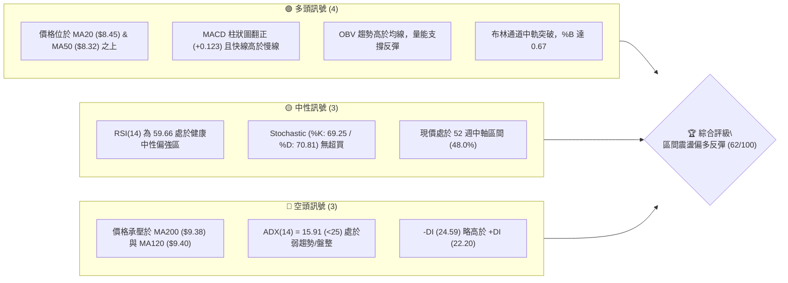
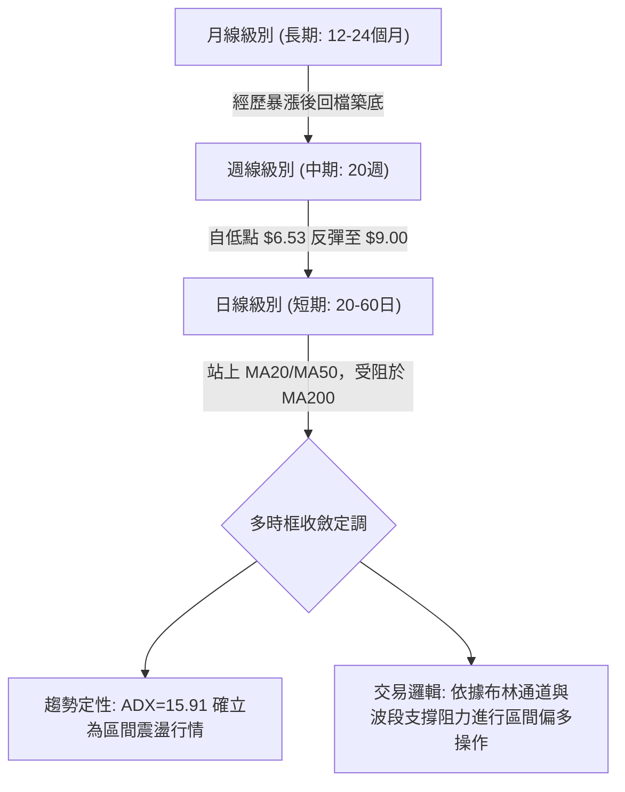
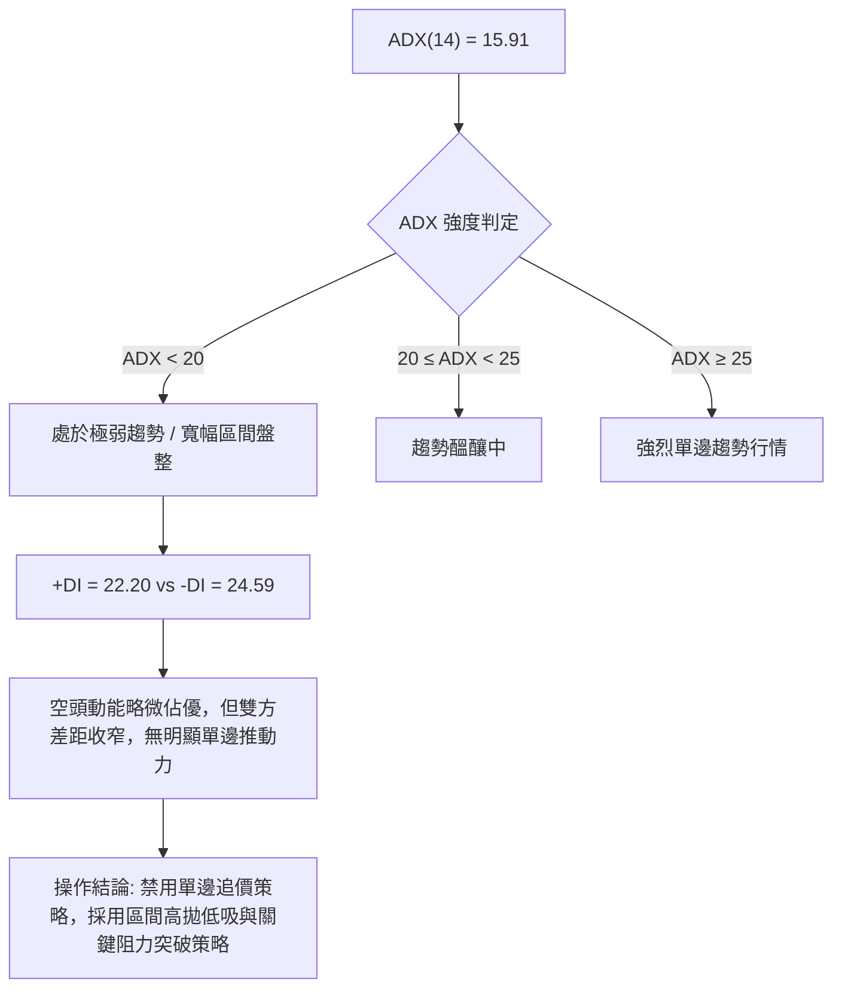
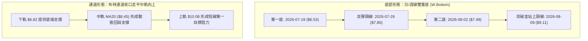
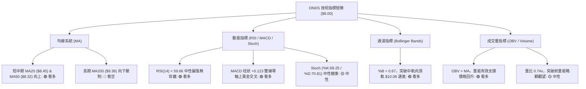
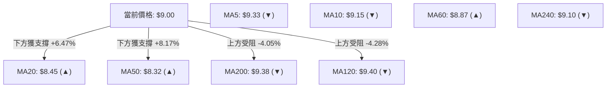
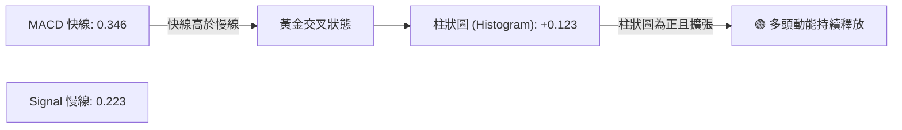
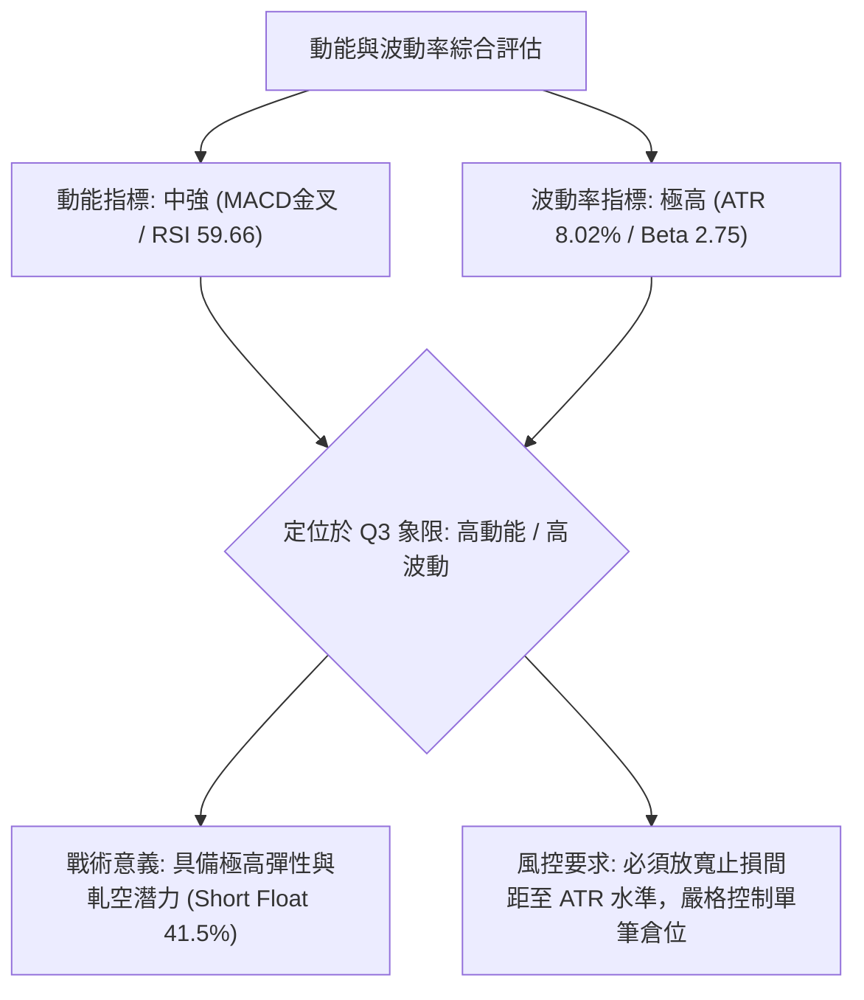
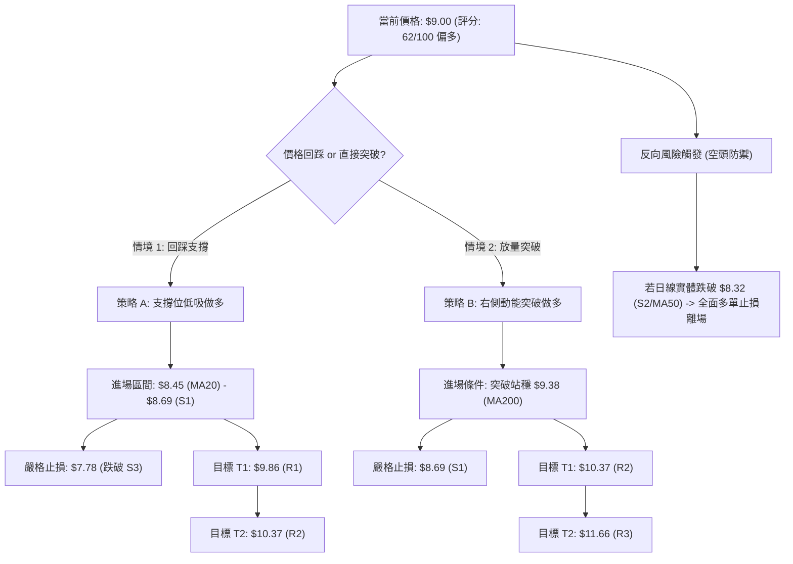
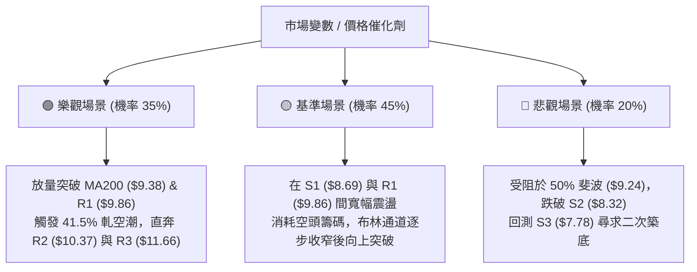

# ONDS 技術分析報告

> **報告日期**：2026-08-17 ｜ **語言**：繁體中文 ｜ **數據來源**：Yahoo Finance ｜ **當前價格**：$9.00

---

## 目錄

| 章節 | 內容 |
|------|------|
| [1. 技術面概覽](#1-技術面概覽) | 訊號儀表板、核心指標、評分卡 |
| [2. 趨勢分析](#2-趨勢分析) | 多時框趨勢、長中短期走勢 |
| [3. 圖表形態分析](#3-圖表形態分析) | 形態識別、K線組合、目標價 |
| [4. 支撐與阻力](#4-支撐與阻力) | 關鍵價位、斐波那契回調 |
| [5. 技術指標深度解讀](#5-技術指標深度解讀) | MA/RSI/MACD/布林/成交量 |
| [6. 動能與波動率](#6-動能與波動率) | 動能評估、ATR、Beta |
| [7. 多時框架總結](#7-多時框架總結) | 時框架評分矩陣 |
| [8. 交易策略建議](#8-交易策略建議) | 多空策略、風險報酬比 |
| [9. 風險提示與監控](#9-風險提示與監控) | 監控指標、風險場景 |

---

## 1. 技術面概覽

### 🎯 技術訊號儀表板



### 📊 核心指標速覽表

| 指標類別 | 指標名稱 | 當前數值 | 訊號 | 解讀 |
|----------|----------|----------|------|------|
| **價格** | 當前價格 | $9.00 | 🟡 | 位於52週區間48.0%處，短線自低檔反彈 |
| **均線** | MA20 | $8.45 | 🟢 | 價格在MA20上方 (+6.47%)，短線趨勢轉強 |
| **均線** | MA50 | $8.32 | 🟢 | 價格在MA50上方，中期底部浮現支撐 |
| **均線** | MA200 | $9.38 | 🔴 | 價格在MA200下方 (-4.05%)，長線仍有結構壓力 |
| **動能** | RSI(14) | 59.66 | 🟢 | 中性偏強，未進入70超買區，具續攻空間 |
| **動能** | MACD | 0.346 (柱+0.123) | 🟢 | MACD線上穿Signal線(0.223)，動能柱狀持續擴張 |
| **動能** | ADX(14) | 15.91 | 🟡 | 數值低於25，代表大級別處於盤整震盪行情 |
| **通道** | 布林通道 | $6.82 - $10.08 | 🟢 | %B為0.67，價格在中軌($8.45)上方朝上軌運行 |
| **波動** | ATR(14) | $0.72 (8.02%) | 🔴 | 日內波動幅度大，操作需嚴格控制風險與止損 |
| **量能** | 最新/20日均量 | 68.80M / 93.50M | 🟡 | 量比0.74x，量能稍有收斂，OBV指標維持支撐 |

### 🏆 技術評分卡

```
╔══════════════════════════════════════════════════════════════════╗
║                 技術評分卡 — ONDS (2026-08-17)                  ║
╠══════════════════════════════════════════════════════════════════╣
║ 趨勢強度      ████████░░░░░░░░░░░░  40/100  🟡 弱趨勢/區間震盪  ║
║ 動能指標      ██████████████░░░░░░  70/100  🟢 MACD翻多/RSI偏強║
║ 支撐穩定度    ██████████████░░░░░░  70/100  🟢 S1($8.69)支撐穩固║
║ 成交量配合    ████████████░░░░░░░░  60/100  🟡 OBV偏多/量能略降║
║ 形態完整度    ██████████████░░░░░░  70/100  🟢 底部雙底反彈成型║
║ 均線排列      ████████████░░░░░░░░  60/100  🟡 短多長空混合排列║
╠══════════════════════════════════════════════════════════════════╣
║ 綜合評分      ████████████░░░░░░░░  62/100  🟢 偏多震盪 (買入) ║
╚══════════════════════════════════════════════════════════════════╝
```

---

## 2. 趨勢分析

### 🌐 多時框趨勢分析



### 📈 長期趨勢 — 12個月走勢圖（Unicode）

```
ONDS 月線收盤走勢圖（2025-08 至 2026-08）
價格軸 ($)
$14.00 ┤                                      ● (2026-05: $13.22 波段高點)
$13.00 ┤                                     / \
$12.00 ┤                                    /   \
$11.00 ┤                        ● (01: $10.36)   \
$10.00 ┤                  ● (12: $9.76) ●(04: $10.04) \
$9.00  ┤            ● (11: $7.90)                    \   ●←【現價 $9.00】
$8.00  ┤      ● (09: $7.72)                           ● (06: $8.24)
$7.00  ┤            ● (10: $6.44)                      ● (07: $7.49 低點)
$6.00  ┤● (08: $5.86)
       └────────────────────────────────────────────────────────────
        08   09   10   11   12   01   02   03   04   05   06   07   08 (月份)
```

**走勢特徵分析表格**：

| 階段 | 期間 | 價格區間 | 累計漲跌幅 | 核心走勢特徵 |
|------|------|----------|------------|--------------|
| **第一階段：初段主升** | 2025-08 ~ 2026-01 | $5.86 → $10.36 | +76.79% | 突破底部均線後放量拉升，形成第一波推升浪。 |
| **第二階段：高檔震盪** | 2026-02 ~ 2026-04 | $10.08 → $10.04 | -0.40% | 於 $9.00 - $10.36 形成中繼整理平台，籌碼換手。 |
| **第三階段：衝頂見高** | 2026-05 | $10.04 → $13.22 | +31.67% | 月線放量衝出 52 週次高點 $13.22（盤中高達 $15.28）。 |
| **第四階段：深度回踩** | 2026-06 ~ 2026-07 | $13.22 → $7.49 | -43.34% | 獲利了結盤湧現，跌破多道短期均線，探尋 61.8% 斐波支撐。 |
| **第五階段：底部回升** | 2026-08 | $7.49 → $9.00 | +20.16% | 日/週線級別於 $6.53-$7.49 完成雙底築底，重回 $9.00。 |

### 📊 中期趨勢（週線分析）

從近 20 週收盤走勢可見，ONDS 在 2026-07-19 當週創下波段收盤低點 $6.53，隨後伴隨巨量（2026-07-26 週成交量達 834,313,400 股）展開強力 V 型反彈。隨後兩週連續收在 $9.11 與 $9.24，當前收盤為 $9.00。週線 MACD 柱狀圖由 -0.281 快速翻正至 +0.123，週線 RSI 亦從 21.3 超賣區回升至 59.7，顯示中期修正已宣告結束，進入反彈上攻通道。

### ⚡ 趨勢強度評估（ADX 解讀）



| 項目 | 數值 | 狀態判定 | 交易指引 |
|------|------|----------|----------|
| **ADX(14)** | 15.91 | 弱趨勢 / 盤整區間 | 適合使用布林通道上下軌、斐波那契位與波段支撐阻力操作。 |
| **+DI (14)** | 22.20 | 多方推動力回升 | 多方力量正在凝聚，需突破 25 方能轉化為單邊趨勢。 |
| **-DI (14)** | 24.59 | 空方動能衰退中 | 雖然略高於 +DI，但較前幾週顯著回落，空方壓制力減弱。 |

---

## 3. 圖表形態分析

### 🔍 形態識別系統



**形態信心度與目標價評估表**：

| 形態名稱 | 信心度 | 判斷依據（引用實際數據） | 完成度 | 目標價（附嚴謹計算式） |
|----------|--------|--------------------------|--------|------------------------|
| **日/週線雙重底 (W底)** | 78% | 2026-07-19 低點 $6.53 與 2026-08-02 低點 $7.49 形成次低點抬高之雙底，頸線為 $7.80，現價 $9.00 已有效突破。 | 100% (已突破) | 頸線 $7.80 + 形態高度 ($7.80 - $6.53 = $1.27) = **$9.07**（已達成，下一波延伸測幅朝 R1 **$9.86** 邁進）。 |
| **區間通道震盪箱體** | 85% | 價格在 S1 $8.69 至 R1 $9.86 之間震盪，受制於 MA200 ($9.38)。 | 70% | 箱頂阻力為 R1 **$9.86**；突破後測幅為 R2 **$10.37**。 |
| **頭肩底結構** | 35% | 數據時間跨度不足以構建完整右肩，右側籌碼尚在換手。 | 20% | 訊號不足，僅做指標型與區間解讀，不預設延伸目標。 |

### 🕯️ 重要K線形態分析

| 期間/月份 | 收盤價 | K線形態 | 解讀 | 訊號 |
|-----------|--------|---------|------|------|
| **2026-05-31** | $13.22 | 爆量長上影大陽線 | 多頭衝頂後遭強烈拋壓，形成中期頂部特徵。 | 🔴 頂部警戒 |
| **2026-07-19** | $6.53 | 破位恐慌長陰線 | 週成交量放量至 671.5M，浮現恐慌盤出清跡象。 | 🟡 潛在底部 |
| **2026-07-26** | $7.80 | 爆巨量看漲吞沒線 | 單週成交量達 834.3M，強勢吞沒前週陰線，確立底部。 | 🟢 強烈買訊 |
| **2026-08-09** | $9.11 | 中陽線突破均線 | 價格一舉跳空收復 MA20 與 MA50，MACD 柱狀翻正。 | 🟢 趨勢延續 |
| **2026-08-23** | $9.00 | 高檔十字星/小陰整理 | 在 MA200 ($9.38) 前遇阻回踩消化浮額，量能收縮。 | 🟡 正常回踩 |

### 📉 ASCII 走勢形態示意圖

```
ONDS 雙底 (W-Bottom) 突破與回踩結構示意圖
價格 ($)
$10.08 ┤- - - - - - - - - - - - - - - - - - - - - - - - - - - - - - - - - 布林上軌 / 阻力 R2 ($10.37)
$9.86  ┤- - - - - - - - - - - - - - - - - - - - - - - - ┌─── 阻力 R1 ($9.86)
$9.38  ┤- - - - - - - - - - - - - - - - - - - - - - - - ┼─── MA200 壓制線
$9.00  ┤                                    ▲現價 $9.00 │
$8.69  ┤- - - - - - - - - - - - - - - - - - ├── 支撐 S1 ┘
$7.80  ┤- - - - - - - - ┌───────┐ - - - - - - - - - - - - - - - - - 頸線 ($7.80)
$7.49  ┤                │       │     ● (第二底: 08-02)
$6.53  ┤● (第一底: 07-19)       └─────┘
       └──────────────────────────────────────────────────────────
```

---

## 4. 支撐與阻力

### 🗺️ 關鍵價位分布圖（Unicode）

```
ONDS 價位結構分布圖
══════════════════════════════════════════════════════════════════
$15.28 ║██████████████████████████████║ 52W 最高點 / 斐波 0.0%
$12.43 ║████████████████████          ║ 斐波 23.6% 回調位
$11.66 ║████████████████████████████  ║ 強阻力 R3 (波段高點聚類)
$10.67 ║██████████████████            ║ 斐波 38.2% 回調位
$10.37 ║██████████████████████        ║ 阻力 R2 (布林上軌附近)
$9.86  ║████████████████████████████  ║ 關鍵阻力 R1 (波段密集套牢區)
$9.38  ║┈┈┈┈┈┈┈┈┈┈┈┈┈┈┈┈┈┈┈┈┈┈┈┈┈┈┈┈┈┈║ MA200 長期多空分水嶺
$9.24  ║┈┈┈┈┈┈┈┈┈┈┈┈┈┈┈┈┈┈┈┈┈┈┈┈┈┈┈┈┈┈║ 斐波 50.0% 中軸平衡位
$9.00  ╠══════════════════════════════╣ ◄ 現價 ($9.00)
$8.69  ║▓▓▓▓▓▓▓▓▓▓▓▓▓▓▓▓▓▓▓▓▓▓▓▓▓▓▓▓  ║ 近期第一支撐 S1 (波段低點聚類)
$8.45  ║┈┈┈┈┈┈┈┈┈┈┈┈┈┈┈┈┈┈┈┈┈┈┈┈┈┈┈┈┈┈║ 布林中軌 / MA20
$8.32  ║████████████████████████████  ║ 強支撐 S2 (MA50 共振位)
$7.81  ║┈┈┈┈┈┈┈┈┈┈┈┈┈┈┈┈┈┈┈┈┈┈┈┈┈┈┈┈┈┈║ 斐波 61.8% 黃金分割支撐位
$7.78  ║██████████████████████████████║ 極強支撐 S3 (波段低點聚類)
$3.20  ║██████████████████████████████║ 52W 最低點 / 斐波 100.0%
══════════════════════════════════════════════════════════════════
```

### 🚧 阻力位分析表

| 阻力級別 | 價位 | 形成原因（引用數據） | 突破難度 | 重要性 |
|----------|------|----------------------|----------|--------|
| **R1** | **$9.86** | 近一年波段高點聚類；接近 2025-12 收盤 $9.76 與 2026-04 收盤 $10.04 之套牢籌碼帶。 | 🟡 中等 | 關鍵頸線阻力，突破確認短線多頭主升展開。 |
| **R2** | **$10.37** | 近一年波段次高聚類；與布林上軌 ($10.08) 及 2026-01 收盤 $10.36 共振。 | 🔴 較高 | 中期箱體上沿，預計引發獲利盤拋壓。 |
| **R3** | **$11.66** | 近一年高點密集區；介於 38.2% 斐波 ($10.67) 與 23.6% 斐波 ($12.43) 之間之真空帶邊緣。 | 🔴 極高 | 波段目標阻力，需成交量顯著放大方能攻克。 |

### 🛡️ 支撐位分析表

| 支撐級別 | 價位 | 形成原因（引用數據） | 守住機率 | 重要性 |
|----------|------|----------------------|----------|--------|
| **S1** | **$8.69** | 近一年波段低點聚類；日線級別微型回踩平台。 | 🟢 75% | 短線多頭防守第一線，跌破則回踩中軌。 |
| **S2** | **$8.32** | 近一年波段低點聚類，與 MA50 ($8.32) 及 MA20 ($8.45) 形成重疊共振支撐區。 | 🟢 85% | 中期生命線，只要守穩，多頭結構不變。 |
| **S3** | **$7.78** | 近一年波段深層低點聚類；與 61.8% 斐波回調位 ($7.81) 及前頸線 ($7.80) 完美共振。 | 🟢 95% | 多頭終極底線，跌破宣告本輪自 $6.53 反彈失敗。 |

### 📐 斐波那契回調位分析

依據 52 週完整區間（低點 $3.20 → 高點 $15.28，波幅 $12.08）精確計算之斐波那契回調位如下：

| 回調比例 | 斐波價位 | 當前相對位置與技術意義解讀 |
|----------|----------|----------------------------|
| **0.0% (52W High)** | **$15.28** | 歷史峰值，長期牛市極限目標。 |
| **23.6%** | **$12.43** | 多頭強勢回檔極限位，上方為重度套牢區。 |
| **38.2%** | **$10.67** | 弱勢反彈警戒線，突破此處代表多頭全面掌控盤面。 |
| **50.0%** | **$9.24** | **多空中軸平衡位**。現價 $9.00 正緊貼於該位下方，為短線最直接之心理壓力。 |
| **61.8%** | **$7.81** | **黃金分割關鍵防守位**。2026-07 探底至 $6.53 後迅速收復此線，確認為有效黃金支撐。 |
| **78.6%** | **$5.79** | 深層回撤支撐，2025-08 啟動點 ($5.86) 即落在該區域。 |
| **100.0% (52W Low)**| **$3.20** | 52週歷史低點。 |

**位置解讀**：現價 **$9.00** 處於 **61.8% ($7.81)** 與 **50.0% ($9.24)** 之間。在技術結構上，站穩 61.8% 代表跌勢止血，當前正在挑戰 50.0% ($9.24) 平衡位與 MA200 ($9.38) 之多空分水嶺，一旦放量突破 $9.24-$9.38 區間，將直接打開通往 38.2% ($10.67) 的反彈通道。

---

## 5. 技術指標深度解讀

### 🎛️ 指標訊號總覽



### 📈 移動平均線排列分析



| 均線名稱 | 數值 | 偏離度 | 狀態 | 排列與技術含義 |
|----------|------|--------|------|----------------|
| **MA5** | $9.33 | -3.56% | ▼ | 超短期微幅回檔，短線均線在 $9.33 形成壓制。 |
| **MA10** | $9.15 | -1.69% | ▼ | 短線扣抵高位，暫呈下壓，現價正測試此線阻力。 |
| **MA20** | $8.45 | +6.47% | ▲ | **短期生命線**，呈強烈向上走勢，提供堅實動態支撐。 |
| **MA50** | $8.32 | +8.17% | ▲ | 中期多空線，止跌回升，與 MA20 形成多頭排列。 |
| **MA60** | $8.87 | +1.48% | ▲ | 季線已被有效收復，提供短線下檔承接力。 |
| **MA120**| $9.40 | -4.28% | ▼ | 半年線向下，與 MA200 形成雙重高空防線。 |
| **MA200**| $9.38 | -4.05% | ▼ | **長期多空分水嶺**，為空頭最重要的防守核心。 |
| **MA240**| $9.10 | -1.10% | ▼ | 年線走平微跌，接近現價，即將面臨多空表態。 |

**均線綜合結論**：當前均線系統呈現「**短中期向上金叉（MA20 > MA50）、長期均線壓頂（MA120/MA200 > 價格）」之典型**混合排列**。操作上，短中期順勢偏多，但接近 $9.38-$9.40 需提防技術性回踩。

### 📉 RSI(14) 分析

*   **當前數值**：**59.66**
*   **動能強度**：`████████████░░░░░░░░` 59.66%（中性偏多區間 50–70）
*   **超買超賣判定**：數值遠高於超賣線 (30)，亦未觸及超買線 (70)，顯示當前上漲具備良性動能，不存在即刻的技術過熱風險。
*   **背離分析**：
    *   *頂背離檢驗*：現價自 $7.49 反彈至 $9.00，RSI 由 55.1 上升至 59.66，指標與價格同步創高，**無頂背離**。
    *   *底背離檢驗*：2026-07-05 價格 $7.41（RSI: 21.3），2026-07-19 價格跌至 $6.53 新低（RSI 卻抬高至 35.0），隨後 07-26 價格 $7.80（RSI 衝上 49.8），形成顯著的**日/週線級別雙重底背離**，該底背離已於當前走勢中得到完全確認。

### 📊 MACD(12/26/9) 訊號解讀



*   **MACD 線**：0.346 ＞ 零軸，且高於 **信號線** 0.223。
*   **柱狀圖 (Histogram)**：+0.123，維持在正值區間，代表多頭買盤力量自 2026-07-26 翻正以來持續主導短線動能。
*   **背離檢驗**：MACD 柱狀圖在 2026-07 底創出低點時同步見底翻揚，目前無任何空頭頂背離跡象，技術指標確認反彈趨勢有效。

### 📦 布林通道分析

```
ONDS 日線布林通道結構示意圖
價格 ($)
$10.08 ┤══════════════════════════════════ 上軌 (Upper Band: $10.08)
       │                              
$9.00  ┤─────────────────● (現價 $9.00, %B = 0.67)
       │               
$8.45  ┤---------------------------------- 中軌 (Middle Band / MA20: $8.45)
       │
$6.82  ┤══════════════════════════════════ 下軌 (Lower Band: $6.82)
       └──────────────────────────────────
```

*   **帶寬與軌道位置**：上軌 $10.08，中軌 $8.45，下軌 $6.82。帶寬為 $3.26 (約 36.2%)，通道呈現收口後走平微張狀態。
*   **%B 指標**：**0.67**（介於 0.5 與 1.0 之間），代表價格已穩健脫離中軌並朝上軌挺進，屬於多頭優勢控制區。
*   **通道策略意義**：在 ADX < 25 的震盪市中，布林下軌 $6.82 與中軌 $8.45 為強支撐，上軌 $10.08 則為短線獲利了結之主要目標壓力位。

### 💹 成交量分析（量價配合度）

*   **成交量現況**：最新單日成交量為 **68,795,052** 股，相較於 20 日均量 **93,501,303** 股，量比為 **0.74x**；相較於 50 日均量 **85,540,657** 股，呈現縮量態勢。
*   **量價關係解讀**：
    1.  *低檔爆量*：2026-07-19 至 07-26 當週成交量分別高達 6.71 億與 8.34 億股，屬於機構資金大舉進場換手之「底部放量」。
    2.  *反彈縮量*：價格推升至 $9.00 後量能萎縮至 68.8M，顯示在 MA200 ($9.38) 阻力位前，追價意願略有保留，市場處於洗盤與籌碼沉澱階段。
    3.  *OBV (能量潮指標)*：**OBV > MA**，能量潮指標領先走高並站在均線之上，說明資金並未撤離，量能結構全面支撐價格後續向上突破。

---

## 6. 動能與波動率

### ⚡ 動能評估四象限

| 象限 | 動能強度 | 波動率水準 | 特徵描述 | ONDS 當前定位 |
|------|----------|------------|----------|---------------|
| **Q1 (最佳機會)** | 強 (RSI>60, MACD擴張) | 低 (ATR<5%) | 趨勢穩健、回撤可控 | — |
| **Q2 (震盪醞釀)** | 弱 (ADX<25, DI交織) | 低 (帶寬收窄) | 區間整理、方向未明 | — |
| **Q3 (爆發高危)** | **強 (MACD翻紅, %B=0.67)** | **高 (ATR=8.02%, Beta=2.75)** | **高波動、動能增強、高回報高風險** | **✓ Q3 象限** |
| **Q4 (極度危險)** | 弱 (空頭主導) | 高 (恐慌拋售) | 破位下殺、避免進場 | — |



### 📊 ATR 波動率分析

*   **ATR(14) 數值**：**$0.72**（佔當前股價之 **8.02%**）。
*   **波動特性評估**：ONDS 屬於極高波動度個股，單日正常波動區間即達 ±$0.72。
*   **止損與倉位設定指引**：
    *   *超短線止損距*：1.0 × ATR = **$0.72**（跌破現價至 $8.28）。
    *   *波段操作止損距*：1.5 × ATR = **$1.08**（跌破現價至 $7.92，與支撐 S3 $7.78/S2 $8.32 配合）。
    *   *資金管理*：由於高 ATR，建議單筆交易風險敞口不超過總資金的 1.5%–2.0%，倉位應分散佈局。

### 📐 Beta 與市場相關性

*   **Beta 係數**：**2.75**。
    *   *市場敏感度*：本股波動幅度為標普500大盤的 2.75 倍，在大盤上漲時具備強大的超額收益 (Alpha) 爆發力，但在市場回檔時亦承擔加倍回撤風險。
*   **空頭部位 (Short Interest) 深度分析**：
    *   *Short % Float*：高達 **41.5%**（空頭部位極重）。
    *   *Short Ratio (天數)*：**2.24 天**。
    *   *軋空 (Short Squeeze) 潛能*：高達 41.5% 的空頭佔比是股價潛在的「定時火箭」。一旦價格放量攻克 MA200 ($9.38) 與關鍵阻力 R1 ($9.86)，將極易引發空頭踩踏式回補，推動股價快速衝向 R2 ($10.37) 乃至 R3 ($11.66)。

---

## 7. 多時框架總結

### 📋 時框架評分表

| 時框架 | 趨勢方向 | 動能狀態 | 均線排列 | 形態結構 | 綜合評分 | 操作建議 |
|--------|----------|----------|----------|----------|----------|----------|
| **短期 (日線)** | 🟢 向上反彈 | 🟢 MACD金叉/RSI 59.7 | 🟡 突破MA20/50，受阻MA200 | 🟢 雙底突破回踩 | **68 / 100** | 逢低做多，回踩 S1/S2 進場 |
| **中期 (週線)** | 🟡 底部成型 | 🟢 柱狀翻正/RSI出超賣 | 🟡 均線收斂中 | 🟢 巨量吞沒反轉 | **62 / 100** | 波段持有，鎖定 R1/R2 目標 |
| **長期 (月線)** | 🔴 回檔築底 | 🟡 處於中性平衡區 | 🔴 MA120/200 壓制 | 🟡 箱體震盪整理 | **52 / 100** | 區間操作，未過 $9.38 不重倉 |

### 🔲 綜合訊號矩陣

```
╔══════════════════════════════════════════════════════════════════╗
║                   ONDS 多時框訊號共振矩陣                       ║
╠═════════════╦══════════════╦══════════════╦══════════════════════╣
║ 維度        ║ 短期 (日線)  ║ 中期 (週線)  ║ 長期 (月線)          ║
╠═════════════╬══════════════╬══════════════╬══════════════════════╣
║ 趨勢方向    ║ 🟢 偏多      ║ 🟢 偏多      ║ 🟡 中性震盪          ║
║ 動能強度    ║ 🟢 強勁      ║ 🟢 轉強      ║ 🔴 偏弱              ║
║ 量價配合    ║ 🟡 縮量整理  ║ 🟢 爆量見底  ║ 🟡 換手中            ║
║ 支撐阻力    ║ 🟢 站上S1    ║ 🟢 遠離S3    ║ 🔴 面臨50%斐波壓制   ║
╠═════════════╬══════════════╬══════════════╬══════════════════════╣
║ 矩陣收斂結論║ 短中期多頭共振，長期受制於震盪中軸，整體偏向【做多】 ║
╚═════════════╩══════════════╩══════════════╩══════════════════════╝
```

### ⚖️ 多時框收斂結論

依據多時框收斂優先級規則：
1.  **市場定性**：當前 ADX(14) = 15.91 (< 25)，確認當前市場處於**大級別寬幅區間盤整行情**。
2.  **時框收斂**：在盤整行情中，中長期指標（MA200、50%斐波 $9.24）定義了區間的阻力邊界，而日線/週線之布林通道中軌 ($8.45) 及雙底頸線 ($7.80) 則構成了下檔堅實防禦。
3.  **唯一方向性結論**：**【偏多震盪反彈】**。日線級別具備強烈的動能支撐與形態確認，長期的 MA200 壓制並未破壞反彈格局，反而提供了極佳的階段性目標位。交易主策略嚴格錨定「**逢低做多，上看布林上軌與波段阻力**」。

---

## 8. 交易策略建議

### 🗺️ 策略決策流程圖



### 🧭 策略路由

> **當前主策略方向 = 【偏多操作 / 逢低做多為主】（依技術評分卡 62/100 分流）**

因綜合評分達到 62 分（≥ 60 偏多區間），技術面由底部雙底反彈主導，主推多頭策略 A 與 B；空頭僅作為風險管理與對沖觸發參考，不建議在此處盲目開空。

### 🎯 價格情境階梯（Price Scenarios）

| 觸發條件 | 第一目標 | 後續延伸目標 | 情境技術含義 |
|----------|----------|--------------|--------------|
| **向上突破 R1 ($9.86)** | R2 **$10.37** | R3 **$11.66** | 短線全面轉強，攻克布林上軌，引發 41.5% 空頭回補潮。 |
| **突破 MA200 ($9.38)** | R1 **$9.86** | R2 **$10.37** | 長期趨勢由空翻多，確認築底成功。 |
| **維持在現價 $9.00 震盪** | S1 **$8.69** | MA20 **$8.45** | 消化短期均線乖離，籌碼良性換手。 |
| **跌破支撐 S1 ($8.69)** | S2 **$8.32** | S3 **$7.78** | 短線回檔加深，測試 MA50 中期防線。 |
| **跌破支撐 S3 ($7.78)** | 斐波 78.6% **$5.79** | 52W Low **$3.20** | 雙底結構破位，多頭走勢徹底逆轉。 |

### 📊 情境機率分佈

| 價格走勢情境 | 發生機率 | 主要技術依據 |
|--------------|----------|--------------|
| **震盪上行 / 突破反彈** | **60%** | MACD 柱狀擴張 (+0.123)、RSI 59.7 健康偏多、OBV 支撐、底部雙底成型。 |
| **箱體區間震盪** | **25%** | ADX = 15.91 處於弱趨勢，現價受制於 MA200 ($9.38) 與 50% 斐波 ($9.24)。 |
| **回落再探底部** | **15%** | 最新量能略縮 (量比 0.74x)，-DI (24.59) 略高於 +DI (22.20)。 |

### 🟢 主策略詳情

所有設定之價位嚴格引用第 4 章計算之關鍵價位：

| 策略要素 | 策略 A：左側回踩低吸（首選） | 策略 B：右側突破追強（次選） |
|----------|------------------------------|------------------------------|
| **策略類型** | 支撐位回踩布局 | 關鍵阻力位動能突破 |
| **進場條件** | 價格回踩 S1 ($8.69) 至 MA20 ($8.45) 企穩 | 放量突破並日線收盤站穩 MA200 ($9.38) |
| **進場價格** | **$8.69** (S1 支撐位) | **$9.40** (突破 MA200 確認點) |
| **目標價 T1** | **$9.86** (R1 關鍵阻力，潛在 +13.46%) | **$10.37** (R2 阻力，潛在 +10.32%) |
| **目標價 T2** | **$10.37** (R2 布林上軌，潛在 +19.33%)| **$11.66** (R3 強阻力，潛在 +24.04%) |
| **止損價格** | **$7.78** (嚴格跌破 S3 支撐) | **$8.69** (跌破 S1 支撐) |
| **風險空間** | -$0.91 (-10.47%) | -$0.71 (-7.55%) |
| **報酬空間 (T2)**| +$1.68 (+19.33%) | +$2.26 (+24.04%) |
| **風險報酬比** | **1 : 1.85**（若以 T1 計算為 1:1.29） | **1 : 3.18**（極佳風酬比） |
| **預估勝率** | **65%** | **55%** |
| **建議倉位** | **15% - 20%** 總部位 | **10% - 15%** 總部位 |

### 🔴 反向風險觸發點（對沖與風控提示）

*   **多頭止損預警線**：若日線收盤跌破 **S2 ($8.32)**，代表價格跌破 MA20/MA50 雙均線，應主動將倉位減半。
*   **多頭全面棄守線**：若價格帶量跌破 **S3 ($7.78)**（即 61.8% 斐波回調位 $7.81），則證明本次雙底反彈失敗，應立即將剩餘多單全部無條件止損出局。
*   **空頭對沖點**：僅在價格跌破 $7.78 後，方可順勢建立輕倉空單，下看 $5.79。

### ⭐ 整體訊號強度評星

```
做多訊號強度：★★★★☆  (4/5星) — 雙底成型、動能修復、軋空底氣充足
做空訊號強度：★☆☆☆☆  (1/5星) — 底部巨量支撐、空頭回補風險極高
整體可信度：  ★★★★☆  (4/5星) — 技術指標與量價形態高度共振
```

---

## 9. 風險提示與監控

### ✅ 關鍵監控指標 Checklist

```
╔══════════════════════════════════════════════════════════════════╗
║                   ONDS 關鍵技術指標監控清單                     ║
╠══════════════════════════════════════════════════════════════════╣
║ [ ] 1. MA200 攻防戰：觀察股價是否有效突破並站穩 $9.38           ║
║ [ ] 2. 成交量配合度：突破 $9.86 (R1) 時單日成交量需 > 93.5M 股 ║
║ [ ] 3. MACD 柱狀動能：確認 Histogram 是否持續維持在 > 0 擴張   ║
║ [ ] 4. RSI(14) 臨界線：密切監控 RSI 是否順利衝破 65 進入強勢區   ║
║ [ ] 5. 空頭平倉動向：關注 Short Float (41.5%) 是否出現急劇下降  ║
║ [ ] 6. 支撐防守確認：每日收盤價不得跌破 S2 ($8.32) 與 MA50      ║
╚══════════════════════════════════════════════════════════════════╝
```

### ⚠️ 風險場景分析



### 🛡️ 風險管理重要提醒

1.  **超高 Beta 與 ATR 雙重疊加風險**：ONDS 的 Beta 高達 2.75，ATR 佔比達 8.02%，日常波動極具殺傷力。嚴禁在單一價位進行過度重倉或高槓桿融資交易。
2.  **基本面與現金流折價**：雖然 2026 年營收成長迅猛（YoY +1235.4%）且具備 13.8 億美元現金，但目前營業利益率仍在負值區間（-166.3%），自由現金流為負。股價高度依賴市場風險偏好與題材推動，操作必須嚴守技術紀律。
3.  **軋空行情的雙刃劍特性**：高達 41.5% 的空頭浮額雖能帶來爆發性拉升，但在多頭動能衰竭時，空頭反撲亦會極其兇猛，到達目標價 R2 ($10.37) 或 R3 ($11.66) 務必嚴格執行分批獲利了結。

---

## 📋 報告總結

```
╔══════════════════════════════════════════════════════════════════╗
║                   ONDS 技術分析報告總結                         ║
╠══════════════════════════════════════════════════════════════════╣
║ 報告日期：2026-08-17                                            ║
║ 當前價格：$9.00                                                 ║
║ 分析評級：🟢 偏多震盪反彈 (評分 62/100，買入/區間做多)          ║
╠══════════════════════════════════════════════════════════════════╣
║ 關鍵結論：                                                      ║
║ ├─ 長期趨勢：🟡 寬幅箱體震盪，上方受壓於 MA200 ($9.38)           ║
║ ├─ 中期趨勢：🟢 底部巨量反轉，雙重底 (W底) 形態確立             ║
║ ├─ 短期趨勢：🟢 站在 MA20/MA50 之上，MACD 翻紅，動能良性釋放     ║
║ ├─ 關鍵支撐：S1: $8.69 ｜ S2: $8.32 ｜ S3: $7.78                ║
║ ├─ 關鍵阻力：R1: $9.86 ｜ R2: $10.37 ｜ R3: $11.66              ║
║ └─ 分析師目標：共識均價 $19.28 (最低 $13.00 / 最高 $25.00)      ║
╠══════════════════════════════════════════════════════════════════╣
║ 最優策略組合：                                                  ║
║ 1. 🥇 最佳機會（策略 A）：回踩 S1 ($8.69) 低吸做多，止損 $7.78， ║
║    目標上看 R1 ($9.86) 與 R2 ($10.37)。                         ║
║ 2. 🥈 次選機會（策略 B）：放量突破 MA200 ($9.40) 右側追進，      ║
║    止損 $8.69，目標上看 R2 ($10.37) 與 R3 ($11.66)。           ║
║ 3. 🥉 保守選擇：等待股價回踩 MA20/MA50 重疊區 ($8.45-$8.32) 企穩║
║    再行分批建倉，嚴格以 $7.78 作為風控底線。                    ║
╚══════════════════════════════════════════════════════════════════╝
```

---

> ⚠️ **免責聲明**：本報告為技術分析研究，所有數據及估算均嚴格基於所提供之歷史價格與指標資訊。本報告**僅供研究與學術參考**，**不構成任何投資建議或買賣邀約**。投資有風險，標的波動劇烈，入市需獨立判斷並自負盈虧。

---

*報告生成時間：2026-08-17 ｜ 數據來源：Yahoo Finance ｜ 分析框架：多時框技術分析體系*