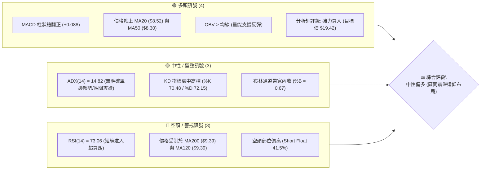
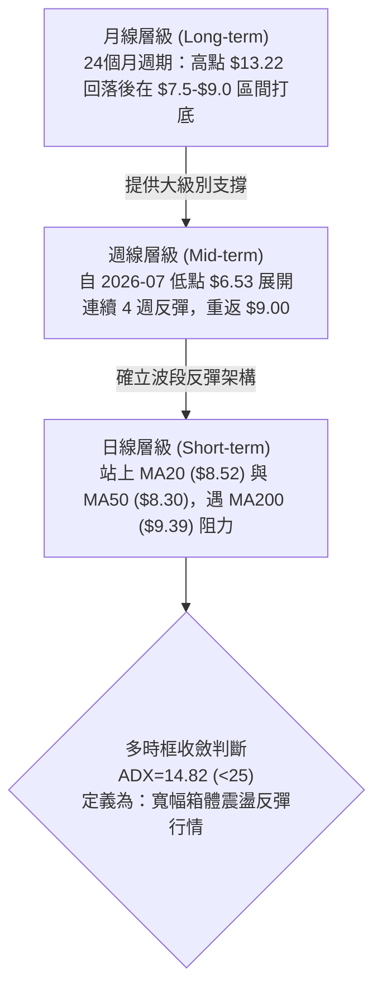
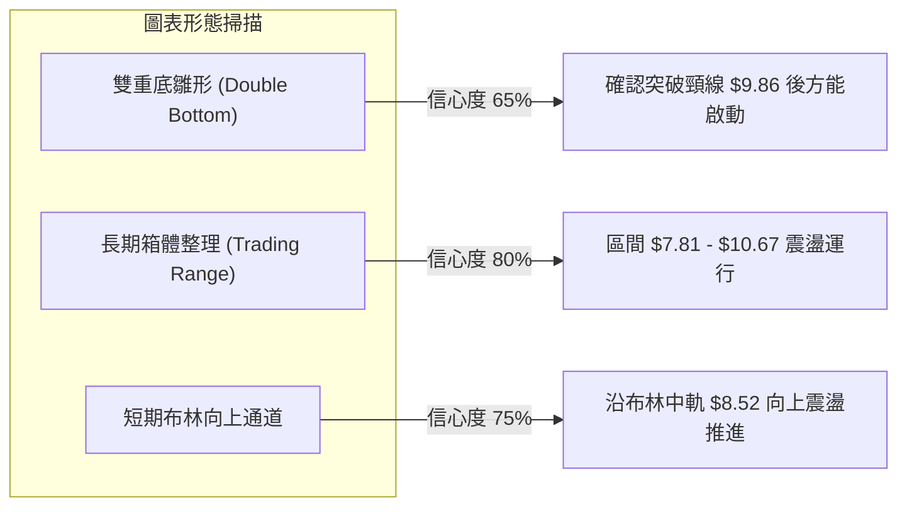
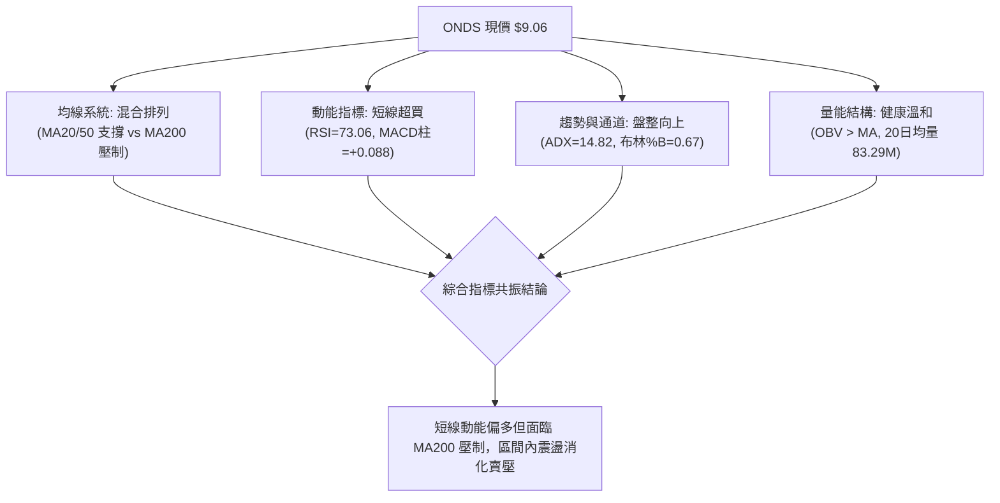
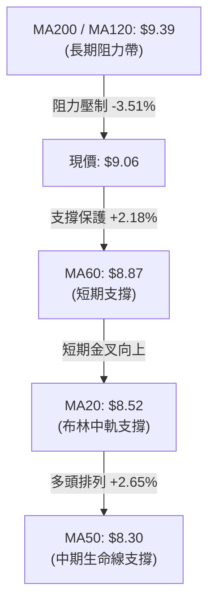
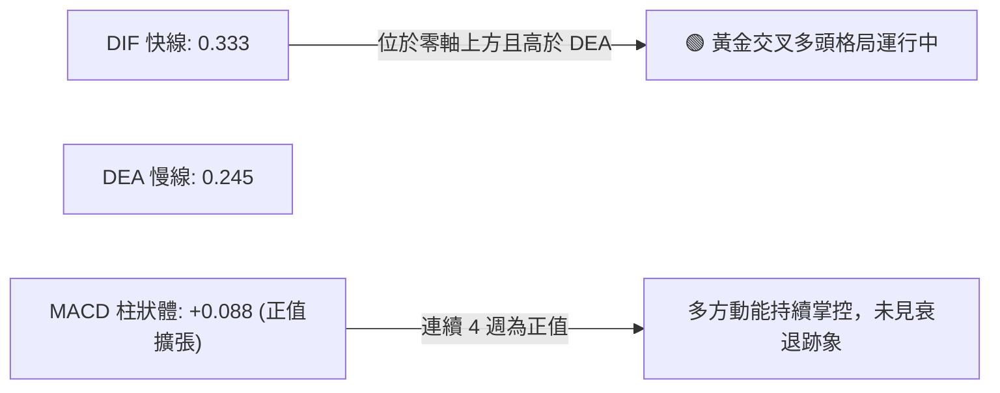
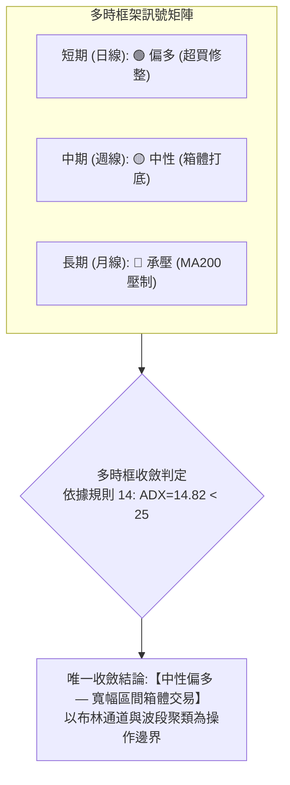
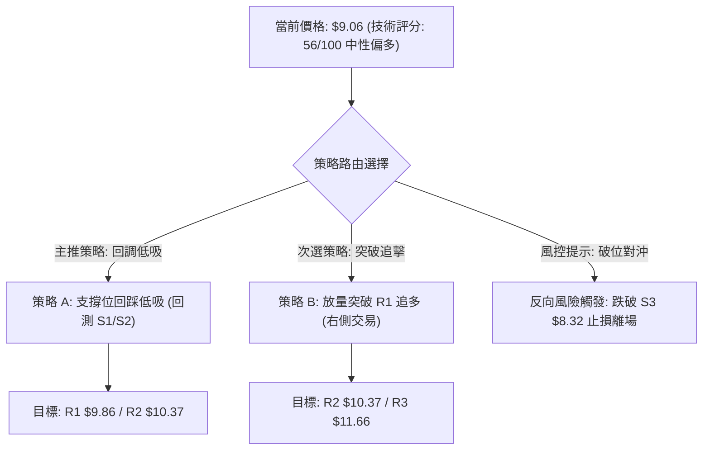
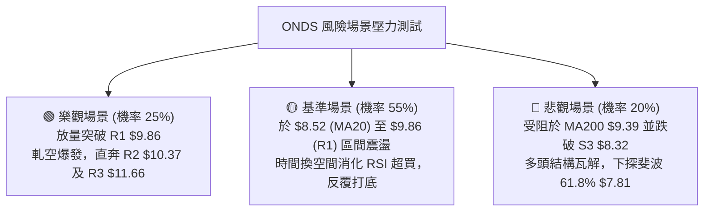

# ONDS 技術分析報告

> **報告日期**：2026-08-18 ｜ **語言**：繁體中文 ｜ **數據來源**：Yahoo Finance ｜ **當前價格**：$9.06

---

## 目錄

| 章節 | 內容 |
|------|------|
| [1. 技術面概覽](#1-技術面概覽) | 訊號儀表板、核心指標、評分卡 |
| [2. 趨勢分析](#2-趨勢分析) | 多時框趨勢、長中短期走勢、ADX解讀 |
| [3. 圖表形態分析](#3-圖表形態分析) | 形態識別、信心度評估、K線組合 |
| [4. 支撐與阻力](#4-支撐與阻力) | 關鍵價位聚類、斐波那契回調結構 |
| [5. 技術指標深度解讀](#5-技術指標深度解讀) | 均線系統、RSI、MACD、布林通道、OBV |
| [6. 動能與波動率](#6-動能與波動率) | 動能四象限、ATR波動分析、Beta與空頭部位 |
| [7. 多時框架總結](#7-多時框架總結) | 時框架評分矩陣、多時框收斂結論 |
| [8. 交易策略建議](#8-交易策略建議) | 策略路由、情境階梯、進出場規劃 |
| [9. 風險提示與監控](#9-風險提示與監控) | 監控清單、情境壓力測試、風控規則 |
| [📋 報告總結](#-報告總結) | 核心結論與策略彙整 |

---

## 1. 技術面概覽

### 🎯 技術訊號儀表板



---

### 📊 核心指標速覽表

| 指標類別 | 指標名稱 | 當前數值 | 訊號 | 技術解讀 |
|:---|:---|:---:|:---:|:---|
| **價格** | 當前收盤價 | **$9.06** | 🟡 | 位於52週區間 48.5% 處，貼近關鍵支撐 S1 ($9.04) |
| **均線** | 短期 MA20 | **$8.52** | 🟢 | 現價高於 MA20 (+6.30%)，短期偏多 |
| **均線** | 中期 MA50 | **$8.30** | 🟢 | 現價高於 MA50 (+9.16%)，中期築底向上 |
| **均線** | 長期 MA200 | **$9.39** | 🔴 | 現價低於 MA200 (-3.51%)，長期空頭壓制未破 |
| **動能** | RSI(14) | **73.06** | 🔴 | 突破70超買警戒線，短線有回洗震盪需求 |
| **動能** | MACD (12,26,9)| **+0.088** | 🟢 | MACD(0.333) > Signal(0.245)，柱狀圖看多擴張 |
| **趨勢** | ADX (14) | **14.82** | 🟡 | 數值低於 25，判定為無強烈單邊趨勢之「寬幅盤整」 |
| **通道** | 布林通道 (20,2)| **$6.92 - $10.13** | 🟢 | 中軌 $8.52 形成支撐，現價位於通道偏上區間 (%B 0.67) |
| **波動** | ATR(14) | **$0.70** | 🟡 | 波動率佔股價 7.69%，單日價格彈性偏大 |
| **量能** | OBV 走勢 | **OBV > MA** | 🟢 | 量能配合價格自 $6.53 反彈，未見量價頂背離 |

---

### 🏆 技術評分卡

```
╔══════════════════════════════════════════════════════════════════╗
║                  技術評分卡 — ONDS (2026-08-18)                  ║
╠══════════════════════════════════════════════════════════════════╣
║ 趨勢強度 (ADX=14.82)      ██████░░░░░░░░░░░░░░  30/100  🔴 弱趨勢 ║
║ 短期動能 (MACD/RSI)       ██████████████░░░░░░  70/100  🟢 偏多超買║
║ 支撐穩定度 (S1/S2聚類)    ████████████████░░░░  80/100  🟢 結構紮實║
║ 成交量配合 (OBV/量比)     ████████████░░░░░░░░  60/100  🟡 中性溫和║
║ 形態完整度 (雙重底雛形)   ████████████░░░░░░░░  60/100  🟡 構築中  ║
║ 均線系統排列 (混合排列)   ████████░░░░░░░░░░░░  40/100  🔴 長期壓制║
╠══════════════════════════════════════════════════════════════════╣
║ 綜合技術評分              ███████████░░░░░░░░░  56/100  🟡 中性偏多║
╚══════════════════════════════════════════════════════════════════╝
```

---

## 2. 趨勢分析

### 🌐 多時框趨勢分析



---

### 📈 長期趨勢 — 12個月走勢圖（2025-08 至 2026-08）

```
ONDS 月線歷史走勢圖（2025-08 至 2026-08）
價格軸 ($)
$14.00 ┤                                     ● $13.22 (05月波段頂部)
$12.00 ┤                                    ╱ ╲
$10.00 ┤                        ● $10.36   ● $10.04╲
$8.00  ┤          ● $7.90  ● $9.76   ╲    ╱         ╲        ● $9.06 (現價)
$6.00  ┤ ● $5.86 ╱      ╲ ╱           ● $9.04        ╲      ╱
$4.00  ┤        ● $6.44                                ● $7.49 (07月打底)
$2.00  ┤
       └───────────────────────────────────────────────────────────
        08   09   10   11   12   01   02   03   04   05   06   07   08 (月份)
        25   25   25   25   25   26   26   26   26   26   26   26   26 (年份)
```

#### 走勢特徵與階段劃分

| 階段區間 | 時間跨度 | 價格區間 | 累積漲跌幅 | 結構特徵與量價解讀 |
|:---|:---:|:---:|:---:|:---|
| **主升攻擊段** | 2025-08 至 2026-01 | $5.86 → $10.36 | **+76.79%** | 均線多頭發散，單邊強勢拉升，資金大幅進駐 |
| **高檔寬幅震盪** | 2026-01 至 2026-05 | $9.04 → $13.22 | **+46.24%** | 創下 52 週次高收盤價 $13.22，伴隨高換手率 |
| **深度回撤修正** | 2026-05 至 2026-07 | $13.22 → $7.49 | **-43.34%** | 跌破 MA50，週線一度下探 $6.53 低點，空方宣洩 |
| **打底復甦階段** | 2026-07 至 2026-08 | $7.49 → $9.06 | **+20.96%** | 連續四週收紅，收復 MA20/MA50，挑戰 MA200 |

---

### 📊 中期趨勢（週線分析）

中期走勢顯示股價在 2026 年 7 月 19 日當週觸及 $6.53 的波段低點後，爆出 6.71 億股的天量換手，隨後連續數週放量推升（7月26日當週達 8.34 億股），確立了 $6.53 - $7.49 區間為強力的中期底部聚類。目前週線 MACD 柱狀體已連續 4 週維持正值（+0.088 至 +0.252），顯示中期動能正處於多頭修復通道中。

```
中期週線阻力與支撐分佈架構：
阻力 R2 ── $10.37 ════════════════ (2026-04 高點聚類)
阻力 R1 ── $9.86  ──────────────── (2025-12 平台高點)
斐波50% ── $9.24  ................ (多空強弱分水嶺)
現價     ── $9.06  ◄── 當前位置 (回測 S1 支撐)
支撐 S1 ── $9.04  ──────────────── (2026-03 波段收盤低點)
支撐 S2 ── $8.69  ════════════════ (近一年密集換手區)
支撐 S3 ── $8.32  ████████████████ (MA50 $8.30 匯合支撐)
```

---

### ⚡ 趨勢強度評估（ADX 解讀）

```mermaid
graph TD
    A["ADX(14) 數值: 14.82"] --> B{"ADX 閾值判斷"}
    B -->|"ADX < 20"| C["極弱趨勢 / 典型無趨勢箱體盤整"]
    B -->|"20 <= ADX < 25"| D["趨勢醞釀期"]
    B -->|"ADX >= 25"| E["單邊強趨勢確立"]
    C --> F["操作方針: 嚴格執行箱體區間策略<br>禁追高，於下軌支撐逢低承接，上軌阻力獲利了結"]
    G["+DI (22.39) vs -DI (22.69)"] --> H["多空力量均勻黏合，空方微幅領先 0.30<br>表明多空拉鋸激烈，缺乏單邊突破動能"]
```



| 指標參數 | 數值 | 狀態評估 | 策略意涵 |
|:---|:---:|:---:|:---|
| **ADX(14)** | **14.82** | 弱趨勢 / 盤整 | 趨勢跟隨策略失效，應切換為震盪區間反轉指標 |
| **+DI (14)** | **22.39** | 多方買盤 | 多方動能回升中，但尚未跨越 25 臨界線 |
| **-DI (14)** | **22.69** | 空方賣盤 | 空方壓制力道已顯著減弱（自7月高點衰退） |
| **多空淨差** | **-0.30** | 均衡對峙 | 市場進入平衡重構期，短線隨指標波動 |

---

## 3. 圖表形態分析

### 🔍 形態識別系統



#### 形態識別與信心度評估表

| 識別形態 | 信心度 | 判斷依據（引用數據） | 完成度 | 目標價（附嚴格計算式） |
|:---|:---:|:---|:---:|:---|
| **雙重底雛形** | **65%** | 2026-05-10 ($9.06) 與 2026-05-24 ($9.06) 形成雙低點；近期 7月回測 $6.53 築大底，頸線位於 R1 **$9.86** | **70%** | 頸線 $9.86 + 形態高度($9.86 - S1 $9.04 = $0.82) = **$10.68**（貼近斐波 38.2% **$10.67**） |
| **寬幅箱體** | **80%** | 股價受限於斐波 61.8% ($7.81) 與斐波 38.2% ($10.67) 之間，ADX=14.82 支持箱體運行 | **85%** | 箱體上邊界 = **$10.37 (R2)** / 箱體下邊界 = **$8.32 (S3)** |
| **頭肩底形態** | **35%** | 數據不足以確認完整右肩（信心度 <50%），判定為訊號不足，僅做指標型箱體解讀 | **20%** | 數據不足，不予計算幾何目標價 |

---

### 🕯️ 重要 K 線形態分析（近 8 個月）

| 月份 | 收盤價 | K 線形態 | 技術解讀 | 訊號強度 |
|:---:|:---:|:---|:---|:---:|
| **2026-01** | $10.36 | 長紅突破帶上影線 | 創波段新高後遭遇獲利了結賣壓 | 🟡 中性 |
| **2026-03** | $9.04 | 帶長下影線之陰十字星 | 下探獲 S1 ($9.04) 支撐，多頭買盤浮現 | 🟢 偏多 |
| **2026-05** | $13.22 | 爆量長陽巨燭 | 強力主升浪衝刺，但偏離均線過大 | 🟢 強多 |
| **2026-06** | $8.24 | 長黑實體吞噬 | 獲利了結與空頭反撲，摜破 MA20 與 MA50 | 🔴 強空 |
| **2026-07** | $7.49 | 探底回升錘子線 (Hammer) | 探底 $6.53 後爆量拉回，確立 $7.49 為強力支撐 | 🟢 築底 |
| **2026-08** | $9.06 | 實體中陽線（當前） | 連續收復失地，多方奪回 MA20/MA50 主導權 | 🟢 看多 |

---

### 📉 ASCII 走勢形態示意圖

```
ONDS 關鍵圖表形態與雙底頸線結構：
價格
$10.37 ┤                   (阻力 R2 - 前波高點聚類)
       │
$9.86  ┤-------------------[ 雙底頸線位置 / 阻力 R1 ]-------------------
       │                  ╱                         ▲
$9.06  ┤...●............╱...........................│... (現價 $9.06)
       │  ╱ ╲          ╱                            形態高度 $0.82
$9.04  ┤ ●   ●        ● (當前底 / 支撐 S1 $9.04)     ▼
       │(底1) (底2)  ╱
$8.32  ┤            ● (深蹲洗盤底 / 支撐 S3 $8.32)
       └─────────────────────────────────────────────────────────────
         05-10  05-24  07-19                     08-18 (時間軸)
```

---

## 4. 支撐與阻力

### 🗺️ 關鍵價位分布圖（Unicode）

```
ONDS 價位結構分布圖
═══════════════════════════════════════════════════════════════════
$11.66 ║██████████████████████████████║ 強阻力 R3 (近一年波段高點聚類)
$10.67 ║▒▒▒▒▒▒▒▒▒▒▒▒▒▒▒▒▒▒▒▒▒▒▒▒      ║ 斐波那契 38.2% 回調位
$10.37 ║████████████████████          ║ 阻力 R2 (次高波段阻力聚類)
$9.86  ║████████████████████████      ║ 關鍵阻力 R1 (雙底頸線位)
$9.39  ║┈┈┈┈┈┈┈┈┈┈┈┈┈┈┈┈┈┈┈┈┈┈┈┈┈┈┈┈┈┈║ MA200 / MA120 長期均線壓制帶
$9.24  ║░░░░░░░░░░░░░░░░░░░░░░░░░░░░░░║ 斐波那契 50.0% 多空分水嶺
$9.06  ╠══════════════════════════════╣ ◄ 現價 ($9.06)
$9.04  ║▓▓▓▓▓▓▓▓▓▓▓▓▓▓▓▓▓▓▓▓▓▓▓▓▓▓▓▓  ║ 近期關鍵支撐 S1 (-0.22%)
$8.69  ║████████████████████          ║ 密集換手支撐 S2 (-4.08%)
$8.32  ║██████████████████████████████║ 強支撐 S3 (MA50 $8.30 匯合帶)
$7.81  ║▒▒▒▒▒▒▒▒▒▒▒▒▒▒▒▒▒▒▒▒          ║ 斐波那契 61.8% 黃金分割強支撐
═══════════════════════════════════════════════════════════════════
```

---

### 🚧 阻力位分析表

| 阻力級別 | 精確價位 | 距離現價 | 形成原因與技術共振 | 突破難度 | 重要性 |
|:---:|:---:|:---:|:---|:---:|:---:|
| **R1** | **$9.86** | **+8.83%** | 近一年波段高點聚類、雙底頸線位，與布林上軌 ($10.13) 形成壓制區 | 🟡 中等 | ★★★★☆ |
| **R2** | **$10.37** | **+14.46%** | 2026-01 月線收盤高點 ($10.36) 與波段高點聚類，空頭防守重鎮 | 🔴 較高 | ★★★★☆ |
| **R3** | **$11.66** | **+28.75%** | 2026-05 衝高 $13.22 回落之密集套牢籌碼區，強烈技術賣壓 | 🔴 極高 | ★★★★★ |

---

### 🛡️ 支撐位分析表

| 支撐級別 | 精確價位 | 距離現價 | 形成原因與技術共振 | 守住機率 | 重要性 |
|:---:|:---:|:---:|:---|:---:|:---:|
| **S1** | **$9.04** | **-0.22%** | 2026-03 月線收盤低點、近一年波段低點聚類，目前僅微幅高於此處 | 🟢 75% | ★★★★☆ |
| **S2** | **$8.69** | **-4.08%** | 近一年次級波段低點聚類，貼近 MA20 ($8.52) 與布林中軌支撐帶 | 🟢 85% | ★★★★★ |
| **S3** | **$8.32** | **-8.17%** | 近一年波段強支撐低點聚類，與 MA50 ($8.30) 形成雙重黃金支撐 | 🟢 90% | ★★★★★ |

---

### 📐 斐波那契回調位分析（52週區間 $3.20 → $15.28）

```
斐波那契回調位階梯架構：
0.0%  (52W High)  ── $15.28 ═════════════════════════════════════════
23.6% 回調位       ── $12.43 ─────────────────────────────────────────
38.2% 回調位       ── $10.67 ─────────────────────────────────────────
50.0% 回調位       ── $9.24  ......................................... (關鍵分水嶺)
現價位置           ── $9.06  ◄── 位於 50.0% ($9.24) 與 61.8% ($7.81) 之間
61.8% 回調位       ── $7.81  ───────────────────────────────────────── (黃金回調支撐)
78.6% 回調位       ── $5.79  ─────────────────────────────────────────
100.0% (52W Low)  ── $3.20  ═════════════════════════════════════════
```

*   **當前位置解讀**：現價 **$9.06** 正好處於 **50.0% ($9.24)** 與 **61.8% ($7.81)** 的關鍵回調區間內。
*   **多空分水嶺**：**$9.24**（50.0% 回調位）是短線多空攻防核心。若能放量站穩 $9.24 之上，代表自 $15.28 回落以來的跌勢被完全修復 50% 以上，後續挑戰 38.2% ($10.67) 的機率將大增；反之，若受阻回落，則將在 $7.81 - $9.24 區間進行時間換空間的築底。

---

## 5. 技術指標深度解讀

### 🎛️ 指標訊號總覽



---

### 📈 移動平均線排列分析



| 均線名稱 | 數值 | 現價相對位置 | 趨勢斜率 | 技術意涵 |
|:---|:---:|:---:|:---:|:---|
| **MA 5** | $9.20 | -1.48% (下方) | 短期微彎向下 | 短線衝高遇阻，極短線微幅回檔 |
| **MA 10** | $9.18 | -1.25% (下方) | 平緩走平 | 均線糾結於現價附近 |
| **MA 20** | **$8.52** | **+6.30% (上方)** | 陡峭向上 ▲ | 短期多頭進攻軸心，重要動態支撐 |
| **MA 50** | **$8.30** | **+9.16% (上方)** | 走平回升 ▲ | 中期防守底線，與支撐 S3 ($8.32) 高度重疊 |
| **MA 60** | $8.87 | +2.18% (上方) | 向上翻揚 ▲ | 中短期多空轉換線已順利收復 |
| **MA 120**| $9.39 | -3.54% (下方) | 平緩下傾 ▼ | 中長期均線死叉壓力區 |
| **MA 200**| **$9.39** | **-3.51% (下方)** | 平緩走平 ▼ | **牛熊分界線**，突破方能確認反轉 |

---

### 📉 RSI(14) 深度分析

```
RSI(14) 數值儀表板：
0                    30                   50             70  73.06        100
├────────────────────┼────────────────────┼──────────────┼────┼────────────┤
│      超賣區        │      弱勢區        │    多頭區    │超買│  極端超買  │
└────────────────────┴────────────────────┴──────────────┴────┴────────────┘
當前數值: 73.06  [████████████████████████████████████████████░░░░░░] 🔴 超買警戒
```

*   **超買狀態評估**：RSI(14) 目前來到 **73.06**，正式越過 70 警戒線。此數據反映了股價自 7 月底 $6.53 反彈以來的強勁動能，但同時也發出**短線追高風險警告**。
*   **背離檢測**：
    *   *頂背離檢測*：當前價格 $9.06 未創波段新高（前高為 5 月 $13.22），但 RSI 已率先修復至 73.06。觀察近 4 週 RSI 走勢（49.8 → 55.1 → 70.3 → 60.5 → 73.1），呈現「價漲指標揚」的正向推升格局，**目前無明顯頂背離現象**。
    *   *底背離確認*：7 月份價格下探 $6.53 時週線 RSI 僅為 35.0（未跌破 2026-06-28 的 21.8 低點），已完成日線/週線級別的「動能底背離」，引發了本輪強勁反彈。

---

### 📊 MACD(12/26/9) 訊號解讀



*   **MACD 線**：0.333
*   **Signal 訊號線**：0.245
*   **MACD Histogram 柱狀圖**：**+0.088** (🟢 看多)
*   **解讀**：快線在零軸上方穩步領先慢線，柱狀體維持在正值區間（+0.088），顯示多頭買盤力量未散，中期動能正向支持價格維持在 MA20 之上。

---

### 📦 布林通道分析（Bollinger Bands）

```
布林通道 (20, 2) 價位結構示意圖：
$10.13 ┤ ═════════════════════════════════ 上軌 (Upper Band)
       │                        ▲
$9.06  ┤ ───────────────────────● 現價 (位於中上軌強勢區，%B = 0.67)
       │                        ▼
$8.52  ┤ --------------------------------- 中軌 / MA20 (Middle Band)
       │
$6.92  ┤ ═════════════════════════════════ 下軌 (Lower Band)
```

*   **通道上軌**：**$10.13**（壓制位，貼近阻力 R2 $10.37）
*   **通道中軌 (MA20)**：**$8.52**（核心支撐位，拉回第一防守點）
*   **通道下軌**：**$6.92**（極端超賣保護位）
*   **%B 指標**：**0.67**（數值介於 0.5 與 1.0 之間，表明價格處於中軌至上軌的多頭強勢掌控區間）。通道開口略有擴張，未出現極端擠壓，支持股價在 $8.52 - $10.13 區間震盪推升。

---

### 💹 成交量與量價配合度（OBV 分析）

*   **最新日成交量**：78,109,929 股
*   **20 日均量**：83,291,261 股（當前量比：**0.94x**，維持常態量能）
*   **50 日均量**：85,851,543 股
*   **OBV 能量潮趨勢**：**OBV > MA**。能量潮指標持續位於均線之上，這表明近期從 $7.49 推升至 $9.06 的過程中，資金以實質淨流入為主。未出現「價漲量急縮」或「天量滯漲」的量價背離現象，量能結構支持價格在支撐 S1 ($9.04) 之上築底。

---

## 6. 動能與波動率

### ⚡ 動能評估四象限

| 象限定位 | 動能強度 (RSI/MACD) | 趨勢強度 (ADX/波動) | 當前判定 | 技術環境評估與策略 |
|:---:|:---:|:---:|:---:|:---|
| **Q1 (最佳機會)** | 強 (MACD金叉/RSI>70) | 強 (ADX > 25) | ─ | 單邊噴出行情，順勢追多 |
| **Q2 (震盪洗盤)** | **強 (動能回升)** | **弱 (ADX=14.82 <25)** | **✓ (當前)** | **高動能但缺乏單邊趨勢，容易在阻力位遇阻、支撐位反彈，適合箱體區間高出低進** |
| **Q3 (弱勢整理)** | 弱 (RSI<50/MACD死叉) | 弱 (ADX < 25) | ─ | 沉悶無序震盪，觀望為主 |
| **Q4 (單邊下跌)** | 弱 (動能極弱) | 強 (ADX > 25) | ─ | 主跌浪宣洩，嚴禁抄底 |

---

### 📊 ATR 波動率分析

```
ATR(14) 波動率指標：
數值: $0.70  (佔股價比例: 7.69%)
波動評級: [██████████████████░░░░] 77/100 (高波動性成長股)
```

*   **每日理論波動區間**：$9.06 ± $0.70 ➔ **$8.36 至 $9.76**
*   **止損與倉位風控依據**：
    *   *一般波段止損距離 (1.0x ATR)*：$0.70 ➔ 止損位設於 $9.06 - $0.70 = **$8.36**（精準契合強支撐 S3 **$8.32** 與 MA50 **$8.30**）。
    *   *寬鬆防守止損距離 (1.5x ATR)*：$1.05 ➔ 止損位設於 **$8.01**（保護在斐波 61.8% **$7.81** 之上）。

---

### 📐 Beta 與市場相關性、空頭部位解讀

*   **Beta 係數**：**2.75**（超高彈性標的，大盤每波動 1%，ONDS 理論同向波動 2.75%）。
*   **空頭部位 (Short Float)**：高達 **41.5%**（Short Ratio: 2.24 天）。
*   **軋空潛力 (Short Squeeze Risk)**：極高的做空比率（41.5%）意味著一旦價格帶量突破 R1 ($9.86) 並攻克 MA200 ($9.39)，將極易觸發空頭停損回補潮，形成技術性暴空拉升；但在突破前，空頭仍會於阻力位全力壓制。

---

## 7. 多時框架總結

### 📋 時框架評分表

| 時框架 | 趨勢方向 | 動能指標 | 均線排列 | 圖表形態 | 綜合評分 | 操作建議 |
|:---:|:---:|:---:|:---:|:---:|:---:|:---|
| **日線 (短期)** | 🟢 偏多反彈 | RSI 73.06 (超買)<br>MACD 柱 +0.088 | 位於 MA20/MA50 上方<br>受制於 MA200 | 雙底雛形<br>挑戰頸線 R1 | **68/100** | 逢拉回至 MA20 支撐分批承接，不追高 |
| **週線 (中期)** | 🟡 震盪築底 | MACD 連 4 週翻紅<br>週 RSI 73.1 | 守穩 MA50 ($8.30)<br>下探 $6.53 爆量回升 | $7.49-$10.37<br>寬幅箱體整理 | **55/100** | 箱體區間操作，嚴控持倉成本 |
| **月線 (長期)** | 🔴 承壓修正 | 月線自 $13.22 回落<br>長期均線下壓 | 位於 MA200 ($9.39) 下方<br>MA120/MA240 糾結 | 斐波 50% 震盪<br>等待方向抉擇 | **45/100** | 待突破 MA200 後方可確認長線反轉 |

---

### 🔲 綜合訊號矩陣



---

### ⚖️ 多時框收斂結論

依據技術分析多時框收斂規則：
1.  **當前市場屬性判定**：ADX(14) 僅為 **14.82 (< 25)**，明確定義當前並非單邊趨勢行情，而是典型的**「寬幅箱體盤整/反彈行情」**。
2.  **主導時框與交易區間**：在盤整行情下，交易應以**日線布林通道 ($6.92 - $10.13)** 及關鍵支撐阻力聚類為核心邊界，中長期 MA200 ($9.39) 作為波段天花板。
3.  **唯一方向性結論**：**中性偏多（觀望並逢低布局）**。日線雖強勢反彈，但由於 RSI=73.06 進入超買且逼近 MA200 ($9.39) 與 R1 ($9.86)，短線嚴禁追高；應等待回測 S1 ($9.04) 或 S2 ($8.69) 支撐確認後進場。

---

## 8. 交易策略建議

### 🗺️ 策略決策流程圖



---

### 🧭 策略路由

> **當前主策略方向 = 區間回調低吸做多（依評分 56/100，中性偏多區間操作）**
> 綜合評分落於 40–60 區間，ADX < 25，主推「布林通道下軌與支撐聚類逢低買入」之區間策略，空頭部位僅列為風險防守與對沖提示。

---

### 🎯 價格情境階梯（Price Scenarios）

| 觸發條件 | 第一目標 (T1) | 第二延伸目標 (T2) | 情境含義與技術解讀 |
|:---|:---:|:---:|:---|
| **放量突破 R1 ($9.86)** | **$10.37 (R2)** | **$11.66 (R3)** | 雙底頸線突破，引發 41.5% 空頭部位回補軋空 |
| **守穩現價 / S1 ($9.04)** | **$9.39 (MA200)** | **$9.86 (R1)** | 於布林中軌上方強勢震盪，逐步消化均線賣壓 |
| **跌破 S1 ($9.04)** | **$8.69 (S2)** | **$8.32 (S3)** | 短線超買獲利回吐，回測 MA20/MA50 尋求強支撐 |
| **有效跌破 S3 ($8.32)** | **$7.81 (斐波61.8%)** | **$6.92 (布林下軌)** | 中期反彈結構遭到破壞，回防 7 月底部大箱體 |

---

### 📊 情境機率分佈

| 運行情境 | 發生機率 | 主要技術依據 |
|:---|:---:|:---|
| **情境一：區間震盪回踩後推升** | **55%** | ADX=14.82 支持箱體運行；MACD 連續擴張，OBV 維持多頭，回踩 S1/S2 後具備推升動能 |
| **情境二：直接突破 R1 上行** | **25%** | 機構評級均為強烈買入；若有消息面催化可能引發 41.5% 空頭回補，但受制於超買 RSI |
| **情境三：跌破支撐轉弱下探** | **20%** | RSI 達 73.06 短線過熱，若大盤走弱或跌破 MA50 ($8.30)，恐引發多殺多停損賣壓 |

---

### 🟢 主策略詳情（區間與突破雙策略）

| 策略要素 | 策略 A（主推：回踩低吸策略） | 策略 B（次選：突破追擊策略） |
|:---|:---:|:---:|
| **策略類型** | 支撐位左側/右側回踩低吸 | 關鍵阻力位右側突破追買 |
| **進場條件** | 股價回踩 S1 ($9.04) 至 S2 ($8.69) 區間企穩，且 60分K 出現反轉陽線 | 帶量（日成交量 >85M）實體紅棒突破 R1 ($9.86) |
| **進場價格** | **$8.80** (介於 S1 $9.04 與 S2 $8.69 之間) | **$9.90** (確認站上 R1 $9.86 之上) |
| **目標價 T1** | **$9.86** (阻力位 R1，預期報酬 +12.05%) | **$10.37** (阻力位 R2，預期報酬 +4.75%) |
| **目標價 T2** | **$10.37** (阻力位 R2，預期報酬 +17.84%) | **$11.66** (阻力位 R3，預期報酬 +17.78%) |
| **止損價格** | **$8.30** (微幅低於 S3 $8.32 與 MA50 $8.30) | **$9.35** (跌破 MA200 $9.39 即刻止損) |
| **風險報酬比** | **1 : 2.41** (冒險 $0.50 賺取 $1.205) | **1 : 2.50** (冒險 $0.55 賺取 $1.375) |
| **預估勝率** | **65%** | **55%** |
| **建議倉位** | **15% - 20%** (分批建倉) | **10%** (突破加碼) |

---

### 🔴 反向風險觸發點（對沖提示）

*   **多頭停損與防守警戒線**：**$8.30**（跌破 S3 $8.32 與 MA50 $8.30）。
    *   *處置作為*：若日線收盤價跌破 $8.30，代表自 $6.53 以來的反彈趨勢線正式告破，多頭策略全面失效，應無條件執行停損離場或反向建立空頭對沖部位。
*   **空頭反轉警戒線（空方死穴）**：**$9.86**（突破 R1）。
    *   *處置作為*：若突破 $9.86 頸線，空方部位必須立刻止損，防範 41.5% 空頭部位軋空引發的垂直式拉升。

---

### ⭐ 整體訊號強度評星

```
╔══════════════════════════════════════════════════╗
║ 做多訊號強度：  ★★★☆☆  (3.5/5星 - 區間偏多)       ║
║ 做空訊號強度：  ★★☆☆☆  (2.0/5星 - 阻力短空)       ║
║ 整體訊號可信度：★★★★☆  (4.0/5星 - 價位共振高)     ║
╚══════════════════════════════════════════════════╝
```

---

## 9. 風險提示與監控

### ✅ 關鍵監控指標 Checklist

```
╔══════════════════════════════════════════════════════════════════╗
║                   每日交易監控清單 (Checklist)                   ║
╠══════════════════════════════════════════════════════════════════╣
║ [ ] 價格是否守穩支撐 S1 ($9.04) 與布林中軌 MA20 ($8.52)          ║
║ [ ] RSI(14) 是否在 73.06 出現高檔鈍化或快速回落至 50-60 區間      ║
║ [ ] MACD 柱狀體是否持續保持正值 (+0.088 之上)，防範死叉翻黑      ║
║ [ ] 成交量能否維持在 20日均量 (83.29M) 水準，突破時需 >100M     ║
║ [ ] MA200 ($9.39) 壓制帶的突破意願與換手熱度                     ║
║ [ ] 空頭比率 (41.5%) 的借券費率與回補動向                         ║
║ [ ] 大盤波動度 (Beta=2.75 下需嚴防系統性風險放大)                 ║
╚══════════════════════════════════════════════════════════════════╝
```

---

### ⚠️ 風險場景分析



---

### 🛡️ 風險管理重要提醒

1.  **高 Beta 與高空頭雙刃劍**：ONDS 的 Beta 高達 **2.75**，每日 ATR 達 **$0.70 (7.69%)**，屬於極高波動性資產。在 41.5% 高做空比例下，行情容易出現劇烈的假突破或假跌破（震盪洗盤）。
2.  **嚴禁重倉追高**：當前 RSI(14) 位於 **73.06**，短線已處超買水準，追高極易遭遇日內回撤。單筆交易曝險金額建議不超過總資金的 **2.0%**，總持倉部位建議控制在 **15% - 20%** 以內。
3.  **嚴格執行停損紀律**：以 S3 ($8.32) 與 MA50 ($8.30) 作為最後底線，絕不攤平，跌破即切實執行風控退出。

---

## 📋 報告總結

```
╔══════════════════════════════════════════════════════════════════╗
║                  ONDS 技術分析報告總結 (2026-08-18)              ║
╠══════════════════════════════════════════════════════════════════╣
║ 當前價格：$9.06                                                  ║
║ 分析評級：⚖️ 中性偏多（寬幅箱體震盪反彈行情）                   ║
║                                                                  ║
║ 關鍵技術維度結論：                                               ║
║ ├─ 長期趨勢：🔴 承壓（受制於 MA200 $9.39 與 MA120 $9.39）        ║
║ ├─ 中期趨勢：🟡 築底（週線 $6.53 爆量回升，於 $7.5-$10.3 震盪） ║
║ ├─ 短期趨勢：🟢 偏多（收復 MA20/MA50，惟 RSI=73.06 短線超買）    ║
║ ├─ 關鍵支撐：S1 $9.04 ｜ S2 $8.69 ｜ S3 $8.32 (MA50 核心防守)    ║
║ ├─ 關鍵阻力：R1 $9.86 (頸線) ｜ R2 $10.37 ｜ R3 $11.66           ║
║ └─ 分析師共識：強力買入（目標價均值 $19.42 / 最低 $13.00）       ║
╠══════════════════════════════════════════════════════════════════╣
║ 最優交易策略組合：                                               ║
║ 1. 🥇 最佳機會（策略 A - 回踩低吸）：                            ║
║    回測 $8.69 - $9.04 區間分批進場，止損 $8.30，目標 $9.86/$10.37 ║
║ 2. 🥈 次選機會（策略 B - 突破追擊）：                            ║
║    放量攻克 $9.86 頸線追多，止損 $9.35，目標 $10.37/$11.66       ║
║ 3. 🥉 保守選擇：                                                 ║
║    暫時觀望，靜待 RSI 超買指標降溫至 55 附近再行介入            ║
╚══════════════════════════════════════════════════════════════════╝
```

---

> ⚠️ **免責聲明**：本報告為技術分析研究，所有數據及推算均基於歷史價格與量能資訊。本報告**僅供研究與學術參考**，**不構成任何投資建議或買賣邀約**。投資具有高度風險，交易者應獨立評估並自負盈虧。

---
*報告生成時間：2026-08-18 ｜ 數據來源：Yahoo Finance ｜ 分析框架：多時框架技術分析體系*