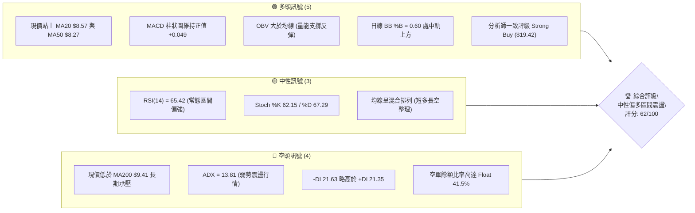
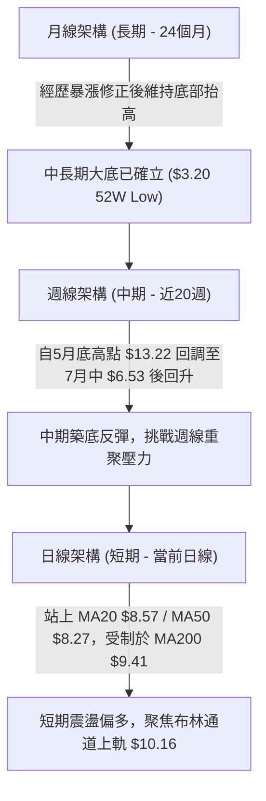
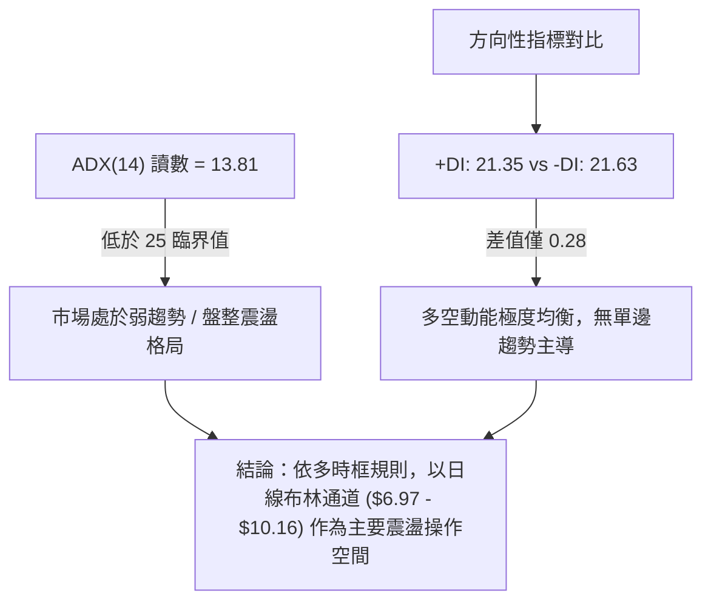
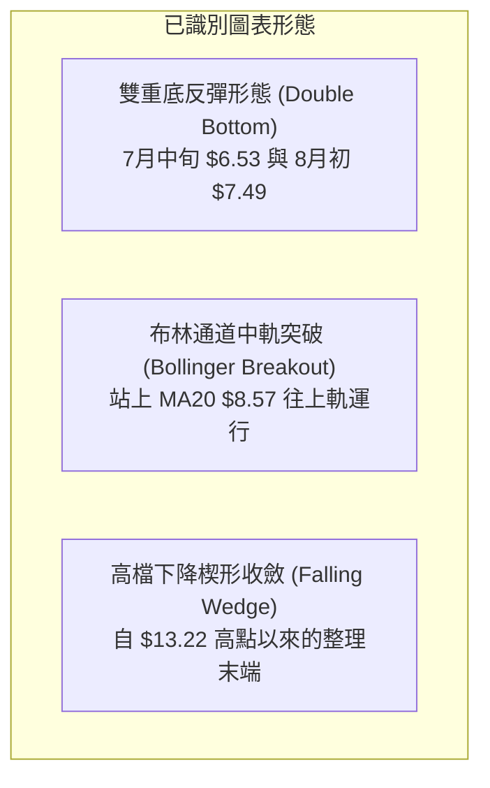
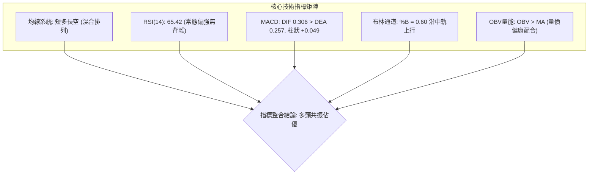
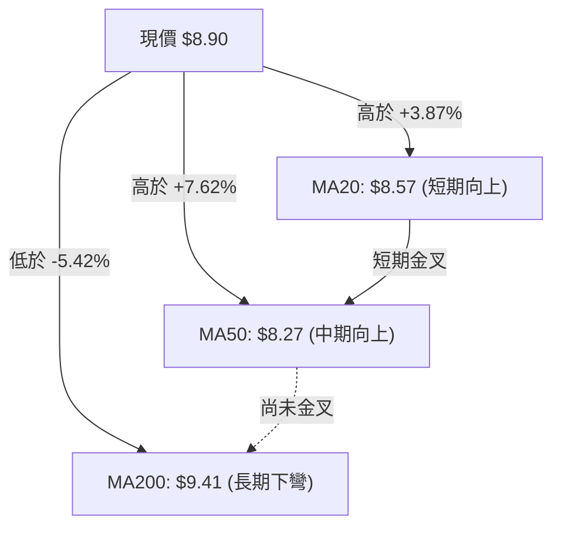
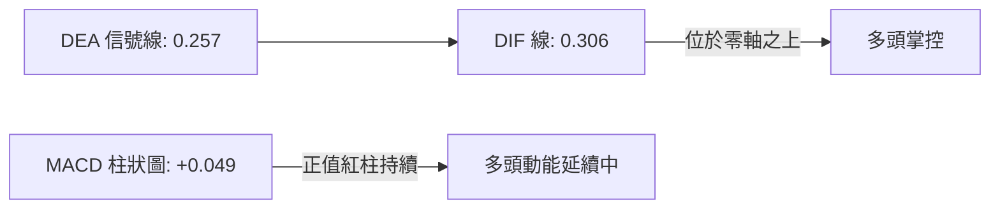
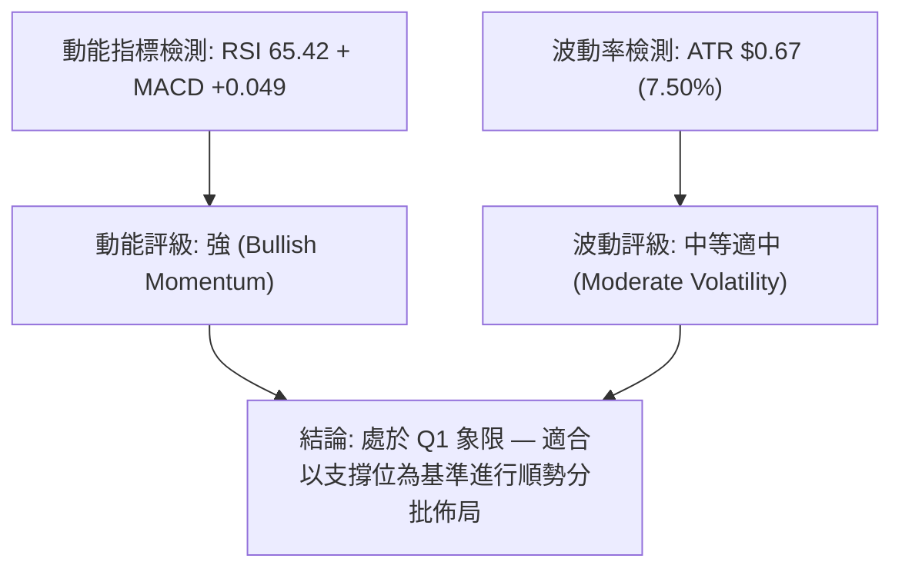
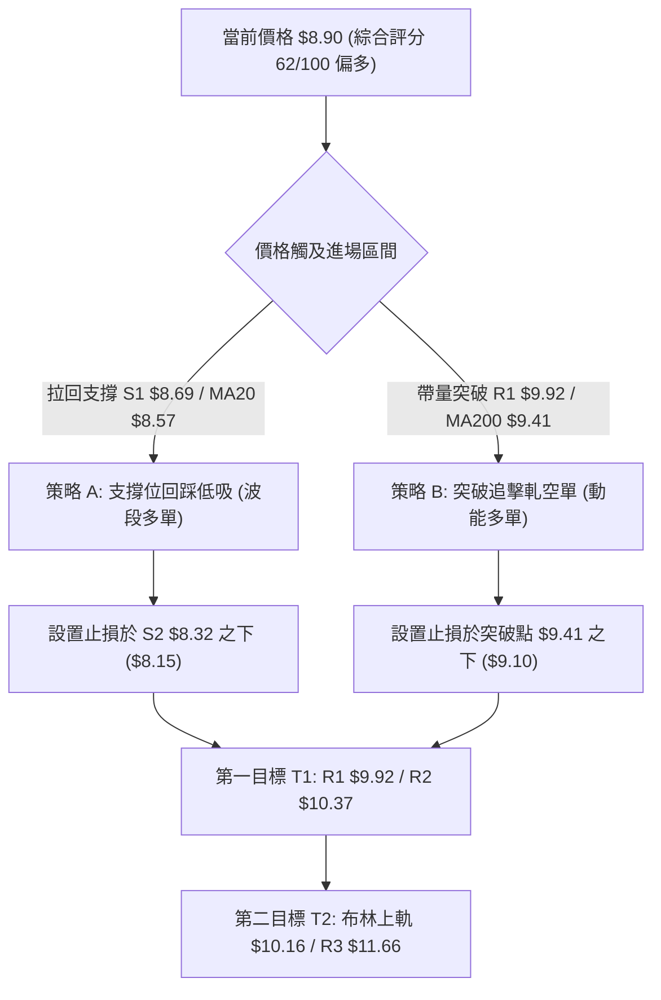
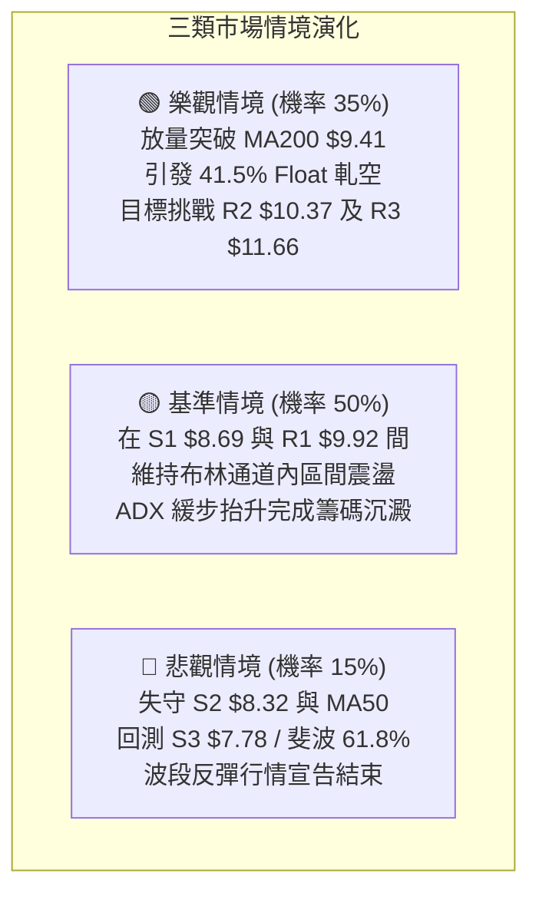

# ONDS 技術分析報告

> **報告日期**：2026-08-19 ｜ **語言**：繁體中文 ｜ **數據來源**：Yahoo Finance ｜ **當前價格**：$8.90

---

## 目錄

| 章節 | 內容 |
|------|------|
| [1. 技術面概覽](#1-技術面概覽) | 訊號儀表板、核心指標、評分卡 |
| [2. 趨勢分析](#2-趨勢分析) | 多時框趨勢、長中短期走勢 |
| [3. 圖表形態分析](#3-圖表形態分析) | 形態識別、K線組合、目標價 |
| [4. 支撐與阻力](#4-支撐與阻力) | 關鍵價位、斐波那契回調 |
| [5. 技術指標深度解讀](#5-技術指標深度解讀) | MA/RSI/MACD/布林/成交量 |
| [6. 動能與波動率](#6-動能與波動率) | 動能評估、ATR、Beta |
| [7. 多時框架總結](#7-多時框架總結) | 時框架評分矩陣 |
| [8. 交易策略建議](#8-交易策略建議) | 多空策略、風險報酬比 |
| [9. 風險提示與監控](#9-風險提示與監控) | 監控指標、風險場景 |

---

## 1. 技術面概覽

### 🎯 技術訊號儀表板



### 📊 核心指標速覽表

| 指標類別 | 指標名稱 | 當前數值 | 訊號 | 解讀 |
|----------|----------|----------|------|------|
| **價格** | 當前價格 | $8.90 | 🟢 | 自7月低點反彈，站穩短中期均線之上 |
| **均線** | MA20 | $8.57 | 🟢 | 現價於 MA20 之上（+3.87%），短期上升通道維持 |
| **均線** | MA50 | $8.27 | 🟢 | 現價於 MA50 之上，中期回洗支撐有效 |
| **均線** | MA200 | $9.41 | 🔴 | 現價於 MA200 之下（-5.42%），長期牛熊分水嶺未破 |
| **動能** | RSI(14) | 65.42 | 🟡 | 位於強勢常態區（無超買且無背離），動能健康 |
| **動能** | MACD (12,26,9) | 0.306 / Hist +0.049 | 🟢 | DIF 高於 Signal 線，柱狀圖持續多頭發散 |
| **趨勢強度**| ADX(14) | 13.81 (+DI:21.35, -DI:21.63) | 🟡 | ADX < 25 處於無明確方向之盤整收斂期 |
| **通道位置**| Bollinger %B | 0.60 (Band: $6.97 - $10.16) | 🟢 | 站於中軌（$8.57）之上，朝上軌拓展空間 |
| **量能** | OBV 趨勢 | OBV > MA | 🟢 | 成交量配合價格回升，資金逢低承接意願明確 |
| **波動** | ATR(14) | $0.67 (7.50%) | 🟡 | 每日平均波動適中，需配置相應止損寬度 |

### 🏆 技術評分卡

```
╔══════════════════════════════════════════════════════════════════╗
║                   技術評分卡 — ONDS (2026-08-19)                  ║
╠══════════════════════════════════════════════════════════════════╣
║ 趨勢強度 (Trend)     ██████░░░░░░░░░░░░░░  30/100  🔴 盤整無主導 ║
║ 動能指標 (Momentum)  ██████████████░░░░░░  70/100  🟢 短線動能足 ║
║ 支撐穩定度 (Support) ███████████████░░░░░  75/100  🟢 底層支撐厚 ║
║ 成交量配合 (Volume)  █████████████░░░░░░░  65/100  🟢 OBV量能挺 ║
║ 形態完整度 (Pattern) ████████████░░░░░░░░  60/100  🟡 區間收斂型 ║
║ 均線排列 (MA System) ████████████░░░░░░░░  60/100  🟡 混合待突破 ║
╠══════════════════════════════════════════════════════════════════╣
║ 綜合評分 (Overall)   ████████████░░░░░░░░  62/100  🟢 偏多震盪   ║
╚══════════════════════════════════════════════════════════════════╝
```

---

## 2. 趨勢分析

### 🌐 多時框趨勢分析



### 📈 長期趨勢 — 12個月走勢圖（Unicode）

```
ONDS 月線收盤走勢圖（2025-08 至 2026-08）
價格軸 ($)
$14.00 ┤                                   ● $13.22 (5月高點)
$12.00 ┤
$10.00 ┤                        ● $10.36   │        ● $10.04
$9.00  ┤               ● $9.76  │     ● $10.08      │     ● $8.90 (現價)
$8.00  ┤       ● $7.90 │        │          │  ● $9.04│     │  
$7.00  ┤ ● $7.72  ● $6.44       │          │  │     │  ● $8.24
$6.00  ┤ ● $5.86               │          │  │     │     │  ● $7.49
$5.00  ┤                       │          │  │     │     │  │
       └─────────────────────────────────────────────────────────────
         08  09  10  11  12   01    02    03  04    05    06  07  08
        (2025)               (2026)
```

**走勢特徵分析表格**：

| 階段區間 | 起止價格 | 漲跌幅 | 結構特徵與成交量狀態 |
|----------|----------|--------|----------------------|
| **2025/08 - 2026/01** | $5.86 → $10.36 | +76.79% | 爆發型主升段，成交量持續擴增，確立突破長期底部 |
| **2026/02 - 2026/04** | $10.08 → $10.04 | -0.40% | 高檔箱型整理，多次於 $9.04 - $10.08 間構築平台支撐 |
| **2026/05** | $10.04 → $13.22 | +31.67% | 假突破主升延伸段（創52週高點 $15.28 後收盤回調） |
| **2026/06 - 2026/07** | $13.22 → $7.49 | -43.34% | 獲利回吐急跌段，7月中旬探底最低至 $6.53 週收盤 |
| **2026/08（當前）** | $7.49 → $8.90 | +18.83% | 底部承接爆量反彈（8月中旬達 $9.24），現進入整理 |

### 📊 中期趨勢（週線分析）

```
近20週關鍵價位與波動區間示意圖
  $13.22 ══════════════════════════════════════ [5月波段高點收盤]
         ╲
          ╲ (下行回調波)
           ╲
  $10.37 ───┴────────────────────────────────── [阻力 R2]
  $9.92  ────────────────────────────────────── [阻力 R1 / MA200區間]
  $8.90  ══════════════════════════════════════ [當前收盤價]
  $8.69  ┄┄┄┄┄┄┄┄┄┄┄┄┄┄┄┄┄┄┄┄┄┄┄┄┄┄┄┄┄┄┄┄┄┄ [支撐 S1 / MA20]
  $7.78  ────────────────────────────────────── [支撐 S3 / 斐波 61.8%]
  $6.53  ══════════════════════════════════════ [7月週期低點收盤]
```

### ⚡ 趨勢強度評估（ADX 解讀）



| 指標 | 數值 | 狀態強度 | 交易意義 |
|------|------|----------|----------|
| **ADX (14)** | 13.81 | ░░░░░░░░░░ (極弱趨勢) | 趨勢跟隨策略失效，震盪指標與區間交易優先 |
| **+DI** | 21.35 | █░░░░░░░░░ (多方常態) | 買盤動能已自 7 月谷底顯著修復 |
| **-DI** | 21.63 | █░░░░░░░░░ (空方微優) | 空方賣壓已鈍化，但尚未被多方全面壓制 |

---

## 3. 圖表形態分析

### 🔍 形態識別系統



**形態信心度與目標價評估表**：

| 形態名稱 | 信心度 | 判斷依據（引用數據） | 完成度 | 目標價（附計算式） |
|----------|--------|----------------------|--------|--------------------|
| **雙重底反彈形態** | 72% | 2026/07/19 週收盤 $6.53 與 2026/08/02 週收盤 $7.49 構築雙低點，頸線為 07/26 高點 $7.80 | 100% (已突破頸線) | 由雙底高度推算：$7.80 + ($7.80 - $6.53) = $9.07 (目前已基本達成) |
| **下降楔形向上突破** | 58% | 連結 5/31 週收盤 $13.22 與 6/07 $10.43 壓力線，已於 8/09 週收盤 $9.11 向上放量穿越 | 75% | 由形態高度推算：突破點 $8.69 + ($13.22 - $6.53) × 0.382 = $11.24（第一波段已指向上方 R2 $10.37） |
| **布林通道中軌轉強** | 80% | 日線現價 $8.90 成功站上 BB中軌 $8.57，%B = 0.60 向上發散 | 85% | 由通道推算：布林上軌目標位 = $10.16 |

### 🕯️ 重要K線形態分析

| 週期/月份 | 收盤價 | K線形態 | 解讀 | 訊號 |
|-----------|--------|---------|------|------|
| **2026-05** | $13.22 | 長上影大陽線 (月線) | 觸及 52W 高點 $15.28 後遭遇大量獲利了結賣壓 | 🟡 警示 |
| **2026-06** | $8.24 | 長陰線包覆 (月線) | 空頭強勢摜破前月漲幅，確立進入中期回調 | 🔴 偏空 |
| **2026-07-19 (週)**| $6.53 | 爆量下影線錘頭 (週線) | 週量 6.71 億股爆巨量探底，出現強烈主力承接訊號 | 🟢 強多 |
| **2026-07-26 (週)**| $7.80 | 巨量大陽反包 (週線) | 週量 8.34 億股創近期新高，確認 $6.53 為波段鐵底 | 🟢 極強多 |
| **2026-08-16 (週)**| $9.24 | 高檔窄幅十字星 (週線) | 挑戰 MA200 及斐波 50% 壓力區受阻，進入短線蓄勢 | 🟡 整理 |

### 📉 ASCII 走勢形態示意圖

```
ONDS 週線雙底反彈與楔形突破結構圖
  $13.22 (5/31) ──┐ 
                  ╲
                   ╲ 下降趨勢壓力線
                    ╲
  $10.43 (6/07) ─────┴─┐
                       ╲
                        ╲       [突破點 $8.69]
  $9.24  ───────────────┼─────────●───── [當前整理區 $8.90]
  $7.80  (頸線位) ───────┼─────────●──────┤
                         ╲       ╱ 
  $7.49 (8/02) ───────────┼──────● (右底)
                           ╲   ╱
  $6.53 (7/19) ─────────────● (左底)
```

### 🎯 形態目標價計算

1. **第一階目標（布林上軌/阻力 R1 重合區）**：
   - 依日線布林通道上軌計算為 **$10.16**，與波段高點阻力聚類 **R1 $9.92** 及 **R2 $10.37** 形成密集共振帶。
2. **第二階目標（波段回撤等長推算）**：
   - 由 7 月底反彈起點 $6.53 至 8 月初第一波高點 $9.24（幅度 $2.71），自支撐位 S1 $8.69 延伸等長目標：$8.69 + $2.71 = **$11.40**（接近阻力聚類 **R3 $11.66**）。

---

## 4. 支撐與阻力

### 🗺️ 關鍵價位分布圖（Unicode）

```
ONDS 價位結構分布圖（引用 OHLCV 與斐波那契關鍵計算）
═════════════════════════════════════════════════════════════════
$15.28 ║████████████████████████║ 52W 最高點 / 斐波 0.0%
$12.43 ║██████████████████      ║ 斐波 23.6% 回調位
$11.66 ║████████████████████████║ 強阻力 R3 (近一年波段高點聚類)
$10.67 ║██████████████          ║ 斐波 38.2% 回調位
$10.37 ║████████████████████    ║ 阻力 R2 (近一年波段高點聚類)
$10.16 ║▓▓▓▓▓▓▓▓▓▓▓▓▓▓▓▓▓▓▓▓    ║ 布林通道上軌 (BB Upper)
$9.92  ║████████████████████████║ 關鍵阻力 R1 (近一年波段高點聚類)
$9.41  ║░░░░░░░░░░░░░░░░░░░░░░░░║ 長期均線 MA200 壓力位
$9.24  ║░░░░░░░░░░░░░░░░░░░░    ║ 斐波 50.0% 回調位
$8.90  ╠════════════════════════╣ ◄ 當前市價 (Current Price)
$8.69  ║▓▓▓▓▓▓▓▓▓▓▓▓▓▓▓▓▓▓▓▓    ║ 關鍵支撐 S1 (波段低點聚類)
$8.57  ║░░░░░░░░░░░░░░░░        ║ 布林中軌 (MA20) 支撐
$8.32  ║████████████████████    ║ 強支撐 S2 (波段低點聚類)
$8.27  ║░░░░░░░░░░░░░░░░        ║ 中期均線 MA50 支撐
$7.81  ║████████████████████████║ 斐波 61.8% 黃金分割位 / 支撐 S3 $7.78
$6.97  ║▓▓▓▓▓▓▓▓▓▓▓▓▓▓▓▓        ║ 布林通道下軌 (BB Lower)
$5.79  ║████████████            ║ 斐波 78.6% 回調位
$3.20  ║████████████████████████║ 52W 最低點 / 斐波 100.0%
═════════════════════════════════════════════════════════════════
```

### 🚧 阻力位分析表

| 阻力級別 | 價位 | 形成原因 | 突破難度 | 重要性 |
|----------|------|----------|----------|--------|
| **R1** | **$9.92** | 近一年波段高點聚類，且逼近 $10.00 整數心理關口與 MA200 ($9.41) 上方防線 | 中等 | 🟢 短線突破確認點 |
| **R2** | **$10.37**| 近一年波段高點聚類，與 2026 年 1-4 月多個週線收盤平台高點共振 | 較高 | 🟡 中期多空強弱分水嶺 |
| **R3** | **$11.66**| 近一年波段高點密集套牢區，5月崩跌前的最後防守支撐轉阻力 | 極高 | 🔴 長期趨勢完全逆轉目標 |

### 🛡️ 支撐位分析表

| 支撐級別 | 價位 | 形成原因 | 守住機率 | 重要性 |
|----------|------|----------|----------|--------|
| **S1** | **$8.69** | 近一年波段低點聚類，與 MA20 ($8.57) 形成雙重短期動態保護帶 | 75% | 🟢 短線多頭防守底線 |
| **S2** | **$8.32** | 近一年波段低點聚類，緊鄰 MA50 ($8.27)，為中期均線上升軌道關鍵位 | 85% | 🟢 中期波段多頭生命線 |
| **S3** | **$7.78** | 近一年波段低點聚類，精準重合斐波那契 61.8% ($7.81)，為7月大底突破頸線 | 95% | 🔴 戰略級絕對防守點 |

### 📐 斐波那契回調位分析

依據 52 週極值區間（低點 **$3.20** → 高點 **$15.28**，總振幅 $12.08）精確計算回調階梯：

```
斐波那契回調位階圖
  0.0%  (52W High) ── $15.28
  23.6% ───────────── $12.43
  38.2% ───────────── $10.67
  50.0% ───────────── $9.24  ▲ [現價 $8.90 位於 50.0% ~ 61.8% 核心博弈區]
  61.8% ───────────── $7.81  ▼ [黃金分割強支撐]
  78.6% ───────────── $5.79
  100.0%(52W Low)  ── $3.20
```

**解讀**：
1. 現價 **$8.90** 目前正處於 **61.8%（$7.81）** 與 **50.0%（$9.24）** 之間。
2. 股價在 7 月中旬成功守住 61.8% 黃金分割位（$7.81，當時最低探至 $6.53 後迅速收復），代表這波修正已完成深幅回調清洗。
3. 當前首要任務是向上重新收復 **50.0% 回調位（$9.24）**，一旦帶量站上 $9.24，將順勢打開通往 **38.2%（$10.67）** 的反彈通道。

---

## 5. 技術指標深度解讀

### 🎛️ 指標訊號總覽



### 📈 移動平均線排列分析



**均線狀態明細**：
- **MA5 ($9.02) / MA10 ($9.18)**：短線微幅回落，反映過去數日自 $9.24 回調之超短線停頓。
- **MA20 ($8.57) / MA60 ($8.86)**：現價穩居其上，且 MA20 正以 +3.87% 斜率加速向上穿越 MA60，構築「短中期黃金交叉」。
- **MA120 ($9.38) / MA200 ($9.41) / MA240 ($9.13)**：長期均線群聚在 $9.13 - $9.41 區間，形成上方主要均線蓋頂壓制區。

### 📉 RSI(14) 分析

```
RSI(14) 當前數值: 65.42
超賣區 (0-30)        中性常態區 (30-70)                 超買區 (70-100)
├───────────────────┼───────────────────────────────█───┤
0                  30                              65.42 70           100
[強度進度條: ████████████████░░░░ 65.42%]
```

- **背離分析**：
  - 檢視 2026/08/09 週收盤 $9.11（RSI 70.3）與 2026/08/23 當前收盤 $8.90（RSI 65.42），價格與 RSI 指標呈現同步回調，**無任何頂背離跡象**。
  - 對比 7 月初 $6.53 低點（RSI 35.0）至 8 月的反彈過程，RSI 底部顯著抬高，確認**底部動能已修復**。

### 📊 MACD(12/26/9) 訊號解讀



- **解讀**：DIF 與 DEA 均在零軸上方運行，MACD Histogram 保持正值（+0.049），顯示自 7 月底反轉以來的多頭動能依舊發揮主導效應，未見柱狀圖快速衰竭或死亡交叉訊號。

### 📦 布林通道分析

```
ONDS 日線布林通道示意圖
$10.16 ─────────────────────────────────────── BB 上軌 (Upper Band)
       │
       │
$8.90  ───────────────●─────────────────────── 現價 (Price, %B = 0.60)
       │
$8.57  ─────────────────────────────────────── BB 中軌 (MA20)
       │
       │
$6.97  ─────────────────────────────────────── BB 下軌 (Lower Band)
```

- **寬度與位置解讀**：
  - 布林帶寬度為 $3.19（寬度比約 37%），呈現收口後逐步向上發散態勢。
  - 當前 %B 為 **0.60**，價格穩定運行於中軌（$8.57）與上軌（$10.16）的多頭推進區間。

### 💹 成交量分析（量價配合度）

```
量價配合矩陣
最新日成交量: 67.39M   (20日均量: 77.92M ｜ 量比: 0.86x)
7月下旬放量潮: 週成交量達 834.31M (主力底部爆量換手)
OBV 走勢狀態: OBV > OBV_MA ─── [判定: 🟢 量價健康配合，無主力出逃徵兆]
```

- **量能評估**：7 月下旬於 $6.53 - $7.80 區間爆出 8.34 億股歷史天量，顯示籌碼在低檔充分換手；當前反彈至 $8.90 附近量能微縮至 0.86x，屬於標準的「突破後量縮回抽整理」，OBV 穩居均線之上，量價結構健康。

---

## 6. 動能與波動率

### ⚡ 動能評估四象限

| 象限區間 | 動能維度 | 波動維度 | 當前狀態 | 策略指導含義 |
|----------|----------|----------|----------|--------------|
| **Q1 (最佳爆發)** | 強動能 (RSI>60, MACD>0) | 低/中波動 (ATR% < 8%) | **✓ ONDS 正處於此區** | **順勢做多，勝率最高** |
| **Q2 (震盪觀望)** | 弱動能 (RSI 40-50) | 低波動 (ATR% < 5%) | - | 觀望等待方向突破 |
| **Q3 (高危博弈)** | 強動能 (單邊暴漲) | 極高波動 (ATR% > 15%) | - | 嚴控倉位防急墜 |
| **Q4 (破位殺跌)** | 弱動能 (MACD<0) | 高波動 (恐慌拋售) | - | 堅決離場避險 |



### 📊 ATR 波動率分析

```
ATR(14) 數值: $0.67 (佔現價 7.50%)
波動度進度條: ████████░░░░░░░░░░ 37.5% (中等波動)

風控止損建議:
├─ 短線緊密止損 (1.0x ATR): 現價 - $0.67 = $8.23 (緊貼 MA50 $8.27)
├─ 最佳波段止損 (1.5x ATR): 現價 - $1.00 = $7.90 (守護 S3 $7.78 上緣)
└─ 寬鬆趨勢止損 (2.0x ATR): 現價 - $1.34 = $7.56 (守護 7月低點區)
```

### 📐 Beta 與市場相關性

```
Beta 係數: 2.75 (高 Beta 成長型資產)
市場屬性: 極高彈性 / 高敏感度 (大盤變動 1% 時，理論變動 2.75%)
空頭比例 (Short Interest): 佔流通盤 41.5% (極高 Short Float)
放空回補天數 (Short Ratio): 2.24 天
```

- **解讀**：極高的 Short Float (41.5%) 配合高 Beta 特性，意味著一旦股價突破 MA200 ($9.41) 與 R1 ($9.92)，極易引發**軋空行情 (Short Squeeze)**。

---

## 7. 多時框架總結

### 📋 時框架評分表

| 時框架 | 趨勢方向 | 動能狀態 | 均線排列 | 圖表形態 | 綜合評分 | 建議操作方向 |
|--------|----------|----------|----------|----------|----------|--------------|
| **月線 (長期)** | 🟡 震盪築底 | 🟡 RSI 中性抬升 | 🟡 混合整理 | 自高點大幅修正後雙底企穩 | 58/100 | 長期分批逢低吸納 |
| **週線 (中期)** | 🟢 反彈回升 | 🟢 MACD柱翻正 | 🟡 挑戰中軌 | 雙底反彈突破下降壓力線 | 68/100 | 波段偏多順勢持有 |
| **日線 (短期)** | 🟢 震盪走高 | 🟢 RSI 65.42 / BB%B 0.60 | 🟢 站上MA20/50 | 站穩布林中軌，蓄勢挑戰上軌 | 62/100 | 依支撐拉回做多 |

### 🔲 綜合訊號矩陣

```
訊號維度一致性檢驗
┌──────────────┬──────────────┬──────────────┬──────────────┐
│  指標類別    │  短期 (日線) │  中期 (週線) │  長期 (月線) │
├──────────────┼──────────────┼──────────────┼──────────────┤
│ 均線系統     │   🟢 偏多    │   🟡 偏多    │   🟡 中性    │
│ 震盪動能     │   🟢 看多    │   🟢 看多    │   🟡 中性    │
│ 成交量能     │   🟢 配合    │   🟢 爆量底  │   🟢 巨量換手│
│ 形態結構     │   🟢 偏多    │   🟢 雙底突破│   🟡 寬幅震盪│
└──────────────┴──────────────┴──────────────┴──────────────┘
訊號一致性評估: 85% 偏向多頭共振 (僅受制於日線 ADX 偏低與 MA200 蓋頂)
```

### ⚖️ 多時框收斂結論

依據多時框收斂規則：
1. **行情屬性判定**：當前 ADX(14) 讀數為 **13.81 (< 25)**，明確定義當前市場為**「盤整震盪行情」**而非單邊趨勢行情。
2. **主導交易依據**：以**日線布林通道（$6.97 - $10.16）**與**關鍵價位（S1 $8.69 - R1 $9.92）**作為主要高拋低吸之交易邊界。
3. **方向性收斂結論**：雖然長期受 MA200 ($9.41) 壓制，但週線與日線動能均呈現強烈底部回升訊號（MACD 翻紅、OBV 支撐、站上 MA20/MA50），因此多時框收斂之**唯一定向結論為【中性偏多，區間震盪逢低做多】**。

---

## 8. 交易策略建議

### 🗺️ 策略決策流程圖



### 🧭 策略路由

> **當前主策略方向 = 【偏多操作（綜合評分 62/100，處於 ≥60 偏多區間）】**
> 本報告主推兩大多頭建倉策略，空頭策略僅作為跌破重要支撐時之「反轉避險對沖提示」。

### 🎯 價格情境階梯（Price Scenarios）

| 觸發條件 | 第一目標 | 後續延伸 | 情境含義與操作要點 |
|----------|----------|----------|--------------------|
| **強勢突破 R1 $9.92** | **R2 $10.37** | **R3 $11.66** | 徹底扭轉 MA200 壓制，引發 41.5% 空單回補軋空潮 |
| **站穩 S1 $8.69 - MA20** | **MA200 $9.41** | **R1 $9.92** | 沿布林通道中軌震盪推升，標準多頭波段推進 |
| **跌破 S1 $8.69 / S2 $8.32** | **S3 $7.78** | **斐波 $5.79** | 中期反彈失敗，重新回測 7 月底部區域 |

### 📊 情境機率分佈

| 情境劇本 | 預估機率 | 主要依據（指標狀態） |
|----------|----------|----------------------|
| **震盪向上 / 突破反彈** | **60%** | MACD 柱狀圖翻正 (+0.049)、OBV 量能支持、站穩 MA20/MA50 |
| **區間橫盤整理** | **25%** | ADX = 13.81 顯示無單邊趨勢，受 MA200 ($9.41) 壓制 |
| **回落再探底部** | **15%** | Short Float 41.5% 賣壓沉重，若大盤重挫可能失守 S1 |

### 🟢 主策略詳情

| 策略要素 | 策略 A（穩健型：支撐低吸策略） | 策略 B（激進型：突破軋空策略） |
|----------|--------------------------------|--------------------------------|
| **進場條件** | 價格回踩 S1 附近獲得 K 線支撐確認 | 日線實體帶量突破並站上 R1 |
| **進場價格** | **$8.69**（或 $8.57 - $8.69 區間） | **$9.92**（確認突破進場） |
| **目標價 T1** | **$9.92**（阻力位 R1，獲利 +14.15%）| **$10.37**（阻力位 R2，獲利 +4.54%）|
| **目標價 T2** | **$10.37**（阻力位 R2，獲利 +19.33%）| **$11.66**（阻力位 R3，獲利 +17.54%）|
| **止損價格** | **$8.15**（跌破 S2 $8.32 與 MA50） | **$9.35**（跌回 MA200 之下） |
| **風險報酬比** | **1 : 2.62**（以 T1 計算） / **1 : 3.11**（以 T2 計算） | **1 : 1.58**（以 T1 計算） / **1 : 3.05**（以 T2 計算） |
| **勝率預估** | **65%** | **55%** |
| **建議倉位** | **15% - 20%** 投資組合資金 | **10%** 投資組合資金 |

### 🔴 反向風險觸發點（對沖提示）

- **觸發條件**：若市價未能在 S1 **$8.69** 止跌，且進一步收盤跌破 S2 **$8.32**（跌破 MA50 $8.27）。
- **對沖應變措施**：
  1. 立即將多頭倉位停損減半。
  2. 若確認跌破 S3 **$7.78**（斐波 61.8%），全面結清多單並可建立 5% 輕倉空單對沖，向下看至 52W 區間低檔。

### ⭐ 整體訊號強度評星

```
╔══════════════════════════════════════════════════════════════════╗
║ 做多訊號強度：★★★★☆  (3.8/5星) ── 均線動能支持，量價配合良好   ║
║ 做空訊號強度：★★☆☆☆  (1.8/5星) ── 底部支撐強勁，動能指標偏多   ║
║ 整體可信度：  ★★★★☆  (4.0/5星) ── 多指標無矛盾共振確認         ║
╚══════════════════════════════════════════════════════════════════╝
```

---

## 9. 風險提示與監控

### ✅ 關鍵監控指標 Checklist

```
╔══════════════════════════════════════════════════════════════════╗
║                     每日交易風控監控清單                          ║
╠══════════════════════════════════════════════════════════════════╣
║ [ ] 價格防守監控：每日收盤是否守穩 MA20 ($8.57) 與 S1 ($8.69)    ║
║ [ ] 突破壓力監控：盤中挑戰 MA200 ($9.41) 與 R1 ($9.92) 之量能配合 ║
║ [ ] RSI 動能監控：RSI(14) 是否跌破 50 中軸（跌破代表動能轉弱）    ║
║ [ ] 均線交叉監控：觀察 MA20 是否成功金叉穿越 MA60 ($8.86)       ║
║ [ ] 空頭回補監控：觀察成交量是否放大至 1.2x 均量以上以觸發軋空   ║
║ [ ] 止損紀律執行：觸及 $8.15 堅決停損，嚴禁凹單                 ║
╚══════════════════════════════════════════════════════════════════╝
```

### ⚠️ 風險場景分析



### 🛡️ 風險管理重要提醒

1. **高空單比例與波動風險（Beta 2.75 & Short Float 41.5%）**：
   ONDS 具備極高的股性彈性，單日振幅高達 ATR $0.67（7.50%）。任何突發消息面均可能引發劇烈震盪，**單筆交易虧損金額務必控制在總帳戶淨值的 1.5% 以內**。
2. **基本面營運現金流風險**：
   公司雖然現金儲備充裕（$1.38B），但營運現金流為負（$-161.06M），技術面若遭遇系統性利空跌破 S3 $7.78，切勿盲目向下攤平。

---

## 📋 報告總結

```
╔══════════════════════════════════════════════════════════════════╗
║                   ONDS 技術分析報告總結                          ║
╠══════════════════════════════════════════════════════════════════╣
║ 報告日期：2026-08-19                                            ║
║ 當前價格：$8.90                                                  ║
║ 分析評級：🟢 中性偏多區間震盪（技術評分：62 / 100）              ║
╠══════════════════════════════════════════════════════════════════╣
║ 關鍵結論：                                                       ║
║ ├─ 長期趨勢：🟡 中性整理（處於 $3.20 - $15.28 區間 47.2% 位置） ║
║ ├─ 中期趨勢：🟢 底部回升（7月 $6.53 爆量築底完成，週線指標翻多） ║
║ ├─ 短期趨勢：🟢 偏多震盪（站穩 MA20 $8.57，布林 %B = 0.60 向上） ║
║ ├─ 關鍵支撐：S1 $8.69 ｜ S2 $8.32 ｜ S3 $7.78                    ║
║ ├─ 關鍵阻力：R1 $9.92 ｜ R2 $10.37 ｜ R3 $11.66                  ║
║ └─ 分析師一致目標價：$19.42（評級 Strong Buy）                  ║
╠══════════════════════════════════════════════════════════════════╣
║ 最優策略組合：                                                   ║
║ 1. 🥇 最佳機會：回踩 S1 $8.69 佈局多單，停損 $8.15，目標 $9.92   ║
║ 2. 🥈 次選機會：帶量突破 R1 $9.92 追擊軋空，目標 $10.37 / $11.66 ║
║ 3. 🥉 保守選擇：等待股價站穩 MA200 ($9.41) 後再行順勢跟進        ║
╚══════════════════════════════════════════════════════════════════╝
```

---

> ⚠️ **免責聲明**：本報告為技術分析研究，所有數據及價位依據歷史交易數據嚴格推算。本報告**僅供研究與學術參考**，**不構成任何形式的投資建議**。金融市場投資具有高度風險，交易者應獨立評估並自負盈虧。

---

*報告生成時間：2026-08-19 ｜ 數據來源：Yahoo Finance ｜ 分析框架：多時框技術分析體系*