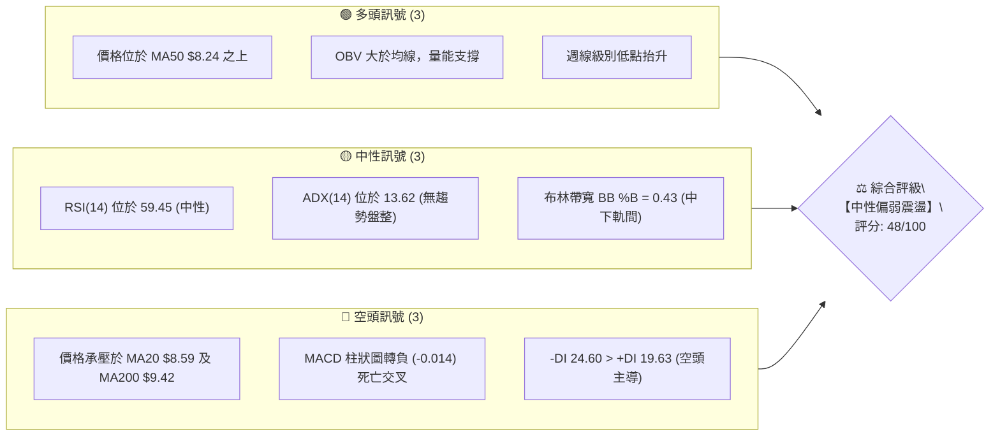
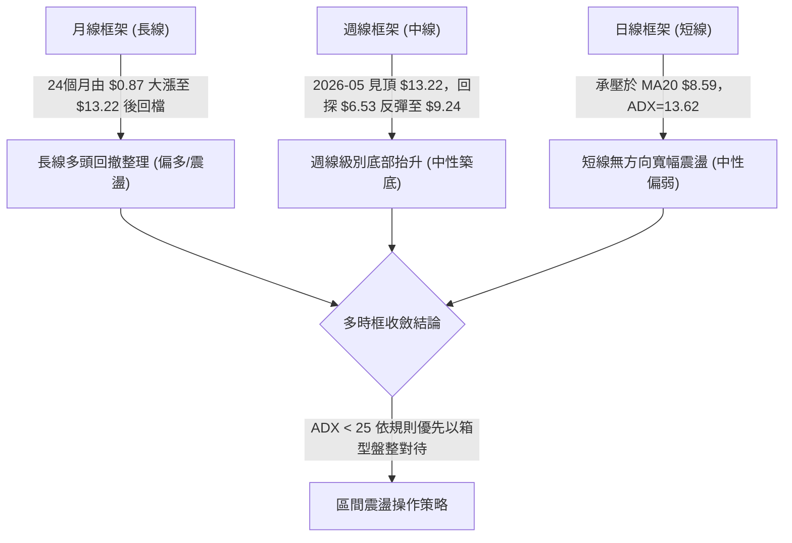
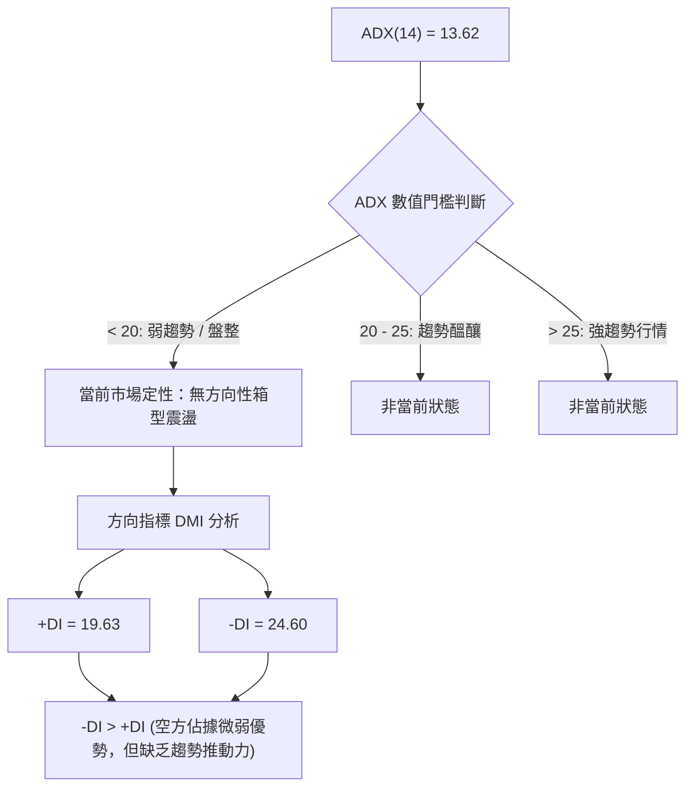
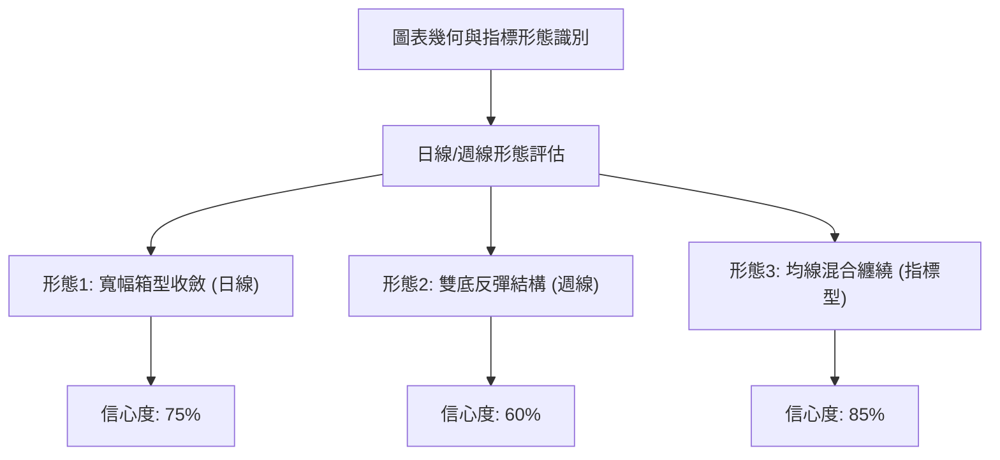
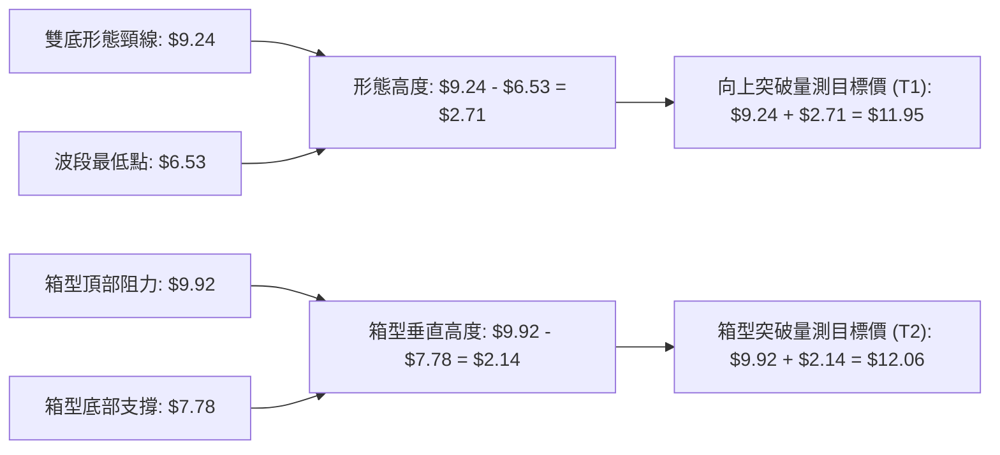
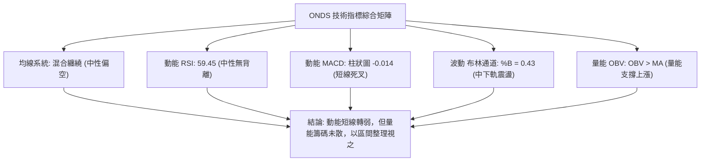
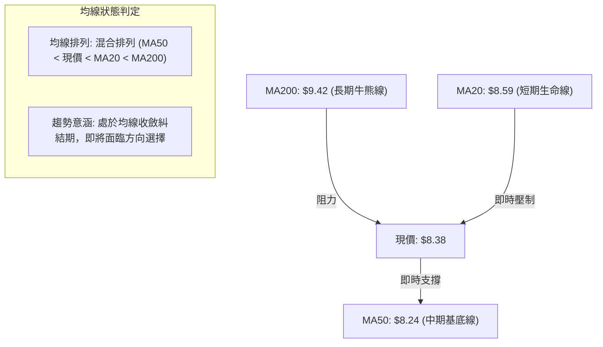
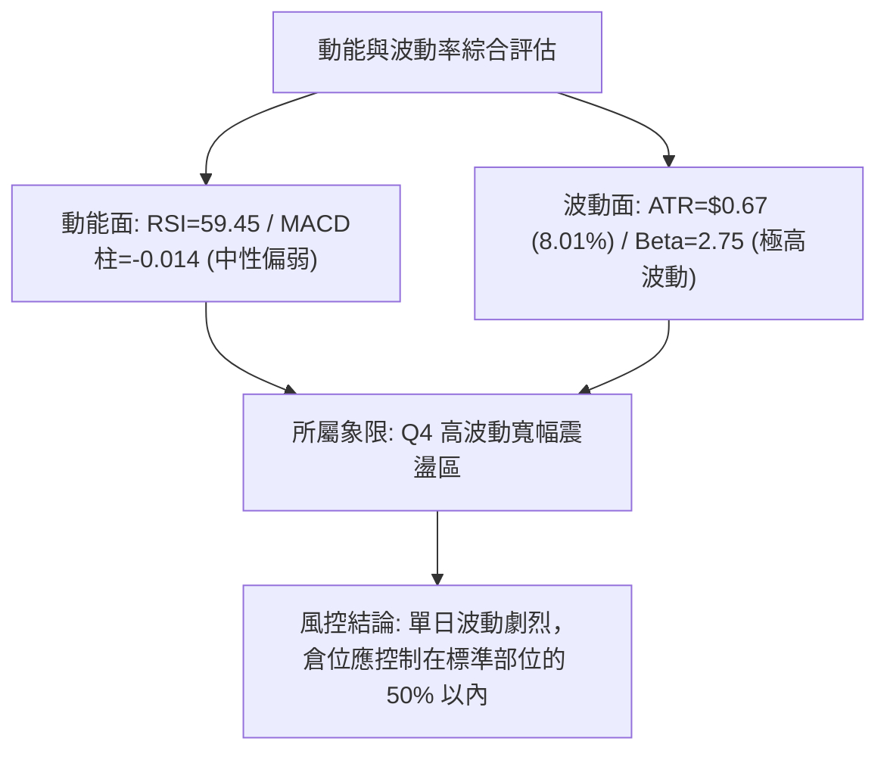
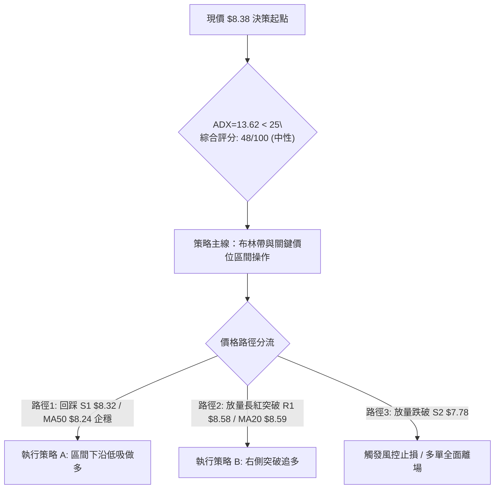
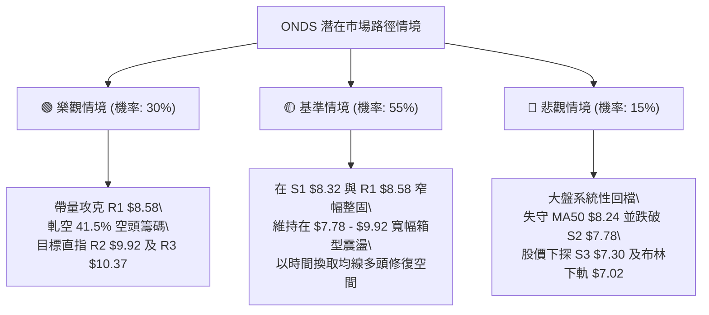

# ONDS 技術分析報告

> **報告日期**：2026-08-20 ｜ **語言**：繁體中文 ｜ **數據來源**：Yahoo Finance ｜ **當前價格**：$8.38

---

## 目錄

| 章節 | 內容 |
|------|------|
| [1. 技術面概覽](#1-技術面概覽) | 訊號儀表板、核心指標、評分卡 |
| [2. 趨勢分析](#2-趨勢分析) | 多時框趨勢、長中短期走勢 |
| [3. 圖表形態分析](#3-圖表形態分析) | 形態識別、K線組合、目標價 |
| [4. 支撐與阻力](#4-支撐與阻力) | 關鍵價位、斐波那契回調 |
| [5. 技術指標深度解讀](#5-技術指標深度解讀) | MA/RSI/MACD/布林/成交量 |
| [6. 動能與波動率](#6-動能與波動率) | 動能評估、ATR、Beta |
| [7. 多時框架總結](#7-多時框架總結) | 時框架評分矩陣 |
| [8. 交易策略建議](#8-交易策略建議) | 多空策略、風險報酬比 |
| [9. 風險提示與監控](#9-風險提示與監控) | 監控指標、風險場景 |

---

## 1. 技術面概覽

### 🎯 技術訊號儀表板



### 📊 核心指標速覽表

| 指標類別 | 指標名稱 | 當前數值 | 訊號 | 解讀 |
|----------|----------|----------|------|------|
| **價格** | 當前價格 | $8.38 | 🟡 | 位於52週區間42.9%位置，處於中位震盪帶 |
| **均線** | MA20 | $8.59 | 🔴 | 股價位於短期生命線下方 (-2.45%)，短線承壓 |
| **均線** | MA50 | $8.24 | 🟢 | 股價守在季線支撐上方 (+1.70%)，中期基底尚存 |
| **均線** | MA200 | $9.42 | 🔴 | 股價低於長期牛熊分界線 (-11.04%)，長空格局未扭轉 |
| **動能** | RSI(14) | 59.45 | 🟡 | 位於 30–70 中性平衡區，無明顯超買或超賣 |
| **動能** | MACD Hist | -0.014 | 🔴 | MACD (0.240) 低於 Signal (0.254)，柱狀體轉負看空 |
| **趨勢** | ADX(14) | 13.62 | 🟡 | ADX < 25 表示處於弱趨勢/寬幅箱型盤整行情 |
| **方向** | DMI (+DI/-DI) | 19.63 / 24.60 | 🔴 | -DI 大於 +DI，空方力量短線占優 |
| **通道** | 布林通道 %B | 0.43 | 🟡 | 價格位於中軌 $8.59 與下軌 $7.02 之間偏中位 |
| **量能** | OBV 趨勢 | OBV > MA | 🟢 | 累積能量線位於均線之上，籌碼結構尚具支撐 |
| **波動** | ATR(14) | $0.67 | 🔴 | 日均波動達 8.01%，屬於高波動成長型標的 |

### 🏆 技術評分卡

```
╔══════════════════════════════════════════════════════════════╗
║              技術評分卡 — ONDS (2026-08-20)                  ║
╠══════════════════════════════════════════════════════════════╣
║ 趨勢強度 (ADX=13.62)    ████░░░░░░░░░░░░░░░░  25/100 🔴 弱勢 ║
║ 動能指標 (RSI/MACD)     █████████░░░░░░░░░░░  45/100 🟡 中性 ║
║ 支撐穩定度 (S1/MA50)    █████████████░░░░░░░  65/100 🟢 良好 ║
║ 成交量配合 (OBV/Volume) ████████████░░░░░░░░  60/100 🟢 尚可 ║
║ 形態完整度 (箱型收斂)   ██████████░░░░░░░░░░  50/100 🟡 中性 ║
║ 均線排列 (混合纏繞)     ████████░░░░░░░░░░░░  40/100 🔴 偏弱 ║
╠══════════════════════════════════════════════════════════════╣
║ 綜合技術評分            █████████░░░░░░░░░░░  48/100 🟡 中性 ║
║ 策略導向：以區間震盪交易為主，嚴守布林上下軌與關鍵支撐S1    ║
╚══════════════════════════════════════════════════════════════╝
```

---

## 2. 趨勢分析

### 🌐 多時框趨勢分析



### 📈 長期趨勢 — 12個月走勢圖（Unicode）

```
ONDS 月線走勢圖（2025-08 至 2026-08）
價格軸 ($)
$14.00 ┤                                 ● $13.22 (2026-05 高點)
$12.00 ┤
$10.00 ┤                     ● $10.36   ● $10.08   ● $10.04
$8.00  ┤          ● $7.72  ● $7.90  ● $9.76    ● $9.04    ● $8.24  ● $8.38 ◄ 現價
$6.00  ┤ ● $5.86     ● $6.44                                 ● $7.49
$4.00  ┤
$2.00  ┤
       └────────────────────────────────────────────────────────────
         08   09   10   11   12   01   02   03   04   05   06   07   08
        '25  '25  '25  '25  '25  '26  '26  '26  '26  '26  '26  '26  '26
```

**走勢特徵分析表格**：

| 階段 | 期間 | 價格區間 | 累積漲跌幅 | 核心技術特徵 |
|------|------|----------|------------|--------------|
| **長多爆發期** | 2025-05 ~ 2025-12 | $1.22 → $9.76 | +700.0% | 伴隨營收大幅成長與機構建倉，量能巨幅放大，均線呈多頭排列 |
| **高位箱型整理** | 2026-01 ~ 2026-04 | $9.04 → $10.36 | +14.6% / -12.7% | 於 $9.00~$10.50 進行首輪籌碼換手，形成平台壓力帶 |
| **衝高回落波段** | 2026-05 ~ 2026-07 | $13.22 → $7.49 | -43.3% | 創下52週次高點 $13.22 後出現獲利了結賣壓，快速下探斐波那契回調區 |
| **築底修復期** | 2026-07 ~ 2026-08 | $6.53 → $8.38 | +28.3% | 週線於 $6.53 探底後爆量拉升至 $9.24，目前回落至 $8.38 尋求 MA50 支撐 |

### 📊 中期趨勢（週線分析）

```
ONDS 近 20 週關鍵支撐阻力結構圖
價格軸 ($)
$13.22 ┤          ● (波段頂部 2026-05-31)
$12.00 ┤
$10.37 ┤    ●    ●   ● (阻力 R3: $10.37)
$9.92  ┤  ●        ●   (阻力 R2: $9.92)
$8.58  ┤             ●  (阻力 R1: $8.58 / MA20 $8.59)
$8.38  ┤──────────────────● ◄ 目前收盤價
$8.32  ┤                  ● (關鍵支撐 S1: $8.32 / MA50 $8.24)
$7.78  ┤             ●      (支撐 S2: $7.78)
$7.30  ┤         ●          (強支撐 S3: $7.30)
$6.53  ┤       ●            (波段最低點 2026-07-19)
       └──────────────────────────────────────────────
         05/17 05/31 06/28 07/19 07/26 08/09 08/23
```

中期走勢顯示，ONDS 自 2026-07-19 的低點 $6.53 發動強烈反彈，連續突破 $7.80 與 $9.11，但在逼近 $9.92 (R2) 前受阻回落，目前正測試 $8.32 (S1) 與 MA50 ($8.24) 的支撐有效性。

### ⚡ 趨勢強度評估（ADX 解讀）



| 指標項 | 當前讀數 | 門檻標準 | 狀態判定 | 交易涵義 |
|--------|----------|----------|----------|----------|
| **ADX(14)** | 13.62 | < 25.0 | 弱趨勢 / 盤整 | 嚴禁使用順勢追突破策略，應採取高拋低吸之區間交易 |
| **+DI(14)** | 19.63 | 參考值 | 多頭動能偏弱 | 買盤推升力道不足，反彈容易在阻力位停滯 |
| **-DI(14)** | 24.60 | 參考值 | 空頭動能略高 | 賣壓雖存但未引發崩跌，主要為多頭獲利回吐盤 |
| **ADX 趨勢** | 平緩走低 | 方向性減弱 | 波動收斂 | 預期股價將維持在布林通道內部震盪整理 |

---

## 3. 圖表形態分析

### 🔍 形態識別系統



**形態信心度評估表**：

| 形態名稱 | 信心度 | 判斷依據（引用數據） | 完成度 | 目標價（附精確計算式） |
|----------|--------|----------------------|--------|------------------------|
| **寬幅箱型收斂** | 75% | 股價受困於阻力 R2 $9.92 與支撐 S2 $7.78 之間，ADX=13.62 佐證盤整 | 80% | 箱頂 $9.92，箱底 $7.78。突破後量測目標 = 頸線 $9.92 + ($9.92 - $7.78) = **$12.06** |
| **週線雙底結構** | 60% | 第一低點為 2026-07-05 收盤 $7.41，第二低點為 2026-07-19 收盤 $6.53 (反彈至 $9.24) | 65% | 頸線為 2026-08-16 收盤 $9.24。量測目標 = $9.24 + ($9.24 - $6.53) = **$11.95** |
| **指標均線糾結** | 85% | MA5($8.92)、MA10($9.14)、MA20($8.59)、MA60($8.84) 密集收斂於 $8.50-$9.20 區間 | 90% | 指標型無幾何目標價，以布林上軌 **$10.16** 與下軌 **$7.02** 為邊界 |

*註：以上形態均基於歷史 OHLCV 聚類計算，未達 50% 信心度之「頭肩頂」形態因右肩未成型不予採納。*

### 🕯️ 重要K線形態分析

| 週/月份 | 收盤價 | K線形態 | 解讀 | 訊號 |
|---------|--------|---------|------|------|
| **2026-05-31** | $13.22 | 長紅爆量突破 | 5.66 億股成交量創波段天量，但隨後出現上影線賣壓 | 🟡 假突破警訊 |
| **2026-07-19** | $6.53 | 錘頭探底線 (Hammer) | 創 6.71 億股爆量下影線，顯示強大低接買盤湧入支撐區 | 🟢 強烈止跌底訊 |
| **2026-07-26** | $7.80 | 大陽線吞噬 (Bullish Engulfing) | 成交量放大至 8.34 億股，確立短期反轉底型建立 | 🟢 買訊確認 |
| **2026-08-09** | $9.11 | 中陽反彈線 | RSI 回升至 70.3，MACD 柱狀體放大至 +0.252，多頭進攻 | 🟢 動能修復 |
| **2026-08-23** | $8.38 | 陰線回踩整理 | 週量萎縮至 2.89 億股，MACD 柱轉微負 (-0.014)，進行技術回踩 | 🔴 短線修正 |

### 📉 ASCII 走勢形態示意圖

```
ONDS 週線雙底反彈與箱型收斂示意圖
$10.50 ┤
$9.92  ┤             [箱頂阻力 R2 / 頸線區] ------------------ $9.92 (2026-08-16 高點 $9.24)
$9.00  ┤                   /\                     /\
$8.50  ┤                  /  \      [現價 $8.38] /  \
$8.00  ┤       /\        /    \         ●       /    \
$7.50  ┤      /  \  [底1]      \               /
$7.00  ┤     /    \  $7.41      \             /
$6.50  ┤    /      \________     \  [底2]    /
$6.00  ┤                     \____● $6.53 __/
       └────────────────────────────────────────────────────────────
        2026-06            2026-07-05    2026-07-19      2026-08
```

### 🎯 形態目標價計算



---

## 4. 支撐與阻力

### 🗺️ 關鍵價位分布圖（Unicode）

```
ONDS 關鍵價位結構分布圖 (OHLCV 歷史聚類計算)
══════════════════════════════════════════════════════════════
$15.28 ║                                    ║ 52W 最高點 (0.0% 斐波那契)
$12.43 ║░░░░░░░░░░░░░░░░░░░░░░░░░░░░░░░░░░░░║ 23.6% 斐波那契回調位
$10.67 ║░░░░░░░░░░░░░░░░░░░░░░░░░░░░░░░░░░░░║ 38.2% 斐波那契回調位
$10.37 ║████████████████████████████████████║ 強阻力 R3 (+23.75%)
$10.16 ║------------------------------------║ 布林通道上軌
$9.92  ║██████████████████████████          ║ 關鍵阻力 R2 (+18.44%)
$9.42  ║····································║ MA200 牛熊分水嶺
$9.24  ║░░░░░░░░░░░░░░░░░░░░░░░░░░░░░░░░░░░░║ 50.0% 斐波那契回調位
$8.59  ║------------------------------------║ 布林中軌 / MA20
$8.58  ║████████████████████                ║ 短線阻力 R1 (+2.39%)
$8.38  ╠════════════════════════════════════╣ ◄ 當前收盤價 ($8.38)
$8.32  ║▓▓▓▓▓▓▓▓▓▓▓▓▓▓▓▓▓▓▓▓▓▓▓▓▓▓▓▓▓▓▓▓▓▓▓▓║ 近期核心支撐 S1 (-0.72%)
$8.24  ║····································║ MA50 均線支撐
$7.81  ║░░░░░░░░░░░░░░░░░░░░░░░░░░░░░░░░░░░░║ 61.8% 斐波那契黃金分割位
$7.78  ║██████████████████████████          ║ 強支撐 S2 (-7.16%)
$7.30  ║████████████████████████████████████║ 極強支撐 S3 (-12.95%)
$7.02  ║------------------------------------║ 布林通道下軌
$5.79  ║░░░░░░░░░░░░░░░░░░░░░░░░░░░░░░░░░░░░║ 78.6% 斐波那契回調位
$3.20  ║                                    ║ 52W 最低點 (100.0% 斐波那契)
══════════════════════════════════════════════════════════════
```

### 🚧 阻力位分析表

| 阻力級別 | 價位 | 形成原因 | 突破難度 | 重要性 |
|----------|------|----------|----------|--------|
| **R1** | **$8.58** | 歷史日線波段高點密集區，與 MA20 ($8.59) 形成共振重合壓力帶 | 🟡 中等 (需日成交量放大至 8,000 萬股以上) | 短線強弱分水嶺 |
| **R2** | **$9.92** | 2026年3月/4月平台換手高點聚類，接近心理整數關卡 $10.00 | 🔴 極高 (面臨前期套牢籌碼解套賣壓) | 中期波段箱頂 |
| **R3** | **$10.37** | 2026年1月高點 $10.36 與波段高點聚類，強烈籌碼密集阻力 | 🔴 極高 (需強大基本面或合約利多配合) | 多頭全面復甦確認點 |

### 🛡️ 支撐位分析表

| 支撐級別 | 價位 | 形成原因 | 守住機率 | 重要性 |
|----------|------|----------|----------|--------|
| **S1** | **$8.32** | 近期回踩波段低點聚類，下方緊鄰 MA50 ($8.24) 雙重保護 | 🟢 70% (短期多方最後防線) | 短線生命線 |
| **S2** | **$7.78** | 2026-07-26 爆量長紅開盤起漲點聚類，與 61.8% 斐波那契 ($7.81) 共振 | 🟢 85% (中期主力建倉成本區) | 中期結構分界點 |
| **S3** | **$7.30** | 2026年7月多次觸底之密集區，布林下軌 $7.02 上方之堅固堡壘 | 🟢 95% (跌破將引發技術性停損潮) | 多頭底線防禦點 |

### 📐 斐波那契回調位分析

*以 52 週波動區間：低點 **$3.20** → 高點 **$15.28** 進行精確黃金分割計算*

```
回調層級              精確計算價位        當前價位相對位置與意義
0.0%  (52W High)     $15.28             歷史極值頂部
23.6%                $12.43             強勢回檔極限位
38.2%                $10.67             多頭強勢整理平台
50.0%                $9.24              牛熊平衡分水嶺 (目前受阻於此下方)
─────────────────────────────────────────────────────────────────
現價 $8.38 ──► 落於 50.0% ($9.24) 與 61.8% ($7.81) 之間的「黃金緩衝區」
─────────────────────────────────────────────────────────────────
61.8%                $7.81              黃金分割關鍵支撐 (與 S2 $7.78 完美重合)
78.6%                $5.79              深度回調防線
100.0% (52W Low)     $3.20              年度循環起點
```

**解讀**：股價目前自 61.8% 回調位 ($7.81) 反彈後，遇阻於 50.0% 回調位 ($9.24)，現報 $8.38。此處屬於典型的**黃金分割修復區間**，只要回踩不破 $7.81，中期多頭結構並未遭到破壞。

---

## 5. 技術指標深度解讀

### 🎛️ 指標訊號總覽



### 📈 移動平均線排列分析



均線明細數據分析：
- **MA5 ($8.92) & MA10 ($9.14)**：短天期均線呈現向下彎折，壓制現價，短線走勢處於回檔修正階段。
- **MA20 ($8.59)**：與阻力位 R1 ($8.58) 重合，構成當前第一道阻力關卡。
- **MA50 ($8.24)**：呈現向上走平態勢，目前在現價下方提供及時支撐，為短線多頭核心防線。
- **MA200 ($9.42)**：長天期均線向下，代表長線空方壓力尚未完全化解。

### 📉 RSI(14) 分析

```
RSI(14) 數值儀表板：59.45
0 ──────────── 30 ────────────────────── 70 ──────────── 100
[  超賣區  ]   |         [ 中性區 ]      |   [ 超買區 ]
               ░░░░░░░░░░███████████████░░
                                 ▲ 59.45
```

- **數值狀態**：當前 RSI(14) 報 **59.45**，位於 50–60 的溫和偏多中性區，脫離了7月初的超賣區 (當時最低達 21.3)，亦未進入 70 以上之超買危險區。
- **背離判斷**：
  - **頂背離**：無。2026-05 股價創高點時 RSI 同步達到 70.6，未見頂背離。
  - **底背離**：無明顯背離。2026-07-12 與 2026-07-19 價格創低時 RSI 自 28.0 微升至 35.0，屬弱底背離修復，目前該修復行情已反映完畢，指標恢復中性常態。

### 📊 MACD(12/26/9) 訊號解讀


- **指標解讀**：MACD 線 (0.240) 與訊號線 (0.254) 均位於零軸上方，代表中期格局尚未完全轉空；但柱狀體錄得 **-0.014**，出現短線死亡交叉，顯示自 $6.53 以來的反彈動能在接近 $9.24 時遭遇阻滯，短線進入多頭休整期。

### 📦 布林通道分析

```
ONDS 日線布林通道結構圖 (20日, 2倍標準差)
══════════════════════════════════════════════════════════════
$10.16 ┤ ═══════════════════════════════════════════════ 布林上軌
       │
$9.50  ┤
       │
$8.59  ┤ ----------------------------------------------- 布林中軌 (MA20)
       │
$8.38  ┤ ◄ 現價 ($8.38)  [BB %B = 0.43]
       │
$7.50  ┤
       │
$7.02  ┤ ═══════════════════════════════════════════════ 布林下軌
══════════════════════════════════════════════════════════════
```

- **通道帶寬**：上軌 $10.16 與下軌 $7.02 之間帶寬為 $3.14 (約 37.5%)，帶寬呈現水平收斂狀態。
- **%B 指標**：目前 **%B = 0.43**，處於中軌 ($8.59) 之下、下軌 ($7.02) 之上。根據統計規律，在 ADX < 25 的盤整市中，價格通常在中下軌與中上軌之間來回擺動，現價具備向下軌靠近尋求支撐或在中軌附近整固的特徵。

### 💹 成交量分析（量價配合度）

- **量能數據**：最新單日成交量為 **68,249,282 股**，相較於 20 日均量 (77,262,149 股) 之量比為 **0.88x**，呈現「價跌量縮」良性回檔格局。
- **OBV 能量潮**：數據顯示 **OBV > MA**。這表明雖然近期價格回檔，但機構在 7 月底至 8 月初（單週成交量高達 8.34 億股）的大幅吸籌量能並未大舉出逃，量能整體支持中長期上漲結構。

---

## 6. 動能與波動率

### ⚡ 動能評估四象限

| 象限 | 動能強度 (RSI/MACD) | 波動率水準 (ATR/Beta) | 當前狀態判定 | 交易決策含義 |
|------|---------------------|-----------------------|--------------|--------------|
| **Q1 (最佳擴張)** | 強 (RSI>60, MACD柱>0) | 低 (ATR%<5%) | — | 穩定單邊推升行情 |
| **Q2 (震盪收斂)** | 弱 (RSI 40-60, MACD微負) | 低 (ATR%<5%) | — | 低波動盤整醞釀 |
| **Q3 (強勢洗盤)** | 強 (RSI>60, MACD柱>0) | 高 (ATR%>8%) | — | 劇烈拉升與大幅震盪 |
| **Q4 (高危盤整)** | **弱 (RSI 59.45, MACD -0.014)** | **高 (ATR% 8.01%, Beta 2.75)** | **✓ (當前所屬象限)** | **寬幅震盪洗盤，嚴禁追價，嚴格止損** |



### 📊 ATR 波動率分析

- **ATR(14) 數值**：**$0.67**，佔當前股價比例高達 **8.01%**。
- **止損距離建議**：
  - **保守型交易 (1.5x ATR)**：止損緩衝空間應設定為 $0.67 × 1.5 = **$1.01**。
  - **進取型交易 (1.0x ATR)**：止損緩衝空間應設定為 $0.67 × 1.0 = **$0.67**。
  - **應用**：若於現價 $8.38 進場，技術性止損位不可窄於 $8.38 - $0.67 = $7.71，否則極易被日內隨機噪聲震盪出場。

### 📐 Beta 與市場相關性

- **Beta 係數**：**2.75**。
- **市場意涵**：ONDS 屬於極高彈性之科技/無人機防衛板塊標的。當標普500或那斯達克指數波動 1.0% 時，該股理論上將產生約 2.75% 的同向波動。在高 Beta 環境下，整體大盤的系統性風險將被顯著放大。

---

## 7. 多時框架總結

### 📋 時框架評分表

| 時框架 | 趨勢方向 | 動能狀態 | 均線排列 | 形態結構 | 綜合評分 | 建議方向 |
|--------|----------|----------|----------|----------|----------|----------|
| **月線 (長期)** | 🟢 偏多 | 🟡 中性整理 | 🟢 位於歷史均價上方 | 長期底部大突破後回檔 | **65/100** | 長期持有/逢低配置 |
| **週線 (中期)** | 🟡 中性 | 🟢 底部回升 | 🟡 均線糾結纏繞 | 雙底反彈回踩頸線 | **55/100** | 區間操作/回踩低吸 |
| **日線 (短期)** | 🔴 偏弱 | 🔴 短線死叉 | 🔴 承壓於 MA20/MA200 | 寬幅箱型內回檔 | **40/100** | 觀望/等待止跌訊號 |

### 🔲 綜合訊號矩陣

```
┌─────────────────┬─────────────────┬─────────────────┬─────────────────┐
│    分析維度     │    短期 (日線)  │    中期 (週線)  │    長期 (月線)  │
├─────────────────┼─────────────────┼─────────────────┼─────────────────┤
│ 趨勢方向        │ 🔴 震盪回落     │ 🟡 築底震盪     │ 🟢 多頭回撤     │
│ 均線系統        │ 🔴 跌破 MA20    │ 🟢 守穩 MA50    │ 🟢 遠高於起漲點 │
│ 動能指標 (RSI)  │ 🟡 中性 (59.45) │ 🟢 回升 (59.4)  │ 🟢 強勢區間     │
│ MACD 狀態       │ 🔴 柱狀轉負     │ 🟢 剛脫離負值區 │ 🟢 處於多頭區   │
│ 量價配合        │ 🟢 價跌量縮     │ 🟢 底部爆量     │ 🟢 資金沉澱     │
└─────────────────┴─────────────────┴─────────────────┴─────────────────┘
```

### ⚖️ 多時框收斂結論

> **依多時框收斂規則（嚴格要求 14）**：
> 1. **趨勢/盤整定性**：當前 ADX(14) 讀數為 **13.62 (< 25.0)**，明確定義當前市場為**無明確單邊趨勢的盤整行情**。
> 2. **主導維度**：在盤整行情中，中長期均線失去單邊指引效應，必須以**日線布林通道 ($7.02 - $10.16) 及近一年關鍵支撐阻力 ($7.78 - $9.92)** 作為核心交易邊界。
> 3. **唯一方向性結論**：**【中性觀望，偏向區間下軌低吸】**。日線級別短線雖有 MACD 死叉修正壓力，但週線底型與 S1/MA50 支撐近在咫尺，因此不宜在區間中軸盲目追空，應採取「回踩關鍵支撐確認企穩後低吸」之震盪交易策略。

---

## 8. 交易策略建議

### 🗺️ 策略決策流程圖



### 🧭 策略路由

**當前主策略方向 = 【中性區間交易（以支撐位防守低吸為主）】（依技術評分 48/100）**

### 🎯 價格情境階梯（Price Scenarios）

*所有價位完全嚴格引用數據庫計算之 OHLCV 聚類價位：*

| 觸發條件 | 第一目標 | 後續延伸 | 情境技術含義 |
|----------|----------|----------|--------------|
| **向上突破 R1 $8.58** | **R2 $9.92** | **R3 $10.37** | 收復 MA20 短期生命線，展開向布林上軌與箱頂之波段攻勢 |
| **維持於 $8.24 ~ $8.58 震盪** | — | — | 於 MA50 與 MA20 之間收斂蓄勢，消化短線獲利盤 |
| **向下失守 S1 $8.32** | **S2 $7.78** | **S3 $7.30** | 短線轉弱，向 61.8% 斐波那契回調位及箱型下沿尋找買盤 |

### 📊 情境機率分佈

| 情境 | 機率估計 | 主要技術依據 |
|------|----------|--------------|
| **區間震盪整理 (維持於 $7.78 - $9.92)** | **55%** | ADX 僅 13.62 指向無趨勢，布林通道帶寬收窄，量能維持常態萎縮 |
| **回踩支撐後向上反彈 (突破 $8.58 測 $9.92)** | **30%** | OBV > MA 籌碼穩定，週線級別底部抬升，機構評級均為 Strong Buy |
| **破位下行深跌 (跌破 S2 $7.78 測 $7.30)** | **15%** | -DI (24.60) 略高於 +DI，MACD 柱狀體微負，短線動能偏弱 |

### 🟢 主策略詳情

| 策略要素 | 策略 A（左側支撐低吸 — 推薦） | 策略 B（右側突破進場） |
|----------|--------------------------------|------------------------|
| **進場條件** | 股價回踩 S1 $8.32 ~ MA50 $8.24 區間出現 15分/60分 K線止跌紅K | 日線收盤價帶量突破 R1 $8.58 (成交量 > 8,000 萬股) |
| **進場價格** | **$8.32** | **$8.60** |
| **第一目標 (T1)** | **$9.24** (50% 斐波那契位 / 前週高點) | **$9.92** (阻力 R2 / 箱型頂部) |
| **第二目標 (T2)** | **$9.92** (阻力 R2，預期報酬 +19.2%) | **$10.37** (強阻力 R3，預期報酬 +20.6%) |
| **止損價格** | **$7.78** (嚴格設於強支撐 S2 下方，風險 -$0.54) | **$8.24** (設於 MA50 均線下方，風險 -$0.36) |
| **風險報酬比 (R/R)** | **1 : 2.96** (以 T2 計算：風險 $0.54 / 報酬 $1.60) | **1 : 3.67** (以 T2 計算：風險 $0.36 / 報酬 $1.32) |
| **成功機率估計** | **65%** | **55%** |
| **建議倉位** | **總資金之 10% - 15%** (分批建倉) | **總資金之 10%** (突破確認後建立) |

### 🔴 反向風險觸發點（對沖提示）

- **多單失效停損點**：若日線收盤價**跌破 $7.78 (S2)**，代表雙底回踩失敗，將下探 $7.30 甚至布林下軌 $7.02，多頭部位應無條件全數止損離場。
- **空頭風險對沖點**：若股價無預警跳空突破 **$9.92 (R2)** 並伴隨單日 1 億股以上巨量，代表箱型向上突破形態確立，空頭避險部位必須即刻平倉。

### ⭐ 整體訊號強度評星

```
╔═══════════════════════════════════════════════════════╗
║  做多訊號強度：  ★★★☆☆  (3.0 / 5 星 — 具支撐但欠動能) ║
║  做空訊號強度：  ★★☆☆☆  (2.0 / 5 星 — 下方支撐密集)   ║
║  整體策略可信度：★★★☆☆  (3.5 / 5 星 — 震盪箱型有效)   ║
╚═══════════════════════════════════════════════════════╝
```

---

## 9. 風險提示與監控

### ✅ 關鍵監控指標 Checklist

```
╔══════════════════════════════════════════════════════════════╗
║                每日盤後關鍵技術監控清單                      ║
╠══════════════════════════════════════════════════════════════╣
║ [ ] 價格是否守穩 MA50 ($8.24) 與支撐 S1 ($8.32)              ║
║ [ ] MACD 柱狀圖是否由負轉正 (由 -0.014 回升至 0 軸上方)       ║
║ [ ] 成交量是否在反彈時放大至 20日均量 (7,726萬股) 之上       ║
║ [ ] ADX(14) 是否突破 25 (由盤整轉為單邊趨勢之訊號)           ║
║ [ ] RSI(14) 是否維持在 50 水平之上 (多空強弱分水嶺)          ║
║ [ ] 空單餘額比率 (Short % Float = 41.5%) 是否出現軋空回補跡象║
╚══════════════════════════════════════════════════════════════╝
```

### ⚠️ 風險場景分析



### 🛡️ 風險管理重要提醒

1. **極高空單餘額風險（Short Squeeze 雙刃劍）**：
   ONDS 目前 **Short % Float 高達 41.5%**，Short Ratio 為 2.24。極高的空頭部位意味著：一旦股價向上突破 R1 ($8.58) 與 R2 ($9.92)，極易引發猛烈的**軋空暴漲（Short Squeeze）**；但反之，在未突破前，空頭壓制力道亦不可忽視。
2. **高 Beta 劇烈波動管理**：
   標的 **Beta 高達 2.75**，每日 ATR 波動達 **8.01% ($0.67)**。絕不可使用高倍數槓桿，單筆交易最大虧損額度應嚴格限制在總投資帳戶資產的 **1.0% - 1.5%** 以內。
3. **分批建倉原則**：
   嚴禁在當前 $8.38 處一次性全額打入部位。建議採用「4-3-3 建倉法」：在 S1 ($8.32) 附近建立 40% 基礎倉位，回踩 S2 ($7.78) 企穩加碼 30%，待帶量突破 R1 ($8.58) 確認後再加碼最後 30%。

---

## 📋 報告總結

```
╔══════════════════════════════════════════════════════════════════╗
║                   ONDS 技術分析報告總結                          ║
╠══════════════════════════════════════════════════════════════════╣
║ 報告日期：2026-08-20                當前收盤價：$8.38            ║
║ 技術評級：⚖️ 中性震盪 (評分: 48/100)  市場狀態：ADX=13.62 (無趨勢) ║
╠══════════════════════════════════════════════════════════════════╣
║ 關鍵結論矩陣：                                                   ║
║ ├─ 長期趨勢 (月線)：🟢 偏多回調 (自 $1.22 漲升後之健康修正)     ║
║ ├─ 中期趨勢 (週線)：🟡 雙底反彈後回踩 (頸線 $9.24 / 底部 $6.53) ║
║ ├─ 短期趨勢 (日線)：🔴 偏弱整理 (承壓於 MA20 $8.59，MACD死叉)   ║
║ ├─ 核心關鍵支撐位：S1: $8.32 ｜ S2: $7.78 ｜ S3: $7.30           ║
║ ├─ 核心關鍵阻力位：R1: $8.58 ｜ R2: $9.92 ｜ R3: $10.37          ║
║ └─ 法人共識目標價：$19.42 (9位分析師 Strong Buy，區間 $13-$25)  ║
╠══════════════════════════════════════════════════════════════════╣
║ 最優交易策略組合：                                               ║
║ 1. 🥇 最佳機會 (左側低吸)：回踩 S1 $8.32 進場，止損 $7.78，      ║
║    目標看 R2 $9.92，風險報酬比 1:2.96。                          ║
║ 2. 🥈 次選機會 (右側追買)：帶量突破 R1 $8.58 後追進，止損 $8.24，║
║    目標看 R3 $10.37，風險報酬比 1:3.67。                         ║
║ 3. 🥉 保守選擇 (觀望等待)：等待日線 MACD 柱狀體翻正且 RSI 站回   ║
║    60 以上，或等待股價回測 S2 $7.78 出現明確長下影線再行介入。   ║
╚══════════════════════════════════════════════════════════════════╝
```

---

> ⚠️ **免責聲明**：本報告為依據客觀量化技術指標與歷史 OHLCV 數據產出之技術分析，所有價位均經由嚴格數學聚類計算。本報告**僅供研究、教學與學術參考**，**絕不構成任何具體投資建議或買賣邀約**。金融市場具高度風險，標的波動劇烈，投資人應獨立思考並自行承擔交易風險。

---

*報告生成時間：2026-08-20 ｜ 數據來源：Yahoo Finance ｜ 分析框架：多時框技術分析體系*