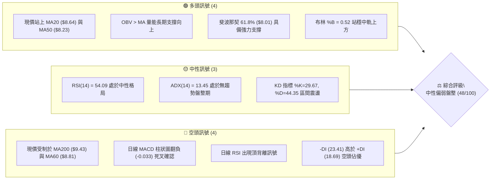
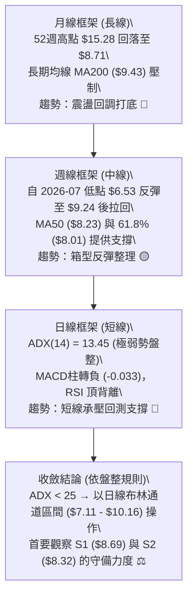
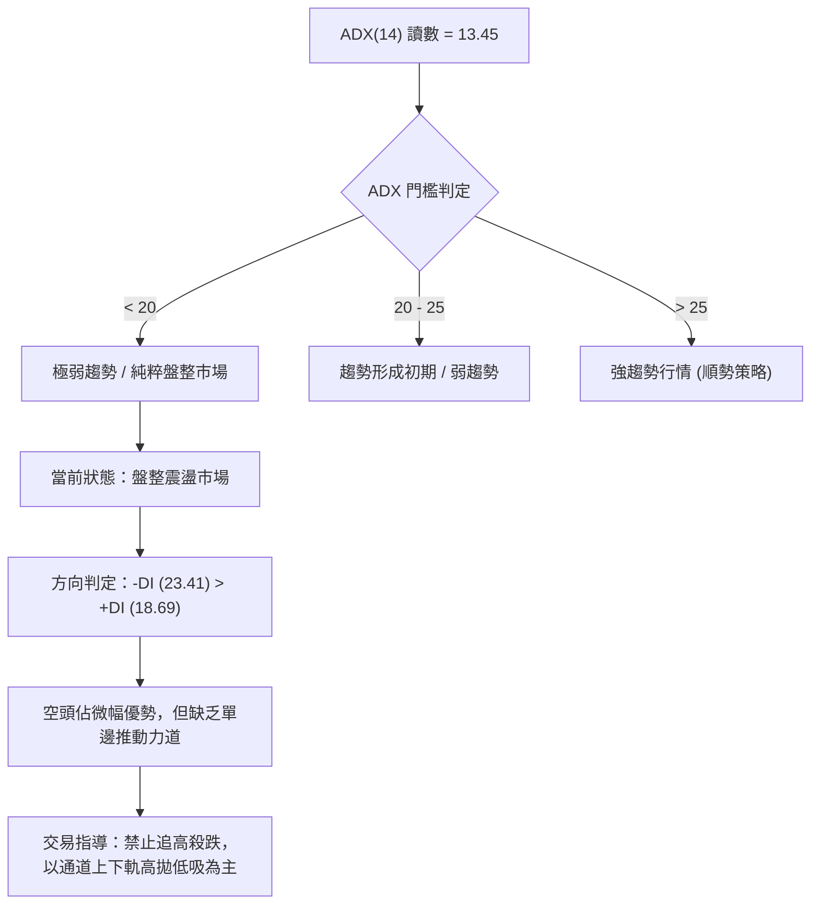
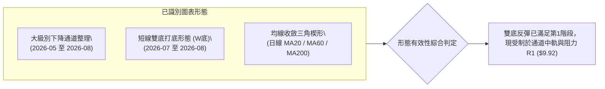
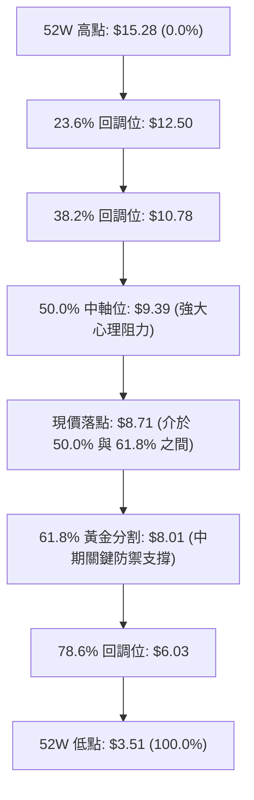
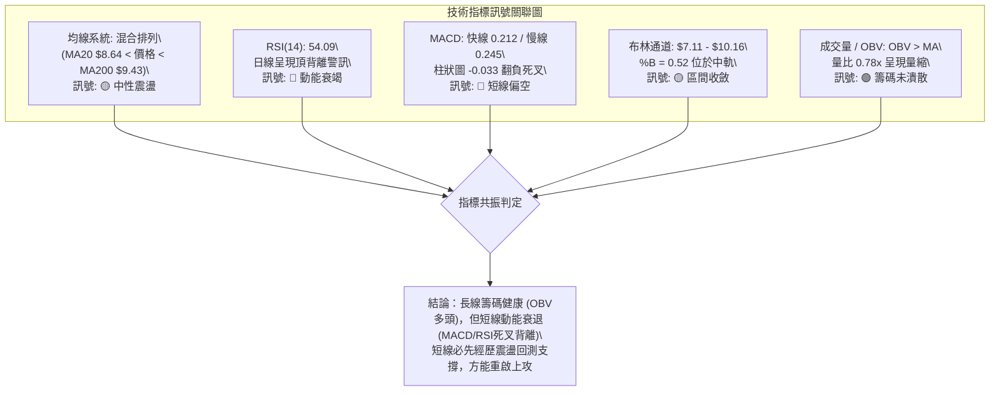
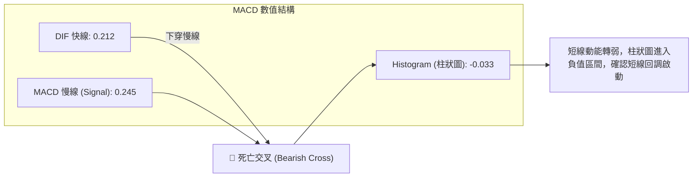
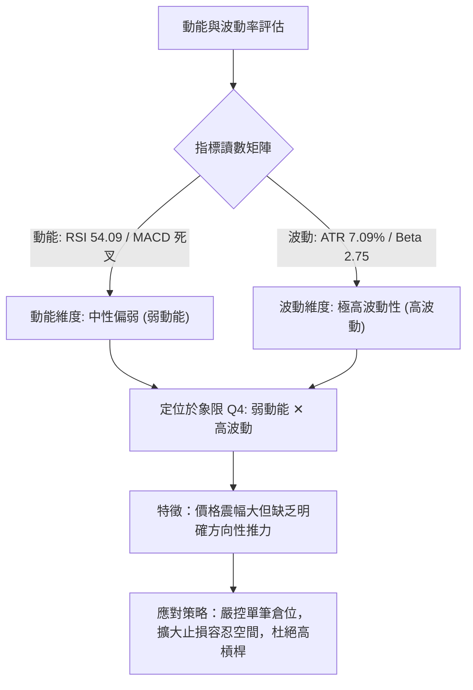
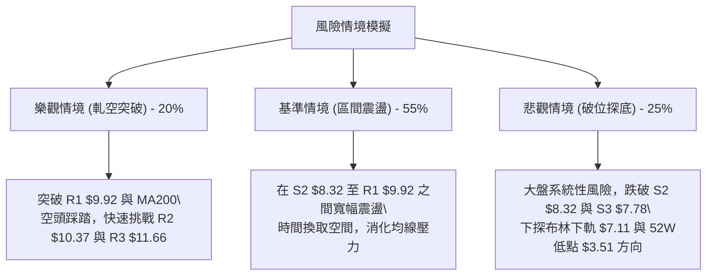

# ONDS 技術分析報告

> **報告日期**：2026-08-21 ｜ **語言**：繁體中文 ｜ **數據來源**：Yahoo Finance ｜ **當前價格**：$8.71

---

## 目錄

| 章節 | 內容 |
|------|------|
| [1. 技術面概覽](#1-技術面概覽) | 訊號儀表板、核心指標、評分卡 |
| [2. 趨勢分析](#2-趨勢分析) | 多時框趨勢、長中短期走勢 |
| [3. 圖表形態分析](#3-圖表形態分析) | 形態識別、K線組合、目標價 |
| [4. 支撐與阻力](#4-支撐與阻力) | 關鍵價位、斐波那契回調 |
| [5. 技術指標深度解讀](#5-技術指標深度解讀) | MA/RSI/MACD/布林/成交量 |
| [6. 動能與波動率](#6-動能與波動率) | 動能評估、ATR、Beta |
| [7. 多時框架總結](#7-多時框架總結) | 時框架評分矩陣 |
| [8. 交易策略建議](#8-交易策略建議) | 多空策略、風險報酬比 |
| [9. 風險提示與監控](#9-風險提示與監控) | 監控指標、風險場景 |
| [10. 報告總結](#-報告總結) | 核心結論與策略彙整 |

---

## 1. 技術面概覽

### 🎯 技術訊號儀表板



### 📊 核心指標速覽表

| 指標類別 | 指標名稱 | 當前數值 | 訊號 | 解讀 |
|----------|----------|----------|------|------|
| **價格** | 當前價格 | $8.71 | 🟡 | 位於52週區間 44.2%，處於震盪打底階段 |
| **均線** | MA20 | $8.64 | 🟢 | 價格在MA20上方 (+0.86%)，短線獲得微幅支撐 |
| **均線** | MA50 | $8.23 | 🟢 | 價格高於MA50 (+5.83%)，中期底部確立 |
| **均線** | MA200 | $9.43 | 🔴 | 價格在MA200下方 (-7.64%)，長期空頭壓制 |
| **均線** | 均線排列 | 混合排列 | 🟡 | 短均交錯、長均下壓，缺乏單向突破趨勢 |
| **動能** | RSI(14) | 54.09 | 🟡 | 位於 50 分水嶺附近，伴隨日線頂背離警訊 |
| **動能** | MACD (12,26,9) | 0.212 / 0.245 | 🔴 | 柱狀圖為 -0.033，快線下穿慢線形成短線死叉 |
| **動能** | Stoch %K / %D | 29.67 / 44.35 | 🟡 | 短線超賣回落，尚未出現金叉翻揚訊號 |
| **趨勢** | ADX(14) / DI | 13.45 | 🟡 | ADX < 25 極弱，-DI(23.41) > +DI(18.69) 空方微幅主導 |
| **通道** | Bollinger Bands | $7.11 - $10.16 | 🟡 | %B 為 0.52，現價緊貼中軌 $8.64 窄幅波動 |
| **量能** | 20日均量 / 成交量 | 58.49M / 75.14M | 🟡 | 量比 0.78x，量縮震盪整理格局 |
| **波動** | ATR(14) | $0.62 | 🔴 | 佔股價 7.09%，每日震幅大，風控難度高 |

### 🏆 技術評分卡

```
╔══════════════════════════════════════════════════════════════════╗
║              技術評分卡 — ONDS (2026-08-21)                      ║
╠══════════════════════════════════════════════════════════════════╣
║ 趨勢強度 (ADX=13.45)   ████░░░░░░░░░░░░░░░░  25/100 🔴 弱勢盤整  ║
║ 動能指標 (MACD/RSI)    ████████░░░░░░░░░░░░  40/100 🔴 頂背離壓制║
║ 支撐穩定度 (S1/S2/61.8)██████████████░░░░░░  70/100 🟢 下檔有撐  ║
║ 成交量配合 (OBV/量比)  ████████████░░░░░░░░  60/100 🟡 長多短縮  ║
║ 形態完整度 (箱型整理)  ██████████░░░░░░░░░░  50/100 🟡 未破通道  ║
║ 均線系統 (MA20/50/200) ████████░░░░░░░░░░░░  42/100 🔴 長線承壓  ║
╠══════════════════════════════════════════════════════════════════╣
║ 綜合評分               █████████░░░░░░░░░░░  48/100 🟡 中性盤整  ║
╚══════════════════════════════════════════════════════════════════╝
```

---

## 2. 趨勢分析

### 🌐 多時框趨勢分析



### 📈 長期趨勢 — 12個月走勢圖（Unicode）

```
ONDS 月線走勢圖（過去12個月：2025-09 至 2026-08）
價格軸 ($)
$13.22 ┤                                  ● (2026-05 波段高點)
$12.00 ┤                                 / \
$10.36 ┤                     ● (2026-01)  /   \
$10.00 ┤                    / \   ●      /     \
$8.71  ┤                   /   \ / \    /       \       ● (2026-08 現價 $8.71)
$7.72  ┤  ● (2025-09)     /     ●   \  /         \     / 
$6.44  ┤   \   ● (2025-11)/          \/           \   /
$5.86  ┤    \ /          /                        ● (2026-07 低點 $7.49)
       └──────────────────────────────────────────────────────────
         09  10  11  12  01  02  03  04  05  06  07  08 (月份)
```

#### 走勢特徵分析表格

| 階段區間 | 起止月份 | 價格區間 | 區間漲跌幅 | 核心技術特徵 |
|----------|----------|----------|------------|--------------|
| **第1階段：主升浪建立** | 2025-09 ~ 2026-01 | $7.72 → $10.36 | +34.20% | 均線多頭發散，成交量持續放大，推動股價突破兩位數 |
| **第2階段：高檔寬幅震盪** | 2026-01 ~ 2026-04 | $10.36 → $10.04 | -3.09% | 於 $9.04 ~ $10.36 構築高檔整理箱型，多空拉鋸 |
| **第3階段：衝高力竭回落** | 2026-04 ~ 2026-05 | $10.04 → $13.22 | +31.67% | 假突破衝刺至 $13.22，隨後遭遇高檔強烈獲利了結賣壓 |
| **第4階段：深度修正探底** | 2026-05 ~ 2026-07 | $13.22 → $7.49 | -43.34% | 連續單邊下挫，跌破 MA200，最低探至 2026-07-19 週收盤 $6.53 |
| **第5階段：打底低檔回升** | 2026-07 ~ 2026-08 | $7.49 → $8.71 | +16.29% | 觸底反彈重回 MA20 ($8.64)，目前進入收斂整理期 |

### 📊 中期趨勢（週線分析）

```
近20週關鍵價位與支撐阻力結構：
══════════════════════════════════════════════════════════════════
$13.22 ┤                                    ▲ 週線衝高頂點 (2026-05-31)
$11.66 ┤       阻力位 R3 ──────────────────────────── (波段高點聚類)
$10.37 ┤       阻力位 R2 ──────────────────────────── (箱型上緣壓制)
$9.92  ┤       阻力位 R1 ──────────────────────────── (布林上軌 / 頸線區)
$8.71  ┼───────► 當前收盤價 ($8.71) ◄────────────────
$8.69  ┤       支撐位 S1 ──────────────────────────── (MA20 / 立即支撐)
$8.32  ┤       支撐位 S2 ──────────────────────────── (波段低點聚類)
$7.78  ┤       支撐位 S3 ──────────────────────────── (箱型底部防線)
$6.53  ┤                                    ▼ 週線波段最低 (2026-07-19)
══════════════════════════════════════════════════════════════════
```

### ⚡ 趨勢強度評估（ADX 解讀）



| 指標變數 | 當前數值 | 參考門檻 | 技術解讀 |
|----------|----------|----------|----------|
| **ADX(14)** | 13.45 | 25.00 | 遠低於 25，表明市場缺乏明確單邊趨勢，屬於典型的區間震盪行情 |
| **+DI (14)** | 18.69 | -DI 比對 | 多頭進攻力道不足，低於空方力量 |
| **-DI (14)** | 23.41 | +DI 比對 | 空頭稍佔優勢，但未形成單邊主導趨勢 |
| **盤整判級** | 極度盤整 | ADX < 20 | 嚴格依循盤整收斂規則：以布林通道與關鍵支撐阻力為交易界限 |

---

## 3. 圖表形態分析

### 🔍 形態識別系統



#### 形態識別與信心度評估表

| 形態名稱 | 信心度 | 判斷依據（引用數據） | 完成度 | 目標價（附精確計算式） |
|----------|--------|----------------------|--------|------------------------|
| **潛在雙底形態 (W底)** | 68% | 2026-07-05 低點 $7.41 與 2026-08-02 低點 $7.49 形成兩次回踩不破（支撐聚類 S3 $7.78 / 斐波 61.8% $8.01 附近） | 85% | 頸線價位 $9.24 (2026-08-16收盤)<br>底部低點 $7.41<br>形態高度 = $9.24 - $7.41 = $1.83<br>目標價 = 頸線 $9.24 + $1.83 = **$11.07** |
| **大級別下降通道** | 72% | 自 2026-05 高點 $13.22 連續跌破週線支撐，高點逐步下移 ($13.22 → $10.43 → $9.24) | 90% | 通道上軌阻力落在 R1 ($9.92) 至 R2 ($10.37) 區間；突破上軌方能確認反轉 |
| **布林通道中軌窄幅擠壓** | 80% | 布林帶寬收縮，%B 落在 0.52，現價 $8.71 緊貼 MA20 ($8.64) 進行震盪 | 100% | 區間上軌目標 **$10.16**，下軌支撐 **$7.11** |

### 🕯️ 重要K線形態分析

| 週期/日期 | 收盤價 | K線形態特徵 | 技術解讀 | 訊號 |
|-----------|--------|-------------|----------|------|
| **2026-05-31** | $13.22 | 巨量衝高長上影線 (週量 5.67億股) | 典型的「力竭性高檔噴出」，主力大量派發獲利籌碼 | 🔴 |
| **2026-07-19** | $6.53 | 放量長下影十字星 (週量 6.71億股) | 「恐慌拋售盤 (Capitulation)」，底部承接力道湧現，確立波段低點 | 🟢 |
| **2026-07-26** | $7.80 | 實體大陽線多頭吞噬 (週量 8.34億股) | 「破底翻多頭確認」，創下歷史天量，確認中期底部形成 | 🟢 |
| **2026-08-16** | $9.24 | 縮量小陽線受阻於 MA200 | 上攻遇到長期均線 $9.43 阻力，追價買盤意願開始下降 | 🟡 |
| **2026-08-23** | $8.71 | 帶上影線的小陰線回調 | 短線多頭動能減弱，日線 MACD 出現死叉，進入回踩整固 | 🔴 |

### 📉 ASCII 走勢形態示意圖

```
雙底 (W-Bottom) 打底反彈與頸線受阻示意圖：

價格 ($)
$10.37 ┼────────────────────────────── 阻力 R2
       │
$9.92  ┼────────────────────────────── 阻力 R1 (W底目標延伸區間)
       │                  頸線 $9.24
$9.24  ┼─────────▲─────────▲────────── (2026-08-16 高點)
       │        / \       / \
$8.71  ┼───────/───\─────/───● 現價 ($8.71，拉回整理中)
       │      /     \   /
$8.01  ┼─────/───────\─/────────────── 斐波那契 61.8% 回調位
       │    /         ▼
$7.41  ┼───● (2026-07-05)  $7.49 (2026-08-02)
       │   【第1底 $7.41】   【第2底 $7.49】
       └────────────────────────────────────────────► 時間軸
```

---

## 4. 支撐與阻力

### 🗺️ 關鍵價位分布圖（Unicode）

```
ONDS 價位結構分布圖（引用 OHLCV 聚類與斐波那契位）
══════════════════════════════════════════════════════════════════
$15.28 ║██████████████████████████████║ 52週最高點 (0.0% 斐波回調)
$12.50 ║██████████████████████        ║ 斐波那契 23.6% 回調位
$11.66 ║████████████████████████████  ║ 強阻力 R3 (+33.93%)
$10.78 ║████████████████████          ║ 斐波那契 38.2% 回調位
$10.37 ║██████████████████████        ║ 阻力 R2 (+19.06%) / 近期高點聚類
$10.16 ║▓▓▓▓▓▓▓▓▓▓▓▓▓▓▓▓▓▓▓▓          ║ 布林通道上軌
$9.92  ║████████████████████████████  ║ 關鍵阻力 R1 (+13.95%) / 頸線密集區
$9.43  ║──────────────────────────────║ MA200 長期牛熊分界線
$9.39  ║████████████████              ║ 斐波那契 50.0% 中軸線
╠══════╬══════════════════════════════╣ ◄ 現價 $8.71 (處於 S1 與 MA60 間)
$8.69  ║▓▓▓▓▓▓▓▓▓▓▓▓▓▓▓▓▓▓▓▓▓▓▓▓▓▓▓▓  ║ 即時支撐 S1 (-0.23%) / MA20 ($8.64)
$8.32  ║██████████████████████        ║ 強支撐 S2 (-4.48%) / 近一年波段低點聚類
$8.01  ║████████████████████████████  ║ 斐波那契 61.8% 黃金分割強支撐
$7.78  ║██████████████████████████████║ 極強支撐 S3 (-10.68%) / 打底平台
$7.11  ║▓▓▓▓▓▓▓▓▓▓▓▓▓▓▓▓              ║ 布林通道下軌
$6.03  ║████████████                  ║ 斐波那契 78.6% 回調位
$3.51  ║██████████████████████████████║ 52週最低點 (100.0% 斐波回調)
══════════════════════════════════════════════════════════════════
```

### 🚧 阻力位分析表

| 阻力級別 | 精確價位 | 形成原因 | 突破難度 | 技術重要性 |
|----------|----------|----------|----------|------------|
| **阻力 R1** | **$9.92** | 近一年波段高點聚類密集區、接近布林上軌 ($10.16) | 🔴 高 | **極高**。此處為空頭關鍵防線，若放量突破代表底部箱型正式向上展開。 |
| **阻力 R2** | **$10.37** | 2026年1月與4月震盪平台頂部、波段高點聚類 | 🔴 高 | **高**。突破此位將確認雙底形態目標達成，並挑戰斐波 38.2% ($10.78)。 |
| **阻力 R3** | **$11.66** | 近一年波段高點次高聚類區間、接近 2026-05 起跌點 | 🔴 極高 | **中**。波段多頭的大目標，觸及將面臨大量解套賣壓。 |

### 🛡️ 支撐位分析表

| 支撐級別 | 精確價位 | 形成原因 | 守住機率 | 技術重要性 |
|----------|----------|----------|----------|------------|
| **支撐 S1** | **$8.69** | 近一年波段低點聚類、貼近 20日均線 MA20 ($8.64) | 🟡 60% | **中等**。短線多空分水嶺，跌破將引發向 MA50 與 S2 回踩。 |
| **支撐 S2** | **$8.32** | 近一年波段低點聚類、鄰近 MA50 ($8.23) | 🟢 75% | **極高**。中期多頭防守底線，此處具備強烈的買盤承接力道。 |
| **支撐 S3** | **$7.78** | 近一年波段低點聚類、接近 2026-07 破底翻放量平台 | 🟢 85% | **核心防線**。若實體跌破此位，宣告雙底形態失敗，重回空頭探底。 |

### 📐 斐波那契回調位分析

*以 52 週波動區間：低點 $3.51 (100.0%) 至 高點 $15.28 (0.0%) 計算*



- **當前位置解讀**：現價 **$8.71** 精準運行於 **50.0% 回調位 ($9.39)** 與 **61.8% 回調位 ($8.01)** 形成的「黃金緩衝區間」內。
- **技術意義**：
  1. 股價在 2026-07 跌破 61.8% ($8.01) 至 $6.53 後迅速發生「破底翻」重回 61.8% 之上，顯示 $8.01 是機構法人的強效買盤成本區。
  2. 上方 50.0% 回調位 **$9.39** 與 **MA200 ($9.43)** 高度重疊，構成共振阻力帶，解釋了股價近期在 $9.24 附近受阻拉回的量化原因。

---

## 5. 技術指標深度解讀

### 🎛️ 指標訊號總覽



### 📈 移動平均線排列分析

```
均線系統排列階梯圖：
══════════════════════════════════════════════════════════════════
$9.43 ─── MA200 (200日均線) ─── 🔴 價格下方 -7.64% (長期空頭分界)
$9.35 ─── MA120 (半年線) ────── 🔴 價格下方 -6.83%
$9.15 ─── MA240 (年線) ──────── 🔴 價格下方 -4.85%
$9.10 ─── MA10  (10日均線) ──── 🔴 價格下方 -4.31% (短線反壓)
$8.81 ─── MA5 / MA60 (季線) ─── 🔴 價格下方 -1.14% (即時壓制)
──────────────────────────────────────────────────────────────────
$8.71 ───► 當前收盤價 ◄───
──────────────────────────────────────────────────────────────────
$8.64 ─── MA20  (月線) ──────── 🟢 價格上方 +0.86% (短線支撐)
$8.23 ─── MA50  (中期均線) ──── 🟢 價格上方 +5.83% (中期支撐)
══════════════════════════════════════════════════════════════════
```

- **均線排列狀態**：當前呈現「上下夾心」的混合排列格局。
  - **下方支撐層**：MA20 ($8.64) 與 MA50 ($8.23) 呈現黃金交叉向上發散，提供堅實的中短期底部支撐。
  - **上方壓制層**：MA5 ($8.81)、MA10 ($9.10) 短期均線向下勾頭，且上方籠罩 MA200 ($9.43) 與 MA120 ($9.35) 的長期重壓。
  - **均線結論**：在突破 MA200 前，均線系統不具備單邊多頭條件，仍定義為「反彈遇阻的區間震盪」。

### 📉 RSI(14) 分析

```
RSI(14) 指標儀表板：
超賣區 (0-30)          中性平衡區 (30-70)          超買區 (70-100)
├──────────────────────┼───────────●──────────────┼────────────────┤
0                      30         54.09           70              100
進度條：███████████████████████████░░░░░░░░░░░░░ 54.09% (中性偏多)
```

- **背離分析（Bearish Divergence）**：
  - **價格走勢**：股價自 2026-08-09 的 $9.11 上推至 2026-08-16 的 $9.24，創下反彈新高。
  - **RSI 走勢**：RSI(14) 讀數卻由 2026-08-09 的 **70.3** 驟降至 2026-08-16 的 **60.5**，並進一步下滑至當前的 **54.09**。
  - **背離結論**：明確構成**日線級別「頂背離 (Bearish Divergence)」**。這表明近期價格創高屬於動能減弱的「虛拉」，預示短線價格將面臨回調修復壓力，需提防向支撐位回測。

### 📊 MACD(12/26/9) 訊號解讀



- **MACD 深度解讀**：
  - DIF (0.212) 與 Signal (0.245) 均位於零軸之上，代表中線仍處於多頭控制的修復領域。
  - 然而，Histogram 柱狀圖由前週的 +0.171 翻負至 **-0.033**，形成高檔死叉。
  - 此訊號與日線 RSI 頂背離產生**共振確認**，宣告自 $6.53 以來的第1波急速反彈正式告一段落，進入第2波回調整固。

### 📦 布林通道分析

```
布林通道 (Bollinger Bands 20,2) 結構圖：
══════════════════════════════════════════════════════════════════
$10.16 ┬────────────────────────────────────────── 布林上軌 (Upper Band)
       │
$9.40  ┼─────────────────── 阻力帶 (MA200 / 斐波 50.0%)
       │
$8.71  ┼───────────────► 現價 $8.71 (%B = 0.52) ◄──────────────
$8.64  ┼────────────────────────────────────────── 布林中軌 (MA20)
       │
$7.80  ┼─────────────────── 支撐平台 (S3 $7.78 / 斐波 61.8% $8.01)
       │
$7.11  ┴────────────────────────────────────────── 布林下軌 (Lower Band)
══════════════════════════════════════════════════════════════════
```

- **帶寬與位置**：通道寬度為 $3.05 ($10.16 - $7.11)，帶寬逐步收窄，顯示波動率進入沉澱期。
- **%B 指標解析**：%B = 0.52，精確坐落於中軌 $8.64 略上方。
- **操作涵義**：現價處於通道中心位置，未觸及超買 (上軌) 或超賣 (下軌)，符合 ADX=13.45 的盤整特徵；在突破 $10.16 或跌破 $7.11 前，通道內部操作以「逢高近上軌減碼、逢低近下軌吸納」為原則。

### 💹 成交量分析（量價配合度）

```
成交量結構對比：
最新成交量 (58.49M)   ████████████░░░░░░░░  (量比: 0.78x)
20日均量   (75.14M)   ████████████████░░░░
50日均量   (86.84M)   ████████████████████
```

- **量價關係解讀**：
  1. **短線量縮回調**：最新成交量 58.49M 縮減至 20日均量的 78%，呈現「上漲帶量、回調量縮」的良性量價配合，表明市場殺跌意願不強，非主力出逃。
  2. **OBV 趨勢確認**：指標顯示「**OBV > MA**」，資金流向指標維持向上擴張，顯示 2026-07 歷史天量 (8.34億股) 進場的機構籌碼並未在大跌中退場，籌碼鎖定度優良。
  3. **量價結論**：短線受限於均量不足，難以一舉衝破阻力 R1 ($9.92) 與 MA200，必須透過時間換取空間在 MA20 上方補量。

---

## 6. 動能與波動率

### ⚡ 動能評估四象限



#### 動能評估四象限分析表

| 象限 | 動能強度 | 波動率水準 | 當前狀態 | 策略指導 |
|------|----------|------------|----------|----------|
| **Q1 (強動能 / 低波動)** | 強 | 低 | — | 最佳趨勢加碼點，可重倉順勢跟隨 |
| **Q2 (弱動能 / 低波動)** | 弱 | 低 | — | 狹幅沉悶盤整，謹慎觀望等待變盤 |
| **Q3 (強動能 / 高波動)** | 強 | 高 | — | 爆發性突破行情，高風險高收益 |
| **Q4 (弱動能 / 高波動)** | **弱** | **高** | **✓ (當前定位)** | **高風險震盪期。易遭雙向洗盤，必須縮小倉位、拉開止損間距** |

### 📊 ATR 波動率分析

- **ATR(14) 數值**：**$0.62**
- **價格佔比**：佔現價 $8.71 的 **7.09%**（屬於極高波動標的）。
- **風控與止損計算**：
  - **1.5 × ATR (短線止損距離)**：$0.62 × 1.5 = **$0.93**
  - **2.0 × ATR (波段止損距離)**：$0.62 × 2.0 = **$1.24**
  - **動態交易指導**：由於每日平均震幅高達 $0.62，任何窄於 $0.60 的止損設置均極易被市場雜訊無效掃出場。若在現價 $8.71 進場，技術止損點必須設定在 S2 ($8.32) 或 S3 ($7.78) 等關鍵結構位，而非微幅價位。

### 📐 Beta 與市場相關性

- **Beta 係數**：**2.75**（超高 Beta 股）
- **市場特徵分析**：
  - ONDS 的波動幅度約為標普500指數的 **2.75 倍**。在大盤上漲時具備強大的超額收益 (Alpha) 爆發力，但在大盤回調時亦會放大下行風險。
  - **空頭部位佔比 (Short % Float)**：高達 **41.5%**，Short Ratio 為 2.24。
  - **軋空潛力 (Short Squeeze)**：極高的空單比例意味著若股價後續帶量突破關鍵阻力 R1 ($9.92) 與 MA200 ($9.43)，極易觸發空頭停損引發猛烈的軋空爆發行情。

---

## 7. 多時框架總結

### 📋 時框架評分表

| 時框架 | 趨勢方向 | 動能狀態 | 均線排列 | 圖表形態 | 綜合評分 | 操作建議 |
|--------|----------|----------|----------|----------|----------|----------|
| **月線 (長期)** | 🔴 震盪回調 | 🟡 中性 (MACD收斂) | 🔴 承壓於 MA200 ($9.43) | 52週高點回落打底 | **42/100** | 長線資金分批低吸，不追高 |
| **週線 (中期)** | 🟡 箱型反彈 | 🟢 偏多 (OBV量能充足) | 🟢 站穩 MA50 ($8.23) | 雙底 (W底) 構築中 | **62/100** | 逢拉回支撐尋找做多機會 |
| **日線 (短期)** | 🔴 短線回踩 | 🔴 看空 (MACD死叉/背離) | 🟡 混合 (MA20有撐/MA60壓制)| 布林中軌收斂震盪 | **45/100** | 等待回踩完成訊號，暫勿追多 |

### 🔲 綜合訊號矩陣

```
╔════════════════════════════════════════════════════════════════════════════╗
║                      ONDS 多時框技術訊號共振矩陣                           ║
╠══════════════╦══════════════════╦══════════════════╦═══════════════════════╣
║ 分析維度     ║ 短期 (日線)      ║ 中期 (週線)      ║ 長期 (月線)           ║
╠══════════════╬══════════════════╬══════════════════╬═══════════════════════╣
║ 趨勢狀態     ║ 🔴 弱勢震盪      ║ 🟡 箱型反彈      ║ 🔴 深度修正後打底     ║
║ 動能指標     ║ 🔴 MACD/RSI 頂背離║ 🟢 RSI 向上修復  ║ 🟡 零軸附近修復       ║
║ 均線架構     ║ 🟡 站上 MA20     ║ 🟢 站上 MA50     ║ 🔴 受制 MA200         ║
║ 量能配合     ║ 🟡 成交量縮      ║ 🟢 週線爆天量支撐║ 🟢 OBV 長多趨勢       ║
║ 關鍵位置     ║ 緊貼中軌 $8.64   ║ 守住 61.8% $8.01 ║ 52週區間 44.2%        ║
╚══════════════╩══════════════════╩══════════════════╩═══════════════════════╝
```

### ⚖️ 多時框收斂結論

> **收斂規則執行（依嚴格要求 14）**：
> 1. **趨勢/盤整判定**：當前 ADX(14) = **13.45 (< 25)**，明確判定為**無趨勢的盤整行情**。
> 2. **主導規則**：盤整行情以日線布林通道區間與波段支撐阻力為主導，忽視順勢突破模型。
> 3. **衝突收斂**：日線短線動能頂背離（偏空）與週線打底反彈（偏多）產生衝突。依優先級收斂，短線日線死叉將引導價格**回測中期支撐 S1 ($8.69) 至 S2 ($8.32)**，但中線籌碼未破壞。
> 4. **唯一方向性結論**：**中性偏弱觀望，等待回踩支撐確認（中性評級 48/100）**。

---

## 8. 交易策略建議

### 🗺️ 策略決策流程圖

```mermaid
graph TD
    START["當前價格: $8.71 (評分 48/100: 中性盤整)"] --> CHOOSE{"策略路由決策"}
    
    CHOOSE -->|"首選方案: 逢低吸納"| STRAT_A["策略 A: 支撐位回踩低吸策略 (主推)"]
    CHOOSE -->|"次選方案: 突破進場"| STRAT_B["策略 B: 關鍵阻力突破動能策略"]
    
    STRAT_A --> COND_A["回踩 S2 ($8.32) 或 MA20 ($8.64) 企穩"]
    COND_A --> EXEC_A["進場: $8.35 |" 止損: $7.70 "| 目標: R1 $9.92 / R2 $10.37"]
    
    STRAT_B --> COND_B["日線放量收盤突破 R1 ($9.92) 與 MA200 ($9.43)"]
    COND_B --> EXEC_B["進場: $9.95 |" 止損: $8.65 "| 目標: R2 $10.37 / R3 $11.66"]
```

### 🧭 策略路由

**當前主策略方向 = 中性區間操作，以逢回調吸納為主（依評分卡 48/100，介於 40–60 區間）**  
當前不宜在現價 $8.71 追價，因面臨日線頂背離與 MA5/MA10 下壓。交易策略嚴格鎖定「**支撐位掛單低吸**」或「**確認放量突破阻力後追隨**」。

### 🎯 價格情境階梯（Price Scenarios）

| 觸發條件 | 第一目標 | 第二目標 | 後續延伸 | 情境含義與操作指引 |
|----------|----------|----------|----------|--------------------|
| **放量突破 R1 $9.92** | R2 $10.37 | R3 $11.66 | 挑戰 $12.50 (23.6%) | **多頭突破展開**：確認雙底頸線突破與軋空啟動，全面轉多。 |
| **維持 $8.32 ~ $9.43** | — | — | — | **區間震盪整理**：布林帶內來回穿梭，適合高拋低吸網格交易。 |
| **實體跌破 S1 $8.69** | S2 $8.32 | 斐波 $8.01 | S3 $7.78 | **短線走弱回踩**：MACD 死叉發酵，尋求中期 MA50 與平台支撐。 |
| **放量跌破 S3 $7.78** | $7.11 (BB下軌) | $6.03 (78.6%) | $3.51 (52W低點) | **形態破位下行**：打底失敗，多頭停損，觸發停損機制。 |

### 📊 情境機率分佈

```
情境機率分佈圓盤示意：
回踩支撐後區間反彈 (55%) ██████████████████████░░░░░░░░░░░░░░░░░░
向下破位重回探底   (25%) ██████████░░░░░░░░░░░░░░░░░░░░░░░░░░░░░░
直接放量向上突破   (20%) ████████░░░░░░░░░░░░░░░░░░░░░░░░░░░░░░░░
```

| 情境劇本 | 估計機率 | 主要技術依據 |
|----------|----------|--------------|
| **劇本一：回踩支撐後反彈 (主情境)** | **55%** | OBV 長多趨勢未變、週線守穩 MA50 ($8.23) 與斐波 61.8% ($8.01)，回踩 S2 ($8.32) 具強烈買盤支撐。 |
| **劇本二：跌破支撐再探底 (風險情境)** | **25%** | 日線 MACD 翻負死叉、RSI 頂背離壓制，若大盤走弱可能引發 High-Beta (2.75) 劇烈下殺至 S3 ($7.78)。 |
| **劇本三：直接放量突破向上 (強多情境)** | **20%** | Short Float 達 41.5%，若有突發利多引發軋空，將直接跳空突破 R1 ($9.92) 與 MA200 ($9.43)。 |

### 🟢 主策略詳情（區間與突破策略）

| 策略要素 | 策略 A：支撐位低吸策略 (首選主推) | 策略 B：阻力突破動能策略 (右側確認) |
|----------|------------------------------------|--------------------------------------|
| **策略類型** | 左側逢低吸納 (Mean Reversion) | 右側順勢突破 (Breakout Momentum) |
| **進場條件** | 股價回踩 S2 ($8.32) 附近出現止跌K線 | 日線放量收盤確認突破 R1 ($9.92) 且成交量 > 75M |
| **精確進場點** | **$8.35** (S2 $8.32 支撐上方) | **$9.95** (突破 R1 $9.92 後回踩確認) |
| **目標價 T1** | **$9.92** (阻力 R1 / 頸線位) | **$10.37** (阻力 R2 / 雙底目標延伸) |
| **目標價 T2** | **$10.37** (阻力 R2 / 箱型上緣) | **$11.66** (強阻力 R3) |
| **止損價格** | **$7.70** (跌破支撐 S3 $7.78 止損) | **$8.65** (跌破 MA20 / 支撐 S1 $8.69 止損) |
| **風險報酬比** | **1 : 3.11** (風險 $0.65 vs 目標2 收益 $2.02) | **1 : 1.31** (目標1) / **1 : 1.70** (目標2) |
| **模型成功率** | **65%** (在盤整市場回踩強支撐勝率較高) | **50%** (受制於 ADX < 25 假突破風險) |
| **建議倉位** | **8% - 10%** (總資金佔比) | **5% - 8%** (分批加碼建立) |

### 🔴 反向風險觸發點（對沖提示）

- **多頭停損與轉空觸發點**：若日線實體收盤**跌破 S3 ($7.78)** 且成交量放大，代表雙底支撐徹底失效，多頭部位應全面離場，甚至可反手建立輕倉對沖空單，目標下看布林下軌 **$7.11** 及斐波 78.6% **$6.03**。
- **空頭軋空警戒觸發點**：若股價無預警放量突破 **MA200 ($9.43)** 並站上 **R1 ($9.92)**，空頭部位必須立即平倉止損，防止 41.5% Short Float 觸發連鎖軋空。

### ⭐ 整體訊號強度評星

```
╔══════════════════════════════════════════════════════════════════╗
║ 做多訊號強度：  ★★☆☆☆  (2.5/5 星 — 需等待回踩打底完成)          ║
║ 做空訊號強度：  ★★☆☆☆  (2.0/5 星 — 下方 S2/S3 支撐強勁)          ║
║ 區間操作勝率：  ★★★★☆  (4.0/5 星 — 適合布林通道與關鍵位高拋低吸)  ║
║ 總體技術可信度：★★★☆☆  (3.5/5 星 — 盤整期需尊重區間邊界)        ║
╚══════════════════════════════════════════════════════════════════╝
```

---

## 9. 風險提示與監控

### ✅ 關鍵監控指標 Checklist

```
╔══════════════════════════════════════════════════════════════════╗
║                   ONDS 關鍵技術指標監控清單                      ║
╠══════════════════════════════════════════════════════════════════╣
║ [ ] 價格是否跌破即時支撐 S1 ($8.69) 與 MA20 ($8.64)              ║
║ [ ] MACD Histogram 柱狀圖是否持續擴大負值 (<-0.050)              ║
║ [ ] 股價回踩 S2 ($8.32) / MA50 ($8.23) 時是否有下影線買盤承接    ║
║ [ ] 成交量是否在回調時持續萎縮 (< 50M) 或在突破時放大 (> 85M)    ║
║ [ ] RSI(14) 是否在 45-50 區域止跌回升，化解日線頂背離壓力        ║
║ [ ] 軋空監控：Short Float 41.5% 是否出現異常快速回補跡象         ║
╚══════════════════════════════════════════════════════════════════╝
```

### ⚠️ 風險場景分析



### 🛡️ 風險管理重要提醒

1. **Beta 放大效應風險 (Beta = 2.75)**：
   - ONDS 屬於極高波動標的，每日波動 ATR 達 $0.62 (7.09%)。在美股大盤震盪劇烈時期，該股單日漲跌幅極易超過 10%。
   - **倉位控制**：單一標的倉位嚴格限制在總投資組合的 **5% - 10% 以內**，嚴禁重倉孤注一擲。
2. **高放空比率雙刃劍 (Short % Float = 41.5%)**：
   - 超過 40% 的放空比率意味著市場存在極大的基本面多空分歧。雖然具備強大的軋空爆發力，但在流動性收緊或財報利空時，亦會加劇斷崖式下跌風險。
3. **止損紀律執行**：
   - 務必將止損點設於結構性關鍵價位（如 S3 $7.78 外部），一旦觸發條件嚴格停損，杜絕「短線套牢變長線攤平」的非理性操作。

---

## 📋 報告總結

```
╔══════════════════════════════════════════════════════════════════╗
║                     ONDS 技術分析報告總結                        ║
╠══════════════════════════════════════════════════════════════════╣
║ 報告日期：2026-08-21               當前價格：$8.71               ║
║ 分析評級：⚖️ 中性觀望 / 區間操作 (綜合評分: 48/100)              ║
╠══════════════════════════════════════════════════════════════════╣
║ 關鍵維度結論：                                                   ║
║ ├─ 長期趨勢：🔴 弱勢，受制於 MA200 ($9.43) 與斐波 50% ($9.39)   ║
║ ├─ 中期趨勢：🟢 偏多，自 $6.53 爆量反彈，守穩 MA50 ($8.23)      ║
║ ├─ 短期趨勢：🔴 回調，日線 RSI 頂背離 + MACD 柱狀圖翻負死叉     ║
║ ├─ 關鍵支撐：S1 $8.69 │ S2 $8.32 │ S3 $7.78 │ 斐波61.8% $8.01  ║
║ ├─ 關鍵阻力：R1 $9.92 │ R2 $10.37 │ R3 $11.66 │ MA200 $9.43   ║
║ └─ 機構共識：Strong Buy (9位分析師) │ 平均目標價：$19.42       ║
╠══════════════════════════════════════════════════════════════════╣
║ 最優策略組合：                                                   ║
║ 1. 🥇 最佳機會（低吸）：回踩 S2 $8.35 進場，止損 $7.70，目標 $9.92║
║ 2. 🥈 次選機會（突破）：突破 R1 $9.95 進場，止損 $8.65，目標 $10.37║
║ 3. 🥉 保守選擇：空手觀望，等待日線 MACD 重新金叉與站穩 MA200    ║
╚══════════════════════════════════════════════════════════════════╝
```

---

> ⚠️ **免責聲明**：本報告為技術分析研究成果，所有數據及價位均基於歷史價格與量化指標推算。本報告**僅供研究與學術參考**，**不構成任何投資建議或買賣推薦**。金融市場投資具有極高風險，投資人應獨立評估自身風險承受能力並自負盈虧。

---

*報告生成時間：2026-08-21 ｜ 數據來源：Yahoo Finance ｜ 分析框架：多時框圖表形態與量化指標系統*