# ONDS 技術分析報告

> **報告日期**：2026-08-22 ｜ **語言**：繁體中文 ｜ **數據來源**：Yahoo Finance ｜ **當前價格**：$8.71

---

## 目錄

| 章節 | 內容 |
|------|------|
| [1. 技術面概覽](#1-技術面概覽) | 訊號儀表板、核心指標、評分卡 |
| [2. 趨勢分析](#2-趨勢分析) | 多時框趨勢、長中短期走勢 |
| [3. 圖表形態分析](#3-圖表形態分析) | 形態識別、K線組合、目標價 |
| [4. 支撐與阻力](#4-支撐與阻力) | 關鍵價位、斐波那契回調 |
| [5. 技術指標深度解讀](#5-技術指標深度解讀) | MA/RSI/MACD/布林/成交量 |
| [6. 動能與波動率](#6-動能與波動率) | 動能評估、ATR、Beta |
| [7. 多時框架總結](#7-多時框架總結) | 時框架評分矩陣 |
| [8. 交易策略建議](#8-交易策略建議) | 多空策略、風險報酬比 |
| [9. 風險提示與監控](#9-風險提示與監控) | 監控指標、風險場景 |

---

## 1. 技術面概覽

### 🎯 技術訊號儀表板

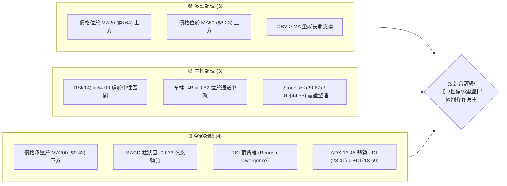

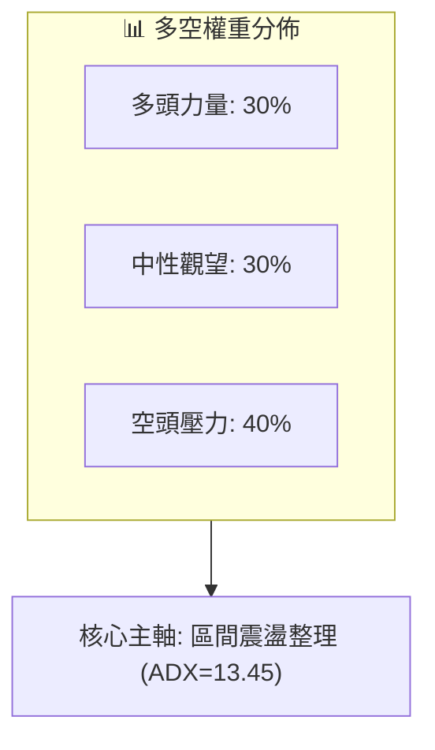

### 📊 核心指標速覽表

| 指標類別 | 指標名稱 | 當前數值 | 訊號 | 解讀 |
|:---|:---|:---|:---:|:---|
| **價格** | 當前價格 | $8.71 | 🟡 | 位於52週區間 44.2%，處於近期回檔後的震盪整固期 |
| **均線** | MA20 | $8.64 | 🟢 | 現價微幅高於短期月線 (+0.86%)，提供短線動態支撐 |
| **均線** | MA50 | $8.23 | 🟢 | 現價高於中期均線 (+5.83%)，中期波段多頭架構未破 |
| **均線** | MA200 | $9.43 | 🔴 | 現價低於長期牛熊分界線 (-7.64%)，長期均線形成主要壓制 |
| **動能** | RSI(14) | 54.09 | 🟡 | 數值落於50中軸上方，但日線與週線出現頂背離警告訊號 |
| **動能** | MACD(12,26,9) | 0.212 / 0.245 | 🔴 | MACD線跌破訊號線，柱狀圖為 -0.033，動能偏弱看空 |
| **動能** | 隨機指標 (Stoch) | 29.67 / 44.35 | 🟡 | %K 位於超賣邊緣，短線動能放緩，未形成強勢金叉 |
| **趨勢** | ADX (14) | 13.45 | 🟡 | 數值遠低於25，無明顯單邊趨勢，屬於標準無方向盤整市 |
| **方向** | 方向性指標 (+/-DI)| 18.69 / 23.41 | 🔴 | -DI 高於 +DI，空方力量短線略佔上風 |
| **通道** | 布林通道 (%B) | 0.52 (軌道 $7.11-$10.16) | 🟡 | 價格緊貼中軌 $8.64 運作，通道寬度擴張後收斂 |
| **量能** | 最新量 / 20日均量| 58.55M / 75.14M (0.78x)| 🟡 | 量縮整理，市場追價意願不足，成交量處於沉澱階段 |
| **波動** | ATR(14) | $0.62 (7.09%) | 🔴 | 波動度高，日均震幅達 7% 以上，需嚴格設定停損 |

### 🏆 技術評分卡

```
╔══════════════════════════════════════════════════════════════╗
║                技術評分卡 — ONDS (2026-08-22)                ║
╠══════════════════════════════════════════════════════════════╣
║ 趨勢強度 (ADX/方向)   ██████░░░░░░░░░░░░░░  30/100   🔴 弱勢 ║
║ 動能指標 (RSI/MACD)   ████████░░░░░░░░░░░░  40/100   🔴 轉弱 ║
║ 支撐穩定度 (S1-S3/MA) ██████████████░░░░░░  70/100   🟢 良好 ║
║ 成交量配合 (OBV/量比) ██████████░░░░░░░░░░  50/100   🟡 中性 ║
║ 形態完整度 (區間整理) ████████████░░░░░░░░  60/100   🟡 普通 ║
║ 均線系統 (排列狀態)   ████████░░░░░░░░░░░░  40/100   🔴 糾纏 ║
╠══════════════════════════════════════════════════════════════╣
║ 綜合技術評分          ██████████░░░░░░░░░░  48/100   ⚖️ 中性 ║
╚══════════════════════════════════════════════════════════════╝
```

---

## 2. 趨勢分析

### 🌐 多時框趨勢分析

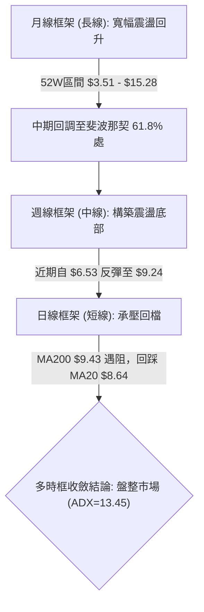

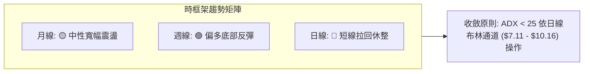

### 📈 長期趨勢 — 12個月走勢圖（Unicode）

```
ONDS 月線收盤走勢圖（2025-08 至 2026-08）
價格軸 ($)
$14.00 ┤                                        ● $13.22 (2026-05)
$12.00 ┤
$10.00 ┤                                ●  ●        ●  ● $10.04
$8.00  ┤          ● $7.72     ● $7.90  $10.36   $9.04     ● $8.24  ● $8.71 (現價)
$6.00  ┤ ● $5.86         ● $6.44                                ● $7.49
$4.00  ┤
$2.00  ┤
       └────┬──────┬──────┬──────┬──────┬──────┬──────┬──────┬──────┬──────┬──────┬──────┬────
          08/25  09/25  10/25  11/25  12/25  01/26  02/26  03/26  04/26  05/26  06/26  07/26  08/26
```

#### 走勢特徵分析表格

| 階段區間 | 起始價 → 結束價 | 期間漲跌幅 | 主要走勢特徵與量價解讀 |
|:---|:---:|:---:|:---|
| **2025-08 ~ 2026-01** | $5.86 → $10.36 | **+76.79%** | 主升浪啟動，基本面轉機與營收爆發推動股價連續走高。 |
| **2026-01 ~ 2026-04** | $10.36 → $10.04 | **-3.09%** | 高位矩形箱型整理，於 $9.04 至 $10.36 區間充分換手。 |
| **2026-05 (衝高見頂)**| $10.04 → $13.22 | **+31.67%** | 爆量突破衝高至 52W 高點 $15.28 附近，月收 $13.22，留長上影線。 |
| **2026-06 ~ 2026-07** | $13.22 → $7.49 | **-43.34%** | 獲利了結賣壓湧現，價格單邊快速回調，跌破斐波那契 50.0% ($9.39)。 |
| **2026-08 (當前)**    | $7.49 → $8.71 | **+16.29%** | 觸及波段低點 $6.53 後強勢止跌回升，目前於 MA20 處尋求支撐。 |

### 📊 中期趨勢（週線分析）

```
ONDS 週線價格結構與關鍵支撐阻力示意圖
══════════════════════════════════════════════════════════════════
 10.37  ──────┬─────────────────────────── [R2 阻力區間]
              │          ▲ 5/31 衝高 $13.22
  9.92  ──────┼─────────[R1 阻力]───────── (8/16 觸及 $9.24 遇阻)
  9.43  ──────┼─────────[MA200 長期均線]───
  8.71  ══════╪═════════[現價位置]═════════
  8.69  ──────┼─────────[S1 關鍵支撐]────── (MA20 $8.64 匯聚)
  8.32  ──────┼─────────[S2 強支撐]──────── (MA50 $8.23 匯聚)
  7.78  ──────┴─────────────────────────── [S3 波段防守點]
══════════════════════════════════════════════════════════════════
```

近20週數據顯示，股價在 2026-07-19 當週創下 $6.53 的波段低點後，連續三週放量反彈（週量分別達到 671M、834M、380M），推動股價反彈至 2026-08-16 當週的 $9.24。然而，8月第3週收盤回落至 $8.71，MACD 週線柱狀圖由正轉負（-0.033），週線 RSI 降至 54.1，顯示中期反彈在遭遇 MA200 ($9.43) 及斐波那契 50% ($9.39) 雙重壓力後動能減弱。

### ⚡ 趨勢強度評估（ADX 解讀）

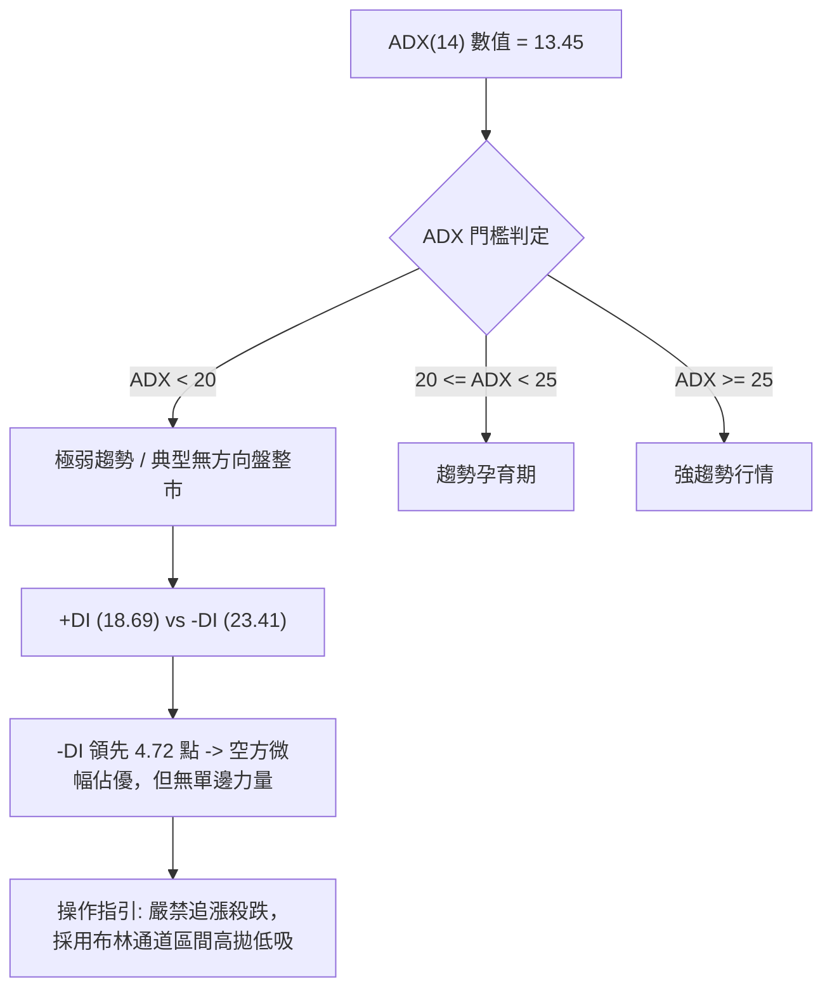

| 指標參數 | 數值 | 狀態 | 意涵解讀 |
|:---|:---:|:---:|:---|
| **ADX (14)** | 13.45 | 弱勢/無趨勢 (極低) | 數值低於 20，意味市場處於方向不明的洗盤與築底階段。 |
| **+DI** | 18.69 | 多頭動能偏弱 | 多方主動進攻意願低，未形成單邊推升波浪。 |
| **-DI** | 23.41 | 空頭動能佔優 | 空方雖佔優勢但未突破 25，未形成單邊恐慌性殺跌。 |
| **市場狀態分類** | **寬幅震盪整理** | 盤整市優先 | 不適用突破順勢交易，應以區間邊界（支撐/阻力）為基準。 |

---

## 3. 圖表形態分析

### 🔍 形態識別系統

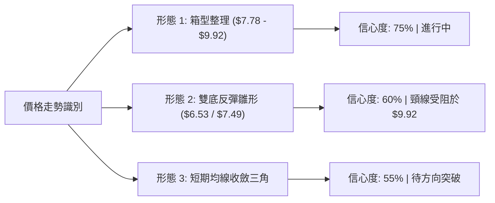

#### 形態信心度與目標價計算表

| 識別形態 | 信心度 | 判斷依據（引用精確數據） | 完成度 | 目標價（附嚴格計算式） |
|:---|:---:|:---|:---:|:---|
| **箱型整理區間** | **75%** | 上軌阻力受限於 R1 $9.92，下軌支撐受限於 S3 $7.78，近4週於區間內反覆震盪。 | 70% | 向上突破 R1 ($9.92)：<br>`$9.92 + ($9.92 - $7.78) = $12.06`<br>向下跌破 S3 ($7.78)：<br>`$7.78 - ($9.92 - $7.78) = $5.64` |
| **潛在雙底反彈** | **60%** | 第一低點為 2026-07-19 的 $6.53，第二低點為 2026-08-02 的 $7.49，頸線位於 R1 $9.92。 | 50% | 若有效突破頸線 R1 ($9.92)：<br>`形態高度 = $9.92 - $6.53 = $3.39`<br>`理論目標價 = $9.92 + $3.39 = $13.31` |
| **短期收斂三角** | **55%** | 自 2026-05 高點 $13.22 下降趨勢線與自 $6.53 上升支撐線於 $8.71 處匯聚。 | 85% | 突破方向未明；若向上突破則測試 R2 $10.37，跌破則測試 S2 $8.32。 |

### 🕯️ 重要K線形態分析

| 日期/月份 | 收盤價 | K線形態 | 量能狀態 | 技術解讀與訊號指示 |
|:---|:---:|:---|:---:|:---|
| **2026-05-31** | $13.22 | **長上影大陽線** | 566.99M (巨量) | 🟢/🔴 衝高至 $15.28 後遭遇強大獲利回吐賣壓，形成波段見頂信號。 |
| **2026-07-19** | $6.53 | **極長下影線 (鐵鎚線)**| 671.52M (爆量) | 🟢 恐慌盤湧出後主力資金強力介入接盤，確認 $6.53 為中期底部。 |
| **2026-07-26** | $7.80 | **大陽線反包** | 834.31M (歷史天量)| 🟢 多頭主力放量拉升，確認 $6.53 底部有效性，開啟反彈波段。 |
| **2026-08-16** | $9.24 | **流星線 (倒錘頭)** | 471.59M (放量) | 🔴 上攻 MA200 ($9.43) 及阻力 R1 ($9.92) 未果，短線動能衰竭。 |
| **2026-08-23** | $8.71 | **回調中陰線** | 348.37M (量縮) | 🟡 回踩 MA20 ($8.64) 尋求支撐，空方打壓動能亦見減弱。 |

### 📉 ASCII 走勢形態示意圖

```
ONDS 近期反彈遇阻與形態演變示意圖
價格 ($)
 10.37 ┤                                                 [R2 阻力]
  9.92 ┤                       ● 頸線阻力 (R1 $9.92)
  9.43 ┤                    ╭──┴──╮ 遇阻於 MA200 ($9.43)
  9.00 ┤                   ╱       ╲
  8.71 ┤現價 ─────────────●─────────● 目前回踩 MA20 ($8.64)
  8.32 ┤               ╱             ╲___ [S2 強支撐]
  7.78 ┤              ╱                   ╲___ [S3 支撐]
  7.49 ┤             ● 第二底 ($7.49)
  6.53 ┤   ● 第一底 ($6.53)
       └────────────────────────────────────────────► 時間
```

### 🎯 形態目標價計算

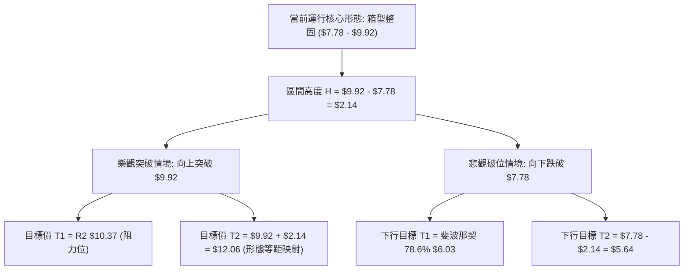

---

## 4. 支撐與阻力

### 🗺️ 關鍵價位分布圖（Unicode）

```
ONDS 價位結構分佈圖
═══════════════════════════════════════════════════════════════════
$11.66 ║████████████████████████████████████████║ 強阻力 R3 (+33.93%)
$10.78 ║▓▓▓▓▓▓▓▓▓▓▓▓▓▓▓▓▓▓▓▓▓▓▓▓▓▓▓▓▓▓          ║ 斐波那契 38.2% 回調位
$10.37 ║████████████████████████████            ║ 重要阻力 R2 (+19.06%)
$ 9.92 ║████████████████████████████████████    ║ 關鍵阻力 R1 (+13.95%)
$ 9.43 ║────────────────────────────────────────║ MA200 牛熊分界線
$ 9.39 ║▓▓▓▓▓▓▓▓▓▓▓▓▓▓▓▓▓▓▓▓                    ║ 斐波那契 50.0% 回調位
$ 8.71 ╠════════════════════════════════════════╣ ◄ 當前價格 $8.71
$ 8.69 ║▓▓▓▓▓▓▓▓▓▓▓▓▓▓▓▓▓▓▓▓▓▓▓▓▓▓▓▓▓▓▓▓▓▓▓▓    ║ 近期支撐 S1 (-0.23%) / MA20
$ 8.32 ║████████████████████████████████        ║ 強支撐 S2 (-4.48%) / MA50
$ 8.01 ║▓▓▓▓▓▓▓▓▓▓▓▓▓▓▓▓▓▓▓▓                    ║ 斐波那契 61.8% 黃金分割位
$ 7.78 ║████████████████████████████████████████║ 核心防守支撐 S3 (-10.68%)
═══════════════════════════════════════════════════════════════════
```

### 🚧 阻力位分析表

| 阻力級別 | 價位 | 距現價幅寬 | 形成原因與技術共振 | 突破難度 | 重要性 |
|:---|:---:|:---:|:---|:---:|:---:|
| **R1** | **$9.92** | +13.95% | 近一年波段高點密集聚類區，接近 $10 整數心理大關，與 MA120 ($9.35) 形成重疊壓力帶。 | 🔴 高 | ★★★★★ |
| **R2** | **$10.37**| +19.06% | 2026年1月至4月箱型頭部整理平台頂部，存在大量歷史套牢籌碼。 | 🔴 極高 | ★★★★☆ |
| **R3** | **$11.66**| +33.93% | 2026年5月爆量衝高回落的中繼密集成交區，強大多頭波段目標。 | 🔴 極高 | ★★★☆☆ |

### 🛡️ 支撐位分析表

| 支撐級別 | 價位 | 距現價幅寬 | 形成原因與技術共振 | 守住機率 | 重要性 |
|:---|:---:|:---:|:---|:---:|:---:|
| **S1** | **$8.69** | -0.23% | 近期波段低點聚類，與 MA20 ($8.64) 及布林通道中軌高度重疊，為短線多頭第一道防線。 | 🟢 70% | ★★★★☆ |
| **S2** | **$8.32** | -4.48% | 中期波段支撐聚類，與 MA50 ($8.23) 形成強共振支撐帶。 | 🟢 80% | ★★★★★ |
| **S3** | **$7.78** | -10.68%| 2026年7月底放量反彈啟動點，若跌破則意味反彈結構徹底瓦解。 | 🟢 85% | ★★★★★ |

### 📐 斐波那契回調位分析

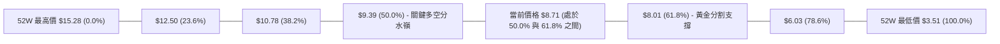

#### 斐波那契回調精確數值與解讀表

| 回調比例 | 價位 | 當前相對位置與技術意涵 |
|:---|:---:|:---|
| **0.0% (52W High)** | **$15.28** | 歷史極值壓力，波段大頂。 |
| **23.6%** | **$12.50** | 強阻力帶，若突破預示強勢反轉。 |
| **38.2%** | **$10.78** | 中期強阻力，靠近 R2 ($10.37) 上方。 |
| **50.0%** | **$9.39**  | **重要多空分水嶺**：現價落於此處下方，且與 MA200 ($9.43) 匯聚，為上行主要阻礙。 |
| **當前現價** | **$8.71**  | **運行於 50.0% ($9.39) 與 61.8% ($8.01) 之間**，屬於標準的黃金分割回撤整固區。 |
| **61.8%** | **$8.01**  | **黃金分割支撐位**：多頭關鍵防線，與支撐 S3 ($7.78) 構成強力底部保護緩衝帶。 |
| **78.6%** | **$6.03**  | 深幅回調防守位，接近前低 $6.53 下方。 |
| **100.0% (52W Low)**| **$3.51** | 長期底部極值。 |

---

## 5. 技術指標深度解讀

### 🎛️ 指標訊號總覽

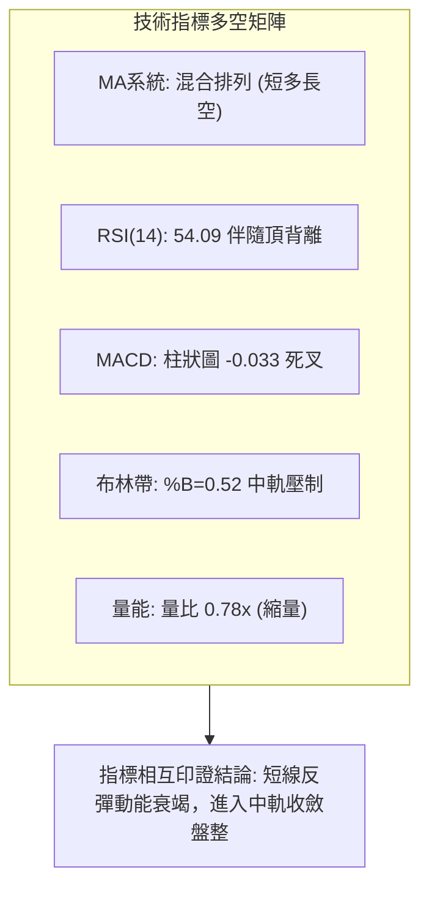

### 📈 移動平均線排列分析

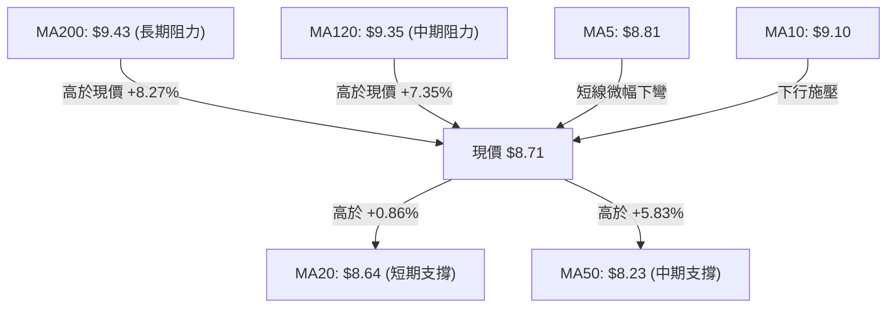

#### 均線各週期參數與趨勢狀態

| 均線名稱 | 數值 | 價格相對位置 | 趨勢方向 | 訊號解讀 |
|:---|:---:|:---:|:---:|:---|
| **MA 5** | $8.81 | 低於 (-1.14%) | 下行 ▼ | 超短線動能承壓，短線多頭暫歇。 |
| **MA 10**| $9.10 | 低於 (-4.31%) | 下行 ▼ | 形成短線上方第一道動態壓制。 |
| **MA 20**| $8.64 | 高於 (+0.86%) | 上行 ▲ | 短期月線支撐，為短多生命線。 |
| **MA 50**| $8.23 | 高於 (+5.83%) | 上行 ▲ | 中期趨勢向上，提供波段底部防護。 |
| **MA 60**| $8.81 | 低於 (-1.09%) | 下行 ▼ | 與 MA5 匯聚於 $8.81，形成短線共振阻力。 |
| **MA 120**| $9.35 | 低於 (-6.83%) | 下行 ▼ | 長期半年線下行，限制中期反彈高度。 |
| **MA 200**| $9.43 | 低於 (-7.64%) | 下行 ▼ | 長期年線牛熊線，價格在其下方判定長期偏弱。 |
| **MA 240**| $9.15 | 低於 (-4.85%) | 下行 ▼ | 長期壓力沉重。 |

### 📉 RSI(14) 分析

```
RSI(14) 當前數值: 54.09
0 ══════════════ 30 ══════════════ 50 ══════════════ 70 ══════════════ 100
                  [  超賣區間  ]         [  當前 54.09  ] [  超買區間  ]
░░░░░░░░░░░░░░░░░░░░░░░░░░░░░░░░░░░░░░░░█████████████░░░░░░░░░░░░░░░░░░░░
```

- **背離判斷**：⚠️ **日線/週線存在頂背離 (Bearish Divergence)**。
  - **背離事實**：股價在 2026-05 創下 $13.22 高點時 RSI 達 70.6；隨後在 8 月初反彈至 $9.11-$9.24 時，RSI 雖衝高至 70.3，但隨即快速滑落至 54.09，而未創價格新高。動能線未能有效突破前高，且在 $9.24 位置出現動能快速衰竭，形成典型的動能頂背離徵兆，提示投資人不可在此處盲目追高。

### 📊 MACD(12,26,9) 訊號解讀

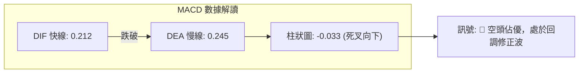

MACD 快線 (0.212) 跌破慢線 (0.245)，柱狀圖轉為負值 (-0.033)，證實短期動能正由多轉空。儘管快慢線仍位於零軸上方（顯示中長期反彈波段尚未全盤破位），但死叉訊號確立了當前價格正進入回調或震盪整理週期。

### 📦 布林通道分析

```
ONDS 布林通道 (20, 2) 結構圖
價格 ($)
 10.16 ┤───────────────────────────────── 上軌 $10.16 (阻力位)
       │
  9.40 ┤
       │
  8.71 ┤ ◄──────── 現價 $8.71 (%B = 0.52)
  8.64 ┼┄┄┄┄┄┄┄┄┄┄┄┄┄┄┄┄┄┄┄┄┄┄┄┄┄┄┄┄┄┄┄┄ 中軌 $8.64 (MA20 動態支撐)
       │
  7.80 ┤
       │
  7.11 ┤───────────────────────────────── 下軌 $7.11 (極限支撐)
```

- **帶寬與位置解讀**：布林帶上軌位於 $10.16，下軌位於 $7.11，帶寬約為 $3.05。當前價格 $8.71 處於 %B = 0.52 的位置，精確貼合布林中軌 ($8.64)。這表明價格在脫離了7月份超賣下軌區域後，目前已回歸統計學上的價值中樞，通道開口呈現橫向收斂態勢，預示未來數週將以中軌為軸心進行窄幅震盪。

### 💹 成交量分析（量價配合度）

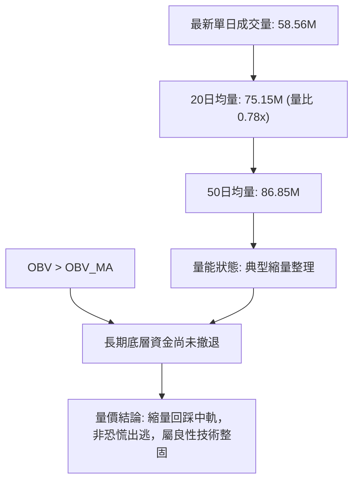

- **量價背離分析**：在 2026-07-26 當週爆出 8.34 億股天量推升後，近兩週成交量連續萎縮至 3.48 億股，日均量比降至 0.78x。成交量隨價格回調而遞減，表明當前市場並無強烈的主動拋售意願；然而，OBV 保持在均線上方，說明主力建倉資金並未出逃，整體量價關係呈現「上漲放量、回調縮量」的良性整理特徵。

---

## 6. 動能與波動率

### ⚡ 動能評估四象限

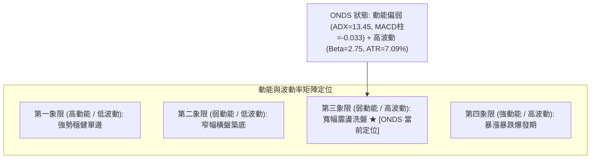

| 象限分區 | 動能強度 | 波動率水準 | ONDS 判定 | 操作策略指導 |
|:---|:---:|:---:|:---:|:---|
| **Q1 (穩健成長)** | 強 (ADX>25) | 低 (ATR%<4%) | — | 順勢加碼持股 |
| **Q2 (低位蓄勢)** | 弱 (ADX<25) | 低 (ATR%<4%) | — | 潛伏低吸 |
| **Q3 (寬幅洗盤)** | **弱 (ADX=13.45)** | **高 (ATR%=7.09%)** | **✓ 當前狀態** | **嚴格控制倉位，區間邊界高拋低吸，嚴設止損** |
| **Q4 (極端爆發)** | 強 (ADX>25) | 高 (ATR%>6%) | — | 突破追隨/快速止盈 |

### 📊 ATR 波動率分析

- **ATR(14) 數值**：**$0.62**（佔當前股價之 **7.09%**）。
- **波動特性解讀**：ONDS 屬於極高波動度標的，每日正常隨機波動區間即達 ±$0.62。
- **止損與風控設置指引**：
  - **短線交易止損距離**：建議至少設定為 `1.5 × ATR = $0.93`，避免被日內隨機噪音掃出場。
  - **波段交易止損距離**：建議設定為 `2.0 × ATR = $1.24`。

### 📐 Beta 與市場相關性

- **Beta 係數**：**2.75**。
- **市場特徵分析**：ONDS 具有極高的市場敏感度與高彈性特質。當納斯達克或科技板塊上漲 1% 時，該股理論上有波動 2.75% 的傾向；反之在大盤回調時亦承擔近 3 倍的下行放大風險。
- **空頭部位比例 (Short % Float)**：**41.5%**（空頭回補天數 Short Ratio: 2.24）。高達 41.5% 的高空頭佔比意味著該股具備潛在的「軋空 (Short Squeeze)」催化潛力，一旦價格放量突破關鍵阻力 R1 ($9.92)，極易引發空頭踩踏式平倉買盤。

---

## 7. 多時框架總結

### 📋 時框架評分表

| 時框架 | 趨勢方向 | 動能狀態 | 均線系統排列 | 形態特徵 | 綜合評分 | 交易建議 |
|:---|:---:|:---:|:---:|:---:|:---:|:---|
| **長期 (月線)** | 🟡 中性寬幅 | 🟡 中性整理 | 混合排列 (MA200下方)| 52W 區間回撤 50% 整固 | **55/100** | 長線分批定投/觀望 |
| **中期 (週線)** | 🟢 偏多反彈 | 🔴 頂背離減弱 | 突破 MA20/MA50 | $6.53 雙底反彈後遇阻 | **50/100** | 逢阻力減碼，逢支撐接回 |
| **短期 (日線)** | 🔴 震盪回落 | 🔴 MACD死叉 | 跌破 MA5/MA10 | 回踩 MA20 中軌尋求支撐 | **42/100** | 嚴禁追高，等待支撐確認 |

### 🔲 綜合訊號矩陣

```
╔══════════════════════════════════════════════════════════════╗
║                    多時框多空訊號收斂矩陣                    ║
╠══════════════════════════════════════════════════════════════╣
║ 維度         短期 (日線)       中期 (週線)       長期 (月線) ║
╠══════════════════════════════════════════════════════════════╣
║ 趨勢方向     🔴 震盪偏弱       🟢 反彈築底       🟡 寬幅震盪 ║
║ 均線支撐     🟢 MA20 ($8.64)   🟢 MA50 ($8.23)   🔴 MA200($9.43)║
║ 動能指標     🔴 MACD 死叉      🔴 RSI 頂背離     🟡 中性區域 ║
║ 關鍵位置     🟡 貼合布林中軌   🔴 斐波50%阻力    🟢 守住斐波61.8%║
║ 成交量能     🟡 縮量整理       🟢 底部放量       🟢 具長線換手 ║
╠══════════════════════════════════════════════════════════════╣
║ 最終加權方向 ➔ ⚖️ 【中性觀望 / 區間震盪收斂】                ║
╚══════════════════════════════════════════════════════════════╝
```

### ⚖️ 多時框收斂結論

依據多時框收斂規則（規則 14）：
1. **趨勢強度定調**：當前 ADX(14) 僅為 **13.45**（遠低於 25），明確判定當前市場處於**無單邊方向的「盤整行情」**。
2. **操作核心依據**：日線趨勢與週線反彈出現分歧，依規則應以**日線布林通道 ($7.11 - $10.16) 及關鍵支撐阻力 ($7.78 - $9.92)** 作為主要交易區間。
3. **唯一方向性結論**：**【中性觀望，區間震盪操作】**。日線級別 MACD 死叉與 RSI 頂背離要求短線投資人保持克制，不可追高；而下方 S1 ($8.69) 與 S2 ($8.32) 均線密集帶具備強支撐力，股價將在此狹窄區間內進行多空拉鋸，等待量能突破。

---

## 8. 交易策略建議

### 🗺️ 策略決策流程圖

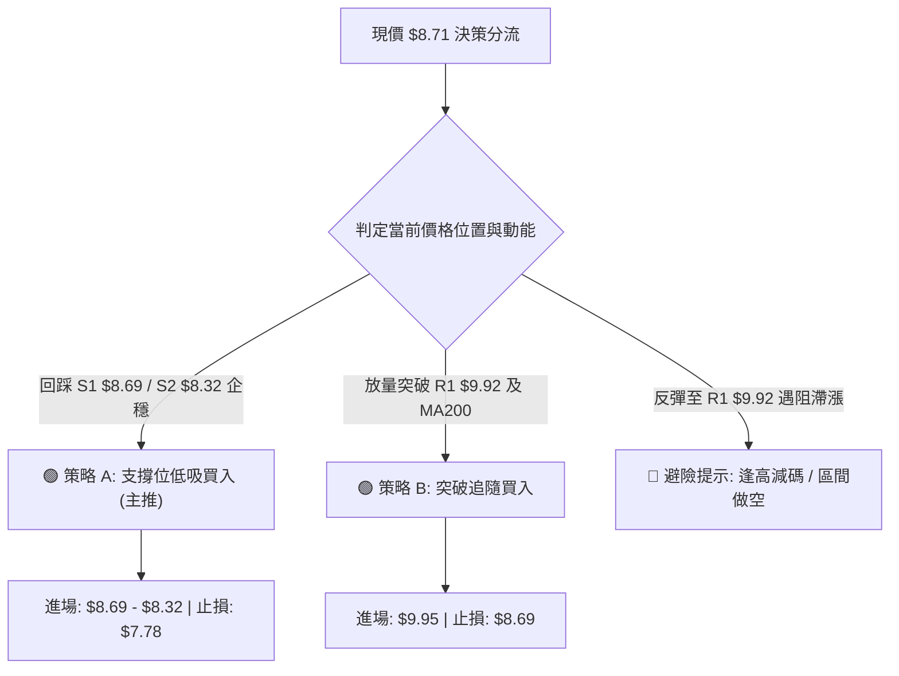

### 🧭 策略路由

> **當前主策略方向 = 區間操作，以低吸高拋為主（依評分卡綜合評分 48/100，處於 40–60 中性區間，等待支撐確認）**

由於綜合評分為 48/100，技術面處於布林中軌 $8.64 與阻力 R1 $9.92 之間的拉鋸狀態。主推策略聚焦於「回踩強支撐低吸」與「右側放量突破追隨」兩套精確方案。

### 🎯 價格情境階梯（Price Scenarios）

| 觸發條件 | 第一目標 | 第二目標 | 後續延伸 | 情境含義與操作對策 |
|:---|:---:|:---:|:---:|:---|
| **向上突破 R1 ($9.92)** | **R2 ($10.37)** | **R3 ($11.66)** | **$12.50** | 短線徹底轉強，空頭回補軋空啟動，全面轉為單邊多頭。 |
| **站穩現價區間 ($8.64-$8.71)**| **MA200 ($9.43)**| **R1 ($9.92)** | — | 區間震盪偏多，維持中軌至上軌的箱型運行。 |
| **向下跌破 S1 ($8.69)** | **S2 ($8.32)** | **S3 ($7.78)** | **$7.11** | 中期反彈受阻，短線轉弱，需回測 MA50 及布林下軌。 |

### 📊 情境機率分佈

| 運行情境 | 機率預估 | 主要技術指標依據（精確引用） |
|:---|:---:|:---|
| **區間震盪築底** | **55%** | ADX 處於 13.45 極低水準，布林 %B 為 0.52 貼合中軌，成交量縮至 0.78x，預示橫盤整理為大概率事件。 |
| **回踩支撐後上攻**| **30%** | OBV 大於 MA 顯示長線主力未退，且下方有 S1 ($8.69) 與 S2 ($8.32) 均線雙重防護。 |
| **破位下行探底** | **15%** | RSI 頂背離與日線 MACD 柱狀圖轉負 (-0.033)，若大盤劇烈回調可能拖累 Beta 2.75 的股價破位。 |

### 🟢 主策略詳情

本報告依據嚴格技術數據，提供兩套精確策略參數：

| 策略要素 | 策略 A：左側支撐低吸策略（穩健型） | 策略 B：右側突破追隨策略（進取型） |
|:---|:---|:---|
| **進場條件** | 價格回踩 S1 ($8.69) 或 S2 ($8.32) 企穩不破，日線收下影線。 | 放量突破 R1 ($9.92) 且收盤站穩，日成交量 > 75M。 |
| **精確進場價格** | **$8.35**（於 S2 $8.32 上方掛單） | **$9.95**（突破 R1 $9.92 後確認進場） |
| **目標價 T1** | **$9.39**（斐波那契 50.0% / MA200 阻力） | **$10.37**（重要阻力 R2） |
| **目標價 T2** | **$9.92**（關鍵阻力 R1 頸線） | **$11.66**（強阻力 R3） |
| **精確止損價格** | **$7.75**（跌破核心防守 S3 $7.78 即止損） | **$8.69**（跌回 S1 / MA20 下方即止損） |
| **風險空間** | `$8.35 - $7.75 = $0.60` (7.19%) | `$9.95 - $8.69 = $1.26` (12.66%) |
| **報酬空間 (T2)** | `$9.92 - $8.35 = $1.57` (18.80%) | `$11.66 - $9.95 = $1.71` (17.19%) |
| **風險報酬比 (R/R)**| **1 : 2.62** (極佳) | **1 : 1.36** (普通，需靠 T2 放大收益) |
| **預估勝率** | **65%** | **50%** |
| **建議倉位** | **總資金之 10% - 15%** | **總資金之 5% - 8%** |

### 🔴 反向風險觸發點（對沖與風控提示）

- **全面多頭停損/轉空訊號**：若日線收盤價**實體跌破 S3 ($7.78)**，宣告 7 月以來的反彈波段終結，潛在雙底形態破滅，投資人應立即清倉多頭部位，甚至可考慮反向操作，下行目標直指斐波那契 78.6% 的 **$6.03** 及布林下軌 **$7.11**。
- **空頭平倉/軋空防守線**：若股價帶量長陽突破 **MA200 ($9.43)** 與 **R1 ($9.92)**，空方部位必須無條件止損停肉，防範 41.5% 超高空頭比例帶來的軋空暴漲風險。

### ⭐ 整體訊號強度評星

```
╔══════════════════════════════════════════════════════════════╗
║ 做多訊號強度：★★☆☆☆  (2.5/5星) — 支撐強勁但缺乏單邊推力     ║
║ 做空訊號強度：★★☆☆☆  (2.0/5星) — 下方均線密集，做空空間受限 ║
║ 區間震盪可信度：★★★★☆  (4.0/5星) — 符合 ADX=13.45 統計特徵   ║
║ 整體技術可信度：★★★☆☆  (3.5/5星) — 籌碼充分沉澱，等待催化   ║
╚══════════════════════════════════════════════════════════════╝
```

---

## 9. 風險提示與監控

### ✅ 關鍵監控指標 Checklist

```
╔══════════════════════════════════════════════════════════════╗
║              ONDS 交易員每日盤面監控清單 (Checklist)          ║
╠══════════════════════════════════════════════════════════════╣
║ [ ] 價格是否跌破 MA20 ($8.64) 與 S1 ($8.69) 支撐？           ║
║ [ ] 日成交量是否回升至 20日均量 (75.14M) 之上？              ║
║ [ ] MACD 柱狀圖是否在零軸下方收斂並翻紅？                     ║
║ [ ] RSI(14) 能否重返 60 以上化解頂背離疑慮？                 ║
║ [ ] 股價上攻 $9.39-$9.43 (MA200) 時是否出現量價配合？        ║
║ [ ] 大盤波動 (Beta 2.75 效應) 是否引發個股異常劇烈震盪？     ║
║ [ ] 空頭比例 (41.5%) 是否出現平倉異動 (Short Squeeze 跡象)？ ║
╚══════════════════════════════════════════════════════════════╝
```

### ⚠️ 風險場景分析

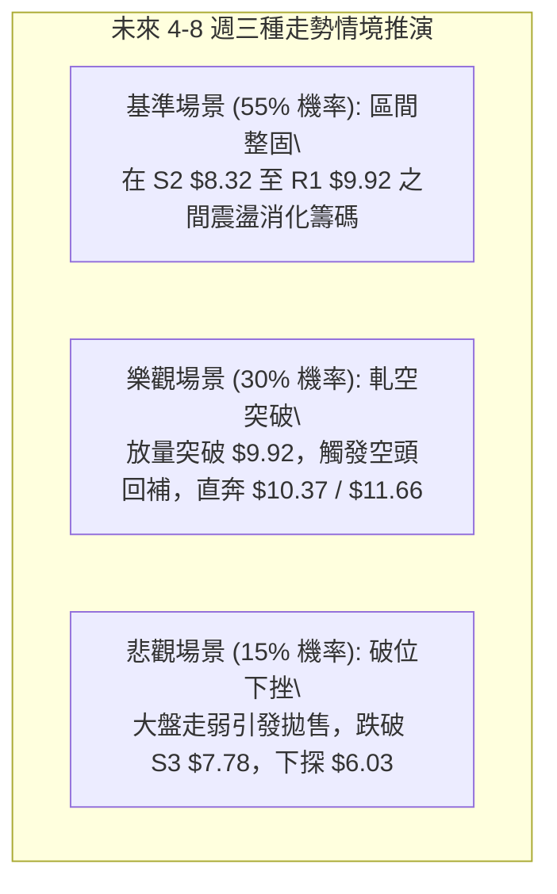

### 🛡️ 風險管理重要提醒

1. **高 Beta 與高 ATR 雙重風險**：ONDS 的 Beta 高達 2.75，且日 ATR 高達 $0.62 (7.09%)，屬於典型高波動投機標的。嚴禁使用過高槓桿，單筆交易虧損上限應嚴格控制在總賬戶淨值的 1% - 2% 以內。
2. **基本面與估值扭曲風險**：公司目前 TTM 營業利益率為 -166.3%，營運現金流為負（$-161.06M），基本面屬於高成長但尚未獲利階段，股價完全由市場情緒與技術資金驅動，容易出現無預警的技術破位。
3. **空頭踩踏與流動性風險**：雖然 41.5% 的空頭部位隨時可能帶來爆發性軋空，但在盤整市況下，一旦跌破 S3 ($7.78)，亦可能觸發程式化交易的連環停損賣單，必須堅決執行預設的停損紀律。

---

## 📋 報告總結

```
╔══════════════════════════════════════════════════════════════╗
║                    ONDS 技術分析報告總結                     ║
╠══════════════════════════════════════════════════════════════╣
║ 報告日期：2026-08-22                                         ║
║ 當前價格：$8.71                                              ║
║ 分析評級：⚖️ 中性觀望 / 區間操作 (評分: 48/100)               ║
║                                                              ║
║ 關鍵結論：                                                   ║
║ ├─ 長期趨勢：🔴 承壓於 MA200 ($9.43) 下方，長期牛熊未定     ║
║ ├─ 中期趨勢：🟡 $6.53 底部反彈後遭遇斐波 50% ($9.39) 阻力    ║
║ ├─ 短期趨勢：🟡 ADX=13.45 典型盤整，貼合布林中軌 $8.64 運作 ║
║ ├─ 核心支撐：S1: $8.69  |  S2: $8.32  |  S3: $7.78          ║
║ ├─ 核心阻力：R1: $9.92  |  R2: $10.37 |  R3: $11.66         ║
║ └─ 華爾街共識目標價：$19.42 (9位分析師強烈推薦買入)          ║
║                                                              ║
║ 最優交易執行方案：                                           ║
║ 1. 🥇 最佳機會（策略 A - 低吸）：掛單 $8.35，止損 $7.75，   ║
║    目標 $9.39 / $9.92，風險報酬比 1:2.62。                   ║
║ 2. 🥈 次選機會（策略 B - 突破）：突破 $9.95 追進，止損 $8.69║
║    目標 $10.37 / $11.66，博弈 41.5% 空頭回補軋空浪潮。       ║
║ 3. 🥉 保守選擇：場外觀望，等待日線 MACD 重新金叉且量能放大。 ║
╚══════════════════════════════════════════════════════════════╝
```

---

> ⚠️ **免責聲明**：本報告為 AI 自動生成之技術分析研究，報告內所有數據、圖表及價位推算均嚴格基於 Yahoo Finance 歷史行情數據。本報告**僅供學術研究與投資決策參考**，**不構成任何形式的要約、招攬或具體投資建議**。金融市場具有極高風險，投資人應獨立評估自身風險承受能力並自負盈虧。

---

*報告生成時間：2026-08-22 ｜ 數據來源：Yahoo Finance ｜ 分析框架：資深多時框量化技術分析*