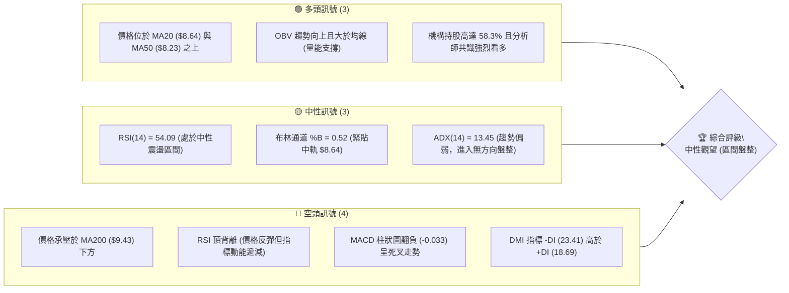
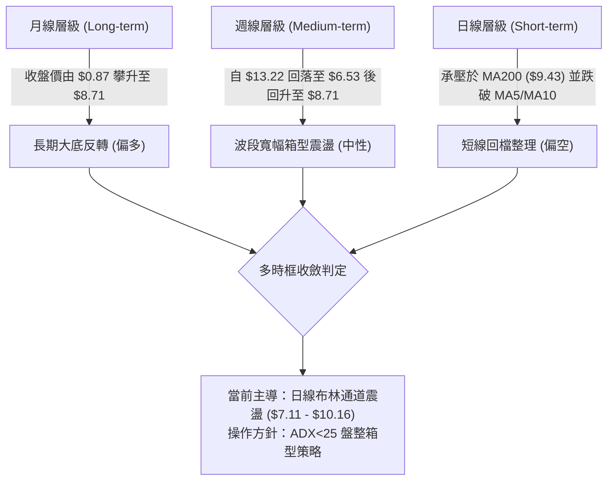
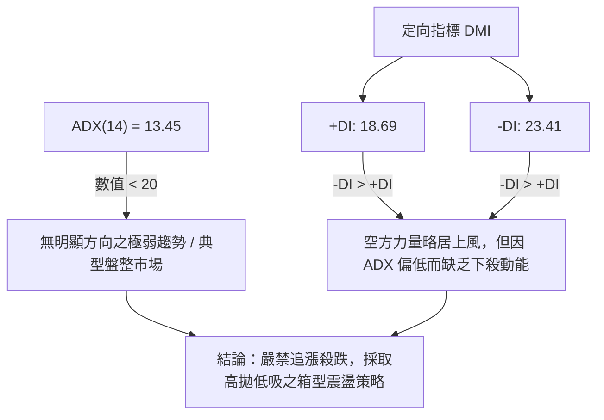
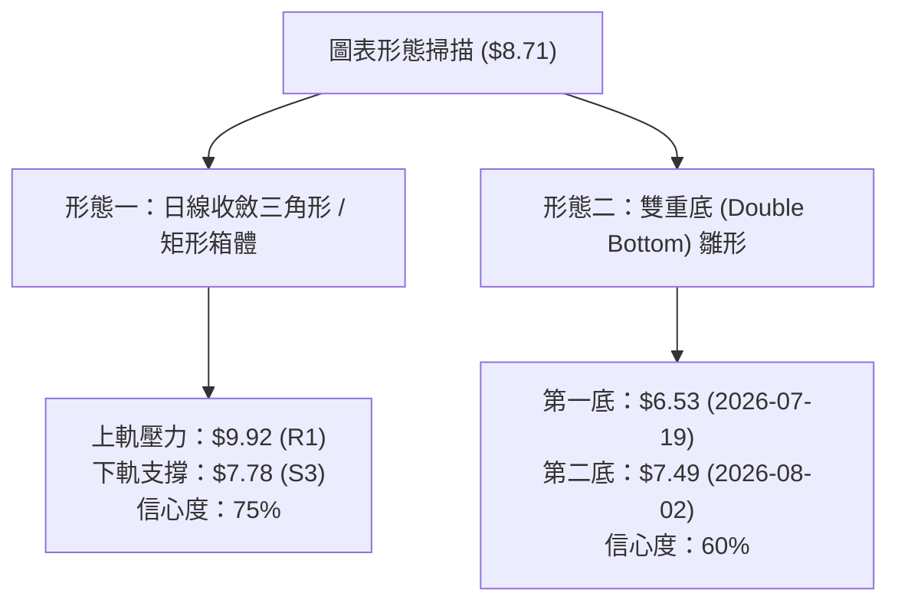
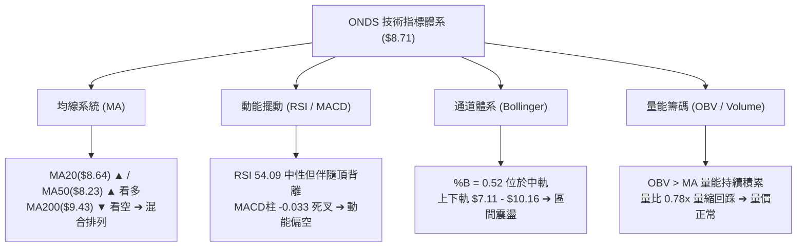
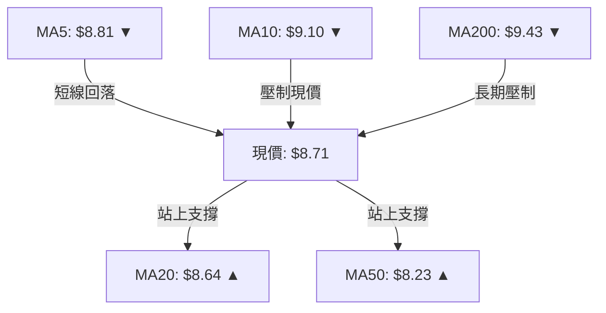
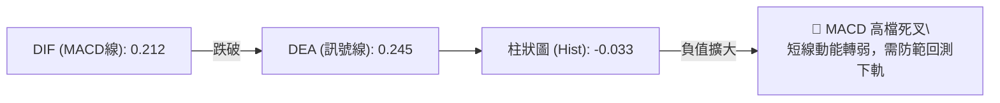
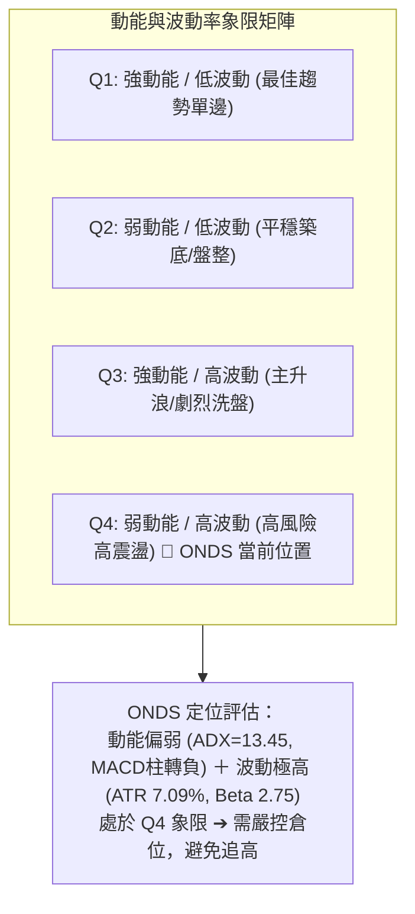
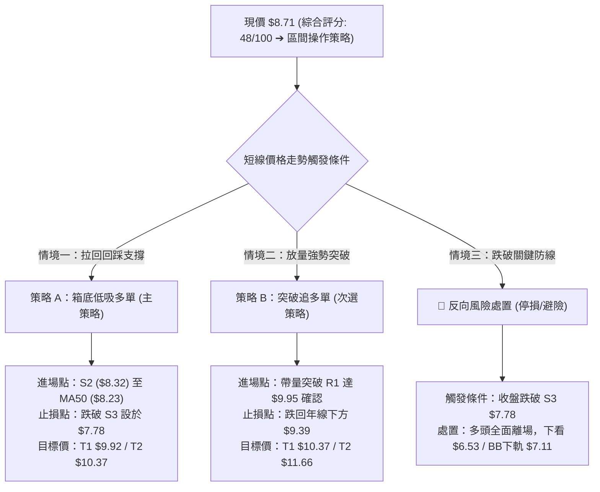
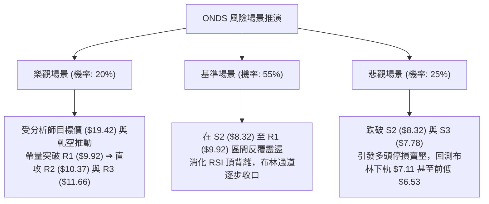

# ONDS 技術分析報告

> **報告日期**：2026-08-23 ｜ **語言**：繁體中文 ｜ **數據來源**：Yahoo Finance ｜ **當前價格**：$8.71

---

## 目錄

| 章節 | 內容 |
|------|------|
| [1. 技術面概覽](#1-技術面概覽) | 訊號儀表板、核心指標、評分卡 |
| [2. 趨勢分析](#2-趨勢分析) | 多時框趨勢、長中短期走勢、ADX解讀 |
| [3. 圖表形態分析](#3-圖表形態分析) | 形態識別、K線組合、目標價計算 |
| [4. 支撐與阻力](#4-支撐與阻力) | 關鍵價位、斐波那契回調 |
| [5. 技術指標深度解讀](#5-技術指標深度解讀) | MA/RSI/MACD/布林/成交量 |
| [6. 動能與波動率](#6-動能與波動率) | 動能評估、ATR、Beta |
| [7. 多時框架總結](#7-多時框架總結) | 時框架評分矩陣、收斂結論 |
| [8. 交易策略建議](#8-交易策略建議) | 多空策略路由、風險報酬比 |
| [9. 風險提示與監控](#9-風險提示與監控) | 監控指標、風險場景 |

---

## 1. 技術面概覽

### 🎯 技術訊號儀表板



### 📊 核心指標速覽表

| 指標類別 | 指標名稱 | 當前數值 | 訊號 | 解讀 |
|----------|----------|----------|------|------|
| **價格** | 當前價格 | $8.71 | 🟡 中性 | 位於52週區間44.2%位置，短線在均線群糾結處震盪 |
| **均線** | MA20 | $8.64 | 🟢 看多 | 價格微幅站上20日中短期均線（+0.86%），提供極短線支撐 |
| **均線** | MA50 | $8.23 | 🟢 看多 | 價格維持於中期均線上方，多頭中期防線尚未失守 |
| **均線** | MA200 | $9.43 | 🔴 看空 | 價格位於長期年線下方（-7.63%），長期熊市架構尚未完全扭轉 |
| **動能** | RSI(14) | 54.09 | 🟡 中性 | 數值處於50軸上方震盪，但伴隨日線與週線頂背離警訊 |
| **動能** | MACD Hist | -0.033 | 🔴 看空 | DIF(0.212) 跌破 DEA(0.245)，柱狀圖轉負，短線動能趨緩 |
| **動能** | Stoch %K/%D | 29.67 / 44.35 | 🟡 中性 | 快線跌入低檔超賣邊界，隨時有低檔鈍化或弱勢金叉可能 |
| **趨勢** | ADX(14) | 13.45 | 🟡 盤整 | ADX < 25 表明無顯著單邊趨勢，-DI(23.41) > +DI(18.69) 空方略佔優 |
| **通道** | Bollinger %B | 0.52 | 🟡 中性 | 價格剛好落於布林帶中軌（$8.64），上下軌區間為 $7.11 - $10.16 |
| **波動** | ATR(14) | $0.62 | 🔴 高波動 | 每日波動佔價格 7.09%，Beta 高達 2.75，日內洗盤劇烈 |
| **量能** | 量比 / OBV | 0.78x / 多頭 | 🟢 看多 | 今日量縮（58.55M vs 20MA 75.15M），但整體 OBV 仍高於均線 |

### 🏆 技術評分卡

```
╔══════════════════════════════════════════════════════════════════╗
║                   技術評分卡 — ONDS (2026-08-23)                 ║
╠══════════════════════════════════════════════════════════════════╣
║ 趨勢強度      ██████░░░░░░░░░░░░░░  30/100  🔴 (ADX 13.45 弱趨勢)║
║ 動能指標      ████████░░░░░░░░░░░░  40/100  🟡 (RSI頂背離/MACD死叉)║
║ 支撐穩定度    ████████████░░░░░░░░  60/100  🟢 (S1 $8.69/MA50 支撐)║
║ 成交量配合    ████████████░░░░░░░░  60/100  🟢 (OBV呈多頭積累架構) ║
║ 形態完整度    ██████████░░░░░░░░░░  50/100  🟡 (矩形震盪未破頸線) ║
║ 均線排列      ██████████░░░░░░░░░░  50/100  🟡 (短多長空混合排列) ║
╠══════════════════════════════════════════════════════════════════╣
║ 綜合評分      █████████░░░░░░░░░░░  48/100  🟡 中性觀望 (盤整)   ║
╚══════════════════════════════════════════════════════════════════╝
```

---

## 2. 趨勢分析

### 🌐 多時框趨勢分析



### 📈 長期趨勢 — 12個月走勢圖（Unicode）

```
ONDS 月線走勢圖（2025-08 至 2026-08）
價格軸 ($)
$14.00 ┤                                           ● 2026-05 ($13.22)
$12.00 ┤                                          ╱ ╲
$10.00 ┤                       ● 2026-01 ($10.36)╱   ╲
$9.00  ┤                 ● 2025-12 ($9.76)      ╱     ● 2026-08 ($8.71 當前)
$8.00  ┤          ● 2025-11 ($7.90)            ╱       ╲
$7.00  ┤    ● 2025-09 ($7.72)                 ╱         ● 2026-07 ($7.49)
$6.00  ┤ ● 2025-08 ($5.86)                   ╱
$4.00  ┤
$2.00  ┤
       └─────────────────────────────────────────────────────────────
         08/25 09/25 10/25 11/25 12/25 01/26 02/26 03/26 04/26 05/26 06/26 07/26 08/26
```

**走勢特徵分析表格**：

| 階段區間 | 起訖月份 | 起訖價格 | 區間漲跌幅 | 核心形態與技術特徵 |
|----------|----------|----------|------------|--------------------|
| 第一階段：主升起爆 | 2025-08 → 2026-01 | $5.86 → $10.36 | +76.79% | 爆發性放量推升，站穩所有均線，確立長線脫離底部 |
| 第二階段：高檔震盪 | 2026-01 → 2026-04 | $10.36 → $10.04 | -3.09% | 在 $9.04 - $10.36 構築平坦頂部平台，量能微幅收縮 |
| 第三階段：假突破與崩落 | 2026-04 → 2026-06 | $10.04 → $8.24 | -17.93% | 2026-05 衝高至 $13.22（52W高點 $15.28）後急速引爆獲利了結 |
| 第四階段：築底回升 | 2026-07 → 2026-08 | $7.49 → $8.71 | +16.29% | 觸及波段低點 $6.53 後放量強彈，目前於 $8.71 均線密集區蓄勢 |

### 📊 中期趨勢（週線分析）

中期走勢呈現「寬幅箱型整理」。近20週數據顯示，價格於 2026-05 達到峰值 $13.22，隨後在 2026-07-19 探底至 $6.53，隨後展開反彈：

```
中期壓力與支撐示意圖 (週線層級)
$13.22 ══════════════════════════════════ [5月波段峰值 / 強阻力 R3 $11.66 上方]
          │
$10.37 ────────────────────────────────── [高檔箱頂 R2]
          │
$9.92  ────────────────────────────────── [近期反彈高點壓力 R1 / MA200 $9.43]
          ▲ 現價 $8.71 處於箱型中軸偏下
$8.69  ┄┄┄┄┄┄┄┄┄┄┄┄┄┄┄┄┄┄┄┄┄┄┄┄┄┄┄┄┄┄┄┄┄┄ [近一年支撐聚類 S1 / MA20 $8.64]
          │
$7.78  ────────────────────────────────── [箱底支撐區間 S3 / 7月回調低點]
          │
$6.53  ══════════════════════════════════ [2026-07-19 破底翻反彈起點]
```

### ⚡ 趨勢強度評估（ADX 解讀）



| 指標變數 | 當前讀數 | 門檻區間 | 趨勢判定 | 交易指引 |
|----------|----------|----------|----------|----------|
| **ADX(14)** | 13.45 | < 25 (弱趨勢/盤整) | 🟡 典型震盪市 | 趨勢指標無效化，震盪指標（布林、Stoch）權重提高 |
| **+DI** | 18.69 | — | 多頭力量微弱 | 缺乏突破推升動能，逢高易遇解套賣壓 |
| **-DI** | 23.41 | — | 空頭暫時主導 | 空方佔優但未達趨勢下挫門檻（-DI未>30） |

---

## 3. 圖表形態分析

### 🔍 形態識別系統



**形態信心度與目標價評估表**：

| 形態名稱 | 信心度 | 判斷依據（引用數據） | 完成度 | 目標價（附計算式） |
|----------|--------|----------------------|--------|--------------------|
| **矩形震盪箱體** | 75% | 價格在 S3 ($7.78) 與 R1 ($9.92) 之間反覆震盪已歷時 8 週 | 85% | 向上突破：頸線 $9.92 + 高度 ($9.92 - $7.78 = $2.14) = **$12.06** (鄰近 R3 $11.66 / 斐波 23.6% $12.50) |
| **波段雙底 (W底)** | 60% | 兩次低點分別為 2026-07-19 的 $6.53 與 2026-08-02 的 $7.49，低點抬高 | 60% | 待突破前高 $9.24：$9.24 + ($9.24 - $6.53 = $2.71) = **$11.95** |
| **頭肩底形態** | 35% | 數據不足，右肩結構尚未成形 | 20% | *訊號不足，僅做指標型解讀，不預設目標價* |

### 🕯️ 重要K線形態分析

| 週期/日期 | 收盤價 | K線形態 | 解讀 | 訊號 |
|-----------|--------|---------|------|------|
| **2026-05-31** | $13.22 | 長紅爆量突破 | 創波段新高，週成交量達 566.99M，多頭動能耗盡之竭盡特徵 | 🟡 警訊 |
| **2026-06-28** | $7.83 | 大陰線跳空下殺 | 連續破位跌破 MA50，空方全面摜壓，形成島狀反轉疑慮 | 🔴 強烈看空 |
| **2026-07-19** | $6.53 | 爆量長下影線（錘頭） | 單週爆出 671.53M 巨量收長下影，探底完成，確立中期強支撐 | 🟢 強烈看多 |
| **2026-07-26** | $7.80 | 長陽包覆吞噬 | 834.31M 歷史級天量拉出實體陽線，主力進場抄底確認 | 🟢 多頭吞噬 |
| **2026-08-16** | $9.24 | 倒錘頭/高檔十字星 | 挑戰 MA200 ($9.43) 與 R1 ($9.92) 遇阻回落，成交量 471.60M 萎縮 | 🔴 短線滯漲 |
| **2026-08-23** | $8.71 | 中陰線回測均線 | 回踩 MA20 ($8.64) 與 S1 ($8.69)，量縮至 348.37M，等待方向抉擇 | 🟡 整理觀望 |

### 📉 ASCII 走勢形態示意圖

```
ONDS 2026年5月至8月 波段箱體與雙底結構圖
價格 ($)
$13.22 ┼───────────────● 5月高點 (峰值)
       │              ╱ ╲
$11.66 ┼─(R3)────────╱───╲─────────────────────────
       │            ╱     ╲
$10.37 ┼─(R2)───────╱───────╲───────● 頸線阻力區 ($9.92 - $10.37)
$9.92  ┼─(R1)──────╱─────────╲─────╱─╲
$8.71  ┼──────────╱───────────╲───╱───●【現價 $8.71：回測MA20】
$8.69  ┼─(S1)────╱─────────────╲─╱
$8.32  ┼─(S2)───╱───────────────● (第二底 $7.49)
$7.78  ┼─(S3)──╱                 
$6.53  ┼──────● (第一底 7/19)
       └────────────────────────────────────────────► 時間
```

### 🎯 形態目標價計算

以已確認度較高的 **矩形相型震盪向上假想突破** 進行量度：
- **形態箱頂頸線 (Resistance)**：$9.92 (R1)
- **形態箱底支撐 (Support)**：$7.78 (S3)
- **形態垂直高度 ($H$)**：$9.92 - $7.78 = $2.14
- **量度突破目標價 (Target 1)**：$9.92 + $2.14 = **$12.06**（落於斐波那契 23.6% 回調位 $12.50 與 R3 $11.66 區間）
- **若向下跌破箱底量度 (Downside Target)**：$7.78 - $2.14 = **$5.64**（高於 52W 低點 $3.51）

---

## 4. 支撐與阻力

### 🗺️ 關鍵價位分布圖（Unicode）

```
ONDS 價位結構分布圖
════════════════════════════════════════════════════════════════════
$15.28 ║████████████████████████████████████████║ 52W High (0.0%)
$12.50 ║████████████████████                    ║ 斐波那契 23.6%
$11.66 ║██████████████████████████████          ║ 強阻力 R3 (波段高點聚類)
$10.78 ║████████████████                        ║ 斐波那契 38.2%
$10.37 ║██████████████████████                  ║ 阻力 R2 (箱型頂部)
$9.92  ║████████████████████████                ║ 關鍵阻力 R1 (頸線壓力)
$9.43  ║────────────────────────────────────────║ MA200 年線壓力
$9.39  ║██████████████                          ║ 斐波那契 50.0%
$8.71  ╠════════════════════════════════════════╣ ◄ 現價 ($8.71)
$8.69  ║▓▓▓▓▓▓▓▓▓▓▓▓▓▓▓▓▓▓▓▓▓▓▓▓                ║ 近期支撐 S1 (波段低點聚類)
$8.64  ║────────────────────────────────────────║ BB中軌 / MA20
$8.32  ║████████████████████                    ║ 強支撐 S2 (波段低點聚類)
$8.23  ║────────────────────────────────────────║ MA50 生命線
$8.01  ║████████████                            ║ 斐波那契 61.8% (黃金分割)
$7.78  ║████████████████████████                ║ 強支撐 S3 (箱體下邊界)
$7.11  ║────────────────────────────────────────║ BB下軌
$6.03  ║████████                                ║ 斐波那契 78.6%
$3.51  ║████████████████████████████████████████║ 52W Low (100.0%)
════════════════════════════════════════════════════════════════════
```

### 🚧 阻力位分析表

| 阻力級別 | 價位 | 形成原因 | 突破難度 | 重要性 |
|----------|------|----------|----------|--------|
| **R1** | **$9.92** | 近一年波段高點聚類、逼近 MA200 ($9.43) 及整數大關 | 🟡 中等 (需日成交量 > 80M) | ★★★★☆ 短線反彈頸線 |
| **R2** | **$10.37** | 2026年1月/4月月線高點密集區、解套賣壓聚落 | 🔴 較高 (上方套牢籌碼沉重) | ★★★★☆ 中期多空分水嶺 |
| **R3** | **$11.66** | 近一年極端波段次高點聚類、52週高點拉回之首波反彈高點 | 🔴 極高 (需連續爆量長紅) | ★★★★★ 強烈阻力位 |

### 🛡️ 支撐位分析表

| 支撐級別 | 價位 | 形成原因 | 守住機率 | 重要性 |
|----------|------|----------|----------|--------|
| **S1** | **$8.69** | 近一年波段低點聚類、與 MA20 ($8.64) 重合形成共振 | 🟢 70% (短線多頭第一道防線) | ★★★★☆ 極短線防守點 |
| **S2** | **$8.32** | 近一年波段低點聚類、緊鄰 MA50 ($8.23) | 🟢 80% (中期上升趨勢防線) | ★★★★☆ 中期回檔關鍵位 |
| **S3** | **$7.78** | 近一年波段低點聚類、7月反彈起漲成交密集區底端 | 🟢 85% (箱體底部防線) | ★★★★★ 波段強支撐 |

### 📐 斐波那契回調位分析

依據 52 週區間波段（低點 $3.51 → 高點 $15.28，波幅 $11.77）之精確回調位：

- **0.0% (52W High)**: $15.28
- **23.6% 回調位**: $12.50
- **38.2% 回調位**: $10.78
- **50.0% 回調位**: $9.39 （緊鄰 MA200 $9.43，形成雙重結構壓制）
- **現價位置**: **$8.71** （處於 50.0% 與 61.8% 之間）
- **61.8% 回調位**: $8.01 （黃金分割支撐，位於 S2 $8.32 與 S3 $7.78 之間）
- **78.6% 回調位**: $6.03 （深度回撤極限）
- **100.0% (52W Low)**: $3.51

**解讀**：現價 $8.71 成功守在黃金分割關鍵點 **61.8% ($8.01)** 之上，顯示 5 月暴跌以來的修正尚未破壞 2024-2025 年以來的長線大多頭主體結構；但上方 **50.0% ($9.39)** 與 MA200 ($9.43) 構成沉重的共振反壓，若無法帶量封閉此區間，難以展開向 38.2% ($10.78) 的回升行情。

---

## 5. 技術指標深度解讀

### 🎛️ 指標訊號總覽



### 📈 移動平均線排列分析



| 均線名稱 | 數值 | 偏離率 | 趨勢斜率 | 技術意涵 |
|----------|------|--------|----------|----------|
| **MA 5** | $8.81 | -1.14% | 走平微跌 | 極短線動能衰竭，形成 $8.81 處日內微幅阻力 |
| **MA 10** | $9.10 | -4.31% | 向下彎頭 | 短線壓制線，若反彈未過 MA10 仍屬弱勢震盪 |
| **MA 20** | $8.64 | +0.86% | 向上翻揚 | 短期生命線，提供現價 $8.71 立即支撐 |
| **MA 50** | $8.23 | +5.83% | 向上推進 | 中期趨勢支撐線，中期多空分水嶺 |
| **MA 60** | $8.81 | -1.09% | 緩跌走平 | 季線位置與 MA5 糾結於 $8.81，形成密集共振反壓 |
| **MA 120** | $9.35 | -6.83% | 下行壓制 | 半年線持續下壓，與斐波 50% ($9.39) 重疊 |
| **MA 200** | $9.43 | -7.63% | 下行壓制 | 長期年線反壓，多頭長期趨勢的真正考驗點 |

**結論**：均線呈現標準的「短中期多頭防守（MA20/50）、長期空頭壓制（MA120/200）」之**混合排列**。

### 📉 RSI(14) 分析

- **當前讀數**：`54.09`
- **動能進度條**：`███████████░░░░░░░░░ 54.09%` （處於 30-70 中性平衡區）
- **超買超賣區間判斷**：遠離超買區 (>70) 與超賣區 (<30)，處於多空拉鋸之無方向狀態。
- **背離判斷（頂背離警訊）**：
  - **價格走勢**：2026-08-09 價格收在 $9.11，隨後於 2026-08-16 攀升至 $9.24 創反彈新高。
  - **RSI 走勢**：2026-08-09 RSI 為 **70.3**，但 2026-08-16 價格創高時 RSI 卻下滑至 **60.5**，最新 08-23 更跌至 **54.1**。
  - **結論**：日線與週線層級均出現明確的 **⚠️ 頂背離 (Bearish Divergence)**，暗示高檔買盤力道減弱，短線反彈有竭盡並轉入回檔整理之風險。

### 📊 MACD(12/26/9) 訊號解讀



- **DIF 線**：0.212
- **DEA 訊號線**：0.245
- **MACD 柱狀圖**：-0.033 （自前週的 +0.171 迅速翻負）
- **解讀**：MACD 在零軸上方發生高檔死叉，柱狀圖正式翻負，驗證了 RSI 頂背離的動能弱化訊號。雖然雙線仍維持在零軸上方（中期架構未崩），但短線必須承受指標修正壓力。

### 📦 布林通道分析

```
ONDS 布林通道結構 (20日, 2σ)
════════════════════════════════════════════════════════════
$10.16 ────────────────────────────────── 上軌 (BB Upper)
          │
          │
$8.71  ───● ◄─── 現價 ($8.71, %B = 0.52)
$8.64  ───┄┄┄┄┄┄┄┄┄┄┄┄┄┄┄┄┄┄┄┄┄┄┄┄┄┄┄┄┄ 中軌 (MA20)
          │
          │
$7.11  ────────────────────────────────── 下軌 (BB Lower)
════════════════════════════════════════════════════════════
通道帶寬 (Bandwidth) = ($10.16 - $7.11) / $8.64 = 35.3% (中度擴張後收斂)
```

- **布林上軌**：$10.16 （與 R2 $10.37 構成共振反壓區）
- **布林中軌**：$8.64 （與現價 $8.71 緊密貼合，提供下檔依託）
- **布林下軌**：$7.11 （強烈超跌保護區，低於 S3 $7.78）
- **當前位置**：%B 為 **0.52**，價格精準落於中軌之上。通道走勢目前呈現水平走平收斂，支持 ADX 所示的盤整市況。

### 💹 成交量分析（量價配合度）

- **最新成交量**：58,556,100 股
- **20日均量**：75,145,740 股 （**量比：0.78x**）
- **50日均量**：86,849,796 股
- **OBV 走勢**：`OBV > MA`，呈現健康的多頭累積形態。
- **量價結構診斷**：
  - 本次回檔至 $8.71 過程中成交量顯著萎縮（58.55M vs 20MA 75.15M），呈現標準的「**上漲放量、回檔量縮**」良性洗盤特徵。
  - 7月下旬反彈曾爆出 834.31M 的歷史天量，顯示機構主力在 $7.00 - $8.00 區間有大量籌碼換手與吃貨跡象，量能結構支持中長期走勢，並無主力高檔出逃之量價背離跡象。

---

## 6. 動能與波動率

### ⚡ 動能評估四象限



| 象限 | 動能維度 | 波動維度 | 當前狀態 | 交易策略指引 |
|------|----------|----------|----------|--------------|
| **Q1** | 強 (>50) | 低 (<4%) | — | 順勢加碼，抱牢波段 |
| **Q2** | 弱 (<50) | 低 (<4%) | — | 區間網格，耐心等待方向 |
| **Q3** | 強 (>50) | 高 (>5%) | — | 動能追突破，嚴設移動停利 |
| **Q4 (ONDS)** | **弱 (40)** | **高 (7.09%)** | **✓ 當前** | **高波震盪無趨勢：嚴禁重倉，以關鍵支撐阻力做網格高拋低吸** |

### 📊 ATR 波動率分析

- **ATR(14) 數值**：**$0.62**
- **ATR 佔比**：`$0.62 / $8.71 = 7.09%` （屬於極高波動度股票）
- **止損距離建議**：
  - **日內交易止損**：$1.0 \times \text{ATR} = \$0.62$ （現價下浮 7.1%）
  - **波段擺盪止損**：$1.5 \times \text{ATR} = \$0.93$ （現價下浮 10.7%，對應價位 **$7.78**，精準吻合 S3 強支撐）
  - **寬鬆趨勢止損**：$2.0 \times \text{ATR} = \$1.24$ （現價下浮 14.2%，對應價位 **$7.47**，貼合前波第二底 $7.49）

### 📐 Beta 與市場相關性

- **Beta 係數**：**2.75** （極高系統性風險曝險）
- **解讀**：
  - ONDS 的波動幅度為大盤（S&P 500 / NASDAQ）的 **2.75 倍**。當大盤下跌 1% 時，該股預期下挫 2.75%；反之大盤走強時具備極高槓桿彈性。
  - **空頭部位佔比 (Short % Float)** 高達 **41.5%**，Short Ratio 為 2.24。高達 41.5% 的放空比例意味著市場存在極端的空頭擁擠，一旦價格帶量突破 R1 ($9.92) 或年線 ($9.43)，極易引發暴烈之 **軋空行情 (Short Squeeze)**。

---

## 7. 多時框架總結

### 📋 時框架評分表

| 時框架 | 趨勢方向 | 動能狀態 | 均線排列 | 形態結構 | 綜合評分 | 操作建議 |
|--------|----------|----------|----------|----------|----------|----------|
| **長期 (月線)** | 🟢 偏多 | 🟡 中性回調 | 🟢 站上MA20 | 大底突破後高檔回踩 | **65/100** | 長線多頭持股續抱，以 $6.53 為防守 |
| **中期 (週線)** | 🟡 震盪 | 🔴 頂背離 | 🟡 混合糾結 | 寬幅箱型整理 ($7.78 - $10.37) | **50/100** | 箱型區間操作，高拋低吸 |
| **短期 (日線)** | 🔴 偏空 | 🔴 MACD死叉 | 🟡 承壓MA200 | 矩形回測中軌，短線滯漲 | **40/100** | 暫停追價，等待回踩 S1/S2 企穩 |

### 🔲 綜合訊號矩陣

```
┌─────────────────────────────────────────────────────────────┐
│                   ONDS 多時框訊號收斂矩陣                    │
├──────────────┬──────────────┬──────────────┬────────────────┤
│   分析維度   │  短期 (日線) │  中期 (週線) │   長期 (月線)  │
├──────────────┼──────────────┼──────────────┼────────────────┤
│ 均線架構     │ 🟡 混合排列  │ 🟢 站穩MA50  │ 🟢 長多反轉    │
│ RSI / 動能   │ 🔴 頂背離    │ 🔴 頂背離    │ 🟡 中性 (54)   │
│ MACD 狀態    │ 🔴 死叉翻負  │ 🟡 柱狀收縮  │ 🟢 零軸上方    │
│ ADX 趨勢度   │ 🔴 13.45無趨勢│ 🟡 震盪整理  │ 🟢 趨勢向上    │
│ 成交量配合   │ 🟢 量縮回測  │ 🟢 巨量換手  │ 🟢 放量突破    │
├──────────────┼──────────────┼──────────────┼────────────────┤
│ 時框結論     │ 40分 (回檔)  │ 50分 (震盪)  │ 65分 (多頭)    │
└──────────────┴──────────────┴──────────────┴────────────────┘
```

### ⚖️ 多時框收斂結論

> **依嚴格多時框收斂規則收斂判定**：
> 1. **行情性質確認**：當前日線 ADX 為 **13.45 (<25)**，嚴格定義為 **「無單邊方向之盤整行情」**。
> 2. **主導維度收斂**：在盤整行情中，趨勢跟隨無效，**以日線布林通道上下軌 ($7.11 - $10.16) 及近一年關鍵支撐阻力 S3 ($7.78) ~ R1 ($9.92) 為主要交易區間**。
> 3. **唯一方向性結論**：**【🟡 中性觀望 / 箱型區間震盪】**（綜合評分 **48/100**）。
>    - 衝突化解：雖然月線與機構評級強烈偏多，但日線 RSI 頂背離與 MACD 高檔死叉明確壓制短線空間，當前不可直接執行趨勢追多，主策略必須定位為「**等待回測支撐低吸**」或「**突破關鍵頸線後追隨**」之區間應對策略。

---

## 8. 交易策略建議

### 🗺️ 策略決策流程圖



### 🧭 策略路由

- **當前主策略方向** = **【🟡 區間低吸 / 箱型震盪操作】（依技術評分卡 48/100 路由）**
- **策略指導方針**：綜合評分處於 40–60 之中性區間，且 ADX < 25 表明處於盤整。嚴禁在 $8.71 - $9.43 阻力密集區中間追多；主推在箱體下軌支撐區進行「**左側低吸**」，或等待確認站上 R1 頸線進行「**右側突破**」。

### 🎯 價格情境階梯（Price Scenarios）

| 觸發條件 | 下一目標 | 後續延伸 | 情境含義 | 應對操作 |
|----------|----------|----------|----------|----------|
| **帶量突破 R1 $9.92** | R2 **$10.37** | R3 **$11.66** | 短線轉強，年線與頸線被有效克服，引發軋空 | 啟動策略 B，順勢追多 |
| **維持 $8.32 - $9.43 震盪** | 均線密集糾結 | 布林帶收縮 | 籌碼沉澱，消化短線獲利盤與解套盤 | 執行箱型高拋低吸，嚴格控倉 |
| **跌破 S1 $8.69 / S2 $8.32** | S3 **$7.78** | 斐波 78.6% **$6.03** | 中期轉弱，日線頂背離擴大回檔幅度 | 策略 A 於 S2/S3 分批承接，破 S3 停損 |

### 📊 情境機率分佈

| 情境劇本 | 機率預估 | 主要技術依據 |
|----------|----------|--------------|
| **區間震盪整理 (主劇本)** | **55%** | ADX 僅 13.45，布林通道走平收斂，均線長短混亂，量能萎縮維持箱型 |
| **回踩箱底後反彈** | **30%** | RSI 頂背離與 MACD 死叉需要時間與空間化解，回測 S2 ($8.32) 尋求支撐 |
| **強勢放量向上突破** | **15%** | 空頭比例高達 41.5%，若有突發利多放量突破 R1 ($9.92)，將引發軋空噴出 |

### 🟢 主策略詳情

| 策略要素 | 策略 A（箱底支撐低吸 — 首選） | 策略 B（右側頸線突破 — 次選） |
|----------|--------------------------------|--------------------------------|
| **適用時機** | 價格隨 MACD 修正拉回至支撐位時 | 價格帶量突破關鍵阻力確立轉強時 |
| **進場條件** | 回踩 S2 企穩，出現日線長下影或紅K | 日線收盤價帶量突破 R1 ($9.92) |
| **進場價格** | **$8.32** （近一年波段低點聚類） | **$9.95** （突破 R1 $9.92 確認點） |
| **目標價 T1** | **$9.92** （R1 阻力位，漲幅 +19.23%） | **$10.37** （R2 阻力位，漲幅 +4.22%） |
| **目標價 T2** | **$10.37** （R2 阻力位，漲幅 +24.64%） | **$11.66** （R3 阻力位，漲幅 +17.19%） |
| **止損價格** | **$7.78** （S3 強支撐，跌幅 -6.49%） | **$9.39** （斐波 50% / 年線，跌幅 -5.63%）|
| **風險報酬比 (R:R)** | **2.96 : 1** (以 T1 計算) / **3.80 : 1** (T2) | **0.75 : 1** (以 T1 計算) / **3.05 : 1** (T2) |
| **預估勝率** | **65%** | **50%** |
| **建議倉位** | **10% - 15%** 總資金 | **5% - 10%** 總資金 |

### 🔴 反向風險觸發點（對沖提示）

- **多頭徹底破位點**：若日線收盤跌破 **S3 ($7.78)**，意味著 7 月以來的反彈箱型徹底崩解，多頭形態被破壞，必須全數停損離場，下檔風險將直接開啟至 **$7.11**（布林下軌）乃至 **$6.53**（前低）。
- **軋空反轉警訊**：若盤中放量站上 **$9.43**（MA200 年線）且帶動 MACD 柱狀圖翻正，空單必須立即無條件平倉，防範 41.5% Short Float 踩踏軋空。

### ⭐ 整體訊號強度評星

```
做多訊號強度：★★☆☆☆  (2.5/5星 — 長期架構偏多，但短線動能指標頂背離)
做空訊號強度：★★☆☆☆  (2.0/5星 — 短線有回檔壓力，但下方 S1-S3 支撐密集且空頭比例過高)
整體可信度：  ★★★☆☆  (3.5/5星 — ADX 弱趨勢下，箱型支撐阻力之有效性較高)
```

---

## 9. 風險提示與監控

### ✅ 關鍵監控指標 Checklist

```
╔══════════════════════════════════════════════════════════════════╗
║                   ONDS 關鍵技術面監控清單 (Checklist)             ║
╠══════════════════════════════════════════════════════════════════╣
║ [ ] 價格是否跌破 S1 ($8.69) 及 MA20 ($8.64) 支撐                   ║
║ [ ] 價格回踩 S2 ($8.32) / MA50 ($8.23) 是否出現止跌 K 線         ║
║ [ ] 日成交量是否萎縮至 50M 之下（確認洗盤結束訊號）             ║
║ [ ] 日線 MACD 柱狀圖是否由負轉正（-0.033 ➔ >0）                  ║
║ [ ] RSI(14) 是否在 45-50 獲得支撐並重新向上拐頭                  ║
║ [ ] 空頭比例 (Short % Float, 41.5%) 是否出現異常軋空異動          ║
║ [ ] 價格是否成功帶量封閉 MA200 年線反壓 ($9.43)                  ║
╚══════════════════════════════════════════════════════════════════╝
```

### ⚠️ 風險場景分析



### 🛡️ 風險管理重要提醒

1. **極高波動性風險 (Beta 2.75 & ATR $0.62)**：
   - ONDS 單日震盪幅度常態性達到 7% 以上，任何交易部位必須將單筆最大虧損限制在總本金的 **1.0% - 1.5%** 之內。
   - 計算公式：`最大允許股數 = (總資本 × 1.0%) / (進場價 - 止損價)`。例如進場價 $8.32、止損價 $7.78，每股風險為 $0.54。
2. **空頭擠壓與流動性風險**：
   - Short % Float 高達 **41.5%**，極端放空比例代表股價具備「**暴漲暴跌**」特性，盤中容易出現無預警的跳空或滑價，**嚴禁在無止損保護下建立部位**。
3. **假突破與震盪洗盤防範**：
   - 由於 ADX = 13.45，任何未放量（日成交量 < 75M）的向上突破多半為假突破，切忌在 R1 ($9.92) 附近追高，耐心等待拉回支撐或回測確認。

---

## 📋 報告總結

```
╔══════════════════════════════════════════════════════════════════╗
║                   ONDS 技術分析報告總結                          ║
╠══════════════════════════════════════════════════════════════════╣
║ 報告日期：2026-08-23                                             ║
║ 當前價格：$8.71                                                  ║
║ 分析評級：🟡 48/100 — 中性觀望 (箱型區間操作)                   ║
╠══════════════════════════════════════════════════════════════════╣
║ 關鍵結論：                                                       ║
║ ├─ 長期趨勢：🟢 長線自底部脫離反轉，月線架構偏多 (65分)         ║
║ ├─ 中期趨勢：🟡 寬幅箱型震盪 ($7.78 - $10.37)，多空拉鋸 (50分)   ║
║ ├─ 短期趨勢：🔴 RSI頂背離＋MACD死叉，面臨均線回測壓力 (40分)     ║
║ ├─ 關鍵支撐：S1: $8.69 ｜ S2: $8.32 ｜ S3: $7.78 (強防線)        ║
║ ├─ 關鍵阻力：R1: $9.92 ｜ R2: $10.37 ｜ R3: $11.66 (強阻力)      ║
║ └─ 52週區間：$3.51 - $15.28 ｜ 50%斐波回調位: $9.39             ║
╠══════════════════════════════════════════════════════════════════╣
║ 最優策略組合：                                                   ║
║ 1. 🥇 最佳機會：回踩支撐 S2 ($8.32) 低吸，止損 $7.78，目標 $9.92 ║
║ 2. 🥈 次選機會：帶量突破 R1 ($9.92) 追多，止損 $9.39，目標 $10.37║
║ 3. 🥉 保守選擇：空倉觀望，等待日線 MACD 重新金叉且突破年線再進場 ║
╚══════════════════════════════════════════════════════════════════╝
```

---

> ⚠️ **免責聲明**：本報告為 AI 自動生成之技術分析，所有數據及估算均基於提供的歷史價格與量化資訊。本報告**僅供研究與學術參考**，**不構成任何投資建議**。投資有風險，入市需謹慎。

---

*報告生成時間：2026-08-23 ｜ 數據來源：Yahoo Finance ｜ 分析框架：多時框技術分析體系*