# ONDS 技術分析報告

> **報告日期**：2026-08-24 ｜ **語言**：繁體中文 ｜ **數據來源**：Yahoo Finance ｜ **當前價格**：$8.24

---

## 目錄

| 章節 | 內容 |
|------|------|
| [1. 技術面概覽](#1-技術面概覽) | 訊號儀表板、核心指標、評分卡 |
| [2. 趨勢分析](#2-趨勢分析) | 多時框趨勢、長中短期走勢 |
| [3. 圖表形態分析](#3-圖表形態分析) | 形態識別、K線組合、目標價 |
| [4. 支撐與阻力](#4-支撐與阻力) | 關鍵價位、斐波那契回調 |
| [5. 技術指標深度解讀](#5-技術指標深度解讀) | MA/RSI/MACD/布林/成交量 |
| [6. 動能與波動率](#6-動能與波動率) | 動能評估、ATR、Beta |
| [7. 多時框架總結](#7-多時框架總結) | 時框架評分矩陣 |
| [8. 交易策略建議](#8-交易策略建議) | 多空策略、風險報酬比 |
| [9. 風險提示與監控](#9-風險提示與監控) | 監控指標、風險場景 |

---

## 1. 技術面概覽

### 🎯 技術訊號儀表板

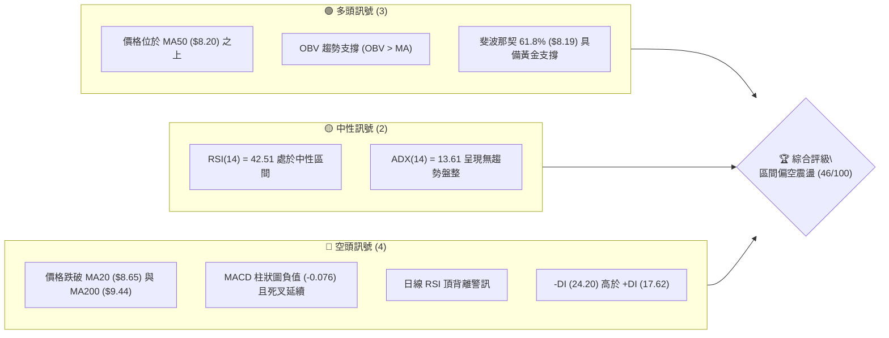

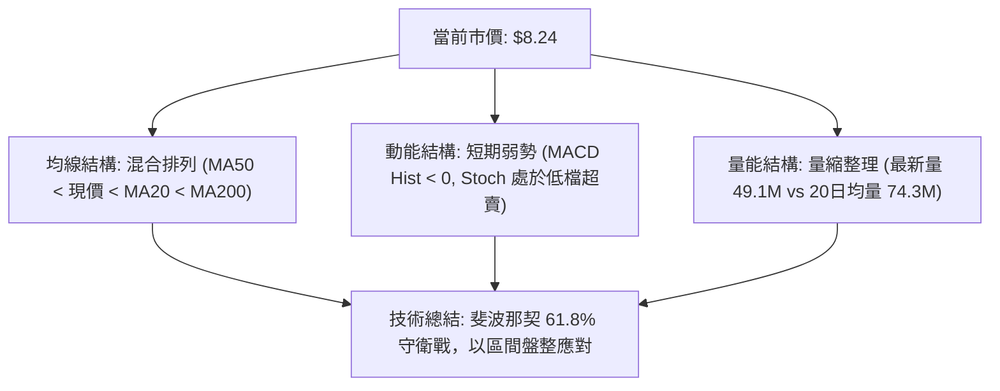

### 📊 核心指標速覽表

| 指標類別 | 指標名稱 | 當前數值 | 訊號 | 解讀 |
|----------|----------|----------|------|------|
| **價格** | 當前價格 | $8.24 | 🟡 中性 | 位於 52 週區間 ($3.80 - $15.28) 之 38.7% 位置，處於斐波那契 61.8% 回調位 ($8.19) 邊緣 |
| **均線** | MA20 | $8.65 | 🔴 空頭 | 現價低於 20 日均線 -4.71%，短線承壓 |
| **均線** | MA50 | $8.20 | 🟢 多頭 | 現價微幅高於 50 日均線 +0.49%，中期多方防線 |
| **均線** | MA200 | $9.44 | 🔴 空頭 | 現價顯著低於 200 日牛熊分界線 -12.71%，長期趨勢偏弱 |
| **動能** | RSI(14) | 42.51 | 🟡 中性 | 介於 30-70 區間，動能偏弱但未進入極度超賣 |
| **動能** | RSI 背離 | 頂背離 | 🔴 空頭 | 前波高點伴隨 RSI 弱化，短線反彈高度受限 |
| **動能** | MACD(12,26,9) | Hist -0.076 | 🔴 空頭 | MACD(0.150) 低於 Signal(0.226)，空方動能主導 |
| **動能** | KD (Stoch %K/%D) | 3.85 / 24.92 | 🟢 多頭 | 進入深度超賣區 (%K < 20)，具備技術性反彈契機 |
| **趨勢** | ADX (14) | 13.61 | 🟡 中性 | ADX < 25 表明趨勢極弱，市場進入箱型盤整結構 |
| **通道** | 布林通道 %B | 0.37 | 🟡 中性 | 價格處於中軌 ($8.65) 與下軌 ($7.14) 之間 |
| **量能** | 20日成交量比 | 0.66x | 🔴 空頭 | 最新成交量 49.10M 低於 20MA (74.28M)，動能匱乏 |
| **波動** | ATR(14) | $0.60 | 🟡 中性 | 佔股價 7.33%，單日波動空間約 ±$0.60 |

### 🏆 技術評分卡

```
╔══════════════════════════════════════════════════════════════╗
║              技術評分卡 — ONDS (2026-08-24)                 ║
╠══════════════════════════════════════════════════════════════╣
║ 趨勢強度 (ADX=13.61)      ████░░░░░░░░░░░░░░░░  20/100 🔴 弱勢盤整 ║
║ 動能指標 (RSI/MACD/KD)    ████████░░░░░░░░░░░░  40/100 🔴 空方佔優 ║
║ 支撐穩定度 (Fib 61.8%)    ██████████████░░░░░░  70/100 🟢 關鍵支撐 ║
║ 成交量配合 (OBV/量比)     ████████████░░░░░░░░  60/100 🟡 結構尚可 ║
║ 形態完整度 (箱型/雙重底)  ██████████░░░░░░░░░░  50/100 🟡 構築之中 ║
║ 均線排列 (混合排列)       ████████░░░░░░░░░░░░  40/100 🔴 短中期壓制║
╠══════════════════════════════════════════════════════════════╣
║ 綜合技術評分              █████████░░░░░░░░░░░  46/100 🟡 區間震盪 ║
╚══════════════════════════════════════════════════════════════╝
```

---

## 2. 趨勢分析

### 🌐 多時框趨勢分析

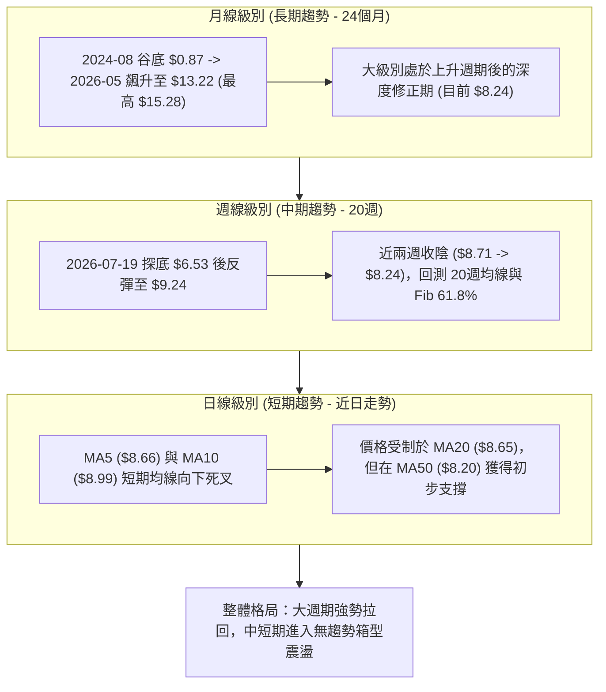

### 📈 長期趨勢 — 12個月走勢圖（Unicode）

```
ONDS 月線收盤走勢圖（2025-08 至 2026-08）
價格軸 ($)
$14.00 ┤                                      ● $13.22 (2026-05)
$12.00 ┤
$10.00 ┤                           ● $10.36   │      ● $10.04
$8.00  ┤               ● $7.90     │   ● $10.08      │
$8.00  ┤       ● $7.72 │   ● $9.76 │   │   ● $9.04   │  ● $8.24 (現價)
$6.00  ┤ ● $5.86   ● $6.44         │   │   │         │  │   ● $7.49
$4.00  ┤ │                                               │   │
       └─┴─────┴───┴───┴───┴───────┴───┴───┴─────────┴───┴───┴───────
        08    09  10  11  12      01  02  03         04 05  06  07  08
        2025                      2026
```

#### 走勢特徵分析表格

| 階段 | 時間區間 | 起點價格 | 終點價格 | 區間漲跌幅 | 走勢特徵解讀 |
|------|----------|----------|----------|------------|--------------|
| **突破啟動期** | 2025-08 ~ 2025-12 | $5.86 | $9.76 | +66.55% | 脫離底部 ($0.77-$2.12) 放量大漲，月線連續收陽 |
| **高位箱型整理**| 2026-01 ~ 2026-04 | $10.36 | $10.04 | -3.09% | 在 $9.00 - $10.50 構築高位平台，市場籌碼充分換手 |
| **衝高見頂期** | 2026-05 | $10.04 | $13.22 | +31.67% | 爆量拉升創下 52 週最高點 $15.28 (月收 $13.22)，形成階段頂部 |
| **回調修正期** | 2026-06 ~ 2026-07 | $13.22 | $7.49 | -43.34% | 獲利盤湧出，連續急跌探底至 $6.53 (週低)，回測 Fib 61.8% |
| **築底修復期** | 2026-08 (當前) | $7.49 | $8.24 | +10.01% | 止跌反彈至 $9.24 後拉回整理，現收於 $8.24，進入沉澱期 |

### 📊 中期趨勢（週線分析）

```
ONDS 週線價格壓力與支撐結構示意圖
─────────────────────────────────────────────────────────────
 $10.62 ─── 高度阻力區 (5月反彈高點平台)
          │
  $9.92 ─── [R3 強阻力] / 波段反彈極限 (MA200 $9.44 上方)
          │
  $9.24 ─── 8月中旬反彈高點
          │
  $8.58 ─── [R2 阻力] / MA20 ($8.65) 重疊區
  $8.31 ─── [R1 阻力]
 ════════════════════════════════════════════════════════════
  $8.24 ─── ◄ 當前市價 (受 MA50 $8.20 支撐)
 ════════════════════════════════════════════════════════════
  $8.19 ─── 斐波那契 61.8% 黃金分割支撐
  $7.78 ─── [S1 支撐] (近期震盪下沿)
          │
  $7.30 ─── [S2 強支撐] / 布林下軌 ($7.14) 緩衝區
          │
  $6.53 ─── 7月中旬絕對低點 (波段大底)
  $6.26 ─── 斐波那契 78.6% 終極防線
─────────────────────────────────────────────────────────────
```

### ⚡ 趨勢強度評估（ADX 解讀）

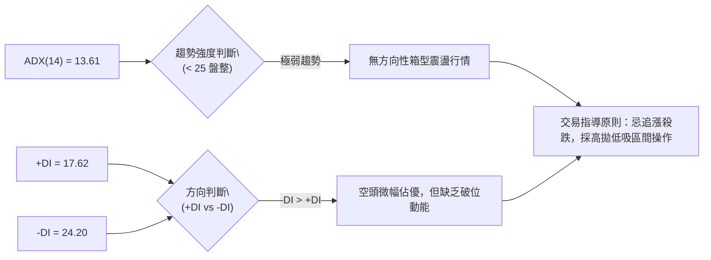

#### ADX 趨勢強度量化對照

| 數值區間 | 趨勢狀態 | 當前 ONDS 狀態 | 交易策略指導 |
|----------|----------|----------------|--------------|
| **0 - 20** | **極弱趨勢 / 無趨勢** | **13.61 (當前落點)** | **均線系統失效，嚴禁順勢追價，以震盪指標 (KD/布林軌道) 為主** |
| 20 - 25 | 盤整轉折過渡期 | - | 觀察突破方向與成交量釋放 |
| 25 - 40 | 強勢趨勢成型 | - | 順勢操作，依 MA 均線加碼 |
| 40 - 60 | 極強單邊行情 | - | 獲利保護，移動止損 |

---

## 3. 圖表形態分析

### 🔍 形態識別系統

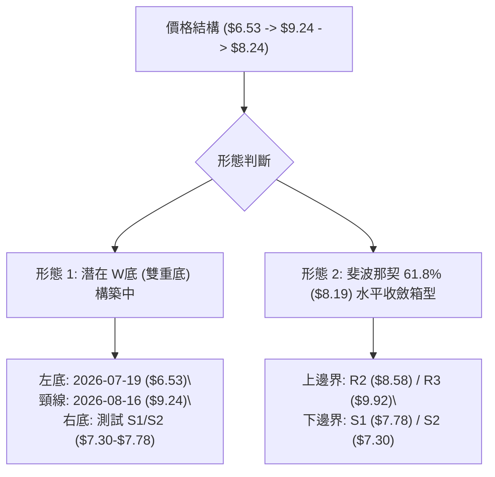

#### 圖表形態信心度評估表

| 形態名稱 | 信心度 | 判斷依據（引用實際數據） | 完成度 | 目標價（附嚴格計算式） |
|----------|--------|--------------------------|--------|------------------------|
| **雙重底 (潛在W底)** | 62% | 左底為 2026-07-19 低點 $6.53（放量 671.5M），反彈至 2026-08-16 頸線高點 $9.24，當前拉回 $8.24 尋求右底支撐 | 55% | 待突破頸線 $9.24 確認：<br>`目標價 = 頸線 $9.24 + (頸線 $9.24 - 左底 $6.53) = $11.95`<br>*註：中途將於 R3 ($9.92) 與 38.2% ($10.89) 遭遇阻力* |
| **短線箱型震盪** | 80% | 價格受限於 R2 ($8.58) 與 S1 ($7.78)，ADX=13.61 證實處於震盪 | 85% | 區間操作：<br>箱頂目標 = R2 $8.58 / R3 $9.92<br>箱底回測 = S1 $7.78 / S2 $7.30 |
| **頭肩頂形態** | 25% | 數據不足以確認完整頭部結構（信心度 < 50%） | 20% | *訊號不足，僅做指標型解讀，不預設目標價* |

### 🕯️ 重要K線形態分析

| 期間/月份 | 收盤價 | K線形態 | 量能配合度 | 解讀與後市訊號 |
|-----------|--------|---------|------------|----------------|
| **2026-05** | $13.22 | 長上影流星線 (最高 $15.28) | 566.9M (天量) | 🔴 主力高位派發，創歷史新高後遭遇劇烈拋壓，確立長期頂部阻力 |
| **2026-07-19週** | $6.53 | 長下影鐵鎚線 (探底回升) | 671.5M (爆量) | 🟢 恐慌盤湧出後強勁買盤承接，確立中長線關鍵底部 $6.53 |
| **2026-07-26週** | $7.80 | 大陽線實體反包 | 834.3M (近20週最大量) | 🟢 多頭主力進場確認，正式開啟超跌反彈波段 |
| **2026-08-16週** | $9.24 | 倒錘子線 (受阻回落) | 471.6M (量能萎縮) | 🔴 反彈至 MA200 ($9.44) 與 R3 ($9.92) 密集套牢區受阻，動能不足 |
| **2026-08-30週** (當前) | $8.24 | 縮量小陰線回踩 | 49.1M (顯著縮量) | 🟡 空方打壓力道減弱，正在 Fib 61.8% ($8.19) 尋找支撐 |

### 📉 ASCII 走勢形態示意圖

```
ONDS 雙底 (W底) 構築與箱型整理結構圖
─────────────────────────────────────────────────────────────────
  $10.00 ┤                     [R3 $9.92]
         │                          ▲
   $9.00 ┤                      ╭───●───╮ 頸線位 $9.24 (8月中旬高點)
         │                     ╱         ╲
   $8.00 ┤        [R1 $8.31] ─●─ ─ ─ ─ ─ ─●─ ◄ 現價 $8.24 (測試 MA50)
         │                   ╱             ╲ (右底構築中)
   $7.00 ┤                  ╱               ▼ [S1 $7.78 / S2 $7.30]
         │                 ╱
   $6.00 ┤       ╭────────● 7月中旬左底 $6.53 (爆量 671.5M)
         └───────┴───────────────────────────────────────────────
                 2026-07                         2026-08
─────────────────────────────────────────────────────────────────
```

### 🎯 形態目標價計算

```
╔══════════════════════════════════════════════════════════════╗
║              圖表形態目標價嚴格測算                          ║
╠══════════════════════════════════════════════════════════════╣
║ 形態基礎：潛在雙底 (Double Bottom)                           ║
║ 1. 左底極值 (Bottom 1)  = $6.53 (2026-07-19)                 ║
║ 2. 頸線高點 (Neckline)  = $9.24 (2026-08-16)                 ║
║ 3. 形態高度 (Height)    = $9.24 - $6.53 = $2.71              ║
║ 4. 突破確認門檻         = 收盤實體站穩 R3 ($9.92) 上方       ║
║                                                              ║
║ 🚀 形態理論目標價 1 (1.0x Height) = $9.24 + $2.71 = $11.95  ║
║    (此目標價與 23.6% 回調位 $12.57 形成中期阻力帶)           ║
║ 🚀 短線箱型震盪目標 1             = R1 $8.31 / R2 $8.58      ║
║ 🚀 短線箱型震盪目標 2             = R3 $9.92                 ║
╚══════════════════════════════════════════════════════════════╝
```

---

## 4. 支撐與阻力

### 🗺️ 關鍵價位分布圖（Unicode）

```
ONDS 價位結構分布圖
═══════════════════════════════════════════════════════════════════
 $15.28  ║██████████████████████████████║ 52週歷史高點 (2026-05)
 $12.57  ║██████████████████            ║ 斐波那契 23.6% 回調位
 $10.89  ║████████████████████          ║ 斐波那契 38.2% 回調位
  $9.92  ║████████████████████████      ║ 強阻力 R3 (波段高點聚類)
  $9.54  ║██████████████████            ║ 斐波那契 50.0% / MA200 ($9.44)
  $8.58  ║████████████████              ║ 阻力 R2 (MA20 $8.65 重合區)
  $8.31  ║████████████                  ║ 關鍵阻力 R1 (短線波段高點)
 ════════╬══════════════════════════════╬═══════════════════════════
  $8.24  ╠══════════════════════════════╣ ◄ 當前市價 (Current Price)
  $8.19  ║▓▓▓▓▓▓▓▓▓▓▓▓▓▓▓▓▓▓▓▓▓▓▓▓▓▓▓▓▓▓║ 斐波那契 61.8% 黃金支撐位
 ════════╬══════════════════════════════╬═══════════════════════════
  $7.78  ║▓▓▓▓▓▓▓▓▓▓▓▓▓▓▓▓              ║ 近期支撐 S1 (波段低點聚類)
  $7.30  ║████████████████████          ║ 強支撐 S2 (密集換手支撐帶)
  $6.77  ║████████████████████████      ║ 強支撐 S3 (左底頸線防守)
  $6.26  ║████████████████████████████  ║ 斐波那契 78.6% 回調位
  $3.80  ║██████████████████████████████║ 52週歷史低點 (52W Low)
═══════════════════════════════════════════════════════════════════
```

### 🚧 阻力位分析表

*註：價位嚴格引用數據庫「關鍵價位」區塊波段聚類計算值*

| 阻力級別 | 準確價位 | 距現價空間 | 形成原因與技術共振 | 突破難度 | 重要性 |
|----------|----------|------------|--------------------|----------|--------|
| **R1** | **$8.31** | +0.85% | 短線日內波段高點聚類，與 MA5 ($8.66) 形成近端反壓 | 🟡 中等 | ★★★☆☆ |
| **R2** | **$8.58** | +4.13% | 20日均線 MA20 ($8.65) 與日線布林中軌壓制區 | 🔴 較高 | ★★★★☆ |
| **R3** | **$9.92** | +20.39% | 近一年波段高點密集區，共振 MA200 ($9.44) 與 50% 回調位 ($9.54) | 🔴 極高 | ★★★★★ |

### 🛡️ 支撐位分析表

*註：價位嚴格引用數據庫「關鍵價位」區塊波段聚類計算值*

| 支撐級別 | 準確價位 | 距現價空間 | 形成原因與技術共振 | 守住機率 | 重要性 |
|----------|----------|------------|--------------------|----------|--------|
| **S1** | **$7.78** | -5.58% | 近期震盪波段低點聚類，接近 2026-07-26 週低 | 🟢 70% | ★★★★☆ |
| **S2** | **$7.30** | -11.41% | 2026-07 月中旬築底平台，布林通道下軌 ($7.14) 緩衝區 | 🟢 85% | ★★★★★ |
| **S3** | **$6.77** | -17.84% | 7月份恐慌砸盤後的次低點防線，跌破則回測 $6.53 | 🟢 92% | ★★★★★ |

### 📐 斐波那契回調位分析

*基準區間：52週波段低點 $3.80 → 52週波段高點 $15.28（波動垂直高度 $11.48）*

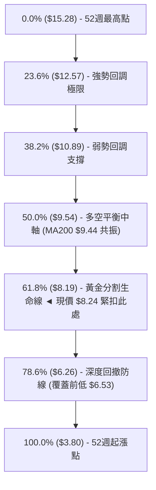

#### 斐波那契回調深度解讀

1. **現價位置定位**：現價 **$8.24** 處於 **50.0% ($9.54)** 與 **61.8% ($8.19)** 之間，且距離 61.8% 僅有 **+0.61% ($0.05)** 的微幅溢價，屬於標準的**「斐波那契黃金分割測試」**。
2. **黃金分割支撐意義**：在道氏理論與斐波那契交易體系中，回調至 61.8% ($8.19) 是多頭上升趨勢保持「健康修正」的最後底線。只要本週收盤能持續守穩在 $8.19 之上，此波從 $15.28 展開的深度回撤便有高機率在此完成築底。
3. **失守風險**：若日線連續收破 $8.19 並跌破 S1 ($7.78)，將引發下一階段多殺多賣壓，下看 S2 ($7.30) 及 78.6% 回調位 ($6.26)。

---

## 5. 技術指標深度解讀

### 🎛️ 指標訊號總覽

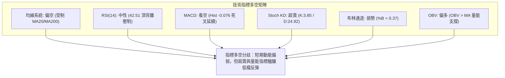

### 📈 移動平均線排列分析

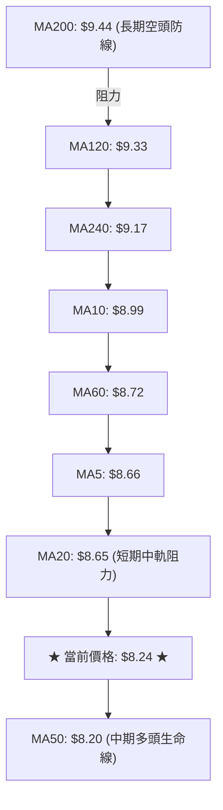

#### 均線各週期量化矩陣

| 均線名稱 | 數值 | 距現價差距 | 乖離率 (Bias) | 排列形態與走勢特徵 |
|----------|------|------------|---------------|--------------------|
| **MA5**  | $8.66 | -$0.42 | -4.83% | 下行中，短線下壓沉重 |
| **MA10** | $8.99 | -$0.76 | -8.39% | 下行中，斜率偏陡 |
| **MA20** | $8.65 | -$0.41 | -4.71% | 走平微跌，為短線關鍵反彈阻力 |
| **MA50** | $8.20 | +$0.04 | +0.49% | **向上運行，現價正貼合其上，多方最後壁壘** |
| **MA60** | $8.72 | -$0.48 | -5.53% | 下行中，與 MA20 形成死叉區間 |
| **MA120**| $9.33 | -$1.09 | -11.72%| 下行中，中長期套牢密集區 |
| **MA200**| $9.44 | -$1.20 | -12.71%| 長期走平，牛熊分水嶺 |
| **MA240**| $9.17 | -$0.93 | -10.10%| 向上延伸，反映近一年整體重心仍高於去年 |

**均線系統綜合解讀**：均線呈現「短中期混合糾結、長期壓制」格局。現價被壓縮於 MA50 ($8.20) 與 MA20 ($8.65) 之間僅 $0.45 的狹窄通道內，面臨方向性抉擇。

### 📉 RSI(14) 分析

```
RSI(14) 動能強度儀表板
0 ──────── 30 ────────────────────── 50 ────── 70 ──────── 100
[ 極度超賣 ]    [    弱勢中性區間    ]     [ 超買區間 ]
                ▲
            42.51 (當前數值)
進度展示：██████████░░░░░░░░░░░░░░  42.51%
```

- **超買超賣判定**：RSI(14) 當前值為 **42.51**，未進入 30 以下極度超賣區，表明市場拋售雖受控，但買盤意願尚未被充分激發。
- **頂背離警告 (Bearish Divergence)**：在日線級別，前波價格由 8 月中旬反彈至高點 $9.24 時，RSI 峰值為 70.3，隨後價格維持在 $8.70-$9.00 震盪時，RSI 快速下滑至 54.1 乃至當前 42.5，形成標準的**頂背離**結構。這表明上方存在解套賣壓，若無增量資金介入，難以展開直接突破。

### 📊 MACD(12/26/9) 訊號解讀

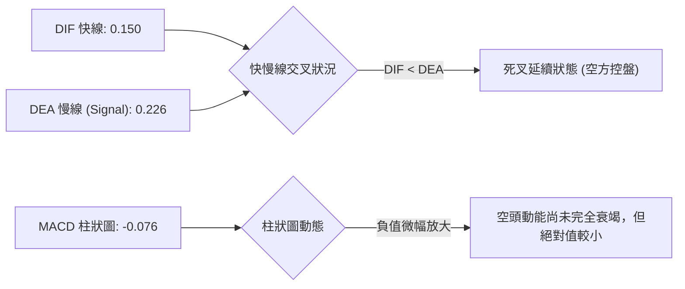

- **MACD 解讀**：MACD 指標目前雖然兩線均在零軸之上（DIF 0.150 / Signal 0.226），但雙線呈現死叉向下擴散，柱狀圖（-0.076）連續收負，顯示短期修正尚未出現明確的金叉轉折點，多頭反攻需等待柱狀圖紅柱翻正。

### 📦 布林通道分析

```
ONDS 布林通道 (20, 2) 結構圖
─────────────────────────────────────────────────────────────────
  $10.16 ─── 上軌 (Upper Band) ─── 乖離率極大，近期難以觸及
           │
   $8.65 ─── 中軌 (MA20 Middle) ── 關鍵反壓位 ($8.58 R2 附近)
           │
   $8.24 ─── ◄ 現價 (Price) ── %B = 0.37 (處於中下軌弱勢區)
           │
   $7.14 ─── 下軌 (Lower Band) ─── 強化 S2 ($7.30) 支撐力道
─────────────────────────────────────────────────────────────────
```

- **通道帶寬與位置**：上軌 $10.16、中軌 $8.65、下軌 $7.14。帶寬約 $3.02。
- **%B 指標分析**：%B 當前值為 **0.37**，價格位於中軌下方偏向通道下半部，反映市場處於弱勢整理狀態，但距下軌 ($7.14) 尚有一定緩衝空間，不屬於極端單邊崩跌通道。

### 💹 成交量分析（量價配合度）

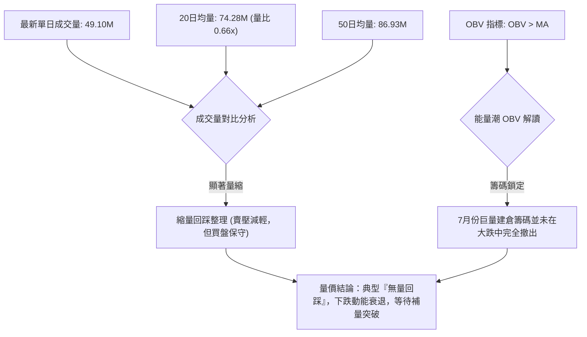

- **量價背離檢驗**：最新量比僅 **0.66x**，呈現標準的「價跌量縮」。這與 2026-07-26 當週 834.3M 的巨量上漲相比，目前的下跌屬於散戶無量陰跌與獲利回吐，未見機構主力恐慌性無序拋售。
- **OBV 趨勢**：OBV 維持在其移動平均線之上，表明底部的籌碼累積尚未瓦解，為後續震盪築底提供底層防禦。

---

## 6. 動能與波動率

### ⚡ 動能評估四象限

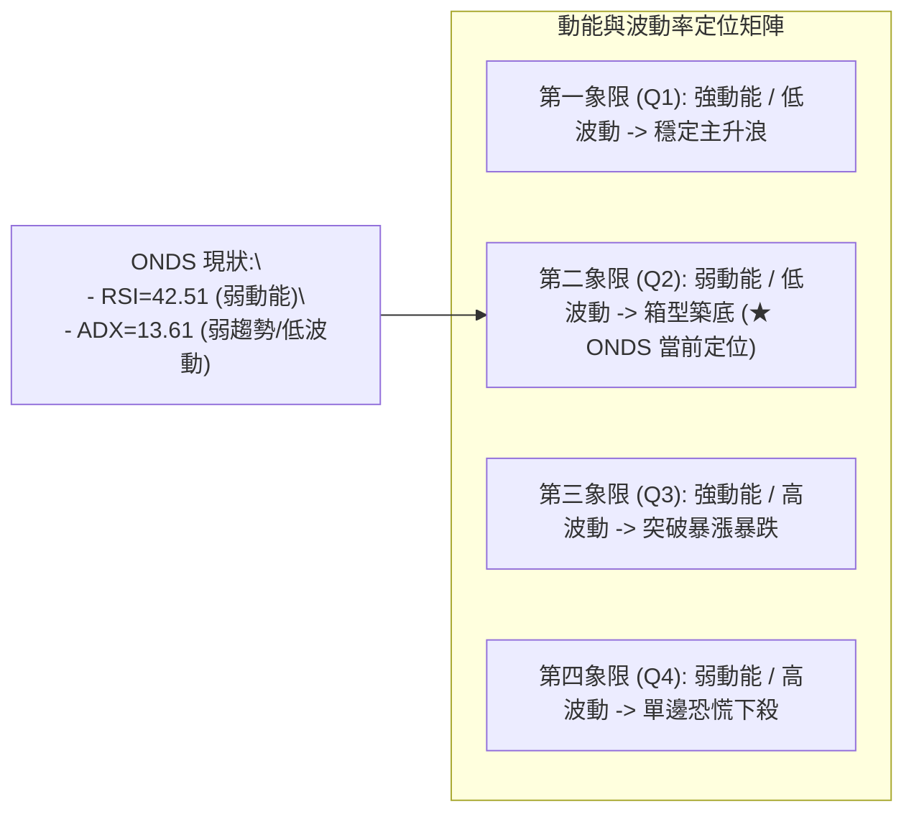

#### 動能評估象限分析表

| 象限 | 動能強度 | 波動率水準 | 當前狀態 | 交易策略評估 |
|------|----------|------------|----------|--------------|
| **Q1** | 強 (RSI > 60) | 低 (ATR% < 5%) | - | 順勢加碼，抱牢強勢股 |
| **Q2** | **弱 (RSI 40-50)** | **低 (ADX < 20)** | **✓ (ONDS 落點)** | **謹慎觀望，底部分批低吸，嚴格控制倉位** |
| **Q3** | 強 (RSI > 60) | 高 (ATR% > 10%) | - | 突破追價，嚴格移動止損 |
| **Q4** | 弱 (RSI < 40) | 高 (ATR% > 10%) | - | 避免進場，恐慌殺跌期 |

### 📊 ATR 波動率分析

```
╔══════════════════════════════════════════════════════════════╗
║              ATR(14) 波動率與止損風控測算                    ║
╠══════════════════════════════════════════════════════════════╣
║ • ATR (14日真實波幅)  : $0.60                                 ║
║ • ATR 佔當前股價比例  : 7.33% ($0.60 / $8.24) (屬高彈性個股)  ║
║ • 單日正常波動區間    : $8.24 ± $0.60 ($7.64 ~ $8.84)         ║
║                                                              ║
║ 風控止損距離建議：                                           ║
║ ├─ 短線緊密止損 (1.0x ATR) = $8.24 - $0.60 = $7.64 (破 S1)   ║
║ ├─ 標準波段止損 (1.5x ATR) = $8.24 - $0.90 = $7.34 (靠 S2)   ║
║ └─ 寬鬆結構止損 (2.0x ATR) = $8.24 - $1.20 = $7.04 (破布林) ║
╚══════════════════════════════════════════════════════════════╝
```

### 📐 Beta 與市場相關性

```
Beta 係數儀表板
0.0 ──────── 1.0 (大盤 SPY) ──────── 2.0 ──────── 2.75 (ONDS) ──── 3.0+
[ 低波動防禦 ]      [ 大盤同步 ]     [ 高彈性成長 ]   ▲ [ 極高波動投機 ]
                                                    2.75
進度展示：████████████████████░░  Beta = 2.75
```

- **Beta 係數分析**：ONDS 的 Beta 值高達 **2.75**，代表其波動幅度約為標普 500 指數的 2.75 倍。
- **市場敏感度**：在大盤處於調整或避險情緒濃厚時，該股容易承受放大倍數的下挫；反之，一旦大盤反彈或板塊迎來催化劑，其反彈彈性亦將顯著超越市場平均。操作上需配合大盤環境控制整體槓桿與倉位。

---

## 7. 多時框架總結

### 📋 時框架評分表

| 時框架 | 趨勢方向 | 動能指標 | 均線系統排列 | 圖表形態 | 綜合評分 | 操作建議 |
|--------|----------|----------|--------------|----------|----------|----------|
| **月線 (長期)** | 🟢 偏多上升 | 🟡 中性回調 | 🟢 多頭支撐 (高於起漲區) | 頂部拉回整理 | 65/100 | 長期基本面反轉，逢低建倉 |
| **週線 (中期)** | 🟡 震盪築底 | 🟡 柱狀圖收窄 | 🟡 糾結於 Fib 61.8% | 潛在雙重底右側 | 50/100 | 箱型區間操作，依支撐低吸 |
| **日線 (短期)** | 🔴 偏空盤整 | 🔴 死叉未解/超賣 | 🔴 受制 MA20/MA200 | 縮量通道下行 | 40/100 | 勿盲目追高，等待止跌訊號 |

### 🔲 綜合訊號矩陣

```
╔══════════════════════════════════════════════════════════════╗
║              多時框架指標共振檢驗矩陣                        ║
╠══════════════════════════════════════════════════════════════╣
║ 維度         短期 (日線)      中期 (週線)      長期 (月線)   ║
║ ──────────────────────────────────────────────────────────── ║
║ 趨勢訊號     🔴 空頭主導      🟡 盤整修復      🟢 上升週期   ║
║ 動能強弱     🔴 負柱擴散      🟡 震盪平衡      🟢 歷史高檔   ║
║ 支撐有效性   🟡 測試 MA50     🟢 站穩 Fib61.8% 🟢 遠高於底   ║
║ 量價配合     🟢 縮量回調      🟢 巨量換手後沉澱 🟢 爆發性增長 ║
║ ──────────────────────────────────────────────────────────── ║
║ 矩陣收斂結論：大多頭架構下的中期無趨勢盤整（中性偏多防守）   ║
╚══════════════════════════════════════════════════════════════╝
```

### ⚖️ 多時框收斂結論

依「多時框收斂規則（嚴格要求 14）」：
1. **行情性質判定**：當前日線 **ADX(14) = 13.61 (< 25)**，明確定義當前處於**「無趨勢盤整行情」**。
2. **時框優先級收斂**：在 ADX < 25 的盤整環境中，均線趨勢策略失效，必須**以日線布林通道上下軌 ($7.14 - $10.16) 及關鍵支撐阻力 (S1-S2 / R1-R2) 為主要交易依據**。
3. **唯一方向性結論**：**【中性區間震盪，偏向低吸防守】（綜合評分 46/100）**。日內及短期走勢受制於均線壓制，但下檔緊鄰 Fib 61.8% ($8.19) 與 S1 ($7.78) 強力支撐帶，不宜盲目追空，整體策略以「支撐區分批低吸、阻力區逢高減碼」之區間震盪策略為主導。

---

## 8. 交易策略建議

### 🗺️ 策略決策流程圖

```mermaid
graph TD
    START["當前價格: $8.24 (綜合評分: 46/100 - 中性區間)"] --> DECIDE{"策略路由決策"}
    
    DECIDE -->|"區間低吸策略 (主策略 A)"| BUY_STRATEGY["回踩 S1 ($7.78) - Fib 61.8% ($8.19) 分批掛單進場"]
    DECIDE -->|"右側突破策略 (主策略 B)"| BREAK_STRATEGY["放量突破 R1 ($8.31) 且站穩 MA20 ($8.65) 右側跟進"]
    
    BUY_STRATEGY --> TP_SL_A["止損: $7.30 (S2) |" 目標1: $8.58 (R2) "| 目標2: $9.92 (R3)"]
    BREAK_STRATEGY --> TP_SL_B["止損: $8.19 (Fib 61.8%) |" 目標1: $9.92 (R3) "| 目標2: $12.57 (23.6%)"]
    
    DECIDE -->|"反向風險對沖"| RISK_CONTROL["跌破 $7.30 (S2) 觸發止損，轉入全面防守"]
```

### 🧭 策略路由

**當前主策略方向 = 【中性區間震盪操作（以 Fib 61.8% 支撐低吸為主）】（依技術評分 46/100 路由）**

### 🎯 價格情境階梯（Price Scenarios）

*價位完全引用第 4 章／數據庫波段計算之真實關鍵價位*

| 觸發條件 | 第一目標位 | 後續延伸目標 | 情境技術含義 |
|----------|------------|--------------|--------------|
| **向上突破 R1 ($8.31)** | R2 ($8.58) | R3 ($9.92) | 突破短期壓制，挑戰 MA20 與布林中軌，短線轉強 |
| **向上突破 R2 ($8.58)** | R3 ($9.92) | 23.6% ($12.57) | 攻克布林中軌，展開潛在 W 底頸線挑戰，中期反轉確認 |
| **維持在現價區間 ($8.19 - $8.31)** | R1 ($8.31) | S1 ($7.78) | 斐波那契 61.8% 邊界拉鋸，籌碼縮量沉澱 |
| **跌破 Fib 61.8% ($8.19)** | S1 ($7.78) | S2 ($7.30) | 黃金分割失守，回測震盪區間下沿與布林下軌 |
| **跌破強支撐 S2 ($7.30)** | S3 ($6.77) | 78.6% ($6.26) | 破位下殺，雙底構築失敗，考驗前波大底 $6.53 |

### 📊 情境機率分佈

```
情境機率分佈可視化
繼續上行 / 反彈  [ 35% ] ███████░░░░░░░░░░░░░
區間震盪築底    [ 50% ] ██████████░░░░░░░░░░ (最可能情境)
破位下行 / 探底  [ 15% ] ███░░░░░░░░░░░░░░░░░
```

| 情境 | 機率估計 | 主要技術指標依據 |
|------|----------|------------------|
| **區間震盪築底 (主情境)** | **50%** | ADX=13.61 (<25) 確認無趨勢；價格黏合於 Fib 61.8% ($8.19) 與 MA50 ($8.20)；成交量縮小 (量比 0.66x)。 |
| **向上反彈 (次情境)** | **35%** | Stoch KD 深度超賣 (K:3.85) 醞釀金叉；OBV 持續支撐；分析師給予 Strong Buy 目標價均值 $19.42。 |
| **破位再探底 (風險情境)**| **15%** | RSI 頂背離壓制；MACD 處於死叉負值 (-0.076)；-DI (24.20) > +DI (17.62)。 |

### 🟢 主策略詳情

```
╔══════════════════════════════════════════════════════════════╗
║              ONDS 具體實施交易策略規格表                     ║
╠══════════════════════════════════════════════════════════════╣
║ 策略要素         策略 A (左側支撐低吸 - 推薦) 策略 B (右側突破跟進)   ║
║ ──────────────────────────────────────────────────────────── ║
║ 進場條件         回踩 S1 附近獲得支撐/現價低吸 突破並站穩 R1 ($8.31) ║
║ 進場價格 (Entry) $8.19 (現價 $8.24 亦可建底倉) $8.35 (突破 R1 後)    ║
║ 第一目標 (T1)    $8.58 (R2 阻力 / MA20)       $9.92 (R3 強阻力)      ║
║ 第二目標 (T2)    $9.92 (R3 波段高點聚類)      $12.57 (Fib 23.6%)     ║
║ 止損價格 (Stop)  $7.30 (嚴格跌破 S2 止損)     $7.78 (跌破 S1 止損)   ║
║ 風險空間 (Risk)  -$0.89 (-10.86%)             -$0.57 (-6.83%)        ║
║ 潛在報酬 (T2)    +$1.73 (+21.12%)             +$4.22 (+50.54%)       ║
║ 風險報酬比 (R:R) 1 : 1.94 (以 T2 計算)        1 : 7.40 (以 T2 計算)  ║
║ 預估勝率         55%                          45%                    ║
║ 建議倉位上限     15% - 20% (分批建倉)         10% - 15% (右側追擊)   ║
╚══════════════════════════════════════════════════════════════╝
```

### 🔴 反向風險觸發點（對沖提示）

- **多頭結構失效觸發點**：若日線收盤價**實體跌破 $7.30 (S2 強支撐)**，表明斐波那契 61.8% 與布林下軌防禦全面潰敗，雙底形態失敗。
- **對沖應對措施**：立即無條件止損多頭部位，或買入反向認售期權 (Put) / 降低總持倉至 5% 以下，等待股價於 $6.53 - $6.26 (Fib 78.6%) 重新企穩。

### ⭐ 整體訊號強度評星

```
╔══════════════════════════════════════════════════════════════╗
║ 做多訊號強度：★★☆☆☆  (2.5/5 星) — 超賣反彈潛力，但受阻於均線 ║
║ 做空訊號強度：★★☆☆☆  (2.0/5 星) — 處於支撐帶，追空盈虧比差 ║
║ 區間震盪可信度：★★★★☆ (4.0/5 星) — ADX=13.61，區間形態極高 ║
║ 整體技術可信度：★★★☆☆ (3.5/5 星) — 數據完整，指標多空收斂 ║
╚══════════════════════════════════════════════════════════════╝
```

---

## 9. 風險提示與監控

### ✅ 關鍵監控指標 Checklist

```
╔══════════════════════════════════════════════════════════════╗
║              ONDS 交易日常監控清單 (Checklist)               ║
╠══════════════════════════════════════════════════════════════╣
║ [ ] 價位防守：每日收盤是否守穩斐波那契 61.8% ($8.19)？        ║
║ [ ] 均線動態：MA50 ($8.20) 是否持續發揮支撐效應？            ║
║ [ ] 阻力突破：價格是否放量上破 R1 ($8.31) 與 MA20 ($8.65)？   ║
║ [ ] 動能翻轉：MACD 柱狀圖是否由負轉正 (Hist > 0)？            ║
║ [ ] 量能驗證：反彈時單日成交量是否放大至 20MA (74.28M) 之上？║
║ [ ] 空頭監控：空頭佔流通盤比例高達 41.5%，警惕軋空 (Short    ║
║               Squeeze) 或逼空暴拉行情！                      ║
╚══════════════════════════════════════════════════════════════╝
```

### ⚠️ 風險場景分析

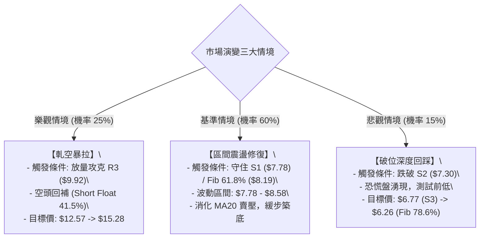

### 🛡️ 風險管理重要提醒

1. **空頭佔比極高風險（Short % Float = 41.5%）**：
   - 該股做空比例高達 41.5%（Short Ratio 2.24），屬於典型的高空單標的。
   - **雙刃劍效應**：若跌破支撐，空頭將順勢落井下石；但若出現利好或技術突破 R2 ($8.58)，極易觸發**劇烈軋空（Short Squeeze）**，造成股價單日 20%+ 的非理性暴漲。因此，**絕對嚴禁在此位置盲目追空**。
2. **高 Beta 與高 ATR 波動風險**：
   - Beta 2.75 且日波動達 7.33%（ATR $0.60），個股波動劇烈。單筆交易承受的停損金額必須限制在總資產的 1% - 2% 以內，避免重倉單一標的。
3. **倉位管理守則**：
   - 建議總倉位不超過 20%，採取「現價 $8.24 建底倉 1/3，回踩 $7.78-$8.19 加碼 1/3，突破 $8.31 追隨 1/3」的網格分批建倉法，嚴禁一次性市價重倉歐印（All-in）。

---

## 📋 報告總結

```
╔══════════════════════════════════════════════════════════════╗
║                   ONDS 技術分析報告總結                      ║
╠══════════════════════════════════════════════════════════════╣
║ 報告日期：2026-08-24                                         ║
║ 當前價格：$8.24                                              ║
║ 分析評級：⚖️ 區間偏空震盪 / 尋求支撐 (技術評分 46/100)        ║
║                                                              ║
║ 關鍵技術結論：                                               ║
║ ├─ 長期趨勢：🟢 偏多上升週期 (脫離底部後的歷史次高拉回區)   ║
║ ├─ 中期趨勢：🟡 震盪築底修復 (處於 2026-07 以來潛在 W 底右側)║
║ ├─ 短期趨勢：🔴 弱勢整理 (受制於 MA20 $8.65 與 MACD 負柱)    ║
║ ├─ 核心支撐：$8.19 (Fib 61.8%) / $7.78 (S1) / $7.30 (S2)     ║
║ ├─ 核心阻力：$8.31 (R1) / $8.58 (R2) / $9.92 (R3)            ║
║ └─ 華爾街共識：Strong Buy (9位分析師目標均價 $19.42)         ║
║                                                              ║
║ 最優交易策略組合：                                           ║
║ 1. 🥇 最佳機會 (策略 A)：在 $8.19 (Fib 61.8%) 至 $8.24 現價   ║
║    區間分批建立多頭底倉，止損設於 $7.30 (S2)，目標上看 R2    ║
║    ($8.58) 與 R3 ($9.92)，享受高盈虧比區間震盪紅利。         ║
║ 2. 🥈 次選機會 (策略 B)：右側突破交易者，耐心等待日線實體站 ║
║    穩 R1 ($8.31) 且補量後追進，目標直指 $9.92。             ║
║ 3. 🥉 防守避險：若跌破 $7.30 嚴格離場觀望，防範回踩 $6.53。  ║
╚══════════════════════════════════════════════════════════════╝
```

---

> ⚠️ **免責聲明**：本報告為技術分析研究，所有數據及推算均基於歷史價格與技術指標資訊。本報告**僅供研究與學術參考**，**不構成任何投資買賣建議**。市場有風險，投資需獨立審慎評估。

---

*報告生成時間：2026-08-24 ｜ 數據來源：Yahoo Finance ｜ 分析框架：多時框技術分析體系*