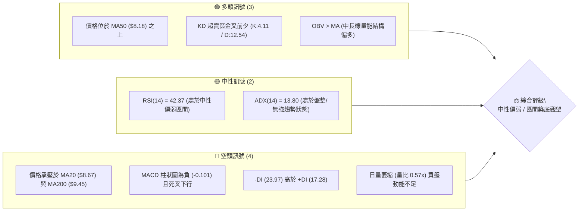
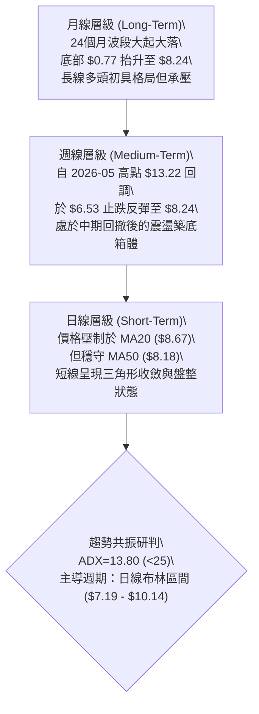
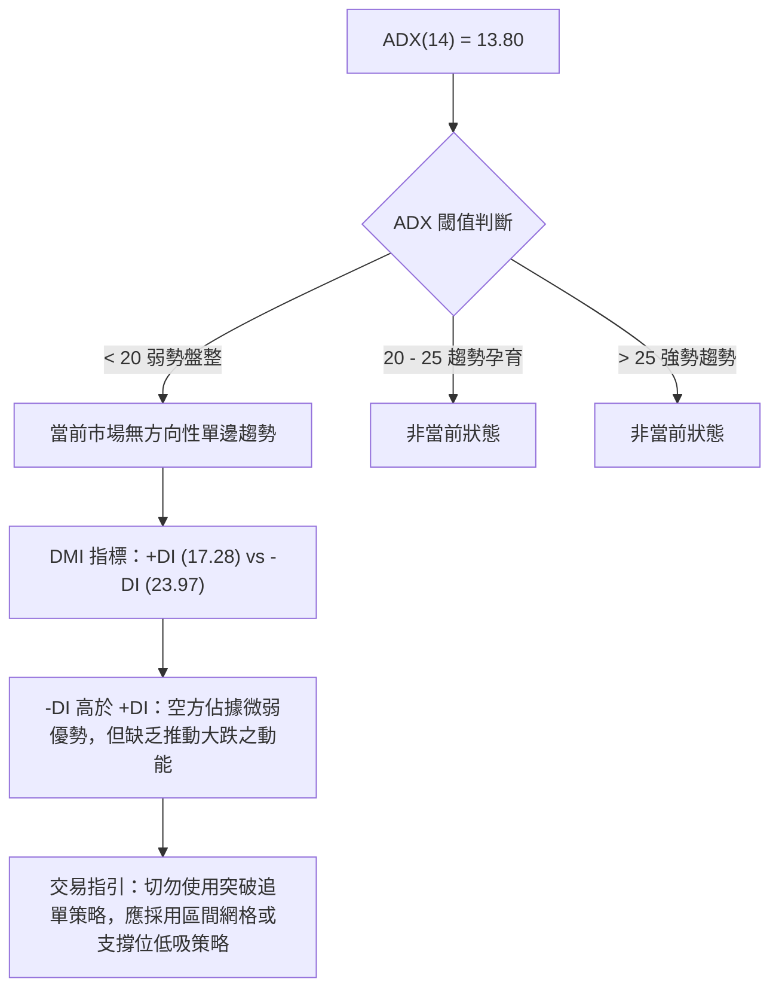
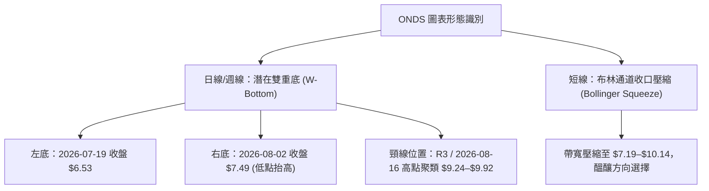
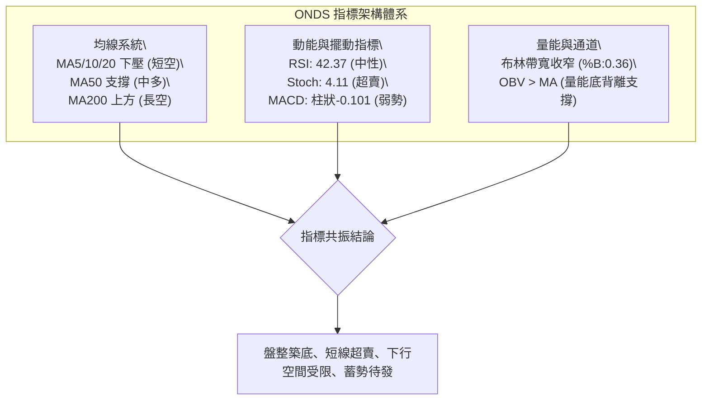
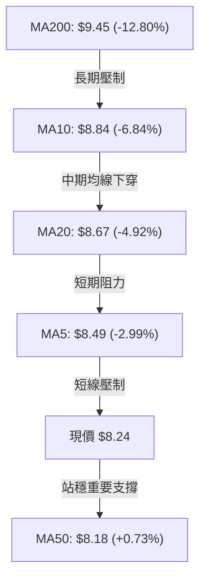
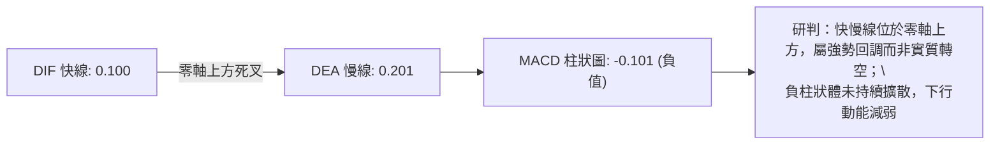
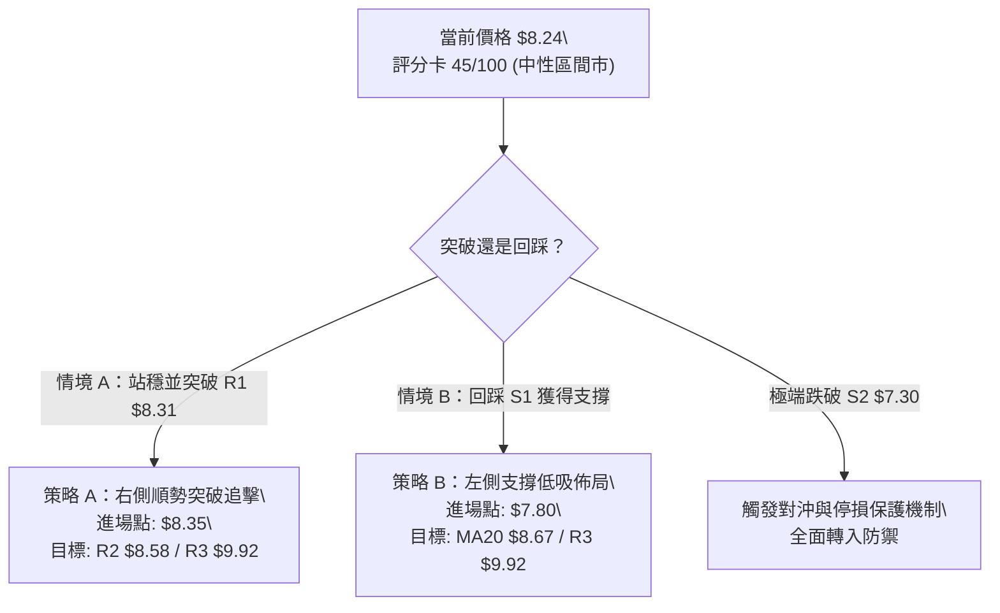
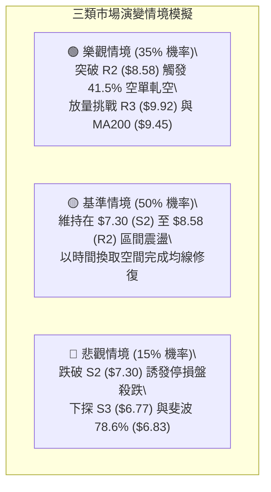

# ONDS 技術分析報告

> **報告日期**：2026-08-25 ｜ **語言**：繁體中文 ｜ **數據來源**：Yahoo Finance ｜ **當前價格**：$8.24

---

## 目錄

| 章節 | 內容 |
|------|------|
| [1. 技術面概覽](#1-技術面概覽) | 訊號儀表板、核心指標、評分卡 |
| [2. 趨勢分析](#2-趨勢分析) | 多時框趨勢、長中短期走勢、ADX 解讀 |
| [3. 圖表形態分析](#3-圖表形態分析) | 形態識別、K線組合、目標價計算 |
| [4. 支撐與阻力](#4-支撐與阻力) | 關鍵價位、斐波那契回調 |
| [5. 技術指標深度解讀](#5-技術指標深度解讀) | MA/RSI/MACD/布林/成交量與 OBV |
| [6. 動能與波動率](#6-動能與波動率) | 動能評估四象限、ATR、Beta 與放空數據 |
| [7. 多時框架總結](#7-多時框架總結) | 時框架評分矩陣、收斂結論 |
| [8. 交易策略建議](#8-交易策略建議) | 主策略路由、情境階梯、風控與對沖點 |
| [9. 風險提示與監控](#9-風險提示與監控) | 關鍵監控清單、風險情境模型、倉位管理 |
| [📋 報告總結](#-報告總結) | 核心結論與最優策略執行矩陣 |

---

## 1. 技術面概覽

### 🎯 技術訊號儀表板



### 📊 核心指標速覽表

| 指標類別 | 指標名稱 | 當前數值 | 訊號 | 專業解讀 |
|----------|----------|----------|------|----------|
| **價格** | 當前收盤價 | $8.24 | 🟡 | 處於 52 週區間 ($4.53–$15.28) 之 34.5% 分位，短線震盪 |
| **均線** | MA20 (布林中軌) | $8.67 | 🔴 | 價格低於 MA20 (-4.92%)，短期處於受壓狀態 |
| **均線** | MA50 | $8.18 | 🟢 | 價格站於 MA50 之上 (+0.73%)，中期基底尚存支撐力道 |
| **均線** | MA200 | $9.45 | 🔴 | 價格顯著低於牛熊分界線 (-12.80%)，長期空頭壓制明顯 |
| **動能** | RSI(14) | 42.37 | 🟡 | 位於 40–50 中性弱勢區，無頂底背離，下行動能減速 |
| **動能** | MACD (12,26,9) | 柱狀圖 -0.101 | 🔴 | 快線 0.100 低於慢線 0.201，零軸上方死叉回落階段 |
| **動能** | Stochastic (%K/%D) | 4.11 / 12.54 | 🟢 | 極度超賣 (<20)，隨時具備短線技術性抽頭反彈契機 |
| **趨勢** | ADX(14) / DMI | 13.80 (-DI領先) | 🟡 | ADX < 25 處於典型無趨勢盤整市，-DI 佔優但無暴跌動能 |
| **通道** | Bollinger Bands | 上:$10.14 / 下:$7.19 | 🟡 | %B 為 0.36，處於中軌至下軌之間，帶寬未出現異常擴張 |
| **波動** | ATR(14) | $0.59 (7.13%) | 🟡 | 日內波動幅度適中，屬高 Beta 小型股正常震盪範疇 |
| **量能** | 20日均量比 | 0.57x (41.43M) | 🔴 | 量能大幅萎縮，市場觀望氣氛濃厚，尚未出現攻擊量 |

### 🏆 技術評分卡

```
╔══════════════════════════════════════════════════════════════╗
║              技術評分卡 — ONDS (2026-08-25)                  ║
╠══════════════════════════════════════════════════════════════╣
║ 趨勢強度 (Trend)       ██████░░░░░░░░░░░░░░  30/100  🔴 偏弱 ║
║ 動能指標 (Momentum)    ████████░░░░░░░░░░░░  40/100  🟡 中性 ║
║ 支撐穩定度 (Support)   ████████████░░░░░░░░  60/100  🟢 尚可 ║
║ 成交量配合 (Volume)    ████████░░░░░░░░░░░░  40/100  🟡 偏低 ║
║ 形態完整度 (Pattern)   ██████████░░░░░░░░░░  50/100  🟡 構築 ║
║ 均線排列 (MA System)   ██████░░░░░░░░░░░░░░  30/100  🔴 糾結 ║
╠══════════════════════════════════════════════════════════════╣
║ 綜合技術評分           █████████░░░░░░░░░░░  45/100  🟡 中性 ║
║ 策略定調               區間震盪 / 逢低佈局 / 嚴設止損        ║
╚══════════════════════════════════════════════════════════════╝
```

---

## 2. 趨勢分析

### 🌐 多時框趨勢分析



### 📈 長期趨勢 — 12個月走勢圖（Unicode）

```
ONDS 月線歷史走勢圖（2025-08 至 2026-08）
價格軸 ($)
$14.00 ┤                                      ● ($13.22 05月峰值)
$12.00 ┤
$10.00 ┤                              ● ($10.36)  ● ($10.04)
$ 8.00 ┤              ● ($7.72)  ● ($7.90)                    ● ($8.24 現價)
$ 6.00 ┤  ● ($5.86)       ● ($6.44)                               ● ($7.49)
$ 4.00 ┤
$ 2.00 ┤
       └─────────────────────────────────────────────────────────────
         08   09   10   11   12   01   02   03   04   05   06   07   08 (月份)
         2025                                           2026
```

#### 走勢特徵分析表格

| 階段區間 | 起止價格 | 漲跌幅 | 結構形態特徵 | 量價關係與市場心理 |
|----------|----------|--------|--------------|--------------------|
| **爆發期** (2025.08–2026.01) | $5.86 → $10.36 | +76.79% | 沿單邊均線上揚，突破前波整理平台 | 主力資金大舉進場，無人機/反無人機業務放量預期 |
| **高位箱體** (2026.01–2026.04) | $10.36 → $10.04 | -3.09% | 在 $9.00–$10.50 區間高位換手 | 多空分歧加劇，獲利盤與解套盤反覆博弈 |
| **衝頂與急挫** (2026.05–2026.07) | $13.22 → $7.49 | -43.34% | 5月爆量衝高至 $13.22 後快速回落 | 獲利了結盤湧出，7月觸及 $6.53 週線波段低點 |
| **震盪收斂** (2026.07–2026.08) | $7.49 → $8.24 | +10.01% | 底部抬升，於 $7.50–$8.50 橫盤收斂 | 拋壓逐步衰竭，成交量降溫，進入沉澱蓄勢期 |

### 📊 中期趨勢（週線分析）

```
週線支撐阻力結構示意圖
$13.22 ══════════════════════════════════════ [5月波段高點 / 結構強阻力]
       │
$10.14 ────────────────────────────────────── [布林上軌 / 壓力區間]
$ 9.92 ────────────────────────────────────── [R3 強阻力 / 斐波那契 50.0%]
$ 9.45 -------------------------------------- [MA200 牛熊分界線]
$ 8.67 -------------------------------------- [MA20 中軌 / 斐波那契 61.8% ($8.64)]
$ 8.24 ◄■■■■■■■■■■■■■■■■■■■■■■■■■■■■■■■■■■■■■■ [當前收盤價]
$ 8.18 -------------------------------------- [MA50 中期均線支撐]
$ 7.78 ────────────────────────────────────── [S1 近期關鍵支撐位]
$ 7.30 ────────────────────────────────────── [S2 強支撐 / 接近布林下軌 $7.19]
$ 6.53 ══════════════════════════════════════ [7月波段極端低點 / 結構硬支撐]
```

### ⚡ 趨勢強度評估（ADX 解讀）



| 指標變數 | 當前讀數 | 強度級別 | 技術意涵解讀 |
|----------|----------|----------|--------------|
| **ADX(14)** | 13.80 | 極弱 (無趨勢) | 市場波動度大幅收斂，處於蓄勢整理期，任何單邊突破均需驗證量能 |
| **+DI (14)** | 17.28 | 多頭動能偏弱 | 買盤攻擊慾望低迷，未形成連續性推升波段 |
| **-DI (14)** | 23.97 | 空頭動能微幅領先 | 空方雖佔上風，但數值未逾 30，不具備主動殺跌恐慌盤 |

---

## 3. 圖表形態分析

### 🔍 形態識別系統



#### 形態識別與信心度評估表

| 形態名稱 | 識別時框 | 信心度 | 判斷依據（嚴格引用數據） | 完成度 | 形態量化目標價（附計算式） |
|----------|----------|--------|--------------------------|--------|----------------------------|
| **雙底形態 (W-Bottom)** | 週線/日線 | 65% | 7月中旬探底 $6.53（左底），8月初於 $7.49 築出抬高次低點（右底），目前於 $8.24 震盪 | 60% | 頸線取 R3 ($9.92)，形態高度 = $9.92 - $6.53 = $3.39。<br>突破目標價 = $9.92 + $3.39 = **$13.31** (接近5月高點 $13.22) |
| **矩形震盪箱體** | 日線 | 80% | 價格持續運行於支撐 S2 ($7.30) 與阻力 R2 ($8.58) 之間，ADX=13.80 | 85% | 箱頂 $8.58 - 箱底 $7.30 = $1.28。<br>向上突破目標 = $8.58 + $1.28 = **$9.86** (高度契合 R3 $9.92) |
| **布林通道收口** | 日線 | 75% | 布林下軌 $7.19 與上軌 $10.14 快速夾縮，ATR 降至 $0.59 | 70% | 突破後量能若放大，目標直指上軌 **$10.14** |

### 🕯️ 重要K線形態分析

| 週期/日期 | 收盤價 | K線形態特徵 | 多空力道解讀 | 訊號評級 |
|-----------|--------|-------------|--------------|----------|
| **2026-05-31** | $13.22 | 爆量長紅衝頂棒 (成交量 566.9M) | 買盤極致釋放後動能耗盡，形成中長期歷史強阻力 | 🔴 頂部力竭 |
| **2026-07-19** | $6.53 | 長下影打底十字星 (成交量 671.5M) | 恐慌盤湧出被主力大單全數承接，確認底部支撐 | 🟢 底部吞噬 |
| **2026-07-26** | $7.80 | 大陽線實體反包 (成交量 834.3M) | 巨量強勢反彈，奠定 $7.00 下方為絕對安全邊際 | 🟢 強烈買訊 |
| **2026-08-16** | $9.24 | 受阻上影倒錘頭 (成交量 471.5M) | 觸及 MA200 ($9.45) 遭遇技術性解套賣壓回落 | 🔴 短線受阻 |
| **2026-08-30 (當前)**| $8.24 | 縮量橫盤星線 (成交量 90.7M) | 拋壓大幅減輕，空頭動能衰竭，處於方向選擇前夕 | 🟡 變盤十字 |

### 📉 ASCII 走勢形態示意圖

```
ONDS 雙底與箱體形態演變圖
價格 ($)
$13.22 ┬───────────────────● 5月高點 (峰值)
       │                    \
$10.14 ┼ - - - - - - - - - - \ - - - - - - - - - - - - - - [布林上軌]
$ 9.92 ┼──────────────────────\───────● 頸線阻力 (R3 $9.92)
       │                       \     / \
$ 8.67 ┼ - - - - - - - - - - - -\ - / - \ - - - - - - - - [MA20中軌]
$ 8.24 ┼─────────────────────────● (現價 $8.24 震盪蓄勢)
       │                         / \
$ 7.49 ┼────────────────────────●─── (右底：抬高之低點)
$ 6.53 ┴──────────● (左底：波段極端低點)
       └─────────────────────────────────────────────────────► 時間
                  2026-07-19   2026-07-26   2026-08-02   2026-08-25
```

---

## 4. 支撐與阻力

### 🗺️ 關鍵價位分布圖（Unicode）

```
╔═══════════════════════════════════════════════════════════════════════╗
║                      ONDS 價位結構分布圖                              ║
╠═══════════════════════════════════════════════════════════════════════╣
║ $15.28 ║████████████████████████████████║ 52W High (歷史極值)        ║
║ $12.74 ║████████████████████            ║ 斐波那契 23.6% 回調位      ║
║ $10.14 ║████████████████████████        ║ 布林帶上軌                 ║
║ $ 9.92 ║████████████████████████████████║ 強阻力 R3 / 斐波 50.0% ($9.90)║
║ $ 9.45 ║████████████████████            ║ MA200 牛熊分水嶺           ║
║ $ 8.67 ║████████████████████████        ║ MA20 / 阻力 R2 ($8.58)      ║
║ $ 8.31 ║████████████████                ║ 近端阻力 R1 (+0.91%)       ║
║ $ 8.24 ╠════════════════════════════════╣ ◄ 現價 ($8.24)             ║
║ $ 8.18 ║▓▓▓▓▓▓▓▓▓▓▓▓▓▓▓▓▓▓▓▓▓▓▓▓        ║ MA50 生命線支撐            ║
║ $ 7.78 ║▓▓▓▓▓▓▓▓▓▓▓▓▓▓▓▓▓▓▓▓▓▓▓▓▓▓▓▓    ║ 近端關鍵支撐 S1 (-5.58%)   ║
║ $ 7.30 ║████████████████████████████████║ 強支撐 S2 / 近布林下軌 $7.19║
║ $ 6.77 ║████████████████████████████████║ 極限防守支撐 S3 (-17.84%)  ║
║ $ 4.53 ║████████████████████████████████║ 52W Low (年線底座)         ║
╚═══════════════════════════════════════════════════════════════════════╝
```

### 🚧 阻力位分析表

| 阻力級別 | 價位 | 距現價幅幅 | 形成原因與籌碼結構 | 突破難度 | 技術重要性 |
|----------|------|------------|--------------------|----------|------------|
| **R1** | $8.31 | +0.91% | 近期日K密集高點與 5日均線 ($8.49) 下壓處 | 🟡 中等 | 短線轉強第一道門檻，突破方能化解空頭反撲 |
| **R2** | $8.58 | +4.13% | 斐波那契 61.8% ($8.64) 與 MA20 ($8.67) 疊合區 | 🔴 較高 | 中期箱體頂部，站穩意味著日線級別多頭反轉啟動 |
| **R3** | $9.92 | +20.45% | 近一年波段高點聚類、斐波 50.0% ($9.90) 及 MA200 ($9.45) 上方 | 🔴 極高 | 牛熊轉換核心樞紐，需 3億股以上巨量方能有效突破 |

### 🛡️ 支撐位分析表

| 支撐級別 | 價位 | 距現價幅幅 | 形成原因與籌碼結構 | 守住機率 | 技術重要性 |
|----------|------|------------|--------------------|----------|------------|
| **S1** | $7.78 | -5.58% | 近期週線回撤低點聚類與 MA50 ($8.18) 下方緩衝區 | 🟢 75% | 短線多頭防守第一線，跌破將下測箱底 |
| **S2** | $7.30 | -11.47% | 近期次低點密集群、布林帶下軌 ($7.19) 支撐 | 🟢 85% | 中期雙底右肩關鍵支撐，具備極強安全邊際 |
| **S3** | $6.77 | -17.84% | 斐波那契 78.6% ($6.83) 與 7月恐慌針底區間 ($6.53) | 🟢 95% | 結構性多頭最後防線，跌破意味形態徹底破敗 |

### 📐 斐波那契回調位分析

基於 52 週波動區間 ($4.53 → $15.28)，回調計算如下：

```
0.0% (52W High) ── $15.28 ══════════════════════════════════════════════
23.6% ──────────── $12.74 ──────────────────────────────────────────────
38.2% ──────────── $11.17 ──────────────────────────────────────────────
50.0% ──────────── $ 9.90 ────────────────────────────────────────────── (與 R3 $9.92 共振)
61.8% ──────────── $ 8.64 ────────────────────────────────────────────── (黃金分割位，與 MA20 $8.67 共振)
現價 ───────────── $ 8.24 ◄── 運行於 61.8% ($8.64) 與 78.6% ($6.83) 區間
78.6% ──────────── $ 6.83 ────────────────────────────────────────────── (與 S3 $6.77 共振)
100.0% (52W Low) ─ $ 4.53 ══════════════════════════════════════════════
```

- **位置意義解讀**：現價 $8.24 處於深度回調的 61.8% ($8.64) 與 78.6% ($6.83) 之間，屬於技術分析中典型的「價值重估支撐帶」。上方 $8.64 為關鍵黃金分割阻力，一旦帶量重返 $8.64 之上，回調格局將正式告終並重啟向 50.0% ($9.90) 的反彈浪。

---

## 5. 技術指標深度解讀

### 🎛️ 指標訊號總覽



### 📈 移動平均線排列分析



| 均線名稱 | 數值 | 距現價差距 | 當前排列與走勢解讀 |
|----------|------|------------|--------------------|
| **MA5** | $8.49 | -2.99% | 快速下彎，短線第一阻力 |
| **MA10** | $8.84 | -6.84% | 處於回落斜率中，構成上方蓋頂壓力 |
| **MA20** | $8.67 | -4.92% | 布林中軌，短線多空生命線，下穿 MA60 ($8.64) 呈現糾結 |
| **MA50** | $8.18 | +0.73% | 唯一步調偏多的中天期均線，現價貼近該線獲得動態承接 |
| **MA200** | $9.45 | -12.80% | 長期均線走平偏下，牛熊分界線，中期強阻力 |

### 📉 RSI(14) 分析

```
RSI(14) 動能刻度表
0 ──────── 20 ──────── 30 ──────── 42.37 ──────── 50 ──────── 70 ──────── 100
[ 極度超賣 ] [  超賣區  ]          [現值]         [中軸]   [ 超買區 ] [ 極度超買 ]
                              ████████░░░░░░░░ 42.37
```

- **背離分析**：
  - **頂背離**：無。5月頂部以來隨價格回落，指標同步釋放壓力。
  - **底背離**：7月中旬價格創 $6.53 低點時 RSI 為 35.0，而此前 6月低點 RSI 為 21.3，呈現標準的「**週線級別指標底背離**」，確認了中期買盤力量在暗中聚集。
  - **當前解讀**：RSI 處於 42.37，脫離弱勢超賣區進入中性整理帶，下行斜率趨緩，隨時可能因超賣修復而展開向上反撲。

### 📊 MACD(12/26/9) 訊號解讀



- **量化數值**：DIF = 0.100，DEA = 0.201，Hist = -0.101。
- **交叉狀態**：8月中旬自高位形成死叉回調，但兩線皆維持在零軸上方運作（>0），表明大週期多頭架構未遭破壞，當前僅為日線級別的良性回踩洗盤。

### 📦 布林通道分析

```
ONDS 布林通道結構圖
$10.14 ┬─────────────────────────────── [上軌：阻力位]
       │
$ 8.67 ┼─────────────────────────────── [中軌 (MA20)：反彈第一目標]
$ 8.24 ┼──────────● (現價：%B = 0.36)
       │
$ 7.19 ┴─────────────────────────────── [下軌：強支撐帶]
```

- **帶寬特徵**：通道帶寬開口大幅收斂，由 5月份的寬幅震盪轉為當前的窄幅收口，這是市場即將迎來「波動率突破」的經典技術前兆。
- **%B 指標**：%B 為 0.36，價格處於中下軌之間，距離下軌 $7.19 僅 $1.05 空間，向下壓縮空間極其有限。

### 💹 成交量分析（量價配合度）

```
成交量走勢對比
最新成交量  (41.44M)  ██████░░░░░░░░░░░░░░  (量比 0.57x)
20日均量    (73.27M)  ███████████░░░░░░░░░
50日均量    (86.67M)  █████████████░░░░░░░
```

- **量價配合度**：呈現典型的「**價跌量縮**」格局。從 8月中旬高點回落過程中，日成交量由 4.71億股驟降至 4,143萬股（降幅逾 90%），顯示市場缺乏實質拋壓，籌碼鎖定良好。
- **OBV (能量潮指標)**：**OBV > MA**，量能趨勢線維持在上揚軌道中。這表明在 7月巨量換手（單週 8.34億股）後，大資金並未撤離，量能結構支持後續向上突破。

---

## 6. 動能與波動率

### ⚡ 動能評估四象限

| 象限 | 動能維度 | 波動率維度 | 當前狀態 | 戰略應對建議 |
|------|----------|------------|----------|--------------|
| **Q1 (突破加速)** | 強 (+DI > -DI, MACD多頭) | 高 (ATR > 10%) | — | 順勢追多，擴大獲利 |
| **Q2 (盤整沉澱)** | 弱 (ADX=13.80, RSI中性) | 低 (ATR=7.13%, 收口) | **✓ 當前 ONDS 處於此區間** | **網格交易、低吸高拋、埋伏佈局** |
| **Q3 (無序震盪)** | 弱 (-DI > +DI) | 高 (寬幅震盪) | — | 降低倉位，嚴設硬止損 |
| **Q4 (恐慌殺跌)** | 強 (空頭單邊暴跌) | 高 (成交量暴增破位) | — | 嚴禁抄底，保持空倉 |

### 📊 ATR 波動率分析與止損設定

- **ATR(14) 數值**：**$0.59**（佔當前股價之 **7.13%**）。
- **日內波動特徵**：歷史波動率 Beta 高達 2.75，屬於典型的高彈性成長標的。ATR $0.59 意味著每日正常雜訊波動在 ±$0.60 左右。
- **止損距離建議**：
  - **短線交易止損**：1.0 × ATR = **$0.59**（止損位設於 $8.24 - $0.59 = **$7.65**，即 S1 $7.78 下方）。
  - **波段交易止損**：1.5 × ATR = **$0.885**（止損位設於 $8.24 - $0.885 = **$7.35**，緊貼 S2 $7.30 支撐）。

### 📐 Beta 與放空數據 (Short Squeeze 潛能)

```
╔══════════════════════════════════════════════════════════════╗
║              籌碼與放空結構分析                              ║
╠══════════════════════════════════════════════════════════════╣
║ Beta (市場相關彈性)     2.75      大盤上漲時具備 2.75倍彈性   ║
║ Short % Float (做空比例) 41.5%     ████████████████░░░ 極高空單║
║ Short Ratio (補次回補日) 2.24 days 流動性下回補需 2.24個交易日║
║ 機構持股比例             58.3%     主力籌碼相對集中           ║
╠══════════════════════════════════════════════════════════════╣
║ 研判結論：高達 41.5% 的放空比例意味著一旦價格帶量突破 R2     ║
║ ($8.58) 及 R3 ($9.92)，將極易觸發空頭軋空 (Short Squeeze)   ║
╚══════════════════════════════════════════════════════════════╝
```

---

## 7. 多時框架總結

### 📋 時框架評分表

| 時框架 | 趨勢方向 | 動能狀態 (RSI/MACD) | 均線排列狀態 | 圖表形態 | 綜合評分 | 戰術建議 |
|--------|----------|---------------------|--------------|----------|----------|----------|
| **月線** | 🟢 長期偏多 | RSI=54 (平穩) / 底部抬升 | 站穩長期基準線 | 走出2年底部震盪 | **70/100** | 戰略性底倉持有 |
| **週線** | 🟡 中期震盪 | RSI=42 / MACD柱-0.101 | 糾結於 MA50 之上 | 潛在大型雙底築底 | **55/100** | 逢低分批佈局 |
| **日線** | 🔴 短期受壓 | Stoch 超賣 / -DI 佔優 | 承壓於 MA20 下方 | 窄幅箱體整理 | **40/100** | 等待放量突破 R1 |

### 🔲 綜合訊號矩陣

```
時框共振度評估矩陣
─────────────────────────────────────────────────────────────
指標維度          日線 (Short)     週線 (Medium)    月線 (Long)
─────────────────────────────────────────────────────────────
均線系統 (MA)        🔴 空頭          🟡 中性          🟢 多頭
動能指標 (Osc)       🟢 超賣          🟡 中性          🟢 偏多
量價結構 (Vol)       🔴 縮量          🟢 巨量沉澱      🟢 OBV向上
形態結構 (Pattern)   🟡 箱體          🟢 雙底          🟢 突破回踩
─────────────────────────────────────────────────────────────
綜合結論             短線蓄勢         中期築底         長線看好
─────────────────────────────────────────────────────────────
```

### ⚖️ 多時框收斂結論

> **依多時框收斂規則（規則 14）**：
> 1. 當前日線 ADX 為 **13.80 (<25)**，明確定義當前市場處於**盤整行情**而非單邊趨勢行情。
> 2. 依規則，盤整市況下以**日線布林通道上下軌 ($7.19 – $10.14) 為核心操作區間**。
> 3. 多時框權衡結果：週線級別底部大幅抬升（$6.53 → $7.49），月線長期向好，日線短線指標（Stoch %K=4.11）極度超賣。日線的弱勢主要源於縮量震盪，而非實質性破位。
> 
> **唯一方向性結論**：**中性偏多（區間震盪築底，偏向逢低做多）**。此結論將嚴格指導第 8 章之策略路由。

---

## 8. 交易策略建議

### 🗺️ 策略決策流程圖



### 🧭 策略路由

**當前主策略方向 = 區間操作 / 偏多低吸（依評分卡 45/100 定調為盤整築底）**

### 🎯 價格情境階梯（Price Scenarios）

| 觸發條件 | 第一目標 | 後續延伸目標 | 情境含義與操作指引 |
|----------|----------|--------------|--------------------|
| **帶量突破 R1 ($8.31)** | R2 ($8.58) | R3 ($9.92) | 短線轉強，空頭動能衰竭，可加碼順勢做多 |
| **突破 R2 / MA20 ($8.58–$8.67)** | R3 ($9.92) | 斐波 38.2% ($11.17) | 日線確認反轉，啟動軋空行情（Short Squeeze） |
| **穩守現價區間 ($8.18–$8.24)** | R1 ($8.31) | R2 ($8.58) | 維持窄幅箱體震盪，適合高拋低吸 |
| **跌破 S1 ($7.78)** | S2 ($7.30) | S3 ($6.77) | 短線轉弱，回踩布林下軌尋求強支撐 |

### 📊 情境機率分佈

```
╔══════════════════════════════════════════════════════════════╗
║              未來 2–4 週價格路徑機率分佈                     ║
╠══════════════════════════════════════════════════════════════╣
║ 1. 區間震盪蓄勢 (Range-bound)    ██████████ 50%              ║
║ 2. 向上突破反彈 (Bullish Break)  ██████░░░░ 35%              ║
║ 3. 向下破位探底 (Bearish Drop)   ███░░░░░░░ 15%              ║
╚══════════════════════════════════════════════════════════════╝
```

- **機率估算依據**：
  - **區間震盪 (50%)**：ADX=13.80 極度低迷，布林帶寬收口，量能萎縮至 0.57x，市場缺乏打破平衡之催化劑。
  - **向上反彈 (35%)**：KD 極度超賣 (%K=4.11)，OBV 中長線量能向好，空單比例達 41.5% 隨時具備反彈動能。
  - **向下探底 (15%)**：下行有 MA50 ($8.18) 及密集支撐帶 S1 ($7.78)/S2 ($7.30) 雙重保護，深度下殺機率極低。

### 🟢 主策略詳情（多頭區間與突破策略）

| 策略要素 | 策略 A：突破順勢追擊單 (右側) | 策略 B：支撐回踩低吸單 (左側) |
|----------|-------------------------------|-------------------------------|
| **適用時機** | 日K收盤帶量突破 R1 ($8.31) | 價格回測 S1 ($7.78) 獲支撐縮量企穩 |
| **進場價格** | **$8.35** (確認突破 R1) | **$7.80** (貼近 S1 支撐) |
| **目標價 T1** | **$8.58** (阻力 R2 / 獲利 +2.75%) | **$8.58** (阻力 R2 / 獲利 +10.00%) |
| **目標價 T2** | **$9.92** (阻力 R3 / 獲利 +18.80%) | **$9.92** (阻力 R3 / 獲利 +27.18%) |
| **止損價格** | **$7.75** (設於 S1 稍下方) | **$7.25** (設於 S2 $7.30 稍下方) |
| **風險報酬比 (R/R)** | **2.62 : 1** (以 T2 計算) | **3.85 : 1** (以 T2 計算) |
| **預估勝率** | 55% | 65% |
| **建議倉位** | 15% 總資金 | 20% 總資金 |

### 🔴 反向風險觸發點（對沖與風控提示）

- **全面停損/對沖觸發價**：**$7.25**（跌破 S2 $7.30 及布林下軌 $7.19）。
- **空頭威脅確認訊號**：若日成交量突破 1.5億股且實體大陰線跌破 $7.78 (S1)，表明洗盤演變為破位，應立即降低 50% 多頭倉位，並於 $7.30 重新評估承接力道。

### ⭐ 整體訊號強度評星

```
╔══════════════════════════════════════════════════╗
║ 做多訊號強度：  ★★★☆☆  (3/5星 — 偏向低吸)        ║
║ 做空訊號強度：  ★★☆☆☆  (2/5星 — 空間受限)        ║
║ 整體訊號可信度：★★★☆☆  (3.5/5星 — 盤整待變)      ║
╚══════════════════════════════════════════════════╝
```

---

## 9. 風險提示與監控

### ✅ 關鍵監控指標 Checklist

```
╔══════════════════════════════════════════════════════════════╗
║              ONDS 交易日常監控清單 (Checklist)               ║
╠══════════════════════════════════════════════════════════════╣
║ [ ] 價格能否收盤站穩 R1 ($8.31) 並挑戰 MA20 ($8.67)          ║
║ [ ] MA50 ($8.18) 是否能持續發揮動態下檔支撐效應              ║
║ [ ] 日成交量是否回升至 20日均量 (73.27M) 以上                ║
║ [ ] KD 指標是否在超賣區順利形成金叉 (%K 向上穿過 %D)         ║
║ [ ] MACD 柱狀圖負值是否收斂至零軸上方 (-0.101 → 0)           ║
║ [ ] 空頭回補天數 (Short Ratio: 2.24) 與放空費率異動          ║
╚══════════════════════════════════════════════════════════════╝
```

### ⚠️ 風險場景分析



### 🛡️ 風險管理重要提醒

1. **高 Beta 波動風險控管**：ONDS 之 Beta 為 2.75，ATR 佔比高達 7.13%。單筆交易最大虧損額度嚴格限制在總賬戶淨值的 **1.5%–2.0%** 以內。
2. **切忌盤整市追高**：在 ADX < 25 的環境下，切勿在逼近阻力位（如 R1 $8.31 或 R2 $8.58）時盲目追價，應堅持「**阻力位不突破即減碼、支撐位企穩才進場**」之紀律。
3. **空單踩踏風險預防**：雖然放空比例高達 41.5% 提供多頭潛在燃料，但若基本面出現利空導致跌破 S3 ($6.77)，高槓桿資金恐出現多殺多，必須堅守止損紀律。

---

## 📋 報告總結

```
╔════════════════════════════════════════════════════════════════════════╗
║                      ONDS 技術分析報告總結                             ║
╠════════════════════════════════════════════════════════════════════════╣
║ 報告日期：2026-08-25                                                   ║
║ 當前價格：$8.24                                                        ║
║ 分析評級：⚖️ 中性觀望 / 區間低吸 (評分: 45/100)                        ║
║                                                                        ║
║ 關鍵趨勢結論：                                                         ║
║ ├─ 長期趨勢：🟢 底部大幅抬升，長期均線維持底部構築格局                ║
║ ├─ 中期趨勢：🟡 自 $13.22 回調後於 $6.53 止跌，處於雙底右肩築底期       ║
║ ├─ 短期趨勢：🔴 縮量受壓於 MA20 ($8.67)，但獲 MA50 ($8.18) 支撐       ║
║ ├─ 關鍵支撐：S1: $7.78 ｜ S2: $7.30 ｜ S3: $6.77                       ║
║ ├─ 關鍵阻力：R1: $8.31 ｜ R2: $8.58 ｜ R3: $9.92                       ║
║ └─ 華爾街共識目標價：$19.42 (9位分析師 Strong Buy)                     ║
║                                                                        ║
║ 最優策略組合：                                                         ║
║ 1. 🥇 最佳機會 (策略 B)：回踩 S1 ($7.80) 佈局做多，止損 $7.25，目標 $9.92║
║ 2. 🥈 次選機會 (策略 A)：突破 R1 ($8.35) 追擊做多，止損 $7.75，目標 $8.58║
║ 3. 🥉 防禦策略：跌破 S2 ($7.30) 全面離場觀望，規避破位下殺風險        ║
╚════════════════════════════════════════════════════════════════════════╝
```

---

> ⚠️ **免責聲明**：本報告為技術分析研究，所有數據及價位推演均基於市場客觀歷史行情資訊。本報告**僅供研究與學術參考**，**不構成任何形式的要約或投資建議**。金融市場具有高度風險，交易決策應由投資人獨立判斷並自負盈虧。

---

*報告生成時間：2026-08-25 ｜ 數據來源：Yahoo Finance ｜ 分析框架：資深多時框量化技術分析體系*