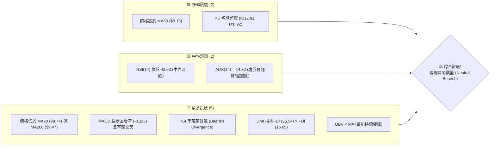
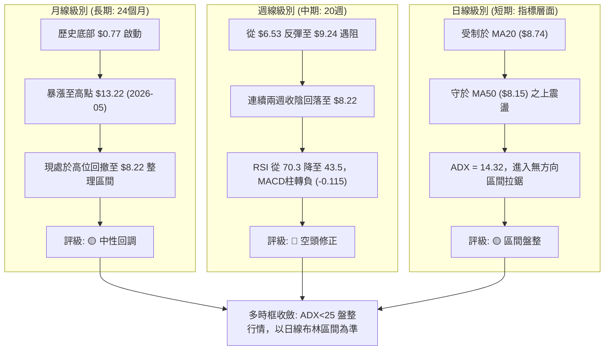
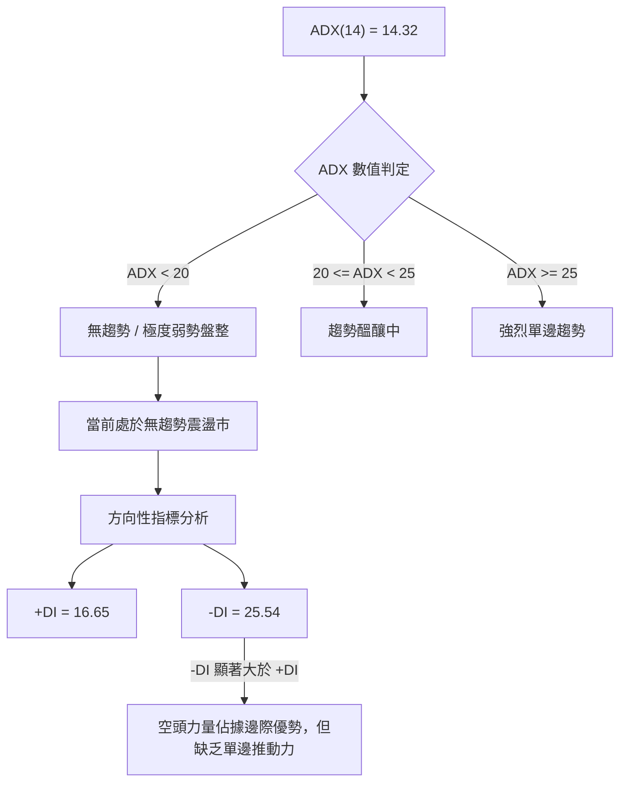
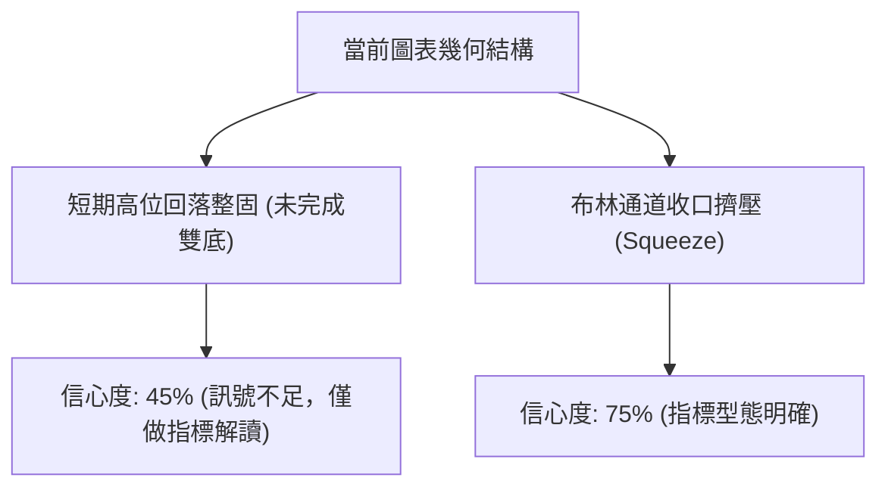
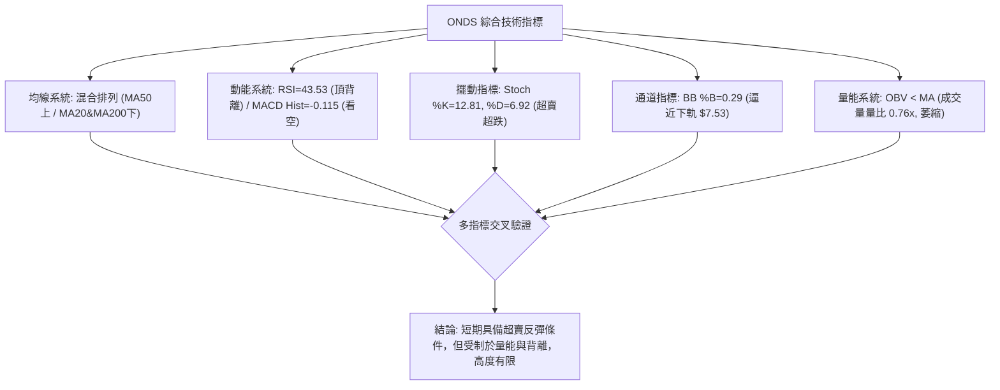
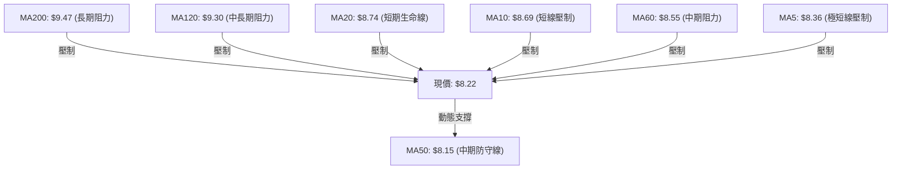
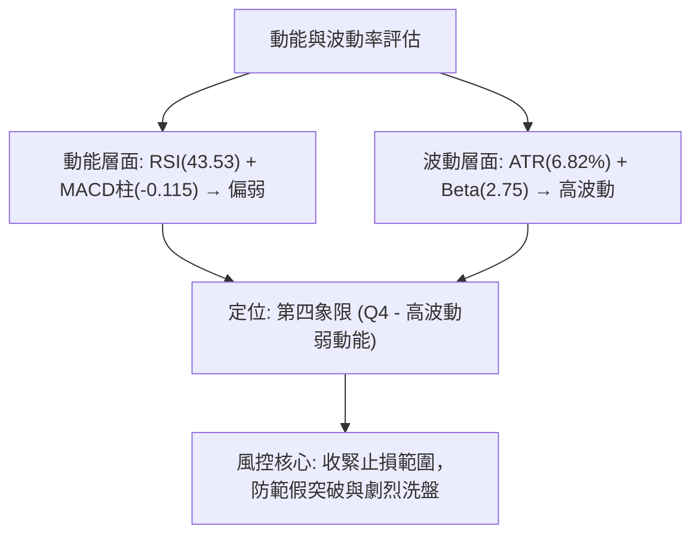
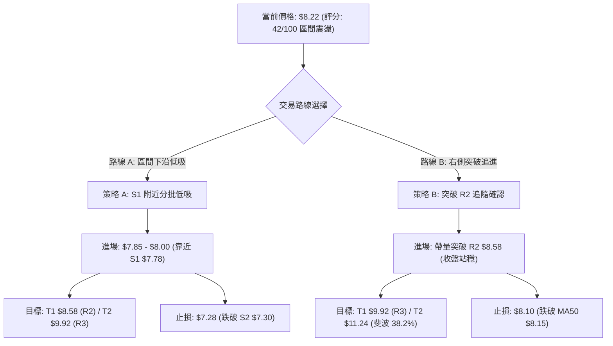
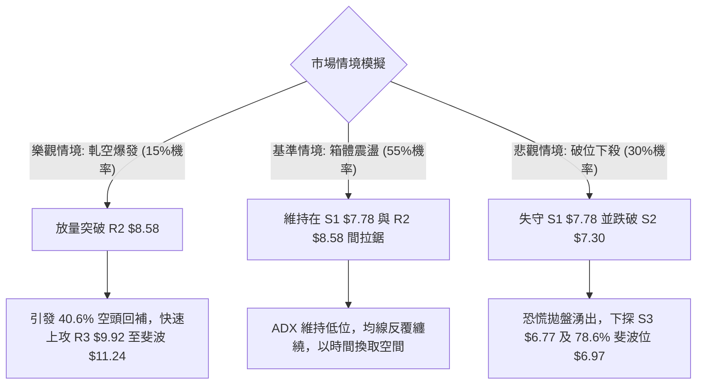

# ONDS 技術分析報告

> **報告日期**：2026-08-27 ｜ **語言**：繁體中文 ｜ **數據來源**：Yahoo Finance ｜ **當前價格**：$8.22

---

## 目錄

| 章節 | 內容 |
|------|------|
| [1. 技術面概覽](#1-技術面概覽) | 訊號儀表板、核心指標、評分卡 |
| [2. 趨勢分析](#2-趨勢分析) | 多時框趨勢、長中短期走勢 |
| [3. 圖表形態分析](#3-圖表形態分析) | 形態識別、K線組合、目標價 |
| [4. 支撐與阻力](#4-支撐與阻力) | 關鍵價位、斐波那契回調 |
| [5. 技術指標深度解讀](#5-技術指標深度解讀) | MA/RSI/MACD/布林/成交量 |
| [6. 動能與波動率](#6-動能與波動率) | 動能評估、ATR、Beta |
| [7. 多時框架總結](#7-多時框架總結) | 時框架評分矩陣 |
| [8. 交易策略建議](#8-交易策略建議) | 多空策略、風險報酬比 |
| [9. 風險提示與監控](#9-風險提示與監控) | 監控指標、風險場景 |

---

## 1. 技術面概覽

### 🎯 技術訊號儀表板



### 📊 核心指標速覽表

| 指標類別 | 指標名稱 | 當前數值 | 訊號 | 解讀 |
|----------|----------|----------|------|------|
| **價格** | 當前價格 | $8.22 | 🟡 | 位於 52 週區間之 33.2%，處於回調整固階段 |
| **均線** | MA20 | $8.74 | 🔴 | 現價低於短期生命線，短期承壓（-5.92%） |
| **均線** | MA50 | $8.15 | 🟢 | 現價略高於中期均線，提供即時動態支撐 |
| **均線** | MA200 | $9.47 | 🔴 | 現價低於長期牛熊分界線，長期趨勢受阻 |
| **動能** | RSI(14) | 43.53 | 🟡 | 處於 30-70 中性偏弱區間，存在頂背離風險 |
| **動能** | MACD柱 | -0.115 | 🔴 | MACD (0.058) 低於 Signal (0.172)，柱狀圖為負 |
| **趨勢** | ADX(14) | 14.32 | 🟡 | ADX < 25 表明處於無明確方向的盤整震盪市場 |
| **波動** | ATR(14) | $0.56 | 🟡 | 日波動率 6.82%，波動性中等偏高，需設定合理止損 |

### 🏆 技術評分卡

```
╔══════════════════════════════════════════════════════════╗
║              技術評分卡 — ONDS (2026-08-27)              ║
╠══════════════════════════════════════════════════════════╣
║ 趨勢強度 (Trend)     ████░░░░░░░░░░░░░░░░  25/100  🔴 弱勢 ║
║ 動能指標 (Momentum)  ██████░░░░░░░░░░░░░░  35/100  🔴 偏空 ║
║ 支撐穩定度 (Support) ████████████░░░░░░░░  60/100  🟡 中性 ║
║ 成交量配合 (Volume)  ██████░░░░░░░░░░░░░░  30/100  🔴 疲弱 ║
║ 形態完整度 (Pattern) ████████░░░░░░░░░░░░  45/100  🟡 盤整 ║
║ 均線排列 (MA System) ████████░░░░░░░░░░░░  40/100  🟡 混亂 ║
╠══════════════════════════════════════════════════════════╣
║ 綜合評分 (Composite) ████████░░░░░░░░░░░░  42/100  🟡 觀望 ║
╚══════════════════════════════════════════════════════════╝
```

---

## 2. 趨勢分析

### 🌐 多時框趨勢分析



### 📈 長期趨勢 — 12個月走勢圖（Unicode）

```
ONDS 月線走勢圖（2025-08 至 2026-08）
價格軸 ($)
$14.00 ┤                                   ● $13.22 (2026-05)
$12.00 ┤                                  ╱ ╲
$10.00 ┤                     ● $10.36   ╱   ╲
$8.00  ┤       ● $7.90     ╱   ╲       ● $10.04 ╲     ● $8.22 (現在)
$6.00  ┤ ● $5.86 ╲       ╱       ● $9.04           ╲   ╱
$4.00  ┤          ● $6.44                           ● $7.49
       └───────────────────────────────────────────────────────────
         08/25 10/25 11/25 01/26 03/26 04/26 05/26 06/26 07/26 08/26
```

#### 走勢特徵分析表格

| 階段區間 | 時間跨度 | 起止價位 | 漲跌幅 | 主要走勢特徵 | 量價表現 |
|----------|----------|----------|--------|--------------|----------|
| **第1階段：主升浪啟動** | 2025-08 ~ 2026-01 | $5.86 → $10.36 | +76.8% | 突破長期底部平台，呈現強烈多頭階梯上漲 | 價增量升，推動估值修復 |
| **第2階段：高位箱體洗盤** | 2026-01 ~ 2026-04 | $10.36 → $10.04 | -3.1% | 在 $9.00 - $10.36 之間形成中繼整理箱體 | 成交量維持穩定，換手充分 |
| **第3階段：極限衝頂噴出** | 2026-04 ~ 2026-05 | $10.04 → $13.22 | +31.7% | 快速拉升創下近24個月最高收盤價 $13.22 | 出現爆量衝頂特徵 |
| **第4階段：劇烈深幅回調** | 2026-05 ~ 2026-07 | $13.22 → $7.49 | -43.3% | 獲利盤湧出，跌破多道中期支撐，最低觸及 $6.53 | 出現恐慌性拋盤與量價背離 |
| **第5階段：反彈受阻再整固** | 2026-07 ~ 2026-08 | $7.49 → $8.22 | +9.7% | 弱勢反彈至 $9.24 後再度回落至 $8.22 盤整 | 20日均量降至 73.09M，量能顯著萎縮 |

### 📊 中期趨勢（週線分析）

```
ONDS 近期週線關鍵價位架構
$10.00 ┤ 阻力位 R3: $9.92 (50.0% 斐波那契回調 $9.99 附近)
$9.00  ┤ 阻力位 R2: $8.58 / 61.8% 斐波那契位 $8.75 (MA20: $8.74)
$8.00  ┤ 現價: $8.22 ───────────┬─ 阻力位 R1: $8.31
       │                         └─ 支撐位 S1: $7.78 (MA50: $8.15)
$7.00  ┤ 支撐位 S2: $7.30 / 78.6% 斐波那契位 $6.97
$6.00  ┤ 支撐位 S3: $6.77 (波段極限低點聚類)
```

### ⚡ 趨勢強度評估（ADX 解讀）



#### ADX 趨勢強度對照解讀

| 指標變數 | 當前數值 | 標準門檻 | 狀態判斷 | 交易指引 |
|----------|----------|----------|----------|----------|
| **ADX(14)** | 14.32 | < 25.0 | 弱趨勢 / 盤整行情 | 嚴禁使用順勢追突破策略，以區間震盪低吸高拋為主 |
| **+DI (多頭動向)** | 16.65 | - | 多頭動能偏弱 | 缺乏主動性買盤推升 |
| **-DI (空頭動向)** | 25.54 | - | 空頭主導動向 | 空方壓制力道高於多方，但未達恐慌性宣洩標準 |
| **趨勢結論** | 盤整偏空 | ADX < 20 | 震盪尋底階段 | 依據收斂規則，以布林通道上下軌（$7.53 - $9.95）作為邊界操作 |

---

## 3. 圖表形態分析

### 🔍 形態識別系統



#### 形態識別與信心度評估表

| 形態名稱 | 信心度 | 判斷依據（引用數據） | 完成度 | 目標價（附計算式） |
|----------|--------|----------------------|--------|--------------------|
| **潛在雙底結構 (W-Bottom)** | 45% | 第一次低點 $6.53 (2026-07-19)，反彈頸線 $9.24 (2026-08-16)，當前回調低點聚類 S1 $7.78 / S2 $7.30 | 50%（尚未突破頸線） | 訊號不足：若以頸線 $9.24 突破計算，形態高度 = $9.24 - $6.53 = $2.71，理論目標 = $9.24 + $2.71 = $11.95。但目前信心度低於 50%，僅供參考，不作為交易依據 |
| **布林通道帶寬收窄 (Band Squeeze)** | 75% | BB 上軌 $9.95，下軌 $7.53，中軌 $8.74；價格落於 %B = 0.29 之低位壓縮區間 | 80% | 指標型態：預期在布林下軌 $7.53 至中軌 $8.74 間震盪，突破中軌後目標為上軌 $9.95 |

### 🕯️ 重要K線形態分析

| 週/月份 | 收盤價 | K線形態 | 解讀 | 訊號 |
|---------|--------|---------|------|------|
| **2026-05 (月線)** | $13.22 | 帶長上影大陽線 (爆量衝頂) | 創 52 週新高 $15.28 後遭遇獲利了結壓制，形成頂部疲態 | 🔴 強烈預警 |
| **2026-07-19 (週線)** | $6.53 | 長下影探底錘子線 (Hammer) | 單週成交量達 671.5M，恐慌盤殺跌後主力資金進場承接 | 🟢 觸底反彈 |
| **2026-08-09 (週線)** | $9.11 | 實體中陽線突破 | 週 RSI 衝至 70.3，確認中級反彈行情展開 | 🟢 短線轉強 |
| **2026-08-23 (週線)** | $8.71 | 上影陰線滯漲 | 遇阻於波段阻力 R2 $8.58 及 MA20 $8.74 區域，多頭動能衰竭 | 🔴 短期受阻 |
| **2026-08-30 (當週)** | $8.22 | 縮量小陰線回踩 | 週成交量萎縮至 146.18M，回測 MA50 ($8.15) 及 S1 ($7.78) | 🟡 縮量整固 |

### 📉 ASCII 走勢形態示意圖

```
ONDS 2026年5月至8月 波段走勢與形態演變
$15.28 ┤       ▲ 52W最高點 (2026-05)
$13.22 ┤      ╱ ╲
$11.00 ┤     ╱   ╲
$9.24  ┤    │     ╲        ▲ 頸線阻力 / 波段反彈高點 (2026-08-16)
$8.74  ┤    │      ╲      ╱ ╲    ◄ MA20 / BB中軌
$8.22  ┤────┼───────╲────┼───●  ◄ 現價 (回測整固中)
$7.78  ┤    │        ╲  ╱        ◄ 支撐 S1
$6.53  ┤    │         ▼ 波段極端低點 (2026-07-19)
       └────┴────────────────────────────────────────
           05/26     07/26   08/26
```

### 🎯 形態目標價計算

依據幾何形態與技術結構：
1. **結構頸線位**：$9.24（2026-08-16 波段反彈高點）
2. **基底支撐位**：$6.53（2026-07-19 最低收盤聚類區間）
3. **推算形態高度**：$9.24 - $6.53 = $2.71
4. **理論突破目標價**：$9.24 + $2.71 = $11.95（需突破頸線且成交量配合方能確立）
5. **當前有效交易區間**：下檔支撐 S1 $7.78 / S2 $7.30，上檔阻力 R1 $8.31 / R2 $8.58

---

## 4. 支撐與阻力

### 🗺️ 關鍵價位分布圖（Unicode）

```
ONDS 價位結構分布圖
══════════════════════════════════════════════════════════════════
$15.28 ║██████████████████████████████║ 52週歷史高點 (52W High)
$11.24 ║████████████████████          ║ 38.2% 斐波那契回調位
$9.99  ║██████████████████████████████║ 50.0% 斐波那契回調位
$9.92  ║████████████████████████      ║ 強阻力 R3 (布林上軌 $9.95)
$8.58  ║██████████████████            ║ 阻力 R2 (MA20: $8.74 / 61.8% 斐波: $8.75)
$8.31  ║████████████████████████      ║ 關鍵阻力 R1 (MA5: $8.36 附近)
───────╠══════════════════════════════╣ ◄ 當前價格: $8.22 (MA50: $8.15)
$7.78  ║▓▓▓▓▓▓▓▓▓▓▓▓▓▓▓▓▓▓▓▓          ║ 近期支撐 S1
$7.30  ║████████████████████████      ║ 強支撐 S2 (78.6% 斐波: $6.97)
$6.77  ║██████████████████████████████║ 極限支撐 S3 (前期底部聚類區)
$4.71  ║██████████████████████████████║ 52週歷史低點 (52W Low)
══════════════════════════════════════════════════════════════════
```

### 🚧 阻力位分析表

| 阻力級別 | 價位 | 形成原因 | 突破難度 | 重要性 |
|----------|------|----------|----------|--------|
| **R1** | $8.31 | 近一年波段高點聚類，疊加短期 MA5 ($8.36) 壓制 | 🟡 中等 | 短線轉強第一道門檻，突破可望挑戰 MA20 |
| **R2** | $8.58 | 近一年波段高點聚類，重合 MA60 ($8.55)、MA20 ($8.74) 與 61.8% 斐波那契位 ($8.75) | 🔴 偏高 | 中期生命線密集帶，為強烈動態阻力區 |
| **R3** | $9.92 | 近一年波段高點聚類，重合布林上軌 ($9.95) 及 50.0% 斐波那契位 ($9.99) | 🔴 極高 | 多空分水嶺，站穩方能重啟大級別牛市行情 |

### 🛡️ 支撐位分析表

| 支撐級別 | 價位 | 形成原因 | 守住機率 | 重要性 |
|----------|------|----------|----------|--------|
| **S1** | $7.78 | 近一年波段低點聚類，緊鄰中期均線 MA50 ($8.15) 下緣 | 🟢 70% | 短線多頭防禦第一線，維持震盪格局關鍵 |
| **S2** | $7.30 | 近一年波段低點聚類，重合布林下軌 ($7.53) 與 78.6% 斐波位 ($6.97) 緩衝區 | 🟢 80% | 區間震盪下沿核心防線，跌破將引發停損潮 |
| **S3** | $6.77 | 近一年波段低點聚類，2026年7月恐慌探底密集承接區 | 🟢 90% | 中長期多頭最後底線，失守意味下探 52W 低點 $4.71 |

### 📐 斐波那契回調位分析

依據 52 週波動區間（高點 $15.28 → 低點 $4.71，總落差 $10.57）計算之標準黃金分割位：

| 斐波那契層級 | 精確價位 | 技術意涵與當前價位關係 |
|--------------|----------|------------------------|
| **0.0% (52W High)** | $15.28 | 歷史峰值，超長期極限目標 |
| **23.6%** | $12.79 | 強勢回調防守位，前波衝頂阻力區 |
| **38.2%** | $11.24 | 中期多空均衡位 |
| **50.0%** | $9.99 | 半數回撤位，高度重合阻力位 R3 ($9.92) |
| **61.8% (黃金分割)** | $8.75 | **關鍵多空分水嶺**：重合 MA20 ($8.74) 與阻力位 R2 ($8.58)|
| **78.6%** | $6.97 | 深度回撤防守位，位於支撐 S2 ($7.30) 與 S3 ($6.77) 之間 |
| **100.0% (52W Low)**| $4.71 | 52 週最低點，終極週期支撐 |

> **當前位置解讀**：現價 $8.22 處於 **61.8% ($8.75)** 與 **78.6% ($6.97)** 之間。價格受到上方 61.8% 黃金分割位及 MA20 ($8.74) 的壓制，屬於深幅回撤後的底部整固區間。

---

## 5. 技術指標深度解讀

### 🎛️ 指標訊號總覽



### 📈 移動平均線排列分析



#### 均線數據明細

| 均線名稱 | 當前數值 | 偏離現價 | 走勢特徵 | 訊號解讀 |
|----------|----------|----------|----------|----------|
| **MA5** | $8.36 | -1.65% | 走平微跌 | 極短線反彈第一道關卡 |
| **MA10** | $8.69 | -5.41% | 下行壓制 | 短期下行趨勢尚未扭轉 |
| **MA20** | $8.74 | -5.92% | 下彎 | 短線生命線失守，形成動態阻力 |
| **MA50** | $8.15 | +0.86% | 向上運行 | **唯一多頭均線**，為現價提供下檔支撐 |
| **MA60** | $8.55 | -3.89% | 下行 | 中期均線呈空頭壓制 |
| **MA120**| $9.30 | -11.58% | 下行 | 長期下降趨勢未改 |
| **MA200**| $9.47 | -13.20% | 走平偏下 | 牛熊分水嶺，未有效收復前均為反彈市 |
| **MA240**| $9.18 | -10.46% | 緩慢上行 | 超長期基底線 |

### 📉 RSI(14) 分析

- **RSI(14) 數值**：`43.53`
- **強度進度條**：`████████░░░░░░░░░░░░` (43.53%)
- **區間評估**：位於 30-70 常態中性偏弱區，未進入極端超賣（<30），但買盤承接力道有限。
- **背離分析**：⚠️ **日線頂背離（Bearish Divergence）**。
  - **具體依據**：價格在 2026-08-16 反彈至 $9.24 時，RSI 僅達到 60.5（前波 2026-08-09 價格 $9.11 時 RSI 為 70.3），形成「價格微創高但 RSI 指標顯著走低」之頂背離結構。該背離已引發後續兩週價格自 $9.24 回落至 $8.22，目前背離修正尚未完全消化完畢。

### 📊 MACD(12/26/9) 訊號解讀


- **MACD 線**：0.058
- **Signal 線**：0.172
- **MACD 柱**：-0.115（紅色看空柱）
- **解讀**：MACD 在零軸上方形成死叉，柱狀圖持續在負值區間延伸，表明中期反彈動能已遭破壞，短期仍處於空頭修正節奏中。

### 📦 布林通道分析

```
ONDS 布林通道結構 (20日參數, 2倍標準差)
$9.95 ┤─────────────────────── 上軌 (Upper Band)
      │
$8.74 ┤─────────────────────── 中軌 (Middle Band / MA20)
      │
$8.22 ┤═══════════════════════ 現價 (BB %B = 0.29)
      │
$7.53 ┤─────────────────────── 下軌 (Lower Band)
```

- **BB 上軌**：$9.95
- **BB 中軌 (MA20)**：$8.74
- **BB 下軌**：$7.53
- **BB %B**：`0.29`（位於下半區間）
- **通道特徵**：帶寬維持在 $7.53 至 $9.95 之間（帶寬幅度約 32%），現價 $8.22 位於中軌與下軌之間，%B 接近 0.30，表明價格正在測試下軌支撐區間的有效性，若無重大利空，下軌 $7.53 與支撐 S1 $7.78 將提供良好屏障。

### 💹 成交量分析（量價配合度）

- **最新成交量**：55,250,700 股
- **20日均量**：73,093,575 股（量比：0.76x，萎縮 24%）
- **50日均量**：86,614,072 股
- **OBV 趨勢**：`OBV < MA`（能量潮指標低於其均線，量能呈現持續流出狀態）
- **量價背離診斷**：
  - 在近兩週的回調過程中，成交量由 471.6M（08-16 週）驟降至 146.2M（08-30 週），呈現**縮量回調**特徵。
  - 縮量代表空方殺跌動能同樣在衰退，但由於 OBV 未見主力積極回補跡象，多頭反攻需要量能重新放大至 20日均量（73.1M）之上方能確立。

---

## 6. 動能與波動率

### ⚡ 動能評估四象限

| 象限分類 | 動能特徵 (RSI / MACD) | 波動特徵 (ATR / Beta) | 當前狀態 | 交易策略意涵 |
|----------|-----------------------|-----------------------|----------|--------------|
| **第一象限 (Q1)** | 強動能 (RSI>60, MACD金叉) | 低波動 (ATR%<5%) | — | 趨勢穩健，最優順勢加碼區 |
| **第二象限 (Q2)** | 弱動能 (RSI<50, MACD死叉) | 低波動 (ATR%<5%) | — | 沉悶築底，謹慎觀望 |
| **第三象限 (Q3)** | 強動能 (RSI>60, MACD金叉) | 高波動 (ATR%>6%, Beta>2) | — | 爆發突破，高風險高回報追擊 |
| **第四象限 (Q4)** | **弱動能 (RSI:43.5, MACD:-0.115)** | **高波動 (ATR%:6.82%, Beta:2.75)** | **✓ (當前處於此區)** | **高波動弱動能，嚴禁追漲，以區間低吸短打為主** |



### 📊 ATR 波動率分析

- **ATR(14) 數值**：`$0.56`
- **佔現價比例**：`6.82%`
- **波動特性解讀**：每日平均波動高達 $0.56，表明 ONDS 具備典型的成長型科技股高彈性特徵。
- **止損距離建議**：
  - **日內短線止損**：1.0 × ATR = **$0.56**（若現價 $8.22 進場，短線止損設於 $7.66，靠近 S1 $7.78）
  - **波段交易止損**：1.5 × ATR = **$0.84**（對應止損價位 $7.38，緊貼 S2 $7.30 防線）

### 📐 Beta 與市場相關性

- **Beta 係數**：`2.75`
- **放大幅度**：相對於標普500指數（S&P 500），ONDS 的波動幅度約為大盤的 **2.75 倍**。
- **市場意涵**：在大盤處於上漲週期時具備極高彈性（高 Beta 溢價），但在大盤震盪或回調時，其下行修正力道亦將被顯著放大。當前高達 40.6% 的空頭部位（Short % Float）與 2.17 的 Short Ratio，進一步加劇了短期因消息面引發軋空（Short Squeeze）或逼跌的潛在波動。

---

## 7. 多時框架總結

### 📋 時框架評分表

| 時框架 | 趨勢方向 | 動能指標 | 均線排列 | 形態結構 | 綜合評分 | 建議策略 |
|--------|----------|----------|----------|----------|----------|----------|
| **月線 (長期)** | 🟡 震盪整理 | RSI 中性偏多 | MA240 向上 / 處歷史中位 | 大級別回撤整固 | 55/100 | 逢低分批佈局 |
| **週線 (中期)** | 🔴 震盪回調 | MACD 柱翻負 | 跌破 20 週線 | 反彈受阻收陰 | 40/100 | 觀望等待止跌 |
| **日線 (短期)** | 🟡 區間盤整 | KD 超賣 / RSI 背離 | 夾於 MA50 與 MA20 之間 | 布林下半區震盪 | 42/100 | 區間高拋低吸 |

### 🔲 綜合訊號矩陣

```
╔══════════════════════════════════════════════════════════════════╗
║                   ONDS 多時框架訊號一致性矩陣                   ║
╠══════════════════════════════════════════════════════════════════╣
║ 維度         短期 (日線)       中期 (週線)       長期 (月線)     ║
╠══════════════════════════════════════════════════════════════════╣
║ 趨勢方向     🟡 橫盤盤整       🔴 弱勢修正       🟡 中性整理     ║
║ 動能狀態     🔴 動能減弱       🔴 空頭主導       🟢 多頭底蘊     ║
║ 均線支撐     🟢 MA50 ($8.15)   🔴 MA20 壓制      🟢 MA240 支撐   ║
║ 成交量能     🔴 縮量觀望       🔴 量能萎縮       🟢 歷史量能尚存 ║
║ 關鍵訊號     Stoch 超賣反彈    MACD 頂部死叉     處於估值修復期  ║
╚══════════════════════════════════════════════════════════════════╝
```

### ⚖️ 多時框收斂結論

依據多時框收斂規則（嚴格要求 14）：
1. **行情屬性判定**：當前 ADX(14) 數值為 **14.32**（顯著低於 25.0 門檻），確認市場處於 **「弱趨勢 / 盤整行情」**。
2. **主導維度收斂**：在無趨勢的盤整市況下，順勢指標失效，應以 **日線布林通道（下軌 $7.53 至上軌 $9.95）** 及波段關鍵支撐阻力為主要交易區間。
3. **最終方向性結論**：**🟡 中性觀望 / 區間偏弱震盪（綜合評分 42/100）**。短期內價格將在支撐位 S1 ($7.78) / S2 ($7.30) 與阻力位 R1 ($8.31) / R2 ($8.58) 之間反覆拉鋸，策略應以「區間下沿低吸、上沿遇阻止盈」之區間震盪策略為主，避免追高殺跌。

---

## 8. 交易策略建議

### 🗺️ 策略決策流程圖



### 🧭 策略路由

> **當前主策略方向 = 🟡 區間震盪操作（依評分 42/100，處於 40–60 之中性震盪區間，以布林下軌及關鍵支撐 S1/S2 為核心防線，等待放量突破確認）**

### 🎯 價格情境階梯（Price Scenarios）

| 觸發條件 | 下一目標 | 後續延伸 | 情境含義 |
|----------|----------|----------|----------|
| **向上突破 R1 $8.31** | 阻力 R2 $8.58 | 阻力 R3 $9.92 | 短線擺脫均線壓制，展開向布林中軌/上軌之反彈 |
| **突破並站穩 R2 $8.58** | 阻力 R3 $9.92 | 斐波那契 $11.24 | 中期反轉確立，空頭回補（軋空）行情啟動 |
| **現價 $8.22 橫盤整理** | 區間 $7.78 - $8.58 | — | 指標修復期，延續無趨勢箱體震盪 |
| **跌破 S1 $7.78** | 支撐 S2 $7.30 | 斐波那契 $6.97 | 短線轉弱，回測布林下軌 $7.53 及黃金分割位 |
| **跌破 S2 $7.30** | 支撐 S3 $6.77 | 52W 低點 $4.71 | 中期防線潰敗，開啟新一輪探底走勢 |

### 📊 情境機率分佈

| 情境 | 機率 | 主要依據 |
|------|------|----------|
| **情境一：區間震盪（$7.78 - $8.58）** | **55%** | ADX(14)=14.32 處弱勢無趨勢狀態，布林帶寬收窄，成交量萎縮至均量以下 |
| **情境二：向下探底測試（下探 S2 $7.30）** | **30%** | MACD 柱狀圖看空 (-0.115)，-DI (25.54) 佔優，RSI 頂背離尚未完全化解 |
| **情境三：放量向上突破（挑戰 R3 $9.92）** | **15%** | 空頭比例高達 40.6%，若有外部利多可能引發軋空，但當前 OBV 疲弱尚無徵兆 |

### 🟢 主策略詳情（方向：區間操作 / 震盪低吸）

| 策略要素 | 策略 A（左側支撐低吸 — 穩健型） | 策略 B（右側突破進場 — 積極型） |
|----------|----------------------------------|----------------------------------|
| **進場條件** | 價格回踩 S1 ($7.78) 企穩，出現日線反彈K線 | 日線收盤價帶量突破阻力位 R2 ($8.58) |
| **進場價格** | **$7.85** | **$8.65** |
| **目標價 T1** | **$8.58**（阻力位 R2，漲幅 +9.3%） | **$9.92**（阻力位 R3，漲幅 +14.7%） |
| **目標價 T2** | **$9.92**（阻力位 R3，漲幅 +26.4%） | **$11.24**（斐波那契 38.2%，漲幅 +29.9%） |
| **止損價格** | **$7.28**（跌破強支撐 S2 $7.30，跌幅 -7.3%）| **$8.10**（跌破 MA50 $8.15，跌幅 -6.4%） |
| **風險報酬比** | **1 : 3.62** (至 T2) / **1 : 1.27** (至 T1) | **1 : 4.67** (至 T2) / **1 : 2.30** (至 T1) |
| **成功機率** | **58%** | **48%** |
| **建議倉位** | **10% - 15%**（輕倉分批試單） | **15% - 20%**（確認突破後順勢配置） |

### 🔴 反向風險觸發點（對沖提示）

- **多頭全面止損/反手放空觸發點**：若日線實體陰線**收盤跌破 S2 $7.30**，表明 78.6% 斐波那契支撐及布林下軌防線徹底失效，下檔空間打開至 S3 $6.77 甚至更低，應立即出清所有多頭部位或建立反向對沖部位。
- **空頭平倉/軋空預警觸發點**：若價格**放量突破阻力位 R2 $8.58** 且單日成交量超過 86.6M（50日均量），高達 40.6% 的高空頭部位將引發強制平倉潮（Short Squeeze），空方必須立即止損離場。

### ⭐ 整體訊號強度評星

```
╔══════════════════════════════════════════════════════════╗
║ 做多訊號強度：  ★★☆☆☆  (2.0 / 5星 - 動能不足，僅限低吸) ║
║ 做空訊號強度：  ★★★☆☆  (3.0 / 5星 - 均線壓制，但處超賣) ║
║ 整體可信度：    ★★★☆☆  (3.5 / 5星 - 盤整區間邊界清晰) ║
╚══════════════════════════════════════════════════════════╝
```

---

## 9. 風險提示與監控

### ✅ 關鍵監控指標 Checklist

```
╔══════════════════════════════════════════════════════════════════╗
║               ONDS 每日技術風險監控 Checklist                   ║
╠══════════════════════════════════════════════════════════════════╣
║ [ ] 價格是否跌破中期防禦線 MA50 ($8.15)                          ║
║ [ ] 價格是否有效跌破第一波段支撐 S1 ($7.78)                      ║
║ [ ] 日成交量是否放大至 73.1M (20日均量) 以上確認方向             ║
║ [ ] MACD 柱狀圖是否縮腳由負轉正 (-0.115 → 0)                     ║
║ [ ] RSI(14) 是否跌破 40 進入弱勢空頭區間                         ║
║ [ ] 空頭佔比 (Short % Float = 40.6%) 是否出現異動軋空跡象        ║
║ [ ] 布林通道帶寬是否由壓縮轉為向下開口擴張                       ║
╚══════════════════════════════════════════════════════════════════╝
```

### ⚠️ 風險場景分析



### 🛡️ 風險管理重要提醒

1. **高空頭佔比的雙刃劍效應**：ONDS 的做空比例高達 **40.6%**（Float 的四成以上被放空），這意味著該股具有極端的**非對稱波動風險**。任何利多催化均可能引發暴力軋空，但若基本面疲弱或跌破關鍵支撐，亦會加速程式化停損賣壓。
2. **高 Beta 波動控制**：Beta 高達 **2.75**，單日振幅極大（ATR 為 $0.56 / 6.82%）。單筆交易最大虧損額度應嚴格限制在總資產的 **1.0% - 1.5%** 以內，嚴禁在高波動盤整期過度放大槓桿。
3. **倉位配置原則**：在 ADX < 25 的震盪市況下，總持倉部位不宜超過 **30%**，應保留充足現金儲備，待放量突破關鍵阻力 R2 ($8.58) 確認右側趨勢後再行加碼。

---

## 📋 報告總結

```
╔══════════════════════════════════════════════════════════════════╗
║                    ONDS 技術分析報告總結                         ║
╠══════════════════════════════════════════════════════════════════╣
║ 報告日期：2026-08-27                                             ║
║ 當前價格：$8.22                                                  ║
║ 分析評級：⚖️ 區間震盪 / 觀望評級 (Composite Score: 42/100)        ║
╠══════════════════════════════════════════════════════════════════╣
║ 關鍵結論：                                                       ║
║ ├─ 長期趨勢：🟡 月線處於自 $13.22 衝頂後的高位中性整固階段        ║
║ ├─ 中期趨勢：🔴 週線受阻於 $9.24，MACD柱轉負，處弱勢修正階段     ║
║ ├─ 短期趨勢：🟡 ADX(14)=14.32 呈現無趨勢盤整，夾於 MA50 與 MA20 ║
║ ├─ 關鍵支撐：S1: $7.78 ｜ S2: $7.30 ｜ S3: $6.77                 ║
║ ├─ 關鍵阻力：R1: $8.31 ｜ R2: $8.58 ｜ R3: $9.92                 ║
║ └─ 分析師共識目標：$19.42 (Low: $13.00, High: $25.00)            ║
╠══════════════════════════════════════════════════════════════════╣
║ 最優策略組合：                                                   ║
║ 1. 🥇 最佳機會：策略 A (左側支撐低吸) — 於 $7.85 附近掛單，      ║
║                  止損設於 $7.28 (跌破 S2)，目標看向 $8.58/$9.92  ║
║ 2. 🥈 次選機會：策略 B (右側突破進場) — 待帶量突破 R2 $8.58 後   ║
║                  追進，止損設於 $8.10，博弈軋空至 $9.92/$11.24   ║
║ 3. 🥉 保守選擇：場外觀望，等待日線 MACD 翻紅且成交量放大確認     ║
╚══════════════════════════════════════════════════════════════════╝
```

---

> ⚠️ **免責聲明**：本報告為 AI 自動生成之技術分析，所有數據及估算均基於提供的歷史價格資訊。本報告**僅供研究與學術參考**，**不構成任何投資建議**。投資有風險，入市需謹慎。

---

*報告生成時間：2026-08-27 ｜ 數據來源：Yahoo Finance ｜ 分析框架：多時框技術分析*