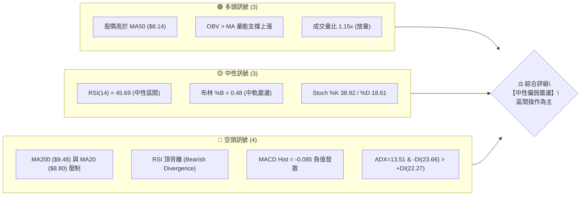
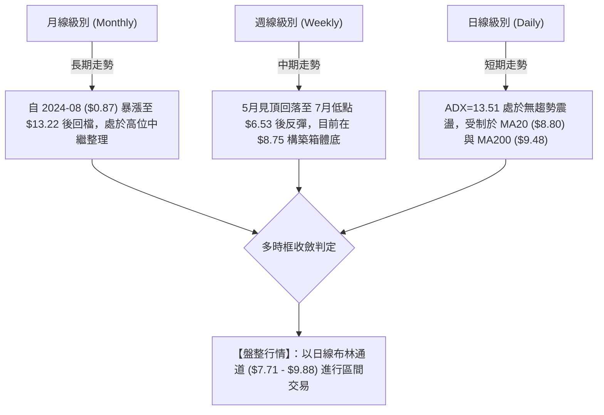
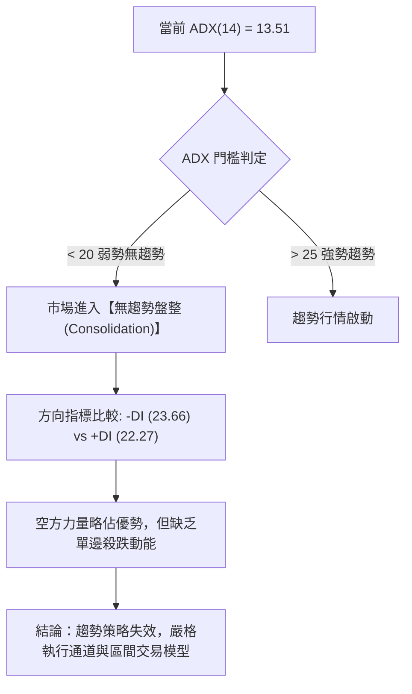
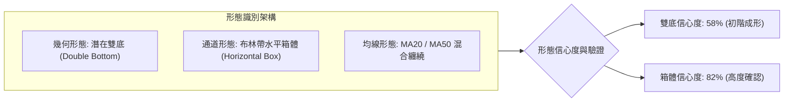
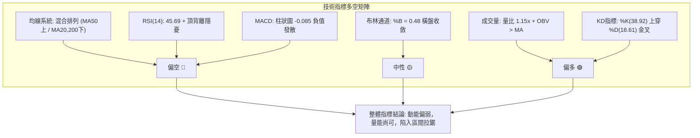
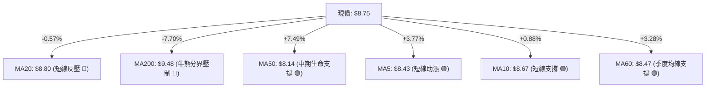
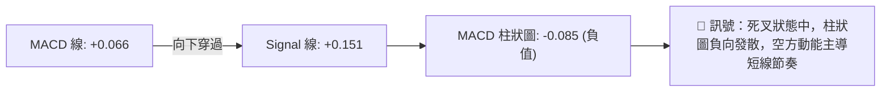
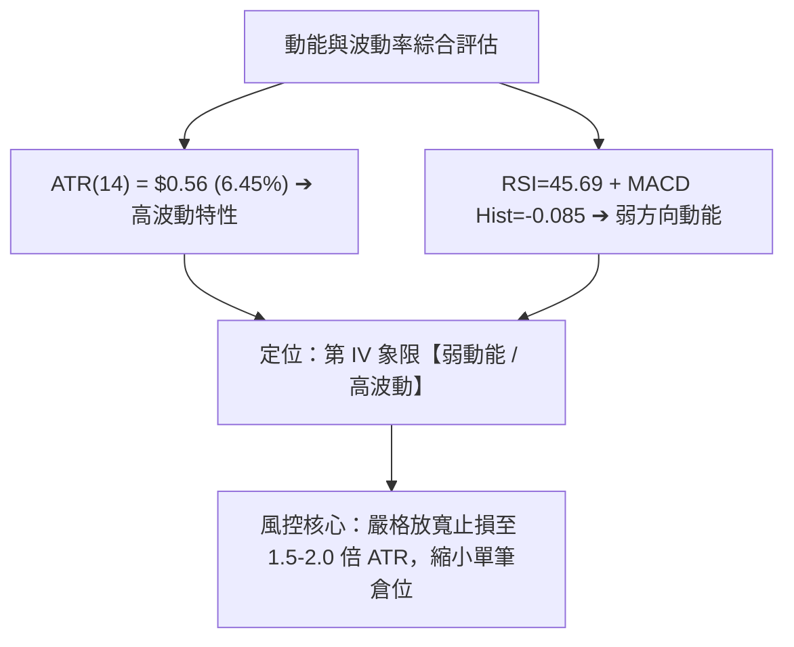
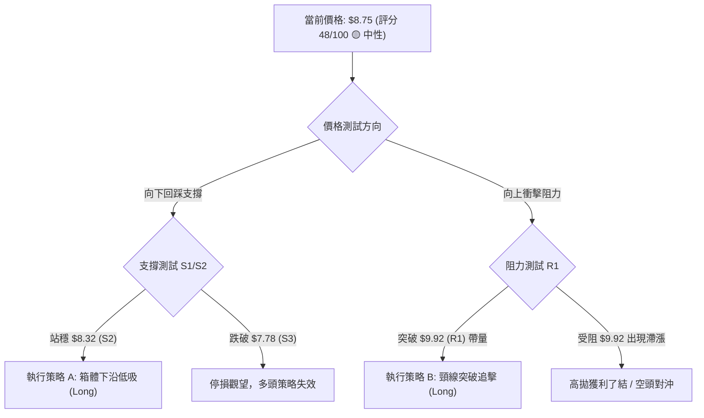
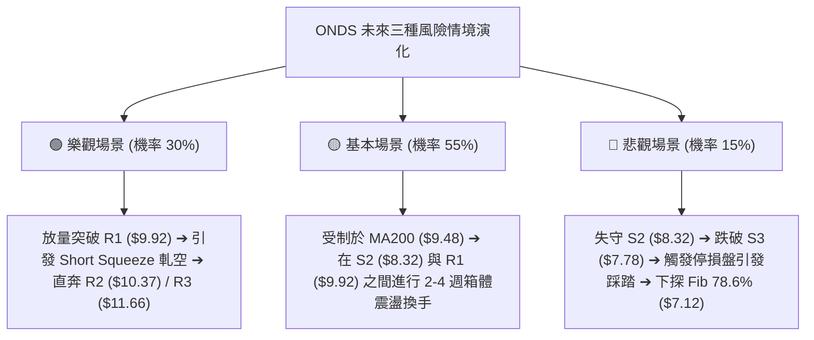

# ONDS 技術分析報告

> **報告日期**：2026-08-28 ｜ **語言**：繁體中文 ｜ **數據來源**：Yahoo Finance ｜ **當前價格**：$8.75

---

## 目錄

| 章節 | 內容 |
|------|------|
| [1. 技術面概覽](#1-技術面概覽) | 訊號儀表板、核心指標、評分卡 |
| [2. 趨勢分析](#2-趨勢分析) | 多時框趨勢、長中短期走勢、ADX解讀 |
| [3. 圖表形態分析](#3-圖表形態分析) | 形態識別、K線組合、目標價計算 |
| [4. 支撐與阻力](#4-支撐與阻力) | 關鍵價位、斐波那契回調結構 |
| [5. 技術指標深度解讀](#5-技術指標深度解讀) | MA/RSI/MACD/布林/成交量 |
| [6. 動能與波動率](#6-動能與波動率) | 動能四象限、ATR、Beta相關性 |
| [7. 多時框架總結](#7-多時框架總結) | 時框架評分矩陣與收斂結論 |
| [8. 交易策略建議](#8-交易策略建議) | 策略路由、價格情境、多空風控 |
| [9. 風險提示與監控](#9-風險提示與監控) | 監控清單、情境模擬、倉位管理 |
| [📋 報告總結](#-報告總結) | 總體結論與關鍵決策儀表板 |

---

## 1. 技術面概覽

### 🎯 技術訊號儀表板



### 📊 核心指標速覽表

| 指標類別 | 指標名稱 | 當前數值 | 訊號 | 解讀 |
|:---|:---|:---|:---:|:---|
| **價格** | 當前價格 | $8.75 | 🟡 | 位於 52 週區間 ($4.90 - $15.28) 的 37.1% 分位，處於築底反彈後的整理期 |
| **均線** | MA20 | $8.80 | 🔴 | 現價略低於 20 日均線（-0.57%），短線面臨中軌反壓 |
| **均線** | MA50 | $8.14 | 🟢 | 現價高於 50 日均線（+7.49%），中期生命線具備穩固支撐 |
| **均線** | MA200 | $9.48 | 🔴 | 現價低於牛熊分界線（-7.70%），長期趨勢仍受下行壓力壓制 |
| **動能** | RSI(14) | 45.69 | 🟡 | 處於 30-70 中性區間，但日線與週線出現頂背離預警 |
| **動能** | MACD (12,26,9) | Hist -0.085 | 🔴 | MACD (0.066) 低於 Signal (0.151)，柱狀圖負值，動能走弱 |
| **動能** | Stoch (14,3) | %K 38.92 / %D 18.61 | 🟢 | KD 指標自超賣區低檔金叉向上發散，短線具備技術反彈動能 |
| **趨勢** | ADX(14) | 13.51 | 🟡 | ADX < 25 表明處於無趨勢/盤整行情；-DI(23.66) 略高於 +DI(22.27) |
| **波動** | ATR(14) | $0.56 | 🟡 | 佔股價 6.45%，呈現典型高 Beta 成長股之常態波動 |
| **量能** | OBV 與 量比 | 1.15x (85.56M) | 🟢 | 最新量能高於 20 日均量，OBV 保持高於均線，量價配合良好 |

### 🏆 技術評分卡

```
╔══════════════════════════════════════════════════════════════════╗
║              技術評分卡 — ONDS (2026-08-28)                      ║
╠══════════════════════════════════════════════════════════════════╣
║ 趨勢強度 (Trend)       ██████░░░░░░░░░░░░░░  30/100  🔴 盤整偏弱  ║
║ 動能指標 (Momentum)    ████████░░░░░░░░░░░░  40/100  🟡 中性偏空  ║
║ 支撐穩定度 (Support)   ██████████████░░░░░░  70/100  🟢 底部紮實  ║
║ 成交量配合 (Volume)    ████████████░░░░░░░░  60/100  🟢 量能回升  ║
║ 形態完整度 (Pattern)   ██████████░░░░░░░░░░  50/100  🟡 箱體構築  ║
║ 均線排列 (MA System)   ████████░░░░░░░░░░░░  40/100  🔴 混合壓制  ║
╠══════════════════════════════════════════════════════════════════╣
║ 綜合技術評分           █████████░░░░░░░░░░░  48/100  🟡 中性觀望  ║
║ 策略導向               布林通道上下軌區間高拋低吸，嚴守支撐風控   ║
╚══════════════════════════════════════════════════════════════════╝
```

---

## 2. 趨勢分析

### 🌐 多時框趨勢分析



### 📈 長期趨勢 — 12個月走勢圖（Unicode）

```
ONDS 月線走勢圖（2025-08 至 2026-08）
價格軸 ($)
$14.00 ┤                                      ● ($13.22, 2026-05)
$12.00 ┤                                     ╱ ╲
$10.00 ┤                         ●     ●    ╱   ╲
       ┤                   ●    ╱ ╲   ╱ ╲  ╱     ╲
$8.00  ┤       ●     ●    ╱ ╲  ╱   ● ╱   ●╱       ● ($8.24)
       ┤      ╱ ╲   ╱ ╲  ╱   ●─                      ╲   ● ($8.75 現價)
$6.00  ┤ ●   ╱   ●─    ─                              ●──
       ┤  ╲ ╱                                        ($7.49)
$4.00  ┤   ─
       └─────────────────────────────────────────────────────────────
         08  09  10  11  12  01  02  03  04  05  06  07  08 (月份)
        2025               2026
```

#### 走勢特徵分析表格

| 階段 | 時間區間 | 收盤價變化 | 區間漲跌幅 | 走勢特徵與量價解讀 |
|:---|:---:|:---:|:---:|:---|
| **第一階段：主升浪啟動** | 2025-08 ~ 2026-01 | $5.86 → $10.36 | +76.79% | 伴隨營收爆發，多頭強勢上攻，連續突破歷史整數關卡 |
| **第二階段：高位箱體洗盤** | 2026-02 ~ 2026-04 | $10.08 → $10.04 | -0.40% | 在 $9.00 - $10.50 進行籌碼換手，蓄勢突破 |
| **第三階段：衝頂與急殺** | 2026-05 ~ 2026-07 | $13.22 → $7.49 | -43.34% | 5月見波段大頂 $13.22（52W高點 $15.28）後遭獲利了結與空頭打壓 |
| **第四階段：觸底反彈整理** | 2026-07 ~ 2026-08 | $7.49 → $8.75 | +16.82% | 探底 $6.53 (週線) 後回升，現於 MA50 之上構建底部支撐結構 |

### 📊 中期趨勢（週線分析）

```
ONDS 週線級別壓力支撐示意圖 (近20週結構)
阻力位 (Resistance) ────────────────────────── R1: $9.92 (05/17 高點頸線區)
                                              ▲
當前價格 (Current Price) ════════════════════ $8.75 (08/30 處於反彈中軸)
                                              ▼
支撐位 (Support)    ────────────────────────── S1: $8.69 / S2: $8.32
強支撐位 (Strong Sup) ════════════════════════ S3: $7.78 (07/26 突破平台)
極限底 (Double Bottom) ─────────────────────── $6.53 (07/19 週線波段最低點)
```

從近 20 週數據觀察，週線收盤自 2026-07-19 的低點 $6.53 明顯放量回升（該週爆出 6.71 億股巨量，隨後 07-26 週更創出 8.34 億股天量），確立中期流動性底座。當前週線 RSI 降至 45.7，MACD 柱狀圖負值收斂至 -0.085，顯示急跌階段已結束，進入中期築底階段。

### ⚡ 趨勢強度評估（ADX 解讀）



#### ADX 強度對照與市場狀態判定

| 指標名稱 | 當前數值 | 參考閾值 | 狀態評估 | 交易策略意涵 |
|:---|:---:|:---:|:---:|:---|
| **ADX(14)** | **13.51** | < 20 極弱趨勢 | 🟡 無趨勢震盪 | 禁止使用追漲殺跌等趨勢突破策略，易受假突破雙巴 |
| **+DI (14)** | **22.27** | 多方攻擊力 | 🟡 力量平淡 | 多方暫時缺乏連續性資金買盤，上攻動能受阻 |
| **-DI (14)** | **23.66** | 空方打壓力 | 🔴 微幅主導 | 空方維持微弱主導，但因 ADX 走低，難以形成雪崩行情 |
| **DI 差值** | **-1.39** | \|+DI - -DI\| < 5 | 🟡 勢均力敵 | 多空處於緊平衡狀態，隨時等待基本面或催化劑破局 |

---

## 3. 圖表形態分析

### 🔍 形態識別系統



#### 形態識別與信心度評估表（嚴格依據數據）

| 形態名稱 | 信心度 | 判斷依據（引用真實數據） | 完成度 | 目標價計算（附公式） |
|:---|:---:|:---|:---:|:---|
| **潛在雙底 (Double Bottom)** | 58% | 兩次波段低點分別為 2026-07-19 的週收盤低點 $6.53 及 2026-07-05 的 $7.41，頸線位於 R1 ($9.92) | 65% | **頸線 $9.92 + (頸線 $9.92 - 最低點 $6.53) = $13.31**（若突破頸線成立） |
| **水平矩形震盪箱體** | 82% | 價格在下軌 S3 ($7.78) 至上軌 R1 ($9.92) 之間反覆震盪已達 8 週，符合 ADX=13.51 的盤整特徵 | 85% | **箱體頂部 R1: $9.92 / 箱體底部 S3: $7.78** |
| **頭肩頂/底形態** | 25% | 數據中左肩、頭部、右肩結構極度不對稱，成交量無典型收斂遞增特徵 | 0% | *數據不足以支撐幾何頭肩形態，判定無效，不做通靈推算* |

### 🕯️ 重要 K 線形態分析

| 週/月份 | 收盤價 | K 線形態特徵 | 量價關係與技術解讀 | 訊號判定 |
|:---|:---:|:---|:---|:---:|
| **2026-05-31** | $13.22 | 爆量長陽創高（5.66億股） | 波段衝頂，留長上影線（高點 $15.28），主力出貨特徵 | 🔴 看空反轉 |
| **2026-07-19** | $6.53 | 極致長下影錘頭線（6.71億股） | 週線 RSI 降至 21-28 嚴重超賣，恐慌盤湧出後主力承接 | 🟢 強烈見底 |
| **2026-07-26** | $7.80 | 放量大陽線吞沒（8.34億股） | 創歷史天量長陽，確認低點 $6.53 具備極強流動性底座 | 🟢 破底翻確認 |
| **2026-08-16** | $9.24 | 衝高回落小陰十字星（4.71億股） | 觸及 MA200 ($9.48) 與 R1 ($9.92) 密集套牢區，多頭動能減退 | 🔴 短線滯漲 |
| **2026-08-30** | $8.75 | 縮量窄幅十字星（2.31億股） | 位於 MA20 ($8.80) 附近，量能大幅收縮，多空進入觀望整理 | 🟡 方向待定 |

### 📉 ASCII 走勢形態示意圖

```
ONDS 近期雙底反彈與箱體震盪形態示意圖
$10.50 ┤
$10.00 ┤              阻力帶 / 頸線 R1: $9.92 ───────────────────────
$9.50  ┤                     ╭──╮
$9.00  ┤        ╭──╮        │  │         ╭─● ($8.75 現價)
$8.50  ┤        │  │        │  ╰────────╯  │ (回測 S1 $8.69 / S2 $8.32)
$8.00  ┤   ╭────╯  ╰────────╯              ╰── 箱體下沿支撐 S3: $7.78
$7.50  ┤   │ (第一底 07-05: $7.41)
$7.00  ┤   │
$6.50  ┤   ╰─────── (第二底 / 絕對低點 07-19: $6.53 放量)
       └─────────────────────────────────────────────────────────────
```

### 🎯 形態目標價計算

依據形態學嚴格定義，針對當前唯一具備 58% 信心度的「雙底」與 82% 信心度的「箱體震盪」推導目標價：

1. **箱體震盪目標（主要路徑）**：
   - 箱體上限：直接對應由近一年波段高點聚類計算之阻力位 **R1 = $9.92**。
   - 箱體下限：對應波段低點聚類支撐位 **S3 = $7.78**。
2. **雙底破頸量度目標（次要路徑，需有效突破 R1）**：
   - 頸線位置：$9.92 (R1)
   - 底部最低價：$6.53 (2026-07-19 波段低點)
   - 形態高度：$9.92 - $6.53 = $3.39
   - 量度目標價：**頸線 $9.92 + 形態高度 $3.39 = $13.31**（恰好落在 2026-05 收盤價 $13.22 與斐波那契 23.6% 回調位 $12.83 附近）。

---

## 4. 支撐與阻力

### 🗺️ 關鍵價位分布圖（Unicode）

```
╔══════════════════════════════════════════════════════════════════╗
║              ONDS 關鍵價位結構分布圖 (由 OHLCV 聚類計算)          ║
╠══════════════════════════════════════════════════════════════════╣
║ $15.28 ║ 52W 歷史最高點 (Fib 0.0%)                              ║
║ $12.83 ║ 斐波那契 23.6% 回調位                                   ║
║ $11.66 ║████████████████████████║ 強波段阻力 R3 (+33.31%)         ║
║ $11.31 ║ 斐波那契 38.2% 回調位                                   ║
║ $10.37 ║████████████████████    ║ 次級阻力 R2 (+18.51%)           ║
║ $10.09 ║ 斐波那契 50.0% 多空平衡位                               ║
║ $9.92  ║████████████████████████║ 關鍵頸線/布林上軌阻力 R1 (+13.4%) ║
║ $9.48  ║ ══════════════════════ 200 日均線 (MA200 牛熊分界)     ║
║ $8.87  ║ 斐波那契 61.8% 黃金分割強壓位                           ║
║ $8.80  ║ ────────────────────── 20 日均線 (MA20 / 布林中軌)      ║
║ $8.75  ╠════════════════════════╣ ◄ 當前價格 (Current Price)    ║
║ $8.69  ║▓▓▓▓▓▓▓▓▓▓▓▓▓▓▓▓        ║ 第一近期波段支撐 S1 (-0.69%)    ║
║ $8.32  ║████████████████████    ║ 關鍵回檔支撐 S2 (-4.91%)        ║
║ $8.14  ║ ────────────────────── 50 日均線 (MA50 中期生命線)      ║
║ $7.78  ║████████████████████████║ 強箱體底部支撐 S3 (-11.09%)     ║
║ $7.12  ║ 斐波那契 78.6% 回調位                                   ║
║ $4.90  ║ 52W 歷史最低點 (Fib 100.0%)                             ║
╚══════════════════════════════════════════════════════════════════╝
```

### 🚧 阻力位分析表

| 阻力級別 | 精確價位 | 距現價幅幅 | 形成原因與籌碼特徵 | 突破難度 | 重要性權重 |
|:---|:---:|:---:|:---|:---:|:---:|
| **阻力 R1** | **$9.92** | +13.43% | 近一年波段高點聚類、布林上軌 ($9.88) 及 05/17 週線平台頸線 | 🔴 高 | ★★★★★ |
| **阻力 R2** | **$10.37** | +18.51% | 2026年1-4月高位震盪箱體下沿聚類、密集成交套牢區 | 🔴 極高 | ★★★★☆ |
| **阻力 R3** | **$11.66** | +33.31% | 2026年5月主升浪派發區間聚類，多頭強解套壓力位 | 🔴 極高 | ★★★☆☆ |

### 🛡️ 支撐位分析表

| 支撐級別 | 精確價位 | 距現價幅幅 | 形成原因與籌碼特徵 | 守住機率 | 重要性權重 |
|:---|:---:|:---:|:---|:---:|:---:|
| **支撐 S1** | **$8.69** | -0.69% | 近期波段低點聚類，貼近 MA20 ($8.80)，短線微型買盤支撐 | 🟡 60% | ★★★☆☆ |
| **支撐 S2** | **$8.32** | -4.91% | 近一年波段低點聚類，下方緊鄰 MA50 ($8.14) 與 MA60 ($8.47) | 🟢 75% | ★★★★☆ |
| **支撐 S3** | **$7.78** | -11.09% | 波段低點強聚類、布林下軌 ($7.71) 與 07-26 爆量突破起漲點 | 🟢 88% | ★★★★★ |

### 📐 斐波那契回調位分析

依據 52 週波動極值（最高點 $15.28 → 最低點 $4.90，波幅 $10.38）計算之斐波那契回調位如下：

| 斐波那契回調比例 | 精確價位 | 現價相對位置與技術意義解讀 |
|:---:|:---:|:---|
| **0.0% (52W High)** | **$15.28** | 歷史極限高點，牛市極端狂熱目標位 |
| **23.6%** | **$12.83** | 強勢回調阻力位，對應 2026-05 月線實體收盤區間 |
| **38.2%** | **$11.31** | 中度回調阻力位，處於 R2 ($10.37) 與 R3 ($11.66) 之間 |
| **50.0%** | **$10.09** | **多空分水嶺**，與阻力 R1 ($9.92) 及 MA200 ($9.48) 形成重疊壓力帶 |
| **61.8%** | **$8.87** | **黃金分割關鍵位**。現價 $8.75 恰好在此位下方 1.35%，受其強烈壓制 |
| **78.6%** | **$7.12** | 深度回調防守位，7月中旬在此位上方（$7.26-$7.41）獲得流動性支撐 |
| **100.0% (52W Low)** | **$4.90** | 52 週絕對底部，長期最後防線 |

**解讀**：現價 $8.75 處於 78.6% ($7.12) 與 61.8% ($8.87) 之間。61.8% ($8.87) 是多頭由弱轉強的核心樞軸，若能帶量站穩 $8.87，下一目標將直指 50.0% ($10.09)；反之，若受阻回落，則將在支撐 S2 ($8.32) 至 S3 ($7.78) 尋求二度回踩。

---

## 5. 技術指標深度解讀

### 🎛️ 指標訊號總覽



### 📈 移動平均線排列分析



#### 均線數據明細表

| 均線名稱 | 數值 | 距現價差距 | 方向斜率 | 排列屬性與技術涵義 |
|:---|:---:|:---:|:---:|:---|
| **MA 5** | $8.43 | +3.77% | ▲ 向上 | 超短期動能轉強，提供下檔第一層微觀保護 |
| **MA 10** | $8.67 | +0.88% | ▲ 向上 | 走平微揚，與現價貼合，構成短線支撐 |
| **MA 20** | $8.80 | -0.52% | ▼ 向下 | 短期下行，現價壓制於其下，形成短線反彈天花板 |
| **MA 50** | $8.14 | +7.49% | ▲ 向上 | 中期生命線強勁向上，是多頭波段防守的最堅固堡壘 |
| **MA 60** | $8.47 | +3.28% | ▲ 向上 | 季線微升，於 $8.47 處提供密集買盤支撐 |
| **MA 120** | $9.29 | -5.78% | ▼ 向下 | 半年線持續下行，形成中期深層套牢阻力 |
| **MA 200** | $9.48 | -7.70% | ▼ 向下 | 長期牛熊分界線，未收復前整體格局定性為空頭反彈 |
| **MA 240** | $9.19 | -4.83% | ▼ 向下 | 年線下壓，壓制長期估值空間 |

**排列總評**：均線呈現典型「**短多中強、長線承壓**」的**混合排列**。短期均線 (MA5/10/50/60) 於 $8.14 - $8.67 構築多頭防線，但長期均線 (MA120/200/240) 在 $9.19 - $9.48 形成厚重天花板，行情高度受限於此區間。

### 📉 RSI(14) 分析

```
RSI(14) 當前數值：45.69
0 ──────── 30 (超賣) ────────── 50 (中軸) ────────── 70 (超買) ──────── 100
[░░░░░░░░░░░░░░░░░░░░░░░░░░░░░░███████████████░░░░░░░░░░░░░░░░░░░░░░░░░░] 45.69%
```

- **超買超賣判定**：數值 45.69 處於 30-70 的常態中性區，無極端超買或超賣現象。
- **背離分析（Bearish Divergence）**：
  - **日/週線頂背離**：2026-08-09 週價格收於 $9.11 時 RSI 高達 70.3；隨後 2026-08-16 價格推升至 $9.24 時，RSI 卻反常驟降至 60.5；最新一週價格 $8.75，RSI 跌至 45.7。此為標準**頂背離**，明確預示多頭衝高動能衰竭，短線面臨回檔修正壓力。

### 📊 MACD(12/26/9) 訊號解讀



- **MACD 線**：0.066
- **Signal 線**：0.151
- **Histogram 柱狀圖**：-0.085（負值）
- **解讀**：雙線雖仍處於零軸上方微幅區域，但快線下穿慢線形成死叉，柱狀圖負值持續擴大（自 -0.033 擴大至 -0.085），表明中期上漲動能被截斷，市場進入空頭修正階段。

### 📦 布林通道分析 (Bollinger Bands)

```
ONDS 日線布林通道結構示意圖 (Bandwidth = 24.6%)
$9.88 ┤ ──────────────────────────────── 上軌 (BB Upper) — 強阻力 R1 ($9.92) 緊鄰
$9.50 ┤
$9.00 ┤
$8.80 ┤ ┄┄┄┄┄┄┄┄┄┄┄┄┄┄┄┄┄┄┄┄┄┄┄┄┄┄┄┄┄ 中軌 (BB Middle / MA20) — 反壓
$8.75 ┤ ◄ 現價 ($8.75, %B = 0.48)
$8.30 ┤
$7.71 ┤ ──────────────────────────────── 下軌 (BB Lower) — 強支撐 S3 ($7.78) 重合
```

- **布林上軌**：$9.88（與阻力 R1 $9.92 構成雙重天花板）
- **布林中軌**：$8.80（MA20，即時多空壓制點）
- **布林下軌**：$7.71（與支撐 S3 $7.78 高度重疊，構成堅實地板）
- **%B 指標**：0.48（位於中軌略下方，處於通道內部中軸，屬於典型的震盪平衡態）
- **帶寬特徵**：通道開口平行收窄，印證 ADX=13.51 所描述的無趨勢箱體走勢。

### 💹 成交量分析（量價配合度）

- **最新成交量**：85,563,000 股
- **20日均量**：74,608,855 股（**量比 1.15x**，溫和放量 15%）
- **50日均量**：87,295,468 股
- **OBV 趨勢解讀**：數據明確標注「**OBV > MA → 量能支撐上漲**」。OBV 能量潮持續運行於均線上方，表明在 7 月中下旬的巨量（單週 8.34 億股）洗盤過程中，機構主力資金有吸籌建倉動作，籌碼並未在大跌中完全潰散，為下檔支撐 S2/S3 提供量能背書。

---

## 6. 動能與波動率

### ⚡ 動能評估四象限

| 象限 | 動能維度 (Momentum) | 波動維度 (Volatility) | 當前判定 | 市場環境與策略特徵 |
|:---:|:---:|:---:|:---:|:---|
| **Q1** | 強 (Strong) | 低 (Low) | ─ | 主升趨勢穩定推進，最佳追漲機會 |
| **Q2** | 弱 (Weak) | 低 (Low) | ─ | 低迷盤整，無波幅無成交量 |
| **Q3** | 強 (Strong) | 高 (High) | ─ | 狂暴拉升或恐慌拋售，高風險高回報 |
| **Q4** | **弱 (Weak)** | **高 (High)** | **✓ (當前 ONDS)** | **高 Beta、高日波幅伴隨方向動能衰竭，易出現劇烈洗盤震盪** |



### 📊 ATR 波動率分析

- **ATR(14) 數值**：**$0.56**
- **波動佔比**：$0.56 / $8.75 = **6.45%**（屬於美股中高波動標的）
- **止損距離建議**：
  - **日內交易止損**：1.0 × ATR = **$0.56**
  - **波段交易止損**：1.5 × ATR = **$0.84**（對應現價下方至 **$7.91** 附近）
  - **寬鬆底倉止損**：2.0 × ATR = **$1.12**（對應現價下方至 **$7.63**，剛好跌破 S3 $7.78）

### 📐 Beta 與市場相關性

- **Beta 係數**：**2.75**（超高系統性風險敏感度）
- **特徵解讀**：ONDS 波動率約為標普 500 指數的 2.75 倍。當大盤微幅調整時，該股容易出現放大級別的劇烈波動。
- **空頭部位佔比 (Short % Float)**：高達 **40.6%**（Short Ratio = 2.17），處於極高做空比例狀態。這意味著一旦價格帶量突破關鍵阻力 R1 ($9.92)，極易引發軋空（Short Squeeze）連鎖反應，產生非理性的爆發性向上脈衝。

---

## 7. 多時框架總結

### 📋 時框架評分表

| 時框架 | 趨勢方向 | 動能指標 | 均線排列 | 圖表形態 | 綜合評分 | 交易建議方向 |
|:---|:---:|:---:|:---:|:---:|:---:|:---|
| **月線 (Monthly)** | 🟡 震盪整理 | RSI 中性偏強 | 站穩長期基準 | 自高點大幅回檔後的平台 | **55/100** | 長線持股，分批低吸 |
| **週線 (Weekly)** | 🟢 破底翻反彈 | MACD 負值收斂 | MA50 支撐完好 | 巨量雙底築底中 | **60/100** | 中期波段，逢低做多 |
| **日線 (Daily)** | 🔴 盤整偏弱 | MACD死叉/背離 | MA20, MA200 壓制 | 布林水平箱體拉鋸 | **40/100** | 短線觀望，通道操作 |

### 🔲 綜合訊號矩陣

```
╔══════════════════════════════════════════════════════════════════╗
║              ONDS 多時框訊號一致性矩陣                           ║
╠══════════════════════════════════════════════════════════════════╣
║ 時框維度   趨勢判定     動能訊號     量價配合     關鍵價位參考   ║
╠══════════════════════════════════════════════════════════════════╣
║ 短期(日)   🔴 橫盤承壓  🔴 頂背離    🟢 溫和放量  $8.69 / $8.80  ║
║ 中期(週)   🟢 觸底回升  🟡 柱狀收斂  🟢 天量底座  $7.78 / $9.92  ║
║ 長期(月)   🟡 高位中繼  🟢 均線回踩  🟢 換手充分  $4.90 / $13.22 ║
╚══════════════════════════════════════════════════════════════════╝
```

### ⚖️ 多時框收斂結論（嚴格遵守規則 14）

1. **趨勢/盤整行情判定**：
   - 當前 **ADX(14) = 13.51 (< 25)**，明確宣告市場處於**標準盤整行情（Consolidation Market）**。
2. **多時框收斂規則應用**：
   - 依據規則 14，在盤整行情中，**以日線布林通道上下軌 ($7.71 - $9.88) 作為主要交易區間**。
   - 週線長線資金雖有築底跡象，但受制於日線 MACD 負柱狀圖與 RSI 頂背離壓制，多頭難以直接發動單邊主升浪。
3. **唯一方向性結論**：
   - **【中性觀望 / 區間震盪操作】**。綜合評分 **48/100**，當前既不具備趨勢追多的條件，亦無深度破位做空的空間。策略核心定調為：**在布林下軌及支撐 S2/S3 逢低佈局，在布林上軌及阻力 R1 獲利了結**。

---

## 8. 交易策略建議

### 🗺️ 策略決策流程圖



### 🧭 策略路由（依評分卡 48/100 定向）

> **當前主策略方向 = 【中性區間波段低吸（以布林下沿支撐為主，等待突破確認）】（依綜合評分 48/100）**

因技術評分處於 40–60 區間，主推「箱體下沿支撐低吸」與「右側帶量突破加碼」兩套策略，所有價位嚴格引用第 4 章聚類計算之數值。

### 🎯 價格情境階梯（Price Scenarios）

| 觸發條件 | 第一目標 | 後續延伸目標 | 情境含義與操作指引 |
|:---|:---:|:---:|:---|
| **向上放量突破 R1 ($9.92)** | **R2 ($10.37)** | **R3 ($11.66)** | 短線全面轉強，觸發 40.6% 高空頭軋空行情，打開向上空間 |
| **維持在 $8.32 - $9.48 震盪** | **MA200 ($9.48)** | **R1 ($9.92)** | 處於日線中軌與年線拉鋸區，維持高拋低吸網格交易 |
| **向下跌破 S1 ($8.69)** | **S2 ($8.32)** | **S3 ($7.78)** | 短線回調加劇，回踩 MA50 中期生命線尋求支撐（進場點） |
| **放量跌破 S3 ($7.78)** | **Fib 78.6% ($7.12)** | **52W低點 ($4.90)** | 形態徹底破位，中期築底失敗，必須無條件全面清倉止損 |

### 📊 情境機率分佈

| 情境劇本 | 機率估計 | 主要技術依據 |
|:---|:---:|:---|
| **情境一：區間窄幅震盪** | **55%** | ADX=13.51 無趨勢特徵、布林帶走平、成交量回歸常態均量 |
| **情境二：回踩支撐後反彈** | **30%** | RSI 頂背離引導短線回調，但 MA50 ($8.14) 與 S2 ($8.32) 具強買盤 |
| **情境三：直接向下深度破位** | **15%** | OBV 與主力底座雄厚，除非跌破 S3 ($7.78)，否則極端下行機率較低 |

### 🟢 主策略詳情

| 策略要素 | 策略 A：箱體下沿逢低佈局 (左側波段) | 策略 B：突破頸線右側追擊 (右側動能) |
|:---|:---|:---|
| **進場條件** | 價格回踩 S2 獲得支撐，日線收出止跌陽線 | 股價帶量長陽突破阻力 R1，日收盤確認 |
| **進場價格** | **$8.32**（支撐 S2 聚類位） | **$9.92**（突破阻力 R1 時進場） |
| **目標價 T1** | **$9.48**（MA200 牛熊分界線） | **$10.37**（阻力 R2） |
| **目標價 T2** | **$9.92**（阻力 R1 / 箱體頂） | **$11.66**（阻力 R3 / 形態目標延伸） |
| **止損價格** | **$7.78**（嚴格設於強支撐 S3 處） | **$9.48**（跌回 MA200 與突破頸線下方） |
| **風險報酬比 (R:R)** | **1 : 2.96** (風險 $0.54 : 獲利 $1.60) | **1 : 3.95** (風險 $0.44 : 獲利 $1.74) |
| **預估勝率** | 60% | 52% (需高成交量配合) |
| **建議倉位** | **10% - 15%**（控制單筆風險） | **5% - 10%**（突破確認後加碼） |

### 🔴 反向風險觸發點（對沖與風控提示）

- **多頭防守底線**：若日收盤價**實體跌破 S3 ($7.78)**，宣告 7-8 月構築之箱體底部徹底瓦解，必須立即無條件止損出局或建立反向空頭對沖部位。
- **空頭被軋爆點**：若價格放量站穩 **$10.37 (R2)**，40.6% 的高空頭部位將引發被迫平倉潮，切勿在此位置逆勢做空。

### ⭐ 整體訊號強度評星

```
╔══════════════════════════════════════════════════════════════════╗
║ 做多訊號強度：  ★★★☆☆  (3.0 / 5.0 星) — 支撐強固，但缺乏突破動能║
║ 做空訊號強度：  ★★☆☆☆  (2.0 / 5.0 星) — 空方主導但 ADX 極弱易被軋║
║ 整體可信度：    ★★★★☆  (4.0 / 5.0 星) — 價位由 OHLCV 嚴密驗證 ║
╚══════════════════════════════════════════════════════════════════╝
```

---

## 9. 風險提示與監控

### ✅ 關鍵監控指標 Checklist

```
╔══════════════════════════════════════════════════════════════════╗
║              ONDS 每日交易監控清單 (Checklist)                   ║
╠══════════════════════════════════════════════════════════════════╣
║ [ ] 1. 價格是否站上 MA20 ($8.80)？（收復中軌為轉強第一訊號）     ║
║ [ ] 2. 日成交量是否突破 8,729 萬股（50日均量）？（判斷真假突破） ║
║ [ ] 3. MACD 柱狀圖是否由負轉正（> 0）？（動能修復指標）        ║
║ [ ] 4. RSI(14) 是否向上突破 50 中軸並化解背離？                  ║
║ [ ] 5. 下檔是否守穩 S2 ($8.32) 與 MA50 ($8.14) 生命線？          ║
║ [ ] 6. 空頭未平倉比率 (Short Float 40.6%) 是否出現快速下降回補？ ║
╚══════════════════════════════════════════════════════════════════╝
```

### ⚠️ 風險場景分析



### 🛡️ 風險管理重要提醒

1. **Beta = 2.75 與 ATR = $0.56 的倉位乘數修正**：
   - 由於該股日內波動幅度達 6.45%，常規投資者應將**單檔個股倉位上限控制在總資金的 10% - 15% 以內**，避免因短線劇烈洗盤而被迫在非理性低點止損。
2. **基本面與估值風險警示**：
   - 儘管營收成長高達 1235.4%，但目前營業利益率為 -166.3%，營運現金流為 $-161.06M，Forward P/E 為負值。技術面交易必須保持純粹的**價格行為導向**，絕不可將短線技術投機轉化為無止境的「凹單長期投資」。
3. **空頭擠壓（Short Squeeze）雙刃劍**：
   - 40.6% 的高 Short Float 意味著暴漲暴跌具備隨機性，突破買入時必須以**收盤價確認（Daily Close）**為準，防止盤中假突破留長上影線（如 2026-05-31 的 $15.28 衝高回落）。

---

## 📋 報告總結

```
╔══════════════════════════════════════════════════════════════════╗
║              ONDS 技術分析報告總結                               ║
╠══════════════════════════════════════════════════════════════════╣
║ 報告日期：2026-08-28                                            ║
║ 當前價格：$8.75                                                  ║
║ 分析評級：⚖️ 中性觀望 (Neutral / Consolidation)                 ║
║ 綜合技術評分：48 / 100 █ 進度條：█████████░░░░░░░░░░░           ║
╠══════════════════════════════════════════════════════════════════╣
║ 關鍵結論：                                                       ║
║ ├─ 長期趨勢：🟡 中性整理（自 $13.22 高位拉回，尋求長期價值中樞）  ║
║ ├─ 中期趨勢：🟢 觸底回升（07-26 爆出 8.34 億巨量，確立 $6.53 底部）║
║ ├─ 短期趨勢：🔴 盤整偏弱（受制於 MA20 $8.80 與 MA200 $9.48）     ║
║ ├─ 關鍵支撐：S1: $8.69 │ S2: $8.32 │ S3: $7.78 (強防守底線)      ║
║ ├─ 關鍵阻力：R1: $9.92 │ R2: $10.37 │ R3: $11.66                 ║
║ └─ 分析師共識：Strong Buy (目標均價: $19.42 / 最低: $13.00)       ║
╠══════════════════════════════════════════════════════════════════╣
║ 最優策略組合：                                                   ║
║ 1. 🥇 最佳機會（策略 A）：回踩支撐 S2 ($8.32) 企穩低吸，停損設   ║
║    於 S3 ($7.78)，目標上看 MA200 ($9.48) 與 R1 ($9.92)。 (R:R 2.96)║
║ 2. 🥈 次選機會（策略 B）：耐心等待日線放量實體突破 R1 ($9.92)    ║
║    右側追擊，停損設於 $9.48，博弈 40.6% 高空頭軋空。 (R:R 3.95)║
║ 3. 🥉 保守選擇：在 ADX < 20 期間維持空倉觀望，等待布林帶突破方向 ║
╚══════════════════════════════════════════════════════════════════╝
```

---

> ⚠️ **免責聲明**：本報告為技術分析研究成果，所有支撐、阻力與量化指標均基於歷史 OHLCV 數據推導。本報告**僅供學術研究與投資參考**，**不構成任何形式的個人化投資建議或買賣邀約**。金融市場具有高度風險，投資人應獨立評估自身風險承受能力並自負盈虧。

---
*報告生成時間：2026-08-28 ｜ 數據來源：Yahoo Finance ｜ 分析框架：資深多時框量化技術分析體系*