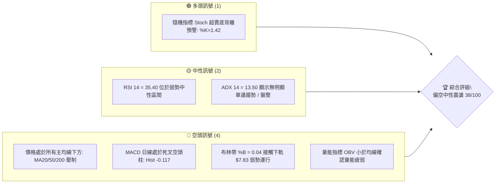
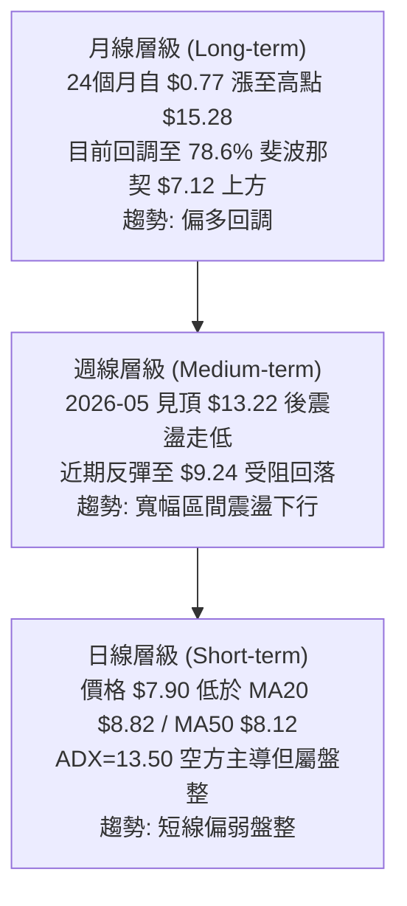
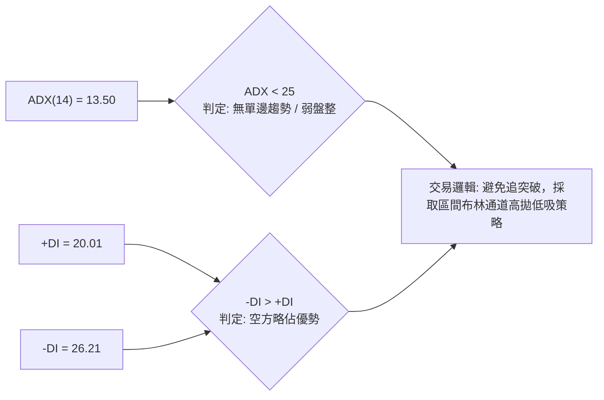
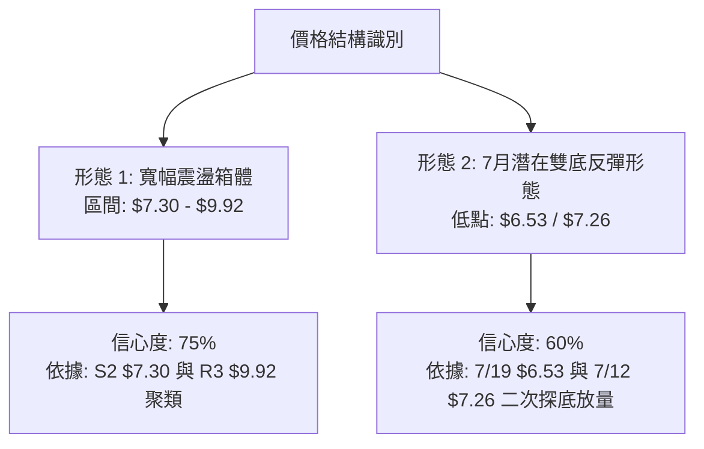
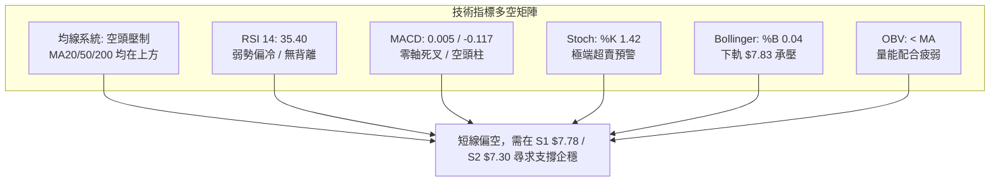
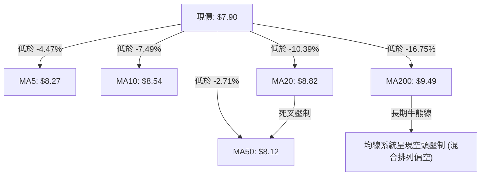
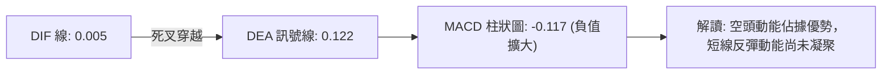
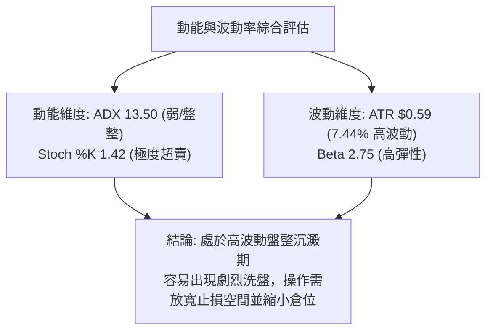
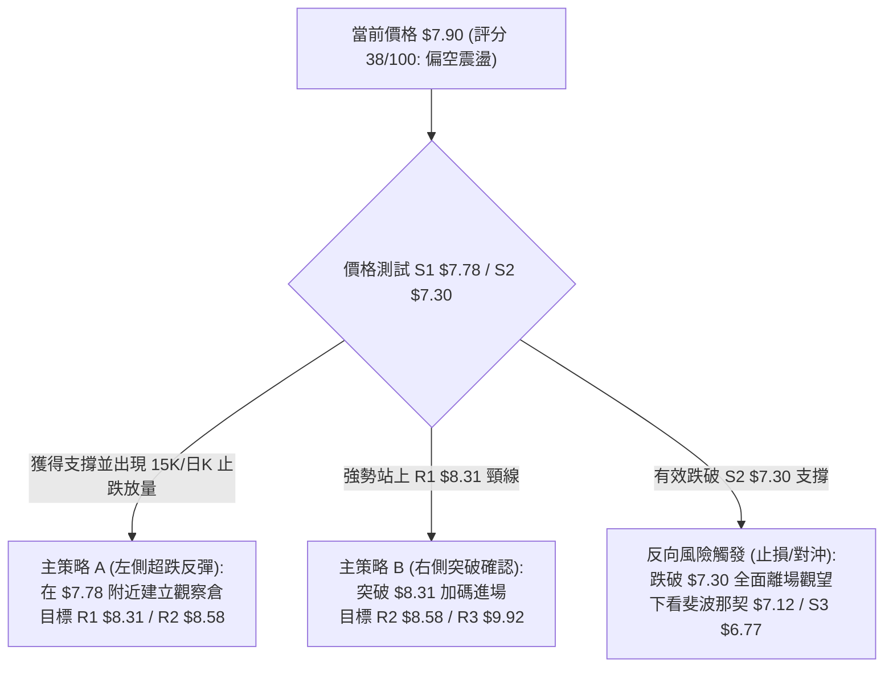
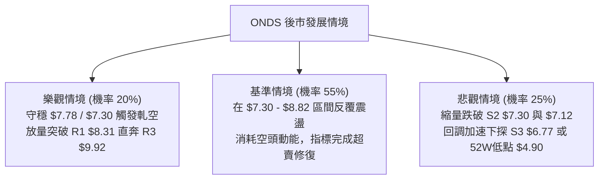

# ONDS 技術分析報告

> **報告日期**：2026-08-30 ｜ **語言**：繁體中文 ｜ **數據來源**：Yahoo Finance ｜ **當前價格**：$7.90

---

## 目錄

| 章節 | 內容 |
|------|------|
| [1. 技術面概覽](#1-技術面概覽) | 訊號儀表板、核心指標、評分卡 |
| [2. 趨勢分析](#2-趨勢分析) | 多時框趨勢、長中短期走勢 |
| [3. 圖表形態分析](#3-圖表形態分析) | 形態識別、K線組合、目標價 |
| [4. 支撐與阻力](#4-支撐與阻力) | 關鍵價位、斐波那契回調 |
| [5. 技術指標深度解讀](#5-技術指標深度解讀) | MA/RSI/MACD/布林/成交量 |
| [6. 動能與波動率](#6-動能與波動率) | 動能評估、ATR、Beta |
| [7. 多時框架總結](#7-多時框架總結) | 時框架評分矩陣 |
| [8. 交易策略建議](#8-交易策略建議) | 多空策略、風險報酬比 |
| [9. 風險提示與監控](#9-風險提示與監控) | 監控指標、風險場景 |

---

## 1. 技術面概覽

### 🎯 技術訊號儀表板



### 📊 核心指標速覽表

| 指標類別 | 指標名稱 | 當前數值 | 訊號 | 解讀 |
|----------|----------|----------|------|------|
| **價格** | 當前價格 | $7.90 | 🔴 | 位於 52 週高低區間之 28.9%，短期受壓於關鍵均線群 |
| **均線** | MA20 | $8.82 | 🔴 | 價格低於 MA20 達 -10.39%，短期下行趨勢明確 |
| **均線** | MA50 | $8.12 | 🔴 | 價格低於 MA50，中期支撐轉為即時反彈壓力 |
| **均線** | MA200 | $9.49 | 🔴 | 價格顯著低於長期年線牛熊分水嶺 (-16.75%) |
| **動能** | RSI(14) | 35.40 | 🟡 | 弱勢中性偏冷，尚未進入極端超賣區 (<30) |
| **動能** | MACD | 0.005 / Sig: 0.122 | 🔴 | 柱狀圖 -0.117，空頭動能擴散中 |
| **動能** | Stoch %K/%D | 1.42 / 17.71 | 🟢 | 極度超賣，隨時存在技術性抽頭反彈可能 |
| **趨勢** | ADX(14) | 13.50 (-DI: 26.21) | 🟡 | 趨勢強度低於 25，空頭主導但屬於無趨勢盤整陰跌 |
| **通道** | Bollinger Bands | 上 $9.81 / 中 $8.82 / 下 $7.83 | 🔴 | %B 為 0.04，貼緊布林下軌滑落，波動收斂 |
| **量能** | 20日均量比 | 0.93x (OBV < MA) | 🔴 | 成交量 69.73M，量能未放大配合，缺乏主力承接 |
| **波動** | ATR(14) | $0.59 (7.44%) | 🟡 | 每日平均波動幅度大，操作需嚴格控制風險敞口 |

### 🏆 技術評分卡

```
╔══════════════════════════════════════════════════════════╗
║              技術評分卡 — ONDS (2026-08-30)              ║
╠══════════════════════════════════════════════════════════╣
║ 趨勢強度      ██████░░░░░░░░░░░░░░  30/100  🔴 空頭壓制  ║
║ 動能指標      ████████░░░░░░░░░░░░  40/100  🟡 超賣醞釀  ║
║ 支撐穩定度    ██████████░░░░░░░░░░  50/100  🟡 考驗S1位  ║
║ 成交量配合    ██████░░░░░░░░░░░░░░  30/100  🔴 量能萎縮  ║
║ 形態完整度    ████████░░░░░░░░░░░░  40/100  🟡 箱體回落  ║
║ 均線排列      ████████░░░░░░░░░░░░  40/100  🔴 空頭壓制  ║
╠══════════════════════════════════════════════════════════╣
║ 綜合評分      ███████░░░░░░░░░░░░░  38/100  🔴 偏空震盪  ║
╚══════════════════════════════════════════════════════════╝
```

---

## 2. 趨勢分析

### 🌐 多時框趨勢分析



### 📈 長期趨勢 — 12個月走勢圖（Unicode）

```
ONDS 月線走勢圖（過去12個月: 2025-09 至 2026-08）
價格軸 ($)
$14.00 ┤                                      ● $13.22 (05月波段頂)
$12.00 ┤
$10.00 ┤                       ● $10.36 ● $10.08      ● $10.04
$9.00  ┤                 ● $9.76              ● $9.04
$8.00  ┤          ● $7.90                                   ● $8.24  ● $7.90 (現價)
$7.00  ┤ ● $7.72         ● $6.44                                 ● $7.49
$6.00  ┤
       └───────────────────────────────────────────────────────────────────
         09/25   10/25   11/25   12/25   01/26  02/26  03/26  04/26  05/26  06/26  07/26  08/26
```

**走勢特徵分析表格**：

| 階段區間 | 時間跨度 | 起訖價位 | 漲跌幅 | 核心特徵與量價結構 |
|----------|----------|----------|--------|--------------------|
| **長線爆發期** | 2025-08 ~ 2026-01 | $5.86 → $10.36 | +76.79% | 量能顯著放大，無人機與通訊業務放量，形成多頭主升浪 |
| **高位築頂期** | 2026-02 ~ 2026-05 | $10.08 → $13.22 | +31.15% | 劇烈震盪，2026-05 衝高至月線收盤 $13.22 (52W高點 $15.28) 遇強阻力 |
| **中期回調期** | 2026-06 ~ 2026-08 | $13.22 → $7.90 | -40.24% | 獲利了結盤湧現，均線由多轉空，價格快速回撤至 61.8%~78.6% 斐波那契回調區 |

### 📊 中期趨勢（週線分析）

```
ONDS 週線阻力與支撐分佈
─────────────────────────────────────────────────────────────
[強阻力 R3] ════════════════════════════════════ $9.92 (近半年多次受阻)
[阻力位 R2] ------------------------------------ $8.58 (週線均線死叉位)
[阻力位 R1] ------------------------------------ $8.31 (MA5/MA50 匯聚阻力)
[當前現價]  ►►► $7.90 ◄◄◄ (貼近布林下軌 $7.83)
[近期支撐 S1] ------------------------------------ $7.78 (日線低點防線)
[強支撐 S2] ════════════════════════════════════ $7.30 (7月雙底回測位)
[底部防線 S3] ════════════════════════════════════ $6.77 (波段極端低點聚類)
─────────────────────────────────────────────────────────────
```

近 20 週數據顯示，2026-07-19 當週在 $6.53 放量見底（成交量 671.5M），次週爆出 834.3M 巨量反彈至 $7.80，確認了 $6.50–$7.30 為中期主力資金進駐的強力支撐帶。隨後於 2026-08-16 衝高至 $9.24 遇阻，近兩週連續回落至 $7.90，週線 MACD 柱狀圖轉為負值 (-0.117)，顯示中期反彈動能衰退，重新陷入寬幅震盪。

### ⚡ 趨勢強度評估（ADX 解讀）



**ADX 趨勢強度對照表**：

| 指標名稱 | 當前數值 | 參考標準 | 趨勢性質判定 | 交易指引 |
|----------|----------|----------|--------------|----------|
| **ADX(14)** | **13.50** | < 20 (極弱) / < 25 (弱) | 極弱無趨勢狀態 | 順勢指標失效，震盪指標為主 |
| **+DI(14)** | **20.01** | 多方買盤力量 | 多頭動能衰退 | 缺乏主動推升動能 |
| **-DI(14)** | **26.21** | 空方拋售力量 | 空方主導短線節奏 | 壓制價格維持在均線下方 |
| **DI 差值** | **-6.20** | -DI 領先 +DI | 空方輕度佔優 | 逢反彈偏空看待或區間下軌尋買點 |

---

## 3. 圖表形態分析

### 🔍 形態識別系統



**形態信心度評估表**：

| 形態名稱 | 信心度 | 判斷依據（引用數據） | 完成度 | 目標價（附計算式） |
|----------|--------|----------------------|--------|--------------------|
| **寬幅震盪箱體** | **75%** | 價格在 S2 $7.30 與 R3 $9.92 之間震盪超過 3 個月 | 85% | 箱頂突破目標：$9.92 + ($9.92 - $7.30) = $12.54；箱底跌破目標：$7.30 - $2.62 = $4.68 |
| **潛在雙底反彈** | **60%** | 7月中旬低點 $6.53 與 7/12 $7.26 形成支撐，頸線位於 R1 $8.31 | 70% | 頸線突破目標：$8.31 + ($8.31 - $7.30) = $9.32（接近 MA120 $9.27） |
| **均線死叉壓制** | **80%** | MA5 ($8.27) < MA10 ($8.54) < MA20 ($8.82) 呈空頭排列 | 100% | 壓制價格測試支撐 S1 $7.78 及 S2 $7.30 |

### 🕯️ 重要K線形態分析

| 月份/週期 | 收盤價 | K線形態 | 解讀 | 訊號 |
|-----------|--------|---------|------|------|
| **2026-05** | $13.22 | 帶長上影線大陽線 | 衝高至 52W 高點 $15.28 後巨量回落，主力出貨信號明確 | 🔴 強烈看跌反轉 |
| **2026-06** | $8.24 | 長陰貫穿線 | 實體大陰線跌破多條短期均線，多頭結構瓦解 | 🔴 空頭主導 |
| **2026-07** | $7.49 | 長下影錘頭十字線 | 最低探至 $6.53 後獲 8.34 億巨量托盤，下影線顯示底部買盤強勁 | 🟢 階段止跌信號 |
| **2026-08** | $7.90 | 衝高回落倒錘頭陰線 | 月中上探 $9.24 遇阻 MA200，月末收於 $7.90，反彈受阻回調 | 🟡 震盪整理 |

### 📉 ASCII 走勢形態示意圖

```
ONDS 日線/週線形態結構示意圖
$10.00 ┼───────────────────────────────────────── (R3 $9.92 箱頂強阻力)
       │                        ▲ (08/16 高點 $9.24)
$9.00  ┼───────────────────────╱─╲──────────────── (MA20 $8.82 / MA50 $8.12)
       │       (頸線 R1 $8.31)╱   ╲
$8.00  ┼─────────▲───────────╱─────╲───● $7.90 (現價貼近 BB下軌 $7.83)
       │        ╱ ╲         ╱       ▼ (S1 $7.78 測試中)
$7.00  ┼───────╱───╲───────╱─────────────────── (S2 $7.30 箱底關鍵支撐)
       │      ▼     ▼     ▼
$6.00  ┼─────●───────●──────────────────────── (07/19 極端低點 $6.53)
       └────────────────────────────────────────
```

### 🎯 形態目標價計算

1. **區間震盪回撤目標**：
   - 價格自 8 月反彈高點 $9.24 受阻於 MA200 ($9.49) 回落，跌破 MA20 ($8.82) 與 MA50 ($8.12)，短線直接下探第一支撐 S1 **$7.78**。
   - 若 S1 $7.78 失守，箱體對稱下軌支撐為 S2 **$7.30**。

2. **雙底形態向上測算**（需有效站上頸線 R1 $8.31）：
   - 形態底部基準：S2 = **$7.30**
   - 頸線阻力位：R1 = **$8.31**
   - 形態垂直高度 $H = \$8.31 - \$7.30 = \$1.01$
   - 向上突破量度目標價 $T1 = R1 + H = \$8.31 + \$1.01 = \$9.32$（高度共振於 MA120 $9.27 與前期高點 $9.24）。

---

## 4. 支撐與阻力

### 🗺️ 關鍵價位分布圖（Unicode）

```
ONDS 價位結構分布圖
══════════════════════════════════════════════════════════════
$15.28 ║██████████████████████████████║ 52W 最高點 (0.0% 斐波)
$12.83 ║████████████████████          ║ 23.6% 斐波那契回調位
$11.31 ║████████████████████████      ║ 38.2% 斐波那契回調位
$10.09 ║████████████████████████████  ║ 50.0% 斐波那契分水嶺
$9.92  ║██████████████████████████████║ 強阻力 R3 (近一年波段高點聚類)
$8.87  ║████████████████████          ║ 61.8% 斐波那契回調位 / MA20 $8.82
$8.58  ║██████████████████            ║ 阻力 R2 (波段反彈阻力聚類)
$8.31  ║████████████████████████      ║ 關鍵阻力 R1 (頸線與 MA5 阻力)
$7.90  ╠══════════════════════════════╣ ◄ 當前現價 ($7.90)
$7.78  ║▓▓▓▓▓▓▓▓▓▓▓▓▓▓▓▓▓▓▓▓          ║ 近期支撐 S1 (日線低點防線)
$7.30  ║████████████████████████████  ║ 強支撐 S2 (波段低點聚類/雙底底部)
$7.12  ║████████████████████          ║ 78.6% 斐波那契極限支撐
$6.77  ║██████████████████████████████║ 底部防線 S3 (近一年波段極限低點)
$4.90  ║██████████████████████████████║ 52W 最低點 (100.0% 斐波)
══════════════════════════════════════════════════════════════
```

### 🚧 阻力位分析表

| 阻力級別 | 精確價位 | 形成原因 | 突破難度 | 重要性 |
|----------|----------|----------|----------|--------|
| **R1** | **$8.31** | 近一年波段高點聚類、MA5 ($8.27) 及 MA60 ($8.41) 壓制帶 | 中等 | 🟢 短線多空強弱分界線 |
| **R2** | **$8.58** | 8月中旬次高點聚類、MA10 ($8.54) 匯聚點 | 較高 | 🟡 中期反彈確認點 |
| **R3** | **$9.92** | 近一年重要波段頂部聚類、整數關口及 MA200 ($9.49) 上方阻力 | 極高 | 🔴 牛熊反轉關鍵頸線 |

### 🛡️ 支撐位分析表

| 支撐級別 | 精確價位 | 形成原因 | 守住機率 | 重要性 |
|----------|----------|----------|----------|--------|
| **S1** | **$7.78** | 近一年波段低點聚類、日線布林下軌 ($7.83) 緩衝區 | 65% | 🟢 短線防守第一道防線 |
| **S2** | **$7.30** | 7月二次探底強支撐聚類、78.6% 斐波那契 ($7.12) 上方堡壘 | 80% | 🟡 中期箱體底部多頭防線 |
| **S3** | **$6.77** | 近一年波段低點聚類、歷史密集成交籌碼底背離區 | 90% | 🔴 終極防守止損位 |

### 📐 斐波那契回調位分析

依據 52 週完整波動區間（高點 **$15.28** → 低點 **$4.90**，總波幅 $10.38）計算：

```
斐波那契位階結構與當前價格定位：
0.0%  (52W High) ----------------------------- $15.28
23.6% ---------------------------------------- $12.83
38.2% ---------------------------------------- $11.31
50.0% (中位分水嶺) ---------------------------- $10.09
61.8% (黃金分割阻力) -------------------------- $8.87   (共振 MA20 $8.82)
[現價 $7.90 處於 61.8% 與 78.6% 之間的回調深水區]
78.6% (極限回調支撐) -------------------------- $7.12   (保護 S2 $7.30)
100.0%(52W Low)  ----------------------------- $4.90
```

**解讀**：
當前現價 **$7.90** 跌破了 61.8% 關鍵黃金分割位（**$8.87**），顯示自 $15.28 以來的回調幅度偏深，結構轉入弱勢整理。目前價格正向 78.6% 斐波那契回調位（**$7.12**）尋求支撐。該位置與波段低點聚類 S2（**$7.30**）形成一個密集的「黃金支撐帶」（$7.12–$7.30），是多頭主力必須誓死捍衛的中期防線。

---

## 5. 技術指標深度解讀

### 🎛️ 指標訊號總覽



### 📈 移動平均線排列分析



**均線狀態分析**：
- **短期均線**：MA5 ($8.27)、MA10 ($8.54)、MA20 ($8.82) 呈標準向下空頭發散排列，短期賣壓沉重。
- **中期均線**：MA50 ($8.12) 與 MA60 ($8.41) 亦處於現價上方，反彈第一阻力即落在 MA50 與 R1 ($8.31) 區間。
- **長期均線**：MA200 ($9.49) 與 MA240 ($9.20) 形成堅固的長期頂部天花板，未有效放量突破 $9.49 前，中長線難言全面反轉。

### 📉 RSI(14) 分析

```
RSI(14) 數值展示：
0       30  35.40        70      100
├───────┼────●───────────┼───────┤
  超賣區  │  弱勢中性區   │ 超買區
進度條: ███████░░░░░░░░░░░░░ 35.4%
```

- **當前數值**：35.40（週線 RSI 亦同步回落至 35.4）。
- **區間解讀**：處於 30–50 的弱勢空頭控盤區間，但尚未進入 <30 的絕對超賣區，意味著拋壓雖有趨緩，但空頭動能尚未完全耗盡。
- **背離判斷**：日線價格自 8/16 的 $9.24 跌至 $7.90，RSI 同步自 60.5 下降至 35.40，**無明顯頂背離或底背離**，屬於價格與動能同步回落的健康調整。

### 📊 MACD(12/26/9) 訊號解讀



- **MACD 數值**：DIF 0.005，Signal (DEA) 0.122，柱狀圖 (Histogram) -0.117。
- **交叉狀態**：DIF 於零軸上方死叉 DEA 並快速向零軸逼近，負柱狀圖連續放大，確認短線回調行情仍在延續。
- **背離判斷**：日線 MACD 無底背離，週線 MACD 柱狀圖由正轉負（+0.171 → -0.033 → -0.117），中期動能共振偏弱。

### 📦 布林通道分析

```
ONDS 布林通道結構示意圖 (20日參數, 2倍標準差)
─────────────────────────────────────────────────────────────
$9.81  ┬  BB 上軌  --------------------------------- [阻力帶]
       │
$8.82  ┼  BB 中軌 (MA20) --------------------------- [中期反轉頸線]
       │
$7.90  ►  現價 ($7.90, %B = 0.04) ------------------ [極度貼近下軌]
$7.83  ┴  BB 下軌  --------------------------------- [短線超跌支撐]
─────────────────────────────────────────────────────────────
```

- **通道帶寬與位置**：BB 上軌 $9.81，中軌 $8.82，下軌 $7.83。當前價格 $7.90 極度貼近下軌（**%B = 0.04**）。
- **極值解讀**：%B 接近 0 代表短線價格已出現嚴重的超賣下貼現象，隨時可能觸發向布林中軌（$8.82）的均值回歸（Mean Reversion）反彈；但若跌破下軌 $7.83 並伴隨帶寬開口放大，則需提防下軌走軌（Band Walking）的加速下跌風險。

### 💹 成交量分析（量價配合度）

```
量能指標對比：
最新日成交量:  69.74M ▓▓▓▓▓▓▓▓▓▓▓▓░░░░░░░░ (量比 0.93x)
20日平均成交量: 75.12M ▓▓▓▓▓▓▓▓▓▓▓▓▓░░░░░░░
50日平均成交量: 87.71M ▓▓▓▓▓▓▓▓▓▓▓▓▓▓▓░░░░░
OBV 走勢狀態:  OBV < MA (量能處於均線下方，疲弱無量)
```

- **量價關係**：最新日成交量 69.74M 略低於 20 日均量 75.12M，呈現「縮量陰跌」格局。
- **量價背離分析**：在 7 月底反彈時週成交量曾放大至 8.34 億股，但 8 月衝高至 $9.24 時週成交量降至 4.71 億股，呈現典型的「量價頂背離」，直接導致了隨後的回落。目前在 $7.90 附近縮量，顯示市場追跌意願不強，但亦無主力進場搶籌的放量跡象，需等待放量陽線確認底部。

---

## 6. 動能與波動率

### ⚡ 動能評估四象限

| 象限 | 動能強度 | 波動率 | ONDS 當前狀態 | 交易環境評估與策略指引 |
|------|----------|--------|---------------|------------------------|
| **Q1 (爆發區)** | 強 (+DI主導) | 低波動 | — | 最佳趨勢加碼點 |
| **Q2 (震盪區)** | 弱 (ADX<25) | 低波動 | — | 適合區間網格操作 |
| **Q3 (投機區)** | 強 (+DI/-DI極端) | 高波動 (ATR>7%) | — | 趨勢突破追價，嚴控滑點 |
| **Q4 (沉澱區)** | **弱 (ADX=13.5)** | **高波動 (ATR=7.4%)** | **✓ ONDS 當前落點** | **高波動無趨勢盤整：禁止盲目追突破，僅限於支撐位輕倉低吸** |



### 📊 ATR 波動率分析

- **ATR(14) 數值**：**$0.59**，佔當前股價比例達 **7.44%**。
- **波動特徵**：屬於典型的高波動性成長/通訊設備標的，單日正常波動幅度即可達 ±$0.60 左右。
- **風控與止損距離建議**：
  - 短線交易止損距離至少需保留 $1.0 \times \text{ATR} \approx \$0.59$。
  - 波段交易止損距離建議設定為 $1.5 \times \text{ATR} \approx \$0.88$ 至 $2.0 \times \text{ATR} \approx \$1.18$，以避免被日內的正常隨機噪聲掃出場。

### 📐 Beta 與市場相關性

- **Beta 係數**：**2.75**。
- **市場敏感度解讀**：ONDS 具備極高的市場彈性（High-Beta）。當標普 500 或科技板塊上漲 1% 時，該股理論上波動達 2.75%；反之大盤回調時該股跌幅亦會顯著放大。
- **空頭部位比例（Short Float）**：高達 **40.6%**（Short Ratio 2.17 天）。超高空頭比例意味著一旦股價在 S1 ($7.78) 或 S2 ($7.30) 獲得強支撐並出現利多催化，極易引發劇烈的「軋空行情報復性反彈（Short Squeeze）」。

---

## 7. 多時框架總結

### 📋 時框架評分表

| 時框架 | 趨勢方向 | 動能指標 | 均線排列 | 關鍵支撐/阻力 | 綜合評分 | 操作建議 |
|--------|----------|----------|----------|---------------|----------|----------|
| **月線 (長期)** | 🟢 偏多回調 | RSI 48 中性 | 位於 MA240 上方 | 支撐 $7.12 / 阻力 $12.83 | **60/100** | 長線多頭回調，尋找長線建倉點 |
| **週線 (中期)** | 🟡 寬幅震盪 | MACD 負柱擴大 | MA50 支撐 / MA200 壓制 | 支撐 $7.30 / 阻力 $9.24 | **45/100** | 箱體操作，靠近 $7.30 逢低關注 |
| **日線 (短期)** | 🔴 偏空盤整 | Stoch 超賣 / RSI 35 | 空頭排列 (低於 MA20) | 支撐 $7.78 / 阻力 $8.31 | **35/100** | 嚴禁追空，等待 S1 企穩陽線 |

### 🔲 綜合訊號矩陣

```
時框一致性分析：
┌──────────────┬──────────────┬──────────────┬──────────────┐
│   指標維度   │  短期 (日線) │  中期 (週線) │  長期 (月線) │
├──────────────┼──────────────┼──────────────┼──────────────┤
│ 均線系統     │  🔴 空頭壓制 │  🟡 混合糾纏 │  🟢 偏多排列 │
│ 動能 (RSI)   │  🔴 弱勢偏冷 │  🟡 中性偏弱 │  🟡 中性整理 │
│ 趨勢 (ADX)   │  🟡 弱勢盤整 │  🟡 震盪整理 │  🟢 趨勢延續 │
│ 量價結構     │  🔴 縮量陰跌 │  🟡 巨量沉澱 │  🟢 長線放量 │
└──────────────┴──────────────┴──────────────┴──────────────┘
```

### ⚖️ 多時框收斂結論

依據多時框收斂優先級規則：
1. **當前趨勢判定**：日線 ADX(14) = **13.50 (<25)**，明確定義當前市場處於**無單邊趨勢的「高波動盤整行情」**。
2. **主導規則套用**：在盤整行情下，順勢突破策略無效，**以日線布林通道上下軌（$7.83 – $9.81）及波段聚類支撐阻力（S2 $7.30 – R3 $9.92）為主要交易區間**。
3. **方向收斂唯一結論**：**【中性偏空震盪，接近箱體下軌尋求超賣反彈】**。日線雖受制於短期均線呈空頭排列，但因 Stoch (%K=1.42) 極度超賣且價格緊貼布林下軌 $7.83，做空空間極度有限（盈虧比不佳）；整體策略定調為**「以逸待勞，等待價格回踩 S1 $7.78 / S2 $7.30 支撐區出現止跌訊號後，博弈均值回歸多頭反彈」**。

---

## 8. 交易策略建議

### 🗺️ 策略決策流程圖



### 🧭 策略路由

**當前主策略方向 = 區間下軌防守型反彈策略（依評分 38/100 偏空震盪但已達布林下軌超賣區）**
由於 ADX 僅 13.50 且 Stoch 處於 1.42 極度超賣，直接追空盈虧比極差；主策略聚焦於**在關鍵支撐位（S1 $7.78 / S2 $7.30）承接反彈**，並嚴格以跌破支撐作為風控止損點。

### 🎯 價格情境階梯（Price Scenarios）

| 觸發條件 | 下一目標 | 後續延伸 | 情境含義與操作要領 |
|----------|----------|----------|--------------------|
| **強勢突破 R1 $8.31** | **R2 $8.58** | **R3 $9.92** | 短線轉強，突破 MA5/MA50 壓制，可右側順勢跟進 |
| **守穩 S1 $7.78 / 現價 $7.90** | **R1 $8.31** | **MA20 $8.82** | 觸及布林下軌後展開均值回歸震盪，區間低吸操作 |
| **跌破 S1 $7.78** | **S2 $7.30** | **$7.12 (78.6%斐波)** | 中期回調加深，測試 7 月雙底關鍵堡壘，等待 S2 企穩 |
| **有效跌破 S2 $7.30** | **S3 $6.77** | **52W 低點 $4.90** | 雙底結構破位，多頭形態徹底瓦解，必須嚴格停損 |

### 📊 情境機率分佈

| 情境名稱 | 機率 | 主要技術指標依據 |
|----------|------|------------------|
| **下軌止跌區間震盪反彈** | **55%** | 布林 %B=0.04 接觸下軌 $7.83，Stoch %K=1.42 極度超賣，Short Float 40.6% 具軋空潛力 |
| **延續弱勢陰跌破位探底** | **30%** | MACD 柱狀圖為負 (-0.117)，OBV 疲弱無量，均線系統呈空頭排列壓制 |
| **直接強勢放量反轉暴漲** | **15%** | 目前日均量萎縮（量比 0.93x），缺乏突發消息面催化前難以直接 V 型反轉突破 R3 |

### 🟢 主策略詳情（主推：區間低吸與右側突破策略）

| 策略要素 | 策略 A（左側支撐低吸策略） | 策略 B（右側突破加碼策略） |
|----------|----------------------------|----------------------------|
| **適用場景** | 測試布林下軌與 S1 支撐企穩 | 帶量突破短線頸線與 MA5 阻力 |
| **進場條件** | 股價回踩 $7.78 不破或現價 $7.90 企穩 | 日 K 線收盤價有效突破 R1 $8.31 |
| **進場價格** | **$7.80** | **$8.35** |
| **目標價 T1** | **$8.31** (阻力 R1, +6.54%) | **$8.82** (MA20/61.8%斐波, +5.63%) |
| **目標價 T2** | **$8.82** (布林中軌 MA20, +13.08%) | **$9.92** (阻力 R3, +18.80%) |
| **止損價格** | **$7.28** (跌破 S2 $7.30 止損, -6.67%)| **$7.75** (跌破 S1 $7.78 止損, -7.19%)|
| **風險報酬比** | **1.96 : 1** (以 T2 計算) | **2.61 : 1** (以 T2 計算) |
| **成功機率** | **55%** | **60%** |
| **建議倉位** | **10% - 15% 輕倉** | **15% - 20% 標準倉** |

### 🔴 反向風險觸發點（對沖與風控提示）

- **多頭徹底失效觸發點**：日 K 線收盤價**跌破 S2 $7.30**（或極限跌破 78.6% 斐波那契 **$7.12**）。若觸發此條件，意味著 7 月以來的雙底結構失敗，應立即執行止損或買入看跌期權對沖，下看 S3 **$6.77**。
- **空頭回補/軋空觸發點**：若盤中帶量長陽線直接貫穿 **R1 $8.31** 並站穩 **R2 $8.58**，高達 40.6% 的空頭部位將面臨被迫回補壓力，空方部位必須無條件平倉。

### ⭐ 整體訊號強度評星

```
╔══════════════════════════════════════════════╗
║ 做多訊號強度：★★☆☆☆  (2.5/5星 - 超賣反彈)     ║
║ 做空訊號強度：★★★☆☆  (3.0/5星 - 均線壓制)     ║
║ 整體可信度：  ★★★☆☆  (3.5/5星 - 盤整震盪)     ║
╚══════════════════════════════════════════════╝
```

---

## 9. 風險提示與監控

### ✅ 關鍵監控指標 Checklist

```
╔══════════════════════════════════════════════════════════════╗
║                ONDS 技術面日常監控清單 (Checklist)           ║
╠══════════════════════════════════════════════════════════════╣
║ [ ] 價格是否跌破 S1 支撐位 $7.78 (跌破警報觸發)              ║
║ [ ] 價格是否回踩 S2 強支撐 $7.30 出現長下影線止跌 K 線       ║
║ [ ] 日成交量是否放大至 8,700 萬股 (50日均量) 以上確認主力進場 ║
║ [ ] MACD 柱狀圖是否由負轉正 (-0.117 → 0) 出現黃金交叉         ║
║ [ ] RSI(14) 是否在 30 附近形成底背離或重新站上 50 中軸        ║
║ [ ] 日線是否有效收復 MA20 ($8.82) 扭轉短期下行趨勢           ║
╚══════════════════════════════════════════════════════════════╝
```

### ⚠️ 風險場景分析



### 🛡️ 風險管理重要提醒

1. **極高 Beta 與 ATR 波動風險**：ONDS 的 Beta 高達 **2.75**，每日 ATR 達 **$0.59 (7.44%)**。這意味著單日股價波動極為劇烈，投資者切忌使用高槓桿，單筆交易虧損額度應嚴格限制在總資產的 1%–2% 以內。
2. **高放空比率的雙刃劍效應**：高達 **40.6% 的放空比例**使得該股具有極高的軋空暴漲爆發力，但在缺乏重大利多刺激下，空頭機構的持續壓制亦會導致陰跌不止。嚴禁在未見明確止跌訊號前盲目重倉死扛。
3. **多時框收斂紀律**：當前 ADX 為 13.50，切勿採用「突破追高」策略，盤整市道中突破往往高機率為假突破；應嚴格遵循「支撐位分批低吸、阻力位果斷分批獲利了結」的震盪市交易紀律。

---

## 📋 報告總結

```
╔══════════════════════════════════════════════════════════════╗
║                  ONDS 技術分析報告總結                       ║
╠══════════════════════════════════════════════════════════════╣
║ 報告日期：2026-08-30                                         ║
║ 當前價格：$7.90                                              ║
║ 分析評級：⚖️ 偏空中性震盪 (評分: 38/100)                     ║
║                                                              ║
║ 關鍵結論：                                                   ║
║ ├─ 長期趨勢：🟢 偏多回調 (自 $0.77 啟動，處於回調深水區)     ║
║ ├─ 中期趨勢：🟡 寬幅震盪 (受阻於 $9.92，箱底支撐 $7.30)     ║
║ ├─ 短期趨勢：🔴 弱勢盤整 (均線壓制，但 Stoch 極端超賣 1.42)  ║
║ ├─ 關鍵支撐：S1 $7.78 │ S2 $7.30 │ S3 $6.77                 ║
║ ├─ 關鍵阻力：R1 $8.31 │ R2 $8.58 │ R3 $9.92                 ║
║ └─ 分析師目標價：共識買入 (均價 $19.42 / 最低 $13.00)        ║
║                                                              ║
║ 最優策略組合：                                               ║
║ 1. 🥇 最佳機會：在 S1 $7.78 / $7.80 輕倉博弈布林下軌超賣反彈 ║
║ 2. 🥈 次選機會：突破頸線 R1 $8.31 後右側跟進，目標 MA20 $8.82║
║ 3. 🥉 保守選擇：空倉觀望，等待價格回踩 S2 $7.30 構築雙底確認 ║
╚══════════════════════════════════════════════════════════════╝
```

---

> ⚠️ **免責聲明**：本報告為技術分析研究，所有數據及價位測算均基於歷史 OHLCV 數據與量化指標。本報告**僅供學術交流與投資研究參考**，**不構成任何具體的買賣邀約或投資建議**。金融市場具有高度風險，標的波動劇烈，投資人應獨立評估風險並自負盈虧。

---

*報告生成時間：2026-08-30 ｜ 數據來源：Yahoo Finance ｜ 分析框架：多時框架量化技術分析*