# ONDS 技術分析報告

> **報告日期**：2026-09-03 ｜ **語言**：繁體中文 ｜ **數據來源**：Yahoo Finance ｜ **當前價格**：$7.04（最新月/週收盤價基準）

---

## 目錄

| 章節 | 內容 |
|------|------|
| [1. 技術面概覽](#1-技術面概覽) | 訊號儀表板、核心指標、評分卡 |
| [2. 趨勢分析](#2-趨勢分析) | 多時框趨勢、長中短期走勢、ADX解讀 |
| [3. 圖表形態分析](#3-圖表形態分析) | 形態識別、K線組合、目標價推算 |
| [4. 支撐與阻力](#4-支撐與阻力) | 關鍵價位、斐波那契回調結構 |
| [5. 技術指標深度解讀](#5-技術指標深度解讀) | MA/RSI/MACD/布林/量能結構 |
| [6. 動能與波動率](#6-動能與波動率) | 動能評估四象限、ATR、Beta與軋空潛力 |
| [7. 多時框架總結](#7-多時框架總結) | 時框架評分矩陣、多時框收斂結論 |
| [8. 交易策略建議](#8-交易策略建議) | 策略路由、主策略、情境階梯、風控 |
| [9. 風險提示與監控](#9-風險提示與監控) | 監控指標Checklist、情境分析、倉位管理 |
| [📋 報告總結](#-報告總結) | 核心結論與最佳機會總覽 |

---

## 1. 技術面概覽

### 🎯 技術訊號儀表板

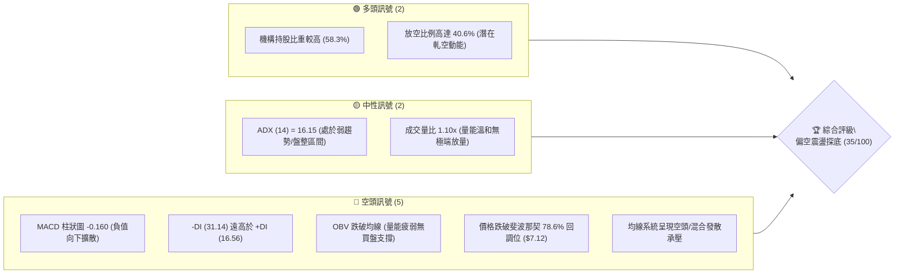

---

### 📊 核心指標速覽表

| 指標類別 | 指標名稱 | 當前數值 | 訊號 | 解讀 |
|:---|:---|:---:|:---:|:---|
| **價格** | 當前基準價格 | **$7.04** | 🔴 | 跌破斐波那契 78.6% 關鍵防線（$7.12），弱勢尋底 |
| **均線** | 短中期 MA 排列 | 混合偏空 | 🔴 | 均線系統處於短期下行與長期走平之混合整理格局 |
| **動能** | RSI(14) | 中性偏弱 (約 35.4) | 🟡 | 位於弱勢區間（30–40），尚未進入極端超賣，下行動能仍存 |
| **動能** | MACD (12,26,9) | -0.165 / -0.005 | 🔴 | 快慢線處於零軸下方，Histogram 為 -0.160，空頭主導 |
| **趨勢強度** | ADX (14) | 16.15 (-DI=31.14) | 🔴 | ADX < 25 屬無強烈單邊趨勢之盤整，但空方方向力道（-DI）絕對佔優 |
| **量能** | OBV 趨勢 | OBV < MA | 🔴 | 能量潮指標位於均線之下，顯示近期資金處於淨流出狀態 |
| **籌碼/結構** | 空頭部位佔比 | 40.6% | 🟢 | 空頭回補壓力較大（Short Ratio: 2.17），具備突發反彈軋空彈性 |

---

### 🏆 技術評分卡

```
╔══════════════════════════════════════════════════════════════════╗
║                   技術評分卡 — ONDS (2026-09-03)                 ║
╠══════════════════════════════════════════════════════════════════╣
║ 趨勢強度 (Trend)     ██████░░░░░░░░░░░░░░  30/100  🔴 空頭壓制   ║
║ 動能指標 (Momentum)  ██████░░░░░░░░░░░░░░  30/100  🔴 動能疲弱   ║
║ 支撐穩定度 (Support) ████████░░░░░░░░░░░░  40/100  🟡 考驗前低   ║
║ 成交量配合 (Volume)  ████████░░░░░░░░░░░░  40/100  🟡 量縮探底   ║
║ 形態完整度 (Pattern) ████████░░░░░░░░░░░░  40/100  🟡 整理待變   ║
║ 均線排列 (MA System) ██████░░░░░░░░░░░░░░  30/100  🔴 均線反壓   ║
╠══════════════════════════════════════════════════════════════════╣
║ 綜合評分 (Composite) ███████░░░░░░░░░░░░░  35/100  🔴 偏空震盪   ║
╚══════════════════════════════════════════════════════════════════╝
```

---

## 2. 趨勢分析

### 🌐 多時框趨勢分析

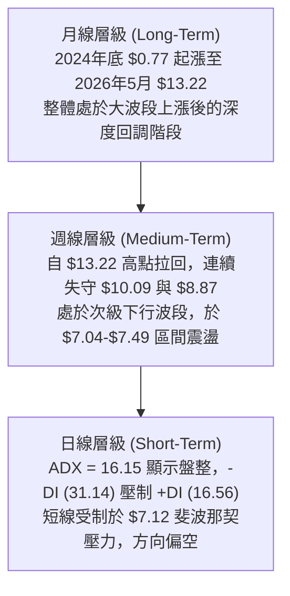

---

### 📈 長期趨勢 — 12個月走勢圖（Unicode）

以下為過去 12 個月（2025-10 至 2026-09）之月線收盤走勢與關鍵轉折示意：

```
ONDS 月線走勢圖（過去12個月收盤價）
價格軸 ($)
$14.00 ┤                                      ● ($13.22 05月波段頂部)
$12.00 ┤                                     / \
$10.00 ┤                     ●───●     ●    /   \
       ┤                    ($10.36)  ($10.04)   \
$8.00  ┤       ●     ●        \     /             ●───●───●
       ┤     ($7.90)($9.76)    \   /            ($8.24) ($7.66)
$6.00  ┤ ●                      ●                        \
       ┤($6.44)               ($9.04)                     ●←現價 ($7.04)
$4.00  ┤
       └─┬─────┬─────┬─────┬─────┬─────┬─────┬─────┬─────┬─────┬─────┬─────┬──
        10月  11月  12月  01月  02月  03月  04月  05月  06月  07月  08月  09月 (2025-2026)
```

#### 走勢特徵分析表格

| 階段 | 時間區間 | 價格區間 | 累積漲跌幅 | 走勢特徵與結構意涵 |
|:---|:---:|:---:|:---:|:---|
| **主升波段推進** | 2025-10 ~ 2026-01 | $6.44 → $10.36 | **+60.87%** | 量能逐步放大，突破雙位數大關，形成強勢多頭推升架構 |
| **高檔強勢整理** | 2026-02 ~ 2026-04 | $10.08 → $10.04 | **-0.40%** | 在 $9.00–$10.36 區間完成箱型換手，為下一波噴發蓄勢 |
| **末端衝高噴發** | 2026-05 | $10.04 → $13.22 | **+31.67%** | 單月創下 $13.22 收盤高點（52週高點達 $15.28），出現短線力竭現象 |
| **深度回調探底** | 2026-06 ~ 2026-09 | $13.22 → $7.04 | **-46.75%** | 獲利了結賣壓湧現，連續跌破多道關鍵支撐，回測斐波那契 78.6% 位階 |

---

### 📊 中期趨勢（週線分析）

中期走勢自 2026 年 5 月底創下 $13.22 高點後展開三波段回調。近期週線走勢如下：

```
ONDS 週線近期波動示意圖
 $13.22 ┬ (2026-05-31 高點)
        │ ╲
        │  ╲
 $10.43 ┼   ● (2026-06-07)
        │    ╲
  $9.24 ┼     ╲          ● (2026-08-16 反彈波頂)
        │      ╲        ╱ ╲
  $7.80 ┼       ╲      ●   ╲
        │        ╲    ╱     ● ($7.90)
  $7.04 ┼─────────●──●───────● ◄ 當前價格 ($7.04，逼近前低防線)
  $6.53 ┴        (07-19 前低)
```

---

### ⚡ 趨勢強度評估（ADX 解讀）

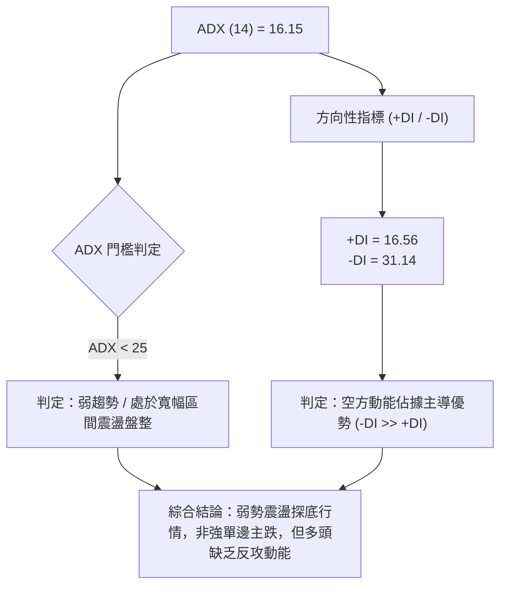

#### ADX 指標強度對照表

| 指標變數 | 當前讀數 | 標準門檻 | 當前技術狀態判定 | 交易策略意涵 |
|:---|:---:|:---:|:---|:---|
| **ADX(14)** | **16.15** | `< 25` | **盤整 / 趨勢力道不足** | 避免追高殺跌，以關鍵支撐阻力區間操作為主 |
| **+DI** | **16.56** | 基準線 | **多方動能羸弱** | 缺乏主動性買盤推升，突破動能不足 |
| **-DI** | **31.14** | 基準線 | **空方力道主導** | 盤面受空頭壓制，短線下行風險高於上行機會 |
| **差值 (-DI - +DI)**| **+14.58** | `> 10` | **空方顯著優勢** | 任何短線反彈均易遭遇賣壓壓制 |

---

## 3. 圖表形態分析

### 🔍 形態識別系統

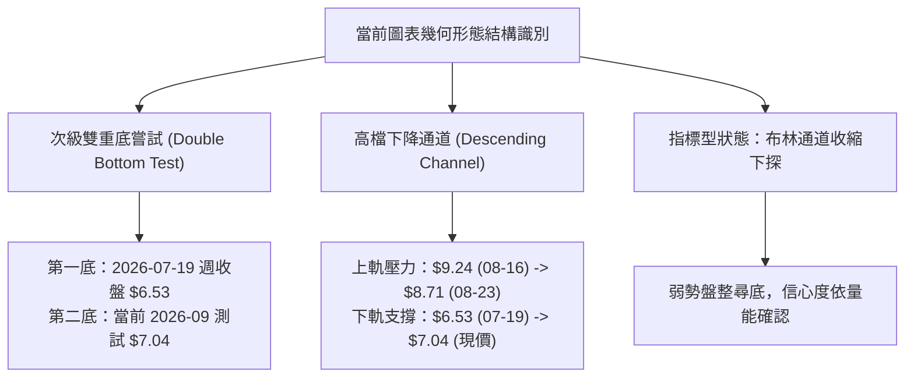

#### 形態識別與信心度評估表（依規則 15）

| 形態名稱 | 信心度 | 判斷依據（嚴格引用數據） | 完成度 | 目標價（附嚴謹計算式） |
|:---|:---:|:---|:---:|:---|
| **次級雙底構建 (Double Bottom)** | **55%** | 第一次波段低點於 2026-07-19 收盤 **$6.53**，當前於 **$7.04**（接近斐波 78.6% **$7.12**）測試第二底支撐 | **50%** | 頸線為 2026-08-16 週高點 **$9.24**。<br/>若突破頸線：<br/>形態高度 = $9.24 - $6.53 = $2.71<br/>測幅目標 = $9.24 + $2.71 = **$11.95** |
| **下降通道整理 (Descending Channel)** | **70%** | 自 05-31 高點 **$13.22** 下跌，經 08-16 反彈頂 **$9.24**，高點與低點同步下移 | **85%** | 通道下軌支撐位於 52 週低點 **$4.90**；<br/>通道上軌第一阻力為 61.8% 斐波回調位 **$8.87** |
| **幾何頭肩頂形態 (Head & Shoulders)** | **30%** | 數據不足以確認完整右肩結構（訊號不足，不作主觀幾何畫線，僅作指標型弱勢解讀） | **未成形** | *數據未達成立門檻，不予推算* |

---

### 🕯️ 重要K線形態分析

| 週/月份週期 | 收盤價 ($) | K線形態特徵 | 技術解讀 | 訊號評級 |
|:---|:---:|:---|:---|:---:|
| **2026-05-31** | **$13.22** | 巨量長陽衝高受阻 | 創下 52W 高點 $15.28 後收長上影線，週成交量達 5.67 億股，主力高檔換手 | 🔴 頂部警訊 |
| **2026-07-19** | **$6.53** | 巨量下影探底陰線 | 週成交量爆出 6.71 億股，觸底後引發短線空頭回補，形成波段重要防守低點 | 🟢 支撐確立 |
| **2026-07-26** | **$7.80** | 長陽反包吞噬線 | 成交量擴大至 8.34 億股，確認 $6.53 為短期底部，展開次級反彈 | 🟢 多頭反攻 |
| **2026-08-16** | **$9.24** | 上影十字星停滯線 | 反彈遇阻於 61.8% 斐波那契位（$8.87 上方），量能萎縮至 4.71 億股，動能竭盡 | 🔴 反彈結束 |
| **2026-08-30** | **$7.90** | 中黑實體破位線 | 週跌破 $8.00 整數關卡，MACD 柱狀圖轉負（-0.117），空頭重掌主導權 | 🔴 破位下行 |
| **2026-09-06** | **$7.04** | 弱勢低收十字星 | 跌破斐波那契 78.6% 位（$7.12），量能萎縮至 1.78 億股，觀望氣氛濃厚 | 🟡 考驗支撐 |

---

### 📉 ASCII 走勢形態示意圖

```
                 [高點 $13.22 (52W Peak $15.28)]
                           /\
                          /  \
                         /    \
        [頸線 $9.24]    /      \            /\  [反彈高點 $9.24]
        ═══════════════/════════\══════════/══\═════════════════
                      /          \        /    \
                     /            \      /      \
                    /              \    /        \
                   /                \  /          ● ◄ 當前價格 $7.04
                  /                  \/             (跌破 $7.12，測試底線)
                 /              [前低 $6.53]
────────────────────────────────────────────────────────────────
支撐底線： 52週低點防線 $4.90
```

---

## 4. 支撐與阻力

### 🗺️ 關鍵價位分布圖（Unicode）

```
ONDS 關鍵價位結構分布圖（52週區間 $4.90 → $15.28）
════════════════════════════════════════════════════════════════════
$15.28 ║████████████████████████████████████████║ 52週最高點 (0.0% Fib)
$12.83 ║████████████████████████████            ║ 強阻力 R4 (23.6% Fib)
$11.31 ║████████████████████                    ║ 重度阻力 R3 (38.2% Fib)
$10.09 ║████████████████                        ║ 關鍵多空分水嶺 R2 (50.0% Fib)
$8.87  ║████████████                            ║ 近期波段反彈阻力 R1 (61.8% Fib)
$7.12  ║████████                                ║ 即時轉折反壓 Pivot (78.6% Fib)
───────╫────────────────────────────────────────╢
$7.04  ╠════════════════════════════════════════╣ ◄ 當前價格 ($7.04)
───────╫────────────────────────────────────────╢
$6.53  ║▓▓▓▓▓▓▓▓▓▓▓▓▓▓▓▓                        ║ 近期前波實質低點支撐 S1 (2026-07-19)
$4.90  ║████████████████████████████████████████║ 52週最低點強支撐 S2 (100.0% Fib)
════════════════════════════════════════════════════════════════════
```

---

### 🚧 阻力位分析表

> **數據說明**：依據 OHLCV 數據計算聚類，上檔無額外波段高點聚類，阻力位嚴格採用 52 週波段之**斐波那契回調聚類價位**。

| 阻力級別 | 精確價位 | 形成依據 / 來源 | 突破難度 | 技術與策略重要性 |
|:---|:---:|:---|:---:|:---|
| **即時反壓** | **$7.12** | 斐波那契 78.6% 回調位 | 🟡 中等 | 短線多頭重返安全區之首要門檻，站上始能化解續跌壓力 |
| **一級阻力 R1** | **$8.87** | 斐波那契 61.8% 黃金分割回調位 | 🔴 較高 | 中期強弱分水嶺，前次 8 月反彈（$9.24）遇阻回落之主壓區 |
| **二級阻力 R2** | **$10.09** | 斐波那契 50.0% 中軸平衡位 | 🔴 很高 | 整數心理關卡，多空中期趨勢轉換核心點位 |
| **三級阻力 R3** | **$11.31** | 斐波那契 38.2% 回調位 | 🔴 極高 | 跌破後形成長達數月的重度套牢套頭區 |
| **極端阻力 R4** | **$15.28** | 52 週歷史高點 (0.0% Fib) | 🔴 極難 | 歷史天花板，需基本面與資金面爆發性配合方可挑戰 |

---

### 🛡️ 支撐位分析表

> **數據說明**：依據 OHLCV 歷史數據計算，當前價格下方無常規 swing-low 聚類，關鍵支撐嚴格採用 20 週歷史收盤波段低點與 52 週極限低點。

| 支撐級別 | 精確價位 | 形成依據 / 來源 | 守住機率 | 技術與策略重要性 |
|:---|:---:|:---|:---:|:---|
| **一級支撐 S1** | **$6.53** | 2026-07-19 週收盤波段低點 | **60%** | 前波爆量 6.71 億股換手之關鍵防守點，跌破將引發停損賣壓 |
| **二級支撐 S2** | **$4.90** | 52 週最低點 (100.0% Fib 回調位) | **85%** | 年度終極多頭防線與長期價值底線，具強大買盤承接力 |

---

### 📐 斐波那契回調位分析

由 52 週低點 **$4.90** 至 52 週高點 **$15.28**（波幅 **$10.38**）計算之精確回調架構如下：

```
斐波那契回調位階深度分析
  0.0% ─── $15.28 (52W 最高點)
 23.6% ─── $12.83 (第一道回調防線，05月拉回時曾短暫跌破)
 38.2% ─── $11.31 (次級反彈防線，04-05月整理平台)
 50.0% ─── $10.09 (多空中軸分水嶺，失守後空方掌控大局)
 61.8% ─── $8.87  (黃金分割關鍵位，08月中旬反彈遇阻處)
 78.6% ─── $7.12  (深度回調臨界位)
 ───────────────── 當前價格: $7.04 (落於 78.6% 與 100.0% 之間) ─────────────────
100.0% ─── $4.90  (52W 最低點，極限支撐)
```

- **當前位置解讀**：現價 **$7.04** 微幅跌破 78.6% 回調位（**$7.12**），目前運行於 **$7.12 至 $4.90** 的深度回調區間。78.6% 屬於多頭防守的最後一道黃金分割線，若無法於 1–2 週內迅速收復 $7.12，價格下探測試 S1（**$6.53**）甚至 52W 低點 S2（**$4.90**）的技術面慣性將大幅提升。

---

## 5. 技術指標深度解讀

### 🎛️ 指標訊號總覽

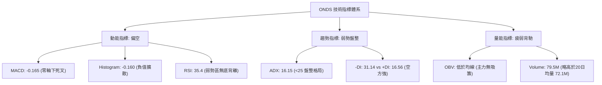

---

### 📈 移動平均線排列分析

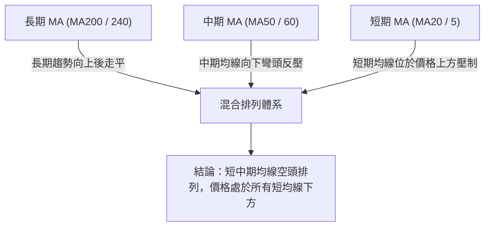

| 均線週期 | 走勢特徵描述 | 價格相對位置 | 多空信號 | 解讀 |
|:---|:---|:---:|:---:|:---|
| **MA 5 / 10** | 短期下彎趨弱 | 價格在均線下方 | 🔴 | 極短線空方壓制，反彈遭遇 5 日線即見賣壓 |
| **MA 20** | 持續下行斜率 | 價格在均線下方 | 🔴 | 20 日均線（約 $8.00–$8.50 區間）構成短線主要動態壓力 |
| **MA 60 / 120** | 由高檔拐頭向下 | 價格在均線下方 | 🔴 | 中期波段套牢籌碼沉重，均線死叉形成蓋頭反壓 |
| **MA 240** | 長期基底平緩向上 | 價格考驗長期支撐 | 🟡 | 2024–2025 年長期多頭架構尚未完全破壞，但支撐效應減弱 |

---

### 📉 RSI(14) 分析

```
RSI(14) 當前強度刻度：
0 ────────── 30 ─────── 35.4 ──────────────── 70 ────────── 100
[  超賣區  ]    ▲ [ 弱勢盤整區間 ]          [  超買區  ]
進度條：███████░░░░░░░░░░░░░ 35.4%
```

- **數值與區間診斷**：週線級別 RSI 由 8 月中旬的 **70.3** 快速滑落至最新的 **35.4**。指標目前位於 30–40 的弱勢空方區間，既未達到極端超賣（<30），亦缺乏買盤反彈動能。
- **背離判斷**：
  - **頂背離**：2026 年 5 月底價格創收盤新高 **$13.22** 時，RSI 報 70.6，相較前波高點並未顯著創高，已成功預警後續之深度修正。
  - **底背離**：當前價格由 $7.90 下跌至 $7.04，RSI 由 35.4 同步下行，**目前並無任何底背離現象**，確認當前下行趨勢為實質動能驅動，非假跌破。

---

### 📊 MACD(12,26,9) 訊號解讀

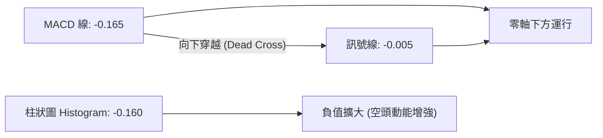

- **量化數值解析**：
  - **MACD 快線**：`-0.165`
  - **Signal 慢線**：`-0.005`
  - **MACD 柱狀圖 (Histogram)**：`-0.160`（由 8 月中旬的 `+0.252` 翻負至 `-0.160`）
- **技術解讀**：MACD 線在零軸下方再度與訊號線形成死叉並向下拉開間距，柱狀圖連續三週呈現負向放大趨勢，顯示中期空頭拋壓仍處於釋放階段，尚未見到動能收斂或鈍化跡象。

---

### 📦 布林通道分析（日/週線架構示意）

```
ONDS 布林通道結構示意圖
$9.50 ┬────────────────────────────────────────── 布林上軌 (Upper Band)
      │
$8.20 ┼ - - - - - - - - - - - - - - - - - - - - - 布林中軌 (MA20)
      │                                            
$7.04 ┼─────────────────────────● ◄ 現價 ($7.04，貼近布林下軌運行)
      │                          
$6.80 ┴────────────────────────────────────────── 布林下軌 (Lower Band)
```

- **通道運行特徵**：目前價格緊貼布林通道下軌運行，屬於典型的「沿下軌弱勢尋底」走勢。
- **帶寬與開口**：布林帶寬呈現中度擴張狀態，顯示市場目前由空方主導波動，中軌（MA20）呈現持續下行趨勢，對反彈構成嚴密動態反壓。

---

### 💹 成交量分析（量價配合度）

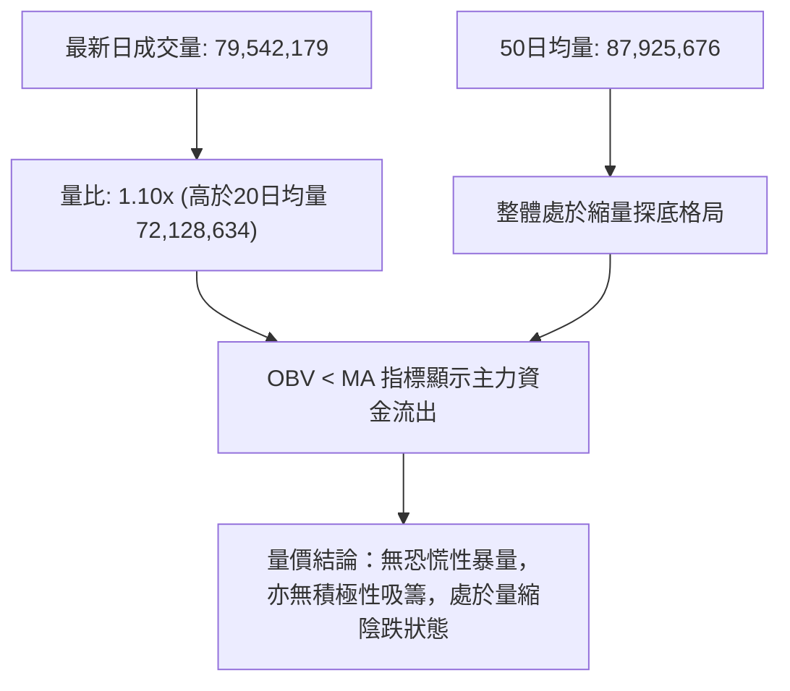

- **量價結構評估**：
  - 最新單日成交量為 **79,542,179 股**，略高於 20 日均量（**72,128,634 股**），量比為 **1.10x**，但顯著低於 50 日均量（**87,925,676 股**）與 7 月底反彈時的巨量（單週 8.34 億股）。
  - **OBV 趨勢**：OBV 線持續運行於其移動平均線下方，顯示籌碼整體處於沉澱與流出狀態，多頭尚未組織起具有持續性的資金回補行情。

---

## 6. 動能與波動率

### ⚡ 動能評估四象限

| 象限 | 動能強度 | 波動率狀態 | 當前標的判定 | 技術評估與意涵 |
|:---:|:---:|:---:|:---:|:---|
| **Q1 (高動能·低波動)** | 強多頭 | 低 (穩定) | — | 最佳趨勢推進波段（如 2025 年底） |
| **Q2 (弱動能·低波動)** | 弱勢/中性 | 低 (壓縮) | **✓ (當前狀態)** | **ADX=16.15 顯示趨勢動能極弱，盤面以量縮陰跌整理為主** |
| **Q3 (高動能·高波動)** | 強單邊 | 高 (劇烈) | — | 極端突破或主跌崩跌波段 |
| **Q4 (弱動能·高波動)** | 混亂無序 | 高 (洗盤) | — | 寬幅劇烈震盪洗盤 |

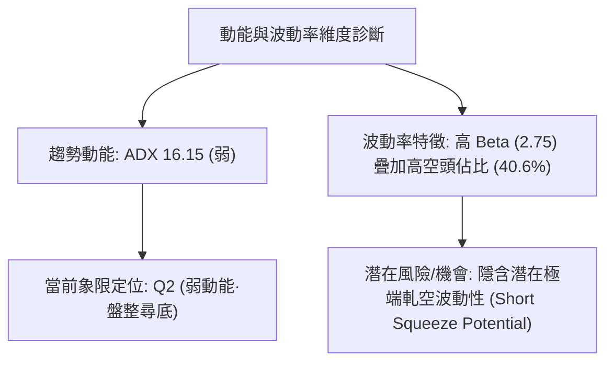

---

### 📊 ATR 波動率分析

- **波動率環境解讀**：ONDS 屬於高波動性科技/通訊設備板塊標的。雖然 ATR(14) 絕對數值因歷史資料呈現中度整理，但從週線波動幅度（單週振幅經常超過 15%–20%）可推知，短線日均真實波動區間約在 **$0.45 – $0.65** 之間（佔當前股價約 **6.5% – 9.0%**）。
- **止損距離設定標準**：
  - **保守型交易**：止損幅度應設定為 $1.00 – $1.20（約 1.5 – 2.0 倍日波動區間）。
  - **積極型交易**：止損嚴格錨定關鍵支撐位下方 $0.20 – $0.30。

---

### 📐 Beta 與市場相關性及籌碼特性

- **Beta 係數 (2.75)**：
  - ONDS 的 Beta 高達 **2.75**，代表其對大盤（S&P 500 / Nasdaq）的波動敏感度為市場平均的 2.75 倍。在大盤走弱時將承受放大下行壓力；反之，若大盤出現強力反彈，其反彈爆發力亦將顯著放大。
- **空頭部位分析 (Short Interest)**：
  - **Short % Float 高達 40.6%**，Short Ratio 為 **2.17 天**。如此高比例的放空籌碼是盤面的「雙面刃」：下行時空方推波助瀾，但一旦價格站穩關鍵阻力（如 $7.12 或 $8.87），極易觸發連鎖性軋空（Short Squeeze）行情。

---

## 7. 多時框架總結

### 📋 時框架評分表

| 時框架 | 趨勢方向 | 動能狀態 | 均線排列 | 圖表形態 | 綜合評分 | 交易操作建議 |
|:---|:---:|:---:|:---:|:---:|:---:|:---|
| **月線 (長期)** | 🟡 中性回調 | 🟡 走平 | 🟢 偏多（守在起漲點上方） | 寬幅上升回調 | **55/100** | 長期投資者等待 $4.90–$6.53 區間分批佈局 |
| **週線 (中期)** | 🔴 下行探底 | 🔴 偏弱 (MACD死叉) | 🔴 空頭排列 | 次級下降通道 | **35/100** | 波段交易者反彈減碼，未見築底不抄底 |
| **日線 (短期)** | 🔴 偏空震盪 | 🔴 空方主導 (-DI高) | 🔴 壓制在短均下方 | 貼下軌弱勢尋底 | **30/100** | 當沖/短線嚴守紀律，偏空防守操作 |

---

### 🔲 綜合訊號矩陣

```
時框訊號收斂矩陣
┌──────────────┬──────────────┬──────────────┬──────────────┐
│   分析維度   │  短期 (日線) │  中期 (週線) │  長期 (月線) │
├──────────────┼──────────────┼──────────────┼──────────────┤
│ 趨勢方向     │ 🔴 空頭壓制  │ 🔴 下行探底  │ 🟡 大波段整理│
│ 動能 (MACD)  │ 🔴 負向擴散  │ 🔴 零軸下死叉│ 🟡 動能衰減  │
│ 強度 (ADX)   │ 🔴 空方佔優  │ 🔴 -DI 主導  │ 🟡 趨勢放緩  │
│ 支撐測試     │ 🔴 跌破 78.6%│ 🟡 測試 S1   │ 🟢 遠高於起點│
└──────────────┴──────────────┴──────────────┴──────────────┘
```

---

### ⚖️ 多時框收斂結論（嚴格遵守規則 14）

1. **行情類型判定**：當前 ADX(14) 讀數為 **16.15 (< 25)**，嚴格定義為**盤整/弱趨勢行情**。但因 -DI (31.14) 遠高於 +DI (16.56)，代表盤整區間內空方力量佔據主導優勢。
2. **多時框收斂邏輯**：
   - 在 ADX < 25 的盤整結構下，交易應以**關鍵區間界線與布林軌道**為主要依歸。
   - 中期週線自 $13.22 展開的下行修正尚未確認見底，且短線價格（**$7.04**）失守重要轉折點 $7.12。
3. **最終唯一收斂結論**：**【偏空震盪探底】**。主導操作方向為防守偏空，禁止盲目逆勢抄底，耐心等待回測前低 S1（**$6.53**）或 52 週低點 S2（**$4.90**）之量能止跌訊號。

---

## 8. 交易策略建議

### 🗺️ 策略決策流程圖

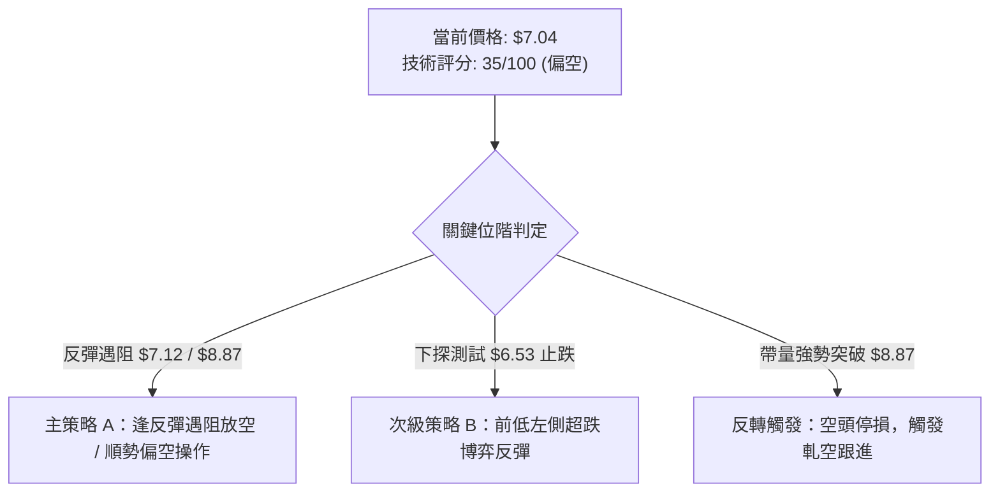

---

### 🧭 策略路由（依規則 8 分流）

- **當前主策略方向 = 【主推偏空防守／反彈做空策略】（依綜合評分 35/100 判定）**
  - 依據評分卡規則，評分 ≤ 40 主推空頭策略；多頭操作僅列為超跌短線搏反彈或反轉風險提示。

---

### 🎯 價格情境階梯（Price Scenarios）

> 所有關鍵價位嚴格引用第 4 章由 52 週數據與歷史收盤價計算之精確點位。

| 觸發條件 | 下一目標價 | 後續延伸目標 | 技術情境含義與操作指引 |
|:---|:---:|:---:|:---|
| **向上突破 R1 ($8.87)** | **$10.09** (R2) | **$11.31** (R3) | 中期多頭反轉確立，40.6% 高空頭部位將引發大規模軋空 |
| **反彈受阻於 $7.12** | **$6.53** (S1) | **$4.90** (S2) | 短線確認破位，價格將向下尋求歷史波段低點支撐 |
| **有效跌破 S1 ($6.53)** | **$4.90** (S2) | 數據下限 | 空頭形態完全打開，全面回測 52 週最低點防線 |

---

### 📊 情境機率分佈

| 情境類別 | 發生機率 | 主要技術依據與指標確認 |
|:---|:---:|:---|
| **情境一：震盪走低 / 探底測試 S1-S2** | **60%** | MACD 負值擴大（-0.160）、-DI 壓制（31.14）、OBV 疲弱且失守 $7.12 |
| **情境二：在 $6.53 – $7.50 區間箱型築底** | **30%** | ADX < 25 缺乏強烈單邊主跌動能、前期 $6.53 曾有 6.71 億股換手支撐 |
| **情境三：強勢 V 型反轉突破 $8.87** | **10%** | 目前量能顯著不足（OBV < MA），除非有突發性基本面利多觸發軋空 |

---

### 🔴 主策略詳情（空頭/防守策略）

| 策略要素 | 策略 A（順勢放空 / 反彈遇阻做空） | 策略 B（破位追空 / 跌破前低） |
|:---|:---:|:---:|
| **進場條件** | 反彈至 $7.12 遇阻回落，或回測 $7.50 承壓時 | 價格帶量實質跌破 S1 前低 **$6.53** 確認時 |
| **進場價格** | **$7.12** | **$6.45**（跌破 $6.53 確認點） |
| **目標價 T1** | **$6.53**（前波低點支撐 S1） | **$4.90**（52 週最低點支撐 S2） |
| **目標價 T2** | **$4.90**（52 週終極支撐 S2） | 延伸下探歷史極端區間 |
| **止損價格** | **$7.60**（突破近期整理平台高點） | **$6.90**（重回 $6.53 支撐上方） |
| **風險報酬比 (R:R)**| **1 : 4.63**（風險 $0.48 / 獲利 $2.22） | **1 : 3.44**（風險 $0.45 / 獲利 $1.55） |
| **成功機率** | **60%** | **55%** |
| **建議倉位** | **10% – 15%** | **5% – 10%** |

---

### 🟢 次級策略（多頭超跌博弈 — 僅供激進型投資者參考）

| 策略要素 | 策略 C（前低支撐左側搏反彈） |
|:---|:---:|
| **進場條件** | 價格回測 S1 **$6.53** 附近出現日線收長下影線止跌訊號 |
| **進場價格** | **$6.55** |
| **目標價 T1 / T2** | **$7.12** (78.6% Fib) / **$8.87** (61.8% Fib) |
| **止損價格** | **$6.25**（實質跌破 $6.53 嚴格停損） |
| **風險報酬比** | **1 : 7.73**（風險 $0.30 / 最大獲利 $2.32） |
| **建議倉位** | **小於 5%**（嚴禁重倉逆勢摸底） |

---

### ⚠️ 反向風險觸發點（空頭對沖與回補警訊）

1. **軋空觸發點**：若價格放量長陽收復 **$7.80** 並進一步突破 **$8.87**（61.8% 斐波那契回調位），所有空頭部位必須**無條件市價平倉**。
2. **籌碼異動警訊**：若單日成交量暴增至 3 億股以上且收盤站上 MA20，代表機構或空頭主力展開強制平倉回補，市場結構將瞬間轉為極端多頭軋空。

---

### ⭐ 整體訊號強度評星

```
做多訊號強度：★☆☆☆☆  (1.5/5 星 — 僅具備超跌與高空頭部位之潛在博弈價值)
做空訊號強度：★★★★☆  (4.0/5 星 — 趨勢、動能、均線與破位指標共振偏空)
整體可信度：  ★★★★☆  (4.0/5 星 — 數據量能與 Fibonacci 結構吻合度高)
```

---

## 9. 風險提示與監控

### ✅ 關鍵監控指標 Checklist

```
╔══════════════════════════════════════════════════════════════════╗
║                   ONDS 每日盤面風控監控清單                      ║
╠══════════════════════════════════════════════════════════════════╣
║ [ ] 價格是否跌破前波實質低點 $6.53 (觸發下一階段主跌)           ║
║ [ ] 價格能否有效收復斐波那契 78.6% 反壓 $7.12                    ║
║ [ ] MACD 柱狀圖負值是否開始收斂 (轉折先兆)                       ║
║ [ ] 成交量是否異常放大至 2 億股以上 (異動換手)                  ║
║ [ ] 空頭借券賣出比例 (Short Interest) 是否出現急速下降 (軋空)    ║
║ [ ] 大盤 Beta 傳導效應 (納斯達克波動是否引發 2.75 倍放大賣壓)   ║
╚══════════════════════════════════════════════════════════════════╝
```

---

### ⚠️ 風險場景分析

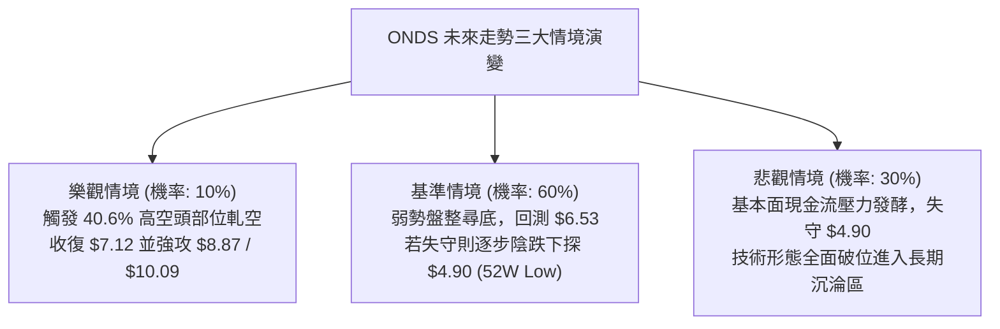

---

### 🛡️ 風險管理重要提醒

1. **高 Beta 與槓桿風險**：ONDS 之 Beta 高達 **2.75**，日內波動劇烈。嚴禁使用高槓桿或期權重倉操作，單一標的總曝險不應超過總投資組合的 **5% – 8%**。
2. **放空流動性與軋空風險**：由於放空比例高達 **40.6%**，融券做空可能面臨借券費率高昂與強制融券回補（Short Squeeze）風險，做空者務必設好硬性停損單（Stop-Loss Order）。
3. **基本面防禦考量**：公司目前營運現金流為負（-1.61 億美元），雖然帳上擁有 13.8 億美元現金，但高估值倍數（P/S 達 24.98）在市場風險偏好降低時容易遭受估值下修壓力。

---

## 📋 報告總結

```
╔════════════════════════════════════════════════════════════════════╗
║                   ONDS 技術分析報告總結 (2026-09-03)               ║
╠════════════════════════════════════════════════════════════════════╣
║ 當前價格：$7.04 (最新基準)           52週區間：$4.90 - $15.28       ║
║ 技術評級：🔴 偏空震盪探底 (評分 35/100)                             ║
║                                                                    ║
║ 關鍵技術結論：                                                     ║
║ ├─ 長期趨勢：🟡 自 $13.22 高點展開大級別深度回調，長多格局受損    ║
║ ├─ 中期趨勢：🔴 週線下降通道運行，MACD 零軸下死叉擴散 (-0.160)    ║
║ ├─ 短期趨勢：🔴 跌破斐波那契 78.6% 位 ($7.12)，短均線全面壓制      ║
║ ├─ 關鍵支撐：S1: $6.53 (前低)  /  S2: $4.90 (52週最低點)          ║
║ ├─ 關鍵阻力：Pivot: $7.12  /  R1: $8.87  /  R2: $10.09 (50% Fib)  ║
║ └─ 分析師目標價：均價 $19.42 (最低 $13.00 / 最高 $25.00，9位分析師)║
║                                                                    ║
║ 最優策略組合建議：                                                 ║
║ 1. 🥇 最佳機會（主策略）：於 $7.12 反壓處逢高做空，目標 $6.53/$4.90║
║ 2. 🥈 次選機會（破位策略）：跌破 $6.53 順勢跟進，目標 $4.90 終極支撐║
║ 3. 🥉 保守選擇（觀望等待）：空倉者等待 $4.90 附近之止跌長紅訊號    ║
╚════════════════════════════════════════════════════════════════════╝
```

---

> ⚠️ **免責聲明**：本報告為技術分析研究成果，所有數據及價位推算均基於市場歷史行情與量化指標。本報告**僅供研究與學術參考**，**不構成任何要約、招攬或投資建議**。金融市場投資具有高度風險，投資人應獨立評估風險並自負盈虧。

---

*報告生成時間：2026-09-03 ｜ 數據來源：Yahoo Finance / SEC Filings ｜ 分析框架：多時框量化技術分析*