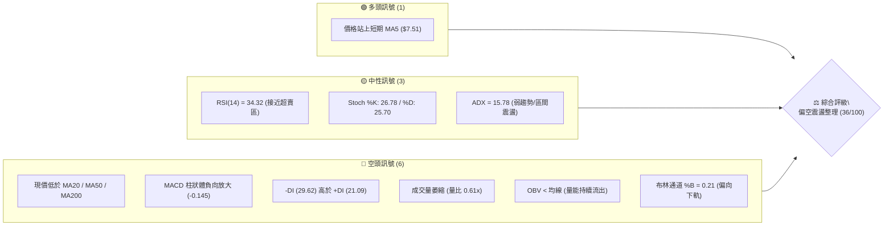
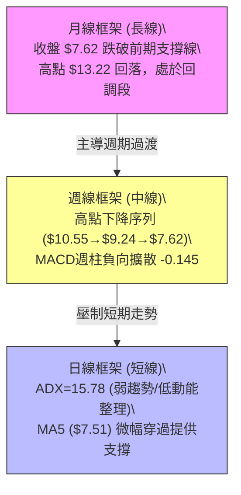
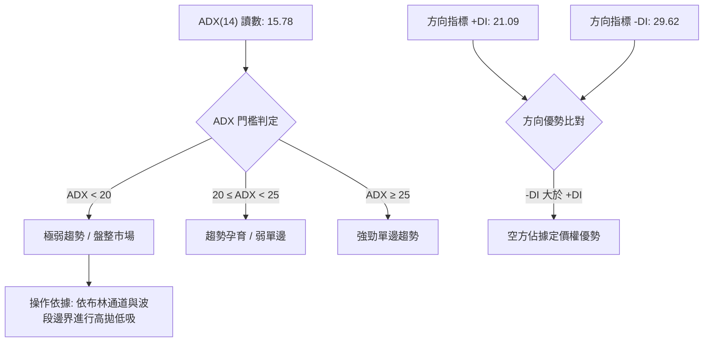
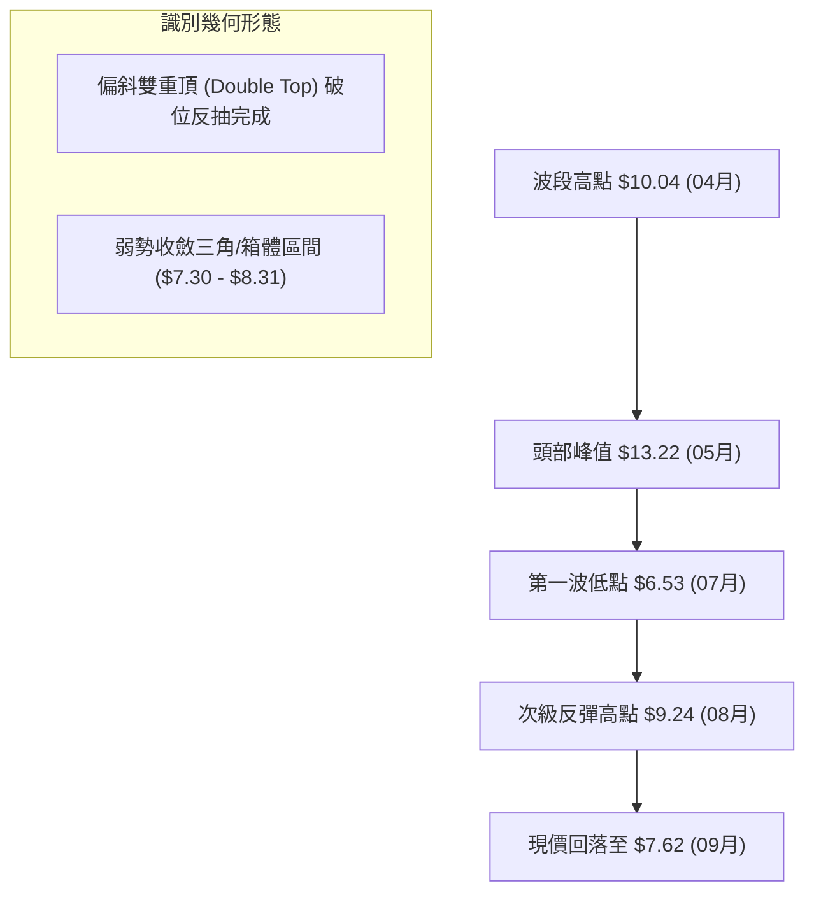
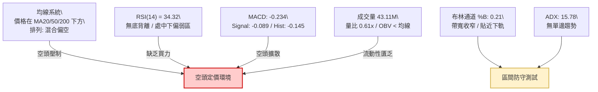
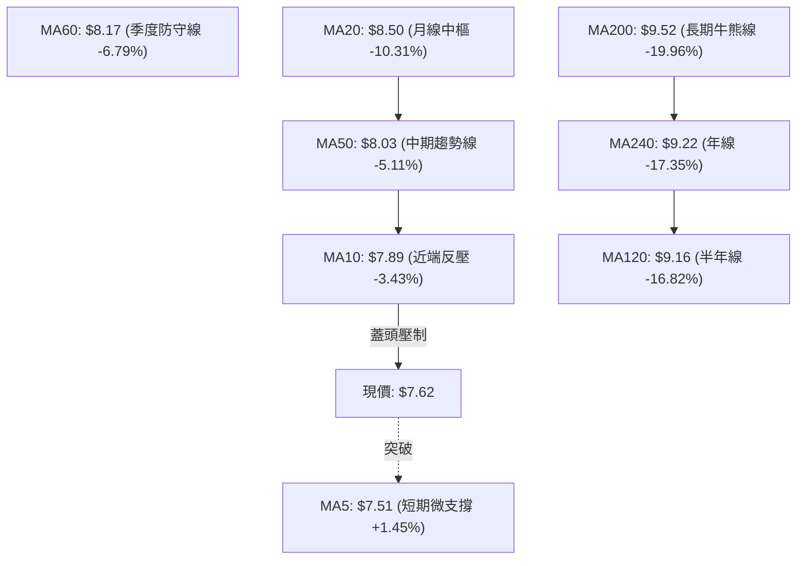
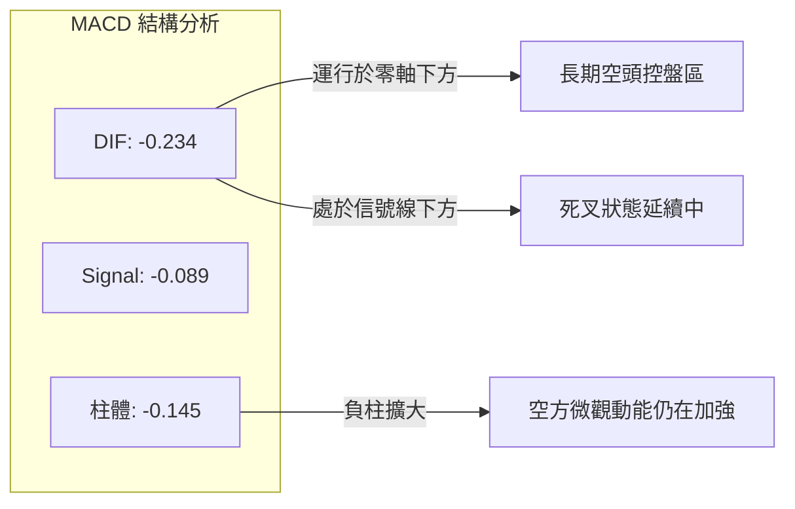
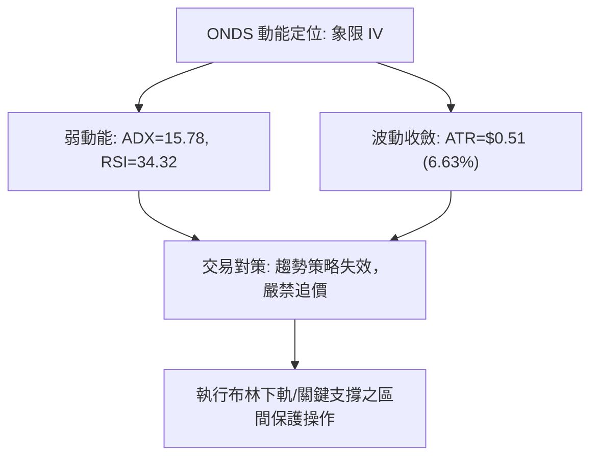
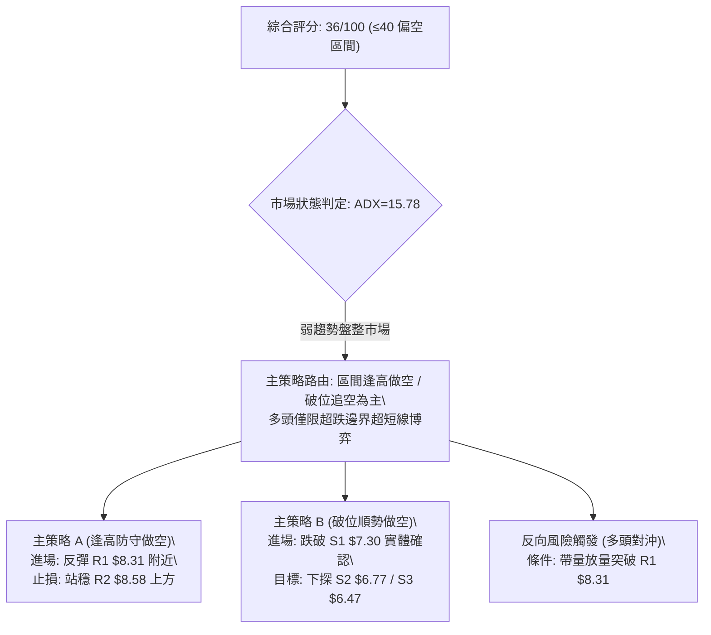
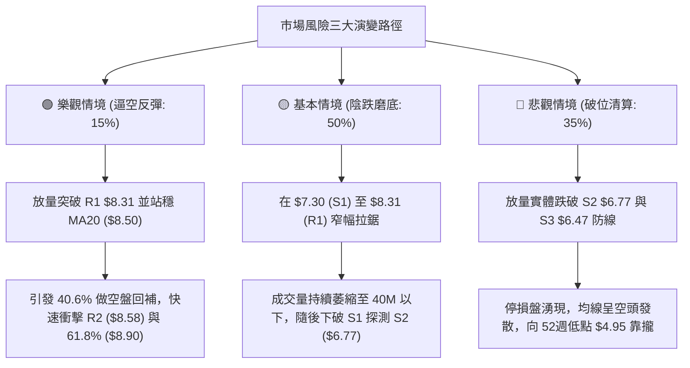

# ONDS 技術分析報告

> **報告日期**：2026-09-06 ｜ **語言**：繁體中文 ｜ **數據來源**：Yahoo Finance ｜ **當前價格**：$7.62

---

## 目錄

| 章節 | 內容 |
|------|------|
| [1. 技術面概覽](#1-技術面概覽) | 訊號儀表板、核心指標、評分卡 |
| [2. 趨勢分析](#2-趨勢分析) | 多時框趨勢、長中短期走勢、ADX解讀 |
| [3. 圖表形態分析](#3-圖表形態分析) | 形態識別、K線組合、形態信心度 |
| [4. 支撐與阻力](#4-支撐與阻力) | 關鍵價位、斐波那契回調結構 |
| [5. 技術指標深度解讀](#5-技術指標深度解讀) | MA/RSI/MACD/布林/量價配合 |
| [6. 動能與波動率](#6-動能與波動率) | 動能評估、ATR止損計算、Beta分析 |
| [7. 多時框架總結](#7-多時框架總結) | 時框架評分矩陣、收斂結論 |
| [8. 交易策略建議](#8-交易策略建議) | 策略路由、情境階梯、風報比計算 |
| [9. 風險提示與監控](#9-風險提示與監控) | 風險場景、監控清單、倉位管理 |
| [📋 報告總結](#-報告總結) | 核心指標與最優策略組合結論 |

---

## 1. 技術面概覽

### 🎯 技術訊號儀表板



### 📊 核心指標速覽表

| 指標類別 | 指標名稱 | 當前數值 | 訊號 | 解讀 |
|----------|----------|----------|------|------|
| **價格** | 當前價格 | $7.62 | 🔴 | 位於 52 週區間 25.8% 低位，承壓於多數均線之下 |
| **均線** | MA20 | $8.50 | 🔴 | 現價低於 MA20 達 -10.31%，短期下行斜率明確 |
| **均線** | MA50 | $8.03 | 🔴 | 跌破中期防守均線，構成短期上攻第一道動態阻力 |
| **均線** | MA200 | $9.52 | 🔴 | 遠低於長期生命線 -19.96%，中長線多空格局偏空 |
| **動能** | RSI(14) | 34.32 | 🟡 | 位於弱勢中性區間，尚未出現經典極端超賣 (<30) |
| **動能** | MACD | -0.234 | 🔴 | DIF 線於零軸下方運行且低於信號線 (-0.089)，柱體擴大 |
| **趨勢** | ADX(14) | 15.78 | 🟡 | 數值 < 25，表明單邊趨勢已休止，進入箱體震盪沉澱期 |
| **方向** | +/-DI | 21.09 / 29.62 | 🔴 | -DI 大幅高於 +DI，空頭在邊際定價上佔據主導優勢 |
| **波動** | ATR(14) | $0.51 | 🟡 | 日內波幅佔股價 6.63%，波動率自前期高檔有所收斂 |
| **通道** | 布林 %B | 0.21 | 🔴 | 運行於下軌 ($6.97) 與中軌 ($8.50) 之間弱勢區 |
| **成交量** | 20日量比 | 0.61x | 🔴 | 當日量能 43.11M 遠低於均量 70.85M，市場買盤意願低迷 |

### 🏆 技術評分卡

```
╔══════════════════════════════════════════════════════════════════╗
║                   技術評分卡 — ONDS (2026-09-06)                 ║
╠══════════════════════════════════════════════════════════════════╣
║ 評估維度         評分進度條                         分數   狀態  ║
╟──────────────────────────────────────────────────────────────────╢
║ 趨勢強度 (ADX)   ███████░░░░░░░░░░░░░              35/100   🟡   ║
║ 動能指標 (RSI/M) ██████░░░░░░░░░░░░░░              30/100   🔴   ║
║ 支撐穩定度       █████████░░░░░░░░░░░              45/100   🟡   ║
║ 成交量配合 (OBV) ██████░░░░░░░░░░░░░░              30/100   🔴   ║
║ 形態完整度       ████████░░░░░░░░░░░░              40/100   🟡   ║
║ 均線排列系統     ████████░░░░░░░░░░░░              38/100   🔴   ║
╠══════════════════════════════════════════════════════════════════╣
║ 綜合技術評分     ███████░░░░░░░░░░░░░              36/100  偏弱  ║
║ 投資評級結論     🔴 弱勢區間震盪 / 逢高偏空佈局                  ║
╚══════════════════════════════════════════════════════════════════╝
```

---

## 2. 趨勢分析

### 🌐 多時框趨勢分析



### 📈 長期趨勢 — 12個月走勢圖（Unicode）

```
ONDS 月線收盤走勢圖（2025-09 至 2026-09）
價格 ($)
$14.00 ┤                                     ●(2026-05: $13.22)
$13.00 ┤                                    ╱ ╲
$12.00 ┤                                   ╱   ╲
$11.00 ┤                       ●(01: 10.36)      ╲
$10.00 ┤                  ●(12: 9.76) ╲  ●(04: 10.04)
$9.00  ┤                               ●(03: 9.04) ╲
$8.00  ┤       ●(11: 7.90)                          ●(06: 8.24)
$7.00  ┤ ●(09: 7.72) ╲                               ●──●──●←現價 $7.62
$6.00  ┤             ●(10: 6.44)                   (07: 7.49 / 08: 7.66)
       └────────────────────────────────────────────────────────────
        09-25 10-25 11-25 12-25 01-26 02-26 03-26 04-26 05-26 06-26 07-26 08-26 09-26
```

#### 走勢特徵分析表格

| 時間階段 | 期間價格區間 | 累積漲跌幅 | 成交特徵與型態表現 |
|----------|--------------|------------|--------------------|
| **2025-09 ~ 2025-12** | $7.72 → $9.76 | +26.42% | 底部放量推升，逐月墊高波段低點 |
| **2026-01 ~ 2026-04** | $10.36 → $10.04 | -3.09% | 高位萬元關卡拉鋸，構築箱體整理平台 |
| **2026-05 (尖峰)** | $10.04 → $13.22 | +31.67% | 爆量拉出年內高點 ($15.28 盤中)，月收盤 $13.22 出現長上影線 |
| **2026-06 ~ 2026-07** | $13.22 → $7.49 | -43.34% | 假突破後連續快速殺跌，吞噬前三個月漲幅 |
| **2026-08 ~ 2026-09** | $7.49 → $7.62 | +1.74% | 殺跌動能暫竭，波幅壓縮於 $7.30 - $7.90 窄幅盤整 |

### 📊 中期趨勢（週線分析）

從近 20 週數據觀察，ONDS 走出明確的「頂部放量反轉」及「空方推動浪」：
- **頂部確認（2026-05-31 週）**：股價推升至 $13.22，週成交量放大至 566.99M，MACD 柱達到峰值 +0.400，隨後次週直接崩跌至 $10.43。
- **初跌浪與加速段（2026-06 ~ 2026-07）**：連續跌破 $9.33 與 $7.83，週成交量在 $6.53 低點當週擴大至 671.53M，引發拋售潮。
- **次級反彈遇阻（2026-08-16 週）**：由 $6.53 反彈至 $9.24 後動能無以為繼，週 RSI 由 70.3 迅速滑落至目前 34.3，週 MACD 柱翻負至 -0.145。

```
近期週線級別阻力與支撐示意圖：
[阻力區 R2] $8.58 ───────────────────────────── (前期反彈頸線破位點)
[阻力區 R1] $8.31 ───────────────────────────── (近三週回抽受阻線)
[現價水平]  $7.62 ◄────── (當前收盤位置)
[支撐區 S1] $7.30 ───────────────────────────── (7月盤整平台下沿)
[支撐區 S2] $6.77 ───────────────────────────── (前波殺跌強支撐位)
```

### ⚡ 趨勢強度評估（ADX 解讀）



| 指標項目 | 數值 | 狀態門檻 | 實質市場含義 |
|----------|------|----------|--------------|
| **ADX(14)** | 15.78 | < 25 (弱趨勢) | 趨勢動能徹底衰竭，目前處於無方向隨機遊走與籌碼沉澱期 |
| **+DI (多頭動能)** | 21.09 | 相對低位 | 多頭缺乏擴散動能，單日反彈無法形成連續推進 |
| **-DI (空頭動能)** | 29.62 | 明顯主導 | 空方雖佔據上風，但未達到 >40 的恐慌殺跌強度，轉為陰跌盤整 |

---

## 3. 圖表形態分析

### 🔍 形態識別系統



#### 形態識別與信心度評估表

| 形態類別 | 信心度 | 判斷依據（引用數據） | 完成度 | 目標價（附嚴格計算式） |
|----------|--------|----------------------|--------|------------------------|
| **雙重頂反抽破位** | 72% | 05月高點收盤 $13.22 與 08月中旬次級高點 $9.24 構成雙頂架構；前期重要頸線為 $8.50 (MA20)，目前反抽已破位下沉 | 85% | 破位頸線 $8.50 - 形態落差 ($9.24 - $8.50 = $0.74) = 理論量度目標 $7.76（已跌破抵達），下看前低聚類支撐 **$6.77** |
| **箱體震盪沉澱** | 68% | ADX 降至 15.78 驗證無趨勢；價格在下軌 S1 ($7.30) 與上軌阻力 R1 ($8.31) 之間反覆拉鋸 | 70% | 區間上沿 **$8.31**；區間下沿 **$7.30**；突破後若下破對稱高度為 $7.30 - ($8.31 - $7.30 = $1.01) = **$6.29** |
| **頭肩頂形態** | 35% | 缺乏完整左肩對稱成交量支撐，數據信號不足 | 30% | 訊號不足，僅做指標型解讀，不預設延伸目標 |

### 🕯️ 重要K線形態分析

| 週期/月份 | 收盤價 | 典型K線形態 | 深度解讀 | 訊號 |
|-----------|--------|-------------|----------|------|
| **2026-05** | $13.22 | 射擊之星 (Shooting Star) | 盤中衝擊 52 週高點 $15.28 後巨幅回吐，長上影線顯示機構於高檔主力派發 | 🔴 強烈看空 |
| **2026-07** | $7.49 | 長下影錘子線 | 跌至 $6.53 殺跌盤湧現後獲短期買盤托起，但實體收於下半部，確認底部支撐粗具雛形 | 🟡 暫止跌 |
| **2026-08** | $7.66 | 倒轉十字星 (Doji) | 衝高 $9.24 遭遇拋壓回落，月線實體極小，多空雙方力量於 $7.60 附近陷入拉鋸膠著 | 🟡 變盤中性 |
| **2026-09** | $7.62 | 弱勢陰十字 | 開盤小幅衝高即承壓回落，成交量顯著萎縮至 43.11M，市場觀望氣氛極度濃厚 | 🔴 弱勢觀望 |

### 📉 ASCII 走勢形態示意圖

```
ONDS 中期反抽衰竭形態解析：
$13.22 頂部 (2026-05)
   ▲
  ╱ ╲
 ╱   ╲
╱     ╲               $9.24 次頂 (2026-08)
       ╲                 ▲
        ╲               ╱ ╲
         ╲  $8.58 (R2) ┌───╲──── (反抽頸線阻力壓制)
          ╲   │        │    ▼
           ▼  ▼        │   $7.62 (現價受制於下跌通道中軸)
          $6.53 (低點) ┘     │
                             ▼
                           [$7.30 (S1) 支撐測試中]
```

### 🎯 形態目標價計算

根據日線及週線確立的箱體破位下移形態，進行嚴格量化推算：
1. **箱體上限阻力**：$8.31 (R1)
2. **箱體下限支撐**：$7.30 (S1)
3. **震盪中軸 (目前現價壓制區)**：$7.80 (由 ($8.31 + $7.30) / 2 計算)
- 若多頭無法在成交量配合下突破 R1 ($8.31)，價格將維持於箱體內部遊走；
- 若日線實體跌破 S1 ($7.30)，則開啟新一輪等距下探，目標為歷史聚類支撐點 **$6.77** 與 **$6.47**。

---

## 4. 支撐與阻力

### 🗺️ 關鍵價位分布圖（Unicode）

```
ONDS 關鍵價位結構分布圖
════════════════════════════════════════════════════════════════
$9.92 ║████████████████████████████████████████║ 強阻力 R3 (+30.25%)
$8.90 ║▓▓▓▓▓▓▓▓▓▓▓▓▓▓▓▓▓▓▓▓                    ║ 斐波那契 61.8% 回調位
$8.58 ║████████████████████████                ║ 重要阻力 R2 (+12.60%)
$8.50 ║────────────────────────────────────────║ 布林中軌 / MA20 動態重壓
$8.31 ║████████████████████                    ║ 近期關鍵阻力 R1 (+9.12%)
$7.62 ╠════════════════════════════════════════╣ ◄ 當前價格 $7.62
$7.30 ║▓▓▓▓▓▓▓▓▓▓▓▓▓▓▓▓                        ║ 近期第一支撐 S1 (-4.27%)
$7.16 ║░░░░░░░░░░░░░░░░                        ║ 斐波那契 78.6% 回調位
$6.77 ║████████████████████████                ║ 波段關鍵強支撐 S2 (-11.15%)
$6.47 ║████████████████████████████            ║ 核心波段低點支撐 S3 (-15.16%)
$4.95 ║████████████████████████████████████████║ 52週歷史低點 (100.0%)
════════════════════════════════════════════════════════════════
```

### 🚧 阻力位分析表

| 阻力級別 | 價位 | 形成原因與籌碼屬性 | 突破難度 | 重要性權重 |
|----------|------|--------------------|----------|------------|
| **R1** | **$8.31** | 近一年波段次高點聚集區，短線多頭反彈受阻密集區 | 🟡 中等 (需日成交量放大至 >70M) | ★★★★☆ |
| **R2** | **$8.58** | 8月中旬次級反彈下殺的頸線破位點，與 MA20 ($8.50) 形成共振重壓 | 🔴 極高 (需連續放量吞噬) | ★★★★★ |
| **R3** | **$9.92** | 接近 $10.00 整數心理關口與 MA200 ($9.52) 之上強套牢密集峰 | 🔴 難以逾越 (非基本面質變不可及) | ★★★★☆ |

### 🛡️ 支撐位分析表

| 支撐級別 | 價位 | 形成原因與籌碼屬性 | 守住機率 | 重要性權重 |
|----------|------|--------------------|----------|------------|
| **S1** | **$7.30** | 近期波段低點聚類，接近斐波那契 78.6% ($7.16) 防守緩衝區 | 🟡 55% (若量能持續萎縮恐失守) | ★★★★☆ |
| **S2** | **$6.77** | 7月中旬殺跌帶血籌碼換手低點，中線主力防守底線 | 🟢 70% (具備高性價比反彈買盤) | ★★★★★ |
| **S3** | **$6.47** | 近一年波段深谷低點聚類，跌破將引發清算級技術停損 | 🟢 85% (短期極強底部邊界) | ★★★★★ |

### 📐 斐波那契回調位分析

依據 52 週完整波動區間（高點 **$15.28** 至低點 **$4.95**，總垂直空間 $10.33）計算精確分位：

- **0.0% (52W High)**: $15.28
- **23.6%**: $12.84
- **38.2%**: $11.33
- **50.0%**: $10.11（多空強弱分水嶺）
- **61.8%**: $8.90（黃金回調防守位，已跌破轉為重大天花板）
- **78.6%**: $7.16（深度回調終極支撐防線）
- **100.0% (52W Low)**: $4.95

> **當前落點解讀**：  
> 現價 **$7.62** 正處於 **61.8% ($8.90)** 與 **78.6% ($7.16)** 之間的「深度修正區間」。自 52 週高點回撤已達 -50.13%，技術面屬於典型的弱勢深度回踩。目前價格正緩步逼近 78.6% ($7.16) 的最後斐波那契防線；若 $7.16 失守，股價將失去數學回調支撐，大概率向波段低點 S2 ($6.77) 甚至 100% 原始起漲點 $4.95 尋求均衡。

---

## 5. 技術指標深度解讀

### 🎛️ 指標訊號總覽



### 📈 移動平均線排列分析



| 均線天期 | 當前價格 | 乖離率 (%) | 狀態評估 |
|----------|----------|------------|----------|
| **MA5** | $7.51 | +1.45% | 🟢 價格剛上穿 MA5，構成超短線唯一的多頭微弱支撐 |
| **MA10** | $7.89 | -3.43% | 🔴 扣高走低，短線首道上蓋均線壓力 |
| **MA20** | $8.50 | -10.31% | 🔴 跌破且向下傾斜，月線級別資金套牢沉重 |
| **MA50** | $8.03 | -5.11% | 🔴 價格位於其下，中期反彈天花板 |
| **MA60** | $8.17 | -6.79% | 🔴 季線反壓，與波段阻力 R1 ($8.31) 形成共振阻力帶 |
| **MA200** | $9.52 | -19.96% | 🔴 嚴重負乖離，中長期多頭結構已遭受實質破壞 |

### 📉 RSI(14) 分析

當前數值：**34.32**（中性偏弱區間 30 - 70）  
進度條展示：`[███████░░░░░░░░░░░░░] 34.32%`

- **區間診斷**：RSI 位於 30-40 弱勢盤整帶，既未引發空頭恐慌殺跌至超賣區（<30），亦缺乏任何多頭力量向上推升突破 50 中軸。
- **背離判斷**：
  - 前波價格低點 $6.53 (2026-07-19 週)，當時週 RSI 為 35.0；
  - 隨後價格反彈至 $9.24 時 RSI 達 60.5；
  - 當前現價 $7.62，週 RSI 降為 34.3，日 RSI 為 34.32。
  - **結論**：價格持續在低位運行，指標同步下滑，**目前無明顯底背離結構**，亦無頂背離，屬於量能退潮後的指標常態鈍化沉積。

### 📊 MACD(12/26/9) 訊號解讀

```
MACD 指標當前參數與狀態：
DIF 線:         -0.234
DEA 信號線:     -0.089
柱狀體 (Hist):  -0.145 (🔴 負值且柱體持續向下擴散)
```



週線級別 MACD 柱狀體過去三週由 +0.171 (08-16) 迅速反轉翻綠至 -0.033 (08-23)、-0.117 (08-30)、-0.145 (09-06)，確認中線反彈浪已終結，次級回調動能正在宣洩。

### 📦 布林通道分析

```
ONDS 日線布林通道結構 (20日參數, 2倍標準差)
══════════════════════════════════════════════════════════════════
$10.03 ─────────────────────────────── 布林上軌 (壓制位)
  │
  │
$8.50  ─────────────────────────────── 布林中軌 (MA20 強度防守)
  │
  │    $7.62 (現價落點 %B = 0.21) ◄── 位於中下軌弱勢區
  │
$6.97  ─────────────────────────────── 布林下軌 (短期通道支撐)
══════════════════════════════════════════════════════════════════
```

- **通道帶寬與形態**：中軌由前期上升轉為向下拐頭，上軌下壓至 $10.03，下軌平移至 $6.97。帶寬並未出現顯著發散，呈現弱勢收斂走平形態。
- **%B 指標解讀**：當前 %B 僅為 **0.21**，極度貼近下軌（0 代表下軌，0.5 為中軌）。在無單邊暴跌趨勢（ADX<25）的背景下，%B 接近 0.20 往往意味著短線下行空間受限於布林下軌 **$6.97** 附近，易誘發技術性小幅抽腳。

### 💹 成交量分析（量價配合度）

- **量能萎縮嚴峻**：最新日成交量僅為 **43,112,600 股**，對比 20 日均量 **70,845,265 股**，量比僅為 **0.61x**；對比 50 日均量 **87,806,460 股**更顯枯竭。
- **OBV (能量潮) 趨勢**：OBV 持續低於其均線系統，能量潮形成下行斜率階梯，表明資金呈現持續性淨流出狀態，場外資金不願在當前價位承接籌碼。
- **量價背離判斷**：股價自 $9.24 回調至 $7.62 過程中，成交量同步由 471.59M 週量縮減至 294.52M 週量。此現象屬於「價跌量縮」的弱勢陰跌特徵，並非健康的主力洗盤，反映買盤承接極為匱乏。

---

## 6. 動能與波動率

### ⚡ 動能評估四象限

| 象限代號 | 動能強度 | 波動率維度 | 當前市場落點 | 行為特徵與交易指引 |
|----------|----------|------------|--------------|--------------------|
| **象限 I** | 強動能 (ADX>25) | 低波動 | — | 穩定推進強趨勢行情（主升浪） |
| **象限 II** | 強動能 (ADX>25) | 高波動 | — | 劇烈單邊突破或瘋狂恐慌殺跌 |
| **象限 III** | 弱動能 (ADX<25) | 高波動 | — | 寬幅假突破洗盤震盪 |
| **象限 IV** | 弱動能 (ADX<25) | 低波動 (ATR收斂) | **✓ [ONDS 當前位置]** | **無量陰跌與區間沉積，避免追高殺跌，以邊界低吸或觀望為主** |



### 📊 ATR 波動率分析

- **當前數值**：ATR(14) 為 **$0.51**（佔現價 $7.62 之 **6.63%**）。
- **日內波動意涵**：ONDS 每日正常隨機波動區間約為 ±$0.51。在進場建倉時，任何低於 1 個 ATR 的窄幅停損極易受到日內噪聲清洗。
- **量化止損建議**：
  - **短線保守停損距離 (1.5 × ATR)**：$0.51 × 1.5 = **$0.765**  
    （對應由進場點下浮約 10.0%）
  - **區間結構止損距離 (2.0 × ATR)**：$0.51 × 2.0 = **$1.020**  
    （對應由阻力/支撐邊緣外擴之安全緩衝邊際）

### 📐 Beta 與市場相關性

- **Beta 係數**：**2.736**。
- **大盤敏感度解讀**：ONDS 具備極高的高彈性妖股屬性，理論上波動幅度為納斯達克/標普500指數的 **2.73 倍**。
- **機構與放空結構**：當前機構持股比例達 58.2%，但做空佔流通股比例高達 **40.6%**（Short % Float），空頭回補天數 (Short Ratio) 為 2.17。此極高的空頭部位意味著一旦出現超預期重大利好或技術放量突破關鍵阻力（如 R1 $8.31），極易觸發逼空（Short Squeeze）行情；但在成交量低迷之時，空方機構利用高 Beta 壓制股價陰跌效率極高。

---

## 7. 多時框架總結

### 📋 時框架評分表

| 時框架 | 趨勢方向 | 動能指標 | 均線排列 | 形態結構 | 綜合評分 | 操作建議 |
|--------|----------|----------|----------|----------|----------|----------|
| **月線 (長期)** | 🟡 震盪回調 | 弱勢中性 | 價格於長均線下方 | 歷史尖峰長上影回踩 | **42/100** | 長期底層資產觀察，靜待沉澱 |
| **週線 (中期)** | 🔴 明確空頭 | MACD翻綠 | 空頭共振壓制 | 反抽次頂回落，破位確認 | **32/100** | 逢反彈減碼，禁止盲目接刀 |
| **日線 (短期)** | 🟡 弱勢盤整 | RSI=34, ADX=15 | MA5微撐 / MA20重壓 | $7.30 - $8.31 箱體震盪 | **38/100** | 區間震盪交易，依上下軌操作 |

### 🔲 綜合訊號矩陣

| 技術維度 | 短期 (日線) | 中期 (週線) | 長期 (月線) | 衝突研判與收斂權重 |
|----------|-------------|-------------|-------------|--------------------|
| **方向一致性** | 弱勢震盪 (橫向) | 下行修正 (向下) | 衝高回踩 (向下) | 中長期壓制短期反彈空間 |
| **動能趨勢** | ADX=15.78 (無方向) | MACD柱擴大 (偏空) | 成交量逐步遞減 | 缺乏推動浪，任何反彈均視為次級修正 |
| **結構防守** | MA5 ($7.51) 支撐 | S1 ($7.30) 支撐 | S2 ($6.77) 核心防線 | $7.30 為短中時框共振多頭防守底線 |

### ⚖️ 多時框收斂結論

> **依嚴格規則 14 執行多時框收斂**：  
> 1. **行情性質判定**：當前 ADX(14) 讀數為 **15.78**，遠低於 25 的單邊行情門檻，**判定當前為標準「弱勢盤整/無趨勢市場」**。  
> 2. **主導時框與交易邊界**：單邊趨勢（ADX>25）尚未成型，因此不採用長均線順勢追價策略，而**以「日線布林通道軌道 ($6.97 - $10.03)」及「近期波段高低點聚類 ($7.30 - $8.31)」作為主要收斂邊界**。  
> 3. **方向性收斂結論**：雖然短線 MA5 守住 $7.51 帶來微弱支撐，但受制於週線 MACD 翻負與 MA20 ($8.50) 強壓，**最終唯一收斂結論為：【中性偏弱震盪觀望（評分 36/100）】**。策略核心為：**拒絕中線做多追價，僅圍繞下沿支撐進行輕倉反彈試單，或於上沿阻力執行空頭對沖**。

---

## 8. 交易策略建議

### 🗺️ 策略決策流程圖



### 🧭 策略路由（依評分卡分流）

**當前主策略方向 = 🔴 偏空操作 / 逢高佈局空頭（依技術評分卡：36/100）**

因技術評分低於 40 分臨界點，且週線趨勢受制於均線下行，主推策略為空方部署；多頭操作僅保留為極限支撐位的對沖提示與超短線反彈試單。

### 🎯 價格情境階梯（Price Scenarios）

價位完全取自第 4 章由波段高低點聚類嚴格計算之數值：

| 觸發條件 | 第一目標 | 第二目標 (後續延伸) | 情境技術含義 |
|----------|----------|---------------------|--------------|
| **突破 R1 $8.31** | R2 **$8.58** | R3 **$9.92** | 突破短期箱體天花板，短線走強，引發空頭回補 |
| **站穩現價 $7.62 區間** | R1 **$8.31** | S1 **$7.30** | 在 $7.30 - $8.31 區間延續無動能橫向拉鋸 |
| **跌破 S1 $7.30** | S2 **$6.77** | S3 **$6.47** | 支撐破位，中期震盪結構下移，開啟新一輪下行探底 |

### 📊 情境機率分佈

| 情境劇本 | 機率估計 | 主要技術依據 |
|----------|----------|--------------|
| **回落再探底 (下跌)** | **50%** | MACD 柱擴散至 -0.145、-DI (29.62) 主導、OBV 資金持續外流 |
| **區間震盪 (箱體盤整)** | **35%** | ADX 僅 15.78 表明趨勢動力不足，ATR 收縮，布林下軌 $6.97 提供短期彈性 |
| **逆轉上行 (向上反彈)** | **15%** | 目前僅守住 MA5 ($7.51)，成交量萎縮至 0.61x，缺乏機構反轉買盤 |

### 🔴 主策略詳情（空頭主導策略）

| 策略要素 | 策略 A（反彈遇阻做空） | 策略 B（跌破支撐順勢空） |
|----------|------------------------|--------------------------|
| **策略邏輯** | 測試箱體上沿與均線重壓受阻反手 | 跌破 7 月以來關鍵盤整下沿追擊 |
| **進場條件** | 價格反彈至 R1 附近且日線收長上影 | 跌破 S1 且日收盤確認失守 |
| **進場價格** | **$8.31** (R1 阻力位) | **$7.25** (確認跌破 S1 $7.30) |
| **目標價 T1** | **$7.30** (S1 支撐位) | **$6.77** (S2 支撐位) |
| **目標價 T2** | **$6.77** (S2 關鍵強支撐) | **$6.47** (S3 極強支撐位) |
| **止損價格** | **$8.65** (嚴格設於 R2 $8.58 上方) | **$7.55** (假破位重回 S1 內部之止損) |
| **風險空間** | $8.65 - $8.31 = $0.34 | $7.55 - $7.25 = $0.30 |
| **報酬空間 (T2)**| $8.31 - $6.77 = $1.54 | $7.25 - $6.47 = $0.78 |
| **風險報酬比** | **1 : 4.53** | **1 : 2.60** |
| **模型勝率預估** | 62% | 55% |
| **建議倉位** | 總資金之 10% - 15% | 總資金之 8% - 10% |

### 🟢 反向風險觸發點（對沖提示）

- **推翻空頭之關鍵信號**：日 K 線帶量（單日成交量突破 **70,000,000 股**）收盤站穩 **$8.58 (R2)** 之上。
- **對沖應對措施**：
  1. 所有空頭部位無條件嚴格止損離場。
  2. 高達 40.6% 的 Short Float 可能觸發逼空軋空浪潮，可反向小倉位追多，目標指向 MA200 附近的斐波那契回調位 **$8.90** 及阻力位 **$9.92**。

### ⭐ 整體訊號強度評星

```
做多訊號強度：★☆☆☆☆  (1.5/5星 - 僅存超跌超賣邊緣技術防禦，缺乏主動進攻買盤)
做空訊號強度：★★★☆☆  (3.5/5星 - 均線與指標全數偏空，惟受制於低 ADX 陰跌節奏)
整體可信度：  ★★★☆☆  (3.5/5星 - 盤整特徵明顯，需嚴防低量窄幅刷洗風險)
```

---

## 9. 風險提示與監控

### ✅ 關鍵監控指標 Checklist

```
╔══════════════════════════════════════════════════════════════════╗
║               ONDS 每日盤面關鍵技術指標監控 Checklist            ║
╠══════════════════════════════════════════════════════════════════╣
║ [ ] 價位維度：現價 $7.62 是否跌破短線第一防守線 S1 ($7.30)       ║
║ [ ] 均線維度：日內收盤價是否被壓制在 MA10 ($7.89) 與 MA20 ($8.50)  ║
║ [ ] 動能維度：MACD 柱狀體負值是否跌破 -0.150 進一步惡化          ║
║ [ ] 動能維度：RSI(14) 是否跌破 30.00 正式進入極端恐慌超賣區     ║
║ [ ] 趨勢維度：ADX(14) 是否由 15.78 拐頭放量站上 25.00 形成單邊   ║
║ [ ] 量能維度：日成交量是否突破 70.85M (20日均量) 確認資金回流    ║
║ [ ] 逼空異動：Short % Float (40.6%) 是否引發借券費率異常異動    ║
╚══════════════════════════════════════════════════════════════════╝
```

### ⚠️ 風險場景分析



### 🛡️ 風險管理重要提醒

1. **高 Beta 波動懲罰**：ONDS 的 Beta 高達 **2.736**，意味著個股波動率極劇烈。切勿使用滿倉操作，單筆交易虧損額度必須嚴格控制在總投資組合淨值的 **1.0% - 1.5%** 以內。
2. **空頭擠壓 (Short Squeeze) 雙刃劍**：由於流通盤放空比例高達 **40.6%**，在建立空頭策略（策略 A、B）時，**嚴禁不設止損裸空**。任何突發消息面刺激都可能引發無量跳空暴漲，R2 **$8.58** 為不可妥協之空頭硬性止損紅線。
3. **無趨勢期的磨損風險**：ADX 僅為 15.78，在低流動性盤整期內頻繁進行日內突破追單將面臨連續雙向洗盤（Whipsaw）虧損。耐性等待價格抵達第 4 章標定的極限邊界（R1 $8.31 或 S1 $7.30）再行觸發交易指令。

---

## 📋 報告總結

```
╔══════════════════════════════════════════════════════════════════╗
║                   ONDS 技術分析報告總結 (2026-09-06)             ║
╠══════════════════════════════════════════════════════════════════╣
║ 當前價格：$7.62          52週區間：$4.95 - $15.28 (落點: 25.8%)  ║
║ 技術評分：36/100 (偏弱)  趨勢狀態：弱趨勢盤整 (ADX: 15.78)       ║
║ 分析評級：🔴 偏空震盪整理 (逢高偏空或區間防守)                  ║
╟──────────────────────────────────────────────────────────────────╢
║ 關鍵結論：                                                       ║
║ ├─ 長期趨勢：🟡 自 $13.22 頂部腰斬回調，落於斐波那契 78.6% 邊界  ║
║ ├─ 中期趨勢：🔴 週 MACD 翻負 (-0.145)，均線呈蓋頭壓制架構        ║
║ ├─ 短期趨勢：🟡 MA5 ($7.51) 微幅支撐，但量比萎縮至 0.61x 無力進攻║
║ ├─ 關鍵阻力：R1: $8.31 ｜ R2: $8.58 (MA20共振) ｜ R3: $9.92      ║
║ ├─ 關鍵支撐：S1: $7.30 ｜ S2: $6.77 (強防守)   ｜ S3: $6.47      ║
║ └─ 分析師目標：共識 Strong Buy (9位機構均價: $19.42，與現價脫節)  ║
╟──────────────────────────────────────────────────────────────────╢
║ 最優策略組合：                                                   ║
║ 1. 🥇 最佳機會 (策略 A)：等待價格技術反彈至 R1 $8.31 遇阻做空，  ║
║    止損設 $8.65，目標下看 S1 $7.30 / S2 $6.77 (風報比 1:4.53)。 ║
║ 2. 🥈 次選機會 (策略 B)：若實體收盤跌破 S1 $7.30 順勢輕倉追空，  ║
║    進場 $7.25，止損 $7.55，目標 $6.77 / $6.47 (風報比 1:2.60)。 ║
║ 3. 🥉 保守選擇：在 ADX < 25 及成交量放大至 70M 前保持空倉觀望， ║
║    迴避無方向磨損。                                             ║
╚══════════════════════════════════════════════════════════════════╝
```

---

> ⚠️ **免責聲明**：本報告為技術分析研究，所有數據指標與計算均基於歷史價格與成交量資訊。本報告**僅供學術研究與投資分析參考**，**不構成任何要約、推薦或實質投資建議**。高 Beta 與高空頭比例個股具備高度本金損失風險，入市交易請務必自主決策並嚴格執行停損風控。

---

*報告生成時間：2026-09-06 ｜ 數據來源：Yahoo Finance ｜ 分析框架：多時框技術分析體系*