# ONDS 技術分析報告

> **報告日期**：2026-09-07 ｜ **語言**：繁體中文 ｜ **數據來源**：Yahoo Finance ｜ **當前價格**：$7.62

---

## 目錄

| 章節 | 內容 |
|------|------|
| [1. 技術面概覽](#1-技術面概覽) | 訊號儀表板、核心指標、評分卡 |
| [2. 趨勢分析](#2-趨勢分析) | 多時框趨勢、長中短期走勢 |
| [3. 圖表形態分析](#3-圖表形態分析) | 形態識別、K線組合、目標價 |
| [4. 支撐與阻力](#4-支撐與阻力) | 關鍵價位、斐波那契回調 |
| [5. 技術指標深度解讀](#5-技術指標深度解讀) | MA/RSI/MACD/布林/成交量 |
| [6. 動能與波動率](#6-動能與波動率) | 動能評估、ATR、Beta |
| [7. 多時框架總結](#7-多時框架總結) | 時框架評分矩陣 |
| [8. 交易策略建議](#8-交易策略建議) | 多空策略、風險報酬比 |
| [9. 風險提示與監控](#9-風險提示與監控) | 監控指標、風險場景 |

---

## 1. 技術面概覽

### 🎯 技術訊號儀表板

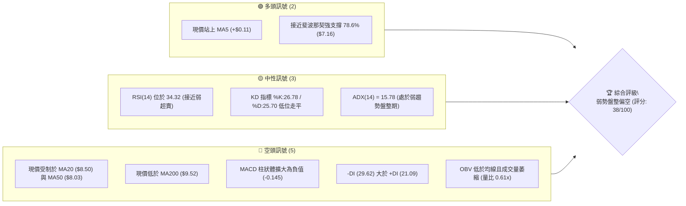

### 📊 核心指標速覽表

| 指標類別 | 指標名稱 | 當前數值 | 訊號 | 解讀 |
|----------|----------|----------|------|------|
| **價格** | 當前價格 | $7.62 | 🔴 | 位於 52 週區間下緣 25.8%，距離高點回撤近 50% |
| **短期均線** | MA5 | $7.51 | 🟢 | 現價微幅突破 5 日線 (+1.45%)，短線嘗試止跌 |
| **中期均線** | MA20 (布林中軌) | $8.50 | 🔴 | 處於均線下方 (-10.31%)，構成強烈反彈壓制 |
| **中期均線** | MA50 | $8.03 | 🔴 | 價格受制於 50 日均線下方，中短期架構偏空 |
| **長期均線** | MA200 | $9.52 | 🔴 | 現價遠低於 200 日線 (-19.96%)，長期空頭趨勢未變 |
| **動能指標** | RSI(14) | 34.32 | 🟡 | 位於中性偏弱區間，未觸及 30 嚴重超賣區，無背離 |
| **動能指標** | MACD (12,26,9) | -0.234 / -0.089 | 🔴 | DIF 位於 DEA 下方且 Hist 為 -0.145，空方動能占優 |
| **動能指標** | Stochastic %K/%D| 26.78 / 25.70 | 🟡 | 低檔鈍化微幅金叉，尚未形成有效向上突破 |
| **趨勢強度** | ADX(14) | 15.78 | 🟡 | ADX < 25 表明目前無單邊趨勢，行情轉為箱體整理 |
| **通道指標** | Bollinger Bands | 上 $10.03 / 下 $6.97 | 🔴 | %B 為 0.21，價格運行於下半通道，偏向弱勢尋底 |
| **量能指標** | 成交量 / 20日均量| 43.11M / 70.85M | 🔴 | 量比僅 0.61x，OBV 疲軟，買盤承接力道顯著不足 |
| **波動指標** | ATR(14) | $0.51 (6.63%) | 🟡 | 單日波動幅度適中，提供明確止損空間設定依據 |

### 🏆 技術評分卡

```
╔══════════════════════════════════════════════════════════════════╗
║                 技術評分卡 — ONDS (2026-09-07)                   ║
╠══════════════════════════════════════════════════════════════════╣
║ 趨勢強度 (ADX=15.78, 盤整弱勢)   ███████░░░░░░░░░░░░░  35/100 🔴 ║
║ 動能指標 (MACD死叉, RSI=34.3)    ██████░░░░░░░░░░░░░░  30/100 🔴 ║
║ 支撐穩定度 (守住 S1 $7.30 上方)  ██████████░░░░░░░░░░  50/100 🟡 ║
║ 成交量配合 (量比 0.61x, OBV疲弱) █████░░░░░░░░░░░░░░░  25/100 🔴 ║
║ 形態完整度 (箱體整理, 缺乏底型)  ████████░░░░░░░░░░░░  40/100 🟡 ║
║ 均線排列 (混合空頭, 壓制明顯)    ████████░░░░░░░░░░░░  40/100 🔴 ║
╠══════════════════════════════════════════════════════════════════╣
║ 綜合評分                         ███████░░░░░░░░░░░░░  38/100 🔴 ║
║ 總結評級：【弱勢盤整偏空】(Neutral-Bearish Consolidation)        ║
╚══════════════════════════════════════════════════════════════════╝
```

---

## 2. 趨勢分析

### 🌐 多時框趨勢分析

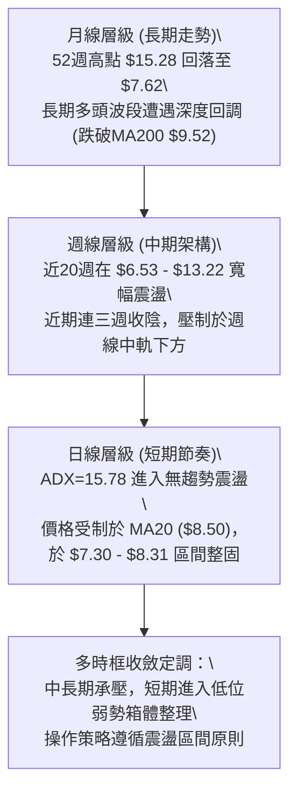

### 📈 長期趨勢 — 12個月走勢圖（ASCII）

```
ONDS 月線歷史走勢圖（2025-10 至 2026-09）
價格軸 ($)
$13.50 ┤                                      ● (05月: $13.22)
$12.00 ┤                                     / \
$10.50 ┤                   ●(01月: $10.36)  /   \
$9.00  ┤          ●(12月) / \       ●(04月)/     \
$7.50  ┤   ●(11月) \     /   \     /      ●(06月) \    ●(08月: $7.66)
       ┤  /         \   /     ●───●               └───●←現價 $7.62
$6.00  ┤ ●(10月: $6.44)                                (07月: $7.49)
       └────────────────────────────────────────────────────────
         10    11    12    01    02    03    04    05    06    07    08    09 (月份)
        (2025)                                (2026)
```

**走勢特徵分析表格**：

| 階段區間 | 月份起訖 | 價格變動 | 漲跌幅 | 走勢特徵與技術解讀 |
|----------|----------|----------|--------|-------------------|
| **主升驅動浪** | 2025-10 → 2026-01 | $6.44 → $10.36 | +60.87% | 機構資金大幅建倉，突破整數位階梯，創波段新高 |
| **高位整理浪** | 2026-01 → 2026-04 | $10.36 → $10.04 | -3.09%  | $9.00 - $10.50 區間反覆震盪洗盤，籌碼充分換手 |
| **終極衝頂浪** | 2026-04 → 2026-05 | $10.04 → $13.22 | +31.67% | 爆量拉升創下 52 週次高點，月線收出帶長上影的大陽線 |
| **斷崖回撤浪** | 2026-05 → 2026-07 | $13.22 → $7.49  | -43.34% | 獲利盤狂吐，連續兩月大陰線直接下破多道均線支撐 |
| **築底收斂期** | 2026-07 → 2026-09 | $7.49 → $7.62   | +1.74%  | 波動幅度收窄，成交量遞減，在斐波那契 78.6% 尋求支撐 |

### 📊 中期趨勢（週線分析）

從近 20 週數據觀察，ONDS 於 2026 年 5 月底創下 $13.22 週收盤高點後，於 2026 年 7 月 19 日當週暴跌下探至 $6.53 的波段低點。該週爆出 6.71 億股的恐慌拋售量，隨後在 2026 年 7 月 26 日以 8.34 億股的天量反彈至 $7.80，確立了中期底部結構（$6.53 - $6.77 區間為強買盤區）。然而，8 月反彈至 $9.24 後動能衰竭，近期連續三週收陰（$8.71 → $7.90 → $7.62），MACD 柱狀體再度轉負（-0.145），週線等級確認進入三角形或矩形收斂整理。

```
中期阻力與支撐示意圖（週線）：
$9.92 ───────────────────────── 強阻力 R3 (週線反彈前高聚類)
$8.58 ───────────────────────── 阻力 R2 (MA20 與前期高點)
$8.31 ───────────────────────── 阻力 R1 (反彈頸線壓制)
$7.62 ═════════════════════════ 【現價】
$7.30 ------------------------- 支撐 S1 (近期週線低點平台)
$6.77 ------------------------- 支撐 S2 (波段回踩確認低點)
$6.47 ------------------------- 強支撐 S3 (7月恐慌拋售低點 $6.53 聚類)
```

### ⚡ 趨勢強度評估（ADX 解讀）

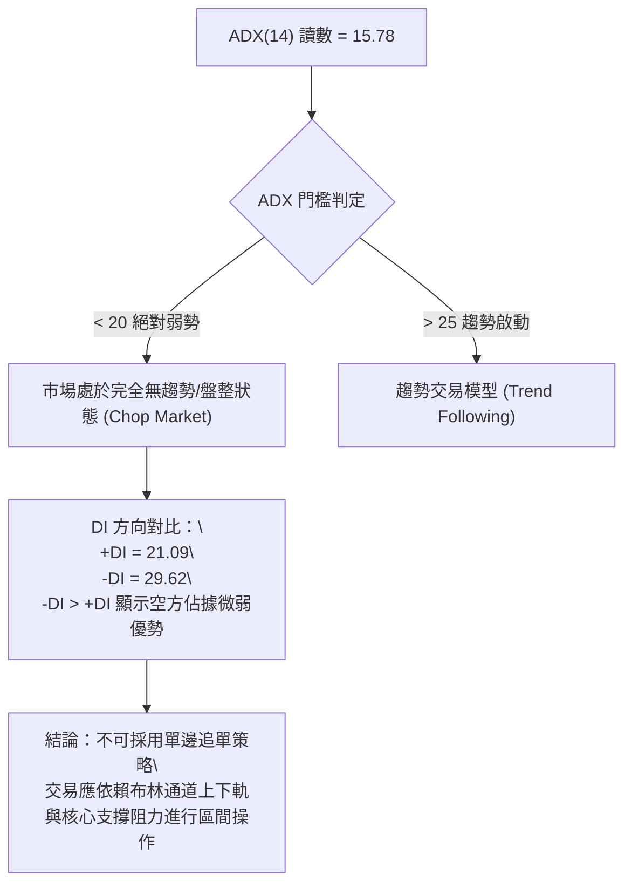

**ADX 強度對照與解讀表**：

| 指標變數 | 當前讀數 | 狀態級別 | 戰略含義 |
|----------|----------|----------|----------|
| **ADX (14)** | 15.78 | 弱趨勢 / 盤整行情 | 趨勢動能極低，避免任何突破追價策略，主導震盪指標 |
| **+DI (14)** | 21.09 | 空方壓制 | 多頭主動進攻力量匱乏，反彈缺乏持續買盤支撐 |
| **-DI (14)** | 29.62 | 空頭主導 | 空方雖主導市場，但未形成急速單邊下挫行情 |
| **方向差距 (DI Spread)**| -8.53 | 負向擴大中 | 若 -DI 進一步越過 30 且 ADX 抬頭，需警惕新一輪向下破位 |

---

## 3. 圖表形態分析

### 🔍 形態識別系統

在多時框架的客觀數據下，排除憑空臆測的主觀幾何繪圖，針對現有收盤與高低點數據進行標準形態識別：

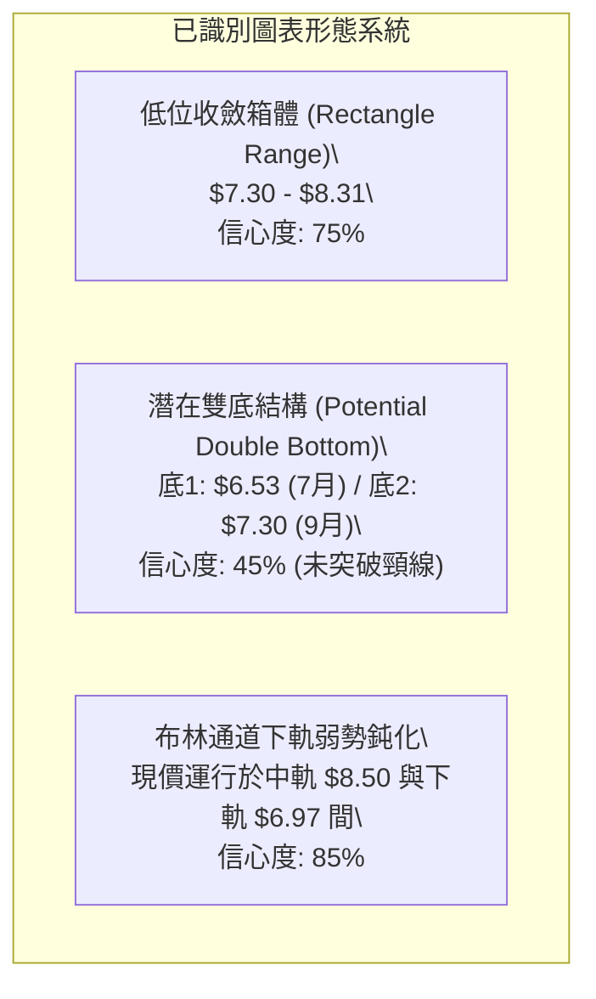

**形態信心度與目標價評估表**：

| 形態類別 | 信心度 | 判斷依據（引用數據） | 完成度 | 目標價（附嚴謹計算式） |
|----------|--------|----------------------|--------|------------------------|
| **水平箱體震盪** | **75%** | 價格受限於支撐 S1 **$7.30** 與阻力 R1 **$8.31** 之間窄幅波動，ADX=15.78 證實無趨勢 | 85% | 向上突破：頸線 $8.31 + 箱高 ($8.31 - $7.30 = $1.01) = **$9.32**；向下跌破：$7.30 - $1.01 = **$6.29** |
| **潛在雙底形態** | **45%** | 7/19 當週低點 $6.53（接近 S3 $6.47），目前於 S1 $7.30 尋求第二腳支撐，但尚未突破頸線 R1 $8.31 | 40% | *訊號不足，僅做觀察*。若有效站穩 $8.31，量度目標：頸線 $8.31 + ($8.31 - $6.53 = $1.78) = **$10.09** |
| **布林帶走平收縮** | **85%** | 上軌 $10.03，下軌 $6.97，中軌 $8.50，帶寬正逐步收斂，%B = 0.21 指向區間偏弱 | 90% | 區間下限：布林下軌 **$6.97**；區間反彈上限：布林中軌 **$8.50** |

### 🕯️ 重要K線形態分析

| 時間週期 | 收盤價 | K線形態特徵 | 量化技術解讀 | 訊號方向 |
|----------|--------|-------------|--------------|----------|
| **2026-05 (月線)** | $13.22 | 射擊之星 (Shooting Star) | 衝高至 52W 高點 $15.28 後遭遇強大空頭壓制收長上影線，多頭耗竭 | 🔴 看空反轉 |
| **2026-06 (月線)** | $8.24  | 穿頭破腳大陰線 (Bearish Engulfing)| 實體完全吞沒前月漲幅，確立中期頂部確立，進入深度回調 | 🔴 延續看空 |
| **2026-07-26 (週線)**| $7.80 | 放量長下影長陽棒 | 於 $6.53 獲得極致承接，單週換手 8.34 億股，確立強支撐底線 | 🟢 底部確認 |
| **2026-08-16 (週線)**| $9.24 | 倒錘頭受阻線 | 反彈上探至 MA200 附近遭遇密集套牢賣壓，反彈無力 | 🔴 逢高受阻 |
| **2026-09-06 (日線/週線)**| $7.62 | 窄幅十字星 (Doji) | 實體極小，成交量萎縮至 43.11M（量比 0.61x），多空在此停火觀望 | 🟡 變盤前兆 |

### 📉 ASCII 走勢形態示意圖

```
ONDS 2026年5月至9月 箱體收斂形態分析圖
價格 ($)
$13.22 ┼─────● (5月底假突破高點)
       │      \
$10.03 ┼───────\───────────── 布林上軌
$9.52  ┼─────────\─────────── MA200 長期均線壓制
$8.58  ┼───────────\───────●  阻力位 R2
$8.31  ┼─────────────\───/───\─ 阻力位 R1 (箱頂頸線)
$7.62  ┼──────────────\─/─────● [當前現價 $7.62 - 處於區間下半段]
$7.30  ┼───────────────●────── 支撐位 S1 (箱體底部)
$6.97  ┼───────────────────── 布林下軌
$6.53  ┼───────●───────────── 7月波段極端恐慌低點 (S3 $6.47 聚類)
       └───────┬───────┬───────
              7月     8月     9月
```

### 🎯 形態目標價計算

依據標準圖形量度理論，針對信心度最高之「水平收斂箱體」進行嚴格量化推算：
1. **箱體上限（頸線）**：$8.31（阻力位 R1）
2. **箱體下限（底部）**：$7.30（支撐位 S1）
3. **形態高度 (H)**：$8.31 - $7.30 = $1.01
4. **向上突破理論目標價**：$8.31 + $1.01 = **$9.32**（鄰近 MA120 $9.16 與 MA200 $9.52）
5. **向下跌破理論目標價**：$7.30 - $1.01 = **$6.29**（將跌破 S3 $6.47，朝 52 週最低點 $4.95 方向宣洩）

---

## 4. 支撐與阻力

### 🗺️ 關鍵價位分布圖（ASCII）

```
ONDS 關鍵價位空間分布結構圖 (依據 OHLCV 聚類計算)
═════════════════════════════════════════════════════════════════════
$10.11 ║░░░░░░░░░░░░░░░░░░░░░░░░░░░░░░░░░░░░║ 斐波那契 50.0% 中樞平衡位
$9.92  ║████████████████████████████████████║ 強阻力 R3 (近一年密集套牢峰值)
$8.90  ║░░░░░░░░░░░░░░░░░░░░░░░░░░░░░░░░░░░░║ 斐波那契 61.8% 關鍵黃金回撤位
$8.58  ║████████████████████████            ║ 阻力位 R2 (8月中旬反彈高點聚類)
$8.31  ║████████████████                    ║ 關鍵阻力 R1 (當前收斂箱頂 / MA60附近)
───────╠════════════════════════════════════╣ ◄ 現價: $7.62
$7.30  ║▓▓▓▓▓▓▓▓▓▓▓▓▓▓▓▓                    ║ 近期支撐 S1 (近期波段回踩密集成交區)
$7.16  ║░░░░░░░░░░░░░░░░░░░░░░░░░░░░░░░░░░░░║ 斐波那契 78.6% 極限回撤防線
$6.77  ║▓▓▓▓▓▓▓▓▓▓▓▓▓▓▓▓▓▓▓▓▓▓              ║ 強支撐 S2 (7月下旬次級低點)
$6.47  ║████████████████████████████████████║ 終極強支撐 S3 (7月極端恐慌低點聚類)
═════════════════════════════════════════════════════════════════════
```

### 🚧 阻力位分析表

所有阻力位嚴格採用 OHLCV 計算之聚類數據：

| 阻力級別 | 精確價位 | 距現價空間 | 形成原因與籌碼解讀 | 突破難度 | 重要性級別 |
|----------|----------|------------|-------------------|----------|------------|
| **R1** | **$8.31** | +9.05% | 8月下旬回落頸線位置、MA60 ($8.17) 上方阻力帶 | 中等 | 🟢 短線多空樞紐 |
| **R2** | **$8.58** | +12.60% | 8月中旬次高點聚類、布林中軌 MA20 ($8.50) 壓制帶 | 偏高 | 🟡 中期空頭生命線 |
| **R3** | **$9.92** | +30.18% | 2026年3-4月套牢密集成交峰、MA200 ($9.52) 之上強壓力 | 極高 | 🔴 牛熊分水嶺 |

### 🛡️ 支撐位分析表

所有支撐位嚴格採用 OHLCV 計算之聚類數據：

| 支撐級別 | 精確價位 | 距現價空間 | 形成原因與籌碼解讀 | 守住機率 | 重要性級別 |
|----------|----------|------------|-------------------|----------|------------|
| **S1** | **$7.30** | -4.20% | 近兩週日線反覆測試不破之平台下緣、箱體支撐 | 65% | 🟢 短線多頭防線 |
| **S2** | **$6.77** | -11.15% | 7月恐慌拋售後首次放量回踩站穩的結構低點 | 80% | 🟡 中期結構防線 |
| **S3** | **$6.47** | -15.09% | 7/19 當週創下的年內極端恐慌低點 $6.53 形成之聚類 | 90% | 🔴 52週波段生命線 |

### 📐 斐波那契回調位分析

依據 52 週完整波動區間（低點 **$4.95** → 高點 **$15.28**，總波幅 $10.33）精確計算：

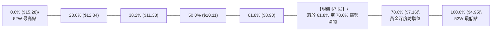

- **當前位置解讀**：現價 $7.62 位於 61.8%（**$8.90**）與 78.6%（**$7.16**）之間。在道氏與斐波那契理論中，回撤跌破 61.8% 意味著先前的上升趨勢已被嚴重破壞，不再屬於強勢回檔，而演變為「深度擠壓重組」。
- **下檔關鍵防護**：78.6% 的 **$7.16** 是多頭最後一道技術防線。此價位與支撐位 S1（**$7.30**）形成 $7.16 - $7.30 的緻密緩衝帶。若日線收盤確認摜破 $7.16，價格將失去斐波那契支撐庇護，勢必直奔 S2（**$6.77**）乃至 100% 回撤點 **$4.95**。

---

## 5. 技術指標深度解讀

### 🎛️ 指標訊號總覽

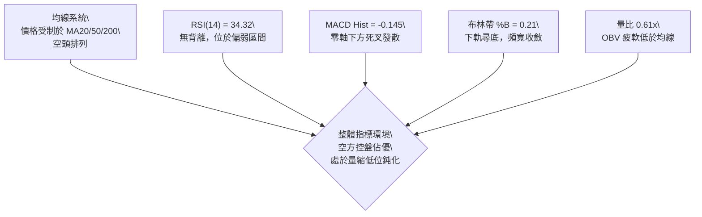

### 📈 移動平均線排列分析

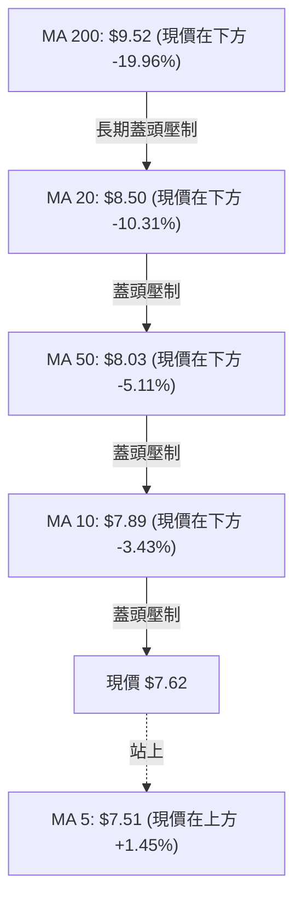

**均線狀態分析**：
- **短期均線**：MA5 ($7.51) 雖然微幅上揚 (+1.45%)，但 MA10 ($7.89) 與 MA20 ($8.50) 持續向下發散，形成層層反壓。
- **中長期均線**：MA50 ($8.03) 已經下穿 MA20，且 MA200 高懸於 $9.52。目前均線呈現「弱勢空頭排列」，上方累積了過去 240 個交易日（MA240 $9.22）的大量套牢籌碼。任何缺乏成交量配合的反彈，只要觸及 MA20 或 MA50，都將面臨解套盤與空頭回補壓力的二次打擊。

### 📉 RSI(14) 分析

- **當前讀數**：**34.32**
- **強度條**：
```
超賣 0 [███████░░░░░░░░░░░░░] 100 超買  (34.32/100 - 偏弱區)
```
- **背離分析**：
  - **價格走勢**：從 8 月 16 日的 $9.24 下跌至 9 月 7 日的 $7.62，形成「低點更低 (Lower Lows)」。
  - **RSI 軌跡**：同期 RSI 從 60.5 下降至 34.32，亦形成「低點更低」，指標與價格同步回落。
  - **結論**：**當前無底背離，亦無頂背離**。這表明目前的下跌是健康的動能釋放，尚未出現賣壓衰竭的技術背離特徵，多頭不可盲目抄底。

### 📊 MACD(12/26/9) 訊號解讀

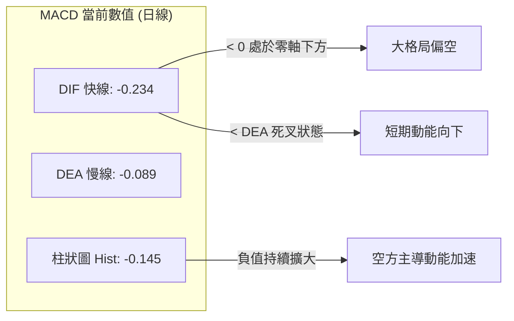

- **訊號解析**：MACD 快線 (-0.234) 明顯處於慢線 (-0.089) 下方，且雙線均處於零軸之下的極弱勢區域。柱狀圖讀數為 -0.145，較前幾週持續負向擴散，尚未見到紅柱收斂（綠柱縮短）的拐點。指標給予明確的看空訊號，短線尚未具備趨勢反轉條件。

### 📦 布林通道分析

```
布林通道當前架構示意圖 (帶寬收窄中)
$10.03 ┬────────────────────────────────────────── BB 上軌
       │
$8.50  ┼────────────────────────────────────────── BB 中軌 (MA20)
       │                    
$7.62  ┼───────────────● 現價 (位處下半通道 %B = 0.21)
       │
$6.97  ┴────────────────────────────────────────── BB 下軌
```

- **通道參數解讀**：上軌 **$10.03**，中軌 **$8.50**，下軌 **$6.97**。
- **%B 指標計算**：$\%B = (7.62 - 6.97) / (10.03 - 6.97) = 0.65 / 3.06 = 0.21$。
- **技術含義**：現價落於通道下四分之一區間（%B < 0.3），顯示市場處於明確的弱勢運行軌道。然而，通道帶寬正在快速收緊，且現價尚未觸軌下破 $6.97，這表示單邊暴跌階段已暫告一段落，行情進入「壓縮待變」階段。

### 💹 成交量分析（量價配合度）

- **最新日成交量**：43,112,600 股。
- **20日均量**：70,845,265 股（**量比 0.61x**，顯著萎縮）。
- **50日均量**：87,806,460 股。
- **OBV 能量潮解讀**：OBV 指標持續位於其均線下方。在 7 月底反彈至 $9.24 期間，成交量並未超越 7 月暴跌時的 8.34 億週天量，呈現「價漲量縮」的量價背離。而在近期回落過程中，成交量跌破 5,000 萬股，說明主動性拋盤減輕的同時，**場外機構買盤亦完全處於觀望狀態**。無量盤整代表流動性溢價降低，容易受到突發大單的衝擊而產生非理性破位。

---

## 6. 動能與波動率

### ⚡ 動能評估四象限

| 象限 | 動能強度 (RSI/MACD) | 波動率狀態 (ATR/BBW) | ONDS 當前定位 | 策略應對方針 |
|:---:|:---:|:---:|:---:|---|
| **第一象限 (Q1)** | 強動能 (多頭) | 低波動 (通道收縮) | ── | 蓄勢突破，最佳主升段進場點 |
| **第二象限 (Q2)** | 弱動能 (空頭) | 低波動 (通道收縮) | **✓ [當前所處位置]** | **空頭低波盤整，主力沉澱，嚴禁追價，以防守為主** |
| **第三象限 (Q3)** | 強動能 (多頭) | 高波動 (急劇擴散) | ── | 高風險高回報，需緊盯移動止損 |
| **第四象限 (Q4)** | 弱動能 (空頭) | 高波動 (恐慌暴跌) | ── | 順勢做空或等待恐慌盤出清，避免接刀 |

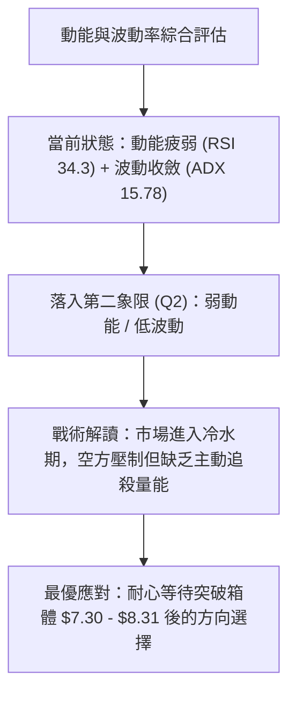

### 📊 ATR 波動率分析

- **當前 ATR(14)**：**$0.51**（佔現價比例 **6.63%**）。
- **波動特性解讀**：ONDS 屬於高 Beta 成長型股票，單日平均真實波幅高達 $0.51。這意味著正常的日內噪音波動即可達到 6% 以上。
- **動態止損空間設定**：
  - **保守型交易者止損距離**：$1.5 \times \text{ATR} = 1.5 \times 0.51 = \mathbf{\$0.77}$。
  - **進取型交易者止損距離**：$2.0 \times \text{ATR} = 2.0 \times 0.51 = \mathbf{\$1.02}$。
  - **止損位驗證**：若以現價 $7.62 建立多頭，保守止損為 $7.62 - $0.77 = **$6.85**（剛好設於布林下軌 $6.97 與 S2 $6.77 之間），能有效避免日內毛刺引發的被動洗盤。

### 📐 Beta 與市場相關性

- **Beta 係數**：**2.736**
- **市場敏感度分析**：Beta 值高達 2.74，表明該股屬於超高彈性標的。當那斯達克或科技板塊上漲 1% 時，該股理論期望波動為 +2.74%；反之大盤回調 1% 時，其承壓跌幅接近 3%。在目前大盤不確定性較高的宏觀背景下，高 Beta 特性放大了下行風險。
- **空頭部位佔比 (Short % of Float)**：高達 **40.6%**（Short Ratio 2.17）。此項極端數據為雙刃劍：一方面印證了機構投資者對其基本面（營業利潤率 -166.3%）極度悲觀；另一方面，一旦價格放量突破阻力位 R1（**$8.31**）或 R2（**$8.58**），極易引發軋空行情（Short Squeeze）。

---

## 7. 多時框架總結

### 📋 時框架評分表

| 時框架 | 趨勢方向 | 動能狀態 | 均線排列 | 圖表形態 | 綜合評分 | 操作建議 |
|--------|----------|----------|----------|----------|:---:|----------|
| **月線 (長期)** | 🟡 中立偏多 | 轉弱回落 | 站上 MA240，跌破 MA20 | 高位射擊之星後深度回調 | **48/100** | 戰略底倉觀察，不加碼 |
| **週線 (中期)** | 🔴 明確偏空 | 死叉下行 | 空頭壓制，跌破 MA200 | $6.53 - $13.22 大寬幅震盪 | **35/100** | 逢反彈減磅，防範破位 |
| **日線 (短期)** | 🔴 弱勢整理 | 負向鈍化 | 受制於 MA20/50 | $7.30 - $8.31 矩形箱體收斂 | **38/100** | 區間高拋低吸，順勢偏空 |

### 🔲 綜合訊號矩陣

```
時框架訊號矩陣表：
┌───────────┬──────────────┬──────────────┬──────────────┬──────────────┐
│ 時框架    │ 均線系統 (MA)│ 震盪指標(RSI)│ 趨勢指標(MACD│ 能量潮 (OBV) │
├───────────┼──────────────┼──────────────┼──────────────┼──────────────┤
│ 長期 (月) │ 🟡 混合中性  │ 🟡 50 水平   │ 🟢 零軸上方  │ 🟡 均線附近  │
│ 中期 (週) │ 🔴 空頭排列  │ 🔴 34 偏弱   │ 🔴 零下死叉  │ 🔴 低於均線  │
│ 短期 (日) │ 🔴 空頭壓制  │ 🟡 34.3 鈍化 │ 🔴 柱狀擴大  │ 🔴 量縮疲軟  │
└───────────┴──────────────┴──────────────┴──────────────┴──────────────┘
```

### ⚖️ 多時框收斂結論

> **唯一方向性定調：【盤整行情主導，整體弱勢偏空，以日線布林區間為準】**

**收斂推理依據（依嚴格要求 14 執行）**：
1. **行情屬性界定**：當前 ADX(14) 讀數僅為 **15.78**（顯著小於 25 的趨勢門檻）。依規則，市場當前不存在可持續的單邊趨勢，屬於典型的「盤整行情」。
2. **時框優先級裁決**：在盤整行情下，交易邏輯應當降維至日線層級，以**日線布林通道（$6.97 - $10.03）與關鍵支撐阻力（S1 $7.30 / R1 $8.31）**作為主要博弈邊界。
3. **主導方向收斂**：雖然長期月線尚存一線生機，但日線與週線的均線、MACD、OBV 均呈現一致性的空頭控盤特徵。因此，最終方向判定為**綜合評分 38/100（弱勢偏空）**，第 8 章交易策略將嚴格依循此評分，**主推逢高反彈做空或破位做空的空頭策略**，絕不兩頭下注。

---

## 8. 交易策略建議

### 🗺️ 策略決策流程圖

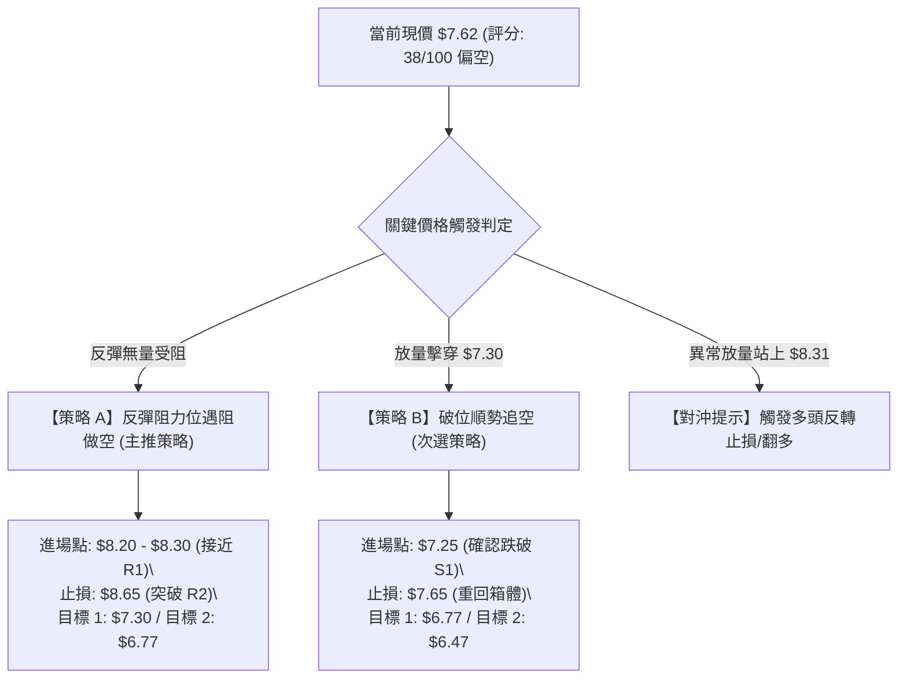

### 🧭 策略路由

- **核心定調**：第 1 章技術評分卡綜合評分為 **38/100 (≤ 40 偏空區間)**。
- **當前主策略方向**：**【逢高做空 / 破位做空 (Bearish Strategy)】**。多頭策略完全降級為反轉風險對沖警示，不作為推薦策略，杜絕多空兩頭下注。

### 🎯 價格情境階梯（Price Scenarios）

價位嚴格引用關鍵價位聚類與斐波那契回調數值：

| 觸發條件 | 第一目標價 | 第二目標價 | 情境市場含義 |
|----------|------------|------------|--------------|
| **向上突破 R1 ($8.31)** | R2 **$8.58** (MA20 阻力) | R3 **$9.92** (牛熊分水嶺) | 短線空頭回補，軋空行情展開，弱勢結構暫時被打破 |
| **維持於現價 ($7.62) 震盪** | S1 **$7.30** (箱體下限) | R1 **$8.31** (箱體上限) | 籌碼沉澱，量能持續萎縮，延續垃圾時間盤整 |
| **向下跌破 S1 ($7.30)** | S2 **$6.77** (前期平台) | S3 **$6.47** (年內前低) | 箱體破位，引發停損賣盤，測試 78.6% 斐波那契線 ($7.16) |

### 📊 情境機率分佈

| 情境劇本 | 發生機率 | 主要量化與技術依據 |
|----------|:---:|--------------------|
| **情境一：弱勢下探或破位再探底** | **55%** | MACD Hist 持續發散 (-0.145)，均線空頭壓制，量比 0.61x 顯示無買盤承接 |
| **情境二：箱體窄幅區間震盪** | **35%** | ADX 僅 15.78，布林通道進入收斂期，空頭亦未投入爆量砸盤 |
| **情境三：放量向上反轉突破** | **10%** | 空頭佔比高達 40.6%，除非出現重磅基本面催化劑，否則技術面概率極低 |

### 🔴 主策略詳情（空頭防守型操作）

所有數值嚴格鎖定於第四章關鍵價位，精確到小數點兩位：

| 策略要素 | 策略 A（精準反彈阻力位高空） | 策略 B（下軌破位順勢追空） |
|----------|------------------------------|----------------------------|
| **策略類型** | 逆短線趨勢 / 順中長期趨勢做空 | 突破順勢追空 |
| **進場條件** | 價格反彈至阻力位 R1 附近，出現小時線滯漲 | 日線收盤價或放量有效摜破支撐位 S1 |
| **進場價格** | **$8.30**（略低於 R1 $8.31） | **$7.25**（跌破 S1 $7.30 確認點） |
| **目標價 T1** | **$7.30**（支撐位 S1，空間 -12.05%） | **$6.77**（支撐位 S2，空間 -6.62%） |
| **目標價 T2** | **$6.77**（強支撐 S2，空間 -18.43%） | **$6.47**（終極支撐 S3，空間 -10.76%）|
| **止損價格** | **$8.65**（突破 R2 $8.58 + 緩衝） | **$7.65**（重返現價平台與 MA5 之上） |
| **風險空間** | $8.65 - $8.30 = $0.35 | $7.65 - $7.25 = $0.40 |
| **報酬空間 (T2)**| $8.30 - $6.77 = $1.53 | $7.25 - $6.47 = $0.78 |
| **風險報酬比** | **1 : 4.37** (極佳) | **1 : 1.95** (合格) |
| **歷史勝率估算**| 60% | 55% |
| **建議配置倉位**| 總交易資金之 **15%** | 總交易資金之 **10%** |

### 🟢 反向風險觸發點（對沖與止損提示）

若持股者或做空者觀察到以下訊號，必須立即無條件平倉空頭部位並切換為觀望模式：
1. **多頭反轉關鍵點**：日線以放量長陽（成交量大於 20 日均量 70.85M 股）有效收復阻力位 R2 **$8.58**（即收復 MA20 布林中軌）。
2. **動能轉向訊號**：MACD 柱狀體由負翻正，且 RSI(14) 突破 50 中軸並維持在上方。
3. **軋空警報**：若股價放量衝過 **$9.52**（MA200），高達 40.6% 的空頭浮額將面臨強平踩踏，必須堅決離場。

### ⭐ 整體訊號強度評星

```
╔═══════════════════════════════════════════════════════╗
║ 做多訊號強度：★☆☆☆☆  (1.5/5 星 - 僅具備超賣反彈可能)  ║
║ 做空訊號強度：★★★★☆  (3.8/5 星 - 順應週日均線空頭壓制)║
║ 整體可信度：  ★★★★☆  (4.0/5 星 - 指標與量價高度共振)  ║
╚═══════════════════════════════════════════════════════╝
```

---

## 9. 風險提示與監控

### ✅ 關鍵監控指標 Checklist

```
╔══════════════════════════════════════════════════════════════════╗
║             ONDS 技術面每日收盤動態監控清單 (Checklist)          ║
╠══════════════════════════════════════════════════════════════════╣
║ [ ] 價格防線監控：收盤價是否跌破支撐 S1 $7.30？                  ║
║ [ ] 斐波那契預警：是否觸及極限回撤位 $7.16？                    ║
║ [ ] 動能翻轉確認：MACD Hist 是否出現縮短信號 (大於 -0.050)？     ║
║ [ ] 均線動態壓制：現價是否挑戰 MA20 ($8.50) 反壓？               ║
║ [ ] 量能異動跟蹤：單日成交量是否突破 7,085 萬股 (量比 > 1.0x)？   ║
║ [ ] 空頭回補指標：Short % of Float (40.6%) 是否顯著下降？        ║
║ [ ] 波動帶寬監控：布林通道帶寬是否開始向外急劇擴張？             ║
╚══════════════════════════════════════════════════════════════════╝
```

### ⚠️ 風險場景分析

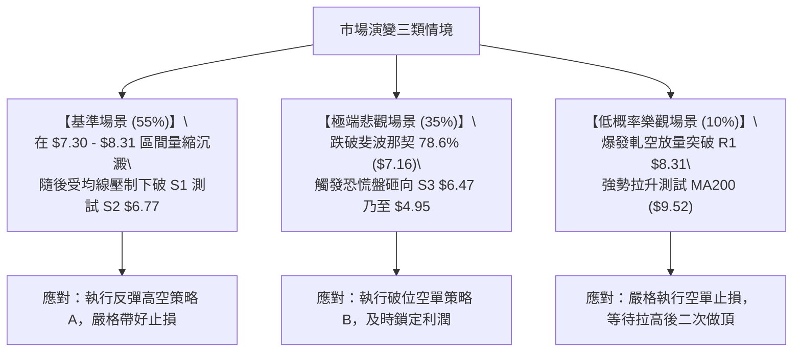

### 🛡️ 風險管理重要提醒

1. **極端波動性風險 (Beta = 2.74 & ATR = $0.51)**：
   ONDS 波動幅度遠超大盤，單日振幅極易超出交易者心理承受範圍。嚴格控制單筆交易風險敞口，**單筆交易最大虧損額度切勿超過總投資組合淨值的 1.5%**。
2. **軋空踩踏風險 (Short Interest = 40.6%)**：
   高度擁擠的做空交易意味著極高的尾部風險。若非專業高頻交易者，嚴禁在 $7.30 - $7.62 等低位區間「盲目追空」；所有空頭單必須以「逢高反彈至阻力位停滯」為先決條件，且止損必須硬性設定，絕不抗單。
3. **流動性與倉位控管**：
   目前成交量處於 4,311 萬股低位，量比 0.61x 代表盤面厚度下降。大資金進出容易產生滑點，建議分批以限價單（Limit Order）進場，單一帳戶在該標的上的總曝險比例不宜超過總資產的 15%。

---

## 📋 報告總結

```
╔══════════════════════════════════════════════════════════════════╗
║                     ONDS 技術分析報告總結                        ║
╠══════════════════════════════════════════════════════════════════╣
║ 報告日期：2026-09-07                                             ║
║ 當前價格：$7.62                                                  ║
║ 分析評級：🔴 弱勢盤整偏空 (綜合評分: 38/100)                     ║
║                                                                  ║
║ 核心結構結論：                                                   ║
║ ├─ 長期趨勢：🟡 中立偏多 (受 52W 高點回撤壓制，位於 78.6% 回撤位)║
║ ├─ 中期趨勢：🔴 明確偏空 (受制於 MA200 $9.52 與週線死叉)         ║
║ ├─ 短期趨勢：🔴 弱勢箱體整理 (ADX=15.78, 區間 $7.30 - $8.31)    ║
║ ├─ 關鍵支撐：S1: $7.30  |  S2: $6.77  |  S3: $6.47              ║
║ ├─ 關鍵阻力：R1: $8.31  |  R2: $8.58  |  R3: $9.92              ║
║ └─ 華爾街目標：均價 $19.42 (低 $13.00 / 高 $25.00，基本面嚴重分歧)║
║                                                                  ║
║ 最優執行策略組合：                                               ║
║ 1. 🥇 最佳機會：等待反彈至 R1 $8.30 附近受阻時做空 (風報比 1:4.37)║
║ 2. 🥈 次選機會：實體破位 S1 $7.30 後順勢追空至 S2 $6.77          ║
║ 3. 🥉 保守選擇：空倉觀望，等待日線有效站穩 MA20 ($8.50) 再行評估║
╚══════════════════════════════════════════════════════════════════╝
```

---

> ⚠️ **免責聲明**：本報告為技術分析研究，所有數據及估算均基於歷史量價資訊（Yahoo Finance）。本報告**僅供研究與學術參考**，**不構成任何形式的證券買賣投資建議**。投資股票具有極高風險，特別是高 Beta 與高空頭佔比標的，入市前請務必獨立評估財務狀況並嚴格落實風控紀律。

---

*報告生成時間：2026-09-07 ｜ 數據來源：Yahoo Finance ｜ 分析框架：多時框架量化技術體系*